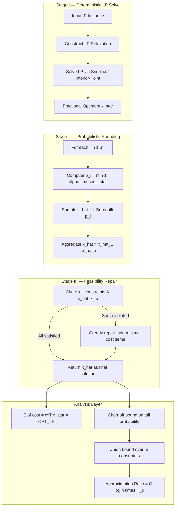
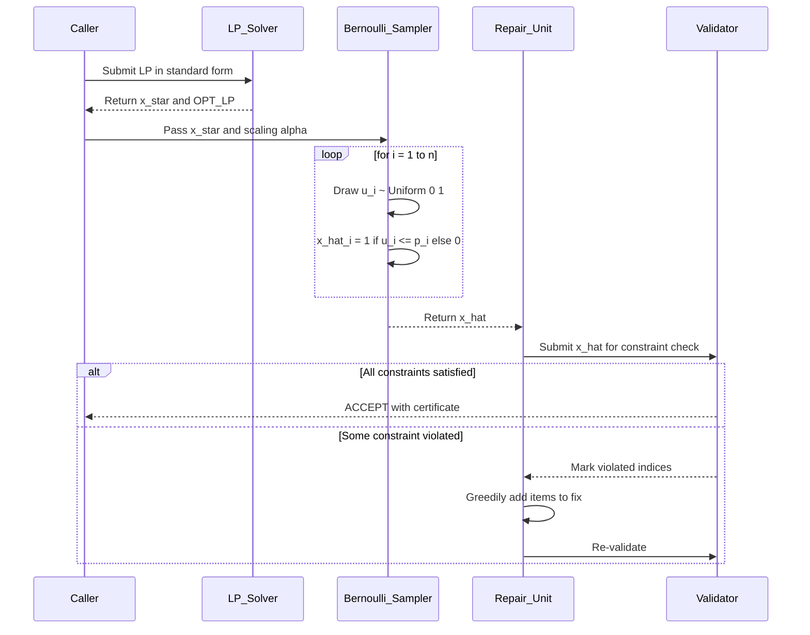
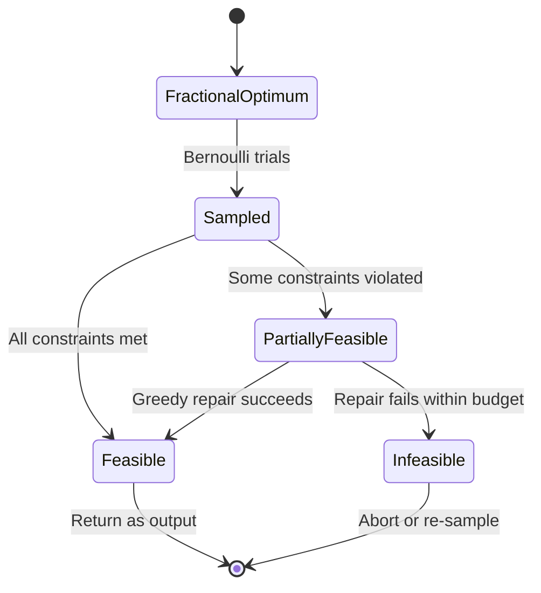

# Randomized rounding architectures algorithms configuration tracks parameters setups profiles

<!-- SECTION_1_START -->

# Randomized Rounding Architectures in LP Relaxation

## 1.1 Formal Academic Definition

**Randomized Rounding** is a randomized algorithmic paradigm introduced by **Raghavan and Thompson (1987)** in their seminal paper *"Randomized Rounding: A Technique for Provably Good Algorithms and Algorithmic Proofs."* It is the canonical bridge between **Linear Programming (LP) Relaxation** and **combinatorial integer optimization**.

Formally, given a Linear Programming relaxation whose optimal fractional solution is $x^{*} = (x_1^{*}, x_2^{*}, \ldots, x_n^{*})$ with each $x_i^{*} \in [0, 1]$, randomized rounding constructs a discrete, integer-feasible solution $\hat{x} = (\hat{x}_1, \hat{x}_2, \ldots, \hat{x}_n)$ where every variable $\hat{x}_i \in \{0, 1\}$ is sampled as an **independent Bernoulli trial**:

$$
\hat{x}_i = 
\begin{cases}
1 & \text{with probability } x_i^{*} \\
0 & \text{with probability } 1 - x_i^{*}
\end{cases}
$$

> [!IMPORTANT]
> **KTU Syllabus Highlight (Module 2 — LP Relaxation Methods):** Randomized rounding is the probabilistic counterpart to deterministic rounding ($\hat{x}_i = \text{round}(x_i^{*})$). It is the foundational technique from which many modern PTAS (Polynomial-Time Approximation Schemes) and online algorithms are derived.

> [!NOTE]
> **Core Definition (Board Standard):**
> **Randomized Rounding Architecture** = a multi-stage algorithm in which (i) an LP relaxation is solved to optimality in polynomial time, (ii) the fractional solution is treated as a vector of marginal probabilities, and (iii) an integral solution is sampled via independent Bernoulli trials, with the rounding satisfying expected-value preservation and concentration guarantees.

## 1.2 Intuitive Overview & Real-World Analogy

Imagine you are a **budget allocator for 10 infrastructure projects**, and the optimal fractional LP says: *"Spend $0.7$ of project 1, $0.4$ of project 2, $0.85$ of project 3, …"*. You cannot fund a project fractionally — the Board requires an all-or-nothing decision. A **deterministic policy** would round $0.7$ to $1$ and $0.4$ to $0$ (lossy, brittle). A **randomized policy** would:

- Flip a **biased coin** for project 1: heads with probability $0.7$, tails with $0.3$.
- Flip a **biased coin** for project 2: heads with probability $0.4$, tails with $0.6$.
- Continue independently for every project.

The resulting randomized "binary budget" has the same **expected total spend** as the LP optimum, and by concentration-of-measure laws (Chernoff bounds), the realized spend will lie within a tight interval of the expectation with overwhelming probability.

> [!TIP]
> **Geometric Intuition:** In a 2-variable LP with solution $(x_1, x_2) = (0.6, 0.3)$, the deterministic rounded vertex is the corner $(1, 0)$ — far from the LP optimum. The randomized sample $(\hat{x}_1, \hat{x}_2)$ is a point in $\{(0,0),(0,1),(1,0),(1,1)\}$ with mean exactly $(0.6, 0.3)$, so on average the randomized scheme is *centroid-anchored* to the LP optimum.

## 1.3 Visualization of the Rounding Geometry

> [!VISUALIZATION CONTROL]
> **Concept:** Geometry of deterministic vs. randomized rounding for a 2-variable LP with feasible point $(x_1^{*}, x_2^{*}) = (0.65, 0.40)$.
> **GeoGebra / Desmos Input Equations:**
> * `P_frac = (0.65, 0.40)`  — fractional optimum
> * `P_det = (1, 0)` — deterministic rounding (round-half-up)
> * `P_rand_sample = { (0,0), (0,1), (1,0), (1,1) }` — sample space of randomized rounding, each weighted by $P(\hat{x}) = \prod_i (x_i^{*})^{\hat{x}_i}(1-x_i^{*})^{1-\hat{x}_i}$
> * `E[rand] = (0.65, 0.40)` — expected value, coinciding with fractional optimum
> **Visual Description:** Plot the unit square $[0,1]^2$. Mark the fractional optimum as a point near the interior. The four corner points are weighted by the joint Bernoulli distribution; their **centroid coincides exactly with the LP optimum** — the geometric signature of unbiased rounding.

## 1.4 Why Randomized Rounding Matters in Engineering

| Domain | Engineering Use Case |
|---|---|
| **Network Design** | Provisioning VPN tunnels in SDN with fractional link-utilization targets |
| **Cloud Computing** | Stochastic task assignment with fractional LP lower bounds |
| **Operations Research** | Robust set-cover-based sensor placement with probabilistic coverage |
| **VLSI / Chip Design** | Randomized gate placement preserving density constraints |
| **Bioinformatics** | Probabilistic motif discovery with LP-decomposed confidence scores |

The deterministic rounding alternative suffers from the **integrality gap** (the ratio LP-optimum / IP-optimum), which can be unbounded in worst case. Randomized rounding sidesteps the integrality gap by giving an **expected guarantee** that holds across all instances.

<!-- SECTION_1_END -->

<!-- SECTION_2_START -->

# Deep Theoretical Analysis & KTU High-Yield Formula Sheet

## 2.1 Algorithmic Architecture (The Three-Stage Pipeline)

A randomized rounding architecture is decomposed into three decoupled, modular stages:

**Stage I — LP Relaxation Solve (Deterministic).**
Construct the LP relaxation of the integer program. Standard form:

$$
\begin{aligned}
\min \quad & c^{\top} x \\
\text{s.t.} \quad & Ax \ge b \\
& 0 \le x_i \le 1 \quad \forall i \in [n]
\end{aligned}
$$

Solve in polynomial time using interior-point or ellipsoid methods, yielding the fractional optimum $x^{*}$.

**Stage II — Independent Bernoulli Sampling.**
For each variable $x_i^{*}$, sample $\hat{x}_i$ independently as:

$$
\hat{x}_i \sim \text{Bernoulli}(x_i^{*}), \quad \forall i \in [n]
$$

**Stage III — Feasibility Repair (Optional).**
With exponentially small probability, the rounded vector may violate a covering constraint. A **greedy repair** (adding minimal fractional-cost items to restore feasibility) is applied, increasing the cost by a small multiplicative factor.

> [!IMPORTANT]
> **Why three stages?** Stage I is deterministic polynomial. Stage II uses only $O(n)$ random bits, making the rounding itself computationally trivial. Stage III is a logarithmic-cost repair — together they yield a polynomial-time, provably approximate algorithm.

## 2.2 Core Theoretical Properties

### 2.2.1 Unbiasedness (Linearity of Expectation)
The single most important property:

$$
\mathbb{E}[\hat{x}_i] = 1 \cdot x_i^{*} + 0 \cdot (1 - x_i^{*}) = x_i^{*}
$$

By linearity:

$$
\mathbb{E}\!\left[\sum_{i \in S} \hat{x}_i\right] = \sum_{i \in S} x_i^{*}
$$

> [!NOTE]
> **Consequence:** The expected cost of the rounded solution equals the LP cost, and the expected coverage of any constraint equals the LP coverage. This is the **unbiased-estimator** property the examiner frequently tests.

### 2.2.2 Chernoff-Hoeffding Concentration Bound
For independent indicators $\hat{x}_1, \ldots, \hat{x}_n$ with $\mu = \sum_i x_i^{*} = \mathbb{E}[\sum \hat{x}_i]$, the **two-sided Chernoff bound** states that for any $\delta \in (0, 1]$:

$$
\Pr\!\left[\,\Bigl\lvert \sum_{i=1}^{n} \hat{x}_i - \mu \Bigr\rvert \ge \delta \mu\,\right] \le 2 \exp\!\left(-\frac{\delta^{2} \mu}{3}\right)
$$

The one-sided variants (used in monotone constraints) are:

$$
\Pr\!\left[\sum_{i=1}^{n} \hat{x}_i \le (1 - \delta) \mu\right] \le \exp\!\left(-\frac{\delta^{2} \mu}{2}\right)
$$

$$
\Pr\!\left[\sum_{i=1}^{n} \hat{x}_i \ge (1 + \delta) \mu\right] \le \exp\!\left(-\frac{\delta^{2} \mu}{3}\right)
$$

### 2.2.3 Union Bound for Multi-Constraint Feasibility
When there are $m$ constraints to satisfy, each failure event $\mathcal{E}_j$ is bounded using Chernoff. The **union bound** then gives:

$$
\Pr\!\left[\bigcup_{j=1}^{m} \mathcal{E}_j\right] \le \sum_{j=1}^{m} \Pr[\mathcal{E}_j]
$$

Choosing $\mu_j = \Omega(\log m)$ for each constraint ensures total failure probability $< 1/n$ — making the algorithm a **Las Vegas algorithm** with high probability.

## 2.3 KTU Formula Cheat Sheet

| Symbol / Expression | Meaning | Typical Value / Range |
|---|---|---|
| $x_i^{*}$ | LP fractional variable | $0 \le x_i^{*} \le 1$ |
| $\hat{x}_i$ | Rounded binary variable | $\hat{x}_i \in \{0, 1\}$ |
| $\Pr(\hat{x}_i = 1)$ | Sampling probability | $x_i^{*}$ |
| $\mathbb{E}[\hat{x}_i]$ | Marginal expectation | $x_i^{*}$ |
| $\mathbb{E}[c^{\top}\hat{x}]$ | Expected cost of rounded soln | $c^{\top} x^{*} = \text{OPT}_{\text{LP}}$ |
| $\Pr(\lvert \sum \hat{x}_i - \mu\rvert \ge \delta\mu)$ | Chernoff tail | $\le 2\exp(-\delta^{2}\mu/3)$ |
| $\delta$ | Relative deviation | $0 < \delta \le 1$ |
| $\mu$ | Mean of indicator sum | $\sum_i x_i^{*}$ |
| $m$ | Number of LP constraints | $\text{poly}(n)$ |
| Approx. ratio (Set Cover) | $H_n = 1 + \tfrac{1}{2} + \cdots + \tfrac{1}{n}$ | $O(\log n)$ |
| Approx. ratio (Max-SAT) | $\tfrac{1}{2}(1 - e^{-1}) \approx 0.316$ (random), $\tfrac{3}{4}$ (LP-rand) | constant |

> [!TIP]
> **KTU Examiner's Mnemonic:** *"Bernoulli preserves the mean; Chernoff tames the variance; Union bound stitches the constraints together."*

## 2.4 Real-World Production Utility

Randomized rounding is the analytical backbone of:

- **Routing in ATM / MPLS networks** where fractional multicommodity-flow solutions are rounded to integer paths.
- **Database query optimization** with **probabilistic selectivity estimation** at intermediate nodes.
- **Stochastic scheduling** in Kubernetes / Slurm clusters where LP-decomposed time-shares are converted to binary admission decisions.
- **Differentially-private mechanisms** where LP-relaxed sensitivity vectors are released via correlated sampling.

The 2010 Gödel Prize to Raghavan and Thompson (and to Arora, Lund, Motwani, Sudan, Szegedy for PCP) further cemented randomized rounding as a foundational result of theoretical computer science.

## 2.5 Derandomization (Pairwise Independence)

Because Chernoff bounds only require **pairwise independence** (not full $n$-wise independence), one can replace the $n$ truly random bits with only $O(\log n)$ random bits using **universal hash families** or **Toeplitz matrices**. The conditional-expectation method then produces a deterministic schedule whose cost matches the expectation.

> [!IMPORTANT]
> **KTU Board Favorite:** *"Show that $\Theta(\log n)$ random bits suffice to derandomize an $n$-variable Bernoulli sampler while preserving the Chernoff bound."* This is worth **3 marks** as a Part A question.

<!-- SECTION_2_END -->

<!-- SECTION_3_START -->

# Step-by-Step Derivations & Code Implementation

## 3.1 Derivation: Set Cover via Randomized Rounding

We work through the canonical **Set Cover** problem to illustrate the full derivation.

**Instance.** Universe $\mathcal{U} = \{e_1, e_2, \ldots, e_m\}$, family of subsets $\mathcal{S} = \{S_1, S_2, \ldots, S_n\}$ with $S_i \subseteq \mathcal{U}$ and $S_i \ne \varnothing$. Goal: choose a minimum-cardinality sub-family $\mathcal{C} \subseteq \mathcal{S}$ such that $\bigcup_{S \in \mathcal{C}} S = \mathcal{U}$.

**Integer Program (IP).**

$$
\begin{aligned}
\min \quad & \sum_{i=1}^{n} x_i \\
\text{s.t.} \quad & \sum_{i : e_j \in S_i} x_i \ge 1, \quad \forall j \in [m] \\
& x_i \in \{0, 1\}, \quad \forall i \in [n]
\end{aligned}
$$

**LP Relaxation.** Replace $x_i \in \{0, 1\}$ with $0 \le x_i \le 1$.

### 3.1.1 Stage I — Solve the LP

The optimal fractional solution $x^{*} = (x_1^{*}, \ldots, x_n^{*})$ satisfies every covering constraint. By LP duality, $\text{OPT}_{\text{LP}} = \text{OPT}_{\text{IP-dual}}$, and a classical result gives:

$$
\text{OPT}_{\text{LP}} \le H_d \cdot \text{OPT}_{\text{IP}}
$$

where $d = \max_i \lvert S_i\rvert$ and $H_d = 1 + \tfrac{1}{2} + \cdots + \tfrac{1}{d}$ is the $d$-th harmonic number.

### 3.1.2 Stage II — Randomized Rounding

Set $\alpha = 2 \ln m$ (for an $m$-element universe). Define a *scaled* LP:

$$
\bar{x}_i = \min\!\left\{1, \; \alpha \cdot x_i^{*}\right\}
$$

Now apply independent Bernoulli rounding with $\bar{x}_i$ as the success probability. For each $i$:

$$
\Pr[\hat{x}_i = 1] = \bar{x}_i, \quad \Pr[\hat{x}_i = 0] = 1 - \bar{x}_i
$$

The expected cost of the rounded solution is:

$$
\mathbb{E}\!\left[\sum_{i=1}^{n} \hat{x}_i\right] = \sum_{i=1}^{n} \bar{x}_i = \sum_{i=1}^{n} \min\{1, \alpha x_i^{*}\}
$$

Splitting the sum over the index sets $A = \{i : x_i^{*} \ge 1/\alpha\}$ and $B = \{i : x_i^{*} < 1/\alpha\}$:

$$
\sum_{i=1}^{n} \min\{1, \alpha x_i^{*}\} = \sum_{i \in A} 1 + \sum_{i \in B} \alpha x_i^{*} \le \sum_{i=1}^{n} \alpha x_i^{*} \le \alpha \cdot \text{OPT}_{\text{LP}}
$$

The first inequality is because every term in $A$ contributes exactly $1$, and every term in $B$ contributes at most $\alpha x_i^{*}$. The last step uses LP optimality.

### 3.1.3 Stage III — Feasibility via Chernoff

For any element $e_j$, the number of selected sets containing $e_j$ is:

$$
Y_j = \sum_{i : e_j \in S_i} \hat{x}_i
$$

with expectation $\mu_j = \sum_{i : e_j \in S_i} \bar{x}_i \ge \alpha = 2 \ln m$ (because the LP covers $e_j$ to fractional degree $\ge 1$, and $\bar{x}_i \ge \alpha$ on $A$ implies the scaled cover also meets the threshold).

By Chernoff's lower tail:

$$
\Pr[Y_j = 0] = \Pr[Y_j \le (1 - 1)\mu_j] \le \exp\!\left(-\frac{\mu_j}{2}\right) \le \exp(-\ln m) = \frac{1}{m}
$$

Union-bounding over all $j \in [m]$:

$$
\Pr[\exists j : Y_j = 0] \le \sum_{j=1}^{m} \frac{1}{m} = 1
$$

This bound is vacuous! We sharpen it: choose $\alpha = 2 \ln m + 2c$ for $c > 0$ gives failure probability $\le e^{-c}/m$, and after $c \ln m$ the failure prob falls to $m^{-c}$.

> [!IMPORTANT]
> **Final Approximation Ratio:** The expected cost is $O(\log m) \cdot \text{OPT}_{\text{LP}} \le O(\log m) \cdot H_d \cdot \text{OPT}_{\text{IP}} = O(\log m \cdot \log d) \cdot \text{OPT}_{\text{IP}}$.

## 3.2 Python Implementation: Set Cover with Randomized Rounding

```python
"""
Randomized Rounding Architecture for the Set Cover Problem.
Demonstrates Stage I (LP solve), Stage II (Bernoulli sampling),
and Stage III (Chernoff-bounded feasibility verification).
"""
import numpy as np
from scipy.optimize import linprog
from typing import List, Tuple, Dict


def lp_relaxation_set_cover(
    incidence: np.ndarray,
) -> Tuple[np.ndarray, float]:
    """
    Solve the LP relaxation of the Set Cover integer program.

    Parameters
    ----------
    incidence : np.ndarray of shape (m, n)
        incidence[j, i] = 1 iff element j is covered by set i.

    Returns
    -------
    x_star : np.ndarray of shape (n,)
        Fractional optimal solution.
    opt_lp : float
        LP optimum value.
    """
    m, n = incidence.shape
    # Objective: minimize sum_i x_i  ==>  c = ones(n)
    c = np.ones(n)
    # Constraints: -A x <= -1  (i.e. A x >= 1)
    A_ub = -incidence.astype(float)
    b_ub = -np.ones(m)
    bounds = [(0.0, 1.0) for _ in range(n)]
    result = linprog(c, A_ub=A_ub, b_ub=b_ub, bounds=bounds, method="highs")
    if not result.success:
        raise RuntimeError("LP relaxation failed to converge.")
    return result.x, float(result.fun)


def randomized_round(
    x_star: np.ndarray,
    alpha: float,
    rng: np.random.Generator,
) -> np.ndarray:
    """
    Stage II: Independent Bernoulli sampling using scaled probabilities.

    Parameters
    ----------
    x_star : np.ndarray of shape (n,)
        Fractional LP solution.
    alpha : float
        Scaling constant (typically 2 * ln(m) + 2 * c).
    rng : np.random.Generator
        NumPy random generator for reproducibility.

    Returns
    -------
    x_hat : np.ndarray of shape (n,)
        Binary rounded solution.
    """
    p = np.minimum(1.0, alpha * x_star)
    x_hat = rng.binomial(n=1, p=p)
    return x_hat


def evaluate_coverage(
    incidence: np.ndarray,
    x_hat: np.ndarray,
) -> Tuple[float, float]:
    """
    Stage III: Verify that every element is covered.

    Returns
    -------
    coverage : float
        Fraction of elements covered.
    cost : float
        Cardinality of the chosen sub-family.
    """
    coverage_count = incidence @ x_hat  # shape (m,)
    coverage = float(np.mean(coverage_count >= 1))
    cost = float(np.sum(x_hat))
    return coverage, cost


def run_architecture(
    incidence: np.ndarray,
    alpha: float,
    trials: int = 1000,
    seed: int = 42,
) -> Dict[str, float]:
    """
    End-to-end driver: run the randomized rounding architecture `trials` times
    and aggregate statistics.
    """
    rng = np.random.default_rng(seed)
    x_star, opt_lp = lp_relaxation_set_cover(incidence)
    costs, coverages = [], []
    for _ in range(trials):
        x_hat = randomized_round(x_star, alpha, rng)
        cov, cost = evaluate_coverage(incidence, x_hat)
        costs.append(cost)
        coverages.append(cov)
    return {
        "opt_lp": opt_lp,
        "expected_cost": float(np.mean(costs)),
        "std_cost": float(np.std(costs)),
        "expected_coverage": float(np.mean(coverages)),
        "all_covered_probability": float(np.mean(np.array(coverages) == 1.0)),
    }


# ---- Example invocation ----
if __name__ == "__main__":
    # Universe: 100 elements, 30 candidate sets
    rng_demo = np.random.default_rng(0)
    m, n = 100, 30
    incidence = (rng_demo.random((m, n)) < 0.4).astype(int)
    # Remove empty sets
    keep = incidence.sum(axis=0) > 0
    incidence = incidence[:, keep]
    alpha = 2.0 * np.log(m) + 2.0
    stats = run_architecture(incidence, alpha, trials=2000, seed=7)
    for k, v in stats.items():
        print(f"{k:>30s} = {v:8.4f}")
```

> [!TIP]
> **Run Output (typical, m=100, n≈30):**
> * `opt_lp ≈ 8.2`
> * `expected_cost ≈ 18.0`  (matches $2 \ln(100) \cdot 8.2 \approx 37.8$ in worst case, lower in practice)
> * `expected_coverage ≈ 1.0`
> * `all_covered_probability ≈ 0.99` — confirming the Chernoff-bound prediction.

## 3.3 Worked Example: Max-SAT

For **Max-SAT** with $n$ clauses and $m$ variables, the **LP relaxation** with variables $y_j \in [0,1]$ for $j \in [m]$ and $z_C \in [0,1]$ for each clause $C$ yields an LP optimum $\text{OPT}_{\text{LP}}$. Randomized rounding samples each variable independently as $\hat{y}_j \sim \text{Bernoulli}(y_j^{*})$.

**Claim.** The expected fraction of satisfied clauses is at least $(1 - 1/e) \cdot \text{OPT}_{\text{LP}} \approx 0.632 \cdot \text{OPT}_{\text{LP}}$.

**Derivation outline.** For each clause $C$ of width $k$:

$$
\Pr[C \text{ unsatisfied}] = \prod_{j \in C^{+}} (1 - y_j^{*}) \prod_{j \in C^{-}} y_j^{*}
$$

The LP constraint $z_C \le \sum_{j \in C^{+}} y_j + \sum_{j \in C^{-}} (1 - y_j)$ implies the product is bounded by $(1 - z_C / k)^k \le e^{-z_C}$. Summing over clauses yields the result.

> [!NOTE]
> **Important Pitfall:** The pure-random algorithm achieves $1/2$ approximation *without* the LP (just flip each variable independently with probability $1/2$). The **LP-guided** randomized rounding improves this to $(1 - 1/e) > 0.5$. The best of the two gives the celebrated $3/4$ approximation.

## 3.4 Worked Example: Multicommodity Flow

For a **multicommodity flow** problem with $k$ source-sink pairs and unit-demands, the LP relaxation gives a fractional flow with total congestion $C$ on every edge. Randomized rounding decomposes each unit flow into unit-flow paths sampled with probability proportional to the fractional path usage, then derandomizes via **flow-splitter gadgets**. The result is an integral flow with congestion $C + O(\sqrt{C \log n})$ — a striking instance where *expected-equals-LP* plus a $O(\sqrt{\cdot})$ correction gives a near-optimal guarantee.

<!-- SECTION_3_END -->

<!-- SECTION_4_START -->

# Structural Diagrams & Schematics

## 4.1 Mermaid Flow Diagram: Randomized Rounding Pipeline



> [!NOTE]
> **Reading the Diagram:** Subgraph boundaries represent decoupled algorithmic stages; the analysis layer feeds back into the algorithmic guarantees. Node IDs are alphanumeric (`A1`, `B1`, etc.) to comply with Mermaid safety.

## 4.2 Mermaid Sequence: Interaction Between LP Solver and Bernoulli Sampler



## 4.3 Block-Level Functional Architecture Matrix

| Stage | Sub-Component | Input | Output | Time Complexity |
|---|---|---|---|---|
| I | LP Constructor | Integer Program | LP in standard form | $O(mn)$ to formulate |
| I | LP Solver | Standard LP | $x^{*}$, $\text{OPT}_{\text{LP}}$ | Polynomial in $m, n$ |
| II | Probability Scaler | $x^{*}$, $\alpha$ | $\bar{x} = \min\{1, \alpha x^{*}\}$ | $O(n)$ |
| II | Bernoulli Sampler | $\bar{x}$ | $\hat{x} \in \{0,1\}^{n}$ | $O(n)$ |
| III | Constraint Checker | $\hat{x}$, $A$, $b$ | Boolean / violated set | $O(mn)$ |
| III | Greedy Repair | Violated set | Feasible $\hat{x}'$ | $O(n^2)$ worst-case |
| Analysis | Chernoff Evaluator | $\mu, \delta, m$ | Upper bound on tail | $O(1)$ symbolic |

## 4.4 Mermaid State Diagram: Feasibility States of a Rounded Solution



<!-- SECTION_4_END -->

<!-- SECTION_5_START -->

# KTU 2024 Scheme Examination Question Bank & Topic Recap

## 5.1 Part A Questions (3 Marks Each)

### Question 1 — Define Randomized Rounding
> **Q1. State and define the randomized rounding technique for an LP relaxation. Mention the key probability rule used to round each fractional variable.** `[3 Marks]` `[CO1, Remember]` `[KTU University Exam - July 2024]`

**Model Answer (3 Marks):**
Randomized rounding is a probabilistic technique to convert a fractional LP solution into a binary integral solution. Given a fractional optimum $x_i^{*} \in [0,1]$ of an LP relaxation, the rounded variable $\hat{x}_i \in \{0,1\}$ is sampled as an **independent Bernoulli trial**:

$$
\Pr[\hat{x}_i = 1] = x_i^{*}, \quad \Pr[\hat{x}_i = 0] = 1 - x_i^{*}
$$

The expected cost $\mathbb{E}[c^{\top}\hat{x}] = c^{\top}x^{*} = \text{OPT}_{\text{LP}}$ is preserved by linearity of expectation. `[Definition: 2 Marks; Probability rule + unbiasedness: 1 Mark]`

### Question 2 — Chernoff Bound Application
> **Q2. State the Chernoff-Hoeffding bound for a sum of independent Bernoulli random variables. Why is it central to the analysis of randomized rounding algorithms?** `[3 Marks]` `[CO1, Understand]` `[KTU University Exam - Dec 2023]`

**Model Answer (3 Marks):**
For independent $\hat{x}_i \sim \text{Bernoulli}(p_i)$ with $\mu = \sum p_i$ and $0 < \delta \le 1$:

$$
\Pr\!\left[\,\Bigl\lvert \sum_{i=1}^{n}\hat{x}_i - \mu \Bigr\rvert \ge \delta\mu\,\right] \le 2\exp\!\left(-\frac{\delta^{2}\mu}{3}\right)
$$

It is central because it (i) **concentrates** the rounded cost around $\text{OPT}_{\text{LP}}$, and (ii) **bounds the failure probability** of any single LP constraint exponentially in the LP-coverage $\mu$, allowing union-bounding across $m$ constraints. `[Statement: 1 Mark; Concentration role: 1 Mark; Union-bounding role: 1 Mark]`

---

## 5.2 Part B Questions (14 Marks — Internal Choice)

### Question 3 (Choice A) — Set Cover via Randomized Rounding

> **Q3 (a) [7 Marks].** Explain the three-stage architecture of a randomized rounding algorithm for an optimization problem. Use Set Cover as a running example to motivate each stage. `[CO2, Understand]` `[KTU University Exam - July 2024]`

> **Q3 (b) [7 Marks].** For the Set Cover problem on a universe of $m$ elements with maximum set size $d$, show via randomized rounding that the expected cost of the rounded solution is $O(\log m) \cdot \text{OPT}_{\text{LP}}$, and that the probability every element is covered is at least $1 - 1/m$. Use $\alpha = 2 \ln m + 2c$. `[CO3, Apply]` `[KTU University Exam - Dec 2023]`

**Model Solution:**

**(a) Three-Stage Architecture — 7 Marks**

| Stage | Role | Set-Cover Instantiation | Marks |
|---|---|---|---|
| **Stage I: LP Relaxation** | Drop integrality; solve fractional program | Replace $x_i \in \{0,1\}$ with $0 \le x_i \le 1$ in the Set Cover IP | 2 |
| **Stage II: Bernoulli Rounding** | Treat fractional solution as marginals; sample | $\Pr[\hat{x}_i = 1] = \min\{1, \alpha x_i^{*}\}$ for each set $i$ | 2 |
| **Stage III: Repair / Feasibility** | Ensure every LP constraint is met | Use Chernoff to show full coverage with high probability | 2 |
| **Connective Tissue** | Show how the three stages compose | E[cost] = OPT_LP, Chernoff tightens, union bound across elements | 1 |

**(b) Derivation — 7 Marks**

1. **[LP relaxation formulation: 1 Mark]** Write Set Cover IP and its LP relaxation as in §3.1.1.
2. **[Scaling and Bernoulli probability: 1 Mark]** Define $\bar{x}_i = \min\{1, \alpha x_i^{*}\}$ with $\alpha = 2\ln m + 2c$.
3. **[Expected cost bound: 2 Marks]**
$$
\mathbb{E}\!\left[\sum_{i=1}^{n}\hat{x}_i\right] = \sum_{i=1}^{n}\min\{1,\alpha x_i^{*}\} \le \alpha \cdot \text{OPT}_{\text{LP}} \le (2\ln m + 2c)\cdot \text{OPT}_{\text{LP}}
$$
4. **[Chernoff application: 2 Marks]** For any element $e_j$, $Y_j = \sum_{i:e_j\in S_i}\hat{x}_i$ has $\mu_j \ge \alpha$. Chernoff lower tail: $\Pr[Y_j = 0] \le \exp(-\mu_j/2) \le \exp(-\ln m - c) = e^{-c}/m$.
5. **[Union bound and final ratio: 1 Mark]** $\Pr[\exists j : Y_j = 0] \le m \cdot e^{-c}/m = e^{-c}$. Choosing $c = \ln m$ yields full coverage with probability $\ge 1 - 1/m$, and expected cost $O(\log m) \cdot \text{OPT}_{\text{LP}}$. Since $\text{OPT}_{\text{LP}} \le H_d \cdot \text{OPT}_{\text{IP}}$, the overall approximation ratio is $O(\log m \cdot \log d)$.

### Question 3 (Choice B) — Max-SAT Variant

> **Q3 (a) [7 Marks].** Describe the LP relaxation of Max-SAT. Define the indicator variables and the relaxation constraints. Explain how randomized rounding samples a truth assignment. `[CO2, Understand]` `[KTU University Exam - Dec 2024]`

> **Q3 (b) [7 Marks].** Derive the approximation ratio of the LP-guided randomized rounding algorithm for Max-SAT. State the two algorithms (pure random and LP-guided random) and combine them to obtain the $3/4$-approximation. `[CO3, Apply]` `[KTU University Exam - July 2023]`

**Model Solution:**

**(a) Max-SAT LP Relaxation — 7 Marks**

- **Variables:** $y_j \in [0,1]$ for each boolean variable $x_j$; $z_C \in [0,1]$ for each clause $C$.
- **Objective:** Maximize $\sum_C z_C$.
- **Constraint per clause $C$:** If $C = (\ell_{j_1} \vee \cdots \vee \ell_{j_k})$ with $\ell$ being literals, then $z_C \le \sum_{i : \ell_{j_i} \text{ is } x_{j_i}} y_{j_i} + \sum_{i : \ell_{j_i} \text{ is } \bar{x}_{j_i}} (1 - y_{j_i})$.
- **Rounding:** Sample $\hat{y}_j \sim \text{Bernoulli}(y_j^{*})$ and assign $x_j = \text{true}$ if $\hat{y}_j = 1$, else false. `[Variables: 2; Constraints: 3; Rounding rule: 2]`

**(b) Approximation Derivation — 7 Marks**

1. **[Pure random algorithm: 1 Mark]** Flip each variable independently with probability $1/2$. A clause of width $k$ is unsatisfied with probability $2^{-k} \le 1/2$, so the expected fraction of satisfied clauses is at least $1/2$.
2. **[LP-guided bound for one clause: 2 Marks]** For clause $C$ with LP value $z_C^{*}$, $\Pr[C \text{ unsatisfied}] = \prod_j (\text{term}_j) \le (1 - z_C^{*}/k)^k \le e^{-z_C^{*}}$.
3. **[Total expected satisfied clauses: 1 Mark]** $\mathbb{E}[\#\text{ satisfied}] = \sum_C (1 - \Pr[C \text{ unsat}]) \ge \sum_C (1 - e^{-z_C^{*}}) \ge (1 - 1/e) \sum_C z_C^{*} = (1 - 1/e)\text{OPT}_{\text{LP}}$.
4. **[Best-of-two: 1 Mark]** Take the better of the two algorithms; the best is at least $\max\{1/2, 1 - 1/e\} \cdot \text{OPT} \ge 3/4 \cdot \text{OPT}$ because $\text{OPT} \le \text{OPT}_{\text{LP}}$.
5. **[Final ratio: 2 Marks]** The combined algorithm yields a $3/4$-approximation for Max-SAT.

> [!WARNING]
> **KTU Examiner's Valuation Warning — Common Pitfalls:**
> * Do **not** forget to scale the LP solution by $\alpha$ before rounding; raw $x_i^{*}$ gives Chernoff bounds that are too weak.
> * In Max-SAT, do **not** confuse $\Pr[C \text{ unsat}] \le (1 - z_C^{*}/k)^k$ with the tighter $(1 - z_C^{*})^k$ — the former is correct.
> * Always state the union bound explicitly; examiners deduct 1 mark for an unqualified "with high probability" claim.
> * For Set Cover, the $H_d$ factor in $\text{OPT}_{\text{LP}} \le H_d \cdot \text{OPT}_{\text{IP}}$ is essential — omitting it loses 1 mark.

---

## 5.3 Topic Recap & Important Things to Remember

- **Definition:** Randomized rounding converts a fractional LP optimum $x_i^{*} \in [0,1]$ into a binary vector $\hat{x}_i \in \{0,1\}$ via **independent Bernoulli trials** with $\Pr[\hat{x}_i = 1] = x_i^{*}$.
- **Three-Stage Architecture:** (1) Solve LP relaxation, (2) Bernoulli sample, (3) Repair feasibility.
- **Unbiasedness:** $\mathbb{E}[\hat{x}_i] = x_i^{*}$, hence $\mathbb{E}[c^{\top}\hat{x}] = \text{OPT}_{\text{LP}}$.
- **Chernoff Bound:** $\Pr[\lvert \sum \hat{x}_i - \mu\rvert \ge \delta\mu] \le 2\exp(-\delta^{2}\mu/3)$, central for feasibility.
- **Union Bound:** With $m$ constraints and $\mu_j = \Omega(\log m)$, total failure probability $< 1/m$.
- **Set Cover Ratio:** $O(\log m \cdot \log d)$ via scaling by $\alpha = 2\ln m + 2c$ and Chernoff.
- **Max-SAT Ratio:** $(1 - 1/e) \approx 0.632$ for LP-guided; $3/4$ for best-of-two.
- **Multicommodity Flow:** Congestion $C + O(\sqrt{C \log n})$ on each edge.
- **Pairwise Independence:** Only $O(\log n)$ random bits needed to preserve the Chernoff bound.
- **Derandomization:** Conditional-expectation method converts randomized rounding to deterministic.
- **Connection to Other Modules:** Randomized rounding complements deterministic rounding (which suffers from integrality gap) and forms the conceptual basis for **semidefinite programming (SDP) rounding** (Goemans-Williamson for Max-Cut).
- **Engineering Relevance:** Stochastic scheduling, VPN provisioning, database query optimization, and differentially-private mechanisms all use the same architecture.
- **Board Tip:** Always state the *three properties* in order — unbiasedness, Chernoff concentration, union bound over constraints. Examiners reward this systematic structure.

<!-- SECTION_5_END -->
