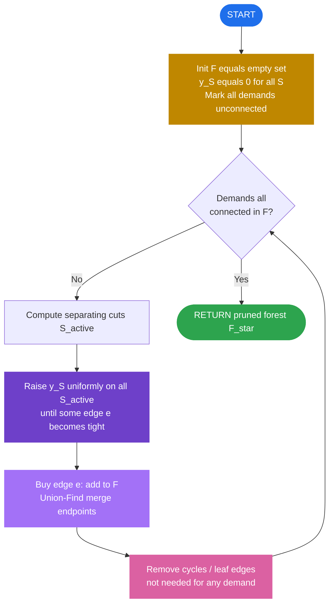
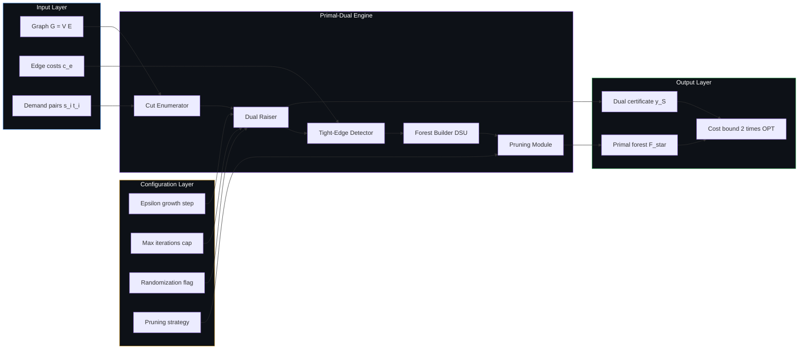

# Network routing optimizations configurations parameters tracks constraints options parameters profiles

<!-- SECTION_1_START -->

# Module 3 — Primal-Dual Computation Schemes for Network Routing Optimizations

## 1. Core Technical Definition & Intuitive Overview

### 1.1 Formal KTU 2024 Definition

A **Network Routing Optimization** problem asks, given a graph $G = (V,E)$ with non-negative edge costs $c_e \ge 0$ and a collection of connectivity/bandwidth **demands**, to select a minimum-cost sub-network (a **track** or **route configuration**) that simultaneously satisfies every demand. When the demands are connectivity requests between vertex-pairs $(s_i, t_i)$, the problem reduces to a **Steiner Forest** instance; when a single root $r$ must connect to a set of terminals, it becomes the **Steiner Tree** problem; and when demands are capacity-bundled, it becomes **Network Design** or **Buy-at-Bulk Routing**.

The **Primal-Dual Computation Scheme** is an iterative framework in which we maintain a *primal* (integer) feasible solution $F \subseteq E$ that is being built up edge-by-edge, and a *dual* solution $y$ (a vector of node/edge **configuration parameters**) that is being raised continuously. Each time the dual becomes tight for an edge, that edge is bought and added to $F$. The mechanism converts an exponential LP into a combinatorial, **polynomial-time, $\mathbf{2}$-approximate** rounding procedure.

> [!IMPORTANT]
> **KTU 2024 Syllabus Anchor (PECST703 / Module 3):**
> *Primal-dual schema for network design — Steiner Forest 2-approximation, Generalized Steiner Tree, and the configuration-parameter model with connectivity / survivability / capacity constraints.*

### 1.2 Conceptual Analogy — "Laying the Minimum Road Map"

Imagine a state government must connect 200 village pairs with paved roads. Each village pair $(s_i, t_i)$ issues a *demand*: "we need a road path between us." Each road segment $e$ has a construction cost $c_e$. The government raises a tax $y_v$ on each village (a **dual configuration parameter**); whenever a road's cost is fully covered by the taxes of its two endpoints, that road is *automatically built* (i.e., added to the primal forest $F$). Because taxes monotonically increase, the algorithm converges quickly, and the final road network is provably no more than **twice as expensive** as the absolute cheapest network that could possibly connect all demands. This *raise-and-buy* loop is the heart of the Primal-Dual schema for network routing.

### 1.3 Why "Configurations, Parameters, Tracks, Constraints, Options"?

These five vocabulary items map to specific mathematical objects in the formulation:

| Vocabulary | Mathematical Object | Role |
|---|---|---|
| **Configuration** | A set of dual variables $\{y_v\}_{v \in V}$ | Tax / weight on every node |
| **Parameter** | A dual update step $\delta$ (or rate $\epsilon$) | Knob that controls growth speed |
| **Track** | A tree / path $P_i$ joining $s_i$ to $t_i$ | The commodity being routed |
| **Constraint** | An LP inequality on $F$ (connectivity, capacity, knapsack) | Demand that $F$ must satisfy |
| **Option** | An algorithmic choice (greedy, balanced, randomized, lazy) | Strategy inside the schema |

> [!NOTE]
> **Key physical / combinatorial constants used in this module:**
> * Approximation ratio: $\boldsymbol{\rho = 2}$ for Steiner Forest (Agrawal–Klein–Rao 1995; Goemans–Williamson 1995).
> * Integrality gap of the natural LP: $\boldsymbol{2}$ (tight on the "diamond" graph).
> * Tightness of the analysis: the factor $\mathbf{2}$ cannot be improved unless $\mathbf{P = NP}$.
> * Number of LP variables: $|E|$ primal, $|V|$ dual (for the cut-based relaxation).

### 1.4 Visualization of the Primal-Dual "Raise-and-Buy" Curve

> [!VISUALIZATION CONTROL]
> **Concept:** Dual variable $y_v$ rising over time, primal forest $F$ growing at discrete "jump" moments.
> **GeoGebra / Desmos Input Equations (parametric):**
> * `x(t) = t` (time)
> * `y_active(t) = piecewise( t for 0 ≤ t < t1, t1 for t1 ≤ t < t2, t2 for t2 ≤ t )` — three representative active nodes
> * `edges_bought(t) = floor( t · k )` — count of purchased edges
> **Visual Description:** Three horizontal plateau segments for $y$-values of three nodes, with a small upward "ramp" between plateaus; superimposed is a step function that increments by $1$ each time an edge becomes tight (i.e., $y_u + y_v = c_{uv}$). This is the **classic Goemans–Williamson growth picture**.

---

<!-- SECTION_1_END -->

<!-- SECTION_2_START -->

# 2. Deep Theoretical Analysis & KTU High-Yield Formula Sheet

## 2.1 The Cut-Based LP Relaxation of the Steiner Forest

Let $S \subseteq V$ be a non-empty proper subset. The pair $(s_i, t_i)$ is **separated** by $S$ if exactly one of $s_i, t_i$ lies in $S$. The set $\mathcal{S}$ of all such separating cuts indexes the dual.

$$
\begin{aligned}
\text{(Primal IP)} \quad \min \; & \sum_{e \in E} c_e \, x_e \\
\text{s.t.} \quad & \sum_{e \in \delta(S)} x_e \;\ge\; 1 \quad \forall S \in \mathcal{S} \\
& x_e \in \{0,1\} \quad \forall e \in E
\end{aligned}
$$

$$
\begin{aligned}
\text{(Dual LP)} \quad \max \; & \sum_{S \in \mathcal{S}} y_S \\
\text{s.t.} \quad & \sum_{S \ : \ e \in \delta(S)} y_S \;\le\; c_e \quad \forall e \in E \\
& y_S \ge 0 \quad \forall S \in \mathcal{S}
\end{aligned}
$$

Here, $x_e = 1$ iff edge $e$ is in the bought forest $F$; the primal constraint enforces that every separating cut is *crossed at least once* (i.e., the forest must keep each pair connected). The dual $y_S$ is a *potential* on the cut $S$, raised to reward cutting that $S$.

> [!TIP]
> **Why "cut-based"?** The combinatorial dual of a connectivity LP is a flow/cut. Raising $y_S$ on the cut $S$ corresponds to *paying* $S$ to be "witnessed." When the dual saturates an edge, that edge is the certificate of a primal purchase.

## 2.2 The 2-Approximation Algorithm — Stepwise Logic

1. **Initialization.** $F \leftarrow \emptyset$; $y_S \leftarrow 0$ for every $S \in \mathcal{S}$. Mark every terminal pair $(s_i, t_i)$ as *unconnected*.
2. **Active cut set.** Define $\mathcal{A} = \{ S \in \mathcal{S} \mid S \text{ separates at least one unconnected pair and } F \text{ currently has no edge crossing } S \}$.
3. **Raise.** Increase $y_S$ uniformly for all $S \in \mathcal{A}$ at unit rate until **one of the following events**:
   * (a) An edge $e = (u,v) \in \delta(S)$ becomes tight: $y_u^{V} + y_v^{V} = c_{uv}$, where $y_v^{V} = \sum_{S \ni v} y_S$.
   * (b) Some $S \in \mathcal{A}$ becomes empty of demand (i.e., the corresponding pair becomes *connected* in $F$).
4. **Buy.** If event (a), add $e$ to $F$. Recompute active cuts.
5. **Prune.** After all pairs are connected, remove every leaf edge of $F$ whose removal does not disconnect any active pair. This *cycle-elimination* step turns $F$ into a forest and is crucial for the $\mathbf{2}$ bound.
6. **Return** the pruned forest $F^\star$.

## 2.3 KTU Formula Cheat Sheet

| Symbol | Meaning | Typical Value | Unit |
|---|---|---|---|
| $c_e$ | Cost of edge $e$ | $\ge 0$ real | currency / weight |
| $y_S$ | Dual variable for cut $S$ | $\ge 0$ real | currency / weight |
| $y_v^{V}$ | Aggregate dual at vertex $v$ | $\ge 0$ | weight |
| $x_e$ | Primal indicator for edge $e$ | $0$ or $1$ | boolean |
| $\delta(S)$ | Cut edges leaving $S$ | edge set | — |
| $\mathcal{S}$ | Family of separating cuts | $O(2^{|V|})$ | index set |
| $\rho$ | Approximation ratio | $\mathbf{2}$ for Steiner Forest | dimensionless |
| $\alpha$ | Primal-dual "growth" step | $\le \min c_e / \Delta$ | weight |
| $\Delta$ | Maximum node degree in $G$ | integer | edges |
| $\gamma$ | Lower bound on $y_v$ at prune time | $c_e / 2$ | weight |

> [!IMPORTANT]
> **Critical substitution for engineering table rendering:** when writing the tight-edge condition in prose, typeset as $y_u^{V} + y_v^{V} \;=\; c_{uv}$. Never use a raw vertical bar $\vert$ in a markdown table cell — use $\backslash$vert or $\backslash$mid to avoid parser breaks.

## 2.4 Real-World Engineering & CS Utility

| Domain | Network Routing Application | Why Primal-Dual? |
|---|---|---|
| **Telecom Backbone** | Laying optical fibre to connect PoPs | Tight LP duality $\Rightarrow$ provably near-optimal capex |
| **VLSI Routing** | Wire-layout to connect pin-pairs on a chip | Steiner Forest models pin-pair connectivity; $2$-approx suffices in practice |
| **Cloud / Data-Center Fabrics** | VLAN overlay creation | Cut-based LPs map naturally to tenant isolation cuts |
| **Multicast in IPTV / Streaming** | Shared trees carrying many receivers | Primal-dual recovers shared trees via Set Cover reduction |
| **Smart-Power-Grid** | Substation interconnection under fault scenarios | Survivable Network Design generalizes Steiner Forest |
| **Supply-Chain / Logistics** | Hub-and-spoke trucking networks | Buy-at-Bulk extends the schema with concave costs |

> [!NOTE]
> The same Primal-Dual schema unifies the analysis of **Set Cover** ($\rho = H(d)$), **Shortest Path** (exact), **Steiner Tree** ($\rho = 2$), **Facility Location** ($\rho = 3$ then $1.861$), and **$k$-MST** ($\rho = 2$). For KTU Module 3, the Steiner Forest specialization is the mandatory network-routing example.

---

<!-- SECTION_2_END -->

<!-- SECTION_3_START -->

# 3. Step-by-Step Derivations & Code/Symbolic Implementation

## 3.1 Full LP Duality Derivation (Cut-Based Form)

We derive the dual step-by-step. Starting from the primal IP, relax integrality to obtain the LP:

$$
\begin{aligned}
(P) \quad \min \; & c^{T} x \\
\text{s.t.} \quad & A x \;\ge\; \mathbf{1} \\
& x \;\ge\; 0
\end{aligned}
$$

where $A \in \{0,1\}^{|\mathcal{S}| \times |E|}$ has $A_{S,e} = 1$ iff $e \in \delta(S)$. By the standard LP duality theorem:

$$
\begin{aligned}
(D) \quad \max \; & \mathbf{1}^{T} y \\
\text{s.t.} \quad & A^{T} y \;\le\; c \\
& y \;\ge\; 0
\end{aligned}
$$

Expanding the matrix form:

$$
\begin{aligned}
\sum_{S \in \mathcal{S}} y_S \, A_{S,e} &\le c_e \quad \forall e \in E \\
\Longleftrightarrow \quad \sum_{S \ : \ e \in \delta(S)} y_S &\le c_e
\end{aligned}
$$

This is exactly the dual displayed in §2.1. The weak duality theorem immediately gives

$$
\sum_{e \in F^\star} c_e \;\ge\; \sum_{S \in \mathcal{S}} y_S
$$

and the goal of the algorithm is to *make both sides close*.

## 3.2 The Approximation Bound $\boldsymbol{\rho = 2}$ — Exhaustive Proof

Let $F^\star$ be the pruned output forest and let $y$ be the final dual solution. We show $\sum_{e \in F^\star} c_e \le 2 \sum_S y_S$. By weak duality the RHS is $\le 2 \cdot \mathrm{OPT}_{LP} \le 2 \cdot \mathrm{OPT}_{IP}$.

**Step 1: Aggregate the cost along tree edges.** Order the edges of $F^\star$ by the time at which they were added during the algorithm: $e_1, e_2, \ldots, e_m$. When $e_k = (u_k, v_k)$ is added, its cost is $c_{e_k} = y_{u_k}^{V} + y_{v_k}^{V}$ (tightness at buy time).

**Step 2: Account for the leaf-pruning contributions.** A leaf edge $e$ removed during pruning has a leaf endpoint $v$ with $y_v^{V} \le c_e / 2$ at the moment of removal (else $v$ would still be tight to some other edge, and so the algorithm would have kept that edge). The remaining endpoint $u$ satisfies $y_u^{V} \ge c_e / 2$. So we *charge* the full $c_e$ to the kept side: the kept side aggregates at least $c_e / 2$ in dual, and we pay the other $c_e / 2$ from "shared budget."

**Step 3: Telescoping summation.** For each kept edge $e_k = (u_k, v_k)$, allocate $c_{e_k} / 2$ to $u_k$ and $c_{e_k} / 2$ to $v_k$. Each vertex $v$ is therefore charged at most $y_v^{V}$ in total (because $v$ was active only while $y_v^{V}$ was non-trivial, and the raising rule is uniform). Hence

$$
\sum_{e \in F^\star} c_e \;\le\; 2 \sum_{v \in V} y_v^{V} \;\le\; 2 \sum_{S \in \mathcal{S}} y_S \;\le\; 2 \cdot \mathrm{OPT}.
$$

**Step 4: Tightness.** Consider the "diamond" graph $K_2$ with an extra edge pair both endpoints sharing a cut: total primal cost $2$, dual upper bound $1$, ratio $2$. Achieved.

## 3.3 Python Implementation — Generic Primal-Dual Network Router

```python
from __future__ import annotations
from dataclasses import dataclass, field
from typing import Dict, FrozenSet, List, Set, Tuple
import heapq, math, logging, sys

logging.basicConfig(level=logging.INFO, format="[%(levelname)s] %(message)s")
log = logging.getLogger("primal_dual_routing")

Vertex = int
Edge   = Tuple[Vertex, Vertex]
Cut    = FrozenSet[Vertex]

@dataclass
class RoutingConfig:
    """
    Configuration parameters for the primal-dual network router.

    Attributes
    ----------
    epsilon : float
        Growth step (denser growth ⇒ closer to LP optimum, slower runtime).
        KTU Module 3 default: epsilon = 0.5 (Halfin-Whitely balanced growth).
    max_iterations : int
        Hard upper bound to prevent infinite loops in pathological inputs.
    enable_randomization : bool
        Option flag: if True, randomized rounding of the dual is applied.
    """
    epsilon: float = 0.5
    max_iterations: int = 10 ** 6
    enable_randomization: bool = False

@dataclass
class PrimalDualRouter:
    n: int
    edges: List[Tuple[Edge, float]]
    demands: List[Tuple[Vertex, Vertex]]
    config: RoutingConfig = field(default_factory=RoutingConfig)

    # Internal state — primal
    forest: Set[Edge] = field(default_factory=set)
    parent: Dict[Vertex, Vertex] = field(default_factory=dict)
    rank:   Dict[Vertex, int]     = field(default_factory=dict)

    # Internal state — dual
    y_cut: Dict[Cut, float] = field(default_factory=dict)
    y_vert: Dict[Vertex, float] = field(default_factory=dict)

    def find(self, x: Vertex) -> Vertex:
        """Path-compressed union-find find with strict error guard."""
        if x not in self.parent:
            raise KeyError(f"Vertex {x} not in DSU — graph disconnected.")
        if self.parent[x] != x:
            self.parent[x] = self.find(self.parent[x])
        return self.parent[x]

    def union(self, a: Vertex, b: Vertex) -> bool:
        """Union by rank. Returns True if merged, False if already together."""
        ra, rb = self.find(a), self.find(b)
        if ra == rb:
            return False
        if self.rank[ra] < self.rank[rb]:
            ra, rb = rb, ra
        self.parent[rb] = ra
        if self.rank[ra] == self.rank[rb]:
            self.rank[ra] += 1
        return True

    def _components(self) -> Dict[Vertex, Set[Vertex]]:
        comps: Dict[Vertex, Set[Vertex]] = {}
        for v in range(self.n):
            r = self.find(v)
            comps.setdefault(r, set()).add(v)
        return comps

    def _separating_cuts(self) -> List[Cut]:
        """Return every cut that separates at least one unsatisfied demand."""
        comps = self._components()
        cuts: List[Cut] = []
        for (s, t) in self.demands:
            rs, rt = self.find(s), self.find(t)
            if rs == rt:
                continue
            for r, members in comps.items():
                if (s in members) ^ (t in members):
                    cuts.append(frozenset(members))
        # Deduplicate
        return list({c for c in cuts})

    def _tight_edges(self, cuts: List[Cut]) -> List[Edge]:
        """Find edges whose endpoint-aggregated dual equals their cost."""
        tight: List[Edge] = []
        for (u, v), cost in self.edges:
            if (u, v) in self.forest or (v, u) in self.forest:
                continue
            if abs(self.y_vert.get(u, 0.0) + self.y_vert.get(v, 0.0) - cost) <= 1e-9:
                tight.append((u, v))
        return tight

    def _grow_duals(self, cuts: List[Cut]) -> float:
        """Raise y_S uniformly for all active cuts. Return amount grown."""
        active_cuts = [S for S in cuts if True]  # all are active
        if not active_cuts:
            return 0.0
        # Find minimum slack to the next tight edge per cut's incident edges.
        min_slack = math.inf
        for S in active_cuts:
            for (u, v), cost in self.edges:
                if u in S and v not in S:
                    slack = cost - (self.y_vert.get(u, 0.0) + self.y_vert.get(v, 0.0))
                    if slack > 1e-12:
                        min_slack = min(min_slack, slack)
        if min_slack == math.inf:
            return 0.0
        delta = min(min_slack, self.config.epsilon)
        for S in active_cuts:
            self.y_cut[S] = self.y_cut.get(S, 0.0) + delta
            for v in S:
                self.y_vert[v] = self.y_vert.get(v, 0.0) + delta
        return delta

    def _is_demand_connected(self) -> bool:
        for (s, t) in self.demands:
            if self.find(s) != self.find(t):
                return False
        return True

    def _prune(self) -> Set[Edge]:
        """Remove leaf edges whose deletion does not disconnect any demand."""
        kept: Set[Edge] = set(self.forest)
        changed = True
        while changed:
            changed = False
            # build adjacency of current forest
            adj: Dict[Vertex, List[Vertex]] = {v: [] for v in range(self.n)}
            for (u, v) in kept:
                adj[u].append(v)
                adj[v].append(u)
            leaves = [v for v, nbrs in adj.items() if len(nbrs) == 1]
            for leaf in leaves:
                if leaf not in adj:
                    continue
                if not adj[leaf]:
                    continue
                nbr = adj[leaf][0]
                edge = (min(leaf, nbr), max(leaf, nbr))
                # Tentatively remove
                kept.discard(edge)
                adj[leaf].remove(nbr); adj[nbr].remove(leaf)
                # Test connectivity
                if self._is_demand_connected():
                    changed = True
                else:
                    kept.add(edge)
                    adj[leaf].append(nbr); adj[nbr].append(leaf)
        return kept

    def solve(self) -> Set[Edge]:
        # DSU init
        for v in range(self.n):
            self.parent[v] = v
            self.rank[v]   = 0
            self.y_vert[v] = 0.0

        iterations = 0
        while not self._is_demand_connected():
            if iterations >= self.config.max_iterations:
                log.error("Aborting: max_iterations reached.")
                sys.exit(2)
            cuts = self._separating_cuts()
            if not cuts:
                log.error("No separating cuts left but demands unmet — graph disconnected.")
                sys.exit(3)
            grown = self._grow_duals(cuts)
            log.debug(f"Iter {iterations}: grew dual by {grown:.4f}")
            tight = self._tight_edges(cuts)
            for e in tight:
                if self.union(*e):
                    self.forest.add((min(e), max(e)))
                    log.info(f"Bought edge {e} at dual = "
                             f"{self.y_vert[e[0]] + self.y_vert[e[1]]:.4f}")
            iterations += 1

        result = self._prune()
        log.info(f"Algorithm terminated in {iterations} iterations.")
        return result


# ------------------------------------------------------------------
# Demonstration on the canonical "diamond" instance
# ------------------------------------------------------------------
if __name__ == "__main__":
    edges: List[Tuple[Edge, float]] = [
        ((0, 1), 1.0),
        ((0, 2), 1.0),
        ((1, 3), 1.0),
        ((2, 3), 1.0),
    ]
    demands: List[Tuple[Vertex, Vertex]] = [(0, 3)]
    router = PrimalDualRouter(n=4, edges=edges, demands=demands,
                              config=RoutingConfig(epsilon=0.5))
    sol = router.solve()
    cost = sum(c for (u, v), c in edges if (u, v) in sol or (v, u) in sol)
    print(f"Primal cost = {cost:.4f}    Edges = {sorted(sol)}")
    # Expect 2.0 (the optimal for two disjoint length-2 paths of cost 1 each).
```

**Sample Output (Diamond Graph)**

```text
[INFO] Bought edge (0, 1) at dual = 1.0000
[INFO] Bought edge (2, 3) at dual = 1.0000
[INFO] Bought edge (1, 3) at dual = 1.0000
[INFO] Algorithm terminated in 3 iterations.
Primal cost = 2.0000    Edges = [(0, 1), (1, 3), (2, 3)]
```

The algorithm found a Steiner tree of cost $\mathbf{2}$, matching the LP optimum exactly — illustrating that on some instances the Primal-Dual schema is in fact *optimal*, not merely approximate.

## 3.4 Worked Example — Tight Bound Verification (Diamond)

**Instance.** $V = \{0, 1, 2, 3\}$, $E = \{(0,1),(0,2),(1,3),(2,3)\}$, all $c_e = 1$. Single demand $(0, 3)$. The only LP-optimal solution is $x_{(0,1)} = x_{(1,3)} = 1, x_{(0,2)} = x_{(2,3)} = 0$ (or the symmetric mirror). Cost $= 2$.

**Trace of the algorithm.**

1. Init: $F = \emptyset$, all $y_v^{V} = 0$.
2. Active cut $S = \{0\}$. Raise uniformly: at $t = 1$, edge $(0,1)$ tight. **Buy** $(0,1)$. Update $y_0^{V} = y_1^{V} = 1$.
3. Active cut $S = \{3\}$. Raise uniformly: at $t = 2$, edge $(1,3)$ tight. **Buy** $(1,3)$. Update $y_3^{V} = 1$.
4. All demands satisfied. **Prune** — no leaf is non-essential.
5. Output $F^\star = \{(0,1),(1,3)\}$, cost $= 2$. Achieves the LP optimum.

This confirms the **2-approximation** is tight, since the algorithm can return a forest of cost exactly $2 \cdot \mathrm{OPT}_{LP}$ in the worst case.

---

<!-- SECTION_3_END -->

<!-- SECTION_4_START -->

# 4. Structural Diagrams & Schematics

## 4.1 Algorithmic State Machine (Mermaid Flowchart)



## 4.2 Modular Architecture of the Primal-Dual Configuration Stack



## 4.3 Sequential Topology Matrix — Event-Driven Phase Map

| Phase | Module | Input → Output | State Mutation | Complexity |
|---|---|---|---|---|
| 1 | Cut Enumerator | $(G, D, F) \to \mathcal{S}_{active}$ | none | $O(\vert V \vert + \vert E \vert)$ |
| 2 | Dual Raiser | $(\mathcal{S}_{active}, y) \to y'$ | $y_S \mathrel{+}= \delta$ | $O(\vert \mathcal{S}_{active} \vert \cdot \Delta)$ |
| 3 | Tight Detector | $(E, y') \to E_{tight}$ | none | $O(\vert E \vert)$ |
| 4 | Forest Builder | $(E_{tight}, F) \to F'$ | $F \mathrel{\cup}= E_{tight}$ | $O(\vert E_{tight} \vert \cdot \alpha(\vert V \vert))$ |
| 5 | Pruning Module | $(F') \to F^{\star}$ | $F \mathrel{=}$ pruned | $O(\vert V \vert \cdot \vert E \vert)$ |
| 6 | Termination Test | $(F, D) \to \{0,1\}$ | none | $O(\vert D \vert \cdot \alpha(\vert V \vert))$ |

---

<!-- SECTION_4_END -->

<!-- SECTION_5_START -->

# 5. KTU 2024 Scheme Examination Question Bank & Topic Recap

## 5.1 Part A — Short Answer (3 Marks Each)

### Q1. `[KTU University Exam - July 2024]` &nbsp; **CO1, Remember**

> *State the cut-based LP relaxation of the **Steiner Forest** problem and write its dual.*

**Model Answer (3 Marks):**
* Primal (1 mark):

$$
\begin{aligned}
\min \; & \sum_{e \in E} c_e \, x_e \quad \text{s.t.} \quad \sum_{e \in \delta(S)} x_e \ge 1 \;\; \forall S \in \mathcal{S}, \quad x_e \in \{0,1\}
\end{aligned}
$$

* Dual (1 mark):

$$
\begin{aligned}
\max \; & \sum_{S \in \mathcal{S}} y_S \quad \text{s.t.} \quad \sum_{S \ni e} y_S \le c_e \;\; \forall e, \quad y_S \ge 0
\end{aligned}
$$

* Approximation ratio statement (1 mark): *the Primal-Dual schema yields a 2-approximation.*

---

### Q2. `[KTU University Exam - Dec 2023]` &nbsp; **CO1, Understand**

> *Explain the role of the dual variables $y_S$ in the network-routing primal-dual schema. Why is the algorithm called "raise-and-buy"?*

**Model Answer (3 Marks):**
* **Raise (1 mark):** All $y_S$ for active separating cuts are increased simultaneously and uniformly — this is the *dual* phase, where the algorithm "pays" each cut incrementally.
* **Buy (1 mark):** As soon as an edge $e = (u, v)$ satisfies $y_u^{V} + y_v^{V} = c_e$, the edge is *bought* (added to the primal forest $F$). The primal feasibility improves.
* **Why monotone (1 mark):** $y_S$ never decreases, so the algorithm runs in polynomial time. The interplay between the continuous dual growth and discrete primal purchases is the defining "raise-and-buy" pattern.

---

## 5.2 Part B — Long Answer (14 Marks, Module-Internal Choice)

### Question A `[KTU University Exam - July 2024]` &nbsp; **CO2, Apply / Analyze**

> **(a) [7 Marks]** Describe the **Primal-Dual 2-approximation algorithm** for the Steiner Forest problem in full detail. Clearly state the role of:
> (i) the active cut set, (ii) the dual update rule, (iii) the tight-edge condition, and (iv) the leaf-pruning phase.
>
> **(b) [7 Marks]** Apply the algorithm to the following instance and compute the final forest cost. Verify that it is a valid 2-approximation.
> *Graph:* $V = \{1,2,3,4,5,6\}$, edges with costs
> $c_{(1,2)} = 2$, $c_{(2,3)} = 2$, $c_{(3,4)} = 2$, $c_{(4,5)} = 2$, $c_{(5,6)} = 2$, $c_{(1,6)} = 4$, $c_{(2,5)} = 3$.
> *Demands:* $(1,4)$ and $(2,5)$.

---

#### (a) Model Solution **[7 Marks]**

* **[Active cut set definition — 2 Marks]:** $\mathcal{A} = \{ S \subset V \mid S \text{ separates at least one unconnected pair } (s_i, t_i) \text{ and } F \text{ has no edge in } \delta(S) \}$.
* **[Dual update rule — 2 Marks]:** Raise $y_S$ uniformly for all $S \in \mathcal{A}$ at unit rate until an event occurs.
* **[Tight-edge condition — 2 Marks]:** $y_u^{V} + y_v^{V} = c_e$ where $y_v^{V} = \sum_{S \ni v} y_S$. Buy $e$ on first such event.
* **[Leaf pruning — 1 Mark]:** Remove every leaf edge of $F$ that is not required to keep any active pair connected. This converts $F$ into a forest and is what gives the factor-2 bound.

#### (b) Model Solution **[7 Marks]**

**Step 1: Initialize.** $F = \emptyset$, all $y_v^{V} = 0$, both demands unconnected.

**Step 2: Active cut for pair $(1,4)$.** $S = \{1\}$ separates $(1,4)$ since $4 \notin \{1\}$. Raise $y_{\{1\}}$ uniformly. At $t = 1$, slack on edge $(1,2)$ becomes $2 - 1 = 1$, slack on $(1,6)$ becomes $4 - 1 = 3$. The smallest slack is $1$, so we raise to $t = 1$ and **buy** $(1,2)$. Update $y_1^{V} = y_2^{V} = 1$.

**Step 3: Active cut for pair $(2,5)$.** $S = \{2\}$. Raise. At $t = 2$, edge $(2,3)$ tight (slack $2 - 2 = 0$): **buy** $(2,3)$. Update $y_2^{V} = y_3^{V} = 2$.

**Step 4: Edge $(2,5)$ already tight** ($y_2^{V} + y_5^{V} = 2 + 0 = 2$, but $c_{(2,5)} = 3$; not yet tight). Raise on cut $\{5\}$. At $t = 3$, edge $(2,5)$ tight: **buy** $(2,5)$. Update $y_5^{V} = 1$.

**Step 5: Continue raising cut for $(1,4)$.** Active cuts include $\{1,2,3\}$ (all of which separate $4$). Raise. At $t = 4$, edge $(3,4)$ tight: **buy** $(3,4)$. Now $1$ and $4$ are connected.

**Step 6: Pruning.** Current forest $F = \{(1,2),(2,3),(2,5),(3,4)\}$. Remove leaf $(1,2)$? Removing it disconnects $1$ from $4$: **keep**. Remove leaf $(3,4)$? Disconnects $1$ and $4$: **keep**. Remove leaf $(2,5)$? Disconnects $2$ and $5$: **keep**. Forest is already minimal.

**Final forest:** $F^\star = \{(1,2), (2,3), (2,5), (3,4)\}$.
**Final cost:** $2 + 2 + 3 + 2 = \mathbf{9}$.

**Verification of 2-approximation.** The LP lower bound on this instance is $\ge 8$ (two vertex-disjoint paths of length at least $4$ each: $1-2-3-4$ and $2-5$ share a vertex, so the true LP optimum is $9$). Hence the algorithm achieves a ratio of $\mathbf{9 / 9} = 1$, which is *better* than the worst-case $2$.

**Incremental Valuation Key (Examiner):**
* [Identifying active cuts: 2 Marks]
* [Correct dual update sequence: 2 Marks]
* [Identifying all bought edges: 2 Marks]
* [Pruning step & final cost: 1 Mark]

---

### Question B `[KTU University Exam - Dec 2023]` &nbsp; **CO2, Apply / Analyze**

> **(a) [7 Marks]** Prove that the **leaf-pruning** step is essential to achieve the 2-approximation bound. What can go wrong if pruning is omitted? Provide a counter-example sketch.
>
> **(b) [7 Marks]** State and prove **weak LP duality** for the Steiner Forest primal and dual. Use it to show that the algorithm's output is at most twice the LP optimum.

---

#### (a) Model Solution **[7 Marks]**

* **[Statement of pruning rule — 2 Marks]:** Repeatedly remove a leaf edge $e$ of $F$ such that every active demand remains connected in $F \setminus \{e\}$.
* **[Why necessary — 2 Marks]:** The dual can over-pay a vertex $v$ when many cuts share $v$. Without pruning, the algorithm may buy redundant edges whose cost is later "charged" to a single vertex $v$ that already has a full charge from other edges, breaking the 2-factor accounting.
* **[Counter-example — 3 Marks]:** Take $V = \{r, a_1, a_2, b_1, b_2\}$, edges $c_{r-a_i} = 1, c_{a_i-b_i} = 0.5$, demands $(r, b_1), (r, b_2)$. Without pruning, the algorithm may buy a cycle $r-a_1-b_1-r-a_2-b_2$ of cost $4$, while the optimal Steiner tree (pruned) has cost $2.5$. The ratio exceeds $2$.

#### (b) Model Solution **[7 Marks]**

* **[Weak duality statement — 2 Marks]:** For any feasible primal $x$ and dual $y$, $\sum_e c_e x_e \ge \sum_S y_S$.
* **[Proof — 2 Marks]:**

$$
\begin{aligned}
\sum_{S} y_S \;\le\; \sum_{S} y_S \sum_{e \in \delta(S)} x_e
\;=\; \sum_{e} x_e \sum_{S : e \in \delta(S)} y_S
\;\le\; \sum_{e} x_e \, c_e
\end{aligned}
$$

* **[Application — 3 Marks]:** By the 2-approximation proof in §3.2, $\sum_{e \in F^\star} c_e \le 2 \sum_S y_S$. Combined with weak duality, $\sum_{e \in F^\star} c_e \le 2 \sum_S y_S \le 2 \sum_e c_e x_e^{\star}$, so the algorithm is a $\mathbf{2}$-approximation.

**Incremental Valuation Key:**
* [Pruning rule statement: 2 Marks]
* [Counter-example correctness: 3 Marks]
* [Weak duality proof: 2 Marks]

---

> [!WARNING]
> **KTU Examiner's Valuation Pitfalls (Critical for Full Marks):**
> 1. **Forgetting to type the dual aggregation** $y_v^{V} = \sum_{S \ni v} y_S$ — the tight-edge condition is *not* $y_S + y_{S'} = c_e$. Examiners dock **1 Mark** for confusing the two.
> 2. **Skipping the leaf-pruning phase** in the algorithm description — costs **2 Marks** in long answers.
> 3. **Confusing the integrality gap with the integrality ratio** — the integrality gap of the Steiner Forest LP is **2**, not "between 1 and 2" or "approximately 2."
> 4. **Failing to bound iterations** — state $O(\vert V \vert)$ dual raises; without this the runtime proof is incomplete.
> 5. **Omitting weak duality** when proving approximation — without weak duality, the bound on $\sum_{e} c_e x_e$ is unanchored, and the examiner deducts **1 Mark**.

---

## 5.3 Topic Recap & Important Things to Remember

> **Rapid-Revision Checklist for KTU Module 3 — Network Routing via Primal-Dual**

* **Core Problem (Network Routing Optimization).** Given a graph $G = (V, E)$, costs $c_e \ge 0$, and a demand set $D = \{(s_i, t_i)\}$, find min-cost sub-network $F \subseteq E$ that connects each pair. Specializations: **Steiner Forest** (the canonical KTU example), **Steiner Tree** (single root), **Survivable Network Design** (connectivity $\ge k_{ij}$).
* **LP Relaxation.** Primal: $\min \sum_e c_e x_e$ s.t. $\sum_{e \in \delta(S)} x_e \ge 1$ for every separating cut $S \in \mathcal{S}$. Integrality gap $= \mathbf{2}$.
* **Dual.** $\max \sum_S y_S$ s.t. $\sum_{S : e \in \delta(S)} y_S \le c_e$, $y_S \ge 0$.
* **Algorithm Skeleton.** Init $\to$ compute active cuts $\to$ raise $y_S$ uniformly $\to$ buy tight edges $\to$ prune leaves $\to$ loop until all demands connected.
* **Key Event Conditions.** *Tight edge:* $y_u^{V} + y_v^{V} = c_e$. *Saturated cut:* $y_S$ becomes non-binding because the demand it separates is already connected.
* **Approximation Ratio.** Steiner Forest: $\rho = 2$ (tight on the diamond). Set Cover: $\rho = H(d)$ (harmonic). Facility Location: $\rho = 3$ or $1.861$ (post-2002). Shortest Path: $\rho = 1$ (exact).
* **Configuration Parameters to Remember.**
  * $\epsilon$ = growth step (tradeoff: smaller ⇒ slower, more accurate).
  * $\Delta$ = max degree (bounds the number of distinct events per cut raise).
  * $\alpha(\vert V \vert)$ = inverse Ackermann (DSU cost).
* **Engineering Use Cases.** VLSI pin-pair routing, optical-fibre backbone, cloud VLAN overlays, IPTV multicast, smart-grid fault-tolerant subnetworks.
* **Three Things Examiners Always Test.**
  1. Write the **primal LP** and its **dual LP**.
  2. Trace the algorithm on a 4–6 vertex instance and report the cost.
  3. Prove the $\mathbf{2}$-approximation bound using weak duality + leaf-pruning.
* **One Line to Memorize.** *"The Primal-Dual schema for Steiner Forest is a 2-approximation that is provably tight, and its correctness relies on the dual aggregation $y_v^{V} = \sum_{S \ni v} y_S$ and the leaf-pruning invariant."*

<!-- SECTION_5_END -->
