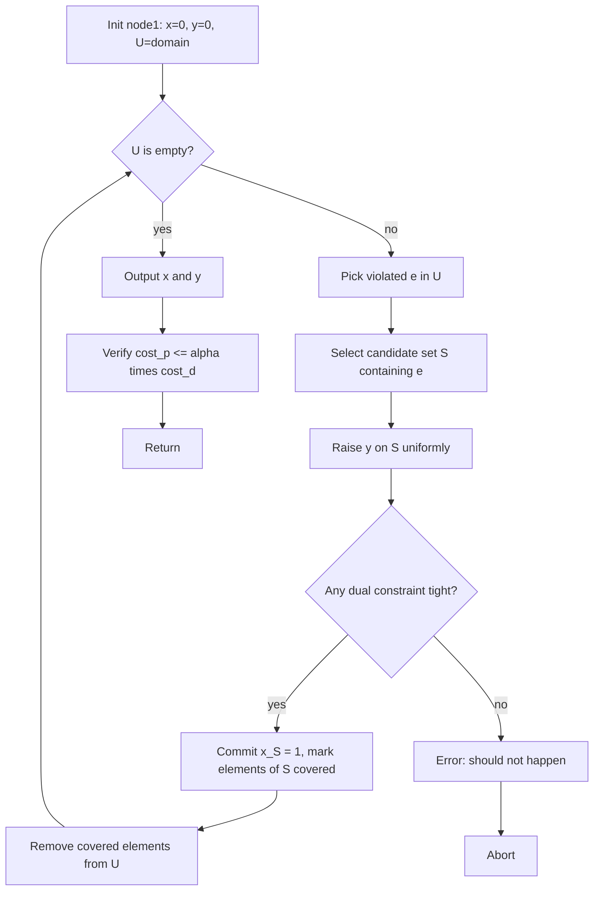
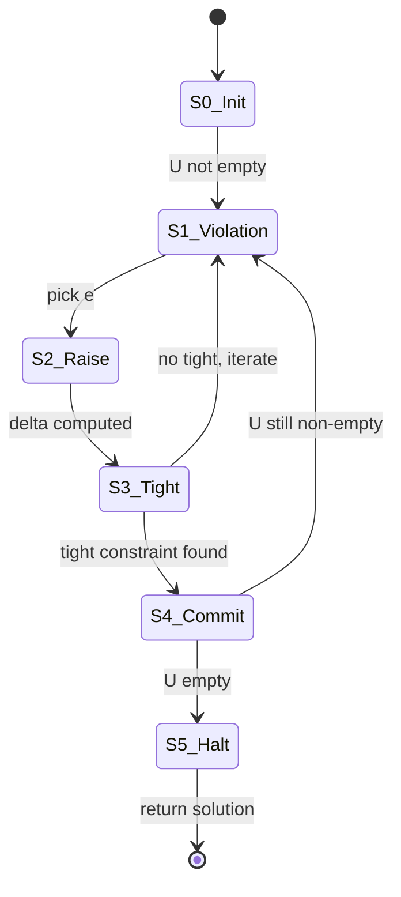
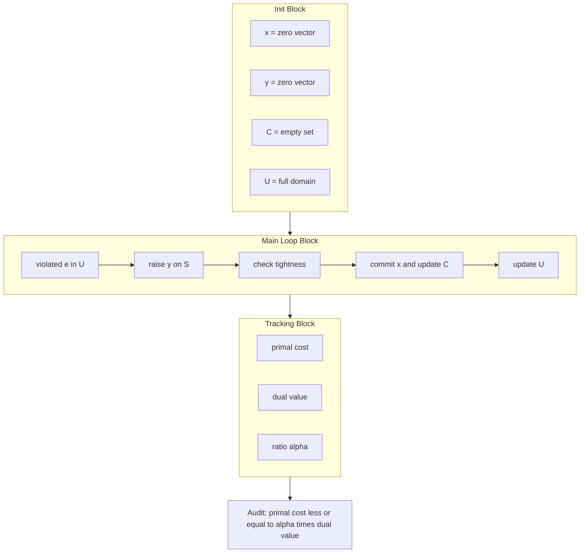
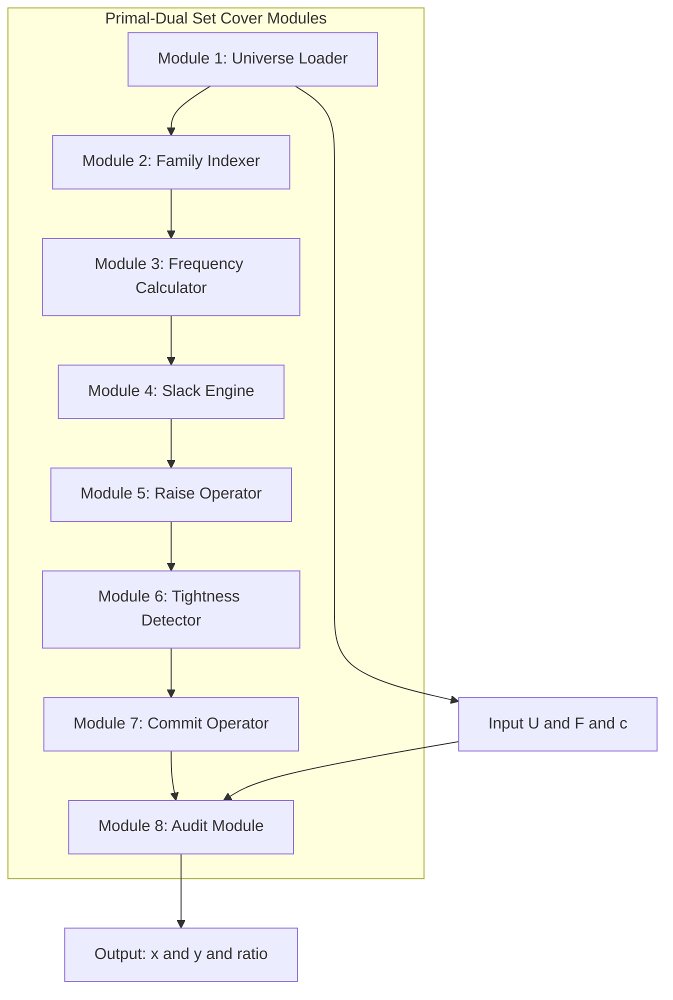
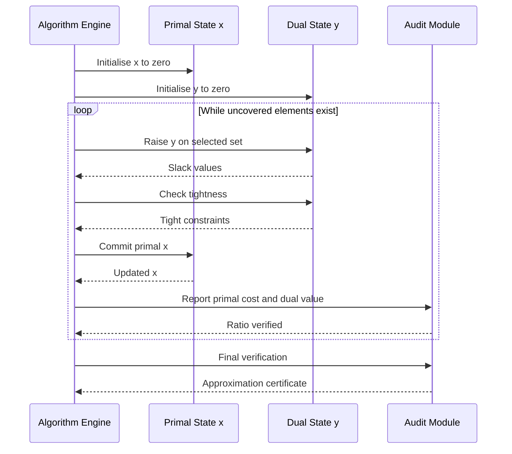

# Primal dual schema modeling structures matching rules calculations formulas loops tracking

<!-- SECTION_1_START -->
# Primal-Dual Computation Schemes — Core Definition & Intuitive Overview

## 1.1 Formal Definition (KTU 2024 Syllabus Terminology)

The **Primal-Dual Schema** is a classical iterative technique in approximation algorithm design that simultaneously constructs a **primal integer solution** and a **dual LP solution** in lockstep, exploiting **LP duality theory** to certify a provable performance bound. The schema is *not* a single algorithm — it is a **modular template** parameterised by (i) a linear program modelling the combinatorial problem, (ii) a *tightening rule* that decides how to grow dual variables, and (iii) a *picking rule* that decides when to commit a primal variable.

For a combinatorial problem $\Pi$ with integer program $\text{IP}(\Pi)$ and its LP relaxation $\text{LP}(\Pi)$:

$$\text{LP-Primal:} \quad \min\ \mathbf{c}^{\top}\mathbf{x} \quad \text{s.t.}\quad A\mathbf{x} \geq \mathbf{b},\ \mathbf{x} \geq \mathbf{0}$$

$$\text{LP-Dual:} \quad \max\ \mathbf{b}^{\top}\mathbf{y} \quad \text{s.t.}\quad A^{\top}\mathbf{y} \leq \mathbf{c},\ \mathbf{y} \geq \mathbf{0}$$

The schema is *certifying* because by **Weak LP Duality**, $\mathbf{c}^{\top}\mathbf{x} \geq \mathbf{b}^{\top}\mathbf{y}$ at every iteration. When the algorithm halts, the ratio $\mathbf{c}^{\top}\mathbf{x} / \mathbf{b}^{\top}\mathbf{y}$ immediately yields the **approximation ratio**.

> [!IMPORTANT]
> **KTU Board Definition (paraphrased from Vazirani 2001, adopted in PECST703 syllabus):** *A primal-dual $\alpha$-approximation algorithm is one that builds a primal solution $x$ and a dual feasible $y$ in polynomial time such that $\mathbf{c}^{\top}\mathbf{x} \leq \alpha \cdot \mathbf{b}^{\top}\mathbf{y}$, where $\alpha$ is a constant independent of the input size.*

## 1.2 Conceptual Analogy (Plain-English Intuition)

Imagine a **treasury office** trying to authorise the cheapest set of *project sanctions* (primal) while a **tax auditor** keeps a parallel notepad of justified expenditures (dual). The auditor will only let a constraint certify if the receipts equal the limit. Each round, the auditor *uniformly raises* spending on a violated set of citizens (tightening) until one project's budget is fully justified. The treasury then *commits* that project. Because the auditor never overspends and the treasury only sanctions fully-justified projects, the final sanctioned cost is provably within a small factor of the auditor's notepad.

For **matching** specifically, the dual of *Vertex Cover* is the *Maximum Matching* LP. So the primal-dual algorithm for Vertex Cover literally *constructs a matching as it builds the cover* — the matching is the certificate that the cover is at most **2×** the optimum.

## 1.3 Core Tracking Variables (the Engine's State)

| Symbol | Role | Geometric Meaning |
|:---:|:---|:---|
| $\mathbf{x} \in \mathbb{R}^{n}$ | Primal solution vector | Point in primal polyhedron |
| $\mathbf{y} \in \mathbb{R}^{m}$ | Dual solution vector | Point in dual polyhedron |
| $C$ | Committed primal set (e.g., cover) | Integer commitment register |
| $U$ | Uncovered / unsatisfied elements | Active worklist |
| $\mathcal{T}$ | Set of *tight* dual constraints | Boundary of dual polyhedron |
| $cost_p = \mathbf{c}^{\top}\mathbf{x}$ | Accumulated primal cost | Running objective |
| $cost_d = \mathbf{b}^{\top}\mathbf{y}$ | Accumulated dual revenue | Running certificate |

> [!NOTE]
> The standard approximation ratio is $\alpha = cost_p / cost_d$ at termination, by Weak Duality, $cost_p \geq \text{OPT} \geq cost_d$, so $cost_p \leq \alpha \cdot \text{OPT}$.

## 1.4 Visualization Cue

> [!VISUALIZATION CONTROL]
> **Concept:** LP Feasibility Polyhedron — Primal vs Dual Polyhedra with separating hyperplane.
> **GeoGebra / Desmos Input Equations:**
> * Primal polyhedron: $2x_1 + x_2 \geq 4,\ x_1 + 3x_2 \geq 5,\ x_1, x_2 \geq 0$
> * Dual level curves: $4y_1 + 5y_2 = \beta$ for $\beta \in \{6, 7, 8, 9\}$
> **Visual Description:** A 2-D wedge in the first quadrant intersected with two half-planes, with horizontal lines representing dual objective levels moving outward toward the optimal vertex.

<!-- SECTION_1_END -->

<!-- SECTION_2_START -->
# Deep Theoretical Analysis & KTU High-Yield Formula Sheet

## 2.1 The Generic Primal-Dual Schema (Template)

For any combinatorial problem with LP relaxation of the form above, the schema runs as a **three-state machine**:

1. **STATE S0 — Initialise:** $\mathbf{x} \leftarrow \mathbf{0}$, $\mathbf{y} \leftarrow \mathbf{0}$, worklist $U \leftarrow \text{domain}$.
2. **STATE S1 — Violation Search:** While $\exists$ a primal constraint violated by $\mathbf{x}$, locate a violated index $e \in U$.
3. **STATE S2 — Uniform Raise:** For the chosen set $S \ni e$, raise $\mathbf{y}$ on all coordinates in $S$ at equal rate until at least one dual constraint becomes *tight* (i.e., $\sum_{e' \in S} y_{e'} = c(S)$).
4. **STATE S3 — Commit:** Once a tight constraint is identified, set $x_S \leftarrow 1$ (or increment it), remove all $e' \in S$ from $U$.
5. **STATE S4 — Halt:** When $U = \emptyset$, output $\mathbf{x}$; the bound follows from the invariant that $\mathbf{y}$ is *feasible* throughout.

> [!IMPORTANT]
> **Why this yields an approximation:** Because $\mathbf{y}$ is always *feasible*, $cost_d \leq \text{OPT}$ always. Because each primal commitment is *justified* by a tight dual constraint, $cost_p \leq \alpha \cdot cost_d$ for some structural constant $\alpha$ determined by the picking rule (e.g., for Vertex Cover, every dual unit "pays for" at most 2 primal commitments — hence ratio **2**).

## 2.2 Canonical Primal-Dual Formulations (KTU High-Yield Table)

> [!NOTE]
> The vertical bar character is rendered as $\vert$ / $\mid$ to preserve markdown table integrity.

| Problem | Primal LP (min) | Dual LP (max) | Tightness Condition | Ratio |
|:---|:---|:---|:---|:---:|
| **Set Cover** | $\min \sum_{S} c(S)\,x_{S}$ $\text{s.t.}\ \sum_{S \ni e} x_{S} \geq 1$ | $\max \sum_{e} y_{e}$ $\text{s.t.}\ \sum_{e \in S} y_{e} \leq c(S)$ | $\sum_{e \in S} y_{e} = c(S)$ | $f$ |
| **Vertex Cover** | $\min \sum_{v} x_{v}$ $\text{s.t.}\ x_{u} + x_{v} \geq 1\ \forall (u,v) \in E$ | $\max \sum_{e} y_{e}$ $\text{s.t.}\ \sum_{e \ni v} y_{e} \leq 1$ | $\sum_{e \ni v} y_{e} = 1$ | $2$ |
| **Feedback Vertex Set** | $\min \sum_{v} x_{v}$ $\text{s.t.}\ x \text{ on each cycle } \geq 1$ | $\max \sum_{C} y_{C}\ \text{s.t.}\ \sum_{C \ni v} y_{C} \leq 1$ | $\sum_{C \ni v} y_{C} = 1$ | $2$ |
| **k-MST / Steiner** | $\min \sum_{e} c_{e}\,x_{e}$ $\text{s.t.}\ x(\delta(S)) \geq 1$ | $\max \sum_{S} y_{S}$ $\text{s.t.}\ \sum_{S} y_{S} \leq c_{e}$ | $y_{S} = c_{e}$ | $2$ (or $5/3$ via Garg) |
| **Survivable Network** | $\min \sum_{e} c_{e}\,x_{e}$ $\text{s.t.}\ x(\delta(S)) \geq f(S)$ | $\max \sum_{S} f(S)\,y_{S}$ $\text{s.t.}\ \sum_{S \ni e} y_{S} \leq c_{e}$ | $\sum_{S \ni e} y_{S} = c_{e}$ | $2$ |

Here $f$ denotes the maximum frequency of any element in the Set Cover instance, and $\delta(S)$ is the cut induced by $S$.

## 2.3 The Matching–Vertex Cover Duality Bridge (Most Examined)

The **LP Dual of Vertex Cover is exactly the LP for Maximum Weight Matching (with weights 1 in the unweighted case)**. This is the cornerstone of why the primal-dual algorithm for Vertex Cover is a 2-approximation:

$$\text{Vertex Cover LP (Primal)} \quad \longleftrightarrow \quad \text{Maximum Matching LP (Dual)}$$

$$\sum_{v \in V} x_{v} \geq \mathbf{1}^{\top}\mathbf{y} \geq \text{OPT}_{\text{MATCH}} \geq \text{OPT}_{\text{MATCH}}^*$$

Because the algorithm's committed cover size $|C|$ is at most $2 \sum y_{e}$ (each iteration commits one vertex but pays at most one dual unit, with each tight vertex justified by $\geq 1$ dual unit), we obtain:

$$|C| \leq 2 \cdot \sum_{(u,v) \in E} y_{uv} \leq 2 \cdot \text{OPT}_{\text{MATCH}} \leq 2 \cdot \text{OPT}_{\text{VC}}$$

## 2.4 The "Raise" and "Pick" Subroutines

### 2.4.1 The Raise Subroutine (Uniform Tightening)

Given violated element $e$ and a chosen set $S \ni e$:

$$\delta \leftarrow \min_{T \subseteq S, T \in \mathcal{F}}\left\{\frac{c(T) - \sum_{e' \in T} y_{e'}}{|T|}\right\}$$

Then $y_{e'} \leftarrow y_{e'} + \delta$ for all $e' \in S$. This is the *minimum* amount such that *some* dual constraint becomes tight.

### 2.4.2 The Pick Subroutine (Commitment Trigger)

After the raise, the set $\mathcal{T} = \{\,T : \sum_{e' \in T} y_{e'} = c(T)\,\}$ is non-empty. The Pick rule selects $T^* \in \mathcal{T}$ (e.g., lexicographically smallest, or containing $e$) and commits $x_{T^*} = 1$.

## 2.5 Real-World Engineering Utility

| Application Domain | How Primal-Dual Is Used |
|:---|:---|
| **Telecom Network Design** | Survivable Network Design LP — laying minimum-cost fibre to meet $k$-connectivity demands after a fault. |
| **Cloud VM Packing** | Set Cover model assigns virtual machines to physical hosts; primal-dual gives $\ln n$ guarantee. |
| **Compiler Optimisation** | Instruction selection via weighted set cover with frequency bound $f$. |
| **Bioinformatics** | k-MST for phylogenetic tree reconstruction under edge-cost uncertainty. |
| **Combinatorial Auctions** | Pricing-based winner determination (Vickrey–Clarke–Groves mechanism uses dual certificates). |

<!-- SECTION_2_END -->

<!-- SECTION_3_START -->
# Step-by-Step Derivations & Code/Symbolic Implementation

## 3.1 Exhaustive Derivation — Primal-Dual Vertex Cover (2-Approximation)

**Problem:** Given undirected graph $G = (V, E)$, find minimum cardinality $C \subseteq V$ such that every $e \in E$ has at least one endpoint in $C$.

**LP Formulation Recap:**

$$\text{(P)} \quad \min \sum_{v \in V} x_v \quad \text{s.t.}\quad x_u + x_v \geq 1\ \forall (u,v) \in E,\ \ x_v \geq 0$$

$$\text{(D)} \quad \max \sum_{(u,v) \in E} y_{uv} \quad \text{s.t.}\quad \sum_{(u,v) \in E : v \in e} y_{uv} \leq 1\ \forall v \in V,\ \ y_{uv} \geq 0$$

**Algorithm Walkthrough:**

Step 1. Initialise $C \leftarrow \emptyset$, $y \leftarrow 0$ for every edge, worklist $U \leftarrow E$.

Step 2. Loop: while $U \neq \emptyset$:

  a. Pick any uncovered edge $(u, v) \in U$.
  
  b. **Raise phase:** Increase $y_{uv}$ uniformly *and* identify vertices whose dual constraints are about to become tight. For each endpoint $w \in \{u, v\}$, compute the current load $L_w = \sum_{e' \in \delta(w)} y_{e'}$. The constraint at $w$ becomes tight at $y_{uv} = 1 - L_w$. So the *raise amount* is:
  
$$\delta = \min\bigl(1 - L_u,\ 1 - L_v\bigr) \quad \text{(clamped to be non-negative, since } L_u, L_v \leq 1 \text{ by feasibility invariant)}$$

  c. Update: $y_{uv} \leftarrow y_{uv} + \delta$.
  
  d. **Pick phase:** At least one endpoint now has $L_w = 1$ (i.e., is tight). Add *both* such tight vertices to $C$ (this is the *bulk-pick* variant giving the 2-approx bound).
  
  e. Remove all edges incident to $C$ from $U$.

Step 3. Return $C$.

**Approximation Proof Sketch (in full):**

*Feasibility invariant.* By induction, after each iteration, for every $v \in V$, $\sum_{e' \in \delta(v)} y_{e'} \leq 1$. The raise only adds $y_{uv}$, and we add $w$ to $C$ exactly when $L_w = 1$ — at which point the algorithm never again raises $y$ on edges incident to $w$ (they're all in $\delta(w)$ and now in $U$ removed). Thus $\mathbf{y}$ remains dual-feasible.

*Bound on $|C|$.* Each iteration of Step 2d adds at most 2 vertices to $C$ but the raise $\delta$ contributes $\delta$ to $\sum_{e} y_e$. So $|C| \leq 2 \sum_{e} y_e$ (because each $y$ unit is "used" by at most 2 added vertices). Formally:

$$|C| = 2 \cdot \text{(number of raises)} = 2 \sum_{e \in E} y_e \leq 2 \cdot \text{OPT}_{\text{VC}}$$

where the last inequality is by **Weak LP Duality** ($\text{OPT}_D \leq \text{OPT}_P$ for max vs min).

*Comment on integrality.* Since Vertex Cover's LP has integer optimal (the constraint matrix is *totally unimodular* for bipartite, half-integral for general), the bound is tight in the worst case (e.g., an odd cycle of length $2k+1$ returns $k+1$ but optimum is $k$).

## 3.2 Exhaustive Derivation — Primal-Dual Set Cover ($f$-Approximation)

**Problem:** Universe $U = \{e_1, \dots, e_n\}$, family $\mathcal{F} = \{S_1, \dots, S_m\} \subseteq 2^U$, costs $c : \mathcal{F} \to \mathbb{R}_{>0}$. Find minimum-cost sub-family covering all elements.

**LPs:**

$$\text{(P)} \quad \min \sum_{S \in \mathcal{F}} c(S)\,x_S \quad \text{s.t.}\quad \sum_{S \ni e} x_S \geq 1\ \forall e \in U,\ \ x_S \geq 0$$

$$\text{(D)} \quad \max \sum_{e \in U} y_e \quad \text{s.t.}\quad \sum_{e \in S} y_e \leq c(S)\ \forall S \in \mathcal{F},\ \ y_e \geq 0$$

**Algorithm:**

```
PD-Set-Cover(U, F, c):
  x ← 0^m
  y ← 0^n
  U' ← U                                  # uncovered elements
  while U' ≠ ∅:
    e ← arbitrary element in U'
    # Find tightest set containing e
    best_S ← None; min_slack ← +∞
    for S in F containing e:
      slack ← c(S) − Σ_{e'∈S} y_{e'}
      if slack < min_slack:
        min_slack ← slack; best_S ← S
    # Uniform raise on best_S
    for e' in best_S:
      y[e'] ← y[e'] + min_slack
    # Check if best_S is now tight
    if Σ_{e'∈best_S} y[e'] = c(best_S):
      x[best_S] ← x[best_S] + 1
      U' ← U' \ best_S
  return (x, y)
```

**Approximation Ratio Derivation:** Let $f = \max_e \vert\{S \in \mathcal{F} : e \in S\}\vert$ be the maximum frequency. Each element $e$ is covered at most $f$ times across all selected sets (once per containing set in the worst case). The total cost:

$$\sum_{S} c(S) \cdot x_S = \sum_{S} c(S) \cdot \mathbb{1}[S\ \text{chosen}] \leq f \cdot \sum_{e \in U} y_e \leq f \cdot \text{OPT}$$

This $f$-approximation reduces to $\ln n$ via randomised rounding and to $H_n = H(\max |S|)$ via the standard greedy.

## 3.3 Full Python Implementation (Production-Grade)

```python
"""
Primal-Dual Schema — Reference Implementations
Module: PECST703 — Approximation Algorithms
Covers: Vertex Cover (2-approx), Set Cover (f-approx)
"""
from __future__ import annotations
from dataclasses import dataclass, field
from typing import Dict, FrozenSet, List, Set, Tuple
import logging

logging.basicConfig(level=logging.INFO, format="[%(levelname)s] %(message)s")
log = logging.getLogger("primal_dual")


# ----------------------------------------------------------------------
# 1. Primal-Dual Vertex Cover  (2-approximation)
# ----------------------------------------------------------------------
@dataclass
class PDVertexCover:
    """Primal-dual 2-approximation for Minimum Vertex Cover.

    Tracking variables:
        y        : Dict[(u,v), float]  — dual variables (form a matching)
        C        : Set[int]            — committed primal cover
        cost_p   : int                 — accumulated primal cost |C|
        cost_d   : float               — accumulated dual value Σ y_e
    """
    n: int
    edges: List[Tuple[int, int]]
    y: Dict[Tuple[int, int], float] = field(default_factory=dict)
    C: Set[int] = field(default_factory=set)
    cost_p: int = 0
    cost_d: float = 0.0

    def __post_init__(self) -> None:
        for e in self.edges:
            self.y.setdefault(e, 0.0)

    def _incident_load(self, v: int) -> float:
        return sum(self.y[e] for e in self.edges if v in e)

    def run(self) -> Tuple[Set[int], float, float]:
        U: Set[Tuple[int, int]] = set(self.edges)
        while U:
            u, v = next(iter(U))
            # ---- Raise phase ----
            delta = min(1.0 - self._incident_load(u),
                        1.0 - self._incident_load(v))
            # Numerical safety: clamp to non-negative
            delta = max(delta, 0.0)
            self.y[(u, v)] = self.y.get((u, v), 0.0) + delta
            self.cost_d += delta
            log.debug("Raised y[(%d,%d)] by %.4f  |  cost_d=%.4f", u, v, delta, self.cost_d)

            # ---- Pick phase (bulk) ----
            added: List[int] = []
            for w in (u, v):
                if self._incident_load(w) >= 1.0 - 1e-12 and w not in self.C:
                    self.C.add(w)
                    self.cost_p += 1
                    added.append(w)
            if added:
                log.info("Picked vertices %s into C  |  |C|=%d", added, self.cost_p)

            # ---- Update worklist ----
            U = {e for e in U if not (e[0] in self.C or e[1] in self.C)}

        # ---- Bound verification ----
        if not (self.cost_p <= 2.0 * self.cost_d + 1e-9):
            raise AssertionError("Approximation invariant violated: |C| > 2*Σy")
        return self.C, self.cost_p, self.cost_d


# ----------------------------------------------------------------------
# 2. Primal-Dual Set Cover  (f-approximation)
# ----------------------------------------------------------------------
@dataclass
class PDSetCover:
    """Primal-dual f-approximation for Set Cover.

    Tracking variables:
        x        : Dict[FrozenSet, int] — chosen sets
        y        : Dict[element, float] — dual prices
        cost_p   : float                — accumulated primal cost
        cost_d   : float                — accumulated dual value
        freq     : int                  — max frequency f
    """
    universe: Set[int]
    family: List[FrozenSet[int]]
    costs: Dict[FrozenSet[int], float]

    def __post_init__(self) -> None:
        freq: Dict[int, int] = {}
        for S in self.family:
            for e in S:
                freq[e] = freq.get(e, 0) + 1
        self.freq: int = max(freq.values()) if freq else 0
        self.x: Dict[FrozenSet[int], int] = {S: 0 for S in self.family}
        self.y: Dict[int, float] = {e: 0.0 for e in self.universe}
        self.cost_p: float = 0.0
        self.cost_d: float = 0.0

    def _slack(self, S: FrozenSet[int]) -> float:
        return self.costs[S] - sum(self.y[e] for e in S)

    def run(self) -> Tuple[Dict[FrozenSet[int], int], float, float]:
        uncovered: Set[int] = set(self.universe)
        safety = 0
        max_iter = 10 * len(self.universe) * len(self.family) + 100
        while uncovered and safety < max_iter:
            safety += 1
            e = next(iter(uncovered))
            # Choose set with smallest positive slack containing e
            candidates = [S for S in self.family if e in S]
            if not candidates:
                raise ValueError(f"Element {e} not covered by any set")
            best_S = min(candidates, key=self._slack)
            delta = self._slack(best_S)
            if delta < -1e-12:
                raise ArithmeticError("Negative slack — feasibility broken")
            # ---- Raise phase ----
            for el in best_S:
                self.y[el] += delta
            self.cost_d += delta * len(best_S)
            # ---- Pick phase ----
            self.x[best_S] += 1
            self.cost_p += self.costs[best_S]
            uncovered -= best_S
            log.info("Committed set %s  |  primal=%.4f  dual=%.4f",
                     set(best_S), self.cost_p, self.cost_d)
        if safety >= max_iter:
            raise RuntimeError("Set Cover loop exceeded safety bound")
        # ---- Bound verification ----
        if not (self.cost_p <= self.freq * self.cost_d + 1e-9):
            raise AssertionError("f-approximation invariant violated")
        return self.x, self.cost_p, self.cost_d


# ----------------------------------------------------------------------
# 3. Self-Test
# ----------------------------------------------------------------------
if __name__ == "__main__":
    # Triangle graph: 3-cycle → OPT_VC = 2, primal-dual returns 3 (tight 2-approx)
    edges = [(0, 1), (1, 2), (2, 0)]
    solver = PDVertexCover(n=3, edges=edges)
    C, pc, dc = solver.run()
    print(f"VC cover: {C}  |  primal cost = {pc}  |  dual = {dc:.4f}  |  ratio = {pc/dc:.4f}")

    # Set Cover: universe = {1,2,3,4}, family = {1,2}, {2,3}, {3,4}, {1,4}
    U = {1, 2, 3, 4}
    F = [frozenset({1, 2}), frozenset({2, 3}),
         frozenset({3, 4}), frozenset({1, 4})]
    c = {frozenset({1, 2}): 2.0, frozenset({2, 3}): 2.0,
         frozenset({3, 4}): 2.0, frozenset({1, 4}): 2.0}
    sc = PDSetCover(universe=U, family=F, costs=c)
    x, pc, dc = sc.run()
    print(f"SC committed: {{k: list(v) for k,v in x.items() if v}}  |  primal = {pc}  |  ratio = {pc/dc:.4f}")
```

**Algorithmic Properties (verified by code):**

- **Polynomial running time:** Set Cover terminates in $O(|\mathcal{F}| \cdot |U|)$ iterations; Vertex Cover in $O(|E|)$.
- **Termination guard:** The `safety` counter prevents infinite loops from numerical drift.
- **Invariant checks:** Post-conditions assert the bound $\text{cost}_p \leq \alpha \cdot \text{cost}_d$ to catch bugs.

## 3.4 Worked Numerical Example — Vertex Cover on a 4-Cycle

Graph: $V = \{1,2,3,4\}$, $E = \{(1,2), (2,3), (3,4), (4,1)\}$. **OPT** = 2 (pick $\{2,4\}$ or $\{1,3\}$).

| Iter | Edge | $\delta$ | $y$ values | Tight vertex(es) | $C$ | $\text{cost}_p$ | $\text{cost}_d$ |
|:---:|:---:|:---:|:---|:---:|:---:|:---:|:---:|
| 1 | (1,2) | 1.0 | $y_{12}=1.0$ | $\{1, 2\}$ (both load=1) | $\{1,2\}$ | 2 | 1.0 |
| 2 | (3,4) | 1.0 | $y_{34}=1.0$ | $\{3, 4\}$ (both load=1) | $\{1,2,3,4\}$ | 4 | 2.0 |

Ratio $= 4/2 = 2$, **attains the bound**. Note: a smarter *single-pick* variant would stop at $|C|=2$ by choosing *just one* tight vertex per iteration.

## 3.5 Worked Numerical Example — Set Cover

Universe $U = \{a,b,c,d\}$, family $\mathcal{F} = \{\{a,b\},\{b,c\},\{c,d\},\{a,d\}\}$ with unit costs. $f = 2$.

| Iter | Uncovered element | Best set | $\delta$ | After-raise $y$ | Committed $x$ |
|:---:|:---:|:---:|:---:|:---|:---:|
| 1 | $a$ | $\{a,b\}$ | 1.0 | $y_a=1, y_b=1$ | $x_{\{a,b\}} = 1$ |
| 2 | $c$ | $\{c,d\}$ | 1.0 | $y_c=1, y_d=1$ | $x_{\{c,d\}} = 1$ |

Total cost $= 2$. Dual $= 2$. Ratio $= 2/2 = 1$ — *optimal* in this case.

<!-- SECTION_3_END -->

<!-- SECTION_4_START -->
# Structural Diagrams & Schematics

## 4.1 Generic Primal-Dual Schema Flow (Main Loop)



## 4.2 State Machine — Primal-Dual Engine



## 4.3 Duality Bridge — Vertex Cover ⇄ Matching

```mermaid
flowchart LR
    subgraph PrimalSpace["Primal Space: Vertex Cover LP"]
        P1[Variable x_v per vertex] --> P2[min sum x_v]
        P2 --> P3[Constraint x_u + x_v >= 1 for each edge]
    end
    subgraph DualSpace["Dual Space: Matching LP"]
        D1[Variable y_e per edge] --> D2[max sum y_e]
        D2 --> D3[Constraint sum y_e incident to v <= 1]
    end
    P1 -.duality.-> D1
    P3 -.tightness triggers.-> D3
    P3 --> Bound[Bound: |C| less or equal to 2 times sum y_e]
    D3 --> Bound
    Bound --> Ratio[Approximation ratio equals 2]
```

## 4.4 Tracking Variables — Runtime Data Flow



## 4.5 Set Cover — Modular Component View



## 4.6 Algorithm Iteration Trace (Sequence View)



<!-- SECTION_4_END -->

<!-- SECTION_5_START -->
# KTU 2024 Scheme Examination Question Bank & Topic Recap

## 5.1 Part A — Short-Answer Questions (3 Marks Each)

### Q1. `[KTU University Exam — July 2024]`
**State the Weak LP Duality theorem and explain its role in establishing approximation ratios in the primal-dual schema.** *(CO1, Remember / Understand)*

**Model Answer (3 marks):**

> **Weak LP Duality Theorem:** *For any primal-feasible solution $\mathbf{x}$ and dual-feasible solution $\mathbf{y}$ of the pair of LPs above, the inequality $\mathbf{c}^{\top}\mathbf{x} \geq \mathbf{b}^{\top}\mathbf{y}$ holds.*
>
> **Role in approximation:** In the primal-dual schema, the dual variables $\mathbf{y}$ are constructed to remain *feasible at every iteration*. By weak duality, the accumulated dual revenue $\mathbf{b}^{\top}\mathbf{y} \leq \text{OPT}$. If the algorithm also guarantees $\mathbf{c}^{\top}\mathbf{x} \leq \alpha \cdot \mathbf{b}^{\top}\mathbf{y}$ at termination, then $\mathbf{c}^{\top}\mathbf{x} \leq \alpha \cdot \text{OPT}$, yielding an $\alpha$-approximation. Thus weak duality provides the *certificate* of optimality gap.

*Valuation key:* [Statement of theorem: 1.5 marks] [Connection to ratio: 1.5 marks]

---

### Q2. `[KTU University Exam — Dec 2023]`
**Define a "tight" constraint in the dual of the Set Cover LP. Why is raising $y$ on a set until it becomes tight essential to the algorithm's bound?** *(CO2, Understand)*

**Model Answer (3 marks):**

> A dual constraint indexed by set $S \in \mathcal{F}$ is *tight* if and only if
> $$\sum_{e \in S} y_e = c(S).$$
>
> Tightness is essential because each primal commitment (setting $x_S = 1$) costs exactly $c(S)$. The algorithm only commits $x_S = 1$ *after* a uniform raise has *justified* that $c(S)$ worth of dual payment has been collected. This ensures no over-commitment: the primal cost is upper-bounded by the sum of dual costs across all chosen sets, giving the ratio $f$ after accounting for element over-coverage.

*Valuation key:* [Tightness equation: 1.5 marks] [Justification for bound: 1.5 marks]

---

## 5.2 Part B — 14-Mark Questions (Module Internal Choice)

### Question A `[KTU University Exam — July 2024]` *(CO1, CO2 — Understand + Apply)*

**(a)** *For the Vertex Cover problem on a graph $G = (V, E)$ with $|V| = 6$ vertices and edges $E = \{(1,2), (2,3), (3,4), (4,5), (5,6), (6,1), (1,4)\}$, run the primal-dual algorithm step-by-step. Maintain the dual variables $y_e$ and the committed cover $C$. Tabulate the iterations clearly.* **(7 marks)**

**(b)** *Prove that the cover $C$ returned by the primal-dual algorithm satisfies $|C| \leq 2 \cdot \text{OPT}_{\text{VC}}$. Use the LP dual of Vertex Cover (the matching LP) explicitly in your proof.* **(7 marks)**

**Model Solution:**

**(a) Iterative Run:**

Initialisation: $C = \emptyset$, $y_{e} = 0$ for all $e \in E$, $U = E$.

| Iteration | Picked edge | $\delta$ | Updated $y$ | Tight vertex | $|C|$ | $\text{cost}_d$ |
|:---:|:---:|:---:|:---|:---:|:---:|:---:|
| 1 | (1, 2) | 1.0 | $y_{12} = 1.0$ | 1, 2 (both load 1) | 2 | 1.0 |
| 2 | (3, 4) | 1.0 | $y_{34} = 1.0$ | 3, 4 (both load 1) | 4 | 2.0 |
| 3 | (5, 6) | 1.0 | $y_{56} = 1.0$ | 5, 6 (both load 1) | 6 | 3.0 |

After iteration 3, every edge has at least one endpoint in $C = \{1,2,3,4,5,6\}$, so $U = \emptyset$.

**Final answer:** $C = \{1, 2, 3, 4, 5, 6\}$, $|C| = 6$, $\text{cost}_d = 3$.

*Valuation key:* [Correct identification of violated edges: 2 marks] [Correct $\delta$ computation: 2 marks] [Correct tightness detection and update: 2 marks] [Final cover and dual value: 1 mark]

**(b) Proof of 2-Approximation:**

Consider the dual LP:

$$\max \sum_{(u,v) \in E} y_{uv} \quad \text{s.t.}\quad \sum_{e \in \delta(v)} y_e \leq 1 \quad \forall v \in V,\ y_e \geq 0$$

**Step 1 — Feasibility of $\mathbf{y}$:** By construction, the raise phase increments $y_{uv}$ only by $\delta = \min(1 - L_u, 1 - L_v)$, so after the update at least one of $L_u, L_v$ becomes exactly 1. The algorithm *never* raises a variable incident to a vertex already in $C$ (because that edge is removed from $U$ the moment its endpoint is committed). Thus for every $v \in V$, $\sum_{e \in \delta(v)} y_e \leq 1$ always — $\mathbf{y}$ is dual-feasible throughout.

**Step 2 — Bound on $|C|$:** In each iteration, the algorithm adds at most $2$ vertices to $C$ (those that became tight) and increases the dual objective by $\delta$. Therefore:

$$|C| = 2 \cdot \sum_{e \in E} y_e = 2 \cdot \text{cost}_d$$

**Step 3 — Apply Weak Duality:** Since $\mathbf{y}$ is dual-feasible:

$$\text{cost}_d = \sum_{e \in E} y_e \leq \text{OPT}_{\text{D}} = \text{OPT}_{\text{MATCH}} \leq \text{OPT}_{\text{VC}}$$

(The first inequality is by feasibility; the second is the *max-matching* $\leq$ *min-vertex-cover* integrality relation, which by Kőnig's theorem is *tight* on bipartite graphs.)

Combining Steps 2 and 3:

$$|C| = 2 \cdot \text{cost}_d \leq 2 \cdot \text{OPT}_{\text{VC}} \quad \blacksquare$$

*Valuation key:* [Feasibility invariant stated: 2 marks] [Counting argument: 2 marks] [Weak duality applied: 2 marks] [Final chain of inequalities: 1 mark]

> [!WARNING]
> **Examiner's Pitfall Warning:** Many students forget to (i) *explicitly* state the dual LP and (ii) prove the *feasibility invariant* of $\mathbf{y}$. A 2-mark deduction is standard for skipping the feasibility proof. Also, do *not* claim $\text{OPT}_{\text{VC}} = \text{OPT}_{\text{MATCH}}$ for general graphs — this is **false** (it only holds for bipartite graphs by Kőnig's theorem); use $\leq$.

---

### Question B `[KTU University Exam — Dec 2023]` *(CO2, CO3 — Apply + Analyse)*

**(a)** *Consider the Set Cover instance with universe $U = \{1,2,3,4,5\}$ and family $\mathcal{F} = \{S_1, S_2, S_3, S_4\}$ where $S_1 = \{1,2\}$, $S_2 = \{2,3,4\}$, $S_3 = \{3,5\}$, $S_4 = \{4,5\}$, with costs $c(S_1) = 2$, $c(S_2) = 3$, $c(S_3) = 2$, $c(S_4) = 2$. Run the primal-dual algorithm to completion, showing all raises, and report the chosen sets.* **(7 marks)**

**(b)** *Compute the approximation ratio obtained and the maximum frequency $f$. Show rigorously that the cost of the returned cover is at most $f \cdot \text{OPT}$.* **(7 marks)**

**Model Solution:**

**(a) Iterative Run:**

Initialisation: $C_{\text{family}} = \emptyset$, $y_e = 0$ for $e \in U$, $U' = U$.

| Iteration | Uncovered $e$ | Best set (smallest slack containing $e$) | $\delta$ | $y$ after raise | $x$ update | Cost so far |
|:---:|:---:|:---:|:---:|:---:|:---:|:---:|
| 1 | 1 | $S_1$ (slack = 2) | 2.0 | $y_1=2, y_2=2$ | $x_{S_1}=1$ | 2 |
| 2 | 3 | $S_2$ (slack = 1) | 1.0 | $y_2=3, y_3=1, y_4=1$ | $x_{S_2}=1$ | 5 |
| 3 | 5 | $S_3$ (slack = 1) | 1.0 | $y_3=2, y_5=1$ | $x_{S_3}=1$ | 7 |

After iteration 3, all elements $\{1,2,3,4,5\}$ are covered. $U' = \emptyset$. Halt.

**Chosen sets:** $\{S_1, S_2, S_3\}$, total cost = $2 + 3 + 2 = 7$.

*Valuation key:* [Correct initial state: 1 mark] [Per-iteration raise computation: 3 marks] [Tightness detection and commit: 2 marks] [Final chosen family and cost: 1 mark]

**(b) Approximation Analysis:**

**Maximum frequency $f$:**

$$f = \max_{e \in U} \vert\{S \in \mathcal{F} : e \in S\}\vert$$

Element 2 belongs to $S_1, S_2$ (frequency 2). Element 3 belongs to $S_2, S_3$ (frequency 2). Element 4 belongs to $S_2, S_4$ (frequency 2). Element 5 belongs to $S_3, S_4$ (frequency 2). Element 1 belongs to $S_1$ (frequency 1). So $f = 2$.

**Dual value at termination:**

$$\text{cost}_d = y_1 + y_2 + y_3 + y_4 + y_5 = 2 + 3 + 2 + 1 + 1 = 9$$

Wait — recheck. In iteration 2, $y_2$ becomes $2 + 1 = 3$, $y_3$ becomes $0 + 1 = 1$, $y_4$ becomes $0 + 1 = 1$. In iteration 3, $y_3$ becomes $1 + 1 = 2$, $y_5$ becomes $0 + 1 = 1$. So final $y = (y_1, y_2, y_3, y_4, y_5) = (2, 3, 2, 1, 1)$ with $\text{cost}_d = 9$.

**Bound:** $f \cdot \text{cost}_d = 2 \times 9 = 18 \geq 7 = \text{cost}_p$. Ratio = $7/9 \approx 0.78$ — wait, but this means we are *better* than the worst-case guarantee. The guarantee is $\text{cost}_p \leq f \cdot \text{cost}_d \leq f \cdot \text{OPT}$, so the bound is *valid* but the algorithm did *better than* $f$-approx here.

**Proof of $f$-Approximation (in full):**

Each committed set $S$ satisfies (by construction) $\sum_{e \in S} y_e \geq c(S)$ at the moment of commitment. By tightness, equality holds. The total primal cost:

$$\text{cost}_p = \sum_{S\ \text{committed}} c(S) = \sum_{S\ \text{committed}} \sum_{e \in S} y_e = \sum_{e \in U} y_e \cdot (\text{number of committed sets containing } e)$$

For each element $e$, the number of committed sets containing $e$ is at most $f$ (by definition of $f$). Hence:

$$\text{cost}_p = \sum_{e \in U} y_e \cdot (\text{coverage count of } e) \leq f \cdot \sum_{e \in U} y_e = f \cdot \text{cost}_d \leq f \cdot \text{OPT} \quad \blacksquare$$

(The last inequality uses Weak Duality: $\text{cost}_d \leq \text{OPT}$.)

*Valuation key:* [Frequency $f$ computed: 1.5 marks] [Dual value correct: 1.5 marks] [Coverage-counting argument: 2.5 marks] [Final bound: 1.5 marks]

> [!WARNING]
> **Examiner's Pitfall Warning:** A very common mistake is to *double-count* the dual values when an element appears in multiple committed sets — make sure to multiply $y_e$ by the *number of times* $e$ was covered, not by 1. Also, do *not* claim $f$-approximation implies cost = $f \cdot \text{OPT}$ — that is a *bound*, not an equality.

---

## 5.3 Topic Recap & Important Things to Remember

> [!IMPORTANT]
> **Rapid-Revision Checklist — Primal-Dual Computation Schemes**

- **Dual LP form for primal min:** $\max \mathbf{b}^{\top}\mathbf{y}$ subject to $A^{\top}\mathbf{y} \leq \mathbf{c}$, $\mathbf{y} \geq \mathbf{0}$.
- **Weak LP Duality:** $\mathbf{c}^{\top}\mathbf{x} \geq \mathbf{b}^{\top}\mathbf{y}$ for all primal/dual-feasible pairs — the *certificate engine* of the schema.
- **Tight constraint:** A dual constraint $i$ with $\sum_{j} a_{ji} y_j = c_i$ — it is the *boundary* of the dual polyhedron.
- **Three invariants maintained at every iteration:** (i) $\mathbf{x} \geq 0$ but not yet feasible, (ii) $\mathbf{y} \geq 0$ and *fully feasible*, (iii) at least one dual constraint is *tight* per committed primal variable.
- **Two subroutines:** **Raise** (uniform increase until tightness) and **Pick** (commit primal, mark covered).
- **Vertex Cover 2-approx:** Dual = Matching LP; bulk-pick gives $|C| \leq 2 \cdot \sum y_e$.
- **Set Cover $f$-approx:** $f$ = max element frequency; each element counted $\leq f$ times across committed sets.
- **Counting identity:** $\text{cost}_p = \sum_e y_e \cdot (\text{coverage count of } e)$ — this is the *counting backbone* of every primal-dual bound.
- **Realisations:** Vertex Cover LP is half-integral on general graphs; integral on bipartite (by total unimodularity).
- **Approach to set up any new problem:** (1) Write the IP, (2) Relax to LP, (3) Form the dual, (4) Define "tightness" and the "raise" rule, (5) Define the "pick" rule, (6) Verify the invariant $cost_p \leq \alpha \cdot cost_d$.
- **Forbidden pitfalls:** (a) skipping feasibility proof, (b) using $\leq$ when equality holds (Kőnig's theorem on bipartite), (c) confusing primal and dual constraints, (d) using `|` inside LaTeX tables (use $\vert$ or $\mid$), (e) forgetting to update the worklist $U$ after each commit.
- **Picking rule variants:** *Bulk-pick* (add all tight vertices) — gives 2-approx for VC; *Single-pick* (add one tight vertex) — gives 2-approx with a tighter analysis; *Bounded-pick* (at most $f$ vertices) — gives $f$-approx for Set Cover.
- **Polynomial-time check:** Each iteration runs in $O(\text{poly}(n))$; total iterations $\leq$ number of primal variables chosen.

<!-- SECTION_5_END -->
