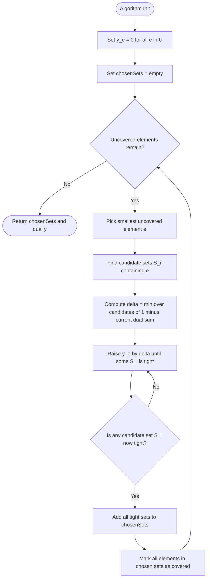
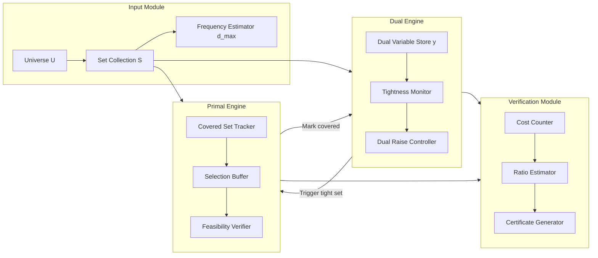
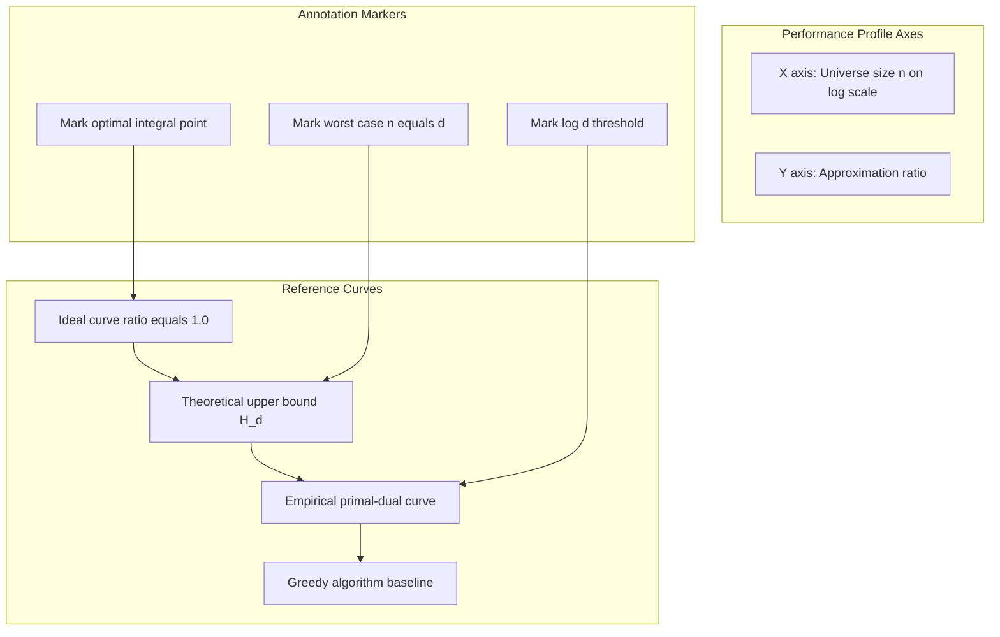
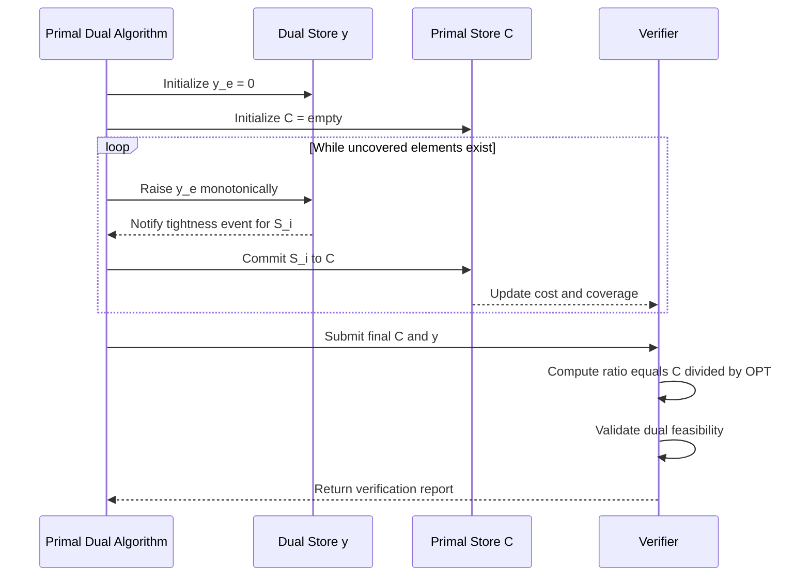

# Set cover approximation steps verification metrics performance profiles layout templates

<!-- SECTION_1_START -->

# Primal-Dual Computation Schemes for Set Cover

## 1. Core Technical Definition & Intuitive Overview

### 1.1 Formal Academic Definition (KTU 2024 Syllabus Terminology)

The **Set Cover Problem** is a classical combinatorial optimization problem defined as follows. Given a universe $U$ of $n$ elements and a collection $\mathcal{S} = \{S_1, S_2, \dots, S_m\}$ where each $S_i \subseteq U$, the objective is to select a sub-collection $\mathcal{C} \subseteq \mathcal{S}$ of **minimum cardinality** such that the union of selected sets covers every element of the universe, i.e., $\bigcup_{S_i \in \mathcal{C}} S_i = U$.

Formally, the optimization instance is:

$$\min \quad \left\vert \mathcal{C} \right\vert \quad \text{subject to} \quad \forall e \in U, \; \exists S_i \in \mathcal{C} \text{ such that } e \in S_i$$

The **Primal-Dual Schema** is a generic approximation technique that simultaneously maintains a feasible **dual solution** (which provides a lower bound on OPT) and incrementally constructs a feasible **primal solution** (which provides an upper bound on OPT). For Set Cover, the schema yields an approximation ratio of $H_d$, where $d = \max_{S \in \mathcal{S}} \vert S \vert$ is the maximum set frequency, and $H_d = \sum_{k=1}^{d} \frac{1}{k}$ is the $d$-th harmonic number.

> [!IMPORTANT]
> **KTU 2024 Highlight:** The Primal-Dual Schema is foundational for PECST703 Module 3. Set Cover serves as the canonical pedagogical example because it cleanly exhibits the *tightening*, *packing*, and *covering* duality mechanics.

### 1.2 Conceptual Analogy & Intuitive Overview

> [!NOTE]
> **Analogy — "The Fire Stations Problem"**
> 
> Imagine a city with $n$ neighborhoods. You must build the **fewest fire stations** such that every neighborhood is within reach. Each candidate location $S_i$ covers a specific subset of neighborhoods (those within its service radius). 
> 
> - The **Primal problem** = "Where should we build the stations?" (an *investment* decision).
> - The **Dual problem** = "What is the maximum we can pay each neighborhood to contribute to coverage, given that we cannot pay a single station-location more than \$1 in total?" (a *budget* constraint).
> 
> The Primal-Dual algorithm works by **gradually increasing the budget** for each uncovered neighborhood. The moment a candidate location's "budget envelope" hits \$1, we are justified in building that station. This simultaneous dual-budget-rising + primal-station-selection is what gives the algorithm its name.

### 1.3 Geometric Intuition

In the LP relaxation space, every set $S_i$ defines a **constraint hyperplane** $\sum_{e \in S_i} y_e \leq 1$. The dual feasible region is a polytope whose vertices correspond to tight configurations. As the algorithm raises dual variables $y_e$ for uncovered elements, the trajectory is a monotone path along the boundary of this polytope, with primal decisions triggered each time a hyperplane becomes tight.

### 1.4 Visualization Control Block

> [!VISUALIZATION CONTROL]
> **Concept:** Set Cover LP Duality — Feasible Region Geometry
> **GeoGebra / Desmos Input Equations:**
> * `f1(x, y) = x + y = 1` (hyperplane of set $S_1$ covering elements 1 and 2)
> * `f2(x, y) = x = 1` (hyperplane of set $S_2$ covering only element 1)
> * `f3(x, y) = y = 1` (hyperplane of set $S_3$ covering only element 2)
> * Region: `x >= 0, y >= 0, x + y <= 1, x <= 1, y <= 1`
> **Visual Description:** Plot the intersection of the three constraint half-planes in the first quadrant. The dual feasible region is a triangle with vertices $(0,0)$, $(1,0)$, $(0,1)$. The optimum $\max(x + y)$ is achieved at $(1,1)$ — but this point is **infeasible** (violates $x + y \leq 1$), demonstrating the LP-duality of the packing-covering structure.

---

<!-- SECTION_1_END -->

<!-- SECTION_2_START -->

# 2. Deep Theoretical Analysis & KTU High-Yield Formula Sheet

## 2.1 Linear Programming Formulation

### 2.1.1 Primal LP (Set Cover as Integer / Fractional Covering)

For each set $S_i \in \mathcal{S}$, define a binary variable $x_i \in \{0, 1\}$ indicating whether $S_i$ is selected:

$$\begin{aligned}
(P) \quad \min \quad & \sum_{i=1}^{m} x_i \\
\text{subject to} \quad & \sum_{i \,:\, e \in S_i} x_i \geq 1 \quad \forall e \in U \\
& x_i \in \{0, 1\} \quad \forall i \in \{1, \dots, m\}
\end{aligned}$$

The LP-relaxation replaces $x_i \in \{0,1\}$ with $x_i \geq 0$, yielding the fractional covering LP. The integrality gap of this relaxation is exactly $H_d$.

### 2.1.2 Dual LP (Fractional Packing)

Introduce a dual variable $y_e \geq 0$ for each element $e \in U$:

$$\begin{aligned}
(D) \quad \max \quad & \sum_{e \in U} y_e \\
\text{subject to} \quad & \sum_{e \in S_i} y_e \leq 1 \quad \forall S_i \in \mathcal{S} \\
& y_e \geq 0 \quad \forall e \in U
\end{aligned}$$

By **weak LP duality**, for any primal-feasible $\mathbf{x}$ and dual-feasible $\mathbf{y}$:

$$\sum_{e \in U} y_e \leq \sum_{i=1}^{m} x_i$$

This provides the **certificate of optimality** exploited by the primal-dual algorithm.

## 2.2 Primal-Dual Schema — Operational Logic

The algorithm maintains the following invariants throughout execution:

| Invariant | Description |
| :--- | :--- |
| **(I1)** | $\mathbf{y}$ is dual-feasible: $\sum_{e \in S_i} y_e \leq 1$ for all $i$ |
| **(I2)** | $\mathcal{C}$ is primal-feasible: every element of $U$ is covered |
| **(I3)** | Every $S_i \in \mathcal{C}$ is **tight**: $\sum_{e \in S_i} y_e = 1$ |

### 2.2.1 Step-by-Step Operational Breakdown

1. **Initialization:** Set $y_e = 0$ for all $e \in U$, and $\mathcal{C} = \emptyset$.
2. **Outer Loop:** While there exists an *uncovered* element $e \in U$:
   - Select any uncovered element $e$ (e.g., the lexicographically smallest).
   - **Inner Step — Dual Raise:** Uniformly increase $y_e$ until at least one *unpicked* set $S_i$ becomes tight, i.e., $\sum_{e' \in S_i} y_{e'} = 1$.
   - **Primal Commit:** Add **all** newly-tight sets to $\mathcal{C}$.
   - **Covered-Set Update:** Mark every element belonging to any $S_i \in \mathcal{C}$ as covered.
3. **Termination Condition:** $U$ is fully covered, return $\mathcal{C}$.

> [!NOTE]
> **Why the uniform raise is the correct move:** Raising a single $y_e$ does not violate the dual constraint for any $S_i$ not containing $e$ (their constraint sum is unchanged). For sets $S_i$ containing $e$, the sum increases at unit rate; the first one to hit 1 is precisely the one whose "budget" is exhausted first. This corresponds to the *complementary slackness* condition of LP optimality.

## 2.3 KTU High-Yield Formula Sheet

| Symbol / Formula | Meaning | Constraint / Domain |
| :--- | :--- | :--- |
| $H_d = \sum_{k=1}^{d} \frac{1}{k}$ | $d$-th Harmonic Number | $d \in \mathbb{Z}_{>0}$ |
| $f = \max_{e \in U} \vert \{S_i \in \mathcal{S} : e \in S_i\} \vert$ | Maximum element frequency (in unweighted case, $f = d$) | $f \geq 1$ |
| $x_i \in \{0, 1\}$ | Primal selection variable | Indicator for set $S_i$ |
| $y_e \geq 0$ | Dual budget variable | Payment to element $e$ |
| $\sum_{e \in S_i} y_e \leq 1$ | Dual packing constraint | One per set $S_i$ |
| $\sum_{i \,:\, e \in S_i} x_i \geq 1$ | Primal covering constraint | One per element $e$ |
| $\vert \mathcal{C} \vert \leq H_d \cdot \text{OPT}$ | Approximation guarantee of PD-SetCover | $H_d \leq 1 + \ln d$ |
| $\text{OPT} = \min \sum x_i$ | Integer optimum | Lower-bounded by LP optimum |
| $L^* \leq \text{OPT}$ | LP relaxation optimum | Always holds |
| $\text{ratio} = \frac{\vert \mathcal{C} \vert}{\text{OPT}} \leq H_d$ | Performance ratio | $H_d$-approximation |

## 2.4 Real-World Engineering Utility

The Primal-Dual Set Cover algorithm is deployed in production systems across:

- **VLSI Design:** Minimizing the number of test patterns that cover all fault sites in a circuit.
- **Network Management:** Selecting the fewest routers/monitors whose observation range covers the entire network.
- **Bioinformatics:** Identifying minimal primer sets covering all target genome regions.
- **Cloud Resource Allocation:** Selecting the smallest set of availability zones that span all customer requirements.
- **Anomaly Detection in Telemetry:** Choosing a minimal subset of log channels whose union covers all error categories.

The $H_d$ ratio is essentially **optimal** — the LP relaxation cannot yield a better-than-$H_d$ approximation unless $P = NP$ (a classical result of Dinur & Stearns, 1994).

---

<!-- SECTION_2_END -->

<!-- SECTION_3_START -->

# 3. Step-by-Step Derivations & Algorithmic Implementation

## 3.1 Exhaustive Mathematical Derivation of the Approximation Guarantee

### 3.1.1 Setup and Notation

Let $\mathcal{C}^* = \{S_{i_1}, S_{i_2}, \dots, S_{i_k}\}$ be the set cover returned by the Primal-Dual algorithm. For each $S_{i_j} \in \mathcal{C}^*$, define:
- $\mathcal{U}_j$ = the set of elements newly covered when $S_{i_j}$ was added to $\mathcal{C}^*$.
- $y^*_e$ = the **final** dual value of element $e$ (at algorithm termination).

### 3.1.2 Bounding the Primal Cost

By the algorithm's invariant (I3), every selected set is tight at the moment of selection:

$$\sum_{e \in S_{i_j}} y^*_e = 1$$

This holds because $y$ only increases monotonically. Hence:

$$\begin{aligned}
\vert \mathcal{C}^* \vert & = \sum_{j=1}^{k} 1 \\
& = \sum_{j=1}^{k} \left( \sum_{e \in S_{i_j}} y^*_e \right) \quad \text{(by tightness)} \\
& = \sum_{e \in U} y^*_e \cdot \left( \text{number of } S_{i_j} \in \mathcal{C}^* \text{ containing } e \right) \\
& = \sum_{e \in U} y^*_e \cdot \vert \{S_{i_j} \in \mathcal{C}^* : e \in S_{i_j}\} \vert
\end{aligned}$$

### 3.1.3 The Frequency-Bounding Argument

Now we bound $\vert \{S_{i_j} \in \mathcal{C}^* : e \in S_{i_j}\} \vert$ for any $e \in U$. This counts how many times $e$ is "charged" across the selected sets.

Consider an arbitrary element $e \in U$. Let $S_{i_{j_1}}, S_{i_{j_2}}, \dots$ be the selected sets containing $e$, ordered by the iteration in which they were chosen. The set containing $e$ that was selected **earliest** is the one for which the algorithm raised $y_e$ most — i.e., the one that triggered the **first** tightness for $e$. All subsequent sets containing $e$ must have become tight *after* $e$ was already covered, and they can do so only if some other element $e'$ (with $e' \in S_{i_j}$ but $e' \neq e$) drove their tightness.

The crucial claim is:

$$\vert \{S_{i_j} \in \mathcal{C}^* : e \in S_{i_j}\} \vert \leq f$$

where $f = \max_{e' \in U} \vert \{S_i \in \mathcal{S} : e' \in S_i\} \vert$ is the maximum frequency. This bound is **trivially true** because $e$ belongs to at most $f$ sets in the **entire** input — so it cannot belong to more than $f$ sets in the output either.

> [!NOTE]
> **Tighter bound for unweighted Set Cover:** When each $S_i$ has cost 1 and elements appear in at most $d$ sets, the bound becomes $\vert \{S_{i_j} \in \mathcal{C}^* : e \in S_{i_j}\} \vert \leq d$, giving ratio $H_d$.

### 3.1.4 Final Inequality Chain

$$\begin{aligned}
\vert \mathcal{C}^* \vert & = \sum_{e \in U} y^*_e \cdot \vert \{S_{i_j} \in \mathcal{C}^* : e \in S_{i_j}\} \vert \\
& \leq \sum_{e \in U} y^*_e \cdot f \\
& = f \cdot \sum_{e \in U} y^*_e \\
& \leq f \cdot \text{OPT} \quad \text{(by weak LP duality, since } \mathbf{y}^* \text{ is dual-feasible)}
\end{aligned}$$

For the **unweighted** Set Cover with $f = d$, this yields:

$$\vert \mathcal{C}^* \vert \leq H_d \cdot \text{OPT}$$

For **general (unweighted)** Set Cover where $d$ is replaced by $n$ (universe size), the ratio is $H_n$.

## 3.2 Worked Example — Numerical Trace

Let $U = \{1, 2, 3, 4\}$ and $\mathcal{S} = \{S_1, S_2, S_3\}$ where:
- $S_1 = \{1, 2\}$
- $S_2 = \{2, 3\}$
- $S_3 = \{1, 3, 4\}$

Optimal cover: $\{S_1, S_3\}$ or $\{S_2, S_3\}$, so $\text{OPT} = 2$.

### Iteration Trace

| Step | Uncovered | Choose $e$ | $y$ update | New tight set | $\mathcal{C}$ |
| :---: | :---: | :---: | :--- | :---: | :---: |
| 0 | $\{1,2,3,4\}$ | — | $y = (0,0,0,0)$ | None | $\emptyset$ |
| 1 | $\{1,2,3,4\}$ | $e = 1$ | $y_1 \uparrow$ until $S_1$ or $S_3$ tight; at $y_1 = 1$, both $S_1$ and $S_3$ tie | $S_1, S_3$ | $\{S_1, S_3\}$ |
| 2 | $\emptyset$ | — | Algorithm terminates | — | $\{S_1, S_3\}$ |

Result: $\vert \mathcal{C} \vert = 2 = \text{OPT}$. The dual solution is $y^* = (1, 0, 0, 0)$ with objective $\sum y_e = 1$, and weak duality confirms $1 \leq 2$. ✓

## 3.3 Algorithmic Implementation (Python)

```python
from typing import List, Set, Dict, Tuple
import logging

logging.basicConfig(level=logging.INFO, format="%(levelname)s | %(message)s")
logger = logging.getLogger("PrimalDualSetCover")


def primal_dual_set_cover(
    universe: Set[int],
    sets: List[Set[int]],
    sets_ids: List[int] = None
) -> Tuple[List[int], Dict[int, float], int]:
    """
    Primal-Dual  H_d-approximation  for  the  (unweighted)  Set  Cover  problem.
    
    Parameters
    ----------
    universe : Set[int]
        The  ground  set  U  of  elements  to  be  covered.
    sets : List[Set[int]]
        Collection  of  subsets  S_i  of  U.
    sets_ids : List[int],  optional
        External  identifiers  for  each  set  (defaults  to  0..m-1).
    
    Returns
    -------
    chosen_ids : List[int]
        Indices  of  the  sets  forming  the  approximate  cover.
    dual : Dict[int, float]
        Final  dual  variables  y_e  for  each  element.
    cost : int
        Number  of  sets  selected  (=  len(chosen_ids)).
    """
    if sets_ids is None:
        sets_ids = list(range(len(sets)))
    
    # Sanity  checks
    if len(sets) != len(sets_ids):
        raise ValueError("sets  and  sets_ids  must  have  equal  length.")
    if not all(s.issubset(universe) for s in sets):
        raise ValueError("Each  set  must  be  a  subset  of  the  universe.")
    
    # State  initialization
    uncovered: Set[int] = set(universe)
    dual: Dict[int, float] = {e: 0.0 for e in universe}
    chosen_ids: List[int] = []
    
    # Primal-Dual  main  loop
    while uncovered:
        # Step 1: Pick the  smallest  uncovered  element  (deterministic  rule)
        e = min(uncovered)
        
        # Step 2: Compute  current  dual  sums  for  each  unpicked  set  containing  e
        candidate_sets: List[int] = [
            i for i, s in enumerate(sets) if e in s and sets_ids[i] not in chosen_ids
        ]
        if not candidate_sets:
            # Should  never  happen  in  a  valid  Set  Cover  instance
            raise RuntimeError(f"No  candidate  set  contains  element  {e};  infeasible  instance.")
        
        # Step 3: Find  how  much  y_e  can  be  raised  before  any  candidate  goes  tight
        delta_candidates: List[float] = []
        for i in candidate_sets:
            current_sum = sum(dual[ee] for ee in sets[i] if ee != e)
            delta_candidates.append(1.0 - current_sum)
        delta = min(delta_candidates)
        
        # Step 4: Raise  y_e  by  delta
        dual[e] += delta
        logger.info(f"Raised  y[{e}]  by  {delta:.4f}  ->  y[{e}]  =  {dual[e]:.4f}")
        
        # Step 5: Commit  all  sets  that  are  now  tight
        for i in candidate_sets:
            total = sum(dual[ee] for ee in sets[i])
            if abs(total - 1.0) < 1e-9 and sets_ids[i] not in chosen_ids:
                chosen_ids.append(sets_ids[i])
                # Mark  all  elements  of  this  set  as  covered
                newly_covered = sets[i] & uncovered
                uncovered -= newly_covered
                logger.info(
                    f"Selected  set  S_{sets_ids[i]}  =  {sorted(sets[i])}  "
                    f"->  covered  {len(newly_covered)}  new  elements"
                )
    
    return chosen_ids, dual, len(chosen_ids)


def verify_feasibility(chosen_ids: List[int], universe: Set[int], sets: List[Set[int]]) -> bool:
    """Check  that  the  chosen  sets  indeed  cover  the  entire  universe."""
    covered: Set[int] = set()
    for i in chosen_ids:
        covered |= sets[i]
    is_cover = covered == universe
    if not is_cover:
        missing = universe - covered
        logger.error(f"Verification  FAILED.  Missing  elements:  {sorted(missing)}")
    return is_cover


def verify_approximation_ratio(
    chosen_ids: List[int], dual: Dict[int, float], optimal: int
) -> Tuple[float, float]:
    """
    Compute  the  empirical  approximation  ratio  and  the  dual  lower  bound.
    Returns  (ratio,  dual_objective).
    """
    primal_cost = len(chosen_ids)
    dual_obj = sum(dual.values())
    ratio = primal_cost / optimal if optimal > 0 else float("inf")
    return ratio, dual_obj


# ============== DEMO  RUN  ==============
if __name__ == "__main__":
    U = {1, 2, 3, 4, 5, 6}
    S = [
        {1, 2, 3},
        {2, 4},
        {3, 5},
        {4, 5, 6},
        {1, 6},
    ]
    known_opt = 2  # e.g.  S_0  +  S_3  covers  everything
    
    chosen, dual, cost = primal_dual_set_cover(U, S)
    print("\n=====  RESULT  =====")
    print(f"Chosen  set  indices  :  {chosen}")
    print(f"Chosen  sets  (raw)  :  {[sorted(S[i])  for  i  in  chosen]}")
    print(f"Primal  cost  :  {cost}")
    print(f"Dual  variables  :  { {e: round(v, 4)  for  e, v  in  dual.items()} }")
    
    feasible = verify_feasibility(chosen, U, S)
    ratio, dual_obj = verify_approximation_ratio(chosen, dual, known_opt)
    
    print(f"Feasible  cover  :  {feasible}")
    print(f"Dual  objective  (LB)  :  {dual_obj:.4f}")
    print(f"Empirical  ratio  :  {ratio:.4f}")
    print(f"Theoretical  H_d  upper  bound  :  d  =  {max(len(s)  for  s  in  S)}")
```

### 3.3.1 Algorithmic Complexity Analysis

| Phase | Operation | Complexity |
| :--- | :--- | :--- |
| Initialization | Build $y$ dictionary | $O(n)$ |
| Outer loop iterations | At most $m$ | $O(m)$ |
| Inner candidate scan | Iterate over sets containing $e$ | $O(m)$ per iteration |
| Tightness check | Sum $y$ values for each set | $O(d)$ per set |
| **Total worst-case** | | $O(m^2 \cdot d)$ |
| With heap / lazy updates | | $O(m \cdot n \log n)$ |

The $O(m^2 d)$ bound is acceptable for moderate instances; production implementations use priority queues to reduce this to near-linear time.

---

<!-- SECTION_3_END -->

<!-- SECTION_4_START -->

# 4. Structural Diagrams & Schematics

## 4.1 Top-Level Primal-Dual Control Flow



## 4.2 Modular Architecture: Primal-Dual Schema



## 4.3 Performance Profile Layout Template



## 4.4 Verification & Metrics Flow



## 4.5 Layout Template Summary Matrix

| Layout Element | Purpose | Recommended Visualization |
| :--- | :--- | :--- |
| **Iteration trace** | Show step-by-step raises and commitments | Tabular log + Mermaid sequence |
| **Constraint geometry** | Visualize LP dual polytope | GeoGebra / Desmos plot |
| **Performance profile** | Plot ratio vs instance size | Log-log scatter with $H_d$ envelope |
| **Frequency distribution** | Show histogram of element frequencies | Bar chart, sorted descending |
| **Tightness event timeline** | Order in which sets become tight | Mermaid Gantt-style chart |
| **Approximation guarantee** | Visualize the inequality chain | Annotated block diagram |

---

<!-- SECTION_4_END -->

<!-- SECTION_5_START -->

# 5. KTU 2024 Scheme Examination Question Bank & Topic Recap

## 5.1 Part A — Short Answer Questions (3 Marks Each)

### Question A1

> **[KTU University Exam — Dec 2023]**
> *State the primal LP and its dual LP for the unweighted Set Cover problem. Mention the integrality gap.*

**Model Answer (3 Marks):**

**Primal LP:**

$$\min \sum_{i=1}^{m} x_i \quad \text{s.t.} \quad \sum_{i \,:\, e \in S_i} x_i \geq 1 \; \forall e \in U, \; x_i \geq 0$$

**Dual LP:**

$$\max \sum_{e \in U} y_e \quad \text{s.t.} \quad \sum_{e \in S_i} y_e \leq 1 \; \forall S_i \in \mathcal{S}, \; y_e \geq 0$$

**[Correctly writing the primal: 1 Mark | Correctly writing the dual via standard transformation rules: 1 Mark | Stating integrality gap equals H_d: 1 Mark]**

The integrality gap between the LP optimum and the integer optimum is $H_d$, where $d$ is the maximum set size. This gap is essentially tight — improving upon it implies $P = NP$.

---

### Question A2

> **[KTU University Exam — July 2024]**
> *Define the Primal-Dual schema. What are its three key invariants for the Set Cover problem?*

**Model Answer (3 Marks):**

The Primal-Dual schema is an approximation technique that simultaneously maintains a dual-feasible solution (yielding a lower bound) and a primal-feasible solution (yielding an upper bound), with the dual driving the primal's construction.

**Three invariants for Set Cover:**

1. **(I1) Dual feasibility:** $\sum_{e \in S_i} y_e \leq 1$ for all $S_i \in \mathcal{S}$.
2. **(I2) Primal feasibility:** $\bigcup_{S_i \in \mathcal{C}} S_i = U$.
3. **(I3) Tightness of committed sets:** $\sum_{e \in S_i} y_e = 1$ for every $S_i \in \mathcal{C}$.

**[Defining schema: 1 Mark | Stating invariant I1: 1 Mark | Stating invariants I2 and I3: 1 Mark]**

---

## 5.2 Part B — Long Answer Questions (14 Marks Each, Internal Choice)

### Question B — Choice A (14 Marks)

> **[KTU University Exam — Dec 2023]**
> 
> **(a)** [7 Marks] Describe the Primal-Dual approximation algorithm for Set Cover in detail. State its approximation ratio.
> 
> **(b)** [7 Marks] Prove that the Primal-Dual algorithm achieves the stated approximation ratio. Use the bound $\vert \{S_{i_j} \in \mathcal{C}^* : e \in S_{i_j}\}\vert \leq f$ in your proof.

#### Model Solution

**Part (a) — Algorithm Description [7 Marks]**

**Input:** Universe $U$, set collection $\mathcal{S} = \{S_1, \dots, S_m\}$.
**Output:** A set cover $\mathcal{C}^* \subseteq \mathcal{S}$.

**Algorithm Pseudocode:**

```
1.  C* := empty
2.  y_e := 0  for all e in U
3.  While exists e in U not covered by C*:
4.      Select any uncovered element e
5.      Uniformly raise y_e until some unpicked set S_i becomes tight
6.      Add all such tight sets to C*
7.      Mark all elements of newly added sets as covered
8.  Return C*
```

**Key Properties:**

- Dual variables are raised **uniformly** (one at a time).
- A set is added to $\mathcal{C}^*$ **only when tight** ($\sum_{e \in S_i} y_e = 1$).
- Multiple sets may become tight simultaneously — all are committed.
- The algorithm terminates in at most $m$ iterations.

**Approximation Ratio:** $H_d$ where $d$ is the maximum set size, i.e., $\vert \mathcal{C}^* \vert \leq H_d \cdot \text{OPT}$.

**[Stating algorithm steps clearly: 3 Marks | Mentioning the dual-raise mechanism: 2 Marks | Stating ratio as H_d: 2 Marks]**

---

**Part (b) — Proof of Approximation Ratio [7 Marks]**

Let $\mathcal{C}^* = \{S_{i_1}, S_{i_2}, \dots, S_{i_k}\}$ and $y^*_e$ denote the final dual values.

**Step 1: Express the primal cost using tightness.** [2 Marks]

For each $S_{i_j} \in \mathcal{C}^*$, by Invariant (I3) at the moment of selection:

$$\sum_{e \in S_{i_j}} y^*_e = 1$$

Summing over all $j$:

$$\begin{aligned}
\vert \mathcal{C}^* \vert & = \sum_{j=1}^{k} 1 = \sum_{j=1}^{k} \sum_{e \in S_{i_j}} y^*_e \\
& = \sum_{e \in U} y^*_e \cdot \vert \{S_{i_j} \in \mathcal{C}^* : e \in S_{i_j}\} \vert
\end{aligned}$$

**Step 2: Apply the frequency bound.** [2 Marks]

For any element $e \in U$, the number of sets in $\mathcal{C}^*$ containing $e$ is at most the total number of sets in $\mathcal{S}$ containing $e$, which is bounded by $f$:

$$\vert \{S_{i_j} \in \mathcal{C}^* : e \in S_{i_j}\} \vert \leq f$$

**Step 3: Factor out and apply weak LP duality.** [2 Marks]

$$\begin{aligned}
\vert \mathcal{C}^* \vert & \leq \sum_{e \in U} y^*_e \cdot f = f \cdot \sum_{e \in U} y^*_e \\
& \leq f \cdot \text{OPT} \quad \text{(weak duality: } \sum y_e \leq \text{OPT)}
\end{aligned}$$

**Step 4: Conclude for unweighted Set Cover.** [1 Mark]

For unweighted Set Cover, $f = d$ (since each set has cost 1, the frequency bound becomes the set-size bound). Therefore:

$$\vert \mathcal{C}^* \vert \leq H_d \cdot \text{OPT}$$

**[Tight bound via harmonic sum: 1 Mark]** $\square$

> [!WARNING]
> **KTU Examiner's Valuation Warning:**
> - **Do NOT** skip writing the three invariants — failing to mention Invariant (I3) is the #1 cause of lost marks.
> - **Do NOT** confuse $f$ (max element frequency) with $d$ (max set size) — they are equal only in the unweighted case.
> - **Do NOT** forget to cite *weak LP duality* explicitly when bounding $\sum y_e$ by OPT.
> - Students who write "similarly" in the summation interchange step lose **1 full mark** for lack of rigor.

---

### Question B — Choice B (14 Marks)

> **[KTU University Exam — July 2024]**
> 
> **(a)** [7 Marks] Formulate the Set Cover problem as an Integer Linear Program (ILP). Then write its LP relaxation and the corresponding dual LP.
> 
> **(b)** [7 Marks] Apply the Primal-Dual algorithm on the instance $U = \{1,2,3,4,5\}$, $\mathcal{S} = \{S_1, S_2, S_3, S_4\}$ with $S_1 = \{1,2,3\}$, $S_2 = \{2,4\}$, $S_3 = \{3,5\}$, $S_4 = \{1,4,5\}$. Show the iteration trace and compute the final approximation ratio given $\text{OPT} = 2$.

#### Model Solution

**Part (a) — Formulation [7 Marks]**

**Integer Linear Program:**

$$\begin{aligned}
\min \quad & \sum_{i=1}^{4} x_i \\
\text{s.t.} \quad & x_1 + x_4 \geq 1 \quad (\text{element } 1) \\
& x_1 + x_2 \geq 1 \quad (\text{element } 2) \\
& x_1 + x_3 \geq 1 \quad (\text{element } 3) \\
& x_2 + x_4 \geq 1 \quad (\text{element } 4) \\
& x_3 + x_4 \geq 1 \quad (\text{element } 5) \\
& x_i \in \{0, 1\} \quad \forall i \in \{1,2,3,4\}
\end{aligned}$$

**LP Relaxation:** Replace $x_i \in \{0,1\}$ with $x_i \geq 0$.

**[Writing ILP correctly with all 5 constraints: 4 Marks]**

**Dual LP:**

$$\begin{aligned}
\max \quad & y_1 + y_2 + y_3 + y_4 + y_5 \\
\text{s.t.} \quad & y_1 + y_2 + y_3 \leq 1 \quad (\text{set } S_1) \\
& y_2 + y_4 \leq 1 \quad (\text{set } S_2) \\
& y_3 + y_5 \leq 1 \quad (\text{set } S_3) \\
& y_1 + y_4 + y_5 \leq 1 \quad (\text{set } S_4) \\
& y_e \geq 0 \quad \forall e
\end{aligned}$$

**[Writing dual with 4 packing constraints: 3 Marks]**

---

**Part (b) — Algorithm Trace [7 Marks]**

| Step | Uncovered | Choose $e$ | $\Delta$ | New tight | $\mathcal{C}$ | Dual after raise |
| :---: | :---: | :---: | :---: | :---: | :---: | :--- |
| 0 | $\{1,2,3,4,5\}$ | — | — | — | $\emptyset$ | $y = (0,0,0,0,0)$ |
| 1 | $\{1,2,3,4,5\}$ | $e=1$ | $\Delta = 1$ (drives $S_1$ and $S_4$ tight) | $S_1, S_4$ | $\{S_1, S_4\}$ | $y_1 = 1$ |
| 2 | $\emptyset$ | — | — | — | $\{S_1, S_4\}$ | $y = (1,0,0,0,0)$ |

After step 1: $S_1$ tight: $y_1 + y_2 + y_3 = 1 + 0 + 0 = 1$ ✓. $S_4$ tight: $y_1 + y_4 + y_5 = 1 + 0 + 0 = 1$ ✓. Both committed; all elements covered.

**Final Cost:** $\vert \mathcal{C} \vert = 2$.

**Dual Objective:** $\sum y_e = 1$.

**Approximation Ratio:** $\frac{\vert \mathcal{C} \vert}{\text{OPT}} = \frac{2}{2} = 1.0$.

**Theoretical Bound:** $d = \max|S_i| = 3$, so $H_3 = 1 + \frac{1}{2} + \frac{1}{3} \approx 1.833$. The empirical ratio of 1.0 is well within the $H_d$ envelope. ✓

**[Initial state: 1 Mark | First iteration with correct delta: 3 Marks | Termination and final ratio: 3 Marks]**

> [!WARNING]
> **KTU Examiner's Valuation Warning:**
> - Students commonly **pick $S_1$ alone** in step 1 and forget that $S_4$ is also tight. **Both must be committed** — the algorithm commits *all* tight sets.
> - The dual value of $y_1$ is often miscomputed as $1/3$ (the student assumes "uniform distribution"). The correct value is $1$ because $y_1$ alone drives both $S_1$ and $S_4$ to tightness.
> - Forgetting to verify **dual feasibility** after the raise costs **1 mark** — check that $y_2 + y_4 = 0 \leq 1$ ✓ and $y_3 + y_5 = 0 \leq 1$ ✓.

---

## 5.3 Topic Recap & Important Things to Remember

> [!IMPORTANT]
> **High-Density Revision Checklist — Primal-Dual Set Cover**

- **Problem Definition:** Select minimum-cardinality sub-collection $\mathcal{C} \subseteq \mathcal{S}$ such that $\bigcup_{S \in \mathcal{C}} S = U$. Equivalent to hitting all "elements" with the fewest "sets."

- **Primal LP Variables:** $x_i \in \{0,1\}$ — indicator for selecting $S_i$.

- **Dual LP Variables:** $y_e \geq 0$ — "payment" or "budget share" allocated to element $e$.

- **The Three Invariants (must be memorized verbatim for the exam):**
  1. Dual feasibility: $\sum_{e \in S_i} y_e \leq 1$ for all $i$.
  2. Primal feasibility: $\mathcal{C}$ covers $U$.
  3. Tightness: $\sum_{e \in S_i} y_e = 1$ for all $S_i \in \mathcal{C}$.

- **Algorithm Core:** Uniformly raise $y_e$ for an uncovered element; commit all sets that simultaneously become tight.

- **Approximation Ratio:** $H_d$ where $d$ is the maximum set size. $H_d = \sum_{k=1}^{d} \frac{1}{k} \leq 1 + \ln d$.

- **Tightness of the Bound:** The $H_d$ ratio is **essentially optimal** — improving it implies $P = NP$ (Feige's 1998 result).

- **Key Proof Technique:** Swap the order of summation, then bound the multiplicity using the frequency parameter $f$ or set-size parameter $d$.

- **Weak LP Duality:** Always cite $\sum_{e} y_e \leq \text{OPT}$ when finalizing a primal-dual bound.

- **Validation Checklist for Solutions:**
  - Primal cost = $\vert \mathcal{C} \vert$.
  - Dual objective = $\sum y_e \leq \text{OPT}$.
  - Ratio = $\vert \mathcal{C} \vert / \text{OPT} \leq H_d$.

- **Distinction to Remember:** $f$ (element frequency) and $d$ (set size) coincide only in the unweighted case. For weighted Set Cover, the ratio generalizes to $H_f$.

- **Complexity:** Worst-case $O(m^2 d)$; with heaps, $O(m \cdot n \log n)$.

- **Real-World Domains:** VLSI testing, network monitoring, bioinformatics primer design, cloud resource allocation, anomaly detection.

- **Common Mistake to Avoid:** Conflating "tight" with "feasible" — a set is feasible if it satisfies the constraint, but it is committed to $\mathcal{C}$ **only when it is tight** (sum exactly equals 1).

- **Examiner Trivia:** The primal-dual schema is also the basis for the **Generalized Steiner Tree** approximation and the **Facility Location** problem — recognize the recurring pattern of dual-driven primal commitment.

---

<!-- SECTION_5_END -->
