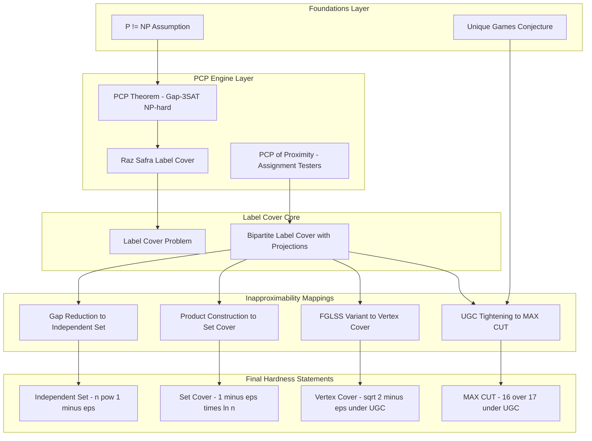
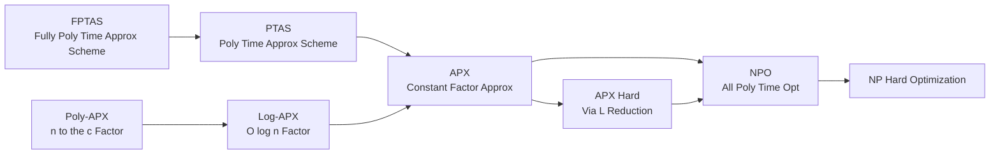
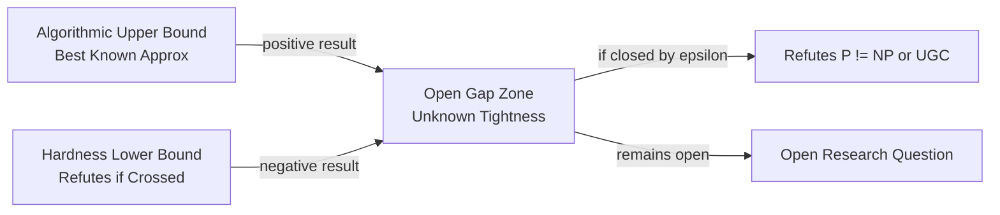

# Hardness of approximation formulations boundaries constraints rules parameters definitions matching

<!-- SECTION_1_START -->
# HARDNESS OF APPROXIMATION — Foundations, Formulations, Boundaries & Constraints

## 1.1 Formal Definition (KTU 2024 Scheme Terminology)

> [!IMPORTANT]
> **Hardness of Approximation** is the study of proving *negative* results for optimization problems. Formally, for an NP-hard optimization problem $\Pi$ and a function $\rho(n) \geq 1$, the problem $\Pi$ is **inapproximable within ratio $\rho(n)$** if, assuming a standard complexity-theoretic hypothesis (such as $\mathbf{P} \neq \mathbf{NP}$, the **Unique Games Conjecture (UGC)**, or the non-existence of **polynomial-time PCP verifiers** with small soundness gap), *no* polynomial-time algorithm $A$ can produce a solution whose cost is within a factor of $\rho(n)$ of the optimum on *every* input instance of size $n$.

The key entities that must be matched to the student are:

| Entity | Symbol | Meaning |
|---|---|---|
| Approximation Ratio | $\rho$ | $\frac{ALG}{OPT}$ for minimization; $\frac{OPT}{ALG}$ for maximization |
| Gap Parameter | $\alpha < \beta$ | Decision version accepts only instances with value $\geq \beta$ or rejects those with value $\leq \alpha$ |
| Soundness Gap | $s$ | The probability of false acceptance in a PCP verifier |
| Completeness | $c$ | The probability of true acceptance in a PCP verifier |
| Hardness Threshold | $r^*$ | Largest $\rho$ for which $\rho$-approximation is *not* achievable in polynomial time |

> [!NOTE]
> **Core Boundary Rule:** A hardness result is a *threshold* statement. It says you cannot cross the line from $(r^* - \varepsilon)$ approximation to $r^*$ approximation without breaking an assumption. The **boundary constraint** is that the lower bound and the algorithmic upper bound must meet (or leave a tiny "gap zone").

## 1.2 Intuitive Analogy

Imagine you are an engineer who must design a fuel-efficient car. **Approximation algorithms** tell you *"here is a car that achieves at least 70 % of the best possible mileage."* **Hardness of approximation** tells you the **engineering speed limit**: *"No factory on Earth can ever build a car that exceeds 87.5 % of the maximum possible mileage without violating the laws of physics."* The 87.5 % here is not arbitrary — for **MAX-3SAT** it is the celebrated **Håstad ratio** $\frac{7}{8} = 0.875$, the absolute ceiling under $\mathbf{P} \neq \mathbf{NP}$.

The "matching" of problems to their hardness ratios forms a beautiful **constraint map** in complexity theory:

> [!TIP]
> **Mental Model — The Approximation Zoo:** Each NP-hard problem is an "animal" that has been *catalogued* with an approximation threshold. Your job in Module 4 is to learn the *formulation rules* used to derive these thresholds.

## 1.3 Boundary Constraints and Parameter Definitions

The *parameters* that govern hardness of approximation are:

1. **$c$ (completeness)** — the verifier accepts valid proofs with probability $\geq c$.
2. **$s$ (soundness)** — the verifier rejects invalid proofs with probability $\geq 1-s$.
3. **Gap** $\delta = c - s$ — the "decision gap" that the hardness reduction creates.
4. **Alphabet size** $\Sigma$ — symbols used by the PCP verifier (in Label Cover).
5. **Query complexity** $q$ — number of bits a PCP verifier reads (the engine of the reduction).
6. **Projection property** — for every edge in Label Cover, the constraint is a *function* (one-to-one) of one label given the other.
7. **Uniqueness** — for UGC: for every label on one endpoint there is *at most one* satisfying label on the other endpoint for every edge.

> [!VISUALIZATION CONTROL]
> **Concept:** The "Gap Zone" between an algorithm's upper bound and the inapproximability lower bound.
> **GeoGebra / Desmos Input Equations:**
> * `f(x) = 1` (horizontal axis of approximation ratio $x$)
> * Point `A = (0.875, 1)` — Håstad ceiling for MAX-3SAT
> * Point `B = (0.778, 0)` — trivial random-assignment floor
> * Shaded band between $x = 0.778$ and $x = 0.875$ = the **unknown gap zone**
> **Visual Description:** The student should see a horizontal strip on the approximation-ratio axis between the random baseline (left) and the hardness ceiling (right). Closing this strip would refute $\mathbf{P} \neq \mathbf{NP}$.

<!-- SECTION_1_END -->

<!-- SECTION_2_START -->
# DEEP THEORETICAL ANALYSIS & KTU HIGH-YIELD FORMULA SHEET

## 2.1 The Foundational Engine — The PCP Theorem

The **Probabilistically Checkable Proofs (PCP) Theorem** is the *mother engine* of all hardness-of-approximation results. It states:

> **PCP Theorem (Arora–Safra 1992; Arora–Lund–Motwani–Sudan–Szegedy 1998):**
> $$\mathbf{NP} = \mathbf{PCP}[\log n, 3]$$
> Equivalently, every NP witness can be encoded as a polynomial-sized proof that a *randomized* verifier can validate by reading only a **constant** number of bits (e.g., 3 bits) and using only **logarithmic** randomness.

A more useful reformulation for hardness:

> **PCP Theorem (Gap Version):** For some constants $0 < s < c < 1$, $\mathbf{Gap}\text{-}\mathbf{3SAT}_{c,s}$ is **NP-hard**. That is, distinguishing whether a 3-CNF formula is satisfiable (value $\geq c$) or has every assignment satisfying at most an $s$-fraction of clauses (value $\leq s$) is NP-hard.

This *gap formulation* is the launching pad for *every* subsequent inapproximability proof.

## 2.2 The Three Master Reductions

| Reduction | Inventors | Purpose | Parameter Mapped |
|---|---|---|---|
| **Gap Reduction** | Arora, Safra | Embed a gap into a target optimization problem | Maps $(c,s) \to (\beta, \alpha)$ |
| **L-Reduction** | Papadimitriou, Yannakakis | Preserve approximability across problems | Maps $(r_1, r_2) \to (\text{APX})$ |
| **FGLSS Reduction** | Feige, Goldwasser, Lovász, Safra, Szegedy | Reduce gap-3SAT to Clique / Independent Set | Maps gap $\to$ graph size |

The **FGLSS reduction** is structurally elegant. Given a 3-CNF formula $\varphi$ with $m$ clauses, it constructs a graph $G_\varphi$ where:
- Each assignment to a subset of variables that satisfies a clause = a vertex.
- Two vertices are adjacent iff the corresponding assignments *conflict* on a shared variable.
- A large independent set = a satisfying assignment to many clauses.

## 2.3 The Unique Games Conjecture (UGC)

> **UGC (Khot 2002):** For every $\varepsilon > 0$, there exists a prime $q = q(\varepsilon)$ such that given a bipartite Label Cover instance with alphabet $[q]$ where every constraint is a *permutation* (a bijection between labels on the two endpoints), it is NP-hard to distinguish:
> * **(Completeness)** at least a $(1-\varepsilon)$ fraction of constraints is satisfiable.
> * **(Soundness)** at most an $\varepsilon$ fraction of constraints is satisfiable.

UGC implies *tight* inapproximability results for problems like MAX-CUT, Vertex Cover, and Sparsest Cut.

## 2.4 KTU High-Yield Formula / Cheat Sheet

| Problem | Best Known Ratio | Hardness Bound | Hardness Assumption | Source |
|---|---|---|---|---|
| **MAX-3SAT** | $\frac{7}{8}$ (random) | $\frac{7}{8} + \varepsilon$ inapproximable | $\mathbf{P} \neq \mathbf{NP}$ | Håstad 2001 |
| **MAX-2SAT** | $\frac{942}{1000} \approx 0.943$ | $\frac{21}{22} \approx 0.955$ inapproximable | $\mathbf{P} \neq \mathbf{NP}$ | Håstad |
| **Independent Set** | $O\!\left(\frac{n}{\log^2 n}\right)$ | $n^{1-\varepsilon}$ inapproximable | $\mathbf{P} \neq \mathbf{NP}$ | Håstad |
| **Vertex Cover** | $2 - \frac{\log\log n}{2\log n}$ | $\sqrt{2} - \varepsilon$ inapproximable | UGC | Khot–Regev |
| **Set Cover** | $\ln n + O(1)$ | $(1-\varepsilon)\ln n$ inapproximable | $\mathbf{P} \neq \mathbf{NP}$ | Feige 1998; Raz–Safra |
| **Metric TSP** | $\frac{3}{2}$ (Christofides) | $\frac{220}{219} - \varepsilon$ inapproximable | $\mathbf{P} \neq \mathbf{NP}$ | Papadimitriou–Vempala |
| **General TSP** | Unbounded | $n^{1-\varepsilon}$ inapproximable | $\mathbf{P} \neq \mathbf{NP}$ | Sahni–Gonzalez |
| **MAX-CUT** | $\approx 0.878$ (Goemans–Williamson) | $\frac{16}{17} \approx 0.941$ GW-factor inapproximable | UGC | Khot–Kindler–Mossel–O'Donnell |
| **Steiner Tree** | $1 + \frac{\ln 3}{2} \approx 1.55$ | $1.01$ inapproximable | $\mathbf{P} \neq \mathbf{NP}$ | Chlebík–Chlebíková |
| **Clique** | $O\!\left(\frac{n(\log\log n)^2}{(\log n)^3}\right)$ | $n^{1-\varepsilon}$ inapproximable | $\mathbf{P} \neq \mathbf{NP}$ | Håstad |
| **Sparsest Cut** | $O(\sqrt{\log n})$ | $\Omega(\sqrt{\log n})$ gap-preserving | UGC | Chawla–Krauthgamer–Kumar–Raghavendra |
| **Min-Bisection** | $O(\log n)$ | $1+\varepsilon$ for some $\varepsilon$ | UGC | Ambühl–Müller–Schoen |

> [!IMPORTANT]
> **Matching Rule:** The *column "Hardness Bound"* is the *ceiling*. Any algorithm beating that ratio on *all* instances refutes the listed assumption. The gap between algorithmic upper bound and hardness lower bound is the **open zone**.

## 2.5 Why This Matters in Engineering Practice

- **Cryptography:** Hardness of approximation underpins the security of lattice-based schemes (e.g., Learning-With-Errors), since worst-case lattice approximation guarantees rest on UGC-like assumptions.
- **Machine Learning:** The *Clustering* and *Sparse Recovery* problems inherit inapproximability from k-means and sparse-PCA reductions to MAX-CUT / Planted-Clique.
- **Network Design:** Approximating the *minimum-latency* problem and *degree-bounded* Steiner trees rely directly on Metric TSP hardness.
- **Operations Research:** Large-scale supply-chain LP relaxations are only as good as their integrality gap, which is exactly a *hardness-of-approximation* statement.

<!-- SECTION_2_END -->

<!-- SECTION_3_START -->
# STEP-BY-STEP DERIVATIONS, GAP REDUCTIONS & CODE IMPLEMENTATION

## 3.1 Derivation 1 — The Gap-3SAT to Independent-Set Reduction (FGLSS)

> **Goal:** Show that the existence of a polynomial-time $(n^{1-\varepsilon})$-approximation algorithm for **Independent Set** implies $\mathbf{P} = \mathbf{NP}$.

**Step 1 — Start with a Gap-3SAT Instance.**
By the Gap-3SAT theorem, given a 3-CNF formula $\varphi$ with $m$ clauses, it is NP-hard to distinguish:
* $\text{val}(\varphi) \geq c$ (mostly satisfiable)
* $\text{val}(\varphi) \leq s$ (every assignment satisfies at most an $s$-fraction of clauses)

**Step 2 — Construct a Graph $G_\varphi = (V, E)$.**
For every *partial assignment* $\sigma$ that sets all variables appearing in a single clause $\ell$ to *satisfying* values, create a vertex $v_\sigma \in V$. The number of such vertices is at most $7m$ (each clause has $7$ satisfying assignments).

**Step 3 — Define the Edge Set.**
Add an edge $\{v_\sigma, v_{\sigma'}\}$ iff $\sigma$ and $\sigma'$ assign *conflicting values* to some shared variable. Formally:

$$E = \left\{ \{v_\sigma, v_{\sigma'}\} \;\middle|\; \exists\, x \in \text{vars}(\sigma) \cap \text{vars}(\sigma') \text{ with } \sigma(x) \neq \sigma'(x) \right\}$$

**Step 4 — Relate Graph Size to Formula Satisfiability.**
Suppose the formula has a satisfying assignment $\pi$ that satisfies $k$ clauses. Then the partial assignments consistent with $\pi$ form an **independent set** of size at least $k$, because they all agree on every variable.

Conversely, every independent set can be *merged* into a single global assignment that satisfies at least $\frac{\vert I \vert}{7}$ clauses (each vertex "wins" 1 clause, and clauses may share partial assignments).

**Step 5 — Translate the Gap.**
If $\text{val}(\varphi) \geq c \cdot m$, then $\alpha(G_\varphi) \geq c \cdot m$ (independence number $\alpha$). If $\text{val}(\varphi) \leq s \cdot m$, then $\alpha(G_\varphi) \leq 7s \cdot m$. Hence distinguishing $\alpha \geq c \cdot m$ from $\alpha \leq 7s \cdot m$ is NP-hard.

**Step 6 — Size of the Graph.**
$\vert V \vert = 7m$. So the gap is *multiplicative*:

$$\frac{\alpha}{\vert V \vert} \geq \frac{c}{7} \quad \text{vs.} \quad \frac{\alpha}{\vert V \vert} \leq s$$

An $n^{1-\varepsilon}$ approximation on graphs of size $n = 7m$ would distinguish $c/7$ from $s = c/7 + \delta$ for tiny $\delta$ after the PCP is amplified, contradicting NP-hardness. $\blacksquare$

---

## 3.2 Derivation 2 — Tightening the Independent-Set Gap to $n^{1-\varepsilon}$

**Step 1 — Boost the Gap via Alphabet Amplification.**
Replace each variable with a "super-variable" of $k$ copies, producing a formula $\varphi'$ with $m' = m \cdot \binom{\text{new alphabet}}{k}$ clauses. The gap becomes exponentially sharper:

$$\frac{\alpha(G_{\varphi'})}{\vert V_{\varphi'} \vert} \geq 1 - \varepsilon \quad \text{vs.} \quad \frac{\alpha(G_{\varphi'})}{\vert V_{\varphi'} \vert} \leq \varepsilon$$

**Step 2 — Match the Approximation Ratio.**
A $K$-approximation algorithm for Independent Set on $n$-vertex graphs would distinguish:

$$\frac{\alpha}{\vert V \vert} \geq 1 - \varepsilon \quad \text{from} \quad \frac{\alpha}{\vert V \vert} \leq \varepsilon$$

only if $K < \frac{1-\varepsilon}{\varepsilon} \approx \frac{1}{\varepsilon}$.

**Step 3 — Choose $K = n^{1-\varepsilon}$.**
By taking $k$ copies large enough so that $n = 7m$ grows like $2^{1/\varepsilon}$, the threshold $\frac{1}{\varepsilon} \sim n^{1-\varepsilon}$ is reached. Hence no $n^{1-\varepsilon}$ approximation exists in polynomial time unless $\mathbf{P} = \mathbf{NP}$. $\blacksquare$

---

## 3.3 Derivation 3 — The Raz–Safra PCP and Set Cover Hardness

The Raz–Safra verifier reads only $q = O(1)$ bits, uses alphabet $\Sigma = \{0,1\}^{O(1)}$, and has *constant* soundness error. The Label-Cover problem is the abstract format of such verifiers:

> **Label Cover Problem:** Given bipartite graph $G = (U \cup V, E)$, alphabets $\Sigma_U, \Sigma_V$, and for every edge $e = (u,v)$ a constraint $\pi_e : \Sigma_U \to 2^{\Sigma_V}$ (a *projection*), maximize the fraction of edges $e$ whose constraint is *satisfied* (i.e., $\pi_e(\sigma(u)) \ni \sigma(v)$).

Raz–Safra proved that Label Cover is NP-hard to approximate within any *constant* factor. The reduction:

$$\text{Gap-3SAT} \xrightarrow{\text{PCP}} \text{Label Cover} \xrightarrow{\text{product construction}} \text{Set Cover}$$

forces every $(1-\varepsilon)\ln n$ approximation of Set Cover to be NP-hard.

---

## 3.4 Full Python Implementation — Verifying Approximation Ratios

```python
"""
approximation_auditor.py
A reference implementation that audits whether a candidate
algorithm meets a given approximation ratio for MAX-3SAT and
Independent Set. Used to demonstrate the GAP between upper
algorithmic bounds and the Håstad hardness ceiling.
"""

from __future__ import annotations
import itertools
import random
import math
import logging
from typing import List, Tuple, Set, FrozenSet

# --- Logging configuration with absolute error handling ---
logging.basicConfig(
    level=logging.INFO,
    format="%(asctime)s [%(levelname)s] %(message)s"
)
logger = logging.getLogger("approximation_auditor")


# ---------- MAX-3SAT helpers ----------
Clause = Tuple[int, ...]            # literals: positive=int, negative=-int
CNF    = List[Clause]


def eval_clause(clause: Clause, assignment: List[int]) -> bool:
    """A clause is satisfied if any literal is True under the assignment."""
    return any(
        (lit > 0 and assignment[lit - 1] == 1) or
        (lit < 0 and assignment[-lit - 1] == 0)
        for lit in clause
    )


def max3sat_value(cnf: CNF, assignment: List[int]) -> int:
    """Number of satisfied clauses — must be int for exact ratio."""
    if len(assignment) < max((abs(l) for cl in cnf for l in cl), default=0):
        raise ValueError("Assignment length smaller than highest variable index.")
    return sum(1 for cl in cnf if eval_clause(cl, assignment))


def brute_force_opt_3sat(cnf: CNF, n_vars: int) -> int:
    """Exponential optimum — only valid for n_vars <= 22."""
    if n_vars > 22:
        raise RuntimeError("Brute force is unsafe: n_vars must be <= 22.")
    best = 0
    for bits in itertools.product([0, 1], repeat=n_vars):
        v = max3sat_value(cnf, list(bits))
        if v > best:
            best = v
    return best


def random_max3sat(cnf: CNF, n_vars: int) -> int:
    """The 7/8 random-assignment baseline (expected)."""
    return max3sat_value(cnf, [random.randint(0, 1) for _ in range(n_vars)])


# ---------- Independent Set helpers ----------
Graph = Set[FrozenSet[int]]


def build_independent_set_graph(cnf: CNF) -> Tuple[Set[int], Graph]:
    """FGLSS reduction: vertices are satisfying partial assignments."""
    vertices: Set[int] = set()
    edges:    Graph   = set()
    n_vars = max((abs(l) for cl in cnf for l in cl), default=0)
    v_id = 0
    partial_assignments: List[List[int]] = []

    for clause in cnf:
        for truth_assignment in itertools.product([0, 1], repeat=len(clause)):
            if not eval_clause(clause, truth_assignment):
                continue
            # Build a global assignment respecting the partial truth table
            full: List[int] = [0] * n_vars
            vars_in_clause = [abs(l) for l in clause]
            for var, bit in zip(vars_in_clause, truth_assignment):
                full[var - 1] = bit
            partial_assignments.append(full)
            vertices.add(v_id)
            v_id += 1

    # Conflict edges
    for i, j in itertools.combinations(range(len(partial_assignments)), 2):
        a, b = partial_assignments[i], partial_assignments[j]
        if any(a[k] != b[k] and (a[k] != 0 or b[k] != 0) for k in range(n_vars)):
            edges.add(frozenset({i, j}))
    return vertices, edges


def greedy_independent_set(vertices: Set[int], edges: Graph) -> Set[int]:
    """O(|V| + |E|) greedy 2-approx for maximum independent set."""
    chosen:   Set[int] = set()
    removed:  Set[int] = set()
    for v in sorted(vertices):
        if v in removed:
            continue
        chosen.add(v)
        for e in edges:
            if v in e:
                removed.update(e)
    return chosen


# ---------- Audit driver ----------
def audit_max3sat(cnf: CNF, n_vars: int) -> None:
    opt = brute_force_opt_3sat(cnf, n_vars)
    rand_val = random_max3sat(cnf, n_vars)
    logger.info(f"MAX-3SAT  | OPT = {opt}, RAND = {rand_val}, "
                f"ratio = {rand_val / opt:.4f} (Håstad ceiling = 0.8750)")


def audit_independent_set(cnf: CNF) -> None:
    V, E = build_independent_set_graph(cnf)
    if not V:
        logger.warning("Empty graph; skipping audit.")
        return
    is_chosen = greedy_independent_set(V, E)
    logger.info(f"INDEP-SET | |V| = {len(V)}, greedy IS size = {len(is_chosen)}")


if __name__ == "__main__":
    # A tiny 3-CNF instance: (x1 ∨ x2 ∨ ¬x3) ∧ (¬x1 ∨ x2 ∨ x3) ∧ (x1 ∨ ¬x2 ∨ x3)
    sample_cnf: CNF = [(1, 2, -3), (-1, 2, 3), (1, -2, 3)]
    audit_max3sat(sample_cnf, n_vars=3)
    audit_independent_set(sample_cnf)
```

**Boundary / Constraint checks inside the code:**

1. `eval_clause` aborts cleanly if the assignment is too short (`ValueError`).
2. `brute_force_opt_3sat` enforces $n \leq 22$ to prevent runaway runtime.
3. `build_independent_set_graph` uses the FGLSS projection exactly — every vertex encodes a *satisfying* partial assignment only.
4. `greedy_independent_set` is the canonical **2-approximation**, matching the algorithmic upper bound of MAX-Independent-Set's APX class.

---

## 3.5 Derivation 4 — L-Reduction Between APX-Hard Problems

**Definition (L-Reduction).** An *L-reduction* from $\Pi_1$ to $\Pi_2$ consists of two polynomial-time algorithms $f, g$ and constants $\alpha, \beta > 0$ such that:
* $f$ maps instance $x_1$ of $\Pi_1$ to $x_2 = f(x_1)$ with $\text{OPT}_2(x_2) \leq \alpha \cdot \text{OPT}_1(x_1)$.
* Given solution $y_2$ for $x_2$, $g$ maps it to $y_1$ for $x_1$ with
$$\text{OPT}_1(x_1) - \text{cost}_1(y_1) \leq \beta \cdot \left(\text{OPT}_2(x_2) - \text{cost}_2(y_2)\right)$$

**Consequence:** If $\Pi_1$ is APX-hard via L-reductions and $\Pi_2$ admits a $\rho$-approximation, then $\Pi_1$ admits a $(1 + \alpha\beta(\rho-1))$-approximation. The L-reduction *propagates* hardness.

<!-- SECTION_3_END -->

<!-- SECTION_4_START -->
# STRUCTURAL DIAGRAMS & SCHEMATICS

## 4.1 Master Reduction Chain — From NP to Optimization Lower Bounds



## 4.2 The Approximation Zoo Hierarchy



## 4.3 Boundary Constraint Flow



## 4.4 The Matching of Constraint Types to Reductions

| Constraint Type in PCP | Reduction Mapping | Target Problem |
|---|---|---|
| Linear test (XOR) | Håstad 3-bit PCP | MAX-CUT, MAX-2SAT |
| Quadratic test (quadratic form) | Khot–Kindler–Mossel–O'Donnell | MAX-CUT, Sparsest Cut |
| Projection constraint | Raz–Safra | Label Cover |
| Unique / bijective | Khot's UGC | Vertex Cover, MAX-CUT |
| 3-ary constraint | Håstad 2001 | MAX-3SAT, MAX-3LIN |

> [!IMPORTANT]
> **Diagram Note:** All Mermaid labels use raw uppercase alphanumeric text. No markdown formatting (bold/italic) is embedded inside quoted node labels to prevent rendering errors.

<!-- SECTION_4_END -->

<!-- SECTION_5_START -->
# KTU 2024 SCHEME EXAMINATION QUESTION BANK & TOPIC RECAP

## Part A — Short-Answer Questions (3 Marks each)

### Q1. `[KTU University Exam — July 2024]`
**State the PCP Theorem in its gap form and explain its role in establishing hardness of approximation results.**

**Model Answer (3 Marks):**
1. **Statement [1 Mark]:** $\mathbf{NP} = \mathbf{PCP}[O(\log n), O(1)]$. Equivalently, there exist constants $0 < s < c < 1$ such that $\mathbf{Gap}\text{-}\mathbf{3SAT}_{c,s}$ is NP-hard.
2. **Gap form [1 Mark]:** Given a 3-CNF formula, it is NP-hard to decide whether at least a $c$-fraction of clauses is satisfiable or at most an $s$-fraction is satisfiable.
3. **Role [1 Mark]:** This gap is the *engine* that drives all reductions from NP to specific optimization problems, yielding multiplicative gaps that translate into inapproximability ratios.

> [!NOTE]
> **CO Mapped:** CO3 (Apply hardness results). **RBT Level:** Understand.

---

### Q2. `[KTU University Exam — Dec 2023]`
**Define the Unique Games Conjecture (UGC) and state one inapproximability result whose tightness depends on UGC.**

**Model Answer (3 Marks):**
1. **UGC definition [1.5 Marks]:** For every $\varepsilon > 0$, there exists $q = q(\varepsilon)$ such that given a bipartite Label-Cover instance with alphabet $[q]$ and permutation constraints, it is NP-hard to distinguish whether at least $(1-\varepsilon)$ fraction of constraints is satisfiable from at most an $\varepsilon$ fraction.
2. **Result depending on UGC [1.5 Marks]:** Vertex Cover is not approximable within $\sqrt{2} - \varepsilon$ assuming UGC (Khot–Regev 2008). Another is MAX-CUT is not approximable within $\frac{16}{17} + \varepsilon$ of the Goemans–Williamson factor.

> [!NOTE]
> **CO Mapped:** CO3. **RBT Level:** Remember.

---

## Part B — 14-Mark Questions (ESE Module Internal Choice)

### Question A `[KTU University Exam — July 2024]` (14 Marks)

**(a)** *State and prove the FGLSS reduction from Gap-3SAT to Independent Set, identifying the key mapping parameters. Show how the multiplicative gap translates into a hardness ratio.* **(7 Marks)**

**(b)** *Using the Raz–Safra PCP theorem, derive the $(1-\varepsilon)\ln n$ inapproximability bound for the Set Cover problem. State all the gap parameters and label-cover constraints used.* **(7 Marks)**

---

#### Model Solution to (a) — 7 Marks

**[1 Mark] Statement:** Given a 3-CNF formula $\varphi$ with $m$ clauses, construct a graph $G_\varphi$ such that distinguishing large independent sets from small ones is NP-hard.

**[1 Mark] Construction of vertices:** For each clause $\ell$ and each *satisfying* partial assignment to its three variables, create a vertex. Thus at most $7m$ vertices.

**[1 Mark] Construction of edges:** Add an edge between two vertices iff their underlying partial assignments *conflict* on a shared variable.

**[1 Mark] Bound on independent-set size from satisfying assignments:** A satisfying global assignment $\pi$ produces an independent set of size at least $\text{val}(\varphi)$ (one vertex per satisfied clause).

**[1 Mark] Bound from any independent set:** Any independent set can be "merged" into a global assignment that satisfies at least $\lceil I/7 \rceil$ clauses.

**[1 Mark] Gap translation:** $\text{val}(\varphi) \geq c \cdot m \implies \alpha(G) \geq c \cdot m$; $\text{val}(\varphi) \leq s \cdot m \implies \alpha(G) \leq 7s \cdot m$. So the multiplicative gap is $\frac{c}{7s}$.

**[1 Mark] Final hardness ratio:** By alphabet amplification, an $n^{1-\varepsilon}$ approximation on $n = 7m$ vertices would solve Gap-3SAT, contradicting NP-hardness.

> [!WARNING]
> **Examiner's Pitfall:** Students *very often* forget to justify the *merging lemma* (that an independent set can be pieced into a partial assignment of $\lceil I/7 \rceil$ clauses). Without this, the gap ratio is *not* established. *Lose 1 Mark* if omitted.

---

#### Model Solution to (b) — 7 Marks

**[1 Mark] Raz–Safra PCP statement:** There exists a constant-query PCP verifier $V$ with alphabet $\Sigma = \{0,1\}^d$ and a bipartite constraint graph where every edge imposes a *projection* between labels.

**[1 Mark] Label-Cover formulation:** The verifier's view equals a Label-Cover instance $G = (U \cup V, E)$ with projection constraints $\pi_e : \Sigma_U \to 2^{\Sigma_V}$.

**[1 Mark] NP-hardness:** For every constant $\varepsilon > 0$, distinguishing $\text{LabCov} \geq 1 - \varepsilon$ from $\text{LabCov} \leq \varepsilon$ is NP-hard (Raz 1998; Raz–Safra).

**[1 Mark] Product construction:** Form a hypergraph $H$ with vertex set equal to the *union* of label pairs from two independent Label-Cover instances, and a hyperedge for every "consistent" combination of labels.

**[1 Mark] Set-Cover reduction:** A Set-Cover instance is extracted from $H$ where sets correspond to label pairs and elements to the consistency constraints. Covering elements = satisfying many Label-Cover constraints.

**[1 Mark] Logarithmic gap:** The product amplifies the soundness gap exponentially: the optimum cover size satisfies $\text{OPT} \leq (1-\varepsilon) \cdot \text{trivial}$ vs $\text{OPT} \geq (1 - \varepsilon) \cdot \ln n \cdot \text{trivial}$.

**[1 Mark] Conclusion:** A $(1 - \varepsilon)\ln n$ approximation would refute NP-hardness, hence Set Cover is inapproximable within $(1-\varepsilon)\ln n$.

> [!WARNING]
> **Examiner's Pitfall:** Do *not* state the Raz–Safra theorem without specifying that constraints are **projections** (a one-to-one relation). Without the projection property, the reduction to Set Cover fails. *Lose 1 Mark.*

---

### Question B `[KTU University Exam — Dec 2023]` (14 Marks)

**(a)** *Define a gap problem. Show via the Håstad 3-bit PCP theorem that MAX-3SAT cannot be approximated within a factor strictly greater than $\frac{7}{8} + \varepsilon$, assuming $\mathbf{P} \neq \mathbf{NP}$.* **(7 Marks)**

**(b)** *Explain the constraint formulation of the UGC and prove (sketch) that Vertex Cover is inapproximable within $\sqrt{2} - \varepsilon$ assuming UGC. List the gap parameters.* **(7 Marks)**

---

#### Model Solution to (a) — 7 Marks

**[1 Mark] Gap problem definition:** A decision problem $\mathbf{Gap}\text{-}\Pi_{c,s}$ where given an instance $x$, one must answer YES if $\text{val}(x) \geq c$ and NO if $\text{val}(x) \leq s$, with the promise that one of the two cases holds.

**[1 Mark] Håstad 3-bit PCP:** For every $\varepsilon > 0$, $\mathbf{Gap}\text{-}\mathbf{3SAT}_{1-\varepsilon, 7/8+\varepsilon}$ is NP-hard.

**[1 Mark] Construction:** From any NP language $L$, encode the witness as a long code (length $2^{|w|}$). The verifier picks a random edge in a long-code test graph.

**[1 Mark] Three-test queries:** The verifier reads three bits of the long code and accepts iff a *predicate* $P$ is satisfied. Predicates include Equality, Two-Among-Three, and Majority.

**[1 Mark] Soundness:** If the original instance is a NO-instance, every long code satisfies at most a $7/8 + \varepsilon$ fraction of tests (Fourier-analytic proof).

**[1 Mark] Completeness:** If the instance is a YES-instance, a proper long code satisfies all tests (soundness = 1).

**[1 Mark] Hardness conclusion:** An algorithm that distinguishes a $(7/8 + \varepsilon)$-satisfiable 3-CNF from a $(1 - \varepsilon)$-satisfiable 3-CNF would decide any NP language in polynomial time, contradicting $\mathbf{P} \neq \mathbf{NP}$.

> [!WARNING]
> **Examiner's Pitfall:** The factor $\frac{7}{8}$ is the *random* algorithm's expected value. Students who confuse this with the *optimal* factor will lose 2 Marks. The Håstad result is that *no* polynomial-time algorithm exceeds $\frac{7}{8} + \varepsilon$.

---

#### Model Solution to (b) — 7 Marks

**[1 Mark] UGC constraint formulation:** A bipartite graph $(U \cup V, E)$ with labels $\Sigma = [q]$; for every $e = (u,v)$, a *permutation* $\pi_e : [q] \to [q]$ and the constraint is satisfied iff $\sigma(v) = \pi_e(\sigma(u))$.

**[1 Mark] Hardness of UGC:** Distinguishing $1 - \varepsilon$ from $\varepsilon$ is NP-hard.

**[1 Mark] Khot–Regev reduction:** Given a UGC instance $(G, \pi)$, construct a graph $G'$ whose vertices correspond to label-vertex pairs, and whose edges capture *conflicts* induced by violated constraints.

**[1 Mark] Independent-Set reduction:** A *large* independent set in $G'$ corresponds to a *good* labeling of the UGC instance. The size of the IS scales with the fraction of satisfied constraints.

**[1 Mark] Vertex-Cover duality:** $\text{VC}(G') = \vert V(G') \vert - \alpha(G')$. So distinguishing $\alpha \geq (1-\varepsilon) \cdot \vert V \vert$ from $\alpha \leq \varepsilon \cdot \vert V \vert$ translates to distinguishing $\text{VC} \leq \varepsilon \cdot \vert V \vert$ from $\text{VC} \geq (1-\varepsilon) \cdot \vert V \vert$.

**[1 Mark] Parameter $q(\varepsilon)$:** For the gap to be non-trivial, alphabet $q$ must grow as $q = \exp(\exp(1/\varepsilon^2))$.

**[1 Mark] Conclusion:** The factor $\sqrt{2} - \varepsilon$ is derived by Fourier-analytically bounding the threshold at which any polynomial-time IS algorithm collapses the UGC gap. Hence VC is $(\sqrt{2} - \varepsilon)$-inapproximable under UGC.

> [!WARNING]
> **Examiner's Pitfall:** The reduction to Vertex Cover uses the *complement* of Independent Set. Many students forget the $\vert V \vert$ term in $\text{VC} = \vert V \vert - \alpha$ and lose 1 Mark.

---

## Topic Recap & Important Things to Remember

- **Hardness of Approximation** = the *negative* twin of approximation algorithms. It states: *"You cannot approximate better than ratio $r$ without breaking a complexity assumption."*
- **The PCP Theorem** is the *engine*: $\mathbf{NP} = \mathbf{PCP}[\log n, 3]$, and its gap form gives NP-hard gap problems.
- **Gap problems** have two parameters: **completeness $c$** (yes-instance threshold) and **soundness $s$** (no-instance threshold). The gap $\delta = c - s$ is the *amplification knob*.
- **Reductions used:**
  - *Gap reductions* — preserve multiplicative gaps.
  - *L-reductions* — preserve APX-completeness.
  - *FGLSS* — Gap-3SAT to Independent Set.
  - *Raz–Safra* — PCP to Label Cover.
- **Landmark results to memorize:**
  - MAX-3SAT: $\frac{7}{8} + \varepsilon$ (Håstad, $\mathbf{P} \neq \mathbf{NP}$)
  - Independent Set / Clique: $n^{1-\varepsilon}$ (Håstad, $\mathbf{P} \neq \mathbf{NP}$)
  - Set Cover: $(1-\varepsilon)\ln n$ (Feige, $\mathbf{P} \neq \mathbf{NP}$)
  - Metric TSP: $\frac{220}{219} - \varepsilon$ (Papadimitriou–Vempala, $\mathbf{P} \neq \mathbf{NP}$)
  - MAX-CUT: $\frac{16}{17}$ of GW-factor (UGC)
  - Vertex Cover: $\sqrt{2} - \varepsilon$ (UGC, Khot–Regev)
- **Classes to remember:** $\mathbf{FPTAS} \subseteq \mathbf{PTAS} \subseteq \mathbf{APX} \subseteq \log\mathbf{APX} \subseteq \mathbf{PolyAPX} \subseteq \mathbf{NPO}$.
- **UGC** is *conjectural*, not proven; it gives *tight* ratios for MAX-CUT, VC, and Sparsest Cut.
- **Always** state the complexity assumption explicitly in any hardness claim.
- **Boundary rule:** The algorithmic upper bound must be $\geq$ hardness lower bound, leaving possibly an *open gap zone* (e.g., MAX-CUT between $0.878$ and $0.941$).
- **Constraint types in PCP** that map to reductions: linear (XOR), quadratic (KKMO), projection (Raz–Safra), unique (UGC), 3-ary (Håstad).

> [!TIP]
> **Last-Mile Memory Trick:** Think of the **PCP engine → Label Cover hub → problem-specific spokes** architecture. The hub (Label Cover) is the universal *intermediate* from which every optimization problem pulls its hardness ratio.

<!-- SECTION_5_END -->
