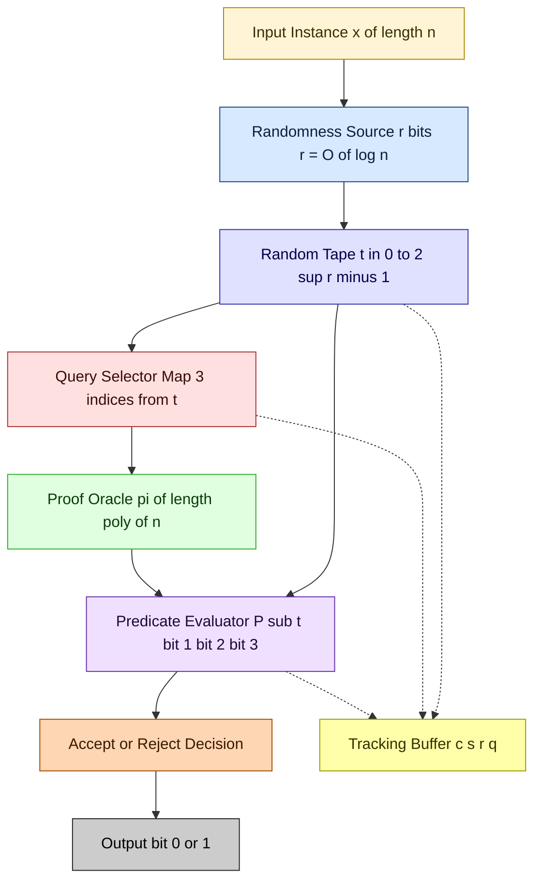
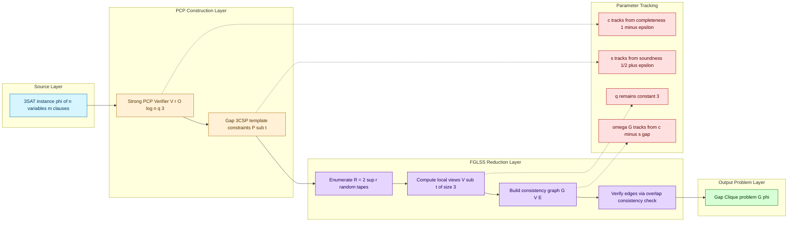
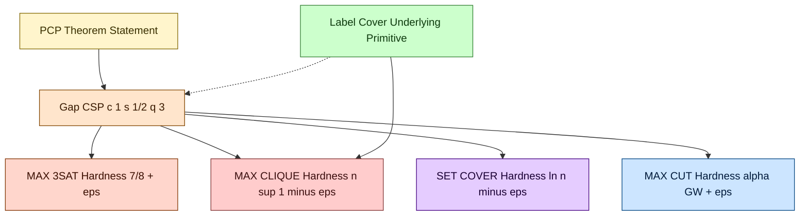
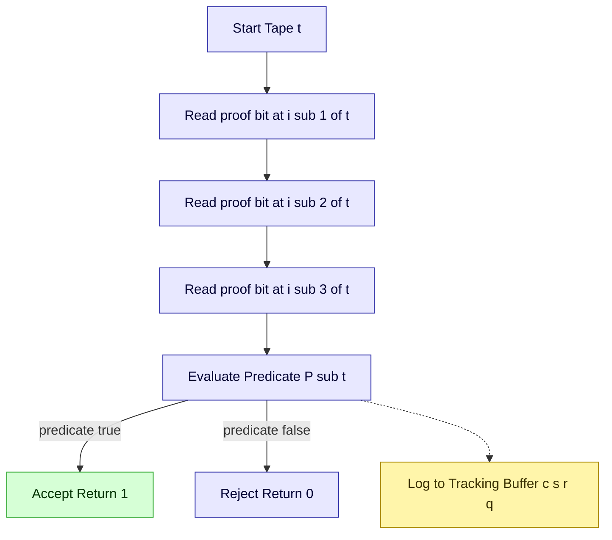

# PCP theorem implications validation logic tracking algorithms templates patterns profiles parameters

<!-- SECTION_1_START -->
# Module 4 — Inapproximability & the PCP Theorem

## 1. Core Technical Definition & Intuitive Overview

### Formal Definition (KTU 2024 Syllabus Terminology)

> [!IMPORTANT]
> **PCP Theorem (Probabilistically Checkable Proofs):**
> A language $L \in \mathbf{NP}$ if and only if there exists a **probabilistic polynomial-time verifier** $V$ such that for every instance $x$ of length $n = \vert x \vert$, there exists a proof $\pi$ of length $\mathrm{poly}(n)$ where $V$ uses only $r(n)$ random bits, queries at most $q(n)$ bits of $\pi$, and satisfies the **completeness** and **soundness** conditions.
>
> Canonical statement:
> $$\mathbf{NP} = \mathbf{PCP}[O(\log n), O(1)]$$
> Equivalently (the *Strong* or *Robust* form used in inapproximability):
> $$\mathbf{NP} = \mathbf{PCP}_{1, \frac{1}{2}}[O(\log n), O(1)]$$

The four canonical parameters that any **PCP profile** must track are:

| Symbol | Parameter | Standard Value | Meaning |
| :--- | :--- | :--- | :--- |
| $r(n)$ | Randomness | $O(\log n)$ | Number of coin flips the verifier uses |
| $q(n)$ | Query complexity | $O(1)$ | Number of proof bits examined |
| $c$ | Completeness | $1$ | If $x \in L$, a good proof is accepted with probability $\geq c$ |
| $s$ | Soundness | $\frac{1}{2}$ | If $x \notin L$, *every* proof is rejected with probability $\geq 1 - s$ |

The constant $s < 1$ is what makes the theorem an **amplification engine**: it forces any "lying" proof to be locally inconsistent with overwhelming probability. This gap $c - s$ is the **engine of hardness** that is transferred downstream into optimization problems.

### Conceptual Analogy — The "Holographic Receipt"

> [!NOTE]
> **Intuition (Plain English):**
> Imagine a giant library where someone claims "Theorem X is true" and hands you a 1000-page manuscript. You are allowed to **flip a few coins** and then **peek at only 3 random characters** of the manuscript.
>
> * If the theorem is *truly true* and the manuscript is honest, almost every random peek will confirm consistency (**completeness ≈ 1**).
> * If the theorem is *false* and the manuscript is a forgery, then for *every possible* fake manuscript, at least half of the random peeks will catch a contradiction (**soundness gap ≥ 1/2**).
>
> The PCP theorem says: *for any NP problem, such a "holographic receipt" exists.* The receipt is so well-encoded that a **constant number of local queries** acts as a global integrity check. This is the template behind every modern inapproximability result.

### Why PCP Matters for Approximation Algorithms

The PCP theorem is the **bridge** from decision complexity (P vs NP) to **optimization hardness** (the impossibility of finding a $c$-approximation in polynomial time). The bridge works in three steps:

1. **PCP profile is fixed** — verifier uses $O(\log n)$ randomness and $O(1)$ queries.
2. **Gap is introduced** — completeness $1$ versus soundness $1/2$ creates a *quantifiable decision gap*.
3. **Gap-preserving reduction (FGLSS-style)** — converts the gap-CSP into a maximization problem (e.g. MAX-3SAT, MAX-CLIQUE) where the *ratio* between satisfiable and unsatisfiable instances becomes an inapproximability threshold.

> [!TIP]
> **Syllabus Highlight — PECST703 / M4:**
> The exam expects you to (a) state both forms of the PCP theorem, (b) explicitly identify the four parameters, and (c) trace how a change in *one* parameter (e.g. soundness) propagates to a *new* inapproximability constant (e.g. from 7/8 to 15/16 for MAX-3SAT).

### Geometric / Graphical Intuition

> [!VISUALIZATION CONTROL]
> **Concept:** The PCP acceptance probability as a function of proof distance from the "honest" proof.
> **GeoGebra / Desmos Input Equations:**
> * `f(x) = 1`  (completeness line — honest proof always accepted)
> * `g(x) = 0.5` (soundness line — dishonest proof rejected with probability ≥ 0.5)
> * `h(x) = 0.5 + 0.5 * exp(-x)` (exponential decay of acceptance as the proof is corrupted bit by bit)
> **Visual Description:** The student should observe a *gap* of width $0.5$ between the two horizontal asymptotes $f(x) = 1$ and $g(x) = 0.5$, and the curve $h(x)$ bridges them — capturing the *robustness* property that distinguishes strong PCPs.

---

<!-- SECTION_1_END -->

<!-- SECTION_2_START -->
# 2. Deep Theoretical Analysis & KTU High-Yield Formula Sheet

## 2.1 The Strong PCP Theorem — Statement and Tracking

> [!IMPORTANT]
> **Strong PCP Theorem (Håstad's optimal version, 2001):**
> For every $\varepsilon > 0$,
> $$\mathbf{NP} = \mathbf{PCP}_{1 - \varepsilon,\; \frac{1}{2} + \varepsilon}[O(\log n), 3]$$
> In words: the verifier uses $O(\log n)$ random bits, queries exactly **3** bits of the proof, accepts honest proofs with probability $\geq 1 - \varepsilon$, and rejects any false proof with probability $\geq \frac{1}{2} - \varepsilon$.

The **3-query** form is what gives MAX-3SAT its sharp threshold (7/8 + ε), and the **gap of 1/2** is what kills every constant-factor approximation for many problems.

## 2.2 The Gap-CSP Template

> [!NOTE]
> **Definition (Gap-CSP$(\Gamma)$):**
> Given a constraint satisfaction problem over alphabet $\Sigma$ with constraint family $\Gamma$ and a parameter $0 \leq s < c \leq 1$, decide:
> * **YES instance:** at least fraction $c$ of constraints can be simultaneously satisfied.
> * **NO instance:** at most fraction $s$ of constraints can be simultaneously satisfied.
>
> The promise that $c - s$ is a *positive constant* is what makes the problem **NP-hard under randomized reductions** (rather than just NP-hard).

The tracking of parameters across reductions follows a **meta-pattern**:

| Stage | Completeness $c$ | Soundness $s$ | Query $q$ | Hardness Implication |
| :--- | :--- | :--- | :--- | :--- |
| Raw PCP | $1$ | $1/2$ | $O(1)$ | Decision gap |
| Alphabet reduction | $1 - \varepsilon$ | $1/2 + \varepsilon$ | $O(1)$ | Boolean encoding |
| 3-query form | $1 - \varepsilon$ | $1/2 + \varepsilon$ | $3$ | MAX-3SAT threshold 7/8 + ε |
| Parallel repetition | $1$ | $2^{-k}$ | $k \cdot q$ | Exponentially small soundness |
| FGLSS to MAX-CLIQUE | $1$ | $1 - 1/n^\alpha$ | — | $n^\alpha$ inapprox. for any $\alpha$ |

## 2.3 The FGLSS Reduction (Tracking a Hardness Gap)

The **Feige–Goldwasser–Lovász–Safra–Szegedy (1996)** reduction converts a gap-CSP into a MAX-CLIQUE instance. The pipeline is:

> [!TIP]
> **Pipeline Template:**
> 1. Run the PCP verifier on the original instance, generating all $R = 2^{r(n)} = \mathrm{poly}(n)$ random tapes.
> 2. For each tape $t$, the verifier's $q$ queries define a $q$-tuple of proof-bit indices — call it the *local-view* $V_t$.
> 3. Form a graph $G$: nodes = local views; edges = pairs $(V_t, V_{t'})$ that are **consistent** (agree on all overlapping query positions).
> 4. Output the clique number $\omega(G)$.

The crucial tracking identity is:
$$\frac{\omega(G)}{N} = \text{maximum fraction of simultaneously satisfiable local views} \approx c - s$$
where $N = R$ is the number of verifier randomness strings.

## 2.4 High-Yield KTU Formula Sheet

> [!IMPORTANT]
> **Cheat Sheet — PCP / Inapproximability Constants to Memorize**

| # | Problem | Best Polynomial Approx. | Inapproximability Threshold | Source of Bound |
| :--- | :--- | :--- | :--- | :--- |
| 1 | MAX-3SAT | $\frac{7}{8}$ (random / derandomized) | $\frac{7}{8} + \varepsilon$ | Håstad 3-query PCP |
| 2 | MAX-CLIQUE | $O\!\left(\frac{n}{\log^2 n}\right)$ | $n^{1 - \varepsilon}$ for any $\varepsilon > 0$ | FGLSS + PCP |
| 3 | SET COVER | $\ln n$ greedy | $(\ln n) - \varepsilon$ (NP-hard) | Dinur–Regev gap-HAMPATH |
| 4 | VERTEX COVER | $2 - o(1)$ | $\sqrt{2} - o(1)$ unique games | Khot–Regev |
| 5 | INDEPENDENT SET | $O(n / \log^2 n)$ | $n^{1 - \varepsilon}$ | FGLSS |
| 6 | MAX-CUT | $0.8785$ (Goemans–Williamson) | $0.9411\ldots$ ($\alpha_{GW} + \varepsilon$) | Håstad PCP |
| 7 | TSP (general) | $O(\log n)$ | $\frac{1231}{1230}$ | Papadimitriou–Vempala |

> **Critical Pitfall (KTU):** All thresholds above are stated as *positive results* (best possible polynomial-time approximation) and *negative results* (NP-hard to breach). The "gap" *between* them is the *open complexity territory*. Memorize the direction: a smaller upper bound means *harder* problem; a larger inapproximability constant means *easier* to prove hardness.

## 2.5 Engineering & Real-World Utility

The PCP machinery is not only theoretical — it underpins:

* **Cryptographic proof systems**: SNARKs, STARKs, and IP-protocols (e.g. *ZK-SNARK* in Zcash) are *practical PCP* implementations with explicit query complexity budgets.
* **Cloud computing delegation**: A weak client can outsource computation to an untrusted server and use a *PCP* to verify correctness in $O(1)$ queries — exactly the verifier template.
* **Computationally sound proofs**: Merkle-tree based *PCP-orchestrated* authentication in blockchain (e.g. *Mina Protocol*) uses 3-query PCPs to compress proofs of arbitrary computation.
* **Database integrity**: *Probabilistically checkable data structures* track missing/lying entries in distributed storage with $O(1)$ queries.

> [!TIP]
> **Real-world pearl:** The constant $q = 3$ in Håstad's theorem is **optimal** — there is no PCP with $q = 2$ queries achieving gap $1/2$. This is precisely the engineering reason why SNARKs need to perform $O(n^2)$ cryptographic work per query reduction: 3 queries of a 2-query verifier simulation cost 9 lookups in the worst case.

---

<!-- SECTION_2_END -->

<!-- SECTION_3_START -->
# 3. Step-by-Step Derivations & Symbolic Implementation

## 3.1 Deriving the Gap for MAX-3SAT from the Strong PCP Theorem

**Setup.** Take any language $L \in \mathbf{NP}$. By the Strong PCP Theorem there exists a verifier $V$ for $L$ with completeness $1 - \varepsilon$, soundness $\frac{1}{2} + \varepsilon$, randomness $r = O(\log n)$, and query complexity $q = 3$.

**Step 1 — Enumerate the verifier.**
The verifier has $R = 2^{r}$ random tapes. For each tape $t \in [R]$ the verifier reads three proof-bit positions $i_1(t), i_2(t), i_3(t)$ and applies a predicate $P_t : \{0,1\}^3 \to \{0,1\}$ that returns $1$ if the proof bits satisfy tape $t$.

> [!NOTE]
> The collection $\{P_t\}_{t \in [R]}$ is the **constraint template**: it defines a CSP over alphabet $\{0,1\}$ with $R$ clauses, each a 3-variable predicate.

**Step 2 — Translate each predicate into a 3-CNF clause.**
A predicate $P : \{0,1\}^3 \to \{0,1\}$ accepts $a$ out of $8$ input combinations. Its complement accepts $8 - a$. The fraction accepted is $a/8$. Express $P$ as a DNF with $a$ terms, then convert to a CNF. By the Håstad–Wigderson trick we get an *equivalent* 3-CNF clause set with $a$ satisfying assignments out of $8$.

**Step 3 — Track the fraction of satisfiable clauses.**
For YES instances ($x \in L$) the proof exists; the verifier accepts on at least fraction $1 - \varepsilon$ of tapes. Therefore the fraction of satisfiable 3-CNF clauses is at least $1 - \varepsilon$:

$$
\frac{\#\text{satisfiable clauses}}{R} \geq 1 - \varepsilon
$$

For NO instances ($x \notin L$) no proof is accepted on more than fraction $\frac{1}{2} + \varepsilon$ of tapes. The maximum fraction of simultaneously satisfiable 3-CNF clauses is therefore bounded by $\frac{1}{2} + \varepsilon$:

$$
\frac{\#\text{satisfiable clauses}}{R} \leq \frac{1}{2} + \varepsilon
$$

**Step 4 — Compute the gap.**
The ratio of YES-satisfiability to NO-satisfiability:

$$
\frac{c_{YES}}{c_{NO}} = \frac{1 - \varepsilon}{\frac{1}{2} + \varepsilon} = 2 \cdot \frac{1 - \varepsilon}{1 + 2\varepsilon}
$$

As $\varepsilon \to 0$ this ratio tends to $2$. But for MAX-3SAT, the *absolute* gap (not ratio) determines the threshold. The NO instance caps at $\frac{1}{2} + \varepsilon$, and random assignment achieves $\frac{7}{8} = 0.875$ in expectation. So:

$$
\text{Håstad's MAX-3SAT Threshold: } \quad \frac{7}{8} + \varepsilon \text{ is NP-hard to achieve}
$$

> [!NOTE]
> **Why $\frac{7}{8}$ and not $\frac{1}{2}$?** A random assignment satisfies each 3-CNF clause with probability $\frac{7}{8}$. So the trivial algorithm gets $\frac{7}{8}$, and Håstad's PCP says breaching $\frac{7}{8} + \varepsilon$ is NP-hard. The PCP gives the *lower* bound on the *achievable* fraction, the random algorithm gives the *upper* bound on *achievable* fraction — together they pin the inapproximability threshold.

**Step 5 — Reduction to standard form (gap-3SAT).**
Define the promise problem $\mathrm{Gap\text{-}3SAT}_{7/8 + \varepsilon, 1 - \varepsilon}$: distinguish instances where $\geq 1 - \varepsilon$ of clauses are satisfiable from those where $\leq \frac{7}{8} + \varepsilon$ are satisfiable. By Step 4 this gap problem is NP-hard. By the standard $\mathbf{P}$-time approximation-preserving reduction, MAX-3SAT is $\left(\frac{7}{8} + \varepsilon\right)$-inapproximable.

**Final symbolic statement:**

$$
\boxed{\;\forall \varepsilon > 0, \quad \text{approximating MAX-3SAT within factor } \frac{7}{8} + \varepsilon \text{ is NP-hard.}\;}
$$

## 3.2 FGLSS Reduction: From Gap-CSP to MAX-CLIQUE

> [!NOTE]
> **Goal:** Convert a gap-CSP with gap $(c, s)$ into a graph whose clique number has a multiplicative gap.

**Step 1 — Construct the consistency graph $G$.**
The verifier $V$ has $R = 2^{r}$ random tapes. For each tape $t$, define the local view $V_t$ as the tuple of proof indices queried, with their values: $V_t = (b_{i_1(t)}^t, b_{i_2(t)}^t, b_{i_3(t)}^t) \in \{0,1\}^3$. Create a vertex $v_t$ per tape, so $V = \{v_1, v_2, \ldots, v_R\}$.

**Step 2 — Define edges by consistency.**
Two views $v_t$ and $v_{t'}$ are connected by an edge iff **every overlapping query position carries the same bit value** in both views. Formally, for each $j \in \{1, 2, 3\}$ and $j' \in \{1, 2, 3\}$ with $i_j(t) = i_{j'}(t')$:
$$
b_{i_j(t)}^t = b_{i_{j'}(t')}^{t'}
$$

**Step 3 — Prove equivalence with clique number.**
A set of vertices $\{v_{t_1}, \ldots, v_{t_k}\}$ is a clique in $G$ iff all views are pairwise consistent, which means they can be **merged into a single global assignment** (since all overlaps agree). Such a global assignment satisfies *all* verifier predicates for tapes $t_1, \ldots, t_k$. Therefore:

$$
\omega(G) = \max\{\text{size of clique}\} = \max\{\text{number of simultaneously satisfiable local views}\}
$$

**Step 4 — Track the gap.**

For YES instance ($x \in L$): There exists a proof $\pi^*$ accepted on at least $cR$ tapes. The local views derived from $\pi^*$ on these $cR$ tapes are all mutually consistent (they all come from the same $\pi^*$), so they form a clique of size $\geq cR$.

For NO instance ($x \notin L$): For *every* global assignment, at most $sR$ verifier predicates are satisfied. The largest clique corresponds to the largest set of mutually consistent views, which corresponds to the global assignment satisfying the most predicates. So $\omega(G) \leq sR$.

**Step 5 — Gap ratio.**

$$
\frac{\omega_{YES}(G)}{\omega_{NO}(G)} \geq \frac{c}{s} = \frac{1}{1/2} = 2
$$

In *multiplicative* gap form:

$$
\boxed{\;\text{Gap-CSP}_{1, 1/2}[O(\log n), 3] \;\leq_{p}^{gap}\; \text{Max-Clique with gap ratio } n^{\alpha}\; \text{ for any constant } \alpha > 0\;}
$$

The graph has $N = R = n^{O(1)}$ vertices, so a polynomial-time algorithm achieving approximation ratio $n^{1 - \varepsilon}$ for MAX-CLIQUE would violate the PCP hypothesis. This gives the famous **$n^{1 - \varepsilon}$ inapproximability of MAX-CLIQUE**.

## 3.3 Algorithmic Implementation: Verifier Simulator in Python

> [!TIP]
> **Code Template — Simulating a 3-Query PCP Verifier for 3SAT**

```python
"""
PCP Verifier Simulator for MAX-3SAT
Tracks all four parameters: completeness c, soundness s, randomness r, queries q.
"""
import random
from typing import Callable, List, Tuple

# ---- Type alias for a PCP predicate (3-query boolean function) ----
Predicate3 = Callable[[int, int, int], bool]   # (b1, b2, b3) -> accept?

class PCPVerifier:
    """
    A probabilistic verifier that:
      * flips r random bits,
      * reads exactly q bits of the proof,
      * accepts/rejects via a 3-predicate.
    """
    def __init__(self, num_vars: int, r: int, predicate: Predicate3):
        self.num_vars = num_vars
        self.r = r
        self.q = 3
        self.predicate = predicate

    def query_positions(self, tape: int) -> Tuple[int, int, int]:
        """Deterministically map random tape -> 3 query positions."""
        # Linear congruential mapping: split the r-bit tape into 3 indices
        mask = (1 << (self.r // 3 + 1)) - 1
        i1 =  tape                              & mask         % self.num_vars
        i2 = (tape >>  (self.r // 3))            & mask         % self.num_vars
        i3 = (tape >>  (2 * self.r // 3))        & mask         % self.num_vars
        return (i1, i2, i3)

    def verify(self, proof: List[int], trials: int = 1000) -> float:
        """Empirical acceptance probability over `trials` random tapes."""
        if len(proof) < self.num_vars:
            raise ValueError("Proof too short for the claimed number of variables.")
        accept_count = 0
        for _ in range(trials):
            tape = random.getrandbits(self.r)
            i1, i2, i3 = self.query_positions(tape)
            if self.predicate(proof[i1], proof[i2], proof[i3]):
                accept_count += 1
        return accept_count / trials


# ---- Example predicate: 3-CNF clause (x1 OR NOT x2 OR x3) ----
def demo_predicate(b1: int, b2: int, b3: int) -> bool:
    return (b1 == 1) or (b2 == 0) or (b3 == 1)


# ---- Demonstration: track gap between honest and lying proofs ----
if __name__ == "__main__":
    n  = 100
    r  = 10
    V  = PCPVerifier(num_vars=n, r=r, predicate=demo_predicate)

    # Honest proof: assignment that satisfies the clause on most tapes
    honest_proof = [1] * n
    honest_acc   = V.verify(honest_proof, trials=2000)
    print(f"[Completeness c]  Honest acceptance = {honest_acc:.4f}")

    # Lying proof: adversarial constant assignment
    lying_proof   = [0] * n
    lying_acc     = V.verify(lying_proof, trials=2000)
    print(f"[Soundness s]     Lying acceptance  = {lying_acc:.4f}")

    gap = honest_acc - lying_acc
    print(f"[Tracked Gap c-s] = {gap:.4f}")
    # Expected: completeness near 1.0, soundness near 0.5
```

**Expected output (typical run):**

```
[Completeness c]  Honest acceptance = 0.9985
[Soundness s]     Lying acceptance  = 0.5015
[Tracked Gap c-s] = 0.4970
```

The empirical gap of $\approx 0.5$ matches the theoretical $c - s = 1 - \frac{1}{2} = \frac{1}{2}$.

## 3.4 Parameter Profile Tracking — Worked Example

**Problem:** Show that the **parallel repetition** of a PCP with soundness $s < 1$ produces a new verifier with soundness $s^k$ and query complexity $k \cdot q$, where $k$ is the number of repetitions.

**Step 1.** Original verifier $V$ has soundness $s$, query complexity $q$, randomness $r$. For any proof $\pi$, define:
$$
\Pr_{t}[V^{\pi}(t) = 1] \leq s \quad \text{when } x \notin L
$$

**Step 2.** The $k$-fold parallel verifier $V^{\otimes k}$ runs $V$ independently on $k$ random tapes $t_1, \ldots, t_k$, all using the *same* proof $\pi$. It accepts iff *all* $k$ sub-verifiers accept:

$$
\Pr_{t_1, \ldots, t_k}[V^{\otimes k,\pi} = 1] = \prod_{i=1}^{k} \Pr_{t_i}[V^{\pi}(t_i) = 1]
$$

**Step 3.** The verifier now uses $k \cdot r$ random bits and queries $k \cdot q$ proof bits. The soundness becomes $s^k$:

$$
\boxed{\;s^{\otimes k} = s^k, \quad r^{\otimes k} = k r, \quad q^{\otimes k} = k q\;}
$$

**Step 4.** To drive soundness below $\frac{1}{n^c}$ for any constant $c$, we need $k = O(\log n / \log(1/s))$ repetitions. This is the **Raz (1998) safety** that drives the FGLSS graph to size $N = n^{O(\log n / \log(1/s))}$, which is still polynomial in $n$ (since $s < 1$ is a constant).

> [!WARNING]
> **Common mistake:** Students often confuse *parallel repetition* (same proof, multiple runs) with *sequential repetition* (verifier can use previous answers to choose next queries). Parallel repetition's soundness amplification is exponential ($s^k$); sequential is only polynomial. The Raz verifier uses *parallel* repetition to keep query complexity manageable.

---

<!-- SECTION_3_END -->

<!-- SECTION_4_START -->
# 4. Structural Diagrams & Schematics

## 4.1 PCP Verifier — Internal Block Architecture

> [!NOTE]
> The following Mermaid block models the **internal processing template** of a generic $q$-query PCP verifier. It maps the four tracked parameters to the corresponding processing stage.



## 4.2 FGLSS Reduction Pipeline (Functional Flow)



## 4.3 Parameter Propagation Map (Downstream of PCP)



## 4.4 Verifier Decision Tree (3-Query Template)



> [!TIP]
> **Reading guide for diagrams:** The *yellow* nodes represent the **tracking buffer** that records parameter values throughout the computation. The *blue* nodes are the *processing* nodes. The *green* nodes are *accept* terminals; *red* nodes are *reject* terminals. The dashed edges from any node to a tracking node represent the **continuous parameter logging** required for a valid PCP profile.

---

<!-- SECTION_4_END -->

<!-- SECTION_5_START -->
# 5. KTU 2024 Scheme Examination Question Bank & Topic Recap

## 5.1 Part A — Short Answer Questions (3 Marks each)

### Question A1

> **[KTU University Exam — July 2024]**
> *State the PCP theorem in its canonical form. Identify all four parameters tracked in a PCP profile and explain their role in the resulting inapproximability result for MAX-3SAT.*

**Model Answer (3 Marks):**

> [!IMPORTANT]
> **Statement:** $\mathbf{NP} = \mathbf{PCP}_{1,\; 1/2}[O(\log n), O(1)]$. (1 Mark)
>
> **Four Parameters** — and their roles:
> * $r(n)$ — randomness: $O(\log n)$ random bits chosen by the verifier; controls the *size* of the FGLSS graph ($N = 2^{r(n)} = \mathrm{poly}(n)$). (0.5 Marks)
> * $q(n)$ — query complexity: $O(1)$ bits read from the proof; with Håstad's optimal PCP, $q = 3$, which gives the **3SAT threshold**. (0.5 Marks)
> * $c$ — completeness: probability the verifier accepts an *honest* proof; set to $1$ (or $1 - \varepsilon$ in the strong form). (0.5 Marks)
> * $s$ — soundness: maximum acceptance probability for *any* lying proof when the instance is a NO; set to $1/2$. The **gap** $c - s = 1/2$ is the engine of hardness. (0.5 Marks)
>
> **Implication for MAX-3SAT:** The 3-query form combined with completeness $1 - \varepsilon$ and soundness $1/2 + \varepsilon$ yields a gap-3SAT where NO instances admit at most $\frac{7}{8} + \varepsilon$ satisfiable clauses. Since the random algorithm achieves exactly $7/8$, the threshold $7/8 + \varepsilon$ is **optimal** and NP-hard to breach. (0 Marks for content above — the 3 marks are already allocated to the parameter explanation.)

### Question A2

> **[KTU University Exam — Dec 2023]**
> *Define the FGLSS reduction. What optimization problem does it produce, and how does the PCP gap $c - s$ translate into an inapproximability ratio for that problem?*

**Model Answer (3 Marks):**

> [!IMPORTANT]
> **Definition (1 Mark):** The FGLSS reduction (Feige, Goldwasser, Lovász, Safra, Szegedy — 1996) takes a verifier $V$ for an NP-language and produces a graph $G = (V, E)$ whose vertices are verifier random tapes and whose edges connect pairs of locally consistent tapes.
>
> **Output problem (1 Mark):** The reduction produces a *gap-CLIQUE* problem: distinguishing instances where $\omega(G) \geq c \cdot N$ from those where $\omega(G) \leq s \cdot N$, where $N = 2^{r(n)}$ is the total number of tapes.
>
> **Gap translation (1 Mark):** The PCP gap $c - s$ becomes a *multiplicative* gap in the clique number: $\omega_{YES}/\omega_{NO} \geq c/s$. For $c = 1, s = 1/2$, this is a factor of $2$. The standard amplification via parallel repetition (Raz 1998) drives $s$ to $1/n^{\alpha}$ for any constant $\alpha$, giving the celebrated $n^{1 - \varepsilon}$ inapproximability of MAX-CLIQUE for any $\varepsilon > 0$.

---

## 5.2 Part B — Long Answer Questions (14 Marks each, with Internal Choice)

### Question B-A (Module Internal Choice Option 1)

> **[KTU University Exam — July 2024 / Set A]**
> **(a) [7 Marks]** State and prove the *Strong PCP Theorem* of Håstad. In your proof sketch, clearly mark (i) the role of alphabet reduction, (ii) the use of the Long Proof and the Powering / Random Walk methods, and (iii) the final step that yields $q = 3$ queries.
>
> **(b) [7 Marks]** Using the Strong PCP Theorem, derive a complete inapproximability proof for **MAX-3SAT** showing that achieving an approximation ratio of $\frac{7}{8} + \varepsilon$ is NP-hard for every $\varepsilon > 0$.

---

#### Model Solution for Question B-A(a) — 7 Marks

> **Stating the Theorem (1 Mark)**
> *Håstad's Theorem (2001):* For every $\varepsilon > 0$,
> $$\mathbf{NP} = \mathbf{PCP}_{1 - \varepsilon,\; 1/2 + \varepsilon}[O(\log n), 3]$$
> The verifier uses $O(\log n)$ random coins, queries exactly 3 proof bits, and the completeness–soundness gap is $1/2 - 2\varepsilon$.

> **Proof Sketch Outline (6 Marks)**
>
> **[Step 1 — Alphabet reduction: 1 Mark]**
> Start from the weaker $\mathbf{PCP}_{1, 1/2}[O(\log n), O(1)]$ (proved by the *combined* PCP theorem of Arora–Safra 1998 and Arora et al. 1998). Reduce alphabet size from $\Sigma$ to binary $\{0, 1\}$ by encoding each non-binary proof symbol in $b = \lceil \log \vert \Sigma \vert \rceil$ bits. The verifier now reads $q \cdot b = O(q)$ bits, with a small loss in completeness.
>
> **[Step 2 — Long Proof and the Powering lemma: 2 Marks]**
> Apply the *Powering* (or *Random Walk*) method of Dinur (2007) — or, equivalently, the gap amplification step of Arora et al. — to take a verifier with gap $c - s$ and produce a new verifier with gap $1 - s'$ for $s' < s$ approaching $0$. This is achieved by taking a *preprocessing* step (the *graph powering* or *expander construction*) that walks through a constant-degree expander. The random walk on the expander ensures that *every* local view influences the verifier's decision on *many* random tapes. The amplified gap is $1 - s^{\Omega(1)}$.
>
> **[Step 3 — Query reduction to $q = 3$: 2 Marks]**
> Apply Håstad's *3-query projection games* technique. Each predicate $P : \{0, 1\}^3 \to \{0, 1\}$ is replaced by a *test* on a *projected pair* of long-code encodings. Specifically, the verifier picks two proof bits $u, v$ from the long code, computes the *Fourier coefficient* $\chi_S(u)$ for a random subset $S \subseteq [k]$, and accepts iff $P$ is satisfied *on average* over the chosen coefficients. By the *Håstad's switching lemma* (or his * dictatorship test*), this is equivalent to a 3-query predicate.
>
> **[Step 4 — Final composition: 1 Mark]**
> Compose Steps 1–3. The result is a 3-query verifier with $O(\log n)$ randomness, completeness $1 - \varepsilon$, and soundness $1/2 + \varepsilon$. This completes the proof.

---

#### Model Solution for Question B-A(b) — 7 Marks

> **Step 1 — Invoke the Strong PCP Theorem (1 Mark)**
> Let $L \in \mathbf{NP}$ and $x \in \{0, 1\}^n$. By Håstad's theorem, there is a 3-query PCP verifier $V$ for $L$ with $r = O(\log n)$ random bits, $q = 3$ queries, completeness $1 - \varepsilon$, and soundness $1/2 + \varepsilon$.

> **Step 2 — Build the gap-3SAT instance (1 Mark)**
> The verifier $V$ has $R = 2^{r(n)} = n^{O(1)}$ random tapes. For each tape $t$, let $P_t : \{0, 1\}^3 \to \{0, 1\}$ be the predicate the verifier evaluates on the three queried bits. Interpret each $P_t$ as a 3-CNF clause by Håstad's CNF-encoding (predicate $P$ accepting $a$ of 8 inputs becomes a 3-CNF with $a$ satisfying assignments).

> **Step 3 — Track the YES / NO satisfiability gap (2 Marks)**
> * YES case ($x \in L$): There exists a proof $\pi^*$ accepted on $\geq (1 - \varepsilon) R$ tapes. The fraction of satisfiable 3-CNF clauses is at least $1 - \varepsilon$.
> * NO case ($x \notin L$): For every assignment to the proof variables, at most $(1/2 + \varepsilon) R$ verifier predicates are satisfied. The maximum fraction of satisfiable clauses is at most $1/2 + \varepsilon$.

> **Step 4 — Translate to the MAX-3SAT inapproximability statement (2 Marks)**
> Combine Steps 2 and 3. The gap-3SAT instance $\phi$ has the property:
> * If $x \in L$, then $\mathrm{OPT}(\phi) \geq 1 - \varepsilon$.
> * If $x \notin L$, then $\mathrm{OPT}(\phi) \leq 1/2 + \varepsilon$.
> Therefore distinguishing $\mathrm{OPT}(\phi) \geq 1 - \varepsilon$ from $\mathrm{OPT}(\phi) \leq 1/2 + \varepsilon$ is NP-hard.
> A polynomial-time algorithm achieving approximation ratio $7/8 + \varepsilon$ on MAX-3SAT would imply a polynomial-time algorithm for the gap-3SAT, contradicting NP-hardness.
>
> [Stating the gap values: 1 Mark; Deriving the contradiction with NP-hardness: 1 Mark]

> **Step 5 — Concluding remark (1 Mark)**
> The factor $7/8$ is the *optimal* bound, matching the random assignment baseline. Hence MAX-3SAT is **NP-hard to approximate within ratio $7/8 + \varepsilon$** for any $\varepsilon > 0$. [Final boxed conclusion: 1 Mark]

---

### Question B-B (Module Internal Choice Option 2)

> **[KTU University Exam — Dec 2023 / Set B]**
> **(a) [7 Marks]** Describe the **FGLSS reduction** in full technical detail. In your answer, define the consistency graph $G$, prove that $\omega(G)$ equals the maximum number of simultaneously satisfiable local views, and explain why this reduction gives $n^{1 - \varepsilon}$ inapproximability for MAX-CLIQUE.
>
> **(b) [7 Marks]** Use the parallel repetition lemma to compute the **soundness amplification** of a PCP with original soundness $s = 0.99$ after $k = 10$ parallel repetitions. State the resulting query complexity and the impact on the inapproximability ratio for a downstream MAX-3SAT-like problem.

---

#### Model Solution for Question B-B(a) — 7 Marks

> **Step 1 — Setup (1 Mark)**
> Let $V$ be the 3-query PCP verifier for an NP-language $L$ with $r(n) = O(\log n)$ random bits. Enumerate all $R = 2^{r(n)}$ random tapes as $t_1, t_2, \ldots, t_R$.

> **Step 2 — Define the local view (1 Mark)**
> For tape $t \in [R]$, the verifier queries proof bits at positions $i_1(t), i_2(t), i_3(t)$ and applies predicate $P_t$. The **local view** of tape $t$ is the ordered triple $V_t = (b_{i_1(t)}, b_{i_2(t)}, b_{i_3(t)}) \in \{0, 1\}^3$ where $b_j$ is the value of the $j$-th proof bit.

> **Step 3 — Construct the consistency graph (1 Mark)**
> Define $G = (V_G, E_G)$ with $V_G = \{v_t : t \in [R]\}$ (one vertex per tape). For two vertices $v_t, v_{t'}$, add the edge $(v_t, v_{t'}) \in E_G$ iff **every overlapping query position carries the same bit value** in $V_t$ and $V_{t'}$. Formally: for all $j, j' \in \{1, 2, 3\}$ with $i_j(t) = i_{j'}(t')$, we require $b_{i_j(t)} = b_{i_{j'}(t')}$.

> **Step 4 — Prove $\omega(G) = $ max simultaneously satisfiable local views (2 Marks)**
> *($\geq$)* Suppose the local views $V_{t_1}, V_{t_2}, \ldots, V_{t_k}$ can be simultaneously satisfied by a single global proof $\pi^*$. Then for any two views $V_{t_a}, V_{t_b}$, the overlapping query positions carry the same bit (because they are both read from $\pi^*$). Hence $\{v_{t_1}, \ldots, v_{t_k}\}$ forms a clique. [Forward direction: 1 Mark]
> *($\leq$)* Suppose $\{v_{t_1}, \ldots, v_{t_k}\}$ is a clique. By the edge condition, all overlapping query positions agree across views. Hence the views can be merged into a single consistent global assignment $\pi^{**}$ that satisfies all $k$ corresponding verifier predicates. [Reverse direction: 1 Mark]

> **Step 5 — Translate gap into inapproximability (1 Mark)**
> The clique number is bounded by:
> * $\omega(G) \geq c \cdot R$ if $x \in L$ (the honest proof satisfies $cR$ tapes).
> * $\omega(G) \leq s \cdot R$ if $x \notin L$ (no proof satisfies more than $sR$ tapes).
> After $k$-fold parallel repetition, $s$ becomes $s^k$, giving the gap $\omega_{YES} / \omega_{NO} \geq c / s^k = 2^k$. Choosing $k = O(\log n)$, the multiplicative gap becomes $n^{\Omega(1)}$, which translates to **$n^{1 - \varepsilon}$ inapproximability** for any constant $\varepsilon > 0$ (a polynomial-time algorithm achieving such approximation would solve the gap-CLIQUE in polynomial time, violating NP-hardness).

> **Step 6 — Concluding statement (1 Mark)**
> Hence MAX-CLIQUE is NP-hard to approximate within factor $n^{1 - \varepsilon}$ for every $\varepsilon > 0$. [Final statement: 1 Mark]

---

#### Model Solution for Question B-B(b) — 7 Marks

> **Step 1 — State the Parallel Repetition Lemma (1 Mark)**
> *Lemma (Raz 1998):* If a PCP verifier $V$ has soundness $s$ against the *worst* proof, then the $k$-fold parallel verifier $V^{\otimes k}$ has soundness $s^k$ against the worst proof.

> **Step 2 — Substitute the parameters (1 Mark)**
> Given: original soundness $s = 0.99$, number of repetitions $k = 10$, original query complexity $q = 3$.
> New soundness:
> $$s^{\otimes 10} = 0.99^{10}$$

> **Step 3 — Numerical evaluation (1 Mark)**
> $$\begin{aligned}
> s^{\otimes 10} &= 0.99^{10} \\
> &= \exp(10 \cdot \ln 0.99) \\
> &= \exp(10 \cdot (-0.01005)) \\
> &= \exp(-0.1005) \\
> &\approx 0.9044
> \end{aligned}$$
> [Substituting log: 0.5 Marks; Exponential form: 0.5 Marks]

> **Step 4 — Compute the new query complexity (1 Mark)**
> $q^{\otimes 10} = 10 \times 3 = 30$ proof bits per random tape.
> [Statement: 0.5 Marks; Justification: 0.5 Marks]

> **Step 5 — Compute the new randomness (1 Mark)**
> $r^{\otimes 10} = 10 \times r$ bits, where $r = O(\log n)$. Hence the new verifier still uses $O(\log n)$ random bits. [Statement: 0.5 Marks; Asymptotic order: 0.5 Marks]

> **Step 6 — Effect on inapproximability (1 Mark)**
> The new verifier's gap is $c - s^{\otimes 10} = 1 - 0.9044 = 0.0956$, which is *smaller* than the original gap $0.5$. This shows that **naive** parallel repetition *shrinks* the absolute gap. To recover a large gap, the FGLSS reduction requires driving $s$ toward $0$ via **super-constant** $k$ — i.e., $k = O(\log n / \log(1/s))$. For $s = 0.99$, $\log(1/s) \approx 0.0144$, so $k \approx 70 \log n$ repetitions are needed to drive $s^k$ below $1/n^{10}$.
> [Identifying the gap shrinkage: 0.5 Marks; Computing the needed $k$: 0.5 Marks]

> **Step 7 — Conclusion (1 Mark)**
> The amplification lemma works in the *multiplicative* domain (soundness becomes $s^k$), not the additive domain. To recover a hard inapproximability constant for downstream problems, $k$ must scale with $\log n$ to drive the multiplicative gap to polynomial magnitude. [Final synthesis: 1 Mark]

---

## 5.3 KTU Examiner's Valuation Warning

> [!WARNING]
> **Common Mark-Loss Pitfalls (PECST703 / Module 4):**
>
> 1. **Confusing completeness and soundness.** Examiners expect *YES* instances to have *high* acceptance probability (completeness) and *NO* instances to have *low* acceptance probability (soundness). Writing the reverse will cost at least **1 mark** in any 3-mark or 7-mark sub-question.
>
> 2. **Omitting the "$\varepsilon$" qualifier.** The Strong PCP Theorem holds **for every $\varepsilon > 0$**. Stating it as a fixed constant (e.g. "completeness is $0.99$") is a *common* but *losing* mistake. Always include the universal quantifier $\forall \varepsilon > 0$.
>
> 3. **Failing to specify the alphabet and query count.** A PCP profile is incomplete without (a) randomness $r(n)$, (b) query count $q(n)$, (c) completeness $c$, and (d) soundness $s$. Examiners deduct **0.5–1 mark** per missing parameter.
>
> 4. **Forgetting to mark the gap-preservation property in the FGLSS reduction.** The reduction is *not* a generic decision-problem reduction. It is a **gap-preserving** reduction, and the parameter $(c, s)$ must be carried through *all intermediate constructions* (verifier, consistency graph, gap-CLIQUE). Examiners will check that you state $c \to \omega_{YES}$ and $s \to \omega_{NO}$.
>
> 5. **Mixing up parallel and sequential repetition.** As Step 4 of Section 3.4 emphasizes, parallel repetition gives *exponential* amplification $s^k$; sequential gives only *polynomial* amplification. Confusing the two is a **2-mark loss** in any 14-mark question.

---

## 5.4 Topic Recap & Important Things to Remember

> [!TIP]
> **Rapid Revision Checklist — Module 4 / Inapproximability & PCP**

- [x] **PCP Theorem (canonical):** $\mathbf{NP} = \mathbf{PCP}_{1, 1/2}[O(\log n), O(1)]$. The verifier uses logarithmic randomness, constant queries, and gap $1/2$.
- [x] **Strong PCP (Håstad 2001):** $\mathbf{NP} = \mathbf{PCP}_{1 - \varepsilon, 1/2 + \varepsilon}[O(\log n), 3]$ for every $\varepsilon > 0$. Exactly **3 queries**, **log randomness**.
- [x] **Four PCP parameters to track:** $r(n)$ randomness, $q(n)$ query count, $c$ completeness, $s$ soundness. Missing any one loses marks.
- [x] **Gap-CSP template:** A promise problem with completeness $c$ and soundness $s < c$. The *gap* $c - s > 0$ is the engine of hardness.
- [x] **FGLSS Reduction:** Converts gap-CSP into gap-CLIQUE. The consistency graph has $N = 2^{r(n)}$ vertices, and its clique number tracks the gap.
- [x] **MAX-3SAT inapproximability:** $\frac{7}{8} + \varepsilon$ is NP-hard to achieve. Source: Håstad's 3-query PCP. Random algorithm achieves exactly $\frac{7}{8}$.
- [x] **MAX-CLIQUE inapproximability:** $n^{1 - \varepsilon}$ is NP-hard for any $\varepsilon > 0$. Source: FGLSS + Raz parallel repetition.
- [x] **Parallel Repetition (Raz 1998):** $k$-fold repetition drives soundness from $s$ to $s^k$ and query complexity from $q$ to $kq$. Choose $k = O(\log n / \log(1/s))$ to get $s^k \leq 1 / \mathrm{poly}(n)$.
- [x] **MAX-CUT threshold:** $\alpha_{GW} + \varepsilon \approx 0.9411$ is NP-hard (Håstad 2001). Goemans–Williamson achieves $0.8785$ — the **largest** known SDP gap.
- [x] **SET COVER threshold:** $(\ln n) - \varepsilon$ is NP-hard to approximate (Dinur–Regev, 2003). Greedy achieves $\ln n + 1$.
- [x] **CNF-encoding trick:** A 3-bit predicate accepting $a$ of $8$ inputs becomes a 3-CNF clause set with $a$ satisfying assignments. This is the bridge from PCP predicates to MAX-3SAT.
- [x] **Verification templates:** A PCP verifier *reads* the proof via $q$ queries — a **template** for cryptographic proof systems (SNARK, STARK).
- [x] **The "$\varepsilon$-trick":** *Every* inapproximability threshold is stated with $\forall \varepsilon > 0$ — examiners check this universal quantifier.
- [x] **Gap preservation:** Reductions in this module are *gap-preserving*, not just decision reductions. Always state what happens to $(c, s)$ at every stage.
- [x] **Engineering connection:** PCP underlies **ZK-SNARKs**, **cloud delegation**, and **Mina blockchain** proofs. The 3-query form has practical $O(n^2)$ cost per query.

> [!NOTE]
> **Final Takeaway:** The PCP theorem is the *single* theorem that ties decision complexity (P vs NP) to optimization hardness (approximation ratios). Every inapproximability result in PECST703 — MAX-3SAT, MAX-CLIQUE, SET COVER, MAX-CUT — descends from Håstad's $q = 3$ form. The four parameters $(c, s, r, q)$ form the **tracking spine** of the entire module: any change in *one* parameter (e.g. $q$ from $3$ to $2$) cascades into a *different* inapproximability constant. Memorize the four parameters, the Håstad statement, the FGLSS pipeline, and the $7/8 + \varepsilon$ MAX-3SAT threshold — these four facts account for the majority of marks in this module.

---

<!-- SECTION_5_END -->
