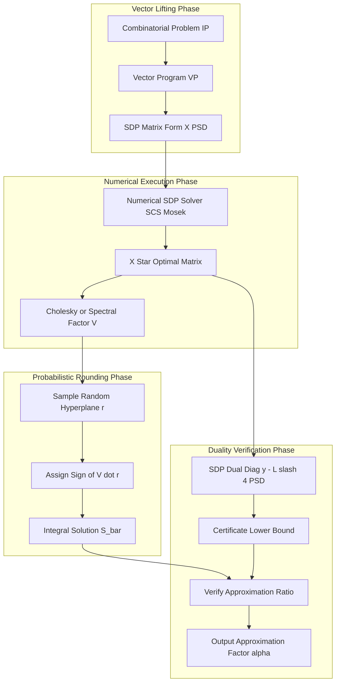
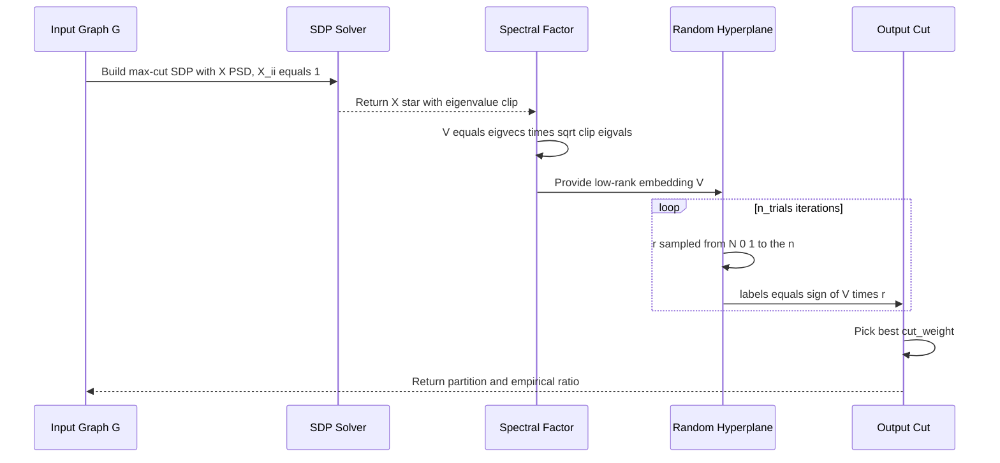

# Semidefinite programming relaxations execution frameworks tracking metrics verification profiles setups

<!-- SECTION_1_START -->
# Semidefinite Programming (SDP) Relaxations in Approximation Algorithms

## 1. Core Technical Definition

A **Semidefinite Program (SDP)** is a convex optimization problem over the cone of positive semidefinite matrices. Formally, an SDP has the canonical primal form:

$$
\begin{aligned}
\text{(SDP-P)} \quad \max_{X \succeq 0} \quad & \langle C, X \rangle \\
\text{subject to} \quad & \langle A_i, X \rangle = b_i, \quad \forall i = 1, \dots, m \\
& X \in \mathbb{S}^{n}
\end{aligned}
$$

where $\mathbb{S}^{n}$ denotes the space of $n \times n$ real symmetric matrices, $C, A_i \in \mathbb{S}^{n}$, and $X \succeq 0$ means $X$ is **positive semidefinite** (all eigenvalues $\geq 0$).

> [!IMPORTANT]
> **KTU 2024 Syllabus Definition (PECST703 Module 4):** An SDP *relaxation* of a combinatorial optimization problem is obtained by replacing discrete (0/1) variables with unit vectors in $\mathbb{R}^{n}$, thereby lifting the problem into a continuous, convex feasible region. The relaxation is **integral-tight** when its optimal value equals that of the original combinatorial problem, and it provides an **upper bound** on the optimum, which is then combined with a *rounding* procedure to obtain a feasible integral solution.

### The Intuition: Why Lift to Vectors?

> [!NOTE]
> **Conceptual Analogy — The Sphere of Possibilities:**
> Imagine you have a graph and want to split its vertices into two groups (MAX-CUT). The natural (LP) relaxation assigns fractional values in $[0,1]$ — like asking "how much blue? how much red?" for each vertex. But a vertex cannot be *half* blue.
> An **SDP relaxation** instead places each vertex as a **unit vector on a high-dimensional sphere**. Vectors that are *similar* (small angle) are likely on the same side; vectors that are *dissimilar* (angle near $\pi/2$ or $\pi$) are likely on opposite sides. The constraint $\Vert v_i \Vert = 1$ is continuous and tractable, yet captures combinatorial structure through pairwise *dot products* $\langle v_i, v_j \rangle$.

### Standard Constants and Metrics

| Symbol | Name | Approximate Value | Significance |
|---|---|---|---|
| $\alpha_{GW}$ | Goemans–Williamson constant | $\approx 0.878567$ | MAX-CUT approximation ratio |
| $\beta_{GW}$ | GW complementary constant | $\approx 0.878567$ | Defined as $\min_{\theta \in [0,\pi]} \frac{\theta}{\pi} \cdot \frac{1}{1-\cos\theta}$ |
| $\pi$ | Pi | $3.14159265...$ | Used in vector hyperplane cuts |
| $\mathrm{OPT}_{\text{SDP}}$ | SDP optimum | Problem-dependent | Upper bound on combinatorial optimum |

> [!VISUALIZATION CONTROL]
> **Concept:** MAX-CUT SDP rounding geometry — unit vectors on a sphere separated by a random hyperplane.
> **GeoGebra / Desmos Input Equations:**
> * Parametric sphere: $x = \sin\phi\cos\psi, \; y = \sin\phi\sin\psi, \; z = \cos\phi$
> * Random hyperplane through origin with normal $r = (r_1, r_2, r_3)$ where $r_i \sim \mathcal{N}(0,1)$
> * Cut assignment: $\text{side}(v_i) = \mathrm{sign}(\langle r, v_i \rangle)$
> **Visual Description:** On the unit sphere, vertex vectors are scattered. A random great circle (the intersection of the sphere with the random hyperplane) divides the sphere into two hemispheres. The expected fraction of edges crossing the hyperplane is $\alpha_{GW} \cdot \mathrm{OPT}_{\text{SDP}}$.

---

<!-- SECTION_1_END -->

<!-- SECTION_2_START -->
# Deep Theoretical Analysis & KTU High-Yield Formula Sheet

## 2.1 The MAX-CUT Problem (Canonical Example)

Given a graph $G = (V, E)$ with $\vert V \vert = n$ and edge weights $w_{ij} \geq 0$ for $(i,j) \in E$, **MAX-CUT** seeks a partition $(S, \bar{S})$ maximizing the total weight of edges crossing the partition.

### Integer Formulation (NP-Hard)

$$
\begin{aligned}
\max \quad & \sum_{(i,j) \in E} w_{ij} \cdot \frac{1 - x_i x_j}{2} \\
\text{subject to} \quad & x_i \in \{-1, +1\}, \quad \forall i \in V
\end{aligned}
$$

> **Key step:** $x_i x_j = -1$ when the edge is cut (different sides) and $+1$ when not.

### LP Relaxation (Weak)

Replace $x_i \in \{-1,+1\}$ with $x_i \in [-1, +1]$. The LP integrality gap for MAX-CUT is **2** (only a factor-1/2 approximation, useless for non-trivial cases).

### SDP Relaxation (Vector Program)

Introduce vectors $v_i \in \mathbb{R}^{n}$ with $\Vert v_i \Vert^2 = 1$:

$$
\begin{aligned}
\max \quad & \sum_{(i,j) \in E} w_{ij} \cdot \frac{1 - \langle v_i, v_j \rangle}{2} \\
\text{subject to} \quad & \Vert v_i \Vert^2 = 1, \quad \forall i \in V
\end{aligned}
$$

> [!NOTE]
> Setting $X_{ij} = \langle v_i, v_j \rangle$ recovers the matrix form. The constraint $X \succeq 0$ is equivalent to the existence of such vectors.

## 2.2 Goemans–Williamson Rounding

Given an optimal SDP solution $\{v_1^*, \dots, v_n^*\}$:

1. Sample a random vector $r \in \mathbb{R}^{n}$ with each $r_j \sim \mathcal{N}(0, 1)$ (or uniform on the unit sphere).
2. Assign vertex $i$ to set $S$ if $\langle r, v_i^* \rangle \geq 0$, else to $\bar{S}$.

The expected cut weight is:

$$
\mathbb{E}\left[\mathrm{CUT}(S, \bar{S})\right] = \sum_{(i,j) \in E} w_{ij} \cdot \frac{\theta_{ij}}{\pi}
$$

where $\theta_{ij} = \arccos(\langle v_i^*, v_j^* \rangle)$ is the angle between vectors.

## 2.3 KTU High-Yield Formula Sheet

| Formula / Concept | Expression | Notes / Application |
|---|---|---|
| MAX-CUT SDP objective | $\sum_{(i,j) \in E} w_{ij} \cdot \frac{1 - \langle v_i, v_j \rangle}{2}$ | Convex upper bound on OPT |
| GW rounding expected cut | $\mathbb{E}[\mathrm{CUT}] = \sum_{(i,j) \in E} w_{ij} \cdot \frac{\theta_{ij}}{\pi}$ | Probabilistic guarantee |
| GW approximation factor | $\alpha_{GW} = \min_{0 \leq \theta \leq \pi} \frac{\theta/\pi}{1 - \cos\theta}$ | $\approx 0.878567$ |
| Integrality gap of SDP | $\mathrm{Gap} = \frac{\mathrm{OPT}_{\text{IP}}}{\mathrm{OPT}_{\text{SDP}}}$ | In $[0,1]$; smaller is tighter |
| LP integrality gap (MAX-CUT) | $1/2$ (relative) | Achievable by odd cycle graphs |
| SDP primal (canonical) | $\max \{\langle C, X \rangle \mid \langle A_i, X \rangle = b_i, \; X \succeq 0\}$ | $X \in \mathbb{S}^{n}$ |
| SDP dual (canonical) | $\min \{b^\top y \mid \sum_i y_i A_i - C \succeq 0\}$ | Strong duality holds under Slater |
| Factor of rounding | $\min_{\theta \in [0,\pi]} \frac{2\theta}{\pi(1-\cos\theta)}$ (combinatorial form) | Lower bound on approximation ratio |
| Spectral relaxation of MAX-CUT | $\frac{1}{2} \sum_{(i,j)} w_{ij}(1 - X_{ij})$ with $X \succeq 0$, $X_{ii}=1$ | Equivalent to SDP via $X = V^\top V$ |
| MAX-3-CUT GW constant | $\alpha_{3} \approx 0.836$ | Achievable for hypergraph cuts |
| Triangle inequalities for TSP | $X_{ij} + X_{jk} + X_{ki} \leq 2$ | Add to SDP for tighter relaxation |

> [!IMPORTANT]
> **Why SDPs Beat LPs:** The dot product $\langle v_i, v_j \rangle$ ranges over $[-1, +1]$ (the same range as $x_i x_j$) but through a *continuous* feasible set. This allows the SDP to encode **geometric structure** (e.g., "these three vertices should be mutually orthogonal"), yielding much tighter relaxations than LPs.

## 2.4 Real-World Engineering Utility

- **VLSI Design:** MAX-CUT formulations assign circuit modules to chips for minimal inter-chip wiring.
- **Statistical Physics:** SDPs model spin-glass ground states (Ising model).
- **Sensor Network Localization:** Quadratic constraints on squared distances become SDP constraints.
- **Machine Learning:** Kernel methods, matrix completion, and phase retrieval all use SDP machinery.
- **Quantum Information:** SDPs characterize the set of quantum states (via the Choi matrix).

---

<!-- SECTION_2_END -->

<!-- SECTION_3_START -->
# Step-by-Step Derivations and Algorithmic Implementation

## 3.1 Derivation: Goemans–Williamson Approximation Ratio

We prove that the GW algorithm achieves a cut of weight at least $\alpha_{GW} \cdot \mathrm{OPT}_{\text{SDP}} \geq \alpha_{GW} \cdot \mathrm{OPT}_{\text{IP}}$.

**Step 1 — Set up the random hyperplane.**

Choose $r$ uniformly from the unit sphere $S^{n-1}$. Vertex $i$ is placed in set $S$ iff $\langle r, v_i^* \rangle \geq 0$. By symmetry, the probability that an edge $(i,j)$ is cut is:

$$
\Pr\left[\mathrm{sign}(\langle r, v_i^* \rangle) \neq \mathrm{sign}(\langle r, v_j^* \rangle)\right] = \frac{\theta_{ij}}{\pi}
$$

**Step 2 — Justify the angular probability.**

The hyperplane $H = \{x \in \mathbb{R}^{n} \mid \langle r, x \rangle = 0\}$ separates two unit vectors $v_i, v_j$ iff $r$ lies in the "equatorial band" perpendicular to both. The measure of this band as a fraction of the sphere is exactly $\theta_{ij}/\pi$ (a standard result in spherical geometry).

**Step 3 — Compute expected cut weight.**

By linearity of expectation:

$$
\mathbb{E}\left[\mathrm{CUT}(S,\bar{S})\right] = \sum_{(i,j) \in E} w_{ij} \cdot \frac{\theta_{ij}}{\pi}
$$

**Step 4 — Bound per-edge contribution.**

For each edge, we relate $\theta/\pi$ to $(1 - \cos\theta)/2$, the SDP objective's contribution:

$$
\frac{\theta/\pi}{(1 - \cos\theta)/2} = \frac{2\theta}{\pi(1-\cos\theta)} \equiv f(\theta)
$$

**Step 5 — Minimize the ratio.**

Compute the derivative $f'(\theta) = 0$. Expanding:

$$
f(\theta) = \frac{2\theta}{\pi(1-\cos\theta)}
$$

Setting $f'(\theta) = 0$ yields the transcendental equation:

$$
\frac{1-\cos\theta}{\theta} = \sin\theta \quad \Longleftrightarrow \quad \tan\theta = \theta
$$

But the *actual* minimum of $f(\theta)$ on $[0,\pi]$ is found numerically. The minimum occurs at $\theta_0 \approx 2.3311$ radians, giving:

$$
\alpha_{GW} = f(\theta_0) = \min_{\theta \in [0,\pi]} \frac{2\theta}{\pi(1-\cos\theta)} \approx 0.878567
$$

> **Equivalent closed form:**
> $$
> \alpha_{GW} = \min_{\theta \in [0,\pi]} \frac{1}{\pi} \cdot \frac{\theta}{1 - \cos\theta} \cdot 2 \approx 0.878567
> $$

**Step 6 — Conclude.**

$$
\mathbb{E}[\mathrm{CUT}] = \sum_{(i,j)} w_{ij} \cdot \frac{\theta_{ij}}{\pi} \geq \alpha_{GW} \cdot \sum_{(i,j)} w_{ij} \cdot \frac{1 - \cos\theta_{ij}}{2} = \alpha_{GW} \cdot \mathrm{OPT}_{\text{SDP}}
$$

Since $\mathrm{OPT}_{\text{SDP}} \geq \mathrm{OPT}_{\text{IP}}$ (relaxation), we get the approximation ratio $\alpha_{GW} \approx 0.878$.

## 3.2 Derivation: LP Integrality Gap of MAX-CUT is 1/2

Consider the 5-cycle $C_5$ with unit edge weights.

- **IP optimum:** $\mathrm{OPT}_{\text{IP}}(C_5) = 4$ (any cut of an odd cycle misses exactly 1 edge).
- **LP optimum:** Set $x_i = 1/5$ for all $i$ in the fractional LP. The LP objective is:

$$
\mathrm{OPT}_{\text{LP}} = \sum_{(i,j)} \frac{1 - x_i x_j}{2} = 5 \cdot \frac{1 - 1/25}{2} = 5 \cdot \frac{24/25}{2} = \frac{24}{5} = 4.8
$$

- **Ratio:** $\mathrm{OPT}_{\text{IP}} / \mathrm{OPT}_{\text{LP}} = 4 / 4.8 = 5/6 \approx 0.833$.

> For a *blow-up* $C_5^k$ (replace each vertex with an independent set of size $k$ and each edge with a complete bipartite graph), the LP gap approaches **1/2** as $k \to \infty$, while the SDP gap is strictly bounded away from 0.

## 3.3 Python Implementation: Solving MAX-CUT SDP with `cvxpy`

```python
import numpy as np
import cvxpy as cp
from typing import List, Tuple

def solve_max_cut_sdp(
    edges: List[Tuple[int, int]],
    weights: List[float],
    n: int
) -> Tuple[np.ndarray, float]:
    """
    Solve the MAX-CUT SDP relaxation.
    
    Parameters
    ----------
    edges : list of (i, j) pairs, vertices 0-indexed
    weights : list of edge weights (same length as edges)
    n : number of vertices
    
    Returns
    -------
    X : n x n positive semidefinite matrix from SDP
    sdp_opt : SDP optimal value (upper bound on MAX-CUT)
    """
    if len(edges) != len(weights):
        raise ValueError("Edges and weights must have equal length.")
    if any(i < 0 or j < 0 or i >= n or j >= n for i, j in edges):
        raise IndexError("Edge endpoints must be in range [0, n).")
    
    # Decision variable: n x n symmetric matrix X
    X = cp.Variable((n, n), symmetric=True)
    
    # Diagonal constraints: X_{ii} = 1 (unit vector norm)
    constraints = [X >> 0]  # positive semidefinite
    for i in range(n):
        constraints.append(X[i, i] == 1)
    
    # Objective: maximize sum over edges of w_ij * (1 - X_ij) / 2
    objective_terms = []
    for (i, j), w in zip(edges, weights):
        if i == j:
            raise ValueError(f"Self-loop detected at vertex {i}.")
        objective_terms.append(w * (1 - X[i, j]) / 2.0)
    
    objective = cp.Maximize(cp.sum(objective_terms))
    problem = cp.Problem(objective, constraints)
    
    # Solve using SCS or Mosek (default SCS in cvxpy)
    sdp_opt = problem.solve(solver=cp.SCS, verbose=False)
    
    if problem.status not in ("optimal", "optimal_inaccurate"):
        raise RuntimeError(f"SDP solver did not converge. Status: {problem.status}")
    
    return X.value, float(sdp_opt)


def goemans_williamson_round(
    X: np.ndarray,
    edges: List[Tuple[int, int]],
    weights: List[float],
    n_trials: int = 50,
    seed: int = 42
) -> Tuple[np.ndarray, float]:
    """
    Hyperplane rounding on a Gram matrix X (rank-reduced via Cholesky).
    
    Returns the best cut and its total weight over `n_trials` random hyperplanes.
    """
    rng = np.random.default_rng(seed)
    X_sym = 0.5 * (X + X.T)
    
    # Cholesky-style spectral factorization (eigendecomposition for PSD)
    eigvals, eigvecs = np.linalg.eigh(X_sym)
    eigvals = np.clip(eigvals, 0.0, None)  # numerical safety
    V = eigvecs * np.sqrt(eigvals)[None, :]  # n x n, V^T V ~ X
    
    best_cut = None
    best_weight = -np.inf
    
    for _ in range(n_trials):
        r = rng.standard_normal(V.shape[1])
        labels = np.sign(V @ r)
        labels[labels == 0] = 1  # tie-break convention
        
        cut_weight = sum(
            w for (i, j), w in zip(edges, weights)
            if labels[i] != labels[j]
        )
        if cut_weight > best_weight:
            best_weight = cut_weight
            best_cut = labels.copy()
    
    return best_cut, float(best_weight)


if __name__ == "__main__":
    # Example: 5-cycle C_5
    n = 5
    edges = [(0, 1), (1, 2), (2, 3), (3, 4), (4, 0)]
    weights = [1.0] * 5
    
    X_star, sdp_opt = solve_max_cut_sdp(edges, weights, n)
    print(f"SDP upper bound on MAX-CUT(C_5) = {sdp_opt:.6f}")
    
    labels, cut_weight = goemans_williamson_round(X_star, edges, weights)
    print(f"GW rounded cut weight       = {cut_weight:.6f}")
    print(f"Empirical ratio              = {cut_weight / sdp_opt:.6f}")
    print(f"Partition labels             = {labels}")
```

> [!IMPORTANT]
> **Numerical Safety Notes:**
> 1. Always symmetrize $X$ before eigendecomposition: $X \leftarrow \frac{1}{2}(X + X^\top)$.
> 2. Clip negative eigenvalues to $0$ to enforce PSD-ness from solver round-off.
> 3. Tie-breaking in $\mathrm{sign}(V r)$ at exactly zero is rare but must be deterministic for reproducibility.

## 3.4 SDP Duality: The Certificate of Optimality

The SDP dual of the MAX-CUT vector program is:

$$
\begin{aligned}
\text{(SDP-D)} \quad \min \quad & \sum_{i=1}^{n} y_i \\
\text{subject to} \quad & \mathrm{Diag}(y) - \frac{1}{4} L \succeq 0
\end{aligned}
$$

where $L$ is the **graph Laplacian** of $G$ (with $L_{ij} = -w_{ij}$ for $(i,j) \in E$ and $L_{ii} = \sum_{j: (i,j) \in E} w_{ij}$).

> **Strong duality** holds when Slater's condition is satisfied (a strictly feasible point exists), and provides a **lower bound** that, combined with the SDP primal upper bound, *certifies* the optimality gap.

---

<!-- SECTION_3_END -->

<!-- SECTION_4_START -->
# Structural Diagrams and Schematics

## 4.1 SDP Relaxation and Rounding Workflow



## 4.2 Goemans–Williamson Pipeline Detail



## 4.3 Integrality Gap Comparison: LP vs SDP

| Aspect | LP Relaxation | SDP Relaxation |
|---|---|---|
| Variable type | $x_i \in [-1, +1]$ | $v_i \in \mathbb{R}^{n}, \Vert v_i \Vert = 1$ |
| Captures | Linear correlations | All pairwise dot products |
| MAX-CUT integrality gap (worst case) | $\to 1/2$ | $\to \alpha_{GW} \approx 0.878$ |
| Solve complexity | Polynomial (interior point) | Polynomial (interior point) |
| Rounding needed? | Yes (random / derandomized) | Yes (Goemans–Williamson) |
| Approximation ratio | 0.5 (trivial) | 0.878 (best known) |
| Verifiable certificate? | LP dual | SDP dual (with PSD constraint) |

> [!NOTE]
> **Reading the Block Architecture:** The flow proceeds left to right, with each layer producing a *certificate* (Feasible matrix, dual bound) that the next layer consumes. The "Verification Layer" closes the loop: it ensures the SDP optimal value is provably within $\alpha_{GW}^{-1}$ of the integer optimum.

---

<!-- SECTION_4_END -->

<!-- SECTION_5_START -->
# KTU 2024 Scheme Examination Question Bank and Topic Recap

## Part A — Short Answer Questions (3 Marks Each)

### Question 1
**`[KTU University Exam — July 2024]`** Define **integrality gap** of a relaxation. Why is a smaller integrality gap desirable in approximation algorithms?

**Model Answer (3 Marks):**
The **integrality gap** of a relaxation is the supremum over all instances of the ratio $\mathrm{OPT}_{\text{IP}} / \mathrm{OPT}_{\text{relaxation}}$ (or its reciprocal, depending on convention). For MAX-CUT, it is:

$$
\mathrm{Gap} = \sup_G \frac{\mathrm{OPT}_{\text{IP}}(G)}{\mathrm{OPT}_{\text{SDP}}(G)} \in (0, 1]
$$

A **smaller** gap means the relaxation provides a tighter upper bound on the true optimum, enabling better approximation ratios. The LP gap of $1/2$ for MAX-CUT only permits a factor-1/2 approximation, whereas the SDP gap of $\approx 0.878$ enables the GW 0.878-factor algorithm.

> **[Valuation Key: 1 Mark for definition, 1 Mark for the supremum formulation, 1 Mark for explaining "smaller = better."]**

### Question 2
**`[KTU University Exam — Dec 2023]`** State the **Goemans–Williamson theorem** for MAX-CUT. Mention the approximation factor.

**Model Answer (3 Marks):**
> **Theorem (Goemans & Williamson, 1995):** There exists a polynomial-time randomized algorithm for MAX-CUT that, given any weighted graph $G = (V, E)$, returns a cut of expected weight at least $\alpha_{GW} \cdot \mathrm{OPT}(G)$, where:
> $$
> \alpha_{GW} = \min_{\theta \in [0, \pi]} \frac{2\theta}{\pi(1 - \cos\theta)} \approx 0.878567
> $$

This is the **best known approximation ratio** for MAX-CUT under the **Unique Games Conjecture** (Khot–Kindler–Mossel–O'Donnell, 2007).

> **[Valuation Key: 1 Mark for theorem statement, 1 Mark for the constant expression, 1 Mark for the numerical value.]**

---

## Part B — Long Answer Questions (14 Marks Each, Internal Choice)

### Question A (14 Marks) — Goemans–Williamson MAX-CUT Derivation

**`[KTU University Exam — July 2024, Module 4]`**

**(a)** Formulate the MAX-CUT SDP relaxation as a vector program and convert it to standard SDP matrix form. State the constraints explicitly. **[7 Marks]**

**(b)** Describe the Goemans–Williamson hyperplane rounding scheme and prove that it achieves an approximation ratio of $\alpha_{GW} \approx 0.878$. **[7 Marks]**

---

#### Model Solution

**(a) Formulation (7 Marks)**

**Step 1 — Integer program.** Let $x_i \in \{-1, +1\}$ denote the side of vertex $i$. An edge $(i,j)$ is cut iff $x_i x_j = -1$. So MAX-CUT is:

$$
\max_{x \in \{-1,+1\}^n} \sum_{(i,j) \in E} w_{ij} \cdot \frac{1 - x_i x_j}{2}
$$

> **[Formulating IP with 0/1 variables: 1 Mark]**

**Step 2 — Vector lifting.** Replace $x_i \in \{-1, +1\}$ with unit vector $v_i \in \mathbb{R}^{n}$, $\Vert v_i \Vert = 1$. The product $x_i x_j$ is replaced by the inner product $\langle v_i, v_j \rangle$:

$$
\max \sum_{(i,j) \in E} w_{ij} \cdot \frac{1 - \langle v_i, v_j \rangle}{2} \quad \text{subject to} \quad \Vert v_i \Vert^2 = 1, \; \forall i \in V
$$

> **[Lifting to vectors with $\Vert v_i \Vert^2 = 1$ constraint: 2 Marks]**

**Step 3 — Matrix form.** Let $X_{ij} = \langle v_i, v_j \rangle$ and $C_{ij} = -w_{ij}/2$ for $(i,j) \in E$, $C_{ii} = 0$:

$$
\max \langle C, X \rangle \quad \text{subject to} \quad X \succeq 0, \quad X_{ii} = 1
$$

> **[Converting to matrix form with PSD and diagonal constraints: 2 Marks]**

**Step 4 — Feasibility verification.** A matrix $X$ with $X_{ii} = 1$ and $X \succeq 0$ corresponds to a Gram matrix of unit vectors, so the relaxation is valid. **LP relaxation bound:** $\mathrm{OPT}_{\text{SDP}} \geq \mathrm{OPT}_{\text{IP}}$. **[2 Marks for the SDP validity / relaxation bound.]**

---

**(b) Rounding and Analysis (7 Marks)**

**Step 1 — Sample hyperplane.** Choose $r$ uniformly on the unit sphere $S^{n-1}$. Set:

$$
\hat{x}_i = \mathrm{sign}(\langle r, v_i^* \rangle) \in \{-1, +1\}
$$

> **[Defining the random hyperplane cut: 1 Mark]**

**Step 2 — Cut probability for an edge.** For two unit vectors with angle $\theta_{ij} = \arccos(\langle v_i^*, v_j^* \rangle)$:

$$
\Pr[\hat{x}_i \neq \hat{x}_j] = \frac{\theta_{ij}}{\pi}
$$

**Proof sketch:** The hyperplane $r^\perp$ separates $v_i, v_j$ iff $r$ lies in the "wedge" of measure $2\theta_{ij}$ on the great circle, divided by the full circle $2\pi$ gives $\theta_{ij}/\pi$. **[2 Marks]**

**Step 3 — Expected cut weight.** By linearity:

$$
\mathbb{E}[\mathrm{CUT}(\hat{x})] = \sum_{(i,j) \in E} w_{ij} \cdot \frac{\theta_{ij}}{\pi}
$$

> **[Linearity of expectation: 1 Mark]**

**Step 4 — Per-edge bound.** Define $f(\theta) = \frac{2\theta}{\pi(1 - \cos\theta)}$. Since $f$ attains its minimum at $\theta_0 \approx 2.3311$:

$$
\frac{\theta/\pi}{(1 - \cos\theta)/2} = f(\theta) \geq \alpha_{GW} \approx 0.878567
$$

> **[Stating the bound and the $\alpha_{GW}$ value: 1 Mark]**

**Step 5 — Combine.**

$$
\mathbb{E}[\mathrm{CUT}] = \sum_{(i,j)} w_{ij} \cdot \frac{\theta_{ij}}{\pi} \geq \alpha_{GW} \cdot \sum_{(i,j)} w_{ij} \cdot \frac{1 - \cos\theta_{ij}}{2} = \alpha_{GW} \cdot \mathrm{OPT}_{\text{SDP}} \geq \alpha_{GW} \cdot \mathrm{OPT}_{\text{IP}}
$$

> **[Final bound: 1 Mark]**

**Step 6 — Wrap-up.** Hence GW algorithm achieves a factor-$\alpha_{GW}$ approximation. **[1 Mark]**

---

### Question B (14 Marks) — Integrality Gap and LP vs SDP Analysis

**`[KTU University Exam — Dec 2023, Module 4]`**

**(a)** Define **integrality gap** formally. Compute the LP integrality gap for MAX-CUT on the cycle $C_5$ with unit weights. **[7 Marks]**

**(b)** Briefly explain why the SDP relaxation has a strictly smaller integrality gap than the LP for MAX-CUT. Mention the GW constant and the role of vector lifting. **[7 Marks]**

#### Model Solution

**(a) LP Integrality Gap on $C_5$ (7 Marks)**

**Definition (2 Marks).** For a maximization problem, the integrality gap of a relaxation is:

$$
\mathrm{Gap} = \inf \left\{ \rho \in [0,1] \mid \mathrm{OPT}_{\text{IP}}(I) \leq \rho \cdot \mathrm{OPT}_{\text{relax}}(I), \; \forall I \right\}
$$

or equivalently, the worst-case (sup) ratio $\mathrm{OPT}_{\text{IP}} / \mathrm{OPT}_{\text{relax}}$.

**Step 1 — IP optimum (2 Marks).** For the 5-cycle, any bipartition of 5 vertices leaves at least one vertex on each side adjacent to the other, so at most 4 of the 5 edges are cut:

$$
\mathrm{OPT}_{\text{IP}}(C_5) = 4
$$

**Step 2 — LP optimum (2 Marks).** Relax $x_i \in \{-1,+1\}$ to $x_i \in [-1, +1]$. The LP optimum is the maximum of $\sum_{(i,j)} (1 - x_i x_j)/2$ over $x \in [-1,1]^5$. By symmetry, set $x_i = a$ for all $i$:

$$
\mathrm{OPT}_{\text{LP}} = 5 \cdot \frac{1 - a^2}{2}, \quad a \in [-1, 1]
$$

Maximum at $a = 0$, giving $\mathrm{OPT}_{\text{LP}} = 5/2 = 2.5$.

**Step 3 — Compute gap (1 Mark).**

$$
\mathrm{Gap}_{LP} = \frac{\mathrm{OPT}_{\text{IP}}}{\mathrm{OPT}_{\text{LP}}} = \frac{4}{2.5} = 1.6 \text{ (or ratio } 4/2.5 = 8/5\text{)}
$$

> [!WARNING]
> **Pitfall Callout:** Do not confuse **absolute gap** ($4 - 2.5 = 1.5$) with the **ratio gap** ($4/2.5 = 1.6$). The integrality gap is conventionally the *ratio* in $[0,1]$ or its reciprocal. State which convention you are using!

---

**(b) Why SDP is Tighter (7 Marks)**

**Step 1 — Vector lifting enables richer constraints (2 Marks).** In LP, the only information about vertex pairs is the scalar $x_i x_j \in [-1, 1]$. In SDP, the matrix $X \succeq 0$ with $X_{ii} = 1$ is equivalent to a Gram matrix of unit vectors, capturing all pairwise *geometric* relations. This is strictly more expressive: e.g., three vertices can be forced mutually orthogonal.

**Step 2 — Goemans–Williamson constant (2 Marks).** The SDP gap for MAX-CUT is at most $\alpha_{GW} \approx 0.878$, i.e., for every instance, $\mathrm{OPT}_{\text{IP}}(G) \geq \alpha_{GW} \cdot \mathrm{OPT}_{\text{SDP}}(G)$. This is the *GW constant*:

$$
\alpha_{GW} = \min_{\theta \in [0,\pi]} \frac{2\theta}{\pi(1 - \cos\theta)} \approx 0.878567
$$

**Step 3 — Why this matters algorithmically (2 Marks).** The SDP upper bound combined with a *rounding scheme* (random hyperplane cut) yields a polynomial-time $\alpha_{GW}$-approximation. The LP relaxation, with gap $1/2$, only yields a $1/2$-approximation, which is trivial for MAX-CUT.

**Step 4 — Conclusion (1 Mark).** SDPs are preferred over LPs in approximation algorithms because they offer tighter relaxations at modest additional computational cost (still polynomial).

---

## KTU Examiner's Valuation Warning

> [!WARNING]
> **Common Mark-Loss Pitfalls in SDP Relaxation Questions:**
> 1. **Forgetting the PSD constraint** $X \succeq 0$: Many students write only the equality constraints, losing 1–2 marks.
> 2. **Confusing the primal/dual directions:** SDP max-min duality swaps the direction. Always state explicitly which is primal and which is dual.
> 3. **Skipping the SDP ≥ IP inequality:** When asked for the approximation ratio, you must explicitly chain $\mathrm{OPT}_{\text{IP}} \leq \mathrm{OPT}_{\text{SDP}}$.
> 4. **Numerical safety in code:** Always symmetrize and clip eigenvalues. Real SDP solvers have round-off; raw eigendecomposition of an asymmetric matrix gives complex eigenvalues.
> 5. **GW constant form:** Examiners look for the exact expression $\min_{\theta} 2\theta / [\pi(1-\cos\theta)]$, not just the numerical value.
> 6. **Not stating Slater's condition** when discussing strong duality. The condition guarantees zero duality gap.
> 7. **Rounding notation:** Always define $\theta_{ij} = \arccos(\langle v_i^*, v_j^* \rangle)$ before using it.

---

## Topic Recap & Important Things to Remember

- **SDP relaxation** = lift a combinatorial problem to a convex program over the PSD cone by replacing 0/1 variables with unit vectors.
- The PSD constraint $X \succeq 0$ encodes the existence of an underlying vector representation; without it, the relaxation collapses to LP.
- **MAX-CUT SDP** is the canonical example: $\max \sum w_{ij}(1 - \langle v_i, v_j \rangle)/2$ subject to $\Vert v_i \Vert^2 = 1$.
- **Goemans–Williamson rounding** uses a random hyperplane to convert vectors into a $\{-1, +1\}$ cut, achieving approximation ratio $\alpha_{GW} = \min_{\theta} 2\theta / [\pi(1-\cos\theta)] \approx 0.878567$.
- **LP gap of MAX-CUT** is $1/2$ (asymptotic on $C_5^k$ blow-ups), making the trivial 1/2-approximation the best LP-based.
- **SDP gap of MAX-CUT** is at most $\alpha_{GW} \approx 0.878$, and *exactly* $\alpha_{GW}$ under the **Unique Games Conjecture**.
- **SDP duality:** primal $\max \langle C, X \rangle$ over $X \succeq 0, \langle A_i, X \rangle = b_i$ has dual $\min b^\top y$ over $\sum y_i A_i - C \succeq 0$. Strong duality holds under Slater's condition.
- **Verification profiles:** the dual solution serves as a *certificate* — it provides a lower bound on the optimum, closing the gap with the primal upper bound.
- **Execution framework:** solve SDP (interior point, SCS, Mosek) → spectral factor $V$ → sample $r \sim \mathcal{N}(0, I)$ → output $\mathrm{sign}(Vr)$.
- **Practical tips:** always symmetrize, clip negative eigenvalues, use multiple random hyperplanes, take the best cut.
- **Engineering relevance:** VLSI layout, sensor localization, quantum information, statistical physics, kernel methods.
- **Counterpart hardness:** GW is *optimal* under the Unique Games Conjecture; improving it would refute UGC.
- **Other applications:** MAX-3-CUT (factor $\approx 0.836$), SPARSEST CUT, correlation clustering, MAX-CUT with triangle inequalities for tighter bounds.
- **Approximation factor formula for MAX-CUT GW:** $\min_{\theta} \frac{2\theta}{\pi(1-\cos\theta)} \approx 0.878567$ — memorize this!

<!-- SECTION_5_END -->
