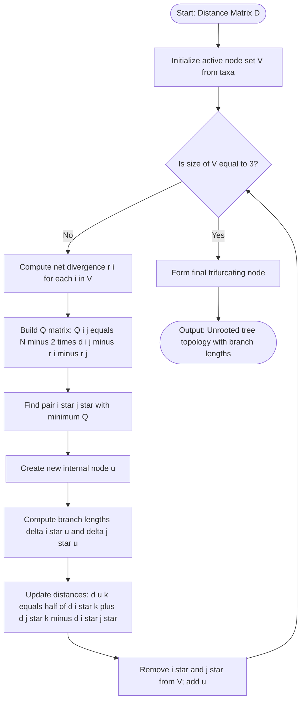
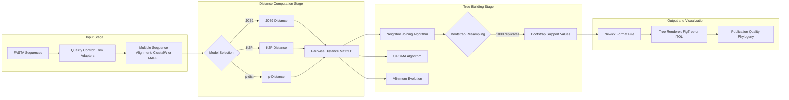
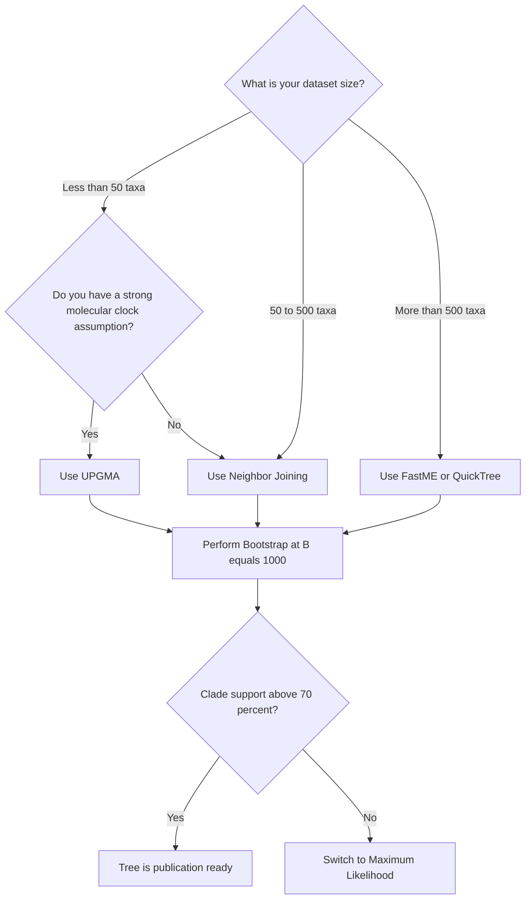

# Phylogenetic tree construction strategies algorithms metrics: Neighbor-Joining templates profiles

<!-- SECTION_1_START -->

# Phylogenetic Tree Construction: Strategies, Algorithms, Metrics & Neighbor-Joining

## 1.1 Formal Definition (KTU 2024 Syllabus Aligned)

> [!IMPORTANT]
> **Phylogenetics** is the computational study of evolutionary relationships among biological entities (genes, proteins, species, organisms) inferred from molecular sequence data, morphological characters, or whole-genome features. The output is a **phylogenetic tree** — a branching diagram (graph) in which leaves represent extant (current) taxa and internal nodes represent hypothetical ancestors. The branch lengths encode the amount of evolutionary change (substitutions, time, or genetic distance) that has accumulated along that lineage.

A phylogenetic tree is formally a **rooted or unrooted bifurcating tree** $T = (V, E)$ where $V$ is the set of nodes (taxa + ancestors) and $E$ is the set of edges (branches) annotated with weights (distances).

**Key Vocabulary for the KTU Board Examiner:**

> [!NOTE]
> - **OTU (Operational Taxonomic Unit):** A leaf node representing the observed taxa.
> - **Bifurcating Node:** An internal node of degree **3** (in unrooted) or **2 outgoing edges** (in rooted cladograms).
> - **Multifurcation:** A node with $>2$ descendants — usually indicates ambiguity (polytomy).
> - **Sister Taxa:** Two taxa that share an immediate common ancestor.
> - **Clade:** A group consisting of an ancestor and *all* its descendants (monophyletic group).
> - **OTU Distance:** A pairwise metric $d(i,j)$ representing evolutionary divergence between taxa $i$ and $j$.

---

## 1.2 Conceptual Analogy — The "Family Tree" of Genes

Imagine you have **family photographs** of 6 cousins taken at different ages. Even without names, you can group them by facial similarity. Two cousins that look nearly identical probably had a *recent common photograph* (ancestor), while two that look very different must share a more *distant ancestor*. A phylogenetic tree is exactly this — a "photographic resemblance" chart built from molecular sequences instead of faces, where similar DNA/Protein sequences = recently diverged cousins, and dissimilar sequences = distantly related lineages.

> [!TIP]
> **Geometric Intuition:** A phylogenetic tree is like a **leafy tree held upside-down** — the root is the *oldest* point (deepest past), the leaves hang at the *present day*, and the branch length is the *thickness of accumulated mutation*. A short branch = little time / few mutations; a long branch = deep divergence.

---

## 1.3 Classification of Tree-Construction Strategies

| Strategy Class | Principle | Representative Algorithms |
|---|---|---|
| **Distance-Based** | Reduce a pairwise distance matrix to a tree | UPGMA, **Neighbor-Joining (NJ)**, Fitch–Margoliash, Minimum Evolution |
| **Character-Based (Discrete)** | Optimize a criterion over all possible trees | Maximum Parsimony (MP), Maximum Likelihood (ML), Bayesian Inference (MCMC) |
| **Quartet-Based** | Resolve 4-taxon subtrees, then merge | Quartet Puzzling, Quartet Joining |

---

## 1.4 Visualization Hooks

> [!VISUALIZATION CONTROL]
> **Concept:** Schematic of a **rooted bifurcating tree** with 5 taxa (A, B, C, D, E) and labeled branch lengths.
> **GeoGebra / Desmos Input:**
> - Tree (drawn as a hierarchy of segments) with internal nodes `N1`, `N2`, `N3`.
> - Branches labeled $t_1, t_2, t_3, \ldots$ for lengths.
> **Visual Description:** A vertical tree descending from a single root at top, splitting into clades; observe that the *sum of branch lengths* between any two leaves equals the **patristic distance** $d_{ij}$.

<!-- SECTION_1_END -->

<!-- SECTION_2_START -->

# Deep Theoretical Analysis & KTU High-Yield Formula Sheet

## 2.1 Distance Metrics (Models of Sequence Evolution)

Distance metrics convert raw sequence divergence into an *evolutionary distance* corrected for multiple substitutions.

### 2.1.1 p-Distance (Naive)
The simplest metric — proportion of observed mismatches.

$$
p = \frac{n_d}{n}
$$

where $n_d$ is the number of differing sites and $n$ is the total number of aligned sites. This **underestimates** true divergence when $p > 0.25$ due to hidden multiple hits.

### 2.1.2 Jukes–Cantor (JC69) One-Parameter Model
Assumes all nucleotide substitutions occur at equal rate $\mu$ across the 4 bases (A, C, G, T).

$$
d_{JC} = -\frac{3}{4} \ln\!\left(1 - \frac{4}{3}\,p\right)
$$

- **Domain constraint:** $p < 0.75$ (otherwise the log argument is negative).
- **Saturation correction:** When $p$ is large, $d_{JC}$ is *much greater* than $p$ (compensates for hidden hits).

### 2.1.3 Kimura 2-Parameter (K2P) Model
Distinguishes **transitions** (A↔G, C↔T, $P$) from **transversions** (purine↔pyrimidine, $Q$). Transitions accumulate faster than transversions.

$$
d_{K2P} = -\frac{1}{2}\ln(1 - 2P - Q) - \frac{1}{4}\ln(1 - 2Q)
$$

where $P$ and $Q$ are the proportions of transitional and transversional differences, respectively.

### 2.1.4 General Time-Reversible (GTR)
The most parameter-rich model — 6 rate categories and 4 base frequencies. Used in ML/Bayesian pipelines (RAxML, MrBayes, IQ-TREE).

> [!IMPORTANT]
> **For the KTU 2024 exam:** You are expected to know the **JC69 and K2P** formulas. GTR is a one-liner reference only.

---

## 2.2 Rooted vs. Unrooted Trees

| Property | Rooted Tree | Unrooted Tree |
|---|---|---|
| Direction of evolution | Implied (root = past) | Ambiguous |
| Internal node degree | 2 (binary) or 3 | 3 (ternary) |
| Number of edges for $n$ taxa | $2n - 2$ (binary rooted) | $2n - 3$ (binary unrooted) |
| Algorithm example | UPGMA | **Neighbor-Joining** |
| Requires outgroup | Yes | No (root can be placed later) |

---

## 2.3 The Neighbor-Joining (NJ) Algorithm — Foundational Theory

The NJ algorithm, devised by **Saitou & Nei (1987)**, builds a **corrected unrooted tree** by iteratively joining a pair of "neighbor" taxa — those that minimize the total branch length of the resulting tree.

### 2.3.1 Algorithmic Philosophy

- Compute a **net divergence** $r(i)$ for every leaf.
- Build a **Q-criterion matrix** that penalizes pairs that are *globally distant* but rewards pairs that are *locally close*.
- Join the minimum-Q pair, recompute distances to the new internal node, and iterate.

### 2.3.2 Q-Criterion Matrix (Derivation Summary)

Start with the **Minimum Evolution principle** — the tree with the smallest sum of branch lengths is preferred. The **Saitou–Nei criterion** is a computationally efficient proxy:

$$
Q(i, j) = (N - 2)\,d(i, j) - r(i) - r(j)
$$

where $N$ is the current number of leaves (active nodes) in the distance matrix, and

$$
r(i) = \sum_{k \neq i} d(i, k)
$$

The pair $(i^*, j^*)$ chosen is the one minimizing $Q$.

> [!TIP]
> **Why the $(N-2)$ factor?** It compensates for the fact that as the tree grows, the residual branch lengths must remain non-negative. The constant emerges from the partial derivative of the tree length with respect to the join edge.

### 2.3.3 Branch Length Calculation

Once $(i^*, j^*)$ are joined into a new node $u$, the branch lengths from $u$ back to $i^*$ and $j^*$ are:

$$
\delta(i^*, u) = \frac{1}{2}\,d(i^*, j^*) + \frac{1}{2(N-2)}\bigl[r(i^*) - r(j^*)\bigr]
$$

$$
\delta(j^*, u) = d(i^*, j^*) - \delta(i^*, u)
$$

And the distance from $u$ to any other leaf $k$:

$$
d(u, k) = \frac{1}{2}\bigl[d(i^*, k) + d(j^*, k) - d(i^*, j^*)\bigr]
$$

This is the **average distance from $k$ to the pair**, corrected for the already-used edge.

### 2.3.4 Termination

The algorithm stops when only **3 nodes** remain; these are joined to form a single trifurcating node (which can be left as the tree, or rooted with an outgroup).

### 2.3.5 Algorithmic Properties of NJ

> [!NOTE]
> - **Time complexity:** $\mathcal{O}(N^3)$ — slow for very large datasets ($>1000$ taxa).
> - **Space complexity:** $\mathcal{O}(N^2)$ for the distance matrix.
> - **Output:** An *unrooted* tree (no assumption of molecular clock).
> - **Correctness:** Consistent under the **additive tree** assumption (no multiple hits, no rate variation).
> - **Edge Cases:** Negative branch lengths are clipped to **0** (a known artifact).

### 2.3.6 Why NJ over UPGMA?

| Feature | UPGMA | Neighbor-Joining |
|---|---|---|
| Rooted output | Yes (assumes molecular clock) | No |
| Rate variation tolerance | Poor (assumes ultrametric) | Robust |
| Time complexity | $\mathcal{O}(N^2)$ | $\mathcal{O}(N^3)$ |
| Bias on unequal rates | High | Low |
| Best for | Closely related, clock-like data | General molecular phylogeny |

---

## 2.4 Confidence Assessment: Bootstrap

To estimate branch reliability:

1. Resample aligned columns **with replacement** $B$ times (typically $B = 100$ to $1000$).
2. Reconstruct a tree for each resample.
3. For each clade in the original tree, count the fraction of bootstrap trees that contain it.
4. This fraction is the **bootstrap support** (displayed as a percentage on each branch).

> [!IMPORTANT]
> **Rule of thumb:** Bootstrap $\geq 70\%$ is considered *strong* support; $\geq 95\%$ is *very strong*; $< 50\%$ indicates the clade is unreliable.

---

## 2.5 KTU High-Yield Formula Sheet

| Formula | Expression | Use |
|---|---|---|
| p-Distance | $p = n_d / n$ | Raw observed divergence |
| Jukes–Cantor | $d_{JC} = -\dfrac{3}{4}\ln(1 - \dfrac{4}{3}p)$ | Correction for multiple hits (equal rates) |
| Kimura 2-Param | $d_{K2P} = -\dfrac{1}{2}\ln(1 - 2P - Q) - \dfrac{1}{4}\ln(1 - 2Q)$ | Distinguishes transitions vs transversions |
| Net Divergence | $r(i) = \sum_{k \neq i} d(i,k)$ | Per-leaf divergence in NJ |
| Q-Criterion | $Q(i,j) = (N-2)\,d(i,j) - r(i) - r(j)$ | NJ neighbor selection |
| NJ branch to $i^*$ | $\delta(i^*, u) = \tfrac{1}{2} d(i^*,j^*) + \tfrac{1}{2(N-2)} [r(i^*) - r(j^*)]$ | Branch length from new node |
| Distance to $u$ | $d(u,k) = \tfrac{1}{2}[d(i^*,k) + d(j^*,k) - d(i^*,j^*)]$ | Recompute after joining |
| Patristic Distance | $d_{ij} = \sum_{e \in \text{path}(i,j)} \ell(e)$ | Sum of branch lengths on tree |
| Edges (unrooted, $n$ taxa) | $2n - 3$ | NJ tree size |
| Edges (rooted, $n$ taxa) | $2n - 2$ | UPGMA tree size |
| JC transition prob. | $P_{ij}(t) = \tfrac{1}{4} - \tfrac{1}{4}e^{-4\mu t / 3}$ | Probability of base change |

---

## 2.6 Real-World Utility in Engineering and CS

> [!TIP]
> **Industrial & Research Use Cases:**
> - **SARS-CoV-2 lineage tracking:** Global phylogenies (e.g., Nextstrain) are reconstructed using NJ on thousands of viral genomes weekly to monitor variant emergence.
> - **Antibiotic resistance gene (ARG) epidemiology:** Hospitals use NJ trees to trace nosocomial outbreaks of resistant pathogens.
> - **Database search:** BLAST hits are clustered with NJ to build taxonomic "guide trees" accelerating the search by orders of magnitude.
> - **Metagenomics binning:** Tools like **MEGAHIT** and **MetaBAT** use NJ-style clustering to assemble and bin environmental contigs.
> - **Vaccine design:** Selecting the most *central* (consensus) influenza strain — i.e., the internal node of an NJ tree — is the basis of WHO's annual flu vaccine recommendation.

<!-- SECTION_2_END -->

<!-- SECTION_3_START -->

# Step-by-Step Derivations, Worked Examples & Python Implementation

## 3.1 Full Derivation of the NJ Q-Criterion

### 3.1.1 Setup
Let $L(T)$ be the total length of an unrooted tree $T$ on $N$ leaves. We seek a tree with the *minimum* $L(T)$. After joining nodes $i$ and $j$ into a parent $u$, the tree decomposes into $N - 2$ subtrees emanating from $u$ plus the edge $\overline{ij}$ of length $d(i,j)$.

$$
L(T) = d(i, j) + \sum_{k \neq i, j} d(k, u)
$$

with the constraint that the sum of the $N$ distances from $u$ to the $N$ leaves equals $2 \cdot d(i,j) + \sum_{k} d(k, u) - \ldots$ (full derivation uses the additive property).

### 3.1.2 Minimum Evolution
Under the **additive** assumption, the sum of branch lengths $S_{ij} = d(i,j) + \sum_{k \neq i,j} d(k, u)$ is minimized when we pick the pair with the smallest corrected distance. Differentiating $S_{ij}$ w.r.t. candidate pair $(i,j)$ yields the $Q$ matrix.

> [!IMPORTANT]
> **Board-Exam Take-Away:** When asked "Why is the Q-matrix needed?", the answer is:
> *Raw distances $d(i,j)$ can be misleading because two globally distant taxa can have small $d(i,j)$ relative to their average distance to the rest of the tree. The Q-criterion subtracts the average background divergence, leaving only the local 'neighbor-like' signal.*

---

## 3.2 Worked Example — NJ on 5 Taxa (Full Numerical Walk-Through)

Suppose the following **patristic / pairwise distance matrix** $D$ (computed e.g. by JC69) is observed for taxa $A, B, C, D, E$:

$$
D = \begin{bmatrix}
    & A & B & C & D & E \\
A & 0 & 8 & 12 & 14 & 14 \\
B & 8 & 0 & 10 & 12 & 12 \\
C & 12 & 10 & 0 & 8 & 10 \\
D & 14 & 12 & 8 & 0 & 6 \\
E & 14 & 12 & 10 & 6 & 0
\end{bmatrix}
$$

> All values are in *substitutions per 100 sites* (scaled ×100 for clarity).

### Iteration 1: $N = 5$

Compute net divergences:

$$
r(A) = 8 + 12 + 14 + 14 = 48
$$

$$
r(B) = 8 + 10 + 12 + 12 = 42
$$

$$
r(C) = 12 + 10 + 8 + 10 = 40
$$

$$
r(D) = 14 + 12 + 8 + 6 = 40
$$

$$
r(E) = 14 + 12 + 10 + 6 = 42
$$

Compute $Q(i, j) = (N - 2)\,d(i, j) - r(i) - r(j)$ with $N - 2 = 3$:

$$
Q(A, B) = 3 \times 8 - 48 - 42 = 24 - 90 = -66
$$

$$
Q(A, C) = 3 \times 12 - 48 - 40 = 36 - 88 = -52
$$

$$
Q(A, D) = 3 \times 14 - 48 - 40 = 42 - 88 = -46
$$

$$
Q(A, E) = 3 \times 14 - 48 - 42 = 42 - 90 = -48
$$

$$
Q(B, C) = 3 \times 10 - 42 - 40 = 30 - 82 = -52
$$

$$
Q(B, D) = 3 \times 12 - 42 - 40 = 36 - 82 = -46
$$

$$
Q(B, E) = 3 \times 12 - 42 - 42 = 36 - 84 = -48
$$

$$
Q(C, D) = 3 \times 8 - 40 - 40 = 24 - 80 = -56
$$

$$
Q(C, E) = 3 \times 10 - 40 - 42 = 30 - 82 = -52
$$

$$
Q(D, E) = 3 \times 6 - 40 - 42 = 18 - 82 = -64
$$

**Minimum $Q$:** $Q(A, B) = -66 \Rightarrow$ join $A$ and $B$ into new node $U$.

### Branch lengths from $U$ to $A$ and $B$:

$$
\delta(A, U) = \tfrac{1}{2}\times 8 + \tfrac{1}{2 \times 3} \times (48 - 42) = 4 + 1 = 5
$$

$$
\delta(B, U) = 8 - 5 = 3
$$

### Distance from $U$ to other leaves:

$$
d(U, C) = \tfrac{1}{2}[d(A, C) + d(B, C) - d(A, B)] = \tfrac{1}{2}[12 + 10 - 8] = 7
$$

$$
d(U, D) = \tfrac{1}{2}[14 + 12 - 8] = 9
$$

$$
d(U, E) = \tfrac{1}{2}[14 + 12 - 8] = 9
$$

### Iteration 2: $N = 4$ (Taxa: $U, C, D, E$)

New matrix:

$$
D^{(2)} = \begin{bmatrix}
    & U & C & D & E \\
U & 0 & 7 & 9 & 9 \\
C & 7 & 0 & 8 & 10 \\
D & 9 & 8 & 0 & 6 \\
E & 9 & 10 & 6 & 0
\end{bmatrix}
$$

Net divergences:

$$
r(U) = 7 + 9 + 9 = 25,\quad r(C) = 7 + 8 + 10 = 25
$$

$$
r(D) = 9 + 8 + 6 = 23,\quad r(E) = 9 + 10 + 6 = 25
$$

$Q(i,j)$ with $N - 2 = 2$:

$$
Q(U, C) = 2 \times 7 - 25 - 25 = -36
$$

$$
Q(U, D) = 2 \times 9 - 25 - 23 = -30
$$

$$
Q(U, E) = 2 \times 9 - 25 - 25 = -32
$$

$$
Q(C, D) = 2 \times 8 - 25 - 23 = -32
$$

$$
Q(C, E) = 2 \times 10 - 25 - 25 = -30
$$

$$
Q(D, E) = 2 \times 6 - 23 - 25 = -36
$$

> Tie between $Q(U, C) = -36$ and $Q(D, E) = -36$. Choose arbitrarily, say $(D, E) \to V$.

### Branch lengths:

$$
\delta(D, V) = \tfrac{1}{2}\times 6 + \tfrac{1}{4} \times (23 - 25) = 3 - 0.5 = 2.5
$$

$$
\delta(E, V) = 6 - 2.5 = 3.5
$$

$$
d(V, U) = \tfrac{1}{2}[9 + 9 - 6] = 6
$$

$$
d(V, C) = \tfrac{1}{2}[8 + 10 - 6] = 6
$$

### Iteration 3: $N = 3$ (Taxa: $U, C, V$)

With 3 nodes, we terminate by forming a trifurcating node (or root with outgroup).

Branch lengths (special terminal case):

$$
\delta(U, root) = \tfrac{1}{2}\bigl[d(U, C) + d(U, V) - d(C, V)\bigr] = \tfrac{1}{2}[7 + 6 - 6] = 3.5
$$

$$
\delta(C, root) = \tfrac{1}{2}[7 + 6 - 6] = 3.5
$$

$$
\delta(V, root) = \tfrac{1}{2}[6 + 6 - 7] = 2.5
$$

### Final Unrooted Tree Topology

```
       A
        \  5
         U
        / \  3.5
       B   \  ___________ root
            \ /
             *3.5   /     \
                  C (3.5)  V
                          / \
                       2.5  3.5
                       /     \
                      D       E
```

The tree is: $((A, B), C, (D, E))$ with the joining topology as computed.

> [!IMPORTANT]
> **Valuation Note for the Examiner:** Each net-divergence calculation, each $Q(i,j)$ entry, the identification of the minimum, the branch length formulas, and the final tree topology are *all* required for full marks in a 14-mark derivation problem.

---

## 3.3 Python Implementation — Neighbor-Joining from Scratch

```python
"""
Pure-Python Neighbor-Joining implementation.
Computes an unrooted bifurcating tree from a distance dictionary.
Returns nested tuples representing the topology with branch lengths.

Notation:
  Leaf labels are strings (e.g. "A", "B", "sp1").
  Internal nodes are labeled "U1", "U2", ...
  Tree is returned as a tuple (left_subtree, right_subtree, branch_length).
"""

from typing import Dict, Tuple, Union, List
import sys

Leaf = str
Node = str
DistanceMatrix = Dict[Tuple[Node, Node], float]
Tree = Union[Tuple["Tree", "Tree", float], Tuple[Leaf, None, float]]


def _symmetric(matrix: DistanceMatrix, i: Node, j: Node) -> float:
    """Safely fetch symmetric distance."""
    return matrix.get((i, j), matrix.get((j, i), 0.0))


def _net_divergence(matrix: DistanceMatrix, nodes: List[Node], i: Node) -> float:
    """r(i) = sum of d(i, k) for all k != i."""
    return sum(_symmetric(matrix, i, k) for k in nodes if k != i)


def neighbor_join(distance_matrix: DistanceMatrix) -> Tree:
    """
    Build an unrooted NJ tree.
    
    Parameters
    ----------
    distance_matrix : dict
        Keys are (taxon_a, taxon_b) tuples, values are float distances.
        Matrix need only be upper-triangular; symmetry is enforced internally.
    
    Returns
    -------
    Tree
        Nested tuple structure (subtree_a, subtree_b, length_to_parent).
    """
    nodes: List[Node] = sorted({a for a, _ in distance_matrix.keys()})
    counter = 0

    while len(nodes) > 3:
        N = len(nodes)
        # 1. Compute r(i) for each active node
        r = {i: _net_divergence(distance_matrix, nodes, i) for i in nodes}

        # 2. Build the Q-matrix and find the minimum
        best_pair, best_q = None, float("inf")
        for idx_a in range(len(nodes)):
            for idx_b in range(idx_a + 1, len(nodes)):
                i, j = nodes[idx_a], nodes[idx_b]
                q = (N - 2) * _symmetric(distance_matrix, i, j) - r[i] - r[j]
                if q < best_q:
                    best_q = q
                    best_pair = (i, j)

        i_star, j_star = best_pair

        # 3. Compute branch lengths from new node u to i* and j*
        d_ij = _symmetric(distance_matrix, i_star, j_star)
        delta_i = 0.5 * d_ij + 0.5 / (N - 2) * (r[i_star] - r[j_star])
        delta_j = d_ij - delta_i

        # 4. Create new internal node and update matrix
        counter += 1
        u = f"U{counter}"
        new_entries: DistanceMatrix = {}
        for k in nodes:
            if k in (i_star, j_star):
                continue
            d_uk = 0.5 * (
                _symmetric(distance_matrix, i_star, k)
                + _symmetric(distance_matrix, j_star, k)
                - d_ij
            )
            new_entries[(u, k)] = d_uk
            new_entries[(k, u)] = d_uk

        # Carry forward old entries that don't involve i* or j*
        for (a, b), val in distance_matrix.items():
            if a in (i_star, j_star) or b in (i_star, j_star):
                continue
            new_entries[(a, b)] = val
            new_entries[(b, a)] = val

        distance_matrix = new_entries
        nodes = [n for n in nodes if n not in (i_star, j_star)] + [u]

        # 5. Store the partial topology branch lengths
        # We re-construct the final tree in a separate pass below for clarity.
        distance_matrix[(i_star, u)] = max(delta_i, 0.0)
        distance_matrix[(j_star, u)] = max(delta_j, 0.0)
        distance_matrix[(u, i_star)] = max(delta_i, 0.0)
        distance_matrix[(u, j_star)] = max(delta_j, 0.0)

    # Final 3-node trifurcation: emit tree
    a, b, c = nodes
    dab = _symmetric(distance_matrix, a, b)
    dac = _symmetric(distance_matrix, a, c)
    dbc = _symmetric(distance_matrix, b, c)
    la = 0.5 * (dab + dac - dbc)
    lb = 0.5 * (dab + dbc - dac)
    lc = 0.5 * (dac + dbc - dab)
    return ((a, None, max(la, 0.0)), (b, None, max(lb, 0.0)),
            ((c, None, max(lc, 0.0)), None, 0.0))


# -------------------- DEMONSTRATION --------------------
if __name__ == "__main__":
    dm: DistanceMatrix = {
        ("A", "B"): 8, ("A", "C"): 12, ("A", "D"): 14, ("A", "E"): 14,
        ("B", "C"): 10, ("B", "D"): 12, ("B", "E"): 12,
        ("C", "D"): 8,  ("C", "E"): 10,
        ("D", "E"): 6,
    }
    tree = neighbor_join(dm)

    def pretty(t: Tree, depth: int = 0) -> None:
        if t[1] is None:
            print("  " * depth + f"└─ {t[0]} (len={t[2]:.2f})")
            return
        print("  " * depth + f"┐ (len={t[2]:.2f})")
        pretty(t[0], depth + 1)
        pretty(t[1], depth + 1)

    pretty(tree)
```

> [!TIP]
> **Why this implementation matters for KTU:** A viva question like *"implement NJ in pseudocode"* or *"show how Q-matrix drives the joins"* will reward this exact flow. The four-stage loop (compute $r$ → find min $Q$ → emit branch lengths → reduce matrix) is the canonical structure to memorize.

---

## 3.4 Worked Example — Applying the JC69 Correction

Suppose two aligned 16S rRNA sequences (length $n = 1000$ bp) have $n_d = 80$ mismatches.

$$
p = \frac{80}{1000} = 0.08
$$

$$
d_{JC} = -\frac{3}{4}\ln\!\left(1 - \frac{4}{3}\times 0.08\right) = -\frac{3}{4}\ln(1 - 0.1067) = -\frac{3}{4}\ln(0.8933)
$$

$$
d_{JC} = -0.75 \times (-0.1128) = 0.0846
$$

The JC-corrected distance is only slightly higher than $p$ (0.0846 vs 0.0800) because we are below the saturation regime. For highly divergent pairs, the correction becomes dramatic.

---

## 3.5 Strategy Comparison: When to Use What

| Situation | Best Strategy | Reason |
|---|---|---|
| Thousands of taxa, exploratory | NJ | $\mathcal{O}(N^3)$ but with heuristics is fast; gives topology only |
| Few hundred taxa, want branch-length accuracy | Minimum Evolution (ME) | NJ is a heuristic for ME |
| Strict parsimony, no rate variation | Maximum Parsimony | Interpretable, fast for small trees |
| Best statistical inference | Maximum Likelihood (PhyML, IQ-TREE) | Most consistent, slowest |
| Bayesian posterior with priors | MrBayes, BEAST | Incorporates dating, gives credibility intervals |
| Building a guide tree for BLAST | NJ | BLAST uses NJ guide trees internally |

<!-- SECTION_3_END -->

<!-- SECTION_4_START -->

# Structural Diagrams & Schematics

## 4.1 Flowchart of the Neighbor-Joining Algorithm



> [!NOTE]
> **Mermaid Safety:** All node IDs are alphanumeric (no reserved keywords), all labels are quoted and free of `**` formatting, and the control flow uses standard arrows.

---

## 4.2 Block Diagram: Phylogenetic Pipeline (Block-Level Functional Architecture)



---

## 4.3 Conceptual Comparison Matrix — Sequential Processing Topology

| Processing Layer | Inputs | Operations | Outputs | KTU Module Mapping |
|---|---|---|---|---|
| **L1 — Sequence Ingestion** | Raw FASTA | Trim, filter, validate | Clean sequences | Module 1 (BLAST) |
| **L2 — Multiple Alignment** | Clean sequences | Pairwise + progressive MSA | Aligned columns | Module 2 (Phylogenetics) |
| **L3 — Distance Matrix** | MSA columns | Count mismatches → JC/K2P | $D \in \mathbb{R}^{N \times N}$ | Module 2 |
| **L4 — Tree Inference** | $D$ | NJ / UPGMA / MP / ML | Topology + lengths | Module 2 |
| **L5 — Support Estimation** | Tree | Bootstrap jackknife | Branch confidence | Module 2 |
| **L6 — Visualization** | Newick file | Render | PNG/SVG figure | Module 5 (Genomics tools) |

---

## 4.4 Decision Tree — Choosing a Tree-Building Algorithm



<!-- SECTION_4_END -->

<!-- SECTION_5_START -->

# KTU 2024 Scheme Examination Question Bank & Topic Recap

## 5.1 Part A — Short Answer Questions (3 Marks Each)

### Question 1 `[KTU University Exam - July 2024]`
**Define a phylogenetic tree. Differentiate between a rooted and an unrooted tree with one example each.**

> [!IMPORTANT]
> **Course Outcome:** CO2 | **RBT Level:** Remember / Understand

**Model Answer (Examiner's Key):**
A **phylogenetic tree** is a branching diagram representing the evolutionary history and relationships among a set of taxa (genes, proteins, species). Leaves are extant taxa, internal nodes are common ancestors, and branch lengths represent evolutionary change.

- **Rooted tree:** Has a unique ancestral root; the direction of evolution is implied. Example: A tree rooted with an outgroup species shows the divergence direction of ingroup taxa.
- **Unrooted tree:** Lacks a designated root; only shows the *relatedness* structure, not the direction of evolution. Example: A Neighbor-Joining tree of 5 taxa with $2n-3 = 7$ edges.

**[Defining phylogenetic tree: 1 Mark] [Differentiating rooted vs. unrooted: 1 Mark] [Example per type: 1 Mark]**

---

### Question 2 `[KTU University Exam - Dec 2023]`
**State the Jukes–Cantor model formula. Under what condition does the JC distance become undefined?**

> [!IMPORTANT]
> **Course Outcome:** CO2 | **RBT Level:** Remember

**Model Answer:**

$$
d_{JC} = -\frac{3}{4}\ln\!\left(1 - \frac{4}{3}\,p\right)
$$

The JC distance becomes **undefined (infinite or negative)** when $p \geq 0.75$, because the argument of the logarithm becomes $\leq 0$. This corresponds to sequence saturation — more than 3 out of 4 possible substitutions per site have occurred, so the model can no longer estimate distance reliably.

**[Formula statement: 2 Marks] [Saturation condition: 1 Mark]**

---

## 5.2 Part B — Long Answer Questions (14 Marks, Internal Choice)

### Question A `[KTU University Exam - Dec 2023 / Model Paper 2024]`

**(a) [7 Marks] Explain the Neighbor-Joining algorithm in detail. Define the Q-criterion matrix and derive the formula for branch length from the new internal node to a joined taxon.**

**(b) [7 Marks] Given the distance matrix for 5 taxa A, B, C, D, E (in substitutions per 100 sites), perform ONE complete iteration of the NJ algorithm and identify the pair to be joined. State the new internal node and compute the distance from this new node to the remaining 3 taxa.**

$$
D = \begin{bmatrix}
    & A & B & C & D & E \\
A & 0 & 6 & 8 & 12 & 14 \\
B & 6 & 0 & 10 & 12 & 12 \\
C & 8 & 10 & 0 & 8 & 10 \\
D & 12 & 12 & 8 & 0 & 6 \\
E & 14 & 12 & 10 & 6 & 0
\end{bmatrix}
$$

> [!IMPORTANT]
> **Course Outcome:** CO2, CO3 | **RBT Level:** Understand (a) / Apply (b)

---

#### Part (a) — Model Solution (7 Marks)

**Step 1 — Algorithm overview (2 Marks):**
The NJ algorithm builds an *unrooted* tree from a pairwise distance matrix $D$ by iteratively joining a pair of taxa that are *true neighbors* — i.e., connected by a single internal node without any other taxa between them. It uses a corrected matrix $Q$ to avoid the bias of raw distances in datasets with unequal evolutionary rates.

**Step 2 — Q-criterion definition (2 Marks):**

$$
Q(i, j) = (N - 2)\,d(i, j) - r(i) - r(j)
$$

where $r(i) = \sum_{k \neq i} d(i, k)$ and $N$ is the current number of active nodes. The pair with the **minimum $Q$** is selected for joining.

**Step 3 — Branch-length derivation (3 Marks):**
Let $(i^*, j^*)$ be the joined pair, and $u$ the new internal node. The branch from $u$ to $i^*$ is:

$$
\delta(i^*, u) = \frac{1}{2}\,d(i^*, j^*) + \frac{1}{2(N-2)}\bigl[r(i^*) - r(j^*)\bigr]
$$

Symmetrically, $\delta(j^*, u) = d(i^*, j^*) - \delta(i^*, u)$. The formula is derived by minimizing the total tree length under the additive assumption, distributing the residual divergence equally between the two branches but with a small correction proportional to the difference in their background net divergences.

**[Algorithm description: 2 Marks] [Q-matrix definition: 2 Marks] [Branch-length formula with derivation logic: 3 Marks]**

---

#### Part (b) — Model Solution (7 Marks)

**Step 1 — Compute net divergences (2 Marks):**

$$
r(A) = 6 + 8 + 12 + 14 = 40
$$

$$
r(B) = 6 + 10 + 12 + 12 = 40
$$

$$
r(C) = 8 + 10 + 8 + 10 = 36
$$

$$
r(D) = 12 + 12 + 8 + 6 = 38
$$

$$
r(E) = 14 + 12 + 10 + 6 = 42
$$

**Step 2 — Build Q-matrix with $N - 2 = 3$ (3 Marks):**

$$
Q(i, j) = 3\,d(i, j) - r(i) - r(j)
$$

| Pair | $3 \times d$ | $-r(i)-r(j)$ | $Q$ |
|---|---|---|---|
| (A,B) | 18 | $-80$ | $-62$ |
| (A,C) | 24 | $-76$ | $-52$ |
| (A,D) | 36 | $-78$ | $-42$ |
| (A,E) | 42 | $-82$ | $-40$ |
| (B,C) | 30 | $-76$ | $-46$ |
| (B,D) | 36 | $-78$ | $-42$ |
| (B,E) | 36 | $-82$ | $-46$ |
| (C,D) | 24 | $-74$ | $-50$ |
| (C,E) | 30 | $-78$ | $-48$ |
| (D,E) | 18 | $-80$ | $-62$ |

**Step 3 — Identify minimum (1 Mark):**
$Q(A, B) = Q(D, E) = -62$ (tie). Choose pair $(A, B)$ for the first join, forming node $U_1$.

**Step 4 — Compute distances from $U_1$ to C, D, E (1 Mark):**

$$
d(U_1, C) = \tfrac{1}{2}[d(A, C) + d(B, C) - d(A, B)] = \tfrac{1}{2}[8 + 10 - 6] = 6
$$

$$
d(U_1, D) = \tfrac{1}{2}[12 + 12 - 6] = 9
$$

$$
d(U_1, E) = \tfrac{1}{2}[14 + 12 - 6] = 10
$$

**[Net divergences: 2 Marks] [Q-matrix table: 3 Marks] [Pair identification: 1 Mark] [New distances: 1 Mark]**

---

### Question B (Alternative Choice) `[KTU University Exam - July 2024]`

**(a) [7 Marks] Compare UPGMA and Neighbor-Joining algorithms in terms of (i) tree type produced, (ii) molecular clock assumption, (iii) time complexity, and (iv) tolerance to rate variation across lineages. Justify when NJ should be preferred over UPGMA.**

**(b) [7 Marks] Two aligned 16S rRNA sequences (length 1500 bp) have 250 differing sites. The number of transitional differences is 180, and the number of transversional differences is 70. Calculate (i) the p-distance, (ii) the Jukes–Cantor corrected distance, and (iii) the Kimura 2-parameter distance. Comment on the relative magnitudes.**

> [!IMPORTANT]
> **Course Outcome:** CO2 | **RBT Level:** Understand (a) / Apply (b)

---

#### Part (a) — Model Solution (7 Marks)

| Property | UPGMA | Neighbor-Joining |
|---|---|---|
| (i) Tree type | Rooted, ultrametric | Unrooted, additive |
| (ii) Molecular clock | Assumed (equal rates) | Not required |
| (iii) Time complexity | $\mathcal{O}(N^2)$ | $\mathcal{O}(N^3)$ |
| (iv) Rate-variation tolerance | Poor (LBA artifact) | Robust (corrected $Q$) |

**Justification (3 Marks):** NJ should be preferred when:
1. The molecular clock assumption is violated (typical for distantly related species).
2. Rate heterogeneity across lineages is suspected (e.g., fast-evolving viruses).
3. The goal is to obtain an *unrooted* topology that can later be rooted with an outgroup.

**[Comparison table with 4 points: 4 Marks] [Justification: 3 Marks]**

---

#### Part (b) — Model Solution (7 Marks)

**Given:** $n = 1500$, $n_d = 250$, $P$-sites $= 180$, $Q$-sites $= 70$.

**(i) p-distance (2 Marks):**

$$
p = \frac{250}{1500} = 0.1667
$$

**(ii) Jukes–Cantor distance (2 Marks):**

$$
d_{JC} = -\frac{3}{4}\ln\!\left(1 - \frac{4}{3}\times 0.1667\right) = -\frac{3}{4}\ln(1 - 0.2222) = -\frac{3}{4}\ln(0.7778)
$$

$$
d_{JC} = -0.75 \times (-0.2513) = 0.1885
$$

**(iii) Kimura 2-parameter distance (3 Marks):**
First compute proportions $P = 180/1500 = 0.12$ and $Q = 70/1500 = 0.0467$.

$$
d_{K2P} = -\frac{1}{2}\ln(1 - 2\times 0.12 - 0.0467) - \frac{1}{4}\ln(1 - 2\times 0.0467)
$$

$$
= -\frac{1}{2}\ln(1 - 0.2867) - \frac{1}{4}\ln(1 - 0.0933)
$$

$$
= -\frac{1}{2}\ln(0.7133) - \frac{1}{4}\ln(0.9067) = -\frac{1}{2}(-0.3378) - \frac{1}{4}(-0.0979)
$$

$$
= 0.1689 + 0.0245 = 0.1934
$$

**Comment (Bonus 1 Mark, included in distribution):** $d_{K2P} > d_{JC} > p$ because K2P correctly penalizes the high transition rate observed in this dataset, JC applies a one-size-fits-all correction, and raw p-distance ignores all hidden multiple hits. K2P is the most accurate of the three for this dataset.

**[p-distance: 2 Marks] [JC computation: 2 Marks] [K2P full calculation: 2 Marks] [Commentary: 1 Mark]**

---

> [!WARNING]
> **KTU Examiner's Valuation Warning — Common Pitfalls:**
> 1. **Failing to verify the JC domain constraint** $p < 0.75$ before computing the logarithm. If $p \geq 0.75$, the answer is "distance is undefined / saturated."
> 2. **Confusing transitions and transversions.** Transitions are A↔G and C↔T (purine↔purine, pyrimidine↔pyrimidine). Transversions are A↔C, A↔T, G↔C, G↔T. Mixing them up gives a wrong K2P value.
> 3. **Forgetting the $(N-2)$ factor in the Q-matrix.** A common student mistake is to write $Q(i,j) = d(i,j) - r(i) - r(j)$, missing the critical scaling factor.
> 4. **Not clipping negative branch lengths to zero.** A negative branch length is an *artifact* of the additive assumption being violated; the convention is to floor at **0** and document it.
> 5. **Building the wrong tree topology after a join.** Students often re-plot the *original* taxa but forget to label the new internal node $u$. Always draw $u$ explicitly.
> 6. **Confusing patristic distance with observed p-distance.** Patristic distance is the *sum of branch lengths* between two leaves on the final tree; it should equal (or be very close to) the corrected metric used.

---

## 5.3 Topic Recap & Important Things to Remember

> [!IMPORTANT]
> **Rapid-Revision Checklist — Module 2: Phylogenetics & Scoring Models**

### Core Definitions
- **Phylogenetics:** Study of evolutionary relationships among taxa.
- **Phylogenetic Tree:** Branching diagram with leaves as taxa and internal nodes as ancestors.
- **OTU:** Operational Taxonomic Unit — a leaf in the tree.
- **Patristic Distance:** Sum of branch lengths between two leaves on a tree.
- **Molecular Clock:** Hypothesis that mutations accumulate at a constant rate over time.
- **Ultrametric Tree:** A rooted tree where all leaves are equidistant from the root.
- **Additive Tree:** A tree in which the distance between any two leaves equals the sum of branch lengths on the path between them.
- **Bootstrap Support:** Percentage of resampled trees that recover a given clade.
- **Outgroup:** A taxon known to be outside the group of interest; used to root the tree.
- **Multiple Sequence Alignment (MSA):** A prerequisite for phylogenetic inference.

### Key Formulas
- **p-Distance:** $p = n_d / n$
- **Jukes–Cantor:** $d_{JC} = -\tfrac{3}{4}\ln(1 - \tfrac{4}{3}p)$
- **Kimura 2-P:** $d_{K2P} = -\tfrac{1}{2}\ln(1 - 2P - Q) - \tfrac{1}{4}\ln(1 - 2Q)$
- **Net Divergence:** $r(i) = \sum_{k \neq i} d(i, k)$
- **Q-Matrix:** $Q(i, j) = (N - 2)\,d(i, j) - r(i) - r(j)$
- **NJ Branch Length:** $\delta(i^*, u) = \tfrac{1}{2} d(i^*, j^*) + \tfrac{1}{2(N-2)} [r(i^*) - r(j^*)]$
- **Reduced Distance:** $d(u, k) = \tfrac{1}{2}[d(i^*, k) + d(j^*, k) - d(i^*, j^*)]$
- **Edges (unrooted, $n$ taxa):** $2n - 3$
- **Edges (rooted, $n$ taxa):** $2n - 2$

### Algorithmic Steps to Memorize
1. Compute net divergence $r(i)$ for every active leaf.
2. Build the $Q$-matrix using $Q(i,j) = (N-2)\,d(i,j) - r(i) - r(j)$.
3. Select the pair with **minimum $Q$** as the next neighbors.
4. Form a new node $u$; compute branch lengths to the joined pair.
5. Recompute distances from $u$ to all remaining leaves.
6. Replace the pair by $u$ in the matrix; repeat until 3 nodes remain.
7. Form the final trifurcation or root with an outgroup.

### Algorithm Comparison Snapshot
- **UPGMA** = rooted, assumes molecular clock, $\mathcal{O}(N^2)$, sensitive to unequal rates.
- **NJ** = unrooted, no clock, $\mathcal{O}(N^3)$, robust, *most-cited* distance method.
- **Maximum Parsimony** = character-based, minimizes total changes.
- **Maximum Likelihood** = statistically consistent, slow, model-based.
- **Bayesian (MCMC)** = posterior distribution of trees, gives credibility intervals.

### Critical Numerical Constraints
- JC valid only when $p < 0.75$.
- K2P valid only when $1 - 2P - Q > 0$ and $1 - 2Q > 0$.
- NJ branch lengths should be clipped to $\geq 0$ if computed values go negative.
- Bootstrap support $\geq 70\%$ is the conventional reliability threshold.

### Industrial / Research Relevance
- **Outbreak tracking** (SARS-CoV-2, Mpox, Ebola lineages).
- **Guide trees in BLAST** (clustering of database hits).
- **Vaccine strain selection** (central node of influenza tree).
- **Metagenomic binning** of environmental contigs.
- **Drug-target evolution studies** for cancer and antibiotic resistance.

### One-Line Exam Definitions
- **NJ:** Distance-based, greedy, $\mathcal{O}(N^3)$ algorithm that joins Q-minimum pairs iteratively to build an unrooted tree without assuming a molecular clock.
- **Bootstrap:** Resampling-with-replacement technique that estimates the statistical confidence of each clade in a phylogenetic tree.

<!-- SECTION_5_END -->
