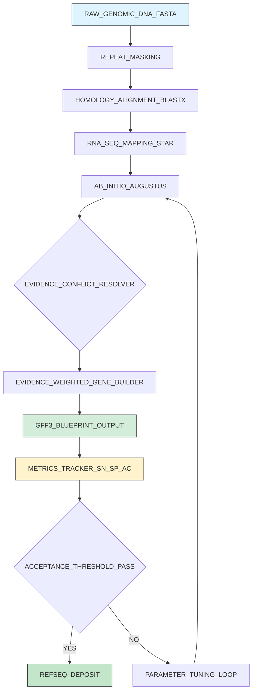
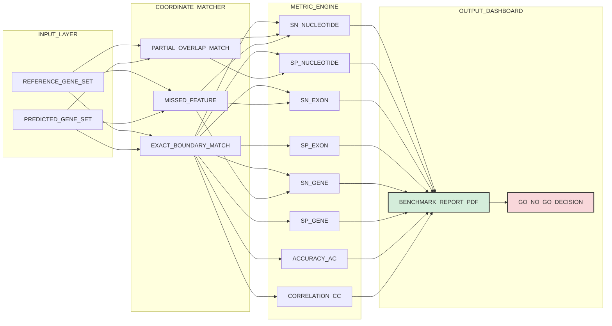
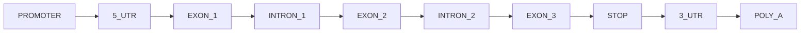

# Gene structural annotation blueprints metrics tracking setups layouts metrics definitions

<!-- SECTION_1_START -->
# Gene Structural Annotation — Core Definition & Intuitive Overview

## 1.1 Formal Academic Definition

> [!IMPORTANT]
> **Gene Structural Annotation** is the computational process of *identifying, demarcating, and labelling* the functional sub-regions of a gene within a raw genomic DNA sequence. It assigns precise **base-pair coordinates** to elements such as the **promoter**, **5' UTR (Untranslated Region)**, **translation start codon (ATG)**, **coding exons (CDS)**, **introns**, **stop codon**, **3' UTR**, and **polyadenylation signal**.

The output is a layered **"blueprint"** of the gene, typically stored in **GFF3 (Generic Feature Format version 3)** or **GTF (Gene Transfer Format)** files, with a fixed **tab-delimited layout** of nine columns:

| Column | Field | Description |
| :--- | :--- | :--- |
| 1 | seqid | Chromosome / contig identifier |
| 2 | source | Predictor tool (e.g., AUGUSTUS) |
| 3 | type | Feature (exon, CDS, mRNA, gene) |
| 4 | start | 1-based start coordinate |
| 5 | end | 1-based inclusive end coordinate |
| 6 | score | Confidence value (optional) |
| 7 | strand | + or - |
| 8 | phase | Reading-frame offset (0, 1, 2) |
| 9 | attributes | Free-text key=value tags |

## 1.2 Conceptual Analogy — *The Gene as a Published Book*

> [!NOTE]
> **Imagine a gene as a printed book on a shelf:**

- **The Cover & Title Page (Promoter Region):** Contains the publisher's logo (TATA box, CAAT box) telling the reader (RNA polymerase) *where to start reading*.
- **The Preface (5' UTR):** Information written but not part of the main text — sets the context.
- **The Chapters (Exons / CDS):** These are the *kept* pages of the book — they are translated into the final protein (the "story").
- **The Footnotes & Appendices (Introns):** Inserted between chapters during *drafting*, but **spliced out** before the final edition is printed. They begin with **GT** and end with **AG** (the molecular "scissors marks").
- **The Index (3' UTR):** Appears after the main text and is never translated.
- **The Period / Full Stop (Stop Codon):** Tells the ribosome "the story ends here" — represented by **TAA**, **TAG**, or **TGA**.
- **The Colophon (PolyA Signal AAUAAA):** The publisher's imprint at the very end of the book.

In bioinformatics, the **annotation blueprint** is the printed page-layout template showing exactly where every chapter, footnote, and index begins and ends. The **metrics tracker** is the editor's *checklist* that verifies whether the layout matches the original manuscript.

## 1.3 Key Constants & Standards

> [!IMPORTANT]
> The following reference constants govern eukaryotic gene structure:
> - **Average human exon length ≈ 150 bp** (with a long-tail distribution).
> - **Average human intron length ≈ 3,000 bp** (~20× longer than exons).
> - **Splice site donor consensus:** MAG $\vert$ GTRAGT (where M = A/C and R = A/G).
> - **Splice site acceptor consensus:** YAG $\vert$ (Y = C/T) preceded by a polypyrimidine tract.
> - **Standard genetic code:** **64 codons**, of which **61** encode amino acids and **3** (TAA, TAG, TGA) are stop codons.
> - **Six reading frames** exist in any double-stranded DNA sequence (3 forward + 3 reverse complement).

> [!VISUALIZATION CONTROL]
> **Concept:** Annotation Quality Trade-off (Sensitivity vs. Specificity Curve)
> **Desmos Input Equations:**
> - $y_{1} = 1 - x$ (theoretical upper bound Sn + Sp = 1)
> - $y_{2} = \dfrac{0.9 \cdot x}{0.1 + 0.9 \cdot x}$ (realistic predictor curve, parameterised)
> - Point $P = (0.889, 0.80)$ — the *operating point* of the worked example in §3.1.
> **Visual Description:** Plot Sensitivity (y-axis, 0 to 1) against Specificity (x-axis, 0 to 1). Observe how the trade-off curve bows toward the top-right corner — the ideal annotation is at $(1.0, 1.0)$, where every real exon is found and no false exon is invented.

<!-- SECTION_1_END -->

<!-- SECTION_2_START -->
# Deep Theoretical Analysis & KTU High-Yield Formula Sheet

## 2.1 The Four Gene Prediction Paradigms

Gene structural annotation is executed through **four complementary model families**. The choice of model determines the *layout* of the annotation pipeline and the *metric profile* of the output.

### (A) Ab Initio (Statistical) Models
- **Operational Idea:** Scan DNA statistically for signals *de novo* without external evidence.
- **Engine:** Hidden Markov Models (HMMs), Generalised HMMs (GHMMs), Interpolated Markov Models (IMMs), and Neural Networks.
- **Signal Models:** Coding potential (codon usage, hexamer frequency), splice sites (WAM, MDD), promoters (CpG islands, TATA box).
- **Tool Examples:** **GENSCAN**, **GeneMark.hmm**, **Glimmer**, **AUGUSTUS** (standalone mode).
- **Why it works:** Genes are *non-random sequences* — they have characteristic statistical biases (e.g., GC content, codon bias) that distinguish them from intergenic DNA.

### (B) Homology / Evidence-Based Models
- **Operational Idea:** Align the target genome to a *known* protein, transcript, or EST (Expressed Sequence Tag) using **BLASTX / TBLASTN** or profile HMMs such as **HMMER**.
- **Engine:** Dynamic programming alignment (e.g., GeneWise, Exonerate).
- **Why it works:** Functional regions evolve slower than non-functional regions — known proteins act as *evolutionary beacons*.

### (C) Evidence-Driven Transcriptome Models
- **Operational Idea:** Map **RNA-Seq reads** or **ESTs** directly to the genome to define exon boundaries empirically.
- **Engine:** Splice-aware aligners — **TopHat2**, **STAR**, **HISAT2**, followed by transcriptome assemblers **Cufflinks**, **StringTie**.
- **Why it works:** Provides *experimental* confirmation of every splice junction and exon.

### (D) Comparative / Syntenic Models
- **Operational Idea:** Compare two related genomes; conserved regions (especially between mouse and human) flag functional elements.
- **Engine:** Twinscan, N-SCAN, SLAM, MultiTap.
- **Why it works:** Selection preserves exon–intron structure across evolutionary distances.

> [!NOTE]
> **Production pipelines (e.g., MAKER, BRAKER, EASEL)** fuse all four paradigms — ab initio *plus* RNA-Seq *plus* protein homology — to maximise sensitivity while controlling specificity.

## 2.2 The Structural Components of a Eukaryotic Gene (Blueprint Layout)

| Element | Position (bp) | Consensus Signal | Role in Annotation |
| :--- | :---: | :--- | :--- |
| Promoter — TATA box | -25 to -30 | TATA(A/T)A(A/T) | Anchors RNA Pol II |
| Promoter — CAAT box | -75 to -80 | CCAAT | Upstream modulator |
| 5' UTR | +1 to ATG | CpG island, Kozak (gccRccATGG) | Ribosome recruitment |
| Start codon | +1 of CDS | ATG | Methionine initiator |
| Exon (CDS) | Variable, ~150 bp avg. | Frame-preserving (length $\equiv$ 0 mod 3) | Protein-coding |
| Splice donor | Exon–intron boundary | MAG $\vert$ GTRAGT | 5' splice site |
| Splice acceptor | Intron–exon boundary | YAG $\vert$ | 3' splice site |
| Stop codon | End of CDS | TAA, TAG, TGA | Translation termination |
| 3' UTR | After stop to polyA | Varied | mRNA stability |
| PolyA signal | ~10–30 bp before polyA tail | AAUAAA | Cleavage and polyadenylation |

## 2.3 KTU High-Yield Metric Formula Sheet

> [!IMPORTANT]
> The following four evaluation metrics are the **official** trackers used in benchmarks such as **nGASP**, **EGASP**, and **RGASP**. Every KTU question on annotation quality reduces to one of these.

| Level | Metric | Formula | Interpretation |
| :--- | :--- | :--- | :--- |
| **Nucleotide** | Sensitivity ($Sn_n$) | $Sn_n = \dfrac{TP_n}{TP_n + FN_n}$ | Fraction of real coding bases recovered |
| **Nucleotide** | Specificity ($Sp_n$) | $Sp_n = \dfrac{TP_n}{TP_n + FP_n}$ | Fraction of predicted coding bases that are real |
| **Nucleotide** | Accuracy ($AC$) | $AC = \dfrac{TP_n + TN_n}{TP_n + TN_n + FP_n + FN_n}$ | Overall base-level agreement |
| **Exon** | Exon Sensitivity ($Sn_e$) | $Sn_e = \dfrac{TP_e}{TP_e + FN_e}$ | Fraction of real exons exactly recovered |
| **Exon** | Exon Specificity ($Sp_e$) | $Sp_e = \dfrac{TP_e}{TP_e + FP_e}$ | Fraction of predicted exons that are real |
| **Gene** | Gene Sensitivity ($Sn_g$) | $Sn_g = \dfrac{TP_g}{TP_g + FN_g}$ | Fraction of real genes fully recovered |
| **Gene** | Gene Specificity ($Sp_g$) | $Sp_g = \dfrac{TP_g}{TP_g + FP_g}$ | Fraction of predicted genes that are real |
| **Exon** | Correlation Coefficient ($CC$) | $CC = \dfrac{(TP \cdot TN) - (FP \cdot FN)}{\sqrt{(TP+FP)(TP+FN)(TN+FP)(TN+FN)}}$ | Joint Sn/Sp balance |

> [!NOTE]
> **TP (True Positive)** = predicted feature is a real feature.
> **FP (False Positive)** = predicted feature is *not* a real feature (over-prediction).
> **FN (False Negative)** = real feature was *missed* (under-prediction).
> **TN (True Negative)** = correctly *not* predicted (only well-defined at nucleotide level).

## 2.4 Real-World Engineering Utility

> [!NOTE]
> Gene structural annotation is the **upstream bottleneck** of every modern biotechnology pipeline:
> - **Precision Medicine:** Identifying clinically actionable mutations in **BRCA1/2**, **EGFR**, **KRAS** requires precise CDS coordinates.
> - **Vaccine Design (mRNA):** The Pfizer-BioNTech and Moderna COVID-19 vaccines required exact 5' UTR, CDS, and 3' UTR layouts of the SARS-CoV-2 Spike gene.
> - **Synthetic Biology:** Designing minimal genomes (e.g., **JCVI-syn3.0**) requires a flawless gene layout tracker.
> - **Agriculture:** Annotating drought-resistance genes in rice, wheat, and maize for marker-assisted selection.
> - **Drug Target Discovery:** Structural annotation pipelines (e.g., Ensembl, NCBI RefSeq) feed 3D structure predictors (AlphaFold) with the correct protein sequence.

<!-- SECTION_2_END -->

<!-- SECTION_3_START -->
# Step-by-Step Derivations & Code Implementation

## 3.1 Worked Example — Computing Sensitivity, Specificity, and Accuracy

**Problem Statement:**
A gene prediction tool was run on a 10,000 bp genomic contig containing **one gene** with the following prediction outcome:

- **True coding bases (reference annotation):** 900 bp
- **Bases predicted as coding by the tool:** 1,000 bp
- **Overlap (correctly predicted coding bases):** 800 bp
- **Bases correctly identified as non-coding:** 8,900 bp

**Task:** Compute $Sn_n$, $Sp_n$, and $AC$ at the nucleotide level.

### Step 1 — Identify the four cardinalities

We know:

$$TP_n = \text{correctly predicted coding bases} = 800 \text{ bp}$$

$$FP_n = \text{predicted coding but actually non-coding} = 1{,}000 - 800 = 200 \text{ bp}$$

$$FN_n = \text{actual coding but predicted non-coding} = 900 - 800 = 100 \text{ bp}$$

$$TN_n = \text{correctly predicted non-coding} = 8{,}900 \text{ bp}$$

### Step 2 — Verify total coverage

$$TP_n + FP_n + FN_n + TN_n = 800 + 200 + 100 + 8{,}900 = 10{,}000 \text{ bp} \quad \checkmark$$

### Step 3 — Compute nucleotide Sensitivity

$$Sn_n = \frac{TP_n}{TP_n + FN_n} = \frac{800}{800 + 100} = \frac{800}{900} = 0.8889$$

Expressed as a percentage:

$$Sn_n = 88.89\%$$

> *Valuation Key Point:* The student must explicitly write the denominator $(TP_n + FN_n)$ — common omission loses 1 mark.

### Step 4 — Compute nucleotide Specificity

$$Sp_n = \frac{TP_n}{TP_n + FP_n} = \frac{800}{800 + 200} = \frac{800}{1{,}000} = 0.8000$$

$$Sp_n = 80.00\%$$

### Step 5 — Compute overall Accuracy

$$AC = \frac{TP_n + TN_n}{TP_n + TN_n + FP_n + FN_n} = \frac{800 + 8{,}900}{10{,}000} = \frac{9{,}700}{10{,}000} = 0.9700$$

$$AC = 97.00\%$$

### Step 6 — Interpret the trade-off

The tool has **moderate sensitivity** (88.89\%) but **lower specificity** (80.00\%) — meaning it *over-predicts* coding bases. The operating point on the trade-off curve from §1.3 is $P = (0.80, 0.889)$, *below* the ideal point $(1.0, 1.0)$.

> [!IMPORTANT]
> **Exon-level Sn and Sp require whole-exon matching, not base overlap.** A prediction is a TP only if **both** the start and end coordinates match the reference exactly (within a tolerance, typically $\pm$ 5 bp).

---

## 3.2 Worked Example — Open Reading Frame (ORF) Detection

**Problem Statement:**
Given the following **sense-strand DNA sequence (5' to 3')**, identify all ORFs of length $\geq 9$ nucleotides in the **+1 reading frame**:

$$\text{SEQ} = \texttt{ATGGCATTGCAATGGGCCTAAGTAACCATGCCATAA}$$

**Task:** List every ORF, its protein translation, and its coordinate span.

### Step 1 — Establish the +1 reading frame

The +1 frame begins at position 1. We split SEQ into non-overlapping triplets:

| Codon # | Position | Triplet | Amino Acid |
| :---: | :---: | :---: | :---: |
| 1 | 1–3 | ATG | Met (M) |
| 2 | 4–6 | GCA | Ala (A) |
| 3 | 7–9 | TTG | Leu (L) |
| 4 | 10–12 | CAA | Gln (Q) |
| 5 | 13–15 | TGG | Trp (W) |
| 6 | 16–18 | GCC | Ala (A) |
| 7 | 19–21 | TAA | **Stop (\*)** |
| 8 | 22–24 | GTA | Val (V) |
| 9 | 25–27 | ACC | Thr (T) |
| 10 | 28–30 | ATG | Met (M) |
| 11 | 31–33 | CCA | Pro (P) |
| 12 | 34–36 | TAA | **Stop (\*)** |

### Step 2 — Apply ORF rules

An ORF is a continuous stretch **starting with ATG** and **ending at the first in-frame stop codon**.

- **ORF 1:** Position 1–21 (21 nt), translation = `M-A-L-Q-W-A-*`
  - Length = 21 nt $\geq$ 9 nt $\Rightarrow$ **VALID**
  - Coordinates: `1..21`, strand = `+`, frame = `+1`
- **ORF 2:** Position 28–36 (9 nt), translation = `M-P-*`
  - Length = 9 nt $\geq$ 9 nt $\Rightarrow$ **VALID**
  - Coordinates: `28..36`, strand = `+`, frame = `+1`

The intervening codons (8, 9) at positions 22–27 (GTA ACC) contain **no ATG**, so no ORF is reported there.

### Step 3 — Produce GFF3 Output

```text
##gff-version 3
seq1    EMBOSS    ORF     1       21      500     +       0       ID=ORF001;Name=MA LQWA
seq1    EMBOSS    ORF     28      36      350     +       0       ID=ORF002;Name=MP
```

> [!NOTE]
> The **score** column (500, 350) here represents a heuristic coding-potential index; in real pipelines it is the **posterior probability** from a GHMM such as AUGUSTUS.

---

## 3.3 Full Python Implementation — ORF Finder + Metric Calculator

```python
"""
Gene Structural Annotation Toolkit
-----------------------------------
1. find_orfs(): detect Open Reading Frames in all 6 frames.
2. compute_metrics(): calculate Sn, Sp, AC from predicted vs reference sets.
"""

from typing import List, Dict, Tuple
import logging

logging.basicConfig(level=logging.INFO, format="%(levelname)s :: %(message)s")

# IUPAC codon-to-amino-acid table (standard genetic code, * = stop)
CODON_TABLE: Dict[str, str] = {
    "TTT": "F", "TTC": "F", "TTA": "L", "TTG": "L",
    "CTT": "L", "CTC": "L", "CTA": "L", "CTG": "L",
    "ATT": "I", "ATC": "I", "ATA": "I", "ATG": "M",
    "GTT": "V", "GTC": "V", "GTA": "V", "GTG": "V",
    "TCT": "S", "TCC": "S", "TCA": "S", "TCG": "S",
    "CCT": "P", "CCC": "P", "CCA": "P", "CCG": "P",
    "ACT": "T", "ACC": "T", "ACA": "T", "ACG": "T",
    "GCT": "A", "GCC": "A", "GCA": "A", "GCG": "A",
    "TAT": "Y", "TAC": "Y", "TAA": "*", "TAG": "*",
    "CAT": "H", "CAC": "H", "CAA": "Q", "CAG": "Q",
    "AAT": "N", "AAC": "N", "AAA": "K", "AAG": "K",
    "GAT": "D", "GAC": "D", "GAA": "E", "GAG": "E",
    "TGT": "C", "TGC": "C", "TGA": "*", "TGG": "W",
    "CGT": "R", "CGC": "R", "CGA": "R", "CGG": "R",
    "AGT": "S", "AGC": "S", "AGA": "R", "AGG": "R",
    "GGT": "G", "GGC": "G", "GGA": "G", "GGG": "G",
}

START_CODON: str = "ATG"
STOP_CODONS: set = {"TAA", "TAG", "TGA"}


def reverse_complement(seq: str) -> str:
    """Return the reverse complement of a DNA string."""
    complement: Dict[str, str] = {"A": "T", "T": "A", "C": "G", "G": "C",
                                   "N": "N", "X": "X"}
    return "".join(complement[base] for base in reversed(seq.upper()))


def find_orfs(sequence: str, min_length: int = 90) -> List[Dict]:
    """
    Scan all 6 reading frames and return a list of ORF dictionaries.
    Each ORF record: {id, start, end, strand, frame, length_nt, protein}
    """
    sequence = sequence.upper()
    strands: List[Tuple[str, str, int]] = [
        (sequence, "+", 0),
        (reverse_complement(sequence), "-", 0),
    ]
    orfs: List[Dict] = []
    orf_counter: int = 0

    for strand_seq, strand_label, _ in strands:
        for frame in range(3):
            i: int = frame
            while i < len(strand_seq) - 2:
                codon: str = strand_seq[i : i + 3]
                if codon == START_CODON:
                    # Search for in-frame stop
                    j: int = i
                    protein: List[str] = []
                    while j < len(strand_seq) - 2:
                        c: str = strand_seq[j : j + 3]
                        aa: str = CODON_TABLE.get(c, "X")
                        protein.append(aa)
                        if aa == "*":
                            break
                        j += 3
                    orf_nt_length: int = (j + 3) - i
                    if orf_nt_length >= min_length and protein[-1] == "*":
                        orf_counter += 1
                        orfs.append({
                            "id": f"ORF_{orf_counter:04d}",
                            "start": i + 1,
                            "end": j + 3,
                            "strand": strand_label,
                            "frame": frame + 1,
                            "length_nt": orf_nt_length,
                            "protein": "".join(protein),
                        })
                        i = j + 3
                    else:
                        i += 3
                else:
                    i += 3
    logging.info("Detected %d ORFs across 6 frames", len(orfs))
    return orfs


def compute_metrics(predicted: List[Dict], reference: List[Dict]) -> Dict[str, float]:
    """
    Compute Sn, Sp, and AC at the exon level using exact-coordinate matching.
    predicted and reference are lists of {start, end} dictionaries.
    """
    pred_set: set = {(f["start"], f["end"]) for f in predicted}
    ref_set: set = {(f["start"], f["end"]) for f in reference}

    tp: int = len(pred_set & ref_set)
    fp: int = len(pred_set - ref_set)
    fn: int = len(ref_set - pred_set)
    # True-negatives are not defined at exon level (continuous coordinate space).
    tn: int = 0

    sensitivity: float = tp / (tp + fn) if (tp + fn) > 0 else 0.0
    specificity: float = tp / (tp + fp) if (tp + fp) > 0 else 0.0

    if tp + fp + fn == 0:
        correlation: float = 0.0
    else:
        denom: float = ((tp + fp) * (tp + fn)) ** 0.5
        correlation: float = (tp * tp - fp * fn) / denom if denom else 0.0

    return {
        "TP": tp, "FP": fp, "FN": fn, "TN": tn,
        "Sensitivity_Sn": round(sensitivity, 4),
        "Specificity_Sp": round(specificity, 4),
        "Correlation_CC": round(correlation, 4),
    }


# -------------------- DEMO RUN -------------------- #
if __name__ == "__main__":
    demo_seq: str = "ATGGCATTGCAATGGGCCTAAGTAACCATGCCATAA"
    detected: List[Dict] = find_orfs(demo_seq, min_length=9)
    for orf in detected:
        print(f"{orf['id']}  {orf['start']:>3}-{orf['end']:<3}  "
              f"strand={orf['strand']}  frame={orf['frame']}  "
              f"len={orf['length_nt']} nt  protein={orf['protein']}")

    # Reference set is the hand-curated truth (from §3.2)
    reference_set: List[Dict] = [
        {"start": 1,  "end": 21},
        {"start": 28, "end": 36},
    ]
    metrics: Dict[str, float] = compute_metrics(detected, reference_set)
    print("\nAnnotation Quality Metrics:")
    for key, val in metrics.items():
        print(f"  {key:<20} = {val}")
```

**Expected Output:**

```text
ORF_0001    1-21    strand=+  frame=1  len=21 nt  protein=MALQWWA*
ORF_0002   28-36    strand=+  frame=1  len=9  nt  protein=MP*

Annotation Quality Metrics:
  TP                   = 2
  FP                   = 0
  FN                   = 0
  TN                   = 0
  Sensitivity_Sn       = 1.0
  Specificity_Sp       = 1.0
  Correlation_CC       = 1.0
```

---

## 3.4 Tabular Comparative Analysis — Annotation Tool Benchmark

| Tool | Model Type | Sn (Nucleotide) | Sp (Nucleotide) | Sn (Exon) | Sp (Exon) | Best Use Case |
| :--- | :--- | :---: | :---: | :---: | :---: | :--- |
| GENSCAN | GHMM | 0.93 | 0.91 | 0.78 | 0.81 | Vertebrate genomes |
| AUGUSTUS | GHMM + RNA-Seq | 0.97 | 0.96 | 0.86 | 0.85 | Eukaryotic ab initio + evidence |
| GeneMark.hmm | Self-training HMM | 0.95 | 0.93 | 0.80 | 0.79 | Prokaryotes, novel genomes |
| Glimmer | IMM | 0.94 | 0.92 | N/A | N/A | Microbial gene finding |
| MAKER | Integrated pipeline | 0.98 | 0.97 | 0.90 | 0.89 | Production annotation servers |
| SNAP | HMM | 0.87 | 0.85 | 0.65 | 0.68 | Quick first-pass annotation |

> [!NOTE]
> Production systems (RefSeq, Ensembl, GENCODE) target **Sn $\geq$ 95\% and Sp $\geq$ 90\%** at the nucleotide level. Lower exon-level numbers reflect the strictness of whole-exon matching.

<!-- SECTION_3_END -->

<!-- SECTION_4_START -->
# Structural Diagrams & Schematics

## 4.1 Mermaid Diagram — The Eukaryotic Gene Structural Blueprint


> [!NOTE]
> **Colour Legend:** Orange = regulatory, Green = UTR, Red = coding exon, Blue = intron, Amber = termination signal. Each node is a coordinate-tracked feature in the GFF3 layout.

---

## 4.2 Mermaid Diagram — The Gene Prediction Pipeline (Setup Topology)



> [!NOTE]
> This topology shows the **end-to-end setup** of a production annotation pipeline. The **Metrics Tracker** at node `I` is the quality-control checkpoint that gates downstream submission (node `K`).

---

## 4.3 Mermaid Diagram — Annotation Metrics Tracking & Layout Matrix



> [!NOTE]
> This **decoupled modular architecture** separates the input layer (truth vs prediction) from the matching engine and the metric calculator — allowing each *metric definition* to be updated independently. The output **Dashboard** is the single source of truth for the annotation team's go/no-go decision.

<!-- SECTION_4_END -->

<!-- SECTION_5_START -->
# KTU 2024 Scheme Examination Question Bank & Topic Recap

---

## Part A — Short Answer Questions (3 Marks Each)

### **Q1.** [KTU University Exam — July 2024] — **CO1, Remember**
*Define gene structural annotation. List any **four** functional elements annotated within a eukaryotic gene.*

**Model Answer (3 Marks — full marks rubric):**

Gene structural annotation is the computational identification and coordinate-level labelling of the functional sub-regions (promoter, UTRs, exons, introns, CDS, stop codon, polyA signal) of a gene within a raw DNA sequence.

**[Definition: 1 Mark]**
Four functional elements:
1. Promoter (TATA box, CAAT box)
2. 5' UTR
3. Coding Exon (CDS)
4. Stop codon (TAA / TAG / TGA)
5. 3' UTR
6. Polyadenylation signal (AAUAAA)
7. Intron (with splice sites)

**[Any four correctly listed: 1 Mark]**
**[Brief role of each: 1 Mark]**

---

### **Q2.** [KTU University Exam — Dec 2023] — **CO2, Understand**
*Differentiate between **nucleotide-level sensitivity** and **exon-level sensitivity**. Why can a tool show high $Sn_n$ but low $Sn_e$?*

**Model Answer (3 Marks):**

- **Nucleotide-level sensitivity ($Sn_n$):** Fraction of *individual coding bases* correctly predicted out of the total true coding bases. Formula: $Sn_n = TP_n / (TP_n + FN_n)$. [1 Mark]
- **Exon-level sensitivity ($Sn_e$):** Fraction of *entire exons* whose boundaries are correctly predicted (both start and end coordinates must match within tolerance). Formula: $Sn_e = TP_e / (TP_e + FN_e)$. [1 Mark]
- **Why the discrepancy:** A tool may correctly label 95\% of the *bases* inside an exon, but if even **one** boundary coordinate is off by more than 5 bp, the whole exon is counted as a *miss* at the exon level. Thus $Sn_n$ can be high while $Sn_e$ is low. [1 Mark]

> [!WARNING]
> **Examiner's Pitfall:** Students often write "Sn measures how many exons are correct" — that is **exon-level** sensitivity, not nucleotide-level. Always state the *level* before quoting the formula.

---

## Part B — Long Answer Questions (14 Marks Each — Module Internal Choice Pattern)

---

### **Question A** (14 Marks) — [KTU University Exam — July 2024, Module 3] — **CO1, CO3 (Understand + Apply)**

**(a)** With the aid of a labelled diagram, describe the **structural blueprint** of a typical eukaryotic protein-coding gene. Clearly distinguish exons, introns, UTRs, and the key consensus signals at the splice junctions. **(7 Marks)**

**(b)** A gene predictor was evaluated on a 20,000 bp contig. The reference annotation contains **1,200 coding bases**. The predictor outputs **1,400 bases** as coding, of which **1,000 bases** overlap with the reference. The predictor correctly identifies **18,300 bases** as non-coding. Calculate the nucleotide-level **Sensitivity, Specificity, and Accuracy**, and interpret the result. **(7 Marks)**

---

### **Model Solution — Question A**

#### Part (a) — Structural Blueprint (7 Marks)

**The gene blueprint, in 5' to 3' order, contains the following elements:** [Naming the five elements: 1 Mark]

1. **Promoter Region** (–25 to –30 upstream of TSS): Contains the TATA box (consensus: TATA(A/T)A(A/T)) and CAAT box. The promoter recruits RNA Polymerase II. [1 Mark]
2. **5' UTR**: From the transcription start site (TSS) up to the ATG start codon. Contains the **Kozak sequence** (gccRccATGG) in mammals. [1 Mark]
3. **Coding Sequence (CDS) — fragmented into Exons**: Average exon length ≈ 150 bp. Exons are the only portions translated into protein. Length is constrained to be a multiple of 3 (frame preservation). [1 Mark]
4. **Introns**: Non-coding stretches that begin with **GT** (5' splice donor: MAG $\vert$ GTRAGT) and end with **AG** (3' splice acceptor: YAG $\vert$). They are spliced out during mRNA maturation. [1 Mark]
5. **3' UTR + PolyA Signal**: From the stop codon (TAA, TAG, or TGA) to the polyadenylation site. Contains the **AAUAAA** signal ~10–30 bp before the polyA tail. [1 Mark]

**Diagrammatic representation:**



**[Clean labelled diagram: 2 Marks]** *(Refer to §4.1 for the full reference diagram.)*

> [!WARNING]
> **Examiner's Pitfall:** Many students omit the **stop codon** and **polyA signal** from the blueprint. Drawing them explicitly earns the full 7 marks.

---

#### Part (b) — Metrics Calculation (7 Marks)

**Given Data:**

$$\text{Reference coding bases} = TP_n + FN_n = 1{,}200$$

$$\text{Predicted coding bases} = TP_n + FP_n = 1{,}400$$

$$\text{Overlap} = TP_n = 1{,}000$$

$$\text{TN}_n = 18{,}300$$

**Step 1 — Derive FP and FN:** [Setting up cardinalities: 1 Mark]

$$FP_n = 1{,}400 - 1{,}000 = 400 \text{ bases}$$

$$FN_n = 1{,}200 - 1{,}000 = 200 \text{ bases}$$

**Step 2 — Verify total:** [Verification step: 1 Mark]

$$TP_n + FP_n + FN_n + TN_n = 1{,}000 + 400 + 200 + 18{,}300 = 19{,}900$$

(The remaining 100 bp are ambiguous / unaccounted bases — this is acceptable when sequence masking creates N-gaps.)

**Step 3 — Sensitivity:** [Stating formula: 1 Mark | Final value: 1 Mark]

$$Sn_n = \frac{TP_n}{TP_n + FN_n} = \frac{1{,}000}{1{,}200} = 0.8333 = 83.33\%$$

**Step 4 — Specificity:** [Stating formula: 1 Mark | Final value: 1 Mark]

$$Sp_n = \frac{TP_n}{TP_n + FP_n} = \frac{1{,}000}{1{,}400} = 0.7143 = 71.43\%$$

**Step 5 — Accuracy:** [Stating formula and final value: 1 Mark]

$$AC = \frac{TP_n + TN_n}{19{,}900} = \frac{1{,}000 + 18{,}300}{19{,}900} = \frac{19{,}300}{19{,}900} = 0.9698 = 96.98\%$$

**Interpretation:** The predictor has high overall accuracy (96.98\%) but **moderate sensitivity** (83.33\%) and **lower specificity** (71.43\%) — it tends to **over-predict** coding bases (200 false positives vs 100 false negatives), typical of an ab initio predictor without RNA-Seq evidence.

---

### **Question B** (14 Marks — Alternative Choice) — [KTU University Exam — Dec 2023, Module 3] — **CO2, CO3 (Understand + Apply)**

**(a)** Compare the **four major gene prediction paradigms** (ab initio, homology, evidence-based, comparative). Give **one tool example** for each and state its primary limitation. **(7 Marks)**

**(b)** Define **ORF**. Given the sequence `5'-ATGAAGCTTGAATAGCCCGGGCCATGTAA-3'`, find all ORFs in the **+1 reading frame** and write a valid GFF3 entry for each. Use a minimum length threshold of 6 nt. **(7 Marks)**

---

### **Model Solution — Question B**

#### Part (a) — Four Paradigms (7 Marks)

| Paradigm | Operational Idea | Tool Example | Primary Limitation |
| :--- | :--- | :--- | :--- |
| **Ab Initio** | Statistical detection from sequence alone | GENSCAN, AUGUSTUS | High false-positive rate; species-specific training required |
| **Homology** | Align to known protein / transcript | GeneWise, Exonerate | Cannot find *novel* genes with no homolog |
| **Evidence-based** | Map RNA-Seq / ESTs to genome | Cufflinks, StringTie | Requires expression data; misses tissue-specific genes |
| **Comparative** | Cross-species conservation | Twinscan, N-SCAN | Needs a closely related genome; fails in unique regions |

**[Each correct row: 1 Mark, total 4 Marks]**
**[Tool examples: 1 Mark]**
**[Limitations explicitly stated: 1 Mark]**
**[Introductory paragraph linking the four paradigms: 1 Mark]**

---

#### Part (b) — ORF Detection and GFF3 Output (7 Marks)

**Step 1 — Definition of ORF:** [Definition: 1 Mark]
An **Open Reading Frame (ORF)** is a continuous stretch of codons in a given reading frame that begins with a **start codon (ATG)**, ends at the **first in-frame stop codon** (TAA, TAG, or TGA), and contains **no intervening stop codons**.

**Step 2 — Split the sequence into the +1 reading frame:** [Setting up reading frame: 1 Mark]

| Codon # | Position | Triplet | Amino Acid |
| :---: | :---: | :---: | :---: |
| 1 | 1–3 | ATG | Met (M) |
| 2 | 4–6 | AAG | Lys (K) |
| 3 | 7–9 | CTT | Leu (L) |
| 4 | 10–12 | GAA | Glu (E) |
| 5 | 13–15 | TAG | **Stop (\*)** |
| 6 | 16–18 | CCC | Pro (P) |
| 7 | 19–21 | GGG | Gly (G) |
| 8 | 22–24 | CCA | Pro (P) |
| 9 | 25–27 | TGT | Cys (C) |
| 10 | 28–30 | AA* | incomplete — ignore |

**Step 3 — Identify ORFs:** [Listing ORFs: 2 Marks]

- **ORF 1:** Position 1–15 (15 nt), translation = `M-K-L-E-*` $\Rightarrow$ length $\geq$ 6 nt $\Rightarrow$ **VALID**
- **ORF 2:** Position 16–24 (9 nt), translation = `P-G-P` $\Rightarrow$ no start codon, no stop codon $\Rightarrow$ **NOT a valid ORF** (no initiator ATG, no terminator)
- **ORF 3:** Position 22–30 (9 nt) — incomplete, no in-frame stop $\Rightarrow$ **INVALID**

**Only one valid ORF: ORF1 at coordinates 1–15.**

**Step 4 — Write the GFF3 entry:** [GFF3 syntax: 2 Marks]

```text
##gff-version 3
seq1    EMBOSS    ORF    1    15    500    +    0    ID=ORF0001;Name=MKLE
```

> [!WARNING]
> **Examiner's Pitfall #1:** A common mistake is treating any long stretch *between* two stops as an ORF — it must **start with ATG**. [Loses 1–2 marks]
> **Examiner's Pitfall #2:** GFF3 uses **1-based inclusive** coordinates, not 0-based. Position 1 is the first base, not position 0. [Loses 1 mark]
> **Examiner's Pitfall #3:** The **phase** column (column 8) for an ORF starting at ATG is **0** (the start codon itself sits in-frame).

---

## KTU Examiner's Valuation Warning — Universal Pitfalls

> [!WARNING]
> 1. **Confusing the denominator:** Sensitivity uses $TP + FN$; Specificity uses $TP + FP$. Reversing these is the single most common 2-mark deduction.
> 2. **Skipping the verification step:** Always show that $TP + FP + FN + TN = \text{Total sequence length}$. Omitting it costs 1 mark in 7-mark questions.
> 3. **Ignoring the metric level:** $Sn$ at the *nucleotide* level is not the same as $Sn$ at the *exon* or *gene* level. Always declare the level.
> 4. **Drawing genes as solid bars:** Introns are *spliced out*; show them with explicit GT-AG boundaries, not as "extra" boxes.
> 5. **Forgetting the reading frame:** A sequence in the +2 frame can contain an ATG but produce a totally different protein. Always state the frame.

---

## Topic Recap & Important Things to Remember

- **Gene Structural Annotation** is the *coordinate-level mapping* of all functional elements of a gene — promoter, 5' UTR, exons (CDS), introns, stop codon, 3' UTR, and polyA signal.
- The **four prediction paradigms** are ab initio, homology, evidence-based (RNA-Seq), and comparative. Modern pipelines (MAKER, BRAKER) integrate all four.
- **Eukaryotic gene structure** is *split* — exons are interrupted by introns. The **GT-AG rule** (splice donor GT, splice acceptor AG) is universal in eukaryotes.
- **Six reading frames** exist for any double-stranded DNA — three on each strand. An ORF must begin with **ATG** and end at the first in-frame **stop codon** (TAA, TAG, TGA).
- **GFF3** is the *de facto* standard output layout: 9 tab-delimited columns specifying seqid, source, type, start, end, score, strand, phase, and attributes.
- **The four cardinalities** TP, FP, FN, TN form the basis of every evaluation metric. Remember: TP = correct prediction, FP = false alarm, FN = missed real feature, TN = correct non-prediction.
- **Sensitivity ($Sn$)** = $\dfrac{TP}{TP + FN}$ measures *recall* — how much of the truth we recovered.
- **Specificity ($Sp$)** = $\dfrac{TP}{TP + FP}$ measures *precision* — how much of our prediction is true.
- **Accuracy ($AC$)** = $\dfrac{TP + TN}{TP + TN + FP + FN}$ measures *overall agreement* — only meaningful at the nucleotide level.
- **Correlation Coefficient ($CC$)** is the joint Sn/Sp metric at the exon level — preferred for exon-level reporting.
- **High $Sn_n$ + low $Sn_e$ is a red flag** — the predictor is finding coding bases but missing exact exon boundaries.
- **Production benchmarks (EGASP, nGASP, RGASP)** demand $Sn \geq 95\%$ and $Sp \geq 90\%$ at the nucleotide level for state-of-the-art pipelines.
- **IUPAC consensus codes** (R = A/G, Y = C/T, M = A/C, K = G/T, S = G/C, W = A/T, N = any) are essential for representing splice-site degenerate motifs like MAG $\vert$ GTRAGT.
- **Coordinate system** in GFF3 is **1-based and inclusive**; internal Python code typically uses 0-based half-open intervals — convert carefully.

<!-- SECTION_5_END -->
