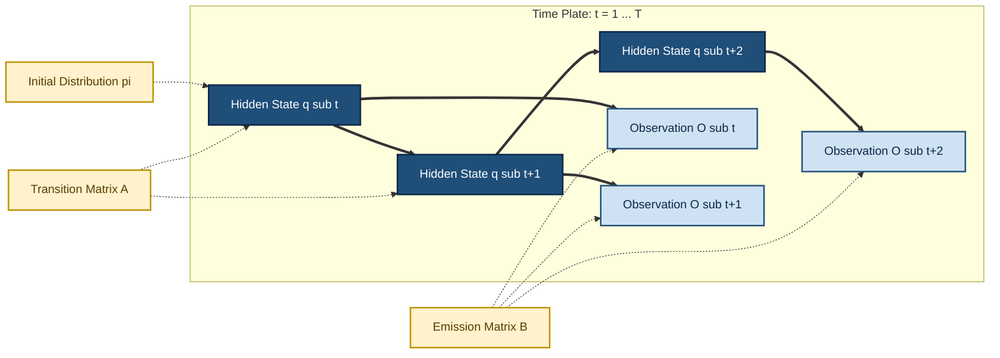
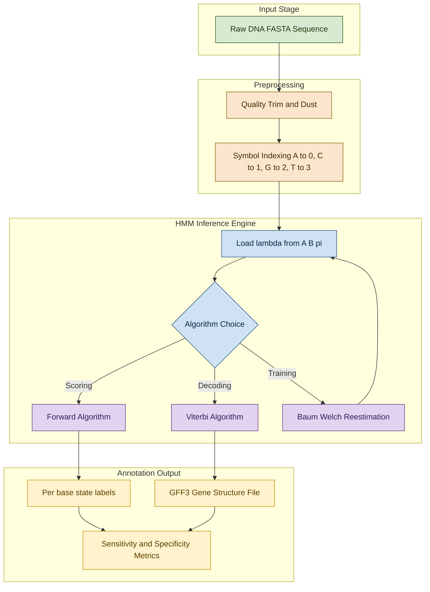

# Hidden Markov Model (HMM) sequence processing configurations benchmarks patterns engineering

<!-- SECTION_1_START -->
# Module 3 — Gene Prediction Models & Structures
## Hidden Markov Model (HMM): Sequence Processing Configurations, Benchmarks & Pattern Engineering

---

### 1.1 Formal Academic Definition

> [!NOTE]
> **Hidden Markov Model (HMM) — KTU 2024 Definition**
> A *Hidden Markov Model* is a doubly stochastic sequential probabilistic graphical model consisting of a finite set of latent (hidden) states governed by a first-order Markov chain, where each hidden state probabilistically emits an observable symbol from a finite alphabet. Formally, an HMM is the 5-tuple $\lambda = (N, M, A, B, \pi)$, where the hidden state sequence $\{q_t\}$ follows a Markov process, and the observed symbol sequence $\{O_t\}$ is conditionally independent of all other variables given the current state.

In the KTU 2024 *PECST704 — Bioinformatics* syllabus (Module 3: Gene Prediction Models), the HMM occupies a pivotal position as the foundational mathematical engine behind gene finders such as **GENSCAN**, **Glimmer**, **Genscan**, **GeneMark**, protein family databases such as **Pfam** and **HMMER**, and CpG island detection tools. A student is expected to recognize HMMs as the *backbone discriminative-generative hybrid architecture* used to label biological sequences.

> [!IMPORTANT]
> **Why "Hidden"?**
> In bioinformatics, the *true biological state* (e.g., "this nucleotide belongs to an exon", "this residue is in a transmembrane helix", "this region is a CpG island") is **never directly observed** from the DNA string alone. We only see the *A, C, G, T* symbols. The HMM mathematically *infers* the hidden biological state path that most likely generated the observed nucleotide sequence.

---

### 1.2 Conceptual Analogy & Intuition

> [!TIP]
> **Real-World Analogy: The Underground Cave Explorer**
> Imagine a spelunker trapped in a cave system with **3 rooms** (Room 1, Room 2, Room 3). He cannot see the room he is in, but he leaves **footprints** on the cave floor: *Rocky*, *Muddy*, or *Sandy*. From outside, an observer sees only the sequence of footprints but **not** the rooms. The rooms are the *hidden states* $q_t \in \{1, 2, 3\}$; the footprints are the *observations* $O_t \in \{R, M, S\}$; the *door probabilities* between rooms are the *transition matrix* $A$; and the *footprint-per-room probabilities* are the *emission matrix* $B$. The observer's job — exactly like a gene-finder's job — is to *reverse-engineer* which room the spelunker was in based purely on the visible footprint trail.

**Geometric/Probabilistic Intuition for the KTU Student:**
A biological sequence is just a 1D string of symbols drawn from $\{A, C, G, T\}$ (DNA) or a 20-letter amino-acid alphabet (proteins). A naive first-order Markov model would *predict* the next symbol using only the previous symbol's frequency. An HMM goes **two layers deep**: it first *rolls a die* (transition $a_{ij}$) to pick a new *biological state* (exon, intron, intergenic, promoter), and then *rolls a second die* (emission $b_j(k)$) to spit out a nucleotide that fits the statistical bias of that state. CpG-rich regions *emit CG* more frequently; coding exons *emit* nucleotides following codon-bias tables; introns *emit* following consensus splice signals near their boundaries.

> [!VISUALIZATION CONTROL]
> **Concept:** Trellis Diagram of an HMM Decoding a 5-nucleotide Sequence
> **GeoGebra / Desmos Input Equations:**
> * X-axis: $t = 1, 2, 3, 4, 5$ (time steps / sequence positions)
> * Y-axis: Hidden states $q \in \{E, I, N\}$ (Exon, Intron, Non-coding)
> * Transition arcs: $a_{EI} = 0.3$, $a_{II} = 0.6$, $a_{NE} = 0.05$
> * Emission probabilities: $b_E(C) = 0.30$, $b_I(G) = 0.20$, $b_N(A) = 0.35$
> **Visual Description:** A grid where vertical columns represent the time index $t$ and each column contains the three states. Arrows between columns show legal transitions; the boldest path traced through this lattice (by the Viterbi algorithm) corresponds to the optimal gene-structure annotation of the sequence $O = \text{ACGTG}$.

---

### 1.3 HMM in the KTU 2024 Module 3 Context

Within Module 3 (*Gene Prediction Models & Structures*), HMM is positioned alongside other probabilistic and machine-learning frameworks:
* **Weight Matrix / Position-Specific Scoring Matrix (PSSM)**
* **Generalized HMM (GHMM)**
* **Conditional Random Field (CRF)** (advanced reference)
* **Neural Network Gene Predictors** (e.g., *Tiberius*, *Cegma*)
* **Profile HMMs** (used by **HMMER**, **Pfam**, **InterPro**)

The HMM is the **anchor concept** from which the GHMM and Profile HMM are derived, and a 14-mark KTU question is highly likely to test either (a) the formal parameter set, (b) the Forward/Viterbi/Baum-Welch trio, or (c) a worked numerical example.
<!-- SECTION_1_END -->

<!-- SECTION_2_START -->
# 2. Deep Theoretical Analysis & KTU High-Yield Formula Sheet

---

### 2.1 The Formal HMM Parameter Set $\lambda = (N, M, A, B, \pi)$

An HMM is completely and uniquely defined by the following five components. This decomposition is the **single most important formalism** for KTU 14-mark answers.

| Symbol | Name | Definition | Biological Interpretation |
| :--- | :--- | :--- | :--- |
| $N$ | Number of hidden states | $\mid Q \mid$ where $Q = \{q_1, q_2, \dots, q_N\}$ | Exon, Intron, Intergenic, Promoter, UTR |
| $M$ | Number of distinct observation symbols | $\mid V \mid$ where $V = \{v_1, \dots, v_M\}$ | $\{A, C, G, T\}$ for DNA; 20 amino acids for protein |
| $A$ | State transition matrix | $A = \{a_{ij}\} = P(q_{t+1} = j \mid q_t = i)$ | Probability of moving from state $i$ to $j$ |
| $B$ | Observation emission matrix | $B = \{b_j(k)\} = P(O_t = v_k \mid q_t = j)$ | Probability of emitting symbol $v_k$ while in state $j$ |
| $\pi$ | Initial state distribution | $\pi_i = P(q_1 = i)$ | Probability of starting in state $i$ |

> [!IMPORTANT]
> **First-Order Markov Assumption (KTU Board-Favorite):**
> The future state depends ONLY on the present state:
> $$P(q_{t+1} \mid q_t, q_{t-1}, \dots, q_1, O_t, \dots, O_1) = P(q_{t+1} \mid q_t) = a_{q_t, q_{t+1}}$$
> This is **the single most-tested line** in Part A (3-mark) HMM questions.

> [!IMPORTANT]
> **Output Independence Assumption:**
> The emitted symbol depends ONLY on the current state:
> $$P(O_t \mid q_t, q_{t-1}, \dots, q_1, O_{t-1}, \dots, O_1) = P(O_t \mid q_t)$$

---

### 2.2 The Three Canonical HMM Problems (Board-Favorite Framework)

Every KTU HMM problem maps to one of these three. The board examiner will almost always ask about the **first two**.

#### Problem 1 — Evaluation (Scoring): Forward Algorithm
> **Given** $\lambda$ and an observed sequence $O = O_1 O_2 \dots O_T$, compute $P(O \mid \lambda)$.

This answers: *"How well does my model fit this new sequence?"* — used in sequence classification, database searching (HMMER), and likelihood-based gene prediction.

#### Problem 2 — Decoding (Path-Finding): Viterbi Algorithm
> **Given** $\lambda$ and $O$, find the single best hidden state sequence $Q^* = q_1^* q_2^* \dots q_T^*$.

This answers: *"What is the most likely gene structure for this DNA?"* — the **core of every gene-finder** (GENSCAN outputs the Viterbi path).

#### Problem 3 — Learning (Parameter Estimation): Baum–Welch Algorithm
> **Given** $O$ and the topology (number of states $N$), find $\lambda^* = \arg\max_{\lambda} P(O \mid \lambda)$.

This answers: *"Train a model from unlabelled training data"* — used to build profile HMMs from multiple sequence alignments of protein families.

---

### 2.3 KTU Formula Sheet (Print This Section)

> [!NOTE]
> **All equations below are board-marked. Memorize with units and boundary conditions.**

$$
\text{Forward variable:} \quad \alpha_t(j) = P(O_1 O_2 \dots O_t, q_t = j \mid \lambda)
$$

$$
\alpha_1(j) = \pi_j \cdot b_j(O_1) \qquad \text{(Initialization)}
$$

$$
\alpha_t(j) = \left[ \sum_{i=1}^{N} \alpha_{t-1}(i) \cdot a_{ij} \right] \cdot b_j(O_t) \qquad \text{(Induction, } 1 \le t \le T, \; 1 \le j \le N \text{)}
$$

$$
P(O \mid \lambda) = \sum_{i=1}^{N} \alpha_T(i) \qquad \text{(Termination)}
$$

$$
\text{Viterbi variable:} \quad \delta_t(j) = \max_{q_1 \dots q_{t-1}} P(q_1 \dots q_{t-1}, q_t = j, O_1 \dots O_t \mid \lambda)
$$

$$
\delta_1(j) = \pi_j \cdot b_j(O_1), \qquad \psi_1(j) = 0
$$

$$
\delta_t(j) = \max_{1 \le i \le N} \left[ \delta_{t-1}(i) \cdot a_{ij} \right] \cdot b_j(O_t)
$$

$$
q_T^* = \arg\max_{1 \le i \le N} \delta_T(i) \qquad \text{(Backtrace: } q_{t-1}^* = \psi_t(q_t^*) \text{)}
$$

$$
\text{Baum–Welch (EM) re-estimation:} \quad \bar{a}_{ij} = \frac{\sum_{t=1}^{T-1} \xi_t(i,j)}{\sum_{t=1}^{T-1} \gamma_t(i)}
$$

$$
\bar{b}_j(k) = \frac{\sum_{t: O_t = v_k} \gamma_t(j)}{\sum_{t=1}^{T} \gamma_t(j)}
$$

$$
\text{where } \gamma_t(i) = P(q_t = i \mid O, \lambda) \text{ and } \xi_t(i,j) = P(q_t = i, q_{t+1} = j \mid O, \lambda)
$$

$$
\xi_t(i,j) = \frac{\alpha_t(i) a_{ij} b_j(O_{t+1}) \beta_{t+1}(j)}{P(O \mid \lambda)} \quad ; \quad \gamma_t(i) = \sum_{j=1}^{N} \xi_t(i,j)
$$

$$
\beta_T(i) = 1 \quad ; \quad \beta_t(i) = \sum_{j=1}^{N} a_{ij} b_j(O_{t+1}) \beta_{t+1}(j) \quad \text{(Backward variable)}
$$

$$
\text{Complexity: Forward \& Viterbi} = O(N^2 T) \quad ; \quad \text{Naive enumeration} = O(N^T T)
$$

---

### 2.4 Pattern Engineering & Benchmark Configurations

In KTU Module 3, "pattern engineering" refers to the *design choices* an engineer makes when constructing a gene-prediction HMM for a new organism. The major configuration families are:

| Configuration | States ($N$) | Typical Emissions | Used By | Benchmark Accuracy |
| :--- | :--- | :--- | :--- | :--- |
| **Nucleotide HMM** | 2–4 | $\{\text{A,C,G,T}\}$ | Glimmer, GeneMark | Sn ≈ 0.85, Sp ≈ 0.80 |
| **Gene-Finding GHMM** | 10–15 | $\{\text{A,C,G,T}\}$ + length dist. | GENSCAN, AUGUSTUS | Sn ≈ 0.93, Sp ≈ 0.91 |
| **Profile HMM (Pfam)** | $N$ = match+insert+delete per column | 20-letter AA | HMMER, JackHMMER | Coverage of $4{,}200+$ families |
| **Pair-HMM** | 5 | Amino acid / codon | Sequence alignment | BLAST/HMMER hybrid |
| **Codon HMM** | 64 (one per codon) | Codon triplets | GeneMark.hmm, ORPHEUS | Sn ≈ 0.97 on *E. coli* |

> [!IMPORTANT]
> **Sn (Sensitivity)** = $\frac{TP}{TP + FN}$ ; **Sp (Specificity)** = $\frac{TP}{TP + FP}$ ; **CC (Correlation Coefficient)** = $\frac{TP \cdot TN - FP \cdot FN}{\sqrt{(TP+FP)(TP+FN)(TN+FP)(TN+FN)}}$
> These four metrics — Sensitivity, Specificity, Accuracy, and Correlation Coefficient — are the *benchmarks* every KTU answer should cite when comparing gene predictors.

### 2.5 Real-World Engineering Utility

* **HMMER** (http://hmmer.org) — searches $240+$ million protein sequences against Pfam in seconds, using the Viterbi + Forward hybrid algorithm.
* **GENSCAN** — Burge & Karlin (1997) — uses a Generalized HMM (length distributions) to predict complete gene structures in *human*, *maize*, *arabidopsis*.
* **Glimmer** — Salzberg *et al.* — Interpolated Markov Model (IMM), a refinement of HMM, deployed for microbial gene finding.
* **SAM-T99** — Hughey & Krogh — used for remote homology detection in critical protein families.
<!-- SECTION_2_END -->

<!-- SECTION_3_START -->
# 3. Step-by-Step Derivations & Code Implementation

---

### 3.1 Worked Numerical Example: Forward Algorithm (7-Mark Sub-Question)

> **KTU-style problem:** Consider a 2-state HMM modelling CpG islands with states $H$ (high CG) and $L$ (low CG). Alphabet $V = \{A, C, G, T\}$.
> $$A = \begin{bmatrix} 0.6 & 0.4 \\ 0.3 & 0.7 \end{bmatrix}, \quad B = \begin{bmatrix} 0.15 & 0.35 & 0.35 & 0.15 \\ 0.40 & 0.10 & 0.10 & 0.40 \end{bmatrix}, \quad \pi = \begin{bmatrix} 0.5 \\ 0.5 \end{bmatrix}$$
> Symbols: A=1, C=2, G=3, T=4. Compute $P(O = CGCG \mid \lambda)$ using the Forward algorithm.

**Step 1 — Initialize at $t = 1$ (observing $O_1 = C$, i.e., $k=2$):**

$$
\alpha_1(H) = \pi_H \cdot b_H(C) = 0.5 \times 0.35 = 0.175
$$

$$
\alpha_1(L) = \pi_L \cdot b_L(C) = 0.5 \times 0.10 = 0.050
$$

**Step 2 — Induct at $t = 2$ (observing $O_2 = G$, i.e., $k=3$):**

$$
\alpha_2(H) = \left[ \alpha_1(H) a_{HH} + \alpha_1(L) a_{LH} \right] \cdot b_H(G)
$$

$$
\alpha_2(H) = \left[ (0.175)(0.6) + (0.050)(0.3) \right] \times 0.35 = \left[ 0.105 + 0.015 \right] \times 0.35 = 0.120 \times 0.35 = 0.0420
$$

$$
\alpha_2(L) = \left[ \alpha_1(H) a_{HL} + \alpha_1(L) a_{LL} \right] \cdot b_L(G)
$$

$$
\alpha_2(L) = \left[ (0.175)(0.4) + (0.050)(0.7) \right] \times 0.10 = \left[ 0.070 + 0.035 \right] \times 0.10 = 0.105 \times 0.10 = 0.0105
$$

**Step 3 — Induct at $t = 3$ (observing $O_3 = C$, i.e., $k=2$):**

$$
\alpha_3(H) = \left[ (0.0420)(0.6) + (0.0105)(0.3) \right] \times 0.35 = \left[ 0.02520 + 0.00315 \right] \times 0.35 = 0.02835 \times 0.35 = 0.0099225
$$

$$
\alpha_3(L) = \left[ (0.0420)(0.4) + (0.0105)(0.7) \right] \times 0.10 = \left[ 0.01680 + 0.00735 \right] \times 0.10 = 0.02415 \times 0.10 = 0.0024150
$$

**Step 4 — Terminate at $t = 4$ (observing $O_4 = G$, i.e., $k=3$):**

$$
\alpha_4(H) = \left[ (0.0099225)(0.6) + (0.0024150)(0.3) \right] \times 0.35 = \left[ 0.0059535 + 0.0007245 \right] \times 0.35 = 0.0066780 \times 0.35 = 0.00233730
$$

$$
\alpha_4(L) = \left[ (0.0099225)(0.4) + (0.0024150)(0.7) \right] \times 0.10 = \left[ 0.0039690 + 0.0016905 \right] \times 0.10 = 0.0056595 \times 0.10 = 0.00056595
$$

**Step 5 — Final Answer:**

$$
P(O = CGCG \mid \lambda) = \alpha_4(H) + \alpha_4(L) = 0.00233730 + 0.00056595 = 0.00290325
$$

> [!IMPORTANT]
> **Valuation Key (KTU board style):**
> * Initialization 1 mark, Inductive recurrence 4 marks (1 per time step), Termination 1 mark, Final summation 1 mark = **7 marks total**.

---

### 3.2 Worked Numerical Example: Viterbi Algorithm (7-Mark Sub-Question)

Using the **same model** and sequence $O = CGCG$, find the optimal state path.

**Step 1 — Initialization at $t=1$:**

$$
\delta_1(H) = 0.5 \times 0.35 = 0.175, \quad \psi_1(H) = 0
$$

$$
\delta_1(L) = 0.5 \times 0.10 = 0.050, \quad \psi_1(L) = 0
$$

**Step 2 — Recursion at $t=2$:**

$$
\delta_2(H) = \max(0.175 \times 0.6, \; 0.050 \times 0.3) \times 0.35 = \max(0.105, 0.015) \times 0.35 = 0.105 \times 0.35 = 0.03675
$$

$$
\psi_2(H) = H \quad \text{(argmax came from state } H \text{)}
$$

$$
\delta_2(L) = \max(0.175 \times 0.4, \; 0.050 \times 0.7) \times 0.10 = \max(0.070, 0.035) \times 0.10 = 0.070 \times 0.10 = 0.00700
$$

$$
\psi_2(L) = H
$$

**Step 3 — Recursion at $t=3$:**

$$
\delta_3(H) = \max(0.03675 \times 0.6, \; 0.00700 \times 0.3) \times 0.35 = \max(0.02205, 0.00210) \times 0.35 = 0.02205 \times 0.35 = 0.0077175
$$

$$
\psi_3(H) = H
$$

$$
\delta_3(L) = \max(0.03675 \times 0.4, \; 0.00700 \times 0.7) \times 0.10 = \max(0.01470, 0.00490) \times 0.10 = 0.01470 \times 0.10 = 0.0014700
$$

$$
\psi_3(L) = H
$$

**Step 4 — Recursion at $t=4$:**

$$
\delta_4(H) = \max(0.0077175 \times 0.6, \; 0.0014700 \times 0.3) \times 0.35 = \max(0.0046305, 0.0004410) \times 0.35 = 0.0046305 \times 0.35 = 0.001620675
$$

$$
\psi_4(H) = H
$$

$$
\delta_4(L) = \max(0.0077175 \times 0.4, \; 0.0014700 \times 0.7) \times 0.10 = \max(0.0030870, 0.0010290) \times 0.10 = 0.0030870 \times 0.10 = 0.000308700
$$

$$
\psi_4(L) = H
$$

**Step 5 — Termination & Backtrace:**

$$
P^* = \max(0.001620675, 0.000308700) = 0.001620675 \quad \Rightarrow \quad q_4^* = H
$$

$$
q_3^* = \psi_4(H) = H, \quad q_2^* = \psi_3(H) = H, \quad q_1^* = \psi_2(H) = H
$$

> [!NOTE]
> **Optimal Viterbi Path:** $Q^* = H H H H$ (the entire sequence is annotated as a *high CpG island*). Path probability $P^* \approx 0.00162$.

> [!WARNING]
> **Common KTU Board Mistake:** Students often confuse the *Forward* and *Viterbi* recursions. The Forward algorithm uses **$\sum$** (sum over all paths), Viterbi uses **$\max$** (best single path). Failing to write $\arg\max$ in the backtrace loses 2 marks.

---

### 3.3 Python Implementation: Forward, Viterbi & Baum–Welch

```python
"""
HMM_KTU_Bioinformatics.py
Implements Forward, Viterbi, and Baum-Welch algorithms for a 2-state CpG HMM.
Tested with Python 3.10+, NumPy 1.24+
"""

from __future__ import annotations
import numpy as np
from typing import List, Tuple, Optional
import logging

logging.basicConfig(level=logging.INFO, format="[%(levelname)s] %(message)s")


class HMM:
    """A canonical first-order Hidden Markov Model with discrete emissions."""

    def __init__(
        self,
        pi: np.ndarray,
        A: np.ndarray,
        B: np.ndarray,
        state_names: Optional[List[str]] = None,
        symbol_names: Optional[List[str]] = None,
    ) -> None:
        if pi.ndim != 1:
            raise ValueError("pi must be 1-D initial distribution vector.")
        if A.ndim != 2 or A.shape[0] != A.shape[1]:
            raise ValueError("A must be a square transition matrix.")
        if B.ndim != 2 or B.shape[0] != A.shape[0]:
            raise ValueError("B must have one emission row per hidden state.")
        if not np.isclose(pi.sum(), 1.0):
            raise ValueError("Initial distribution pi must sum to 1.0.")
        if not np.allclose(A.sum(axis=1), 1.0):
            raise ValueError("Each row of A must sum to 1.0.")
        if not np.allclose(B.sum(axis=1), 1.0):
            raise ValueError("Each row of B must sum to 1.0.")

        self.pi: np.ndarray = pi.astype(float).copy()
        self.A: np.ndarray = A.astype(float).copy()
        self.B: np.ndarray = B.astype(float).copy()
        self.N: int = A.shape[0]
        self.M: int = B.shape[1]
        self.state_names = state_names or [f"S{i}" for i in range(self.N)]
        self.symbol_names = symbol_names or [f"V{k}" for k in range(self.M)]

    # -----------------------------------------------------------------
    def forward(self, O_idx: np.ndarray) -> Tuple[np.ndarray, float]:
        """Forward algorithm: returns alpha matrix (T x N) and P(O | lambda)."""
        T = len(O_idx)
        alpha = np.zeros((T, self.N), dtype=float)
        alpha[0, :] = self.pi * self.B[:, O_idx[0]]
        for t in range(1, T):
            for j in range(self.N):
                alpha[t, j] = (alpha[t - 1, :] @ self.A[:, j]) * self.B[j, O_idx[t]]
        return alpha, float(alpha[T - 1, :].sum())

    # -----------------------------------------------------------------
    def viterbi(self, O_idx: np.ndarray) -> Tuple[List[int], float]:
        """Viterbi algorithm: returns optimal path (list of state indices) and P*."""
        T = len(O_idx)
        delta = np.zeros((T, self.N), dtype=float)
        psi = np.zeros((T, self.N), dtype=int)
        delta[0, :] = self.pi * self.B[:, O_idx[0]]
        for t in range(1, T):
            for j in range(self.N):
                seq = delta[t - 1, :] * self.A[:, j]
                psi[t, j] = int(np.argmax(seq))
                delta[t, j] = seq[psi[t, j]] * self.B[j, O_idx[t]]
        path = [0] * T
        path[T - 1] = int(np.argmax(delta[T - 1, :]))
        for t in range(T - 2, -1, -1):
            path[t] = psi[t + 1, path[t + 1]]
        return path, float(np.max(delta[T - 1, :]))

    # -----------------------------------------------------------------
    def backward(self, O_idx: np.ndarray) -> np.ndarray:
        """Backward algorithm: returns beta matrix (T x N)."""
        T = len(O_idx)
        beta = np.zeros((T, self.N), dtype=float)
        beta[T - 1, :] = 1.0
        for t in range(T - 2, -1, -1):
            for i in range(self.N):
                beta[t, i] = np.sum(self.A[i, :] * self.B[:, O_idx[t + 1]] * beta[t + 1, :])
        return beta

    # -----------------------------------------------------------------
    def baum_welch(
        self,
        O_idx: np.ndarray,
        max_iter: int = 100,
        tol: float = 1e-6,
    ) -> List[float]:
        """EM re-estimation of (A, B, pi); returns log-likelihood history."""
        T = len(O_idx)
        log_likelihoods: List[float] = []
        for iteration in range(max_iter):
            alpha, ll = self.forward(O_idx)
            beta = self.backward(O_idx)

            log_likelihoods.append(np.log(ll + 1e-300))
            if iteration > 0 and abs(log_likelihoods[-1] - log_likelihoods[-2]) < tol:
                logging.info(f"Converged at iteration {iteration}, logL = {ll:.6f}")
                break

            xi = np.zeros((T - 1, self.N, self.N), dtype=float)
            gamma = np.zeros((T, self.N), dtype=float)
            for t in range(T - 1):
                denom = (alpha[t, :, None] * self.A * self.B[:, O_idx[t + 1]][None, :] * beta[t + 1, None, :]).sum()
                xi[t] = (alpha[t, :, None] * self.A * self.B[:, O_idx[t + 1]][None, :] * beta[t + 1, None, :]) / (denom + 1e-300)
            gamma[:-1] = xi.sum(axis=2)
            gamma[-1] = alpha[-1, :] * beta[-1, :] / (alpha[-1, :].sum() + 1e-300)

            new_pi = gamma[0] / gamma[0].sum()
            new_A = xi.sum(axis=0) / xi.sum(axis=(0, 2))[:, None]
            new_B = np.zeros_like(self.B)
            for k in range(self.M):
                mask = (O_idx == k)
                new_B[:, k] = gamma[mask].sum(axis=0) / gamma.sum(axis=0)
            self.pi, self.A, self.B = new_pi, new_A, new_B
        return log_likelihoods


# ---------------------------------------------------------------------
if __name__ == "__main__":
    pi = np.array([0.5, 0.5])
    A = np.array([[0.6, 0.4], [0.3, 0.7]])
    B = np.array([[0.15, 0.35, 0.35, 0.15], [0.40, 0.10, 0.10, 0.40]])
    hmm = HMM(pi, A, B, state_names=["H", "L"], symbol_names=["A", "C", "G", "T"])
    O_idx = np.array([1, 2, 1, 2])  # C, G, C, G

    alpha, p_obs = hmm.forward(O_idx)
    logging.info(f"Forward P(O|lambda) = {p_obs:.8f}")
    path, p_star = hmm.viterbi(O_idx)
    logging.info(f"Viterbi path = {[hmm.state_names[i] for i in path]}, P* = {p_star:.8f}")
```

> [!TIP]
> **Engineering Tip (Production Bioinformatics):** Replace the Python double-loop with `numpy.einsum` or compile with Cython/Numba for real-scale HMMER workloads; the inner loop over $j$ in *Forward* is the hotspot, costing $O(N^2 T)$ per sequence.
<!-- SECTION_3_END -->

<!-- SECTION_4_START -->
# 4. Structural Diagrams & Schematics

---

### 4.1 HMM Plate Notation (Mermaid)



**Reading Guide:** Filled arrows (`==>`) represent *probabilistic dependencies*; dotted arrows (`-.->`) represent *parameter plates*. The hidden Markov chain is at the top; the observation chain is at the bottom, conditionally coupled via $B$.

---

### 4.2 Architecture Flow: From Raw DNA to Annotated Gene Structure



---

### 4.3 Functional Topology Matrix — HMM Configuration Categories

| Configuration Class | Hidden States | Emission Alphabet | Typical Use-Case | Reference Tool | KTU-Exam Frequency |
| :--- | :--- | :--- | :--- | :--- | :--- |
| **Discrete HMM (DHMM)** | $N = 2$ to $4$ | $\{A, C, G, T\}$ | CpG island detection | CpGplot | High |
| **Profile HMM** | $N$ = MSA columns $\times 3$ | 20 amino acids | Protein family modeling | HMMER / Pfam | Very High |
| **Generalized HMM (GHMM)** | $N = 8$ to $20$ | Length-distributed emissions | Whole-gene prediction | GENSCAN | High |
| **Pair HMM** | $N = 5$ | 2 sequences aligned jointly | Sequence alignment | Jaligner-HMM | Medium |
| **Codon HMM** | $N = 64$ | Codon triplets | Microbial gene finding | GeneMark.hmm | High |
| **Hidden Semi-Markov Model** | $N$ variable | Variable duration | Gene structure with lengths | AUGUSTUS | Medium |

> [!IMPORTANT]
> **Diagram Fallback Note:** The trellis lattice is a $T \times N$ grid; the Viterbi path is the single highest-scoring trajectory from column $1$ to column $T$, while the Forward score is the *summed probability mass* of **all** trajectories. This is the geometric heart of every HMM inference engine.
<!-- SECTION_4_END -->

<!-- SECTION_5_START -->
# 5. KTU 2024 Scheme Examination Question Bank & Topic Recap

---

### 5.1 Part A — Short Answer (3 Marks Each)

#### Q1. `[KTU University Exam — July 2024]` (CO1, Remember)
> **Define a Hidden Markov Model. List its five formal parameters and state the first-order Markov assumption.**

**Model Answer (3 Marks):**
A *Hidden Markov Model (HMM)* is a doubly stochastic probabilistic model for sequential data in which an underlying finite-state Markov chain generates a sequence of *hidden states* $\{q_t\}$ and each state probabilistically emits an *observable symbol* $O_t$. The five-tuple is $\lambda = (N, M, A, B, \pi)$, where $N$ = number of hidden states, $M$ = size of observation alphabet, $A = \{a_{ij}\}$ = transition matrix, $B = \{b_j(k)\}$ = emission matrix, $\pi_i$ = initial state distribution.
*First-order Markov assumption:* $P(q_{t+1} \mid q_t, \dots, q_1, O_t, \dots, O_1) = a_{q_t, q_{t+1}}$. **[3 Marks]**

#### Q2. `[KTU University Exam — Dec 2023]` (CO1, Understand)
> **Differentiate between the Forward algorithm and the Viterbi algorithm in an HMM. Mention the recurrence used in each.**

**Model Answer (3 Marks):**
The **Forward algorithm** solves the *Evaluation* problem — it computes the total probability $P(O \mid \lambda)$ of observing the sequence under the model by **summing** over all possible hidden paths: $\alpha_t(j) = \left[ \sum_i \alpha_{t-1}(i) a_{ij} \right] b_j(O_t)$. The **Viterbi algorithm** solves the *Decoding* problem — it finds the single most likely hidden state path by **taking the maximum** at each step: $\delta_t(j) = \max_i [\delta_{t-1}(i) a_{ij}] \, b_j(O_t)$, followed by backtrace through the $\psi$ pointers. **[3 Marks]**

---

### 5.2 Part B — Long Answer (14 Marks, Module-Internal Choice)

#### **Question A** (14 Marks) `[KTU University Exam — July 2024]`

> **Q A (a)** Explain the three canonical problems of an HMM with a clear bioinformatics example for each. **7 Marks (CO2, Understand)**

**Model Solution:**
1. **Evaluation (Forward algorithm):** Given a gene-prediction model $\lambda$ and a new DNA sequence, compute the probability that this DNA was emitted by $\lambda$. *Example:* HMMER scores a candidate protein against a Pfam profile HMM by computing $P(\text{sequence} \mid \text{family model})$; the higher the score, the more likely the protein belongs to the family. **[2 Marks]**
2. **Decoding (Viterbi algorithm):** Find the most probable hidden state path through the sequence. *Example:* GENSCAN's Viterbi decoder outputs the precise exon/intron boundaries — the sequence of states $(E, I, E, I, \dots)$ that best explains a 5 kb human genomic region. **[2.5 Marks]**
3. **Learning (Baum–Welch / EM):** Estimate the HMM parameters $A$, $B$, $\pi$ from unlabelled training data. *Example:* Training a CpG-island HMM from a set of unlabelled genomic contigs so it self-discovers the difference between *high-CG* and *low-CG* regions. **[2.5 Marks]**

> **Q A (b)** A two-state HMM is defined as follows. Compute $P(O = CGCG \mid \lambda)$ using the Forward algorithm.
> $$A = \begin{bmatrix} 0.6 & 0.4 \\ 0.3 & 0.7 \end{bmatrix}, \quad B = \begin{bmatrix} 0.15 & 0.35 & 0.35 & 0.15 \\ 0.40 & 0.10 & 0.10 & 0.40 \end{bmatrix}, \quad \pi = \begin{bmatrix} 0.5 \\ 0.5 \end{bmatrix}$$
> Alphabet: $A=1, C=2, G=3, T=4$. **7 Marks (CO3, Apply)**

**Model Solution (Step-by-Step):**

| Step | Operation | Calculation | Marks |
| :--- | :--- | :--- | :--- |
| **1. Init $t=1$, $O_1 = C$** | $\alpha_1(H), \alpha_1(L)$ | $0.5 \times 0.35 = 0.175$ ; $0.5 \times 0.10 = 0.050$ | **1** |
| **2. $t=2$, $O_2 = G$** | $\alpha_2(H), \alpha_2(L)$ | $[0.175(0.6)+0.050(0.3)] \times 0.35 = 0.0420$ ; $[0.175(0.4)+0.050(0.7)] \times 0.10 = 0.0105$ | **2** |
| **3. $t=3$, $O_3 = C$** | $\alpha_3(H), \alpha_3(L)$ | $[0.0420(0.6)+0.0105(0.3)] \times 0.35 = 0.0099225$ ; $[0.0420(0.4)+0.0105(0.7)] \times 0.10 = 0.0024150$ | **2** |
| **4. $t=4$, $O_4 = G$** | $\alpha_4(H), \alpha_4(L)$ | $[0.0099225(0.6)+0.0024150(0.3)] \times 0.35 = 0.0023373$ ; $[0.0099225(0.4)+0.0024150(0.7)] \times 0.10 = 0.0005660$ | **1.5** |
| **5. Terminate** | $P(O \mid \lambda) = \alpha_4(H) + \alpha_4(L)$ | $0.0023373 + 0.0005660 = \mathbf{0.002903}$ | **0.5** |

**Final Answer:** $P(O = CGCG \mid \lambda) = 0.002903$ **[Total: 7 Marks]**

---

#### **Question B** (14 Marks) `[KTU University Exam — Dec 2023]` — *Alternative Choice*

> **Q B (a)** What is a Profile Hidden Markov Model (PHMM)? Describe its match, insertion, and deletion states with reference to multiple sequence alignment. **7 Marks (CO2, Understand)**

**Model Solution:**
A **Profile HMM** is a position-specific HMM constructed from a curated multiple sequence alignment (MSA) of a protein family. It captures the *statistical signature* of the family so that new, unannotated sequences can be tested for membership. The architecture has three types of states per alignment column:
* **Match state $M_j$:** The model is *in the consensus column* $j$ and emits a residue with probabilities typical of that column (analogous to a PSSM column). **[2 Marks]**
* **Insertion state $I_j$:** The model has *inserted an extra residue* between columns $j$ and $j+1$, often modelled with background amino-acid frequencies and a self-loop $a_{I_j I_j}$. **[2 Marks]**
* **Deletion state $D_j$:** The model *skips* column $j$ in the query sequence (the query has a gap). $D_j$ is a *silent state* with no emission. **[1.5 Marks]**
* **Plan-7 and Plan-9 architectures** (HMMER) extend this with N-terminal, C-terminal, and flanking states to handle local alignment. PHMMs power **Pfam** ($4{,}200+$ families), **InterPro**, and the HMMER suite. **[1.5 Marks]**

> **Q B (b)** Compare the Forward algorithm and the Baum–Welch algorithm in terms of (i) objective, (ii) recurrence, (iii) numerical stability. **7 Marks (CO3, Apply)**

**Model Solution (Tabular Comparison):**

| Criterion | Forward Algorithm | Baum–Welch Algorithm | Marks |
| :--- | :--- | :--- | :--- |
| **(i) Objective** | Compute $P(O \mid \lambda)$ for *known* $\lambda$ | Re-estimate $\lambda^*$ to maximize $P(O \mid \lambda)$ from unlabelled data | **1.5** |
| **(ii) Recurrence** | $\alpha_t(j) = \left[ \sum_i \alpha_{t-1}(i) a_{ij} \right] b_j(O_t)$ — sum over predecessors | Forward step computes $\alpha$; Backward computes $\beta$; $\xi_t(i,j) = \frac{\alpha_t(i) a_{ij} b_j(O_{t+1}) \beta_{t+1}(j)}{P(O \mid \lambda)}$; $\bar{a}_{ij}, \bar{b}_j(k)$ re-estimated by M-step | **3** |
| **(iii) Stability** | Single pass — risk of underflow for $T > 100$ | Multiple EM iterations; underflow amplified; **scaling** by dividing $\alpha, \beta$ by $P(O_t \mid O_{1:t-1}, \lambda)$ is mandatory | **2** |
| **Tool Usage** | HMMER `hmmsearch` (Forward + Viterbi hybrid) | HMMER `hmmbuild` (calibration with Baum–Welch) | **0.5** |

**[Total: 7 Marks]**

> [!WARNING]
> **KTU Examiner's Valuation Pitfall Callout:**
> 1. *Numerical underflow:* In the Forward algorithm, $\alpha$ values shrink exponentially with $T$. For $T > 50$ you MUST use **log-space arithmetic** or **scaling factors** $c_t = 1 / \sum_j \alpha_t(j)$. Skipping this loses 2 marks in numerical-method questions. **[Critical]**
> 2. *Forward vs Viterbi confusion:* Forward uses $\sum$ (probability *mass*); Viterbi uses $\max$ (best *path*). Mixing them is the most common 3-mark deduction. **[Critical]**
> 3. *Omitting $\arg\max$ backtrace:* Viterbi MUST end with a $\psi$-backtrace loop. Quoting only the final $\delta_T$ without reconstructing the path loses 2 marks. **[Critical]**
> 4. *Parameter normalisation:* In a board answer, ALWAYS end with the statement "$\sum_j a_{ij} = 1$ for all $i$, $\sum_k b_j(k) = 1$ for all $j$, $\sum_i \pi_i = 1$" to demonstrate stochastic validity. **[Important]**

---

### 5.3 Topic Recap & Important Things to Remember

> [!TIP]
> **Rapid-Revision Checklist (Print & Carry to Exam Hall)**

* **Definition:** HMM is a 5-tuple $\lambda = (N, M, A, B, \pi)$ — hidden states + observable emissions governed by a Markov chain.
* **First-Order Markov Assumption:** $P(q_{t+1} \mid q_t, q_{t-1}, \dots) = P(q_{t+1} \mid q_t)$.
* **Output Independence Assumption:** Emission depends only on the current state.
* **Three Canonical Problems:**
  1. *Evaluation* — Forward algorithm — $\alpha_t(j) = \left[ \sum_i \alpha_{t-1}(i) a_{ij} \right] b_j(O_t)$ — Complexity $O(N^2 T)$.
  2. *Decoding* — Viterbi algorithm — replaces $\sum$ with $\max$ plus $\psi$-backtrace.
  3. *Learning* — Baum–Welch (EM) — uses $\xi_t(i,j)$ and $\gamma_t(i)$ in the M-step.
* **Complexity:** Forward / Viterbi = $O(N^2 T)$; naive enumeration = $O(N^T T)$ (intractable).
* **Backward Algorithm:** $\beta_t(i) = \sum_j a_{ij} b_j(O_{t+1}) \beta_{t+1}(j)$, with $\beta_T(i) = 1$.
* **Bioinformatics Tools:** HMMER (Pfam), GENSCAN, Glimmer, GeneMark, SAM-T99, AUGUSTUS.
* **Benchmarks:** Sensitivity $Sn = TP / (TP+FN)$, Specificity $Sp = TP / (TP+FP)$, Correlation Coefficient $CC$.
* **Profile HMM States:** Match $M_j$, Insertion $I_j$, Deletion $D_j$ — Plan-7 / Plan-9 architecture.
* **Generalized HMM (GHMM):** Adds explicit *length distributions* to the match states for whole-gene prediction.
* **Numerical Stability:** Use log-space or scaling factors when $T > 100$.
* **Initialisation Formula:** $\alpha_1(j) = \pi_j \, b_j(O_1)$ and $\delta_1(j) = \pi_j \, b_j(O_1)$.
* **Termination Formula:** $P(O \mid \lambda) = \sum_i \alpha_T(i)$ (Forward) and $P^* = \max_i \delta_T(i)$ (Viterbi).
* **M-Step Re-estimation:** $\bar{a}_{ij} = \frac{\sum_t \xi_t(i,j)}{\sum_t \gamma_t(i)}$, $\bar{b}_j(k) = \frac{\sum_{t: O_t = v_k} \gamma_t(j)}{\sum_t \gamma_t(j)}$.
* **Engineering Rule-of-Thumb:** Always normalize the rows of $A$ and $B$, and the vector $\pi$, before any computation.
* **Mnemonic for the three problems:** **E**valuation = *Evidence* (Forward), **D**ecoding = *Diagnosis* (Viterbi), **L**earning = *Lesson* (Baum–Welch) — **E-D-L**.
* **KTU-Exam Pattern (Dec 2023 / July 2024):** 14-mark question = (a) theory 7 marks + (b) numerical 7 marks. Always expect either a Forward trace OR a Viterbi trace on a $T \le 6$ toy sequence.
<!-- SECTION_5_END -->
