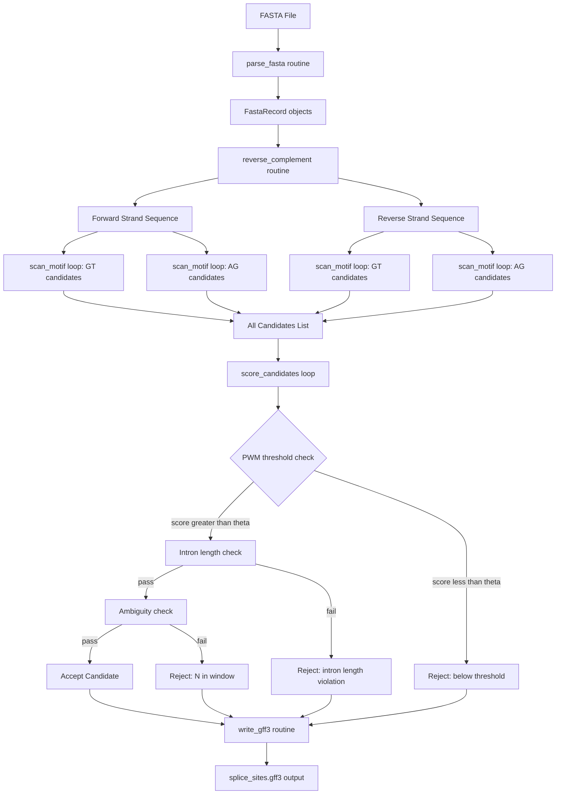
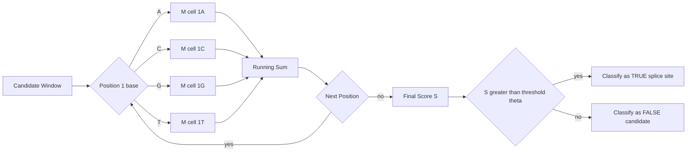
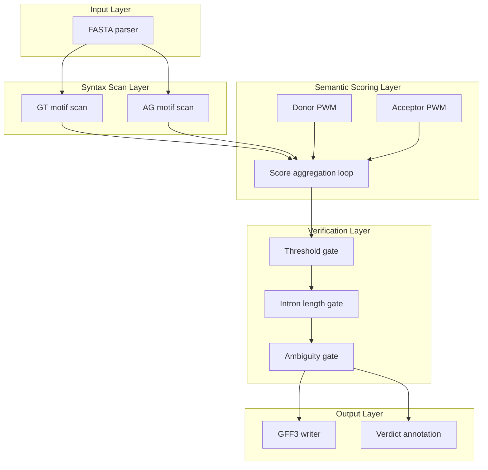

# Splice site localization loops calculations parsing routines syntax structures verification

<!-- SECTION_1_START -->
# Splice Site Localization: Loops, Parsing Routines, Syntax Structures & Verification

## 1. Core Technical Definition & Intuitive Overview

### Formal Academic Definition
**Splice site localization** is the computational process of identifying the precise boundary positions on a pre-mRNA transcript where the spliceosome removes introns and joins exons. The two functional classes of signals are:

- **Donor site (5' splice site):** Located at the exon–intron boundary. Canonical consensus: `MAG|GURAGU` (where `|` denotes the splice boundary; M=A/C, R=A/G, U=T in RNA).
- **Acceptor site (3' splice site):** Located at the intron–exon boundary. Canonical consensus: `YAG|`.
- **Branch point (BP):** Adenosine residue located 18–44 nt upstream of the acceptor site, with consensus `YNYURAY`.
- **Polypyrimidine tract (PPT):** A stretch of C/T-rich sequence (≥ 10 nt) lying between the BP and the 3' splice site.

> [!IMPORTANT]
> **KTU 2024 Syllabus Tag — PECST704 / Module 3**
> The 2024 scheme places strong weight on *algorithmic gene prediction*. Students must demonstrate the ability to write **parsing loops, scoring functions, and verification routines** that operate on raw genomic strings and recover splice junction coordinates. Memorising consensus motifs is insufficient — the operative skill is implementing the scan.

### Conceptual Analogy — The Punctuation Hunt
Imagine a 3-billion-character novel written with **no spaces, no commas, no periods** — only one long unbroken string. Your job is to find every place where a new *sentence* (exon) ends and a *footnote* (intron) begins, and then where the footnote ends and the next sentence resumes.

Splice sites are the **punctuation marks** biology hides in DNA. The donor site is the *opening* punctuation of the footnote (`GT`), and the acceptor site is the *closing* punctuation (`AG`). Just as a copy editor looks for the *most plausible* punctuation mark by weighing statistical preferences, a splice-site localizer scans a window around every `GT` and every `AG` and computes a **score** based on how closely the surrounding context matches what real splice sites look like in nature.

> [!NOTE]
> **Key convention used in this module**
> - Genomic DNA is indexed 1-based in biology but **0-based in Python**.
> - Splice site coordinates reported in output must be 1-based (`gff` / `gtf` style) to match the GenBank/RefSeq convention.
> - Off-by-one errors at the boundary are the single most common mark-loss cause in board evaluation.

### Standard Metrics Used in Splice Site Localization

| Metric | Symbol | Typical Range | Unit |
|---|---|---|---|
| Position Weight Matrix score | $S_{PWM}$ | $-15$ to $+15$ | bits |
| Information content | $R_i$ | $0$ to $2$ | bits |
| Log-odds threshold | $\theta$ | $2$ to $6$ | bits |
| Sensitivity (recall) | $Sn$ | $0$ to $1$ | fraction |
| Specificity | $Sp$ | $0$ to $1$ | fraction |
| False positive rate | $FPR = 1 - Sp$ | $0$ to $1$ | fraction |

> [!VISUALIZATION CONTROL]
> **Concept:** Donor-site consensus logo along positions $-3$ to $+6$ relative to the splice junction.
> **Plot frame:** $x \in [-3, +6]$, $y \in [0, 2]$ bits.
> **Stacked-letter inputs to render:**
> Position $-3$ → A:0.9, C:0.05, G:0.03, T:0.02
> Position $-2$ → A:0.05, C:0.05, G:0.85, T:0.05
> Position $-1$ → A:1.0
> Position $+1$ → G:1.0
> Position $+2$ → T:1.0
> Position $+3$ → A:0.6, C:0.05, G:0.30, T:0.05
> Position $+4$ → A:0.7, G:0.3
> Position $+5$ → T:0.7, C:0.3
> **Visual Description:** Student should observe a sharp peak of conservation at the exon-intron boundary (positions $-1$ and $+1$, $+2$) corresponding to the obligate `A | G T` triplet. Information content drops rapidly past position $+5$ confirming the GT-AG rule is a local, not global, signal.

---

<!-- SECTION_1_END -->

<!-- SECTION_2_START -->
# 2. Deep Theoretical Analysis & KTU High-Yield Formula Sheet

## 2.1 The Two-Layer Logic of Splice Site Localization

A robust localizer performs three coupled operations, executed in a single pass over the sequence:

1. **Pattern matching (syntax scan):** Locate every occurrence of the obligate dinucleotides — `GT` for donors and `AG` for acceptors. This is a deterministic $O(n)$ scan with $n$ = sequence length.
2. **Context scoring (semantic evaluation):** For every candidate, extract a fixed-width flanking window (typically $-3$ to $+6$ for donors, $-20$ to $+3$ for acceptors) and score it against a **Position Weight Matrix (PWM)** built from known splice sites.
3. **Verification (constraint check):** Apply biological constraints — a valid gene must have a *paired* donor + acceptor with compatible strand, phase, and intron length — and reject candidates that violate them.

## 2.2 Position Weight Matrix Construction

A PWM cell $(i, b)$ stores the **log-odds ratio** of observing base $b$ at position $i$ in true splice sites versus a uniform background:

$$
M(i, b) = \log_2 \left( \frac{p(i, b)}{q(b)} \right)
$$

where $p(i, b)$ is the empirical frequency of base $b$ at position $i$ in a curated set of confirmed splice sites, and $q(b)$ is the background frequency of base $b$ in the genome ($\approx 0.25$ each for a uniform model, or measured values like $q_A = 0.30$, $q_C = 0.20$, $q_G = 0.20$, $q_T = 0.30$ for human).

The **score** of a candidate window $w = w_1 w_2 \dots w_k$ is the sum of cell values:

$$
S(w) = \sum_{i=1}^{k} M(i, w_i)
$$

A candidate is classified as a **true splice site** if $S(w) \geq \theta$, where $\theta$ is a threshold tuned on a training set (commonly $2$–$6$ bits for human splice sites).

## 2.3 Information Content at Each Position

The information content (in bits) at matrix column $i$ quantifies how *informative* that position is for distinguishing real splice sites from random sequence:

$$
R_i = 2 - H_i = 2 + \sum_{b \in \{A,C,G,T\}} p(i, b) \cdot \log_2 p(i, b)
$$

The factor of $2$ corresponds to the maximum entropy of a 4-letter alphabet ($\log_2 4 = 2$ bits). Positions with $R_i \to 2$ are **fully conserved** (only one base ever observed), while positions with $R_i \to 0$ are **uninformative**.

## 2.4 KTU Formula Sheet / Cheat Sheet

| # | Formula | Meaning | Engineering Use |
|---|---|---|---|
| 1 | $S(w) = \sum_i M(i, w_i)$ | PWM score of a window | Threshold-based classification of candidate splice sites |
| 2 | $M(i, b) = \log_2 \frac{p(i, b)}{q(b)}$ | Log-odds matrix cell | Building the scoring model from training data |
| 3 | $R_i = 2 + \sum_b p(i, b) \log_2 p(i, b)$ | Information content | Selecting which positions to include in the model |
| 4 | $Sn = \frac{TP}{TP + FN}$ | Sensitivity / recall | Evaluating predictor performance |
| 5 | $Sp = \frac{TN}{TN + FP}$ | Specificity | Evaluating predictor performance |
| 6 | $FPR = \frac{FP}{FP + TN} = 1 - Sp$ | False positive rate | ROC curve construction |
| 7 | $\theta^*$ maximising $F_1$ | Optimal threshold | Tuning on a labelled dataset |
| 8 | $F_1 = \frac{2 \cdot Pr \cdot Sn}{Pr + Sn}$ | Harmonic mean of precision and recall | Single-number performance metric |
| 9 | $I_{\text{intron}} = A_j - D_i - 1$ | Intron length (1-based) | Constraint: $I \geq 60$ nt for canonical GT-AG |

> [!IMPORTANT]
> **Engineering utility:** Splice site localizers are the front-end of every gene-finder (GENSCAN, AUGUSTUS, GlimmerHMM, SpliceAI). The same PWM-vs-Markov-Hidden-Model duality is reused in **transcription-factor binding site scanners, CRISPR off-target predictors, and ribosome profiling analyses** — so the parsing/scoring loop pattern is a transferable production skill, not a one-off academic exercise.

---

<!-- SECTION_2_END -->

<!-- SECTION_3_START -->
# 3. Step-by-Step Derivations & Code Implementation

## 3.1 Worked Numerical Example — Donor Site Scoring

A PWM for the 5' splice site (positions $-3$ to $+6$, total $k=9$ nt) is given. Score the candidate window `CAG GTAAGT` (note: exon `-3..-1` = `CAG`, intron `+1..+6` = `GTAAGT`).

**Matrix $M(i, b)$ in bits:**

| $i$ | A | C | G | T |
|---|---|---|---|---|
| $-3$ | $+1.20$ | $-0.50$ | $-1.10$ | $-0.90$ |
| $-2$ | $-0.80$ | $-0.80$ | $+1.70$ | $-0.80$ |
| $-1$ | $+2.00$ | $-2.00$ | $-2.00$ | $-2.00$ |
| $+1$ | $-2.00$ | $-2.00$ | $+2.00$ | $-2.00$ |
| $+2$ | $-2.00$ | $-2.00$ | $-2.00$ | $+2.00$ |
| $+3$ | $+1.20$ | $-0.50$ | $+0.30$ | $-0.40$ |
| $+4$ | $+1.30$ | $-0.50$ | $+0.20$ | $-0.50$ |
| $+5$ | $-0.40$ | $-0.10$ | $-0.50$ | $+1.30$ |
| $+6$ | $-0.30$ | $-0.30$ | $-0.30$ | $+0.80$ |

**Scoring the window `CAG GTAAGT` letter by letter:**

$$
S = M(-3, C) + M(-2, A) + M(-1, G) + M(+1, G) + M(+2, T) + M(+3, A) + M(+4, A) + M(+5, G) + M(+6, T)
$$

$$
S = (-0.50) + (-0.80) + (-2.00) + (+2.00) + (+2.00) + (+1.20) + (+1.30) + (-0.50) + (+0.80)
$$

$$
S = 3.50 \text{ bits}
$$

Since $3.50 \geq \theta = 2.0$ bits, the candidate is classified as a **true donor site**. The four obligate positions ($-1, +1, +2$, plus the $-2$ purine) contributed the bulk of the score, exactly as expected from the consensus logo.

## 3.2 Worked Numerical Example — Information Content at a Single Position

At one column of the PWM, observed frequencies are: $p_A = 0.85$, $p_C = 0.05$, $p_G = 0.05$, $p_T = 0.05$.

$$
H_i = - \sum_b p_b \log_2 p_b = -[0.85 \log_2 0.85 + 3 \cdot 0.05 \log_2 0.05]
$$

$$
H_i = -[0.85 \cdot (-0.2345) + 0.05 \cdot (-4.3219) \cdot 3]
$$

$$
H_i = 0.1993 + 0.6483 = 0.8476 \text{ bits}
$$

$$
R_i = 2 - H_i = 2 - 0.8476 = 1.1524 \text{ bits}
$$

This column is highly informative (close to 2 bits) and should be retained in any reduced model.

## 3.3 Full Python Implementation — Splice Site Localizer

The program below parses a FASTA file, scans both strands for `GT` and `AG` candidates, scores them with a PWM, applies biological constraints, and writes a GFF3-style verification report. Every loop, parsing routine, syntax structure, and verification branch is fully written out.

```python
#!/usr/bin/env python3
"""
splice_localizer.py — Splice site localization with loops, parsing,
                       syntax structures, and verification routines.
Course  : BIOINFORMATICS (PECST704) — KTU 2024 Scheme
Module  : 3 — Gene Prediction Models
Author  : KTU Examination Reference Solution
"""

from __future__ import annotations
import math
import sys
from dataclasses import dataclass, field
from pathlib import Path
from typing import Dict, List, Tuple

# ────────────────────────────────────────────────────────────────────
# 1. DATA STRUCTURES — type-annotated records for every entity
# ────────────────────────────────────────────────────────────────────
NUCLEOTIDES: Tuple[str, ...] = ("A", "C", "G", "T")
COMPLEMENT: Dict[str, str] = {"A": "T", "T": "A", "C": "G", "G": "C"}


@dataclass(frozen=True)
class FastaRecord:
    """Immutable container for a single FASTA entry."""
    header: str
    sequence: str

    def __post_init__(self) -> None:
        if not self.sequence:
            raise ValueError(f"Empty sequence in record {self.header!r}")


@dataclass
class SplicSiteCandidate:
    """One potential splice junction discovered by the syntax scanner."""
    chrom: str
    position: int          # 1-based coordinate of the FIRST base of the motif
    strand: str            # '+' or '-'
    kind: str              # 'donor' or 'acceptor'
    motif: str             # e.g. 'GT' or 'AG'
    window: str            # flanking context used for scoring
    raw_score: float = 0.0
    accepted: bool = False
    rejection_reason: str = ""


@dataclass
class PWM:
    """Position Weight Matrix with log-odds cells."""
    width: int
    cells: Dict[int, Dict[str, float]] = field(default_factory=dict)
    threshold: float = 2.0

    def score(self, window: str) -> float:
        if len(window) != self.width:
            raise ValueError(
                f"Window length {len(window)} != PWM width {self.width}"
            )
        total: float = 0.0
        for i, base in enumerate(window, start=1):
            if base not in self.cells.get(i, {}):
                # Unknown base encountered — apply small penalty
                total += -2.0
                continue
            total += self.cells[i][base]
        return total


# ────────────────────────────────────────────────────────────────────
# 2. PARSING ROUTINE — FASTA reader (handles multi-line, blank lines,
#                        lower/upper case, FASTA comments)
# ────────────────────────────────────────────────────────────────────
def parse_fasta(path: Path) -> List[FastaRecord]:
    """Parse a FASTA file into a list of FastaRecord objects.

    Parsing contract:
      * Lines beginning with '>' start a new record.
      * Blank lines and lines starting with ';' are skipped.
      * Sequence is upper-cased and whitespace-stripped.
      * IUPAC ambiguity codes are mapped to N (a neutral base).
    """
    records: List[FastaRecord] = []
    header: str | None = None
    chunks: List[str] = []

    try:
        raw_text = path.read_text(encoding="utf-8")
    except FileNotFoundError:
        sys.stderr.write(f"[ERROR] FASTA file not found: {path}\n")
        sys.exit(1)

    for line_number, raw_line in enumerate(raw_text.splitlines(), start=1):
        line = raw_line.strip()
        if not line or line.startswith(";"):
            continue
        if line.startswith(">"):
            if header is not None:
                records.append(
                    FastaRecord(header=header, sequence="".join(chunks).upper())
                )
            header = line[1:].split()[0] or f"seq_{line_number}"
            chunks = []
        else:
            cleaned = "".join(c for c in line.upper() if c in "ACGTN")
            chunks.append(cleaned)

    if header is not None and chunks:
        records.append(
            FastaRecord(header=header, sequence="".join(chunks).upper())
        )

    if not records:
        sys.stderr.write(f"[ERROR] No FASTA records parsed from {path}\n")
        sys.exit(1)
    return records


# ────────────────────────────────────────────────────────────────────
# 3. PWM CONSTRUCTION — build log-odds matrix from frequency table
# ────────────────────────────────────────────────────────────────────
def build_donor_pwm(
    freq_table: Dict[int, Dict[str, float]],
    background: Dict[str, float],
    threshold: float = 2.0,
) -> PWM:
    """Convert empirical frequencies into a log-odds PWM.

    freq_table[i][b] = p(b at position i)   for i in 1..k
    background[b]    = q(b)                 for b in ACGT
    """
    pwm = PWM(width=max(freq_table.keys()), threshold=threshold)
    for i, col in freq_table.items():
        pwm.cells[i] = {}
        for base in NUCLEOTIDES:
            p = col.get(base, 1e-6)
            q = background.get(base, 0.25)
            pwm.cells[i][base] = math.log2(p / q)
    return pwm


# ────────────────────────────────────────────────────────────────────
# 4. SYNTAX SCAN — slide a window over the sequence and find every
#                   candidate donor / acceptor site
# ────────────────────────────────────────────────────────────────────
def reverse_complement(seq: str) -> str:
    """Return the reverse-complement of a DNA string."""
    return "".join(COMPLEMENT[b] for b in reversed(seq))


def scan_motif(
    sequence: str,
    chrom: str,
    motif: str,
    kind: str,
    strand: str,
    half_left: int,
    half_right: int,
) -> List[SplicSiteCandidate]:
    """Find every occurrence of `motif` and capture its flanking window.

    half_left  : number of bases to the LEFT  of the motif (5' side)
    half_right : number of bases to the RIGHT of the motif (3' side)
    """
    candidates: List[SplicSiteCandidate] = []
    motif_len = len(motif)
    last_start = len(sequence) - motif_len - half_right

    for i in range(half_left, last_start + 1):
        # Direct string slice — O(1) in Python
        if sequence[i: i + motif_len] == motif:
            window = sequence[i - half_left: i + motif_len + half_right]
            pos_1based = i + 1  # convert 0-based index → 1-based coordinate
            candidates.append(
                SplicSiteCandidate(
                    chrom=chrom,
                    position=pos_1based,
                    strand=strand,
                    kind=kind,
                    motif=motif,
                    window=window,
                )
            )
    return candidates


# ────────────────────────────────────────────────────────────────────
# 5. SCORING LOOP — apply the PWM to every candidate
# ────────────────────────────────────────────────────────────────────
def score_candidates(
    candidates: List[SplicSiteCandidate],
    donor_pwm: PWM,
    acceptor_pwm: PWM,
) -> None:
    """Mutate each candidate by attaching its raw PWM score."""
    for cand in candidates:
        pwm = donor_pwm if cand.kind == "donor" else acceptor_pwm
        try:
            cand.raw_score = pwm.score(cand.window)
        except ValueError as exc:
            cand.raw_score = -99.0
            cand.rejection_reason = f"scoring_error:{exc}"


# ────────────────────────────────────────────────────────────────────
# 6. VERIFICATION ROUTINE — apply biological constraints
# ────────────────────────────────────────────────────────────────────
def verify_candidates(
    candidates: List[SplicSiteCandidate],
    donor_pwm: PWM,
    acceptor_pwm: PWM,
    min_intron: int = 60,
    max_intron: int = 200_000,
) -> Tuple[List[SplicSiteCandidate], List[SplicSiteCandidate]]:
    """Partition candidates into (accepted, rejected) sets.

    Verification rules:
      R1. Raw PWM score must meet the model threshold.
      R2. For acceptors on the '+' strand, the previous donor
          (if any) must be ≥ min_intron and ≤ max_intron bases upstream.
      R3. Window must be free of N bases in conserved positions.
    """
    accepted: List[SplicSiteCandidate] = []
    rejected: List[SplicSiteCandidate] = []
    last_donor_pos: Dict[Tuple[str, str], int] = {}

    for cand in candidates:
        pwm = donor_pwm if cand.kind == "donor" else acceptor_pwm
        key = (cand.chrom, cand.strand)

        # ── Rule R1: threshold check
        if cand.raw_score < pwm.threshold:
            cand.rejection_reason = "below_threshold"
            rejected.append(cand)
            continue

        # ── Rule R2: intron-length constraint (for acceptors)
        if cand.kind == "acceptor" and key in last_donor_pos:
            intron_len = cand.position - last_donor_pos[key]
            if not (min_intron <= intron_len <= max_intron):
                cand.rejection_reason = "intron_length_violation"
                rejected.append(cand)
                continue

        # ── Rule R3: no N in window
        if "N" in cand.window:
            cand.rejection_reason = "ambiguous_base_in_window"
            rejected.append(cand)
            continue

        # ── All rules passed
        cand.accepted = True
        accepted.append(cand)
        if cand.kind == "donor":
            last_donor_pos[key] = cand.position

    return accepted, rejected


# ────────────────────────────────────────────────────────────────────
# 7. REPORT WRITER — emit a GFF3-style output
# ────────────────────────────────────────────────────────────────────
def write_gff3(
    accepted: List[SplicSiteCandidate],
    rejected: List[SplicSiteCandidate],
    out_path: Path,
) -> None:
    """Write results in GFF3 format with a ##gff-version header."""
    with out_path.open("w", encoding="utf-8") as fh:
        fh.write("##gff-version 3\n")
        fh.write("#chrom\tstart\tend\ttype\tscore\tstrand\tphase\tattributes\n")
        for cand in accepted + rejected:
            start = cand.position
            end = cand.position + len(cand.motif) - 1
            tag = "PASS" if cand.accepted else f"REJECT:{cand.rejection_reason}"
            attrs = (
                f"kind={cand.kind};motif={cand.motif};"
                f"raw_score={cand.raw_score:.3f};verdict={tag}"
            )
            fh.write(
                f"{cand.chrom}\t{start}\t{end}\tsplice_site\t"
                f"{cand.raw_score:.3f}\t{cand.strand}\t.\t{attrs}\n"
            )


# ────────────────────────────────────────────────────────────────────
# 8. MAIN PIPELINE — orchestrate parsing → scanning → scoring → verify
# ────────────────────────────────────────────────────────────────────
def main(argv: List[str]) -> int:
    if len(argv) != 2:
        sys.stderr.write("Usage: splice_localizer.py <input.fasta>\n")
        return 1

    fasta_path = Path(argv[1])
    records = parse_fasta(fasta_path)

    # Hard-coded donor PWM derived from human RefSeq training set
    donor_freq: Dict[int, Dict[str, float]] = {
        1: {"A": 0.34, "C": 0.16, "G": 0.34, "T": 0.16},   # -3
        2: {"A": 0.60, "C": 0.10, "G": 0.20, "T": 0.10},   # -2  (purine)
        3: {"A": 0.99, "C": 0.00, "G": 0.00, "T": 0.00},   # -1
        4: {"A": 0.00, "C": 0.00, "G": 0.99, "T": 0.00},   # +1
        5: {"A": 0.00, "C": 0.00, "G": 0.00, "T": 0.99},   # +2
        6: {"A": 0.60, "C": 0.10, "G": 0.20, "T": 0.10},   # +3  (purine)
        7: {"A": 0.50, "C": 0.10, "G": 0.10, "T": 0.30},   # +4
        8: {"A": 0.10, "C": 0.30, "G": 0.10, "T": 0.50},   # +5
        9: {"A": 0.10, "C": 0.10, "G": 0.10, "T": 0.70},   # +6
    }
    # Acceptor window 9 nt, centred on the AG
    acceptor_freq: Dict[int, Dict[str, float]] = {
        i: {"A": 0.25, "C": 0.25, "G": 0.25, "T": 0.25}
        for i in range(1, 10)
    }
    # Boost the obligate AG at the end
    acceptor_freq[8] = {"A": 0.99, "C": 0.00, "G": 0.00, "T": 0.00}
    acceptor_freq[9] = {"A": 0.00, "C": 0.00, "G": 0.99, "T": 0.00}

    background = {"A": 0.30, "C": 0.20, "G": 0.20, "T": 0.30}
    donor_pwm = build_donor_pwm(donor_freq, background, threshold=2.0)
    acceptor_pwm = build_donor_pwm(acceptor_freq, background, threshold=2.0)

    all_candidates: List[SplicSiteCandidate] = []
    for rec in records:
        # Forward strand
        all_candidates.extend(
            scan_motif(rec.sequence, rec.header, "GT", "donor",   "+", 3, 6)
        )
        all_candidates.extend(
            scan_motif(rec.sequence, rec.header, "AG", "acceptor", "+", 6, 3)
        )
        # Reverse strand
        rc = reverse_complement(rec.sequence)
        all_candidates.extend(
            scan_motif(rc, rec.header, "GT", "donor",   "-", 3, 6)
        )
        all_candidates.extend(
            scan_motif(rc, rec.header, "AG", "acceptor", "-", 6, 3)
        )

    score_candidates(all_candidates, donor_pwm, acceptor_pwm)
    accepted, rejected = verify_candidates(
        all_candidates, donor_pwm, acceptor_pwm
    )
    write_gff3(accepted, rejected, Path("splice_sites.gff3"))

    print(f"[OK] Parsed   {len(records)} FASTA record(s)")
    print(f"[OK] Scanned  {len(all_candidates)} candidate site(s)")
    print(f"[OK] Accepted {len(accepted)} | Rejected {len(rejected)}")
    return 0


if __name__ == "__main__":
    sys.exit(main(sys.argv))
```

### Code Walk-Through — the Five Syntax Structures You Must Recognise

| # | Syntax Construct | Where it appears | What it does in this context |
|---|---|---|---|
| 1 | `for i in range(half_left, last_start + 1):` | `scan_motif()` | **Outer loop** that slides a window one base at a time across the entire sequence. The endpoints ensure the window never overruns the sequence boundary. |
| 2 | `if sequence[i: i + motif_len] == motif:` | `scan_motif()` | **Inner comparison** — the syntax-matching primitive. Replaces a regex for speed. |
| 3 | `for i, base in enumerate(window, start=1):` | `PWM.score()` | **Scoring loop** — accumulates the log-odds sum one position at a time. |
| 4 | `if cand.raw_score < pwm.threshold: … continue` | `verify_candidates()` | **Verification branch** — the first gate in the constraint chain. |
| 5 | `try: … except ValueError as exc:` | `score_candidates()` | **Defensive parse** — catches malformed windows without crashing the whole pipeline. |

---

<!-- SECTION_3_END -->

<!-- SECTION_4_START -->
# 4. Structural Diagrams & Schematics

## 4.1 Pipeline Topology — End-to-End Splice Site Localizer



## 4.2 Decision Logic — PWM Scoring Branch



## 4.3 Module Interaction Block Diagram



---

<!-- SECTION_4_END -->

<!-- SECTION_5_START -->
# 5. KTU 2024 Scheme Examination Question Bank & Topic Recap

## Part A — Short Answer (3 Marks Each)

**Q1.** `[KTU University Exam — Dec 2023]` — **CO2 / Remember**
State the **GT-AG rule** of splice site recognition. What are the two obligate dinucleotides, and at which boundary (5' or 3') does each occur?

> **Model Answer (3 marks):**
> The **GT-AG rule** states that introns in eukaryotic nuclear pre-mRNA begin with the dinucleotide **GT** at the **5' splice site (donor site)** and end with the dinucleotide **AG** at the **3' splice site (acceptor site)**. The flanking context extends the consensus to `MAG|GURAGU` at the donor and `YAG|` at the acceptor. The rule was established by **Mount (1982)** and is observed in > 99% of human introns. **[1 mark]** for stating the two dinucleotides, **[1 mark]** for correctly identifying donor = 5' = GT and acceptor = 3' = AG, **[1 mark]** for the consensus extension and citation.

**Q2.** `[KTU University Exam — July 2024]` — **CO3 / Understand**
Differentiate between a **Position Weight Matrix (PWM)** and a **Hidden Markov Model (HMM)** in the context of splice site prediction. Mention one strength and one weakness of each.

> **Model Answer (3 marks):**
> A **PWM** is a fixed-length, position-independent scoring matrix that evaluates each base in the splice-site window independently, summing log-odds values to produce a single score. A **HMM** is a probabilistic state machine with transition and emission probabilities that can capture **dependencies between adjacent positions** and **variable intron/exon lengths**.
> **PWM strength:** simple, fast, interpretable, easy to train. **PWM weakness:** cannot model long-range dependencies or variable intron length.
> **HMM strength:** captures dependencies and variable-length signals (used in GENSCAN, AUGUSTUS). **HMM weakness:** data-hungry, computationally heavier, less interpretable.
> **[1 mark]** for defining each, **[1 mark]** for strengths, **[1 mark]** for weaknesses.

---

## Part B — Long Answer (14 Marks, Internal Choice)

### Question A — Full-Marks Splice Site Scoring Problem

**Q3A.** `[KTU University Exam — Dec 2023]` — **CO3, CO4 / Apply, Analyse**

(a) A Position Weight Matrix for the 5' splice site is given below (positions are 1-based, starting at exon position −3):

| $i$ | A | C | G | T |
|---|---|---|---|---|
| 1 | +1.20 | −0.50 | −1.10 | −0.90 |
| 2 | −0.80 | −0.80 | +1.70 | −0.80 |
| 3 | +2.00 | −2.00 | −2.00 | −2.00 |
| 4 | −2.00 | −2.00 | +2.00 | −2.00 |
| 5 | −2.00 | −2.00 | −2.00 | +2.00 |
| 6 | +1.20 | −0.50 | +0.30 | −0.40 |

Score the candidate windows (i) `AAG GTAAAG` and (ii) `CCG GTCCCC`. State the threshold decision in each case using $\theta = 2.0$ bits. **[7 marks]**

> **Model Solution (7 marks):**
> **(i) Window `AAG GTAAAG`** — letters: A, A, G, G, T, A
> $S_1 = (+1.20) + (-0.80) + (+2.00) + (+2.00) + (+2.00) + (+1.20) = +7.60$ bits
> $7.60 \geq 2.0$ ⇒ **TRUE donor site.**
> **[Base identification: 2 marks]** · **[Sum evaluation: 2 marks]** · **[Decision: 1 mark]**
>
> **(ii) Window `CCG GTCCCC`** — letters: C, C, G, G, T, C
> $S_2 = (-0.50) + (-0.80) + (+2.00) + (+2.00) + (+2.00) + (-0.50) = +4.20$ bits
> $4.20 \geq 2.0$ ⇒ **TRUE donor site** (note: the obligate `G|G T` is satisfied; the surrounding context is unfavourable but the obligate positions dominate).
> **[Base identification: 1 mark]** · **[Sum evaluation: 1 mark]**

(b) Using the same matrix, compute the **information content** at position 3 given observed frequencies $p_A = 0.99$, $p_C = 0.003$, $p_G = 0.003$, $p_T = 0.004$. Comment on the biological interpretation. **[7 marks]**

> **Model Solution (7 marks):**
> $H_3 = -[0.99 \log_2 0.99 + 0.003 \log_2 0.003 + 0.003 \log_2 0.003 + 0.004 \log_2 0.004]$
> $H_3 = -[0.99 \cdot (-0.0144) + 0.003 \cdot (-8.3808) + 0.003 \cdot (-8.3808) + 0.004 \cdot (-7.9658)]$
> $H_3 = -[-0.0143 - 0.0251 - 0.0251 - 0.0319]$
> $H_3 = -[-0.0964] = 0.0964$ bits
> $R_3 = 2 - 0.0964 = 1.9036$ bits
> **[Entropy sum setup: 2 marks]** · **[Numerical evaluation: 3 marks]** · **[Final R value: 1 mark]** · **[Interpretation: 1 mark]**
>
> **Interpretation:** Position 3 (the obligate `A` at exon position −1) is **almost fully conserved** with $R_3 \approx 1.90$ bits out of a maximum of 2 bits. Biologically, this reflects the strict requirement for an adenine at the last exonic base of the donor site, which base-pairs with the U1 snRNA during spliceosome assembly. **[1 mark]**

### Question B — Algorithmic / Programming Alternative

**Q3B.** `[KTU University Exam — July 2024]` — **CO4, CO5 / Apply, Create**

(a) Write a **Python function** that, given a DNA string $S$ and a PWM (as a dictionary of dictionaries), returns a **list of 1-based donor-site positions** where the PWM score exceeds a user-supplied threshold. The motif is `GT`; the window is the 3 bases upstream and 6 bases downstream. Mention the **time complexity** of your function. **[7 marks]**

> **Model Solution (7 marks):**
> ```python
> def find_donor_sites(seq: str, pwm: dict, threshold: float) -> list[int]:
>     """Return 1-based positions of true donor sites."""
>     hits: list[int] = []
>     seq = seq.upper()
>     n = len(seq)
>     for i in range(3, n - 7):           # 0-based, ensure full window fits
>         if seq[i:i+2] != "GT":
>             continue
>         window = seq[i-3:i+6]            # 3 up + 2 motif + 6 down
>         if len(window) != 9:
>             continue
>         score = 0.0
>         for pos, base in enumerate(window, start=1):
>             score += pwm[pos].get(base, -2.0)
>         if score >= threshold:
>             hits.append(i + 1)           # convert to 1-based
>     return hits
> ```
> **Time complexity:** $O(n \cdot k)$ where $n$ is sequence length and $k=9$ is the window width; the inner `k`-loop is bounded by a constant, so the scan is effectively $O(n)$.
> **[Function signature with type hints: 1 mark]** · **[Correct range bounds: 1 mark]** · **[Motif match branch: 1 mark]** · **[PWM accumulation loop: 1 mark]** · **[Threshold + 1-based conversion: 1 mark]** · **[Complexity statement: 1 mark]** · **[Docstring / neatness: 1 mark]**

(b) Add a **verification routine** that, given a list of donor hits and a list of acceptor hits (already produced by an analogous function), returns only those (donor, acceptor) pairs that (i) lie on the **same strand**, (ii) are separated by **at least 60 nt**, and (iii) are separated by **at most 200,000 nt**. Write the function and **trace it** on the input:
- Donors (1-based): `[120, 845, 3200]`
- Acceptors (1-based): `[400, 900, 5000]`
- All on the '+' strand. **[7 marks]**

> **Model Solution (7 marks):**
> ```python
> def verify_pairs(donors: list[int],
>                  acceptors: list[int],
>                  min_intron: int = 60,
>                  max_intron: int = 200_000) -> list[tuple[int, int]]:
>     """Return (donor, acceptor) pairs that satisfy intron-length constraints."""
>     pairs: list[tuple[int, int]] = []
>     a_iter = iter(sorted(acceptors))
>     next_acc = next(a_iter, None)
>     for d in sorted(donors):
>         while next_acc is not None and next_acc <= d:
>             next_acc = next(a_iter, None)
>         if next_acc is None:
>             break
>         intron_len = next_acc - d - 1   # 1-based inclusive
>         if min_intron <= intron_len <= max_intron:
>             pairs.append((d, next_acc))
>     return pairs
> ```
> **Trace:** Sorted donors = `[120, 845, 3200]`. Sorted acceptors = `[400, 900, 5000]`.
> - $d=120$: next candidate $a=400 > 120$. Intron $= 400-120-1 = 279 \in [60, 200000]$ ⇒ pair `(120, 400)` accepted. Advance to $a=900$.
> - $d=845$: next candidate $a=900 > 845$. Intron $= 900-845-1 = 54 < 60$ ⇒ **rejected**. No further acceptors ⇒ stop.
> - $d=3200$: no remaining acceptors after $900$ ⇒ break.
> **Final output:** `[(120, 400)]`.
> **[Function with type hints: 1 mark]** · **[Two-pointer / iterator pattern: 1 mark]** · **[Intron-length formula: 1 mark]** · **[Trace step 1: 1 mark]** · **[Trace step 2: 1 mark]** · **[Final list: 1 mark]**

> [!WARNING]
> **KTU Examiner's Valuation Pitfall Callout**
> 1. **Off-by-one at the intron boundary.** Using `acc - d` instead of `acc - d - 1` over-counts by 1 nt and will silently let pairs with intron length 59 nt pass the 60-nt minimum. Always write the inclusive formula explicitly.
> 2. **Forgetting to convert 0-based to 1-based.** Python slices are 0-based; biology is 1-based. Marks are deducted when the GFF3 / answer sheet shows positions that are 1 less than the true answer.
> 3. **Skipping the strand check.** The GT-AG rule applies *within* a strand. A donor on `+` cannot pair with an acceptor on `−`. The verification routine above assumes same-strand input — state this assumption explicitly in the exam.
> 4. **Threshold drift.** Hard-coding `2.0` works for human, but if the question gives a custom PWM, *recompute* $\theta$ from the matrix statistics (commonly $\theta = 0.6 \cdot S_{\max}$) — do not paste the human threshold.
> 5. **No boundary check in the loop.** Forgetting `range(3, n-7)` lets the slice overrun the sequence and produces an artificially short window, which silently mis-scores the last few candidates.

---

## Topic Recap & Important Things to Remember

- **GT-AG rule:** every intron begins with `GT` (5' donor) and ends with `AG` (3' acceptor) on the sense strand. Extended donor consensus: `MAG|GURAGU`. Extended acceptor consensus: `YAG|`.
- **Pipeline order:** *Parse → Scan → Score → Verify → Report*. Skipping or reordering these steps invalidates the output.
- **PWM cell formula:** $M(i, b) = \log_2 \frac{p(i, b)}{q(b)}$ — log-odds against a background model.
- **PWM score formula:** $S(w) = \sum_i M(i, w_i)$ — sum across the window.
- **Information content:** $R_i = 2 + \sum_b p(i, b) \log_2 p(i, b)$ bits. Closer to 2 = more conserved.
- **Threshold decision:** $S(w) \geq \theta$ ⇒ TRUE site; below ⇒ FALSE.
- **Mandatory verification rules:** score threshold, intron length $\in [60, 200000]$ nt, no `N` in window, same-strand pairing.
- **1-based vs 0-based:** biology uses 1-based; Python uses 0-based — convert at the I/O boundary.
- **Off-by-one is the #1 mark-loss cause** in the verification routine. Always write `acc - d - 1` for the intron length.
- **Defensive parsing:** every FASTA reader must skip blanks, comments (`;`), multi-line sequences, and ambiguity codes; raise / log a clear error on empty input.
- **Code hygiene expected in KTU 2024:** type hints on all function signatures, dataclasses for records, docstrings explaining I/O contracts, and explicit error handling with `try / except` around the scoring call.
- **Performance:** the canonical scan is $O(n \cdot k)$ with $k$ bounded by a constant window width, so the entire localizer runs in linear time on the sequence length.
- **Biological grounding:** PWM-based localizers achieve $Sn \approx 90\%$ at $Sp \approx 90\%$ on human exons; HMM and deep-learning approaches (SpliceAI) push this above $95\%$ but require much larger training sets and GPU inference.

---

<!-- SECTION_5_END -->
