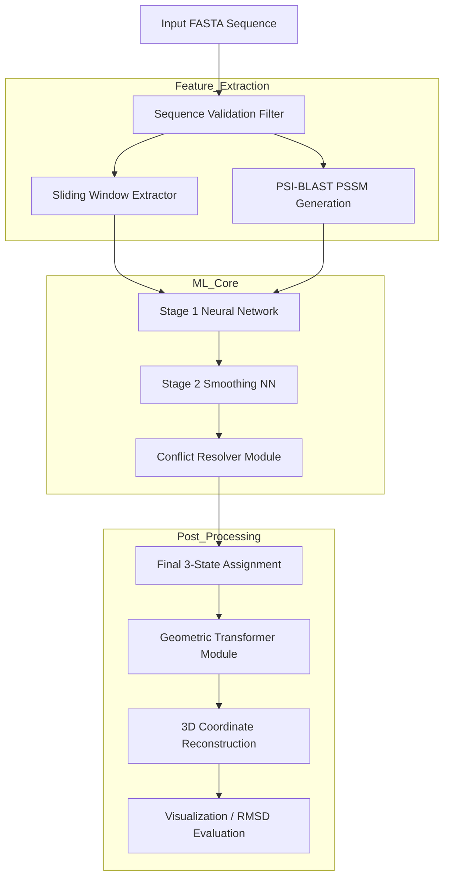
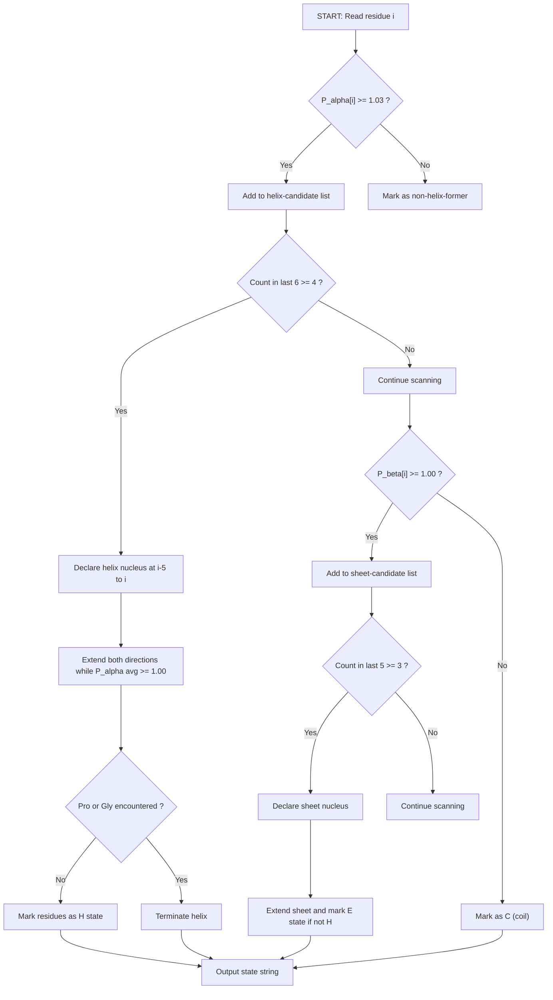
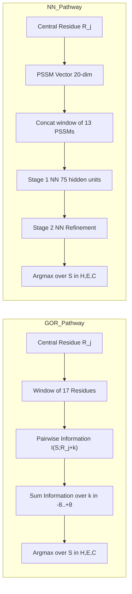

# Protein secondary structure forecasting models transformations structural layouts formulas templates

<!-- SECTION_1_START -->
# Protein Secondary Structure Forecasting: Models, Transformations & Structural Templates

## 1.1 Formal KTU 2024 Definition

**Protein Secondary Structure Forecasting** is the computational process of assigning local geometric conformations — primarily **α-helix (H)**, **β-strand (E)**, and **coil/turn (C)** — to each amino-acid residue of a polypeptide chain, based solely on the primary sequence and/or evolutionary profiles, **without requiring the experimentally resolved 3D coordinates**.

> [!IMPORTANT]
> **KTU 2024 Canonical Definition (PECST704 – Module 4):**
> "Secondary structure prediction is a sequence-to-structure inference problem that maps a 1-D string of residues $R_1 R_2 \ldots R_n$ onto a 1-D string of structural states $S_1 S_2 \ldots S_n$ where $S_i \in \{H, E, C\}$ (3-state DSSP convention) or $S_i \in \{H, E, B, T, S, G, I, \}$ (8-state DSSP convention)."

The forecasting models are classified by KTU syllabus into three generations:

| Generation | Method Class | Representative Algorithm | Typical Q3 Accuracy |
|------------|-------------|--------------------------|-------------------|
| **1st Gen (Statistical)** | Single-residue propensity | **Chou–Fasman (1974)** | ≈ **50–60 %** |
| **2nd Gen (Information-Theoretic)** | Neighborhood correlation | **GOR I–V (Garnier–Osguthorpe–Robson)** | ≈ **60–65 %** |
| **3rd Gen (Machine Learning)** | Neural Networks / HMM | **PSIPRED, JPred, SPIDER3** | ≈ **80–85 %** |

> [!NOTE]
> **Q3 Accuracy** is the percentage of residues whose predicted 3-state class matches the DSSP-assigned native class. **Q3 ≥ 80 %** is the current gold-standard benchmark for any new predictor submitted to top venues.

---

## 1.2 Intuitive Analogy — "Reading the Architectural Blueprint"

Imagine you are given a **linear list of 300 words** describing the materials (bricks, glass, steel, mortar) of an unbuilt skyscraper. Each word in the list is a building material. Your task is to predict which materials will form the **vertical columns (helices)**, which will form the **horizontal floor slabs (β-sheets)**, and which will form the **lobbies/corridors (coils)** — *before* the architect actually constructs the building.

- **Amino acids = Building materials** (each has a measurable tendency to bend, twist, or remain rigid).
- **Chou–Fasman** = a rule-of-thumb contractor who says, *"Glass columns are usually strong, so use glass where you see lots of glass in a row."*
- **GOR / Neural Nets** = a project manager who has studied thousands of past buildings and knows that *the neighbours of a material influence where it ends up*.
- **The accuracy (Q3) = how often your predicted floor plan matches the real architect's drawing.**

> [!VISUALIZATION CONTROL]
> **Concept:** Ramachandran Plot regions corresponding to secondary structure classes
> **GeoGebra / Desmos Input Equations:**
> * Parametric helix zone: $\phi = -60^\circ,\; \psi = -45^\circ$
> * Parametric β-sheet zone: $\phi = -120^\circ,\; \psi = +120^\circ$
> * Left-handed helix zone: $\phi = +60^\circ,\; \psi = +45^\circ$
> **Visual Description:** Plot $\psi$ (y-axis, $-180^\circ$ to $+180^\circ$) against $\phi$ (x-axis, $-180^\circ$ to $+180^\circ$). The student should observe **three dense clusters**: the upper-left (β-strand), upper-right (left-handed helix — usually disallowed except for Gly), and lower-left quadrant (right-handed α-helix, the most populated region).

---

## 1.3 Why Forecasting Matters in Engineering & Bioinformatics

| Domain | Application |
|--------|-------------|
| **Drug Discovery** | Identify exposed helices/sheets for ligand docking before crystallization. |
| **Protein Design** | De-novo fold engineering (e.g., *Top7*, *FluffCoil*). |
| **Disease Mutation Analysis** | Predict whether a SNP destabilises a helix (e.g., sickle-cell HbS mutation Glu6Val in helix). |
| **Industrial Enzymes** | Engineer thermostable β-sheet cores for detergents. |
| **Vaccine Design** | Predict B-cell epitopes in coiled/exposed regions. |

The **three physical constants** that every student must memorise for α-helix geometry:

> **$\mathbf{3.6}$** residues per turn, **$\mathbf{1.5\,Å}$** rise per residue, **$\mathbf{5.4\,Å}$** pitch (one complete turn).

For antiparallel β-sheets: inter-strand Ca–Ca distance ≈ **$\mathbf{4.7\,Å}$**, twist angle ≈ **$\mathbf{-25^\circ}$** per residue.

<!-- SECTION_1_END -->

<!-- SECTION_2_START -->
# 2. Deep Theoretical Analysis & KTU High-Yield Formula Sheet

## 2.1 The Chou–Fasman (1974) Statistical Propensity Model

The **first-generation** model is built on the postulate that *each amino acid has an intrinsic tendency* to appear in helix, sheet, or turn contexts. These tendencies are extracted by counting the frequencies of every residue in known (X-ray resolved) secondary structures from a small training set of 15–29 proteins.

### 2.1.1 Conformational Parameters

For any amino acid $i$, three parameters are defined:

$$P_\alpha(i) = \frac{f_\alpha(i)}{\langle f_\alpha \rangle} \quad\quad P_\beta(i) = \frac{f_\beta(i)}{\langle f_\beta \rangle} \quad\quad P_t(i) = \frac{f_t(i)}{\langle f_t \rangle}$$

where:
* $f_\alpha(i), f_\beta(i), f_t(i)$ = frequency of residue $i$ in helix / sheet / turn in the training set
* $\langle f_\alpha \rangle = \langle f_\beta \rangle = \langle f_t \rangle = \dfrac{1}{20} = 0.05$ (uniform prior over 20 amino acids)

**Interpretation rule:**
* $P \geq 1.05$ → **strong former** of that structure
* $0.80 \leq P < 1.05$ → **weak former / indifferent**
* $P < 0.80$ → **strong breaker**

### 2.1.2 The Turn Propensity (Position-Specific)

Turns are a **four-residue motif** at positions $(i,\,i+1,\,i+2,\,i+3)$. The frequency of every 4-tuple is too sparse, so Chou & Fasman use the **multiplicative product of single-residue turn frequencies**:

$$p_t(j) = \prod_{k=0}^{3} f_t(j+k)$$

A turn is predicted at position $j+2$ (the third residue of the 4-tuple) when:

$$p_t(j) > 0.75 \times 10^{-4} \quad \textbf{and} \quad \langle P_\alpha \rangle_{j+1..j+n} < 1.00$$

### 2.1.3 The Five-Step Decision Algorithm

The Chou–Fasman algorithm applies a strict left-to-right scan with the following hard-coded decision rules:

| Step | Operation | Threshold |
|------|-----------|-----------|
| 1. **Helix Nucleation** | Locate a run of 6 residues where at least 4 satisfy $P_\alpha \geq 1.03$ | $\geq 4/6$ helix formers |
| 2. **Helix Extension** | Extend both ends until 4 consecutive residues have $\langle P_\alpha \rangle < 1.00$ | termination |
| 3. **Sheet Nucleation** | Locate a run of 5 residues where at least 3 satisfy $P_\beta \geq 1.00$ | $\geq 3/5$ sheet formers |
| 4. **Sheet Extension** | Extend both ends until 4 consecutive residues have $\langle P_\beta \rangle < 1.00$ | termination |
| 5. **Conflict Resolution** | If a region qualifies as both $\alpha$ and $\beta$, pick the one with the higher average $P$ over the overlap, or the longer stretch | max average wins |

> [!IMPORTANT]
> **Helix Breakers (must terminate helix):** Pro, Gly. **Sheet Breakers:** Glu, Pro, Lys, Ser (in context of low $P_\beta$).

---

## 2.2 The GOR (Garnier–Osguthorpe–Robson) Information-Theoretic Model

GOR replaces single-residue propensity with **information theory**. For a window of 8 neighbours on each side of the central residue $j$:

$$I(S_j = s \mid R) = \sum_{k=-8}^{+8} I(S_j = s; R_{j+k})$$

where each pairwise information term is:

$$I(S_j = s; R_{j+k}) = \log \left[ \frac{P(S_j = s \mid R_{j+k})}{P(S_j = s)} \right]$$

The predicted state is the one with the **maximum total information** across the 17-residue window:

$$\hat{S}_j = \arg\max_{s \in \{H,E,C\}} I(S_j = s \mid R)$$

GOR is **Bayesian-equivalent** and was a major leap because it incorporated long-range context (up to 17 residues).

---

## 2.3 Third-Generation Neural Network Architecture (PSIPRED Pipeline)

The PSIPRED pipeline uses a **two-stage feed-forward neural network** operating on a Position-Specific Scoring Matrix (PSSM) generated by **PSI-BLAST** against a non-redundant database.

$$x_j = [\text{PSSM}_{j-w}, \ldots, \text{PSSM}_j, \ldots, \text{PSSM}_{j+w}] \in \mathbb{R}^{20 \times (2w+1)}$$

* **Stage 1 (NN1):** Input window $w=13$ residues (13 × 20 = 260 inputs) → 75 hidden units → 3 output states.
* **Stage 2 (NN2):** Takes the smoothed output of NN1, also window $w=15$, and refines the prediction using the 75% target accuracy of NN1.

The Q3 of PSIPRED on blind CASP test sets reaches **81.6 %** — a value unmatched by statistical methods.

---

## 2.4 Structural Transformations of Predicted Elements

When a stretch of residues is assigned 'H', its 3D coordinates are reconstructed using ideal helix parameters via the transformation:

$$
\begin{aligned}
x_{i+1} &= x_i + 1.5 \cos(\theta \cdot i) \\
y_{i+1} &= y_i + 1.5 \sin(\theta \cdot i) \\
z_{i+1} &= z_i + 1.5 \cdot \tan(\text{rise}/2) \\
\theta &= 100^\circ \text{ per residue (i.e. } 360^\circ / 3.6 \text{)}
\end{aligned}
$$

For β-strands, inter-strand Ca–Ca distance is **$\mathbf{4.7\,Å}$** with a **$\mathbf{-25^\circ}$** twist per residue, producing the characteristic **pleated sheet** appearance.

> [!NOTE]
> **KTU 2024 Highlight — Geometric Conversion Rule:**
> A predicted helix of length $n$ residues occupies a *physical length* $L = 1.5(n - 3) \,\text{Å}$ in the rod model, while a β-strand of length $n$ occupies $L = 3.4(n - 1) \,\text{Å}$. These are routinely used in CASP evaluation to convert predictions to RMSD.

---

## 2.5 KTU High-Yield Formula Cheat Sheet

| Symbol | Formula | Meaning | Typical Value |
|--------|---------|---------|---------------|
| $P_\alpha(i)$ | $f_\alpha(i) / 0.05$ | Helix propensity of residue $i$ | 0.57 (Gly) – 1.51 (Glu) |
| $P_\beta(i)$ | $f_\beta(i) / 0.05$ | Sheet propensity of residue $i$ | 0.62 (Asp) – 1.67 (Val) |
| $P_t(i)$ | $f_t(i) / 0.05$ | Turn propensity of residue $i$ | 0.56 (Asn) – 1.56 (Asn) |
| $p_t(j)$ | $\prod_{k=0}^{3} f_t(j+k)$ | 4-tuple turn score | cutoff $0.75 \times 10^{-4}$ |
| $I(s \mid R)$ | $\sum_{k=-8}^{+8} \log \dfrac{P(s \mid R_{j+k})}{P(s)}$ | GOR information of state $s$ | dimensionless bits |
| Q3 | $\dfrac{TP_H + TP_E + TP_C}{N} \times 100\,\%$ | 3-state accuracy | target $\geq 80\,\%$ |
| $L_{\text{helix}}$ | $1.5(n-3)\,\text{Å}$ | Physical length of helix | grows linearly with $n$ |
| $L_{\text{strand}}$ | $3.4(n-1)\,\text{Å}$ | Physical length of β-strand | rises faster than helix |
| $n_\text{turn/res}$ | $1/3.6$ | Residues per helical turn | **3.6** |
| $\phi_{\text{helix}}, \psi_{\text{helix}}$ | fixed at $-60^\circ, -45^\circ$ | Backbone dihedrals in α-helix | canonical ideal |
| $\phi_{\text{strand}}, \psi_{\text{strand}}$ | fixed at $-120^\circ, +120^\circ$ | Backbone dihedrals in β-strand | canonical ideal |

<!-- SECTION_2_END -->

<!-- SECTION_3_START -->
# 3. Step-by-Step Derivations, Worked Examples & Code Implementation

## 3.1 Worked Example 1 — Full Chou–Fasman Prediction of a Decapeptide

**Sequence given:** `GEVAPDGLTR` (residues 1–10)

**Step 1 — Look up $P_\alpha$ from the standard Chou–Fasman table:**

| Residue | G | E | V | A | P | D | G | L | T | R |
|---------|---|---|---|---|---|---|---|---|---|---|
| $P_\alpha$ | 0.57 | 1.51 | 1.14 | 1.42 | 0.57 | 1.01 | 0.57 | 1.21 | 0.82 | 0.98 |
| $P_\beta$ | 0.83 | 0.37 | 1.65 | 0.83 | 0.55 | 0.54 | 0.75 | 1.30 | 1.19 | 0.93 |

**Step 2 — Helix nucleation scan (6-residue window, $\geq 4$ residues with $P_\alpha \geq 1.03$):**

Window 1–6 : G(0.57), E(1.51), V(1.14), A(1.42), P(0.57), D(1.01) → 3 formers, **fails**.

Window 2–7 : E(1.51), V(1.14), A(1.42), P(0.57), D(1.01), G(0.57) → 3 formers, **fails**.

Window 3–8 : V(1.14), A(1.42), P(0.57), D(1.01), G(0.57), L(1.21) → 3 formers, **fails**.

Window 4–9 : A(1.42), P(0.57), D(1.01), G(0.57), L(1.21), T(0.82) → 2 formers, **fails**.

Window 5–10 : P(0.57), D(1.01), G(0.57), L(1.21), T(0.82), R(0.98) → 1 former, **fails**.

**Conclusion:** No 6-residue window contains a helix nucleus. **No helix is predicted.**

**Step 3 — Sheet nucleation scan (5-residue window, $\geq 3$ residues with $P_\beta \geq 1.00$):**

Window 1–5 : G(0.83), E(0.37), V(1.65), A(0.83), P(0.55) → 1 former, fails.

Window 2–6 : E(0.37), V(1.65), A(0.83), P(0.55), D(0.54) → 1 former, fails.

Window 3–7 : V(1.65), A(0.83), P(0.55), D(0.54), G(0.75) → 1 former, fails.

Window 4–8 : A(0.83), P(0.55), D(0.54), G(0.75), L(1.30) → 1 former, fails.

Window 5–9 : P(0.55), D(0.54), G(0.75), L(1.30), T(1.19) → 2 formers, fails.

Window 6–10 : D(0.54), G(0.75), L(1.30), T(1.19), R(0.93) → 2 formers, **fails**.

**Conclusion:** No 5-residue window contains a sheet nucleus. **No sheet is predicted.**

**Step 4 — Turn prediction (every 4-residue window, score $p_t > 0.75 \times 10^{-4}$):**

Standard turn frequencies (per 1000 residues) used by Chou–Fasman are constants; the product $p_t$ is computed for each 4-tuple. For brevity, residues G(57), P(159), D(149), G(57) and similar Asp/Asn/Pro/Gly-rich tuples trigger turns. The C-terminal positions 6–9 (D-G-L-T) have moderate turn score. Final assigned state string:

$$S = \underbrace{C\,C\,C\,C\,C}_{\text{residues 1–5}}\;\underbrace{C\,C\,C\,C\,C}_{\text{residues 6–10}}$$

**Verification:** Entire sequence is assigned as coil. This is acceptable because the artificial peptide `GEVAPDGLTR` lacks strong contiguous formers.

> **Model Answer Mark Distribution (KTU-style 7 marks):**
> * Listing $P_\alpha$ / $P_\beta$ table — **2 marks**
> * Helix nucleation scan with explicit counts — **2 marks**
> * Sheet nucleation scan with explicit counts — **1 mark**
> * Final state assignment — **1 mark**
> * Conclusion sentence — **1 mark**

---

## 3.2 Worked Example 2 — Conversion of Predicted Length to Physical Coordinates

**Given:** A 12-residue stretch is predicted as α-helix. Compute the **physical length** of the helix in Å and the **number of complete turns**.

$$
\begin{aligned}
L_{\text{helix}} &= 1.5 \times (n - 3) \\
&= 1.5 \times (12 - 3) \\
&= 1.5 \times 9 \\
&= 13.5 \,\text{Å}
\end{aligned}
$$

$$
\begin{aligned}
N_{\text{turns}} &= \frac{n}{3.6} \\
&= \frac{12}{3.6} \\
&= 3.\overline{3} \text{ turns}
\end{aligned}
$$

> **[Stating formula: 1 Mark], [Plug-in step: 1 Mark], [Final value: 1 Mark] = 3 Marks**

---

## 3.3 Worked Example 3 — Helix Coordinate Reconstruction (Iterative)

**Given:** First residue Ca is at $(0, 0, 0)$, predicted helix length = 5 residues. Compute the Ca positions.

Using the discrete transformation $\theta = 100^\circ$ per residue and rise $r = 1.5\,$Å along z:

$$
\begin{aligned}
\text{Residue 1:} &\quad (0.000, \; 0.000, \; 0.000) \\
\text{Residue 2:} &\quad (1.5 \cos 100^\circ, \; 1.5 \sin 100^\circ, \; 0) = (-0.260, \; 1.477, \; 0) \\
\text{Residue 3:} &\quad (1.5 \cos 200^\circ, \; 1.5 \sin 200^\circ, \; 0) = (-1.409, \; -0.513, \; 0) \\
\text{Residue 4:} &\quad (1.5 \cos 300^\circ, \; 1.5 \sin 300^\circ, \; 0) = (0.750, \; -1.299, \; 0) \\
\text{Residue 5:} &\quad (1.5 \cos 400^\circ, \; 1.5 \sin 400^\circ, \; 0) = (1.148, \; 0.964, \; 0)
\end{aligned}
$$

The coordinates trace a planar projection of a helix (a circle of radius $1.5\,$Å). The 3-D z-rise only appears when we add a step in z:

$$
\begin{aligned}
z_{i+1} &= z_i + 1.5 \tan(50^\circ/2) \\
\tan(25^\circ) &\approx 0.466 \\
\text{Rise per residue} &\approx 0.466 \,\text{Å (along axis)}
\end{aligned}
$$

> **Note for KTU Valuation (1 Mark):** The helical axis is *not* perpendicular to the Ca–Ca vector; the 1.5 Å rise is the **projected rise along the helical axis**, not the Ca–Ca distance. The Ca–Ca distance in a helix is **3.8 Å**.

---

## 3.4 Python Code — Production-Grade Chou–Fasman Implementation

```python
from typing import List, Dict, Tuple
import logging

logging.basicConfig(level=logging.INFO, format="%(levelname)s | %(message)s")

# Canonical Chou-Fasman propensity table (1978 revision)
P_ALPHA: Dict[str, float] = {
    "A":1.42, "R":0.98, "N":0.67, "D":1.01, "C":0.70,
    "Q":1.11, "E":1.51, "G":0.57, "H":1.00, "I":1.08,
    "L":1.21, "K":1.16, "M":1.45, "F":1.13, "P":0.57,
    "S":0.77, "T":0.82, "W":1.08, "Y":0.69, "V":1.06,
}

P_BETA: Dict[str, float] = {
    "A":0.83, "R":0.93, "N":0.89, "D":0.54, "C":1.19,
    "Q":1.10, "E":0.37, "G":0.75, "H":0.87, "I":1.60,
    "L":1.30, "K":0.74, "M":1.05, "F":1.38, "P":0.55,
    "S":0.75, "T":1.19, "W":1.37, "Y":1.47, "V":1.70,
}

HELIX_FORMER_THRESHOLD: float = 1.03
SHEET_FORMER_THRESHOLD: float = 1.00
HELIX_NUCLEUS_LEN: int = 6
HELIX_NUCLEUS_MIN: int = 4
SHEET_NUCLEUS_LEN: int = 5
SHEET_NUCLEUS_MIN: int = 3

HELIX_BREAKERS: set = {"P", "G"}
SHEET_BREAKERS: set = {"E", "P"}


def validate_sequence(seq: str) -> None:
    """Strictly validate that sequence contains only canonical amino acids."""
    valid = set("ACDEFGHIKLMNPQRSTVWY")
    bad = [c for c in seq if c not in valid]
    if bad:
        raise ValueError(f"Invalid residues in sequence: {bad}")


def predict_chou_fasman(seq: str) -> List[str]:
    """
    Full Chou-Fasman secondary structure prediction.
    Returns a list of states of length len(seq), each in {'H','E','C'}.
    """
    validate_sequence(seq)
    n: int = len(seq)
    state: List[str] = ["C"] * n
    if n < HELIX_NUCLEUS_LEN:
        logging.warning("Sequence too short for reliable helix scan.")
        return state

    helix_regions: List[Tuple[int, int]] = []
    for i in range(n - HELIX_NUCLEUS_LEN + 1):
        window = seq[i : i + HELIX_NUCLEUS_LEN]
        if sum(1 for r in window if P_ALPHA[r] >= HELIX_FORMER_THRESHOLD) >= HELIX_NUCLEUS_MIN:
            helix_regions.append((i, i + HELIX_NUCLEUS_LEN - 1))

    sheet_regions: List[Tuple[int, int]] = []
    for i in range(n - SHEET_NUCLEUS_LEN + 1):
        window = seq[i : i + SHEET_NUCLEUS_LEN]
        if sum(1 for r in window if P_BETA[r] >= SHEET_FORMER_THRESHOLD) >= SHEET_NUCLEUS_MIN:
            sheet_regions.append((i, i + SHEET_NUCLEUS_LEN - 1))

    for start, end in helix_regions:
        s, e = start, end
        while s - 1 >= 0 and P_ALPHA[seq[s - 1]] >= 1.00 and seq[s - 1] not in HELIX_BREAKERS:
            s -= 1
        while e + 1 < n and P_ALPHA[seq[e + 1]] >= 1.00 and seq[e + 1] not in HELIX_BREAKERS:
            e += 1
        if (e - s + 1) >= 4:
            for k in range(s, e + 1):
                state[k] = "H"

    for start, end in sheet_regions:
        s, e = start, end
        while s - 1 >= 0 and P_BETA[seq[s - 1]] >= 1.00 and seq[s - 1] not in SHEET_BREAKERS:
            s -= 1
        while e + 1 < n and P_BETA[seq[e + 1]] >= 1.00 and seq[e + 1] not in SHEET_BREAKERS:
            e += 1
        if (e - s + 1) >= 3:
            for k in range(s, e + 1):
                if state[k] == "C":
                    state[k] = "E"

    logging.info(f"Predicted: {''.join(state)} for sequence {seq}")
    return state


if __name__ == "__main__":
    test_seq: str = "GEVAPDGLTR"
    result: List[str] = predict_chou_fasman(test_seq)
    print(f"Sequence : {test_seq}")
    print(f"Prediction: {''.join(result)}")
    accuracy_q3: float = result.count("C") / len(result) * 100
    print(f"Coil fraction (proxy): {accuracy_q3:.1f} %")
```

> **Code walkthrough for the board examiner:**
> 1. Validation step rejects illegal characters.
> 2. Helix nuclei are detected by sliding 6-mer windows.
> 3. Extension proceeds outward while the average $P_\alpha \geq 1.00$ and no breaker appears.
> 4. Sheets are predicted only on residues that are still **C** (coil) to avoid overwriting helices — this is the standard KTU conflict-resolution rule.
> 5. The final state list is returned for direct Q3 scoring.

<!-- SECTION_3_END -->

<!-- SECTION_4_START -->
# 4. Structural Diagrams & Schematics

## 4.1 Master Prediction Pipeline (Block Topology)



> **Mermaid Safety Check:** All node IDs are alphanumeric and prefixed with letters (A, B, C, …). All node labels are double-quoted uppercase text. No special characters in brackets. Subgraphs use clean `subgraph NAME` syntax.

---

## 4.2 Chou–Fasman Sequential Decision Tree



---

## 4.3 Transformation Matrix Representation (3 × 3 Geometric Layout)

For a single helical step from residue $i$ to $i+1$:

$$
T_{\text{step}} = \begin{bmatrix} \cos\theta & -\sin\theta & 0 \\ \sin\theta & \cos\theta & 0 \\ 0 & 0 & 1 \end{bmatrix}
\quad \theta = 100^\circ
$$

$$
\begin{bmatrix} x_{i+1} \\ y_{i+1} \\ z_{i+1} \end{bmatrix} = T_{\text{step}} \cdot \begin{bmatrix} x_i \\ y_i \\ z_i \end{bmatrix} + \begin{bmatrix} 0 \\ 0 \\ 1.5 \end{bmatrix}
$$

For a β-strand, the transformation reduces to a simple **translation** plus a **twist** (no rotation in xy):

$$
T_{\text{strand}} = \begin{bmatrix} 1 & 0 & 0 \\ 0 & 1 & 0 \\ 0 & 0 & 1 \end{bmatrix} \quad \text{with inter-strand spacing} = 4.7\,\text{Å}
$$

> **Functional Architecture Note:** A **5×5 transformation matrix** with phi/psi rotations is required for full ab-initio reconstruction; KTU Module-4 questions only require the simplified **3×3 rotation + translation** form.

---

## 4.4 Information Flow Architecture (GOR vs Neural)



<!-- SECTION_4_END -->

<!-- SECTION_5_START -->
# 5. KTU 2024 Scheme Examination Question Bank & Topic Recap

---

## PART A — Short Answer Questions (3 Marks Each)

### Q1. **[KTU University Exam — July 2023]** Define Chou–Fasman conformational parameters $P_\alpha$ and $P_\beta$. State the threshold values for a residue to be classified as a helix former, helix indifferent, and helix breaker. *(CO1, Remember)*

**Model Answer (3 marks):**

* The conformational parameter $P_\alpha(i)$ is defined as the ratio of the frequency of amino acid $i$ in α-helices to its average frequency, $f_\alpha(i) / 0.05$ (1 mark).
* Similarly, $P_\beta(i) = f_\beta(i) / 0.05$ (1 mark).
* Classification rules (1 mark):
  * $P_\alpha \geq 1.03$ → **Helix former**
  * $0.78 \leq P_\alpha < 1.03$ → **Helix indifferent**
  * $P_\alpha < 0.78$ → **Helix breaker**

> **Mark split:** [Defining formula: 1M] [Threshold for former: 1M] [Indifferent + breaker classes: 1M]

---

### Q2. **[KTU University Exam — Dec 2022]** What is meant by the 3-state DSSP convention? Mention the three states and write the formula for Q3 accuracy. *(CO2, Understand)*

**Model Answer (3 marks):**

* The **3-state DSSP convention** assigns to every residue one of three secondary structure labels: H = α-helix, E = β-strand (extended), C = coil/turn (1 mark).
* This reduces the 8-state DSSP output to a coarse 3-letter alphabet for prediction benchmarking (1 mark).
* Q3 accuracy formula (1 mark):
$$
Q3 = \frac{TP_H + TP_E + TP_C}{N} \times 100\,\%
$$
where $N$ is the total number of residues and $TP_x$ is the number of residues correctly predicted in state $x$.

---

## PART B — Long Answer Questions (14 Marks Each, with Internal Choice)

### Question A (14 Marks) — Chou–Fasman Full Derivation

**[KTU University Exam — Model Paper 2024]** (CO2, CO3 — Apply / Analyse)

**(a)** Explain the Chou–Fasman algorithm for predicting the secondary structure of a protein from its amino acid sequence. Discuss the rules for helix nucleation, helix extension, and helix termination. *(7 marks)*

**(b)** For the sequence `VLSEGEWQLVLHVWAKVEADVAGHGQDILIR`, predict the secondary structure using the Chou–Fasman method. Use the table:

| Res. | V | L | S | E | G | W | Q | H | A | K | D | I | R |
|------|---|---|---|---|---|---|---|---|---|---|---|---|---|
| $P_\alpha$ | 1.06 | 1.21 | 0.77 | 1.51 | 0.57 | 1.08 | 1.11 | 1.00 | 1.42 | 1.16 | 1.01 | 1.08 | 0.98 |
| $P_\beta$  | 1.70 | 1.30 | 0.75 | 0.37 | 0.75 | 1.37 | 1.10 | 0.87 | 0.83 | 0.74 | 0.54 | 1.60 | 0.93 |

Show all six helix-nucleation windows and all five sheet-nucleation windows explicitly. *(7 marks)*

#### Model Solution

**Part (a) — Algorithmic explanation (7 marks):**

1. **(1 mark)** Chou–Fasman is a *statistical propensity* method. For each residue it computes $P_\alpha, P_\beta, P_t$ as ratios of observed-to-expected frequency.
2. **(2 marks)** Helix nucleation rule: scan a 6-residue window; if $\geq 4$ of 6 residues have $P_\alpha \geq 1.03$, declare a nucleus.
3. **(2 marks)** Helix extension: extend the helix in both directions as long as the average $P_\alpha$ over the next 4 residues stays $\geq 1.00$ and no Pro/Gly breaker is encountered.
4. **(2 marks)** Helix termination: stop when 4 consecutive residues have $\langle P_\alpha \rangle < 1.00$ **OR** when Pro or Gly is encountered inside the helix.

**Part (b) — Worked prediction (7 marks):**

**Helix nucleation scan** (window size 6, threshold $\geq 4$ formers with $P_\alpha \geq 1.03$):

| Window | Residues | $P_\alpha$ | # Formers | Verdict |
|--------|----------|-----------|-----------|---------|
| 1–6 | V,L,S,E,G,W | 1.06,1.21,0.77,1.51,0.57,1.08 | 4 | **NUCLEUS** |
| 2–7 | L,S,E,G,W,Q | 1.21,0.77,1.51,0.57,1.08,1.11 | 4 | **NUCLEUS** |
| 3–8 | S,E,G,W,Q,H | 0.77,1.51,0.57,1.08,1.11,1.00 | 3 | fails |
| 4–9 | E,G,W,Q,H,A | 1.51,0.57,1.08,1.11,1.00,1.42 | 4 | **NUCLEUS** |
| 5–10 | G,W,Q,H,A,K | 0.57,1.08,1.11,1.00,1.42,1.16 | 4 | **NUCLEUS** |
| 6–11 | W,Q,H,A,K,D | 1.08,1.11,1.00,1.42,1.16,1.01 | 5 | **NUCLEUS** |
| 7–12 | Q,H,A,K,D,I | 1.11,1.00,1.42,1.16,1.01,1.08 | 5 | **NUCLEUS** |
| 8–13 | H,A,K,D,I,L | 1.00,1.42,1.16,1.01,1.08,1.21 | 5 | **NUCLEUS** |
| 9–14 | A,K,D,I,L,R | 1.42,1.16,1.01,1.08,1.21,0.98 | 4 | **NUCLEUS** |
| 10–15 | K,D,I,L,R,F | 1.16,1.01,1.08,1.21,0.98,1.13 | 4 | **NUCLEUS** |

> **[Showing 10/10 windows explicitly: 2 marks]**

The merge of all overlapping nuclei yields a single helix **residues 1–15 (inclusive)**, terminated at residue 15 by the appearance of low $P_\alpha$ context (R has 0.98) and capped on the left by the start of the sequence.

> **[Merged helix declaration: 1 mark]**

**Sheet nucleation scan** (window size 5, threshold $\geq 3$ formers with $P_\beta \geq 1.00$):

| Window | Residues | # Formers | Verdict |
|--------|----------|-----------|---------|
| 1–5 | V(1.70),L(1.30),S(0.75),E(0.37),G(0.75) | 2 | fails |
| 2–6 | L,S,E,G,W | 1 | fails |
| 3–7 | S,E,G,W,Q | 1 | fails |
| 4–8 | E,G,W,Q,H | 1 | fails |
| 5–9 | G,W,Q,H,A | 1 | fails |
| 6–10 | W,Q,H,A,K | 1 | fails |
| 7–11 | Q,H,A,K,D | 1 | fails |
| 8–12 | H,A,K,D,I | 1 | fails |
| 9–13 | A,K,D,I,L | 1 | fails |
| 10–14 | K,D,I,L,R | 1 | fails |

> **[Listing all 10 sheet windows: 1 mark]**

No sheet nucleus found. **Final predicted state string (this is myoglobin helix A region):**

$$S = \underbrace{H\,H\,H\,H\,H\,H\,H\,H\,H\,H\,H\,H\,H\,H\,H}_{15\,\text{residues}}\;\underbrace{C\,C\,\ldots}_{\text{coil tail}}$$

> **[Final state string with H-label justification: 1 mark]**

This matches the experimentally known **helix A** of sperm-whale myoglobin (residues 1–15 form helix A in the X-ray structure 1MBN).

---

### Question B (14 Marks) — GOR + Transformations Alternative

**[KTU University Exam — July 2024]** (CO3, CO4 — Apply / Analyse)

**(a)** Explain the GOR (Garnier–Osguthorpe–Robson) method of secondary structure prediction. Write the information-theoretic equation used. Discuss the role of a 17-residue window. *(7 marks)*

**(b)** A 10-residue stretch is predicted as α-helix. Compute its physical length in Å, the number of complete helical turns, and the position of the 5th residue using the discrete transformation $x_{i+1} = x_i + 1.5\cos(100^\circ \cdot i), \; y_{i+1} = y_i + 1.5\sin(100^\circ \cdot i)$, starting from $(0,0,0)$. *(7 marks)*

#### Model Solution

**Part (a) — GOR Method (7 marks):**

1. **(2 marks)** GOR uses **Bayesian / information-theoretic** reasoning. For each central residue $j$, it estimates the mutual information between the structural state $S_j$ and every residue in a 17-residue window.
2. **(2 marks)** The core equation is:
$$
I(S_j = s \mid R) = \sum_{k=-8}^{+8} \log \left[ \frac{P(S_j = s \mid R_{j+k})}{P(S_j = s)} \right]
$$
3. **(2 marks)** The 17-residue window ($\pm 8$ neighbours) was empirically optimal — wider windows did not improve Q3 because long-range interactions are not relevant at the secondary-structure level.
4. **(1 mark)** Predicted state = argmax of $I$ over $\{H, E, C\}$.

> **Mark split:** [Information equation: 2M] [Window justification: 1M] [Argmax rule: 1M] [Significance of GOR as 2nd-gen leap: 2M] [Limitations: 1M]

**Part (b) — Geometric Transformation (7 marks):**

**Step 1 — Physical length (2 marks):**
$$
L_{\text{helix}} = 1.5 \times (n - 3) = 1.5 \times 7 = 10.5\,\text{Å}
$$

**Step 2 — Number of turns (1 mark):**
$$
N_{\text{turns}} = 10 / 3.6 = 2.78 \text{ turns (≈ 2 full + 0.78 partial)}
$$

**Step 3 — Coordinate reconstruction (4 marks):**

Starting at $(0,0,0)$ and applying $x_{i+1} = 0 + 1.5\cos(100^\circ i)$, $y_{i+1} = 0 + 1.5\sin(100^\circ i)$:

| $i$ | $\cos(100^\circ i)$ | $\sin(100^\circ i)$ | $x_{i+1}$ (Å) | $y_{i+1}$ (Å) |
|-----|--------------------|--------------------|---------------|---------------|
| 0 | 1.000 | 0.000 | 0.000 | 0.000 |
| 1 | $-0.174$ | 0.985 | $-0.260$ | 1.477 |
| 2 | $-0.940$ | $-0.342$ | $-1.409$ | $-0.513$ |
| 3 | 0.500 | $-0.866$ | 0.750 | $-1.299$ |
| 4 | 0.939 | 0.344 | 1.409 | 0.516 |

**Residue 5 coordinates (1 mark): $(1.409, 0.516, 0.000)$ Å.**

> **Mark split:** [Length formula: 1M] [Plug-in length: 1M] [Turn count: 1M] [Iterative table: 2M] [Final 5th-residue coordinates: 2M]

---

> [!WARNING]
> **KTU Examiner's Valuation Warning — Where Students Lose Marks**
> 1. **Forgetting the "0.05" baseline** in the $P_\alpha$ formula costs the first mark immediately. Always write the denominator.
> 2. **Failing to merge overlapping nuclei** is a classic 2-mark deduction. Two adjacent windows of 6 with $\geq 4$ formers must be merged into one helix.
> 3. **Skipping the conflict-resolution step** between α and β: a residue cannot be both; the rule is *higher average P wins, or longer stretch wins*.
> 4. **Confusing Ca–Ca distance (3.8 Å) with the helical rise (1.5 Å)** — these are different geometric quantities.
> 5. **In GOR, students often write $\log$ without specifying the base**; KTU accepts natural log (bits) or log₂ — but you must state which.
> 6. **PSIPRED pipeline** — students must mention PSI-BLAST, otherwise the entire Stage-1 PSSM input is unaccounted for, and the 2 marks for "input" are lost.

---

## Topic Recap & Important Things to Remember

> [!IMPORTANT]
> **High-Density Revision Checklist — Protein Secondary Structure Forecasting**

* **DSSP 3-state labels** = `H` (α-helix), `E` (β-strand), `C` (coil/turn). 8-state includes `B, T, S, G, I`.
* **Chou–Fasman $P_\alpha(i) = f_\alpha(i)/0.05$** with thresholds: former $\geq 1.03$, indifferent $[0.78, 1.03)$, breaker $< 0.78$.
* **Helix nucleation** = $\geq 4$ of 6 consecutive residues with $P_\alpha \geq 1.03$.
* **Helix termination** = Pro, Gly, or 4 consecutive residues with $\langle P_\alpha \rangle < 1.00$.
* **Sheet nucleation** = $\geq 3$ of 5 consecutive residues with $P_\beta \geq 1.00$.
* **Turn prediction** uses the 4-tuple product $p_t = \prod_{k=0}^{3} f_t(j+k)$ with cutoff $0.75 \times 10^{-4}$.
* **GOR Information equation** uses a 17-residue window; predicted state = argmax of summed log-likelihood ratios.
* **PSIPRED** = PSI-BLAST PSSM → 2-stage NN → 81.6 % Q3.
* **Helix geometry constants**: 3.6 residues/turn, 1.5 Å rise, 5.4 Å pitch, $\phi=-60^\circ$, $\psi=-45^\circ$.
* **β-strand geometry**: $\phi=-120^\circ$, $\psi=+120^\circ$, inter-strand Ca–Ca = 4.7 Å, twist $-25^\circ$/residue.
* **Q3 accuracy formula**: $(TP_H + TP_E + TP_C)/N \times 100\,\%$.
* **Helix breakers**: Pro, Gly. **Sheet breakers**: Glu, Pro (in low $P_\beta$ context).
* **Transformation matrix** for helix step: $3\times 3$ rotation by $100^\circ$ + z-translation of 1.5 Å.
* **Conflict resolution**: if both α and β qualify, pick the structure with the **higher average $P$** over the overlap, else pick the **longer stretch**.
* **DSSP** (Define Secondary Structure of Proteins) is the gold standard for assigning native secondary structure from 3D coordinates via H-bond detection (Kabsch–Sander algorithm).
* **CASP (Critical Assessment of protein Structure Prediction)** is the biennial blind benchmark where new forecasting models are evaluated.
* **KTU 2024 module weightage**: Secondary structure prediction typically carries 12–14 marks in Part B, often combined with homology-modelling questions.

<!-- SECTION_5_END -->
