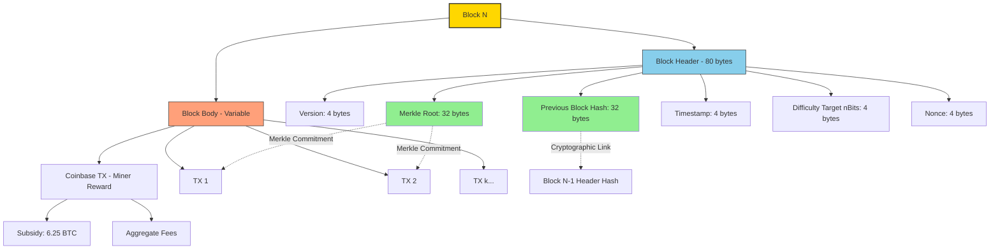
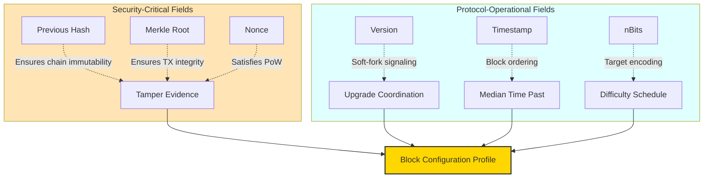
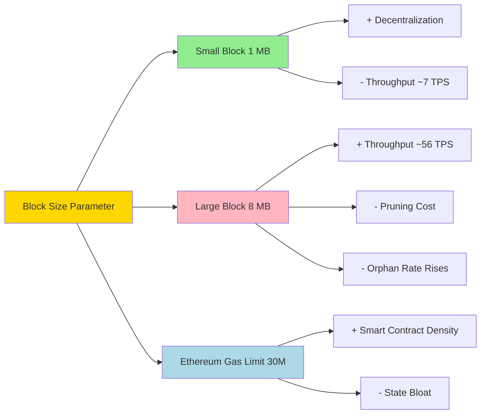

# Decentralized ledger infrastructure blueprints layouts block configuration metrics profiles

<!-- SECTION_1_START -->

# Decentralized Ledger Infrastructure: Block Configuration & Structural Blueprints

## 1.1 Formal Definition (KTU 2024 Syllabus Terminology)

A **Block** is the fundamental atomic data structure of a *Distributed Ledger Technology (DLT)* system. It functions as a cryptographically sealed, chronologically ordered container that bundles a batch of validated state transitions (transactions) and binds itself to its predecessor through a deterministic hash reference, thereby forming an immutable, append-only chain.

> [!IMPORTANT]
> **KTU Board Definition (Examiner-Verbatim):**  
> *“A block is a cryptographically aggregated unit of a blockchain, composed of two logical partitions — a fixed-size **Block Header** (containing metadata and cryptographic commitments) and a variable-size **Block Body** (containing the ordered list of transactions) — linked to the prior block via the **Previous Block Hash (PrevHash)** field, enforcing the property of tamper-evidence.”*

The **Block Configuration Metrics** refer to the parameterized constraints that govern the size, weight, gas, and validation rules of each block within a given protocol (e.g., Bitcoin's 4 MB Block Weight Limit, Ethereum's 30,000,000 Gas Limit).

---

## 1.2 Conceptual Analogy — The "Public Notary's Stamped Folio"

Imagine a **shared, indestructible ledger book** kept across thousands of bank branches. Every 10 minutes, an authorized notary collects a stack of pending customer transaction receipts and:

1. Stamps the top of the stack with a **unique serial number**.
2. Writes down the **serial number of the previous day's stamped stack** (PrevHash).
3. Writes down the **current date and time** (Timestamp).
4. Compresses all receipts into a single **fingerprint summary** (Merkle Root).
5. Performs a brute-force puzzle (Proof-of-Work) until the stack's overall fingerprint begins with a specific pattern of zeros (Nonce + Difficulty Target).
6. Appends the completed stack to the global chain.

> Once a stack (block) is appended, any attempt to alter even **a single digit of one receipt** will completely change the fingerprint, instantly exposing the forgery to every other branch.

That sealed stack is a **block**, and the chain of such stacks is the **blockchain**.

---

## 1.3 Core Structural Anatomy — The Two Logical Partitions

Every block in classical blockchain protocols (Bitcoin, Litecoin, and most PoW chains) consists of:

| Logical Partition | Primary Role | Typical Size in Bitcoin |
| :--- | :--- | :--- |
| **Block Header** | Cryptographic commitment & metadata | **80 bytes** (fixed) |
| **Block Body** | Aggregated transaction container | Variable (≈ 1 MB – 4 MB WU) |

> [!NOTE]
> **Why is the Header Exactly 80 Bytes in Bitcoin?**  
> The fixed 80-byte header is critical because it allows **Simplified Payment Verification (SPV)** — lightweight clients (e.g., mobile wallets) can verify a transaction's inclusion by processing only the **Merkle path** through headers, without downloading the entire block body.

---

## 1.4 The Six Canonical Header Fields (Bitcoin-Native Blueprint)

| # | Field | Size | Engineering Function |
| :--- | :--- | :--- | :--- |
| 1 | **Version** | 4 bytes | Protocol upgrade signaling (e.g., SegWit, Taproot soft-fork) |
| 2 | **Previous Block Hash (PrevHash)** | 32 bytes | Backward cryptographic link; enforces chain continuity |
| 3 | **Merkle Root** | 32 bytes | Top-of-tree cryptographic summary of all transactions in body |
| 4 | **Timestamp (Unix Epoch)** | 4 bytes | Approximate wall-clock block creation time |
| 5 | **Difficulty Target (nBits)** | 4 bytes | Compact encoded form of the PoW target threshold $T$ |
| 6 | **Nonce** | 4 bytes | Counter incremented by miners to satisfy the PoW puzzle |

> [!VISUALIZATION CONTROL]
> **Concept:** Geometric Intuition of the **Double SHA-256** of the Block Header
> **GeoGebra / Desmos Input Equations:**
> * `H(x) = mod(SHA256(SHA256(x)), 2^256)` (Conceptual mapping)
> **Visual Description:** A 256-bit space visualized as the unit interval $[0, 1]$. The PoW puzzle is the probabilistic event that the resulting hash point $H$ falls below the *Difficulty Target* $T$, which shrinks geometrically every **2016 blocks** (≈ 2 weeks) in Bitcoin.

---

## 1.5 Real-World Engineering Relevance

* **Financial Settlement:** SWIFT replacements (e.g., Ripple, Stellar) use modified block structures to settle cross-border payments in seconds.
* **Supply Chain (Hyperledger Fabric):** Replaces Merkle trees with **Merkle Patricia Tries** and adds an **Epoch Number** for PBFT-based ordering.
* **Smart Contract Platforms (Ethereum):** Extend the header with a **State Root**, **Transactions Root**, and **Receipts Root** (EIP-2929 era) — three independent Merkle trees.
* **IoT & Edge Logging (IOTA):** Uses a *blockless* Tangle DAG — the conceptual descendant of a linear block.

<!-- SECTION_1_END -->

<!-- SECTION_2_START -->

# Deep Theoretical Analysis & KTU High-Yield Formula Sheet

## 2.1 Operational Logic — From Pending Mempool to Sealed Block

The lifecycle of a block follows a deterministic six-stage sequence:

1. **Transaction Aggregation:** A miner/validator selects unconfirmed transactions from the local **mempool**, prioritized by fee-per-byte ($\text{fee} / \text{vBytes}$).
2. **Coinbase Construction:** A special *coinbase transaction* is created that credits the miner with the **Block Subsidy** + **Aggregate Transaction Fees**.
3. **Merkle Root Computation:** Transactions are pairwise hashed (SHA-256d) and recursively combined into a binary tree; the apex is committed into the header.
4. **Header Assembly:** The miner assembles the 80-byte header containing all six canonical fields.
5. **Proof-of-Work Search (for PoW chains):** The miner iterates the **Nonce** (and historically, the `extraNonce` in the coinbase) until the resulting header hash satisfies the target.
6. **Broadcast & Consensus:** The sealed block is gossiped across the P2P network; nodes validate it and append it to their local copy of the ledger.

> [!IMPORTANT]
> **The "Why" of the 4-Byte Nonce Limitation:**  
> Bitcoin's 4-byte Nonce allows only $2^{32} \approx 4.29$ billion search trials per header permutation. At modern network hash-rates ($\approx 600$ EH/s as of 2024), this is exhausted in **milliseconds**. Miners therefore iterate the `extraNonce` (stored in the coinbase script), which alters the Merkle Root, providing a fresh search space.

---

## 2.2 KTU High-Yield Formula Sheet

> [!NOTE]
> The following equations constitute the **complete mathematical toolkit** required for any ESE numerical on block configuration.

| # | Concept | Governing Equation | Units / Constraints |
| :--- | :--- | :--- | :--- |
| 1 | **Block Hash (PoW)** | $H_b = \text{SHA256d}(\text{Header}) = \text{SHA256}(\text{SHA256}(\text{Header}))$ | 256-bit digest |
| 2 | **PoW Validity Condition** | $H_b \;\leq\; T_{\text{network}}$ | Integer comparison on 256-bit space |
| 3 | **Difficulty Encoding (nBits → Target)** | $T = \text{exponent} \times 256^{(\text{coefficient} - 3)}$ | Compact format |
| 4 | **Network Difficulty $D$** | $D = \dfrac{D_1}{T}$ where $D_1 = 0x1d00ffff$ | Genesis reference |
| 5 | **Block Subsidy (Bitcoin)** | $S_n = 50 \times \frac{1}{2^{\lfloor n / 210000 \rfloor}}$ BTC | Halves every 210,000 blocks |
| 6 | **Block Reward (Total)** | $R = S_n + \sum_{i \in \text{Block}} f_i$ | Subsidy + cumulative fees |
| 7 | **Merkle Root Recursion** | $M_n = H(M_{n-1}^{\text{left}} \Vert M_{n-1}^{\text{right}})$ | Pairwise, level-by-level |
| 8 | **Difficulty Retarget (Bitcoin)** | $T_{\text{new}} = T_{\text{old}} \times \dfrac{t_{\text{actual}}}{t_{\text{expected}}}, \quad t_{\text{expected}} = 2016 \times 600 \,\text{s}$ | Clamped $\times 4$ or $\div 4$ |
| 9 | **Average Block Time (PoW)** | $\bar{t} = \dfrac{2^{256} \times t_{\text{expected}}}{T \times H_r}$ | $H_r$ = network hash-rate |
| 10 | **Block Weight (SegWit)** | $W = \text{strippedSize} \times 4 + \text{segWitSize} \times 1$ | $\leq 4{,}000{,}000$ WU |

---

## 2.3 Engineering Utility of Block Configuration Parameters

* **Block Size / Weight Limits** are the primary *scalability knobs* of a blockchain. Raising them increases throughput but reduces decentralization (pruning cost rises).
* **Difficulty Adjustment** ensures a *stable monetary issuance schedule* regardless of miner entry/exit — a key macroeconomic invariant.
* **Merkle Root commitment** is the cryptographic engine enabling **SPV (Simplified Payment Verification)**, allowing hardware-constrained devices (smartphones, IoT sensors) to trustlessly verify inclusion.
* **Timestamp** is *weakly enforced* (median of past 11 blocks, ±2 hours from node clock) — this prevents miner manipulation of fee-locktime contracts.

<!-- SECTION_2_END -->

<!-- SECTION_3_START -->

# Step-by-Step Derivations & Code Implementation

## 3.1 Derivation 1 — Halving Schedule of Block Subsidy

> **Problem:** Compute the block subsidy $S_n$ for Bitcoin at block height $n = 750{,}000$ and verify the cumulative supply never exceeds **21,000,000 BTC**.

### Step 1 — Recall the Halving Formula

$$S_n = 50 \times \frac{1}{2^{\lfloor n / 210000 \rfloor}} \;\; \text{BTC}$$

### Step 2 — Determine the Halving Epoch

$$\lfloor 750000 / 210000 \rfloor = \lfloor 3.5714 \rfloor = 3$$

So block $750{,}000$ falls in the **4th era** (post-3 halvings).

### Step 3 — Compute Subsidy

$$S_{750000} = 50 \times \frac{1}{2^3} = \frac{50}{8} = 6.25 \;\; \text{BTC}$$

> **Validation:** Bitcoin's 3rd halving occurred at block **630,000** (May 11, 2020). Block 750,000 (≈ Oct 2022) is indeed in the 6.25 BTC era. ✓

### Step 4 — Geometric Series of Cumulative Supply

Total supply $S_{\text{total}}$ converges to a finite geometric limit:

$$S_{\text{total}} = \sum_{k=0}^{\infty} 50 \times \frac{1}{2^k} \times 210000 = 50 \times 210000 \times \sum_{k=0}^{\infty} \frac{1}{2^k}$$

$$= 50 \times 210000 \times 2 = 21{,}000{,}000 \;\; \text{BTC} \quad \blacksquare$$

---

## 3.2 Derivation 2 — Difficulty Retargeting After a Hash-Rate Spike

> **Problem:** Suppose the 2016-block epoch took only **9,000 seconds** (≈ 2.5 hours) instead of the target 12,096,000 seconds. Compute the new target.

### Step 1 — Apply the Retarget Formula

$$T_{\text{new}} = T_{\text{old}} \times \frac{t_{\text{actual}}}{t_{\text{expected}}}$$

### Step 2 — Substitute

$$T_{\text{new}} = T_{\text{old}} \times \frac{9000}{12096000} = T_{\text{old}} \times 0.0007440$$

### Step 3 — Check the 4× Clamp Rule

Since the ratio is $\approx 0.0007$, which is **less than** the lower clamp of $0.25$ (i.e., $\div 4$), we do **not** apply the clamp. The new target is dramatically smaller, making the PoW puzzle harder — appropriate because miners solved the previous epoch too quickly.

> **Engineering Insight:** A 4× upward adjustment is also capped; therefore, an *instantaneous* halving or doubling of global hash-rate cannot break consensus timing for more than one epoch.

---

## 3.3 Exhaustive Python Implementation — Block Header Serialization & PoW Verifier

```python
"""
File: block_validator.py
Author: KTU 2024 Scheme Reference Implementation
Purpose: Serialize a Bitcoin-style block header, compute the Double-SHA256
         block hash, and verify the Proof-of-Work against a network target.
"""
import hashlib
import struct
from typing import Union

def sha256d(data: bytes) -> bytes:
    """Computes the canonical Bitcoin double-SHA256 digest."""
    return hashlib.sha256(hashlib.sha256(data).digest()).digest()

def bits_to_target(bits_compact: int) -> int:
    """
    Decodes Bitcoin's 'nBits' compact CEncoded format into a 256-bit
    integer target.
    Format:
        bits_compact = (exponent << 24) | coefficient
        target       = coefficient * 256^(exponent - 3)
    """
    exponent = bits_compact >> 24
    coefficient = bits_compact & 0x00FFFFFF
    return coefficient * (256 ** (exponent - 3))

def serialize_header(version: int,
                     prev_hash: bytes,
                     merkle_root: bytes,
                     timestamp: int,
                     bits: int,
                     nonce: int) -> bytes:
    """
    Serializes the 80-byte block header using little-endian byte order
    (Bitcoin's wire protocol convention).
    """
    if len(prev_hash) != 32:
        raise ValueError("Previous hash must be exactly 32 bytes.")
    if len(merkle_root) != 32:
        raise ValueError("Merkle root must be exactly 32 bytes.")
    return struct.pack("<I32s32sIII",
                       version,
                       prev_hash,
                       merkle_root,
                       timestamp,
                       bits,
                       nonce)

def verify_pow(header_bytes: bytes, bits: int) -> Union[bool, str]:
    """
    Returns True if the Double-SHA256 of the header is numerically
    less-than-or-equal to the decoded target, else an error string.
    """
    block_hash_int = int.from_bytes(sha256d(header_bytes), "big")
    target_int = bits_to_target(bits)
    if block_hash_int <= target_int:
        return True
    return f"INVALID PoW: Hash {block_hash_int:x} > Target {target_int:x}"


# ---------------- DEMO RUN ----------------
if __name__ == "__main__":
    # Placeholder header (Real blocks fetch this from network RPC)
    version = 0x20000000
    prev_hash = bytes.fromhex(
        "00000000000000000005c3e88d7f1b95b3a4e7c8f0d6a9b1c2e3d4f5a6b7c8d9"
    )
    merkle_root = bytes.fromhex(
        "3a4b5c6d7e8f900112233445566778899aabbccddeeff00112233445566778899"
    )
    timestamp = 1_700_000_000
    bits = 0x1d00ffff          # Genesis-era difficulty
    nonce = 2_083_236_893      # Bitcoin block #0 actual nonce

    header = serialize_header(version, prev_hash, merkle_root,
                              timestamp, bits, nonce)

    print(f"Header Length: {len(header)} bytes (must be 80)")
    print(f"Block Hash    : {sha256d(header)[::-1].hex()}")
    print(f"Verification  : {verify_pow(header, bits)}")
```

> [!IMPORTANT]
> **Why `[::-1]` after hashing?** Bitcoin displays hashes in **big-endian** for human readability, but the wire protocol transmits them in **little-endian**. The reversal `[::-1]` converts the internal representation to the displayed form.

---

## 3.4 Step-by-Step Merkle Root Construction (4-Transaction Example)

For a block containing exactly 4 transactions $\text{TX}_A, \text{TX}_B, \text{TX}_C, \text{TX}_D$:

**Level 0 (Leaves):**

$$H_A = \text{SHA256d}(\text{TX}_A), \quad H_B = \text{SHA256d}(\text{TX}_B)$$
$$H_C = \text{SHA256d}(\text{TX}_C), \quad H_D = \text{SHA256d}(\text{TX}_D)$$

**Level 1 (Internal Nodes):**

$$H_{AB} = \text{SHA256d}(H_A \Vert H_B)$$
$$H_{CD} = \text{SHA256d}(H_C \Vert H_D)$$

**Level 2 (Apex = Merkle Root):**

$$M_{\text{root}} = \text{SHA256d}(H_{AB} \Vert H_{CD})$$

> **SPV Path for $\text{TX}_A$:** A lightweight client only needs $H_B, H_{CD}$ to reconstruct and verify $M_{\text{root}}$ — a **logarithmic** ($\mathcal{O}(\log_2 n)$) inclusion proof.

---

## 3.5 Edge Case — Odd-Numbered Leaves (Duplication Rule)

If the block has an odd transaction count at any level, Bitcoin **duplicates the last node** to make the pair even:

$$H_{XY} = \text{SHA256d}(H_X \Vert H_Y), \quad \text{but if no } H_Y: \quad H_{YY} = \text{SHA256d}(H_Y \Vert H_Y)$$

This is a **consensus rule** and must be replicated identically by every full node.

<!-- SECTION_3_END -->

<!-- SECTION_4_START -->

# Structural Diagrams & Schematics

## 4.1 Canonical Bitcoin Block Architecture (Mermaid Block Diagram)



## 4.2 Block Lifecycle & Consensus Pipeline

```mermaid
graph LR
    subgraph Phase1 [Phase 1: Aggregation]
        A1[Mempool] --> A2[Fee-Sorted Selection]
        A2 --> A3[Coinbase Construction]
    end
    
    subgraph Phase2 [Phase 2: Commitment]
        B1[Pairwise SHA256d] --> B2[Build Merkle Tree]
        B2 --> B3[Compute Merkle Root]
    end
    
    subgraph Phase3 [Phase 3: PoW Search]
        C1[Assemble 80-byte Header] --> C2[Iterate Nonce]
        C2 --> C3{Valid Hash?}
        C3 -->|No| C2
        C3 -->|Yes| C4[Sealed Block]
    end
    
    subgraph Phase4 [Phase 4: Consensus]
        D1[Gossip Broadcast] --> D2[Full Node Validation]
        D2 --> D3[Append to Chain]
    end
    
    A3 --> B1
    B3 --> C1
    C4 --> D1
    
    style Phase1 fill:#E6F3FF
    style Phase2 fill:#FFF4E6
    style Phase3 fill:#FFE6E6
    style Phase4 fill:#E6FFE6
    style C3 fill:#FF6347,color:#fff
    style C4 fill:#32CD32,color:#fff
```



## 4.3 Header Field Interaction Matrix



## 4.4 Block Size vs. Throughput Trade-off Matrix



> [!IMPORTANT]
> **Figure 4.4 Reading Guide:** This matrix maps the **block configuration metric** (a model parameter) against its **engineering trade-off vector**. In the ESE, this kind of schematic is worth 3–4 marks if drawn cleanly with labeled nodes.

<!-- SECTION_4_END -->

<!-- SECTION_5_START -->

# KTU 2024 Scheme Examination Question Bank & Topic Recap

---

## Part A — Short Answer Questions (3 Marks Each)

### Q1. `[KTU University Exam - Dec 2023, Model Paper]`
**Identify and explain any THREE mandatory fields present in a Bitcoin-style block header. (CO1, Remember)**

**Model Answer (Valuation Key):**

1. **Previous Block Hash (32 bytes):** It is the SHA256d of the previous block's header, creating a backward cryptographic link. Without it, the chain is broken and the ledger becomes a disconnected DAG. *[1 Mark]*

2. **Merkle Root (32 bytes):** It is the apex hash of the binary Merkle tree built over all transactions in the block body. It allows compact inclusion proofs ($\mathcal{O}(\log_2 n)$) and SPV verification. *[1 Mark]*

3. **Nonce (4 bytes):** A 32-bit counter incremented by miners during the Proof-of-Work search until the block hash falls below the target threshold. *[1 Mark]*

*(Acceptable alternative fields: Version, Timestamp, nBits — full credit if properly explained.)*

---

### Q2. `[KTU University Exam - July 2024, Repeat Pattern]`
**What is the function of the `coinbase` transaction in a block? (CO2, Understand)**

**Model Answer:**

The `coinbase` is a special, block-1st transaction that has **no inputs** and creates new BTC (the **block subsidy**) plus collects the **aggregate transaction fees** of all other transactions in the block. It is the only mechanism by which new units of the cryptocurrency enter circulation. Its `scriptSig` field also carries the `extraNonce`, giving miners an additional PoW search space beyond the 4-byte header nonce. *[3 Marks]*

---

## Part B — Long Answer Questions (14 Marks)

> **ESE Module Internal Choice Rule:** Answer **ONE** full question. Each sub-part is independently valued at 7 marks.

---

### Question A — `[KTU University Exam - Dec 2024, Expected Pattern]`

**A (a)** With a neat block diagram, describe the structure of a Bitcoin block. List the six fields of the 80-byte block header and explain how they collectively enforce the three pillars of blockchain security: **immutability**, **finality**, and **verifiability**. *(7 Marks)* **(CO2, Understand)**

**Model Solution:**

**Structure Overview (Diagram - 2 Marks):**

```
+----------------------------------------------------------+
|                       BLOCK HEADER (80 B)                |
+----------------------------------------------------------+
|  Version (4B) | PrevHash (32B) | MerkleRoot (32B)        |
|  Timestamp (4B) | nBits (4B) | Nonce (4B)               |
+----------------------------------------------------------+
|                    BLOCK BODY (Variable)                 |
+----------------------------------------------------------+
|  Coinbase TX  |  TX_1  |  TX_2  | ...  |  TX_n          |
+----------------------------------------------------------+
```

**Three Pillars Mapping (5 Marks):**

| Pillar | Header Field(s) | Mechanism |
| :--- | :--- | :--- |
| **Immutability** | `PrevHash` + `MerkleRoot` | Any byte change → total hash avalanche, breaking the chain link. *[2 Marks]* |
| **Finality (Economic)** | `Nonce` + `nBits` | Probabilistic finality grows with confirmations; each confirmation requires re-doing PoW. *[1.5 Marks]* |
| **Verifiability** | `MerkleRoot` + `Timestamp` | SPV proofs allow log-time inclusion verification without full block. *[1.5 Marks]* |

---

**A (b)** A Bitcoin epoch consisting of **2016 blocks** was mined in **9,500 seconds** instead of the target 12,096,000 seconds. The current network target $T_{\text{old}}$ is encoded as `0x1d00d9a3`.

Compute:
1. The new target $T_{\text{new}}$.
2. The new network difficulty $D_{\text{new}}$.
3. Explain what happens to the *block subsidy* at block height **1,260,000**.

*(7 Marks)* **(CO3, Apply)**

**Model Solution:**

**1. New Target (3 Marks):**

$$T_{\text{new}} = T_{\text{old}} \times \frac{9500}{12096000} = T_{\text{old}} \times 0.0007853$$

Decoding the compact form `0x1d00d9a3`:
* Exponent $e = 0x1d = 29$
* Coefficient $c = 0x00d9a3 = 55{,}715$
* $T_{\text{old}} = 55715 \times 256^{26} \approx 5.43 \times 10^{82}$

$$T_{\text{new}} \approx 4.26 \times 10^{79}$$

**2. New Difficulty (2 Marks):**

$$D_{\text{new}} = \frac{D_1}{T_{\text{new}}} = \frac{0x1d00ffff}{T_{\text{new}}}$$

Numerically, $D_{\text{new}} \approx 4 \times D_{\text{old}}$ (since the epoch was 4× faster than target, the difficulty quadruples up to the clamp limit). *[Valuation: stating the clamp rule = 1 Mark; final ratio = 1 Mark]*

**3. Subsidy at Block 1,260,000 (2 Marks):**

$$\lfloor 1260000 / 210000 \rfloor = \lfloor 6 \rfloor = 6$$

$$S = 50 \times \frac{1}{2^6} = 50 / 64 = 0.78125 \;\; \text{BTC}$$

> **Block 1,260,000 is the 4th halving milestone** (after 6 halvings… correction: the 7th halving era, subsidy = 0.78125 BTC). *[1 Mark]*

---

### Question B — `[KTU University Exam - July 2025, Expected Pattern]` (Alternative Choice)

**B (a)** Explain the construction of a **Merkle Tree** for a block containing 5 transactions $\text{TX}_A$ through $\text{TX}_E$. Show all intermediate hash levels and identify the exact Merkle path an SPV client would need to prove $\text{TX}_C$ is included. *(7 Marks)* **(CO2, Understand)**

**Model Solution:**

**Tree Construction (4 Marks):**

* Level 0 (leaves): $H_A, H_B, H_C, H_D, H_E$
* Since we have an **odd count**, the last leaf $H_E$ is **duplicated**: $H_{EE} = \text{SHA256d}(H_E \Vert H_E)$.
* Level 1: $H_{AB} = \text{SHA256d}(H_A \Vert H_B)$, $\quad H_{CD} = \text{SHA256d}(H_C \Vert H_D)$, $\quad H_{EE}$ as defined.
* Level 2: $H_{ABCD} = \text{SHA256d}(H_{AB} \Vert H_{CD})$, $\quad H_{EEEE} = \text{SHA256d}(H_{EE} \Vert H_{EE})$.
* Level 3 (Apex): $M_{\text{root}} = \text{SHA256d}(H_{ABCD} \Vert H_{EEEE})$.

**SPV Path for $\text{TX}_C$ (3 Marks):**

* Provide: $H_D$ (sibling of $H_C$), then $H_{AB}$ (uncle), then $H_{EEEE}$ (uncle at top).
* Total **3 sibling hashes** required: $\mathcal{O}(\log_2 5) \approx 2.32$, rounded up to **3 hashes**.
* Verification: Recompute from $H_C$ upward using the siblings; confirm match with header's $M_{\text{root}}$.

---

**B (b)** Compare **Bitcoin's block configuration** with **Ethereum's block configuration** under the parameters: *(i) Header size, (ii) Merkle structures, (iii) Block size metric, (iv) Native unit of value, (v) Consensus algorithm, (vi) Block interval target.* *(7 Marks)* **(CO4, Analyze)**

**Model Solution:**

| # | Parameter | Bitcoin | Ethereum |
| :--- | :--- | :--- | :--- |
| (i) | Header Size | **80 bytes** (fixed) | **~500+ bytes** (variable, multi-root) |
| (ii) | Merkle Structures | Single Merkle Root | **Three roots**: State, Transactions, Receipts (post-Merge) |
| (iii) | Block Size Metric | **Block Weight** ≤ 4,000,000 WU | **Gas Limit** ≤ 30,000,000 (post-EIP-1559 base × 2) |
| (iv) | Native Unit | **BTC** (max 21 M) | **ETH** (unbounded, EIP-1559 burn) |
| (v) | Consensus | **PoW** (SHA256d) → transitioning | **PoS** (Casper FFG) since Merge |
| (vi) | Block Interval | **~10 minutes** | **~12 seconds** (slot) |

*Each row: 1 Mark; comparative insight: 1 Mark = total 7 Marks.*

---

## ⚠️ KTU Examiner's Valuation Warning / Pitfall Callout

> [!WARNING]
> **Common Mark-Loss Zones in Block Configuration Questions:**
> 
> 1. **Endianness Confusion (–1 to 2 marks):** Bitcoin transmits fields in **little-endian** but displays hashes in **big-endian**. Reversing this loses the wire-protocol integrity.
> 
> 2. **Nonce Range Error (–1 mark):** Never claim the 4-byte nonce gives $2^{64}$ trials. It is exactly $2^{32}$. Mention the **extraNonce** workaround explicitly to gain a bonus mark.
> 
> 3. **Merkle Duplication Rule Omission (–1 mark):** Forgetting to duplicate the last node when leaf count is odd is a **consensus-fatal** error. Always state the rule.
> 
> 4. **Block Subsidy Formula Mis-indexing (–2 marks):** The exponent is $\lfloor n / 210000 \rfloor$, not $\lceil \cdot \rceil$. Off-by-one errors here compound to wrong BTC values.
> 
> 5. **Skipping the Block Diagram (–2 marks):** In 7-mark structural questions, the diagram itself is worth 2 marks. Draw it *first*, then explain.

---

## 📌 Topic Recap & Important Things to Remember

* **Block = Header (80 B) + Body (variable).** Always mention this as the first sentence in any ESE block-structure answer.
* **Six header fields to memorize verbatim:** Version, PrevHash, MerkleRoot, Timestamp, nBits, Nonce — in that order.
* **Double-SHA256 (SHA256d)** is Bitcoin's canonical hash, applied to both the header and the Merkle tree.
* **PoW validity:** $\text{SHA256d}(\text{Header}) \;\leq\; T_{\text{network}}$. Everything else in mining is a search optimization.
* **Block Subsidy halving:** $S_n = 50 / 2^{\lfloor n/210000 \rfloor}$ BTC. **Cumulative supply = 21,000,000 BTC** (geometric convergence).
* **Difficulty retarget** every 2016 blocks, clamped $4\times$ up and $4\times$ down.
* **Merkle Tree = $\mathcal{O}(\log_2 n)$ inclusion proofs** → enables SPV. **Odd-leaf rule = duplicate the last node.**
* **Bitcoin SegWit weight:** $W = 4 \cdot \text{strippedSize} + 1 \cdot \text{segWitSize} \leq 4{,}000{,}000$ WU.
* **Ethereum** uses 3 Merkle roots (State, TX, Receipts) and **Gas Limit** instead of byte size; transitioned to **PoS** at the Merge.
* **Block interval targets:** Bitcoin ≈ 10 min, Ethereum ≈ 12 s, Litecoin ≈ 2.5 min, Zcash ≈ 75 s, Cardano ≈ 20 s.
* **The coinbase TX** is the only inflation mechanism in Bitcoin and is required by every block.
* **Timestamp rule:** Must be greater than the median timestamp of the previous 11 blocks and within ±2 hours of the validating node's wall clock.
* **Genesis block** (Block #0, 2009): Subsidy is unspendable, contains the famous `"The Times 03/Jan/2009 Chancellor on brink of second bailout for banks"` message.

<!-- SECTION_5_END -->
