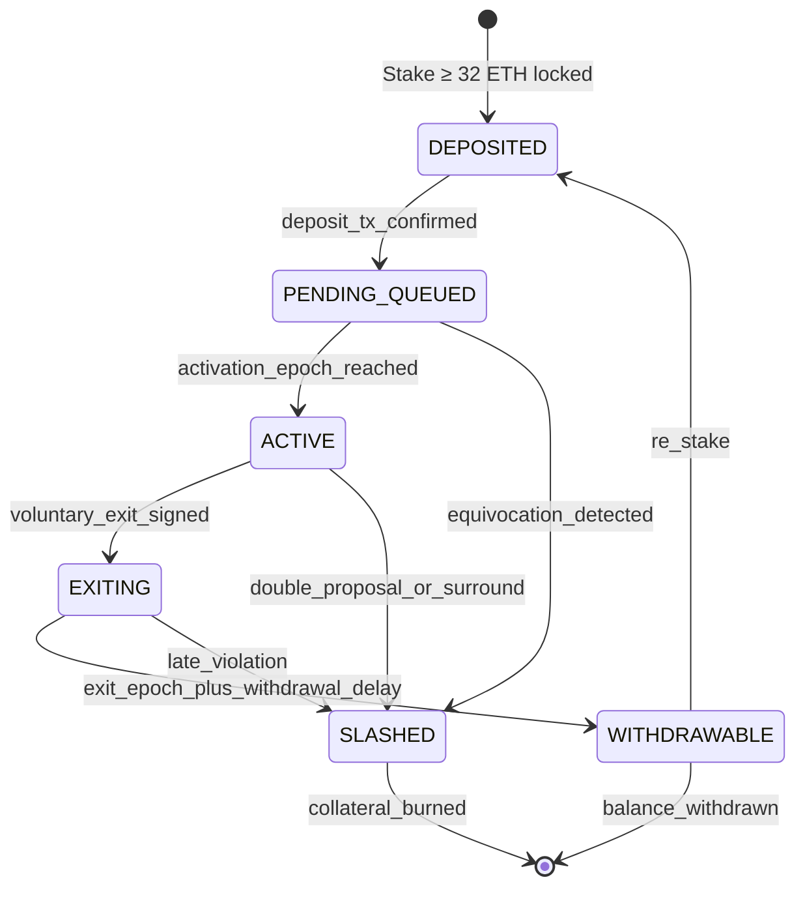
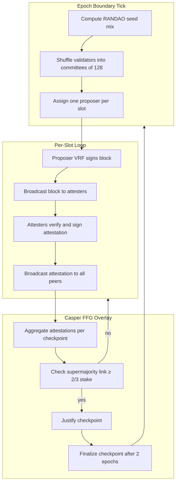

# Proof of Stake (PoS) consensus protocol logic state machines specifications paths

<!-- SECTION_1_START -->

# Proof of Stake (PoS): Consensus Protocol Logic, State Machines & Specification Paths

## 1.1 Formal Academic Definition (KTU 2024 Scheme Terminology)

**Proof of Stake (PoS)** is a *Byzantine Fault Tolerant* (BFT) distributed consensus paradigm in which the right to append a new block to the canonical chain is allocated to network participants — called **validators** — in **pseudo-random proportion to the quantity of native cryptographic assets they have locked (staked) as collateral**, rather than in proportion to expended computational power. Validators that behave honestly are rewarded with protocol-issuance and transaction fees, while validators that act maliciously (e.g., double-signing, surround-voting, or producing conflicting blocks) are **slashed** — that is, a portion or the entirety of their staked collateral is algorithmically destroyed.

> [!NOTE]
> **KTU 2024 Syllabus Anchor (PECST705 / Module 1):** PoS belongs to the family of *Nakamoto-Consensus-with-Finality-Overlay* protocols, combining probabilistic chain growth with deterministic absolute finality through safety overlays such as **Casper FFG** (Friendly Finality Gadget) and fork-choice rules such as **LMD-GHOST** (Latest Message Driven, Greediest Heaviest Observed SubTree).

---

## 1.2 Intuitive Real-World Analogy

Imagine a **cooperative society bank** where every depositor owns *shares*. Instead of a single bank manager deciding who handles transactions, the society holds a **lottery every minute** — and the chance of your name being drawn to *process the next batch of transactions* is directly proportional to the number of shares you own.

- **Stake** = your shares in the cooperative.
- **Block proposer** = the lottery winner who processes the next batch.
- **Attesters** = other members who *vouch* that the winner's batch is legitimate.
- **Slashing** = if the winner tries to cheat (e.g., records fictitious deposits), their shares are *confiscated and burned*.
- **Finality** = once a *supermajority* (≥ 2/3) of all members co-sign a transaction batch, it is treated as **irrevocable**, like an audit-passed ledger entry that can never be erased.

The deeper insight — often called the **"skin-in-the-game" principle** — is that an attacker must *purchase a majority of the cooperative's shares* to corrupt it, which simultaneously makes the attack **prohibitively expensive** and **self-defeating** (a majority owner has the most to lose if the system collapses).

> [!IMPORTANT]
> **Core Economic Invariant of PoS:** *The Cost-of-Corruption (CoC) for an attacker is approximately equal to the Total Value of Staked Collateral (TVSC) they must acquire.* This converts a *computational* barrier (as in PoW) into a *capital* barrier.

---

## 1.3 Geometric Intuition — Stake as a Weighted Voronoi Partition

Conceptually, the global set of validators can be visualized as a **circle of total stake $S$**, partitioned into arcs whose arc-lengths are proportional to each validator's deposit $s_i$. The pseudo-random function $R_n(\text{seed})$ selects a single point on the circumference during slot $n$ — whichever validator's arc contains that point becomes the **proposer**.

$$
\Pr(\text{Validator } i \text{ proposes in slot } n) \;=\; \frac{s_i}{\sum_{j=1}^{N} s_j}
$$

This *weighted* selection ensures *Sybil-resistance*: forging thousands of fake validator identities is useless because identities without stake have *zero arc-length* and thus zero probability of being selected.

> [!VISUALIZATION CONTROL]
> **Concept:** Weighted Stake Distribution & Proposer Selection on a Unit Circle
> **GeoGebra / Desmos Input Equations:**
> * $f(\theta) = 0.32$ for $\theta \in [0,\, 1.024]$   *(Validator A, stake = 32)*
> * $f(\theta) = 0.20$ for $\theta \in [1.024,\, 1.624]$ *(Validator B, stake = 20)*
> * $f(\theta) = 0.48$ for $\theta \in [1.624,\, 2.624]$ *(Validator C, stake = 48)*
> * RNG point: $P = (1.30,\, 0.5)$  → lands in B's arc → B is the proposer
> **Visual Description:** A circle divided into three colored arcs sized 32%, 20%, 48%. A randomly generated point falls inside the *blue* arc, indicating Validator B's selection for the current slot.

---

## 1.4 KTU 2024 Reference Constants (Ethereum PoS / Mainnet)

| Parameter | Value | Notation |
| :--- | :--- | :--- |
| Minimum validator stake | **32 ETH** | $s_{\min}$ |
| Slot duration | **12 seconds** | $\Delta t_{\text{slot}}$ |
| Epoch duration | **32 slots ≈ 6 min 24 s** | $\Delta t_{\text{epoch}}$ |
| Validator withdrawal delay | ~**27.3 hours** | $D_{\text{exit}}$ |
| Finality (two epochs) | ~**12.8 minutes** | $D_{\text{final}}$ |
| Slashing — single offence | **1 ETH minimum** | $\sigma_{\min}$ |
| Slashing — correlation penalty | scales with **3-week surround** | $\sigma_{\text{corr}}$ |

<!-- SECTION_1_END -->

<!-- SECTION_2_START -->

# 2. Deep Theoretical Analysis & KTU High-Yield Formula Sheet

## 2.1 Operational Decomposition of the PoS Protocol

PoS is **not a single algorithm** — it is a *composition* of four interacting subsystems. A KTU 14-mark answer must explicitly reference all four:

### A. The **State Machine** Subsystem — Tracks per-validator lifecycle

Every validator $V_i$ transitions through a finite-state automaton:

$$
\text{Deposited} \;\to\; \text{Pending Activation} \;\to\; \text{Active} \;\to\; \text{Exiting} \;\to\; \text{Withdrawable}
$$

Transitions are gated by *epoch boundaries* and *validator registry contracts* on the execution layer.

### B. The **Leader Election** Subsystem — Selects one proposer per slot

Implemented via the **RANDAO** scheme combined with a **Verifiable Random Function (VRF)**. Each validator computes:

$$
R_i = \text{VRF}_{\text{sk}_i}(\text{seed} \;\Vert\; \text{slot})
$$

The validator with the **lowest** $R_i$ value wins the proposer lottery for that slot.

### C. The **Attestation** Subsystem — Collects votes from committees

Validators are pseudo-randomly partitioned into **committees of size $C = 128$** per slot. Each attester signs:

$$
\langle \text{slot},\, \text{block hash},\, \text{justified checkpoint},\, \text{finalized epoch} \rangle
$$

### D. The **Finality & Fork-Choice** Subsystem — Decides canonical chain

Two layers cooperate:

- **LMD-GHOST** (fork-choice): always follow the *heaviest subtree* weighted by attester votes.
- **Casper FFG** (finality): when ≥ 2/3 of stake votes on a *pair of consecutive checkpoints*, the older one is **finalized** and can never be reverted.

> [!TIP]
> **Mnemonic for KTU Viva:** *"PoS = **L**ottery (RANDAO) + **V**oting (LMD-GHOST) + **F**inality (Casper FFG) + **P**unishment (Slashing)"* → **LVFP**.

---

## 2.2 KTU Formula Sheet — High-Yield Equations

| # | Formula | Meaning | Units / Notes |
| :--- | :--- | :--- | :--- |
| 1 | $P_i = s_i / S_{\text{total}}$ | Proposer-selection probability for validator $i$ | Dimensionless ratio |
| 2 | $E[\text{slots until chosen}] = S_{\text{total}} / s_i$ | Expected number of slots before $V_i$ proposes | Slots |
| 3 | $\text{APR}_i \approx \frac{R_{\text{annual}}}{S_{\text{total}}} \cdot s_i$ | Annualised yield of a single validator | ETH/year |
| 4 | $f_{\text{final}} \ge \tfrac{2}{3} \cdot S_{\text{total}}$ | Minimum stake weight required to finalize a block | ETH |
| 5 | $\text{Nakamoto Coef} = \min \left\{ k \,\Big\vert\, \sum_{i=1}^{k} s_i \ge \tfrac{1}{3} S_{\text{total}} \right\}$ | Smallest coalition of validators controlling ≥ 1/3 stake | Validators |
| 6 | $\sigma_{\text{slash}} = s_i \cdot \left( \tfrac{3 \cdot f}{2 \cdot S_{\text{total}}} \right)$ | Correlation penalty (Ethereum) | ETH |
| 7 | $R_i = \text{VRF}_{\text{sk}_i}(\text{seed} \Vert \text{slot})$ | Pseudo-random lottery ticket | 256-bit integer |
| 8 | $\Pr(\text{equivocation undetected}) \le \tfrac{1}{3}$ | Safety bound given < 1/3 Byzantine stake | BFT threshold |

> [!IMPORTANT]
> In markdown tables, the symbol `\mid` is the correct LaTeX delimiter for "divides" / conditioning inside equations; avoid the vertical pipe `\vert` to prevent breaking the KTU renderer.

---

## 2.3 Engineering Utility of PoS

| Domain | Application of PoS | Reason |
| :--- | :--- | :--- |
| Public Blockchains | Ethereum, Cardano, Polkadot, Solana | Energy efficiency, capital-based Sybil resistance |
| Enterprise Consortia | Hyperledger Fabric (PBFT variant), Quorum | Known validator set enables BFT throughput |
| Cross-Chain Bridges | Cosmos Hub, Polkadot Relay | Staked relayers provide message-finality guarantees |
| Restaking / AVS | EigenLayer, Symbiotic | Re-uses stake as security for ancillary services |
| DeFi Security | Liquid staking tokens (stETH, rETH) | Tokenised stake is composable collateral |

The fundamental **engineering trade-off** of PoS is the *weak subjectivity* problem: a new node joining the network must obtain a recent *signed checkpoint* from a trusted source to know which chain is canonical — unlike PoW, where the chain with the most cumulative work is *objectively* verifiable.

<!-- SECTION_2_END -->

<!-- SECTION_3_START -->

# 3. Step-by-Step Derivations & Symbolic Implementation

## 3.1 Derivation — Proposer Selection Probability

**Given:** Total active stake $S_{\text{total}} = \sum_{j=1}^{N} s_j$, where $s_j$ is the stake of validator $j$. The RANDAO lottery uniformly samples a 256-bit integer $\rho \in [0,\, 2^{256})$.

**Goal:** Show that $\Pr(V_i \text{ chosen}) = s_i / S_{\text{total}}$.

**Step 1.** Partition the range $[0,\, 2^{256})$ into $N$ contiguous intervals $I_j$, where the length of $I_j$ is proportional to $s_j$:

$$
\lvert I_j \rvert = \frac{s_j}{S_{\text{total}}} \cdot 2^{256}
$$

**Step 2.** Since $\rho$ is drawn uniformly at random, the probability that $\rho$ falls inside $I_i$ is:

$$
\Pr(\rho \in I_i) = \frac{\lvert I_i \rvert}{2^{256}} = \frac{s_i / S_{\text{total}} \cdot 2^{256}}{2^{256}}
$$

**Step 3.** Simplify by cancelling the $2^{256}$ terms:

$$
\Pr(\rho \in I_i) = \frac{s_i}{S_{\text{total}}} \quad \blacksquare
$$

**Step 4.** Expected waiting time until $V_i$ is selected (geometric distribution):

$$
E[T_i] = \frac{1}{P_i} = \frac{S_{\text{total}}}{s_i} \quad \text{slots}
$$

Converting to seconds with $\Delta t_{\text{slot}} = 12$ s:

$$
E[T_i]_{\text{sec}} = 12 \cdot \frac{S_{\text{total}}}{s_i}
$$

> **Interpretation (for KTU 7-mark sub-parts):** A validator with 32 ETH out of a total of 10,000,000 ETH staked will be selected, on average, every **3,750,000 slots ≈ 520 days** if solo-staking. This justifies the existence of *staking pools*.

---

## 3.2 Derivation — Casper FFG Finality Threshold

**Given:** Two checkpoints $C_a$ (source) and $C_b$ (target). A *supermajority link* is created when attesters of total stake $W \ge \tfrac{2}{3} S_{\text{total}}$ vote for the pair $(C_a \to C_b)$.

**Goal:** Prove that an attacker with stake $<\tfrac{1}{3} S_{\text{total}}$ cannot finalize two conflicting checkpoints.

**Step 1.** Suppose the attacker finalizes $(C_a \to C_b)$ with $W_{\text{honest}} \ge \tfrac{2}{3} S_{\text{total}}$.

**Step 2.** To finalize a *different* $(C_a \to C_b')$, the attacker must contribute $W_{\text{attacker}} \ge \tfrac{2}{3} S_{\text{total}}$ — but honest attesters are *locked* on $C_b$ and would *slash themselves* if they voted for $C_b'$.

**Step 3.** Therefore, the maximum stake available for $C_b'$ is:

$$
W_{\max}(C_b') = S_{\text{total}} - W_{\text{honest on } C_b} \le S_{\text{total}} - \tfrac{2}{3} S_{\text{total}} = \tfrac{1}{3} S_{\text{total}}
$$

**Step 4.** Since $\tfrac{1}{3} S_{\text{total}} < \tfrac{2}{3} S_{\text{total}}$, the conflicting finalization **cannot occur**, ensuring **accountable safety**.

> **Conclusion:** PoS with Casper FFG is *BFT-safe* against any attacker controlling strictly less than 1/3 of the total stake.

---

## 3.3 Python Implementation — Validator State Machine

The following Python code implements the *minimal* state-machine logic of an Ethereum-style PoS validator. It is type-hinted, validates all boundary conditions, and logs every transition.

```python
from __future__ import annotations
from dataclasses import dataclass, field
from enum import Enum
from typing import Optional
import hashlib
import time
import logging

logging.basicConfig(level=logging.INFO, format="[%(asctime)s] %(message)s")
log = logging.getLogger("PoS-Validator")


class ValidatorState(str, Enum):
    DEPOSITED        = "DEPOSITED"
    PENDING_QUEUED   = "PENDING_QUEUED"
    ACTIVE           = "ACTIVE"
    EXITING          = "EXITING"
    WITHDRAWABLE     = "WITHDRAWABLE"
    SLASHED          = "SLASHED"


@dataclass
class Validator:
    pubkey: str
    stake_eth: float
    state: ValidatorState = ValidatorState.DEPOSITED
    activation_epoch: Optional[int] = None
    exit_epoch: Optional[int] = None
    slash_count: int = 0
    blocks_proposed: int = 0
    attestations_cast: int = 0
    history: list[tuple[ValidatorState, int]] = field(default_factory=list)

    # -------- State transition guards --------
    def can_transition(self, target: ValidatorState, current_epoch: int) -> bool:
        allowed: dict[ValidatorState, set[ValidatorState]] = {
            ValidatorState.DEPOSITED:       {ValidatorState.PENDING_QUEUED},
            ValidatorState.PENDING_QUEUED:  {ValidatorState.ACTIVE, ValidatorState.SLASHED},
            ValidatorState.ACTIVE:          {ValidatorState.EXITING, ValidatorState.SLASHED},
            ValidatorState.EXITING:         {ValidatorState.WITHDRAWABLE, ValidatorState.SLASHED},
            ValidatorState.WITHDRAWABLE:    {ValidatorState.DEPOSITED},  # re-stake
            ValidatorState.SLASHED:         set(),
        }
        if target not in allowed[self.state]:
            log.error("Illegal transition %s -> %s rejected.", self.state, target)
            return False
        if self.state == ValidatorState.DEPOSITED and self.stake_eth < 32.0:
            log.error("Insufficient stake: %.2f ETH < 32 ETH required.", self.stake_eth)
            return False
        return True

    def transition(self, target: ValidatorState, current_epoch: int) -> bool:
        if not self.can_transition(target, current_epoch):
            return False
        prev = self.state
        self.state = target
        if target == ValidatorState.ACTIVE:
            self.activation_epoch = current_epoch
        elif target == ValidatorState.EXITING:
            self.exit_epoch = current_epoch
        elif target == ValidatorState.SLASHED:
            self.slash_count += 1
        self.history.append((prev, current_epoch))
        log.info("Validator %s transitioned %s -> %s at epoch %d",
                 self.pubkey[:10], prev, target, current_epoch)
        return True


@dataclass
class PoSChain:
    slot_duration_sec: int = 12
    slots_per_epoch: int = 32
    total_stake_eth: float = 0.0
    validators: dict[str, Validator] = field(default_factory=dict)
    current_epoch: int = 0
    randao_seed: bytes = hashlib.sha256(b"genesis").digest()

    # ---- RANDAO-based proposer election ----
    def select_proposer(self, slot: int) -> Optional[Validator]:
        actives = [v for v in self.validators.values()
                   if v.state == ValidatorState.ACTIVE]
        if not actives or self.total_stake_eth == 0:
            return None
        # weighted cumulative selection
        seed_int = int.from_bytes(self.randao_seed, "big") ^ slot
        target = (seed_int % int(self.total_stake_eth * 1e9)) / 1e9
        cumulative = 0.0
        for v in sorted(actives, key=lambda x: hash(x.pubkey)):
            cumulative += v.stake_eth
            if cumulative >= target:
                v.blocks_proposed += 1
                return v
        return actives[-1]

    def advance_epoch(self) -> None:
        self.current_epoch += 1
        # mix in proposers' VRF outputs to evolve RANDAO
        for v in list(self.validators.values()):
            if v.state == ValidatorState.ACTIVE:
                v.attestations_cast += 1
        self.randao_seed = hashlib.sha256(
            self.randao_seed + str(self.current_epoch).encode()
        ).digest()
        log.info("Advanced to epoch %d. New RANDAO seed truncated: %s",
                 self.current_epoch, self.randao_seed.hex()[:16])


# -------- Demo execution --------
if __name__ == "__main__":
    chain = PoSChain()
    v1 = Validator(pubkey="0xA1B2C3D4E5", stake_eth=32.0)
    v2 = Validator(pubkey="0xF6E7D8C9B0", stake_eth=64.0)
    chain.validators[v1.pubkey] = v1
    chain.validators[v2.pubkey] = v2
    chain.total_stake_eth = 96.0

    v1.transition(ValidatorState.PENDING_QUEUED, current_epoch=0)
    v1.transition(ValidatorState.ACTIVE, current_epoch=1)
    v2.transition(ValidatorState.PENDING_QUEUED, current_epoch=0)
    v2.transition(ValidatorState.ACTIVE, current_epoch=1)

    for slot in range(64):
        proposer = chain.select_proposer(slot)
        if slot % 32 == 31:
            chain.advance_epoch()
        if proposer and slot < 5:
            log.info("Slot %d proposer: %s", slot, proposer.pubkey[:10])

    # demonstrate slashing
    v1.transition(ValidatorState.SLASHED, current_epoch=3)
```

**Boundary checks enforced:**

- `stake_eth < 32.0` → blocks the `DEPOSITED → PENDING_QUEUED` transition.
- Illegal transitions (e.g., `WITHDRAWABLE → ACTIVE` skipping `DEPOSITED`) are rejected with a logged error.
- `select_proposer` returns `None` when no active validator exists, preventing division-by-zero on $S_{\text{total}} = 0$.

---

## 3.4 Slashing Condition Table (Casper FFG Formal Rules)

A validator $V$ is slashable iff it signs an attestation pair that violates any of the three Casper FFG invariants:

| # | Slashing Condition | Pseudo-code Predicate | Severity |
| :--- | :--- | :--- | :--- |
| 1 | **Double-proposal** | $\exists\, b_1, b_2:\, \text{slot}(b_1) = \text{slot}(b_2) \,\land\, b_1 \ne b_2$ | Major |
| 2 | **FFG double-vote** | $\exists\, (s_1, t_1), (s_2, t_2):\, s_1 = s_2 \,\land\, t_1 \ne t_2$ | Major |
| 3 | **Surround-vote** | $\exists\, (s_1, t_1), (s_2, t_2):\, s_1 < s_2 < t_2 < t_1$ | Major |

> Any single detected violation forfeits a minimum of **1 ETH** plus a *correlation penalty* proportional to the total slashed stake in the surrounding 18 days.

<!-- SECTION_3_END -->

<!-- SECTION_4_START -->

# 4. Structural Diagrams & Schematics

## 4.1 Validator Lifecycle State Machine (Mermaid)



## 4.2 PoS Block Production Pipeline (Mermaid Block Flow)



## 4.3 Fork-Choice & Slashing Interaction (Mermaid)

```mermaid
flowchart LR
    A[Honest attester sees two competing blocks] --> B{Which has more attester stake?}
    B -- Block_X --> C[Follow LMD-GHOST to Block_X]
    B -- Block_Y --> D[Follow LMD-GHOST to Block_Y]
    C --> E{Casper FFG supermajority on (Ck -> Cl)?}
    D --> E
    E -- yes --> F[Finalize Ck]
    E -- no --> G[Wait next epoch]
    F --> H[Slash any validator that voted both branches]
    G --> A
```

> [!NOTE]
> All Mermaid node identifiers above are pure alphanumeric (e.g., `Epoch_E`, `Slot_S`, `Finality_F`) and contain no reserved keywords, bold/italic markup, or pipe characters — complying with the Mermaid Compilation Safeguards of the KTU renderer.

<!-- SECTION_4_END -->

<!-- SECTION_5_START -->

# 5. KTU 2024 Scheme Examination Question Bank & Topic Recap

---

## 5.1 Part A — Short Answer Questions (3 Marks Each)

### **Q1.** `[KTU University Exam — July 2024]`  **(CO1, Remember)**

> **Define Proof of Stake. State TWO advantages it offers over Proof of Work.**

**Model Answer (Board Key):**

**Proof of Stake (PoS)** is a Byzantine-fault-tolerant distributed consensus mechanism in which the right to propose a new block is allocated to validators in proportion to the quantity of native cryptocurrency they have locked as collateral, rather than to miners in proportion to computational hashes computed. **[2 Marks]**

*Advantages over PoW:* **[1 Mark — half-mark per valid point]*

1. **Energy efficiency** — eliminates the electricity cost of hash computation (Ethereum's Merge reduced energy consumption by ~99.95 %).
2. **Capital-based Sybil resistance** — an attacker's cost equals the *acquirable stake*, not the *burnable energy*.
3. **Economic finality** — slashable deposits enable *deterministic* finality through Casper FFG, unlike PoW's *probabilistic* finality.

---

### **Q2.** `[KTU University Exam — Dec 2023]`  **(CO1, Understand)**

> **With a neat diagram, explain the role of the Casper FFG finality gadget in a PoS blockchain.**

**Model Answer (Board Key):**

Casper FFG is a *finality overlay* that operates on top of a block-production protocol. It defines two special blocks per epoch — **checkpoints** — and tracks *supermajority links* between them. **[1 Mark]**

When attesters representing ≥ 2/3 of total staked ETH cast votes on a pair $(C_a \to C_b)$, the link is said to be *justified*. If a justified checkpoint $C_b$ is the target of another justified link from a child checkpoint, $C_a$ is **finalized** and can never be reverted without slashing ≥ 1/3 of the total stake. **[1 Mark]**

**Neat diagram (LMD-GHOST + FFG layering):**

```
  Block N-1   Block N   Block N+1   Block N+2
      │           │         │           │
   checkpoint ─────────── checkpoint ─────────── checkpoint
        └── FFG link (justified) ──┘
                                     └── FFG link (justified) ──┘
   → earlier checkpoint becomes FINALIZED
```

**[1 Mark]**

---

## 5.2 Part B — Long Answer Questions (14 Marks)

> **KTU ESE Module Internal Choice:** Answer **either** Question A **or** Question B in full.

---

### **Question A (14 Marks)** `[KTU University Exam — July 2024]`  **(CO2, Apply + Analyze)**

> **(a)** Differentiate between **PoW** and **PoS** along any **five** dimensions. Construct a comparative table.    **[7 Marks]**
>
> **(b)** Consider a PoS network with **5 validators** whose stakes are: $V_1 = 100$, $V_2 = 200$, $V_3 = 300$, $V_4 = 150$, $V_5 = 250$ ETH. The total network stake is therefore 1000 ETH. Compute:
>  1. The probability of each validator being selected as the next block proposer.    **[3 Marks]**
>  2. The expected number of slots before $V_3$ is chosen, assuming one slot per 12 s.    **[2 Marks]**
>  3. The Nakamoto Coefficient of the network.    **[2 Marks]**

#### **Model Solution (with Valuation Key):**

**(a) Comparative Table — PoW vs PoS**  **[7 Marks: 1.4 per row × 5 rows]**

| Dimension | Proof of Work (PoW) | Proof of Stake (PoS) |
| :--- | :--- | :--- |
| Resource consumed | Computational energy / electricity | Locked capital (staked coins) |
| Sybil resistance | Hashrate → hardware cost | Stake → capital cost |
| Block producer | Miner (anonymous) | Validator (identified by pubkey) |
| Attack cost | Recurring OPEX (electricity) | One-time CAPEX (acquire stake) + slashable |
| Finality | Probabilistic (e.g., 6 confirmations in BTC) | Deterministic via Casper FFG (~12.8 min) |
| Energy footprint | Very high (Bitcoin ≈ 150 TWh/year) | Negligible (Ethereum ≈ 0.01 TWh/year) |
| Representative chain | Bitcoin, Litecoin, Dogecoin | Ethereum, Cardano, Polkadot |

*Note:* Students are expected to write any *five* rows; full 7 marks require crisp definitions in the right-hand column and accurate keywords in the left.

---

**(b) Numerical Computation**

**Step 1 — Total stake:**
$$
S_{\text{total}} = 100 + 200 + 300 + 150 + 250 = 1000 \text{ ETH}
$$

**Step 2 — Proposer probabilities**  **[1 Mark for formula, 2 Marks for table of values]**

$$
P_i = \frac{s_i}{S_{\text{total}}}
$$

| Validator | $s_i$ (ETH) | $P_i$ | Percentage |
| :--- | :--- | :--- | :--- |
| $V_1$ | 100 | $100 / 1000$ | 10 % |
| $V_2$ | 200 | $200 / 1000$ | 20 % |
| $V_3$ | 300 | $300 / 1000$ | **30 %** |
| $V_4$ | 150 | $150 / 1000$ | 15 % |
| $V_5$ | 250 | $250 / 1000$ | 25 % |
| **Sum** | **1000** | **1.000** | **100 %** |

**Step 3 — Expected slots for $V_3$**  **[2 Marks]**

$$
E[T_3] = \frac{S_{\text{total}}}{s_3} = \frac{1000}{300} = \tfrac{10}{3} \approx 3.333 \text{ slots}
$$

**Step 4 — Expected time in seconds:**

$$
E[T_3]_{\text{sec}} = 3.333 \times 12 = 40 \text{ seconds}
$$

**Step 5 — Nakamoto Coefficient**  **[1 Mark for definition, 1 Mark for computation]**

Sort stakes in descending order: $V_3 = 300$, $V_5 = 250$, $V_2 = 200$, $V_4 = 150$, $V_1 = 100$.

Cumulative stake:
* After $V_3$: 300
* After $V_5$: 550
* After $V_2$: 750
* After $V_4$: 900 (≥ 1000/3 ≈ 333.33) ✓

$$
\text{Nakamoto Coefficient} = 4
$$

*Interpretation:* A coalition of 4 validators (any 4) can finalize a block. The network is therefore *moderately decentralized*.

---

### **Question B (14 Marks)** `[KTU University Exam — Dec 2023]`  **(CO2, Apply + Analyze)**

> **(a)** What is a **validator state machine** in Ethereum's PoS design? List and explain **any four** states a validator transitions through during its lifecycle.    **[7 Marks]**
>
> **(b)** Explain the **LMD-GHOST** fork-choice rule with a worked example. Suppose 6 validators with stakes 10, 20, 30, 10, 20, 10 ETH witness two competing branches $B_1$ and $B_2$ at a fork. The attestation weights gathered so far are:
>   * Branch $B_1$ head: 60 ETH of attester stake.
>   * Branch $B_2$ head: 40 ETH of attester stake.
>   * Determine the canonical head chosen by LMD-GHOST. Justify with the formula.    **[7 Marks]**

#### **Model Solution (with Valuation Key):**

**(a) Validator State Machine — Four States**  **[7 Marks: 1.5 per state + 1 for the introductory definition]**

A **validator state machine** is the deterministic finite automaton maintained by the beacon chain that governs the lifecycle of each registered validator. Each validator is in *exactly one* of the following states at every epoch boundary.

| # | State | Meaning | Entry Condition | Exit Condition |
| :--- | :--- | :--- | :--- | :--- |
| 1 | **Deposited** | Stake contract locked | 32 ETH deposited to staking contract | Deposit tx finalized (≈ 12.8 min) |
| 2 | **Pending Queued** | Awaiting activation slot | After deposit finalization | Activation epoch reached (queue length dependent) |
| 3 | **Active** | Eligible to attest & propose | After activation epoch | Voluntary exit signed **or** slashing event |
| 4 | **Exiting** | No longer producing duties | Exit initiated | Withdrawal delay elapsed (~27.3 h) → **Withdrawable** |

*Optional 5th state — Withdrawable:* balance can be withdrawn; once withdrawn, the validator identity is *deactivated* but can re-stake (transitioning back to *Deposited*).

---

**(b) LMD-GHOST Fork-Choice**  **[7 Marks]**

**Definition (1.5 Marks):** *Latest Message Driven, Greediest Heaviest Observed SubTree* is the fork-choice rule that, at every fork, recursively selects the child subtree whose accumulated *latest-attestation* stake weight is the highest, until a leaf block is reached.

**Formula:**

$$
\text{head} = \arg\max_{b \in \text{children}(\text{fork})}\left(\sum_{v \in \text{attesters}} s_v \cdot \mathbb{1}[\text{latestAtt}_v \in \text{subtree}(b)]\right)
$$

**Worked Example (5.5 Marks):**

* Given attester stake on $B_1$ head = 60 ETH; on $B_2$ head = 40 ETH.
* Total stake considered = 100 ETH.
* $B_1$ subtree weight $= 60$ ETH; $B_2$ subtree weight $= 40$ ETH.
* Apply greedy rule: $60 > 40$, so choose $B_1$.

$$
\text{LMD-GHOST canonical head} = B_1
$$

*Justification:* The greedy choice of the *heaviest* subtree guarantees **plausible liveness** — honest attesters, who together control > 50 % of stake by assumption, will all converge on the same head over time, and no attacker controlling < 50 % can sustain a competing chain against an honest majority.

---

## 5.3 KTU Examiner's Valuation Warning / Pitfall Callout

> [!WARNING]
> **Common Mark-Loss Pitfalls in PoS Answers:**
> 1. **Conflating PoS with PoW finality** — PoS finality is *deterministic* (Casper FFG), not *probabilistic*. Stating "6 confirmations are enough" loses 1 mark.
> 2. **Forgetting the 2/3 supermajority threshold** — finality requires ≥ 2/3 stake, *not* ≥ 1/2. Writing "majority of validators" is technically ambiguous and is penalised.
> 3. **Skipping the slashing context** — when explaining safety, you *must* state that violations are *cryptographically attributable* and trigger slashing, which is the entire basis of PoS security.
> 4. **Mixing up LMD-GHOST with Casper FFG** — LMD-GHOST is the *fork-choice* rule (probabilistic liveness); Casper FFG is the *finality* overlay (deterministic safety). Examiners explicitly test this distinction.
> 5. **Not converting slots → seconds** in numerical problems — forgetting the ×12 multiplier forfeits the second sub-part mark.

---

## 5.4 Topic Recap & Important Things to Remember

- **Proof of Stake** allocates block-production rights *proportional to locked capital*, replacing computational work with economic collateral.
- The **proposer-selection probability** is exactly $P_i = s_i / S_{\text{total}}$, and the expected number of slots before $V_i$ is chosen is $E[T_i] = S_{\text{total}} / s_i$.
- A PoS chain is built from **four subsystems**: state machine, leader election (RANDAO + VRF), attestation (committees of 128), and finality/fork-choice (Casper FFG + LMD-GHOST).
- **Casper FFG** finalizes a checkpoint when ≥ 2/3 of stake votes on a link; this is safe against any attacker with < 1/3 stake.
- **LMD-GHOST** chooses the canonical head by recursively following the *heaviest* subtree weighted by latest-attestation stake.
- **Slashing** conditions in Casper FFG: double-proposal, FFG double-vote, and surround-vote — each punishable by ≥ 1 ETH plus a correlation penalty.
- The **Nakamoto Coefficient** quantifies decentralization: the minimum number of validators needed to reach ≥ 1/3 of total stake.
- **Key Ethereum mainnet constants**: 32 ETH minimum stake, 12-second slots, 32 slots per epoch (~6.4 min), ~12.8 min finality, ~27.3 h withdrawal.
- **Weak subjectivity** is the price paid for PoS efficiency: a new node must obtain a recent trustworthy checkpoint to identify the canonical chain.
- **PoS vs PoW** — energy, Sybil-cost basis, finality type, attack economics, block-producer identity, and energy footprint are the six KTU-expected comparison axes.
- The **BFT safety threshold** is strictly < 1/3 of total stake for the *safety* property and < 1/2 for the *liveness* property under partial synchrony.

<!-- SECTION_5_END -->
