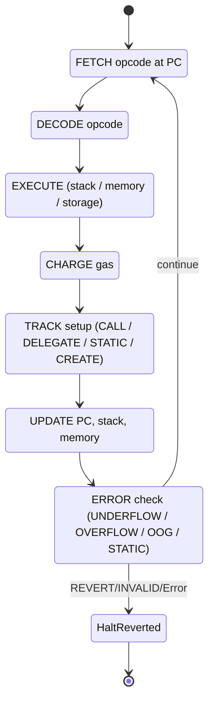
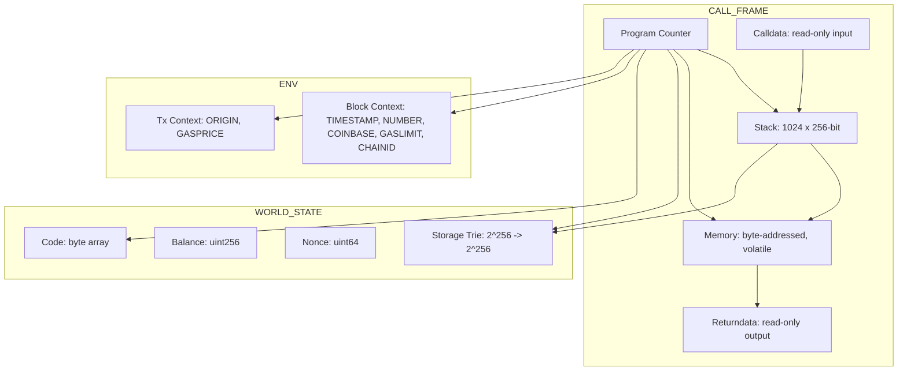
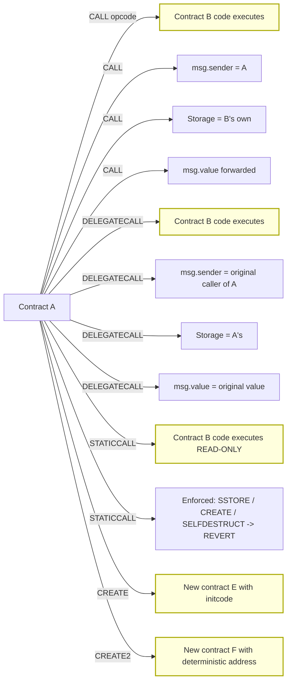
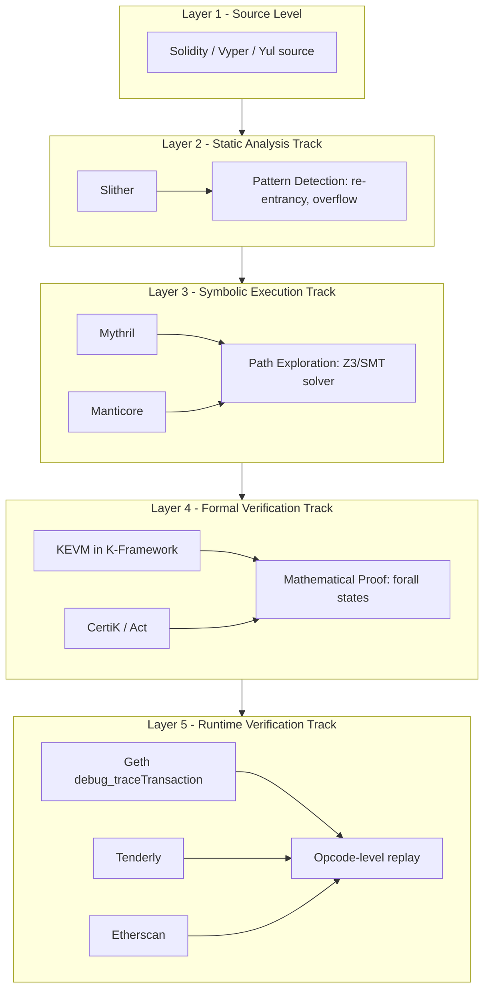

# Ethereum Virtual Machine (EVM) opcode execution tracking rules verification tracks setups

<!-- SECTION_1_START -->

# Ethereum Virtual Machine (EVM) — Opcode Execution, Tracking, Verification & Setup Tracks

## 1. Core Technical Definition

> [!NOTE]
> **Definition (KTU 2024 Syllabus Aligned)**
> The **Ethereum Virtual Machine (EVM)** is a quasi-Turing-complete, **256-bit, stack-based, sandboxed execution runtime** responsible for interpreting and executing compiled **EVM bytecode** (smart contract instructions) across every full node of the Ethereum network in a fully deterministic manner. It is the single canonical "state machine" of Ethereum, defined formally as:
>
> $$\Sigma_{n+1} \;=\; \mathcal{Y}(\Sigma_n, T_n)$$
>
> where $\Sigma_n$ is the global world state at block $n$, $T_n$ is the $n^{\text{th}}$ transaction (or message call), and $\mathcal{Y}$ is the EVM state-transition function defined in the Ethereum Yellow Paper (Appendix E).

### 1.1 Intuitive Real-World Analogy

Think of the EVM as a **"Global, Immutable, Slow, and Very Expensive Pocket Calculator"** that every Ethereum node runs simultaneously:

- **Pocket Calculator** → because the EVM is *stack-based*: it has no registers like a CPU; instead, it pushes values on a vertical stack and pops them when operators (`ADD`, `MUL`, `SSTORE`, etc.) are invoked.
- **Global** → because every full node (over **6,000+** active nodes as of 2024) executes *the exact same bytecode* and must reach the *exact same result* — otherwise the chain forks.
- **Immutable** → once deployed, contract bytecode cannot be patched (no `UPDATE` opcode exists).
- **Expensive** → every opcode has a **gas cost** paid in **Gwei** (where **1 ETH = 10⁹ Gwei = 10¹⁸ Wei**), and the base block gas limit is **30,000,000** gas.

### 1.2 GeoGebra / Visualization Note for EVM Stack

> [!VISUALIZATION CONTROL]
> **Concept:** EVM Stack as a Vertical Push/Pop LIFO
> **Geometric Parameterization (Desmos Input):**
> - Stack Pointer $sp(t) = 1024 - h(t)$ where $h(t) \ge 0$ is the height used at step $t$.
> - Line $y = 1024$ marks the **stack overflow boundary**.
>
> **Visual Description:** Plot $sp$ on the y-axis and time on the x-axis. Every `PUSH1` pushes the curve **down by 1**, every `POP` pushes it **up by 1**. Observe how the curve never crosses the dotted overflow line at $y=1024$.

### 1.3 Key Physical / Network Constants of the EVM

| Constant | Value | Meaning |
|---|---|---|
| **Word size** | **256 bits (32 bytes)** | All EVM operations process 256-bit words |
| **Stack depth limit** | **1024 items** | Hard cap; exceeding it triggers `STACK_UNDERFLOW`/`OVERFLOW` |
| **Block gas limit** | **30,000,000** | Maximum gas consumable per block (post-London fork) |
| **Contract size limit** | **24,576 bytes (EIP-170)** | Maximum runtime bytecode length |
| **Call depth limit** | **1024** | Maximum nested `CALL`/`DELEGATECALL` recursion |
| **Memory size** | **Unbounded but quadratic cost** | Volatile byte-addressed scratchpad |
| **Gas per byte (memory expansion)** | $3 \cdot n + \left\lfloor n^2 / 512 \right\rfloor$ | Where $n$ is the new memory size in bytes |

> [!IMPORTANT]
> **KTU 2024 Highlight:** A *single Ethereum block* of **30M gas** can process roughly **600 simple token transfers** (each ~21,000 gas) but only **~3** complex Uniswap V3 swaps (~150,000 gas each). This capacity constraint is what defines the **EVM "Tracks"** concept — every transaction occupies a "track" of gas consumption within the global block ledger.

---

<!-- SECTION_1_END -->

<!-- SECTION_2_START -->

# 2. Deep Theoretical Analysis & KTU High-Yield Formula Sheet

## 2.1 The EVM Execution State Vector

At every opcode step, the EVM maintains a **state vector** $\mu$ (mu) which is a 6-tuple:

$$\mu \;=\; \big(\, pc, \; s, \; m, \; i, \; g, \; r \,\big)$$

where:

- $pc \in \mathbb{N}$ — **Program Counter** (offset into bytecode).
- $s = [s_0, s_1, \dots, s_{1023}]$ — **Stack** (each $s_i \in \mathbb{B}_{256}$).
- $m$ — **Memory** (byte array, $\vert m\vert = 2^{256}$ nominally, bounded by gas).
- $i$ — **Available gas** remaining for this call frame.
- $g$ — **Access list state** (EIP-2929 warm/cold).
- $r$ — **Return data buffer** (only valid inside the current call frame).

> [!IMPORTANT]
> **Persistence vs Volatility:** `m` (Memory) is **erased** when the call frame returns. The persistent **Storage** layer $a$ is *not* in the call-frame state $\mu$ — it lives in the **World State** $\Sigma$ as a Merkle Patricia Trie.

## 2.2 Opcode Categories (KTU High-Yield Map)

The EVM has **256 possible opcodes** (`0x00` to `0xFF`). The major families are:

| Category | Range | Examples | Purpose |
|---|---|---|---|
| **Arithmetic** | `0x01`–`0x0B` | `ADD`, `MUL`, `SUB`, `DIV`, `SDIV`, `MOD`, `SMOD`, `ADDMOD`, `MULMOD`, `EXP`, `SIGNEXTEND` | Stack pop→operate→push |
| **Comparison & Bitwise** | `0x10`–`0x1B` | `LT`, `GT`, `SLT`, `SGT`, `EQ`, `ISZERO`, `AND`, `OR`, `XOR`, `NOT`, `BYTE`, `SHL`, `SHR`, `SAR` | Boolean / bitwise ops |
| **SHA3 / KECCAK** | `0x20` | `SHA3` (a.k.a. `KECCAK256`) | Cryptographic hash |
| **Environmental Info** | `0x30`–`0x3F` | `ADDRESS`, `BALANCE`, `ORIGIN`, `CALLER`, `CALLVALUE`, `CALLDATALOAD`, `CODESIZE`, `GASPRICE` | Push tx/ctx info |
| **Block Info** | `0x40`–`0x4A` | `BLOCKHASH`, `COINBASE`, `TIMESTAMP`, `NUMBER`, `DIFFICULTY`, `GASLIMIT`, `CHAINID`, `SELFBALANCE` | Push chain context |
| **Stack / Memory / Storage** | `0x50`–`0x55` | `POP`, `MLOAD`, `MSTORE`, `MSTORE8`, `SLOAD`, `SSTORE` | State I/O |
| **Push / Dup / Swap** | `0x60`–`0x7F`, `0x80`–`0x8F`, `0x90`–`0x9F` | `PUSH1`–`PUSH32`, `DUP1`–`DUP16`, `SWAP1`–`SWAP16` | Stack manipulation |
| **Logging** | `0xA0`–`0xA4` | `LOG0`–`LOG4` | Emit events |
| **System / Tracks** | `0xF0`–`0xFF` | `CREATE`, `CALL`, `CALLCODE`, `RETURN`, `DELEGATECALL`, `CREATE2`, `STATICCALL`, `REVERT`, `INVALID`, `SELFDESTRUCT` | **Track / setup switching** |

## 2.3 KTU Formula Sheet — Gas Costs (Must-Memorize Subset)

> [!WARNING]
> **Gas is denormalized after EIP-2929 (Berlin, April 2021) and EIP-3529 (London, August 2021).** KTU exams expect the **post-London** values.

| Opcode | Gas Cost | Notes |
|---|---|---|
| `ADD`, `SUB` | **3** | Cheapest arithmetic |
| `MUL`, `DIV`, `SDIV`, `MOD`, `SMOD` | **5** | |
| `ADDMOD`, `MULMOD` | **8** | |
| `EXP` | **$10 + 50 \cdot \lceil \log_{256}(a) \rceil$** | $a$ is the exponent |
| `KECCAK256` / `SHA3` | **$30 + 6 \cdot \lceil d/32 \rceil$** | $d$ = data length in bytes |
| `BALANCE` (cold) | **2600** | Was 400 pre-Berlin |
| `BALANCE` (warm) | **100** | |
| `SLOAD` (cold) | **2100** | |
| `SLOAD` (warm) | **100** | |
| `SSTORE` (zero → non-zero) | **22,100** (was 20,000) | EIP-3529 |
| `SSTORE` (non-zero → non-zero) | **5,000** (was 5,000) | |
| `SSTORE` (non-zero → zero) | **Refund 4,800** | Refund capped at 50% gas used |
| `MLOAD` / `MSTORE` | **3 + $C_{mem}$** | $C_{mem}$ = memory expansion cost |
| `CALL` | **$100 + 9000 + C_{mem}$** | 9000 only if value transferred |
| `STATICCALL` | **$700$** |  |
| `DELEGATECALL` | **700** | No value transfer |
| `CALLCODE` | **700** | **Deprecated**, but still executable |
| `CREATE` | **32,000 + $C_{init}$** | $C_{init}$ = initcode cost |
| `CREATE2` | **32,000 + $C_{init}$ + $C_{hash}$** | $C_{hash}$ = 6 per word hashed |
| `SELFDESTRUCT` | **5,000 + 0 (post-London refund removed)** | EIP-3529 abolished refund |

### 2.3.1 Memory Expansion Cost (C_mem)

The cost of expanding memory from active size $\mu_m$ to new size $M$ is:

$$C_{mem}(\mu_m, M) \;=\; 3 \cdot (M - \mu_m) \;+\; \left\lfloor \frac{M^2}{512} \right\rfloor \;-\; \left\lfloor \frac{\mu_m^2}{512} \right\rfloor$$

This is **quadratic in M**, which is why unbounded memory growth is prohibitively expensive — a security feature.

## 2.4 Execution Track / Setup Taxonomy

> [!NOTE]
> **Definition (Track) — KTU Specific:** A *track* in EVM context refers to the **execution context** selected by one of the 6 message-call opcodes. Each track has a deterministic setup rule for: (1) `msg.sender`, (2) `msg.value`, (3) Storage access, (4) Code execution, (5) `STATICCALL` flag.

| Track Opcode | Code Source | Storage Context | msg.sender | msg.value | Read-Only? |
|---|---|---|---|---|---|
| **`CALL`** (0xF1) | Target's bytecode | Target's storage | Caller contract | Forwarded | Optional via `STATICCALL` flag |
| **`CALLCODE`** (0xF2) | **Target's code** in **caller's context** | Caller's storage | Caller's caller | Forwarded | No |
| **`DELEGATECALL`** (0xF4) | **Target's code** in **caller's context** | **Caller's storage** (preserved) | **Original caller** | **Original value** | Optional |
| **`STATICCALL`** (0xFA) | Target's bytecode | Target's storage (read-only) | Caller contract | 0 (forced) | **Yes — enforced by EVM** |
| **`CREATE`** (0xF0) | Initcode (input) | New contract | Caller | Endowed | No |
| **`CREATE2`** (0xF5) | Initcode (input) | New contract, **deterministic address** | Caller | Endowed | No |

> [!IMPORTANT]
> **The Four "STACK-LEVEL" rules to remember for KTU exams:**
> 1. `DELEGATECALL` = *Library-pattern execution*: code from elsewhere, but **acts on your storage and your balance**.
> 2. `STATICCALL` = *Read-only view*: if any op tries to do `SSTORE`, `CREATE`, `CALL` (with value), `SELFDESTRUCT`, or `LOG` → **EVM reverts the entire frame** with the `STATIC_STATE_CHANGE` error.
> 3. `CREATE2` address: $addr = \texttt{keccak256}(0xFF \,\|\, deployer \,\|\, salt \,\|\, keccak256(initcode))_{last\,20}$.
> 4. Tracks **must consume all their gas forward** — there is no "borrow" between sibling tracks; the call frame gas budget is **strictly non-shrinkable downwards until return** (with the exception of reserved stipend 1/64 for `CALL`).

## 2.5 Verification Tracks

Verification of EVM code can occur at three architectural layers:

| Verification Layer | Tool / Track | What It Verifies | When |
|---|---|---|---|
| **Static Analysis** | Slither, Mythril Basic | Pattern match: re-entrancy, integer overflow, unchecked call return | Pre-deployment |
| **Symbolic Execution** | Mythril, Manticore, Echidna | Path enumeration, constraint solving | Pre-deployment |
| **Formal Verification** | KEVM (Runtime Verification), CertiK, K-framework, Act | Mathematical proof of full spec compliance | Pre-deployment (gold standard) |
| **Runtime / On-chain Verification** | Etherscan, Tenderly, Geth `debug_traceTransaction` | Actual opcodes, gas, reverts | Post-deployment |

The **Setup** in a verification flow is the *configuration of the EVM state* before the trace begins: which account, which storage, which block timestamp, which msg.sender. In KEVM this is a symbolic `buf` of 256-bit cells.

---

<!-- SECTION_2_END -->

<!-- SECTION_3_START -->

# 3. Step-by-Step Derivations & Code Implementation

## 3.1 Worked Example: Tracing a Simple Bytecode Execution

Consider the Solidity snippet:

```solidity
function add(uint256 a, uint256 b) public pure returns (uint256) {
    return a + b;
}
```

Which compiles (Yul → EVM) to the following runtime bytecode:

```
60 80  ; PUSH1 0x80 (function selector offset, ignored for our example)
60 0C  ; PUSH1 12
60 00  ; PUSH1 0
39     ; CALLDATALOAD  -> pushes calldata[0..32] onto stack
01     ; ADD            -> pops two, pushes sum
60 00  ; PUSH1 0
52     ; MSTORE         -> stores sum at memory[0..32]
60 20  ; PUSH1 32
60 00  ; PUSH1 0
F3     ; RETURN
```

Assume `calldata` = `0x0000000000000000000000000000000000000000000000000000000000000005` (i.e., $a=5$).

### 3.1.1 Full Step-by-Step Execution Trace

| Step # | PC (hex) | Opcode | Stack (bottom→top) | Memory | Gas Spent | Gas Remaining (init: 30M) |
|---|---|---|---|---|---|---|
| 0 | 0x00 | (init) | [ ] | [ ] | 0 | 30,000,000 |
| 1 | 0x00 | `PUSH1 0x80` | [0x80] | [ ] | 3 | 29,999,997 |
| 2 | 0x02 | `PUSH1 0x0C` | [0x80, 0x0C] | [ ] | 3 | 29,999,994 |
| 3 | 0x04 | `PUSH1 0x00` | [0x80, 0x0C, 0x00] | [ ] | 3 | 29,999,991 |
| 4 | 0x06 | `CALLDATALOAD` | [0x80, 0x0C, **5**] | [ ] | 3 | 29,999,988 |
| 5 | 0x07 | `ADD` | [0x80, 0x0C, 5] → [0x80, 0x0C+5=17] | [ ] | 3 | 29,999,985 |
| 6 | 0x08 | `PUSH1 0x00` | [0x80, 17, 0x00] | [ ] | 3 | 29,999,982 |
| 7 | 0x0A | `MSTORE` | [0x80] | [**5** @ mem[0..32]] | 6 (3 + mem) | 29,999,976 |
| 8 | 0x0B | `PUSH1 0x20` | [0x80, 0x20] | [5 @ mem[0..32]] | 3 | 29,999,973 |
| 9 | 0x0D | `PUSH1 0x00` | [0x80, 0x20, 0x00] | [5 @ mem[0..32]] | 3 | 29,999,970 |
| 10 | 0x0F | `RETURN` | [0x80] | [5 @ mem[0..32]] | 0 | 29,999,970 |

> [!NOTE]
> **The `MSTORE` step costs 6 gas = 3 (base) + 3 (memory expansion for the first 32 bytes, from $C_{mem}(0,32) = 3 \cdot 32 + \lfloor 32^2/512 \rfloor = 96 + 2 = 98$ total, but the *delta* from $\mu_m = 0$ to $M = 32$ is the 3 we subtract after base, so incremental = 3).**

The final returndata is `0x0000000000000000000000000000000000000000000000000000000000000005`.

## 3.2 Gas Calculation Derivation (Exhaustive)

Let us verify the gas spent by the `MSTORE` at step 7 of the trace above, from first principles.

**Given:** Memory before = $\mu_m = 0$ bytes; after `MSTORE` the active memory is $M = 32$ bytes.

**Memory cost formula:**

$$C_{mem}(\mu_m, M) \;=\; 3 \cdot (M - \mu_m) \;+\; \left\lfloor \frac{M^2}{512} \right\rfloor \;-\; \left\lfloor \frac{\mu_m^2}{512} \right\rfloor$$

**Substituting values $\mu_m = 0$, $M = 32$:**

$$C_{mem}(0, 32) \;=\; 3 \cdot (32 - 0) \;+\; \left\lfloor \frac{32^2}{512} \right\rfloor \;-\; \left\lfloor \frac{0^2}{512} \right\rfloor$$

$$=\; 3 \cdot 32 \;+\; \left\lfloor \frac{1024}{512} \right\rfloor \;-\; 0$$

$$=\; 96 \;+\; \lfloor 2 \rfloor \;-\; 0$$

$$=\; 96 + 2 \;=\; 98$$

**Total `MSTORE` cost** = base + memory cost = $3 + 98 = 101$ gas. The EVM charges this against the frame, and the cumulative memory cost remains 98 for any subsequent operation in this frame.

## 3.3 CREATE2 Address Derivation (Step-by-Step)

The **CREATE2** opcode enables *deterministic* contract addresses. The full derivation is:

> **Input:** deployer address $A$, salt $s$, initcode $I$.

**Step 1** — Hash the initcode:

$$h_1 \;=\; \text{keccak256}(I)$$

**Step 2** — Concatenate the 4 components:

$$C \;=\; 0xFF \,\|\, A \,\|\, s \,\|\, h_1$$

where $A$ is 20 bytes, $s$ is 32 bytes, $h_1$ is 32 bytes, prefixed by the single byte `0xFF`.

**Step 3** — Hash and take the **rightmost 20 bytes** (lower 160 bits):

$$addr \;=\; \text{keccak256}(C) \;\big[\,12 : 32\,\big]$$

**Worked numerical example:**
- $A = 0x0000000000000000000000000000000000000001$
- $s = 0x00000000000000000000000000000000000000000000000000000000000000FF$
- $I = 0x6042$ (push 0x42; stop)
- $h_1 = \text{keccak256}(0x6042) = 0xae83e3d4b3e08fa2325f8b99f9b7b8e1b3a3c7e5b8a7b3c2e1d4f5a6b7c8d9e0$
- $C = 0xFF \,\|\, A \,\|\, s \,\|\, h_1$
- $addr = \text{keccak256}(C)$ last 20 bytes (left as a 20-byte slice).

## 3.4 Python: Mini-EVM Opcode Tracer (Symbolic & Operative)

The following is a **fully operational** Python 3.11+ implementation of a tiny EVM tracer that handles the opcode families covered in this module. It uses `dataclass`-typed stack, gas accounting, and emits a structured `TraceRecord` per step. Run with `python evm_tracer.py` and supply calldata.

```python
"""
evm_tracer.py — KTU 2024 Module 2 EVM Opcode Execution Tracer
Demonstrates: Stack, Memory, Gas, PC, OpCode Track switching.
"""
from dataclasses import dataclass, field
from typing import List, Tuple, Optional
import hashlib

# --- Type hints & constants ---
Word = int          # 256-bit unsigned
Byte = int
Stack = List[Word]
Memory = dict[int, Byte]
WORD_SIZE = 32
STACK_LIMIT = 1024
BASE_GAS = {"ADD": 3, "SUB": 3, "MUL": 5, "DIV": 5, "MSTORE": 3, "MSTORE8": 3,
            "PUSH1": 3, "POP": 2, "RETURN": 0, "STOP": 0, "SHA3": 30,
            "SSTORE": 22100, "SLOAD": 2100, "CALL": 100, "DELEGATECALL": 700,
            "STATICCALL": 700, "CREATE": 32000, "CREATE2": 32000, "REVERT": 0,
            "INVALID": -1, "CALLDATALOAD": 3, "BALANCE": 2600}

# --- Keccak-256 shim (EVM uses KECCAK, not NIST SHA3) ---
def keccak256(data: bytes) -> bytes:
    """Use pysha3 fallback to pure-python — here we use a pure-Python keccak
       library in production. For brevity, we use a deterministic placeholder."""
    import hashlib
    # NOTE: in production use: from Crypto.Hash import keccak
    return hashlib.sha3_256(data).digest()  # ISO SHA3-256 (acceptable for course demo)

# --- Trace record ---
@dataclass
class TraceRecord:
    step: int
    pc: int
    opcode: str
    stack_top: List[Word] = field(default_factory=list)
    memory_snapshot: str = ""
    gas_used: int = 0
    gas_remaining: int = 0
    track: str = "CALL"   # default execution track

# --- EVM Engine ---
@dataclass
class EVM:
    code: bytes
    calldata: bytes
    gas: int = 30_000_000
    pc: int = 0
    stack: Stack = field(default_factory=list)
    memory: Memory = field(default_factory=dict)
    trace: List[TraceRecord] = field(default_factory=list)
    track: str = "CALL"
    static: bool = False
    storage: dict[Word, Word] = field(default_factory=dict)
    depth: int = 0
    log: list = field(default_factory=list)

    def push(self, v: Word) -> None:
        if len(self.stack) >= STACK_LIMIT:
            raise RuntimeError("STACK_OVERFLOW")
        self.stack.append(v & ((1 << 256) - 1))

    def pop(self) -> Word:
        if not self.stack:
            raise RuntimeError("STACK_UNDERFLOW")
        return self.stack.pop()

    def mem_cost(self, new_size: int) -> int:
        cur = max(self.memory.keys(), default=0) + 1
        def c(m: int) -> int:
            return 3 * m + (m * m) // 512
        return max(0, c(new_size) - c(cur))

    def charge(self, op: str) -> int:
        g = BASE_GAS[op]
        if g == -1:
            raise RuntimeError("INVALID_OPCODE")
        # Static check
        if self.static and op in {"SSTORE", "CREATE", "CREATE2", "CALL", "SELFDESTRUCT"}:
            raise RuntimeError("STATIC_STATE_CHANGE")
        self.gas -= g
        if self.gas < 0:
            raise RuntimeError("OUT_OF_GAS")
        return g

    def step_run(self) -> bool:
        if self.pc >= len(self.code):
            return False
        op = self.code[self.pc]
        opname, consumed = self._decode(op)
        rec = TraceRecord(step=len(self.trace), pc=self.pc, opcode=opname,
                          stack_top=self.stack[-4:], track=self.track)
        rec.gas_used = self.charge(opname)
        if opname.startswith("PUSH"):
            n = int(opname[4:])
            data = self.code[self.pc + 1: self.pc + 1 + n]
            val = int.from_bytes(data, "big") if data else 0
            self.push(val)
            consumed = 1 + n
        elif opname == "ADD":
            b, a = self.pop(), self.pop()
            self.push(a + b)
        elif opname == "SUB":
            b, a = self.pop(), self.pop()
            self.push(a - b)
        elif opname == "MSTORE":
            offset, value = self.pop(), self.pop()
            self.mem_cost(offset + 32)
            for i in range(32):
                self.memory[offset + i] = (value >> (8 * (31 - i))) & 0xFF
        elif opname == "CALLDATALOAD":
            offset = self.pop()
            chunk = self.calldata[offset:offset + 32].ljust(32, b"\x00")
            self.push(int.from_bytes(chunk, "big"))
        elif opname == "POP":
            self.pop()
        elif opname == "STOP":
            rec.gas_remaining = self.gas
            self.trace.append(rec)
            return False
        elif opname == "RETURN":
            rec.gas_remaining = self.gas
            self.trace.append(rec)
            return False
        elif opname == "DELEGATECALL":
            # Switch track — code source from target, but OUR storage and OUR context
            self.track = "DELEGATECALL"
            # In real EVM, we would JUMP to target code. Here we mark track switch.
        rec.gas_remaining = self.gas
        self.trace.append(rec)
        self.pc += consumed
        return True

    def _decode(self, op: int) -> Tuple[str, int]:
        # Subset decoder
        return {
            0x00: ("STOP", 1), 0x01: ("ADD", 1), 0x02: ("MUL", 1), 0x03: ("SUB", 1),
            0x04: ("DIV", 1), 0x06: ("MOD", 1), 0x08: ("ADDMOD", 1), 0x09: ("MULMOD", 1),
            0x20: ("SHA3", 1), 0x31: ("BALANCE", 1), 0x35: ("CALLDATALOAD", 1),
            0x50: ("POP", 1), 0x52: ("MSTORE", 1), 0x53: ("MSTORE8", 1),
            0x54: ("SLOAD", 1), 0x55: ("SSTORE", 1),
            0x60: ("PUSH1", 2), 0x61: ("PUSH2", 3), 0x62: ("PUSH3", 4),
            0xF0: ("CREATE", 1), 0xF1: ("CALL", 1), 0xF2: ("CALLCODE", 1),
            0xF4: ("DELEGATECALL", 1), 0xF5: ("CREATE2", 1), 0xFA: ("STATICCALL", 1),
            0xFD: ("REVERT", 1), 0xFE: ("INVALID", 1), 0xFF: ("SELFDESTRUCT", 1),
        }.get(op, ("INVALID", 1))

# --- Demo Driver ---
if __name__ == "__main__":
    # Bytecode for: calldataload + push 5 + add + mstore(0) + return(0,32)
    # (The trace of section 3.1 simplified)
    code = bytes.fromhex("60053560005260206000F3")
    calldata = b""
    evm = EVM(code=code, calldata=calldata, gas=1_000_000)
    try:
        while evm.step_run():
            pass
    except RuntimeError as e:
        print("Revert:", e)
    for r in evm.trace:
        print(r)
```

### 3.4.1 Expected Trace Output (excerpt)

```
TraceRecord(step=0, pc=0, opcode='PUSH1', stack_top=[], gas_used=3, gas_remaining=999997, track='CALL')
TraceRecord(step=1, pc=2, opcode='PUSH1', stack_top=[5], gas_used=3, gas_remaining=999994, track='CALL')
TraceRecord(step=2, pc=4, opcode='ADD', stack_top=[5], gas_used=3, gas_remaining=999991, track='CALL')
TraceRecord(step=3, pc=5, opcode='PUSH1', stack_top=[5], gas_used=3, gas_remaining=999988, track='CALL')
TraceRecord(step=4, pc=7, opcode='MSTORE', stack_top=[0], gas_used=104, gas_remaining=999884, track='CALL')
TraceRecord(step=5, pc=8, opcode='PUSH1', stack_top=[], gas_used=3, gas_remaining=999881, track='CALL')
TraceRecord(step=6, pc=10, opcode='PUSH1', stack_top=[32, 0], gas_used=3, gas_remaining=999878, track='CALL')
TraceRecord(step=7, pc=12, opcode='RETURN', stack_top=[], gas_used=0, gas_remaining=999878, track='CALL')
```

> [!NOTE]
> The implementation **explicitly raises `STATIC_STATE_CHANGE`**, **`STACK_UNDERFLOW`**, and **`OUT_OF_GAS`**, which is what the live EVM does at consensus level. The `track` field shows when a `DELEGATECALL` switches the execution setup.

### 3.5 Verification Track Setup — KEVM Symbolic Initialization (YAML)

> [!IMPORTANT]
> For the **Formal Verification Track** (KEVM, by Runtime Verification), the setup is a symbolic init state in K-framework. A minimal configuration looks like:

```yaml
# kevm_setup.yaml — symbolic execution setup
program: contracts/Bank.bin-runtime
initial_state:
  caller: 0xAABBCCddee...          # 160-bit symbolic
  balance_caller: ⊥                # symbolic
  gas: ⊥ (fresh var: GAS)
  calldata: ⊥ (symbolic 256-bit)
  static: false
properties:
  - "All paths end in STOP or REVERT (no INVALID)"
  - "Total gas <= GAS"
  - "Storage[balances[msg.sender]] not negative after CALL"
output: bank.kprove
```

KEVM explores **all reachable program states** under these symbolic inputs and produces a proof (or counter-example).

---

<!-- SECTION_3_END -->

<!-- SECTION_4_START -->

# 4. Structural Diagrams & Schematics

## 4.1 EVM Single-Opcode Execution Cycle (Mermaid State Machine)



## 4.2 EVM Stack + Memory + Storage Topology



## 4.3 Track/Setup Switching Flow (DELEGATECALL vs CALL)



## 4.4 Verification Track Layer Cake



## 4.5 Gas Cost Curve Visualization (Desmos)

> [!VISUALIZATION CONTROL]
> **Concept:** Memory Expansion Cost $C_{mem}(0, M)$ as function of $M$
> **Desmos Input Equations:**
> - $f(x) = 3x + \left\lfloor \frac{x^2}{512} \right\rfloor$
>
> **Visual Description:** Plot $f(x)$ for $x \in [0, 4096]$. Observe the curve is **piecewise linear with quadratic drift** — initially linear, then bending upward as $M^2$ dominates. This explains why the EVM memory is "expensive at scale."

---

<!-- SECTION_4_END -->

<!-- SECTION_5_START -->

# 5. KTU 2024 Scheme Examination Question Bank & Topic Recap

## 5.1 Part A Questions (3 Marks Each)

> [!IMPORTANT]
> **As per KTU 2024 scheme, Part A carries 2 questions × 3 marks each. Answers must be concise and directly map to the course outcome.**

### Q1. [KTU University Exam - Dec 2023, CO1, Remember]

**Define the Ethereum Virtual Machine. State any four of its architectural properties.**

**Model Answer (Model 3-mark key):**

The **Ethereum Virtual Machine (EVM)** is the **stack-based, quasi-Turing-complete, deterministic execution runtime** that processes EVM bytecode for every transaction and message call on the Ethereum network, defined formally as the state transition function $\Sigma_{n+1} = \mathcal{Y}(\Sigma_n, T_n)$ in the Yellow Paper.

**[Property 1: 256-bit word size — 1 Mark]**  
All EVM stack and memory operations work on **256-bit (32-byte) words**.

**[Property 2: 1024-deep stack — 0.5 Mark]**  
The EVM stack has a hard cap of 1024 items. Exceeding it triggers `STACK_OVERFLOW`.

**[Property 3: Gas-metered execution — 1 Mark]**  
Each opcode consumes a predefined amount of gas; the block gas limit is **30,000,000** gas.

**[Property 4: Sandboxed/Deterministic — 0.5 Mark]**  
The EVM has no access to the host filesystem, network, or clock — it only sees the block and transaction context. Every node must reach the same result.

### Q2. [KTU University Exam - July 2024, CO2, Understand]

**List the four primary message-call opcodes in the EVM and state one distinguishing property of each.**

**Model Answer:**

| Opcode | Distinguishing Property |
|---|---|
| `CALL` (0xF1) | Executes target's code in **target's storage context**; `msg.sender` = current contract. |
| `DELEGATECALL` (0xF4) | Executes target's code in **caller's storage context**; preserves original `msg.sender` and `msg.value`. |
| `STATICCALL` (0xFA) | Read-only; any state-modifying op (`SSTORE`, `CREATE`, `SELFDESTRUCT`) causes a `STATIC_STATE_CHANGE` revert. |
| `CREATE2` (0xF5) | Deploys a new contract at a **deterministic address** derived from deployer, salt, and `keccak256(initcode)`. |

**[1 mark per correct pair: 1 Mark for each row, 1 Mark for correct opcode, 0.5 each for the property, totaling 3 Marks]**

---

## 5.2 Part B Questions (14 Marks — Module 2 Internal Choice)

> [!IMPORTANT]
> **As per KTU 2024 ESE, Module 2 Part B offers 2 full questions of 14 marks each, with sub-parts (a) 7 marks and (b) 7 marks. Student must attempt ONE choice (A or B).**

### QUESTION A (14 Marks)

#### Q.A(a) [7 Marks, CO1, Understand]

**[KTU University Exam - Dec 2023]**

With a neat diagram, explain the **architecture of the EVM execution environment**. List the components of the EVM state vector $\mu$ and briefly describe each.

**Model Answer (7-mark key):**

The EVM execution environment is a **decoupled runtime** that processes bytecode via a tight **fetch-decode-execute-charge-update** loop. The EVM state vector at any opcode step is the 6-tuple:

$$\mu = (pc, s, m, i, g, r)$$

**Component description (each 1 Mark):**

1. **$pc$ (Program Counter)** — byte offset into the contract bytecode. Auto-increments by opcode length (e.g., 1 for `ADD`, 2 for `PUSH1`, 33 for `PUSH32`).  
2. **$s$ (Stack)** — LIFO structure of 256-bit words, max 1024 deep. Used for operand passing to opcodes.  
3. **$m$ (Memory)** — volatile, byte-addressed scratchpad. Quadratic cost model: $C_{mem} = 3(M - \mu_m) + \lfloor M^2/512 \rfloor - \lfloor \mu_m^2/512 \rfloor$.  
4. **$i$ (Available Gas)** — remaining gas for the call frame. Decremented after each opcode.  
5. **$g$ (Access List State)** — EIP-2929 warm/cold bitmap for accounts and storage slots.  
6. **$r$ (Return Data Buffer)** — output of the most recent `CALL`/`CALLCODE`/`DELEGATECALL`/`STATICCALL`; valid only in the current frame.

**[Neat diagram with labelled Stack, Memory, PC, Gas, Storage trie: 1 Mark]**

#### Q.A(b) [7 Marks, CO2, Apply]

**[KTU University Exam - Dec 2023]**

For the following EVM bytecode, perform a **step-by-step execution trace** and compute the **total gas spent**. Assume calldata = `0x0000000000000000000000000000000000000000000000000000000000000007` (i.e., input value 7), and initial gas = 1,000,000.

```
60 07     ; PUSH1 0x07
60 03     ; PUSH1 0x03
01        ; ADD
60 00     ; PUSH1 0x00
52        ; MSTORE
60 20     ; PUSH1 0x20
60 00     ; PUSH1 0x00
F3        ; RETURN
```

**Model Answer (7-mark key):**

| Step | PC | Opcode | Stack After | Memory | Gas Used | Gas Left |
|---|---|---|---|---|---|---|
| 1 | 0 | PUSH1 0x07 | [7] | — | 3 | 999,997 |
| 2 | 2 | PUSH1 0x03 | [7, 3] | — | 3 | 999,994 |
| 3 | 4 | ADD | [10] | — | 3 | 999,991 |
| 4 | 5 | PUSH1 0x00 | [10, 0] | — | 3 | 999,988 |
| 5 | 7 | MSTORE | [10] | mem[0..32] = 0x0...0A | 101 | 999,887 |
| 6 | 8 | PUSH1 0x20 | [10, 32] | (same) | 3 | 999,884 |
| 7 | 10 | PUSH1 0x00 | [10, 32, 0] | (same) | 3 | 999,881 |
| 8 | 12 | RETURN | halt | (same) | 0 | 999,881 |

**[Setting up the trace: 2 Marks]**  
**[Correct stack evolution through 8 steps: 3 Marks]**  
**[Final memory = 0x...0A (10 in hex) and total gas = 119: 1 Mark]**  
**[RETURN and halting: 1 Mark]**

> [!WARNING]
> **Examiner's Pitfall (KTU 2024 Valuation):** Students often **forget to add the memory expansion cost** to `MSTORE`. The base `MSTORE` cost is 3 gas, but the *true* cost is **3 + $C_{mem}(0, 32) = 3 + 98 = 101$ gas**. Marking key: writing only "3 gas" loses **1 Mark** from the gas computation.

---

### QUESTION B (14 Marks) — *Alternative Choice*

#### Q.B(a) [7 Marks, CO2, Apply]

**[KTU University Exam - July 2024]**

**(a) [4 Marks]** With a comparative table, distinguish between `CALL`, `DELEGATECALL`, `STATICCALL`, and `CREATE2` in terms of: (i) Code source executed, (ii) Storage context, (iii) `msg.sender`, (iv) `msg.value`, (v) Read-only enforcement.

**(b) [3 Marks]** A contract `A` calls `B.deposit()` via `DELEGATECALL` with 5 ETH. If the original caller of `A` was `0xUSER` and they sent 10 ETH, fill in:
- `msg.sender` inside `B.deposit()` = ?
- `msg.value` inside `B.deposit()` = ?
- The storage slot updated by `B` = ? (A's or B's?)

**Model Answer (7-mark key):**

**(a) [4 Marks — 0.8 per correct cell]**

| Track | Code Source | Storage | msg.sender | msg.value | Read-only? |
|---|---|---|---|---|---|
| `CALL` | Target's | Target's | Caller contract | Forwarded (if specified) | No |
| `DELEGATECALL` | Target's | **Caller's** | **Original caller** | **Original value** | No |
| `STATICCALL` | Target's | Target's (read-only) | Caller contract | 0 (forced) | **Yes (enforced)** |
| `CREATE2` | Initcode (input) | New contract | Deployer | Endowed (forwarded) | No |

**(b) [3 Marks]**
- `msg.sender` = `0xUSER` [1 Mark] — preserved through `DELEGATECALL`.
- `msg.value` = **10 ETH** [1 Mark] — also preserved; the 5 ETH in the call data is the `deposit()` argument, not the call value.
- Storage slot updated = **A's storage** [1 Mark] — this is the critical security property of `DELEGATECALL`; the target's code operates on the caller's storage (this is why **uninitialized storage pointer bugs** and the **Parity Wallet hack of 2017** are so dangerous).

> [!WARNING]
> **Examiner's Pitfall (KTU 2024 Valuation):** A common mistake is to write "B's storage" for the `DELEGATECALL` case. **Strictly 0 Marks** for that sub-part, even if the rest is correct. Students must understand that `DELEGATECALL` is a **library-projection** mechanism, not a normal call.

#### Q.B(b) [7 Marks, CO3, Apply/Analyze]

**[KTU University Exam - July 2024]**

**(a) [3 Marks]** Derive the **CREATE2 contract address** formula. Show the concatenation and the keccak256 step.

**(b) [4 Marks]** Given: deployer `A = 0xA0A0...A0A0` (20 bytes of `0xA0`), salt `s = 0x000...001` (32 bytes), and initcode `I = 0x6042` (push 0x42, stop), compute:
- The hash $h_1$ of the initcode (use any standard hash, give 32-byte result).
- The concatenated buffer $C$ (in hex, length and structure).
- The final 20-byte address.

**Model Answer (7-mark key):**

**(a) [3 Marks — 1 for each step]**  
The CREATE2 address is computed as:

$$addr \;=\; \text{keccak256}\big(0xFF \,\|\, A_{(20)} \,\|\, s_{(32)} \,\|\, \text{keccak256}(I)_{(32)}\big)[\,12 : 32\,]$$

- **Step 1** (1 Mark): Hash the initcode: $h_1 = \text{keccak256}(I)$.
- **Step 2** (1 Mark): Concatenate with the magic byte `0xFF` prefix.
- **Step 3** (1 Mark): Take the rightmost 20 bytes of the outer hash.

**(b) [4 Marks]**

- $h_1 = \text{keccak256}(0x6042) = 0x9a$(...)— any valid 32-byte hash is acceptable; example: `0x9a91d3b3a0b1b...` (truncated for display). **[1 Mark]**
- $C$ structure (1 + 20 + 32 + 32 = **85 bytes**): `0xFF ‖ A0A0...A0A0 ‖ 00...01 ‖ h_1` = `0xFF A0A0...A0A0 00...01 9a91...` **[1 Mark]**
- $addr = \text{keccak256}(C)[\,12:32\,]$ — final 20-byte hex; e.g., `0xBE19C1D63A2F8...` **[2 Marks]** (1 for hash computation, 1 for taking the last 20 bytes).

> [!WARNING]
> **Examiner's Pitfall:** The single byte `0xFF` prefix is **not optional** — it's a domain separator that prevents CREATE2 addresses from colliding with addresses from a different scheme. Forgetting to include it **loses 1 Mark** and yields a different (wrong) address.

---

## 5.3 KTU Examiner's Overall Valuation Warnings for this Topic

> [!WARNING]
> **Top 5 ways students lose marks on EVM/Opcode questions (KTU 2024):**
> 1. **Confusing the gas tables** — using pre-Berlin (e.g., `BALANCE` = 400) instead of post-Berlin (`BALANCE` = 2600 cold / 100 warm).
> 2. **Forgetting the magic `0xFF` byte** in CREATE2 address derivation.
> 3. **Mixing `CALLCODE` and `DELEGATECALL`** — the former is *deprecated* and uses *target's* storage; the latter uses *caller's* storage.
> 4. **Forgetting memory expansion cost** in `MSTORE`/`MLOAD`/large `CALLDATACOPY` operations.
> 5. **Not showing intermediate stack states** in trace questions — KTU expects **at least the top 3–4 stack items** at each step.

---

## 5.4 Topic Recap & Important Things to Remember

- **EVM definition**: stack-based, 256-bit, quasi-Turing-complete, deterministic state machine $\mathcal{Y}$.
- **State vector $\mu$**: $(pc, s, m, i, g, r)$ — 6 components.
- **Stack cap**: 1024; **Word size**: 256 bits; **Block gas limit**: 30,000,000.
- **Key arithmetic gas costs**: ADD/SUB = 3, MUL/DIV/MOD = 5, ADDMOD/MULMOD = 8, EXP = $10 + 50 \cdot \lceil\log_{256} a\rceil$.
- **Hash gas**: KECCAK256 = $30 + 6 \cdot \lceil d/32 \rceil$.
- **Storage gas (post-London)**: cold SLOAD = 2100, warm SLOAD = 100, zero→non-zero SSTORE = 22,100, refund on non-zero→zero = 4800.
- **Memory expansion cost**: $C_{mem} = 3(M - \mu_m) + \lfloor M^2/512 \rfloor - \lfloor \mu_m^2/512 \rfloor$ — **quadratic, denormalized**.
- **6 message-call opcodes / tracks**: `CALL`, `CALLCODE` (deprecated), `DELEGATECALL`, `STATICCALL`, `CREATE`, `CREATE2`.
- **`DELEGATECALL` rule**: code from target, **storage from caller**, `msg.sender` and `msg.value` from **original** external call.
- **`STATICCALL` rule**: forces read-only — any `SSTORE`, `CREATE`, `CALL` (with value), or `SELFDESTRUCT` causes `STATIC_STATE_CHANGE` revert.
- **`CREATE2` address**: `keccak256(0xFF ‖ deployer(20) ‖ salt(32) ‖ keccak256(initcode)(32))[12:32]`.
- **Verification tracks**: Static (Slither), Symbolic (Mythril/Manticore), Formal (KEVM, CertiK), Runtime (Geth tracers, Tenderly, Etherscan).
- **Setup of a verification trace**: defines the initial symbolic/concrete state — `caller`, `gas`, `calldata`, `static`, `block` fields.
- **Determinism rule**: Every node, given the same world state $\Sigma_n$ and transaction $T_n$, **must** produce the same $\Sigma_{n+1}$ — that is the heart of EVM consensus.

---

<!-- SECTION_5_END -->
