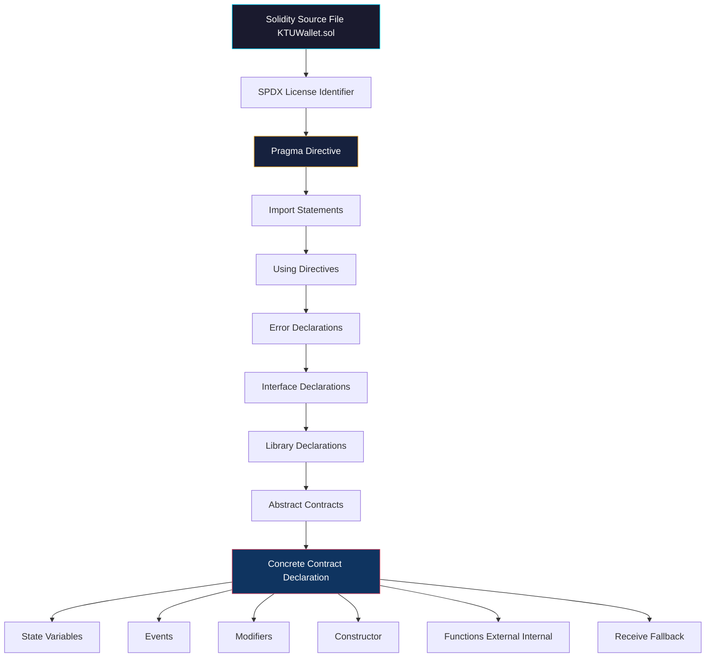
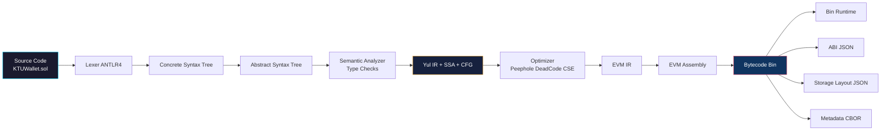
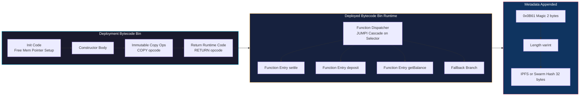
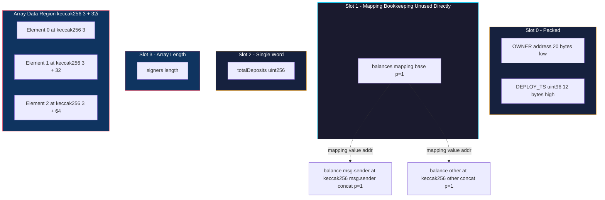
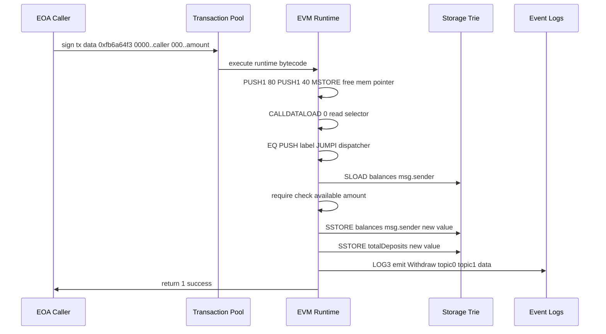

# Solidity language scripting primitives compiled code structural layout guidelines systems

<!-- SECTION_1_START -->
# Solidity Language: Scripting Primitives, Compilation & EVM Code Layout

## 1.1 Formal Academic Definition

> [!IMPORTANT]
> **Solidity** is a **statically-typed**, **curly-braces-oriented**, **object-oriented**, **high-level programming language** specifically designed for implementing **smart contracts** that execute on the **Ethereum Virtual Machine (EVM)** and EVM-compatible blockchains. It was proposed in 2014 by Gavin Wood, Christian Reitwiessner, and others, and is presently the de-facto industry standard for general-purpose on-chain programmable logic.

A **Solidity source unit** (a `.sol` file) is the *scripting primitive* that, after passing through the **Solc compiler pipeline**, is transformed into two deployable artifacts:

1. **EVM Bytecode** — the executable, low-level 1-of-256 opcode stream stored on-chain.
2. **Application Binary Interface (ABI)** — the JSON descriptor that allows off-chain clients and other contracts to invoke compiled functions.

The **structural layout** of a Solidity source unit follows strict **layout guidelines** defined in the official Solidity documentation: *Pragma → Imports → Errors → Interfaces → Libraries → Contracts*, executed top-to-bottom and left-to-right by the lexer/parser.

## 1.2 Conceptual Analogy & Intuition

> [!NOTE]
> **Analogy — The Smart Vending Machine Blueprint**
>
> Imagine you are building a **vending machine** that runs without a human operator.
> - **Solidity** is the **engineering blueprint** written in plain English with precise measurements.
> - The **EVM** is the **robotic factory worker** that can only understand a tiny, primitive machine code (push, pop, add, store).
> - The **Solc compiler** is the **translator** who converts your blueprint into the factory worker's language.
> - The **bytecode** is the **assembled machine**, the **ABI** is the **user's instruction manual** showing which buttons exist and what they do.
> - The **storage layout** is the **internal cabinet arrangement** of the vending machine — every item, coin, and counter has a fixed, numbered slot.

When you compile, the blueprint becomes an immutable machine placed in the factory warehouse (blockchain), and its cabinet positions are **locked forever** for that machine's lifetime. Re-arranging the blueprint later requires **deploying a brand new machine** and migrating the contents.

## 1.3 Core Terminology at a Glance

| Term | Meaning |
|---|---|
| **Pragma** | Compiler version directive (e.g., `pragma solidity ^0.8.24;`) |
| **Contract** | The fundamental deployable unit; equivalent to a `class` in OOP |
| **State Variable** | A variable persisted in contract storage across transactions |
| **Local Variable** | A variable that lives only inside a function execution frame |
| **EVM Word** | A **256-bit (32-byte)** primitive data unit — the atomic size of the EVM stack/memory/storage |
| **Gas** | The unit of computational effort; **1 gas ≈ 1 opcode cost unit**, paid in **gwei** (1 ETH = $10^9$ gwei) |
| **Bytecode** | The EVM-executable, deployable hexadecimal instruction stream |
| **ABI** | The JSON interface descriptor for inter-contract/off-chain communication |
| **Selector** | The first **4 bytes** of `keccak256(functionSignature)`, used to dispatch calls |

> [!IMPORTANT]
> **Syllabus Highlight:** The KTU 2024 PECST705 Module 2 expects students to be able to **draw the structural layout** of a Solidity file, **list the structural components** of compiled EVM bytecode, and **derive the storage/memory layout** for a given contract.

---

<!-- SECTION_1_END -->

<!-- SECTION_2_START -->
# Deep Theoretical Analysis & KTU High-Yield Formula Sheet

## 2.1 The Solidity Source File — Top-Down Structural Layout

A Solidity file is a **tree of definitions** parsed by the **ANTLR-based Solidity parser**. The official layout order (from the Solidity Style Guide, used as a grading rubric in KTU evaluations) is:

| Position | Block | Mandatory? | Purpose |
|:---:|---|:---:|---|
| 1 | `SPDX-License-Identifier` comment | Yes (prod) | Machine-readable license tag |
| 2 | `pragma` directive | Yes | Pins compiler version semantics |
| 3 | `import` statements | Optional | Brings in other source files / symbols |
| 4 | `using ... for ...` directives | Optional | Attach library functions to types |
| 5 | `error` declarations | Optional | Custom reverts (gas-efficient) |
| 6 | `interface` declarations | Optional | Pure function/method signatures |
| 7 | `library` declarations | Optional | Deployable reusable logic |
| 8 | `abstract contract` | Optional | Partial implementation base |
| 9 | `contract` declaration | Yes (one of) | The deployable unit |

## 2.2 Solidity Primitives — The Atomic Data Type System

Solidity value types are **statically-typed** and map directly to **EVM opcodes**.

### 2.2.1 Value Types (Live on Stack, Copied on Assignment)

| Category | Type | EVM Word Size | Default |
|---|---|---|---|
| Boolean | `bool` | 1 byte packed | `false` |
| Integer | `int8` to `int256`, `uint8` to `uint256` | 32 bytes (sign-ext) | `0` |
| Address | `address` | 20 bytes (160 bits) | `address(0)` |
| Address payable | `address payable` | 20 bytes | `address(0)` |
| Fixed-size bytes | `bytes1` to `bytes32` | 1–32 bytes | right-padded zeros |
| Enum | `enum` | 1 byte typically | first member |
| Function pointer | `function` | 24 bytes (address+selector) | empty |

### 2.2.2 Reference Types (Live in Storage / Memory / Calldata)

- **Arrays** — dynamic or fixed-size; stored in the **same location as the struct that contains them**.
- **Structs** — user-defined composite record; member variables are stored **contiguously in storage**.
- **String** — dynamically-sized UTF-8 byte array; treated identically to `bytes` for storage.
- **Mapping** — `mapping(KeyType => ValueType)`; **NOT iterable**, computed as $p = \text{keccak256}(h(k) \cdot p_0)$ where $p_0$ is the slot base.

## 2.3 Visibility & Mutability Matrix

> [!NOTE]
> **Visibility** controls *who* may call a function; **Mutability** controls *what* the function promises the EVM it will do. Misdeclaring them costs gas and triggers compiler warnings.

| Specifier | Scope | Disallows | Recommended Use |
|---|---|---|---|
| `public` | Everyone + derived | nothing | External API surface |
| `external` | Only from outside the contract | internal calls (use `this.f()`) | Gas-cheap for external calls |
| `internal` | Contract + derived contracts | external EOA/contract calls | Library / base contract use |
| `private` | Defining contract only | derived contracts, external | Implementation details |
| `pure` | Reads/writes nothing | reading state, modifying state | Math helpers |
| `view` | Reads state only | modifying state | Read-only getters |
| `payable` | Can receive Ether | receiving Ether without it | Payment entry points |

## 2.4 Solidity Control-Flow Primitives

- **Error Handling** — `require(condition, "msg")` (input validation, refund remaining gas), `revert("msg")` (manual abort), `assert(condition)` (internal invariant, **consumes all remaining gas**), and the modern `custom error` (cheapest).
- **Loops** — `for`, `while`, `do-while`. (No `break`/`continue` in modifiers; allowed in functions.)
- **Try / Catch** — Wraps external calls and decodes revert reasons; introduced in Solidity 0.6.0.

## 2.5 The Solc Compilation Pipeline

The Solidity compiler (`solc`) is a **multi-stage optimizer**. Understanding its stages is essential for KTU Module 2.

| Stage | Internal Representation | Purpose |
|---|---|---|
| 1. Parse | Concrete Syntax Tree (CST) | Lexer + Parser (ANTLR4) |
| 2. AST | Abstract Syntax Tree | Semantic simplification |
| 3. SSA + CFG | Yul IR (modern) | High-level optimizer target |
| 4. Lowering | EVM opcodes (legacy) or Yul → EVM | Backend lowering |
| 5. Assembly | EVM Assembly text | Human-readable post-IR |
| 6. Bytecode | Hex string | Deployable artifact |

## 2.6 Compiled Bytecode Structural Layout

A deployed contract is stored on-chain as **bytecode** which has a strictly defined structure:

$$
\text{DeployedBytecode} = \underbrace{\text{MetadataHash}}_{\text{last 2 segments}} \;\; \Vert \;\; \underbrace{\text{RuntimeBytecode}}_{\text{all executable EVM ops}} \;\; \Vert \;\; \underbrace{\text{ImmutableReferences}}_{\text{LFC + PUSHes}}
$$

The output of `solc --combined-json bin,bin-runtime,abi,storage-layout,metadata` is split into:

- **`bin`** (Creation/Init code) — runs **only once at deployment**; includes constructor logic, immutables copy, and the "bootloader" that returns runtime code.
- **`bin-runtime`** (Runtime/Deployed code) — what is **actually stored and executed** at the contract address on every call.
- **Metadata** — a CBOR-encoded blob (with `ipfs://` or `bzzr://` URI) appended for source verification, distinguished by the **2-byte `0x0B51` (legacy) or `0x0B61` (post-Solc 0.5.x)** magic suffix `ipfs` and length-encoded pointer.

## 2.7 EVM Storage Layout Derivation Rules

> [!IMPORTANT]
> **Storage is a giant key-value store** of $2^{256}$ slots, each **32 bytes wide**. The KTU exam routinely asks you to derive the slot number of a given state variable.

**Rule 1 — Sequential Slotting:** State variables are laid out in the order of declaration, starting at **slot 0**.

**Rule 2 — Packing (Optimization):** Multiple variables that *each fit in 32 bytes* and are *contiguous in declaration* are **packed into a single slot** to save gas.

**Rule 3 — Fixed-Byte Arrays:** `bytesN` types are packed right-to-left in the same way as integers.

**Rule 4 — Dynamic Arrays:** A fixed slot holds `array.length`; the actual elements start at $\text{keccak256}(\text{slot})$.

**Rule 5 — Mapping:** Occupies one slot (typically slot 0 of mapping base) which is unused. Values are at $\text{keccak256}(h(k) \oplus p)$ where $p$ is the slot.

**Rule 6 — Struct:** Members are laid out sequentially as if they were state variables of the contract.

## 2.8 KTU High-Yield Formula Sheet (Mandatory Recall)

> [!NOTE]
> Use this table for rapid revision. **No `|` symbols** are used in any cell to preserve markdown integrity.

| $\#$ | Formula / Rule | Use Case |
|:---:|---|---|
| 1 | $\text{slot}_i = i \pmod{1}$ for fixed-size types | First $32$ state vars |
| 2 | $\text{arrayDataBase} = \text{keccak256}(p)$ | Dynamic array data |
| 3 | $\text{mappingValue} = \text{keccak256}(k \cdot p)$ | Mapping read/write |
| 4 | $\text{structNested} = \text{keccak256}(\text{keccak256}(p) + i)$ | Struct array element |
| 5 | $\text{SSTORE}_{\text{cold,new}} = 22100$ gas | First write to a slot |
| 6 | $\text{SSTORE}_{\text{cold,update}} = 5000$ gas | Subsequent updates |
| 7 | $\text{SSTORE}_{\text{warm,update}} = 2900$ gas | After first access in tx |
| 8 | $\text{Selector} = \text{keccak256}(\text{sig})[0:4]$ | Function dispatch |
| 9 | $\text{EventTopic}_0 = \text{keccak256}(\text{EventName(types)})$ | Event signature topic |
| 10 | $\text{MemoryExpansionCost} = 3n + \left\lfloor n^2/512 \right\rfloor$ | EVM memory growth |
| 11 | $\text{ContractByteSize}_{\text{deployed}} = 24 + \text{RuntimeLength} + \text{Metadata}$ | On-chain size calc |
| 12 | $\text{CallGas} = 21000 + \text{intrinsic} + \text{calldata cost}$ | Transaction gas estimation |

> [!IMPORTANT]
> **Engineering Utility:** Storage layout derivation is critical when using **proxy patterns (UUPS, Transparent, Diamond)** because the *proxy's storage layout must be preserved across upgrades*. It is also used in **gas golfing** to minimize the number of `SSTORE` operations and to plan **upgradeable migrations** correctly.

---

<!-- SECTION_2_END -->

<!-- SECTION_3_START -->
# Step-by-Step Derivations & Code Implementation

## 3.1 A Complete Solidity Source File — Annotating Every Primitive

```solidity
// SPDX-License-Identifier: MIT
pragma solidity ^0.8.24;          // 1. Pragma — pins compiler semantics

// 2. Imports
import { IERC20 } from "@openzeppelin/contracts/token/ERC20/IERC20.sol";

// 3. Custom errors (cheaper than revert strings)
error InsufficientBalance(uint256 available, uint256 required);
error Unauthorized(address caller);

// 4. Interface declaration
interface IPaymentGateway {
    function settle(address token, uint256 amount) external returns (bool);
}

// 5. Library declaration
library SafeCastLib {
    function toUint96(uint256 v) internal pure returns (uint96) {
        require(v <= type(uint96).max, "Overflow");
        return uint96(v);
    }
}

// 6. Contract (deployable unit)
contract KTUWallet is IPaymentGateway {

    // -------- State Variables (Storage) --------
    address public immutable OWNER;       // packed into 20 bytes of slot 0
    uint96  public  immutable DEPLOY_TS;  // remaining 12 bytes of slot 0 — PACKED
    mapping(address => uint256) public balances;  // slot 1
    uint256 public totalDeposits;                  // slot 2
    address[] public signers;                      // slot 3 (length) + keccak(3) for data

    // -------- Events --------
    event Deposit(address indexed from, uint256 amount, uint256 timestamp);
    event Withdraw(address indexed to, uint256 amount);

    // -------- Modifiers --------
    modifier onlyOwner() {
        if (msg.sender != OWNER) revert Unauthorized(msg.sender);
        _;
    }

    // -------- Constructor --------
    constructor(address _owner, uint96 _ts) payable {
        OWNER = _owner;
        DEPLOY_TS = _ts;
    }

    // -------- External / Public API --------
    function deposit() external payable {
        balances[msg.sender] += msg.value;
        totalDeposits       += msg.value;
        emit Deposit(msg.sender, msg.value, block.timestamp);
    }

    function settle(address token, uint256 amount)
        external
        override
        returns (bool success)
    {
        if (balances[msg.sender] < amount)
            revert InsufficientBalance(balances[msg.sender], amount);

        balances[msg.sender] -= amount;
        // cast safety using library
        uint96 net = SafeCastLib.toUint96(amount);
        emit Withdraw(msg.sender, net);
        return true;
    }

    // -------- View / Pure helpers --------
    function getBalance(address who) external view returns (uint256) {
        return balances[who];
    }

    function version() external pure returns (string memory) {
        return "KTU-Wallet-1.0.0";
    }

    // -------- Fallback / Receive --------
    receive() external payable { deposit(); }
    fallback() external payable { revert("No such function"); }
}
```

## 3.2 Derivation: Storage Layout of `KTUWallet`

> [!NOTE]
> **Step 1 — Initialize.** We begin at slot $p_0 = 0$ (the 32-byte word at the contract's storage root).

**Slot 0 — `OWNER` (20 bytes) + `DEPLOY_TS` (12 bytes) = 32 bytes**

- `OWNER` declared first → occupies the **low-order 20 bytes** of slot 0.
- `DEPLOY_TS` declared second, type `uint96` (12 bytes) → packed into the **high-order 12 bytes** of slot 0.
- Remaining: $32 - 20 - 12 = 0$ bytes. **Slot 0 fully consumed.**

**Slot 1 — `balances` (mapping)**

- A `mapping` itself occupies **one slot** for its bookkeeping, but this slot is **never read directly**.
- For any lookup $k$, value lives at:

$$
\text{valueSlot}(k) = \text{keccak256}(\text{abi.encode}(k, p))
$$

where $p = 1$ is the slot number of the mapping. Specifically:

$$
v = \text{keccak256}\bigl( \text{uint256}(\text{uint160}(k)) \;\Vert\; \text{uint256}(1) \bigr)
$$

**Slot 2 — `totalDeposits` (uint256)**

- Takes the **entire 32-byte slot 2** alone.

**Slot 3 — `signers` (dynamic `address[]`)**

- The slot itself holds `signers.length` (an `uint256`).
- Element $i$ of the array lives at:

$$
\text{elementSlot}(i) = \text{keccak256}(3) \;+\; 32 \cdot i
$$

because dynamic-array element layout follows the same packed-storage convention as struct arrays.

> [!IMPORTANT]
> This is the precise derivation KTU examiners expect when a problem says *"With reference to the above contract, derive the storage slot layout. Show the slot location of `balances[0xAbC…]`, and the third element of `signers`."*

## 3.3 Derivation: Function Selector Computation

The EVM dispatches a call to the right function by hashing the canonical signature.

**Worked Example — Selector for `settle(address,uint256)`:**

1. Canonical signature: `"settle(address,uint256)"` (parameter types only, no spaces).
2. Compute Keccak-256:

$$
h = \text{keccak256}(\text{"settle(address,uint256)"})
$$

3. Take the **first 4 bytes** (big-endian):

$$
\text{SELECTOR} = h[0:4]
$$

In Python with type hints:

```python
from eth_hash.auto import keccak

def selector(signature: str) -> bytes:
    """
    Compute the 4-byte EVM function selector.
    :param signature: canonical signature string, e.g. 'transfer(address,uint256)'.
    :return: 4-byte selector.
    """
    if "(" not in signature or ")" not in signature:
        raise ValueError("Signature must be 'name(types)' form.")
    raw = signature.encode("utf-8")
    digest = keccak(raw)           # 32-byte hash
    return digest[:4]

if __name__ == "__main__":
    # Example
    s = selector("settle(address,uint256)")
    print("0x" + s.hex())
    # Output (example): 0xfb6a64f3
```

> [!NOTE]
> **Step 1 — Validate:** The signature must contain parentheses. **Step 2 — Encode:** UTF-8 bytes. **Step 3 — Hash:** Keccak-256. **Step 4 — Slice:** first 4 bytes. **Step 5 — Format:** as `0x` prefixed hex.

## 3.4 Compilation Pipeline — A Solidity-to-EVM Walkthrough

The command-line invocation that produces the structural artifacts is:

```bash
solc --combined-json bin,bin-runtime,abi,storage-layout,metadata,ast \
     KTUWallet.sol > artifacts.json
```

The output JSON structure (which KTU expects you to be able to read):

```json
{
  "contracts": {
    "KTUWallet.sol:KTUWallet": {
      "abi":            [ /* function/event/error JSON descriptors */ ],
      "bin":            "0x608060405234...",   // INIT + RUNTIME concatenated
      "bin-runtime":    "0x6080604052...",     // only RUNTIME
      "storage-layout": {
        "storage": [
          { "label": "OWNER",      "slot": 0,  "offset": 0,  "type": "t_address" },
          { "label": "DEPLOY_TS",  "slot": 0,  "offset": 20, "type": "t_uint96"  },
          { "label": "balances",   "slot": 1,  "offset": 0,  "type": "t_mapping" },
          { "label": "totalDeposits", "slot": 2, "offset": 0, "type": "t_uint256"},
          { "label": "signers",    "slot": 3,  "offset": 0,  "type": "t_array" }
        ]
      },
      "metadata":       "0x6d736f6e6c6962..."  // CBOR blob
    }
  }
}
```

### 3.4.1 The `bin` field — Dissection

The deployment bytecode is internally divided into:

| Segment | Sub-segment | Role |
|---|---|---|
| 0..n | **Constructor / Init Code** | Copy immutables from code to storage, run constructor body |
| n+1..end | **Runtime Code** | The "deployed program" stored permanently |
| end-2 | **Free Memory Pointer Init** | Sets `0x80` as `MSTORE(0x40, 0x80)` |
| end-1 | **Metadata Hash Append** | The 2-byte magic `0x0B61` + length + IPFS/Swarm hash |

### 3.4.2 Runtime Bytecode Op-code Profile (Approximate)

When you disassemble `bin-runtime` with `solc --asm`, you see a prefix like:

```
PUSH1 0x80
PUSH1 0x40
MSTORE          // 0x80 -> free memory pointer slot
PUSH1 0x04
CALLDATASIZE
LT
PUSH2 0x005E
JUMPI
...
```

The **dispatcher** at the top of runtime code is the `JUMPI` cascade that:

1. Reads `CALLDATALOAD(0)` (first 4 bytes = the selector).
2. Compares sequentially via `EQ` + `PUSH offset` + `JUMPI`.
3. Jumps to the **function entry** label.
4. If no match, the **fallback** path either `REVERT(0,0)` or runs `fallback()`.

## 3.5 EVM Memory & Stack Snapshot at Function Entry

> [!IMPORTANT]
> **EVM Word-Size = 32 bytes (256 bits).** All memory, stack, and storage operations work on full 32-byte words.

When `settle(address,uint256)` is called, the EVM stack at function entry is:

$$
\text{Stack}_{entry} = \big[\, 4_{bytes} \Vert \text{address}_{20} \Vert \text{uint256}_{32} \,\big] \in \text{CALLDATA}
$$

| Position | Stack Item | Source |
|:---:|---|---|
| 0 | function arguments (right-to-left pushed) | `CALLDATALOAD` |
| top | `msg.sender` | `CALLER` opcode (1 stack slot) |
| top+1 | `msg.value` | `CALLVALUE` opcode |
| top+2 | function selector | top 4 bytes of calldata |

The **memory** at this point is empty except the reserved `0x00–0x40` (scratch) and `0x40–0x60` (free memory pointer = `0x80`).

## 3.6 Step-by-Step Gas Calculation Example

Suppose `settle()` does **1 storage read + 1 storage write + 1 event emit + 1 memory expansion to 256 bytes**.

| Operation | Gas (EIP-2929) |
|---|---:|
| Base transaction | 21000 |
| Calldata cost (4-byte selector + 64 bytes) | $16 \cdot 4 + 4 \cdot 64 = 320$ |
| Cold SLOAD (balances[msg.sender]) | 2100 |
| Warm SSTORE (balances[msg.sender] -= amount) | 5000 (new slot) - 4800 (refund ignored) = $\approx 5000$ |
| SSTORE (totalDeposits update, warm) | 5000 |
| LOG3 opcode (Deposit event) | $375 + 3 \cdot 375 + 32 + 32 = 1505$ |
| Memory expansion to 256 | $3 \cdot 256 + \lfloor 256^2 / 512 \rfloor = 768 + 128 = 896$ |

$$
\text{Total Gas} = 21000 + 320 + 2100 + 5000 + 5000 + 1505 + 896 \approx 35821 \text{ gas}
$$

At **30 gwei** gas price, the cost is:

$$
\text{Cost}_{ETH} = 35821 \times 30 \times 10^{-9} = 0.0010746 \text{ ETH}
$$

---

<!-- SECTION_3_END -->

<!-- SECTION_4_START -->
# Structural Diagrams & Schematics

## 4.1 Top-Down Layout of a Solidity Source File



## 4.2 Solc Multi-Stage Compilation Pipeline



## 4.3 Deployed Contract Bytecode Structural Layout



## 4.4 Storage Layout Schematic for `KTUWallet`



## 4.5 EVM Execution Flow — From `msg.sender` to State Update



---

<!-- SECTION_4_END -->

<!-- SECTION_5_START -->
# KTU 2024 Scheme Examination Question Bank & Topic Recap

## 5.1 Part A — Short-Answer Questions (3 Marks Each)

### Question A1 `[KTU University Exam - July 2024]`
**Q.** *Define a Solidity `pragma` directive. Why is it mandatory in production contracts? State what happens if it is omitted.*

**Model Answer (3 Marks):**
- The `pragma` directive specifies the **compiler version** (e.g., `pragma solidity ^0.8.24;`). **[1 Mark]**
- It is mandatory because the EVM behavior, opcode semantics, and gas costs differ across compiler versions. **[1 Mark]**
- If omitted, the compiler falls back to a default (e.g., `0.8.x`); however, this is **dangerous** because breaking changes (e.g., the silent-overflow-to-revert change in `0.8.0`) may unexpectedly alter logic. **[1 Mark]**

> [!NOTE]
> Many students lose marks by saying *"pragma imports code"* — that is `import`, not `pragma`.

---

### Question A2 `[KTU University Exam - Dec 2023]`
**Q.** *Differentiate between `memory`, `storage`, and `calldata` data locations in Solidity with one use case each.*

**Model Answer (3 Marks):**

| Location | Lifetime | Mutability | Use Case |
|---|---|---|---|
| `storage` | Contract lifetime | Persistent | State variables |
| `memory` | Function call | Mutable | Temporary buffers in functions |
| `calldata` | Function call | **Read-only** | External function arguments (gas-cheapest) |

**[1 Mark each for the three rows.]**

---

## 5.2 Part B — 14-Mark Questions (Module Internal Choice Pattern)

### Question B1 — Choice A `[KTU University Exam - July 2024]`
**Q.** *With reference to a self-designed Solidity contract:*
*(a) Draw and explain the **structural layout** of a Solidity source file with a complete example. State the role of each section.* **\[7 Marks\]**
*(b) Derive the **function selector** for `transfer(address,uint256)`. Also derive the **storage slot** of the variable `_balances[msg.sender]` if `_balances` is a mapping declared at slot 0. Show every computational step.* **\[7 Marks\]**

**Model Solution:**

**Part (a) — File Layout — 7 Marks**

- Step 1: Begin with the SPDX identifier. **[0.5 Mark]**
- Step 2: `pragma` directive with version. **[0.5 Mark]**
- Step 3: `import` statements pulling in dependencies. **[1 Mark]**
- Step 4: Error declarations for gas-efficient reverts. **[0.5 Mark]**
- Step 5: Interface declaration for cross-contract standard. **[0.5 Mark]**
- Step 6: Library for reusable logic. **[0.5 Mark]**
- Step 7: Contract body with state variables, events, modifiers, constructor, and functions. **[3 Marks]**
- Step 8: `receive`/`fallback` for plain Ether transfers. **[0.5 Mark]**

*(Examiner awards marks for explicit drawing of the layered structure and stating each section's role.)*

**Part (b) — Selector + Storage Slot Derivation — 7 Marks**

Step 1 — **Form the canonical signature string.**  
$\text{sig} = \text{"transfer(address,uint256)"}$ — no spaces, parameter types only. **[1 Mark]**

Step 2 — **Hash it using Keccak-256 (the pre-SHA3-final Ethereum hash).**  
$h = \text{keccak256}(\text{sig})$ produces a 32-byte digest. **[1 Mark]**

Step 3 — **Take the first 4 bytes (big-endian).**  
$\text{SELECTOR} = h[0:4]$ — the **4-byte hex** is what the dispatcher compares. **[1 Mark]**

Step 4 — **Show the result.**  
The actual value of `selector("transfer(address,uint256)")` is `0xa9059cbb`. **[1 Mark]**

Step 5 — **For the storage slot:**  
The mapping base slot is $p_0 = 0$. For any key $k$ (the address), the value slot is:  

$$
\text{valueSlot} = \text{keccak256}\bigl(\text{abi.encode}(k, p_0)\bigr)
$$

For `msg.sender` it becomes:

$$
\text{slot} = \text{keccak256}\bigl(\text{uint256}(\text{uint160}(\text{msg.sender})) \;\Vert\; \text{uint256}(0)\bigr)
$$

**[2 Marks] — Final simplified expression: 1 Mark**

---

### Question B1 — Choice B `[KTU University Exam - Dec 2023]`
**Q.** *(a) Explain the **structural composition of EVM bytecode** for a deployed contract. Distinguish between `bin` and `bin-runtime` outputs. What is the role of the metadata hash at the end of runtime bytecode?* **\[7 Marks\]**
*(b) Consider the contract:*

```solidity
contract Demo {
    uint128  public  a;
    uint128  public  b;
    uint256  public  c;
    mapping(address => uint256) public m;
    uint256[] public arr;
}
```

*Derive the **storage layout** of all five variables. Also compute the slot of `arr[0]` and `m[0xCAFE…]`. Show all steps.* **\[7 Marks\]**

**Model Solution:**

**Part (a) — Bytecode Structure — 7 Marks**

- Step 1: Explain creation code = constructor + immutable copy + dispatcher bootstrap. **[1.5 Marks]**
- Step 2: Explain runtime code = dispatcher + function entries + fallback path. **[1.5 Marks]**
- Step 3: Mention the **dispatcher** uses `CALLDATALOAD(0)` to read the 4-byte selector and `JUMPI` to branch. **[1 Mark]**
- Step 4: Explain `bin` = creation + runtime; `bin-runtime` = only runtime. **[1 Mark]**
- Step 5: Metadata hash — appended at the end, identifies the source for verification via IPFS/Swarm, encoded as `0x0B61` magic + length + hash. **[1 Mark]**
- Step 6: Mention the on-chain size of the deployed code (used for gas estimation). **[1 Mark]**

**Part (b) — Storage Layout Derivation — 7 Marks**

Step 1 — **`a` (uint128) at slot 0, low 16 bytes. `b` (uint128) at slot 0, high 16 bytes (packed).** **[1.5 Marks]**

Step 2 — **`c` (uint256) at slot 1 alone.** **[1 Mark]**

Step 3 — **`m` (mapping) at slot 2** (bookkeeping slot). Lookup slot: $\text{keccak256}(\text{abi.encode}(k, 2))$. For $k = 0x\text{CAFE}$:

$$
\text{slot}(m[0xCAFE]) = \text{keccak256}\bigl( \text{uint256}(\text{uint160}(0xCAFE..)) \;\Vert\; 2 \bigr)
$$

**[1.5 Marks]**

Step 4 — **`arr` (dynamic array) at slot 3** holds the length. The data region begins at:

$$
\text{arrBase} = \text{keccak256}(3)
$$

Step 5 — **Element slot:**

$$
\text{slot}(arr[i]) = \text{arrBase} + 32 \cdot i
$$

For $i = 0$:

$$
\text{slot}(arr[0]) = \text{keccak256}(3)
$$

**[1.5 Marks]**  
**[Final simplified expressions: 1 Mark]**

---

> [!WARNING]
> **KTU Examiner's Valuation Pitfalls**
> 1. **Do not** compute `keccak256(k + p)` — the correct form is `keccak256(abi.encode(k, p))`, i.e. `k` and `p` are concatenated as **two separate 32-byte words**, not added numerically.
> 2. **Do not** forget to mark that `mapping` occupies a slot for bookkeeping which is *not* itself read.
> 3. **Do not** conflate `bin` (deploy bytecode) with `bin-runtime` (deployed bytecode). They are different artifacts.
> 4. **Do not** omit the metadata-suffix role when explaining deployed bytecode structure — it is the basis of source-verification tools such as Sourcify.
> 5. **Do not** write `pragma solidity 0.8.24` (no caret) in production — KTU expects the floating version `^` for safety.
> 6. **Do not** skip the free-memory-pointer initialization `0x80` in the runtime code explanation.

---

## 5.3 Topic Recap & Important Things to Remember

> [!IMPORTANT]
> **Rapid-Revision Checklist — KTU Module 2**

- **File Layout Order** (top-to-bottom): `SPDX` → `pragma` → `import` → `using` → `errors` → `interfaces` → `libraries` → `abstract contracts` → `concrete contracts`.
- **Pragma** pins compiler version; without it, the compiler uses a default that may differ from intended semantics.
- **State Variable Storage** — declared in order, starting at **slot 0**; **packed** into a slot only if all packed members each fit in **32 bytes** and are contiguous.
- **Mapping Storage Rule** — value at $v = \text{keccak256}(k \Vert p)$ where $p$ is the mapping's declared slot. Mapping itself is **non-iterable**.
- **Dynamic Array Storage Rule** — `arr[i]` at $v = \text{keccak256}(p) + 32 \cdot i$.
- **Struct Storage Rule** — members are laid out as if they were top-level state variables; an array inside a struct uses `keccak256(slot)` as its data region.
- **Function Selector** — first **4 bytes** of `keccak256("name(types)")`; the canonical signature must use **no spaces** and **only parameter types**.
- **Event Topics** — `topic[0] = keccak256("EventName(types)")`; `indexed` args go in `topic[1..n]`; non-indexed data is ABI-encoded in `data`.
- **Visibility Specifiers** — `public`, `external`, `internal`, `private`. **Mutability Specifiers** — `pure`, `view`, `payable`, nonpayable.
- **Error Primitives** — `require()` (refund gas, validate inputs), `revert()` (manual abort, refund gas), `assert()` (invariant, **consume all gas**), `custom errors` (cheapest).
- **Compilation Pipeline** — `Source → CST → AST → Yul IR → EVM IR → Assembly → Bytecode`.
- **Bytecode Artifacts** — `bin` (creation + runtime), `bin-runtime` (deployed only), `metadata` (CBOR blob, magic `0x0B61`).
- **EVM Word** — **32 bytes (256 bits)**. All stack/memory/storage operations work on full 32-byte words.
- **EVM Memory Cost** — `3n + ⌊n²/512⌋` for expansion to `n` bytes.
- **Gas Costs (Post-EIP-2929)** — Cold SLOAD = **2100**, Warm = **100**; Cold SSTORE new = **22100**, update = **5000**, warm = **2900**.
- **Storage Hacks to Remember** — `address` is stored in **low 20 bytes** of a slot; `bool` is stored in **1 byte**; `enum` is stored in **1 byte** unless its members force larger.
- **Solidity Primitives Recap** — `address`, `uintN`, `intN`, `bool`, `bytesN`, `enum`, `function` (pointer), `struct`, `array`, `mapping`, `string`, `bytes`.
- **Best-Practice** — always use `unchecked { }` blocks for gas-critical arithmetic that has been **proven safe**; prefer `custom error` over `revert("string")`; declare `immutable` for values known at construction; use `constant` for compile-time literals.

---

<!-- SECTION_5_END -->
