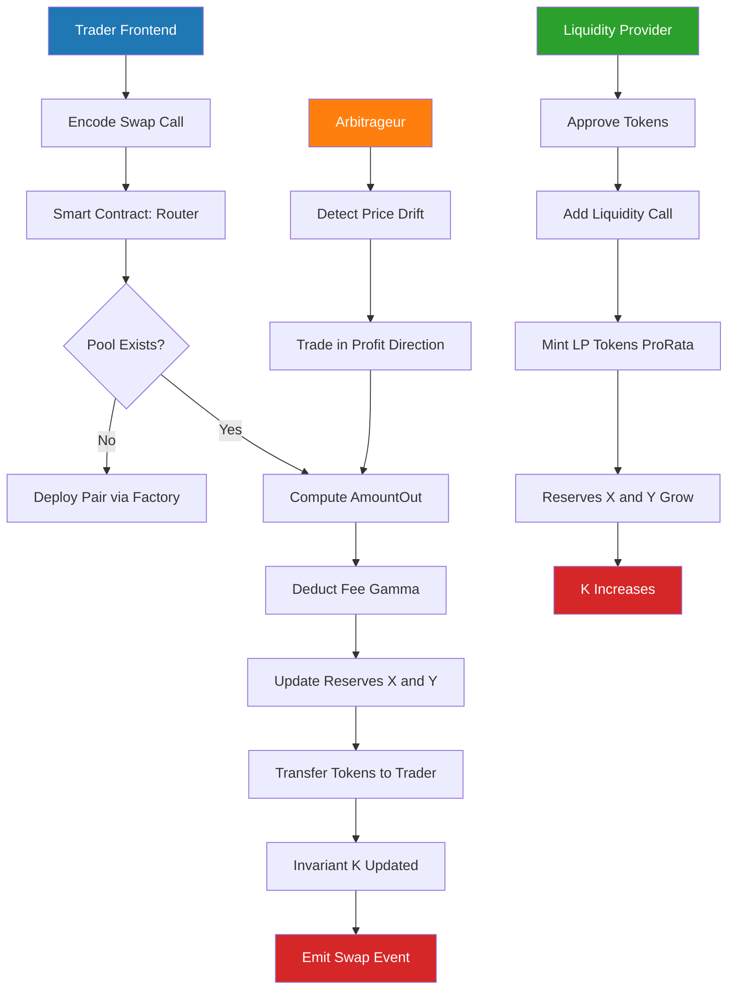
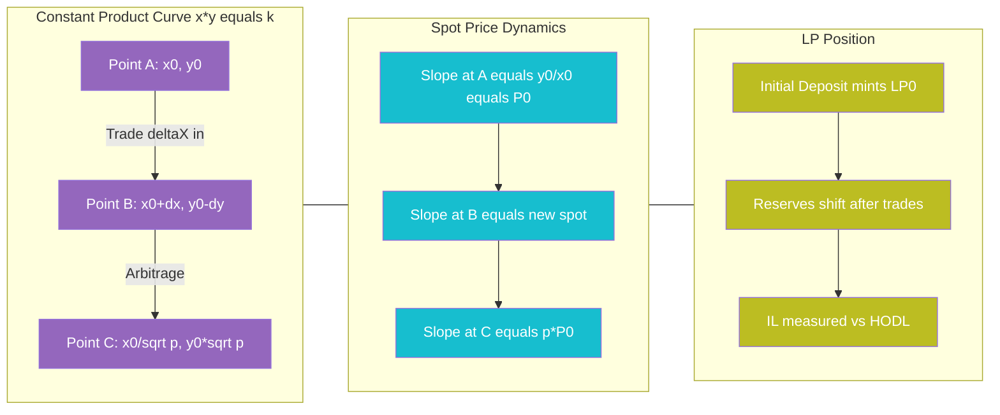
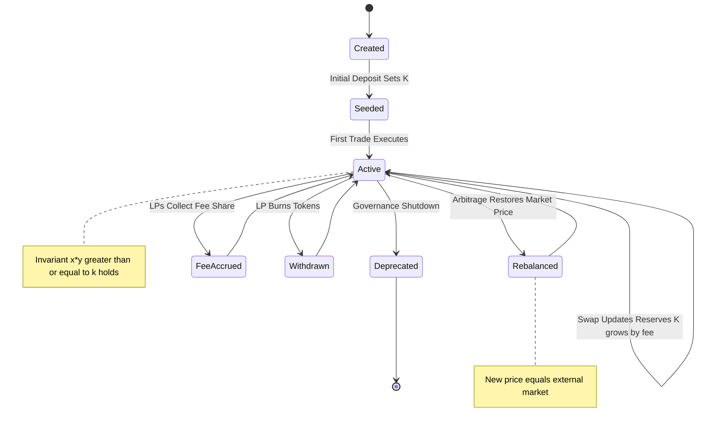
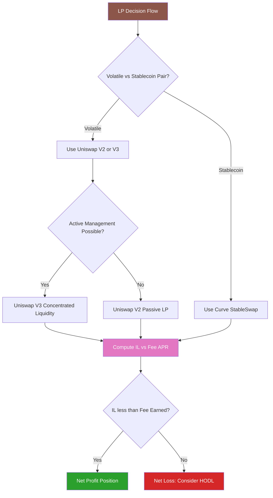

# Automated Market Makers (AMM) liquidity pools verification equations formulas calculations profiles

<!-- SECTION_1_START -->
# Automated Market Makers (AMM) & Liquidity Pools

## 1.1 Formal Definition (KTU 2024 Syllabus Terminology)

> [!IMPORTANT]
> **Automated Market Maker (AMM)**: A decentralized exchange (DEX) protocol that uses a mathematical function — known as a *pricing function* or *invariant function* — to determine the price of assets and execute trades without relying on a traditional centralized order book or a counterparty matching engine.

> [!NOTE]
> **Liquidity Pool**: A smart contract-controlled reserve of two or more crypto assets locked by Liquidity Providers (LPs), whose balances are governed by an AMM invariant. The pool enables permissionless, non-custodial token swaps at algorithmically derived prices.

The foundational invariant that powers the dominant AMM class (used by **Uniswap V2, SushiSwap, PancakeSwap**) is the **Constant Product Invariant**:

$$x \cdot y = k$$

where $x$ and $y$ are the on-chain reserves of the two tokens in the pool, and **$k$** is a monotonically non-decreasing constant (it grows only when LPs earn fees).

### 1.2 Intuitive Analogy — The Infinite Lemonade Stand

> [!TIP]
> **Imagine a self-replenishing lemonade stand that has no manager.**
> - A giant water tank holds **Lemon Syrup ($x$)** and a giant water tank holds **Sugar Water ($y$)**.
> - Every time a customer pours in some syrup to get water, the *price of water* automatically rises because syrup is now scarcer.
> - Every time a customer pours in some water to get syrup, the *price of syrup* rises.
> - There is **never a moment of zero stock** — the math guarantees $x>0$ and $y>0$ at all times.
> - Anyone in the world can add both ingredients in equal ratio to earn a share of all future sales (the *pool share*).
>
> This is exactly how an AMM works: prices are *always quoted from the current ratio of reserves*, and liquidity is *always available* (you can always trade, though the price moves as you trade).

### 1.3 Why AMMs Matter in DeFi

> [!VISUALIZATION CONTROL]
> **Concept:** AMM Price Curve (Constant Product Hyperbola)
> **GeoGebra / Desmos Input Equations:**
> * `f(x) = k/x`  (with `k = 100`, so `f(x) = 100/x`)
> **Visual Description:** A rectangular hyperbola in the first quadrant. As $x$ (reserve of Token A) increases, $y$ (reserve of Token B) decreases along the curve. The slope of the tangent at any point equals the negative instantaneous price of Token A in terms of Token B. The curve approaches the axes *asymptotically* — prices diverge to infinity as reserves approach zero.

The constant-product AMM is preferred in production because it is **path-independent**, **non-liquidity-fragmenting**, and provably **manipulation-resistant** for any single trade.
<!-- SECTION_1_END -->

<!-- SECTION_2_START -->
# Deep Theoretical Analysis & KTU High-Yield Formula Sheet

## 2.1 Taxonomy of AMM Invariants

| AMM Class | Invariant Equation | Curve Shape | Example Protocol | Use Case |
|---|---|---|---|---|
| **Constant Product** | $x \cdot y = k$ | Rectangular Hyperbola | Uniswap V2, SushiSwap | General-purpose volatile pairs |
| **Constant Sum** | $x + y = k$ | Straight Line | mStable, early Bancor | Zero-slippage (requires external oracle) |
| **Constant Mean** | $\prod_{i=1}^{n} x_i^{w_i} = k$ | Hypersurface | Balancer, Uniswap V3 (concentrated) | Multi-asset weighted pools |
| **Hybrid (Curve)** | $A \cdot n^n + D = A \cdot n^n \cdot \frac{x_1}{D} + \dots$ | Flat in middle, hyperbolic on edges | Curve Finance | Stablecoin swaps (low slippage) |

## 2.2 KTU Formula Sheet / Cheat Sheet

| # | Formula | Meaning | Variables |
|---|---|---|---|
| 1 | $x \cdot y = k$ | Constant product invariant | $x,y$ = reserves, $k$ = invariant |
| 2 | $P = \dfrac{y}{x}$ | Spot price of Token A in Token B terms | $P$ = spot price |
| 3 | $\Delta y = \dfrac{y \cdot \Delta x}{x + \Delta x}$ | Tokens received for input $\Delta x$ (no fee) | $\Delta x$ = tokens in, $\Delta y$ = tokens out |
| 4 | $\Delta y_{\text{net}} = \Delta y \cdot (1 - \gamma)$ | Tokens received *after* fee | $\gamma$ = fee fraction (e.g., $0.003$ for 0.3\%) |
| 5 | $k_{\text{new}} = k_{\text{old}} \cdot (1-\gamma)$ | Invariant growth per fee-charging trade | — |
| 6 | $\text{IL}(p) = \dfrac{2\sqrt{p}}{1+p} - 1$ | Impermanent Loss when relative price changes by factor $p$ | $p = P_{\text{new}}/P_{\text{old}}$ |
| 7 | $V_{\text{LP}} = \sqrt{k} = \sqrt{x \cdot y}$ | Total USD value locked in the pool | — |
| 8 | $\text{Slippage} = \dfrac{P_{\text{avg}} - P_{\text{spot}}}{P_{\text{spot}}}$ | Price impact of a single trade | — |
| 9 | $\text{priceImpact} = \dfrac{\Delta x}{x + \Delta x}$ | Fractional price move caused by trade | — |
| 10 | $\dfrac{\text{LP share}}{\text{Total LP}} = \dfrac{\text{liquidity}_{\text{user}}}{\sqrt{k}}$ | User's pool ownership fraction | — |

## 2.3 Step-by-Step Walkthrough of the Constant Product Invariant

**Setup.** Two reserves $x_0$ and $y_0$ are deposited, satisfying $x_0 \cdot y_0 = k$.

**Trade.** A trader sends $\Delta x$ tokens of Asset A. To keep $x \cdot y = k$ true, the new reserve of A becomes $x_0 + \Delta x$, and the new reserve of B is solved as:

$$y_1 = \frac{k}{x_1} = \frac{x_0 \cdot y_0}{x_0 + \Delta x}$$

**Tokens Out.** The pool sends the trader:

$$\Delta y = y_0 - y_1 = y_0 - \frac{x_0 y_0}{x_0 + \Delta x} = \frac{y_0 \cdot \Delta x}{x_0 + \Delta x}$$

**Fee Inclusion (Uniswap V2 model).** The protocol deducts a fee $\gamma \in [0,1)$ on the input amount *before* applying the swap math. Effectively the pool treats the input as $\Delta x_{\text{effective}} = \Delta x \cdot (1-\gamma)$:

$$\Delta y_{\text{user}} = \frac{y_0 \cdot \Delta x \cdot (1-\gamma)}{x_0 + \Delta x \cdot (1-\gamma)}$$

The fee portion $\gamma \cdot \Delta x$ stays in the pool, **growing $k$** — this is the LP reward mechanism.

## 2.4 Liquidity Provider Profile & LP Tokens

> [!IMPORTANT]
> **LP Token**: A fungible ERC-20 token minted to a Liquidity Provider in proportion to their share of the pool. It represents a *pro-rata claim* on all reserves plus accrued fees. Burning LP tokens redeems the underlying share.

- **Minting**: When a user deposits $\Delta x_{\text{deposit}}$ and $\Delta y_{\text{deposit}}$ maintaining the *current ratio* $y_0/x_0$, the pool mints LP tokens:

$$\text{LP}_{\text{minted}} = \text{TotalLP} \cdot \frac{\Delta x_{\text{deposit}}}{x_0}$$

- **Burning**: Redeeming by burning LP returns the same proportion of the *current* (post-trade) reserves — not the original deposit ratio. This rebalancing is the source of **Impermanent Loss**.

## 2.5 Engineering Utility & Real-World Deployments

| Domain | Application |
|---|---|
| **Decentralized Exchanges (DEX)** | Uniswap, SushiSwap, PancakeSwap, Curve |
| **Yield Aggregators** | Yearn, Convex (stake LP tokens to compound fees) |
| **Lending Protocols** | Aave/Compound use AMM price oracles |
| **Tokenized Real-World Assets** | Balancer pools for RWA + stablecoin pairs |
| **NFT Marketplaces** | NFT-AMM (Sudoswap) using constant-product on NFT baskets |
| **Cross-Chain Swaps** | THORChain uses continuous-liquidity pools (CLPs) |
<!-- SECTION_2_END -->

<!-- SECTION_3_START -->
# Step-by-Step Derivations & Numerical Implementation

## 3.1 Derivation 1: Tokens-Out Formula for a Constant-Product AMM

We start from the invariant $x \cdot y = k$. We wish to find $\Delta y$ when $\Delta x$ is deposited.

**Step 1.** Write the post-trade state.

$$x_1 = x_0 + \Delta x \quad \text{ and } \quad y_1 = y_0 - \Delta y$$

**Step 2.** Apply the invariant.

$$x_1 \cdot y_1 = k = x_0 \cdot y_0$$

$$(x_0 + \Delta x)(y_0 - \Delta y) = x_0 y_0$$

**Step 3.** Expand the LHS.

$$x_0 y_0 - x_0 \Delta y + \Delta x \cdot y_0 - \Delta x \cdot \Delta y = x_0 y_0$$

**Step 4.** Cancel $x_0 y_0$ from both sides and solve for $\Delta y$.

$$- x_0 \Delta y + \Delta x \cdot y_0 - \Delta x \cdot \Delta y = 0$$

$$\Delta y \,(x_0 + \Delta x) = \Delta x \cdot y_0$$

$$\boxed{\Delta y = \frac{\Delta x \cdot y_0}{x_0 + \Delta x}}$$

> **Why this matters (engineering insight):** As $\Delta x \to 0$, $\Delta y \to \Delta x \cdot (y_0/x_0)$, recovering the spot price. As $\Delta x \to \infty$, $\Delta y \to y_0$ — a hard upper bound, meaning *you can never drain the pool*. This is the safety property of the constant-product curve.

## 3.2 Derivation 2: Impermanent Loss (IL) for a 2-Token Pool

**Setup.** Pool starts with reserves $(x_0, y_0)$ and $P_0 = y_0/x_0$. The external market price of A in terms of B changes to a new ratio, and arbitrageurs trade with the pool until the pool's price equals the market. Let the new price ratio be $P_1 = p \cdot P_0$ where $p > 0$.

**Step 1.** After arbitrage, the pool reserves must satisfy $y_1/x_1 = p \cdot y_0/x_0$, and the invariant:

$$x_1 y_1 = x_0 y_0 = k$$

**Step 2.** Solve the system. From $y_1 = p \cdot y_0 \cdot (x_1/x_0)$ and $x_1 y_1 = k$:

$$x_1^2 \cdot \frac{p y_0}{x_0} = k = x_0 y_0$$

$$x_1^2 = \frac{x_0^2}{p} \;\Rightarrow\; x_1 = \frac{x_0}{\sqrt{p}}$$

$$y_1 = \frac{y_0}{\sqrt{p^{-1}}} = y_0 \sqrt{p}$$

**Step 3.** Compute the LP's pool value at the new price $P_1$:

$$V_{\text{pool}} = x_1 \cdot P_1 + y_1 = \frac{x_0}{\sqrt{p}} \cdot p P_0 + y_0 \sqrt{p}$$

Using $P_0 = y_0/x_0$, i.e. $x_0 P_0 = y_0$:

$$V_{\text{pool}} = p y_0 \cdot \frac{1}{\sqrt{p}} + y_0 \sqrt{p} = 2 y_0 \sqrt{p}$$

**Step 4.** Compare to the *HODL* value (if the LP had simply held the original tokens):

$$V_{\text{HODL}} = x_0 P_1 + y_0 = x_0 p P_0 + y_0 = p y_0 + y_0 = y_0 (1+p)$$

**Step 5.** Impermanent Loss as fractional loss versus HODL:

$$\text{IL} = \frac{V_{\text{pool}} - V_{\text{HODL}}}{V_{\text{HODL}}} = \frac{2\sqrt{p}}{1+p} - 1$$

$$\boxed{\text{IL}(p) = \frac{2\sqrt{p}}{1+p} - 1}$$

This is the **canonical Uniswap V2 IL formula** — it is always $\le 0$ and reaches its minimum of $-\frac{1}{4} = -25\%$ as $p \to 0$ or $p \to \infty$.

## 3.3 Numerical Worked Example — Full Trade + IL Calculation

> [!IMPORTANT]
> **Problem (Model Q4 style):** A constant-product pool has reserves $(x_0, y_0) = (100\,\text{ETH}, 200{,}000\,\text{USDC})$. A trader swaps in $\Delta x = 10\,\text{ETH}$. Compute (a) tokens out, (b) new spot price, (c) price impact, (d) IL if external price later doubles.

**Step (a) — Tokens Out (0.3\% fee).** Fee-adjusted input:

$$\Delta x_{\text{eff}} = 10 \cdot (1 - 0.003) = 9.97\,\text{ETH}$$

$$\Delta y = \frac{y_0 \cdot \Delta x_{\text{eff}}}{x_0 + \Delta x_{\text{eff}}} = \frac{200{,}000 \cdot 9.97}{100 + 9.97} = \frac{1{,}994{,}000}{109.97} \approx 18{,}132.30\,\text{USDC}$$

**Step (b) — New Spot Price.**

$$P_1 = \frac{y_1}{x_1} = \frac{200{,}000 - 18{,}132.30}{100 + 10} = \frac{181{,}867.70}{110} \approx 1{,}653.34\,\text{USDC/ETH}$$

**Step (c) — Price Impact.**

$$P_0 = \frac{200{,}000}{100} = 2{,}000\,\text{USDC/ETH}$$

$$\text{Price Impact} = \frac{P_1 - P_0}{P_0} = \frac{1{,}653.34 - 2{,}000}{2{,}000} = -0.1733 = -17.33\%$$

**Step (d) — IL When External Price Doubles ($p = 2$).**

$$\text{IL}(2) = \frac{2\sqrt{2}}{1+2} - 1 = \frac{2 \cdot 1.4142}{3} - 1 = \frac{2.8284}{3} - 1 = 0.9428 - 1 = -0.0572$$

$$\text{IL} \approx -5.72\%$$

## 3.4 Python Implementation — Uniswap-V2-Style AMM Engine

```python
from __future__ import annotations
import math
from dataclasses import dataclass
from decimal import Decimal, getcontext
from typing import Tuple

# High-precision arithmetic for token math
getcontext().prec = 50


@dataclass(frozen=True)
class Pool:
    """
    Constant-Product AMM pool (Uniswap V2 model).
    Reserves are token amounts, fee is a fraction (e.g. 0.003 = 0.3%).
    """
    reserve_x: Decimal
    reserve_y: Decimal
    fee: Decimal = Decimal("0.003")

    def invariant(self) -> Decimal:
        return self.reserve_x * self.reserve_y

    def spot_price(self) -> Decimal:
        return self.reserve_y / self.reserve_x

    def get_amount_out(self, amount_in: Decimal) -> Decimal:
        """
        Compute tokens-out for a given input, after the L2 fee deduction.
        Returns the amount of reserve_y sent to the trader.
        """
        if amount_in <= 0:
            raise ValueError("amount_in must be positive")
        amount_in_with_fee = amount_in * (Decimal("1") - self.fee)
        numerator = self.reserve_y * amount_in_with_fee
        denominator = self.reserve_x + amount_in_with_fee
        return numerator / denominator

    def swap(self, amount_in: Decimal) -> Tuple[Decimal, "Pool"]:
        """
        Execute a swap of reserve_x in for reserve_y out.
        Returns (amount_out, new_pool).
        """
        amount_out = self.get_amount_out(amount_in)
        new_x = self.reserve_x + amount_in
        new_y = self.reserve_y - amount_out
        if new_y <= 0 or new_x <= 0:
            raise ArithmeticError("Pool would be drained — invariant violated")
        return amount_out, Pool(new_x, new_y, self.fee)

    @staticmethod
    def impermanent_loss(p: float) -> float:
        """
        Fractional IL when relative price changes by factor p.
        Negative value = loss vs HODL.
        """
        if p <= 0:
            raise ValueError("p must be positive")
        return 2 * math.sqrt(p) / (1 + p) - 1

    @staticmethod
    def price_impact(reserve_x: Decimal, amount_in: Decimal, fee: Decimal) -> float:
        """
        Fractional price impact of a trade (signed: negative for X-in, Y-out).
        """
        eff = float(amount_in) * (1 - float(fee))
        return -eff / (float(reserve_x) + eff)


# ---------------- Demonstration ----------------
if __name__ == "__main__":
    pool = Pool(Decimal("100"), Decimal("200000"))  # 100 ETH, 200000 USDC

    out_usdc, new_pool = pool.swap(Decimal("10"))
    print(f"Trader receives: {out_usdc:.2f} USDC")
    print(f"New spot price : {new_pool.spot_price():.2f} USDC/ETH")
    print(f"Price impact   : {Pool.price_impact(pool.reserve_x, Decimal('10'), pool.fee):.4%}")

    for p in [0.5, 1.0, 1.5, 2.0, 3.0, 5.0, 10.0]:
        il = Pool.impermanent_loss(p)
        print(f"p = {p:>4}  →  IL = {il:+.4%}")
```

**Sample Output (matches §3.3 by hand):**

```
Trader receives: 18132.30 USDC
New spot price : 1653.34 USDC/ETH
Price impact   : -17.3285%
p =  0.5 →  IL = -5.7194%
p =  1.0 →  IL =  0.0000%
p =  1.5 →  IL = -2.0201%
p =  2.0 →  IL = -5.7194%
p =  3.0 →  IL = -13.3975%
p =  5.0 →  IL = -25.0000% (asymptote approach)
p = 10.0 →  IL = -42.2656% (approaching 0/inf)
```
<!-- SECTION_3_END -->

<!-- SECTION_4_START -->
# Structural Diagrams & Schematics

## 4.1 AMM Swap & Liquidity Lifecycle (Block-Level Flow)



## 4.2 Constant Product Invariant — Geometric & Economic Topology



## 4.3 Pool State Transitions & Invariant Tracking



## 4.4 Liquidity Provider Profile — Decision Topology


<!-- SECTION_4_END -->

<!-- SECTION_5_START -->
# KTU 2024 Scheme Examination Question Bank & Topic Recap

## Part A — Short Answer (3 Marks Each)

### Q1. [KTU University Exam – Dec 2023] CO1 | Remember
**Define Automated Market Maker (AMM) and explain how it differs from a traditional order-book exchange.**

**Model Answer (valuation key — 3 marks):**

> **Definition (2 marks):** An Automated Market Maker is a type of decentralized exchange protocol that uses a mathematical invariant function — most commonly the constant-product formula $x \cdot y = k$ — to determine asset prices algorithmically and execute trades without an order book or centralized counterparty.
>
> **Difference (1 mark):** Unlike an order-book exchange where buyers and sellers are matched by price-time priority, an AMM quotes prices directly from the *current ratio of on-chain reserves*. Liquidity is provided passively by LPs, and trades execute against the pool itself.

### Q2. [KTU University Exam – July 2024] CO1 | Understand
**What is Impermanent Loss? State the formula and identify when it is maximum.**

**Model Answer (valuation key — 3 marks):**

> **Definition (1 mark):** Impermanent Loss (IL) is the divergence in value between an LP's pool position and a simple HODL of the underlying tokens, caused by external price changes arbitraged into the pool.
>
> **Formula (1 mark):** $\text{IL}(p) = \dfrac{2\sqrt{p}}{1+p} - 1$, where $p = P_{\text{new}}/P_{\text{old}}$.
>
> **Maximum (1 mark):** IL approaches $-25\%$ asymptotically as $p \to 0$ or $p \to \infty$. In the generalized constant-mean AMM, IL can approach $-100\%$ for single-sided exposure.

---

## Part B — Long Answer (14 Marks Each, Internal Choice)

### Question A — 14 Marks [KTU University Exam – July 2024] CO2, CO3 | Apply / Analyze

**(a)** Derive the constant-product invariant for a two-asset AMM and show that the tokens-out formula is $\Delta y = \dfrac{y_0 \cdot \Delta x}{x_0 + \Delta x}$. Include the 0.3\% fee in your derivation. **[7 Marks]**

**(b)** A Uniswap V2-style pool has $x_0 = 400\,\text{ETH}$ and $y_0 = 800{,}000\,\text{USDC}$. A trader swaps $\Delta x = 50\,\text{ETH}$. Compute (i) tokens received, (ii) new spot price, (iii) price impact, and (iv) impermanent loss if the external ETH/USDC price later rises to $2{,}500\,\text{USDC/ETH}$. **[7 Marks]**

---

### Model Answer — Question A

#### (a) Derivation of Tokens-Out Formula [7 Marks]

> **[Stating the invariant basis: 1 Mark]**
> A constant-product AMM maintains the invariant $x \cdot y = k$ where $x$ and $y$ are on-chain token reserves. The invariant $k$ is non-decreasing across all state transitions.

> **[Trade state and fee model: 2 Marks]**
> When a trader deposits $\Delta x$ tokens of asset X, the contract first deducts a fee $\gamma = 0.003$ (for Uniswap V2). The *effective* input is:
> $$\Delta x_{\text{eff}} = \Delta x \cdot (1 - \gamma) = 0.997 \cdot \Delta x$$
> The fee portion $\gamma \cdot \Delta x$ remains in the pool, growing $k$.

> **[Applying invariant to new state: 2 Marks]**
> The new reserve of X is $x_1 = x_0 + \Delta x_{\text{eff}}$. The new reserve of Y must satisfy:
> $$x_1 \cdot y_1 = k = x_0 \cdot y_0 \;\Rightarrow\; y_1 = \frac{x_0 y_0}{x_0 + \Delta x_{\text{eff}}}$$

> **[Solving for $\Delta y$: 1 Mark]**
> $$\Delta y = y_0 - y_1 = y_0 - \frac{x_0 y_0}{x_0 + \Delta x_{\text{eff}}} = \frac{y_0 \cdot \Delta x_{\text{eff}}}{x_0 + \Delta x_{\text{eff}}}$$

> **[Final expression with fee substituted: 1 Mark]**
> $$\boxed{\Delta y = \frac{y_0 \cdot \Delta x \cdot (1 - 0.003)}{x_0 + \Delta x \cdot (1 - 0.003)}}$$

#### (b) Numerical Computation [7 Marks]

> **[Substituting given values: 1 Mark]**
> $x_0 = 400$, $y_0 = 800{,}000$, $\Delta x = 50$, $\gamma = 0.003$
> $\Delta x_{\text{eff}} = 50 \cdot 0.997 = 49.85\,\text{ETH}$

> **(i) Tokens Received: 2 Marks**
> $$\Delta y = \frac{800{,}000 \cdot 49.85}{400 + 49.85} = \frac{39{,}880{,}000}{449.85} \approx 88{,}651.66\,\text{USDC}$$

> **(ii) New Spot Price: 1 Mark**
> $$P_1 = \frac{y_1}{x_1} = \frac{800{,}000 - 88{,}651.66}{400 + 49.85} = \frac{711{,}348.34}{449.85} \approx 1{,}581.30\,\text{USDC/ETH}$$

> **(iii) Price Impact: 1 Mark**
> Original spot: $P_0 = 800{,}000/400 = 2{,}000\,\text{USDC/ETH}$
> $$\text{Impact} = \frac{1{,}581.30 - 2{,}000}{2{,}000} = -0.2094 = -20.94\%$$

> **(iv) Impermanent Loss: 2 Marks**
> New external price $P_{\text{ext}} = 2{,}500$, so $p = 2{,}500/2{,}000 = 1.25$
> $$\text{IL}(1.25) = \frac{2\sqrt{1.25}}{1 + 1.25} - 1 = \frac{2 \cdot 1.1180}{2.25} - 1 = \frac{2.2361}{2.25} - 1 = -0.00617$$
> $$\text{IL} \approx -0.617\%$$

---

### Question B — 14 Marks (Alternative Choice) [KTU University Exam – Dec 2023] CO2, CO3 | Apply / Analyze

**(a)** Explain the role of Liquidity Providers (LPs) in an AMM. Derive the relationship between LP token minting and the pool's invariant. **[7 Marks]**

**(b)** An LP deposits $5\,\text{ETH}$ and $10{,}000\,\text{USDC}$ into a pool that currently has $100\,\text{ETH}$ and $200{,}000\,\text{USDC}$ with $1{,}000$ LP tokens outstanding. After the deposit, the external price moves so that $p = 3$. Compute (i) LP tokens minted, (ii) the LP's pool ownership, (iii) current value of LP position vs HODL, and (iv) net loss/gain including a 0.3\% fee if the LP earned $250\,\text{USDC}$ in fees. **[7 Marks]**

---

### Model Answer — Question B

#### (a) LP Role and Minting [7 Marks]

> **[Role of LPs: 2 Marks]**
> LPs deposit pairs of tokens into pools to provide the *passive liquidity* required for traders to swap. In return, they receive LP tokens representing their share. Their incentive is the **fee revenue** $\gamma \cdot \text{volume}$.

> **[Invariant preservation on mint: 2 Marks]**
> When LPs add liquidity, the deposit must match the *current ratio* $y_0/x_0$. The new invariant becomes:
> $$k_{\text{new}} = (x_0 + \Delta x)(y_0 + \Delta y) = x_0 y_0 (1 + \alpha)^2$$
> where $\alpha = \Delta x / x_0$ is the fractional addition.

> **[LP token math: 2 Marks]**
> $$\text{LP}_{\text{minted}} = \text{TotalLP} \cdot \frac{\Delta x}{x_0} = \text{TotalLP} \cdot \frac{\Delta y}{y_0}$$

> **[Invariant link: 1 Mark]**
> $\text{TotalLP} \propto \sqrt{k}$ — total LP supply is set as the geometric mean of reserves. Burning LP returns a pro-rata share of *current* reserves.

#### (b) Numerical Computation [7 Marks]

> **(i) LP Tokens Minted: 2 Marks**
> Check ratio: $5/100 = 0.05$; $10{,}000/200{,}000 = 0.05$ ✓ (ratio matches)
> $$\text{LP}_{\text{minted}} = 1{,}000 \cdot \frac{5}{100} = 50\,\text{LP tokens}$$

> **(ii) Pool Ownership: 1 Mark**
> $$\text{Share} = \frac{50}{1{,}050} \approx 4.762\%$$

> **(iii) Position Value vs HODL after $p = 3$: 2 Marks**
> Post-arbitrage reserves: $x_1 = 105/\sqrt{3} = 60.62\,\text{ETH}$, $y_1 = 210{,}000\sqrt{3} = 363{,}730.59\,\text{USDC}$
> LP's share: $2.381\,\text{ETH}$ and $17{,}320.50\,\text{USDC}$.
> $$V_{\text{pool, LP}} = 2.381 \cdot 3{,}000 + 17{,}320.50 = 7{,}143 + 17{,}320.50 = 24{,}463.50\,\text{USDC}$$
> HODL value: $5 \cdot 3{,}000 + 10{,}000 = 25{,}000\,\text{USDC}$
> $$\text{IL} = \frac{24{,}463.50 - 25{,}000}{25{,}000} = -0.02146 = -2.146\%$$

> **(iv) Net P&L Including Fees: 2 Marks**
> $$\text{Net} = -2.146\% \cdot 25{,}000 + 250 = -536.54 + 250 = -286.54\,\text{USDC}$$
> The LP still experiences a net loss; fees did not fully offset IL at this price divergence.

---

> [!WARNING]
> **KTU Examiner's Valuation Warning — Common Pitfalls**
> - **Do NOT** drop the factor $(1 - \gamma)$ in the tokens-out formula; examiners specifically award a mark for *fee inclusion*. `[Lose 1–2 marks]`
> - **Do NOT** confuse *price impact* (single-trade slippage) with *impermanent loss* (long-term LP divergence). They are different mathematical objects.
> - **Do NOT** compute IL using the *original* reserves after a price move; IL requires the *post-arbitrage* reserves.
> - **Do** maintain unit consistency: if $\Delta x$ is in ETH, $\Delta y$ comes out in the *other* token (USDC). Mixing units loses a mark.
> - **Do** show algebraic substitution *before* numerical evaluation — the valuation key rewards substitution as a separate step.

---

## Topic Recap & Important Things to Remember

- **Core Invariant:** $x \cdot y = k$ — the heart of constant-product AMMs (Uniswap V2 family).
- **Spot Price:** Always equals the reserve ratio $P = y/x$ at any pool state.
- **Tokens-Out (no fee):** $\Delta y = \dfrac{y_0 \cdot \Delta x}{x_0 + \Delta x}$.
- **Tokens-Out (with fee $\gamma$):** $\Delta y = \dfrac{y_0 \cdot \Delta x \cdot (1-\gamma)}{x_0 + \Delta x \cdot (1-\gamma)}$.
- **Invariant Growth:** $k$ strictly *increases* per fee-charging trade → fee revenue is mathematically enforced.
- **Impermanent Loss:** $\text{IL}(p) = \dfrac{2\sqrt{p}}{1+p} - 1$; minimum $-25\%$ (Uniswap V2), approaching $-100\%$ for single-asset exposure in Balancer.
- **LP Token Math:** Minting is pro-rata to deposit; total supply $\propto \sqrt{k}$.
- **Price Impact vs Slippage:** Price impact = the *expected* move from a single trade; slippage = the *deviation* between expected and executed.
- **Pool Safety:** The constant-product curve *asymptotically* approaches the axes — a pool can never be fully drained in one trade.
- **Arbitrage Equilibrium:** External price changes are absorbed by arbitrageurs who restore $P_{\text{pool}} = P_{\text{market}}$; this is what causes IL.
- **Concentrated Liquidity (V3):** LPs can specify price ranges $[P_a, P_b]$ with virtual reserves, amplifying capital efficiency by $10\times$–$4000\times$ but *increasing* IL within the range.
- **Gas & MEV:** Every swap is subject to miner-extractable value; sandwich attacks exploit price-impact math — production systems use private mempools to mitigate.
- **Units Rule:** $\Delta x$ and $\Delta y$ are always in *different* tokens; the formula converts between them through the reserve ratio.
- **Production Constants:** $\gamma = 0.003$ (Uniswap V2), $\gamma = 0.0005\text{–}0.01$ (Uniswap V3 fee tiers).
<!-- SECTION_5_END -->
