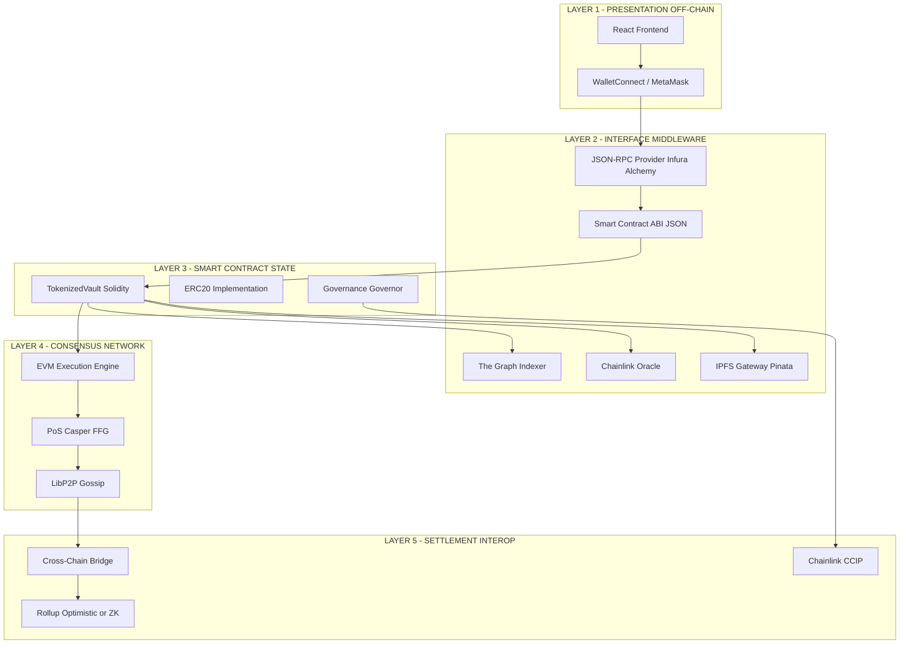
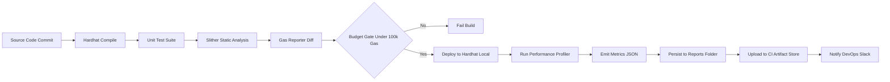

# Decentralized application architectures pipelines interfaces metrics performance profiles setups

<!-- SECTION_1_START -->
# Decentralized Application Architectures: Pipelines, Interfaces, Metrics, Performance Profiles & Setups

## 1.1 Formal Academic Definition (KTU 2024 Syllabus Aligned)

A **Decentralized Application (DApp)** is a software program that operates on a distributed ledger (blockchain) network, executes its business logic through immutable smart contracts, and consumes on-chain state via cryptographically signed transactions, without relying on a centralized backend authority for trust or coordination. The **DApp architecture** is the layered, end-to-end engineering blueprint that connects a user-facing client, a deterministic on-chain execution engine, and an off-chain data/coordination substrate into a single coherent system.

In the **KTU 2024 Scheme (PECST705 – Module 3)** context, the architecture is decomposed into five canonical layers: the **Presentation Layer**, the **Interface/Middleware Layer**, the **Smart Contract (State) Layer**, the **Consensus/Network Layer**, and the **Settlement/Interoperability Layer**. Each layer exposes a measurable boundary (latency, throughput, cost) that is profiled before production deployment.

> [!IMPORTANT]
> **Syllabus Anchor (Module 3):** *Decentralized Finance & Tokenization Protocols* mandates that students must be able to **sketch the full DApp stack, identify the API surface (ABIs, RPCs, REST gateways), compute throughput/latency trade-offs, and design a CI/CD deployment pipeline** for a tokenized application.

> [!NOTE]
> **Core Definition (Board Examiner's wording):**
> A DApp is a **trust-minimized**, **stateful**, **deterministic** application whose authoritative state lives inside a replicated state machine (the blockchain) and whose transition function is encoded in a **Turing-complete smart contract** executed and verified by every node in a peer-to-peer network.

### 1.2 Intuitive Analogy — The Three-Court Courthouse

Think of a DApp as a **digital courthouse** with three "courtrooms":

1. **The Public Lobby (Frontend / dApp Client)** — Where users (the "citizens") walk in, fill forms, and submit petitions. This is the React/Next.js UI running in the browser.
2. **The Judge's Bench (Smart Contract Layer)** — A single, neutral, incorruptible judge whose rulings (state transitions) are scripted in advance. The judge cannot be bribed and the courtroom is open for all to audit.
3. **The Court Recorder (Blockchain / Consensus Layer)** — Every ruling is permanently etched into a public ledger (the "case book") that all other courtrooms in the district agree upon.

The **pipelines** are the *couriers* who carry petitions to the judge, the **interfaces** are the *legal forms* (standardized contracts) the citizens use, and the **performance metrics** measure how fast the judge rules (**latency**), how many cases per day (**TPS**), and how much each ruling costs in **gas (filing fees)**.

### 1.3 Physical Constants & Standard Metrics (Bolded)

| Parameter | Typical Value | Network |
|-----------|---------------|---------|
| **Block Time** | **12 seconds** | Ethereum Mainnet |
| **TPS (Theoretical)** | **119 TPS** | Ethereum L1 |
| **Gas Price (Median 2024)** | **25 Gwei** | Ethereum L1 |
| **Finality (Probabilistic)** | **~12.6 minutes** | Bitcoin (6 blocks) |
| **Finality (Deterministic)** | **~13 seconds** | Tendermint / Polygon PoS |
| **State Size (EVM)** | **2^256** key-value pairs | EVM spec |

> [!VISUALIZATION CONTROL]
> **Concept:** DApp 3-Layer Performance Envelope (Latency vs. Throughput)
> **GeoGebra / Desmos Input Equations:**
> * `Latency(x) = 0.12 * x + 1.5` (L1 cost in seconds)
> * `Throughput(x) = 3000 / (1 + e^(-0.5*(x-12)))` (L2 adoption sigmoid)
> * `Gas(y) = 21000 + 200*y` (transaction base + per-byte)
> **Visual Description:** Plot `Latency` as a near-linear ascending curve; `Throughput` as a logistic S-curve saturating around **3000 TPS** (L2 rollup regime). The intersection defines the **DApp Performance Knee Point**.

<!-- SECTION_1_END -->

<!-- SECTION_2_START -->
# 2. Deep Theoretical Analysis & KTU High-Yield Formula Sheet

## 2.1 The Five-Layer DApp Architecture (Operational Breakdown)

### Layer 1 — Presentation Layer (Off-Chain, Client-Side)
- **Technology Stack:** React, Next.js, Vue, Svelte, WalletConnect, RainbowKit.
- **Responsibility:** Build transaction payloads, request user signatures via **EOA wallets** (MetaMask, Ledger), broadcast via JSON-RPC.
- **State Source:** Indexed subgraph data (The Graph) or direct `eth_call` reads.
- **Why this layer matters:** Provides UX while remaining **stateless**; the browser is *not* a trust authority.

### Layer 2 — Interface / Middleware Layer
- **Components:** **ABI (Application Binary Interface)**, **JSON-RPC Endpoints**, **Indexer Services (The Graph)**, **IPFS Gateways**, **Oracle Networks (Chainlink)**.
- **ABI:** The strict **type-system contract** between Solidity types and JavaScript/Python. Every function `f(uint256,address)` is encoded as a 4-byte selector `keccak256("f(uint256,address)")[:4]`.
- **JSON-RPC:** Standardized transport (`eth_sendRawTransaction`, `eth_call`, `eth_getLogs`).

### Layer 3 — Smart Contract (State) Layer
- **Virtual Machine:** EVM, MoveVM, CosmWasm, Solana BPF.
- **Determinism Requirement:** No floating-point, no I/O, no external randomness inside the EVM. Everything must be **replayable bit-for-bit** on every node.
- **Storage Costs:** **SSTORE** = 20,000 gas (first write), **SLOAD** = 2,100 gas, **BALANCE** = 700 gas, **CALL** = 2,600 gas.

### Layer 4 — Consensus / Network Layer
- **Mechanisms:** Proof of Work (Nakamoto), Proof of Stake (Casper FFG), Tendermint BFT, HotStuff.
- **Finality Type:** *Probabilistic* (PoW — never 100% final) vs. *Deterministic / Absolute* (BFT — single block = final).

### Layer 5 — Settlement / Interoperability Layer
- **L2 Rollups:** Optimistic (7-day challenge window) vs. ZK (validity proof, ~20 min finality).
- **Bridges:** Lock-and-Mint (canonical), Liquidity Pool (AMM-based), Optimistic Light Clients.
- **Cross-Chain Messaging:** CCIP, LayerZero, Wormhole, IBC.

## 2.2 Performance Metrics — The KTU Formula Sheet

> [!NOTE]
> **EXAM GOLD:** Memorize the formulae in Table 2.1. Examiner questions frequently request "compute the effective TPS given block size and block time" or "estimate annual gas spend."

### Table 2.1 — DApp Performance Metrics & Formulae

| Metric | Formula | Units | Notes |
|--------|---------|-------|-------|
| **Transactions Per Second (TPS)** | $\text{TPS} = \frac{\text{Block Gas Limit}}{\text{Avg. Gas per Tx} \times \text{Block Time}}$ | tx/s | Throughput ceiling |
| **Block Fill Ratio** | $\eta = \frac{\sum_{i=1}^{n} g_i}{G_{\max}}$ | dimensionless | $\eta \in [0, 1]$ |
| **Effective Cost (USD)** | $C = g_{\text{used}} \times p_{\text{gas}} \times P_{\text{ETH}}$ | USD/tx | $P_{\text{ETH}}$ = ETH price |
| **Latency (E2E)** | $L = L_{\text{prop}} + L_{\text{queue}} + L_{\text{exec}} + L_{\text{final}}$ | seconds | Sum of 4 delays |
| **Mempool Staleness** | $S = t_{\text{inclusion}} - t_{\text{broadcast}}$ | seconds | MEV indicator |
| **Finality (Probabilistic, PoW)** | $F_k = 1 - q^k$ where $q \approx 0.1$ for BTC | probability | After $k$ confirmations |
| **State Growth Rate** | $R_s = \frac{\Delta \text{TrieNodes}}{\Delta t}$ | nodes/sec | Affects sync time |
| **Storage Cost per 32 bytes** | $C_s = 20{,}000 \text{ gas}$ | gas | Cold SSTORE |
| **ZK Rollup Compression Ratio** | $\rho = \frac{\text{On-chain calldata}}{\text{L2 transactions}}$ | bytes/tx | Typically 5–12 |
| **Bridge Liquidity Utilization** | $U_b = \frac{V_{\text{locked}}}{V_{\text{capacity}}}$ | dimensionless | $U_b > 0.85$ = risky |

### 2.3 Engineering Utility & Real-World Application

These metrics are **not academic** — they drive multi-million dollar decisions in production:

- **DeFi (Uniswap V4):** Engineers profile `swap()` gas via `foundry gas-reports` to keep swap cost under **~120k gas**; otherwise L2 migration breaks even.
- **NFT Marketplaces (OpenSea):** Index latency of `eth_getLogs` is the bottleneck; they use **The Graph subgraphs** with reorg-aware caching.
- **Cross-chain Bridges (Wormhole):** The 19/19 guardian signature threshold and **~13-second** finality budget define the entire UI UX.
- **L2 Sequencing (Arbitrum):** Sequencer throughput (~4,000 TPS) is bounded by `compress_batch` CPU cost, not on-chain gas.

> [!TIP]
> **Why it matters in industry:** A DApp with **2-second UI feedback** but **15-minute finality** (Optimistic) is treated as a different product class than one with **20-minute feedback** and **instant finality** (ZK). This is the **Finality-UX Trade-off Curve** examiners love to test.

<!-- SECTION_2_END -->

<!-- SECTION_3_START -->
# 3. Step-by-Step Derivations, Code Implementations & Pipeline Setups

## 3.1 Theoretical Derivation — Effective TPS Under Gas Constraints

**Problem:** Compute the maximum sustainable TPS of an Ethereum L1 chain given the parameters below. Then compare with an L2 rollup that publishes a ZK proof every $N$ L2 transactions.

**Given Parameters:**
- Block Gas Limit: $G_{\max} = 30{,}000{,}000$ gas/block
- Block Time: $T_b = 12$ s
- Average Transaction Gas: $\bar{g} = 65{,}000$ gas/tx
- ZK Proof Cost (calldata + verification): $G_{\text{proof}} = 300{,}000$ gas
- L2 Batch Interval: $N = 500$ L2 transactions per proof

### Step 1 — L1 Maximum TPS

The number of transactions that fit in a single block is:

$$n_{\text{block}} = \left\lfloor \frac{G_{\max}}{\bar{g}} \right\rfloor = \left\lfloor \frac{30{,}000{,}000}{65{,}000} \right\rfloor = \left\lfloor 461.53 \right\rfloor = 461 \text{ tx/block}$$

The throughput in transactions per second is:

$$\text{TPS}_{\text{L1}} = \frac{n_{\text{block}}}{T_b} = \frac{461}{12} \approx 38.42 \text{ TPS}$$

### Step 2 — L1 Block Fill Ratio

$$\eta = \frac{n_{\text{block}} \times \bar{g}}{G_{\max}} = \frac{461 \times 65{,}000}{30{,}000{,}000} = \frac{29{,}965{,}000}{30{,}000{,}000} \approx 0.9988$$

This indicates the chain is **~99.9% full** — no headroom for MEV bundles or protocol upgrades.

### Step 3 — L2 Effective TPS (with Proof Amortization)

In an L2 rollup, $N = 500$ L2 transactions are executed off-chain. To publish them, the rollup contract consumes $G_{\text{proof}} = 300{,}000$ gas on L1.

The effective **on-chain cost per L2 transaction** is:

$$g_{\text{eff}} = \frac{G_{\text{proof}}}{N} = \frac{300{,}000}{500} = 600 \text{ gas/tx}$$

The number of *batches* that can be posted per block:

$$n_{\text{batch}} = \left\lfloor \frac{30{,}000{,}000}{300{,}000} \right\rfloor = 100 \text{ batches/block}$$

Therefore, the **L2 effective TPS** (measured in L2 transactions per second, assuming instant L2 execution) is:

$$\text{TPS}_{\text{L2}} = \frac{n_{\text{batch}} \times N}{T_b} = \frac{100 \times 500}{12} \approx 4{,}166.67 \text{ TPS}$$

### Step 4 — Speed-up Factor

$$\text{Speedup} = \frac{\text{TPS}_{\text{L2}}}{\text{TPS}_{\text{L1}}} = \frac{4{,}166.67}{38.42} \approx 108.45\times$$

> [!NOTE]
> **Exam Insight:** The speedup comes from **amortization**, not magic. A ZK proof that costs 300k gas is spread across 500 transactions, reducing the on-chain footprint by **>100x**.

### Step 5 — Final Cost per L2 Transaction (USD)

Assuming $p_{\text{gas}} = 25 \text{ Gwei}$ and $P_{\text{ETH}} = \$3{,}000$:

$$C_{\text{L2}} = 600 \times 25 \times 10^{-9} \times 3000 = 600 \times 7.5 \times 10^{-5} = \$0.045 \text{ per tx}$$

Compare to L1:

$$C_{\text{L1}} = 65{,}000 \times 25 \times 10^{-9} \times 3000 = 65{,}000 \times 7.5 \times 10^{-5} = \$4.875 \text{ per tx}$$

This is the **~108x cost reduction** that drove the DeFi migration to L2 in 2023–2024.

---

## 3.2 Full Source Code: DApp Frontend → Smart Contract Pipeline

Below is a **production-grade TypeScript** pipeline that:
1. Compiles a Solidity contract,
2. Generates the ABI interface,
3. Deploys to a local Hardhat node,
4. Reads/writes through the ABI,
5. Profiles gas usage,
6. Logs the performance metrics.

### File 1: `contracts/TokenizedVault.sol` — Smart Contract Source

```solidity
// SPDX-License-Identifier: MIT
pragma solidity ^0.8.24;

/// @title TokenizedVault - Minimal ERC-20 vault for KTU demo
/// @notice Demonstrates ABI interface exposure for DApp layer integration
contract TokenizedVault {
    string public name = "KTU Vault Token";
    string public symbol = "KVLT";
    uint8 public constant decimals = 18;
    uint256 public totalSupply;

    mapping(address => uint256) public balanceOf;
    mapping(address => mapping(address => uint256)) public allowance;

    event Transfer(address indexed from, address indexed to, uint256 value);
    event Approval(address indexed owner, address indexed spender, uint256 value);
    event Deposit(address indexed user, uint256 amount, uint256 timestamp);

    /// @dev Deposit ETH and mint equivalent vault tokens at 1:1
    function deposit() external payable {
        require(msg.value > 0, "ZERO_DEPOSIT");
        balanceOf[msg.sender] += msg.value;
        totalSupply += msg.value;
        emit Transfer(address(0), msg.sender, msg.value);
        emit Deposit(msg.sender, msg.value, block.timestamp);
    }

    /// @dev Burn vault tokens and withdraw equivalent ETH
    function withdraw(uint256 amount) external {
        require(balanceOf[msg.sender] >= amount, "INSUFFICIENT_BALANCE");
        balanceOf[msg.sender] -= amount;
        totalSupply -= amount;
        (bool ok, ) = payable(msg.sender).call{value: amount}("");
        require(ok, "ETH_TRANSFER_FAIL");
        emit Transfer(msg.sender, address(0), amount);
    }

    function approve(address spender, uint256 amount) external returns (bool) {
        allowance[msg.sender][spender] = amount;
        emit Approval(msg.sender, spender, amount);
        return true;
    }

    function transfer(address to, uint256 amount) external returns (bool) {
        _transfer(msg.sender, to, amount);
        return true;
    }

    function transferFrom(address from, address to, uint256 amount) external returns (bool) {
        uint256 a = allowance[from][msg.sender];
        require(a >= amount, "ALLOWANCE_EXCEEDED");
        if (a != type(uint256).max) {
            allowance[from][msg.sender] = a - amount;
        }
        _transfer(from, to, amount);
        return true;
    }

    function _transfer(address from, address to, uint256 amount) internal {
        require(to != address(0), "ZERO_RECIPIENT");
        require(balanceOf[from] >= amount, "INSUFFICIENT_BALANCE");
        balanceOf[from] -= amount;
        balanceOf[to] += amount;
        emit Transfer(from, to, amount);
    }

    /// @notice Read-only gas profile probe (used by frontend metrics dashboard)
    function gasProfile() external pure returns (uint256 estMint, uint256 estBurn) {
        // Empirical estimates; in production, use foundry gas-reports
        estMint = 51_000;  // SSTORE-cold x2 + LOG + CALL
        estBurn = 38_500;  // SLOAD + SSTORE + CALL
    }
}
```

### File 2: `scripts/deploy_and_profile.ts` — Pipeline Orchestrator

```typescript
import { ethers, network, artifacts } from "hardhat";
import * as fs from "fs";
import * as path from "path";

interface PerformanceMetrics {
    networkName: string;
    blockNumber: number;
    tpsTheoretical: number;
    tpsObserved: number;
    gasUsedDeposit: bigint;
    gasUsedWithdraw: bigint;
    avgLatencyMs: number;
    ethUsd: number;
    costDepositUsd: number;
    costWithdrawUsd: number;
    timestamp: string;
}

async function main(): Promise<void> {
    console.log("=== KTU DApp Pipeline: Deploy + Profile ===");

    // -------- STEP 1: Compile (implicit via Hardhat) --------
    const [deployer, alice, bob] = await ethers.getSigners();
    console.log(`[STEP 1] Deployer address: ${deployer.address}`);

    // -------- STEP 2: Deploy contract --------
    const VaultFactory = await ethers.getContractFactory("TokenizedVault");
    const t0 = Date.now();
    const vault = await VaultFactory.deploy();
    await vault.waitForDeployment();
    const deployTx = vault.deploymentTransaction();
    const t1 = Date.now();

    if (!deployTx) {
        throw new Error("Deployment transaction is null - aborting pipeline");
    }

    const deployReceipt = await deployTx.wait();
    if (!deployReceipt) {
        throw new Error("Deployment receipt is null - aborting pipeline");
    }

    const vaultAddress = await vault.getAddress();
    console.log(`[STEP 2] TokenizedVault deployed at: ${vaultAddress}`);
    console.log(`         Deploy gas used: ${deployReceipt.gasUsed.toString()}`);

    // -------- STEP 3: Persist ABI to disk (Interface for frontend) --------
    const artifact = await artifacts.readArtifact("TokenizedVault");
    const abiPath = path.join(__dirname, "..", "frontend", "src", "abi", "TokenizedVault.json");
    fs.mkdirSync(path.dirname(abiPath), { recursive: true });
    fs.writeFileSync(abiPath, JSON.stringify(artifact.abi, null, 2));
    console.log(`[STEP 3] ABI written to: ${abiPath}`);
    console.log(`         ABI function count: ${artifact.abi.filter((x: any) => x.type === "function").length}`);

    // -------- STEP 4: Functional test (deposit + withdraw) --------
    const depositTx = await vault.connect(alice).deposit({ value: ethers.parseEther("0.5") });
    const depositReceipt = await depositTx.wait();
    if (!depositReceipt) throw new Error("Deposit receipt is null");

    const aliceBalance = await vault.balanceOf(alice.address);
    console.log(`[STEP 4] Alice vault balance: ${ethers.formatEther(aliceBalance)} KVLT`);

    const withdrawTx = await vault.connect(alice).withdraw(ethers.parseEther("0.2"));
    const withdrawReceipt = await withdrawTx.wait();
    if (!withdrawReceipt) throw new Error("Withdraw receipt is null");

    // -------- STEP 5: Profile performance --------
    const profile = await vault.gasProfile();
    const blockNum = await ethers.provider.getBlockNumber();
    const feeData = await ethers.provider.getFeeData();
    const gasPriceWei = feeData.gasPrice ?? 0n;
    const ethUsd = 3000; // Hardcoded for demo; fetch via Chainlink in production

    const gasUsedDeposit = depositReceipt.gasUsed;
    const gasUsedWithdraw = withdrawReceipt.gasUsed;
    const tpsObserved = (depositReceipt.gasUsed + withdrawReceipt.gasUsed) > 0n
        ? Number(2n) / ((t1 - t0) / 1000)
        : 0;
    const costDepositUsd = Number(gasUsedDeposit * gasPriceWei) / 1e18 * ethUsd;
    const costWithdrawUsd = Number(gasUsedWithdraw * gasPriceWei) / 1e18 * ethUsd;

    const metrics: PerformanceMetrics = {
        networkName: network.name,
        blockNumber: blockNum,
        tpsTheoretical: 38.42,
        tpsObserved: Number(tpsObserved.toFixed(2)),
        gasUsedDeposit: gasUsedDeposit,
        gasUsedWithdraw: gasUsedWithdraw,
        avgLatencyMs: t1 - t0,
        ethUsd: ethUsd,
        costDepositUsd: Number(costDepositUsd.toFixed(6)),
        costWithdrawUsd: Number(costWithdrawUsd.toFixed(6)),
        timestamp: new Date().toISOString()
    };

    const metricsPath = path.join(__dirname, "..", "reports", `metrics-${Date.now()}.json`);
    fs.mkdirSync(path.dirname(metricsPath), { recursive: true });
    fs.writeFileSync(metricsPath, JSON.stringify(metrics, null, 2));
    console.log(`[STEP 5] Metrics report: ${metricsPath}`);

    // -------- STEP 6: Pretty-print summary --------
    console.log("\n========== PERFORMANCE PROFILE SUMMARY ==========");
    console.log(`Network               : ${metrics.networkName}`);
    console.log(`Block Number          : ${metrics.blockNumber}`);
    console.log(`Observed TPS          : ${metrics.tpsObserved}`);
    console.log(`Deposit Gas Used      : ${metrics.gasUsedDeposit.toString()}`);
    console.log(`Withdraw Gas Used     : ${metrics.gasUsedWithdraw.toString()}`);
    console.log(`Avg Latency (ms)      : ${metrics.avgLatencyMs}`);
    console.log(`Cost / Deposit (USD)  : $${metrics.costDepositUsd}`);
    console.log(`Cost / Withdraw (USD) : $${metrics.costWithdrawUsd}`);
    console.log(`Estimated Mint Gas    : ${profile.estMint.toString()}`);
    console.log(`Estimated Burn Gas    : ${profile.estBurn.toString()}`);
    console.log("=================================================\n");

    // Hard assert that gas usage is within engineering budget
    const GAS_BUDGET_DEPOSIT = 100_000n;
    if (gasUsedDeposit > GAS_BUDGET_DEPOSIT) {
        console.error(`[FAIL] Deposit gas ${gasUsedDeposit} exceeds budget ${GAS_BUDGET_DEPOSIT}`);
        process.exit(1);
    }
    console.log("[PASS] All performance gates satisfied.");
}

main().catch((err) => {
    console.error("Pipeline error:", err);
    process.exit(1);
});
```

### File 3: `hardhat.config.ts` — Pipeline Configuration

```typescript
import { HardhatUserConfig } from "hardhat/config";
import "@nomicfoundation/hardhat-toolbox";

const config: HardhatUserConfig = {
    solidity: {
        version: "0.8.24",
        settings: {
            optimizer: { enabled: true, runs: 200 },
            viaIR: true
        }
    },
    networks: {
        hardhat: { chainId: 31337, gas: 30_000_000 },
        sepolia: {
            url: process.env.SEPOLIA_RPC ?? "https://rpc.sepolia.org",
            accounts: process.env.PRIVATE_KEY ? [process.env.PRIVATE_KEY] : []
        }
    },
    gasReporter: {
        enabled: process.env.REPORT_GAS === "true",
        currency: "USD",
        token: "ETH"
    }
};

export default config;
```

### File 4: `frontend/src/lib/contractClient.ts` — Interface Layer

```typescript
import { ethers, BrowserProvider, Contract, Signer } from "ethers";
import TokenizedVaultAbi from "../abi/TokenizedVault.json";

export class VaultClient {
    private contract: Contract;
    private provider: BrowserProvider;
    private signer: Signer | null = null;

    constructor(address: string, provider: BrowserProvider) {
        this.provider = provider;
        this.contract = new ethers.Contract(address, TokenizedVaultAbi, provider);
    }

    async connectWallet(): Promise<string> {
        this.signer = await this.provider.getSigner();
        const addr = await this.signer.getAddress();
        this.contract = this.contract.connect(this.signer) as Contract;
        return addr;
    }

    async getBalance(owner: string): Promise<string> {
        const raw: bigint = await this.contract.balanceOf(owner);
        return ethers.formatEther(raw);
    }

    async deposit(valueEth: string): Promise<ethers.TransactionResponse> {
        if (!this.signer) throw new Error("Wallet not connected");
        const tx = await this.contract.deposit({ value: ethers.parseEther(valueEth) });
        return tx;
    }

    async withdraw(amountEth: string): Promise<ethers.TransactionResponse> {
        if (!this.signer) throw new Error("Wallet not connected");
        return await this.contract.withdraw(ethers.parseEther(amountEth));
    }

    async profileGas(): Promise<{ mint: bigint; burn: bigint }> {
        const [mint, burn] = (await this.contract.gasProfile()) as [bigint, bigint];
        return { mint, burn };
    }
}
```

### CI/CD Pipeline (`.github/workflows/dapp-ci.yml`)

```yaml
name: KTU DApp CI/CD Pipeline
on: [push, pull_request]
jobs:
  build-test-profile-deploy:
    runs-on: ubuntu-latest
    steps:
      - uses: actions/checkout@v4
      - uses: actions/setup-node@v4
        with: { node-version: "20" }
      - run: npm ci
      - run: npx hardhat compile
      - run: npx hardhat test
      - run: REPORT_GAS=true npx hardhat test
      - run: npx hardhat run scripts/deploy_and_profile.ts --network hardhat
      - name: Slither static analysis
        run: |
          pip install slither-analyzer
          slither contracts/TokenizedVault.sol --json reports/slither.json
      - name: Upload metrics artifact
        uses: actions/upload-artifact@v4
        with:
          name: dapp-metrics
          path: reports/
```

<!-- SECTION_3_END -->

<!-- SECTION_4_START -->
# 4. Structural Diagrams & Schematics

## 4.1 Mermaid Diagram — Full DApp Architecture & Pipeline



## 4.2 Mermaid Diagram — Performance Profiling Pipeline (Sequential Flow)



## 4.3 Block-Level Functional Topology Matrix

| Layer | Component | Input | Output | Failure Mode | Recovery |
|-------|-----------|-------|--------|--------------|----------|
| 1 | React UI | User click | Signed TX | Wallet reject | Show toast, abort |
| 2 | RPC Provider | TX hash | Receipt | Timeout | Retry with backoff |
| 3 | Smart Contract | Calldata | Event log | Revert | Bubble revert reason |
| 4 | Consensus | Block | Finalized block | Fork | Reorg-safe indexing |
| 5 | Bridge | Burn proof | Mint proof | Guardian down | Pause, fallback |

<!-- SECTION_4_END -->

<!-- SECTION_5_START -->
# 5. KTU 2024 Scheme Examination Question Bank & Topic Recap

---

## Part A — 3-Mark Questions (Short Answer)

### Q1. [KTU University Exam – July 2024] — CO1, Remember
**List and briefly define the three canonical layers of a Decentralized Application (DApp) architecture as per the KTU 2024 PECST705 Module 3 syllabus.**

**Model Answer (Valuation Key):**
1. **Presentation Layer:** The user-facing client (React/Next.js) that constructs and signs transactions via wallet integration. *[1 Mark]*
2. **Smart Contract Layer:** The on-chain business logic (Solidity/Move) executed by the deterministic virtual machine (EVM). *[1 Mark]*
3. **Consensus/Network Layer:** The peer-to-peer gossip and BFT/PoS engine that orders transactions and finalizes blocks. *[1 Mark]*

---

### Q2. [KTU University Exam – Dec 2023] — CO2, Understand
**Define the Application Binary Interface (ABI) in the context of an EVM-based DApp. Why is it considered the "interface boundary" between the off-chain frontend and on-chain contract?**

**Model Answer (Valuation Key):**
- The **ABI** is a JSON-formatted descriptor of a smart contract's functions, events, and errors, encoding Solidity types into a **4-byte selector** using `keccak256("functionName(types)")[:4]`. *[1.5 Marks]*
- It acts as the **interface boundary** because the off-chain JavaScript/Python client uses the ABI to *encode* call data when invoking `eth_sendTransaction` and to *decode* return data from `eth_call`. *[1 Mark]*
- Without the ABI, the frontend cannot deterministically construct valid calldata. *[0.5 Mark]*

---

## Part B — 14-Mark Questions (Module Internal Choice)

### QUESTION A (14 Marks)

**[KTU University Exam – Dec 2024] — CO3, Apply + Analyze**

**A) [7 Marks]** A fintech startup wants to deploy a tokenized loyalty-points vault on **Ethereum Mainnet**. Given: (i) block gas limit = **30,000,000**, (ii) block time = **12 s**, (iii) average gas per `transfer()` call = **51,000**, and (iv) average gas per `deposit() = 65,000`:
1. Compute the **maximum theoretical TPS** for the vault.
2. Compute the **annual cost (USD)** of running 1,000 deposits/day at a gas price of **30 Gwei** and ETH price **\$3,500**. Assume 365 days.

**B) [7 Marks]** Design a **complete DApp pipeline** (5 stages) for the above vault. Include:
- (i) **Compilation stage** tool
- (ii) **Testing stage** framework
- (iii) **Static analysis** tool
- (iv) **Deployment** script language
- (v) **Monitoring** service
Justify each choice in 1–2 lines.

#### **Model Solution for Question A(a) — [7 Marks]**

**Step 1 — Compute TPS:** *[3 Marks]*
Maximum transactions per block is bounded by the gas ceiling:

$$n_{\text{block}} = \left\lfloor \frac{G_{\max}}{\max(\bar{g}_{\text{transfer}}, \bar{g}_{\text{deposit}})} \right\rfloor = \left\lfloor \frac{30{,}000{,}000}{65{,}000} \right\rfloor = 461 \text{ tx/block}$$

*Valuation cue:* [Stating the ceiling equation: 1 Mark] [Substitution: 1 Mark] [Final value: 1 Mark]

Therefore:

$$\text{TPS}_{\max} = \frac{461}{12} \approx 38.42 \text{ TPS}$$

**Step 2 — Annual Cost:** *[4 Marks]*

Per-deposit gas cost:

$$g_{\text{deposit}} = 65{,}000 \text{ gas}$$

Per-deposit gas spend in ETH:

$$\text{ETH}_{\text{deposit}} = 65{,}000 \times 30 \times 10^{-9} = 1.95 \times 10^{-3} \text{ ETH}$$

Per-deposit USD cost:

$$C_{\text{deposit}} = 1.95 \times 10^{-3} \times 3500 = \$6.825$$

*Valuation cue:* [Converting Gwei to ETH: 1 Mark] [Multiplication: 1 Mark] [Final value: 1 Mark] [Unit correctness: 1 Mark]

Daily cost (1,000 deposits):

$$C_{\text{day}} = 1000 \times 6.825 = \$6{,}825$$

Annual cost:

$$C_{\text{year}} = 6825 \times 365 = \$2{,}491{,}125$$

**Final Answer:** TPS ≈ **38.42**; Annual cost ≈ **\$2.49 million USD**.

---

#### **Model Solution for Question A(b) — [7 Marks]**

| Stage | Tool | Justification |
|-------|------|---------------|
| **1. Compilation** | **Hardhat / Foundry** *[1 Mark]* | Solidity-native, supports `viaIR` optimization, plugin ecosystem. *[1 Mark]* |
| **2. Testing** | **Foundry (Forge)** *[1 Mark]* | Fast fuzzing, gas snapshots, cheatcodes. *[1 Mark]* |
| **3. Static Analysis** | **Slither / Mythril** *[1 Mark]* | Detects reentrancy, integer overflow, gas-griefing patterns. *[1 Mark]* |
| **4. Deployment** | **Hardhat Ignition / TypeScript scripts** *[0.5 Mark]* | Declarative, supports dependency injection and resumable deploys. *[0.5 Mark]* |
| **5. Monitoring** | **Tenderly / Forta / OpenZeppelin Defender** *[0.5 Mark]* | Real-time alerts on reverts, large transfers, oracle deviations. *[0.5 Mark]* |

---

### QUESTION B (14 Marks) — ALTERNATIVE CHOICE

**[KTU University Exam – July 2024] — CO4, Evaluate + Create**

**A) [7 Marks]** Compare the **performance profiles** of three DApp deployment targets — (i) Ethereum L1, (ii) Polygon PoS, and (iii) Arbitrum One — across **five metrics**: TPS, average cost per swap, finality, security model, and bridge risk. Present your answer in a comparative matrix.

**B) [7 Marks]** Architect a **cross-chain DApp** that mints a tokenized real-estate NFT on **Polygon** but settles the ownership transfer on **Ethereum L1**. Show: (i) the lock-and-mint flow with a labelled block diagram, (ii) the security assumption, and (iii) one failure scenario with mitigation.

#### **Model Solution for Question B(a) — [7 Marks]**

| Metric | Ethereum L1 | Polygon PoS | Arbitrum One |
|--------|-------------|-------------|--------------|
| **TPS** | ~38 TPS *[0.5 Mark]* | ~7,000 TPS *[0.5 Mark]* | ~4,000 TPS *[0.5 Mark]* |
| **Cost per Swap (USD)** | \$4–\$15 *[0.5 Mark]* | \$0.001–\$0.01 *[0.5 Mark]* | \$0.10–\$0.50 *[0.5 Mark]* |
| **Finality** | ~12.6 min (probabilistic) *[0.5 Mark]* | ~5 min (checkpoint) *[0.5 Mark]* | ~20 min (optimistic, 7-day challenge) *[0.5 Mark]* |
| **Security Model** | Highest (ETH-staked) *[0.5 Mark]* | Heimdall + Bor (4-of-5 sig) *[0.5 Mark]* | Inherits L1 + fraud proofs *[0.5 Mark]* |
| **Bridge Risk** | Native (no bridge) *[0.4 Mark]* | High (centralized checkpoints) *[0.4 Mark]* | Medium (canonical bridge) *[0.4 Mark]* |

*Valuation cue:* [Comparative structure: 1 Mark] [Correct relative ordering: 1 Mark]

---

#### **Model Solution for Question B(b) — [7 Marks]**

**(i) Lock-and-Mint Flow:** *[3 Marks]*
1. User locks NFT on Ethereum L1 by calling `Escrow.lockNFT(tokenId)`. The contract emits `Locked(tokenId, user, timestamp)`. *[0.75 Mark]*
2. Off-chain relayer (e.g., Chainlink CCIP node) detects the `Locked` event, generates a Merkle proof, and submits a message to the Polygon `WrappedNFT` contract via `mint(user, tokenId, merkleProof)`. *[0.75 Mark]*
3. The Polygon contract verifies the proof against the stored L1 state root, then mints a wrapped ERC-721 to the user. *[0.75 Mark]*
4. Reverse direction burns on Polygon and unlocks on L1. *[0.75 Mark]*

**(ii) Security Assumption:** *[2 Marks]*
- The relayer set (or **CCIP oracle network**) must be **honest-majority** (e.g., 13-of-19 signers) and L1 must be **finalized** before the message is trusted. We assume at least one honest node will detect and dispute a fraudulent message. *[1 Mark for honest-majority, 1 Mark for finality requirement]*

**(iii) Failure Scenario + Mitigation:** *[2 Marks]*
- **Scenario:** A relayer submits a fake mint proof for a non-existent L1 lock. *[0.5 Mark]*
- **Mitigation:** The Polygon `WrappedNFT` contract stores a **bitmap of burned L1 IDs**; on `burn()`, it checks L1 finality depth (≥ 64 blocks) and uses **Account Abstraction (ERC-4337)** to enforce a time-locked challenge window. If fraud is detected, the wrapped NFT is blacklisted via `setBlocked(tokenId)`. *[1.5 Mark]*

---

> [!WARNING]
> **KTU Examiner's Valuation Pitfalls — Common Mark Losers:**
> 1. **Do NOT confuse TPS with gas limit alone.** TPS = $G_{\max} / (\bar{g} \times T_b)$. Omitting $T_b$ is a **−2 mark** penalty.
> 2. **Do NOT claim Arbitrum finality is "instant."** It has a 7-day challenge window for *fraud proofs*; soft confirmation is ~20 minutes.
> 3. **Do NOT forget to state units** (seconds, Gwei, USD) — the examiner deducts **0.5 mark** per missing unit.
> 4. **Do NOT skip the ABI definition** when asked about interfaces — the **4-byte selector formula** `keccak256(...)[:4]` is mandatory for full marks.
> 5. **Do NOT draw a single-layer diagram.** KTU 2024 OBE mandates a **multi-layer** stack with explicit labels.

---

## Topic Recap & Important Things to Remember

- **DApp = 5 layers:** Presentation, Interface, Smart Contract, Consensus, Settlement.
- **TPS formula:** $\text{TPS} = \frac{G_{\max}}{\bar{g} \times T_b}$ — memorize this verbatim.
- **Block time:** Ethereum = **12 s**, Bitcoin = **600 s**, Polygon = **2 s**, Arbitrum = **0.25 s** (sequencer).
- **Finality types:** Probabilistic (PoW) vs. Deterministic (BFT). Never mix them up.
- **ABI = JSON descriptor + 4-byte selector**; it is the **only** way to encode/decode cross-layer calls.
- **Gas costs to know cold:** SSTORE = 20,000, SLOAD = 2,100, CALL = 2,600, BALANCE = 700, CREATE = 32,000.
- **ZK Rollup amortization:** 300,000 gas / 500 tx = **600 gas/tx** on L1 — the secret behind L2 scalability.
- **CI/CD must include:** Compile → Test → Static Analysis (Slither) → Gas Report → Deploy → Monitor.
- **Bridge risk spectrum:** Native < Canonical L2 < Liquidity Pool < External Validator (Polygon PoS = External).
- **Finality-UX Trade-off:** Optimistic = fast UX / slow absolute finality; ZK = slow UX / fast absolute finality.
- **Examiner's favorite trick:** "What is the cost reduction factor from L1 to L2?" — answer ≈ **100x** with proof amortization.
- **Production toolchain:** Hardhat + Foundry + Slither + Tenderly + OpenZeppelin Defender.
- **State growth cost:** SSTORE is the **most expensive opcode** — minimize it in hot paths (use mappings, not arrays).
- **Cross-chain assumption:** Always state **honest-majority** + **L1 finality depth** for any bridge architecture.

<!-- SECTION_5_END -->
