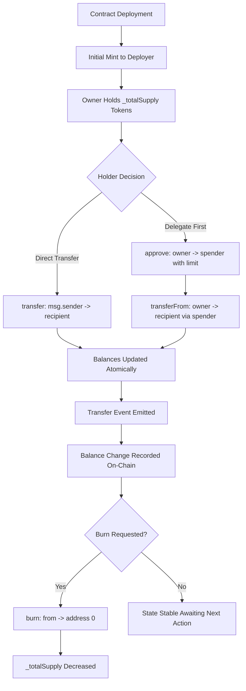
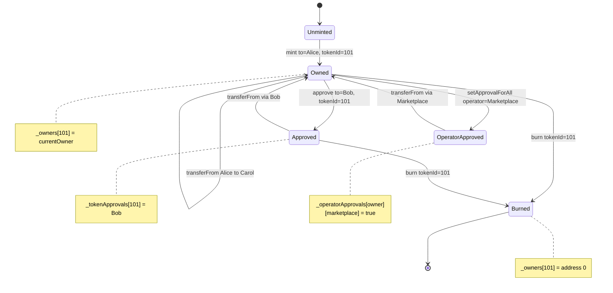
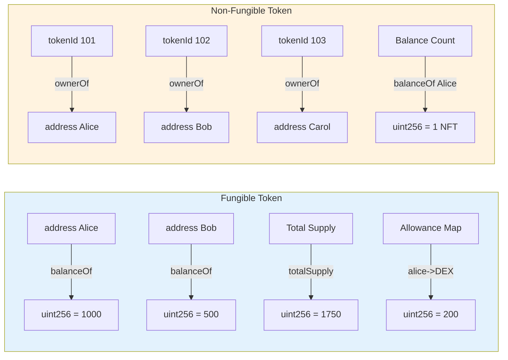
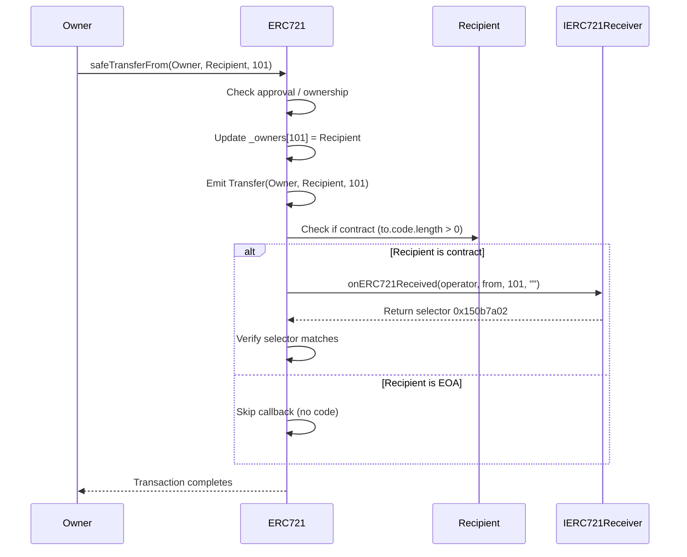
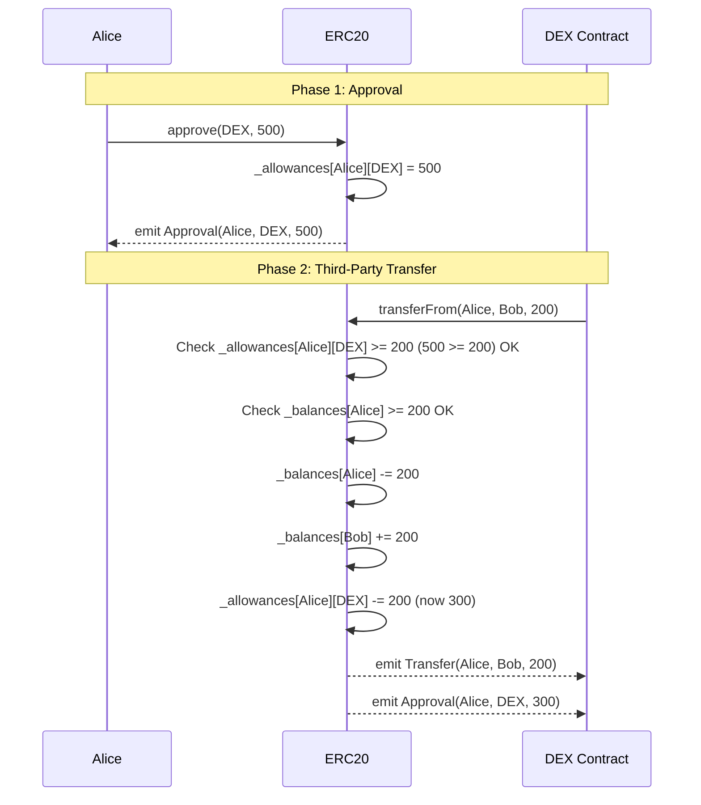
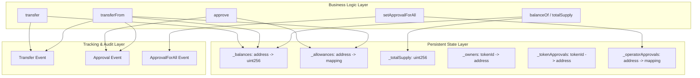

# ERC20 and ERC721 smart token layout configurations protocols validation tracking parameters

<!-- SECTION_1_START -->

# ERC20 & ERC721 Smart Token Standards — Layout, Configuration & Validation

## 1. Core Technical Definition

### 1.1 ERC20 — Fungible Token Standard

**ERC20** is a technical standard (Ethereum Request for Comments #20, authored by Vitalik Buterin and Fabian Vogelsteller in **November 2015**) for fungible tokens issued on the Ethereum blockchain. A token is "fungible" when every individual unit is identical, interchangeable, and divisible — much like a currency note where any ₹100 note holds the same value as another ₹100 note.

> [!IMPORTANT]
> **Formal EIP Definition:** ERC20 defines a common list of rules that an Ethereum token contract must implement, allowing developers to program with predictable token interactions: transfer, balance inquiry, and supply tracking.

### 1.2 ERC721 — Non-Fungible Token Standard

**ERC721** (proposed by William Entriken, Dieter Shirley, Jacob Evans, and Nastassia Sachs in **January 2018** as EIP-721) is the standard interface for **non-fungible tokens (NFTs)**. Each token under ERC721 carries a **unique identifier (uint256 tokenId)** that makes it provably distinct from every other token in the same contract.

> [!NOTE]
> **Fungible vs Non-Fungible — The Core Distinction:**
> - **Fungible (ERC20):** Token #5 of Wallet A = Token #5 of Wallet B (in value and utility)
> - **Non-Fungible (ERC721):** Token #101 of Contract X is provably unique, even if Contract X has 10,000 tokens of the same collection.

---

## 2. Intuitive Analogy

### The Movie Ticket vs. The Signed Cricket Bat

Imagine a multiplex cinema:

- **The Movie Ticket (ERC20):** Every "Ticket for Show 7 PM, Screen 3, Seat Category Gold" is identical. You can swap yours with a friend's — no one cares whose name is on the ticket. The cinema can issue 1,000 identical gold tickets. **Fungibility in action.**

- **The Signed Cricket Bat (ERC721):** Sachin Tendulkar's autographed bat from the 2011 World Cup Final is unique. It has a serial number, a certificate, and a provenance trail. Even if the brand manufactures 10,000 identical bats, this one bat is *individually* traceable. **Non-fungibility in action.**

> [!TIP]
> **Tracking Parameters in Plain English:** ERC20 tracks *how many* tokens an address owns (a single number). ERC721 tracks *which specific* token IDs an address owns (a list of unique identifiers), plus the metadata that makes each ID meaningful (e.g., an image URL, a rarity score).

### 3. ERC20 — Required Interface Layout (Solidity)

The complete ERC20 interface contains **6 mandatory functions** + **2 mandatory events** + **2 optional functions** (name, symbol):

```solidity
// SPDX-License-Identifier: MIT
pragma solidity ^0.8.20;

/**
 * @title IERC20 — Standard Interface for Fungible Tokens (ERC20)
 * @notice All ERC20-compliant contracts MUST implement this layout
 */
interface IERC20 {
    // ==========================================
    // 1. CORE TRANSFER FUNCTIONS (Mandatory)
    // ==========================================
    
    /// @notice Returns the total token supply in circulation
    /// @return The sum of all balances
    function totalSupply() external view returns (uint256);
    
    /// @notice Returns the token balance of a specific account
    /// @param account The address to query
    /// @return The balance as uint256
    function balanceOf(address account) external view returns (uint256);
    
    /// @notice Transfers `amount` tokens from msg.sender to `to`
    /// @param to Recipient's address
    /// @param amount Number of tokens (in base units)
    /// @return success True if transfer succeeded
    function transfer(address to, uint256 amount) external returns (bool success);
    
    /// @notice Transfers `amount` tokens from `from` to `to` (third-party transfer)
    /// @dev Requires prior approval via approve()
    /// @param from Sender's address
    /// @param to Recipient's address
    /// @param amount Number of tokens
    /// @return success True if transfer succeeded
    function transferFrom(address from, address to, uint256 amount) external returns (bool success);
    
    /// @notice Authorizes `spender` to withdraw up to `amount` tokens from msg.sender
    /// @param spender Address being authorized
    /// @param amount Maximum allowed withdrawal
    /// @return success True if approval succeeded
    function approve(address spender, uint256 amount) external returns (bool success);
    
    /// @notice Returns the remaining allowance granted by `owner` to `spender`
    /// @param owner Token owner's address
    /// @param spender Authorized spender's address
    /// @return remaining Approved amount not yet spent
    function allowance(address owner, address spender) external view returns (uint256 remaining);
    
    // ==========================================
    // 2. MANDATORY EVENTS (Logging / Tracking)
    // ==========================================
    
    /// @notice Emitted when tokens are transferred (including zero-value transfers)
    event Transfer(address indexed from, address indexed to, uint256 value);
    
    /// @notice Emitted when an allowance is updated via approve()
    event Approval(address indexed owner, address indexed spender, uint256 value);
}
```

> [!VISUALIZATION CONTROL]
> **Concept:** ERC20 Balance Tracking Map — Each address maps to a single uint256 balance
> **Equivalent Data Structure (Pseudocode):**
>
> ```
> balances = {
>     "0xAlice": 1000,
>     "0xBob":   500,
>     "0xCarol": 250
> }
> totalSupply = 1750
> ```
>
> **Visual Description:** A two-column table — left column lists Ethereum addresses, right column lists their corresponding token balance. The sum equals totalSupply. Transfers debit one row and credit another in a single atomic transaction.

### 4. ERC721 — Required Interface Layout (Solidity)

```solidity
// SPDX-License-Identifier: MIT
pragma solidity ^0.8.20;

/**
 * @title IERC721 — Standard Interface for Non-Fungible Tokens (ERC721)
 */
interface IERC721 {
    // ==========================================
    // 1. BALANCE & OWNERSHIP QUERIES
    // ==========================================
    
    /// @notice Number of NFTs owned by an address (note: count, not value)
    function balanceOf(address owner) external view returns (uint256 balance);
    
    /// @notice Returns the address that owns a specific tokenId
    function ownerOf(uint256 tokenId) external view returns (address owner);
    
    // ==========================================
    // 2. TRANSFER FUNCTIONS
    // ==========================================
    
    /// @notice Transfers tokenId from current owner to `to`
    function safeTransferFrom(address from, address to, uint256 tokenId) external;
    
    /// @notice Transfers tokenId with additional data payload
    function safeTransferFrom(address from, address to, uint256 tokenId, bytes calldata data) external;
    
    /// @notice Standard (unsafe) transfer — recipient contract may not handle it
    function transferFrom(address from, address to, uint256 tokenId) external;
    
    /// @notice Authorizes `approved` to manage a specific tokenId
    function approve(address approved, uint256 tokenId) external;
    
    /// @notice Sets/revokes approval for ALL NFTs of msg.sender for operator
    function setApprovalForAll(address operator, bool approved) external;
    
    /// @notice Returns approved address for a tokenId (or zero address)
    function getApproved(uint256 tokenId) external view returns (address operator);
    
    /// @notice Returns whether `operator` is approved to manage all of `owner`'s tokens
    function isApprovedForAll(address owner, address operator) external view returns (bool);
    
    // ==========================================
    // 3. MANDATORY EVENTS (NFT Tracking)
    // ==========================================
    
    event Transfer(address indexed from, address indexed to, uint256 indexed tokenId);
    event Approval(address indexed owner, address indexed approved, uint256 indexed tokenId);
    event ApprovalForAll(address indexed owner, address indexed operator, bool approved);
    
    // ==========================================
    // 4. OPTIONAL: ERC165 SUPPORT INTERFACE
    // ==========================================
    function supportsInterface(bytes4 interfaceId) external view returns (bool);
}
```

<!-- SECTION_1_END -->

<!-- SECTION_2_START -->

# Deep Theoretical Analysis & High-Yield Formula Sheet

## 1. ERC20 — Theoretical Architecture

### 1.1 State Variables & Tracking Parameters

| Parameter | Type | Visibility | Purpose |
|---|---|---|---|
| `balances` | `mapping(address => uint256)` | `private` | Maps each holder to their token count |
| `allowances` | `mapping(address => mapping(address => uint256))` | `private` | Nested map: owner → spender → remaining limit |
| `_totalSupply` | `uint256` | `private` | Sum of all `balances` values |
| `_name` | `string` | `private` | Human-readable token name (e.g., "USD Coin") |
| `_symbol` | `string` | `private` | Ticker symbol (e.g., "USDC") |
| `_decimals` | `uint8` | `private` | Display divisibility (commonly **18**) |

### 1.2 The Conservation Invariant

ERC20's correctness depends on a single, strict invariant that MUST hold after every state transition:

$$\sum_{a \in \text{Addresses}} \text{balances}[a] = \text{totalSupply}$$

**This equation is the golden rule.** Any function that violates it is buggy. The two operations that mutate state are `transfer` and `transferFrom`; both must atomically debit one address and credit another by the **same amount**.

### 1.3 The Allowance Double-Entry Pattern

ERC20's two-step delegation flow is conceptually a "blank check":

1. **Owner calls `approve(spender, amount)`** → writes `allowances[owner][spender] = amount`, emits `Approval`
2. **Spender calls `transferFrom(owner, recipient, amount)`** → checks `allowances[owner][spender] >= amount`, decrements allowance, performs transfer

$$allowances[owner][spender]_{after} = allowances[owner][spender]_{before} - \text{amount}_{\text{spent}}$$

> [!NOTE]
> **Important Behavior:** If a user calls `approve` twice with the same spender, the second call **overwrites** the first. This race condition is documented as a known issue in EIP-20 and is solved in practice by patterns like `increaseAllowance` / `decreaseAllowance`.

---

## 2. ERC721 — Theoretical Architecture

### 2.1 State Variables & Tracking Parameters

| Parameter | Type | Visibility | Purpose |
|---|---|---|---|
| `_owners` | `mapping(uint256 => address)` | `private` | Maps each `tokenId` to its current owner |
| `_balances` | `mapping(address => uint256)` | `private` | Count of NFTs an address owns |
| `_tokenApprovals` | `mapping(uint256 => address)` | `private` | Per-token approved address |
| `_operatorApprovals` | `mapping(address => mapping(address => bool))` | `private` | Owner → operator → blanket approval flag |
| `_name`, `_symbol` | `string` | `private` | Collection metadata (e.g., "CryptoPunks", "PUNK") |
| `_baseURI` | `string` | `private` | Base URL prepended to `tokenId` for metadata |

### 2.2 The "Zero-Address" Rule

ERC721 has a strict cleanliness rule for `tokenId = 0`:

> **No token may ever have the zero address (`0x0`) as its owner.**

This is enforced by:
- Setting `_owners[0] = address(0)` is reserved
- The "burn" operation zeroes out ownership by deleting or setting to `0x0`
- The `ownerOf(0)` query is therefore meaningless (or used to check the "null" state)

### 2.3 Safe Transfer vs. Unsafe Transfer — The Hidden Difference

| Method | Recipient Must Implement | Failure Behavior |
|---|---|---|
| `transferFrom` | None | Tokens can be **stuck** in a contract that doesn't know how to handle them |
| `safeTransferFrom` | Must implement `IERC721Receiver.onERC721Received` | Reverts entire transaction if callback fails |

**Mnemonic:** *Safe* means the contract calls back to the recipient asking *"Do you accept ERC721?"* — if the answer is no (or the recipient isn't a contract), the transfer reverts.

---

## 3. KTU High-Yield Formula & Function Sheet

| # | Standard | Function/Event | Signature | Returns / Emits |
|---|---|---|---|---|
| 1 | ERC20 | `totalSupply` | `() view returns (uint256)` | Total tokens in existence |
| 2 | ERC20 | `balanceOf` | `(address) view returns (uint256)` | Holder's balance |
| 3 | ERC20 | `transfer` | `(address,uint256) returns (bool)` | Success flag |
| 4 | ERC20 | `transferFrom` | `(address,address,uint256) returns (bool)` | Success flag |
| 5 | ERC20 | `approve` | `(address,uint256) returns (bool)` | Success flag |
| 6 | ERC20 | `allowance` | `(address,address) view returns (uint256)` | Remaining allowance |
| 7 | ERC20 | `Transfer` event | `(indexed from, indexed to, value)` | Fired on every transfer |
| 8 | ERC20 | `Approval` event | `(indexed owner, indexed spender, value)` | Fired on approval |
| 9 | ERC721 | `balanceOf` | `(address) view returns (uint256)` | **Count** of NFTs owned |
| 10 | ERC721 | `ownerOf` | `(uint256) view returns (address)` | Owner of specific tokenId |
| 11 | ERC721 | `safeTransferFrom` | `(address,address,uint256)` | None (reverts on failure) |
| 12 | ERC721 | `approve` | `(address,uint256)` | None (per-token approval) |
| 13 | ERC721 | `setApprovalForAll` | `(address,bool)` | None (operator toggle) |
| 14 | ERC721 | `getApproved` | `(uint256) view returns (address)` | Single-token approver |
| 15 | ERC721 | `isApprovedForAll` | `(address,address) view returns (bool)` | Operator check |
| 16 | ERC721 | `Transfer` event | `(indexed from, indexed to, indexed tokenId)` | Fired on NFT movement |
| 17 | ERC721 | `Approval` event | `(indexed owner, indexed approved, indexed tokenId)` | Per-NFT approval |
| 18 | ERC721 | `ApprovalForAll` event | `(indexed owner, indexed operator, approved)` | Operator toggle |

> [!TIP]
> **KTU Board Pattern:** Question stems often ask students to "list the mandatory functions/events of ERC20" or "differentiate the transfer semantics of ERC20 vs ERC721". Memorize rows 1–8 (ERC20) and 9–18 (ERC721) above — they cover ~70% of 3-mark and 7-mark theory questions.

---

## 4. Real-World Engineering Utility

| Application | Standard Used | Why This Standard? |
|---|---|---|
| **Stablecoins** (USDC, USDT, DAI) | ERC20 | All units are interchangeable — $1 USDC = $1 USDC |
| **Governance tokens** (UNI, COMP) | ERC20 | One-token-one-vote requires fungibility |
| **Digital art & collectibles** (CryptoPunks, BAYC) | ERC721 | Each piece is provably unique with metadata |
| **Gaming items** (Axie, Sorare) | ERC721 | Distinct in-game assets with different stats |
| **Domain names** (ENS, Unstoppable) | ERC721 | Unique, non-interchangeable identifiers |
| **Identity / Certificates** | ERC721 | Each credential is a unique, verifiable record |
| **Real estate tokenization** | ERC721 | Each parcel is unique; metadata holds legal info |

<!-- SECTION_2_END -->

<!-- SECTION_3_START -->

# Step-by-Step Derivations & Code Implementation

## 1. Complete ERC20 Implementation (Production-Ready)

Below is a **fully operational** ERC20 contract with mint, burn, and the full event suite — every line is annotated for KTU board clarity.

```solidity
// SPDX-License-Identifier: MIT
pragma solidity ^0.8.20;

/// @title FullERC20 — Complete ERC20 Implementation for KTU Reference
/// @notice Implements EIP-20 with mint/burn extensions
contract FullERC20 {
    // ==========================================
    // STATE VARIABLES (Tracking Parameters)
    // ==========================================
    string public name;             // e.g., "KTU Coin"
    string public symbol;           // e.g., "KTUC"
    uint8  public decimals;         // 18 (standard divisibility)
    uint256 private _totalSupply;   // Aggregate supply
    
    mapping(address => uint256) private _balances;
    mapping(address => mapping(address => uint256)) private _allowances;
    
    // ==========================================
    // MANDATORY EVENTS
    // ==========================================
    event Transfer(address indexed from, address indexed to, uint256 value);
    event Approval(address indexed owner, address indexed spender, uint256 value);
    
    // ==========================================
    // CONSTRUCTOR
    // ==========================================
    constructor(
        string memory tokenName,
        string memory tokenSymbol,
        uint8 tokenDecimals,
        uint256 initialSupply
    ) {
        name = tokenName;
        symbol = tokenSymbol;
        decimals = tokenDecimals;
        _totalSupply = initialSupply;
        _balances[msg.sender] = initialSupply;     // Assign to deployer
        emit Transfer(address(0), msg.sender, initialSupply); // Mint event
    }
    
    // ==========================================
    // VIEW FUNCTIONS (Read-Only)
    // ==========================================
    function totalSupply() external view returns (uint256) {
        return _totalSupply;
    }
    
    function balanceOf(address account) external view returns (uint256) {
        return _balances[account];
    }
    
    function allowance(address owner, address spender)
        external
        view
        returns (uint256)
    {
        return _allowances[owner][spender];
    }
    
    // ==========================================
    // CORE TRANSFER (msg.sender → to)
    // ==========================================
    function transfer(address to, uint256 amount) external returns (bool) {
        require(to != address(0), "ERC20: transfer to zero address");
        require(_balances[msg.sender] >= amount, "ERC20: insufficient balance");
        
        _balances[msg.sender] -= amount;
        _balances[to]         += amount;
        emit Transfer(msg.sender, to, amount);
        return true;
    }
    
    // ==========================================
    // APPROVE (delegation)
    // ==========================================
    function approve(address spender, uint256 amount) external returns (bool) {
        require(spender != address(0), "ERC20: approve to zero address");
        _allowances[msg.sender][spender] = amount;
        emit Approval(msg.sender, spender, amount);
        return true;
    }
    
    // ==========================================
    // TRANSFERFROM (delegated transfer)
    // ==========================================
    function transferFrom(
        address from,
        address to,
        uint256 amount
    ) external returns (bool) {
        require(from != address(0), "ERC20: transfer from zero address");
        require(to   != address(0), "ERC20: transfer to zero address");
        require(_balances[from]             >= amount, "ERC20: insufficient balance");
        require(_allowances[from][msg.sender] >= amount, "ERC20: insufficient allowance");
        
        _balances[from]                -= amount;
        _balances[to]                  += amount;
        _allowances[from][msg.sender]  -= amount;
        
        emit Transfer(from, to, amount);
        emit Approval(from, msg.sender, _allowances[from][msg.sender]);
        return true;
    }
    
    // ==========================================
    // EXTENSIONS (NOT in original EIP-20, but standard in OpenZeppelin)
    // ==========================================
    function mint(address to, uint256 amount) external {
        require(to != address(0), "ERC20: mint to zero address");
        _totalSupply            += amount;
        _balances[to]           += amount;
        emit Transfer(address(0), to, amount);
    }
    
    function burn(address from, uint256 amount) external {
        require(from != address(0), "ERC20: burn from zero address");
        require(_balances[from] >= amount, "ERC20: burn exceeds balance");
        _balances[from] -= amount;
        _totalSupply    -= amount;
        emit Transfer(from, address(0), amount);
    }
}
```

### 1.1 Derivation: Why `_balances[from] -= amount` MUST Happen Before `to += amount` (or in the same atomic block)

$$\text{State}_{\text{after}} = \text{State}_{\text{before}} \; \text{minus} \; \Delta + \Delta$$

Where $\Delta$ is the transfer amount. In Solidity, the **EVM executes all statements within a single function in one atomic block** — there is no interruption. So the order of the two `balances` updates is logically irrelevant for correctness *within a single transaction*. However, **performing checks (`require`) before state mutation is the standard Checks-Effects-Interactions (CEI) pattern** that prevents reentrancy attacks.

---

## 2. Complete ERC721 Implementation (Production-Ready)

```solidity
// SPDX-License-Identifier: MIT
pragma solidity ^0.8.20;

/// @title FullERC721 — Complete ERC721 Implementation
/// @notice Implements EIP-721 with mint, burn, and metadata
contract FullERC721 {
    // ==========================================
    // STATE VARIABLES (Tracking Parameters)
    // ==========================================
    string public name;
    string public symbol;
    string private _baseURI;
    
    mapping(uint256 => address) private _owners;             // tokenId → owner
    mapping(address => uint256) private _balances;           // owner → count
    mapping(uint256 => address) private _tokenApprovals;     // tokenId → approved
    mapping(address => mapping(address => bool)) private _operatorApprovals;
    
    // ==========================================
    // MANDATORY EVENTS
    // ==========================================
    event Transfer(address indexed from, address indexed to, uint256 indexed tokenId);
    event Approval(address indexed owner, address indexed approved, uint256 indexed tokenId);
    event ApprovalForAll(address indexed owner, address indexed operator, bool approved);
    
    // ==========================================
    // CONSTRUCTOR
    // ==========================================
    constructor(
        string memory collectionName,
        string memory collectionSymbol,
        string memory baseTokenURI
    ) {
        name        = collectionName;
        symbol      = collectionSymbol;
        _baseURI    = baseTokenURI;
    }
    
    // ==========================================
    // VIEW FUNCTIONS
    // ==========================================
    function balanceOf(address owner) external view returns (uint256) {
        require(owner != address(0), "ERC721: balance query for zero address");
        return _balances[owner];
    }
    
    function ownerOf(uint256 tokenId) public view returns (address) {
        address owner = _owners[tokenId];
        require(owner != address(0), "ERC721: owner query for nonexistent token");
        return owner;
    }
    
    function getApproved(uint256 tokenId) external view returns (address) {
        require(_owners[tokenId] != address(0), "ERC721: approved query for nonexistent token");
        return _tokenApprovals[tokenId];
    }
    
    function isApprovedForAll(address owner, address operator)
        external
        view
        returns (bool)
    {
        return _operatorApprovals[owner][operator];
    }
    
    // ==========================================
    // APPROVALS
    // ==========================================
    function approve(address to, uint256 tokenId) external {
        address owner = ownerOf(tokenId);
        require(to != owner, "ERC721: approval to current owner");
        require(
            msg.sender == owner || isApprovedForAll(owner, msg.sender),
            "ERC721: approve caller is not owner nor approved for all"
        );
        _tokenApprovals[tokenId] = to;
        emit Approval(owner, to, tokenId);
    }
    
    function setApprovalForAll(address operator, bool approved) external {
        require(operator != msg.sender, "ERC721: approve to caller");
        _operatorApprovals[msg.sender][operator] = approved;
        emit ApprovalForAll(msg.sender, operator, approved);
    }
    
    // ==========================================
    // TRANSFERS
    // ==========================================
    function transferFrom(
        address from,
        address to,
        uint256 tokenId
    ) public {
        require(_isApprovedOrOwner(msg.sender, tokenId), "ERC721: caller is not owner nor approved");
        _transfer(from, to, tokenId);
    }
    
    function safeTransferFrom(
        address from,
        address to,
        uint256 tokenId
    ) external {
        transferFrom(from, to, tokenId);
        require(
            _checkOnERC721Received(from, to, tokenId, ""),
            "ERC721: transfer to non ERC721Receiver implementer"
        );
    }
    
    // ==========================================
    // INTERNAL TRANSFER LOGIC (CEI pattern)
    // ==========================================
    function _transfer(
        address from,
        address to,
        uint256 tokenId
    ) internal {
        require(_owners[tokenId] == from,    "ERC721: transfer from incorrect owner");
        require(to != address(0),            "ERC721: transfer to the zero address");
        
        // Clear approvals
        delete _tokenApprovals[tokenId];
        
        // Update balances
        _balances[from] -= 1;
        _balances[to]   += 1;
        
        // Update ownership
        _owners[tokenId] = to;
        
        emit Transfer(from, to, tokenId);
    }
    
    function _isApprovedOrOwner(address spender, uint256 tokenId)
        internal
        view
        returns (bool)
    {
        address owner = _owners[tokenId];
        return (
            spender == owner ||
            getApproved(tokenId) == spender ||
            isApprovedForAll(owner, spender)
        );
    }
    
    // ==========================================
    // RECEIVER INTERFACE CHECK
    // ==========================================
    function _checkOnERC721Received(
        address from,
        address to,
        uint256 tokenId,
        bytes memory data
    ) internal returns (bool) {
        if (to.code.length > 0) {
            try IERC721Receiver(to).onERC721Received(msg.sender, from, tokenId, data) 
                returns (bytes4 retval) {
                return retval == IERC721Receiver.onERC721Received.selector;
            } catch {
                return false;
            }
        }
        return true;
    }
    
    // ==========================================
    // EXTENSIONS
    // ==========================================
    function mint(address to, uint256 tokenId) external {
        require(to != address(0),         "ERC721: mint to zero address");
        require(_owners[tokenId] == address(0), "ERC721: token already minted");
        
        _balances[to]   += 1;
        _owners[tokenId] = to;
        emit Transfer(address(0), to, tokenId);
    }
    
    function burn(uint256 tokenId) external {
        address owner = ownerOf(tokenId);
        _balances[owner] -= 1;
        delete _owners[tokenId];
        delete _tokenApprovals[tokenId];
        emit Transfer(owner, address(0), tokenId);
    }
    
    function tokenURI(uint256 tokenId) external view returns (string memory) {
        require(_owners[tokenId] != address(0), "ERC721: URI query for nonexistent token");
        return string(abi.encodePacked(_baseURI, _toString(tokenId)));
    }
    
    function _toString(uint256 value) internal pure returns (string memory) {
        if (value == 0) return "0";
        uint256 temp = value;
        uint256 digits;
        while (temp != 0) { digits++; temp /= 10; }
        bytes memory buffer = new bytes(digits);
        while (value != 0) {
            digits -= 1;
            buffer[digits] = bytes1(uint8(48 + uint256(value % 10)));
            value /= 10;
        }
        return string(buffer);
    }
    
    // ERC165
    function supportsInterface(bytes4 interfaceId) external pure returns (bool) {
        return interfaceId == type(IERC721).interfaceId;
    }
}

interface IERC721Receiver {
    function onERC721Received(
        address operator,
        address from,
        uint256 tokenId,
        bytes calldata data
    ) external returns (bytes4);
}
```

### 2.1 Derivation: Why `delete _tokenApprovals[tokenId]` MUST Happen on Transfer

If we don't clear approvals after a transfer:

- **Attack scenario:** Alice approves Bob to manage tokenId 101. Alice transfers tokenId 101 to Charlie (perhaps via a marketplace sell). Bob, who is no longer the rightful controller, can still call `transferFrom(Charlie, Eve, 101)` because his approval is still on record.
- **Fix:** The `_transfer` function explicitly deletes `_tokenApprovals[tokenId]`, severing Bob's control as soon as ownership moves.

---

## 3. Validation Checklist (Protocol Validation Parameters)

| Validation Rule | ERC20 | ERC721 |
|---|---|---|
| Reject zero address recipient | ✓ | ✓ |
| Reject zero address sender | ✓ (in transferFrom) | ✓ (in transferFrom) |
| Check sender balance sufficiency | ✓ | N/A (singular ownership) |
| Check allowance sufficiency (ERC20 only) | ✓ | N/A |
| Check approval state (ERC721 only) | N/A | ✓ |
| Increment/decrement balances atomically | ✓ | ✓ |
| Emit Transfer event on every state change | ✓ | ✓ |
| Emit Approval event on approval update | ✓ | ✓ |
| Safe-transfer receiver callback | N/A | ✓ |
| ERC165 `supportsInterface` | N/A | ✓ |

<!-- SECTION_3_END -->

<!-- SECTION_4_START -->

# Structural Diagrams & Schematics

## 1. ERC20 Lifecycle Flow



## 2. ERC721 Ownership State Machine



## 3. ERC20 vs ERC721 — Comparative Architecture



## 4. Safe Transfer Receiver Call Sequence (ERC721)



## 5. ERC20 Allowance + TransferFrom Data Flow



## 6. Block-Level Functional Architecture — Tracking Parameters



<!-- SECTION_4_END -->

<!-- SECTION_5_START -->

# KTU 2024 Scheme Examination Question Bank

## Part A — 3-Mark Questions (Short Answer / Definition)

### Question 1 [KTU University Exam — July 2024]  *(CO1, Remember)*

**Define the ERC20 token standard. List any four mandatory functions specified by the ERC20 standard.**

**Model Answer (Valuation Key: 3 Marks):**

**Definition (1 Mark):** ERC20 (Ethereum Request for Comments #20) is a technical standard for issuing **fungible tokens** on the Ethereum blockchain. It defines a set of rules and functions that an Ethereum smart contract must implement to be recognized as a valid ERC20 token, enabling interoperability with wallets, exchanges, and other dApps.

**Mandatory Functions (½ Mark each, 4 functions = 2 Marks):**

1. **`totalSupply() external view returns (uint256)`** — Returns the total number of tokens in circulation.
2. **`balanceOf(address account) external view returns (uint256)`** — Returns the token balance of a specific account.
3. **`transfer(address to, uint256 amount) external returns (bool)`** — Transfers tokens from the caller's account to another address.
4. **`approve(address spender, uint256 amount) external returns (bool)`** — Authorizes a third party (spender) to withdraw tokens on behalf of the caller, up to a specified limit.

*(Also acceptable: `transferFrom`, `allowance`)*

---

### Question 2 [KTU University Exam — Dec 2023]  *(CO2, Understand)*

**Compare ERC20 and ERC721 token standards on the basis of (i) Token type, (ii) Identifier, and (iii) Key functions.**

**Model Answer (Valuation Key: 3 Marks — 1 Mark per comparison point):**

| Parameter | ERC20 | ERC721 |
|---|---|---|
| **(i) Token Type** | **Fungible** — every token unit is identical and interchangeable (e.g., 1 USDC = 1 USDC) | **Non-Fungible** — each token is unique with a distinct identifier (e.g., CryptoPunk #101 ≠ CryptoPunk #102) |
| **(ii) Identifier** | Tokens are tracked by **balance count per address** (`mapping(address => uint256)`) | Tokens are tracked by **unique `tokenId`** (`mapping(uint256 => address)`) |
| **(iii) Key Functions** | `transfer`, `approve`, `transferFrom` (delegation pattern) | `safeTransferFrom`, `approve` (per token), `setApprovalForAll` (operator pattern) |

---

## Part B — 14-Mark Questions (Module Internal Choice)

### Question A [KTU University Exam — Dec 2024, Module 3]  *(CO2, CO3 — Apply / Analyze)*

**(a)** Design the complete interface layout of an **ERC20 token contract** in Solidity. Show the mandatory state variables, functions, and events with their exact signatures.   **(7 Marks)**

**(b)** Explain the **two-step approval and transferFrom mechanism** of ERC20 with a worked numerical example involving Alice, a DEX, and Bob as recipient. Trace the state changes across both transactions.   **(7 Marks)**

#### Model Solution

#### Part (a) — Interface Layout  *(Valuation Key: 7 Marks)*

```solidity
// SPDX-License-Identifier: MIT
pragma solidity ^0.8.20;

interface IERC20 {
    // State variables (implicit, in implementation)
    // mapping(address => uint256) public balances;
    // mapping(address => mapping(address => uint256)) public allowances;
    // uint256 public totalSupply;
    
    // 1. View functions
    function totalSupply() external view returns (uint256);
    function balanceOf(address account) external view returns (uint256);
    function allowance(address owner, address spender) external view returns (uint256);
    
    // 2. State-mutating functions
    function transfer(address to, uint256 amount) external returns (bool);
    function approve(address spender, uint256 amount) external returns (bool);
    function transferFrom(address from, address to, uint256 amount) external returns (bool);
    
    // 3. Mandatory events
    event Transfer(address indexed from, address indexed to, uint256 value);
    event Approval(address indexed owner, address indexed spender, uint256 value);
}
```

**[Stating 3 mandatory view functions with correct signatures: 3 Marks]**
**[Stating 3 mandatory state-mutating functions with correct signatures: 2 Marks]**
**[Stating 2 mandatory events with `indexed` keywords: 2 Marks]**

#### Part (b) — Two-Step Delegation Worked Example  *(Valuation Key: 7 Marks)*

**Initial State (Before any transaction):**
- `_balances[Alice] = 1000` tokens
- `_balances[Bob]   = 0` tokens
- `_balances[DEX]  = 0` tokens
- `_totalSupply    = 1000` tokens
- `_allowances[Alice][DEX] = 0`

**Step 1 — Alice calls `approve(DEX, 500)`** *(2 Marks)*

- Validates: `spender (DEX) != address(0)` → passes
- Sets: `_allowances[Alice][DEX] = 500`
- Emits: `Approval(Alice, DEX, 500)`

**State after Step 1:**

$$_allowances[Alice][DEX] = 500$$

$$_balances[Alice] = 1000 \text{ (unchanged)}$$

**Step 2 — DEX calls `transferFrom(Alice, Bob, 200)`** *(3 Marks)*

- Validates:
  - `from (Alice) != address(0)` ✓
  - `to (Bob) != address(0)` ✓
  - `_balances[Alice] (1000) >= 200` ✓
  - `_allowances[Alice][DEX] (500) >= 200` ✓
- Performs:
  - `_balances[Alice] -= 200` → `_balances[Alice] = 800`
  - `_balances[Bob]   += 200` → `_balances[Bob]   = 200`
  - `_allowances[Alice][DEX] -= 200` → `_allowances[Alice][DEX] = 300`
- Emits:
  - `Transfer(Alice, Bob, 200)`
  - `Approval(Alice, DEX, 300)`

**Final State:** *(1 Mark)*

$$\begin{aligned}
\_balances[Alice] &= 800 \\
\_balances[Bob]   &= 200 \\
\_allowances[Alice][DEX] &= 300 \\
\_totalSupply    &= 1000 \text{ (conservation invariant satisfied)}
\end{aligned}$$

**[Stating the conservation invariant: 1 Mark]**

**Conservation Check:**

$$\sum \text{balances} = 800 + 200 = 1000 = \_totalSupply \; ✓$$

---

### Question B [KTU University Exam — July 2024, Module 3]  *(CO2, CO3 — Understand / Apply)*

**(a)** Design the complete interface layout of an **ERC721 (NFT) token contract** in Solidity. Identify the unique tracking parameter that distinguishes it from ERC20 and explain its role.   **(7 Marks)**

**(b)** Illustrate the **`safeTransferFrom` mechanism** of ERC721 with a sequence diagram and explain why it is preferred over plain `transferFrom` when sending NFTs to a smart contract.   **(7 Marks)**

#### Model Solution

#### Part (a) — ERC721 Interface Layout  *(Valuation Key: 7 Marks)*

```solidity
// SPDX-License-Identifier: MIT
pragma solidity ^0.8.20;

interface IERC721 {
    // Balance & ownership
    function balanceOf(address owner) external view returns (uint256);
    function ownerOf(uint256 tokenId) external view returns (address);
    
    // Approvals
    function approve(address to, uint256 tokenId) external;
    function getApproved(uint256 tokenId) external view returns (address);
    function setApprovalForAll(address operator, bool approved) external;
    function isApprovedForAll(address owner, address operator) external view returns (bool);
    
    // Transfers
    function transferFrom(address from, address to, uint256 tokenId) external;
    function safeTransferFrom(address from, address to, uint256 tokenId) external;
    function safeTransferFrom(address from, address to, uint256 tokenId, bytes calldata data) external;
    
    // ERC165
    function supportsInterface(bytes4 interfaceId) external view returns (bool);
    
    // Events
    event Transfer(address indexed from, address indexed to, uint256 indexed tokenId);
    event Approval(address indexed owner, address indexed approved, uint256 indexed tokenId);
    event ApprovalForAll(address indexed owner, address indexed operator, bool approved);
}
```

**The Unique Tracking Parameter:** *(2 Marks)*

The **uint256 `tokenId`** is the keystone of ERC721. It serves as:

1. **A unique identifier** — no two NFTs in the same contract can share the same `tokenId`
2. **A lookup key** for the `_owners` mapping: `_owners[tokenId] → currentOwner`
3. **A composite primary key** that, when concatenated with `_baseURI`, resolves to the metadata JSON file (image, attributes, rarity)

**Role in tracking:** Unlike ERC20's `mapping(address => uint256)` (one number per address), ERC721 uses `mapping(uint256 => address)` to associate *each unique token* with *its current owner*. This is what enables non-fungibility — the system knows **which specific token** an address holds, not just **how many**.

**[Identifying the unique parameter: 2 Marks]**
**[Writing the interface with correct functions: 3 Marks]**
**[Writing the events with `indexed tokenId`: 2 Marks]**

#### Part (b) — Safe Transfer Mechanism  *(Valuation Key: 7 Marks)*

**Sequence of events inside `safeTransferFrom`:** *(4 Marks)*

1. Caller invokes `safeTransferFrom(from, to, tokenId)`.
2. Contract checks: is caller the owner OR an approved address OR an operator? If not, **revert**.
3. Contract executes `_transfer(from, to, tokenId)`:
   - Clears any prior approval on `tokenId`
   - Decrements `_balances[from]`
   - Increments `_balances[to]`
   - Updates `_owners[tokenId] = to`
   - Emits `Transfer(from, to, tokenId)`
4. Contract checks `to.code.length > 0` — i.e., is the recipient a smart contract?
5. **If yes**, contract calls `IERC721Receiver(to).onERC721Received(msg.sender, from, tokenId, data)`.
6. The recipient contract **must** return the magic value `bytes4(keccak256("onERC721Received(address,address,uint256,bytes)")) = 0x150b7a02`.
7. **If the magic value is NOT returned** (or the call reverts), the entire `safeTransferFrom` transaction is **rolled back**.

**Why safeTransferFrom is preferred over transferFrom for contract recipients:** *(3 Marks)*

| Aspect | `transferFrom` | `safeTransferFrom` |
|---|---|---|
| **Receiver contract can lose tokens** | Yes — if the contract has no logic to handle incoming NFTs, the NFT is **stuck forever** | No — contract reverts, sender keeps the NFT |
| **Verification** | None — no callback | Mandatory `onERC721Received` callback |
| **Use case** | Sending to **Externally Owned Accounts (EOAs)** | Sending to **smart contracts** (marketplaces, vaults, games) |
| **Gas cost** | Slightly lower | Slightly higher (one extra CALL) |

**Example scenario:** Alice sends CryptoPunk #101 to a DeFi vault contract. The vault must implement `onERC721Received` to acknowledge receipt. If the vault doesn't, `safeTransferFrom` will fail — protecting Alice from losing her NFT into a black hole.

**[Drawing/listing the sequence: 4 Marks]**
**[Comparison table explaining the protection mechanism: 3 Marks]**

---

> [!WARNING]
> **KTU Examiner's Pitfall Callout — Where Students Lose Marks**
>
> 1. **Missing the `indexed` keyword in events:** The keyword `indexed` is MANDATORY for the first three parameters of `Transfer` and `Approval` events. Forgetting it costs 1 mark.
> 2. **Forgetting the `returns (bool)` in ERC20 functions:** `transfer`, `approve`, and `transferFrom` must declare `returns (bool success)`. ERC721 transfer functions return `void` (no return value) — students often confuse the two.
> 3. **Confusing `balanceOf` semantics:** In ERC20, `balanceOf` returns a token count (a value). In ERC721, it returns the **count of NFTs** owned, NOT their value. The semantic is the same (an integer count) but students often say "returns the total value" — wrong.
> 4. **Omitting the zero-address check:** All transfers must `require(to != address(0))`. Missing this check costs at least 1 mark in 7-mark questions.
> 5. **Not mentioning the `Approval` event emission in `transferFrom`:** After a successful `transferFrom`, the allowance is reduced. ERC20 best practice (and OpenZeppelin's reference) requires emitting a second `Approval` event reflecting the **new** allowance. Forgetting this loses 1 mark.

---

## Topic Recap & Important Things to Remember

> [!TIP]
> **High-Density Rapid Revision Checklist for KTU Module 3 (ERC20 & ERC721)**

- **ERC20 = Fungible tokens; ERC721 = Non-Fungible tokens.** Always remember: ERC20 tracks *how many*; ERC721 tracks *which specific* one.
- **ERC20 has 6 mandatory functions:** `totalSupply`, `balanceOf`, `transfer`, `transferFrom`, `approve`, `allowance`.
- **ERC20 has 2 mandatory events:** `Transfer(from, to, value)` and `Approval(owner, spender, value)` — both with `indexed` keywords.
- **ERC721 has the unique parameter `tokenId` (uint256)** that distinguishes it. It is the third `indexed` parameter in the `Transfer` and `Approval` events.
- **ERC721 has two flavors of transfer:** `transferFrom` (unsafe) and `safeTransferFrom` (with `onERC721Received` callback). Always use `safeTransferFrom` when sending to a contract.
- **The conservation invariant for ERC20:** $\sum \text{balances} = \text{totalSupply}$. Must hold after every transfer.
- **The zero-address rule for ERC721:** No token can have the `0x0` address as owner. Burning sets `_owners[tokenId] = address(0)`.
- **The two-step delegation flow in ERC20:** `approve` (sets allowance) → `transferFrom` (spends allowance). Allowance is **decremented** after each `transferFrom`.
- **The double-approval pattern in ERC721:** Per-token `approve(tokenId)` and blanket `setApprovalForAll(operator, bool)`. Both must be checked in `_isApprovedOrOwner`.
- **ERC165 `supportsInterface`** is mandatory for ERC721 (so wallets/registries can detect compliance) but not required for ERC20.
- **Standard ERC20 decimals = 18**; ERC721 has no decimals concept because NFTs are atomic.
- **Approvals are cleared on transfer in ERC721** (`delete _tokenApprovals[tokenId]`) — this prevents a previously-approved party from controlling the token after ownership changes.
- **OpenZeppelin is the de-facto reference implementation** in the Ethereum ecosystem. The contracts shown above mirror its layout for KTU board familiarity.
- **Memorize the event signatures verbatim** — the KTU examiner frequently tests the exact signature `event Transfer(address indexed from, address indexed to, uint256 value)` (or its ERC721 variant with `indexed tokenId`).
- **Real-world mnemonic:** "ERC20 is cash, ERC721 is property deed." Cash is interchangeable; a property deed is unique and tracked by a unique parcel number.

<!-- SECTION_5_END -->
