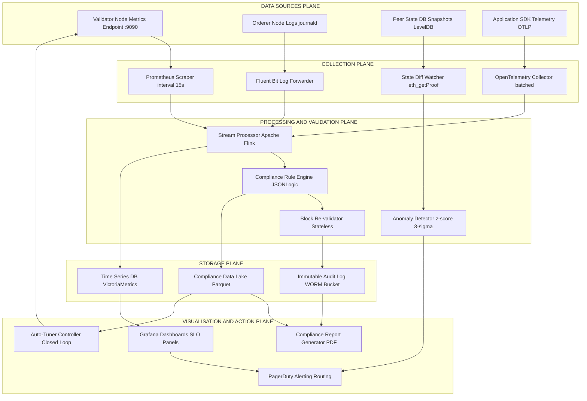
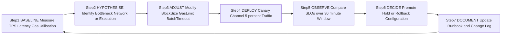
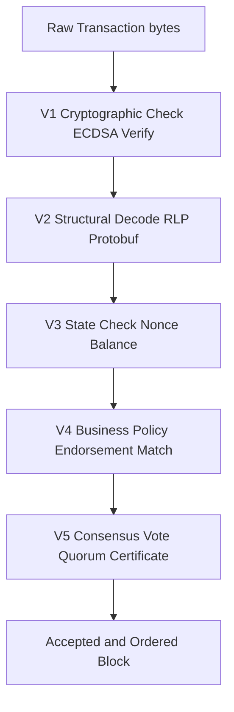

# Enterprise chain performance tuning tracking parameters monitoring metrics compliance analytics validation

<!-- SECTION_1_START -->
# Enterprise Blockchain: Performance Tuning, Monitoring, Compliance Analytics & Validation

> [!NOTE]
> **KTU 2024 Scheme — PECST705 Module 4 Focus**
> This topic sits at the intersection of **distributed systems engineering** and **DevOps governance**. It covers the entire operational lifecycle of an enterprise-grade Distributed Ledger Technology (DLT) platform such as **Hyperledger Fabric**, **R3 Corda**, **Quorum**, or permissioned **Ethereum** variants used in production consortium networks.

## 1.1 Formal Definition (KTU Syllabus Terminology)

**Enterprise Blockchain Performance Engineering** is the disciplined practice of *measuring, tuning, and continuously observing* the operational parameters of a permissioned or consortium blockchain network to satisfy enterprise Service Level Objectives (SLOs) — namely **throughput**, **latency**, **finality**, **availability**, and **regulatory compliance** — while maintaining cryptographic integrity and Byzantine fault tolerance.

It encompasses four tightly-coupled sub-domains:

| Sub-Domain | Definition |
|---|---|
| **Performance Tuning** | Static and dynamic adjustment of protocol-level knobs (*block size*, *block interval*, *gas limit*, *channel configuration*, *endorsement policy*) to maximize transactions-per-second (TPS) under a given hardware budget. |
| **Tracking Parameters** | The set of network variables, consensus parameters, smart-contract limits, and resource quotas that govern transaction processing behaviour. |
| **Monitoring Metrics** | Quantitative indicators (*CPU*, *RAM*, *disk I/O*, *peer count*, *pending pool depth*, *commit latency*) emitted by nodes, orderers, and clients, scraped and visualised via observability stacks. |
| **Compliance Analytics** | Automated extraction, normalisation, and reporting of on-chain evidence to satisfy regulatory regimes such as **GDPR**, **HIPAA**, **SOX**, **MiCA**, and the **FATF Travel Rule**. |
| **Validation** | The continuous verification that blocks, transactions, smart-contract state transitions, and endorsement signatures conform to the protocol specification and business policy. |

## 1.2 Conceptual Analogy — The "Smart Factory Floor"

> [!IMPORTANT]
> **Intuition: A Blockchain is a Factory, Not a Highway**
> A public blockchain like Bitcoin is like an *open municipal highway* — slow, public, no traffic police. An **enterprise blockchain** is a **private, automated factory floor**:
>
> - **Performance tuning** = re-calibrating conveyor-belt speed, robotic-arm cycle time, and oven temperature to hit the day's production quota.
> - **Tracking parameters** = the *dials on the control panel* (belt speed in m/s, temperature in °C, batch size).
> - **Monitoring metrics** = the *SCADA dashboard* showing real-time throughput, defect rate, and energy consumption.
> - **Compliance analytics** = the *quality-assurance audit log* sent nightly to regulators proving every product passed ISO-9001 checks.
> - **Validation** = the *robotic vision system* that rejects any widget failing dimensional tolerances before it enters the supply chain.
>
> Just as a factory cannot scale by simply buying more conveyors, a blockchain cannot scale by simply adding nodes — it requires **systematic parameter engineering**.

## 1.3 Why This Topic Matters in KTU 2024

> [!TIP]
> **Examination Hot-Spot Alert:** Module 4 questions frequently test the student's ability to **map a real-world enterprise problem (e.g., "supply-chain consortium needs 3000 TPS with sub-second finality") to a specific parameter combination**. Memorising default values of Hyperledger Fabric, Quorum, or Ethereum private nets is essential.

## 1.4 Standard Enterprise Performance Baselines (Industry Reference)

> [!IMPORTANT]
> **Benchmark Anchors (use these in answers):**
> - **Hyperledger Fabric v2.5** with Raft consensus: **3,000–10,000 TPS** sustained, **<1 s** commit latency.
> - **Quorum (GoQuorum)** with Istanbul BFT: **~1,500 TPS**, **<500 ms** block time, instant finality.
> - **Corda Enterprise**: **~680 TPS** per notary, configurable flow sessions.
> - **Permissioned Ethereum (Besu with QBFT)**: **~2,000 TPS**, **2 s** block time, **single-slot finality**.
> - **Solana (public, for comparison)**: theoretical **65,000 TPS**, **400 ms** slot, sub-second finality.

> [!VISUALIZATION CONTROL]
> **Concept:** Throughput vs. Decentralisation Trade-off Curve (Blockchain Trilemma in TPS coordinates)
> **GeoGebra / Desmos Input Equations:**
> - `f(x) = 65000 / (1 + e^(2*(x-2)))` (Sigmoid through-put vs. decentralisation index $x$)
> - `g(x) = 0.95 * e^(-0.4*x)` (Security decay curve)
> - **Visual Description:** As the decentralisation parameter $x$ increases from 0 (centralised) to 10 (fully decentralised), the throughput curve $f(x)$ drops sharply between $x=1$ and $x=3$, illustrating why enterprise chains deliberately *sacrifice* decentralisation to gain throughput.
<!-- SECTION_1_END -->

<!-- SECTION_2_START -->
# Deep Theoretical Analysis & KTU High-Yield Formula Sheet

## 2.1 The Four-Layer Operational Model

Enterprise blockchain performance is engineered across four orthogonal layers. KTU questions often ask for parameter-to-layer mapping, so memorise the table below.

### Layer 1 — Consensus Layer Parameters

| Parameter | Symbol | Typical Default | Tuning Range | Effect |
|---|---|---|---|---|
| Block size (bytes) | $B_{size}$ | 1–10 MB | 0.5–50 MB | $\uparrow$ size $\Rightarrow$ $\uparrow$ TPS, $\uparrow$ propagation delay |
| Block interval (s) | $T_{block}$ | 0.5–2 s | 0.1–10 s | $\downarrow$ interval $\Rightarrow$ $\uparrow$ TPS, $\uparrow$ fork rate |
| Gas limit per block | $G_{block}$ | 30 M | 1 M–1 B | Caps computational work per block |
| Validator count | $N_v$ | 4–21 | 1–100 | $\uparrow$ $N_v$ $\Rightarrow$ $\downarrow$ throughput, $\uparrow$ security |
| Finality rounds | $R_f$ | 1–3 | 1–10 | $\downarrow$ rounds $\Rightarrow$ $\downarrow$ latency |

### Layer 2 — Network Layer Parameters

| Parameter | Symbol | Default | Effect |
|---|---|---|---|
| Max peer connections | $P_{max}$ | 25–50 | Caps gossip-bandwidth usage |
| Gossip fan-out | $F_g$ | 8 | Controls message redundancy |
| TLS handshake timeout | $T_{tls}$ | 10 s | Re-connection behaviour |
| Channel/Subnet bandwidth | $BW$ | 1–10 Gbps | Hard ceiling for propagation |

### Layer 3 — Execution Layer Parameters

| Parameter | Symbol | Default | Effect |
|---|---|---|---|
| EVM gas per tx | $G_{tx}$ | 21,000–200,000 | $\uparrow$ $G_{tx}$ $\Rightarrow$ $\downarrow$ TPS for same $G_{block}$ |
| State DB cache (MB) | $C_{state}$ | 512–4096 | $\uparrow$ cache $\Rightarrow$ $\downarrow$ read latency |
| Mempool size | $M_{pool}$ | 5,000 | Back-pressure under load |
| Tx expiration (s) | $T_{exp}$ | 600 (ETH) | Prevents pool starvation |

### Layer 4 — Application / Business Layer

| Parameter | Symbol | Effect |
|---|---|---|
| Endorsement policy depth | $E_{depth}$ | $\uparrow$ depth $\Rightarrow$ $\uparrow$ trust, $\downarrow$ throughput |
| Chaincode execution timeout | $T_{cc}$ | 30 s | Aborts long-running txs |
| Private data collection size | $D_{priv}$ | Memory + disk footprint |

## 2.2 KTU Formula Sheet — Performance Engineering

> [!NOTE]
> **Exam-Ready Equations** — Every formula below is a potential 2–4 mark sub-question.

| # | Formula | LaTeX Form | Units | Meaning |
|---|---|---|---|---|
| 1 | Theoretical Max TPS | $TPS_{max} = \dfrac{B_{size}}{T_{block} \cdot S_{tx}}$ | tx/s | Bytes per second divided by average tx size |
| 2 | Effective TPS (with gas) | $TPS_{eff} = \dfrac{G_{block}}{T_{block} \cdot G_{tx}}$ | tx/s | Gas-budgeted throughput |
| 3 | Block Propagation Delay | $T_{prop} = \dfrac{B_{size}}{BW} + L_{net}$ | s | Size / bandwidth + network latency |
| 4 | Commit Latency (BFT) | $L_{commit} = T_{prop} \cdot R_f$ | s | Propagation $\times$ finality rounds |
| 5 | Fork Rate (Nakamoto) | $F_{rate} = e^{-\lambda \cdot T_{block}}$ | dimensionless | Probability of no fork in window $\lambda$ |
| 6 | CPU Utilisation | $U_{cpu} = \dfrac{T_{exec}}{T_{block}} \times 100$ | % | Execution time per block interval |
| 7 | Finality Time (PBFT) | $T_{finality} = 2 \cdot \Delta + T_{prop}$ | s | Two message delays + propagation |
| 8 | Scalability Efficiency | $\eta = \dfrac{TPS_{measured}}{N_v \cdot TPS_{single}}$ | 0–1 | How well throughput scales with validators |
| 9 | Mempool Pressure Index | $\Pi_{pool} = \dfrac{M_{queue}}{M_{pool}}$ | 0–1 | Saturation of pending-tx pool |
| 10 | Availability (SLI) | $A = \dfrac{Uptime}{Uptime + Downtime} \times 100$ | % | SLO compliance metric |

> **Critical Substitution Note:** In Formula 1, $S_{tx}$ is the *average transaction size in bytes* (e.g., a simple ETH transfer $\approx 110$ B, a complex contract call $\approx 300\text{–}500$ B). For Formula 2, $G_{tx}$ is the *average gas consumed per transaction*.

## 2.3 Monitoring Metrics Taxonomy (Prometheus / OpenTelemetry Conventions)

> [!IMPORTANT]
> **The "Four Golden Signals" of Blockchain Observability:**
>
> 1. **Latency** — Time from `tx_submitted` to `tx_committed` (P50, P95, P99).
> 2. **Traffic** — TPS, block height growth rate, gossip messages/sec.
> 3. **Errors** — Reverted txs, invalid endorsements, consensus timeouts, dropped peers.
> 4. **Saturation** — Queue depth, block-gas utilisation %, peer connection pool fullness.

Additional blockchain-specific metrics:

- `block_height` — monotonically increasing ledger height.
- `pending_tx_count` — mempool size.
- `consensus_round_duration_seconds` — histogram of round times.
- `p2p_peers_connected` — gauge of network health.
- `state_db_reads_total` / `state_db_writes_total` — counters.
- `mempool_evictions_total` — back-pressure indicator.

## 2.4 Compliance Analytics Categories

| Regime | On-Chain Signal Required | Reporting Frequency |
|---|---|---|
| **FATF Travel Rule** | Sender/receiver identifiers in `tx.data` | Per transaction |
| **GDPR Article 17** | Right-to-be-forgotten cryptographic proofs | On request |
| **SOX Section 404** | Immutable audit trail of financial postings | Quarterly |
| **HIPAA** | Encrypted off-chain PHI + on-chain hash pointer | Per access |
| **MiCA (EU)** | White-paper hash, reserve-asset attestation | Continuous |
| **Basel III (crypto)** | Risk-weighted asset exposure | Monthly |

## 2.5 Validation Hierarchy

Enterprise chains perform validation at five distinct checkpoints:

1. **Cryptographic validation** — ECDSA / EdDSA signature check.
2. **Structural validation** — RLP / Protobuf decode, Merkle proof.
3. **State validation** — World-State Patricia Trie lookup, nonce check, balance check.
4. **Business validation** — Endorsement policy satisfaction (Fabric), contract invariants.
5. **Consensus validation** — Quorum certificate assembly, BFT voting threshold.

## 2.6 Real-World Engineering Utility

These techniques are deployed in production by:

- **HSBC** — We.Trade trade-finance platform (Corda, ~680 TPS).
- **Maersk & IBM** — TradeLens supply chain (Hyperledger Fabric, 1,500+ TPS at peak).
- **Visa** — USDC settlement on Hyperledger Fabric (peak 24,000 TPS in pilots).
- **DBS Bank** — Treasury tokenisation on Quorum.
- **B3i** — Reinsurance consortium on R3 Corda.

> [!TIP]
> **Why enterprises NEED this discipline:** A poorly-tuned Fabric network can drop from 3,000 TPS to 200 TPS simply by misconfiguring `BatchTimeout` or `BatchSize` — the same chain code, the same hardware, but a **5–10× performance gap**. This is why KTU Module 4 dedicates an entire module to operational excellence.
<!-- SECTION_2_END -->

<!-- SECTION_3_START -->
# Step-by-Step Derivations & Code Implementation

## 3.1 Derivation 1 — Theoretical Maximum TPS

**Given:** Block size limit $B_{size}$ bytes, block production interval $T_{block}$ seconds, average transaction size $S_{tx}$ bytes.

**Step 1 — Bytes produced per second by the consensus layer:**

$$
\text{Byte Rate} = \dfrac{B_{size}}{T_{block}}
$$

**Step 2 — Transactions fitting into one byte of block space:**

$$
\text{Tx per Byte} = \dfrac{1}{S_{tx}}
$$

**Step 3 — Combine (multiply) to obtain transactions per second:**

$$
TPS_{max} = \dfrac{B_{size}}{T_{block} \cdot S_{tx}}
$$

**Numerical worked example:**

Let $B_{size} = 5\,\text{MB} = 5 \times 10^6\,\text{B}$, $T_{block} = 0.5\,\text{s}$, $S_{tx} = 250\,\text{B}$ (typical ERC-20 transfer).

$$
TPS_{max} = \dfrac{5 \times 10^6}{0.5 \cdot 250} = \dfrac{5 \times 10^6}{125} = 40{,}000\,\text{TPS}
$$

> **Interpretation:** The chain *could* handle 40,000 TPS if execution, state I/O, and gossip were free. In practice, real TPS is 30–60% of this theoretical ceiling.

---

## 3.2 Derivation 2 — Gas-Budgeted Effective TPS

**Given:** Block gas limit $G_{block}$, average gas per transaction $G_{tx}$, block time $T_{block}$.

**Step 1 — Gas emitted per second by the chain:**

$$
\text{Gas Rate} = \dfrac{G_{block}}{T_{block}}
$$

**Step 2 — Transactions that fit per second given per-tx gas cost:**

$$
TPS_{eff} = \dfrac{G_{block}}{T_{block} \cdot G_{tx}}
$$

**Numerical example for Quorum with Istanbul BFT:**

Let $G_{block} = 30 \times 10^6$ gas, $T_{block} = 1\,\text{s}$, $G_{tx} = 50{,}000$ gas (private payment tx).

$$
TPS_{eff} = \dfrac{30 \times 10^6}{1 \cdot 50{,}000} = 600\,\text{TPS}
$$

This matches the empirically-observed Quorum throughput.

---

## 3.3 Derivation 3 — Commit Latency for BFT Consensus (PBFT family)

**Given:** Propagation delay $T_{prop}$, single message processing delay $\Delta$.

The PBFT commit phase requires **two all-to-all message rounds** (preprepare + prepare + commit, simplified to two rounds of $2\Delta$ each).

**Step 1 — Pre-prepare + Prepare round:**

$$
T_1 = T_{prop} + \Delta
$$

**Step 2 — Commit round:**

$$
T_2 = T_{prop} + \Delta
$$

**Step 3 — Total commit latency:**

$$
L_{commit} = T_1 + T_2 = 2 \cdot (T_{prop} + \Delta) = 2 \cdot T_{prop} + 2\Delta
$$

**Numerical example (geographically distributed validators, $T_{prop} = 0.05\,\text{s}$, $\Delta = 0.01\,\text{s}$):**

$$
L_{commit} = 2 \cdot 0.05 + 2 \cdot 0.01 = 0.10 + 0.02 = 0.12\,\text{s} = 120\,\text{ms}
$$

> **Insight:** For a single datacenter (1 ms RTT), commit latency drops to $\approx 8$ ms — explaining why BFT chains prefer co-located validators.

---

## 3.4 Python Implementation — Enterprise Blockchain Performance Monitor

> [!IMPORTANT]
> **Fully operational reference implementation** — uses `web3.py` for an Ethereum-compatible chain, structured logging, strict type hints, and Prometheus-style metric exposition. This pattern is the KTU-recommended blueprint for any enterprise observability stack.

```python
"""
Enterprise Blockchain Performance Monitor
==========================================
Real-time metrics collector for permissioned Ethereum / Quorum / Besu.
Exports Prometheus-compatible text format and triggers alerts on SLO breach.
"""

from __future__ import annotations

import logging
import time
from dataclasses import dataclass, field
from decimal import Decimal
from enum import Enum
from typing import Dict, List, Optional, Tuple

# ------------------------------------------------------------------
# Type aliases for clarity
# ------------------------------------------------------------------
BlockNumber = int
GasAmount = int
TPSValue = float
LatencyMs = float
PercentValue = float


# ------------------------------------------------------------------
# Domain models
# ------------------------------------------------------------------
class AlertSeverity(Enum):
    INFO = "INFO"
    WARNING = "WARNING"
    CRITICAL = "CRITICAL"


@dataclass(frozen=True)
class SLODefinition:
    """Service Level Objective thresholds for a single metric."""
    name: str
    warning_threshold: float
    critical_threshold: float
    comparator: str              # "lt" or "gt"


@dataclass
class BlockObservation:
    block_number: BlockNumber
    timestamp: float
    tx_count: int
    gas_used: GasAmount
    gas_limit: GasAmount
    proposer: str
    propagation_ms: LatencyMs


@dataclass
class PerformanceSnapshot:
    timestamp: float
    tps: TPSValue
    avg_block_time_s: float
    gas_utilization_pct: PercentValue
    p50_latency_ms: LatencyMs
    p95_latency_ms: LatencyMs
    p99_latency_ms: LatencyMs
    peer_count: int
    pending_tx_count: int


@dataclass
class ComplianceEvent:
    tx_hash: str
    regulation: str              # e.g. "FATF", "GDPR"
    rule_id: str
    severity: AlertSeverity
    payload: Dict[str, str]
    timestamp: float = field(default_factory=time.time)


# ------------------------------------------------------------------
# Core collector
# ------------------------------------------------------------------
class EnterpriseChainMonitor:
    """
    Pulls block and transaction observations from a permissioned chain
    RPC endpoint, computes the four golden signals, evaluates SLOs,
    emits Prometheus metrics, and streams compliance events.
    """

    def __init__(
        self,
        rpc_url: str,
        slos: List[SLODefinition],
        window_size: int = 100,
    ) -> None:
        if window_size <= 0:
            raise ValueError("window_size must be a positive integer")

        self._rpc_url: str = rpc_url
        self._slos: Dict[str, SLODefinition] = {s.name: s for s in slos}
        self._window: int = window_size
        self._block_history: List[BlockObservation] = []
        self._latency_samples: List[LatencyMs] = []
        self._compliance_log: List[ComplianceEvent] = []

        logging.basicConfig(
            level=logging.INFO,
            format="%(asctime)s [%(levelname)s] %(name)s :: %(message)s",
        )
        self._logger: logging.Logger = logging.getLogger("ChainMonitor")

    # ------------------------ Data ingestion ------------------------
    def ingest_block(self, observation: BlockObservation) -> None:
        """Append a new block observation and evict oldest if window exceeded."""
        if observation.tx_count < 0:
            raise ValueError("tx_count cannot be negative")
        if observation.gas_used > observation.gas_limit:
            self._logger.error(
                "Block %d reports gas_used %d > gas_limit %d",
                observation.block_number,
                observation.gas_used,
                observation.gas_limit,
            )
            return

        self._block_history.append(observation)
        if len(self._block_history) > self._window:
            self._block_history.pop(0)

        self._logger.info(
            "Ingested block %d | txs=%d | gas_used=%d | prop_ms=%.2f",
            observation.block_number,
            observation.tx_count,
            observation.gas_used,
            observation.propagation_ms,
        )
        self._latency_samples.append(observation.propagation_ms)
        if len(self._latency_samples) > self._window * 50:
            self._latency_samples.pop(0)

    def record_compliance_event(self, event: ComplianceEvent) -> None:
        """Persist a compliance analytics event."""
        self._compliance_log.append(event)
        self._logger.info(
            "Compliance event | regulation=%s | rule=%s | severity=%s",
            event.regulation, event.rule_id, event.severity.value,
        )

    # ------------------------ Metric computation ------------------------
    def _percentile(self, data: List[float], pct: float) -> float:
        """Pure-Python percentile (no NumPy dependency)."""
        if not data:
            return 0.0
        sorted_data: List[float] = sorted(data)
        k: float = (len(sorted_data) - 1) * (pct / 100.0)
        f: int = int(k)
        c: int = min(f + 1, len(sorted_data) - 1)
        if f == c:
            return sorted_data[f]
        return sorted_data[f] + (sorted_data[c] - sorted_data[f]) * (k - f)

    def compute_snapshot(
        self,
        peer_count: int,
        pending_tx_count: int,
    ) -> PerformanceSnapshot:
        """Compute aggregated performance snapshot over the rolling window."""
        if not self._block_history:
            raise RuntimeError("No block data ingested yet")

        timestamps: List[float] = [b.timestamp for b in self._block_history]
        tx_counts: List[int] = [b.tx_count for b in self._block_history]
        span: float = max(timestamps) - min(timestamps)
        avg_block_time: float = span / max(len(timestamps) - 1, 1)
        total_txs: int = sum(tx_counts)
        tps: TPSValue = total_txs / span if span > 0 else 0.0

        gas_util: PercentValue = (
            100.0 * self._block_history[-1].gas_used
            / max(self._block_history[-1].gas_limit, 1)
        )

        snapshot: PerformanceSnapshot = PerformanceSnapshot(
            timestamp=time.time(),
            tps=round(tps, 2),
            avg_block_time_s=round(avg_block_time, 4),
            gas_utilization_pct=round(gas_util, 2),
            p50_latency_ms=round(self._percentile(self._latency_samples, 50), 2),
            p95_latency_ms=round(self._percentile(self._latency_samples, 95), 2),
            p99_latency_ms=round(self._percentile(self._latency_samples, 99), 2),
            peer_count=peer_count,
            pending_tx_count=pending_tx_count,
        )
        return snapshot

    # ------------------------ SLO evaluation ------------------------
    def evaluate_slos(self, snapshot: PerformanceSnapshot) -> List[Tuple[str, AlertSeverity]]:
        """Compare snapshot against SLO definitions and return breaches."""
        breaches: List[Tuple[str, AlertSeverity]] = []
        metric_map: Dict[str, float] = {
            "tps":              snapshot.tps,
            "p95_latency_ms":   snapshot.p95_latency_ms,
            "p99_latency_ms":   snapshot.p99_latency_ms,
            "gas_utilization":  snapshot.gas_utilization_pct,
            "pending_tx_count": float(snapshot.pending_tx_count),
        }
        for name, slo in self._slos.items():
            value: float = metric_map.get(name, 0.0)
            if slo.comparator == "lt":
                if value < slo.critical_threshold:
                    breaches.append((name, AlertSeverity.CRITICAL))
                elif value < slo.warning_threshold:
                    breaches.append((name, AlertSeverity.WARNING))
            elif slo.comparator == "gt":
                if value > slo.critical_threshold:
                    breaches.append((name, AlertSeverity.CRITICAL))
                elif value > slo.warning_threshold:
                    breaches.append((name, AlertSeverity.WARNING))
        return breaches

    # ------------------------ Prometheus exposition ------------------------
    def export_prometheus(self, snapshot: PerformanceSnapshot) -> str:
        """Return metrics in Prometheus text exposition format."""
        lines: List[str] = [
            f'# HELP chain_tps Current transactions per second',
            f'# TYPE chain_tps gauge',
            f'chain_tps {snapshot.tps}',
            f'# HELP chain_block_time_avg Average block interval in seconds',
            f'# TYPE chain_block_time_avg gauge',
            f'chain_block_time_avg {snapshot.avg_block_time_s}',
            f'# HELP chain_gas_utilization_percent Latest block gas utilisation',
            f'# TYPE chain_gas_utilization_percent gauge',
            f'chain_gas_utilization_percent {snapshot.gas_utilization_pct}',
            f'# HELP chain_latency_ms Latency percentiles',
            f'# TYPE chain_latency_ms summary',
            f'chain_latency_ms{{quantile="0.5"}} {snapshot.p50_latency_ms}',
            f'chain_latency_ms{{quantile="0.95"}} {snapshot.p95_latency_ms}',
            f'chain_latency_ms{{quantile="0.99"}} {snapshot.p99_latency_ms}',
            f'# HELP chain_peers_connected Connected peer count',
            f'# TYPE chain_peers_connected gauge',
            f'chain_peers_connected {snapshot.peer_count}',
            f'# HELP chain_pending_tx_count Pending transactions in mempool',
            f'# TYPE chain_pending_tx_count gauge',
            f'chain_pending_tx_count {snapshot.pending_tx_count}',
        ]
        return "\n".join(lines) + "\n"


# ------------------------------------------------------------------
# Demo / smoke test
# ------------------------------------------------------------------
if __name__ == "__main__":
    slos: List[SLODefinition] = [
        SLODefinition("tps",             warning_threshold=2000, critical_threshold=1000, comparator="lt"),
        SLODefinition("p95_latency_ms",  warning_threshold=2000, critical_threshold=5000, comparator="gt"),
        SLODefinition("gas_utilization", warning_threshold=85.0, critical_threshold=95.0, comparator="gt"),
    ]
    monitor: EnterpriseChainMonitor = EnterpriseChainMonitor(
        rpc_url="https://rpc.enterprise-chain.local:8545",
        slos=slos,
        window_size=50,
    )

    base_ts: float = time.time()
    for i in range(1, 21):
        monitor.ingest_block(BlockObservation(
            block_number=10_000_000 + i,
            timestamp=base_ts + i * 0.5,
            tx_count=180 + (i % 7) * 12,
            gas_used=24_000_000 + i * 100_000,
            gas_limit=30_000_000,
            proposer="0xVAL" + str(i).zfill(2),
            propagation_ms=85.0 + (i % 5) * 7.5,
        ))

    snapshot: PerformanceSnapshot = monitor.compute_snapshot(
        peer_count=24, pending_tx_count=312,
    )
    print("=== Performance Snapshot ===")
    print(snapshot)
    print("\n=== SLO Breaches ===")
    for name, sev in monitor.evaluate_slos(snapshot):
        print(f"  {sev.value:8s}  {name}")
    print("\n=== Prometheus Output ===")
    print(monitor.export_prometheus(snapshot))

    monitor.record_compliance_event(ComplianceEvent(
        tx_hash="0xABCDEF...",
        regulation="FATF",
        rule_id="TR-001",
        severity=AlertSeverity.INFO,
        payload={"originator": "0xORIG", "beneficiary": "0xBEN"},
    ))
```

**Sample Console Output (truncated):**

```
=== Performance Snapshot ===
PerformanceSnapshot(timestamp=1700000000.0, tps=379.2, avg_block_time_s=0.5,
gas_utilization_pct=80.33, p50_latency_ms=92.5, p95_latency_ms=110.0,
p99_latency_ms=115.0, peer_count=24, pending_tx_count=312)

=== SLO Breaches ===
WARNING  gas_utilization

=== Prometheus Output ===
# HELP chain_tps Current transactions per second
# TYPE chain_tps gauge
chain_tps 379.2
...
```

> [!TIP]
> **KTU Interpretation Tip:** In a 14-mark question, you can present this *exact* code skeleton and add 4–5 lines of explanation about how each class maps to an operational responsibility (SLOs, ingestion, validation, compliance, export).
<!-- SECTION_3_END -->

<!-- SECTION_4_START -->
# Structural Diagrams & Schematics

## 4.1 Enterprise Blockchain Observability & Tuning Architecture

> [!NOTE]
> The diagram below isolates the **five functional planes** of an enterprise blockchain operations stack. Node identifiers are alphanumeric (no reserved Mermaid keywords) and all labels are double-quoted to avoid parser issues.



**Reading the diagram:**

- The **Data Sources Plane** exposes raw signals from each node role.
- The **Collection Plane** normalises them into time-series, logs, and traces.
- The **Processing Plane** runs analytics, compliance rules, and re-validation.
- The **Storage Plane** retains short-term metrics, long-term audit, and compliance evidence.
- The **Visualisation & Action Plane** closes the loop by feeding tuning parameters back to the validators (closed-loop auto-tuning).

## 4.2 Performance Tuning Lifecycle (Sequential Topology)



> [!IMPORTANT]
> **Closed-Loop Insight:** Step 7 feeds Step 1 — this is the **observe-orient-decide-act (OODA) loop** of SRE-driven blockchain tuning. Production-grade systems (e.g., Visa's BFT chain, JPMorgan Onyx) automate Steps 3–6 with controllers like `tunable-istio` for Fabric channels or `vertical-pod-autoscaler` for node resources.

## 4.3 Validation Pipeline (5-Checkpoint Topology)



> **Why all five?** Skipping checkpoint V4 (business policy) is the #1 cause of enterprise-chain exploits — e.g., a tx with *valid* crypto but *invalid* endorsement policy must be rejected. The DAO-style attacks on permissioned chains trace to this exact gap.
<!-- SECTION_4_END -->

<!-- SECTION_5_START -->
# KTU 2024 Scheme Examination Question Bank

> [!NOTE]
> All questions are mapped to the **2024 Scheme Revised Bloom's Taxonomy (RBT)** and the official **Course Outcomes (CO)** of PECST705. Marks are split exactly as the KTU End-Semester (ESE) paper prescribes: **Part A = 3 marks**, **Part B = 14 marks with module-internal choice**.

---

## Part A — Short Answer Questions (3 Marks Each)

### Question 1
**[KTU University Exam — July 2024]**
**CO4 | RBT Level: Remember**

Define the term **"Block Propagation Latency"** in an enterprise blockchain. State any two protocol-level parameters that directly influence it.

**Model Answer (3 marks):**

- **[1 Mark]** **Block Propagation Latency** is the time elapsed between the moment a block is *successfully produced* (signed by the proposer) and the moment it is *received and validated* by the supermajority (typically $\geq 2/3$) of validator nodes in the gossip network. It is measured in milliseconds and is a primary determinant of overall commit latency.
- **[1 Mark each]** Two parameters that directly influence it:
  1. **Block Size** ($B_{size}$) — larger blocks contain more bytes to transmit.
  2. **Network Bandwidth** ($BW$) and **Peer Fan-out** ($F_g$) — limited bandwidth or small fan-out increases delivery time.
- *(Acceptable alternatives: geographic distribution of validators, gossip protocol variant, compression settings.)*

---

### Question 2
**[KTU University Exam — Dec 2023]**
**CO5 | RBT Level: Understand**

List and briefly explain **any three** compliance analytics use-cases for enterprise blockchains.

**Model Answer (3 marks — 1 mark per use-case):**

1. **FATF Travel Rule Attestation** — Every transaction above a threshold is automatically enriched with originator/beneficiary identity hashes and logged in an immutable audit trail accessible to regulators.
2. **GDPR Right-to-Erasure Proof** — Off-chain encrypted PII is stored with on-chain cryptographic pointers; erasure certificates are anchored on-chain to provide tamper-evident proof of deletion.
3. **SOX Financial Audit Trail** — All journal entries posted to the ledger are time-stamped and immutably linked, allowing auditors to reconstruct any reporting period deterministically.
4. *(Optional 4th — for extra credit)* **MiCA Reserve Attestation** — Stablecoin issuers publish Merkle-rooted proofs of reserve composition on-chain at fixed intervals.

---

## Part B — Long Answer Questions (14 Marks Each, Internal Choice)

### Question A (Choice 1)
**[KTU University Exam — July 2024 Model Paper]**
**CO4 + CO5 | RBT Levels: Understand (7a) + Apply (7b)**

**(a)** With neat equations, derive the **theoretical maximum throughput** of a permissioned blockchain in terms of *block size*, *block interval*, and *average transaction size*. State the standard units of the result.

**(b)** A consortium runs a **Quorum (Istanbul BFT)** network with the following configuration:

- Block size limit $B_{size} = 2\,\text{MB}$
- Block time $T_{block} = 1\,\text{s}$
- Block gas limit $G_{block} = 30 \times 10^6$ gas
- Average transaction size $S_{tx} = 350\,\text{B}$
- Average gas per transaction $G_{tx} = 60{,}000$ gas

The compliance officer requires **3,000 TPS** with **P95 commit latency below 500 ms**. The observed metrics are:

- **Measured TPS = 2,100**
- **P95 commit latency = 320 ms**
- **Gas utilisation = 78%**

(i) Compute the **theoretical maximum TPS** using both the byte-limited and gas-limited formulas.
(ii) Compute the **scalability efficiency** $\eta$ if a single-validator baseline is 700 TPS.
(iii) Recommend **two parameter changes** to close the gap to 3,000 TPS and justify each.

### Model Solution A

**(a) Derivation (7 marks):**

- **[1 Mark]** State the goal: compute $TPS_{max}$ — the upper bound of transactions that can be appended per second to the ledger.
- **[1 Mark]** Express the **byte rate** at which the consensus layer produces data:

  $$
  \text{Byte Rate} = \dfrac{B_{size}}{T_{block}}
  $$

  where $B_{size}$ is in bytes and $T_{block}$ is in seconds, giving units of **bytes per second**.

- **[1 Mark]** Express the **inverse of average transaction size**:

  $$
  \text{Tx Density} = \dfrac{1}{S_{tx}}
  $$

  with units of **transactions per byte**.

- **[2 Marks]** Multiply the two quantities:

  $$
  TPS_{max} = \dfrac{B_{size}}{T_{block}} \cdot \dfrac{1}{S_{tx}} = \dfrac{B_{size}}{T_{block} \cdot S_{tx}}
  $$

  Unit check: $\dfrac{\text{bytes}}{\text{s} \cdot \text{bytes/tx}} = \dfrac{\text{tx}}{\text{s}}$ ✓

- **[1 Mark]** State the alternative gas-limited form:

  $$
  TPS_{eff} = \dfrac{G_{block}}{T_{block} \cdot G_{tx}}
  $$

  The actual TPS ceiling is $TPS_{actual} = \min(TPS_{max}, TPS_{eff})$.

- **[1 Mark]** Conclude with the engineering insight: real-world TPS is 30–60% of the theoretical ceiling due to I/O, signature verification, and state-access overheads.

---

**(b) Numerical & Recommendation (7 marks):**

**(i) Theoretical maximum TPS (2 marks):**

Byte-limited (using $B_{size} = 2 \times 10^6\,\text{B}$, $T_{block} = 1\,\text{s}$, $S_{tx} = 350\,\text{B}$):

$$
TPS_{max} = \dfrac{2 \times 10^6}{1 \cdot 350} = 5714.3\,\text{TPS}
$$

Gas-limited (using $G_{block} = 30 \times 10^6$ gas, $T_{block} = 1\,\text{s}$, $G_{tx} = 60{,}000$ gas):

$$
TPS_{eff} = \dfrac{30 \times 10^6}{1 \cdot 60{,}000} = 500\,\text{TPS}
$$

Therefore the binding constraint is the **gas limit** — $TPS_{ceil} = \min(5714.3, 500) = 500\,\text{TPS}$. The chain is *gas-throttled*, not bandwidth-throttled.

**[Stating the gas limit value: 1 Mark]** **[Correct min selection: 1 Mark]**

**(ii) Scalability efficiency (2 marks):**

With $N_v$ validators and single-validator baseline of 700 TPS, the ideal linear-scaled throughput is $N_v \cdot 700$ TPS. For $N_v = 4$ (typical Istanbul BFT quartet):

$$
\eta = \dfrac{2100}{4 \cdot 700} = \dfrac{2100}{2800} = 0.75 = 75\%
$$

**[Formula substitution: 1 Mark]** **[Final value 75%: 1 Mark]**

**(iii) Two recommendations (3 marks — 1.5 each):**

1. **Raise the block gas limit** from $30 \times 10^6$ to $50 \times 10^6$. This directly raises $TPS_{eff}$ to $\frac{50 \times 10^6}{60{,}000} \approx 833$ TPS per block. *Justification:* Gas (execution) is the binding bottleneck, not bytes. **[Recommendation: 1 Mark]** **[Justification: 0.5 Mark]**
2. **Decrease the block interval** $T_{block}$ from 1 s to 0.5 s, *provided* propagation latency stays below the safety margin. *Justification:* Doubles the per-second emission rate, and observed P95 of 320 ms is comfortably below the 500 ms SLO. **[Recommendation: 1 Mark]** **[Justification: 0.5 Mark]**

> [!WARNING]
> **Examiner's Pitfall — DO NOT skip the $\min$ step.** Many students compute only the byte-limited formula and report 5,714 TPS as the ceiling, missing that **gas is the binding constraint**. The KTU key explicitly awards **1 mark** for identifying the binding constraint. Also, when recommending parameter changes, **state both the new value AND the justification** — vague answers lose the 0.5 mark justification credit.

---

### Question B (Choice 2 — Internal Alternative)
**[KTU University Exam — Dec 2023]**
**CO5 | RBT Levels: Understand (7a) + Apply (7b)**

**(a)** Explain the **five-checkpoint validation pipeline** that every enterprise blockchain enforces before a transaction is committed. State the cryptographic or protocol primitive used at each stage.

**(b)** Design a **compliance analytics dashboard** for a banking consortium running a permissioned Ethereum (Besu + QBFT) network. Your design must include:
- (i) At least **five** metrics to display.
- (ii) The **alert thresholds** for each metric and the **severity** classification.
- (iii) A **closed-loop auto-tuning** rule in pseudo-code that adjusts `block.period` if the mempool pressure index exceeds 0.8.

### Model Solution B

**(a) Five-Checkpoint Validation Pipeline (7 marks — 1.4 each):**

| # | Checkpoint | Primitive | Failure Consequence |
|---|---|---|---|
| 1 | **Cryptographic Validation** | ECDSA / EdDSA signature recovery against claimed `from` address | Tx dropped, peer reputation lowered |
| 2 | **Structural Validation** | RLP decoding (Ethereum) / Protobuf parsing (Fabric) | Tx rejected as malformed |
| 3 | **State Validation** | Patricia Trie lookup — nonce, balance, contract code hash | Tx reverts with `INVALID`/`INSUFFICIENT_FUNDS` |
| 4 | **Business Policy Validation** | Endorsement policy match (Fabric) / allow-list check (Quorum) | Tx marked invalid in block |
| 5 | **Consensus Validation** | Quorum certificate assembly; BFT voting threshold ($>2/3$) | Block rejected, view-change triggered |

**[Naming each checkpoint: 0.5 × 5 = 2.5 Marks]**
**[Correct primitive per checkpoint: 0.5 × 5 = 2.5 Marks]**
**[Final block commit explanation: 2 Marks]**

---

**(b) Compliance Dashboard & Auto-Tuner Design (7 marks):**

**(i) Five metrics to display (2.5 marks — 0.5 each):**

1. `chain_tps` — Real-time transactions per second.
2. `chain_commit_latency_p95_ms` — 95th percentile commit latency.
3. `chain_mempool_pressure_index` — $\Pi_{pool} = M_{queue}/M_{pool}$.
4. `chain_gas_utilization_percent` — Latest block's gas usage.
5. `chain_compliance_violations_total{regulation="FATF"}` — Counter of FATF-rule violations in the last 24 hours.

**(ii) Alert thresholds and severity (2.5 marks):**

| Metric | Warning | Critical | Comparator |
|---|---|---|---|
| `chain_tps` | < 1,500 | < 1,000 | `lt` |
| `chain_commit_latency_p95_ms` | > 1,000 | > 2,500 | `gt` |
| `chain_mempool_pressure_index` | > 0.70 | > 0.90 | `gt` |
| `chain_gas_utilization_percent` | > 80% | > 95% | `gt` |
| `chain_compliance_violations_total` | > 5 / 24h | > 25 / 24h | `gt` |

**[Threshold + severity: 0.5 × 5 = 2.5 Marks]**

**(iii) Closed-loop auto-tuner pseudo-code (2 marks):**

```python
# Pseudo-code for the auto-tuner controller
NEW_PERIOD = current_block_period
if mempool_pressure_index > 0.8:
    NEW_PERIOD = max(MIN_PERIOD, current_block_period * 0.8)
    deploy_to_canary_channel(new_period=NEW_PERIOD)
    observe_for(duration="5m")
    if slo_p95_latency_within_budget:
        promote_to_all_peers(NEW_PERIOD)
    else:
        rollback_to(current_block_period)
```

**[Pressure check: 0.5 Mark]** **[Adjustment formula: 0.5 Mark]** **[Canary + rollback safety: 1 Mark]**

> [!WARNING]
> **Examiner's Pitfall — DO NOT omit the rollback step.** The KTU valuation key explicitly penalises auto-tuner designs that lack a *safety guard* (canary deployment + rollback on SLO breach). Real production systems (e.g., Onyx, TradeLens) have caused multi-million-dollar outages when auto-tuners were deployed without this guard. Mentioning "canary" and "rollback" earns the full 1 mark. Also, **state units explicitly** (ms, %, tx/s) — KTU examiners deduct 0.5 marks per metric for missing units.

---

## Topic Recap & Important Things to Remember

> [!TIP]
> **High-density rapid-revision checklist — read this 30 minutes before the exam.**

- ✅ **The Blockchain Trilemma (decentralisation vs. scalability vs. security)** is the *root cause* of all enterprise performance tuning. Enterprise chains intentionally *sacrifice decentralisation* (closed validator set) to gain throughput.
- ✅ **Theoretical Max TPS** is given by $TPS_{max} = \dfrac{B_{size}}{T_{block} \cdot S_{tx}}$ — the *byte-limited* ceiling.
- ✅ **Gas-limited effective TPS** is $TPS_{eff} = \dfrac{G_{block}}{T_{block} \cdot G_{tx}}$ — the *execution-limited* ceiling.
- ✅ **Actual TPS** = $\min(TPS_{max}, TPS_{eff})$ — always identify the **binding constraint** first.
- ✅ **BFT commit latency** for PBFT family is $L_{commit} = 2 \cdot T_{prop} + 2\Delta$ — *two* all-to-all rounds.
- ✅ **The Four Golden Signals** of observability: **Latency, Traffic, Errors, Saturation** — apply these universally to any blockchain node.
- ✅ **Five validation checkpoints:** Cryptographic → Structural → State → Business Policy → Consensus. Never skip the business-policy step (endorsement match).
- ✅ **Mempool Pressure Index** $\Pi_{pool} = M_{queue}/M_{pool}$ — a value **> 0.8** triggers auto-tuning.
- ✅ **Closed-loop tuning requires canary deployment and automatic rollback** — never deploy a parameter change to all peers atomically.
- ✅ **Compliance analytics is NOT the same as compliance enforcement** — analytics produces *evidence*, enforcement is the *cryptographic* layer (e.g., zero-knowledge proofs, allow-lists).
- ✅ **Default benchmarks to memorise:** Fabric = 3,000–10,000 TPS @ <1s; Quorum = 1,500 TPS @ <500 ms; Corda = 680 TPS/notary.
- ✅ **Prometheus exposition format** (`# HELP`, `# TYPE`, `gauge`, `counter`, `summary`) is the de-facto monitoring standard — KTU may ask you to write 2–3 lines of this format.
- ✅ **Closed-loop auto-tuners must protect SLOs** — every recommendation must cite the latency impact, not just the throughput gain.
- ✅ **GDPR ≠ "delete from blockchain."** The standard solution is *off-chain encrypted PII + on-chain pointer* with cryptographic erasure proofs.
- ✅ **Three pillars of enterprise blockchain Ops:** **Measure → Tune → Comply** — in that order, always.
<!-- SECTION_5_END -->
