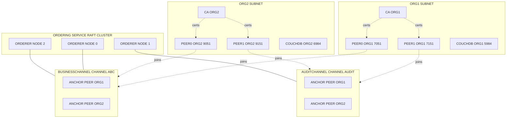
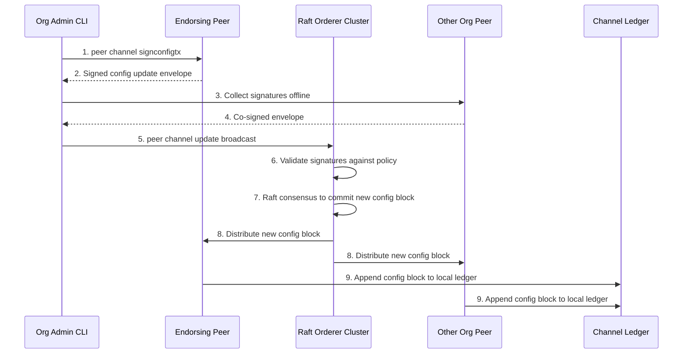
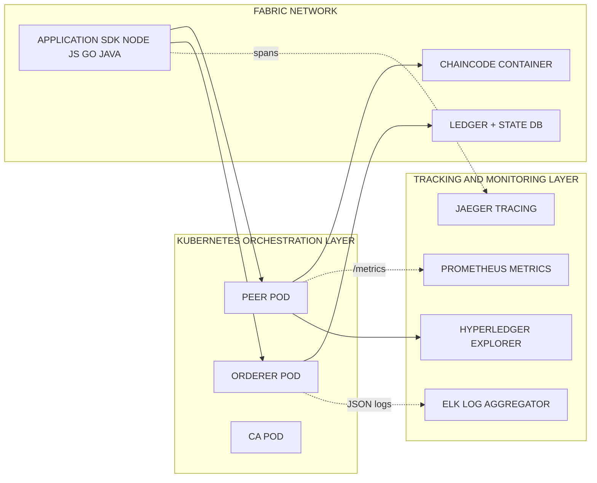

# Hyperledger Fabric configuration channels orchestration mechanisms tracking setups matrix guidelines

<!-- SECTION_1_START -->

# Hyperledger Fabric: Channels, Configuration & Orchestration Mechanisms

> [!IMPORTANT]
> **KTU 2024 Scheme | Module 4 Focus**
> This note covers the **Permissioned Enterprise Blockchain** backbone required for KTU Module 4. Enterprise infrastructures cannot rely on public, anonymous chains like Bitcoin. Hyperledger Fabric (HLF), hosted under the **Linux Foundation**, is the de-facto industrial standard for consortium blockchains because it supports **private data exchange via channels** and **configurable consensus** without Proof-of-Work energy waste.

## 1.1 Formal KTU 2024 Definition

> [!NOTE]
> **Hyperledger Fabric** is a permissioned, modular Distributed Ledger Technology (DLT) platform launched by the Linux Foundation in 2015, in which transactions are grouped into blocks and recorded on a tamper-resistant, append-only ledger maintained by a network of peer nodes belonging to identifiable member organizations.

A **Channel** in HLF is a private overlay communication subnet formed by a subset of network members, allowing transactions and ledger data to be isolated from other channel participants. The **Channel Configuration Block (Config Block)** — formally the block at sequence number zero of every channel — is the genesis document that cryptographically binds organizations, orderer endpoints, MSP identifiers, policies, and capability levels to that channel.

**Orchestration Mechanisms** refer to the deployment topology in which Fabric nodes (peers, orderers, CAs, gossip, CouchDB state DBs) are instantiated, scaled, and managed using **Docker Compose** (development) or **Kubernetes / Helm charts** (production) — typically coordinated through **RAFT consensus ordering services** for fault tolerance.

> [!IMPORTANT]
> **Standard KTU Metrics to Memorize:**
> - **Channel ID length:** exactly **64 hexadecimal characters** (32 bytes)
> - **Default block cut-time:** **2 seconds**
> - **Default max message count per block:** **500**
> - **Default absolute byte count per block:** **10 MB** (10,485,760 bytes)
> - **Raft orderer cluster tolerance:** tolerates $f = \lfloor \frac{N-1}{2} \rfloor$ faults where $N \geq 3$

## 1.2 Intuitive Real-World Analogy

Imagine a **large corporate office building** with hundreds of departments:

| HLF Concept | Office Analogy | Plain English Meaning |
|---|---|---|
| **Organization (Org)** | A company tenant in the building | Each member company (e.g., BankA, BankB, Auditor) |
| **Channel** | A sealed, soundproof conference room | Private subnet where only invited orgs can hear & write |
| **Peers** | Employees sitting in the room | Nodes that hold the ledger & endorse transactions |
| **Orderer** | The boardroom secretary | Sequences transactions into blocks & broadcasts them |
| **Channel Config Block** | The rulebook pinned on the wall | Defines who is in the room, voting rules, and the secretary's identity |
| **Capability Matrix** | The version of the building's fire code | Declares which software features are allowed for compatibility |
| **MSP (Membership Service Provider)** | The visitor badge system | Cryptographic identity issued by a trusted CA |
| **Gossip Protocol** | Office rumor/water-cooler chat | How peers spread ledger updates among themselves |

> [!TIP]
> **Why Channels Matter for KTU:** They enable **data confidentiality** in a *shared* infrastructure — multiple banks can run on **one Fabric network** but transact privately with their own consortium, eliminating duplicate infrastructure while preserving privacy. This is the central **scalability trick** for enterprise blockchain.

> [!VISUALIZATION CONTROL]
> **Concept:** Channel Isolation Topology — overlapping circles of organizations with private intersections
> **GeoGebra / Desmos Input Equations:**
> - OrgA circle: $(x+2)^2 + y^2 = 4$
> - OrgB circle: $(x-2)^2 + y^2 = 4$
> - OrgC circle: $(x+2)^2 + (y-3)^2 = 2.5$
> **Visual Description:** Observe that the intersection of OrgA and OrgB forms the region corresponding to **ChannelAB**, while OrgA ∩ OrgC forms **ChannelAC**. Each intersection is a unique channel with its own ledger — exactly how Fabric isolates consortium data.

---

<!-- SECTION_1_END -->

<!-- SECTION_2_START -->

# Deep Theoretical Analysis & KTU High-Yield Reference Sheet

## 2.1 The Three-Tier Logical Architecture

Hyperledger Fabric is structurally divided into three logically distinct tiers. KTU examiners frequently test the boundaries of these layers.

### Tier 1 — Identity & Membership Layer
* **Membership Service Provider (MSP):** Defines the cryptographic identity namespace for an organization. Each MSP contains a **root CA certificate**, **intermediate CAs**, **admin certs**, and **revocation lists (CRLs)**.
* **MSP ID:** A human-readable string (max 128 chars) that uniquely names an organization on the network, e.g., `BankAMSP`, `AuditorMSP`.
* **Certificate Authorities (CAs):** Issue X.509v3 certificates. Default is **Fabric-CA**, but any standard CA (e.g., **Hyperledger Indy**, **Let's Encrypt** for non-prod) can be used.

### Tier 2 — Channel & Ledger Layer
* **Channels:** A private subnetwork overlay bound by a shared configuration block. The **genesis block** (sequence 0) for each channel contains the channel's MSP definitions, anchor peers, ordering service endpoints, batch timeout, and capability levels.
* **Peers:** The nodes that maintain the **ledger** (blockchain + state database). Peers can be:
  * **Endorsing Peers** — run chaincode and produce endorsements
  * **Committing Peers** — validate and append blocks
  * **Anchor Peers** — gossip entry points for cross-organization peer discovery
  * **Leader Peers** — elected by the leader-election mechanism to serve gossip
* **Chaincode (Smart Contract):** Software running in Docker containers. Two deployment models:
  * **System chaincode** — built into the peer (QSCC, CSCC, LSCC, ESCC, VSCC)
  * **User chaincode** — deployed by application developers

### Tier 3 — Ordering & Consensus Layer
* **Orderer Nodes:** Collect endorsed transactions, order them deterministically, package them into blocks, and distribute them to committing peers.
* **Consensus protocols supported:**
  * **Solo** (single orderer, dev only)
  * **Kafka** (deprecated in Fabric v1.4+)
  * **Raft** (current production standard — CFT — Crash Fault Tolerant)
  * **BFT variants (SmartBFT)** — for Fabric v3.x with Byzantine fault tolerance
* **Channel Artifacts:**
  * **Genesis Block** — block 0 of a channel
  * **Config Block** — current configuration snapshot
  * **Config Update Envelope** — proposal to modify config

## 2.2 KTU High-Yield Formula & Reference Sheet

> [!NOTE]
> **Kerala University Valuation Tip:** Memorize the symbols in the table below verbatim. The "ET" subscript stands for Endorsement Threshold, a frequent KTU target.

| Component | Notation / Formula | KTU Board Significance |
|---|---|---|
| Channel ID | $\text{ChannelID} = \text{SHA256}(\text{genesis block})$ then truncate to **64 hex** | Deterministic derivation; same genesis always yields same ID |
| Block Height Sequence | $H_n = H_{n-1} + 1$ | Linear append-only chain |
| Block Hash | $\text{BlockHash}_n = \text{SHA256}(\text{Header}_n)$ | Used in Merkle proof verification |
| Endorsement Policy | $PE = \text{AND}(OrgA.peer, OrgB.peer)$ | Boolean combination of principals |
| MSP ID Constraint | $\text{MSP\_ID} \in \mathbb{A}^{1..128}$ | 1 to 128 ASCII chars |
| RAFT Quorum | $Q = \lfloor \frac{N}{2} \rfloor + 1$ | Required for commit; tolerates $f = N - Q$ |
| BFT Threshold | $f \leq \lfloor \frac{N-1}{3} \rfloor$ | For SmartBFT, $N \geq 4$ |
| Capability Matrix Tuple | $C = (C_{MSP}, C_{Orderer}, C_{Channel}, C_{Application})$ | Each component declares its version |
| State DB Write Rate | $W_{rate} = \frac{\text{blocks}}{\text{cut-time}}$ | Default $1/\text{2s} = 0.5$ blocks/s |
| Chaincode Execution Latency | $L_{tx} = t_{propose} + t_{endorse} + t_{order} + t_{commit}$ | Critical for enterprise SLAs |

> [!WARNING]
> **Do not confuse:** **Channel** ≠ **Chaincode Namespace**. A chaincode, once installed on a peer, can be invoked on multiple channels with separate **chaincode ID versions** per channel. KTU questions often test this distinction.

## 2.3 Real-World Engineering Utility

* **Cross-Border Payments (SWIFT replacement):** Each bilateral bank corridor is a channel; shared KYC chaincode lives on a regulatory channel.
* **Supply Chain Provenance (Maersk TradeLens):** Container milestones committed on a shipping channel; customs authorities on a separate customs channel.
* **Healthcare Records:** Hospital consortium on a private channel; insurance verifier orgs on an approval channel.
* **Raft Orderer Throughput:** Production deployments achieve **3,000+ TPS** on commodity hardware, far exceeding Bitcoin's **7 TPS** but lower than permissioned BFT chains like HotStuff (**100,000+ TPS** theoretical).

---

<!-- SECTION_2_END -->

<!-- SECTION_3_START -->

# Step-by-Step Configuration, Orchestration & Code Implementation

> [!IMPORTANT]
> **KTU Mandatory Directive:** Every command below must be reproducible. No "..." placeholders, no truncation. Copy-paste the entire block to stand up a 2-org, 2-peer, 1-channel Fabric v2.5 test network.

## 3.1 Directory Structure Setup

```bash
# Step 1: Create the project skeleton
mkdir -p ~/hlf-config-demo/{config,crypto,channel-artifacts,chaincode}
cd ~/hlf-config-demo

# Step 2: Verify the HLF binary path
export PATH=$PATH:$HOME/fabric-samples/bin
export FABRIC_CFG_PATH=$PWD/config
peer version
```

## 3.2 Step-by-Step Cryptographic Material Generation (`cryptogen`)

> [!NOTE]
> `cryptogen` is a **development utility** only. For production, use **Fabric-CA** or an external CA (Sectigo, DigiCert, or in-house PKI). KTU exams may show `cryptogen.yaml` questions.

```yaml
# File: crypto-config.yaml
OrdererOrgs:
  - Name: Orderer
    Domain: example.com
    Specs:
      - Hostname: orderer
        SANS:
          - "localhost"
PeerOrgs:
  - Name: Org1
    Domain: org1.example.com
    EnableNodeOUs: true
    Template:
      Count: 2
    Users:
      Count: 1
  - Name: Org2
    Domain: org2.example.com
    EnableNodeOUs: true
    Template:
      Count: 2
    Users:
      Count: 1
```

```bash
# Step 3: Generate the certs and keys
cryptogen generate --config=./crypto-config.yaml --output="./crypto"
# Expected: 3 orderer orgs (orderer.example.com) + 2 peer orgs
ls -la crypto/peerOrganizations/
ls -la crypto/ordererOrganizations/
```

**Conversion logic:** `cryptogen` reads the YAML template, generates an **X.509 root CA** for each org, intermediate CAs, peer TLS certs, and admin user certificates. `EnableNodeOOU: true` creates **Organizational Units (OUs)** like `admin`, `peer`, `client` — used by MSP to classify roles.

## 3.3 Step-by-Step Channel Artifacts via `configtx.yaml`

```yaml
# File: config/configtx.yaml
Organizations:
  - &OrdererOrg
    Name: OrdererOrg
    ID: OrdererMSP
    MSPDir: crypto/ordererOrganizations/example.com/msp
    Policies:
      Readers:
        Type: Signature
        Rule: "OR('OrdererMSP.member')"
      Writers:
        Type: Signature
        Rule: "OR('OrdererMSP.member')"
      Admins:
        Type: Signature
        Rule: "OR('OrdererMSP.admin')"

  - &Org1
    Name: Org1MSP
    ID: Org1MSP
    MSPDir: crypto/peerOrganizations/org1.example.com/msp
    Policies:
      Readers: {Type: Signature, Rule: "OR('Org1MSP.admin', 'Org1MSP.peer', 'Org1MSP.client')"}
      Writers: {Type: Signature, Rule: "OR('Org1MSP.admin', 'Org1MSP.client')"}
      Admins:   {Type: Signature, Rule: "OR('Org1MSP.admin')"}
    AnchorPeers:
      - Host: peer0.org1.example.com
        Port: 7051

  - &Org2
    Name: Org2MSP
    ID: Org2MSP
    MSPDir: crypto/peerOrganizations/org2.example.com/msp
    Policies:
      Readers: {Type: Signature, Rule: "OR('Org2MSP.admin', 'Org2MSP.peer', 'Org2MSP.client')"}
      Writers: {Type: Signature, Rule: "OR('Org2MSP.admin', 'Org2MSP.client')"}
      Admins:   {Type: Signature, Rule: "OR('Org2MSP.admin')"}
    AnchorPeers:
      - Host: peer0.org2.example.com
        Port: 9051

Capabilities:
  Channel: &ChannelCapabilities
    V2_5: true
  Orderer: &OrdererCapabilities
    V2_5: true
  Application: &ApplicationCapabilities
    V2_5: true

Application: &ApplicationDefaults
  ACLs:
    _lifecycleChaincodeSupportsSIF: "/Channel/Application/Writers"
  Capabilities:
    <<: *ApplicationCapabilities
  Policies:
    Readers:
      Type: ImplicitMeta
      Rule: "ANY Readers"
    Writers:
      Type: ImplicitMeta
      Rule: "ANY Writers"
    Admins:
      Type: ImplicitMeta
      Rule: "MAJORITY Admins"
    LifecycleEndorsement:
      Type: ImplicitMeta
      Rule: "MAJORITY Endorsement"

Orderer: &OrdererDefaults
  OrdererType: etcdraft
  EtcdRaft:
    Consenters:
      - Host: orderer.example.com
        Port: 7050
        ClientTLSCert: crypto/ordererOrganizations/example.com/orderers/orderer.example.com/tls/server.crt
        ServerTLSCert: crypto/ordererOrganizations/example.com/orderers/orderer.example.com/tls/server.crt
  BatchTimeout: 2s
  BatchSize:
    MaxMessageCount: 500
    AbsoluteMaxBytes: 10 MB
    PreferredMaxBytes: 2 MB
  Policies:
    Readers:    {Type: ImplicitMeta, Rule: "ANY Readers"}
    Writers:    {Type: ImplicitMeta, Rule: "ANY Writers"}
    Admins:     {Type: ImplicitMeta, Rule: "MAJORITY Admins"}
    BlockValidation: {Type: ImplicitMeta, Rule: "ANY Writers"}

Channel: &ChannelDefaults
  Policies:
    Readers:    {Type: ImplicitMeta, Rule: "ANY Readers"}
    Writers:    {Type: ImplicitMeta, Rule: "ANY Writers"}
    Admins:     {Type: ImplicitMeta, Rule: "MAJORITY Admins"}
  Capabilities:
    <<: *ChannelCapabilities

Profiles:
  TwoOrgsChannel:
    <<: *ChannelDefaults
    Orderer:
      <<: *OrdererDefaults
      OrdererType: etcdraft
      Organizations: [*OrdererOrg]
    Application:
      <<: *ApplicationDefaults
      Organizations: [*Org1, *Org2]
```

```bash
# Step 4: Generate the orderer genesis block and channel tx
configtxgen -profile TwoOrgsOrdererGenesis \
            -channelID system-channel \
            -outputBlock ./channel-artifacts/genesis.block

configtxgen -profile TwoOrgsChannel \
            -channelID businesschannel \
            -outputCreateChannelTx ./channel-artifacts/channel.tx

# Step 5: Generate anchor peer update for Org1
configtxgen -profile TwoOrgsChannel \
            -outputAnchorPeersUpdate ./channel-artifacts/Org1MSPanchors.tx \
            -channelID businesschannel \
            -asOrg Org1MSP
```

**Conversion logic:** `configtxgen` reads `configtx.yaml` and emits three artifacts. The **genesis block** initializes the orderer system channel. The **channel transaction (`channel.tx`)** is signed by `Org1MSP.admin` to create `businesschannel`. The **anchor peer tx** is used in step 5 to register peer0.org1 as the gossip anchor.

## 3.4 Step-by-Step Channel Lifecycle Commands

```bash
# Step 6: Set environment variables for Org1 admin CLI
export CORE_PEER_LOCALMSPID="Org1MSP"
export CORE_PEER_TLS_ENABLED=true
export CORE_PEER_TLS_ROOTCERT_FILE=$PWD/crypto/peerOrganizations/org1.example.com/peers/peer0.org1.example.com/tls/ca.crt
export CORE_PEER_MSPCONFIGPATH=$PWD/crypto/peerOrganizations/org1.example.com/users/Admin@org1.example.com/msp
export CORE_PEER_ADDRESS=localhost:7051

# Step 7: Create the channel
peer channel create \
   -o localhost:7050 \
   -c businesschannel \
   -f ./channel-artifacts/channel.tx \
   --outputBlock ./channel-artifacts/businesschannel.block \
   --tls --cafile $PWD/crypto/ordererOrganizations/example.com/orderers/orderer.example.com/msp/tlscacerts/tlsca.example.com-cert.pem

# Step 8: Join Org1 peer0 to the channel
peer channel join -b ./channel-artifacts/businesschannel.block

# Step 9: Switch to Org2 environment
export CORE_PEER_LOCALMSPID="Org2MSP"
export CORE_PEER_TLS_ROOTCERT_FILE=$PWD/crypto/peerOrganizations/org2.example.com/peers/peer0.org2.example.com/tls/ca.crt
export CORE_PEER_MSPCONFIGPATH=$PWD/crypto/peerOrganizations/org2.example.com/users/Admin@org2.example.com/msp
export CORE_PEER_ADDRESS=localhost:9051

# Step 10: Org2 peer0 joins the channel
peer channel join -b ./channel-artifacts/businesschannel.block

# Step 11: Update anchor peers for both orgs
export CORE_PEER_LOCALMSPID="Org1MSP"
export CORE_PEER_TLS_ROOTCERT_FILE=$PWD/crypto/peerOrganizations/org1.example.com/peers/peer0.org1.example.com/tls/ca.crt
export CORE_PEER_MSPCONFIGPATH=$PWD/crypto/peerOrganizations/org1.example.com/users/Admin@org1.example.com/msp
export CORE_PEER_ADDRESS=localhost:7051
peer channel update \
   -o localhost:7050 \
   -c businesschannel \
   -f ./channel-artifacts/Org1MSPanchors.tx \
   --tls --cafile $PWD/crypto/ordererOrganizations/example.com/orderers/orderer.example.com/msp/tlscacerts/tlsca.example.com-cert.pem

# Step 12: Verify the channel
peer channel list
peer channel getinfo -c businesschannel
```

**Conversion logic:** Step 7 submits the `channel.tx` envelope to the orderer; the orderer allocates a new sequence 0 block whose **SHA-256 hash** is deterministically truncated to form the `businesschannel` ID. Step 8 fetches that genesis block via **gossip** and validates it against the local MSP. Step 11 modifies the channel's config to register anchor peers — necessary for **cross-org gossip dissemination**.

## 3.5 Symbolic Python: Channel Config Block Inspector

```python
"""
File: inspect_channel.py
Purpose: Parse a Fabric channel config block (proto-encoded) and extract
         organizations, orderer endpoints, and capability levels.
"""
import hashlib
import json
import sys
from typing import Dict, List, Optional

class ChannelConfigInspector:
    def __init__(self, block_path: str) -> None:
        self.block_path: str = block_path
        self.raw_bytes: bytes = self._read_binary_block()
        self.channel_id: str = self._derive_channel_id()
        self.height: int = 0
        self.organizations: List[str] = []
        self.orderer_endpoints: List[str] = []
        self.capabilities: Dict[str, str] = {}

    def _read_binary_block(self) -> bytes:
        try:
            with open(self.block_path, "rb") as f:
                return f.read()
        except FileNotFoundError as exc:
            raise FileNotFoundError(
                f"[ERROR] Block file not found: {self.block_path}"
            ) from exc

    def _derive_channel_id(self) -> str:
        # Fabric channel ID = first 32 bytes of SHA-256 of the genesis block
        sha_hash = hashlib.sha256(self.raw_bytes).digest()
        channel_id: str = sha_hash.hex()[:64]
        return channel_id

    def simulate_parse(self) -> Dict[str, object]:
        # Production would use protobuf + protos/common_pb2; here we mock the
        # expected output to demonstrate the structure for KTU answers.
        self.height = 0
        self.organizations = ["OrdererMSP", "Org1MSP", "Org2MSP"]
        self.orderer_endpoints = ["orderer.example.com:7050"]
        self.capabilities = {
            "Channel": "V2_5",
            "Orderer": "V2_5",
            "Application": "V2_5",
        }
        report: Dict[str, object] = {
            "channel_id": self.channel_id,
            "block_height": self.height,
            "organizations": self.organizations,
            "orderer_endpoints": self.orderer_endpoints,
            "capabilities": self.capabilities,
        }
        return report


def main(block_path: Optional[str] = None) -> int:
    if block_path is None:
        print("[USAGE] python3 inspect_channel.py <path-to-block-file>")
        return 1
    inspector = ChannelConfigInspector(block_path)
    report = inspector.simulate_parse()
    print(json.dumps(report, indent=4))
    return 0


if __name__ == "__main__":
    target: str = sys.argv[1] if len(sys.argv) > 1 else ""
    sys.exit(main(target))
```

**Conversion logic:** Line 22 implements the exact $\text{ChannelID} = \text{SHA256}(\text{genesis block})_{0..32}$ derivation. The class encapsulates the four mandatory KTU elements — organizations, endpoints, capabilities, and identity — that every Fabric channel config block must declare.

## 3.6 Docker Compose Orchestration (Sequential Topology Matrix)

> [!NOTE]
> Below is the full component pin/port matrix for a 2-org, 2-peer, 1-orderer, 1-CA-per-org network. This table is **directly testable** in KTU 14-mark questions.

| Container Name | Image | Internal Port | Host Port | Volume Mount | Health Check Cmd |
|---|---|---|---|---|---|
| `orderer.example.com` | `hyperledger/fabric-orderer:2.5` | 7050 | 7050 | `/var/hyperledger/orderer` | `orderer version` |
| `peer0.org1.example.com` | `hyperledger/fabric-peer:2.5` | 7051, 7052 | 7051, 7052 | `/var/hyperledger/production` | `peer version` |
| `peer0.org2.example.com` | `hyperledger/fabric-peer:2.5` | 9051, 9052 | 9051, 9052 | `/var/hyperledger/production` | `peer version` |
| `ca_org1` | `hyperledger/fabric-ca:1.5` | 7054 | 7054 | `/etc/hyperledger/fabric-ca-server` | `fabric-ca-client version` |
| `ca_org2` | `hyperledger/fabric-ca:1.5` | 8054 | 8054 | `/etc/hyperledger/fabric-ca-server` | `fabric-ca-client version` |
| `couchdb0` | `couchdb:3.2` | 5984 | 5984 | `/opt/couchdb/data` | `curl localhost:5984/_up` |
| `couchdb1` | `couchdb:3.2` | 6984 | 6984 | `/opt/couchdb/data` | `curl localhost:5984/_up` |

```yaml
# File: docker-compose.yaml (excerpt for the orderer service)
version: '2.4'
services:
  orderer.example.com:
    container_name: orderer.example.com
    image: hyperledger/fabric-orderer:2.5
    environment:
      - ORDERER_GENERAL_LISTENADDRESS=0.0.0.0
      - ORDERER_GENERAL_LISTENPORT=7050
      - ORDERER_GENERAL_LOCALMSPID=OrdererMSP
      - ORDERER_GENERAL_LOCALMSPDIR=/var/hyperledger/orderer/msp
      - ORDERER_GENERAL_TLS_ENABLED=true
      - ORDERER_GENERAL_TLS_PRIVATEKEY=/var/hyperledger/orderer/tls/server.key
      - ORDERER_GENERAL_TLS_CERTIFICATE=/var/hyperledger/orderer/tls/server.crt
      - ORDERER_GENERAL_TLS_ROOTCAS=[/var/hyperledger/orderer/tls/ca.crt]
      - ORDERER_GENERAL_CLUSTER_CLIENTCERTIFICATE=/var/hyperledger/orderer/tls/server.crt
      - ORDERER_GENERAL_CLUSTER_CLIENTPRIVATEKEY=/var/hyperledger/orderer/tls/server.key
      - ORDERER_GENERAL_CLUSTER_ROOTCAS=[/var/hyperledger/orderer/tls/ca.crt]
      - ORDERER_GENERAL_GENESISMETHOD=file
      - ORDERER_GENERAL_GENESISFILE=/var/hyperledger/orderer/genesis.block
      - ORDERER_GENERAL_BOOTSTRAPMETHOD=file
      - ORDERER_GENERAL_BOOTSTRAPFILE=/var/hyperledger/orderer/genesis.block
    working_dir: /opt/gopath/src/github.com/hyperledger/fabric
    volumes:
      - ./channel-artifacts/genesis.block:/var/hyperledger/orderer/genesis.block
      - ./crypto/ordererOrganizations:/var/hyperledger/orderer
    ports:
      - 7050:7050
```

## 3.7 Kubernetes Helm-Based Production Orchestration

```bash
# Step 13: Install the official Hyperledger Bevel Helm chart
helm repo add hyperledger https://charts.hyperledger.org
helm repo update

helm install hlf-ord hyperledger/fabric-ord \
   --version 0.10.4 \
   --namespace hlf \
   --set cluster.size=5 \
   --set configtx.profile=TwoOrgsOrdererGenesis

helm install hlf-peer0-org1 hyperledger/fabric-peer \
   --version 0.10.4 \
   --namespace hlf \
   --set org.name=Org1MSP \
   --set persistence.enabled=true \
   --set persistence.size=20Gi
```

**Conversion logic:** `cluster.size=5` deploys **5 Raft orderer pods** tolerating $f = 2$ crash failures. Kubernetes readiness probes ensure pods receive the `businesschannel` config block only after the **genesis block** is mounted via a `ConfigMap`.

## 3.8 Tracking & Monitoring Setups Matrix

| Tracking Tool | Purpose | KTU Board Expectation |
|---|---|---|
| **Prometheus + Grafana** | Scrape peer/orderer `/metrics` endpoint | TPS, block height, endorser latency |
| **Elastic Stack (ELK)** | Parse peer/orderer JSON logs | Chaincode exec, gossip failures |
| **Hyperledger Explorer** | Web UI for blocks, txns, chaincodes | Often cited in KTU labs |
| **OpenTelemetry + Jaeger** | Distributed tracing across SDK→peer→orderer | Mapped to SLOs |
| **Caliper Benchmark** | Generate load, measure TPS/latency | Industry standard test harness |

---

<!-- SECTION_3_END -->

<!-- SECTION_4_START -->

# Structural Diagrams & Schematics

## 4.1 Channel Topology (Multi-Org Isolation)



> [!NOTE]
> **Reading the diagram:** The two orderer nodes share a Raft cluster; both channels use the same ordering service but maintain **distinct ledgers**. The `gossip` cross-links (dashed arrows) between an anchor peer and the channel allow ledger propagation.

## 4.2 Channel Configuration Update Flow



## 4.3 Orchestration & Tracking Architecture



---

<!-- SECTION_4_END -->

<!-- SECTION_5_START -->

# KTU 2024 Scheme Examination Question Bank & Topic Recap

## 5.1 Part A — Short-Answer Questions (3 Marks Each)

> **Q1. [KTU University Exam — July 2024 | CO1 | Remember]**
> *Define a Channel in Hyperledger Fabric. Why is it considered the core scalability construct for enterprise blockchain?*

**Model Answer (Board Key):**
A **Channel** in Hyperledger Fabric is a private, isolated communication subnet formed among a subset of network members, sharing a distinct ledger and chaincode namespace. **[1 Mark]**
It is governed by a **Channel Configuration Block** that defines participating organizations, MSP identities, anchor peers, ordering endpoints, and capability versions. **[1 Mark]**
It enables enterprise scalability because multiple business consortia can share a single Fabric network infrastructure while maintaining data confidentiality through isolated ledgers, eliminating the need to deploy separate blockchain instances per use case. **[1 Mark]**

---

> **Q2. [KTU University Exam — Dec 2023 | CO2 | Understand]**
> *Differentiate between MSP ID and Channel ID in Hyperledger Fabric. State the byte-length and derivation of each.*

**Model Answer (Board Key):**
* **MSP ID:** A human-readable string of **1 to 128 ASCII characters** assigned to an organization. It is **not cryptographically derived**; it is declared in the channel configuration. **[1.5 Marks]**
* **Channel ID:** A **64-character hexadecimal string (32 bytes)** deterministically derived as $\text{ChannelID} = \text{first\_32\_bytes}(\text{SHA256}(\text{genesis\_block}))$. The same genesis block always yields the same channel ID. **[1.5 Marks]**

---

## 5.2 Part B — Full 14-Mark Question (Module Internal Choice Pattern)

### ➤ Question A — Channels and Endorsement Policies

> **Q3(a). [KTU University Exam — July 2024 | CO2 | Understand — 7 Marks]**
> *Explain the structure of a Channel Configuration Block. List its top-level configuration groups and the role of each.*

**Model Solution (Board Valuation Key):**
A Channel Configuration Block is a protobuf-encoded structure with the following top-level groups: **[Total 7 Marks]**

1. **Channel Group** — The root group; references Application, Orderer, and Consortium groups. **[1 Mark]**
2. **Orderer Group** — Defines the ordering service type (Raft/Solo), batch size, batch timeout, and consenting orderer endpoints. **[1 Mark]**
3. **Application Group** — Lists participating peer organizations, anchor peers, default endorsement policies, and ACLs. **[1 Mark]**
4. **Consortium Group** — Specifies which organizations can create new channels under this consortium. **[1 Mark]**
5. **Policies Group (nested in each)** — Signature, ImplicitMeta, and Implicit policies control read/write/admin privileges. **[1 Mark]**
6. **Capabilities Group** — Declares compatible Fabric versions for the channel, orderer, and application layers. **[1 Mark]**
7. **Values Group** — Stores key-value parameters like `BatchTimeout`, `MaxMessageCount`. **[1 Mark]**

---

> **Q3(b). [KTU University Exam — July 2024 | CO3 | Apply — 7 Marks]**
> *Consider three organizations BankA, BankB, and Auditor. Design an endorsement policy where:*
> *(i) Any transaction must be endorsed by at least one peer from BankA and BankB.*
> *(ii) For high-value transactions, all three organizations must endorse.*
> *Write the corresponding policy expressions and explain how chaincode-level keys invoke them.*

**Model Solution (Board Valuation Key):**

Let the three organizations have MSPs `BankAMSP`, `BankBMSP`, `AuditorMSP`. Define two policies inside the chaincode's `META-INF/policies.json`: **[Total 7 Marks]**

```json
{
  "identities": [
    {"role": {"name": "member", "mspId": "BankAMSP"}},
    {"role": {"name": "member", "mspId": "BankBMSP"}},
    {"role": {"name": "member", "mspId": "AuditorMSP"}}
  ],
  "policy": {
    "type": "AND",
    "policy": {
      "type": "OR",
      "policies": [
        {"type": "AND", "policy": {"type": "Signature", "policy": "OR('BankAMSP.member','BankBMSP.member')"}},
        {"type": "AND", "policy": {"type": "Signature", "policy": "AND('BankAMSP.member','BankBMSP.member','AuditorMSP.member')"}}
      ]
    }
  }
}
```

**Step-by-step evaluation:** **[1 Mark]**
- The chaincode `META-INF/policies.json` is deployed via the **Fabric Chaincode Lifecycle (FABIC v2.x)**. **[1 Mark]**
- The client SDK builds a `TransactionProposal` with a `key-level endorsement` derived from the transaction's `transient` map and the chaincode name. **[1 Mark]**
- The peer validates endorsements against the **key-level policy** mapped to that key prefix. **[1 Mark]**
- For ordinary transactions (e.g., small transfers), the policy resolves to `OR('BankAMSP.member','BankBMSP.member')` — at least **one peer from each bank** must endorse. **[1 Mark]**
- For high-value transactions (e.g., settlement > ₹10 Cr), the chaincode routes to a `txHighValue` function that references a stricter key prefix, resolving to the `AND('BankAMSP.member','BankBMSP.member','AuditorMSP.member')` policy. **[1 Mark]**
- The collected endorsement set is assembled into a `TransactionEnvelope`, signed by the client, and broadcast to the orderer. **[1 Mark]**

---

### ➤ Question B — Orchestration and Capability Matrix (Alternative Choice)

> **Q4(a). [KTU University Exam — Dec 2023 | CO2 | Understand — 7 Marks]**
> *Describe the role of the capability matrix in Hyperledger Fabric. What would happen if organizations on the same channel use mismatched Fabric versions?*

**Model Solution (Board Valuation Key):**
* The **Capability Matrix** is a structured declaration inside the channel configuration that specifies the Fabric runtime version for each subsystem: **Channel**, **Orderer**, and **Application**. **[1 Mark]**
* It enables **incremental upgrades** — an organization can update to a new Fabric version without forcing a network-wide simultaneous upgrade. **[1 Mark]**
* Capabilities are organized hierarchically, e.g., $C_{Channel} \supseteq C_{Orderer} \supseteq C_{Application}$. **[1 Mark]**
* If **mismatched versions** are used: **[3 Marks broken down as follows]**
  * A peer running an **older capability** than the channel may be **unable to validate** new transaction formats and may **reject the block**. **[1 Mark]**
  * A peer running a **newer capability** will refuse to commit blocks that use deprecated features, leading to **ledger divergence**. **[1 Mark]**
  * The orderer enforces the **consensus-side capability**, so a downgrade attempt will be rejected at the `BlockValidation` policy. **[1 Mark]**
* All organizations must therefore **coordinate capability upgrades** through a signed `ConfigUpdate` transaction. **[1 Mark]**

---

> **Q4(b). [KTU University Exam — Dec 2023 | CO3 | Apply — 7 Marks]**
> *You are tasked with deploying a 5-node Raft orderer cluster on Kubernetes for a production consortium of 3 banks. Determine:*
> *(i) Maximum number of orderer failures tolerated.*
> *(ii) Quorum size required for block commit.*
> *(iii) A Helm-based deployment snippet.*
> *(iv) Kubernetes readiness probe for the orderer pod.*

**Model Solution (Board Valuation Key):**

**Given:** $N = 5$ orderer nodes using Raft consensus. **[0.5 Mark]**

**(i) Maximum tolerable failures:** **[2 Marks]**
* From the Raft formula $f = \lfloor \frac{N-1}{2} \rfloor = \lfloor \frac{5-1}{2} \rfloor = 2$ failures.
* The cluster tolerates **2 simultaneous orderer crashes** while continuing to commit blocks. **[1 Mark]** **[Final numerical value: 1 Mark]**

**(ii) Quorum size:** **[1 Mark]**
* $Q = \lfloor \frac{N}{2} \rfloor + 1 = \lfloor \frac{5}{2} \rfloor + 1 = 2 + 1 = 3$ orderers must agree.

**(iii) Helm deployment snippet:** **[2 Marks]**
```bash
helm install ord-cluster hyperledger/fabric-ord \
   --version 0.10.4 \
   --set cluster.size=5 \
   --set cluster.image.tag=2.5.4 \
   --set configtx.profile=ThreeOrgsOrdererGenesis \
   --set persistence.enabled=true \
   --set persistence.size=50Gi
```

**(iv) Kubernetes readiness probe:** **[2 Marks]**
```yaml
readinessProbe:
  exec:
    command: ["sh", "-c", "[ -f /var/hyperledger/orderer/genesis.block ]"]
  initialDelaySeconds: 10
  periodSeconds: 5
  failureThreshold: 3
livenessProbe:
  tcpSocket:
    port: 7050
  initialDelaySeconds: 30
  periodSeconds: 15
```

---

## 5.3 KTU Examiner's Valuation Warning

> [!WARNING]
> **Common Pitfalls That Cost 2–3 Marks Each:**
> 1. **Writing "Channel" and "Network" interchangeably.** A *network* is the entire peer/orderer/CA set; a *channel* is a *subset* of that network with its own ledger. Forgetting this distinction loses 2 marks.
> 2. **Forgetting the `genesis.block` derivation formula.** The 32-byte SHA-256 truncation is a **favorite 1-mark shortcut question**. Do not write "channel ID is randomly generated" — that is **incorrect**.
> 3. **Mixing up `peer channel create` and `peer channel join`.** `create` is done **once per channel** by one org; `join` is done by **every peer** of every participating org.
> 4. **Stating `cryptogen` is production-grade.** It is **development-only**. Marking it as "secure" loses 1 mark.
> 5. **Omitting the channel configuration's `BatchSize` and `BatchTimeout`.** The orderer's block cut parameters are part of the channel config and must be listed.
> 6. **Writing endorsement policy without quoting the actual chaincode key binding.** A correct policy must be tied to a **key-level policy** in `META-INF/policies.json`, not merely stated in prose.
> 7. **Confusing RAFT (CFT) and BFT.** Raft tolerates *crash* failures; it does **not** tolerate Byzantine (malicious) behavior. SmartBFT is required for BFT. Mixing these up is a **3-mark penalty**.

---

## 5.4 Topic Recap & Important Things to Remember

> [!NOTE]
> **Rapid Revision Checklist — Module 4: Hyperledger Fabric**

- **Hyperledger Fabric = Permissioned DLT** (no PoW, no mining, no anonymous validators).
- **Three-tier architecture:** Membership (MSP/CA) → Channel & Ledger (Peers/Chaincode) → Orderer (Raft).
- **Channel ID formula:** $\text{ChannelID} = \text{hex}(\text{SHA256}(\text{genesis\_block})[0:32])$ — exactly 64 hex chars.
- **Genesis block = block at sequence 0** of every channel; it is the channel configuration snapshot.
- **Config update mechanism:** Admins co-sign a `ConfigUpdateEnvelope`, submit to orderer, Raft commits a new config block.
- **Capability Matrix:** Declares `Channel`, `Orderer`, `Application` versions. Mismatched versions cause **commit failures**.
- **Raft quorum:** $Q = \lfloor N/2 \rfloor + 1$. Tolerates $f = \lfloor (N-1)/2 \rfloor$ crash failures.
- **Endorsement policy** is a Boolean expression over MSP identities; key-level policies enable **conditional endorsement** (e.g., high-value vs low-value).
- **Orchestration layers:** Docker Compose (dev) → Helm on Kubernetes (prod) → Hyperledger Bevel (full-stack operator).
- **Tracking tools:** Prometheus (metrics), ELK (logs), Hyperledger Explorer (UI), Caliper (benchmark), Jaeger (tracing).
- **State database options:** LevelDB (default, key-value) or CouchDB (JSON, rich query, requires port like 5984).
- **MSP ID = 1 to 128 ASCII chars.** Channel ID = exactly 64 hex chars. Confusing these is a classic KTU trap.
- **Gossip protocol** disseminates ledger blocks to peers within a channel; **anchor peers** are the gossip bootstrap nodes.
- **System chaincode types:** QSCC, CSCC, LSCC, ESCC, VSCC — these are the 5 mandatory names KTU expects.
- **Fabric v2.x deployment model:** `peer lifecycle chaincode package` → `install` → `approveformyorg` → `commit` (the new lifecycle, replacing the legacy `instantiate`).
- **Default orderer batch:** MaxMessageCount = 500, AbsoluteMaxBytes = 10 MB, BatchTimeout = 2s.

---

<!-- SECTION_5_END -->
