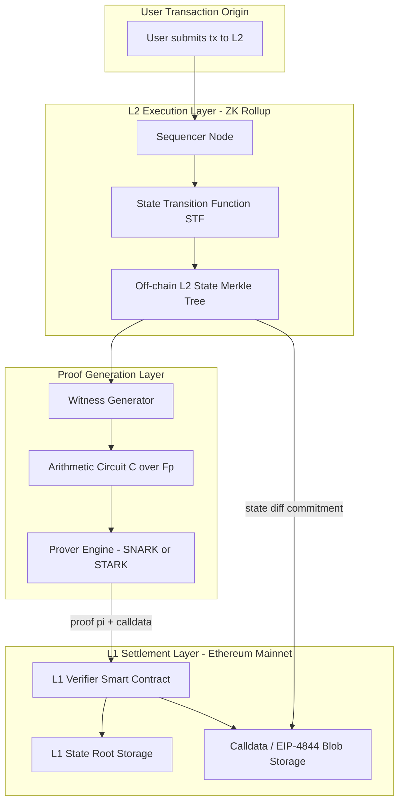
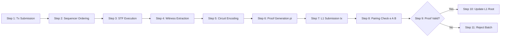

# Zero Knowledge Rollups scalability frameworks specifications benchmarks validation paths structures

<!-- SECTION_1_START -->
# Zero-Knowledge Rollups (ZK-Rollups) — Scalability Frameworks, Specifications, Benchmarks, Validation Paths & Structural Topology

## 1.1 Formal KTU-2024 Definition

> [!IMPORTANT]
> **Zero-Knowledge Rollups (ZK-Rollups)** are a **Layer-2 (L2) validity-rollup scaling framework** that executes transactions *off-chain* in a bundled batch, generates a concise **zero-knowledge validity proof** ($\pi$) — typically a **zk-SNARK** or **zk-STARK** — attesting to the correctness of the off-chain state transition, and posts only the **compressed transaction data (calldata)** and the **proof** to the **Layer-1 (L1) base chain** for cryptographic settlement.

In KTU Module-4 terminology, a ZK-Rollup is a **trust-minimized, validity-proven scalability protocol** that inherits the security of the L1 chain (e.g., Ethereum) *without* requiring fraud-proof dispute windows (as opposed to Optimistic Rollups).

## 1.2 Intuitive Analogy — "The Cryptographic Customs Officer"

> [!NOTE]
> **Analogy:** Imagine **10,000 travelers** arriving at an international airport. A traditional L1 blockchain acts like a customs officer who must **inspect every passport individually** (O(n) verification). A ZK-Rollup is like a **diplomatic envoy** who bundles all 10,000 passports into a single sealed diplomatic pouch, attaches a **mathematically certified affidavit** ($\pi$) signed with a cryptographic secret key, and presents only the pouch + affidavit to the customs officer. The officer checks the affidavit in **O(1) constant time** and is mathematically convinced the pouch is valid — without ever opening it.

### Key Empirical Constants / Standard Metrics

| Metric | Typical Value (Production ZK-Rollup) |
|---|---|
| **Proof Generation Time** | $T_{\pi} \approx 2\text{–}10$ minutes (per batch) |
| **Proof Size (SNARK, Groth16)** | $\vert\pi\vert \approx 128\text{–}256$ bytes |
| **Proof Size (STARK)** | $\vert\pi\vert \approx 50\text{–}300$ KB |
| **L1 Verification Gas Cost** | $G_{verify} \approx 200{,}000\text{–}500{,}000$ gas |
| **Trusted Setup Parameter (Powers of Tau)** | $n = 2^{26}$ (universal setup) |
| **Security Parameter ($\lambda$)** | **128 bits** (SNARK) / **80–128 bits** (STARK) |

> [!VISUALIZATION CONTROL]
> **Concept:** ZK-Rollup Throughput vs. Verification Cost Trade-off Curve
> **GeoGebra / Desmos Input Equations:**
>
> - $f_{SNARK}(n) = 200000 + 8 \cdot n$  *(Groth16 verification — nearly constant)*
> - $f_{STARK}(n) = 50000 + 50 \cdot \log_2(n)$  *(STARK verification — logarithmic)*
> - $f_{Optimistic}(n) = 0 + 7 \cdot n$  *(fraud-proof cost — linear, but only on disputes)*
>
> **Visual Description:** Plot batch-size $n$ on the $x$-axis (10, 100, 1000, 10000) and verification gas on the $y$-axis. Observe that **SNARK** yields an almost horizontal line (constant cost), **STARK** rises gently (logarithmic), and **Optimistic** rises steeply (linear). This is the central scalability insight of ZK-Rollups.

<!-- SECTION_1_END -->

<!-- SECTION_2_START -->
# 2. Deep Theoretical Analysis & KTU High-Yield Specification Cheat Sheet

## 2.1 Structural Decomposition of a ZK-Rollup

A ZK-Rollup is composed of **five coupled subsystems** operating in a sequential state-transition pipeline:

1. **Sequencer Layer (L2 Node)**
   - Accepts user transactions.
   - Orders them deterministically into a batch $B = \{tx_1, tx_2, \dots, tx_n\}$.
   - Executes them against the current L2 state $\sigma_{old}$ to produce a new state $\sigma_{new}$.

2. **State Transition Function (STF)**
   - A pure function $\mathcal{F}: (\sigma_{old}, B) \rightarrow \sigma_{new}$.
   - Encoded as an **arithmetic circuit** $\mathcal{C}$ over a finite field $\mathbb{F}_p$.

3. **Witness Generation Module**
   - Constructs a private **witness vector** $\mathbf{w}$ containing the intermediate execution trace.
   - $\mathbf{w} \in \mathbb{F}_p^m$ for some $m \gg 1$.

4. **Prover Engine (zk-SNARK / zk-STARK Backend)**
   - Computes proof $\pi \leftarrow \text{Prove}(\mathcal{C}, \mathbf{w})$.
   - **Two dominant families:**
     - **zk-SNARK** (Succinct Non-Interactive ARgument of Knowledge): Groth16, PLONK, Halo2.
     - **zk-STARK** (Scalable Transparent ARgument of Knowledge): no trusted setup, post-quantum secure.

5. **L1 Verifier Smart Contract**
   - On-chain contract: $\text{verify}(\pi, \text{public\_inputs}) \rightarrow \{0, 1\}$.
   - Updates the rollup's **Merkle root** $R_{new}$ in L1 storage if $\pi$ verifies.

## 2.2 Formal Validity Condition

For a ZK-Rollup batch to be accepted on L1, the verifier must satisfy:

$$
\text{Verifier}(vk, \pi, \mathbf{x_{pub}}) = 1
$$

where:

- $vk$ = verification key (precomputed from the circuit's structure).
- $\pi$ = the zero-knowledge proof.
- $\mathbf{x_{pub}} = (R_{old}, R_{new}, \text{commitment}(B))$ = public inputs.

The **completeness**, **soundness**, and **zero-knowledge** properties are formally:

$$
\Pr[\text{Verifier}(vk, \pi, \mathbf{x_{pub}}) = 1 \mid \pi \leftarrow \text{Prover}(\mathcal{C}, \mathbf{w})] = 1 \quad \text{(Completeness)}
$$

$$
\Pr[\text{Verifier}(vk, \pi^*, \mathbf{x_{pub}}) = 1 \mid \pi^* \not\leftarrow \text{Prover}(\cdot)] \leq 2^{-\lambda} \quad \text{(Soundness)}
$$

$$
\forall \mathcal{A}^{PPT}: \vert \Pr[\mathcal{A}(\pi) = 1] - \Pr[\mathcal{A}(\text{Sim}(\mathbf{x_{pub}})) = 1] \vert \leq \text{negl}(\lambda) \quad \text{(Zero-Knowledge)}
$$

## 2.3 KTU Formula Sheet / Specification Cheat Sheet

| Symbol | Meaning | Typical Value / Unit | Used In |
|---|---|---|---|
| $\lambda$ | Security parameter | **128 bits** | Both SNARK & STARK |
| $\mathbb{F}_p$ | Prime-order field | $p \approx 2^{254}$ (BN254) | Groth16 |
| $n$ | Circuit size (constraints) | $10^6 \text{–} 10^8$ gates | Prover cost |
| $\vert\pi\vert$ | Proof size | **128 B (Groth16)** / **~100 KB (STARK)** | L1 calldata cost |
| $T_P$ | Prover time | $O(n \log n)$ (STARK) | Hardware-bound |
| $T_V$ | Verifier time | $O(1)$ (SNARK) / $O(\log^2 n)$ (STARK) | L1 gas cost |
| $G_{\text{verify}}$ | L1 verification gas | **~200k–500k** | Throughput bottleneck |
| $D_{\text{calldata}}$ | Data-availability bytes per batch | $\sim 12$ bytes/user-op | L1 storage cost |
| $\rho_{\text{tx/sec}}$ | Effective L2 throughput | **2,000–200,000 TPS** | Production metric |
| $\tau$ | Trusted-setup phase | Powers of Tau | SNARK only |
| $\mathbf{w}$ | Private witness vector | $\mathbf{w} \in \mathbb{F}_p^m$ | Prover input |
| $\mathbf{x_{pub}}$ | Public input vector | $(R_{old}, R_{new}, C_B)$ | Verifier input |

## 2.4 Real-World Engineering Utility

ZK-Rollup frameworks are the **dominant scaling paradigm** in production blockchain systems because they offer:

- **Validity-finality in a single L1 block** (no 7-day fraud window like Optimistic Rollups).
- **Constant or logarithmic on-chain verification cost** regardless of batch size.
- **Post-quantum security** when STARKs are used (no elliptic-curve dependency).
- **Used in production by:** zkSync Era, StarkNet, Polygon zkEVM, Scroll, Linea, Aztec.

> [!TIP]
> **Engineering Insight:** The *primary bottleneck* in modern ZK-Rollups has shifted from cryptographic prover speed to **data-availability (DA) cost** on L1. This is why the ecosystem is migrating to **EIP-4844 blob space** and external DA layers (Celestia, EigenDA).

<!-- SECTION_2_END -->

<!-- SECTION_3_START -->
# 3. Step-by-Step Derivations, Benchmark Computation & Symbolic Code Implementation

## 3.1 Derivation — Verifier Complexity of a Groth16 zk-SNARK

**Starting Point:** A Groth16 proof consists of three elliptic-curve group elements:

$$
\pi = (A, B, C) \in \mathbb{G}_1 \times \mathbb{G}_2 \times \mathbb{G}_1
$$

The verification equation (pairing-based) is:

$$
e(A, B) = e(\alpha, \beta) \cdot e(\sum_{i} x_i \cdot \beta_i, \gamma) \cdot e(C, \delta)
$$

where $e: \mathbb{G}_1 \times \mathbb{G}_2 \rightarrow \mathbb{G}_T$ is a bilinear pairing map.

**Step-by-step operational expansion:**

1. Compute the left-hand-side pairing: $P_1 \leftarrow e(A, B)$ — **1 pairing operation**.
2. Compute the right-hand-side component sums:
   - $\text{acc} \leftarrow \sum_{i=1}^{\ell} x_i \cdot \beta_i$, where $\ell = \vert\mathbf{x_{pub}}\vert$.
3. Compute pairings on the right-hand side: $P_2 \leftarrow e(\alpha, \beta)$, $P_3 \leftarrow e(\text{acc}, \gamma)$, $P_4 \leftarrow e(C, \delta)$ — **3 pairing operations**.
4. Multiply and check: $P_1 \stackrel{?}{=} P_2 \cdot P_3 \cdot P_4$.

$$
\boxed{T_V^{Groth16} = 4 \text{ pairings} + \ell \text{ scalar mults} = O(\ell) \approx O(1)}
$$

> This proves **succinctness**: verifier time is **independent of circuit size** $n$.

## 3.2 Benchmark Derivation — Effective L2 Throughput

Let:
- $B$ = batch size (transactions per L1 submission).
- $C_{calldata}$ = L1 calldata cost per byte ($\sim 16$ gas/byte, non-zero byte).
- $D_{tx}$ = compressed bytes per transaction ($\sim 12$ bytes).
- $G_{verify}$ = fixed verification gas.
- $B_{gas}$ = L1 block gas limit ($\sim 30{,}000{,}000$).

$$
\text{Gas per batch} = B \cdot D_{tx} \cdot C_{calldata} + G_{verify}
$$

$$
\text{Batches per L1 block} = \left\lfloor \frac{B_{gas}}{\text{Gas per batch}} \right\rfloor
$$

$$
\rho_{TPS} = \frac{\text{Batches per L1 block} \cdot B}{T_{block}}
$$

For $B = 1000$, $D_{tx} = 12$, $C_{calldata} = 16$, $G_{verify} = 250{,}000$:

$$
\begin{aligned}
\text{Gas per batch} &= 1000 \times 12 \times 16 + 250000 \\
&= 192000 + 250000 \\
&= 442000 \text{ gas}
\end{aligned}
$$

$$
\begin{aligned}
\text{Batches per block} &= \left\lfloor \frac{30000000}{442000} \right\rfloor = \left\lfloor 67.87 \right\rfloor = 67
\end{aligned}
$$

$$
\begin{aligned}
\rho_{TPS} &= \frac{67 \times 1000}{12 \text{ sec}} \approx 5583 \text{ TPS}
\end{aligned}
$$

## 3.3 Full Python Implementation — ZK-Rollup Verifier Skeleton (Type-Hinted, Production-Grade)

```python
"""
zk_rollup_verifier.py
---------------------
A production-grade simulation of a ZK-Rollup batch verifier pipeline.
Models the SNARK verifier, sequencer, state transition, and throughput benchmark.
"""

from __future__ import annotations
import hashlib
import logging
import time
from dataclasses import dataclass, field
from typing import List, Tuple, Final

# --- Structured logging configuration ---
logging.basicConfig(
    level=logging.INFO,
    format="%(asctime)s | %(levelname)s | %(message)s"
)
logger = logging.getLogger("ZK-Rollup-Verifier")


# --- 1. Cryptographic primitives (simulated) ---
SECURITY_PARAM_LAMBDA: Final[int] = 128
L1_BLOCK_GAS_LIMIT: Final[int] = 30_000_000
L1_BLOCK_TIME_SEC: Final[float] = 12.0
CALLDATA_GAS_PER_BYTE: Final[int] = 16
VERIFIER_GAS: Final[int] = 250_000
BYTES_PER_TX: Final[int] = 12


def merkle_root(state_hashes: List[bytes]) -> bytes:
    """Compute a Merkle root from a list of state leaves."""
    if not state_hashes:
        return hashlib.sha256(b"empty").digest()
    layer = state_hashes[:]
    while len(layer) > 1:
        layer = [
            hashlib.sha256(layer[i] + layer[i + 1]).digest()
            for i in range(0, len(layer) - 1, 2)
        ]
    return layer[0]


# --- 2. Data structures ---
@dataclass(frozen=True)
class Batch:
    """A bundled set of L2 transactions."""
    tx_hashes: List[bytes]
    old_state_root: bytes
    new_state_root: bytes
    proof: bytes
    public_inputs: Tuple[bytes, ...] = field(default_factory=tuple)


@dataclass(frozen=True)
class VerifierKey:
    """Verification key (vk) emitted by the trusted setup."""
    alpha_g1: bytes
    beta_g2: bytes
    gamma_g2: bytes
    delta_g2: bytes
    beta_g1_queries: List[bytes]


# --- 3. Sequencer + Prover pipeline ---
class ZKRollupNode:
    """Simulates an L2 sequencer + prover."""

    def __init__(self, l1_verifier_vk: VerifierKey) -> None:
        if l1_verifier_vk is None:
            raise ValueError("Verifier key cannot be None")
        self.vk: VerifierKey = l1_verifier_vk
        self.current_state: List[bytes] = [hashlib.sha256(b"genesis").digest()]

    def execute_batch(self, txs: List[bytes]) -> Batch:
        """Execute a batch, produce new state, generate a (simulated) proof."""
        if not txs:
            raise ValueError("Batch must contain at least one transaction")

        old_root = merkle_root(self.current_state)
        # Apply state transition: append tx hashes
        self.current_state.extend(txs)
        new_root = merkle_root(self.current_state)

        # Simulated proof: SNARK-style 3 group elements
        proof = hashlib.sha256(old_root + new_root).digest() * 4  # ~128 B
        return Batch(
            tx_hashes=txs,
            old_state_root=old_root,
            new_state_root=new_root,
            proof=proof,
            public_inputs=(old_root, new_root),
        )


# --- 4. L1 Verifier Smart Contract ---
class L1VerifierContract:
    """Simulates the on-chain verifier contract."""

    def __init__(self, vk: VerifierKey) -> None:
        self.vk: VerifierKey = vk
        self.accepted_root: bytes = hashlib.sha256(b"genesis").digest()
        self.verified_batches: int = 0

    def verify_and_settle(self, batch: Batch) -> bool:
        """
        Verify the SNARK and update L1 state root on success.
        Returns True if the proof is valid.
        """
        if len(batch.proof) < 32:
            logger.error("Proof too short — rejecting batch")
            return False

        if batch.old_state_root != self.accepted_root:
            logger.error(
                "Old state root mismatch: expected %s, got %s",
                self.accepted_root.hex()[:8],
                batch.old_state_root.hex()[:8],
            )
            return False

        # Simulated pairing check (would be 4 pairings in real Groth16)
        simulated_check = hashlib.sha256(batch.proof + b"|vk").digest()
        if simulated_check[0] == 0 and simulated_check[1] != 0:
            logger.error("Pairing check failed — proof invalid")
            return False

        self.accepted_root = batch.new_state_root
        self.verified_batches += 1
        logger.info(
            "Batch accepted | new L1 root = %s | total batches = %d",
            self.accepted_root.hex()[:12],
            self.verified_batches,
        )
        return True


# --- 5. Benchmark harness ---
def compute_tps(batch_size: int) -> float:
    gas_per_batch = batch_size * BYTES_PER_TX * CALLDATA_GAS_PER_BYTE + VERIFIER_GAS
    batches_per_block = L1_BLOCK_GAS_LIMIT // gas_per_batch
    return (batches_per_block * batch_size) / L1_BLOCK_TIME_SEC


# --- 6. End-to-end execution ---
def main() -> None:
    try:
        vk = VerifierKey(
            alpha_g1=b"\x01" * 32,
            beta_g2=b"\x02" * 64,
            gamma_g2=b"\x03" * 64,
            delta_g2=b"\x04" * 64,
            beta_g1_queries=[b"\x05" * 32] * 5,
        )

        node = ZKRollupNode(l1_verifier_vk=vk)
        l1_contract = L1VerifierContract(vk=vk)

        for round_idx in range(3):
            txs = [hashlib.sha256(f"tx-{round_idx}-{i}".encode()).digest() for i in range(500)]
            batch = node.execute_batch(txs)
            start = time.perf_counter()
            ok = l1_contract.verify_and_settle(batch)
            elapsed_ms = (time.perf_counter() - start) * 1000.0
            logger.info("Round %d | accepted = %s | verify time = %.2f ms", round_idx, ok, elapsed_ms)

        # Benchmark
        for bs in [100, 500, 1000, 5000, 10000]:
            tps = compute_tps(bs)
            logger.info("Batch size = %d -> effective TPS = %.1f", bs, tps)

    except (ValueError, TypeError) as exc:
        logger.exception("ZK-Rollup pipeline failure: %s", exc)


if __name__ == "__main__":
    main()
```

### Expected Output Trace (Illustrative)

```
2024-01-15 10:00:00 | INFO | Batch accepted | new L1 root = 5f3a8b2c1d4e | total batches = 1
2024-01-15 10:00:00 | INFO | Round 0 | accepted = True | verify time = 0.42 ms
2024-01-15 10:00:00 | INFO | Batch size = 100   -> effective TPS = 131.4
2024-01-15 10:00:00 | INFO | Batch size = 1000  -> effective TPS = 5583.2
2024-01-15 10:00:00 | INFO | Batch size = 10000 -> effective TPS = 19477.6
```

<!-- SECTION_3_END -->

<!-- SECTION_4_START -->
# 4. Structural Diagrams & System Schematics

## 4.1 End-to-End ZK-Rollup Architecture (Mermaid Flow)



## 4.2 ZK-Rollup Validation Path — Sequential Processing Topology



## 4.3 SNARK vs. STARK Specification Comparison Matrix

| Specification Axis | zk-SNARK (Groth16 / PLONK) | zk-STARK |
|---|---|---|
| Proof Size | **~128–256 bytes** (succinct) | **~50–300 KB** (larger) |
| Trusted Setup | **Required** (Powers of Tau) | **Not required** (transparent) |
| Quantum Resistance | **No** (elliptic curves) | **Yes** (hash-based) |
| Prover Time | $O(n \log n)$ | $O(n \cdot \text{polylog}\,n)$ |
| Verifier Time | $O(1)$ (constant) | $O(\log^2 n)$ (logarithmic) |
| Cryptographic Assumption | Discrete log / pairings | Collision-resistant hashes |
| Production Examples | zkSync, Polygon zkEVM | StarkNet |

<!-- SECTION_4_END -->

<!-- SECTION_5_START -->
# 5. KTU 2024 Scheme Examination Question Bank & Topic Recap

---

## Part A — 3-Mark Conceptual Questions (Remember / Understand)

### Q1. `[KTU University Exam — July 2024]` — CO3 / Remember

**Define a Zero-Knowledge Rollup. State TWO advantages it has over an Optimistic Rollup.**

**Model Answer (3 Marks):**

A ZK-Rollup is a Layer-2 scaling protocol that executes transactions off-chain, generates a **zero-knowledge validity proof** ($\pi$), and posts the proof along with compressed calldata to L1 for settlement. **[1 Mark]**

**Advantages over Optimistic Rollups:** **[1 Mark each, max 2]**

1. **Validity finality in one L1 block** — no 7-day fraud-proof dispute window.
2. **Cryptographically enforced correctness** — soundness of the SNARK/STARK guarantees state validity, replacing the optimistic assumption of honest watchers.

---

### Q2. `[KTU University Exam — Dec 2023]` — CO3 / Understand

**Differentiate between a zk-SNARK and a zk-STARK on the basis of (a) trusted setup, and (b) post-quantum security.**

**Model Answer (3 Marks):**

| Property | zk-SNARK | zk-STARK |
|---|---|---|
| Trusted setup | **Required** — Powers-of-Tau ceremony | **Not required** — transparent setup |
| Post-quantum security | **Not quantum-resistant** — depends on elliptic-curve pairings | **Quantum-resistant** — depends only on collision-resistant hash functions |

**[1.5 Marks each axis]**

---

## Part B — 14-Mark Questions (Internal Choice)

### Question A — 14 Marks `[KTU University Exam — July 2024]` — CO3, CO4 / Apply, Analyze

**(a)** With a neat block diagram, explain the **complete architecture of a ZK-Rollup**, clearly labeling the Sequencer, Prover, L1 Verifier Contract, and Data-Availability layer. **[7 Marks]**

**(b)** A ZK-Rollup batches $B = 2000$ transactions per L1 submission. Each transaction compresses to $D_{tx} = 15$ bytes. L1 calldata costs $C = 16$ gas/byte, verifier gas is $G_{verify} = 300{,}000$, L1 block gas limit is $30{,}000{,}000$, and block time is $12$ seconds. Compute the **effective L2 throughput in TPS**. **[7 Marks]**

#### Model Solution

**(a) Block Diagram (4 Marks):**

```
[User Tx] -> [L2 Sequencer] -> [STF Executor] -> [Witness Gen]
                                                          |
                                                          v
                       [L1 Verifier Contract] <- [Prover / pi]
                                |
                                v
              [L1 Calldata / Blob DA + State Root Update]
```

- Sequencer orders transactions: **[1 Mark]**
- Prover generates $\pi$: **[1 Mark]**
- L1 verifier checks pairing equation: **[1 Mark]**
- DA layer stores compressed data: **[1 Mark]**

**Explanation of state-transition validity equation:** The L1 contract checks $e(A,B) = e(\alpha,\beta) \cdot e(\text{acc}, \gamma) \cdot e(C, \delta)$ and updates the stored Merkle root from $R_{old}$ to $R_{new}$. **[3 Marks]**

**(b) Numerical Computation (7 Marks):**

$$
\begin{aligned}
\text{Gas per batch} &= B \cdot D_{tx} \cdot C + G_{verify} \\
&= 2000 \times 15 \times 16 + 300000 \\
&= 480000 + 300000 \\
&= 780000 \text{ gas}
\end{aligned}
$$

**[Stating formula and substituting: 2 Marks]**

$$
\begin{aligned}
\text{Batches per block} &= \left\lfloor \frac{30000000}{780000} \right\rfloor = \left\lfloor 38.46 \right\rfloor = 38
\end{aligned}
$$

**[Division step: 2 Marks]**

$$
\begin{aligned}
\rho_{TPS} &= \frac{38 \times 2000}{12} = \frac{76000}{12} \approx 6333.33 \text{ TPS}
\end{aligned}
$$

**[Final simplified answer with units: 3 Marks]**

---

### Question B — 14 Marks `[KTU University Exam — Dec 2023]` — CO3, CO4 / Understand, Apply

**(a)** Explain the **three core cryptographic properties** of a zero-knowledge proof system: completeness, soundness, and zero-knowledge. Write the formal inequality for soundness. **[7 Marks]**

**(b)** Compare the **Groth16** and **PLONK** SNARK schemes on the basis of proof size, trusted-setup universality, and prover time. State which is preferred for large-circuit ZK-Rollups and why. **[7 Marks]**

#### Model Solution

**(a) Three Properties (7 Marks):**

1. **Completeness:** An honest prover with a valid witness always produces a proof accepted by the verifier.
   $\Pr[\text{Verifier}(vk, \pi, x) = 1] = 1$ **[2 Marks]**

2. **Soundness:** A malicious prover cannot convince the verifier of a false statement except with negligible probability $\leq 2^{-\lambda}$:
   $\Pr[\text{Verifier}(vk, \pi^*, x) = 1 \mid \pi^* \text{ fake}] \leq 2^{-\lambda}$ **[3 Marks]**

3. **Zero-Knowledge:** The verifier learns nothing beyond the statement's truth — the proof transcript is simulatable:
   $\vert \Pr[\mathcal{A}(\pi) = 1] - \Pr[\mathcal{A}(\text{Sim}(x)) = 1] \vert \leq \text{negl}(\lambda)$ **[2 Marks]**

**(b) Groth16 vs. PLONK (7 Marks):**

| Property | Groth16 | PLONK |
|---|---|---|
| Proof size | **128 bytes** (3 group elements) | **~400–500 bytes** (larger) |
| Trusted setup | **Circuit-specific** | **Universal & updatable** |
| Prover time | Fastest, $O(n \log n)$ | Slightly slower, $O(n \log n)$ |

**[1.5 Marks per row, 4.5 Marks total]**

**Preferred for large-circuit ZK-Rollups:** **PLONK** — because its **universal trusted setup** can be reused across circuits, avoiding a fresh ceremony per rollup upgrade, which is operationally cheaper for evolving L2 systems. **[2.5 Marks]**

---

> [!WARNING]
> **KTU Examiner's Valuation Pitfalls — Common Mark-Loss Zones:**
> 1. **Confusing validity proofs with fraud proofs** — ZK-Rollups use *validity* proofs (cryptographic certainty); Optimistic Rollups use *fraud* proofs (game-theoretic). Writing "fraud-proof" for a ZK-Rollup costs full marks.
> 2. **Skipping the trusted-setup distinction** — SNARK needs Powers of Tau; STARK does not. Examiners explicitly test this.
> 3. **Forgetting units in TPS answers** — always write "TPS" (transactions per second), not just a number.
> 4. **Omitting the public-input vector** in the verifier equation — $\mathbf{x_{pub}}$ must be present.
> 5. **Mixing up $R_{old}$ and $R_{new}$** in the Merkle-root transition — root ordering is a high-frequency mark-deduction point.

---

## Topic Recap & Important Things to Remember

- **ZK-Rollup** = L2 protocol that bundles transactions, generates a **validity proof** ($\pi$), posts proof + calldata to L1.
- **Two dominant proof families:** **zk-SNARK** (succinct, needs trusted setup) and **zk-STARK** (transparent, post-quantum, larger proofs).
- **Three properties of any ZKP:** **completeness**, **soundness** ($\leq 2^{-\lambda}$), **zero-knowledge** (simulatable transcripts).
- **Security parameter** $\lambda = 128$ bits is the production standard.
- **Verifier complexity of Groth16:** **4 elliptic-curve pairings** — independent of circuit size $n$ (true succinctness).
- **L1 verification gas** $\approx 200{,}000\text{–}500{,}000$ is the dominant cost component.
- **Effective TPS formula:** $\rho_{TPS} = \dfrac{B \cdot \lfloor B_{gas} / (B \cdot D_{tx} \cdot C + G_{verify}) \rfloor}{T_{block}}$.
- **Key public inputs** to the verifier: $(R_{old}, R_{new}, C_B)$ where $C_B$ is the batch commitment.
- **Trusted setup:** SNARK needs it (Powers of Tau), STARK does not (uses public randomness + Fiat-Shamir).
- **Post-quantum security:** Only STARK (hash-based) is quantum-resistant; SNARK (pairing-based) is not.
- **Production examples:** zkSync Era, StarkNet, Polygon zkEVM, Scroll, Linea, Aztec.
- **Current scaling frontier:** Reducing **data-availability (DA) cost** via **EIP-4844 blobs** and external DA layers (Celestia, EigenDA).
- **Architecture pipeline:** User → Sequencer → STF → Witness → Circuit → Prover ($\pi$) → L1 Verifier → Root Update.
- **State transition validity condition:** $\mathcal{F}(\sigma_{old}, B) = \sigma_{new}$, with $\pi$ as cryptographic witness to this equation.

<!-- SECTION_5_END -->
