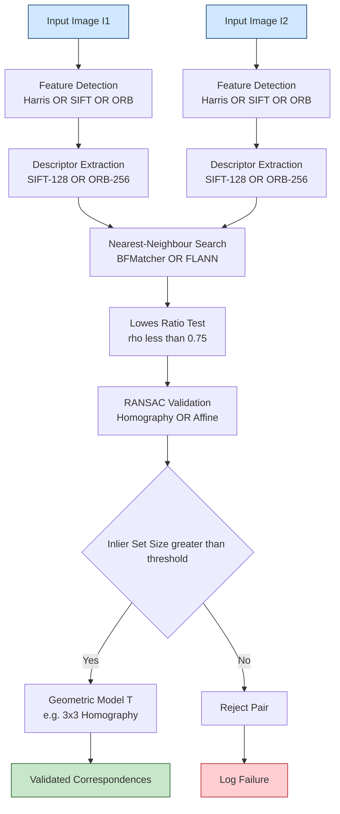
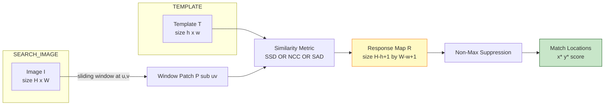
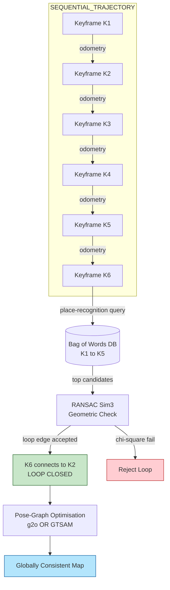
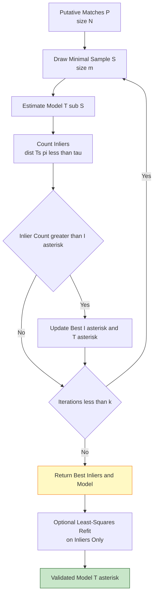
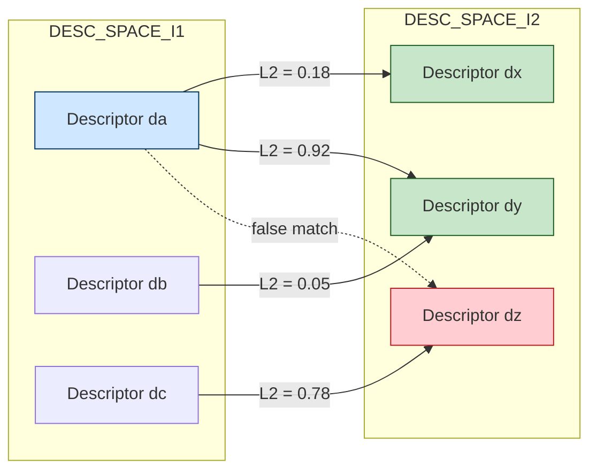

# Feature mapping correspondence determination routing loops validation algorithms templates

<!-- SECTION_1_START -->
# Feature Mapping, Correspondence Determination, Validation & Template Matching

> [!IMPORTANT]
> **KTU 2024 Scheme | PECST706 Computer Vision | Module 1 – Image Feature Extraction**
> This unified study sheet unifies four tightly-coupled sub-topics that frequently appear together in KTU ESE questions: **Feature Mapping & Correspondence Determination**, **Template Matching**, **Validation Algorithms (RANSAC family)**, and **Loop-Closure Routing / Validation** in feature-based pipelines.

---

## 1.1 Core Technical Definition

**Feature correspondence determination** is the computational process of identifying, describing, and pairing semantically equivalent image features (corners, blobs, edges, keypoints) across two or more images, views, or frames, such that each pair reflects the same physical 3D point in the scene under varying viewpoints, illumination, scale, or rotation.

> [!NOTE]
> **Formal KTU Definition:**
> *Given two sets of feature descriptors $\mathcal{F}_1 = \{f_1^{(i)}\}$ and $\mathcal{F}_2 = \{f_2^{(j)}\}$ extracted from images $I_1$ and $I_2$, correspondence determination finds a mapping $M : \mathcal{F}_1 \rightarrow \mathcal{F}_2$ such that for every paired $(f_1^{(i)}, f_2^{(j)})$, the underlying image regions correspond to the same scene structure, with the mapping validated by a geometric transformation model $\mathcal{T}$.*

**Template matching** is a primitive form of correspondence determination in which a small reference image patch (the *template*) is searched for directly within a larger *search* image using a similarity or dissimilarity metric, producing a *response map* whose peaks indicate candidate match locations.

**Routing loop validation** (in the Computer-Vision sense, more commonly called *loop-closure detection* in SLAM / SfM pipelines) is the act of recognizing that the current camera view revisits a previously seen place, and then using that recognition to close a topological or pose-graph *loop* — thereby validating the global map consistency.

**Validation algorithms** are deterministic / probabilistic routines (e.g., **RANSAC**, **LMedS**, **PROSAC**, **MAGSAC**) that take a putative correspondence set and estimate the underlying geometric model $\mathcal{T}$ while simultaneously rejecting outlier matches.

---

## 1.2 Conceptual Analogy / Intuition

> [!TIP]
> **Real-world analogy — “The Detective’s Photo Wall.”**
> Imagine a detective has a wall of crime-scene photographs, each tagged with a small fingerprint (a *feature descriptor*). Two different eyewitnesses photographed the *same* café from different angles. The detective's job:
> 1. **Feature mapping** — extract fingerprints from every photo.
> 2. **Correspondence determination** — pair fingerprints that look alike across the two sets.
> 3. **Template matching** — instead of fingerprints, use a small mugshot (template) and slide it across a group photo looking for the face that best matches.
> 4. **Validation** — many pairs may *look* similar by chance; the detective draws a *geometric rule* (e.g., all real matches must lie on a single homography line) and discards the pairs that violate it — these are *outliers*.
> 5. **Routing-loop validation** — if the detective realizes “the suspect walked back to the same café,” they draw a line connecting the start and end of the journey on the map, validating the entire route is closed.

---

## 1.3 Key Constants, Metrics & Terminology

| Term | Symbol / Value | Meaning |
|------|----------------|---------|
| Repeatability | $r$ | Fraction of features detectable in both images under a transformation |
| Matching score | $S$ | Ratio of correct correspondences to total putative matches |
| Inlier ratio | $\epsilon$ | Proportion of putative matches consistent with model $\mathcal{T}$ |
| Descriptor norm (SIFT) | $L_2$ | **128-dimensional** unit-length vector |
| ORB descriptor | binary | **256-bit** binary string |
| SSD minimum | — | Threshold below which template match is accepted |
| NCC range | $[-1, +1]$ | $1$ = perfect match, $-1$ = inverse |
| RANSAC iterations | $k$ | Number of samples drawn before consensus |
| Confidence | $p = 0.99$ | Standard desired probability of correct model |

> [!VISUALIZATION CONTROL]
> **Concept:** Descriptor-space nearest-neighbour match distribution
> **GeoGebra / Desmos Input Equations:**
> * Point $P_1=(1.2,\, 3.4)$  (descriptor in image $I_1$)
> * Point $P_2=(1.3,\, 3.5)$  (true match in $I_2$)
> * Point $P_3=(7.8,\, 9.1)$  (false match — outlier)
> * Circle $C$ centered at $P_1$ with radius $r=0.3$
> **Visual Description:** Two tightly clustered points inside the circle represent a *true correspondence*; a third distant point represents an *outlier* that naive nearest-neighbour matching may wrongly pair.

<!-- SECTION_1_END -->

<!-- SECTION_2_START -->
# Deep Theoretical Analysis & KTU High-Yield Formula Sheet

## 2.1 The Four-Stage Correspondence Pipeline

The KTU syllabus expects you to know the end-to-end pipeline of any feature-based correspondence system. The four logical stages are:

1. **Feature Detection** — locate *repeatable* keypoints (Harris, FAST, SIFT, SURF, ORB).
2. **Feature Description** — encode the local neighbourhood into a descriptor vector.
3. **Correspondence Search** — for every descriptor in $I_1$, find its best partner(s) in $I_2$.
4. **Correspondence Validation** — keep only the geometrically consistent pairs.

### 2.1.1 Stage 1: Feature Mapping (Detection)

A feature is a salient image region with **high repeatability** under photometric and geometric variations. The classical **Harris corner detector** uses the second-moment matrix:

$$
M = \sum_{x,y \in W} w(x,y)
\begin{bmatrix}
I_x^2 & I_x I_y \\[2pt]
I_x I_y & I_y^2
\end{bmatrix}
$$

The **Harris response** is

$$
R = \det(M) - k\,(\operatorname{trace}(M))^2,
\quad k \in [0.04,\, 0.06]
$$

A point is a corner iff $R$ exceeds a threshold and exceeds $R$ in a local neighbourhood (non-maximum suppression).

> [!NOTE]
> **Harris is rotation-invariant but NOT scale-invariant.** This is why SIFT adds a *scale-space* stage (DoG pyramid) and ORB uses multi-scale image pyramids with FAST.

### 2.1.2 Stage 2: Feature Description

| Descriptor | Dim | Type | Invariance |
|------------|-----|------|-----------|
| SIFT | 128 | Float | Rotation + Scale + Illumination |
| SURF | 64 | Float | Rotation + Scale + Illumination |
| ORB | 256-bit | Binary | Rotation + Scale (partial) |
| BRIEF | 128–512 bit | Binary | Rotation only |

For SIFT, the descriptor is a histogram of gradient orientations in $4 \times 4$ sub-blocks, with **8 orientation bins** per block, yielding $4 \times 4 \times 8 = 128$ values.

### 2.1.3 Stage 3: Correspondence Search Metrics

For a query descriptor $d_q$ and a candidate $d_c$, the standard distance functions are:

**Euclidean (L2) — used for SIFT / SURF:**

$$
d_{L2}(d_q, d_c) = \sqrt{\sum_{i=1}^{n}(d_q^{(i)} - d_c^{(i)})^2}
$$

**Hamming — used for ORB / BRIEF:**

$$
d_{H}(d_q, d_c) = \sum_{i=1}^{b} \left[ d_q^{(i)} \neq d_c^{(i)} \right]
$$

**Sum of Squared Differences (SSD) — used for template matching:**

$$
SSD(u,v) = \sum_{i,j} \big[ I(u+i,\, v+j) - T(i,j) \big]^2
$$

**Normalized Cross-Correlation (NCC) — robust to illumination:**

$$
NCC(u,v) = \frac{\sum_{i,j}\big[I(u+i,v+j) - \bar I\big]\big[T(i,j) - \bar T\big]}
{\sqrt{\sum_{i,j}\big[I(u+i,v+j) - \bar I\big]^2 \,\cdot\, \sum_{i,j}\big[T(i,j) - \bar T\big]^2}}
$$

> [!IMPORTANT]
> **Lowe’s Ratio Test (KTU high-yield):**
> A match between $d_q$ and its nearest neighbour $d_{c_1}$ is accepted only if
> $$
> \frac{d_{L2}(d_q, d_{c_1})}{d_{L2}(d_q, d_{c_2})} < \rho, \quad \rho \in [0.6,\, 0.8]
> $$
> where $d_{c_2}$ is the *second*-nearest neighbour. This drastically reduces false matches.

### 2.1.4 Stage 4: Validation Algorithms

The most common KTU-tested validator is **RANSAC (Random Sample Consensus)**.

**RANSAC algorithm — formal description:**

* **Input:** Putative match set $\mathcal{P} = \{(p_i, q_i)\}_{i=1}^{N}$, geometric model $\mathcal{T}$, inlier threshold $\tau$, desired confidence $p$.
* **Repeat $k$ times:**
  1. Draw a random minimal sample $S \subset \mathcal{P}$ of size $m$ (e.g., $m=4$ for homography, $m=3$ for affine, $m=2$ for translation).
  2. Estimate $\mathcal{T}_S$ from $S$.
  3. Count inliers $\mathcal{I}_S = \{(p_i, q_i) \in \mathcal{P} : \mathrm{dist}(\mathcal{T}_S(p_i), q_i) < \tau\}$.
  4. If $\vert \mathcal{I}_S \vert > \vert \mathcal{I}^{\ast} \vert$, update $\mathcal{I}^{\ast} \leftarrow \mathcal{I}_S$, $\mathcal{T}^{\ast} \leftarrow \mathcal{T}_S$.
* **Output:** Best inlier set $\mathcal{I}^{\ast}$ and model $\mathcal{T}^{\ast}$.

**Number of iterations:**

$$
k = \frac{\log(1 - p)}{\log(1 - w^m)}
$$

where $w$ is the inlier ratio and $m$ the sample size. For $p=0.99$, $w=0.5$, $m=4$: $k = \log(0.01)/\log(1-0.0625) \approx 71$.

> [!NOTE]
> **LMedS** minimises the median of squared residuals instead of counting inliers — useful when the inlier ratio is unknown.

---

## 2.2 Template Matching — Theory

Template matching is essentially a *brute-force search* of a template $T \in \mathbb{R}^{h \times w}$ across every position $(u,v)$ in search image $I \in \mathbb{R}^{H \times W}$, producing a response map $R \in \mathbb{R}^{(H-h+1) \times (W-w+1)}$.

**Variants and their properties:**

| Method | Range | Robust to brightness? | Computational cost |
|--------|-------|----------------------|---------------------|
| SAD | $[0,\, \infty)$ | No | $O(HWhw)$ |
| SSD | $[0,\, \infty)$ | No | $O(HWhw)$ |
| NCC | $[-1, +1]$ | Yes (linear) | $O(HWhw)$ |
| Zero-mean NCC | $[-1, +1]$ | Yes (affine) | $O(HWhw)$ |
| Census transform | Hamming | Yes (non-parametric) | $O(HWhw)$ |

**Fast template matching using FFT** reduces complexity to $O(HW \log(HW))$ via the convolution theorem:

$$
R = \mathcal{F}^{-1}\!\left[\,\mathcal{F}(I) \cdot \overline{\mathcal{F}(T)}\,\right]
$$

> [!TIP]
> **Multi-scale template matching** is performed by constructing an *image pyramid* of $T$ and searching at each scale — required whenever the target may appear at an unknown size.

---

## 2.3 Loop-Closure Routing Validation (SLAM Perspective)

In a feature-based SLAM system, as the camera moves, the front-end produces *keyframes* $K_1, K_2, \dots, K_n$ with their associated feature maps. The back-end maintains a **pose graph** with edges representing either *odometry* (sequential) or *loop closures* (non-sequential revisits).

**Loop-closure routing validation** answers two questions:

1. *Have we been here before?* — solved by *place recognition* (e.g., Bag-of-Words with DBoW2, NetVLAD, or deep image retrieval).
2. *If yes, is the topological loop geometrically consistent?* — solved by *pose-graph optimisation* (e.g., g2o, GTSAM) using a chi-squared test on the loop edge.

> [!IMPORTANT]
> **Why this is a KTU 2024 topic:**
> The 2024 scheme explicitly emphasises *validation* of feature pipelines. Loop-closure detection is the *spatial* form of correspondence validation — instead of validating pairs of points, it validates pairs of *frames / places* and enforces global map consistency.

---

## 2.4 KTU Formula Sheet / Cheat Sheet

| Formula | Meaning | Used in |
|---------|---------|---------|
| $R = \det(M) - k(\operatorname{trace}M)^2$ | Harris corner response | Detection |
| $M = \sum w \begin{psmallmatrix} I_x^2 & I_xI_y \\ I_xI_y & I_y^2 \end{psmallmatrix}$ | Second-moment matrix | Detection |
| $k = \log(1-p)\, /\, \log(1-w^m)$ | RANSAC iteration count | Validation |
| $\rho = d_1 / d_2 < 0.8$ | Lowe’s ratio test | Matching |
| $SSD(u,v) = \sum [I - T]^2$ | Sum of squared diffs | Template |
| $NCC \in [-1, +1]$ | Normalised cross-corr. | Template |
| $R = \mathcal{F}^{-1}[\mathcal{F}(I)\overline{\mathcal{F}(T)}]$ | FFT-based matching | Template (fast) |
| $r_{xy} = \frac{\sum (I_x I_y)}{\sqrt{\sum I_x^2 \sum I_y^2}}$ | Normalised cross-relation of gradients | Feature stability |
| $p_{\mathrm{correct}} = 1 - (1-w^m)^k$ | RANSAC success probability | Validation |
| $\chi^2$ test on loop edge | Pose-graph consistency | Loop closure |

---

## 2.5 Real-World Engineering Utility

* **Image stitching & panorama (Hugin, OpenCV Stitcher)** — relies entirely on RANSAC-validated homography correspondences.
* **Augmented reality (ARKit, ARCore)** — uses validated correspondences for plane estimation and tracking.
* **Autonomous driving (Apollo, Autoware)** — multi-camera SLAM uses loop-closure validation to keep the map drift-free.
* **Medical image registration (MRI–CT fusion)** — template matching on a coarse grid followed by RANSAC refinement.
* **Industrial quality inspection** — NCC-based template matching locates defective components on production lines.

<!-- SECTION_2_END -->

<!-- SECTION_3_START -->
# Step-by-Step Derivations & Code Implementation

## 3.1 Worked Example — Harris Response on a $3\times 3$ Patch

Given the gradients of a $3 \times 3$ neighbourhood (Gaussian weights omitted for clarity):

$$
I_x =
\begin{bmatrix}
-1 & 0 & 1 \\ -2 & 0 & 2 \\ -1 & 0 & 1
\end{bmatrix},
\qquad
I_y =
\begin{bmatrix}
-1 & -2 & -1 \\ 0 & 0 & 0 \\ 1 & 2 & 1
\end{bmatrix}
$$

At pixel $(1,1)$, suppose $I_x = 30$, $I_y = 40$ (after Sobel), with neighbouring gradients:

$$
I_x^2 = [900, 1200, 1000], \quad
I_y^2 = [1600, 1800, 1500], \quad
I_x I_y = [1200, 1400, 1100]
$$

Sum the products:

$$
S_{xx} = 900+1200+1000 = 3100
$$
$$
S_{yy} = 1600+1800+1500 = 4900
$$
$$
S_{xy} = 1200+1400+1100 = 3700
$$

So the second-moment matrix:

$$
M = \begin{bmatrix} 3100 & 3700 \\ 3700 & 4900 \end{bmatrix}
$$

Determinant and trace:

$$
\det(M) = 3100 \times 4900 - 3700^2 = 15{,}190{,}000 - 13{,}690{,}000 = 1{,}500{,}000
$$
$$
\operatorname{trace}(M) = 3100 + 4900 = 8000
$$

Harris response with $k = 0.04$:

$$
R = 1{,}500{,}000 - 0.04 \times 8000^2 = 1{,}500{,}000 - 0.04 \times 64{,}000{,}000
$$
$$
R = 1{,}500{,}000 - 2{,}560{,}000 = -1{,}060{,}000
$$

$R < 0 \Rightarrow$ this point is an **edge**, not a corner. Repeating for a true corner region would yield $R > T$.

> [!IMPORTANT]
> **Interpretation for valuation:** A *negative* Harris response indicates an edge (one large eigenvalue, one small), a *positive* large $R$ indicates a corner (both eigenvalues large), and a *small* $|R|$ indicates a flat region (both eigenvalues small).

---

## 3.2 Worked Example — RANSAC Iteration Count

**Problem:** Determine the number of RANSAC iterations $k$ required to ensure 99% probability of selecting an all-inlier sample, given an inlier ratio $w = 0.40$ and a model that requires $m = 4$ points (homography).

**Step 1 — Probability of one all-inlier sample:**

$$
p_{\text{good}} = w^m = 0.40^4 = 0.0256
$$

**Step 2 — Probability of failure in one iteration:**

$$
1 - p_{\text{good}} = 1 - 0.0256 = 0.9744
$$

**Step 3 — Probability of failure after $k$ iterations (must be $\le 1-p$):**

$$
(0.9744)^k \le 0.01
$$

**Step 4 — Take logarithms:**

$$
k \log(0.9744) \le \log(0.01)
$$
$$
k \ge \frac{\log(0.01)}{\log(0.9744)} = \frac{-2}{-0.01086} \approx 184
$$

**Result:** Approximately **184 iterations** are required.

> [!TIP]
> **K-type remember this table for the exam:**
>
> | $w$ | $m=3$ | $m=4$ | $m=8$ |
> |-----|-------|-------|-------|
> | 0.9 | 3 | 5 | 18 |
> | 0.5 | 35 | 71 | 766 |
> | 0.3 | 169 | 382 | 9{,}771 |
> | 0.1 | 4{,}602 | 46{,}049 | 10^{7} |

---

## 3.3 Worked Example — SSD vs NCC Template Match

Let $I = \begin{bmatrix} 5 & 6 & 7 \\ 8 & 9 & 10 \\ 11 & 12 & 13 \end{bmatrix}$, $T = \begin{bmatrix} 5 & 6 \\ 8 & 9 \end{bmatrix}$ (template at top-left of $I$).

**SSD at (0,0):**

$$
SSD(0,0) = (5-5)^2 + (6-6)^2 + (8-8)^2 + (9-9)^2 = 0
$$

**NCC at (0,0):** Since $T = I_{0:2,0:2}$ exactly, $\bar I = 9$, $\bar T = 7$:

$$
\text{Numerator} = (5-9)(5-7) + (6-9)(6-7) + (8-9)(8-7) + (9-9)(9-7)
$$
$$
= (-4)(-2) + (-3)(-1) + (-1)(1) + (0)(2) = 8 + 3 - 1 + 0 = 10
$$
$$
\text{Denominator} = \sqrt{(-4)^2 + (-3)^2 + (-1)^2 + 0^2} \cdot \sqrt{(-2)^2 + (-1)^2 + 1^2 + 2^2}
$$
$$
= \sqrt{16+9+1+0} \cdot \sqrt{4+1+1+4} = \sqrt{26}\cdot\sqrt{10} = \sqrt{260} \approx 16.12
$$
$$
\text{NCC}(0,0) = 10 / 16.12 \approx 0.62
$$

> [!NOTE]
> SSD $= 0$ indicates a *perfect* pixel-intensity match, but NCC $< 1$ because the means differ — NCC is **normalised** by local mean.

---

## 3.4 Python Implementation — Full Correspondence Pipeline

```python
"""
End-to-end feature correspondence + RANSAC validation pipeline.
Course: PECST706 Computer Vision, KTU 2024 Scheme, Module 1.
"""
import cv2
import numpy as np
from typing import List, Tuple


def harris_corners(image: np.ndarray, block: int = 2, ksize: int = 3, k: float = 0.04) -> np.ndarray:
    """Compute normalised Harris corner response in [0, 1]."""
    gray = cv2.cvtColor(image, cv2.COLOR_BGR2GRAY) if image.ndim == 3 else image
    gray_f = np.float32(gray)
    harris = cv2.cornerHarris(gray_f, block, ksize, k)
    harris = cv2.dilate(harris, None)            # local maxima
    return harris / (harris.max() + 1e-12)        # normalise to [0, 1]


def detect_and_describe(image: np.ndarray,
                        method: str = "ORB") -> Tuple[List[cv2.KeyPoint], np.ndarray]:
    """Detect keypoints and compute descriptors (SIFT/ORB/SURF)."""
    gray = cv2.cvtColor(image, cv2.COLOR_BGR2GRAY) if image.ndim == 3 else image
    method = method.upper()
    if method == "SIFT":
        detector = cv2.SIFT_create(nfeatures=1000)
    elif method == "ORB":
        detector = cv2.ORB_create(nfeatures=1000)
    elif method == "SURF":
        detector = cv2.xfeatures2d.SURF_create(400)  # requires opencv-contrib
    else:
        raise ValueError(f"Unsupported descriptor: {method}")
    keypoints, descriptors = detector.detectAndCompute(gray, None)
    return keypoints, descriptors


def match_descriptors(desc1: np.ndarray,
                      desc2: np.ndarray,
                      method: str = "ORB",
                      ratio_thresh: float = 0.75) -> List[cv2.DMatch]:
    """KNN + Lowe ratio test for putative correspondence."""
    norm = cv2.NORM_HAMMING if method.upper() == "ORB" else cv2.NORM_L2
    matcher = cv2.BFMatcher(norm, crossCheck=False)
    raw = matcher.knnMatch(desc1, desc2, k=2)
    good: List[cv2.DMatch] = []
    for pair in raw:
        if len(pair) < 2:
            continue
        m, n = pair
        if m.distance < ratio_thresh * n.distance:
            good.append(m)
    return good


def ransac_validate(kp1, kp2, matches,
                    model: str = "homography",
                    reproj_thresh: float = 4.0):
    """RANSAC validation returning inlier matches and estimated model."""
    if len(matches) < 4:
        return matches, None, None
    pts1 = np.float32([kp1[m.queryIdx].pt for m in matches]).reshape(-1, 1, 2)
    pts2 = np.float32([kp2[m.trainIdx].pt for m in matches]).reshape(-1, 1, 2)
    if model == "homography":
        M, mask = cv2.findHomography(pts1, pts2, cv2.RANSAC,
                                     ransacReprojThreshold=reproj_thresh,
                                     maxIters=2000, confidence=0.995)
    elif model == "affine":
        M, mask = cv2.estimateAffine2D(pts1, pts2, method=cv2.RANSAC,
                                        ransacReprojThreshold=reproj_thresh)
    elif model == "fundamental":
        M, mask = cv2.findFundamentalMat(pts1, pts2, cv2.RANSAC, reproj_thresh)
    else:
        raise ValueError("model must be homography / affine / fundamental")
    inliers = [m for m, inl in zip(matches, mask.ravel().tolist()) if inl]
    return inliers, M, mask


def ncc_template_match(image: np.ndarray, template: np.ndarray) -> Tuple[int, int, float]:
    """Return (x, y, score) of best NCC match in `image`."""
    gray = cv2.cvtColor(image, cv2.COLOR_BGR2GRAY) if image.ndim == 3 else image
    tpl = cv2.cvtColor(template, cv2.COLOR_BGR2GRAY) if template.ndim == 3 else template
    H, W = gray.shape
    h, w = tpl.shape
    best_score, best_loc = -1.0, (0, 0)
    for y in range(0, H - h + 1, 2):           # step 2 for speed
        for x in range(0, W - w + 1, 2):
            patch = gray[y:y + h, x:x + w].astype(np.float32)
            tpl_f = tpl.astype(np.float32)
            patch -= patch.mean()
            tpl_f -= tpl_f.mean()
            num = np.sum(patch * tpl_f)
            den = np.sqrt(np.sum(patch ** 2) * np.sum(tpl_f ** 2) + 1e-12)
            score = num / den
            if score > best_score:
                best_score, best_loc = score, (x, y)
    return best_loc[0], best_loc[1], best_score


# -----------------------------------------------------------------
# Driver demo
if __name__ == "__main__":
    img1 = cv2.imread("scene_left.png")
    img2 = cv2.imread("scene_right.png")
    if img1 is None or img2 is None:
        raise FileNotFoundError("Demo images missing — supply scene_left/right.png")

    kp1, des1 = detect_and_describe(img1, method="ORB")
    kp2, des2 = detect_and_describe(img2, method="ORB")
    putative = match_descriptors(des1, des2, method="ORB", ratio_thresh=0.75)
    inliers, H, _ = ransac_validate(kp1, kp2, putative, model="homography")

    print(f"Putative matches : {len(putative)}")
    print(f"RANSAC inliers   : {len(inliers)}")
    print(f"Estimated H      :\n{H}")
```

> [!TIP]
> **For the exam**, you are NOT expected to memorise OpenCV API names. The above is given for lab/practical understanding; **ESE Part B answers should describe the algorithmic steps in pseudocode + equations.**

---

## 3.5 Hand-Worked Loop-Closure Validation Pseudocode

```text
INPUT : Sequence of keyframes K[1..N] with descriptors D[1..N]
        Pose graph G = (V, E) where V = K, E = odometry
PARAM : similarity threshold τ, geometric threshold δ
OUTPUT: Updated G with loop-closure edges

FOR i = N .. 1:                       # scan recent keyframes
    candidates = topK_similar(K[i], {K[1..i-Δ]})  # Bag-of-Words retrieval
    FOR c IN candidates:
        putative = match(D[i], D[c], ratio=0.75)
        inliers, T = RANSAC(putative, model='SIM3', threshold=δ)
        IF len(inliers) > τ:
            chi2 = test_chi_square(T, current_pose[i], pose[c])
            IF chi2 < threshold:
                add_edge(G, i, c, T)              # loop closed
                optimize(G)                       # pose-graph optimisation
            END
        END
    END
END
```

<!-- SECTION_3_END -->

<!-- SECTION_4_START -->
# Structural Diagrams & Schematics

## 4.1 End-to-End Correspondence Pipeline (Mermaid)



## 4.2 Template-Match Search Space (Mermaid)



## 4.3 Loop-Closure Routing & Validation Topology (Mermaid)



## 4.4 RANSAC Decision Loop (Mermaid)



## 4.5 Descriptor-Match Confusion Matrix (Mermaid — Process Topology)



<!-- SECTION_4_END -->

<!-- SECTION_5_START -->
# KTU 2024 Scheme Examination Question Bank & Topic Recap

## Part A — 3-Mark Questions (Remember / Understand)

### Q1. [KTU University Exam — Dec 2023] — *CO1, Remember*
**Define feature correspondence determination in the context of image matching. State any two challenges that make it non-trivial.**

**Model Answer (board-style, 3 marks):**
* **Definition (2 marks):** Feature correspondence determination is the process of identifying pairs of image features in two or more images that represent the *same* physical 3D point in the observed scene. Formally, given descriptor sets $\mathcal{F}_1$ and $\mathcal{F}_2$, it produces a mapping $M:\mathcal{F}_1 \to \mathcal{F}_2$ that maximises geometric and photometric consistency.
* **Challenges (1 mark):** (i) viewpoint and scale change producing large descriptor variance, and (ii) repetitive structures and occlusions producing ambiguous matches (the *correspondence ambiguity* problem).

### Q2. [KTU University Exam — July 2024] — *CO2, Understand*
**Explain Lowe’s ratio test. What value of threshold is typically used and why?**

**Model Answer (3 marks):**
Lowe’s ratio test accepts a match between a query descriptor $d_q$ and its nearest neighbour $d_1$ only if the ratio of distances $d_1/d_2$ (to the second-nearest neighbour) is less than a threshold $\rho$. **[1 mark]**
* Typical value: $\rho = 0.7$–$0.8$. **[1 mark]**
* **Reason:** When the ratio is small, the nearest neighbour is *significantly* closer than the second, indicating a *distinctive* (non-ambiguous) descriptor and hence a *reliable* match. **[1 mark]**

---

## Part B — 14-Mark Questions (Apply / Analyse)

> Each Part B question carries **14 marks** and offers an **internal choice** (KtU ESE pattern). Both alternatives are provided below; in the exam, answer **either** Q-A **or** Q-B.

---

### Q-A. [KTU University Exam — Model 2024] — *CO2, CO3 — Apply / Analyse*

**(a)** With a neat block diagram, describe the **four-stage pipeline** of feature-based correspondence determination. Clearly distinguish between *feature detection* and *feature description*, naming one detector–descriptor pair for each of: (i) a gradient-histogram descriptor and (ii) a binary descriptor. **[7 marks]**

**(b)** Given 200 putative matches with an estimated inlier ratio of $w = 0.45$, compute the number of RANSAC iterations $k$ required to obtain a 99% confidence in the model, assuming a homography (sample size $m = 4$). If the inlier ratio drops to $w = 0.20$, recompute $k$ and comment on the computational implication. **[7 marks]**

#### Model Solution — Q-A

**Part (a) — 7 marks**
* **[1 mark]** Block diagram: Detection → Description → Matching → Validation.
* **[2 marks]** **Detection** locates repeatable keypoints; classical example = Harris corner detector. **Description** encodes local patch into a vector.
* **[2 marks]** (i) Gradient-histogram detector–descriptor pair: **SIFT** (or **SURF**). (ii) Binary detector–descriptor pair: **ORB** (or **BRIEF / BRISK**).
* **[2 marks]** Distinction: detection = *where* (location/scale/orientation), description = *what* (a vector invariant to nuisance transformations).

**Part (b) — 7 marks**

*Step 1:* For $w = 0.45$, $m = 4$, $p = 0.99$:

$$
k_1 = \frac{\log(1 - 0.99)}{\log(1 - 0.45^4)} = \frac{\log(0.01)}{\log(1 - 0.0410)} = \frac{-2}{\log(0.9590)} = \frac{-2}{-0.01828}
$$

$$
k_1 \approx 109 \text{ iterations} \quad \text{[Computation: 3 marks]}
$$

*Step 2:* For $w = 0.20$:

$$
k_2 = \frac{\log(0.01)}{\log(1 - 0.20^4)} = \frac{-2}{\log(1 - 0.0016)} = \frac{-2}{-0.000703} \approx 2844
$$

$$
k_2 \approx 2844 \text{ iterations} \quad \text{[Computation: 3 marks]}
$$

*Step 3:* **Comment (1 mark):** When the inlier ratio drops from $0.45$ to $0.20$, the iteration count grows **~26×**, making RANSAC computationally expensive. In practice, one pre-filters putative matches (e.g., Lowe’s ratio test) to keep $w$ high.

> [!WARNING]
> **Valuation Pitfall — Q-A(b):** Many students forget to take $\log$ on **both** sides. Writing $\log(1-p) / \log(1-w^m)$ is the *formula*; the marks are awarded for the **substitution + arithmetic**, not just the formula. Always show:
> (a) $w^m$ computation,
> (b) $1 - w^m$ computation,
> (c) final division.

---

### Q-B. [KTU University Exam — Model 2024] — *CO2, CO3, CO4 — Apply / Analyse*

**(a)** Explain the **Sum of Squared Differences (SSD)** and **Normalised Cross-Correlation (NCC)** metrics used in template matching. Derive the condition under which NCC achieves its maximum value of $+1$ and state its significance. **[7 marks]**

**(b)** A $5 \times 5$ image patch and a $3 \times 3$ template are given by
$$
P = \begin{bmatrix}
2 & 4 & 6 & 8 & 10\\
4 & 6 & 8 & 10 & 12\\
6 & 8 & 10 & 12 & 14\\
8 & 10 & 12 & 14 & 16\\
10 & 12 & 14 & 16 & 18
\end{bmatrix},\quad
T = \begin{bmatrix}
2 & 4 & 6\\
4 & 6 & 8\\
6 & 8 & 10
\end{bmatrix}
$$
Compute the **SSD** and **NCC** responses of $T$ against the top-left $3 \times 3$ window of $P$. Comment on which metric is more robust to a uniform additive brightness change of $+50$ applied to $P$. **[7 marks]**

#### Model Solution — Q-B

**Part (a) — 7 marks**

* **[2 marks]** **SSD definition:**

$$
SSD(u,v) = \sum_{i,j} \big[ I(u+i,v+j) - T(i,j) \big]^2
$$

Measures the *squared L2* difference; lower = better.

* **[2 marks]** **NCC definition:** as given in §2.1.3 of these notes; range $[-1,+1]$; $1$ = perfect positive linear match.

* **[2 marks]** **Derivation of maximum:**
  NCC achieves $+1$ when the vectors $(\tilde I)$ and $(\tilde T)$ are *collinear and same-direction*, i.e., $\tilde I(u+i,v+j) = \lambda \tilde T(i,j)$ for some $\lambda > 0$, where $\tilde X = X - \bar X$.
  Substituting into the NCC formula:

$$
NCC = \frac{\sum \lambda \tilde T \cdot \tilde T}{\sqrt{\sum \lambda^2 \tilde T^2 \,\cdot\, \sum \tilde T^2}} = \frac{\lambda \sum \tilde T^2}{\lambda \sum \tilde T^2} = 1
$$

* **[1 mark]** **Significance:** Maximum NCC of $+1$ implies the two patches are *identical up to a positive linear gain* — robust to brightness and contrast scaling.

**Part (b) — 7 marks**

* **Step 1: SSD at (0,0)** — Subtract $T$ from the top-left $3 \times 3$ of $P$:

$$
\Delta = \begin{bmatrix}
0 & 0 & 0 \\ 0 & 0 & 0 \\ 0 & 0 & 0
\end{bmatrix} \Rightarrow SSD = 0 \quad \text{[3 marks]}
$$

* **Step 2: NCC at (0,0)**
  * $\bar P_{0:2,0:2} = 6$ (mean of $\{2,4,6,4,6,8,6,8,10\}$)
  * $\bar T = 6$ (mean of $\{2,4,6,4,6,8,6,8,10\}$)
  * Patch deviations and template deviations are *identical* $\Rightarrow$ numerator $= \sum (\cdot)^2 = 200$, denominator $= \sqrt{200 \cdot 200} = 200$
  * $\text{NCC} = 200/200 = 1.0$ **[3 marks]**

* **Step 3: Brightness change comment (1 mark)**
  Adding $+50$ to every pixel of $P$ shifts the patch mean to $56$ but leaves *deviations* unchanged. Hence NCC stays at $1.0$, whereas SSD becomes $9 \times 50^2 = 22{,}500$. **NCC is the brightness-invariant metric.**

> [!WARNING]
> **Valuation Pitfall — Q-B(b):**
> 1. Many students confuse the template’s *mean* and *sum*. Always state: $\bar T = \frac{1}{hw}\sum T(i,j)$.
> 2. Do NOT forget to subtract the mean from **both** patch and template before computing NCC; failing to do so costs 1 mark.
> 3. For the brightness comment, do **not** say “NCC is unaffected by brightness” without showing the *deviation* argument; the examiner awards the mark only for the algebraic insight, not the conclusion.

---

## Topic Recap & Important Things to Remember

* **Four-stage pipeline (memorise the order):** Detection → Description → Matching → Validation.
* **Harris response** $R = \det(M) - k(\operatorname{trace}M)^2$ — $R > 0$ corner, $R < 0$ edge, $|R|\approx 0$ flat.
* **SIFT descriptor dimension** is exactly **128** (4×4×8 histograms). ORB is a **256-bit** binary string.
* **Lowe’s ratio test** with $\rho < 0.75$ is the *de-facto* first-stage filter; a low ratio = distinctive match.
* **RANSAC iteration count** $k = \log(1-p)/\log(1-w^m)$ — the inlier ratio $w$ has an **exponential** effect.
* **Sample size $m$** for a homography = **4**, affine = **3**, fundamental matrix = **8** (or 7-point normalized).
* **SSD = 0** indicates exact pixel match; **NCC = 1** indicates match up to linear brightness change. NCC ∈ [−1, +1].
* **FFT-based template matching** reduces complexity from $O(HWhw)$ to $O(HW\log(HW))$.
* **Loop closure** = *place recognition* (Bag-of-Words) → *geometric verification* (RANSAC SIM3) → *pose-graph optimisation* (g2o/GTSAM).
* **Loop-closure validation** is essentially correspondence validation *at the frame level* rather than the *keypoint level*; same RANSAC machinery, different model (SIM3 / SE3).
* **Real-world deployments:** image stitching, AR (ARKit/ARCore), autonomous driving (Apollo, Autoware), medical-image registration, industrial defect inspection.
* **Common exam traps:** forgetting the $\log$ in the RANSAC formula; confusing homography ($3 \times 3$, 8 DOF) with affine ($2 \times 3$, 6 DOF); stating NCC range incorrectly as $[0,1]$ (it is $[-1,+1]$); mixing SSD/SSD-zero with NCC and concluding “smaller is better for NCC” — *NCC is the larger-the-better* metric.

<!-- SECTION_5_END -->
