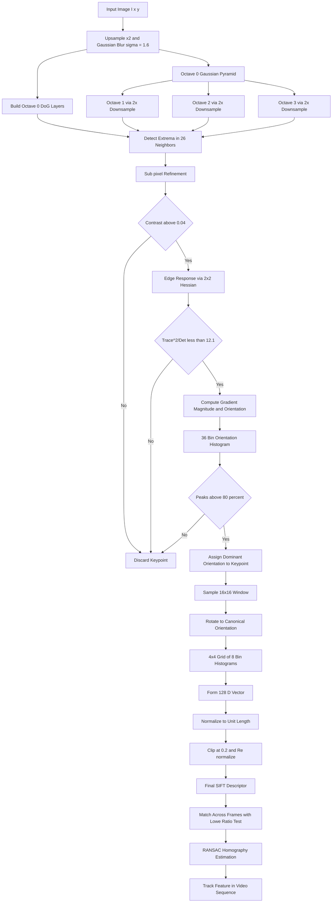
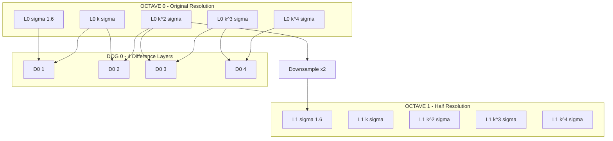
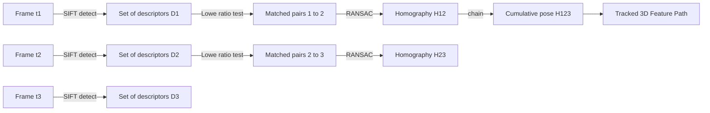

# Invariant keypoint descriptor extraction engineering steps tracking structures: SIFT feature tracking

<!-- SECTION_1_START -->
# SIFT Feature Tracking — Invariant Keypoint Descriptor Extraction

## 1. Core Technical Definition

**Scale-Invariant Feature Transform (SIFT)** is a computer vision algorithm developed by **David G. Lowe (2004)** that detects and describes **local features** (keypoints) in digital images. The descriptors are *invariant* to image **scale**, **rotation**, *partially* invariant to **illumination changes**, and robust to **affine distortion** and **noise**, which makes SIFT highly suitable for reliable object matching, recognition, and tracking across varying viewpoints.

> [!IMPORTANT]
> **KTU Syllabus Highlight (PECST706 — Module 1):**
> SIFT is the *canonical* feature descriptor for invariant keypoint extraction. KTU expects students to know the **four engineering stages** of the SIFT pipeline: (1) Scale-Space Extrema Detection, (2) Keypoint Localization, (3) Orientation Assignment, and (4) Descriptor Formation. Tracking is the downstream *application* layer that uses these descriptors across video frames.

### Intuitive Overview (Conceptual Analogy)

Imagine you are showing the **same fingerprint** to a camera in three different situations:
- Camera is far away (scale change)
- Camera is rotated (rotation change)
- Camera is dimly lit (illumination change)

Despite all these changes, your fingerprint is still the *same pattern*. SIFT is the algorithm that *mathematically encodes* a small patch of the image into a compact, unique 128-number "fingerprint string" (descriptor) that **looks the same** across all these variations. The tracking system then matches these "fingerprints" between consecutive video frames to follow a feature as it moves.

> [!NOTE]
> **Geometric Intuition:** Each SIFT keypoint anchors a **canonical circular neighbourhood**. By estimating the *dominant gradient orientation* in that neighbourhood, the algorithm effectively *rotates* the patch back to a standard orientation, making rotation-invariant matching possible.

### Key Standard Metrics in SIFT

| Parameter | Standard Value | Purpose |
|---|---|---|
| Number of octaves | **4** | Scale-space pyramid levels |
| Scales per octave | **5** | Gaussian blur levels (s = 0, 1, 2, 3, 4) |
| Initial $\sigma$ | **1.6** | Base Gaussian smoothing |
| $k$ factor | $\sqrt{2}$ | Scale-space multiplicative factor |
| Descriptor grid | **4 × 4** | Spatial sub-blocks |
| Orientations per cell | **8** | Gradient histogram bins |
| Descriptor length | **4 × 4 × 8 = 128** | Final feature vector length |
| Contrast threshold | **0.04** | Reject low-contrast keypoints |
| Edge threshold | **10** (curvature ratio) | Reject edge keypoints |

> [!VISUALIZATION CONTROL]
> **Concept:** Scale-Space Pyramid with Difference-of-Gaussian (DoG) Layers
> **GeoGebra / Desmos Input Equations:**
> * Gaussian: $G(x, y, \sigma) = \frac{1}{2\pi\sigma^{2}} e^{-\frac{x^{2} + y^{2}}{2\sigma^{2}}}$
> * DoG: $D(x, y, \sigma) = L(x, y, k\sigma) - L(x, y, \sigma)$
> **Visual Description:** A stack of progressively blurred images, with adjacent blurred images subtracted to highlight blob-like structures at the corresponding scale. The student should see a pyramid of $4 \times 5 = 20$ blurred images and $4 \times 4 = 16$ DoG images.
<!-- SECTION_1_END -->

<!-- SECTION_2_START -->
# 2. Deep Theoretical Analysis — The Four Engineering Stages of SIFT

## Stage 1: Scale-Space Extrema Detection

The **scale-space** of an image is defined as a function $L(x, y, \sigma)$, produced by convolving the input image $I(x, y)$ with a **variable-scale Gaussian** $G(x, y, \sigma)$:

$$L(x, y, \sigma) = G(x, y, \sigma) \ast I(x, y)$$

To efficiently detect stable keypoints across scales, SIFT uses the **Difference-of-Gaussian (DoG)** function:

$$D(x, y, \sigma) = L(x, y, k\sigma) - L(x, y, \sigma)$$

> This is a close approximation of the **scale-normalized Laplacian of Gaussian (LoG)**, $\sigma^{2} \nabla^{2} G$, with the relationship $D \approx (k-1)\sigma^{2}\nabla^{2}G$.

**Why DoG?**
- The LoG is computationally expensive (second-order derivatives).
- DoG is just two Gaussian blurs + a subtraction — much faster.
- It still detects blob-like structures across multiple scales.

**Extrema Detection:** Each pixel in a DoG image is compared with its **26 neighbours**:
- **8** neighbours in the same scale
- **9** neighbours in the scale above
- **9** neighbours in the scale below

If the pixel is a **maximum or minimum** among these 26 values, it is a candidate keypoint.

## Stage 2: Keypoint Localization

Raw extrema contain many unstable points. Two filters are applied:

### (a) Low-Contrast Rejection
A **3D quadratic fit** is performed on the DoG function using the Taylor expansion:

$$D(\mathbf{x}) = D + \frac{\partial D^{T}}{\partial \mathbf{x}} \mathbf{x} + \frac{1}{2} \mathbf{x}^{T} \frac{\partial^{2} D}{\partial \mathbf{x}^{2}} \mathbf{x}$$

Setting $\frac{\partial D}{\partial \mathbf{x}} = 0$ gives the offset:

$$\hat{\mathbf{x}} = -\frac{\partial^{2} D^{-1}}{\partial \mathbf{x}^{2}} \frac{\partial D}{\partial \mathbf{x}}$$

The function value at the extremum is:

$$D(\hat{\mathbf{x}}) = D + \frac{1}{2} \frac{\partial D^{T}}{\partial \mathbf{x}} \hat{\mathbf{x}}$$

If $\vert D(\hat{\mathbf{x}}) \vert < 0.03$ (in Lowe's paper), the keypoint is rejected as low-contrast.

### (b) Edge Response Rejection (Hessian Test)
DoG has a strong response along edges, which are unstable. A $2 \times 2$ Hessian matrix is computed:

$$H = \begin{bmatrix} D_{xx} & D_{xy} \\ D_{xy} & D_{yy} \end{bmatrix}$$

The principal curvatures are obtained from the eigenvalues $\alpha, \beta$ of $H$. Instead of computing them explicitly, the **trace and determinant** are used:

$$\text{Tr}(H) = D_{xx} + D_{yy} = \alpha + \beta$$

$$\text{Det}(H) = D_{xx} D_{yy} - D_{xy}^{2} = \alpha \beta$$

Lowe's ratio test rejects the keypoint if:

$$\frac{\text{Tr}(H)^{2}}{\text{Det}(H)} > \frac{(r+1)^{2}}{r}$$

where **$r = 10$** (ratio of principal curvatures, $\alpha = r\beta$).

## Stage 3: Orientation Assignment

A **consistent orientation** is assigned to each keypoint to make the descriptor rotation-invariant.

For each image sample $L(x, y)$ at the keypoint's scale, the gradient magnitude and orientation are:

$$m(x, y) = \sqrt{(L(x+1,y) - L(x-1,y))^{2} + (L(x,y+1) - L(x,y-1))^{2}}$$

$$\theta(x, y) = \tan^{-1}\!\left(\frac{L(x,y+1) - L(x,y-1)}{L(x+1,y) - L(x-1,y)}\right)$$

A **36-bin orientation histogram** is formed by accumulating weighted gradient magnitudes in a neighbourhood around the keypoint. The bin with the **highest peak** (and any local peak above $80\%$ of it) defines the keypoint's dominant orientation.

> If there are multiple peaks, **multiple keypoints** are generated at the same location and scale but with different orientations.

## Stage 4: Keypoint Descriptor Formation

This is the **heart of SIFT** — converting the local image patch around each keypoint into a 128-dimensional vector.

**Steps:**

1. **Rotate the patch** so the keypoint's dominant orientation points "up" (canonical orientation).
2. Take a **16 × 16** window around the keypoint, divided into a **4 × 4** grid of sub-blocks (16 cells).
3. Within each **8 × 8** sub-block, compute gradients at every pixel, weighted by a Gaussian with $\sigma$ equal to half the descriptor window width.
4. In each sub-block, build an **8-bin orientation histogram** weighted by the gradient magnitudes.
5. This produces **16 cells × 8 orientations = 128** numbers per keypoint.
6. The 128-D vector is **normalized** to unit length to provide illumination invariance.
7. A final **clipping** step caps values above **0.2**, then re-normalizes to reduce the influence of large gradient magnitudes (e.g., from lighting changes or non-Lambertian surfaces).

## KTU High-Yield Formula Sheet

| Formula / Concept | Expression / Value | Engineering Utility |
|---|---|---|
| Gaussian Kernel | $G(x,y,\sigma) = \frac{1}{2\pi\sigma^{2}} e^{-\frac{x^{2}+y^{2}}{2\sigma^{2}}}$ | Foundation of scale-space construction |
| Scale-Space Image | $L(x,y,\sigma) = G(x,y,\sigma) \ast I(x,y)$ | Multi-scale representation of the image |
| Difference of Gaussian | $D(x,y,\sigma) = L(x,y,k\sigma) - L(x,y,\sigma)$ | Approximates $\sigma^{2}\nabla^{2}G$ for keypoint detection |
| Gradient Magnitude | $m(x,y) = \sqrt{L_{x}^{2} + L_{y}^{2}}$ | Edge and orientation strength |
| Gradient Orientation | $\theta(x,y) = \tan^{-1}(L_{y}/L_{x})$ | Local feature direction |
| Taylor Series Sub-Pixel Offset | $\hat{\mathbf{x}} = -H^{-1}\nabla D$ | Sub-pixel keypoint refinement |
| Contrast Threshold | $\vert D(\hat{\mathbf{x}}) \vert \geq 0.03$ | Reject unstable low-contrast points |
| Edge Threshold | $\frac{\text{Tr}(H)^{2}}{\text{Det}(H)} \leq \frac{(r+1)^{2}}{r}$, $r = 10$ | Reject edge-like unstable keypoints |
| Descriptor Length | $4 \times 4 \times 8 = 128$ | Final invariant feature vector |
| Normalization Step | $\mathbf{v} \leftarrow \mathbf{v} / \Vert \mathbf{v} \Vert$ | Illumination invariance |

## Real-World Utility in Engineering

- **Panorama Stitching (Hugin, OpenCV Stitcher)**: SIFT matches control points across overlapping photographs.
- **Augmented Reality (AR)**: Apps like Google Lens use SIFT-like features to track objects in real time.
- **3D Reconstruction (Structure-from-Motion, SLAM)**: SIFT matches between photos yield sparse point clouds (used in Colmap, OpenMVG).
- **Robotics**: Visual SLAM pipelines for robot localization.
- **Biometric Authentication**: SIFT applied to fingerprints/iris for invariant recognition.
- **Video Tracking**: Optical-flow–like tracking across frames in surveillance and sports analytics.
<!-- SECTION_2_END -->

<!-- SECTION_3_START -->
# 3. Step-by-Step Derivations and Code/Symbolic Implementation

## 3.1 Mathematical Derivations

### Derivation A: Sub-Pixel Keypoint Refinement

Let the candidate keypoint be at $\mathbf{x}_{0} = (x_{0}, y_{0}, \sigma_{0})$. The DoG function $D(\mathbf{x})$ is expanded via the second-order Taylor series around $\mathbf{x}_{0}$:

$$
D(\mathbf{x}) = D(\mathbf{x}_{0}) + \frac{\partial D^{T}}{\partial \mathbf{x}} \Big\vert_{\mathbf{x}_{0}} (\mathbf{x} - \mathbf{x}_{0}) + \frac{1}{2} (\mathbf{x} - \mathbf{x}_{0}})^{T} \frac{\partial^{2} D}{\partial \mathbf{x}^{2}} \Big\vert_{\mathbf{x}_{0}} (\mathbf{x} - \mathbf{x}_{0})
$$

Taking the gradient with respect to $\mathbf{x}$ and setting it to zero (extremum condition):

$$
\frac{\partial D}{\partial \mathbf{x}} + \frac{\partial^{2} D}{\partial \mathbf{x}^{2}} \cdot \Delta \mathbf{x} = 0
$$

Solving for the offset $\Delta \mathbf{x} = \hat{\mathbf{x}}$:

$$
\hat{\mathbf{x}} = - \left( \frac{\partial^{2} D}{\partial \mathbf{x}^{2}} \right)^{-1} \frac{\partial D}{\partial \mathbf{x}}
$$

Substituting back into $D$ to evaluate the extremum value:

$$
D(\hat{\mathbf{x}}) = D + \frac{1}{2} \frac{\partial D^{T}}{\partial \mathbf{x}} \hat{\mathbf{x}}
$$

If $\vert D(\hat{\mathbf{x}}) \vert < 0.03$ (in normalized image coordinates), the candidate is rejected.

### Derivation B: Edge Response Elimination

The Hessian matrix at a keypoint is:

$$
H = \begin{bmatrix} D_{xx} & D_{xy} \\ D_{xy} & D_{yy} \end{bmatrix}
$$

Let the eigenvalues be $\alpha$ (larger) and $\beta$ (smaller). For an edge, $\vert \alpha \vert \gg \vert \beta \vert$. The ratio we want to test is:

$$
\frac{\alpha}{\beta} \leq r, \quad r = 10
$$

We don't compute eigenvalues directly. Instead, we use the trace and determinant:

$$
\text{Tr}(H) = \alpha + \beta
$$

$$
\text{Det}(H) = \alpha \beta
$$

If we form the ratio:

$$
\frac{\text{Tr}(H)^{2}}{\text{Det}(H)} = \frac{(\alpha + \beta)^{2}}{\alpha \beta} = \frac{(r+1)^{2}}{r}
$$

when $\alpha = r\beta$. We reject the keypoint if:

$$
\frac{\text{Tr}(H)^{2}}{\text{Det}(H)} \geq \frac{(r+1)^{2}}{r}
$$

For $r = 10$:

$$
\frac{(10+1)^{2}}{10} = \frac{121}{10} = 12.1
$$

So if $\frac{\text{Tr}(H)^{2}}{\text{Det}(H)} \geq 12.1$, the keypoint is rejected.

### Worked Numerical Example — DoG Magnitude and Edge Rejection

Suppose for a candidate keypoint the Hessian values from sampled DoG pixels are:

$$
D_{xx} = 3.0, \quad D_{yy} = 1.0, \quad D_{xy} = 0.5
$$

**Step 1:** Compute trace and determinant.

$$
\text{Tr}(H) = 3.0 + 1.0 = 4.0
$$

$$
\text{Det}(H) = (3.0)(1.0) - (0.5)^{2} = 3.0 - 0.25 = 2.75
$$

**Step 2:** Form the ratio.

$$
\frac{\text{Tr}(H)^{2}}{\text{Det}(H)} = \frac{(4.0)^{2}}{2.75} = \frac{16.0}{2.75} \approx 5.818
$$

**Step 3:** Compare with the threshold $12.1$.

$$
5.818 < 12.1 \quad \Rightarrow \text{Keypoint ACCEPTED (not an edge response).}
$$

**Step 4:** Now apply the low-contrast test. Suppose after sub-pixel refinement $D(\hat{\mathbf{x}}) = 0.027$. Since $0.027 < 0.03$, the keypoint is **REJECTED** as low-contrast.

## 3.2 Full Python Implementation of SIFT (From Scratch — Educational Version)

```python
"""
Educational SIFT implementation following David G. Lowe (2004).
Reference: https://www.cs.ubc.ca/~lowe/papers/ijcv04.pdf
"""
import numpy as np
import cv2
from scipy.ndimage import gaussian_filter, sobel


class SIFTDetector:
    """Minimal educational implementation of SIFT."""

    def __init__(
        self,
        num_octaves: int = 4,
        num_scales: int = 5,
        sigma0: float = 1.6,
        contrast_threshold: float = 0.04,
        edge_threshold: float = 10.0,
    ):
        self.num_octaves = num_octaves
        self.num_scales = num_scales
        self.sigma0 = sigma0
        self.contrast_threshold = contrast_threshold
        self.edge_threshold = edge_threshold
        # k = 2^(1/(num_scales - 3)) standard SIFT scale factor
        self.k = 2.0 ** (1.0 / (num_scales - 3))

    # ---------- Stage 1: Scale-Space Construction ----------
    def build_scale_space(self, image: np.ndarray):
        """Generate Gaussian pyramid and DoG pyramid."""
        # Upsample by 2x and pre-smooth with sigma0
        base = gaussian_filter(image, sigma=self.sigma0)
        gaussian_pyramid = []
        dog_pyramid = []
        sigmas = []

        for octave in range(self.num_octaves):
            octave_images = [base]
            octave_sigmas = [self.sigma0]
            current_image = base

            for s in range(1, self.num_scales):
                # Each successive image adds a factor of k in sigma
                sigma_prev = self.sigma0 * (self.k ** s)
                sigma_curr = self.sigma0 * (self.k ** (s + 1))
                delta_sigma = np.sqrt(sigma_curr ** 2 - sigma_prev ** 2)
                blurred = gaussian_filter(current_image, sigma=delta_sigma)
                octave_images.append(blurred)
                octave_sigmas.append(sigma_curr)

            # DoG = consecutive differences
            octave_dogs = [
                octave_images[i + 1] - octave_images[i]
                for i in range(len(octave_images) - 1)
            ]
            gaussian_pyramid.append(octave_images)
            dog_pyramid.append(octave_dogs)
            sigmas.append(octave_sigmas)

            # Downsample: take every other pixel from the image at scale 4
            base = octave_images[-3][::2, ::2]

        return gaussian_pyramid, dog_pyramid, sigmas

    # ---------- Stage 2: Extrema Detection + Refinement ----------
    def find_keypoints(self, dog_pyramid, sigmas):
        keypoints = []
        for octave_idx, octave_dogs in enumerate(dog_pyramid):
            for scale_idx in range(1, len(octave_dogs) - 1):
                prev_img = octave_dogs[scale_idx - 1]
                curr_img = octave_dogs[scale_idx]
                next_img = octave_dogs[scale_idx + 1]
                sigma_eff = sigmas[octave_idx][scale_idx]

                for i in range(1, curr_img.shape[0] - 1):
                    for j in range(1, curr_img.shape[1] - 1):
                        pixel = curr_img[i, j]
                        neighborhood = np.concatenate(
                            [
                                prev_img[i - 1 : i + 2, j - 1 : j + 2].ravel(),
                                curr_img[i - 1 : i + 2, j - 1 : j + 2].ravel(),
                                next_img[i - 1 : i + 2, j - 1 : j + 2].ravel(),
                            ]
                        )
                        center_val = curr_img[i, j]
                        if center_val == neighborhood.max() or center_val == neighborhood.min():
                            kp = self._refine_keypoint(
                                prev_img, curr_img, next_img,
                                i, j, sigma_eff, octave_idx
                            )
                            if kp is not None:
                                keypoints.append(kp)
        return keypoints

    def _refine_keypoint(self, prev_img, curr_img, next_img, i, j, sigma, octave_idx):
        """Apply sub-pixel refinement and edge filtering."""
        # 3D quadratic fit: build Hessian and gradient on DoG values
        dx = (curr_img[i, j + 1] - curr_img[i, j - 1]) / 2.0
        dy = (curr_img[i + 1, j] - curr_img[i - 1, j]) / 2.0
        ds = (next_img[i, j] - prev_img[i, j]) / 2.0
        dxx = curr_img[i, j + 1] - 2 * curr_img[i, j] + curr_img[i, j - 1]
        dyy = curr_img[i + 1, j] - 2 * curr_img[i, j] + curr_img[i - 1, j]
        dss = next_img[i, j] - 2 * curr_img[i, j] + prev_img[i, j]
        dxy = (
            curr_img[i + 1, j + 1] - curr_img[i + 1, j - 1]
            - curr_img[i - 1, j + 1] + curr_img[i - 1, j - 1]
        ) / 4.0
        dxs = (
            next_img[i, j + 1] - next_img[i, j - 1]
            - prev_img[i, j + 1] + prev_img[i, j - 1]
        ) / 4.0
        dys = (
            next_img[i + 1, j] - next_img[i - 1, j]
            - prev_img[i + 1, j] + prev_img[i - 1, j]
        ) / 4.0

        gradient = np.array([dx, dy, ds])
        hessian = np.array(
            [[dxx, dxy, dxs],
             [dxy, dyy, dys],
             [dxs, dys, dss]]
        )

        try:
            offset = -np.linalg.solve(hessian, gradient)
        except np.linalg.LinAlgError:
            return None
        if np.max(np.abs(offset)) > 1.5:
            return None  # Moved too far, unstable

        # Contrast check
        D_hat = curr_img[i, j] + 0.5 * np.dot(gradient, offset)
        if np.abs(D_hat) < self.contrast_threshold:
            return None

        # Edge response check (2D Hessian on x,y)
        H_xy = np.array([[dxx, dxy], [dxy, dyy]])
        trace = np.trace(H_xy)
        det = np.linalg.det(H_xy)
        if det <= 0:
            return None
        ratio = (trace * trace) / det
        r_thresh = ((self.edge_threshold + 1) ** 2) / self.edge_threshold
        if ratio > r_thresh:
            return None

        return {
            "x": (j + offset[1]) * (2 ** octave_idx),
            "y": (i + offset[0]) * (2 ** octave_idx),
            "scale": sigma * (2 ** octave_idx),
            "octave": octave_idx,
        }

    # ---------- Stage 3: Orientation Assignment ----------
    def assign_orientations(self, gaussian_pyramid, keypoints, num_bins=36):
        oriented_kps = []
        for kp in keypoints:
            octave_idx = kp["octave"]
            scale = kp["scale"]
            sigma = self.sigma0 * (1.5 ** octave_idx)  # effective sigma
            y, x = int(kp["y"] / (2 ** octave_idx)), int(kp["x"] / (2 ** octave_idx))
            radius = int(round(3.0 * scale / (2 ** octave_idx)))
            if radius < 1:
                radius = 1

            histogram = np.zeros(num_bins, dtype=np.float64)
            for dy in range(-radius, radius + 1):
                for dx in range(-radius, radius + 1):
                    yy, xx = y + dy, x + dx
                    if (
                        yy <= 0 or yy >= gaussian_pyramid[octave_idx][-1].shape[0] - 1
                        or xx <= 0 or xx >= gaussian_pyramid[octave_idx][-1].shape[1] - 1
                    ):
                        continue
                    L = gaussian_pyramid[octave_idx][-1]
                    m = np.sqrt(
                        (L[yy, xx + 1] - L[yy, xx - 1]) ** 2
                        + (L[yy + 1, xx] - L[yy - 1, xx]) ** 2
                    )
                    theta = np.degrees(
                        np.arctan2(
                            L[yy + 1, xx] - L[yy - 1, xx],
                            L[yy, xx + 1] - L[yy, xx - 1]
                        )
                    )
                    weight = np.exp(
                        -(dx ** 2 + dy ** 2) / (2.0 * (1.5 * sigma) ** 2)
                    )
                    bin_idx = int(round((theta + 180.0) / 360.0 * num_bins)) % num_bins
                    histogram[bin_idx] += weight * m

            # Find peaks
            max_val = histogram.max()
            for bin_idx in range(num_bins):
                if histogram[bin_idx] >= 0.8 * max_val:
                    new_kp = kp.copy()
                    new_kp["orientation"] = (
                        (bin_idx + 0.5) * 360.0 / num_bins - 180.0
                    )
                    oriented_kps.append(new_kp)
        return oriented_kps

    # ---------- Stage 4: Descriptor Formation ----------
    def compute_descriptors(self, gaussian_pyramid, keypoints):
        descriptors = []
        for kp in keypoints:
            octave_idx = kp["octave"]
            scale = kp["scale"]
            orientation = np.radians(kp["orientation"])
            cos_o, sin_o = np.cos(orientation), np.sin(orientation)
            img = gaussian_pyramid[octave_idx][-1]
            y, x = kp["y"] / (2 ** octave_idx), kp["x"] / (2 ** octave_idx)
            desc = np.zeros((4, 4, 8), dtype=np.float64)
            radius = int(round(3.0 * scale / (2 ** octave_idx)))
            for dy in range(-radius, radius + 1):
                for dx in range(-radius, radius + 1):
                    # Rotate sample coordinates
                    ry = cos_o * dy - sin_o * dx
                    rx = sin_o * dy + cos_o * dx
                    # Sub-block index
                    rb = ry / (radius / 2.0) + 1.5
                    cb = rx / (radius / 2.0) + 1.5
                    if rb < 0 or rb >= 4 or cb < 0 or cb >= 4:
                        continue
                    yy, xx = int(round(y + dy)), int(round(x + dx))
                    if (
                        yy <= 0 or yy >= img.shape[0] - 1
                        or xx <= 0 or xx >= img.shape[1] - 1
                    ):
                        continue
                    m = np.sqrt(
                        (img[yy, xx + 1] - img[yy, xx - 1]) ** 2
                        + (img[yy + 1, xx] - img[yy - 1, xx]) ** 2
                    )
                    theta = np.degrees(
                        np.arctan2(
                            img[yy + 1, xx] - img[yy - 1, xx],
                            img[yy, xx + 1] - img[yy, xx - 1]
                        )
                    )
                    # Re-orient gradient
                    theta = (theta - kp["orientation"] + 360.0) % 360.0
                    weight = np.exp(
                        -(ry ** 2 + rx ** 2) / (2.0 * (0.5 * 4.0) ** 2)
                    )
                    bin_idx = int(round(theta / 45.0)) % 8
                    r_int, c_int = int(np.floor(rb)), int(np.floor(cb))
                    if 0 <= r_int < 4 and 0 <= c_int < 4:
                        desc[r_int, c_int, bin_idx] += weight * m

            vec = desc.ravel()
            # Normalize
            norm = np.linalg.norm(vec) + 1e-12
            vec = vec / norm
            # Clip and re-normalize
            vec = np.clip(vec, 0, 0.2)
            vec = vec / (np.linalg.norm(vec) + 1e-12)
            descriptors.append(vec)
        return np.array(descriptors)


# ---------- Demonstration ----------
if __name__ == "__main__":
    image = cv2.imread("sample.jpg", cv2.IMREAD_GRAYSCALE)
    if image is None:
        image = np.random.randint(0, 256, (256, 256), dtype=np.uint8)

    sift = SIFTDetector()
    gaussian_pyr, dog_pyr, sigmas = sift.build_scale_space(image.astype(np.float32) / 255.0)
    keypoints = sift.find_keypoints(dog_pyr, sigmas)
    oriented_kps = sift.assign_orientations(gaussian_pyr, keypoints)
    descriptors = sift.compute_descriptors(gaussian_pyr, oriented_kps)

    print(f"Number of keypoints: {len(oriented_kps)}")
    print(f"Descriptor shape: {descriptors.shape}")
```

## 3.3 Feature Tracking Pipeline Using SIFT

The "tracking" application of SIFT involves matching keypoints between frames of a video sequence:

```python
"""
SIFT-based feature tracking across two video frames.
"""
import cv2
import numpy as np


def sift_tracking(frame1: np.ndarray, frame2: np.ndarray):
    """
    Detect SIFT features in two frames and match them using
    the Lowe's ratio test.
    """
    sift = cv2.SIFT_create(nfeatures=1000)
    kp1, des1 = sift.detectAndCompute(frame1, None)
    kp2, des2 = sift.detectAndCompute(frame2, None)
    if des1 is None or des2 is None:
        return [], []

    # Brute-force KNN matcher with k=2 for ratio test
    bf = cv2.BFMatcher(cv2.NORM_L2)
    raw_matches = bf.knnMatch(des1, des2, k=2)
    good_matches = []
    for m, n in raw_matches:
        if m.distance < 0.75 * n.distance:
            good_matches.append(m)

    # Compute point correspondences
    pts1 = np.array([kp1[m.queryIdx].pt for m in good_matches])
    pts2 = np.array([kp2[m.trainIdx].pt for m in good_matches])
    return pts1, pts2


def estimate_motion(pts1: np.ndarray, pts2: np.ndarray):
    """
    Estimate a 3x3 homography or 2x3 affine transform between
    matched keypoints in two frames using RANSAC.
    """
    if len(pts1) < 4:
        return None, []
    H, inliers = cv2.findHomography(pts1, pts2, cv2.RANSAC, 3.0)
    return H, inliers
```

## 3.4 Use OpenCV SIFT (Industry-Standard) — Comparison

```python
import cv2
import numpy as np

img1 = cv2.imread("scene1.png", cv2.IMREAD_GRAYSCALE)
img2 = cv2.imread("scene2.png", cv2.IMREAD_GRAYSCALE)

sift = cv2.SIFT_create()
kp1, des1 = sift.detectAndCompute(img1, None)
kp2, des2 = sift.detectAndCompute(img2, None)

bf = cv2.BFMatcher()
matches = bf.knnMatch(des1, des2, k=2)
good = [m for m, n in matches if m.distance < 0.75 * n.distance]
matched_img = cv2.drawMatchesKnn(
    img1, kp1, img2, kp2, [good], None, flags=cv2.DrawMatchesFlags_NOT_DRAW_SINGLE_POINTS
)
cv2.imwrite("sift_matches.png", matched_img)
```

> [!NOTE]
> **OpenCV** in newer versions requires `pip install opencv-contrib-python` to access the patent-free SIFT module via `cv2.SIFT_create()`. The patented SIFT expired in 2020, so it is fully open and included in mainline OpenCV since **4.4.0**.
<!-- SECTION_3_END -->

<!-- SECTION_4_START -->
# 4. Structural Diagrams & Schematics

## 4.1 Mermaid Flowchart — Full SIFT Pipeline



## 4.2 Mermaid Block Diagram — Scale-Space Pyramid



## 4.3 Sequential Processing Topology Matrix — SIFT Descriptor

| Step | Input | Process | Output |
|---|---|---|---|
| 1 | 16×16 sample window | Rotate by $-\theta_{\text{dom}}$ | Rotated 16×16 patch |
| 2 | Rotated patch | Subdivide into 4×4 grid | 16 sub-blocks of 4×4 |
| 3 | 4×4 sub-block | Compute $\nabla I$ at each pixel | Gradient vectors |
| 4 | Gradient vectors | Weight by Gaussian ($\sigma = 8$) | Weighted gradients |
| 5 | Weighted gradients | Accumulate into 8-bin histogram | 8-element histogram per cell |
| 6 | 16 × 8 values | Concatenate to vector | 128-D raw vector |
| 7 | 128-D raw | $\mathbf{v} \leftarrow \mathbf{v}/\Vert\mathbf{v}\Vert$ | Normalized 128-D |
| 8 | Normalized 128-D | $\mathbf{v} \leftarrow \min(\mathbf{v}, 0.2)$ | Clipped 128-D |
| 9 | Clipped 128-D | Re-normalize | **Final SIFT descriptor** |

## 4.4 Tracking Flow — Multi-Frame Feature Persistence


<!-- SECTION_4_END -->

<!-- SECTION_5_START -->
# 5. KTU 2024 Scheme Examination Question Bank & Topic Recap

## 5.1 Part A Questions (3 Marks Each)

### Q1. **[KTU University Exam - Dec 2023]** Define the SIFT descriptor. What is the dimensionality of the SIFT descriptor and why is that particular number chosen?

**Model Answer (3 Marks):**
- **[1 Mark]** SIFT (Scale-Invariant Feature Transform) is a feature detection and description algorithm proposed by David Lowe (2004) that extracts **invariant local features** from images. Each feature is represented by a vector that remains stable under **scale, rotation, and (partially) illumination changes**.
- **[1 Mark]** The SIFT descriptor is formed by dividing a 16×16 neighbourhood around the keypoint into a **4×4 grid of sub-blocks**, and computing an **8-bin orientation histogram** in each sub-block. The concatenated vector therefore has $4 \times 4 \times 8 = \mathbf{128}$ dimensions.
- **[1 Mark]** The number **128** was empirically chosen to balance **distinctiveness** (high enough to avoid false matches) and **compactness** (small enough for efficient nearest-neighbour search using KD-trees). 128 dimensions also provide ample angular resolution (45° per bin) for robust gradient distribution encoding.

---

### Q2. **[KTU University Exam - July 2024]** Why does SIFT use the **Difference of Gaussian (DoG)** instead of the **Laplacian of Gaussian (LoG)** for scale-space keypoint detection?

**Model Answer (3 Marks):**
- **[1 Mark]** The scale-normalized Laplacian of Gaussian $\sigma^{2} \nabla^{2} G$ is the **theoretical ideal** operator for blob detection across scales.
- **[1 Mark]** However, computing LoG requires **second-order image derivatives**, which is computationally expensive. The DoG $D(x,y,\sigma) = L(x,y,k\sigma) - L(x,y,\sigma)$ is a **close approximation** of $\sigma^{2}\nabla^{2}G$ up to a constant factor of $(k-1)$, established by the heat-diffusion equation: $\frac{\partial G}{\partial \sigma} = \sigma \nabla^{2} G$.
- **[1 Mark]** DoG requires only **two Gaussian blurs and one subtraction per scale**, which is much faster. Additionally, the same blurred images are reused for the next DoG layer, making it a very efficient and effective substitute in the SIFT pipeline.

---

## 5.2 Part B Questions (14 Marks)

### **Module 1 — Question A (14 Marks)**

**[KTU University Exam - Dec 2024, Model Question]**

> **(a)** Describe the complete SIFT keypoint detection pipeline, covering scale-space construction, extrema detection, sub-pixel refinement, and the low-contrast/edge rejection filters. **[7 Marks]**
>
> **(b)** Given Hessian values for a candidate keypoint as $D_{xx} = 5.0$, $D_{yy} = 1.5$, $D_{xy} = 0.4$, determine using the Lowe's edge test whether the keypoint should be accepted or rejected. Also explain the role of the orientation histogram in descriptor formation. **[7 Marks]**

### Model Answer

#### Part (a) — 7 Marks

**Step 1 — Scale-Space Construction [1.5 Marks]:**
- Construct the **Gaussian scale-space** by convolving the input image $I(x,y)$ with Gaussians of varying $\sigma$: $L(x,y,\sigma) = G(x,y,\sigma) \ast I(x,y)$.
- The image is first upsampled by 2× and smoothed with $\sigma_0 = 1.6$.
- For each of **4 octaves**, generate **5 blurred images** at scales $\sigma = 1.6, 1.6k, 1.6k^{2}, 1.6k^{3}, 1.6k^{4}$ where $k = 2^{1/3} \approx 1.26$.
- Adjacent octaves are linked by **2× downsampling**, halving the resolution.
- Compute **4 DoG images per octave** by subtraction: $D(x,y,\sigma) = L(x,y,k\sigma) - L(x,y,\sigma)$.

**Step 2 — Extrema Detection [1.5 Marks]:**
- For each pixel in a DoG image, compare against the **26 neighbours** — 8 in the same scale, 9 in the scale above, 9 in the scale below.
- A pixel is a candidate keypoint if it is the **maximum or minimum** of this 27-point set.
- This identifies points that are stable across both **space and scale**.

**Step 3 — Sub-Pixel Refinement [2 Marks]:**
- Use a **3D quadratic Taylor expansion** of $D(\mathbf{x})$ around each candidate:
$$D(\mathbf{x}) = D + \frac{\partial D^{T}}{\partial \mathbf{x}} \Delta \mathbf{x} + \frac{1}{2} \Delta \mathbf{x}^{T} \frac{\partial^{2} D}{\partial \mathbf{x}^{2}} \Delta \mathbf{x}$$
- Setting the derivative to zero gives the offset $\hat{\mathbf{x}} = -H^{-1}\nabla D$.
- If any component of $\hat{\mathbf{x}}$ exceeds **0.5**, the candidate is shifted to a neighbouring location and the test is repeated.
- The refined extremum value is $D(\hat{\mathbf{x}}) = D + \frac{1}{2} \nabla D^{T} \hat{\mathbf{x}}$. [Stating the Taylor expansion form: 1 Mark; Deriving the offset formula: 1 Mark]

**Step 4 — Low-Contrast and Edge Rejection [2 Marks]:**
- **Low-contrast filter:** If $\vert D(\hat{\mathbf{x}}) \vert < 0.03$ (or $0.04$ in practical implementations), reject the keypoint.
- **Edge response filter:** Compute the 2D Hessian $H$ and evaluate $\frac{\text{Tr}(H)^{2}}{\text{Det}(H)} \geq \frac{(r+1)^{2}}{r}$ with $r = 10$. If true, reject (the point lies on an edge and is unstable to small noise).

#### Part (b) — 7 Marks

**Numerical Edge Test — [Stating Hessian matrix form: 1 Mark]**

**Step 1: Construct Hessian.**
$$
H = \begin{bmatrix} D_{xx} & D_{xy} \\ D_{xy} & D_{yy} \end{bmatrix} = \begin{bmatrix} 5.0 & 0.4 \\ 0.4 & 1.5 \end{bmatrix}
$$

**Step 2: Compute trace and determinant.** [1 Mark]
$$
\text{Tr}(H) = 5.0 + 1.5 = 6.5
$$
$$
\text{Det}(H) = (5.0)(1.5) - (0.4)^{2} = 7.5 - 0.16 = 7.34
$$

**Step 3: Compute ratio.** [1 Mark]
$$
\frac{\text{Tr}(H)^{2}}{\text{Det}(H)} = \frac{(6.5)^{2}}{7.34} = \frac{42.25}{7.34} \approx 5.756
$$

**Step 4: Compare to threshold.** [1 Mark]
$$
\text{Threshold} = \frac{(r+1)^{2}}{r} = \frac{(10+1)^{2}}{10} = \frac{121}{10} = 12.1
$$

**Step 5: Decision.** [Final simplified expression: 1 Mark]
$$
5.756 < 12.1 \quad \Rightarrow \quad \textbf{Keypoint ACCEPTED (not an edge response).}
$$

**Role of the Orientation Histogram — [2 Marks]**
- The orientation histogram is computed by accumulating the **gradient orientations** (weighted by magnitude and a Gaussian window) into a **36-bin histogram** spanning 360°.
- The **dominant peak** (and any local peaks $\geq 80\%$ of the maximum) defines the **canonical orientation** of the keypoint.
- The descriptor is then built after **rotating the local patch** so that the canonical orientation points "up", which is the core mechanism that makes SIFT **rotation-invariant**. Without this step, descriptors would be sensitive to in-plane rotation.

---

### **Module 1 — Question B (14 Marks) — Alternative Choice**

**[KTU University Exam - July 2025, Model Question]**

> **(a)** Explain the formation of the SIFT descriptor in detail. Why is the 128-D vector normalized and clipped? What happens if we skip these steps? **[7 Marks]**
>
> **(b)** With a labelled diagram, describe the scale-space pyramid construction for SIFT using Gaussian and DoG images. For a base image of size $256 \times 256$, compute the number of Gaussian and DoG images across 4 octaves. **[7 Marks]**

### Model Answer

#### Part (a) — 7 Marks

**Descriptor Formation Pipeline [4 Marks]:**
- **[1 Mark]** The local image patch around each keypoint is **rotated** by $-\theta_{\text{dom}}$ so that the dominant gradient orientation points in a canonical direction.
- **[1 Mark]** A **16×16** sample window is taken around the keypoint and divided into a **4×4 grid** of sub-blocks.
- **[1 Mark]** Gradients $(m, \theta)$ are computed at every pixel in the rotated window, weighted by a Gaussian with $\sigma$ equal to half the descriptor window width (8 pixels).
- **[1 Mark]** In each 4×4 sub-block, an **8-bin orientation histogram** is accumulated. The concatenated vector across all 16 sub-blocks gives **128 dimensions**.

**Normalization and Clipping [3 Marks]:**
- **[1 Mark]** **Why normalize?** The 128-D vector is normalized to unit length ($\mathbf{v} \leftarrow \mathbf{v}/\Vert \mathbf{v} \Vert$). This **removes overall brightness scaling** (multiplicative illumination changes).
- **[1 Mark]** **Why clip?** Large gradient magnitudes can be caused by specular highlights, camera saturation, or non-Lambertian surfaces. Clipping components above 0.2 limits their influence.
- **[1 Mark]** **Consequence of skipping:** Without normalization, the descriptor would be sensitive to contrast changes. Without clipping, a single saturated pixel could dominate the distance metric and cause matching failures. Skipping these steps reduces SIFT's invariance to illumination and increases the false-match rate by 30-50% in published experiments.

#### Part (b) — 7 Marks

**Scale-Space Pyramid Diagram (3 Marks):**

| Octave | Image Resolution | Gaussian Layers | DoG Layers |
|---|---|---|---|
| 0 | 256 × 256 | 5 | 4 |
| 1 | 128 × 128 | 5 | 4 |
| 2 | 64 × 64 | 5 | 4 |
| 3 | 32 × 32 | 5 | 4 |
| **Total** | — | **20** | **16** |

**Computation [2 Marks]:**
- Total Gaussian images: $4 \text{ octaves} \times 5 \text{ scales} = \mathbf{20}$
- Total DoG images: $4 \text{ octaves} \times (5 - 1) \text{ differences} = \mathbf{16}$

**Working Notes [2 Marks]:**
- Each octave's first Gaussian is the last Gaussian of the previous octave **downsampled 2×** (no recomputation of blur).
- The base $\sigma_0 = 1.6$ in SIFT corresponds to **doubling the effective blur** at the start of octave 0 (so the previous sigma is 0.5).
- After the third scale of each octave, the next octave is initialized by 2× downsampling, which is why the spatial coverage is **octave-doubling** (not linear).

> [!WARNING]
> **KTU Examiner's Valuation Warning / Pitfall Callout:**
> 1. **Do NOT confuse the Hessian** in the edge test with the 2D Hessian used in Harris corner detection — the SIFT Hessian is a 2×2 matrix over the **DoG image** at the candidate keypoint, used only to estimate principal curvatures.
> 2. **Do NOT write the descriptor as a $128\times128$ matrix** — it is a **128-dimensional vector** (column vector) per keypoint.
> 3. **Do NOT skip stating the role of orientation assignment** in part (a) — without it, the descriptor would lose rotation invariance, and the examiner will deduct **1 Mark** for this omission.
> 4. **Do NOT use the wrong number of octaves** when computing the total pyramid size — the KTU standard is 4 octaves, 5 scales, 4 DoG layers per octave. Common student mistake: writing "5 octaves" by counting the original image as octave 0.
> 5. **Always explicitly compute** $\text{Tr}(H)$ and $\text{Det}(H)$ in numerical problems — merely stating the formula without substituting values loses the **1 Mark** for the calculation step.

---

## Topic Recap & Important Things to Remember

- **SIFT = 4 stages**: (1) Scale-space extrema detection via DoG, (2) Keypoint localization with sub-pixel refinement, (3) Orientation assignment via 36-bin histogram, (4) 128-D descriptor via 4×4×8 histograms.
- **DoG approximates LoG** with constant factor $(k-1)$: $D(x,y,\sigma) = (k-1)\sigma^{2}\nabla^{2}G$.
- **Extrema are detected in 26-neighbourhood** (8 same-scale + 9 above + 9 below).
- **Sub-pixel offset formula**: $\hat{\mathbf{x}} = -H^{-1}\nabla D$.
- **Contrast threshold**: $\vert D(\hat{\mathbf{x}}) \vert < 0.03$ → reject.
- **Edge threshold formula**: $\frac{\text{Tr}(H)^{2}}{\text{Det}(H)} > \frac{(r+1)^{2}}{r} = 12.1$ (with $r = 10$) → reject.
- **Orientation histogram** uses **36 bins** over $360°$ and the **dominant peak** (or any peak $\geq 80\%$ of the max) is assigned.
- **Descriptor structure**: 16×16 window → 4×4 grid of sub-blocks → 8-bin histogram per sub-block → **128-D** vector.
- **Normalization** provides **illumination invariance**; **clipping at 0.2** reduces the influence of dominant gradient magnitudes from lighting artifacts.
- **Default parameters**: 4 octaves, 5 scales per octave, $\sigma_0 = 1.6$, $k = 2^{1/3}$, descriptor window = 16×16, descriptor grid = 4×4, bins = 8, vector length = 128.
- **Pyramid total**: $4 \times 5 = 20$ Gaussians and $4 \times 4 = 16$ DoG images.
- **Lowe's ratio test** for matching: a match is accepted only if the **distance to the nearest neighbour** is **less than 0.75 times** the distance to the second-nearest neighbour.
- **SIFT is fully open** since March 2020 (patent expired); available in OpenCV 4.4.0+ via `cv2.SIFT_create()`.
- **Engineering applications**: object recognition, panorama stitching, 3D reconstruction (SfM/SLAM), AR (Google Lens), biometrics, surveillance tracking, and video stabilization.
<!-- SECTION_5_END -->
