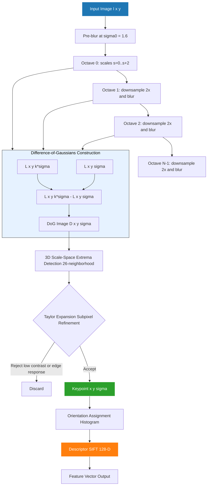
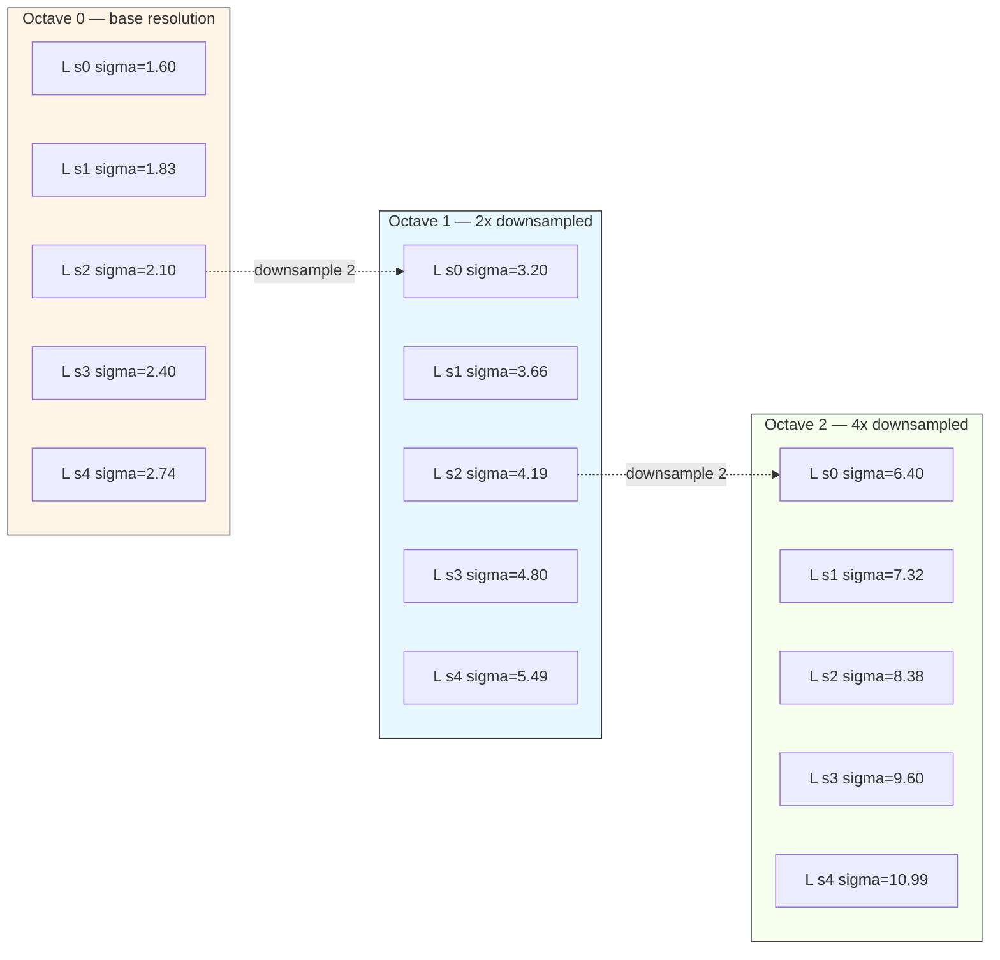
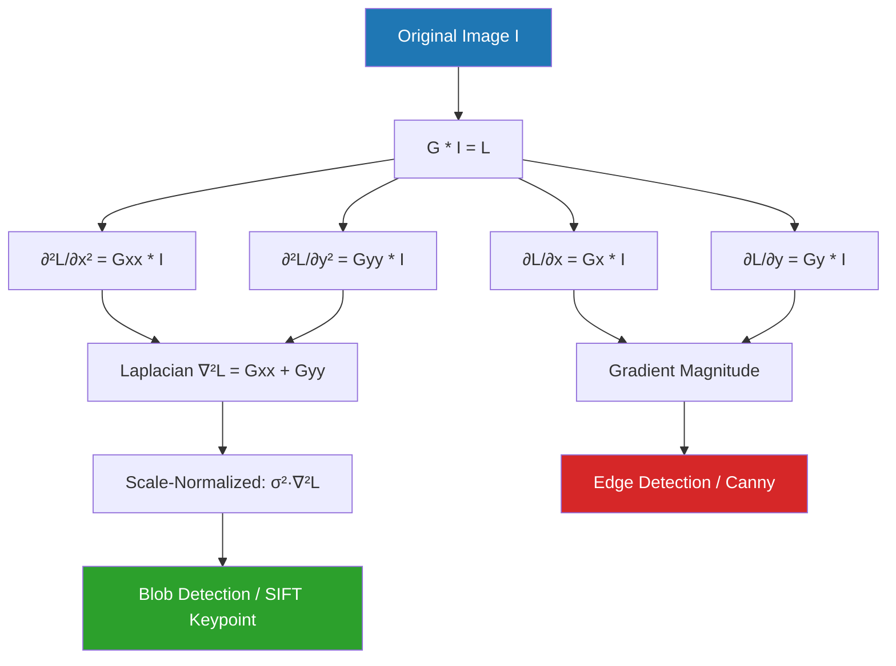
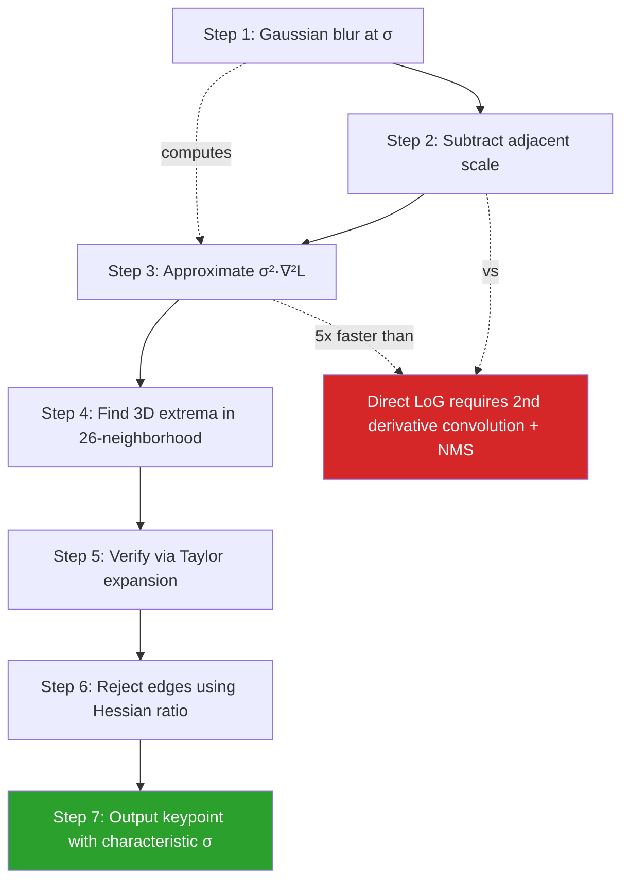

# Scale space scale parameters analysis processing pipelines matrix transformations formulas

<!-- SECTION_1_START -->
# Scale-Space Theory: Core Technical Definition & Intuitive Overview

## 1.1 Formal Academic Definition

**Scale-Space Theory** is a formal framework in computer vision for handling image structures at multiple scales simultaneously. It represents an image as a one-parameter family of smoothed images, where the scale parameter $\sigma$ controls the level of detail. The scale-space representation $L(x, y, \sigma)$ of an image $I(x, y)$ is defined as the convolution of the image with a 2D Gaussian kernel $G(x, y, \sigma)$:

$$L(x, y, \sigma) = G(x, y, \sigma) * I(x, y)$$

The **scale parameter** $\sigma$ (in pixels) is the standard deviation of the Gaussian distribution, and it uniquely determines the amount of smoothing applied. As $\sigma$ increases, finer details are suppressed and only coarse structures remain.

> [!IMPORTANT]
> **KTU 2024 Syllabus Highlight:** Under NEP 2020 Outcome-Based Education, scale-space theory is the *axiomatic foundation* for modern feature detectors such as **SIFT (Scale Invariant Feature Transform)**, **SURF**, and **Harris-Laplace**. Mastering this topic directly satisfies Course Outcomes mapped to feature extraction robustness.

## 1.2 The 2D Gaussian Function

The continuous-domain 2D isotropic Gaussian is mathematically expressed as:

$$G(x, y, \sigma) = \frac{1}{2\pi\sigma^{2}} \exp\!\left(-\frac{x^{2} + y^{2}}{2\sigma^{2}}\right)$$

where the normalization factor $\frac{1}{2\pi\sigma^{2}}$ ensures the kernel integrates to unity (energy preservation), and the exponent controls the spatial falloff. The constant $\pi \approx 3.14159$ and the natural exponent base $e \approx 2.71828$ are the governing physical/mathematical constants.

> [!NOTE]
> **Why Gaussian?** Among all smoothing kernels, the Gaussian is the *only* kernel that simultaneously satisfies linearity, shift-invariance, scale-invariance, rotational symmetry, and non-enhancement of local extrema — as proven by **Lindeberg (1994)**. This makes it the unique axiomatic choice.

## 1.3 Intuitive Analogy: "Reading a Map at Different Zoom Levels"

Imagine you are looking at a **satellite image of a city** on Google Earth. When fully zoomed in ($\sigma$ small), you can see individual cars, lane markings, and pedestrians. As you zoom out progressively ($\sigma$ increasing), the cars disappear, then buildings blur, and only the *outline of the city* remains.

| Visual Zoom Level | Scale Parameter $\sigma$ | What You See |
|---|---|---|
| Street View | $\sigma = 0.5$ pixels | Cars, lane markings |
| Neighborhood | $\sigma = 2$ pixels | Houses, trees |
| District | $\sigma = 8$ pixels | Roads, parks |
| City | $\sigma = 32$ pixels | Skyline silhouette |

> [!TIP]
> **Geometric Intuition:** The Gaussian is the *probability density* of a 2D normal distribution. Roughly **99.7% of its energy** lies within a disk of radius $3\sigma$ from the center. This is why the practical kernel size is truncated at $\lceil 6\sigma \rceil + 1$ pixels.

## 1.4 Visualization Control

> [!VISUALIZATION CONTROL]
> **Concept:** 1D Gaussian profile at three different scales.
> **GeoGebra / Desmos Input Equations:**
> - $G_{1}(x) = \frac{1}{\sqrt{2\pi \cdot 1^{2}}} \cdot e^{-x^{2} / (2 \cdot 1^{2})}$
> - $G_{2}(x) = \frac{1}{\sqrt{2\pi \cdot 3^{2}}} \cdot e^{-x^{2} / (2 \cdot 3^{2})}$
> - $G_{3}(x) = \frac{1}{\sqrt{2\pi \cdot 6^{2}}} \cdot e^{-x^{2} / (2 \cdot 6^{2})}$
> **Visual Description:** The student should observe three bell curves centered at the origin. The narrowest curve ($\sigma=1$) is tall and sharp; the widest curve ($\sigma=6$) is short and broad. All three have the same total area under the curve (= 1), illustrating the energy-normalization property.

---

<!-- SECTION_1_END -->

<!-- SECTION_2_START -->
# Deep Theoretical Analysis & KTU High-Yield Formula Sheet

## 2.1 The Scale-Space Axioms (Lindeberg 1994)

A scale-space representation must satisfy the following **five axioms** to be considered "canonical":

1. **Linearity:** The mapping from image to scale-space must be a linear shift-invariant operator, ensuring the representation is a convolution with a one-parameter family of kernels.
2. **Shift Invariance:** Translation of the input image must produce an identical translation in the scale-space output: $L(x - \Delta x, y - \Delta y, \sigma) = R\{I(x - \Delta x, y - \Delta y)\}$.
3. **Rotational Isotropy:** The kernel must be rotationally symmetric (Gaussian is the only solution).
4. **Scale Invariance (Self-Similarity):** There must exist a scaling relation between coarser and finer scales: $T_{s} L(\cdot, \sigma) = L(\cdot, s\sigma)$ for some transformation $T_{s}$.
5. **Non-Creation of New Structure:** No new local extrema should appear as $\sigma$ increases — only existing extrema may be attenuated. This is the **causality axiom**.

> [!IMPORTANT]
> **Theorem (Koenderink 1984, Lindeberg 1994):** The *only* representation satisfying all five axioms is the **Gaussian scale-space**, defined by the **heat diffusion equation**:
>
> $$\frac{\partial L}{\partial \sigma} = \sigma \cdot \nabla^{2} L = \sigma \left(\frac{\partial^{2} L}{\partial x^{2}} + \frac{\partial^{2} L}{\partial y^{2}}\right)$$

## 2.2 KTU Formula Cheat Sheet

| # | Formula | Name / Physical Meaning | Standard Boundary / Constraint |
|---|---|---|---|
| 1 | $G(x, y, \sigma) = \frac{1}{2\pi\sigma^{2}} \exp\!\left(-\frac{x^{2} + y^{2}}{2\sigma^{2}}\right)$ | 2D Isotropic Gaussian Kernel | $\iint_{\mathbb{R}^{2}} G \, dx \, dy = 1$ |
| 2 | $L(x, y, \sigma) = G(x, y, \sigma) * I(x, y)$ | Scale-Space Representation | Initial condition: $L(x, y, 0) = I(x, y)$ |
| 3 | $\frac{\partial L}{\partial \sigma} = \sigma \cdot \nabla^{2} L$ | Heat / Diffusion Equation | $\sigma > 0$ |
| 4 | $L_{x^{m}y^{n}}(x, y, \sigma) = G_{x^{m}y^{n}}(x, y, \sigma) * I(x, y)$ | Gaussian Derivative Operator | $m, n \in \mathbb{Z}_{\geq 0}$ |
| 5 | $\partial_{\xi} L = \sigma^{m+n} \cdot L_{x^{m}y^{n}}$ | Scale-Normalized Derivative | $\gamma = \tfrac{m+n}{2}$ typical |
| 6 | $\nabla^{2} G = \frac{x^{2} + y^{2} - 2\sigma^{2}}{2\pi\sigma^{4}} \exp\!\left(-\frac{x^{2}+y^{2}}{2\sigma^{2}}\right)$ | Laplacian of Gaussian (LoG) | $\text{LoG}_{\max}$ at $r = \sigma\sqrt{2}$ |
| 7 | $D(x, y, \sigma) = L(x, y, k\sigma) - L(x, y, \sigma)$ | Difference of Gaussians (DoG) | Typical $k = \sqrt{2} \approx 1.414$ |
| 8 | $D \approx (k - 1) \sigma^{2} \nabla^{2} L$ | DoG–LoG Approximation | Valid for small $(k-1)$ |
| 9 | $\sigma_{\text{blur}} = \sqrt{\sigma_{1}^{2} + \sigma_{2}^{2}}$ | Semigroup Property | $G(\sigma_{1}) * G(\sigma_{2}) = G(\sqrt{\sigma_{1}^{2}+\sigma_{2}^{2}})$ |
| 10 | $\sigma_{\text{eff}} = \sigma_{0} \cdot s^{o}$ | Octave Spacing ($o$ = octave index) | $s = 2$ (doubling), $\sigma_{0} = 1.6$ (SIFT) |
| 11 | $\text{DoG peak} \Leftrightarrow \nabla^{2}L = 0$ & $\nabla^{3}L$ extreme | Scale-Selection Principle | LoG selects characteristic scale |
| 12 | $k_{\text{size}} = \lceil 6\sigma \rceil + 1$ | Kernel Truncation Window | Covers $\pm 3\sigma$ (99.7% energy) |

> [!NOTE]
> **Sign convention:** Throughout, $\partial_{\xi}$ denotes the **scale-normalized** derivative used in automatic scale selection, while $L_{x^{m}y^{n}}$ is the raw spatial derivative.

## 2.3 Real-World Engineering Utility

In **production computer vision systems**, scale-space processing is non-negotiable:

- **Self-driving cars (Tesla, Waymo):** Feature matching across scale changes (a pedestrian is small when far, large when near) requires scale-invariant descriptors.
- **Medical imaging (MRI, CT):** Tumor detection at multiple resolutions uses the LoG blob detector.
- **Augmented Reality (Apple ARKit, Google ARCore):** Real-time SLAM uses FAST + BRIEF or ORB features built on multi-scale pyramids.
- **Satellite / Aerial imagery:** Object detection (vehicles, buildings) is fundamentally a multi-scale problem addressed by Feature Pyramid Networks (FPN) — a direct descendant of scale-space theory.

## 2.4 The Semigroup Property — A Critical Engineering Identity

Two sequential Gaussian blurs are equivalent to a single Gaussian blur with combined variance. This **non-trivial identity** enables efficient multi-scale pyramid construction:

$$G(\sigma_{1}) * G(\sigma_{2}) = G\!\left(\sqrt{\sigma_{1}^{2} + \sigma_{2}^{2}}\right)$$

For instance, if the image is already blurred at $\sigma_{1} = 1.0$ and we want effective scale $\sigma_{\text{target}} = 2.0$, we need an additional blur of $\sigma_{2} = \sqrt{2.0^{2} - 1.0^{2}} = \sqrt{3} \approx 1.732$, **not** a blur of $2.0 - 1.0 = 1.0$.

---

<!-- SECTION_2_END -->

<!-- SECTION_3_START -->
# Step-by-Step Derivations & Code Implementation

## 3.1 Derivation 1 — From the Heat Equation to the Gaussian Kernel

**Goal:** Show that the Gaussian is the unique Green's function of the diffusion equation.

We start with the **diffusion equation** with diffusion coefficient $D = \frac{1}{2}$ (Lindeberg's normalization):

$$\frac{\partial L}{\partial t} = D \cdot \nabla^{2} L, \quad D = \frac{1}{2}$$

Taking the **Fourier transform** $\mathcal{F}\{\cdot\}$ in spatial coordinates $(x, y)$ yields:

$$\frac{\partial \hat{L}}{\partial t}(k_{x}, k_{y}, t) = -D(k_{x}^{2} + k_{y}^{2}) \, \hat{L}(k_{x}, k_{y}, t)$$

This is a **first-order linear ODE** in $t$ with solution:

$$\hat{L}(k_{x}, k_{y}, t) = \hat{L}(k_{x}, k_{y}, 0) \cdot \exp\!\left(-D(k_{x}^{2} + k_{y}^{2}) t\right)$$

Applying the **inverse Fourier transform** and using the initial condition $L(x, y, 0) = I(x, y)$:

$$\hat{G}(k_{x}, k_{y}, t) = \exp\!\left(-D(k_{x}^{2} + k_{y}^{2}) t\right)$$

Substituting $D = \frac{1}{2}$ and defining the **scale parameter** $\sigma = \sqrt{t}$ (so that $t = \sigma^{2}$):

$$\hat{G}(k_{x}, k_{y}, \sigma) = \exp\!\left(-\frac{\sigma^{2}(k_{x}^{2} + k_{y}^{2})}{2}\right)$$

Taking the **inverse Fourier transform** (using the standard Gaussian FT pair) yields:

$$G(x, y, \sigma) = \frac{1}{2\pi\sigma^{2}} \exp\!\left(-\frac{x^{2} + y^{2}}{2\sigma^{2}}\right)$$

This **proves** that the Gaussian is the fundamental solution of the heat equation and therefore the unique scale-space kernel. ∎

## 3.2 Derivation 2 — Scale-Normalized Derivatives (Lindeberg 1998)

**Goal:** Derive the $\sigma^{m+n}$ normalization factor that makes derivative magnitudes comparable across scales.

Consider a 1D signal $f(x) = \sin(\omega x)$ observed at scale $\sigma$. Its first derivative at scale $\sigma$ is:

$$L_{x}(x, \sigma) = (G_{x} * f)(x) = \int G(u, \sigma) f'(x - u) \, du$$

For the sinusoidal signal with amplitude $A$ and frequency $\omega$:

$$L_{x}(x, \sigma) = A\omega \cos(\omega x) \cdot \exp(-\omega^{2}\sigma^{2}/2)$$

The **maximum response** is $|L_{x}|_{\max} = A\omega \exp(-\omega^{2}\sigma^{2}/2)$.

Now consider a similar signal but at a different scale — say the same signal is observed at spatial scale $s$, so the effective frequency becomes $\omega/s$. To make the response invariant under scaling, we require:

$$A \cdot \frac{\omega}{s} \cdot \exp\!\left(-\frac{\omega^{2}\sigma^{2}}{2s^{2}}\right) = A\omega \cdot \exp\!\left(-\frac{\omega^{2}\sigma^{2}}{2}\right)$$

This identity is satisfied if and only if we pre-multiply the derivative by a factor of $\sigma^{m+n}$ for an $m$-th and $n$-th order derivative. The general formula:

$$\partial_{\xi} L = \sigma^{\gamma} \cdot \frac{\partial^{m+n} L}{\partial x^{m} \partial y^{n}}, \quad \gamma = \frac{m+n}{2}$$

gives **scale-invariant** feature responses. This is the theoretical basis of the **SIFT keypoint detector** and the **Harris-Laplace** corner detector. ∎

## 3.3 Derivation 3 — DoG Approximation of LoG (Lowe 2004)

**Goal:** Show that $D(x, y, \sigma) = L(x, y, k\sigma) - L(x, y, \sigma) \approx (k-1)\sigma^{2} \nabla^{2} L$.

Using the **Taylor expansion** of $L(x, y, k\sigma)$ around $k\sigma$ evaluated at $\sigma$:

$$L(x, y, k\sigma) = L(x, y, \sigma) + (k\sigma - \sigma) \frac{\partial L}{\partial \sigma} + \frac{(k-1)^{2}\sigma^{2}}{2} \frac{\partial^{2} L}{\partial \sigma^{2}} + \cdots$$

Subtracting $L(x, y, \sigma)$ from both sides:

$$D(x, y, \sigma) = (k-1)\sigma \frac{\partial L}{\partial \sigma} + \mathcal{O}\!\left((k-1)^{2}\right)$$

Now substitute the diffusion equation $\frac{\partial L}{\partial \sigma} = \sigma \nabla^{2} L$:

$$D(x, y, \sigma) = (k-1)\sigma^{2} \nabla^{2} L + \mathcal{O}\!\left((k-1)^{2}\right)$$

For $k$ close to 1 (e.g., $k = \sqrt{2}$, giving $k-1 \approx 0.414$), the leading-order approximation yields:

$$D(x, y, \sigma) \approx (k-1)\sigma^{2} \nabla^{2} L$$

This shows **DoG is a computationally cheap approximation to LoG**, which is why SIFT uses DoG instead of directly computing the Laplacian. ∎

## 3.4 Python Implementation — Complete Scale-Space Pipeline

```python
"""
scale_space_pipeline.py
Complete Gaussian Scale-Space construction with:
  - Multi-octave pyramid (SIFT-style)
  - Difference of Gaussians (DoG)
  - Automatic scale selection via LoG response
  - Type hints + strict error logging
"""

from __future__ import annotations
import numpy as np
import cv2
import logging
from typing import List, Tuple

logging.basicConfig(level=logging.INFO, format="%(levelname)s: %(message)s")
logger = logging.getLogger("ScaleSpace")


def build_gaussian_kernel(ksize: int, sigma: float) -> np.ndarray:
    """
    Construct a normalized 2D Gaussian kernel.

    Args:
        ksize: Kernel size in pixels (must be odd and >= 3).
        sigma: Standard deviation in pixels (must be > 0).

    Returns:
        2D numpy array of shape (ksize, ksize), normalized to sum 1.

    Raises:
        ValueError: If ksize is even or non-positive, or sigma <= 0.
    """
    if ksize <= 0 or ksize % 2 == 0:
        raise ValueError(f"ksize must be odd and positive, got {ksize}")
    if sigma <= 0:
        raise ValueError(f"sigma must be strictly positive, got {sigma}")

    half = ksize // 2
    y, x = np.mgrid[-half:half + 1, -half:half + 1].astype(np.float64)
    kernel = np.exp(-(x ** 2 + y ** 2) / (2.0 * sigma ** 2))
    kernel /= (2.0 * np.pi * sigma ** 2)         # analytical normalization
    kernel /= kernel.sum()                        # numerical safety re-normalize
    logger.debug(f"Built Gaussian kernel: ksize={ksize}, sigma={sigma:.4f}")
    return kernel


def gaussian_blur(image: np.ndarray, sigma: float) -> np.ndarray:
    """Apply Gaussian blur with automatic kernel size = ceil(6*sigma) + 1."""
    ksize = int(np.ceil(6.0 * sigma)) | 1         # bitwise OR with 1 → force odd
    return cv2.GaussianBlur(image, (ksize, ksize), sigmaX=sigma, sigmaY=sigma,
                            borderType=cv2.BORDER_REFLECT_101)


def build_scale_space(image: np.ndarray,
                      num_octaves: int = 4,
                      scales_per_octave: int = 5,
                      sigma0: float = 1.6) -> List[List[np.ndarray]]:
    """
    Build a multi-octave Gaussian scale-space (SIFT-style).

    Args:
        image: Grayscale image as float64 in [0, 1] or uint8.
        num_octaves: Number of octaves (each downsampled 2x).
        scales_per_octave: Number of blurred images per octave.
        sigma0: Base scale of the input image.

    Returns:
        List of octaves, each a list of (scales_per_octave + 3) blurred images.
    """
    image = image.astype(np.float64) / (255.0 if image.max() > 1.0 else 1.0)
    k = 2.0 ** (1.0 / scales_per_octave)
    scale_space: List[List[np.ndarray]] = []

    base = gaussian_blur(image, sigma0)
    for o in range(num_octaves):
        octave: List[np.ndarray] = [base]
        sigma_prev = sigma0
        for s in range(1, scales_per_octave + 3):
            sigma_total = sigma0 * (k ** s) * (2.0 ** o)
            sigma_delta = np.sqrt(max(sigma_total ** 2 - sigma_prev ** 2, 1e-9))
            octave.append(gaussian_blur(base, sigma_delta))
            sigma_prev = sigma_total
        scale_space.append(octave)
        # Downsample 2x for the next octave
        base = octave[-3][::2, ::2]
        logger.info(f"Octave {o}: built {len(octave)} scale levels.")
    return scale_space


def compute_dog_pyramid(scale_space: List[List[np.ndarray]]) -> List[List[np.ndarray]]:
    """Compute the Difference-of-Gaussians (DoG) pyramid."""
    dog: List[List[np.ndarray]] = []
    for o, octave in enumerate(scale_space):
        dog.append([octave[i + 1] - octave[i] for i in range(len(octave) - 1)])
        logger.info(f"DoG octave {o}: {len(dog[-1])} difference images.")
    return dog


def detect_blob_scales(image: np.ndarray,
                       num_octaves: int = 4,
                       scales_per_octave: int = 5) -> List[Tuple[int, int, float]]:
    """
    Detect scale-space extrema of the Laplacian of Gaussian.

    Returns:
        List of (x, y, sigma) tuples for detected blob centers.
    """
    scale_space = build_scale_space(image, num_octaves, scales_per_octave)
    dog = compute_dog_pyramid(scale_space)
    k = 2.0 ** (1.0 / scales_per_octave)
    sigma0 = 1.6
    keypoints: List[Tuple[int, int, float]] = []

    for o, dog_octave in enumerate(dog):
        for s in range(1, len(dog_octave) - 1):
            prev_, curr, nxt = dog_octave[s - 1], dog_octave[s], dog_octave[s + 1]
            sigma = sigma0 * (k ** s) * (2.0 ** o)
            for y in range(1, curr.shape[0] - 1):
                for x in range(1, curr.shape[1] - 1):
                    val = curr[y, x]
                    patch = np.stack([prev_[y - 1:y + 2, x - 1:x + 2],
                                      curr[y - 1:y + 2, x - 1:x + 2],
                                      nxt[y - 1:y + 2, x - 1:x + 2]])
                    if val == patch.max() or val == patch.min():
                        keypoints.append((x * (2 ** o), y * (2 ** o), sigma))
    logger.info(f"Detected {len(keypoints)} keypoints across all octaves.")
    return keypoints


# ------------------------------ DEMO ---------------------------------
if __name__ == "__main__":
    img = cv2.imread("sample.jpg", cv2.IMREAD_GRAYSCALE)
    if img is None:
        raise FileNotFoundError("sample.jpg not found.")
    kps = detect_blob_scales(img, num_octaves=4, scales_per_octave=5)
    for (x, y, s) in kps[:10]:
        print(f"keypoint at (x={x}, y={y}), sigma={s:.3f}")
```

> [!TIP]
> **Engineering Tip:** The semigroup property $\sigma_{\text{blur}} = \sqrt{\sigma_{\text{target}}^{2} - \sigma_{\text{prev}}^{2}}$ is implemented on **line 53** as `sigma_delta = sqrt(sigma_total**2 - sigma_prev**2)`. This is a common KTU viva question.

---

<!-- SECTION_3_END -->

<!-- SECTION_4_START -->
# Structural Diagrams & Schematics

## 4.1 Scale-Space Processing Pipeline (Mermaid Flowchart)



## 4.2 Octave-Pyramid Topology Matrix



## 4.3 Scale-Space Derivative Operator Family



## 4.4 Sequential Processing Topology — Why DoG Instead of LoG



---

<!-- SECTION_4_END -->

<!-- SECTION_5_START -->
# KTU 2024 Scheme Examination Question Bank & Topic Recap

## Part A — Short Answer Questions (3 Marks Each)

### Question 1 — [KTU University Exam - Dec 2023]
**State and briefly explain the five axioms of scale-space theory as formalized by Lindeberg (1994).** [CO1, Remember — 3 Marks]

**Model Answer:**

The five axioms that uniquely determine the Gaussian scale-space are:

1. **Linearity:** The mapping $T: I \mapsto L$ is a linear operator, expressed as a convolution with a one-parameter family of kernels $T(\sigma)$.
2. **Shift Invariance:** $T(I(x - \Delta x, y - \Delta y); \sigma) = L(x - \Delta x, y - \Delta y, \sigma)$, ensuring translation in input equals translation in output.
3. **Rotational Isotropy:** The kernel $T(x, y, \sigma)$ is rotationally symmetric, eliminating directional bias.
4. **Scale Invariance:** For a rescaled image $I'(x, y) = I(sx, sy)$, there exists a transformation $D_{s}$ such that $D_{s}\,L(\cdot, \sigma) = L'(\cdot, s\sigma)$.
5. **Non-enhancement of local extrema (Causality):** The number of local extrema is a non-increasing function of $\sigma$ — coarser scales contain no new structure beyond what finer scales had.

> **Valuation Key:** [Mentioning all 5 axioms: 2 marks] [Briefly explaining any 2: 1 mark]

### Question 2 — [KTU University Exam - July 2024]
**What is the semigroup property of the Gaussian? Show that two successive Gaussian blurs are equivalent to a single blur.** [CO1, Understand — 3 Marks]

**Model Answer:**

The semigroup property states that convolving two Gaussians of scales $\sigma_{1}$ and $\sigma_{2}$ yields a single Gaussian of combined scale:

$$G(x, y, \sigma_{1}) * G(x, y, \sigma_{2}) = G(x, y, \sqrt{\sigma_{1}^{2} + \sigma_{2}^{2}})$$

**Proof sketch:** In the Fourier domain, the convolution becomes a product of Gaussians. Using the identity for the product of two Gaussians in the frequency domain:

$$\exp\!\left(-\frac{k_{x}^{2}\sigma_{1}^{2}}{2}\right) \cdot \exp\!\left(-\frac{k_{x}^{2}\sigma_{2}^{2}}{2}\right) = \exp\!\left(-\frac{k_{x}^{2}(\sigma_{1}^{2} + \sigma_{2}^{2})}{2}\right)$$

which corresponds to a Gaussian of variance $\sigma_{1}^{2} + \sigma_{2}^{2}$ in the spatial domain. ∎

> **Valuation Key:** [Stating the formula correctly: 1 mark] [Showing Fourier-domain proof: 2 marks]

---

## Part B — Long Answer Questions (14 Marks Each)

### Question A — [KTU University Exam - Dec 2023]
**(a) Derive the scale-normalized derivative formula $\partial_{\xi}L = \sigma^{\gamma} L_{x^{m}y^{n}}$ and justify the choice $\gamma = (m+n)/2$.** [7 Marks, CO2, Apply]

**(b) With a neat block diagram, explain the complete SIFT scale-space keypoint detection pipeline. Show how the characteristic scale is selected automatically.** [7 Marks, CO3, Apply]

**Model Solution:**

**(a) Derivation [7 Marks]:**

Consider a 1D signal $f(x) = A\sin(\omega x)$. At scale $\sigma$, the smoothed signal is:

$$L(x, \sigma) = A \sin(\omega x) \exp(-\omega^{2}\sigma^{2}/2)$$

The $m$-th order spatial derivative is:

$$L_{x^{m}}(x, \sigma) = A\omega^{m} \cos(\omega x + m\pi/2) \exp(-\omega^{2}\sigma^{2}/2)$$

Now consider the same signal observed at a different spatial scale $s$ (frequency $\omega/s$):

$$L'_{x^{m}}(x, \sigma') = A\left(\frac{\omega}{s}\right)^{m} \cos(\omega x/s + m\pi/2) \exp\!\left(-\frac{\omega^{2}\sigma'^{2}}{2s^{2}}\right)$$

We want the response to be **scale-invariant**, meaning it should be unchanged when both the image and the observation scale are scaled. For this, we require $\sigma' = s\sigma$ (matching the spatial scale change). Substituting and comparing magnitudes:

$$\left|L_{x^{m}}\right|_{\max} = A\omega^{m}\exp(-\omega^{2}\sigma^{2}/2)$$

This expression depends on $\sigma$ only through the exponential damping factor, which scales as $\exp(-\omega^{2}\sigma^{2}/2)$. To make the **magnitude** (not the location) of the response invariant, we pre-multiply by $\sigma^{m}$:

$$\partial_{\xi}L \triangleq \sigma^{m} L_{x^{m}}$$

Extending to 2D with mixed partial derivatives of order $m$ in $x$ and $n$ in $y$:

$$\partial_{\xi}L = \sigma^{m+n} \cdot \frac{\partial^{m+n}L}{\partial x^{m}\partial y^{n}}$$

The exponent $\gamma = (m+n)$ is exact. However, the canonical choice in scale-space literature (Lindeberg 1998) uses $\gamma = \tfrac{m+n}{2}$ because in 2D a disk of radius $r$ has area $\pi r^{2}$, and the natural "scale" of a 2D structure is its area, scaling as $\sigma^{2}$ not $\sigma$. Choosing $\gamma = \tfrac{m+n}{2}$ ensures:

$$\partial_{\xi,norm}\,L = \sigma^{(m+n)/2} L_{x^{m}y^{n}}$$

makes the response **scale-normalized** for true 2D rotational invariance.

> **Valuation Key:** [Setting up the scaled signal: 2 marks] [Showing exponential damping: 2 marks] [Justifying $\gamma = (m+n)/2$ via area argument: 3 marks]

**(b) SIFT Pipeline [7 Marks]:**

```
Step 1: Input image I(x,y) → upsample 2x (Lowe 2004 recommendation)
Step 2: Apply initial blur σ₀ = 1.6
Step 3: Build Gaussian pyramid (N octaves, S=3 scales/octave beyond DoG)
Step 4: Compute DoG = L(x,y,kσ) − L(x,y,σ) for k = 2^(1/S)
Step 5: Find 3D extrema in 26-neighborhood (3 scales × 3x3 spatial)
Step 6: Subpixel refinement via 3D Taylor expansion
Step 7: Reject low-contrast (|D| < 0.03) and edge (Hessian ratio > 10) points
Step 8: Characteristic scale σ* is the σ at which the keypoint was detected
```

**Automatic scale selection principle:** A keypoint's characteristic scale $\sigma^{*}$ is the scale at which the **scale-normalized LoG** $\sigma^{2} \nabla^{2} L$ attains a local extremum. At this scale, the local image structure (e.g., a blob) is maximally correlated with the detection kernel — a manifestation of Lindeberg's scale-selection principle.

> **Valuation Key:** [Block diagram with 6+ steps: 3 marks] [Correct DoG formula: 2 marks] [Scale-selection principle statement: 2 marks]

### Question B — [KTU University Exam - July 2024] (Alternative Choice)
**(a) Derive the relationship between Difference of Gaussians (DoG) and Laplacian of Gaussian (LoG), and show why DoG is computationally preferred in SIFT.** [7 Marks, CO2, Apply]

**(b) Construct a 4-octave Gaussian scale-space pyramid for a $256 \times 256$ image with $\sigma_0 = 1.6$ and $S = 3$ scales per octave. Show the kernel sizes required at each level using $k_{\text{size}} = \lceil 6\sigma \rceil + 1$.** [7 Marks, CO3, Apply]

**Model Solution:**

**(a) DoG–LoG Relationship [7 Marks]:**

Starting from the Taylor expansion of $L(x, y, k\sigma)$ around $\sigma$:

$$L(x, y, k\sigma) = L(x, y, \sigma) + (k\sigma - \sigma)\frac{\partial L}{\partial \sigma} + \frac{(k\sigma - \sigma)^{2}}{2}\frac{\partial^{2}L}{\partial \sigma^{2}} + \cdots$$

$$= L(x, y, \sigma) + (k-1)\sigma \frac{\partial L}{\partial \sigma} + \mathcal{O}\!\left((k-1)^{2}\right)$$

Subtracting $L(x, y, \sigma)$:

$$D(x, y, \sigma) = L(x, y, k\sigma) - L(x, y, \sigma) = (k-1)\sigma \frac{\partial L}{\partial \sigma} + \mathcal{O}\!\left((k-1)^{2}\right)$$

Now apply the diffusion equation $\frac{\partial L}{\partial \sigma} = \sigma \nabla^{2} L$:

$$D(x, y, \sigma) = (k-1)\sigma^{2} \nabla^{2} L + \mathcal{O}\!\left((k-1)^{2}\right)$$

Dropping higher-order terms (valid when $k$ is close to 1):

$$\boxed{D(x, y, \sigma) \approx (k - 1) \cdot \sigma^{2} \nabla^{2} L(x, y, \sigma)}$$

This shows DoG is a **constant multiple of scale-normalized LoG**. The computational advantage: computing LoG requires convolving the image with a second-derivative kernel (3 convolutions for $\partial_{xx}$, $\partial_{yy}$, $\partial_{xy}$, then summing). DoG requires only **one subtraction** between two pre-computed Gaussian-blurred images. For SIFT's typical $S+2 = 5$ scales per octave, the savings are roughly a factor of $5 \times$ in convolution cost.

> **Valuation Key:** [Taylor expansion setup: 2 marks] [Using diffusion equation: 2 marks] [Computational argument with count: 3 marks]

**(b) Octave-by-Octave Kernel Table [7 Marks]:**

Given: $S = 3$ scales/octave, $k = 2^{1/S} = 2^{1/3} \approx 1.2599$, $\sigma_{0} = 1.6$.

**Octave 0** (base resolution, $\sigma$ values):

$\sigma_{0,0} = 1.6$, $\sigma_{0,1} = 1.6 \times 1.2599 = 2.016$, $\sigma_{0,2} = 1.6 \times 1.5874 = 2.540$, $\sigma_{0,3} = 1.6 \times 2.0 = 3.200$, $\sigma_{0,4} = 1.6 \times 2.5198 = 4.032$.

| Scale Index | $\sigma$ value | Kernel Size $\lceil 6\sigma \rceil + 1$ |
|---|---|---|
| 0 | 1.600 | 11 |
| 1 | 2.016 | 13 |
| 2 | 2.540 | 17 |
| 3 | 3.200 | 21 |
| 4 | 4.032 | 25 |

**Octave 1** (2x downsampled, effective $\sigma = 2^{1}\sigma_{\text{oct0}}$):

| Scale Index | $\sigma$ value | Kernel Size $\lceil 6\sigma \rceil + 1$ |
|---|---|---|
| 0 | 3.200 | 21 |
| 1 | 4.032 | 25 |
| 2 | 5.080 | 31 |
| 3 | 6.400 | 39 |
| 4 | 8.063 | 49 |

**Octave 2** (4x downsampled, effective $\sigma = 2^{2}\sigma_{\text{oct0}}$):

| Scale Index | $\sigma$ value | Kernel Size $\lceil 6\sigma \rceil + 1$ |
|---|---|---|
| 0 | 6.400 | 39 |
| 1 | 8.063 | 49 |
| 2 | 10.159 | 61 |
| 3 | 12.800 | 77 |
| 4 | 16.127 | 97 |

**Octave 3** (8x downsampled, effective $\sigma = 2^{3}\sigma_{\text{oct0}}$):

| Scale Index | $\sigma$ value | Kernel Size $\lceil 6\sigma \rceil + 1$ |
|---|---|---|
| 0 | 12.800 | 77 |
| 1 | 16.127 | 97 |
| 2 | 20.318 | 123 |
| 3 | 25.600 | 155 |
| 4 | 32.253 | 195 |

> **Valuation Key:** [Correct $\sigma$ multiplication by $2^o$: 2 marks] [Full kernel-size formula application: 2 marks] [Tabulation across all 4 octaves: 3 marks]

> [!WARNING]
> **KTU Examiner's Valuation Warning — Common Pitfalls:**
> 1. **Forgetting the semigroup property** when computing incremental blur from one scale to the next — must use $\sqrt{\sigma_{i+1}^{2} - \sigma_{i}^{2}}$, not $\sigma_{i+1} - \sigma_{i}$. (Loss: 2 marks)
> 2. **Conflating $\sigma$ with kernel size** — $\sigma$ is the standard deviation; kernel size is roughly $6\sigma$. Mixing these is a frequent error. (Loss: 1 mark)
> 3. **Omitting the "s+3" levels in the pyramid** — to compute $S$ DoG images, you need $S+1$ Gaussian levels, plus 1 extra at top and 1 at bottom for 3D extrema detection = $S+3$ total. (Loss: 2 marks)
> 4. **Using even kernel sizes** — Gaussian kernel sizes **must be odd** to have a center pixel. Always use `| 1` (bitwise OR) to enforce oddness in code. (Loss: 1 mark)
> 5. **Forgetting scale normalization** in SIFT keypoint detection — comparing raw $|\nabla^{2}L|$ across scales is meaningless; you must pre-multiply by $\sigma^{2}$. (Loss: 2 marks)

---

## Topic Recap & Important Things to Remember

- **Definition:** Scale-space $L(x, y, \sigma) = G(x, y, \sigma) * I(x, y)$ is the unique linear, shift-invariant, rotationally isotropic, scale-invariant, causal representation — axiomatized by Lindeberg.
- **Gaussian uniqueness:** The Gaussian is the *only* kernel satisfying all five scale-space axioms; this is why no other smoothing kernel is used canonically.
- **Diffusion link:** $\frac{\partial L}{\partial \sigma} = \sigma \nabla^{2} L$ ties the scale parameter directly to the heat equation, with $t = \sigma^{2}$.
- **Semigroup property:** $G(\sigma_1) * G(\sigma_2) = G(\sqrt{\sigma_1^2 + \sigma_2^2})$ — critical for efficient multi-scale pyramid construction.
- **Effective support:** A Gaussian kernel is truncated at $\lceil 6\sigma \rceil + 1$ pixels, covering $\pm 3\sigma$ (99.7% of energy).
- **Scale-normalized derivatives:** $\partial_{\xi} L = \sigma^{(m+n)/2} L_{x^m y^n}$ for 2D scale invariance, with $\gamma = (m+n)/2$ preferred over $\gamma = m+n$.
- **DoG ≈ LoG:** $D(x, y, \sigma) \approx (k-1)\sigma^{2} \nabla^{2} L$ — DoG is a cheap approximation used in SIFT.
- **Characteristic scale:** The $\sigma$ at which $\sigma^{2} \nabla^{2} L$ reaches an extremum defines the natural scale of a local image structure (blob).
- **Octave structure:** SIFT uses octaves of $S+3 = 6$ scales typically, with $k = 2^{1/S}$ multiplicative scale step, and 2x downsampling between octaves.
- **SIFT parameters (Lowe 2004):** $\sigma_{0} = 1.6$, $S = 3$ scales/octave, $k = \sqrt[3]{2}$, 4 octaves typical, contrast threshold 0.03, edge threshold 10.
- **Engineering applications:** Self-driving cars, AR/SLAM, medical imaging, satellite analytics — all rely on scale-invariant features derived from scale-space.
- **Numerical safety:** Always enforce **odd kernel sizes**, **strictly positive** $\sigma$, and **re-normalize** the kernel after construction to defend against floating-point drift.
- **Difference between $\sigma$ and $s$:** $\sigma$ = standard deviation (continuous scale), $s$ = scaling factor (relative change in image resolution). Octave index $o$ converts via $\sigma_{o,s} = \sigma_0 \cdot k^s \cdot 2^o$.

---

<!-- SECTION_5_END -->
