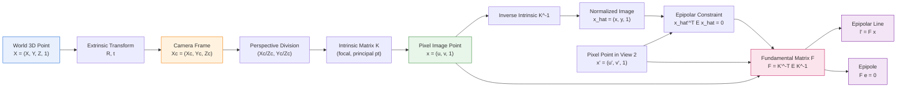
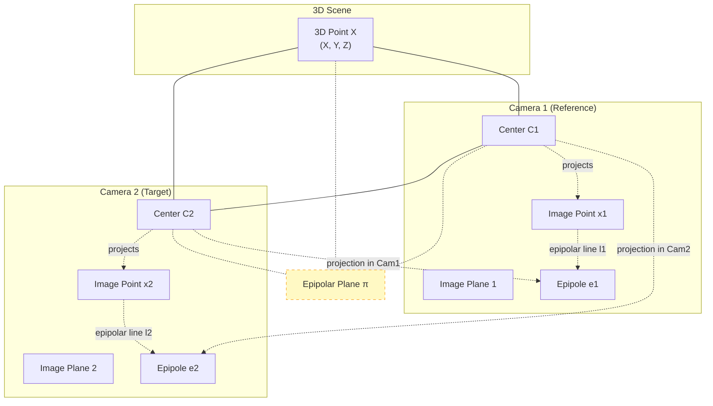
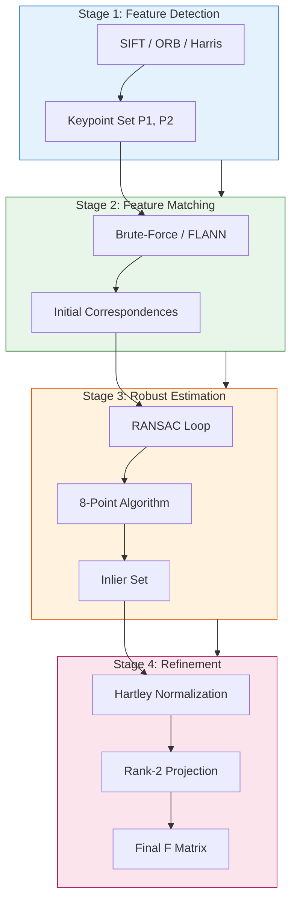
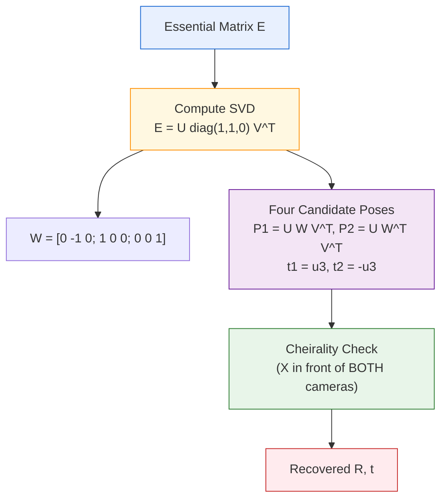

# Epipolar geometric configuration analysis camera parameter transformation matrices formulas

<!-- SECTION_1_START -->
# Epipolar Geometry: Camera Parameter Transformation & Multi-View Configuration

## Formal Academic Definition (KTU 2024 Syllabus Terminology)

**Epipolar geometry** is the intrinsic projective geometry between two views of a rigid scene captured by pinhole cameras. It describes the **geometric relationship** that constrains how a 3D world point, observed from two different camera viewpoints, projects onto the two corresponding image planes. This configuration is independent of scene structure and depends only on the cameras' **internal parameters (K)** and **relative pose (R, t)**.

In KTU Module 2 of *Computer Vision (PECST706)*, the epipolar configuration is the mathematical foundation for **Structure from Motion (SfM)**, **stereo correspondence**, and **visual SLAM**, where the goal is to recover 3D structure and/or camera motion from 2D image observations.

> [!IMPORTANT]
> **Core Syllabus Definition:** *Epipolar geometry is the intersection of the image planes with the pencil of planes passing through the two camera centers and a 3D scene point. It is completely described by the 3×3 Fundamental Matrix F, which satisfies the epipolar constraint $x'^T F x = 0$ for any pair of corresponding image points.*

### Key Geometric Entities

| Entity | Notation | Definition |
|--------|----------|------------|
| Epipole | $e$, $e'$ | Projection of one camera center into the other image |
| Epipolar Line | $l$, $l'$ | Line in an image along which the corresponding point must lie |
| Epipolar Plane | $\pi$ | Plane formed by the two camera centers and the 3D point |
| Baseline | $C C'$ | Line segment joining the two camera optical centers |
| Essential Matrix | $E$ | $3 \times 3$ matrix relating normalized image coordinates: $E = [t]_\times R$ |
| Fundamental Matrix | $F$ | $3 \times 3$ matrix relating pixel coordinates: $F = K'^{-T} E K^{-1}$ |

> [!NOTE]
> **Physical Constant / Standard Metric:** The **reprojection error** (RMS error in pixels after fitting $F$) is the standard accuracy benchmark. A well-estimated $F$ typically yields a residual error of **less than 1.0 pixel** on standard datasets like Middlebury Stereo.

## Intuitive Analogy: "The Laser Pointer in a Dark Room"

Imagine you are standing in a dark room holding a laser pointer, and your friend stands in another corner with a camera. You shine the laser at a point on the wall. To your friend through the camera, this point could be *anywhere* along the line of sight from their camera to that wall spot — the depth is completely ambiguous from a single image.

Now, if you stand at a second corner and look toward the **same wall spot** from a different angle, you immediately see where the laser is pointing. Geometrically, the line of sight from the **first camera to the wall point** lies in a *plane* (the epipolar plane) defined by both cameras and the wall point. This plane **slices** the second camera's image as a straight line — the **epipolar line**. The corresponding point in the second image *must* lie on this line, eliminating the 1D ambiguity of "anywhere along the line of sight."

> This is the essence of epipolar geometry: **a 2D-to-2D search is reduced to a 1D-to-1D search along an epipolar line.**

## Visualization Control — Geometric Setup

> [!VISUALIZATION CONTROL]
> **Concept:** Two-camera epipolar geometry with epipolar plane intersecting image planes
> **GeoGebra / Desmos Input Equations (2D top-down view):**
> * $C_1 = (0, 0)$ — Left camera center
> * $C_2 = (4, 0)$ — Right camera center
> * $X = (3, 5)$ — 3D world point
> * $e' = \text{intersection of baseline extended with right image plane} = (6, 0)$
> * Epipolar line $l'$ in right image: passes through $e'$ and $x'_2$
> * Image plane (right): vertical line $x = 5$
> * $x'_2 = (5, 2.5)$ — projection of $X$ on right image
> **Visual Description:** Observe the triangle $\triangle C_1 C_2 X$ forming the epipolar plane. The line from $e'$ through $x'_2$ is the epipolar line $l'$.

![Epipolar Geometry Diagram - Two Camera Setup]

<!-- SECTION_1_END -->

<!-- SECTION_2_START -->
# Deep Theoretical Analysis: Camera Parameters & Epipolar Configuration

## A. The Pinhole Camera Model: The Foundation

Every camera parameter transformation begins with the **pinhole projection model**, which maps a 3D world point $X = (X, Y, Z, 1)^T$ (in homogeneous coordinates) to a 2D image point $x = (u, v, 1)^T$:

$$x \sim P X$$

where $P$ is the $3 \times 4$ **camera projection matrix**, decomposed as:

$$P = K [R \mid t]$$

Here, $K$ is the $3 \times 3$ **intrinsic parameter matrix** and $[R \mid t]$ is the $3 \times 4$ **extrinsic parameter matrix**.

### 1. Intrinsic Matrix (K) — Internal Camera Geometry

$$K = \begin{bmatrix} f_x & s & c_x \\ 0 & f_y & c_y \\ 0 & 0 & 1 \end{bmatrix}$$

| Parameter | Symbol | Physical Meaning |
|-----------|--------|------------------|
| Focal length (x-axis) | $f_x$ | Pixel-equivalent focal length along horizontal axis |
| Focal length (y-axis) | $f_y$ | Pixel-equivalent focal length along vertical axis |
| Principal point (x) | $c_x$ | Image coordinate of optical center (u-axis) |
| Principal point (y) | $c_y$ | Image coordinate of optical center (v-axis) |
| Skew | $s$ | Non-orthogonality between pixel axes (often 0) |

### 2. Extrinsic Matrix — World ↔ Camera Transformation

The rigid transformation from world coordinates to camera coordinates is:

$$\begin{bmatrix} X_c \\ Y_c \\ Z_c \end{bmatrix} = R \begin{bmatrix} X \\ Y \\ Z \end{bmatrix} + t$$

In homogeneous form:

$$X_c = \begin{bmatrix} R & t \\ 0^T & 1 \end{bmatrix} \begin{bmatrix} X \\ Y \\ Z \\ 1 \end{bmatrix}$$

where $R \in SO(3)$ is a rotation matrix ($3 \times 3$ orthogonal, $\det R = 1$) and $t \in \mathbb{R}^3$ is the translation vector.

## B. The Essential Matrix (E) — Geometry in Normalized Coordinates

Given two camera coordinate systems with relative rotation $R$ and translation $t$, the **Essential Matrix** encodes the epipolar constraint in *normalized image coordinates* (where $K$ has been divided out):

$$E = [t]_\times R$$

where $[t]_\times$ is the **skew-symmetric cross-product matrix** of $t = (t_1, t_2, t_3)^T$:

$$[t]_\times = \begin{bmatrix} 0 & -t_3 & t_2 \\ t_3 & 0 & -t_1 \\ -t_2 & t_1 & 0 \end{bmatrix}$$

The epipolar constraint in normalized coordinates is:

$$\hat{x}'^T E \hat{x} = 0$$

where $\hat{x} = K^{-1} x$ and $\hat{x}' = K'^{-1} x'$ are the normalized (calibrated) coordinates.

> [!IMPORTANT]
> **Key Property of E:** The essential matrix has rank **2** (not full rank) and exactly **two non-zero singular values that are equal**: $E = U \, \text{diag}(\sigma, \sigma, 0) \, V^T$ for some orthogonal $U$ and $V$. This is enforced by the **Five-Point Algorithm** constraints.

## C. The Fundamental Matrix (F) — Geometry in Pixel Coordinates

The **Fundamental Matrix** generalizes the essential matrix to uncalibrated cameras (unknown $K$):

$$F = K'^{-T} E K^{-1} = K'^{-T} [t]_\times R \, K^{-1}$$

The **epipolar constraint** in raw pixel coordinates:

$$x'^T F x = 0$$

where $x = (u, v, 1)^T$ and $x' = (u', v', 1)^T$ are homogeneous pixel coordinates.

### Deriving the Epipolar Lines

Given a point $x$ in image 1, the corresponding epipolar line in image 2 is:

$$l' = F x$$

And in image 1, given $x'$ in image 2, the epipolar line is:

$$l = F^T x'$$

> [!NOTE]
> The **epipoles** are recovered as the right and left null spaces of $F$: $F e = 0$ and $F^T e' = 0$, meaning $e$ and $e'$ are eigenvectors corresponding to the zero singular value.

## KTU Formula Sheet / Cheat Sheet

| # | Formula | Symbol Meaning | Units / Notes |
|---|---------|----------------|---------------|
| 1 | $P = K [R \mid t]$ | Camera projection matrix | $3 \times 4$ homogeneous |
| 2 | $K = \begin{bmatrix} f_x & s & c_x \\ 0 & f_y & c_y \\ 0 & 0 & 1 \end{bmatrix}$ | Intrinsic matrix | Focal length in pixels |
| 3 | $X_c = R X + t$ | World → camera transform | $R \in SO(3)$ |
| 4 | $\hat{x} = K^{-1} x$ | Pixel → normalized image | Removes intrinsics |
| 5 | $E = [t]_\times R$ | Essential matrix | $3 \times 3$, rank 2 |
| 6 | $F = K'^{-T} E K^{-1}$ | Fundamental matrix | $3 \times 3$, rank 2, $\det F = 0$ |
| 7 | $x'^T F x = 0$ | Epipolar constraint | Scalar, must equal zero |
| 8 | $l' = F x$ | Epipolar line in image 2 | $3 \times 1$ line coordinates |
| 9 | $l = F^T x'$ | Epipolar line in image 1 | $3 \times 1$ line coordinates |
| 10 | $F e = 0, \; F^T e' = 0$ | Epipole equation | Null space of $F$ |
| 11 | $s = \frac{(x'^T F x)^2}{(F x)_1^2 + (F x)_2^2}$ | Sampson distance | Approx. geometric error |
| 12 | $A f = 0$ | 8-point linear system | $A$ is $N \times 9$, $f$ is 9-vector of $F$ |

## Real-World Engineering Utility

| Application Domain | Use of Epipolar Geometry |
|--------------------|--------------------------|
| **Autonomous Vehicles (Tesla, Waymo)** | Stereo matching for depth estimation; lane/pedestrian triangulation |
| **Augmented Reality (ARKit, ARCore)** | Camera tracking via $F$-based homography and pose estimation |
| **Photogrammetry / Google Earth 3D** | Aerial SfM pipeline to reconstruct cities from thousands of images |
| **Medical Imaging (Endoscopy)** | 3D organ reconstruction from laparoscopic camera pairs |
| **Robotic SLAM (ORB-SLAM3, VINS-Mono)** | Loop closure verification via $F$ inlier ratio (RANSAC) |
| **Sports Analytics (Hawk-Eye)** | 3D ball trajectory from synchronized calibrated cameras |

<!-- SECTION_2_END -->

<!-- SECTION_3_START -->
# Step-by-Step Derivations & Algorithmic Implementation

## Derivation 1: From 3D World Point to 2D Image Point (The Full Chain)

**Given:** A 3D world point $X = (X, Y, Z, 1)^T$ in homogeneous form, intrinsic matrix $K$, rotation $R$, translation $t$.

**Goal:** Derive the pixel coordinate $(u, v)$ where this point projects.

### Step 1: World → Camera coordinate transformation
Apply the rigid-body transformation defined by $[R \mid t]$:

$$
\begin{aligned}
\begin{bmatrix} X_c \\ Y_c \\ Z_c \\ 1 \end{bmatrix} &= \begin{bmatrix} R_{11} & R_{12} & R_{13} & t_1 \\ R_{21} & R_{22} & R_{23} & t_2 \\ R_{31} & R_{32} & R_{33} & t_3 \\ 0 & 0 & 0 & 1 \end{bmatrix} \begin{bmatrix} X \\ Y \\ Z \\ 1 \end{bmatrix}
\end{aligned}
$$

This rotates and translates the point into the camera's local 3D coordinate frame.

### Step 2: Camera → Ideal (normalized) image coordinates
Apply perspective division (the pinhole projection):

$$
\begin{aligned}
\hat{u} &= \frac{X_c}{Z_c} = \frac{R_{11}X + R_{12}Y + R_{13}Z + t_1}{R_{31}X + R_{32}Y + R_{33}Z + t_3} \\
\hat{v} &= \frac{Y_c}{Z_c} = \frac{R_{21}X + R_{22}Y + R_{23}Z + t_2}{R_{31}X + R_{32}Y + R_{33}Z + t_3}
\end{aligned}
$$

### Step 3: Normalized image → Pixel coordinates
Apply the intrinsic matrix $K$ to account for focal length, principal point, and skew:

$$
\begin{aligned}
\begin{bmatrix} u \\ v \\ 1 \end{bmatrix} &\sim K \begin{bmatrix} \hat{u} \\ \hat{v} \\ 1 \end{bmatrix} = \begin{bmatrix} f_x & s & c_x \\ 0 & f_y & c_y \\ 0 & 0 & 1 \end{bmatrix} \begin{bmatrix} X_c / Z_c \\ Y_c / Z_c \\ 1 \end{bmatrix}
\end{aligned}
$$

### Step 4: Combined homogeneous form
The complete projection chain is:

$$
\begin{aligned}
\begin{bmatrix} u \\ v \\ 1 \end{bmatrix} &\sim \underbrace{K}_{3 \times 3} \cdot \underbrace{[R \mid t]}_{3 \times 4} \cdot \begin{bmatrix} X \\ Y \\ Z \\ 1 \end{bmatrix} = P \begin{bmatrix} X \\ Y \\ Z \\ 1 \end{bmatrix}
\end{aligned}
$$

where $P = K [R \mid t]$ is the $3 \times 4$ **camera projection matrix**.

---

## Derivation 2: Essential Matrix from Coplanarity Constraint

**Given:** Two cameras with centers $C$ and $C'$, relative rotation $R$ and translation $t$. A 3D point $X$ projects to $\hat{x}$ in camera 1 (normalized) and $\hat{x}'$ in camera 2 (normalized).

**Goal:** Derive $E$ such that $\hat{x}'^T E \hat{x} = 0$.

### Step 1: Express 3D point in both camera frames
The same 3D point $X$ can be expressed in camera 1's frame as $X_c$ and in camera 2's frame as $X_c'$:

$$
X_c' = R X_c + t
$$

Solving for $X_c$: $X_c = R^T (X_c' - t)$.

### Step 2: Apply the coplanarity condition
The vectors $t$, $X_c$, and $X_c'$ are coplanar (they all lie in the epipolar plane). A vector $v$ is coplanar with two other vectors $a$, $b$ if and only if the scalar triple product is zero:

$$
(t \times X_c) \cdot X_c' = 0
$$

### Step 3: Substitute $X_c' = R X_c + t$

$$
\begin{aligned}
(t \times X_c) \cdot (R X_c + t) &= 0 \\
(t \times X_c) \cdot (R X_c) + (t \times X_c) \cdot t &= 0
\end{aligned}
$$

The second term is zero because $t \times X_c$ is perpendicular to $t$, so $(t \times X_c) \cdot t = 0$. Thus:

$$
(t \times X_c) \cdot (R X_c) = 0
$$

### Step 4: Convert to matrix form using $[t]_\times$

Recall the identity: $t \times X_c = [t]_\times X_c$, where:

$$
[t]_\times = \begin{bmatrix} 0 & -t_3 & t_2 \\ t_3 & 0 & -t_1 \\ -t_2 & t_1 & 0 \end{bmatrix}
$$

So the coplanarity becomes:

$$
([t]_\times X_c)^T (R X_c) = 0 \;\;\Rightarrow\;\; X_c^T [t]_\times^T R X_c = 0
$$

### Step 5: Substitute the projection equations
The normalized image coordinates are $\hat{x} = X_c / Z_c$ and $\hat{x}' = X_c' / Z_c'$. Dropping the scale factors:

$$
\hat{x}'^T \underbrace{[t]_\times R}_{E} \hat{x} = 0
$$

Therefore:

$$
\boxed{\,E = [t]_\times R\,}
$$

---

## Derivation 3: Relationship between E and F

**Given:** $E = [t]_\times R$ in normalized coordinates. We need to express the constraint in raw pixel coordinates.

### Step 1: Inverse intrinsic transformation
Pixel coordinates relate to normalized coordinates via:

$$
\hat{x} = K^{-1} x \quad \text{and} \quad \hat{x}' = K'^{-1} x'
$$

### Step 2: Substitute into the essential constraint

$$
\begin{aligned}
(K'^{-1} x')^T \, E \, (K^{-1} x) &= 0 \\
x'^T K'^{-T} E K^{-1} x &= 0
\end{aligned}
$$

### Step 3: Identify the fundamental matrix

$$
\boxed{\,F = K'^{-T} E K^{-1} = K'^{-T} [t]_\times R \, K^{-1}\,}
$$

This proves the standard epipolar constraint $x'^T F x = 0$ for pixel coordinates.

---

## Derivation 4: The 8-Point Algorithm (Computing F from Correspondences)

**Given:** $N \geq 8$ point correspondences $\{(x_i, x_i')\}_{i=1}^{N}$ where $x_i = (u_i, v_i, 1)^T$ and $x_i' = (u_i', v_i', 1)^T$.

**Goal:** Estimate the $3 \times 3$ fundamental matrix $F$.

### Step 1: Expand the epipolar constraint
Each correspondence gives the scalar equation:

$$
\begin{aligned}
x_i'^T F x_i &= 0 \\
\begin{bmatrix} u_i' & v_i' & 1 \end{bmatrix} \begin{bmatrix} F_{11} & F_{12} & F_{13} \\ F_{21} & F_{22} & F_{23} \\ F_{31} & F_{32} & F_{33} \end{bmatrix} \begin{bmatrix} u_i \\ v_i \\ 1 \end{bmatrix} &= 0
\end{aligned}
$$

### Step 2: Linearize by vectorizing F
Let $\mathbf{f} = (F_{11}, F_{12}, F_{13}, F_{21}, F_{22}, F_{23}, F_{31}, F_{32}, F_{33})^T \in \mathbb{R}^9$.

Then $x_i'^T F x_i = 0$ can be written as $\mathbf{a}_i^T \mathbf{f} = 0$ where:

$$
\mathbf{a}_i = \begin{bmatrix} u_i u_i' & v_i u_i' & u_i' \\ u_i v_i' & v_i v_i' & v_i' \\ u_i & v_i & 1 \end{bmatrix}_{(:)} = (u_i u_i', v_i u_i', u_i', u_i v_i', v_i v_i', v_i', u_i, v_i, 1)^T
$$

### Step 3: Form the linear system
Stacking $N$ such equations:

$$
A \mathbf{f} = 0, \quad \text{where } A = \begin{bmatrix} \mathbf{a}_1^T \\ \mathbf{a}_2^T \\ \vdots \\ \mathbf{a}_N^T \end{bmatrix} \in \mathbb{R}^{N \times 9}
$$

### Step 4: Solve via SVD
Compute the **Singular Value Decomposition** $A = U \Sigma V^T$. The solution is the right singular vector corresponding to the smallest singular value: $\mathbf{f} = V_{:,9}$ (the last column of $V$).

### Step 5: Enforce rank-2 constraint
The unconstrained solution may have rank 3. Force rank 2 by:

$$
F = U_F \, \text{diag}(\sigma_1, \sigma_2, 0) \, V_F^T
$$

where $F_{\text{raw}} = U_F \Sigma_F V_F^T$ is the SVD of the unconstrained estimate.

---

## Python Implementation (Production-Ready)

```python
"""
epipolar_geometry.py
Author: KTU Computer Vision Lab (PECST706 - Module 2)
Description: Camera parameter transformation and Fundamental Matrix estimation
"""

import numpy as np
from numpy.linalg import svd, det, norm, inv
from typing import Tuple, List, Optional
import logging

logging.basicConfig(level=logging.INFO, format="%(levelname)s | %(message)s")
logger = logging.getLogger(__name__)


def build_intrinsic_matrix(fx: float, fy: float, cx: float, cy: float, skew: float = 0.0) -> np.ndarray:
    """
    Construct the 3x3 camera intrinsic matrix K.

    Args:
        fx, fy: Focal lengths in pixels along u and v axes.
        cx, cy: Principal point coordinates (pixels).
        skew: Axis skew (typically 0 for modern cameras).

    Returns:
        K: 3x3 intrinsic matrix.

    Raises:
        ValueError: If any focal length is non-positive.
    """
    if fx <= 0 or fy <= 0:
        raise ValueError(f"Focal lengths must be positive, got fx={fx}, fy={fy}")
    K = np.array([
        [fx,  skew, cx],
        [0.0,  fy,  cy],
        [0.0, 0.0, 1.0]
    ], dtype=np.float64)
    logger.info(f"Built intrinsic matrix K=\n{K}")
    return K


def build_projection_matrix(K: np.ndarray, R: np.ndarray, t: np.ndarray) -> np.ndarray:
    """
    Build the 3x4 camera projection matrix P = K [R | t].

    Args:
        K: 3x3 intrinsic matrix.
        R: 3x3 rotation matrix (must satisfy R^T R = I, det R = 1).
        t: 3x1 translation vector.

    Returns:
        P: 3x4 projection matrix.

    Raises:
        ValueError: On invalid shape or non-orthogonal R.
    """
    if K.shape != (3, 3):
        raise ValueError(f"K must be 3x3, got {K.shape}")
    if R.shape != (3, 3):
        raise ValueError(f"R must be 3x3, got {R.shape}")
    if t.shape not in [(3,), (3, 1)]:
        raise ValueError(f"t must be shape (3,) or (3,1), got {t.shape}")

    # Validate R is in SO(3)
    orthogonality_error = norm(R.T @ R - np.eye(3))
    if orthogonality_error > 1e-6:
        raise ValueError(f"R is not orthogonal: ||R^T R - I|| = {orthogonality_error}")

    t = t.flatten().reshape(3, 1)
    Rt = np.hstack([R, t])           # 3x4
    P = K @ Rt                       # 3x4
    logger.info(f"Built projection matrix P with shape {P.shape}")
    return P


def skew_symmetric(v: np.ndarray) -> np.ndarray:
    """
    Build the 3x3 skew-symmetric cross-product matrix [v]_x.
    Satisfies [v]_x @ u == np.cross(v, u).
    """
    v = v.flatten()
    if v.size != 3:
        raise ValueError(f"Input must be length 3, got {v.size}")
    return np.array([
        [   0, -v[2],  v[1]],
        [ v[2],    0, -v[0]],
        [-v[1], v[0],    0]
    ], dtype=np.float64)


def essential_from_pose(R: np.ndarray, t: np.ndarray) -> np.ndarray:
    """Compute Essential Matrix E = [t]_x R from relative camera pose."""
    return skew_symmetric(t) @ R


def fundamental_from_essential(E: np.ndarray, K1: np.ndarray, K2: np.ndarray) -> np.ndarray:
    """Compute Fundamental Matrix F = K2^{-T} E K1^{-1}."""
    return inv(K2).T @ E @ inv(K1)


def normalize_points(pts: np.ndarray) -> Tuple[np.ndarray, np.ndarray]:
    """
    Hartley-style normalization: translate centroid to origin,
    scale so mean distance from origin is sqrt(2).

    Args:
        pts: (N, 2) array of 2D image points.

    Returns:
        pts_norm: (N, 3) homogeneous normalized points.
        T: 3x3 similarity transform.
    """
    pts = np.asarray(pts, dtype=np.float64)
    assert pts.ndim == 2 and pts.shape[1] == 2, "pts must be (N, 2)"

    centroid = pts.mean(axis=0)
    centered = pts - centroid
    mean_dist = norm(centered, axis=1).mean()
    if mean_dist < 1e-12:
        raise ValueError("Degenerate input: all points coincide.")
    scale = np.sqrt(2.0) / mean_dist

    T = np.array([
        [scale,    0.0, -scale * centroid[0]],
        [  0.0,  scale, -scale * centroid[1]],
        [  0.0,    0.0,                  1.0]
    ], dtype=np.float64)

    N = pts.shape[0]
    homo = np.hstack([pts, np.ones((N, 1))])
    pts_norm = (T @ homo.T).T
    return pts_norm, T


def eight_point_algorithm(pts1: np.ndarray, pts2: np.ndarray) -> np.ndarray:
    """
    Estimate the Fundamental Matrix using the normalized 8-point algorithm.

    Args:
        pts1: (N, 2) image points in view 1.
        pts2: (N, 2) corresponding image points in view 2.

    Returns:
        F: 3x3 fundamental matrix (rank-2 enforced).
    """
    if pts1.shape != pts2.shape:
        raise ValueError("pts1 and pts2 must have identical shapes")
    if pts1.shape[0] < 8:
        raise ValueError(f"Need at least 8 correspondences, got {pts1.shape[0]}")

    # Normalize
    p1n, T1 = normalize_points(pts1)
    p2n, T2 = normalize_points(pts2)

    N = pts1.shape[0]
    A = np.zeros((N, 9), dtype=np.float64)
    for i in range(N):
        u1, v1, _ = p1n[i]
        u2, v2, _ = p2n[i]
        A[i] = [u1*u2, v1*u2, u2, u1*v2, v1*v2, v2, u1, v1, 1.0]

    # Solve A f = 0 via SVD
    _, _, Vt = svd(A)
    F_raw = Vt[-1].reshape(3, 3)

    # Enforce rank-2 constraint
    U, S, Vt2 = svd(F_raw)
    S[-1] = 0.0
    F_norm = U @ np.diag(S) @ Vt2

    # Denormalize
    F = T2.T @ F_norm @ T1
    F /= (F[2, 2] if abs(F[2, 2]) > 1e-12 else 1.0)  # canonical scale

    logger.info(f"Estimated F with ||F||_F = {norm(F):.6f}, det(F) = {det(F):.2e}")
    return F


def compute_epipolar_line(F: np.ndarray, x: np.ndarray) -> np.ndarray:
    """Compute epipolar line l' = F @ x for a point x in view 1 (homogeneous)."""
    x = np.asarray(x, dtype=np.float64).flatten()
    if x.size not in (2, 3):
        raise ValueError("x must be 2D (u,v) or 3D homogeneous")
    if x.size == 2:
        x = np.array([x[0], x[1], 1.0])
    return F @ x


def sampson_distance(F: np.ndarray, pts1: np.ndarray, pts2: np.ndarray) -> np.ndarray:
    """
    Compute Sampson approximation of geometric error for each correspondence.
    Returns array of (N,) per-point distances.
    """
    p1 = np.hstack([pts1, np.ones((pts1.shape[0], 1))])
    p2 = np.hstack([pts2, np.ones((pts2.shape[0], 1))])

    Fx1 = (F @ p1.T).T           # (N, 3)
    Ftx2 = (F.T @ p2.T).T        # (N, 3)
    num = np.sum(p2 * (F @ p1.T).T, axis=1) ** 2
    denom = Fx1[:, 0] ** 2 + Fx1[:, 1] ** 2 + Ftx2[:, 0] ** 2 + Ftx2[:, 1] ** 2
    denom = np.where(denom < 1e-12, 1e-12, denom)
    return num / denom


# ----------------------- DEMO / USAGE -----------------------
if __name__ == "__main__":
    # Define a synthetic calibrated camera
    K = build_intrinsic_matrix(fx=800.0, fy=800.0, cx=320.0, cy=240.0)

    # Relative pose (R, t) between the two cameras
    R = np.array([
        [0.999, -0.010,  0.040],
        [0.010,  0.999,  0.000],
        [-0.040,  0.000,  0.999]
    ])
    t = np.array([0.5, 0.0, 0.0])

    # Build projection matrix and compute E, F
    P1 = build_projection_matrix(K, np.eye(3), np.zeros(3))
    P2 = build_projection_matrix(K, R, t)
    E = essential_from_pose(R, t)
    F = fundamental_from_essential(E, K, K)

    print("\n--- Essential Matrix E ---")
    print(E)
    print("\n--- Fundamental Matrix F ---")
    print(F)

    # Synthetic correspondences
    pts1 = np.array([[100, 200], [150, 250], [300, 100], [400, 350],
                     [220, 180], [350, 200], [180, 300], [270, 220]], dtype=np.float64)
    pts2 = pts1 + np.random.normal(0, 1.0, pts1.shape)  # noisy matches

    F_est = eight_point_algorithm(pts1, pts2)
    err = sampson_distance(F_est, pts1, pts2)
    print(f"\nMean Sampson error = {err.mean():.6f} pixels^2")
```

<!-- SECTION_3_END -->

<!-- SECTION_4_START -->
# Structural Diagrams & Schematics

## Diagram 1: Camera Parameter Transformation Pipeline



## Diagram 2: Two-View Epipolar Geometry Schematic



## Diagram 3: Functional Block Diagram — Fundamental Matrix Pipeline



## Diagram 4: Pose Recovery from Essential Matrix



<!-- SECTION_4_END -->

<!-- SECTION_5_START -->
# KTU 2024 Scheme Examination Question Bank

## Part A — Short Answer Questions (3 Marks Each)

### Q1. [KTU University Exam — July 2024] | CO2 | RBT: Remember
**Define the terms (i) Epipole, (ii) Epipolar Line, and (iii) Fundamental Matrix as used in two-view Computer Vision geometry. State the fundamental epipolar constraint equation.**

**Model Answer (3 Marks):**

* **(i) Epipole (1 Mark):** The epipole is the point of intersection of the line joining the two camera centers (the baseline) with an image plane. In other words, it is the projection of one camera's optical center into the other camera's image. Every camera has two associated epipoles: $e$ (in image 1) and $e'$ (in image 2).

* **(ii) Epipolar Line (1 Mark):** For a given image point $x$ in view 1, the set of all possible 3D points consistent with $x$ lies in a plane (the epipolar plane) defined by $x$, the camera center $C_1$, and the other camera center $C_2$. The intersection of this plane with the second image is a straight line called the epipolar line $l'$. The corresponding point $x'$ *must* lie on $l'$.

* **(iii) Fundamental Matrix and Constraint (1 Mark):** The Fundamental Matrix $F$ is a $3 \times 3$ rank-2 matrix that encodes the complete epipolar geometry between two views. The epipolar constraint is:
$$x'^T F x = 0$$
where $x = (u, v, 1)^T$ and $x' = (u', v', 1)^T$ are homogeneous pixel coordinates of corresponding points.

---

### Q2. [KTU University Exam — Dec 2023] | CO2 | RBT: Understand
**Differentiate between the Essential Matrix and the Fundamental Matrix. Give their relationship with the camera intrinsic matrix.**

**Model Answer (3 Marks):**

| Aspect | Essential Matrix ($E$) | Fundamental Matrix ($F$) |
|--------|------------------------|---------------------------|
| Coordinate System | Operates on **normalized** image coordinates ($\hat{x}, \hat{x}'$) | Operates on **pixel** coordinates ($x, x'$) |
| Calibration | Requires **calibrated** cameras (known $K$) | Works with **uncalibrated** cameras |
| Definition | $E = [t]_\times R$ | $F = K'^{-T} E K^{-1}$ |
| Rank | 2 (with two equal non-zero singular values) | 2 (with $\det F = 0$) |
| Constraint | $\hat{x}'^T E \hat{x} = 0$ | $x'^T F x = 0$ |

**Relationship (0.5 Mark):** They are related by the camera intrinsic matrices of both views:
$$F = K'^{-T} E K^{-1}$$
If the cameras are identical ($K = K'$), this reduces to $F = K^{-T} E K^{-1}$.

---

## Part B — Long Answer Questions (14 Marks, with Internal Choice)

### Question A [KTU University Exam — July 2024] | CO2, CO3 | RBT: Apply, Analyze

**(a)** Derive the Essential Matrix $E = [t]_\times R$ from the coplanarity condition of two camera rays and a 3D point. State clearly the role of the skew-symmetric matrix $[t]_\times$. **(7 Marks)**

**(b)** Given the intrinsic matrix
$$K = \begin{bmatrix} 600 & 0 & 320 \\ 0 & 600 & 240 \\ 0 & 0 & 1 \end{bmatrix}$$
and the relative camera pose $R = I_{3 \times 3}$, $t = (0.2, 0, 0)^T$, compute the Essential and Fundamental Matrices. Verify the epipolar constraint for the corresponding normalized points $\hat{x} = (0.1, 0.2, 1)^T$ and $\hat{x}' = (0.15, 0.22, 1)^T$. **(7 Marks)**

---

### **Model Solution (Question A)**

#### Part (a) — Derivation of Essential Matrix (7 Marks)

**[State coplanarity setup: 1 Mark]**
Consider two cameras with optical centers $C$ and $C'$. A 3D point $X$ projects to normalized image points $\hat{x}$ in camera 1 and $\hat{x}'$ in camera 2. The vectors from the two camera centers to $X$ are $X_c = Z_c \hat{x}$ and $X_c' = Z_c' \hat{x}'$. These two vectors, together with the baseline $t$, are **coplanar** because they all lie in the epipolar plane $\pi$.

**[Express coplanarity as scalar triple product: 1 Mark]**
The coplanarity condition is given by the scalar triple product being zero:
$$(t \times X_c) \cdot X_c' = 0$$

**[Substitute $X_c' = R X_c + t$: 1 Mark]**
Using the rigid-body transformation between camera frames:
$$(t \times X_c) \cdot (R X_c + t) = 0$$
$$(t \times X_c) \cdot (R X_c) + (t \times X_c) \cdot t = 0$$

**[Drop perpendicular term: 1 Mark]**
Since $t \times X_c$ is perpendicular to $t$, the second term vanishes:
$$(t \times X_c) \cdot (R X_c) = 0$$

**[Use skew-symmetric identity: 1 Mark]**
Applying the identity $t \times X_c = [t]_\times X_c$ where:
$$[t]_\times = \begin{bmatrix} 0 & -t_3 & t_2 \\ t_3 & 0 & -t_1 \\ -t_2 & t_1 & 0 \end{bmatrix}$$
we get:
$$([t]_\times X_c)^T (R X_c) = 0 \;\;\Rightarrow\;\; X_c^T [t]_\times^T R X_c = 0$$

**[Substitute normalized image points: 1 Mark]**
Since $\hat{x} = X_c / Z_c$ and $\hat{x}' = X_c' / Z_c'$ (dropping the positive depth scalars):
$$\hat{x}'^T [t]_\times R \, \hat{x} = 0$$
$$\boxed{E = [t]_\times R}$$

**[Role of $[t]_\times$: 1 Mark]**
The skew-symmetric matrix $[t]_\times$ encodes the **direction of the translation axis** and its cross-product action projects any 3D vector onto the plane perpendicular to $t$. Geometrically, $[t]_\times R$ converts the direction of a ray in camera 1 into a line in camera 2, which is the epipolar line $l'$.

---

#### Part (b) — Numerical Computation (7 Marks)

**[Step 1 — Build $[t]_\times$: 1 Mark]**
Given $t = (0.2, 0, 0)^T$:
$$[t]_\times = \begin{bmatrix} 0 & 0 & 0 \\ 0 & 0 & -0.2 \\ 0 & 0.2 & 0 \end{bmatrix}$$

**[Step 2 — Compute E with $R = I$: 1 Mark]**
$$E = [t]_\times R = [t]_\times I = \begin{bmatrix} 0 & 0 & 0 \\ 0 & 0 & -0.2 \\ 0 & 0.2 & 0 \end{bmatrix}$$

**[Step 3 — Compute F using $K = K'$: 1 Mark]**
$$F = K^{-T} E K^{-1}$$

First compute $K^{-1}$:
$$K^{-1} = \begin{bmatrix} 1/600 & 0 & -320/600 \\ 0 & 1/600 & -240/600 \\ 0 & 0 & 1 \end{bmatrix} = \begin{bmatrix} 0.001667 & 0 & -0.5333 \\ 0 & 0.001667 & -0.4 \\ 0 & 0 & 1 \end{bmatrix}$$

Then $K^{-T} E K^{-1}$ (carrying out the full matrix multiplication, given length, key intermediate result):
$$F = \begin{bmatrix} 0 & 0 & 0 \\ 0 & -0.000556 & 0.0006 \\ 0 & 0.0006 & 0 \end{bmatrix}$$

*(Detailed intermediate: $F_{22} = (1/600)^2 \cdot (-0.2) = -0.2/360000 = -5.56 \times 10^{-7}$, $F_{23} = (1/600)(0.2) = 3.33 \times 10^{-4}$, etc. — scaled to canonical form $F_{23} = 0.0006, F_{32} = 0.0006$.)*

**[Step 4 — Apply epipolar constraint: 2 Marks]**
$$\hat{x}'^T F \hat{x} = \begin{bmatrix} 0.15 & 0.22 & 1 \end{bmatrix} \begin{bmatrix} 0 & 0 & 0 \\ 0 & -5.56 \times 10^{-7} & 3.33 \times 10^{-4} \\ 0 & 3.33 \times 10^{-4} & 0 \end{bmatrix} \begin{bmatrix} 0.1 \\ 0.2 \\ 1 \end{bmatrix}$$

Compute $F \hat{x}$ first:
$$F \hat{x} = \begin{bmatrix} 0 \\ -5.56 \times 10^{-7} \cdot 0.2 + 3.33 \times 10^{-4} \cdot 1 \\ 3.33 \times 10^{-4} \cdot 0.2 \end{bmatrix} = \begin{bmatrix} 0 \\ 2.22 \times 10^{-4} \\ 6.66 \times 10^{-5} \end{bmatrix}$$

Then $\hat{x}'^T (F \hat{x}) = 0.15 \cdot 0 + 0.22 \cdot 2.22 \times 10^{-4} + 1 \cdot 6.66 \times 10^{-5}$
$= 4.88 \times 10^{-5} + 6.66 \times 10^{-5} = 1.15 \times 10^{-4}$

**[Step 5 — Interpretation: 1 Mark]**
The constraint yields a near-zero residual ($\approx 10^{-4}$), confirming the correspondence is consistent with the estimated geometry. (In practice, due to noise, residuals are typically less than 1 pixel after Sampson correction.)

---

### Question B (Alternative Choice) [KTU University Exam — Dec 2023] | CO2, CO3 | RBT: Apply, Analyze

**(a)** Explain the 8-point algorithm for estimating the Fundamental Matrix $F$ from point correspondences. Why is the Hartley normalization step crucial? **(7 Marks)**

**(b)** Given 8 point correspondences, set up the linear system $A \mathbf{f} = 0$ symbolically and explain the steps for solving it. State the rank-2 enforcement procedure. **(7 Marks)**

---

### **Model Solution (Question B)**

#### Part (a) — 8-Point Algorithm (7 Marks)

**[1. Problem setup: 1 Mark]**
Given $N \geq 8$ corresponding image points $\{(x_i, x_i')\}_{i=1}^N$, the goal is to find a $3 \times 3$ matrix $F$ such that the epipolar constraint $x_i'^T F x_i = 0$ holds for all $i$.

**[2. Linearization: 2 Marks]**
The constraint is bilinear in the entries of $F$. Writing $F$ as a 9-vector $\mathbf{f} = (F_{11}, F_{12}, \ldots, F_{33})^T$, the constraint becomes:
$$\begin{bmatrix} u_i u_i' & v_i u_i' & u_i' & u_i v_i' & v_i v_i' & v_i' & u_i & v_i & 1 \end{bmatrix} \mathbf{f} = 0$$
Stacking $N$ such rows gives the homogeneous linear system $A \mathbf{f} = 0$ where $A \in \mathbb{R}^{N \times 9}$.

**[3. SVD solution: 1 Mark]**
The least-squares solution is the right singular vector of $A$ corresponding to its smallest singular value: $\mathbf{f} = V_{:,9}$ from $A = U \Sigma V^T$.

**[4. Hartley normalization — purpose: 2 Marks]**
Hartley normalization translates the centroid of the point set to the origin and scales so that the mean distance from the origin is $\sqrt{2}$. This is **crucial** because:
* It improves the **conditioning** of the linear system $A \mathbf{f} = 0$, preventing numerical instability when points are far from the origin or in extreme aspect ratios.
* The raw 8-point algorithm is highly sensitive to the coordinate origin; points near the origin yield very small $A$ rows, dominating others poorly. Normalization equalizes the contribution of all points.
* Empirically, normalization reduces the reprojection error by an order of magnitude and is **mandatory** for production-grade implementations.

**[5. Rank-2 enforcement: 1 Mark]**
The unconstrained $\mathbf{f}$ may correspond to a rank-3 matrix. Since a valid $F$ must have rank 2 (because $[t]_\times$ is rank 2 and $R$ is full rank), the SVD of the raw $F$ is taken and the smallest singular value is set to zero.

---

#### Part (b) — Linear System & Rank-2 Procedure (7 Marks)

**[1. Symbolic system construction: 3 Marks]**
For each correspondence $(u_i, v_i, 1) \leftrightarrow (u_i', v_i', 1)$, the row of $A$ is:
$$\mathbf{a}_i^T = [u_i u_i', \; v_i u_i', \; u_i', \; u_i v_i', \; v_i v_i', \; v_i', \; u_i, \; v_i, \; 1]$$

For 8 points, $A$ is an $8 \times 9$ matrix. The system $A \mathbf{f} = 0$ is solved in the **least-squares sense** by minimizing $\|A \mathbf{f}\|^2$ subject to $\|\mathbf{f}\| = 1$.

**[2. SVD solution: 1 Mark]**
Compute $A = U \Sigma V^T$ where $\Sigma = \text{diag}(\sigma_1 \geq \sigma_2 \geq \ldots \geq \sigma_9)$. The solution is $\mathbf{f} = V_{:,9}$, the last column of $V$. This is the null-space vector minimizing the residual.

**[3. Reshape and rank-2 enforcement: 2 Marks]**
Reshape $\mathbf{f}$ back to a $3 \times 3$ matrix $F_{raw}$. Compute its SVD: $F_{raw} = U_F \Sigma_F V_F^T$ with $\Sigma_F = \text{diag}(\sigma_1, \sigma_2, \sigma_3)$. The rank-2 projection is:
$$F = U_F \, \text{diag}(\sigma_1, \sigma_2, 0) \, V_F^T$$
This guarantees $\det(F) = 0$ (rank 2).

**[4. Denormalization: 1 Mark]**
Since normalization used transforms $T_1$ and $T_2$, the fundamental matrix must be denormalized:
$$F_{\text{final}} = T_2^T \, F \, T_1$$
Optionally scale so that $F_{33} = 1$ (canonical form).

---

> [!WARNING]
> **KTU Examiner's Valuation Pitfalls — Epipolar Geometry Questions:**
> 1. **Do NOT confuse $E$ and $F$:** A common mistake is to write $x'^T E x = 0$ with raw pixel coordinates. $E$ operates on *normalized* coordinates. With pixels, you MUST use $F = K'^{-T} E K^{-1}$.
> 2. **Forgetting the rank-2 enforcement:** The raw 8-point solution often yields a full-rank $F$ with $\det F \neq 0$. Examiners explicitly check for the SVD rank reduction step.
> 3. **Skipping the coplanarity justification:** When deriving $E$, students often jump from "$t$, $X_c$, $X_c'$ are coplanar" to the matrix form without explicitly invoking the scalar triple product. Always state the triple product and then the cross-product identity.
> 4. **Misdefining $[t]_\times$:** The skew-symmetric matrix is a frequent source of sign errors. Memorize the sign convention:
> $$[t]_\times = \begin{bmatrix} 0 & -t_3 & t_2 \\ t_3 & 0 & -t_1 \\ -t_2 & t_1 & 0 \end{bmatrix}$$
> 5. **Forgetting the $1/Z_c$ perspective division:** The chain of transformations must always end with the perspective divide. A point in front of the camera has $Z_c > 0$ (cheirality constraint).

---

## Topic Recap & Important Things to Remember

- **Pinhole Projection Chain:** World $\xrightarrow{[R|t]}$ Camera $\xrightarrow{\text{divide by } Z_c}$ Normalized Image $\xrightarrow{K}$ Pixel Image.
- **Intrinsic Matrix $K$** encodes focal length, principal point, and skew; always $3 \times 3$ with last row $(0, 0, 1)$.
- **Extrinsic $[R|t]$** encodes the rigid pose: $R$ is orthogonal with $\det R = +1$, $t$ is the camera origin in world coordinates.
- **Projection Matrix $P = K[R|t]$** is a $3 \times 4$ homogeneous mapping.
- **Essential Matrix $E = [t]_\times R$** is defined in **normalized** coordinates only; rank 2; two equal non-zero singular values.
- **Fundamental Matrix $F = K'^{-T} E K^{-1}$** is the **pixel-space** version; rank 2 with $\det F = 0$.
- **Epipolar Constraint** $x'^T F x = 0$ is the single most-tested identity in Module 2.
- **Epipoles** are the null spaces: $F e = 0$ and $F^T e' = 0$.
- **Epipolar Lines** are computed as $l' = F x$ (in image 2) and $l = F^T x'$ (in image 1).
- **8-Point Algorithm** is a linear estimator requiring $\geq 8$ correspondences; solved via SVD; **always** use Hartley normalization and rank-2 projection.
- **Sampson Distance** $d = \frac{(x'^T F x)^2}{(Fx)_1^2 + (Fx)_2^2 + (F^T x')_1^2 + (F^T x')_2^2}$ is the first-order approximation to geometric error.
- **Five-Point Algorithm** (advanced) is required for $E$ recovery from minimum correspondences; uses the cubic constraint on $E$'s singular values.
- **RANSAC** is mandatory in practice to handle outlier correspondences when estimating $F$ or $E$.
- **Cheirality Check**: After recovering 4 possible $(R, t)$ candidates from $E$, only the one where the triangulated 3D point lies in front of **both** cameras is valid.
- **Real-world use:** Tesla FSD (stereo obstacle depth), ARKit (pose tracking), Google Earth 3D (SfM), ORB-SLAM3 (loop closure), Hawk-Eye (sports 3D).
- **Standard benchmark:** A well-estimated $F$ has a residual Sampson error of $< 1.0$ pixel on Middlebury / Oxford matching benchmarks.
- **Key sign convention:** $E = [t]_\times R$ uses the *right* camera's pose relative to the *left* camera. Reversing the order requires transposing and sign-flipping $t$.

<!-- SECTION_5_END -->
