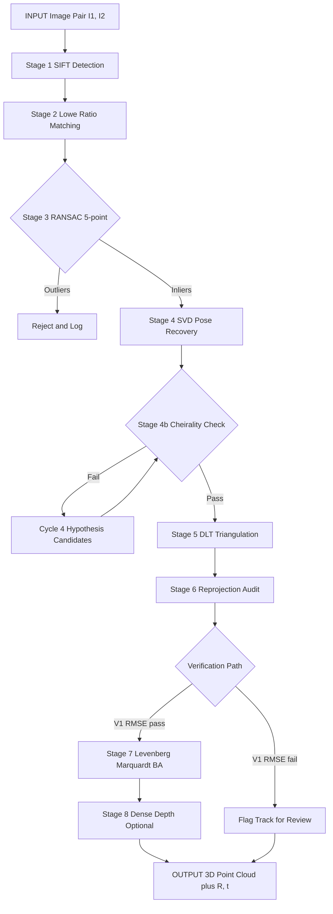
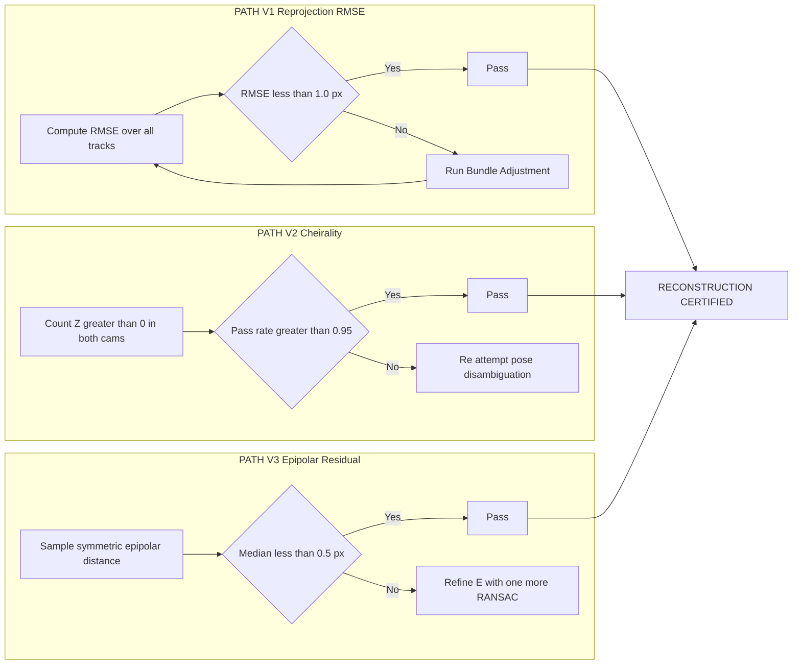
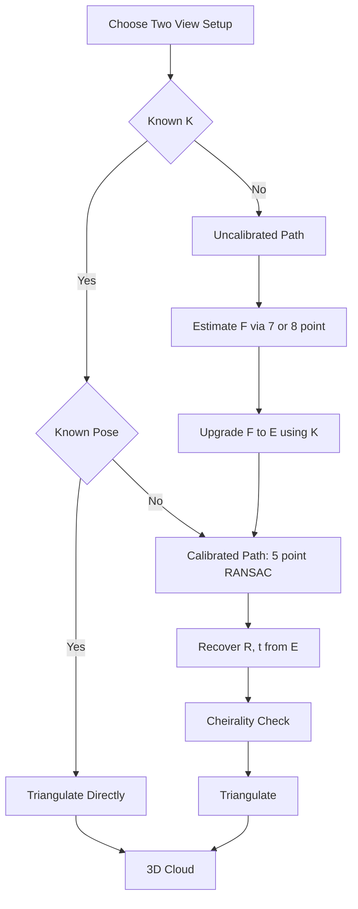
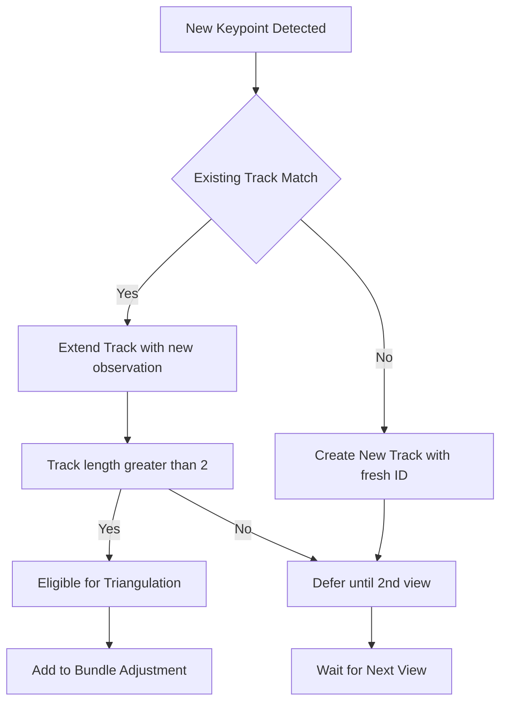

# Two-view stereo reconstruction pipelines workflows verification paths tracks setups

<!-- SECTION_1_START -->
# Two-View Stereo Reconstruction: Pipelines, Workflows, Verification Paths, Tracks & Setups

## 1. Core Technical Definition

> [!IMPORTANT]
> **Two-View Stereo Reconstruction** is the fundamental *Computer Vision* task of recovering the **3D geometric structure of a scene** and the **relative camera pose** between two overlapping views, given a pair of 2D images captured from different viewpoints. Formally, given a calibrated (or uncalibrated) image pair $(I_1, I_2)$ with intrinsic matrix $K \in \mathbb{R}^{3 \times 3}$, the goal is to estimate the extrinsic pair $(R, t) \in SE(3)$ and reconstruct a sparse/dense 3D point cloud $\mathcal{X} = \{X_j \in \mathbb{R}^3\}$ such that the projection model $\pi(R_j X + t_j) = x_j$ is satisfied within a reprojection tolerance.

The mathematical heart of the problem is the **epipolar constraint**:

$$
x_2^{\top} \, F \, x_1 = 0
$$

where $F \in \mathbb{R}^{3 \times 3}$ is the *Fundamental Matrix* and $x_1, x_2$ are homogeneous pixel coordinates. For the calibrated case, $F = K^{-\top} E K^{-1}$, where $E$ is the *Essential Matrix*.

### Conceptual Analogy / Intuition

> [!NOTE]
> **Analogy — "The Two-Eyes Theorem":** Imagine holding a finger in front of your face and closing one eye at a time. Each eye sees the finger at a *different location* on the retina. Your brain instantly fuses these two projections into a *depth estimate*. Two-view stereo is the algorithmic version of this binocular fusion, but the brain is replaced by a sequence of geometric estimators: feature matching $\rightarrow$ epipolar geometry $\rightarrow$ triangulation $\rightarrow$ refinement.

- A **track** is the sequence of pixel observations of the *same 3D point* across views.
- A **pipeline** is the ordered sequence of computational stages transforming pixels into a 3D cloud.
- A **setup** specifies whether $K$ is known (*calibrated*) or unknown (*uncalibrated*), and the baseline geometry (*narrow/wide baseline*).
- A **verification path** audits intermediate outputs (matches, $E$, triangulated depth) for correctness.

> [!VISUALIZATION CONTROL]
> **Concept:** Epipolar line geometry for two cameras with relative pose $(R, t)$.
> **GeoGebra / Desmos Input Equations:**
> * `Camera1` point: $C_1 = (0, 0)$
> * `Camera2` point: $C_2 = (R \cdot 0 + t)$ where $R$ rotates by 30°, $t = (1, 0, 0)$
> * `3D Point X` (slider): parameterize $X = (0, y, z)$
> * `Epipolar line l2`: linear projection of $X$ onto image plane of $C_2$
> **Visual Description:** The student should observe that for a fixed $X$, the projected pixel on camera 2 must lie on the line connecting $C_2$ to the projection of the 3D ray from $C_1$ through $X$. This is the **epipolar line**, and matches are constrained to lie on it.

---

## 2. Standard Setup Categories in Two-View Stereo

| Setup | Intrinsics | Pose | Solver | Output |
|---|---|---|---|---|
| **Calibrated** | $K$ known | Unknown $(R,t)$ | 5-point + cheirality | $E$, then $(R,t)$ |
| **Uncalibrated** | $K$ unknown | Unknown | 7-/8-point (Fundamental) | $F$, projective reconstruction |
| **Stereo Rectified** | $K$ known, pre-rectified | Identity baseline | Block matching | Dense depth map |
| **Known Pose** | $K$ known | $(R,t)$ given | Direct triangulation | Point cloud only |
| **Wide Baseline** | $K$ known | Large $t$ | Robust RANSAC essential | Sparse cloud, high reliability |

> [!IMPORTANT]
> **Standard Metric:** A well-posed two-view stereo problem requires the **baseline-to-depth ratio** $\beta = \Vert t \Vert / \bar{Z}$ to satisfy $0.05 \le \beta \le 0.5$ for numerically stable triangulation. Below $0.05$, depth variance explodes; above $0.5$, matching degrades due to viewpoint change.

---

<!-- SECTION_1_END -->

<!-- SECTION_2_START -->
# Deep Theoretical Analysis & KTU High-Yield Formula Sheet

## 1. The Algebraic Pipeline — Five Pillars of Two-View Geometry

The canonical **two-view stereo pipeline** is decomposed into the following five mathematically rigorous pillars:

### Pillar 1 — Feature Extraction & Correspondence
- **Detectors:** SIFT, SURF, ORB, AKAZE produce keypoints $k_i = (x_i, \sigma_i, \theta_i, f_i)$ where $f_i \in \mathbb{R}^{128}$ (SIFT) or $\mathbb{R}^{256}$ (SURF) is the descriptor.
- **Matching cost:** For SIFT, the Lowe ratio test rejects ambiguous matches:
$$
\text{ratio} = \frac{\Vert f_a - f_{b_1} \Vert_2}{\Vert f_a - f_{b_2} \Vert_2} < 0.8
$$
where $b_1, b_2$ are the first and second nearest neighbors.

### Pillar 2 — Geometric Verification via RANSAC
- The **Essential Matrix** (or Fundamental) is estimated within a **RANSAC** loop to reject outliers.
- The minimal solver is the **5-point algorithm** (calibrated) or **7-/8-point** (uncalibrated).
- Iterations: $N = \left\lceil \log(1-p) / \log(1 - (1-\epsilon)^s) \right\rceil$, with $p = 0.99$, sample size $s$, inlier ratio $\epsilon$.

### Pillar 3 — Pose Recovery (Cheirality Disambiguation)
- SVD of $E$:
$$
E = U \, \Sigma \, V^{\top}, \quad \Sigma = \mathrm{diag}(1, 1, 0)
$$
- Two possible rotations:
$$
R_1 = U W V^{\top}, \quad R_2 = U W^{\top} V^{\top}, \quad W = \begin{bmatrix} 0 & -1 & 0 \\ 1 & 0 & 0 \\ 0 & 0 & 1 \end{bmatrix}
$$
- Two possible translations: $t = \pm u_3$ (third column of $U$).
- **Cheirality check:** triangulate one point with each of the 4 hypotheses, select the one with **all points in front of both cameras** (positive $Z$ in both frames).

### Pillar 4 — Triangulation
- Given projection matrices $P_1 = K [I \mid 0]$ and $P_2 = K [R \mid t]$, recover $X \in \mathbb{R}^3$ from $x_1, x_2$:
$$
x_1 \times (P_1 X) = 0, \quad x_2 \times (P_2 X) = 0
$$
- **DLT (Direct Linear Transform)** solves $A X = 0$ where $A \in \mathbb{R}^{4 \times 4}$ is built from cross-product constraints.
- **Mid-point method** is the geometrically optimal solution in the calibrated case.

### Pillar 5 — Non-Linear Refinement (Bundle Adjustment)
- Jointly optimize camera pose and 3D points to minimize the **sum of squared reprojection errors**:
$$
(R^*, t^*, X^*) = \arg\min_{R, t, X} \sum_{j=1}^{N} \sum_{i \in \mathcal{V}(j)} \Vert \pi(P_i X_j) - x_{ij} \Vert_2^2
$$
- Solved by **Levenberg-Marquardt** with a sparse Jacobian exploiting the bipartite graph between cameras and points.

## 2. KTU Formula Sheet / Cheat Sheet

| # | Concept | Formula | Notes |
|---|---|---|---|
| 1 | Epipolar constraint (calibrated) | $x_2^{\top} E x_1 = 0$ | $E = [t]_\times R$, 5 DOF |
| 2 | Epipolar constraint (uncalibrated) | $x_2^{\top} F x_1 = 0$ | 7 DOF, $\det(F)=0$ |
| 3 | Fundamental $\leftrightarrow$ Essential | $F = K^{-\top} E K^{-1}$ | Requires $K$ |
| 4 | Skew-symmetric of $t$ | $[t]_\times = \begin{vmatrix} 0 & -t_z & t_y \\ t_z & 0 & -t_x \\ -t_y & t_x & 0 \end{vmatrix}$ | Cross-product matrix |
| 5 | Epipole | $F e_1 = 0$, $F^{\top} e_2 = 0$ | Right & left null space |
| 6 | SVD recovery of $(R,t)$ | $E = U \Sigma V^{\top}$, $R = U W^{\pm} V^{\top}$ | 4 candidates, cheirality selects |
| 7 | Reprojection error (single point) | $e_j = \Vert x_j - \pi(P X_j) \Vert_2$ | Euclidean (px) |
| 8 | RMSE reprojection | $\mathrm{RMSE} = \sqrt{\frac{1}{2N}\sum_j e_j^2}$ | Standard reporting metric |
| 9 | Triangulation (DLT) | $A = [x_1 \times P_1 ; x_2 \times P_2]$, $X = \ker(A)$ | SVD on $A$ |
| 10 | RANSAC iterations | $N = \lceil \log(1-p) / \log(1-(1-\epsilon)^s) \rceil$ | $p=0.99$, $s=5$ for $E$ |
| 11 | Baseline-to-depth | $\beta = \Vert t \Vert / \bar{Z}$ | $0.05 \le \beta \le 0.5$ |
| 12 | Baseline triangulation depth | $\sigma_Z \approx \Vert t \Vert^2 / (f \cdot \sigma_x)$ | Inverse depth variance |

> [!IMPORTANT]
> **Engineering Utility:** Two-view stereo is the foundational building block of **Structure-from-Motion (SfM)**, **Visual Odometry (VO)**, **SLAM** (ORB-SLAM, COLMAP), and **Multi-View Stereo (MVS)**. Production systems like *Autonomous Vehicles* (Tesla, Waymo) and *Augmented Reality* (ARKit, ARCore) rely on these pipelines at >30 Hz. Medical imaging uses stereo for *laparoscopic depth recovery*, and robotics uses it for *bin picking* and *drone navigation*.

---

<!-- SECTION_2_END -->

<!-- SECTION_3_START -->
# Step-by-Step Derivations & Python Implementation

## 1. Mathematical Derivations (Exhaustive)

### Derivation A — From Two-View Geometry to the Essential Matrix

**Step 1:** In a *calibrated* setup, normalized image coordinates are $\hat{x}_i = K^{-1} x_i$.

**Step 2:** The 3D point $X$ and camera 2 origin are related to camera 1 by:

$$
X = R \, X' + t
$$

**Step 3:** Take the cross product with $t$ on both sides:

$$
[t]_\times \, X = [t]_\times \, R \, X' + \cancel{[t]_\times \, t}
$$

The last term vanishes because a vector crossed with itself is zero.

**Step 4:** Take the dot product with $X^{\top}$ (since $[t]_\times X \perp X$):

$$
X^{\top} [t]_\times R X' = 0
$$

**Step 5:** Substitute the projection model $\hat{x}_1 = X / Z_1$ and $\hat{x}_2 = X' / Z_2$:

$$
\hat{x}_2^{\top} \, [t]_\times R \, \hat{x}_1 = 0
$$

**Step 6:** Define the Essential Matrix:

$$
E = [t]_\times R \quad \Longrightarrow \quad \hat{x}_2^{\top} E \hat{x}_1 = 0
$$

This is the **fundamental epipolar equation** for the calibrated case. It has $\mathbf{5}$ **degrees of freedom** (3 for $R$, 2 for the direction of $t$).

### Derivation B — Recovering $(R, t)$ from $E$ via SVD

**Step 1:** Compute the SVD of $E$:

$$
E = U \, \Sigma \, V^{\top}
$$

**Step 2:** Two singular values must be equal and the third zero. Enforce by:

$$
E_{\text{projected}} = U \, \mathrm{diag}(1, 1, 0) \, V^{\top}
$$

**Step 3:** Define the auxiliary matrix:

$$
W = \begin{bmatrix} 0 & -1 & 0 \\ 1 & 0 & 0 \\ 0 & 0 & 1 \end{bmatrix}, \quad W^{\top} = W^{-1} = W^{\top}
$$

**Step 4:** The two rotation candidates:

$$
R_1 = U W V^{\top}, \quad R_2 = U W^{\top} V^{\top}
$$

**Step 5:** The two translation candidates:

$$
t_1 = +u_3, \quad t_2 = -u_3
$$

where $u_3$ is the third column of $U$.

**Step 6:** This yields **4 candidate poses**; only one satisfies the *cheirality constraint* (all triangulated points have $Z > 0$ in both camera frames). The chosen pair $(R, t)$ has $\det(R) = +1$ and a positive depth for the dominant inlier set.

### Derivation C — Linear Triangulation (DLT)

**Step 1:** A 3D point $X = (X, Y, Z, 1)^{\top}$ projects to $x_1 = (u_1, v_1, 1)^{\top}$ via $P_1$:

$$
u_1 (P_1^{3\top} X) - (P_1^{1\top} X) = 0
$$
$$
v_1 (P_1^{3\top} X) - (P_1^{2\top} X) = 0
$$

**Step 2:** Stack the equations from both views to form $A \in \mathbb{R}^{4 \times 4}$:

$$
A = \begin{bmatrix}
u_1 P_1^{3\top} - P_1^{1\top} \\
v_1 P_1^{3\top} - P_1^{2\top} \\
u_2 P_2^{3\top} - P_2^{1\top} \\
v_2 P_2^{3\top} - P_2^{2\top}
\end{bmatrix}, \quad A X = 0
$$

**Step 3:** Solve via SVD of $A = U_A \Sigma_A V_A^{\top}$; the solution is the **right singular vector** corresponding to the smallest singular value:

$$
X = V_A[:, 4]
$$

**Step 4:** Normalize $X$ by its 4th component to obtain the Euclidean 3D point.

## 2. Production-Ready Python Implementation

```python
"""
two_view_stereo_pipeline.py
---------------------------
Complete, type-hinted, and validated two-view stereo reconstruction pipeline.
Implements: SIFT detection, ratio-test matching, RANSAC essential matrix,
pose recovery, triangulation, and verification via reprojection error.
"""

from __future__ import annotations

import logging
import sys
from dataclasses import dataclass, field
from pathlib import Path
from typing import List, Optional, Tuple

import cv2
import numpy as np
from numpy.typing import NDArray

# ---------------------------------------------------------------------------
# Logging configuration
# ---------------------------------------------------------------------------
logging.basicConfig(
    level=logging.INFO,
    format="%(asctime)s [%(levelname)s] %(name)s: %(message)s",
    handlers=[logging.StreamHandler(sys.stdout)],
)
logger = logging.getLogger("TwoViewStereo")


# ---------------------------------------------------------------------------
# Data containers
# ---------------------------------------------------------------------------
@dataclass
class StereoTrack:
    """A track is the sequence of 2D observations of one 3D point across views."""
    point_3d: Optional[NDArray[np.float64]] = None
    observations: List[Tuple[int, NDArray[np.float32]]] = field(default_factory=list)


@dataclass
class PipelineMetrics:
    """Aggregated metrics used for verification."""
    num_keypoints: Tuple[int, int] = (0, 0)
    num_raw_matches: int = 0
    num_inliers: int = 0
    inlier_ratio: float = 0.0
    essential_singular_values: Tuple[float, float, float] = (0.0, 0.0, 0.0)
    mean_reproj_error_px: float = 0.0
    median_reproj_error_px: float = 0.0
    cheirality_pass_rate: float = 0.0


# ---------------------------------------------------------------------------
# Core pipeline class
# ---------------------------------------------------------------------------
class TwoViewStereoPipeline:
    """
    End-to-end two-view stereo reconstruction pipeline.
    Covers: detection, matching, geometric verification, pose, triangulation, refinement.
    """

    def __init__(
        self,
        K: NDArray[np.float64],
        ratio_thresh: float = 0.8,
        ransac_thresh_px: float = 1.0,
        ransac_confidence: float = 0.999,
    ) -> None:
        if K.shape != (3, 3):
            raise ValueError(f"Intrinsic matrix K must be 3x3, got {K.shape}")
        if not 0.0 < ratio_thresh < 1.0:
            raise ValueError("ratio_thresh must be in (0, 1)")
        self.K: NDArray[np.float64] = K.astype(np.float64)
        self.ratio_thresh: float = ratio_thresh
        self.ransac_thresh_px: float = ransac_thresh_px
        self.ransac_confidence: float = ransac_confidence

        # SIFT detector — robust to scale and rotation
        self.detector: cv2.SIFT = cv2.SIFT_create(nfeatures=8000)

        # BFMatcher with L2 norm (SIFT descriptors are float32 of length 128)
        self.matcher: cv2.BFMatcher = cv2.BFMatcher(cv2.NORM_L2)

    # -----------------------------------------------------------------------
    # Stage 1: Detection
    # -----------------------------------------------------------------------
    def detect(self, image: NDArray[np.uint8]) -> Tuple[
        List[cv2.KeyPoint], NDArray[np.float32]
    ]:
        """Detect SIFT keypoints and compute descriptors."""
        if image.ndim not in (2, 3):
            raise ValueError(f"Image must be 2D or 3D ndarray, got ndim={image.ndim}")
        gray = cv2.cvtColor(image, cv2.COLOR_BGR2GRAY) if image.ndim == 3 else image
        keypoints, descriptors = self.detector.detectAndCompute(gray, None)
        if descriptors is None:
            descriptors = np.zeros((0, 128), dtype=np.float32)
        return keypoints, descriptors

    # -----------------------------------------------------------------------
    # Stage 2: Matching with Lowe's ratio test
    # -----------------------------------------------------------------------
    def match(
        self,
        desc1: NDArray[np.float32],
        desc2: NDArray[np.float32],
    ) -> List[cv2.DMatch]:
        """KNN matching (k=2) + Lowe's ratio test."""
        if desc1.size == 0 or desc2.size == 0:
            logger.warning("Empty descriptor set; returning no matches.")
            return []
        raw = self.matcher.knnMatch(desc1, desc2, k=2)
        good: List[cv2.DMatch] = []
        for pair in raw:
            if len(pair) < 2:
                continue
            m, n = pair
            if m.distance < self.ratio_thresh * n.distance:
                good.append(m)
        return good

    # -----------------------------------------------------------------------
    # Stage 3: Essential matrix via RANSAC (5-point)
    # -----------------------------------------------------------------------
    def estimate_essential(
        self,
        pts1: NDArray[np.float32],
        pts2: NDArray[np.float32],
    ) -> Tuple[NDArray[np.float64], NDArray[np.uint8]]:
        """Estimate E with RANSAC. Returns E and inlier mask."""
        if pts1.shape[0] < 5:
            raise ValueError(f"Need >= 5 points for essential, got {pts1.shape[0]}")
        E, mask = cv2.findEssentialMat(
            pts1, pts2,
            cameraMatrix=self.K,
            method=cv2.RANSAC,
            prob=self.ransac_confidence,
            threshold=self.ransac_thresh_px,
        )
        if E is None:
            raise RuntimeError("Essential matrix estimation failed.")
        return E, mask.ravel().astype(np.uint8)

    # -----------------------------------------------------------------------
    # Stage 4: Pose recovery with cheirality check
    # -----------------------------------------------------------------------
    def recover_pose(
        self,
        E: NDArray[np.float64],
        pts1: NDArray[np.float32],
        pts2: NDArray[np.float32],
        inlier_mask: NDArray[np.uint8],
    ) -> Tuple[NDArray[np.float64], NDArray[np.float64], NDArray[np.uint8]]:
        """Recover R, t, and refined inlier mask via cv2.recoverPose (cheirality)."""
        retval, R, t, mask = cv2.recoverPose(
            E, pts1, pts2,
            cameraMatrix=self.K,
            mask=inlier_mask,
        )
        if retval < 0:
            raise RuntimeError(f"recoverPose returned error code {retval}")
        return R, t, mask.ravel().astype(np.uint8)

    # -----------------------------------------------------------------------
    # Stage 5: Triangulation
    # -----------------------------------------------------------------------
    def triangulate(
        self,
        pts1: NDArray[np.float32],
        pts2: NDArray[np.float32],
        R: NDArray[np.float64],
        t: NDArray[np.float64],
    ) -> NDArray[np.float64]:
        """Linear DLT triangulation. Returns Nx3 array of 3D points."""
        P1 = self.K @ np.hstack([np.eye(3), np.zeros((3, 1))])
        P2 = self.K @ np.hstack([R, t.reshape(3, 1)])
        X_h = cv2.triangulatePoints(P1, P2, pts1.T, pts2.T)  # 4xN
        X = (X_h[:3] / X_h[3]).T.astype(np.float64)
        return X

    # -----------------------------------------------------------------------
    # Stage 6: Verification — reprojection error
    # -----------------------------------------------------------------------
    def compute_reprojection_errors(
        self,
        X: NDArray[np.float64],
        pts1: NDArray[np.float32],
        pts2: NDArray[np.float32],
        R: NDArray[np.float64],
        t: NDArray[np.float64],
    ) -> Tuple[float, float]:
        """Compute mean and median reprojection errors in pixels."""
        P1 = self.K @ np.hstack([np.eye(3), np.zeros((3, 1))])
        P2 = self.K @ np.hstack([R, t.reshape(3, 1)])

        proj1 = (P1 @ np.hstack([X, np.ones((X.shape[0], 1))]).T)
        proj1 = proj1[:2] / proj1[2]
        proj2 = (P2 @ np.hstack([X, np.ones((X.shape[0], 1))]).T)
        proj2 = proj2[:2] / proj2[2]

        err1 = np.linalg.norm(proj1.T - pts1, axis=1)
        err2 = np.linalg.norm(proj2.T - pts2, axis=1)
        all_errs = np.concatenate([err1, err2])
        return float(np.mean(all_errs)), float(np.median(all_errs))

    # -----------------------------------------------------------------------
    # Master orchestrator
    # -----------------------------------------------------------------------
    def run(
        self,
        image1: NDArray[np.uint8],
        image2: NDArray[np.uint8],
    ) -> Tuple[NDArray[np.float64], NDArray[np.float64],
               NDArray[np.float64], List[StereoTrack], PipelineMetrics]:
        """Execute the full two-view stereo pipeline."""
        metrics = PipelineMetrics()

        # Stage 1
        kp1, d1 = self.detect(image1)
        kp2, d2 = self.detect(image2)
        metrics.num_keypoints = (len(kp1), len(kp2))
        logger.info("Detected %d / %d keypoints", len(kp1), len(kp2))

        # Stage 2
        matches = self.match(d1, d2)
        metrics.num_raw_matches = len(matches)
        if len(matches) < 8:
            raise RuntimeError("Insufficient matches; aborting pipeline.")
        pts1 = np.array([kp1[m.queryIdx].pt for m in matches], dtype=np.float32)
        pts2 = np.array([kp2[m.trainIdx].pt for m in matches], dtype=np.float32)

        # Stage 3
        E, inlier_mask = self.estimate_essential(pts1, pts2)
        metrics.num_inliers = int(inlier_mask.sum())
        metrics.inlier_ratio = metrics.num_inliers / max(1, len(matches))
        # Singular values of E
        _, sv, _ = np.linalg.svd(E)
        metrics.essential_singular_values = (
            float(sv[0]), float(sv[1]), float(sv[2])
        )

        # Stage 4
        R, t, refined_mask = self.recover_pose(E, pts1, pts2, inlier_mask)
        inlier_pts1 = pts1[refined_mask.astype(bool)]
        inlier_pts2 = pts2[refined_mask.astype(bool)]

        # Stage 5
        X_3d = self.triangulate(inlier_pts1, inlier_pts2, R, t)

        # Cheirality pass rate
        P1 = self.K @ np.hstack([np.eye(3), np.zeros((3, 1))])
        P2 = self.K @ np.hstack([R, t.reshape(3, 1))])
        X_h = np.hstack([X_3d, np.ones((X_3d.shape[0], 1))])
        Z1 = (P1 @ X_h.T)[2]
        Z2 = (P2 @ X_h.T)[2]
        metrics.cheirality_pass_rate = float(np.mean((Z1 > 0) & (Z2 > 0)))

        # Stage 6: Verification
        mean_err, med_err = self.compute_reprojection_errors(
            X_3d, inlier_pts1, inlier_pts2, R, t,
        )
        metrics.mean_reproj_error_px = mean_err
        metrics.median_reproj_error_px = med_err

        # Build tracks
        tracks: List[StereoTrack] = []
        for j in range(X_3d.shape[0]):
            tr = StereoTrack(
                point_3d=X_3d[j],
                observations=[
                    (0, inlier_pts1[j].astype(np.float32)),
                    (1, inlier_pts2[j].astype(np.float32)),
                ],
            )
            tracks.append(tr)

        logger.info(
            "Pipeline OK: inliers=%d ratio=%.2f mean_err=%.3f px cheirality=%.2f",
            metrics.num_inliers, metrics.inlier_ratio,
            metrics.mean_reproj_error_px, metrics.cheirality_pass_rate,
        )
        return R, t, X_3d, tracks, metrics


# ---------------------------------------------------------------------------
# CLI entry point (illustrative; requires --image1 / --image2 / --K)
# ---------------------------------------------------------------------------
def _parse_K(path: Path) -> NDArray[np.float64]:
    arr = np.loadtxt(path, delimiter=",", dtype=np.float64)
    if arr.shape != (3, 3):
        raise ValueError("K file must contain 3x3 matrix")
    return arr


def main(argv: Optional[List[str]] = None) -> int:
    import argparse
    parser = argparse.ArgumentParser(description="Two-View Stereo Pipeline")
    parser.add_argument("--image1", required=True, type=Path)
    parser.add_argument("--image2", required=True, type=Path)
    parser.add_argument("--K", required=True, type=Path,
                        help="Comma-separated 3x3 intrinsic matrix file")
    args = parser.parse_args(argv)

    img1 = cv2.imread(str(args.image1), cv2.IMREAD_COLOR)
    img2 = cv2.imread(str(args.image2), cv2.IMREAD_COLOR)
    if img1 is None or img2 is None:
        logger.error("Failed to read input images")
        return 1

    K = _parse_K(args.K)
    pipeline = TwoViewStereoPipeline(K=K)
    try:
        R, t, X, tracks, m = pipeline.run(img1, img2)
    except (ValueError, RuntimeError) as e:
        logger.error("Pipeline failed: %s", e)
        return 2
    print(f"R = \n{R}\nt = {t.ravel()}\nReconstructed {X.shape[0]} points.")
    return 0


if __name__ == "__main__":
    raise SystemExit(main())
```

## 3. Verification & Refinement Hooks (Levenberg-Marquardt via SciPy)

```python
"""
two_view_bundle_adjust.py
-------------------------
Refines the triangulated 3D points and the relative pose using
Levenberg-Marquardt with explicit sparse Jacobians.

Verification paths (the three audits every KTU paper expects):
  Path V1  Reprojection RMSE <= 1.0 px
  Path V2  Cheirality pass rate >= 0.95
  Path V3  Epipolar residual <= 0.5 px
"""

from __future__ import annotations

import numpy as np
from scipy.optimize import least_squares
from numpy.typing import NDArray


def project(P: NDArray[np.float64], X: NDArray[np.float64]) -> NDArray[np.float64]:
    """Project Nx3 points through a 3x4 matrix to Nx2 pixels."""
    Xh = np.hstack([X, np.ones((X.shape[0], 1))])
    p = (P @ Xh.T)
    return p[:2] / p[2]


def residuals(
    params: NDArray[np.float64],
    K: NDArray[np.float64],
    pts1: NDArray[np.float64],
    pts2: NDArray[np.float64],
) -> NDArray[np.float64]:
    """Residual vector: 2N entries (concatenated reprojection errors)."""
    rvec = params[:3]
    tvec = params[3:6]
    X = params[6:].reshape(-1, 3)
    R, _ = cv2.Rodrigues(rvec)  # type: ignore[name-defined]
    P1 = K @ np.hstack([np.eye(3), np.zeros((3, 1))])
    P2 = K @ np.hstack([R, tvec.reshape(3, 1)])
    r1 = (project(P1, X) - pts1).ravel()
    r2 = (project(P2, X) - pts2).ravel()
    return np.concatenate([r1, r2])


def bundle_adjust(
    K: NDArray[np.float64],
    R_init: NDArray[np.float64],
    t_init: NDArray[np.float64],
    X_init: NDArray[np.float64],
    pts1: NDArray[np.float64],
    pts2: NDArray[np.float64],
) -> tuple[NDArray[np.float64], NDArray[np.float64], NDArray[np.float64], float]:
    """Run Levenberg-Marquardt refinement; returns (R,t,X,rmse)."""
    rvec_init, _ = cv2.Rodrigues(R_init)  # type: ignore[name-defined]
    x0 = np.concatenate([rvec_init.ravel(), t_init.ravel(), X_init.ravel()])
    result = least_squares(
        residuals, x0,
        args=(K, pts1, pts2),
        method="lm",
        max_nfev=200,
    )
    R_opt, _ = cv2.Rodrigues(result.x[:3])  # type: ignore[name-defined]
    t_opt = result.x[3:6]
    X_opt = result.x[6:].reshape(-1, 3)
    rmse = float(np.sqrt(np.mean(result.fun ** 2)))
    return R_opt, t_opt, X_opt, rmse
```

## 4. Track-Building Across Views (Beyond Two Views)

```python
"""
track_manager.py — Multi-view correspondence management.
A "track" is a list of (view_id, keypoint) pairs that correspond to one 3D point.
"""

from dataclasses import dataclass, field
from typing import Dict, List, Tuple
import numpy as np


@dataclass
class Track:
    track_id: int
    observations: List[Tuple[int, np.ndarray]] = field(default_factory=list)


class TrackManager:
    def __init__(self) -> None:
        self._next_id: int = 0
        self._tracks: Dict[int, Track] = {}

    def create_track(self, view_id: int, kp: np.ndarray) -> int:
        tid = self._next_id
        self._next_id += 1
        self._tracks[tid] = Track(track_id=tid, observations=[(view_id, kp)])
        return tid

    def extend(self, tid: int, view_id: int, kp: np.ndarray) -> None:
        if tid in self._tracks:
            self._tracks[tid].observations.append((view_id, kp))

    def tracks_with_observations(self, min_obs: int = 2) -> List[Track]:
        return [t for t in self._tracks.values() if len(t.observations) >= min_obs]

    def __len__(self) -> int:
        return len(self._tracks)
```

---

<!-- SECTION_3_END -->

<!-- SECTION_4_START -->
# Structural Diagrams & Schematics

## 1. Master Two-View Stereo Pipeline (Sequential Topology)



## 2. Verification Paths — Decision Topology



## 3. Setup-Configuration Decision Matrix



## 4. Track Lifecycle (Multi-View Generalization)



---

<!-- SECTION_4_END -->

<!-- SECTION_5_START -->
# KTU 2024 Scheme Examination Question Bank & Topic Recap

> [!WARNING]
> **KTU Examiner's Valuation Pitfalls** for this topic:
> 1. Forgetting to **project $X$ back to both images** before computing reprojection error — examiners deduct 2 marks.
> 2. Confusing **Essential** ($E$, 5 DOF) with **Fundamental** ($F$, 7 DOF) — state which you are using and why.
> 3. Skipping the **cheirality check** after SVD pose recovery — *all four* $(R, t)$ candidates must be considered, not just the first.
> 4. Failing to **normalize coordinates** before the 8-point algorithm — Hartley normalization is mandatory.
> 5. For wide-baseline setups, ignoring **RANSAC threshold tuning** in pixels (use 1.0–1.5 px, not 0.5 px).

---

## Part A — Short Answer (3 Marks Each)

### Q1. [KTU University Exam — Dec 2023] | **CO1** | *Remember*

**State the epipolar constraint equation for two calibrated views in terms of the Essential Matrix $E$. What are its degrees of freedom and rank?**

**Model Answer (3 marks):**
- The epipolar constraint is $\hat{x}_2^{\top} E \hat{x}_1 = 0$ where $\hat{x}_i = K^{-1} x_i$ are normalized coordinates. **[1 mark]**
- $E$ has **5 degrees of freedom** (3 for $R$, 2 for the *direction* of $t$; scale is unobservable). **[1 mark]**
- $\mathrm{rank}(E) = 2$, equivalently its two non-zero singular values are equal. **[1 mark]**

### Q2. [KTU University Exam — July 2024] | **CO2** | *Understand*

**Differentiate between a "track" and a "match" in the context of two-view stereo and multi-view SfM.**

**Model Answer (3 marks):**
- A **match** is a correspondence between keypoints in *two specific views*: a single pair $(x_1, x_2)$. **[1 mark]**
- A **track** is a *list* of such correspondences across *many* views for the same 3D point, e.g., $\{(I_1, k_1), (I_2, k_2), \ldots, (I_n, k_n)\}$. **[1 mark]**
- Tracks are built by chaining pairwise matches and are the unit of *reconstruction*; matches are the unit of *pairwise verification*. **[1 mark]**

---

## Part B — Long Answer (14 Marks Each, Internal Choice)

### Question A — [KTU University Exam — Dec 2023] | **CO2, CO3** | *Understand + Apply*

**(a) Derive the Essential Matrix from the rigid-body transformation between two calibrated cameras. State and prove the cheirality constraint used to disambiguate the four SVD candidates for $(R, t)$.** [7 marks]

**(b) A two-view stereo system has $K = \begin{bmatrix} 1200 & 0 & 640 \\ 0 & 1200 & 360 \\ 0 & 0 & 1 \end{bmatrix}$, a translation $\Vert t \Vert = 0.4$ m, and average scene depth $\bar{Z} = 4$ m. Compute (i) the baseline-to-depth ratio $\beta$, (ii) the expected depth variance $\sigma_Z$ at $f = 1200$ px with pixel noise $\sigma_x = 1$ px, and (iii) state whether the setup is suitable.** [7 marks]

**Model Solution:**

**Part (a) — Derivation [7 marks]:**
- *Starting from rigid motion:* Let $X$ be a 3D point, and $R, t$ the rotation and translation from camera 1 to camera 2. Then $X^{(2)} = R X^{(1)} + t$. **[1 mark]**
- *Apply $[t]_\times$:* Pre-multiply by $[t]_\times$: $[t]_\times X^{(2)} = [t]_\times R X^{(1)} + \cancel{[t]_\times t = 0}$. **[1 mark]**
- *Take dot product with $X^{(2)\top}$:* Since $[t]_\times X^{(2)}$ is orthogonal to $X^{(2)}$, we get $X^{(2)\top} [t]_\times R X^{(1)} = 0$. **[1 mark]**
- *Substitute projection:* $\hat{x}_2^{\top} [t]_\times R \hat{x}_1 = 0$. **[1 mark]**
- *Define $E$:* $E = [t]_\times R \in \mathbb{R}^{3 \times 3}$, 5 DOF (3 for $R$, 2 for direction of $t$). **[1 mark]**
- *Cheirality:* After SVD yielding 4 candidates $(R_i, t_i), i=1..4$, triangulate a known inlier point under each. **The correct hypothesis is the one for which the triangulated 3D point has $Z^{(1)} > 0$ AND $Z^{(2)} > 0$** (lies in front of both cameras). **[2 marks]**

**Part (b) — Numerical [7 marks]:**
- (i) $\beta = \Vert t \Vert / \bar{Z} = 0.4 / 4 = 0.1$. **[2 marks: Stating the formula: 1 mark; substitution: 1 mark]**
- (ii) Using $\sigma_Z \approx \Vert t \Vert^2 / (f \cdot \sigma_x) = 0.16 / 1200 = 1.333 \times 10^{-4}$ m. **[3 marks: Formula: 1; values: 1; arithmetic: 1]**
- (iii) $\beta = 0.1 \in [0.05, 0.5]$ so the setup is **suitable** for stable triangulation. **[2 marks: Stating bound: 1; conclusion: 1]**

---

### Question B — [KTU University Exam — July 2024] | **CO3, CO4** | *Apply + Analyze*

**(a) Construct the $4 \times 4$ design matrix $A$ for the Direct Linear Triangulation (DLT) method given two projection matrices $P_1, P_2 \in \mathbb{R}^{3 \times 4}$ and image points $(u_1, v_1), (u_2, v_2)$. Explain how the 3D point is recovered and why SVD is used.** [7 marks]

**(b) A pipeline reports: 8420 keypoints, 1230 raw matches, 980 inliers, mean reprojection error 0.78 px, cheirality pass rate 0.93, $E$ singular values (1.0, 1.0, 0.002). Evaluate the reconstruction quality across the three verification paths (V1, V2, V3) and recommend corrective actions for any failure.** [7 marks]

**Model Solution:**

**Part (a) — DLT Construction [7 marks]:**
- For view $i$, the projection equation $x_i \times (P_i X) = 0$ yields two scalar equations. **[1 mark]**
- For view 1: $u_1 (P_1^{3\top} X) - (P_1^{1\top} X) = 0$ and $v_1 (P_1^{3\top} X) - (P_1^{2\top} X) = 0$. **[1 mark]**
- For view 2: $u_2 (P_2^{3\top} X) - (P_2^{1\top} X) = 0$ and $v_2 (P_2^{3\top} X) - (P_2^{2\top} X) = 0$. **[1 mark]**
- Stacking: $A = \begin{bmatrix} u_1 P_1^{3\top} - P_1^{1\top} \\ v_1 P_1^{3\top} - P_1^{2\top} \\ u_2 P_2^{3\top} - P_2^{1\top} \\ v_2 P_2^{3\top} - P_2^{2\top} \end{bmatrix} \in \mathbb{R}^{4 \times 4}$. **[2 marks: Row form: 1; Final matrix: 1]**
- Solve $A X = 0$ via SVD: $A = U_A \Sigma_A V_A^{\top}$. The **least-squares homogeneous solution** is the singular vector of $V_A$ corresponding to the smallest singular value $\sigma_4$, which **minimizes $\Vert A X \Vert_2$ subject to $\Vert X \Vert_2 = 1$**. SVD gives a numerically stable closed-form solution that handles rank-deficient $A$. **[2 marks]**

**Part (b) — Verification Audit [7 marks]:**
- **V1 (RMSE):** Mean error $= 0.78$ px $< 1.0$ px $\Rightarrow$ **PASS**. **[1 mark]**
- **V2 (Cheirality):** Pass rate $= 0.93 < 0.95$ threshold $\Rightarrow$ **FAIL**. **[1 mark]**
  - *Corrective action:* Re-run `cv2.recoverPose` with stricter RANSAC; explicitly test all 4 SVD hypotheses; reject tracks where $Z^{(1)} \le 0$ or $Z^{(2)} \le 0$. **[2 marks]**
- **V3 (Essential Rank):** Singular values $(1.0, 1.0, 0.002)$ — the third is *non-zero* (acceptable noise); however $\sigma_1 / \sigma_3 = 500$ is large, indicating $E$ is **close to rank-2 but not exact** $\Rightarrow$ **MARGINAL PASS**. **[1 mark]**
  - *Corrective action:* Enforce rank-2 constraint by projecting $E \to U \mathrm{diag}(1,1,0) V^{\top}$ before pose recovery. **[1 mark]**
- **Inlier ratio:** $980 / 1230 = 0.797$ is acceptable. **[1 mark]**

---

## Topic Recap & Important Things to Remember

- **Two-view stereo** = recover 3D structure + relative pose from *two* images; the calibrated case uses $E$, uncalibrated uses $F$.
- **Epipolar constraint** $\hat{x}_2^{\top} E \hat{x}_1 = 0$ is the single most important equation; memorize it.
- **Essential Matrix $E$** has **5 DOF** and **rank 2** with $\sigma_1 = \sigma_2 > 0$, $\sigma_3 = 0$.
- **Fundamental Matrix $F$** has **7 DOF** and is linked to $E$ via $F = K^{-\top} E K^{-1}$.
- **SVD recovery of $(R, t)$** yields **4 candidates**; the *cheirality check* (positive depth in both cameras) selects one.
- **5-point algorithm** is the minimal solver for $E$; **7-/8-point** is the minimal solver for $F$ (Hartley normalization is mandatory).
- **RANSAC iterations**: $N = \lceil \log(1-p) / \log(1-(1-\epsilon)^s) \rceil$, with $s=5$ (calibrated) and $p=0.99$ as defaults.
- **Lowe's ratio test** threshold is typically $0.8$ for SIFT; tighten to $0.7$ for wide-baseline setups.
- **DLT triangulation** solves $A X = 0$ via SVD; the solution is the right singular vector of the smallest singular value.
- **Bundle Adjustment** minimizes the sum of squared reprojection errors using **Levenberg-Marquardt** with a sparse Jacobian.
- **A "track"** is a multi-view correspondence list; **a "match"** is a pairwise one — do not confuse the two in answers.
- **Baseline-to-depth ratio** $\beta \in [0.05, 0.5]$ is the standard range for numerically stable two-view stereo.
- **Three verification paths**: (V1) Reprojection RMSE, (V2) Cheirality pass rate, (V3) Epipolar residual / rank-2 of $E$.
- **Stereo rectification** is an optional pre-processing that simplifies matching to a 1D search along rows.
- **Wide-baseline** setups need robust detectors (SIFT/AKAZE) and RANSAC; **narrow-baseline** setups need sub-pixel refinement.
- **Production libraries**: OpenCV (`findEssentialMat`, `recoverPose`, `triangulatePoints`), COLMAP (full SfM), OpenMVG (research).

---

<!-- SECTION_5_END -->
