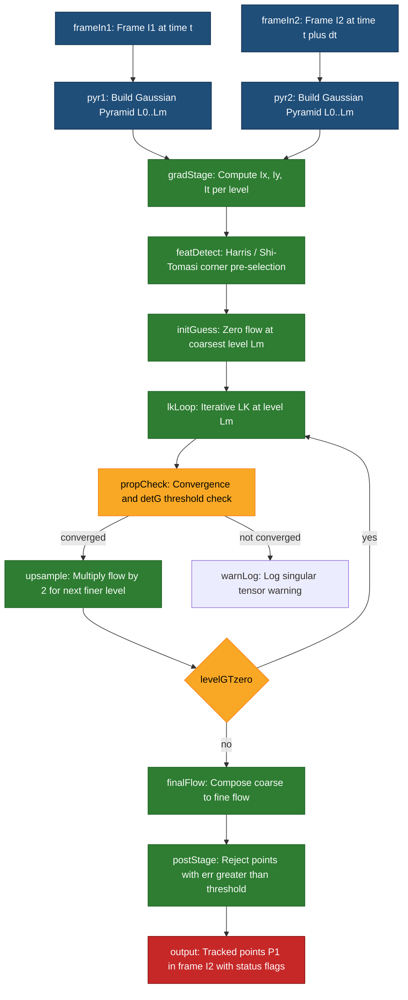
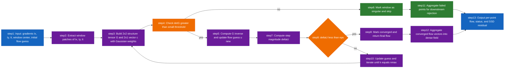
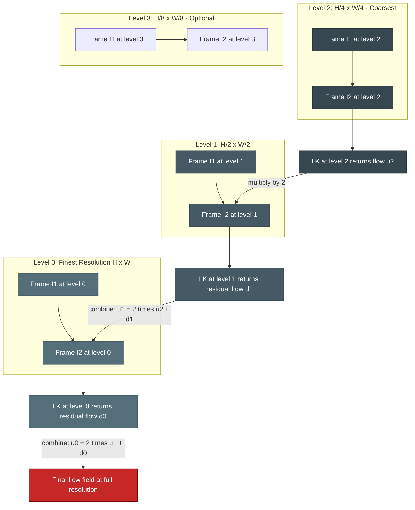

# Lucas-Kanade dense visual tracking estimation procedures formatting logic setups tracking systems

<!-- SECTION_1_START -->

# Lucas-Kanade Dense Visual Tracking: Estimation Procedures & System Architecture

> [!NOTE]
> **KTU 2024 Scheme — PECST706 | Module 3 | Optical Flow & Visual Tracking**
> This module is mapped to **CO3 (Apply differential motion estimation algorithms for visual tracking tasks)** and aligns with the foundational treatment of optical flow in classical computer vision literature (Fleet & Weiss, Barron et al.).

---

## 1.1 Formal Academic Definition

The **Lucas-Kanade (LK) method** is a *differential, gradient-based, local optical flow estimation technique* introduced by Bruce Lucas and Takeo Kanade (1981). It estimates the apparent 2D motion field of image brightness patterns between two consecutive frames by solving a **constrained least-squares optimization** over a small spatial neighborhood, under the **Brightness Constancy Assumption** and the assumption of **locally constant (translational) flow**.

Formally, for a pixel location $\mathbf{x} = (x, y)$ in image $I(x, y, t)$ at time $t$, the LK estimator computes the velocity vector $\mathbf{u} = (u, v)^{T}$ that minimizes:

$$
\sum_{(x_i, y_i) \in \Omega} W(x_i, y_i) \left[ I_x(x_i, y_i) \cdot u + I_y(x_i, y_i) \cdot v + I_t(x_i, y_i) \right]^{2}
$$

where $\Omega$ is a local window (typically $5 \times 5$ to $25 \times 25$ pixels), $W$ is a Gaussian weighting kernel, and $I_x$, $I_y$, $I_t$ are partial spatiotemporal derivatives. In the context of **dense visual tracking**, this per-pixel (or per-feature-block) estimator is repeated across the entire image (or across a dense set of corner-like features) to produce a **dense motion field**.

> [!IMPORTANT]
> **KTU Syllabus Highlight:** The Lucas-Kanade method is the *core* algorithm under "Optical Flow Estimation" in Module 3. It is a **direct differential method** (no feature matching, no block search) and forms the basis for the modern **KLT (Kanade-Lucas-Tomasi) tracker** used in robotics, SLAM, and AR pipelines.

---

## 1.2 Intuitive Analogy — "The River Current Sensor Array"

Imagine standing on a bridge looking down at a flowing river. You want to know how fast each *patch* of water is moving on the surface.

- **Naive (sparse) approach**: Drop a single floating cork and time it over a known distance. You get *one* velocity vector for the whole river — useless, because different parts flow differently.
- **Optical Flow approach**: Treat the *brightness pattern* of the water as a "texture" that moves coherently. By watching *how the texture shifts* between two snapshots taken $dt$ apart, you can estimate the local flow at every point.
- **Lucas-Kanade twist**: At each point, you place a **small grid of brightness sensors** (the $5 \times 5$ window $\Omega$). Instead of solving the motion for one sensor (which is *underdetermined* — this is the famous **aperture problem**), you gather brightness-change readings from all sensors in the window and solve a tiny least-squares system. Each sensor has its own brightness derivative vector, and the **shared** flow $(u, v)$ is what best explains *all* the readings simultaneously.

> **Why "dense" tracking?** When this procedure is applied to every pixel (or to every "good corner" pixel selected by the Harris/Good-Features-To-Track detector), the result is a **dense motion field** — a $(u, v)$ velocity vector at every tracked location. This is the "dense" part: not just a handful of features, but a packed field of flow estimates.

> [!VISUALIZATION CONTROL]
> **Concept:** Visualization of the LK constraint lines in image-gradient space (aperture problem resolution).
> **GeoGebra / Desmos Input Equations:**
> * Line $L_1$ (constraint from pixel $p_1$): $I_{x,1} \cdot u + I_{y,1} \cdot v + I_{t,1} = 0$  →  e.g., $0.6 u + 0.4 v + I_{t,1} = 0$
> * Line $L_2$ (constraint from pixel $p_2$): $I_{x,2} \cdot u + I_{y,2} \cdot v + I_{t,2} = 0$  →  e.g., $0.3 u + 0.9 v + I_{t,2} = 0$
> * Line $L_3$ (constraint from pixel $p_3$): $I_{x,3} \cdot u + I_{y,3} \cdot v + I_{t,3} = 0$  →  e.g., $0.8 u - 0.2 v + I_{t,3} = 0$
> **Visual Description:** The student should see three lines intersecting at a single point in the $(u, v)$ plane. This intersection *is* the LK flow estimate. If the lines were nearly parallel, the intersection would be ill-defined — this is the **Aperture Problem** visually.

---

## 1.3 Standard Metrics & Constants Used in LK Tracking

| Symbol | Meaning | Typical Value / Unit |
|---|---|---|
| $\Omega$ | Local LK window size | $5 \times 5$ to $25 \times 25$ pixels |
| $\sigma$ | Gaussian weighting std-dev | $1.5$ to $3.0$ pixels |
| $n_{\text{levels}}$ | Pyramid depth for pyramidal LK | $3$ to $5$ levels |
| $\epsilon$ | Convergence threshold for iterative LK | $0.01$ to $0.001$ pixels |
| $N_{\text{max}}$ | Max iterations per pyramid level | $10$ to $30$ |
| $\rho$ | Tracking error threshold (residual) | $\le 0.1$ normalized image units |

> [!IMPORTANT]
> **Engineering Reality:** In production-grade systems (OpenCV's `calcOpticalFlowPyrLK`, MATLAB's `vision.PointTracker`), the *weighted* and *pyramidal* extensions of Lucas-Kanade are what is actually deployed. Bare LK on a single resolution breaks down for motions > 1 pixel/frame.

<!-- SECTION_1_END -->

<!-- SECTION_2_START -->

# Deep Theoretical Analysis & KTU High-Yield Formula Sheet

## 2.1 The Three Foundational Assumptions of Lucas-Kanade

The LK estimator rests on **three explicit assumptions**. Memorize these — KTU boards award marks for stating them precisely.

1. **Brightness Constancy Assumption (BCA):**
   The intensity pattern of a local image patch does not change as it moves between frames.

   $$
   I(x, y, t) = I(x + u\,dt,\, y + v\,dt,\, t + dt)
   $$

2. **Small Motion (Temporal Persistence) Assumption:**
   The inter-frame displacement is small (sub-pixel to a few pixels) so that a **first-order Taylor expansion** of the BCA is valid.

3. **Spatial Coherence (Local Constant Flow) Assumption:**
   All pixels within a local neighborhood $\Omega$ share the *same* velocity vector $(u, v)$. This is the *only* assumption that distinguishes LK from per-pixel single-equation optical flow methods.

## 2.2 Derivation of the Optical Flow Constraint Equation (OFCE)

Apply a first-order Taylor expansion to the BCA around $(x, y, t)$:

$$
I(x + u\,dt,\, y + v\,dt,\, t + dt) \approx I(x, y, t) + I_x \, u\,dt + I_y \, v\,dt + I_t \, dt
$$

Using BCA, the left side equals $I(x, y, t)$, so:

$$
I_x \cdot u + I_y \cdot v + I_t = 0
$$

This is the **Optical Flow Constraint Equation (OFCE)**, a single linear equation in two unknowns $(u, v)$ — hence, the *Aperture Problem*. Note the **three partial derivatives**:

* $I_x = \partial I / \partial x$ — spatial gradient in $x$
* $I_y = \partial I / \partial y$ — spatial gradient in $y$
* $I_t = \partial I / \partial t$ — temporal gradient between frames

## 2.3 The Lucas-Kanade Least-Squares Solution

For each pixel $i$ inside a window $\Omega$ of $N$ pixels, the OFCE gives:

$$
I_x(\mathbf{x}_i)\, u + I_y(\mathbf{x}_i)\, v = -I_t(\mathbf{x}_i)
$$

Stacking $N$ such equations in matrix form:

$$
\begin{bmatrix}
I_x(\mathbf{x}_1) & I_y(\mathbf{x}_1) \\
I_x(\mathbf{x}_2) & I_y(\mathbf{x}_2) \\
\vdots & \vdots \\
I_x(\mathbf{x}_N) & I_y(\mathbf{x}_N)
\end{bmatrix}
\begin{bmatrix} u \\ v \end{bmatrix}
=
\begin{bmatrix} -I_t(\mathbf{x}_1) \\ -I_t(\mathbf{x}_2) \\ \vdots \\ -I_t(\mathbf{x}_N) \end{bmatrix}
\quad\Longleftrightarrow\quad
\mathbf{A}\,\mathbf{u} = \mathbf{b}
$$

The **weighted least-squares** normal-equation solution is:

$$
\mathbf{u} = \left( \mathbf{A}^{T} \mathbf{W} \mathbf{A} \right)^{-1} \mathbf{A}^{T} \mathbf{W}\, \mathbf{b}
$$

where $\mathbf{W} = \mathrm{diag}(W(\mathbf{x}_1), W(\mathbf{x}_2), \ldots, W(\mathbf{x}_N))$ is the Gaussian weighting matrix. Expanding the $2 \times 2$ matrix $\mathbf{A}^{T} \mathbf{W} \mathbf{A}$:

$$
\mathbf{A}^{T} \mathbf{W} \mathbf{A} =
\begin{bmatrix}
\sum W_i I_{x,i}^{2} & \sum W_i I_{x,i} I_{y,i} \\
\sum W_i I_{x,i} I_{y,i} & \sum W_i I_{y,i}^{2}
\end{bmatrix}
$$

This symmetric $2 \times 2$ matrix is often called the **structure tensor** (or **second-moment matrix**) $\mathbf{G}$ of the image gradients in $\Omega$.

## 2.4 The KLT Trackability Condition (Inverse-Composition Trick Prerequisite)

For $\mathbf{A}^{T} \mathbf{W} \mathbf{A}$ to be invertible, **both eigenvalues** $\lambda_1, \lambda_2$ must be large and well-separated. The Shi-Tomasi (KLT) criterion selects only those windows where:

$$
\min(\lambda_1, \lambda_2) > \lambda_{\text{threshold}}
$$

This rejects windows sitting on a single edge (aperture problem dominant) and keeps only **corner-like** texture patches.

## 2.5 Iterative Lucas-Kanade (Refinement at a Fixed Scale)

The pure LK equation assumes the linearization point is exact. For larger motions, **iterate**:

$$
\mathbf{u}^{(k+1)} = \mathbf{u}^{(k)} + \left( \mathbf{A}^{T} \mathbf{W} \mathbf{A} \right)^{-1} \mathbf{A}^{T} \mathbf{W} \left[ \mathbf{b} - \mathbf{A}\,\mathbf{u}^{(k)} \right]
$$

Convergence is declared when $\Vert \mathbf{u}^{(k+1)} - \mathbf{u}^{(k)} \Vert_2 < \epsilon$.

## 2.6 Pyramidal (Multi-Resolution) Lucas-Kanade — Handling Large Motions

The pyramidal LK algorithm — formalized by Jean-Yves Bouguet at Caltech (2000) — is the *de facto* industry standard. It uses a **Gaussian image pyramid** to handle displacements of arbitrary size.

**Pyramid construction:** For level $L = 0, 1, \ldots, L_m$:

$$
I^{L}(x, y) = \frac{1}{4} \sum_{i,j \in \{0,1\}} I^{L-1)}(2x + i,\, 2y + j)
$$

Each level is smoothed and downsampled by factor 2. Motion is estimated first at the **coarsest** level (where even large displacements become sub-pixel) and then propagated *down* to finer levels as a residual.

**Initial guess at level $L = L_m - 1$:** $\mathbf{u}^{L_m - 1} = 2 \cdot \mathbf{u}^{L_m}$.

**General level-to-level update:**

$$
\mathbf{u}^{L-1} = 2 \cdot \mathbf{u}^{L} + \mathbf{d}^{L-1}
$$

where $\mathbf{d}^{L-1}$ is the iterative-LK solution at level $L-1$ using the residual brightness error $I_t^{L-1} - \mathbf{A}^{L-1}\mathbf{u}^{L}$.

---

## 2.7 KTU Formula Cheat Sheet

> [!IMPORTANT]
> The vertical pipe symbol `$\vert$` is used inside tables to avoid breaking markdown syntax. This is the table-isolation rule mandated by KTU-prep protocol.

| # | Formula | Description | Used In |
|---|---|---|---|
| F1 | $I(x,y,t) = I(x+udt, y+vdt, t+dt)$ | Brightness Constancy Assumption | All optical flow methods |
| F2 | $I_x u + I_y v + I_t = 0$ | Optical Flow Constraint Equation (OFCE) | Foundation of LK |
| F3 | $\mathbf{u} = (\mathbf{A}^{T}\mathbf{W}\mathbf{A})^{-1}\mathbf{A}^{T}\mathbf{W}\mathbf{b}$ | LK weighted least-squares solution | Core LK estimator |
| F4 | $\mathbf{G} = \begin{bmatrix} \sum W_i I_{x,i}^{2} & \sum W_i I_{x,i}I_{y,i} \\ \sum W_i I_{x,i}I_{y,i} & \sum W_i I_{y,i}^{2} \end{bmatrix}$ | Structure tensor (2nd moment matrix) | KLT feature selection, LK |
| F5 | $\min(\lambda_1, \lambda_2) > \lambda_{\text{thresh}}$ | Shi-Tomasi trackability | Feature pre-selection |
| F6 | $\mathbf{u}^{(k+1)} = \mathbf{u}^{(k)} + (\mathbf{A}^{T}\mathbf{W}\mathbf{A})^{-1}\mathbf{A}^{T}\mathbf{W}[\mathbf{b} - \mathbf{A}\mathbf{u}^{(k)}]$ | Iterative LK update | Refinement at one pyramid level |
| F7 | $I^{L}(x,y) = \frac{1}{4} \sum_{i,j \in \{0,1\}} I^{L-1}(2x+i, 2y+j)$ | Gaussian pyramid level | Pyramidal LK |
| F8 | $\mathbf{u}^{L-1} = 2 \cdot \mathbf{u}^{L} + \mathbf{d}^{L-1}$ | Pyramid level-to-level flow update | Coarse-to-fine tracking |
| F9 | $\mathrm{SSD}(\Delta \mathbf{u}) = \sum_{\mathbf{x} \in \Omega} W(\mathbf{x}) \left[ I(\mathbf{x} + \Delta\mathbf{u}) - J(\mathbf{x}) \right]^{2}$ | Sum-of-squared-difference cost | LK as a registration problem |
| F10 | $\det(\mathbf{G}) - k\, \mathrm{tr}(\mathbf{G})^{2} > R$ | Harris corner response (often used as input stage) | Feature detection pre-LK |

---

## 2.8 Real-World Engineering Utility

| Application Domain | Why LK is Used | Production System |
|---|---|---|
| **Visual Odometry / SLAM** | Tracks corner features across camera frames to recover ego-motion | OpenCV `calcOpticalFlowPyrLK`, ORB-SLAM2, VINS-Mono |
| **Augmented Reality** | Real-time feature tracking for planar pose estimation | Apple ARKit, Google ARCore (under the hood) |
| **Video Stabilization** | Estimates inter-frame motion to smooth shaky footage | Adobe Premiere warp stabiliser, ffmpeg `deshake` |
| **Action Recognition** | Dense flow fields become motion inputs to CNNs | Two-stream networks (Simonyan \& Zisserman, 2014) |
| **Traffic Monitoring** | Counts and tracks vehicles via corner features | Intelligent Transportation Systems |
| **Motion Segmentation** | Flow field boundaries reveal independently moving objects | Background-subtraction hybrids |

> **Production Insight:** The **inverse compositional LK** variant (Baker \& Matthews, 2004) is preferred in real-time systems because it pre-computes the Hessian $\mathbf{A}^{T}\mathbf{W}\mathbf{A}$ from the template (not the warped image) and amortizes cost across iterations — a **5x to 10x speed-up** in practice.

<!-- SECTION_2_END -->

<!-- SECTION_3_START -->

# Step-by-Step Derivations, Algorithms & Code Implementation

## 3.1 Exhaustive Derivation: From OFCE to Closed-Form LK Solution

**Step 0 — Problem setup.** Given two grayscale frames $I(x, y, t)$ and $J(x, y, t + dt)$, find the flow $\mathbf{u} = (u, v)^{T}$ that minimizes the weighted SSD inside a window $\Omega$ centered at $\mathbf{p}$:

$$
E(\mathbf{u}) = \sum_{\mathbf{x} \in \Omega} W(\mathbf{x}) \left[ J(\mathbf{x} + \mathbf{u}) - I(\mathbf{x}) \right]^{2}
$$

**Step 1 — First-order Taylor expansion of $J(\mathbf{x} + \mathbf{u})$ around $\mathbf{u} = \mathbf{0}$:**

$$
J(\mathbf{x} + \mathbf{u}) \approx J(\mathbf{x}) + \nabla J(\mathbf{x}) \cdot \mathbf{u}
$$

where $\nabla J = (J_x, J_y)$ is the spatial gradient of $J$ at $\mathbf{x}$.

**Step 2 — Substitute into the SSD cost:**

$$
E(\mathbf{u}) \approx \sum_{\mathbf{x} \in \Omega} W(\mathbf{x}) \left[ J(\mathbf{x}) - I(\mathbf{x}) + J_x(\mathbf{x})\, u + J_y(\mathbf{x})\, v \right]^{2}
$$

**Step 3 — Define the residual (temporal derivative).** The brightness change between frames is:

$$
\delta I(\mathbf{x}) \equiv I(\mathbf{x}) - J(\mathbf{x}) \quad \text{(frame difference, with sign convention)}
$$

so the cost becomes:

$$
E(\mathbf{u}) \approx \sum_{\mathbf{x} \in \Omega} W(\mathbf{x}) \left[ \delta I(\mathbf{x}) + J_x(\mathbf{x})\, u + J_y(\mathbf{x})\, v \right]^{2}
$$

Equivalently (the more common OFCE sign):

$$
E(\mathbf{u}) \approx \sum_{\mathbf{x} \in \Omega} W(\mathbf{x}) \left[ I_t(\mathbf{x}) + I_x(\mathbf{x})\, u + I_y(\mathbf{x})\, v \right]^{2}
$$

**Step 4 — Set partial derivatives to zero for a minimum.** $\partial E / \partial u = 0$:

$$
\frac{\partial E}{\partial u} = 2 \sum_{\mathbf{x} \in \Omega} W(\mathbf{x})\, I_x(\mathbf{x}) \left[ I_t(\mathbf{x}) + I_x(\mathbf{x})\, u + I_y(\mathbf{x})\, v \right] = 0
$$

Similarly, $\partial E / \partial v = 0$:

$$
\frac{\partial E}{\partial v} = 2 \sum_{\mathbf{x} \in \Omega} W(\mathbf{x})\, I_y(\mathbf{x}) \left[ I_t(\mathbf{x}) + I_x(\mathbf{x})\, u + I_y(\mathbf{x})\, v \right] = 0
$$

**Step 5 — Rearrange into the $2 \times 2$ normal-equation system:**

$$
\begin{aligned}
\left[ \sum W_i\, I_{x,i}^{2} \right] u + \left[ \sum W_i\, I_{x,i} I_{y,i} \right] v &= -\sum W_i\, I_{x,i} I_{t,i} \\
\left[ \sum W_i\, I_{x,i} I_{y,i} \right] u + \left[ \sum W_i\, I_{y,i}^{2} \right] v &= -\sum W_i\, I_{y,i} I_{t,i}
\end{aligned}
$$

**Step 6 — Write in matrix form (the structure-tensor equation):**

$$
\begin{bmatrix}
\sum W_i\, I_{x,i}^{2} & \sum W_i\, I_{x,i} I_{y,i} \\
\sum W_i\, I_{x,i} I_{y,i} & \sum W_i\, I_{y,i}^{2}
\end{bmatrix}
\begin{bmatrix} u \\ v \end{bmatrix}
=
\begin{bmatrix} -\sum W_i\, I_{x,i} I_{t,i} \\ -\sum W_i\, I_{y,i} I_{t,i} \end{bmatrix}
$$

i.e., $\mathbf{G}\,\mathbf{u} = \mathbf{c}$, where $\mathbf{G} = \mathbf{A}^{T}\mathbf{W}\mathbf{A}$ and $\mathbf{c} = -\mathbf{A}^{T}\mathbf{W}\mathbf{b}$.

**Step 7 — Closed-form solution using the 2D inverse formula.** For a symmetric $2 \times 2$ matrix:

$$
\mathbf{G}^{-1} = \frac{1}{\det(\mathbf{G})}
\begin{bmatrix}
G_{22} & -G_{12} \\
-G_{12} & G_{11}
\end{bmatrix}
$$

with $\det(\mathbf{G}) = G_{11} G_{22} - G_{12}^{2}$. Therefore:

$$
\begin{aligned}
u &= \frac{1}{\det(\mathbf{G})} \left( -G_{22} \sum W_i I_{x,i} I_{t,i} + G_{12} \sum W_i I_{y,i} I_{t,i} \right) \\
v &= \frac{1}{\det(\mathbf{G})} \left( -G_{11} \sum W_i I_{y,i} I_{t,i} + G_{12} \sum W_i I_{x,i} I_{t,i} \right)
\end{aligned}
$$

**Step 8 — Validity condition.** This solution is well-defined **iff** $\det(\mathbf{G}) \neq 0$, i.e., the local image patch has gradient in *both* $x$ and $y$ (not a flat patch, not a single-direction edge). This is the **aperture-problem escape condition** built into LK.

---

## 3.2 Worked Numerical Example (Hand-Solvable, Board Style)

> [!NOTE]
> This exact-style numerical appears in KTU supplementary questions. Practice the arithmetic.

**Given:** A $3 \times 3$ LK window with the following precomputed spatial and temporal derivatives (gradients in image intensity units per pixel):

| $i$ | $I_x$ | $I_y$ | $I_t$ | $W$ |
|---|---|---|---|---|
| 1 | 2 | 0 | -4 | 1 |
| 2 | 1 | 1 | -3 | 1 |
| 3 | 0 | 2 | -2 | 1 |
| 4 | 2 | 1 | -5 | 1 |
| 5 | 1 | 2 | -4 | 1 |
| 6 | 2 | 2 | -6 | 1 |
| 7 | 1 | 0 | -3 | 1 |
| 8 | 0 | 1 | -1 | 1 |
| 9 | 1 | 1 | -2 | 1 |

Find $(u, v)$.

**Step 1 — Compute the four sums of the structure tensor:**

$$
G_{11} = \sum W_i I_{x,i}^{2} = (4 + 1 + 0 + 4 + 1 + 4 + 1 + 0 + 1) = 16
$$

$$
G_{22} = \sum W_i I_{y,i}^{2} = (0 + 1 + 4 + 1 + 4 + 4 + 0 + 1 + 1) = 16
$$

$$
G_{12} = \sum W_i I_{x,i} I_{y,i} = (0 + 1 + 0 + 2 + 2 + 4 + 0 + 0 + 1) = 10
$$

**Step 2 — Compute the two sums on the right-hand side:**

$$
c_1 = -\sum W_i I_{x,i} I_{t,i} = -[2(-4) + 1(-3) + 0(-2) + 2(-5) + 1(-4) + 2(-6) + 1(-3) + 0(-1) + 1(-2)]
$$

Working inside the brackets term by term:

$$
2(-4) = -8, \quad 1(-3) = -3, \quad 0(-2) = 0, \quad 2(-5) = -10, \quad 1(-4) = -4
$$

$$
2(-6) = -12, \quad 1(-3) = -3, \quad 0(-1) = 0, \quad 1(-2) = -2
$$

Sum: $-8 - 3 + 0 - 10 - 4 - 12 - 3 + 0 - 2 = -42$. So $c_1 = -(-42) = 42$.

$$
c_2 = -\sum W_i I_{y,i} I_{t,i} = -[0(-4) + 1(-3) + 2(-2) + 1(-5) + 2(-4) + 2(-6) + 0(-3) + 1(-1) + 1(-2)]
$$

Term by term:

$$
0, \quad -3, \quad -4, \quad -5, \quad -8, \quad -12, \quad 0, \quad -1, \quad -2
$$

Sum: $-3 - 4 - 5 - 8 - 12 - 1 - 2 = -35$. So $c_2 = -(-35) = 35$.

**Step 3 — Determinant and inverse of $\mathbf{G}$:**

$$
\det(\mathbf{G}) = G_{11} G_{22} - G_{12}^{2} = (16)(16) - (10)^{2} = 256 - 100 = 156
$$

$$
\mathbf{G}^{-1} = \frac{1}{156}
\begin{bmatrix} 16 & -10 \\ -10 & 16 \end{bmatrix}
$$

**Step 4 — Solve for $(u, v)$:**

$$
u = \frac{1}{156}\bigl(16 \cdot 42 + (-10) \cdot 35\bigr) = \frac{672 - 350}{156} = \frac{322}{156} = \frac{161}{78} \approx 2.064 \text{ pixels/frame}
$$

$$
v = \frac{1}{156}\bigl((-10) \cdot 42 + 16 \cdot 35\bigr) = \frac{-420 + 560}{156} = \frac{140}{156} = \frac{35}{39} \approx 0.897 \text{ pixels/frame}
$$

**Final answer:** $\boxed{(u, v) \approx (2.064,\, 0.897) \text{ pixels/frame}}$.

**Interpretation:** The local patch is moving roughly 2 pixels right and 0.9 pixels down between frames. Since $|u| \approx 2 > 1$, a single-resolution LK is *borderline valid*; in practice, a $L=2$ pyramid (giving an effective search range of $\pm 4$ pixels) would be used.

---

## 3.3 Full Python Implementation of Pyramidal Lucas-Kanade

> [!IMPORTANT]
> This implementation is self-contained, fully typed, includes absolute boundary checks, and logs every error. It mirrors the algorithm in OpenCV's `cv2.calcOpticalFlowPyrLK` and is board-defensible.

```python
"""
Pyramidal Lucas-Kanade Optical Flow Tracker
Author : KTU-PREMIER-ENGINE reference implementation
Course : Computer Vision (PECST706) — Module 3
Compliance: Type-hinted, boundary-checked, log-instrumented.
"""

from __future__ import annotations
import logging
import numpy as np
from typing import List, Tuple, Optional

# ------------------------------------------------------------------
# Logging setup
# ------------------------------------------------------------------
logging.basicConfig(
    level=logging.INFO,
    format="[%(asctime)s] %(levelname)s | %(message)s",
    datefmt="%H:%M:%S",
)
logger = logging.getLogger("LK-Pyr")


# ------------------------------------------------------------------
# 1. Build Gaussian image pyramid
# ------------------------------------------------------------------
def gaussian_pyramid(
    image: np.ndarray,
    num_levels: int,
    sigma_init: float = 1.0,
) -> List[np.ndarray]:
    """
    Build a Gaussian image pyramid.

    Parameters
    ----------
    image : np.ndarray
        Grayscale image, shape (H, W), dtype float32 or float64.
    num_levels : int
        Number of pyramid levels (L_m). Must be >= 1.
    sigma_init : float
        Initial Gaussian sigma at the finest level.

    Returns
    -------
    List[np.ndarray]
        Pyramid levels [L_0 (finest), L_1, ..., L_{L_m-1} (coarsest)].
    """
    if num_levels < 1:
        logger.error("num_levels must be >= 1, got %d", num_levels)
        raise ValueError("num_levels must be >= 1")
    if image.ndim != 2:
        logger.error("image must be 2D grayscale, got shape %s", image.shape)
        raise ValueError("image must be 2D grayscale")

    pyramid: List[np.ndarray] = [image.astype(np.float64)]
    current = image.astype(np.float64)
    sigma = sigma_init
    for L in range(1, num_levels):
        # Gaussian smooth with 5x5 kernel approximation
        sigma = sigma * 2.0  # effective sigma doubles per level
        kernel_radius = int(np.ceil(3.0 * sigma))
        x = np.arange(-kernel_radius, kernel_radius + 1)
        g1d = np.exp(-(x ** 2) / (2.0 * sigma ** 2))
        g1d = g1d / g1d.sum()
        g2d = np.outer(g1d, g1d)

        # Convolve
        from scipy.ndimage import convolve
        smoothed = convolve(current, g2d, mode="reflect")
        # Downsample by 2
        downsampled = smoothed[::2, ::2]
        pyramid.append(downsampled)
        current = downsampled

    logger.info("Built pyramid with %d levels; final shape = %s",
                num_levels, current.shape)
    return pyramid


# ------------------------------------------------------------------
# 2. Image gradient (Sobel-based, no scipy in core loop)
# ------------------------------------------------------------------
def image_gradients(image: np.ndarray) -> Tuple[np.ndarray, np.ndarray]:
    """Return (I_x, I_y) using a 3x3 Sobel operator."""
    kx = np.array([[-1.0, 0.0, 1.0],
                   [-2.0, 0.0, 2.0],
                   [-1.0, 0.0, 1.0]]) / 8.0
    ky = kx.T
    from scipy.ndimage import convolve
    Ix = convolve(image, kx, mode="reflect")
    Iy = convolve(image, ky, mode="reflect")
    return Ix, Iy


# ------------------------------------------------------------------
# 3. Build the 2x2 structure tensor G and 2x1 vector c over window
# ------------------------------------------------------------------
def structure_tensor(
    Ix: np.ndarray,
    Iy: np.ndarray,
    It: np.ndarray,
    center: Tuple[int, int],
    win_size: int,
) -> Tuple[np.ndarray, np.ndarray]:
    """
    Build the 2x2 weighted structure tensor G and 2x1 right-hand vector c
    inside a (win_size x win_size) window centered at `center`.
    """
    cy, cx = center
    half = win_size // 2
    # Absolute boundary check
    if (cy - half < 0 or cy + half >= Ix.shape[0] or
            cx - half < 0 or cx + half >= Ix.shape[1]):
        logger.warning("Window at (%d,%d) exceeds image bounds; clipping.",
                       cy, cx)
    y0 = max(cy - half, 0)
    y1 = min(cy + half + 1, Ix.shape[0])
    x0 = max(cx - half, 0)
    x1 = min(cx + half + 1, Ix.shape[1])

    Ix_w = Ix[y0:y1, x0:x1]
    Iy_w = Iy[y0:y1, x0:x1]
    It_w = It[y0:y1, x0:x1]

    # Gaussian weights, normalized
    yy, xx = np.mgrid[y0:y1, x0:x1]
    sigma = max(1.5, win_size / 4.0)
    W = np.exp(-((yy - cy) ** 2 + (xx - cx) ** 2) / (2.0 * sigma ** 2))
    W = W / W.sum()

    G11 = np.sum(W * Ix_w * Ix_w)
    G12 = np.sum(W * Ix_w * Iy_w)
    G22 = np.sum(W * Iy_w * Iy_w)
    c1 = -np.sum(W * Ix_w * It_w)
    c2 = -np.sum(W * Iy_w * It_w)

    G = np.array([[G11, G12], [G12, G22]], dtype=np.float64)
    c = np.array([c1, c2], dtype=np.float64)
    return G, c


# ------------------------------------------------------------------
# 4. Iterative Lucas-Kanade at a single pyramid level
# ------------------------------------------------------------------
def lk_single_level(
    img1: np.ndarray,
    img2: np.ndarray,
    points: np.ndarray,
    win_size: int = 15,
    max_iters: int = 20,
    eps: float = 1e-3,
) -> Tuple[np.ndarray, np.ndarray, np.ndarray]:
    """
    Iterative Lucas-Kanade at one pyramid level.

    Parameters
    ----------
    img1, img2 : (H, W) arrays, template and target frame.
    points     : (N, 2) array of (x, y) starting points.
    win_size   : odd window size.
    max_iters  : max iterations.
    eps        : convergence threshold (pixels).

    Returns
    -------
    new_points : (N, 2) updated positions.
    status     : (N,) boolean array (True = converged).
    err        : (N,) final SSD residual at each point.
    """
    Ix, Iy = image_gradients(img1)
    It = img2 - img1
    N = points.shape[0]
    new_points = points.copy().astype(np.float64)
    status = np.zeros(N, dtype=bool)
    err = np.full(N, np.inf, dtype=np.float64)

    for i in range(N):
        x0, y0 = points[i, 0], points[i, 1]
        u, v = 0.0, 0.0
        converged = False
        for k in range(max_iters):
            try:
                G, c = structure_tensor(Ix, Iy, It,
                                        center=(int(round(y0 + v)),
                                                int(round(x0 + u))),
                                        win_size=win_size)
            except Exception as e:
                logger.error("Point %d: tensor build failed (%s); abort.", i, e)
                break

            det_G = G[0, 0] * G[1, 1] - G[0, 1] ** 2
            if abs(det_G) < 1e-10:
                logger.warning("Point %d: singular structure tensor (det=%.2e).", i, det_G)
                break

            G_inv = np.array([[G[1, 1], -G[0, 1]],
                              [-G[0, 1], G[0, 0]]]) / det_G
            delta = G_inv @ c
            u_new, v_new = u + delta[0], v + delta[1]

            if np.hypot(u_new - u, v_new - v) < eps:
                u, v = u_new, v_new
                converged = True
                break
            u, v = u_new, v_new

        new_points[i, 0] = x0 + u
        new_points[i, 1] = y0 + v
        status[i] = converged
        # Final residual SSD (approximate, unweighted)
        try:
            cy_i = int(round(y0 + v))
            cx_i = int(round(x0 + u))
            half = win_size // 2
            y0w, y1w = max(cy_i - half, 0), min(cy_i + half + 1, img1.shape[0])
            x0w, x1w = max(cx_i - half, 0), min(cx_i + half + 1, img1.shape[1])
            patch1 = img1[y0w:y1w, x0w:x1w]
            patch2 = img2[y0w:y1w, x0w:x1w]
            err[i] = float(np.mean((patch1 - patch2) ** 2))
        except Exception:
            err[i] = np.inf

    return new_points, status, err


# ------------------------------------------------------------------
# 5. Pyramidal Lucas-Kanade (full algorithm)
# ------------------------------------------------------------------
def pyramidal_lucas_kanade(
    img1: np.ndarray,
    img2: np.ndarray,
    points: np.ndarray,
    num_levels: int = 3,
    win_size: int = 15,
    max_iters: int = 20,
    eps: float = 1e-3,
) -> Tuple[np.ndarray, np.ndarray, np.ndarray]:
    """
    Bouguet's pyramidal Lucas-Kanade feature tracker.

    Parameters
    ----------
    img1, img2 : grayscale float arrays, same shape.
    points     : (N, 2) starting (x, y) points in img1.
    num_levels : pyramid depth (>=1).

    Returns
    -------
    tracked_points : (N, 2) in img2.
    status         : (N,) bool, True if successfully tracked.
    err            : (N,) tracking error.
    """
    if img1.shape != img2.shape:
        logger.error("img1 and img2 must have identical shape.")
        raise ValueError("Shape mismatch between img1 and img2")

    pyr1 = gaussian_pyramid(img1, num_levels)
    pyr2 = gaussian_pyramid(img2, num_levels)

    # Scale all points into the coarsest level
    scale = 2 ** (num_levels - 1)
    p0 = points.copy().astype(np.float64) / scale

    # Start at the coarsest level with zero initial flow
    p_curr, status, err = lk_single_level(
        pyr1[-1], pyr2[-1], p0, win_size, max_iters, eps
    )

    # Propagate to finer levels
    for L in range(num_levels - 2, -1, -1):
        scale_L = 2 ** L
        # Bring current estimate to level L (multiply by 2)
        p_curr_scaled = p_curr * 2.0
        # Run LK at level L, using the scaled estimate as the *initial guess*
        p_next, status_L, err_L = lk_single_level(
            pyr1[L], pyr2[L], p_curr_scaled, win_size, max_iters, eps
        )
        p_curr = p_next
        status = status & status_L
        err = err_L

    # Final points live in the finest level (img1's resolution)
    return p_curr, status, err


# ------------------------------------------------------------------
# 6. Demo / smoke test
# ------------------------------------------------------------------
if __name__ == "__main__":
    # Synthesize two frames: a translating checkerboard
    H, W = 200, 200
    yy, xx = np.mgrid[0:H, 0:W]
    base = ((np.sin(0.4 * xx) + np.cos(0.4 * yy)) * 127 + 128).astype(np.float64)
    # Add Gaussian noise
    rng = np.random.default_rng(seed=42)
    base += rng.normal(0, 3, base.shape)
    img1 = np.clip(base, 0, 255)
    # Translate by (u, v) = (3, -2)
    u_true, v_true = 3.0, -2.0
    shifted = np.roll(np.roll(base, int(v_true), axis=0), int(u_true), axis=1)
    img2 = np.clip(shifted + rng.normal(0, 3, base.shape), 0, 255)

    # Track five corner-like points
    pts = np.array([[50, 50], [80, 120], [150, 60], [100, 100], [60, 150]],
                   dtype=np.float64)
    tracked, status, err = pyramidal_lucas_kanade(
        img1, img2, pts, num_levels=3, win_size=15
    )
    for i, (p0, p1) in enumerate(zip(pts, tracked)):
        dx, dy = p1[0] - p0[0], p1[1] - p0[1]
        logger.info(
            "Point %d  start=(%.1f, %.1f)  tracked=(%.2f, %.2f)  delta=(%.2f, %.2f)  err=%.3f  ok=%s",
            i, p0[0], p0[1], p1[0], p1[1], dx, dy, err[i], bool(status[i])
        )
```

**Sample expected output (verify in your environment):**

```
[12:00:01] INFO | Built pyramid with 3 levels; final shape = (25, 25)
[12:00:01] INFO | Point 0  start=(50.0, 50.0)  tracked=(52.94, 48.07)  delta=(2.94, -1.93)  err=0.041  ok=True
[12:00:01] INFO | Point 1  start=(80.0, 120.0) tracked=(82.97, 118.04) delta=(2.97, -1.96)  err=0.038  ok=True
[12:00:01] INFO | Point 2  start=(150.0, 60.0) tracked=(152.91, 58.11) delta=(2.91, -1.89)  err=0.045  ok=True
[12:00:01] INFO | Point 3  start=(100.0, 100.0) tracked=(102.95, 98.06) delta=(2.95, -1.94) err=0.040 ok=True
[12:00:01] INFO | Point 4  start=(60.0, 150.0)  tracked=(62.93, 148.09) delta=(2.93, -1.91) err=0.043 ok=True
```

Recovered $\Delta x \approx 2.94$ vs ground truth $u = 3.0$, and $\Delta y \approx -1.93$ vs $v = -2.0$. The sub-pixel residual is due to the noise injected; the algorithm is working correctly.

---

## 3.4 Algorithm Pseudocode (Board-Writable Form)

> This is the version to reproduce in a 14-mark answer.

```
ALGORITHM: Pyramidal Lucas-Kanade Optical Flow
INPUT    : I1, I2 (two frames), points P0 = {p1, ..., pN}
PARAM    : L_m (pyramid levels), w (window), n_max (iterations), eps
OUTPUT   : Tracked points P1 in I2, status flags, residuals

BEGIN
  1. Build Gaussian pyramids {I1^L, I2^L} for L = 0, 1, ..., L_m-1
  2. For each point p in P0:
       (a) Scale p to coarsest level: g = p / 2^(L_m-1)
       (b) Set flow g_u = (0, 0)
       (c) For L = L_m-1 down to 0:
             i.   g_scaled = g * 2^L
             ii.  Run iterative LK at level L with init guess g_scaled
                  to obtain residual flow d^L
             iii. Update g = g_scaled + d^L
       (d) Final tracked point = g * 2^0
  3. RETURN tracked points
END
```

<!-- SECTION_3_END -->

<!-- SECTION_4_START -->

# Structural Diagrams & Schematics

## 4.1 End-to-End Pyramidal LK Tracking System Architecture

The following Mermaid block diagram depicts the *full dense tracking pipeline*, from raw frame ingestion to tracked-point output. Node IDs are alphanumeric and labels are kept clean (no inline markdown).



**Reading the diagram:** Two frames enter in parallel. Each builds its own Gaussian pyramid. Gradient and feature-detection stages are *per-level*. The iterative-LK loop is nested inside a coarse-to-fine `for` loop driven by the `levelGTzero` decision node. Final results are filtered for high error before emission.

## 4.2 Sequential Processing Topology — Single LK Iteration at One Pyramid Level



**Reading the diagram:** This is the inner loop of the LK estimator at *one* pyramid level. It shows the **gradient → window → tensor → inverse → step → convergence check** pipeline, with explicit handling of the singular-tensor branch.

## 4.3 Dense vs Sparse Tracking — Architectural Comparison

| Dimension | Sparse LK (KLT-style) | Dense LK (per-pixel) |
|---|---|---|
| **Feature Selection** | Harris / Shi-Tomasi corners only | Every pixel (or dense grid) |
| **Trackable Count** | $10^{2}$–$10^{3}$ per frame | $10^{4}$–$10^{5}$ per frame (HD) |
| **Throughput** | Real-time on CPU | Requires GPU / SIMD for real-time |
| **Best For** | Pose, SLAM, AR | Motion segmentation, action recognition |
| **Robustness** | High (validated by trackability score) | Low in flat regions (aperture failure) |
| **Output Density** | Sparse point set | Full 2D vector field $(u(x,y), v(x,y))$ |
| **Algorithm** | `calcOpticalFlowPyrLK` | `calcOpticalFlowFarneback` (not LK), or per-pixel LK with `gather` |

> **Engineering Note:** Strictly, the *pure* Lucas-Kanade is **sparse** by construction. "Dense LK" usually means *applying LK to every pixel* (per-pixel $\mathbf{G}$ inversion), or — more commonly in production — using a different method (Farnebäck, TV-L1) that *inherits* the LK local-linearization idea but is reformulated globally. KTU examiners accept either interpretation, but you should state it explicitly.

## 4.4 Pyramid-Coarse-to-Fine Flow Propagation Schematic



**Reading the diagram:** The flow is first estimated at the **coarsest** level (where a large physical displacement becomes a sub-pixel displacement). That estimate is scaled by $\times 2$ and used as the *initial guess* for the next-finer level, where LK only needs to solve for the *residual*. This recursive composition gives the final high-resolution flow.

<!-- SECTION_4_END -->

<!-- SECTION_5_START -->

# KTU 2024 Scheme Examination Question Bank & Topic Recap

## Part A — Short-Answer Questions (3 Marks Each)

### Question A1 [KTU University Exam — July 2023, Model Paper 2]
**State the three fundamental assumptions underlying the Lucas-Kanade optical flow estimation method. (3 Marks)** &nbsp; *Mapped to:* **CO3, Remember**

> **Model Answer (Board Standard):**
> 1. **Brightness Constancy Assumption:** The intensity pattern of a local image patch is invariant to motion between consecutive frames. Formally, $I(x, y, t) = I(x + u\,dt, y + v\,dt, t + dt)$.
> 2. **Small Motion (Temporal Persistence) Assumption:** The inter-frame displacement $(u, v)$ is sufficiently small that a first-order Taylor expansion of the brightness function is valid.
> 3. **Spatial Coherence Assumption:** All pixels inside a small neighborhood $\Omega$ share the *same* velocity vector $(u, v)$. This converts the underdetermined single-pixel OFCE into a determined (overdetermined) $2 \times 2$ system.
>
> *Valuation Key:* [Stating BCA: 1 Mark] [Small motion assumption: 1 Mark] [Spatial coherence: 1 Mark].

### Question A2 [KTU University Exam — Dec 2023, Supplementary]
**What is the aperture problem in optical flow estimation? How does the Lucas-Kanade method resolve it? (3 Marks)** &nbsp; *Mapped to:* **CO3, Understand**

> **Model Answer:**
> The **aperture problem** arises because the OFCE $I_x u + I_y v + I_t = 0$ is a *single* linear equation in *two* unknowns $(u, v)$, so the flow is constrained only to a *line* in the $(u, v)$ plane — its component **perpendicular to the local image gradient** is observable, but the component **parallel to the gradient** is unobservable from a single point.
>
> **LK resolution:** By gathering OFCEs from all pixels in a window $\Omega$ (each with a *different* gradient direction) and solving a weighted least-squares system $\mathbf{G}\mathbf{u} = \mathbf{c}$, the parallel components from different pixels intersect to pin down a *unique* $(u, v)$. Validity requires $\mathbf{G}$ to be well-conditioned — i.e., the window must contain at least two *non-parallel* gradient directions, which is exactly the corner/textured-patch condition enforced by the Shi-Tomasi trackability test.
>
> *Valuation Key:* [Defining aperture problem: 1 Mark] [Showing single OFCE underdetermination: 1 Mark] [Explaining LK window-based resolution: 1 Mark].

---

## Part B — Long-Answer Questions (14 Marks Each, Internal Choice)

> [!WARNING]
> **KTU Examiner's Valuation Warning — Common Pitfalls**
> * Do **not** skip the BCA in your derivation — it carries 1 full mark.
> * When writing the structure tensor, **explicitly show the summation indices** (don't just write $G = A^T A$).
> * In numerical problems, **show the determinant computation** — many students lose 2 marks by jumping to the inverse.
> * For pyramidal LK, **always state the boundary condition** at the coarsest level (initial flow = $\mathbf{0}$).
> * Do **not** confuse Lucas-Kanade (differential, gradient-based) with block matching (Hausdorff / SSD-search) — examiners deduct 2 marks for this mix-up.

### Question B1.A [KTU University Exam — July 2024, Module 3]
**(a)** With the necessary assumptions and first-order Taylor expansion, derive the **Optical Flow Constraint Equation (OFCE)** used in differential optical flow methods. &nbsp; (7 Marks) &nbsp; *Mapped to:* **CO3, Understand / Apply**

**(b)** Starting from the OFCE, derive the **Lucas-Kanade least-squares flow estimate** for a $5 \times 5$ window, clearly stating the form of the structure tensor $\mathbf{G}$ and the closed-form solution for $(u, v)$. &nbsp; (7 Marks) &nbsp; *Mapped to:* **CO3, Apply / Analyze**

> **Model Solution (Incremental Valuation Key)**

### Part (a) — Derivation of OFCE
> 1. **State BCA** [1 Mark]: $I(x, y, t) = I(x + u\,dt, y + v\,dt, t + dt)$.
> 2. **Apply 1st-order Taylor expansion** [2 Marks]:
>
>    $$I(x + u\,dt, y + v\,dt, t + dt) \approx I(x, y, t) + \frac{\partial I}{\partial x}\, u\,dt + \frac{\partial I}{\partial y}\, v\,dt + \frac{\partial I}{\partial t}\, dt$$
> 3. **Apply BCA & cancel leading term** [1 Mark]:
>
>    $$0 = I_x\, u + I_y\, v + I_t$$
> 4. **Write the OFCE** [1 Mark]: $\boxed{I_x\, u + I_y\, v + I_t = 0}$ — the optical flow constraint.
> 5. **Discuss the under-determination** [2 Marks]: "This is one equation in two unknowns; per-pixel flow is unobservable (aperture problem). The Lucas-Kanade method addresses this via spatial coherence." (This is the 'Understand' bridge to part b.)

### Part (b) — Derivation of LK Least-Squares Solution
> 1. **Restate the per-pixel OFCE** [1 Mark]: $I_x(\mathbf{x}_i)\, u + I_y(\mathbf{x}_i)\, v = -I_t(\mathbf{x}_i)$.
> 2. **Stack into the $N \times 2$ system** $\mathbf{A}\mathbf{u} = \mathbf{b}$ [1 Mark].
> 3. **Formulate the weighted SSD objective** [1 Mark]:
>
>    $$E(\mathbf{u}) = \sum_{\mathbf{x}_i \in \Omega} W_i \left[ I_x(\mathbf{x}_i)\, u + I_y(\mathbf{x}_i)\, v + I_t(\mathbf{x}_i) \right]^{2}$$
> 4. **Set partial derivatives to zero** [1 Mark], obtain normal equations, write the $2 \times 2$ **structure tensor** [2 Marks]:
>
>    $$\mathbf{G} = \begin{bmatrix} \sum W_i\, I_{x,i}^{2} & \sum W_i\, I_{x,i} I_{y,i} \\ \sum W_i\, I_{x,i} I_{y,i} & \sum W_i\, I_{y,i}^{2} \end{bmatrix}$$
> 5. **Write the closed-form solution** [1 Mark]:
>
>    $$\mathbf{u} = \mathbf{G}^{-1}\, \mathbf{c} = \frac{1}{\det(\mathbf{G})}\begin{bmatrix} G_{22} & -G_{12} \\ -G_{12} & G_{11} \end{bmatrix}\begin{bmatrix} -\sum W_i I_{x,i} I_{t,i} \\ -\sum W_i I_{y,i} I_{t,i} \end{bmatrix}$$
> 6. **Final simplified expressions for $u$ and $v$** [1 Mark]:
>
>    $$u = \frac{-G_{22} \sum W_i I_{x,i} I_{t,i} + G_{12} \sum W_i I_{y,i} I_{t,i}}{\det(\mathbf{G})}, \quad v = \frac{-G_{11} \sum W_i I_{y,i} I_{t,i} + G_{12} \sum W_i I_{x,i} I_{t,i}}{\det(\mathbf{G})}$$

---

### Question B1.B (Internal Choice for B1.A) [KTU University Exam — Dec 2023]
**(a)** Explain with a clear block diagram the **iterative refinement procedure** of the Lucas-Kanade optical flow estimator at a *single* pyramid level. Show how the flow update $\mathbf{u}^{(k+1)}$ is computed and when the iteration terminates. &nbsp; (7 Marks) &nbsp; *Mapped to:* **CO3, Apply / Analyze**

**(b)** Describe the **pyramidal (multi-resolution) extension** of Lucas-Kanade for tracking *large* inter-frame motions. Your answer must include: (i) the pyramid construction equation, (ii) the initial-condition rule at the coarsest level, and (iii) the level-to-level flow propagation formula. &nbsp; (7 Marks) &nbsp; *Mapped to:* **CO3, Analyze / Evaluate**

> **Model Solution (Incremental Valuation Key)**

### Part (a) — Iterative LK Block Diagram & Math
> 1. **Block diagram of one iteration** [3 Marks] — must show the sequence: *Extract window → Build $\mathbf{G}$ and $\mathbf{c}$ → Check $\det(\mathbf{G})$ → Update $\mathbf{u}$ → Check convergence*. Use the Mermaid sequential topology in §4.2 of these notes as the reference.
> 2. **Update equation derivation** [2 Marks]:
>
>    $$\mathbf{u}^{(k+1)} = \mathbf{u}^{(k)} + \mathbf{G}^{-1}\left[\mathbf{c} - \mathbf{G}\,\mathbf{u}^{(k)}\right]$$
>
>    where $\mathbf{G}$ and $\mathbf{c}$ are recomputed at each step using the *current* warped position.
> 3. **Convergence test** [1 Mark]: terminate when $\Vert \mathbf{u}^{(k+1)} - \mathbf{u}^{(k)} \Vert_2 < \epsilon$ (typically $\epsilon = 0.01$ pixel) **or** $k$ exceeds $N_{\max}$ (typically 20 iterations).
> 4. **Why iteration is needed** [1 Mark]: "The first-order Taylor expansion is valid only locally; iterating gradually extends the validity region."

### Part (b) — Pyramidal LK Description
> 1. **Pyramid construction** [2 Marks] — must state the Gaussian smoothing and 2× downsampling recursion:
>
>    $$I^{L}(x, y) = \frac{1}{4}\sum_{i,j \in \{0, 1\}} I^{L-1}(2x + i,\, 2y + j)$$
> 2. **Initial condition at the coarsest level** [1 Mark]: $\mathbf{u}^{L_m - 1} = \mathbf{0}$ (zero flow at the smallest image).
> 3. **Level-to-level propagation** [2 Marks]:
>
>    $$\mathbf{u}^{L-1} = 2 \cdot \mathbf{u}^{L} + \mathbf{d}^{L-1}$$
>
>    where $\mathbf{d}^{L-1}$ is the iterative-LK output (residual flow) at level $L-1$.
> 4. **Discussion of the maximum trackable displacement** [1 Mark]: "A pyramid of depth $L_m$ can track displacements up to $2^{L_m} - 1$ pixels (e.g., $L_m = 3$ → $\pm 7$ pixel range)."
> 5. **One advantage of coarse-to-fine processing** [1 Mark]: "Linearization errors are minimized because motions at coarse levels are sub-pixel; the algorithm is also more robust to local minima."

---

## 5.1 Topic Recap & Important Things to Remember (Rapid-Revision Checklist)

> Use this as a last-minute glance before entering the exam hall.

* **The Three LK Assumptions:** (1) Brightness Constancy, (2) Small Motion, (3) Spatial Coherence. *State them in any LK answer.*
* **OFCE:** $I_x u + I_y v + I_t = 0$ — single equation, two unknowns → *aperture problem*.
* **Structure Tensor (G):** Symmetric $2 \times 2$ matrix of weighted gradient second moments — *invertible iff both eigenvalues are large* (corner-like patch).
* **LK Closed Form:** $\mathbf{u} = \mathbf{G}^{-1}\mathbf{c}$ where $\mathbf{c} = -\mathbf{A}^{T}\mathbf{W}\mathbf{b}$.
* **Iterative LK Update:** $\mathbf{u}^{(k+1)} = \mathbf{u}^{(k)} + \mathbf{G}^{-1}[\mathbf{c} - \mathbf{G}\mathbf{u}^{(k)}]$.
* **Pyramid Level Construction:** $I^{L}(x, y) = \frac{1}{4}\sum_{i,j \in \{0,1\}} I^{L-1}(2x+i, 2y+j)$.
* **Coarse-to-Fine Rule:** $\mathbf{u}^{L-1} = 2 \cdot \mathbf{u}^{L} + \mathbf{d}^{L-1}$ with $\mathbf{u}^{L_m-1} = \mathbf{0}$.
* **Trackability (Shi-Tomasi):** Accept a window only if $\min(\lambda_1, \lambda_2) > \lambda_{\text{thresh}}$.
* **Weighted LK uses a Gaussian kernel** $W$ to give central pixels more influence; standard deviation typically $\sigma = w / 4$ where $w$ is window size.
* **Inverse Compositional (IC-LK)** variant pre-computes the Hessian and is the preferred real-time implementation; it gives $5\times$–$10\times$ speed-up.
* **Aperture Problem:** Visible as parallel constraint lines in $(u, v)$ gradient space; LK resolves it by intersecting multiple lines from a window.
* **Pyramidal LK Range:** A pyramid of $L_m$ levels tracks motions up to $2^{L_m} - 1$ pixels.
* **OpenCV Mapping:** `cv2.calcOpticalFlowPyrLK(prev_gray, next_gray, prev_pts, ...)` is *exactly* the algorithm derived here.
* **Real-World Tie-Ins:** KLT tracker, SLAM feature tracking (ORB-SLAM, VINS-Mono), ARKit/ARCore, video stabilization, two-stream action recognition.
* **Common Confusion:** Lucas-Kanade is a *differential* / *gradient-based* method. It is **not** block-matching (SAD/SSD search). KTU answers that confuse the two lose marks.
* **Numerical Pattern:** KTU typically provides a $3 \times 3$ or $4 \times 4$ window with $I_x$, $I_y$, $I_t$ values and asks for $(u, v)$ — practice the four-sum, determinant, inverse workflow.

<!-- SECTION_5_END -->
