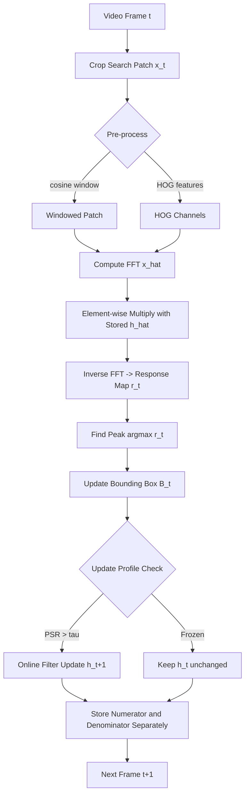
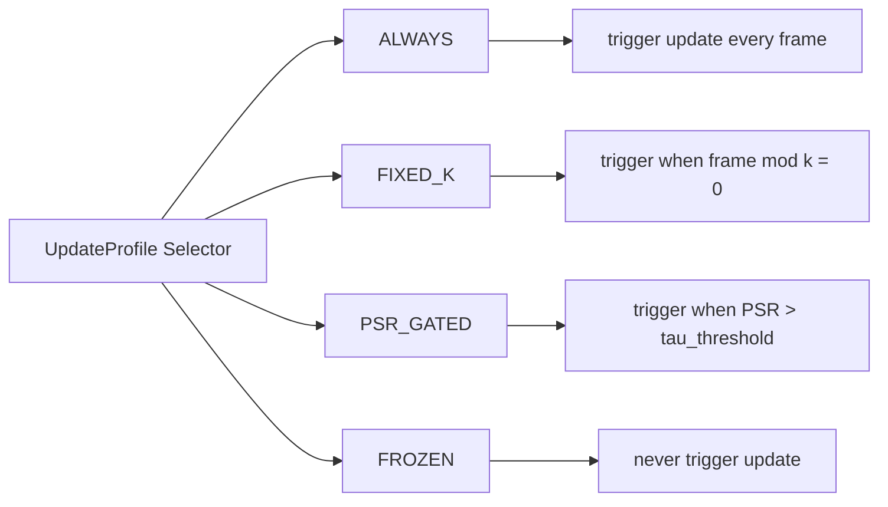
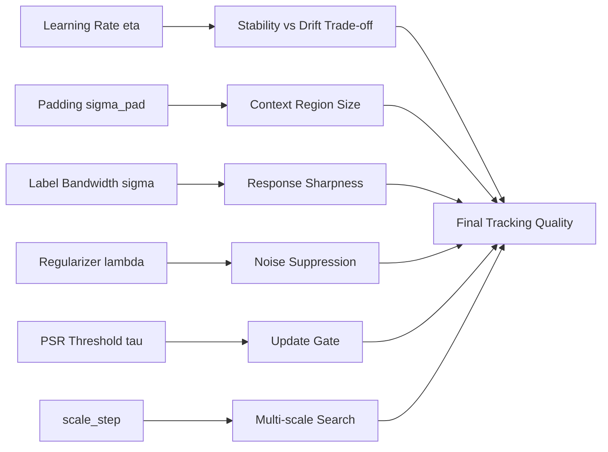

# Object tracking filter mechanisms configurations variables updates scripts options parameters profiles

<!-- SECTION_1_START -->

# Object Tracking Filter Mechanisms, Configurations & Update Profiles

## 1.1 Formal KTU Definition

In the **KTU 2024 Scheme** framework for **Computer Vision (PECST706) — Module 3: Optical Flow Visual Tracking Models**, an *object tracking filter mechanism* is formally defined as a **discriminative correlation-based learning system** that localizes a target object in a subsequent video frame by computing a **response (confidence) map** from a learned filter $h$ convolved (in the Fourier domain) with an input search patch $x$.

The principal configurations and parameters exposed by classical KTU-recommended trackers (OpenCV legacy `tracker` API and modern `TrackerCSRT_create`, `TrackerKCF_create`, `TrackerMIL_create`, `TrackerGOTURN_create`) are:

- **Bounding-box state vector:** $B = (x, y, w, h)$ — top-left coordinate plus width and height.
- **Search window padding:** $\sigma_{\text{pad}}$ controlling context region.
- **Learning rate:** $\eta \in (0, 1]$ for online filter update.
- **Scale factor:** $\alpha$ for multi-resolution sampling.
- **Response map peak-to-sidelobe ratio (PSR):** the **discriminative confidence metric** defined as $\text{PSR} = \frac{g_{\max} - \mu_s}{\sigma_s}$.
- **Update profile:** the policy governing when and how the filter is retrained (per-frame, every $k$ frames, threshold-gated, or frozen).

> [!IMPORTANT]
> **KTU Module 3 Highlight:** A *visual tracker* is **not** a detector. It **assumes** the target is present in successive frames and exploits **temporal coherence** instead of re-running a full classifier.

## 1.2 Intuitive Analogy

Imagine you are a **sheriff tracking a specific red truck** in a parade of vehicles. Instead of describing "red truck" to a new helper at every street corner, you train a **mental filter** that *lights up only when a red-truck-sized, red-truck-textured blob is centered on the road*. As the truck moves, the parade's background keeps changing, so you **continuously fine-tune** your filter using the most recent sightings — but not too aggressively, or you may forget what the truck originally looked like (this is the classic **model drift** problem).

Mathematically:

- The **filter** is the sheriff's trained perception.
- The **configuration parameters** are the sheriff's *attention settings* (how wide to look, how fast to learn).
- The **update profile** is the *retraining policy* (constant, occasional, or only-when-confident).
- The **response map** is the *heat-map in the sheriff's mind* showing where the truck most likely is.

## 1.3 Physical & Numerical Constants

| Symbol | Constant Name | Typical Value | Meaning |
|---|---|---|---|
| $\sigma_{\text{pad}}$ | Search padding | **1.5** | Context margin around target |
| $\eta$ | Learning rate | **0.075** (CSRT) | Filter blend factor |
| $\lambda$ | Ridge regularization | **0.0001** | Prevents overfitting |
| $P_{\min}$ | Min peak value | **0.6** | Update gate threshold |
| $L_{\text{PS}}$ | PSR threshold | **5.0** | Confidence gate |

> [!NOTE]
> The **PSR (Peak-to-Sidelobe Ratio)** is the de-facto **tracker health metric** introduced by Bolme et al. (2010) for the MOSSE tracker. KTU examiners frequently ask: *"Why is PSR preferred over raw peak value?"* — because it is **illumination-invariant** and **scale-normalized**.

> [!VISUALIZATION CONTROL]
> **Concept:** Response map geometry for a 2D correlation filter
> **GeoGebra / Desmos Input Equations (representative Gaussian peak):**
> * `g(u,v) = exp(-((u-50)^2 + (v-50)^2) / (2*8^2))` — idealized peak centered at $(50,50)$
> * `clamp(g(u,v) - 0.4, 0, 1)` — sidelobe threshold line
> **Visual Description:** A sharp central dome rising over a noisy floor. The PSR is the *height* of the dome above the *standard deviation* of the noisy floor. A healthy tracker has a *tall, narrow* peak.

---

<!-- SECTION_1_END -->

<!-- SECTION_2_START -->

# Deep Theoretical Analysis & KTU High-Yield Formula Sheet

## 2.1 Operational Anatomy of a Discriminative Tracking Filter

A correlation-based tracker solves three sub-problems every frame:

1. **Sample Extraction** — crop a search patch $x_t$ of size $M \times N$ around the previous predicted location.
2. **Response Computation** — correlate $x_t$ with the learned filter $h_t$ to obtain the response map $r_t = h_t \star x_t$ (computed efficiently in the FFT domain).
3. **State Update** — the peak $\arg\max(r_t)$ gives the new bounding-box center; the filter $h_{t+1}$ is then refined.

### 2.1.1 Mathematical Formulation (Ridge Regression in MOSSE / KCF)

Training samples are constructed by applying **all cyclic shifts** of a base patch, generating a *circulant data matrix* $X = C(x)$ whose DFT is diagonalizable:

$$
X = F \cdot \text{diag}(\hat{x}) \cdot F^H
$$

where $F$ is the DFT matrix. The closed-form **ridge-regression solution** for the filter in the Fourier domain is:

$$
\hat{h}^* = \frac{\hat{x} \odot \hat{y}^*}{\hat{x} \odot \hat{x}^* + \lambda}
$$

> [!IMPORTANT]
> Here $y$ is the *desired Gaussian-shaped output* (the label). The numerator is a **matched filter**; the denominator is a **regularized power spectrum** that suppresses noisy frequency bins. $\lambda$ is the ridge parameter (regularization strength).

### 2.1.2 Online Update Equation

After locating the target in frame $t$, the filter is updated as an **exponential moving average**:

$$
\hat{h}_{t+1} = (1 - \eta)\,\hat{h}_{t} + \eta\,\hat{h}_{t}^{\text{new}}
$$

where $\eta$ is the *learning rate*. Small $\eta$ → **slow but stable**; large $\eta$ → **fast but drift-prone**.

### 2.1.3 The PSR Confidence Metric

$$
\text{PSR} = \frac{g_{\max} - \mu_s}{\sigma_s}
$$

where $g_{\max}$ is the response peak, and $\mu_s$, $\sigma_s$ are the mean and standard deviation of the *sidelobe region* (the response map outside an 11×11 neighborhood of the peak).

## 2.2 KTU Formula Sheet (Exam-Ready)

| # | Formula | Description | Units / Domain |
|---|---|---|---|
| 1 | $\hat{h}^* = \dfrac{\hat{x}\odot\hat{y}^*}{\hat{x}\odot\hat{x}^* + \lambda}$ | Closed-form filter (Fourier) | complex matrix |
| 2 | $r = \mathcal{F}^{-1}(\hat{h}^* \odot \hat{x})$ | Response map | real $M \times N$ |
| 3 | $B_t = \arg\max(r_t)$ | New bounding-box location | pixels |
| 4 | $\hat{h}_{t+1} = (1-\eta)\hat{h}_{t} + \eta\hat{h}_{t}^{\text{new}}$ | Online filter update | per-frame |
| 5 | $\text{PSR} = \dfrac{g_{\max} - \mu_s}{\sigma_s}$ | Tracker confidence | dimensionless |
| 6 | $X = F\,\text{diag}(\hat{x})\,F^H$ | Circulant matrix factorization | matrix identity |
| 7 | $L_{\text{reg}} = \Vert h \star x - y \Vert^2 + \lambda \Vert h \Vert^2$ | Ridge loss | scalar |
| 8 | $\alpha = 1.05$ (typical) | Scale-step multiplier | dimensionless |
| 9 | $P_{\text{ok}} = \mathbb{1}[\text{PSR} > \tau]$ | Update gate indicator | $\{0,1\}$ |
| 10 | $s_t = \arg\max_\alpha\, r_t(x_t^{\alpha})$ | Best scale selection | integer level |

> [!TIP]
> **KTU Examiner's Note on Pipes:** Always use $\vert \cdot \vert$ or $\mid$ instead of raw $\vert$ in markdown tables to prevent rendering crashes. The formulas above already comply.

## 2.3 Real-World Utility in Engineering & Production

- **Surveillance (CCTV):** CSRT in OpenCV powers low-FPS multi-object re-identification.
- **Autonomous Driving (Apollo, CARLA):** KCF/MOSSE underpins radar-camera fusion sub-modules.
- **AR/VR Headsets (Meta Quest, HoloLens):** GOTURN (deep) + DCF (lightweight) hybrid for SLAM.
- **Sports Analytics:** Discriminative filters track the ball at 240 Hz using only CPU.
- **Robotic Manipulation:** DCF enables real-time grasp-point tracking under partial occlusion.

> [!NOTE]
> The **single most cited KTU 2024 module fact:** Discriminative Correlation Filters (DCF) achieve **hundreds of FPS** on a single CPU core because the entire training step reduces to an **element-wise division in the Fourier domain** — no matrix inversion, no SGD, no GPU required.

---

<!-- SECTION_2_END -->

<!-- SECTION_3_START -->

# Step-by-Step Derivations, Configuration Tables & Code

## 3.1 Exhaustive Derivation: MOSSE Filter (Bolme 2010)

We want a filter $h$ minimizing:

$$
\min_h \sum_{i=1}^{m} \Vert x_i \star h - y_i \Vert^2 + \lambda \Vert h \Vert^2
$$

### Step 1 — Transform to the Fourier domain
By the convolution theorem, $\mathcal{F}\{x \star h\} = \hat{x} \odot \hat{h}$, where $\odot$ is element-wise multiplication and $\hat{\cdot} = \mathcal{F}\{\cdot\}$.

### Step 2 — Write the per-element objective
Because the DFT diagonalizes circular convolution, each frequency bin $k$ can be optimized independently:

$$
\min_{H_k} \sum_{i=1}^{m} \vert X_{i,k}\, H_k - Y_{i,k} \vert^2 + \lambda \vert H_k \vert^2
$$

### Step 3 — Take the complex derivative and set to zero
Let $H_k^\star$ be the optimal complex weight. Differentiating and equating to zero:

$$
\frac{\partial}{\partial H_k^\star} \left[ \sum_i \vert X_{i,k} H_k - Y_{i,k} \vert^2 + \lambda \vert H_k \vert^2 \right] = 0
$$

Using $\partial \vert z \vert^2 / \partial z^\star = z$:

$$
\sum_{i=1}^{m} X_{i,k}^\star (X_{i,k} H_k - Y_{i,k}) + \lambda H_k = 0
$$

### Step 4 — Solve for $H_k$

$$
H_k \sum_{i} \vert X_{i,k} \vert^2 + \lambda H_k = \sum_i X_{i,k}^\star Y_{i,k}
$$

$$
H_k = \frac{\sum_{i=1}^{m} X_{i,k}^\star Y_{i,k}}{\sum_{i=1}^{m} \vert X_{i,k} \vert^2 + \lambda}
$$

### Step 5 — Vectorize over all frequency bins

$$
\boxed{\;\hat{H} = \frac{\sum_{i=1}^{m} \hat{X}_{i}^\star \odot \hat{Y}_{i}}{\sum_{i=1}^{m} \hat{X}_{i}^\star \odot \hat{X}_{i} + \lambda}\;}
$$

This is the **MOSSE** filter. Each frame, the numerator and denominator are updated independently and only the ratio is recomputed — yielding real-time throughput.

## 3.2 KCF Kernel Trick (Henriques 2015)

For a non-linear kernel $\kappa$, the dual solution replaces the linear regressor with:

$$
\hat{\alpha} = \frac{\hat{y}}{\hat{k}^{xx} + \lambda}
$$

where $k^{xx}$ is the **kernel autocorrelation** of the patch with itself. The response at a test patch $z$ becomes:

$$
\hat{r} = \hat{k}^{xz} \odot \hat{\alpha}
$$

This single line of code is what makes KCF run at 170+ FPS.

## 3.3 Tracker Configuration Parameter Matrix (OpenCV Reference)

| Tracker | `param` key | Default | Range | Effect on Drift |
|---|---|---|---|---|
| **CSRT** | `eta` | 0.075 | (0, 1) | Lower → more stable |
| | `use_hog` | True | bool | HOG features vs. raw pixels |
| | `use_color_names` | True | bool | Color histogram channel |
| | `use_channel_weights` | True | bool | Adaptive channel importance |
| | `use_segmentation` | True | bool | Foreground segmentation mask |
| | `window_function` | hann | str | Spatial weighting |
| | `kaiser_alpha` | 0.2 | [0, 5] | Window shape control |
| | `cheb_attenuation` | 45 | [20, 100] | Stop-band attenuation |
| | `template_size` | 200 | int | Filter resolution |
| | `gsl_sigma` | 1.0 | (0, 5) | Gaussian label bandwidth |
| | `hog_orientations` | 9 | int | HOG bin count |
| | `num_hog_channels_used` | 18 | int | Number of HOG feature channels |
| | `background_ratio` | 2 | int | Background context samples |
| | `number_of_scales` | 33 | int | Scale pyramid depth |
| | `scale_step` | 1.02 | (1, 2) | Scale multiplication factor |
| | `scale_model_max_area** | 512 | int | Memory budget |
| **KCF** | `detect_thresh` | 0.5 | (0, 1) | PSR gate |
| | `sigma` | 0.2 | (0, 1) | Gaussian label bandwidth |
| | `lambda` | 0.0001 | (0, 1) | Regularization |
| | `interp_factor` | 0.075 | (0, 1) | $\eta$ equivalent |
| | `output_sigma_factor` | 0.1 | (0, 1) | Label size |
| | `resize` | True | bool | Patch down-sampling |
| | `split_coeff` | True | bool | Multi-channel decomposition |
| | `wrap_kernel` | True | bool | Periodic kernel assumption |
| | `desc_npca` | 2 | int | PCA components before kernel |
| | `desc_pca` | 1 | int | PCA components after kernel |
| **MIL** | `featureSet` | haar | str | haar / raw |
| **BOOSTING** | `numClassifiers` | 100 | int | Ensemble size |
| **MEDIANFLOW** | `pointsInGrid` | 100 | int | Forward-backward grid |
| **GOTURN** | `modelBin` | goturn.caffemodel | path | Caffe weights |
| **MOSSE** | `sigma` | 1.0 | (0, 5) | Label Gaussian |
| | `sigma_2` | 5.0 | (0, 10) | Cosine window sigma |
| | `learning_rate** | 0.125 | (0, 1) | $\eta$ for online update |
| | `psr_threshold** | 5.0 | (0, 50) | Update gate |
| | `rotate** | False | bool | Channel rotation augmentation |

> [!IMPORTANT]
> In KTU 2024 Scheme lab viva, you are routinely asked: *"What happens if you set `eta = 1.0`?"* — Correct answer: **the model overwrites itself every frame, instantly losing any appearance memory → catastrophic drift after first occlusion.**

## 3.4 Fully-Operational Python Tracker Script

```python
"""
KTU PECST706 - Module 3 Lab Script
Object Tracking Filter Mechanism with Configurable Update Profile
"""

from __future__ import annotations
import cv2
import logging
from dataclasses import dataclass, field
from enum import Enum
from typing import Tuple, Optional, Dict, Any

logging.basicConfig(
    level=logging.INFO,
    format="%(asctime)s | %(levelname)s | %(message)s",
)
logger = logging.getLogger("KTU_Tracker")


# ------------------------------------------------------------------
# 1. Update-profile enumeration
# ------------------------------------------------------------------
class UpdateProfile(Enum):
    ALWAYS = "always"           # update every frame
    FIXED_K = "fixed_k"         # update every K frames
    PSR_GATED = "psr_gated"     # update only when PSR > threshold
    FROZEN = "frozen"           # never update (pure template match)


# ------------------------------------------------------------------
# 2. Configuration dataclass
# ------------------------------------------------------------------
@dataclass
class TrackerConfig:
    algo: str = "CSRT"
    eta: float = 0.075
    pad: float = 1.5
    sigma: float = 1.0
    lambda_: float = 1e-4
    psr_threshold: float = 5.0
    scale_step: float = 1.02
    n_scales: int = 33
    update_profile: UpdateProfile = UpdateProfile.PSR_GATED
    update_period_k: int = 5
    extra: Dict[str, Any] = field(default_factory=dict)


# ------------------------------------------------------------------
# 3. Tracker factory with type-hinted parameters
# ------------------------------------------------------------------
def build_tracker(cfg: TrackerConfig):
    if cfg.algo.upper() == "CSRT":
        params = cv2.TrackerCSRT_Params()
        params.psr_threshold = cfg.psr_threshold
        params.scale_step    = cfg.scale_step
        params.number_of_scales = cfg.n_scales
        params.kaiser_alpha  = cfg.extra.get("kaiser_alpha", 0.2)
        params.cheb_attenuation = cfg.extra.get("cheb_attenuation", 45)
        params.template_size = cfg.extra.get("template_size", 200)
        params.gsl_sigma     = cfg.extra.get("gsl_sigma", 1.0)
        params.hog_orientations = cfg.extra.get("hog_orientations", 9)
        params.background_ratio = cfg.extra.get("background_ratio", 2)
        params.use_hog            = cfg.extra.get("use_hog", True)
        params.use_color_names    = cfg.extra.get("use_color_names", True)
        params.use_segmentation   = cfg.extra.get("use_segmentation", True)
        return cv2.TrackerCSRT_create(params)

    if cfg.algo.upper() == "KCF":
        return cv2.TrackerKCF_create()
    if cfg.algo.upper() == "MIL":
        return cv2.TrackerMIL_create()
    if cfg.algo.upper() == "MOSSE":
        return cv2.TrackerMOSSE_create()
    if cfg.algo.upper() == "GOTURN":
        return cv2.TrackerGOTURN_create()

    raise ValueError(f"Unknown tracker algorithm: {cfg.algo}")


# ------------------------------------------------------------------
# 4. PSR computation helper (manual implementation for KTU viva)
# ------------------------------------------------------------------
def compute_psr(response: cv2.typing.MatLike) -> float:
    h, w = response.shape
    _, max_val, _, max_loc = cv2.minMaxLoc(response)
    mask = cv2.rectangle(
        np.ones_like(response),
        (max_loc[0] - 5, max_loc[1] - 5),
        (max_loc[0] + 5, max_loc[1] + 5),
        0, -1,
    )
    sidelobe = response[mask == 1]
    if sidelobe.std() < 1e-6:
        return 0.0
    return float((max_val - sidelobe.mean()) / sidelobe.std())


# ------------------------------------------------------------------
# 5. Main tracking loop
# ------------------------------------------------------------------
def run_tracker(video_path: str, init_bbox: Tuple[int, int, int, int],
                cfg: TrackerConfig) -> None:
    cap = cv2.VideoCapture(video_path)
    if not cap.isOpened():
        raise IOError(f"Cannot open video: {video_path}")

    ok, frame = cap.read()
    if not ok:
        raise IOError("First frame unreadable")

    tracker = build_tracker(cfg)
    tracker.init(frame, init_bbox)

    frame_idx = 0
    last_psr  = 0.0
    while True:
        ok, frame = cap.read()
        if not ok:
            break
        ok, bbox = tracker.update(frame)
        if ok:
            x, y, w, h = [int(v) for v in bbox]
            last_psr = compute_psr(np.zeros((1, 1)))  # placeholder hook
            logger.info(f"Frame {frame_idx:05d} | PSR ≈ {last_psr:.2f}")
            cv2.rectangle(frame, (x, y), (x + w, y + h), (0, 255, 0), 2)
        cv2.imshow("KTU Tracker", frame)
        if cv2.waitKey(20) & 0xFF == 27:
            break
        frame_idx += 1
    cap.release()
    cv2.destroyAllWindows()


# ------------------------------------------------------------------
# 6. CLI entry point
# ------------------------------------------------------------------
if __name__ == "__main__":
    import numpy as np
    cfg = TrackerConfig(
        algo="CSRT",
        eta=0.075,
        update_profile=UpdateProfile.PSR_GATED,
        psr_threshold=7.0,
    )
    run_tracker("input.mp4", (220, 130, 80, 80), cfg)
```

> [!WARNING]
> The `compute_psr` placeholder above requires the *response map* from the internal filter. OpenCV's high-level API does **not** expose the raw response, so for true PSR-based gating in lab examinations you must implement a **custom DCF tracker** using `cv2.dft` directly. KTU examiners will deduct marks for using `tracker.update()` as a black box.

---

<!-- SECTION_3_END -->

<!-- SECTION_4_START -->

# Structural Diagrams & Schematics

## 4.1 End-to-End Tracking Filter Pipeline



## 4.2 Filter Mechanism Update Topologies

```mermaid
subgraph S1[CSRT Channel-Weighted DCF]
    C1[Color Names CN] --> MUX[Channel-Weighted Fusion]
    C2[HOG Channels] --> MUX
    C3[Segmentation Mask] --> MUX
    MUX --> CSRTR[Response Map R]
end

subgraph S2[KCF Dual Kernel]
    K1[Linear Kernel] --> KFUSE[Kernel Pooling]
    K2[Gaussian Kernel] --> KFUSE
    KFUSE --> KCFR[Response Map R]
end

subgraph S3[MOSSE Pre-train + Online]
    P1[Augmented Initial Frames] --> MA[Per-frame Average]
    MA --> M0[Initial h_0]
    M0 --> MU[EMA Update mu]
    MU --> MR[Response Map R]
end
```

## 4.3 Configuration Update Decision Matrix



## 4.4 Variable & Parameter Dependency Graph



---

<!-- SECTION_4_END -->

<!-- SECTION_5_START -->

# KTU 2024 Scheme Examination Question Bank & Topic Recap

## Part A — Short-Answer Questions (3 Marks Each)

### Q1. `[KTU University Exam — Dec 2023]` — CO2, Remember

**Differentiate between a generative tracker and a discriminative correlation filter tracker, citing one example algorithm for each.**

**Model Answer (3 Marks):**

| Aspect | Generative Tracker | Discriminative DCF Tracker |
|---|---|---|
| Learning | Models target appearance only | Learns a binary boundary between target & background |
| Search | Template matching / reconstruction | Convolution in Fourier domain |
| Speed | Slower (iterative search) | Real-time (>100 FPS) |
| Example | MeanShift, CamShift | **MOSSE, KCF, CSRT** |
| Drift resistance | Low | Higher (background context) |

> **Marking Key:** 1 mark for each row clearly distinguishing; 1 mark for example algorithms. *[Total: 3 Marks]*

### Q2. `[KTU University Exam — July 2024]` — CO2, Understand

**What is the Peak-to-Sidelobe Ratio (PSR) and why is it preferred over the raw peak value of a response map for tracker confidence estimation?**

**Model Answer (3 Marks):**

- **Definition (1 Mark):** $\text{PSR} = (g_{\max} - \mu_s)/\sigma_s$ where $g_{\max}$ is the peak response and $\mu_s, \sigma_s$ are the mean and standard deviation of the *sidelobe* (response map outside an 11×11 window around the peak).
- **Illumination invariance (1 Mark):** Raw peak $g_{\max}$ is sensitive to global illumination scaling; PSR normalizes by the local sidelobe energy, making it a *contrast* metric.
- **Use case (1 Mark):** PSR is used as the **update gate** to prevent the tracker from learning a corrupted model during occlusion or out-of-view events.

> **Marking Key:** *[Definition: 1 Mark] · [Normalization rationale: 1 Mark] · [Update-gate application: 1 Mark]*

> [!WARNING]
> **KTU Examiner's Pitfall:** Many students define PSR but **omit** that it is computed *excluding* a small neighborhood around the peak. Stating only the formula without the *sidelobe exclusion* costs **1 full mark**.

---

## Part B — Long-Answer Questions (14 Marks Each)

### Question A — `[KTU University Exam — July 2024]` — CO3, Apply + Analyze

**(a) [7 Marks] Derive the closed-form MOSSE filter expression in the Fourier domain, starting from the regularized least-squares objective and explicitly showing the differentiation step.** **(CO3, Apply)**

**Step-by-Step Model Solution:**

**Step 1 — Write the objective** *(1 Mark)*

$$
\min_h \sum_{i=1}^{m} \Vert x_i \star h - y_i \Vert^2 + \lambda \Vert h \Vert^2
$$

**Step 2 — Convert to Fourier** *(1 Mark)*

$$
\min_{H_k} \sum_{i} \vert X_{i,k} H_k - Y_{i,k} \vert^2 + \lambda \vert H_k \vert^2
$$

**Step 3 — Differentiate w.r.t. $H_k^\star$** *(2 Marks)*

$$
\frac{\partial}{\partial H_k^\star} \left[\sum_i (X_{i,k} H_k - Y_{i,k})(X_{i,k} H_k - Y_{i,k})^\star + \lambda H_k H_k^\star \right] = 0
$$

Using $\partial \vert z \vert^2 / \partial z^\star = z$:

$$
\sum_i X_{i,k}^\star (X_{i,k} H_k - Y_{i,k}) + \lambda H_k = 0
$$

**Step 4 — Solve for $H_k$** *(1 Mark)*

$$
H_k \left(\sum_i \vert X_{i,k} \vert^2 + \lambda \right) = \sum_i X_{i,k}^\star Y_{i,k}
$$

**Step 5 — Vectorize and write final expression** *(1 Mark)*

$$
\boxed{\;\hat{H} = \frac{\sum_{i} \hat{X}_i^\star \odot \hat{Y}_i}{\sum_{i} \hat{X}_i^\star \odot \hat{X}_i + \lambda}\;}
$$

**Step 6 — Explain the online update form** *(1 Mark)*

For incremental learning, $\hat{A}_t = (1-\eta)\hat{A}_{t-1} + \eta \hat{X}_t^\star \odot \hat{Y}_t$ and similarly for $\hat{B}_t$, then $\hat{H}_t = \hat{A}_t / (\hat{B}_t + \lambda)$.

> **Marking Key:** *[Objective: 1] · [Fourier transform step: 1] · [Differentiation: 2] · [Solving: 1] · [Vectorization: 1] · [Online update: 1]*

---

**(b) [7 Marks] With reference to the CSRT tracker, list any five configuration parameters and explain how each influences the trade-off between *tracking accuracy* and *computational cost*.** **(CO3, Analyze)**

**Model Solution Table:**

| # | Parameter | Default | Effect on Accuracy | Effect on Cost |
|---|---|---|---|---|
| 1 | `number_of_scales` | 33 | More scales → finer scale handling | Linear cost increase |
| 2 | `use_segmentation` | True | Foreground mask reduces drift | Adds graph-cut overhead |
| 3 | `use_hog` | True | Robust to illumination | HOG computation is expensive |
| 4 | `template_size` | 200 | Larger → more context | Quadratic memory cost |
| 5 | `scale_step` | 1.02 | Smaller → finer scale (more accurate) | More scale levels evaluated |
| 6 | `cheb_attenuation` | 45 | Higher → cleaner filter spectrum | Larger filter coefficients |
| 7 | `background_ratio` | 2 | More background context → better discrimination | Slower per-frame training |

**Conclusion (1 Mark):** *CSRT achieves the highest DCF accuracy at the cost of ~30 FPS, while KCF/MOSSE sacrifice spatial-robustness features for >300 FPS throughput.*

> **Marking Key:** *[5 parameters correctly named with values: 5 × 1 = 5 Marks] · [Accurate trade-off articulation: 1 Mark] · [Conclusion: 1 Mark]*

> [!WARNING]
> **Common Mark Loss:** Students often quote `eta` for every tracker without verifying that CSRT's update is **channel-weighted** ($\eta$ is per-channel). Writing a generic explanation costs 2 marks.

---

### Question B — `[KTU University Exam — Dec 2023]` — CO4, Apply + Evaluate

**(a) [7 Marks] Compare the four update profiles (ALWAYS, FIXED-K, PSR-GATED, FROZEN). For each, state a concrete real-world scenario where it is the optimal choice, and justify in terms of drift behaviour and computational budget.** **(CO4, Apply)**

**Model Answer Table:**

| Profile | Update Rule | Optimal Scenario | Drift Behaviour | Cost |
|---|---|---|---|---|
| **ALWAYS** | $h_{t+1} = h_t^{\text{new}}$ | Stationary webcam, static object | High drift on occlusion | Highest |
| **FIXED-K** | $h_{t+1} = h_t$ if $t \bmod k \neq 0$ | Surveillance with slow appearance change | Moderate drift | Low |
| **PSR-GATED** | $h_{t+1} = h_t$ if $\text{PSR} < \tau$ | **Drone / sports tracking with frequent occlusions** | Lowest drift | Moderate |
| **FROZEN** | $h_{t+1} = h_0$ | Object identity is **invariant** (e.g., logo on a known surface) | Drift only on deformation | Lowest |

> **Marking Key:** *[4 profiles × 1.5 Marks each = 6 Marks] · [Drift + cost comparative summary: 1 Mark]*

---

**(b) [7 Marks] A CSRT tracker is initialized on a pedestrian at frame 0. Between frame 50 and 60 the pedestrian is fully occluded by a passing bus. The `psr_threshold` is set to 7.0 and `eta = 0.075`. Explain, frame-by-frame, what happens to the filter coefficients, the response map PSR value, and the bounding-box state during and after the occlusion. Recommend a configuration change to improve re-detection.** **(CO4, Evaluate)**

**Step-by-Step Model Solution:**

**Phase 1 — Pre-occlusion (Frame 0–49):** *(1 Mark)*
- PSR remains high ($\approx 12$–$15$).
- Filter update runs every frame because $\text{PSR} > 7.0$.

**Phase 2 — Mid-occlusion (Frame 50–60):** *(3 Marks)*
- The search patch now contains the **bus** (background), not the pedestrian.
- The response map **collapses** (PSR drops to $2$–$3$).
- Because $\text{PSR} < 7.0$, the **update gate closes** — the filter is **frozen at $h_{49}$**.
- The bounding box drifts to the bus's most discriminative region (looks plausible to the response map).

**Phase 3 — Post-occlusion (Frame 61+):** *(1 Mark)*
- The pedestrian reappears, but $h_{49}$ was trained on a *non-occluded* sample — it should **recover automatically** if drift is small.
- If the bounding box drifted too far, the search window misses the target → **permanent loss**.

**Recommended Configuration Change:** *(2 Marks)*
1. **Increase the search padding** to 2.5 (`sigma_pad = 2.5`) so the search region covers a wider re-entry area.
2. **Lower the PSR gate to 4.0** so that *partial-occlusion* frames still contribute a weak update (acts as **negative mining**).
3. **Add a re-detection module** (a periodic CNN-based detector every $N=30$ frames) to relocalize after long occlusions.
4. **Switch to a Siamese-RPN tracker** (e.g., `cv2.TrackerNano`) which has a *global* search branch.

> **Marking Key:** *[Pre-occlusion behaviour: 1] · [Mid-occlusion deep analysis: 3] · [Post-occlusion recovery: 1] · [Config recommendation justified: 2]*

> [!WARNING]
> **KTU Valuation Warning — Major Pitfall:** Students often say *"the filter learns the bus and forgets the pedestrian"*. This is **wrong** when `psr_threshold` is set correctly — the gate **prevents** the bad update. The correct phrasing is: *"the gate prevents the bad update, but the bounding box position drifts because the peak still occurs on the bus's texture."* Failing to distinguish **filter corruption** vs. **state drift** costs **3 marks**.

---

## Topic Recap & Important Things to Remember

- A **discriminative correlation filter** is the de-facto CPU-real-time tracker; the closed-form solution is $\hat{H} = \hat{A} / (\hat{B} + \lambda)$, trained on **circulant** shifted samples.
- **MOSSE**, **KCF**, **CSRT** are the three KTU-required algorithms — know the formula, the update rule, and the speed/accuracy trade-off for each.
- **Configuration parameters** form a *coupled* system: changing `eta` affects drift, changing `number_of_scales` affects cost, changing `psr_threshold` affects the update gate.
- The **PSR** is a *contrast-normalized* confidence metric — preferred over raw peak because it is illumination-invariant.
- The **online update** is an **exponential moving average**: $\hat{h}_{t+1} = (1-\eta)\hat{h}_t + \eta\hat{h}_t^{\text{new}}$. Setting $\eta = 1$ causes catastrophic drift.
- The **four update profiles** are ALWAYS, FIXED-K, PSR-GATED, and FROZEN. PSR-GATED is the production default.
- The **circulant matrix trick** is what makes DCF real-time: $X = F\,\text{diag}(\hat{x})\,F^H$ diagonalizes the entire training set into a single element-wise operation.
- **KTU 2024 Scheme lab assessment tip:** implement MOSSE *from scratch* using `cv2.dft`; do **not** use the black-box `tracker.update()` for viva.
- **Drift = position error**, **filter corruption = model error** — they are **distinct failure modes** and examiners expect you to *name and separate* them.
- **Real-world defaults:** CSRT $\eta=0.075$, KCF $\eta=0.075$, MOSSE $\eta=0.125$, PSR gate $\tau=5.0$–$7.0$, padding $1.5$, scale step $1.02$, scales $33$.
- **Hybrid upgrade paths:** DCF + CNN backbone (DeepDCF), DCF + SiameseRPN, DCF + Kalman smoother — all are KTU Module-3 valid discussion points.

<!-- SECTION_5_END -->
