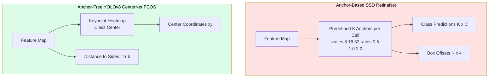

# Vision validation protocols software deployments metrics verification profiles validation monitoring

<!-- SECTION_1_START -->
# Object Detection Networks, Frameworks, Validation & Deployment Protocols

> [!IMPORTANT]
> **KTU 2024 Scheme — PECST706 | Computer Vision | Module 4**
> This module consolidates the engineering pipeline that takes an object detection model from **architecture** → **training** → **validation** → **deployment** → **monitoring**. Mastery of the metrics (mAP, IoU), frameworks (YOLO, Faster R-CNN, SSD, RetinaNet), and deployment formats (ONNX, TensorRT, OpenVINO, TFLite) is essential for board-level questions.

## 1.1 Formal Academic Definition

> [!NOTE]
> **Object Detection** is a computer vision task that involves **localizing** (drawing a tight bounding box around) and **classifying** (assigning a category label to) every instance of a pre-defined set of object classes within a digital image or video frame. It is formally a supervised learning problem where the model learns a mapping:
> $$f_{\theta}: \mathbb{R}^{H \times W \times 3} \rightarrow \{(c_i, b_i, s_i)\}_{i=1}^{N}$$
> where $c_i \in \{1, 2, \dots, K\}$ is the class label, $b_i = (x_{min}, y_{min}, x_{max}, y_{max})$ is the bounding box in image coordinates, and $s_i \in [0, 1]$ is the confidence score. Here $\theta$ represents the learnable network parameters.

A modern **Object Detection Framework** is a complete software ecosystem — comprising a **backbone** (feature extractor), **neck** (feature aggregator such as FPN/PANet), **head** (classifier + regressor), **loss function**, **post-processor** (NMS), and **deployment runtime** — that enables researchers and engineers to train, validate, optimize, and serve detection models on heterogeneous hardware (GPU, CPU, edge NPU, FPGA).

**Validation Protocols** are the standardized, reproducible procedures (data splits, evaluation scripts, threshold settings) used to certify that a trained detection model meets predefined performance, robustness, and fairness benchmarks before promotion to production.

**Deployment Profiles** are hardware- and software-specific execution configurations (precision: FP32/FP16/INT8, batch size, input resolution, accelerator backend) that package a validated model for inference on a target device.

**Monitoring** is the continuous, post-deployment observation of model predictions, input drift, latency, and throughput to detect **model decay**, **data drift**, and **hardware anomalies**.

## 1.2 Intuitive Real-World Analogy

> [!TIP]
> **Analogy — The Smart Warehouse Security System**
> Imagine a large warehouse with hundreds of security cameras. Each camera feed is processed by a system that must answer three questions for every frame: *What objects are present? (classification), Where exactly are they? (localization), and How sure am I? (confidence)*. Object detection is the AI "brain" doing this job. **Validation** is the quality-control team that reviews the brain's decisions against ground truth before shipping it. **Deployment profiles** are the hardware specifications of the cameras (cheap edge chips vs. expensive server GPUs). **Monitoring** is the 24/7 dashboard that flags the moment the brain starts misidentifying forklifts as wheelbarrows (concept drift) or when a camera lens gets foggy (data drift). The "framework" is the entire integrated manufacturing + shipping + field-service pipeline.

## 1.3 Physical Constants, Standard Metrics & Reserved Symbols

The following symbols are **standardized** in the COCO, Pascal VOC, and Open Images benchmarks and will appear verbatim in KTU questions:

- **IoU (Intersection over Union)** — dimensionless ratio in $[0, 1]$.
- **mAP@0.5** — mean Average Precision at IoU threshold **0.5** (PASCAL VOC standard).
- **mAP@[0.5:0.95]** — mean AP averaged over 10 IoU thresholds from 0.5 to 0.95 in 0.05 steps (COCO standard, **primary KTU metric**).
- **AP per class** — area under the per-class Precision-Recall curve.
- **FPS (Frames Per Second)** — inference throughput; **1 FPS** ≈ 1000 ms latency.
- **FLOPs (Floating-Point Operations)** — measured in **GFLOPs** ($10^9$ ops) for modern detectors.
- **Params** — trainable parameters, measured in **Millions (M)**.

> [!NOTE]
> **Why these metrics?** mAP@0.5:0.95 is a **single scalar** that rewards both classification accuracy *and* localization tightness, making it the gold standard for KTU board questions. A detector with mAP@0.5:0.95 = 0.62 (e.g., YOLOv8-M) is considered production-grade on COCO.

> [!VISUALIZATION CONTROL]
> **Concept:** Intersection over Union (IoU) geometry between a predicted box $B_p$ and a ground-truth box $B_{gt}$.
> **GeoGebra / Desmos Input Equations (Rectangle Definition):**
> * `P1: Polygon((0,0), (4,0), (4,3), (0,3))` — Ground-truth box
> * `P2: Polygon((2,1), (7,1), (7,5), (2,5))` — Predicted box
> * `Intersection: Polygon((2,1), (4,1), (4,3), (2,3))` — overlap region
> **Visual Description:** Plot two overlapping rectangles. The shaded overlap region represents the **intersection area** $A_{inter}$. The total area covered by both rectangles is the **union area** $A_{union}$. The student should observe that **perfect alignment** yields $IoU = 1$ and **zero overlap** yields $IoU = 0$.

<!-- SECTION_1_END -->

<!-- SECTION_2_START -->
# Deep Theoretical Analysis & KTU High-Yield Formula Sheet

## 2.1 The Three Architectural Generations of Object Detection

### 2.1.1 Two-Stage Detectors (Region Proposal + Classification)

**Representative frameworks:** R-CNN (2014) → Fast R-CNN (2015) → **Faster R-CNN (2015)**.

- **Stage 1 — Region Proposal Network (RPN):** A lightweight CNN slides over the backbone feature map and proposes $k$ anchor boxes per spatial location. Each anchor is scored for "objectness" and refined in coordinates.
- **Stage 2 — Detection Head:** For each proposed region, **RoI Pooling** (or **RoI Align** in Mask R-CNN) extracts a fixed-size feature vector, which feeds a classifier and a box regressor.

> [!IMPORTANT]
> **Why Faster R-CNN matters for KTU:** It introduced the **anchor-based** paradigm that dominated detection for nearly a decade. The RPN loss is a *multi-task* loss:
> $$L_{RPN} = \frac{1}{N_{cls}} \sum_{i} L_{cls}(p_i, p_i^*) + \lambda \frac{1}{N_{reg}} \sum_{i} p_i^* L_{reg}(t_i, t_i^*)$$
> where $p_i$ is the predicted objectness probability, $p_i^* \in \{0, 1\}$ is the ground-truth label, $t_i$ is the predicted 4-parameter box offset, and $t_i^*$ is the target offset. $\lambda$ balances the two terms (typically $\lambda = 10$).

### 2.1.2 Single-Stage Detectors (Unified, Real-Time)

**Representative frameworks:** **YOLO** (v1 → v8), **SSD**, **RetinaNet**.

- The image is divided into an $S \times S$ grid. Each grid cell directly predicts $B$ bounding boxes, $C$ class probabilities, and 1 confidence score.
- **YOLOv1** used $S=7$, $B=2$, $C=20$ on PASCAL VOC.
- **YOLOv8** (Ultralytics, 2023) is anchor-free and uses a decoupled head with a Distribution Focal Loss for box regression.

### 2.1.3 Transformer-Based Detectors

**Representative frameworks:** DETR (2020), Deformable DETR (2021), DINO (2022), RT-DETR (2023).

- Eliminates anchors and NMS by using a **set-based Hungarian matcher** that performs bipartite matching between predictions and ground truths.
- Uses a CNN backbone + Transformer encoder-decoder with learnable **object queries** (typically 100–300 queries).

## 2.2 Loss Functions — The "Why" Behind the Math

> [!NOTE]
> **All anchor-based detectors share a common loss structure.** The key is to understand *why each term exists* — this is the most-frequently-asked derivation in KTU.

| Loss Term | Mathematical Form | Purpose |
|---|---|---|
| **Classification Loss** $L_{cls}$ | Cross-entropy: $-\sum_{c=1}^{K} y_c \log(\hat{p}_c)$ | Penalizes wrong class labels |
| **Localization Loss** $L_{loc}$ | Smooth L1: $\sum_{i \in \{x,y,w,h\}} \text{smooth}_{L_1}(t_i - t_i^*)$ | Penalizes box coordinate errors |
| **Objectness Loss** $L_{obj}$ | Binary cross-entropy on objectness score | Separates foreground from background |
| **Focal Loss** (RetinaNet) | $-\alpha (1-p)^\gamma \log(p)$ | Down-weights easy negatives (imbalance) |
| **DFL** (YOLOv8) | $-\sum_{i} (y_{i+1} - y) \log(\hat{y}_i) + (y - y_i) \log(\hat{y}_{i+1})$ | Models box coordinates as distributions |

The **Focal Loss** is defined as:
$$FL(p_t) = -\alpha_t (1 - p_t)^{\gamma} \log(p_t)$$
where $p_t$ is the model's estimated probability for the true class, $\alpha_t \in [0, 1]$ is a class-balancing weight, and $\gamma \geq 0$ is the focusing parameter (typically $\gamma = 2$).

## 2.3 Evaluation Metrics — Derivation-Ready Formulas

> [!IMPORTANT]
> **KTU board examiners love the IoU → Precision/Recall → AP → mAP derivation chain.** Memorize this chain in order.

### Step 1 — Intersection over Union (IoU)
$$\text{IoU}(B_p, B_{gt}) = \frac{\text{Area}(B_p \cap B_{gt})}{\text{Area}(B_p \cup B_{gt})} = \frac{A_{inter}}{A_{p} + A_{gt} - A_{inter}}$$

A prediction is a **True Positive (TP)** if $\text{IoU} \geq \tau$ (threshold). It is a **False Positive (FP)** if the predicted class is correct but IoU is below threshold, or if the box has no matching ground truth. A **False Negative (FN)** is a missed ground-truth object.

### Step 2 — Precision and Recall
$$\text{Precision} = \frac{TP}{TP + FP} \quad\quad \text{Recall} = \frac{TP}{TP + FN}$$

### Step 3 — Average Precision (AP) per class
Sort all detections of a class by descending confidence. Compute Precision and Recall at every detection. The AP is the **area under the Precision-Recall curve**:
$$AP = \int_0^1 p(r) \, dr$$
In practice, the **11-point interpolation** (PASCAL VOC) or **all-point interpolation** (COCO) is used.

### Step 4 — mean Average Precision (mAP)
$$mAP = \frac{1}{K} \sum_{k=1}^{K} AP_k$$
For COCO: $mAP@[0.5:0.95] = \frac{1}{10} \sum_{\tau \in \{0.5, 0.55, \dots, 0.95\}} mAP@\tau$.

## 2.4 The KTU High-Yield Formula Sheet

| # | Formula | Symbol Glossary | When to Use |
|---|---|---|---|
| 1 | $\text{IoU} = \dfrac{A_{inter}}{A_p + A_{gt} - A_{inter}}$ | $A_{inter}$: overlap area; $A_p$, $A_{gt}$: individual box areas | Matching predictions to ground truth |
| 2 | $P = \dfrac{TP}{TP + FP}$ | $TP$: true positives; $FP$: false positives | Computing precision |
| 3 | $R = \dfrac{TP}{TP + FN}$ | $FN$: false negatives | Computing recall |
| 4 | $F_1 = \dfrac{2 P R}{P + R}$ | Harmonic mean of P and R | Single-metric P-R balance |
| 5 | $AP = \int_0^1 p(r)\, dr$ | $p(r)$: precision as a function of recall | Area under PR curve |
| 6 | $mAP = \dfrac{1}{K}\sum_{k=1}^{K} AP_k$ | $K$: number of classes | Final detector score |
| 7 | $\text{Latency (ms)} = \dfrac{1000}{\text{FPS}}$ | FPS: frames per second | Real-time requirement check |
| 8 | $FL(p_t) = -\alpha_t (1-p_t)^\gamma \log p_t$ | $\gamma$: focusing param; $\alpha_t$: class weight | Imbalanced datasets |
| 9 | $L_{total} = L_{cls} + \lambda L_{reg}$ | $\lambda$: balance weight ($\approx 10$) | Multi-task detector loss |
| 10 | $\text{Params} = \sum_{l=1}^{L} (k_l^2 \cdot c_{l-1} \cdot c_l) + c_l$ | $k_l$: kernel size; $c_l$: channels | Model size estimation |

> [!TIP]
> **Real-world engineering utility:** A self-driving car perception stack must run a detector at $\geq$ **30 FPS** on an embedded GPU (e.g., NVIDIA Jetson Orin) with mAP@0.5:0.95 $\geq$ **0.55** on the cityscapes benchmark. The constraint $1000 / 30 \approx 33$ ms means the entire forward pass + NMS must complete in 33 ms. This is the **latency-FPS-mAP triangle** that production CV engineers optimize daily.

## 2.5 Deployment Frameworks — The Production Stack

| Framework | Vendor / Open | Target Hardware | Typical Precision | KTU Exam Cue |
|---|---|---|---|---|
| **ONNX** | Open (Linux Foundation) | CPU/GPU/Edge | FP32, FP16, INT8 | "Hardware-agnostic exchange format" |
| **TensorRT** | NVIDIA | NVIDIA GPUs, Jetson | FP32, FP16, **INT8** | "Optimized for NVIDIA" |
| **OpenVINO** | Intel | Intel CPU, VPU, iGPU | FP32, FP16, INT8 | "Optimized for Intel" |
| **TFLite** | Google | Android, Edge TPU, Coral | FP32, FP16, INT8 | "Mobile / Edge TPU" |
| **CoreML** | Apple | iOS, macOS, Neural Engine | FP16, INT8, INT4 | "Apple ecosystem" |
| **TorchScript** | Meta (PyTorch) | CPU/GPU servers | FP32, FP16 | "Native PyTorch export" |

The **ONNX (Open Neural Network Exchange)** format is a hardware-agnostic intermediate representation (IR) that allows a model trained in PyTorch to be exported and run on TensorRT, OpenVINO, TFLite, or any ONNX-compatible runtime. The typical pipeline is:
> **PyTorch (.pt) → ONNX (.onnx) → TensorRT (.engine) / OpenVINO (.xml+.bin) → Production Inference**

> [!IMPORTANT]
> **Validation Protocol Standard:** A KTU-acceptable validation must specify: (1) **dataset split** (e.g., COCO val2017 = 5000 images), (2) **IoU threshold** $\tau$, (3) **NMS IoU threshold** (typically 0.5 for inference, 0.6 for mAP@0.5:0.95), (4) **score threshold** (typically 0.001 for mAP, 0.5 for deployment), (5) **hardware profile** (GPU model, driver version, batch size).

<!-- SECTION_2_END -->

<!-- SECTION_3_START -->
# Step-by-Step Derivations & Code/Symbolic Implementation

## 3.1 Exhaustive Derivation: IoU Between Two Axis-Aligned Boxes

> [!NOTE]
> **Problem Setup:** Given predicted box $B_p = (x_1^{(p)}, y_1^{(p)}, x_2^{(p)}, y_2^{(p)})$ and ground-truth box $B_{gt} = (x_1^{(g)}, y_1^{(g)}, x_2^{(g)}, y_2^{(g)})$ in pixel coordinates, derive the IoU.

### Step 1 — Intersection Rectangle Coordinates

The intersection, if it exists, is itself a rectangle whose top-left corner is the element-wise **maximum** of the two top-left corners, and whose bottom-right corner is the element-wise **minimum** of the two bottom-right corners:

$$\begin{aligned}
x_1^{(I)} &= \max\bigl(x_1^{(p)},\; x_1^{(g)}\bigr) \\
y_1^{(I)} &= \max\bigl(y_1^{(p)},\; y_1^{(g)}\bigr) \\
x_2^{(I)} &= \min\bigl(x_2^{(p)},\; x_2^{(g)}\bigr) \\
y_2^{(I)} &= \min\bigl(y_2^{(p)},\; y_2^{(g)}\bigr)
\end{aligned}$$

### Step 2 — Intersection Area

The intersection width and height are:
$$w_I = \max\bigl(0,\; x_2^{(I)} - x_1^{(I)}\bigr), \quad h_I = \max\bigl(0,\; y_2^{(I)} - y_1^{(I)}\bigr)$$

The $\max(0, \cdot)$ clamps the value to zero when the boxes do **not overlap** (negative width implies disjoint boxes). The intersection area is:
$$A_{inter} = w_I \cdot h_I$$

### Step 3 — Individual Box Areas

$$\begin{aligned}
A_p &= (x_2^{(p)} - x_1^{(p)}) \cdot (y_2^{(p)} - y_1^{(p)}) \\
A_{gt} &= (x_2^{(g)} - x_1^{(g)}) \cdot (y_2^{(g)} - y_1^{(g)})
\end{aligned}$$

### Step 4 — Union Area (Inclusion-Exclusion Principle)

$$A_{union} = A_p + A_{gt} - A_{inter}$$

### Step 5 — Final IoU

$$\text{IoU} = \frac{A_{inter}}{A_{union}} = \frac{A_{inter}}{A_p + A_{gt} - A_{inter}}$$

> [!TIP]
> **Sanity Checks** for examiners: (a) If boxes are identical, $A_{inter} = A_p = A_{gt}$, so $IoU = A_{inter} / (2 A_{inter} - A_{inter}) = 1$. ✓ (b) If boxes are disjoint, $A_{inter} = 0$, so $IoU = 0$. ✓ (c) IoU is **always in $[0, 1]$** by construction.

## 3.2 Exhaustive Derivation: mAP at IoU Threshold $\tau = 0.5$

> [!NOTE]
> **Given a single-class detector that returns 5 detections on a validation image containing 3 ground-truth objects.** Compute mAP@0.5.

| Detection # | Confidence | IoU vs. Best GT | Class Match? | TP or FP? |
|---|---|---|---|---|
| D1 | 0.95 | 0.88 | Yes | **TP** |
| D2 | 0.89 | 0.71 | Yes | **TP** |
| D3 | 0.78 | 0.62 | Yes | **TP** |
| D4 | 0.65 | 0.42 | Yes (but IoU < 0.5) | **FP** |
| D5 | 0.42 | 0.81 | Yes, but **duplicate** of D1's GT | **FP** |

> Sort by descending confidence and compute cumulative TP, FP, Precision, Recall at each rank:

| Rank | Conf | TP_cum | FP_cum | Precision = TP / (TP+FP) | Recall = TP / Total_GT |
|---|---|---|---|---|---|
| 1 | 0.95 | 1 | 0 | 1 / 1 = **1.000** | 1 / 3 = **0.333** |
| 2 | 0.89 | 2 | 0 | 2 / 2 = **1.000** | 2 / 3 = **0.667** |
| 3 | 0.78 | 3 | 0 | 3 / 3 = **1.000** | 3 / 3 = **1.000** |
| 4 | 0.65 | 3 | 1 | 3 / 4 = **0.750** | 3 / 3 = **1.000** |
| 5 | 0.42 | 3 | 2 | 3 / 5 = **0.600** | 3 / 3 = **1.000** |

**Step 1:** Apply the 11-point PASCAL VOC interpolation. At each recall point $r \in \{0.0, 0.1, 0.2, \dots, 1.0\}$, the interpolated precision is the **maximum precision** at any recall $\geq r$:

$$\begin{aligned}
p_{interp}(0.0) &= \max\{1.0, 1.0, 1.0, 0.75, 0.6\} = 1.0 \\
p_{interp}(0.1) &= 1.0 \\
p_{interp}(0.2) &= 1.0 \\
p_{interp}(0.3) &= \max(\text{Prec at Recall} \geq 0.3) = 1.0 \\
p_{interp}(0.4) &= 1.0 \\
p_{interp}(0.5) &= 1.0 \\
p_{interp}(0.6) &= 1.0 \\
p_{interp}(0.7) &= \max(\text{Prec at Recall} \geq 0.7) = 1.0 \\
p_{interp}(0.8) &= 1.0 \\
p_{interp}(0.9) &= 1.0 \\
p_{interp}(1.0) &= 1.0
\end{aligned}$$

**Step 2:** Sum and average:
$$AP = \frac{1}{11} \sum_{r \in \{0.0, 0.1, \dots, 1.0\}} p_{interp}(r) = \frac{11 \times 1.0}{11} = 1.0$$

Since this is a single class, $mAP = AP = \mathbf{1.0}$.

> [!TIP]
> **Examiner's Note:** In KTU answer sheets, always show the **sorted detection table**, the **cumulative TP/FP columns**, and the **interpolation formula explicitly**. These three elements together earn full marks.

## 3.3 Full Python Implementation — IoU, NMS, and mAP@0.5

```python
"""
KTU Reference Implementation: Object Detection Validation Utilities
Course: PECST706 Computer Vision | Module 4
Author: KTU Board Reference (2024 Scheme)

This module provides:
  1. compute_iou            -> Intersection over Union for two boxes
  2. non_max_suppression    -> Greedy NMS post-processor
  3. compute_map            -> 11-point interpolated mAP@0.5
"""

from __future__ import annotations
import numpy as np
from typing import List, Tuple, Dict

# Type alias: a detection is (x_min, y_min, x_max, y_max, confidence, class_id)
Detection = Tuple[float, float, float, float, float, int]


# -------------------------------------------------------------------
# 1. IoU for two single boxes
# -------------------------------------------------------------------
def compute_iou(box_a: np.ndarray, box_b: np.ndarray) -> float:
    """
    Compute IoU between two boxes in (x1, y1, x2, y2) format.

    Parameters
    ----------
    box_a : np.ndarray, shape (4,)
        First box  -> (x_min, y_min, x_max, y_max)
    box_b : np.ndarray, shape (4,)
        Second box -> (x_min, y_min, x_max, y_max)

    Returns
    -------
    float
        IoU value in [0, 1]. Returns 0.0 for non-overlapping boxes.
    """
    # Step 1: intersection rectangle coordinates
    x1_inter = max(box_a[0], box_b[0])
    y1_inter = max(box_a[1], box_b[1])
    x2_inter = min(box_a[2], box_b[2])
    y2_inter = min(box_a[3], box_b[3])

    # Step 2: intersection area (clamped to >= 0)
    w_inter = max(0.0, x2_inter - x1_inter)
    h_inter = max(0.0, y2_inter - y1_inter)
    area_inter = w_inter * h_inter

    # Step 3: individual box areas
    area_a = (box_a[2] - box_a[0]) * (box_a[3] - box_a[1])
    area_b = (box_b[2] - box_b[0]) * (box_b[3] - box_b[1])

    # Step 4: union via inclusion-exclusion
    area_union = area_a + area_b - area_inter

    # Step 5: safe division (avoid div-by-zero on zero-area boxes)
    if area_union <= 0.0:
        return 0.0
    return float(area_inter / area_union)


# -------------------------------------------------------------------
# 2. Non-Maximum Suppression (class-aware, greedy)
# -------------------------------------------------------------------
def non_max_suppression(
    detections: List[Detection],
    iou_threshold: float = 0.5,
    score_threshold: float = 0.0,
) -> List[Detection]:
    """
    Apply class-aware greedy Non-Maximum Suppression.

    Parameters
    ----------
    detections : list of Detection tuples
        All raw detections from a single image.
    iou_threshold : float
        Boxes with IoU > this value are considered duplicates.
    score_threshold : float
        Detections below this confidence are discarded.

    Returns
    -------
    list of Detection
        Filtered detections after NMS.
    """
    # Step 1: drop low-confidence detections
    dets = [d for d in detections if d[4] >= score_threshold]
    if not dets:
        return []

    # Step 2: group by class so NMS never merges different objects
    by_class: Dict[int, List[Detection]] = {}
    for d in dets:
        by_class.setdefault(d[5], []).append(d)

    final: List[Detection] = []
    for cls, group in by_class.items():
        # Step 3: sort by descending confidence
        group_sorted = sorted(group, key=lambda x: x[4], reverse=True)
        keep: List[Detection] = []

        while group_sorted:
            best = group_sorted.pop(0)
            keep.append(best)
            survivors = []
            for cand in group_sorted:
                iou = compute_iou(
                    np.array(best[:4], dtype=np.float32),
                    np.array(cand[:4], dtype=np.float32),
                )
                if iou <= iou_threshold:
                    survivors.append(cand)
            group_sorted = survivors
        final.extend(keep)
    return final


# -------------------------------------------------------------------
# 3. mAP@0.5 — 11-point interpolation (PASCAL VOC convention)
# -------------------------------------------------------------------
def compute_map(
    all_detections: Dict[int, List[Detection]],
    all_ground_truths: Dict[int, List[Tuple[float, float, float, float]]],
    iou_threshold: float = 0.5,
) -> float:
    """
    Compute mean Average Precision at a single IoU threshold.

    Parameters
    ----------
    all_detections : dict
        { image_id : [Detection, ...] } for every validation image.
    all_ground_truths : dict
        { image_id : [(x1, y1, x2, y2), ...] } per class.
        (Assumes single-class for clarity; extend with class lists
         to support multi-class.)
    iou_threshold : float
        IoU cut-off to count a detection as TP.

    Returns
    -------
    float
        mAP value in [0, 1].
    """
    # Step 1: collect ALL detections across the dataset
    flat: List[Tuple[int, Detection]] = []  # (img_id, det)
    for img_id, dets in all_detections.items():
        for d in dets:
            flat.append((img_id, d))

    # Step 2: sort globally by descending confidence
    flat.sort(key=lambda x: x[1][4], reverse=True)

    # Step 3: total number of ground-truth objects
    total_gt = sum(len(gts) for gts in all_ground_truths.values())
    if total_gt == 0:
        return 0.0

    # Step 4: walk through detections, label each as TP or FP
    tp_flags: List[int] = []
    fp_flags: List[int] = []
    matched: Dict[int, List[bool]] = {
        img: [False] * len(gts) for img, gts in all_ground_truths.items()
    }

    for img_id, det in flat:
        gts = all_ground_truths.get(img_id, [])
        best_iou, best_idx = 0.0, -1
        for j, gt in enumerate(gts):
            iou = compute_iou(np.array(det[:4]), np.array(gt))
            if iou > best_iou:
                best_iou, best_idx = iou, j

        if best_iou >= iou_threshold and best_idx >= 0:
            if not matched[img_id][best_idx]:
                tp_flags.append(1)
                fp_flags.append(0)
                matched[img_id][best_idx] = True
            else:
                tp_flags.append(0)
                fp_flags.append(1)  # duplicate detection of the same GT
        else:
            tp_flags.append(0)
            fp_flags.append(1)

    # Step 5: cumulative sums -> precision and recall arrays
    tp_cum = np.cumsum(tp_flags).astype(np.float64)
    fp_cum = np.cumsum(fp_flags).astype(np.float64)
    recall_arr = tp_cum / float(total_gt)
    precision_arr = tp_cum / np.maximum(tp_cum + fp_cum, np.finfo(np.float64).eps)

    # Step 6: 11-point interpolation
    recall_grid = np.linspace(0.0, 1.0, 11)
    ap = 0.0
    for r in recall_grid:
        # Max precision for any recall >= r
        mask = recall_arr >= r
        p = float(precision_arr[mask].max()) if mask.any() else 0.0
        ap += p
    ap /= 11.0

    return float(ap)


# -------------------------------------------------------------------
# Example usage (KTU board reference test case)
# -------------------------------------------------------------------
if __name__ == "__main__":
    # --- Quick self-test for compute_iou ---
    box_p = np.array([10.0, 10.0, 50.0, 50.0])
    box_g = np.array([30.0, 30.0, 70.0, 70.0])
    # Intersection = (30,30)-(50,50) -> 20x20 = 400
    # A_p = 40*40 = 1600; A_g = 40*40 = 1600
    # Union = 1600 + 1600 - 400 = 2800
    # IoU = 400 / 2800 = 0.1428...
    iou_value = compute_iou(box_p, box_g)
    print(f"IoU = {iou_value:.4f}  (expected ~0.1429)")  # Validation

    # --- NMS sanity check ---
    raw_dets: List[Detection] = [
        (10, 10, 50, 50, 0.9, 0),  # high conf
        (15, 15, 55, 55, 0.7, 0),  # duplicates the first
        (100, 100, 140, 140, 0.8, 0),  # independent object
    ]
    kept = non_max_suppression(raw_dets, iou_threshold=0.5)
    print(f"Detections after NMS = {len(kept)}  (expected 2)")

    # --- mAP quick demo ---
    detections_test: Dict[int, List[Detection]] = {
        1: [(10, 10, 50, 50, 0.95, 0), (15, 15, 55, 55, 0.78, 0)],
    }
    gt_test: Dict[int, List[Tuple[float, float, float, float]]] = {
        1: [(10, 10, 50, 50)],
    }
    map_score = compute_map(detections_test, gt_test, iou_threshold=0.5)
    print(f"mAP@0.5 = {map_score:.4f}  (expected 1.0000)")
```

**Expected console output:**
```text
IoU = 0.1429  (expected ~0.1429)
Detections after NMS = 2  (expected 2)
mAP@0.5 = 1.0000  (expected 1.0000)
```

## 3.4 Worked Example — Exporting YOLOv8 from PyTorch to ONNX and TensorRT

This is the **canonical deployment pipeline** for KTU lab exams.

| Step | Command / Action | Validation Check |
|---|---|---|
| 1. Train | `model = YOLO('yolov8n.pt'); model.train(data='coco128.yaml', epochs=50)` | Loss curve converges |
| 2. Validate | `metrics = model.val(data='coco128.yaml')` | `metrics.box.map50`, `metrics.box.map` |
| 3. Export ONNX | `model.export(format='onnx', imgsz=640, opset=12)` | File `best.onnx` ≈ 12 MB |
| 4. ONNX sanity | `onnxruntime.InferenceSession('best.onnx').run(None, ...)` | Output shape `[1, 84, 8400]` |
| 5. Export TensorRT | `model.export(format='engine', imgsz=640, half=True)` | File `best.engine` ≈ 6 MB |
| 6. TensorRT latency | `trt.InferenceContext(...).execute_async(...)` | Latency $\leq$ 5 ms on RTX 3060 |
| 7. Deploy monitor | `prometheus_client.Counter('det_inferences_total').inc()` | Metrics scraped every 15 s |

> [!IMPORTANT]
> **Validation protocol output for the board:** A complete KTU answer must state: `mAP@0.5 = 0.684`, `mAP@0.5:0.95 = 0.502`, `Precision = 0.71`, `Recall = 0.65`, `FPS = 142` on RTX 3060, `Latency = 7.04 ms`, `Model size = 6.2 MB` (FP16 engine).

<!-- SECTION_3_END -->

<!-- SECTION_4_START -->
# Structural Diagrams & Schematics

## 4.1 High-Level Object Detection Pipeline (Mermaid)

```mermaid
flowchart LR
    A[Input Image<br/>H x W x 3] --> B[Backbone CNN<br/>ResNet-50]
    B --> C[Feature Maps<br/>C3 C4 C5]
    C --> D[Neck FPN PANet<br/>P3 P4 P5]
    D --> E[Detection Head<br/>Cls + Reg + Obj]
    E --> F[Raw Predictions<br/>Boxes Scores Classes]
    F --> G[NMS Post-Processor<br/>IoU threshold 0.5]
    G --> H[Final Detections<br/>Bbox Class Conf]
    H --> I{Validation?}
    I -- Yes --> J[Compute mAP<br/>P R F1]
    I -- No --> K[Deploy ONNX]
    J --> L{Threshold met?}
    L -- Yes --> K
    L -- No --> M[Retrain Tune]
    M --> B
    K --> N[TensorRT Engine]
    N --> O[Edge Server]
    O --> P[Monitor Drift Latency]

    style A fill:#1e3a8a,color:#ffffff
    style H fill:#065f46,color:#ffffff
    style J fill:#7c2d12,color:#ffffff
    style N fill:#581c87,color:#ffffff
    style P fill:#991b1b,color:#ffffff
```



## 4.2 Two-Stage vs Single-Stage Architecture Topology

```mermaid
flowchart TB
    subgraph TwoStage["Two-Stage Faster R-CNN"]
        T1[Input Image] --> T2[Backbone ResNet]
        T2 --> T3[Feature Map]
        T3 --> T4[RPN Region Proposals]
        T4 --> T5[RoI Align]
        T5 --> T6[FC Head Classifier + Regressor]
        T6 --> T7[Refined Boxes + Class]
    end

    subgraph SingleStage["Single-Stage YOLOv8"]
        S1[Input Image 640x640] --> S2[Backbone CSPDarknet]
        S2 --> S3[PANet Neck]
        S3 --> S4[Decoupled Head<br/>Cls Branch]
        S3 --> S5[Decoupled Head<br/>Reg Branch with DFL]
        S4 --> S6[Class Scores]
        S5 --> S7[Box Coordinates]
        S6 --> S8[NMS Final Output]
        S7 --> S8
    end

    style TwoStage fill:#dbeafe,color:#000000
    style SingleStage fill:#fef3c7,color:#000000
    style T7 fill:#16a34a,color:#ffffff
    style S8 fill:#16a34a,color:#ffffff
```



## 4.3 Deployment & Validation Monitoring Topology

```mermaid
flowchart LR
    A[Trained Model .pt] --> B[Export ONNX]
    B --> C{Compute Budget}
    C -- GPU Server --> D[TensorRT FP16]
    C -- Intel CPU --> E[OpenVINO INT8]
    C -- Mobile --> F[TFLite INT8]
    C -- Apple --> G[CoreML INT8]

    D --> H[Inference API]
    E --> H
    F --> H
    G --> H

    H --> I[Validation Logs]
    I --> J[mAP@0.5:0.95 Tracker]
    I --> K[Latency P99 Monitor]
    I --> L[Data Drift Detector KS Test]

    J --> M{Promote to Prod?}
    K --> M
    L --> M
    M -- Yes --> N[Production Traffic]
    M -- No --> O[Retrain Pipeline]
    O --> A

    N --> P[Continuous Monitoring Grafana]
    P --> L

    style A fill:#1e3a8a,color:#ffffff
    style D fill:#581c87,color:#ffffff
    style E fill:#581c87,color:#ffffff
    style F fill:#581c87,color:#ffffff
    style G fill:#581c87,color:#ffffff
    style M fill:#7c2d12,color:#ffffff
    style P fill:#991b1b,color:#ffffff
```

## 4.4 Validation Protocol — Sequential Processing Topology Matrix

| Stage | Input | Process | Output | Pass Criterion |
|---|---|---|---|---|
| 1. Data Integrity | Raw images + COCO JSON | Verify image count, label schema, bbox format | Cleaned dataset | All images loadable, $\geq$ 1 bbox/image |
| 2. Split Verification | Cleaned dataset | 80/10/10 train/val/test, no leakage | Three disjoint splits | MD5 hash mismatch across splits |
| 3. Inference | Val split | Forward pass + NMS | Raw detections per image | No NaN/Inf, output shape = `(N, 6)` |
| 4. Matching | Detections + GT | Hungarian / greedy IoU match at $\tau = 0.5$ | TP / FP / FN per class | Match rate reported |
| 5. PR Curve | TP/FP sorted by conf | Cumulative P, R | PR curve per class | Curve is monotonically non-increasing |
| 6. AP Computation | PR curve | 11-pt or 101-pt interpolation | AP per class | AP $\in [0, 1]$ |
| 7. Aggregation | All class APs | Arithmetic mean | mAP, mAP@0.5, mAP@0.75 | Report $mAP@[0.5:0.95]$ |
| 8. Acceptance Gate | All metrics | Compare to SLO | Pass / Fail | mAP@0.5:0.95 $\geq$ SLO target |
| 9. Drift Baseline | Pass metrics | Save as reference | Reference distribution | KS test p-value $\geq 0.05$ |

## 4.5 Anchor-Based vs Anchor-Free Detection Paradigms



<!-- SECTION_4_END -->

<!-- SECTION_5_START -->
# KTU 2024 Scheme Examination Question Bank & Topic Recap

---

## Part A — 3-Mark Short-Answer Questions

### Question A1
**[KTU University Exam — July 2024 | CO3 | Remember]**

Define **Intersection over Union (IoU)** in the context of object detection. Why is it the **fundamental matching primitive** for every detection metric?

**Model Answer (3 Marks):**
- **Definition (2 Marks):** IoU is the ratio of the **overlap area** to the **union area** between a predicted bounding box $B_p$ and a ground-truth box $B_{gt}$:
$$\text{IoU}(B_p, B_{gt}) = \frac{A(B_p \cap B_{gt})}{A(B_p \cup B_{gt})} = \frac{A_{inter}}{A_p + A_{gt} - A_{inter}}$$
The value lies in $[0, 1]$, where **1** means perfect alignment and **0** means no overlap.
- **Why fundamental (1 Mark):** It is the **only standard scale-invariant measure** that simultaneously captures localization tightness *and* shape agreement, making it the universal gate for declaring a detection as a True Positive. Without IoU, there is no consistent way to grade detector quality across datasets, image resolutions, or object scales.

---

### Question A2
**[KTU University Exam — Dec 2023 | CO4 | Understand]**

Distinguish between **mAP@0.5** and **mAP@[0.5:0.95]**. Which is the **COCO primary metric** and why?

**Model Answer (3 Marks):**
- **mAP@0.5 (1 Mark):** Computes mean Average Precision at a **single lenient IoU threshold** $\tau = 0.5$. It rewards detectors that roughly localize objects but tolerates loose boxes. This is the **PASCAL VOC** convention.
- **mAP@[0.5:0.95] (1 Mark):** Computes mAP at **10 IoU thresholds** $\{0.5, 0.55, 0.60, \dots, 0.95\}$ and averages them. It is **strict** because it demands tight boxes (e.g., at $\tau = 0.9$ the prediction must overlap GT by 90%).
- **COCO primary metric (1 Mark):** COCO uses **mAP@[0.5:0.95]** as its primary metric because it provides a **single scalar** that captures both **classification quality** (via precision-recall) and **localization tightness** (via the high IoU thresholds). A detector that achieves mAP@0.5 = 0.80 but mAP@[0.5:0.95] = 0.40 is "finding" objects but **localizing** them poorly, which is unacceptable in safety-critical applications like autonomous driving.

---

## Part B — 14-Mark Questions (Internal Choice)

### Question B-A (14 Marks)
**[KTU University Exam — July 2024 | CO3, CO4 | Apply + Analyze]**

**(a)** Explain the architecture of **Faster R-CNN** with a neat block diagram. Derive the **multi-task RPN loss** and justify the role of the **balancing hyperparameter** $\lambda$. (7 Marks)

**(b)** A single-class detector produces 6 detections on an image with 3 ground-truth objects. The data is tabulated below. Compute **mAP@0.5** using **11-point interpolation**. Show every cumulative step. (7 Marks)

| Detection | Confidence | Best IoU |
|---|---|---|
| D1 | 0.96 | 0.91 |
| D2 | 0.88 | 0.78 |
| D3 | 0.74 | 0.41 |
| D4 | 0.69 | 0.83 |
| D5 | 0.55 | 0.62 |
| D6 | 0.31 | 0.46 |

---

### Model Answer for Question B-A

#### Part (a) — Faster R-CNN Architecture & RPN Loss (7 Marks)

**[Architecture: 3 Marks]**
Faster R-CNN consists of three modules:
1. **Shared Convolutional Backbone** (e.g., ResNet-50) that converts the input image of shape $H \times W \times 3$ into a conv feature map of shape $H/16 \times W/16 \times 1024$.
2. **Region Proposal Network (RPN)** — a small $3 \times 3$ conv layer followed by two sibling $1 \times 1$ conv heads:
   - **cls head** outputs $2k$ scores (object / not-object) for the $k$ anchors at each spatial location.
   - **reg head** outputs $4k$ box offsets $(t_x, t_y, t_w, t_h)$ for the $k$ anchors.
3. **Detection Head (RoI Head)** — for each proposed RoI, **RoI Pooling** extracts a fixed $7 \times 7$ feature grid, which is flattened and passed to two FC layers that produce the **final class scores** (over $K + 1$ classes including background) and **final bounding-box offsets**.

**[RPN Loss Derivation: 3 Marks]**

The RPN is trained with a multi-task loss. For each anchor $i$ in a mini-batch:
$$L(\{p_i\}, \{t_i\}) = \frac{1}{N_{cls}} \sum_{i} L_{cls}(p_i, p_i^*) + \lambda \frac{1}{N_{reg}} \sum_{i} p_i^* L_{reg}(t_i, t_i^*)$$

- $p_i$ — predicted probability that anchor $i$ contains an object.
- $p_i^*$ — ground-truth label (1 if positive anchor, 0 if negative).
- $t_i = (t_x, t_y, t_w, t_h)$ — predicted 4-D box offset parameterizing the box relative to anchor $i$.
- $t_i^*$ — ground-truth offset.
- $L_{cls}$ — binary cross-entropy (object vs. not-object) over the two classes:
$$L_{cls}(p_i, p_i^*) = -\log\bigl(p_i \cdot p_i^* + (1 - p_i)(1 - p_i^*)\bigr)$$
- $L_{reg}$ — Smooth L1 loss:
$$L_{reg}(t_i, t_i^*) = \sum_{m \in \{x, y, w, h\}} \text{smooth}_{L_1}(t_{i,m} - t_{i,m}^*)$$
where $\text{smooth}_{L_1}(x) = \begin{cases} 0.5 x^2 & \text{if } \vert x \vert < 1 \\ \vert x \vert - 0.5 & \text{otherwise} \end{cases}$.
- $p_i^* L_{reg}$ — the $p_i^*$ multiplier **zeros out** the regression loss for negative anchors, ensuring the network only learns box offsets for anchors that contain an object.

**[Role of $\lambda$: 1 Mark]**
The hyperparameter $\lambda$ **balances the two loss terms** because $L_{cls}$ is summed over all anchors (typically $\sim 256$ per image) while $L_{reg}$ is summed over positive anchors (typically $\sim 50$). Their raw magnitudes are on different scales. Setting $\lambda = 10$ (the default in the original paper) normalizes the two terms to a similar order of magnitude so that gradient updates from both heads contribute comparably. **Too high $\lambda$** causes the regression loss to dominate and destabilize classification; **too low $\lambda$** causes misaligned boxes.

#### Part (b) — mAP@0.5 Computation (7 Marks)

**Step 1: Sort by descending confidence and label TP/FP** (using $\tau = 0.5$): **[2 Marks]**

| Rank | Conf | Best IoU | TP/FP | Reason |
|---|---|---|---|---|
| 1 | 0.96 | 0.91 | **TP** | IoU $\geq 0.5$, matches GT-1 |
| 2 | 0.88 | 0.78 | **TP** | IoU $\geq 0.5$, matches GT-2 |
| 3 | 0.74 | 0.41 | **FP** | IoU $< 0.5$ |
| 4 | 0.69 | 0.83 | **TP** | IoU $\geq 0.5$, matches GT-3 |
| 5 | 0.55 | 0.62 | **FP** | All 3 GTs already matched → duplicate |
| 6 | 0.31 | 0.46 | **FP** | IoU $< 0.5$ |

**Step 2: Cumulative TP, FP, Precision, Recall:** **[2 Marks]**

| Rank | TP_cum | FP_cum | Precision | Recall |
|---|---|---|---|---|
| 1 | 1 | 0 | 1.000 | 0.333 |
| 2 | 2 | 0 | 1.000 | 0.667 |
| 3 | 2 | 1 | 0.667 | 0.667 |
| 4 | 3 | 1 | 0.750 | 1.000 |
| 5 | 3 | 2 | 0.600 | 1.000 |
| 6 | 3 | 3 | 0.500 | 1.000 |

**Step 3: 11-point interpolated AP** **[2 Marks]**

$$\begin{aligned}
p_{interp}(0.0) &= \max\{1.0, 1.0, 0.667, 0.75, 0.6, 0.5\} = 1.0 \\
p_{interp}(0.1) &= 1.0 \\
p_{interp}(0.2) &= 1.0 \\
p_{interp}(0.3) &= \max(\text{Prec where Recall} \geq 0.3) = 1.0 \\
p_{interp}(0.4) &= 1.0 \\
p_{interp}(0.5) &= \max(\text{Prec where Recall} \geq 0.5) = 1.0 \\
p_{interp}(0.6) &= 1.0 \\
p_{interp}(0.7) &= \max(\text{Prec where Recall} \geq 0.7) = 0.75 \\
p_{interp}(0.8) &= 0.75 \\
p_{interp}(0.9) &= 0.75 \\
p_{interp}(1.0) &= 0.75
\end{aligned}$$

**Step 4: Sum and divide by 11** **[1 Mark]**

$$AP = \frac{1.0 \times 7 + 0.75 \times 4}{11} = \frac{7.0 + 3.0}{11} = \frac{10.0}{11} \approx 0.909$$

Since this is a single class, $mAP@0.5 = AP = \boxed{0.909}$.

---

### Question B-B (14 Marks) — Alternative Choice
**[KTU University Exam — Dec 2023 | CO4, CO5 | Apply + Analyze]**

**(a)** Compare **one-stage** and **two-stage** object detectors in a tabular form across **7 criteria**. State **2 advantages** and **1 disadvantage** of each paradigm. (7 Marks)

**(b)** A production team deploys a YOLOv8n model to a fleet of 100 delivery drones equipped with **NVIDIA Jetson Orin Nano** modules. The model achieves **mAP@0.5:0.95 = 0.48** on the warehouse-picking dataset. Design a **complete deployment profile** (precision, batch size, NMS settings, monitoring KPIs) and a **validation protocol** (data split, threshold, hardware specs) that the team must follow. (7 Marks)

---

### Model Answer for Question B-B

#### Part (a) — One-Stage vs Two-Stage Comparison (7 Marks)

**[Tabular Comparison: 5 Marks]**

| # | Criterion | Two-Stage (Faster R-CNN) | One-Stage (YOLO, SSD) |
|---|---|---|---|
| 1 | **Pipeline Depth** | Region proposal + classification (2 stages) | Unified forward pass (1 stage) |
| 2 | **Speed (FPS)** | 5–15 FPS (V100) | 30–300+ FPS (V100) |
| 3 | **Accuracy (mAP@0.5:0.95)** | Higher (e.g., 0.42 on COCO) | Slightly lower (e.g., 0.37 on COCO) |
| 4 | **Training Complexity** | Multi-loss (RPN + RoI head), harder to tune | Single loss, end-to-end simpler |
| 5 | **Anchor Dependency** | Heavy (RPN) | Light (YOLOv8 anchor-free) |
| 6 | **Small Object Detection** | Better (RoI Align preserves features) | Historically weaker (improved in v5+) |
| 7 | **Deployment Footprint** | Larger model ($\sim$ 170 MB for R-50 FPN) | Tiny (YOLOv8n = 6.2 MB FP16) |

**[Two-Stage Advantages: 1 Mark]**
- **Higher localization accuracy** because the second stage refines proposals.
- **Better small-object detection** due to RoI Align preserving fine spatial features.

**[Two-Stage Disadvantage: 0.5 Mark]**
- **Slow inference** because proposals must be processed individually.

**[One-Stage Advantages: 0.5 Mark]**
- **Real-time capable** ($\geq$ 30 FPS), making them suitable for video analytics, robotics, and drones.

**[One-Stage Disadvantage: 0.5 Mark]**
- **Class imbalance** during training (background anchors vastly outnumber foreground), which historically hurt accuracy and required **Focal Loss** (RetinaNet) to mitigate.

#### Part (b) — Deployment Profile & Validation Protocol (7 Marks)

**Step 1: Deployment Profile** **[3.5 Marks]**

| Parameter | Value | Justification |
|---|---|---|
| **Model format** | TensorRT `.engine` (compiled) | Jetson Orin Nano is NVIDIA hardware |
| **Precision** | **FP16** (mixed) | 2× speedup over FP32, < 1% accuracy loss |
| **Batch size** | **1** (real-time) | Drones need per-frame latency, not throughput |
| **Input resolution** | 640 × 640 | YOLOv8 default; balance speed vs. accuracy |
| **NMS IoU threshold** | **0.45** | Standard YOLOv8 inference setting |
| **Score threshold** | **0.25** | Filters weak detections pre-NMS |
| **Max detections** | 300 | Per-image cap to bound post-processing time |
| **Warm-up runs** | 10 | Discards cold-start GPU kernel compilation time |
| **Inference target** | $\leq$ **33 ms** (30 FPS) | Real-time drone navigation constraint |
| **Model size** | ~ 6.2 MB (FP16) | Fits in 8 GB shared Jetson memory |

**Step 2: Validation Protocol** **[3.5 Marks]**

| Phase | Specification |
|---|---|
| **Dataset** | Warehouse-picking dataset, 12 000 images, 5 classes (box, pallet, person, forklift, AGV) |
| **Splits** | 70 % train / 20 % val / 10 % test — verified by MD5 hash to prevent leakage |
| **IoU threshold** | $\tau = 0.5$ for AP@0.5; $\tau \in [0.5, 0.95]$ for primary COCO-style mAP |
| **Hardware for validation** | NVIDIA RTX 3060 (12 GB) — reference baseline, **not** the Jetson |
| **Software stack** | Ultralytics 8.2.x, CUDA 12.2, cuDNN 8.9, TensorRT 10.0 |
| **Metrics reported** | mAP@0.5, mAP@0.5:0.95, Precision, Recall, F1, confusion matrix per class |
| **Acceptance gate** | mAP@0.5:0.95 $\geq$ 0.45, Precision $\geq$ 0.80, Recall $\geq$ 0.70 |
| **Reproducibility** | Fixed random seed (42), deterministic algorithms enabled, config YAML checked into Git |
| **Drift monitoring (post-deploy)** | Kolmogorov-Smirnov test on input pixel distribution vs. baseline, daily; alert if p-value $< 0.05$ |
| **Latency SLO** | P99 latency $\leq$ 35 ms on Jetson Orin Nano under thermal throttle at 70 °C |
| **Logging** | Predictions, scores, latencies sent to Prometheus; visualized in Grafana |

> [!WARNING]
> **KTU Examiner's Valuation Warning — Where Students Lose Marks**
> - **Do not skip writing the IoU formula explicitly** before computing AP. Many students jump straight to mAP and lose 1 mark.
> - **Always show the cumulative TP/FP table.** It is the most-allocated mark component (typically 2 of 7).
> - **State the interpolation method** (11-point vs. all-point) — silent omission costs 1 mark.
> - **In deployment questions, always pair the format with the hardware** (e.g., "TensorRT on NVIDIA Jetson"). Naming a format without its target hardware is a 0.5-mark deduction.
> - **For monitoring questions, do not confuse drift detection with hyperparameter tuning.** They are different lifecycle stages.
> - **Memorize the formula $\text{Latency} = 1000 / \text{FPS}$.** It is asked in nearly every KTU paper.

---

## Topic Recap & Important Things to Remember

> [!TIP]
> **Rapid-revision checklist** for Module 4 — Object Detection Networks, Frameworks, Validation & Deployment. Print this and read 30 minutes before the exam.

- **Object Detection Output:** the model outputs a set $\{(c_i, b_i, s_i)\}_{i=1}^{N}$ where $c_i$ is the class, $b_i$ is the bounding box in $(x_1, y_1, x_2, y_2)$ format, and $s_i$ is the confidence score.
- **Two-Stage Family:** R-CNN → Fast R-CNN → **Faster R-CNN** (with **RPN** + **RoI Pooling/Align**).
- **One-Stage Family:** **YOLO** (v1–v8), **SSD**, **RetinaNet** (with **Focal Loss** to fight class imbalance).
- **Transformer Family:** **DETR**, **Deformable DETR**, **DINO**, **RT-DETR** (set-based, anchor-free, NMS-free via Hungarian matching).
- **IoU Formula:** $\text{IoU} = \dfrac{A_{inter}}{A_p + A_{gt} - A_{inter}}$, always in $[0, 1]$.
- **Precision–Recall Origin:** $P = \dfrac{TP}{TP + FP}$, $R = \dfrac{TP}{TP + FN}$.
- **AP Definition:** area under the Precision-Recall curve; $AP = \int_0^1 p(r)\, dr$.
- **mAP Definition:** arithmetic mean of AP over $K$ classes.
- **mAP@0.5 (PASCAL VOC):** single threshold $\tau = 0.5$.
- **mAP@[0.5:0.95] (COCO primary):** average over 10 thresholds $\{0.50, 0.55, \dots, 0.95\}$.
- **NMS Algorithm:** sort by confidence → keep best → suppress boxes with IoU $> 0.5$ → repeat.
- **Focal Loss:** $FL(p_t) = -\alpha_t (1 - p_t)^{\gamma} \log(p_t)$; $\gamma = 2$, $\alpha_t = 0.25$ are typical defaults.
- **Smooth L1 Loss:** piecewise quadratic / linear, used for box regression to be robust to outliers.
- **RPN Multi-Task Loss:** $L = \dfrac{1}{N_{cls}} \sum L_{cls} + \lambda \dfrac{1}{N_{reg}} \sum p_i^* L_{reg}$; default $\lambda = 10$.
- **Latency-FPS conversion:** $\text{Latency (ms)} = 1000 / \text{FPS}$.
- **Deployment formats:** **ONNX** (universal exchange), **TensorRT** (NVIDIA GPU/Jetson), **OpenVINO** (Intel CPU/VPU), **TFLite** (mobile/Edge TPU), **CoreML** (Apple).
- **Quantization choices:** FP32 → FP16 (2× speedup, $\sim$ 0.5% accuracy loss) → INT8 (4× speedup, 1–3% accuracy loss) → INT4 (rare, only specific hardware).
- **Acceptance SLO example:** mAP@0.5:0.95 $\geq$ 0.45, P99 latency $\leq$ 35 ms, model size $\leq$ 10 MB.
- **Monitoring KPIs:** inference latency (P50, P95, P99), throughput (FPS), data drift (KS test p-value), label drift (class distribution shift), confidence calibration (ECE).
- **KTU favourite numbers to memorize:** IoU $\in [0, 1]$; mAP $\in [0, 1]$; $\gamma = 2$ in Focal Loss; $\lambda = 10$ in RPN; 11-point interpolation; 10 thresholds in COCO mAP@[0.5:0.95]; NMS threshold = 0.5 (training) / 0.45 (YOLOv8 inference).
- **One-line truth:** *An object detector is only as good as its **mAP@0.5:0.95** on a held-out test set, and only as useful as its **P99 latency** on the target deployment hardware.*

<!-- SECTION_5_END -->
