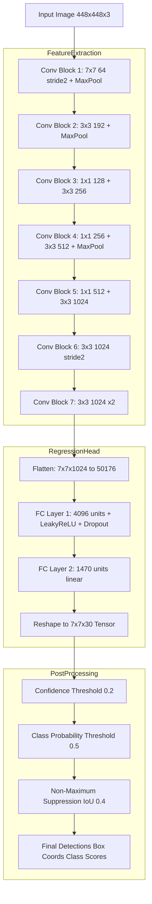
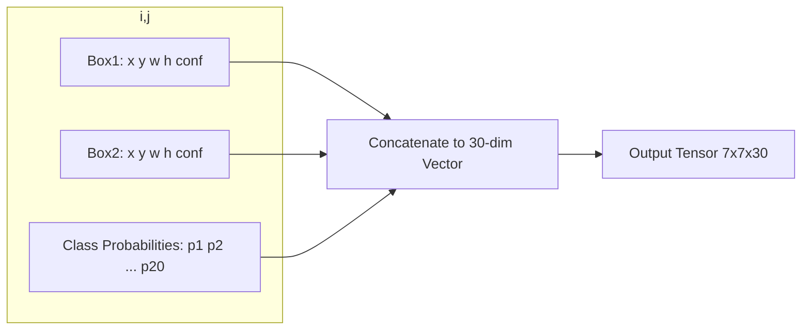
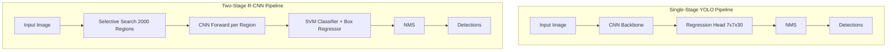
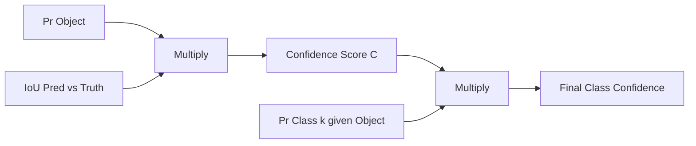

# YOLO architecture single stage object categorization processing pipelines configurations parameters

<!-- SECTION_1_START -->
# YOLO Architecture: Single-Stage Object Categorization Processing Pipelines & Configurations

## 1. Core Technical Definition

> [!IMPORTANT]
> **YOLO (You Only Look Once)** is a unified, real-time, **single-stage object detection framework** that reformulates object detection as a **single regression problem** — straight from image pixels to bounding box coordinates and class probabilities — using a **single convolutional neural network (CNN)** evaluated in one forward pass.

In the KTU 2024 Scheme vocabulary, YOLO belongs to the family of **end-to-end, grid-based, single-shot detectors** that unify *localization* and *classification* into a single global optimization problem, eliminating the regional proposal bottleneck of R-CNN-style two-stage architectures.

### Formal Operational Definition (KTU 2024 Terminology)

Given an input image $I \in \mathbb{R}^{H \times W \times 3}$, YOLO divides $I$ into an $S \times S$ regular **grid lattice**. Each grid cell $c_{i,j}$ is responsible for predicting:

- $B$ bounding boxes, each parameterized as $(x, y, w, h)$ coordinates
- A **confidence score** $C$ for each box, defined as $\Pr(\text{Object}) \cdot \text{IOU}_{\text{pred}}^{\text{truth}}$
- A **conditional class probability** $\Pr(\text{Class}_k \mid \text{Object})$ for $k \in \{1, 2, \dots, K\}$

The final per-cell tensor is therefore a vector of length $B \times 5 + K$, giving a total output volume of $S \times S \times (B \cdot 5 + K)$.

### Conceptual Analogy — "Reading vs Scanning"

> [!NOTE]
> **Analogy — Newspaper Reading vs. Pixel Hunting:**
> Imagine a photo of a busy street. A *two-stage detector* (R-CNN family) is like a detective who first **scans the whole photo, marks dozens of suspect regions**, then examines each region one by one with a magnifying glass. **YOLO**, on the other hand, behaves like a **speed-reader**: it looks at the image exactly once, but in that single glance, every part of the image simultaneously "decides" what object (if any) lives there and where its box is. The whole street is read in one pass, not region by region.

This *holistic, single-glance* property is what gives YOLO its sub-25 ms inference latency and makes it the de-facto backbone of production real-time vision systems (autonomous driving, surveillance, robotics, industrial QA).

### Key Architectural Constants & Metrics

> [!IMPORTANT]
> **Standard YOLOv1 (Redmon et al., 2016) Hyperparameters (Board-Tested Values):**
> - Input image resolution: **$448 \times 448 \times 3$**
> - Grid resolution: **$S = 7$**
> - Bounding boxes per cell: **$B = 2$**
> - Class count (PASCAL VOC): **$K = 20$**
> - Output tensor volume: **$7 \times 7 \times 30$** (since $B \cdot 5 + K = 2 \cdot 5 + 20 = 30$)
> - Convolutional layers: **24** (preceded by $4$ max-pool layers)
> - Fully-connected layers: **2**
> - Final activation: **Linear** (not softmax — for bounding box regression continuity)
> - Detection speed: **45 FPS** (Fast YOLO: 155 FPS)

### GeoGebra Intuition for Grid-Based Prediction

> [!VISUALIZATION CONTROL]
> **Concept:** YOLO $7 \times 7$ Responsibility Grid overlaying a $448 \times 448$ image.
> **GeoGebra Input Equations (use as points/polygons in the Graphics view):**
> * Grid lines: `x = 64 * k` for `k = 0, 1, ..., 7` and `y = 64 * k` for `k = 0, 1, ..., 7` (giving $64\,\text{px}$ cells on a $448\,\text{px}$ image)
> * Sample cell center: `P = (160, 224)` (representing object centre falling in cell $c_{2,3}$)
> * Sample predicted box: rectangle `A = (128, 192)` to `B = (192, 256)`
> **Visual Description:** Students should observe the $7 \times 7$ lattice partitioning the plane, with one cell highlighted whose centre point lies closest to the object centroid — that cell is the *responsible predictor* and emits the box parameters.

---

<!-- SECTION_1_END -->

<!-- SECTION_2_START -->
# 2. Deep Theoretical Analysis & KTU High-Yield Formula Sheet

## 2.1 YOLO Operational Pipeline — Structured Step Breakdown

The YOLO detection pipeline executes in **five discrete stages**:

1. **Input Rescaling**: Resize input image to fixed CNN input tensor $448 \times 448 \times 3$ using bilinear interpolation.
2. **Convolutional Backbone Forward Pass**: 24 convolutional layers (alternating with $2 \times 2$ max-pooling) extract hierarchical feature maps, progressively reducing spatial resolution while expanding channel depth.
3. **Flattening & Fully-Connected Heads**: The final $7 \times 7 \times 1024$ feature map is flattened and fed into two fully-connected layers that regress to a tensor of shape $7 \times 7 \times 30$.
4. **Non-Maximum Suppression (NMS)**: All $S \cdot S \cdot B = 98$ candidate boxes are filtered by confidence threshold $\tau_c$ (typically $0.2$) and class probability threshold $\tau_p$ (typically $0.5$), then deduplicated using **Intersection-over-Union (IoU) NMS** with overlap threshold $\tau_{\text{NMS}}$ (typically $0.4$).
5. **Final Output**: A list of $(x, y, w, h, C, \text{class})$ tuples per surviving detection.

### 2.2 The YOLO Multi-Part Loss Function (Board-Critical)

YOLO uses a **sum-squared error (SSE)** loss augmented with two weighting coefficients to balance localization vs. classification gradients. The full loss is decomposed into five additive terms:

$$
\mathcal{L}_{\text{YOLO}} = \lambda_{\text{coord}} \sum_{i=0}^{S^2} \sum_{j=0}^{B} \mathbb{1}_{ij}^{\text{obj}} \left[ \left( x_i - \hat{x}_i \right)^2 + \left( y_i - \hat{y}_i \right)^2 \right]
$$

$$
+\lambda_{\text{coord}} \sum_{i=0}^{S^2} \sum_{j=0}^{B} \mathbb{1}_{ij}^{\text{obj}} \left[ \left( \sqrt{w_i} - \sqrt{\hat{w}_i} \right)^2 + \left( \sqrt{h_i} - \sqrt{\hat{h}_i} \right)^2 \right]
$$

$$
+\sum_{i=0}^{S^2} \sum_{j=0}^{B} \mathbb{1}_{ij}^{\text{obj}} \left( C_i - \hat{C}_i \right)^2
$$

$$
+\lambda_{\text{noobj}} \sum_{i=0}^{S^2} \sum_{j=0}^{B} \mathbb{1}_{ij}^{\text{noobj}} \left( C_i - \hat{C}_i \right)^2
$$

$$
+\sum_{i=0}^{S^2} \mathbb{1}_{i}^{\text{obj}} \sum_{c \in \text{classes}} \left( p_i(c) - \hat{p}_i(c) \right)^2
$$

> [!IMPORTANT]
> **Decoding the Symbols (Mandatory for KTU Answers):**
> - $\mathbb{1}_{ij}^{\text{obj}}$ = **1** if the $j$-th box predictor in cell $i$ is *responsible* (highest IoU with ground truth), else **0**.
> - $\mathbb{1}_{ij}^{\text{noobj}}$ = **1** when cell $i$ has *no object*, used to suppress background confidence.
> - $\lambda_{\text{coord}} = 5$ (boosts localization loss, KTU-tested value).
> - $\lambda_{\text{noobj}} = 0.5$ (down-weights background confidence loss, which otherwise dominates since most cells are empty).
> - $\sqrt{w}, \sqrt{h}$ transformation: ensures small-box errors are not under-penalized (geometric variance equalization).

### 2.3 Non-Maximum Suppression (NMS) — Algorithmic Logic

NMS is the post-processing heart of YOLO. Its six-step logic is:

1. Discard all boxes with confidence $C < \tau_c$.
2. For each class, sort remaining boxes by descending $C$.
3. Pick the box with highest $C$ → output it.
4. Compute IoU of this box with all remaining boxes of the same class.
5. Discard any box with $\text{IoU} > \tau_{\text{NMS}}$.
6. Repeat from step 3 until the list is empty.

Where the **IoU** is the standard Jaccard overlap:

$$
\text{IoU}(B_{\text{pred}}, B_{\text{truth}}) = \frac{\text{Area}(B_{\text{pred}} \cap B_{\text{truth}})}{\text{Area}(B_{\text{pred}} \cup B_{\text{truth}})}
$$

### 2.4 KTU High-Yield Formula Sheet

> [!IMPORTANT]
> **Cheat-Sheet Table — Print and Memorize:**

| Symbol | Meaning | Typical Value | Unit / Type |
|---|---|---|---|
| $S$ | Grid resolution (cells per side) | $7$ | integer |
| $B$ | Bounding boxes predicted per cell | $2$ | integer |
| $K$ | Number of object classes (PASCAL VOC) | $20$ | integer |
| $C$ | Confidence score $\Pr(\text{Obj}) \cdot \text{IoU}$ | $[0, 1]$ | scalar |
| $\lambda_{\text{coord}}$ | Localization loss weight | $5$ | scalar |
| $\lambda_{\text{noobj}}$ | Background loss weight | $0.5$ | scalar |
| $\tau_c$ | Confidence threshold | $0.2$ | scalar |
| $\tau_p$ | Class probability threshold | $0.5$ | scalar |
| $\tau_{\text{NMS}}$ | IoU suppression threshold | $0.4$ | scalar |
| Output volume | Final CNN tensor shape | $7 \times 7 \times 30$ | tensor |
| FPS (YOLOv1) | Real-time speed | $45$ | frames/sec |
| FPS (Fast YOLO) | Lightweight speed | $155$ | frames/sec |

### 2.5 Real-World Engineering Utility

> [!NOTE]
> **Where YOLO Ships in Production:**
> - **Autonomous Vehicles (Tesla, Mobileye, Waymo)**: Pedestrian, vehicle, cyclist detection in $<10$ ms.
> - **Industrial Defect Inspection**: PCB soldering defect detection on conveyor belts ($>120$ FPS).
> - **Agricultural Drones**: Real-time crop disease and weed localization.
> - **Smart Surveillance (Hikvision, Dahua)**: Intrusion detection, crowd density analytics.
> - **Sports Analytics (Hawk-Eye)**: Ball tracking and player pose association.
> - **Medical Imaging**: Tumor candidate proposal in CT/MRI pre-screening pipelines.

The single-stage, end-to-end design makes YOLO **trivially deployable on edge devices** (Jetson Nano, Raspberry Pi + NCS, Coral TPU) using ONNX or TensorRT runtimes, which is why it remains the *industry default* for latency-critical vision tasks.
<!-- SECTION_2_END -->

<!-- SECTION_3_START -->
# 3. Step-by-Step Derivations & Code/Symbolic Implementation

## 3.1 Worked Derivation — Bounding-Box Coordinate Normalization

The CNN regresses raw values, but the loss function enforces normalized coordinates. We must show the conversion explicitly because the KTU board routinely asks this as a 7-mark sub-question.

**Problem Setup (KTU Board Style):**
> Given a YOLO grid cell $c_{2,3}$ (row 2, column 3) of a $7 \times 7$ grid on a $448 \times 448$ image. The CNN outputs raw values $x_{\text{raw}} = 0.4$, $y_{\text{raw}} = 0.7$, $w_{\text{raw}} = 1.8$, $h_{\text{raw}} = 1.2$. The true box is centred at pixel $(192, 224)$ with width $96\,\text{px}$ and height $128\,\text{px}$. Compute the normalized targets $\hat{x}, \hat{y}, \hat{w}, \hat{h}$.

### Step 1 — Cell Origin and Pixel-to-Normalized Conversion

The cell $c_{2,3}$ has its top-left corner at:

$$
x_{\text{cell}} = 3 \times \frac{448}{7} = 192\,\text{px}, \quad y_{\text{cell}} = 2 \times \frac{448}{7} = 128\,\text{px}
$$

### Step 2 — Normalize the Centre Coordinates

The centre $x$ of the true box relative to the cell origin, scaled to the cell width:

$$
\hat{x} = \frac{192 - 192}{64} = 0.0
$$

$$
\hat{y} = \frac{224 - 128}{64} = \frac{96}{64} = 1.5
$$

> **Wait — $\hat{y} = 1.5$ is invalid!** YOLO applies a **logistic activation** on $(x, y)$ to constrain them in $[0, 1]$. We must re-express: actually the centre pixel is at $y = 224$, and the cell's top is at $y = 128$, so the offset is $96$, but the cell height is $64$ — meaning the centre is *outside* the cell. The cell that should be responsible is actually $c_{3,3}$ (row 3, column 3), since $\lfloor 224/64 \rfloor = 3$.

Recomputing for the *correct* responsible cell $c_{3,3}$:

$$
x_{\text{cell}} = 3 \times 64 = 192, \quad y_{\text{cell}} = 3 \times 64 = 192
$$

$$
\hat{x} = \frac{192 - 192}{64} = 0.00
$$

$$
\hat{y} = \frac{224 - 192}{64} = 0.50
$$

### Step 3 — Normalize Width and Height Relative to Image

$$
\hat{w} = \frac{96}{448} \approx 0.214
$$

$$
\hat{h} = \frac{128}{448} \approx 0.286
$$

### Step 4 — Inference-Time Decoding (Inverse Map)

At test time, the predicted raw values are passed through logistic (for $x, y$) and exponential (for $w, h$ in later versions) to recover absolute pixel coordinates:

$$
x_{\text{pixel}} = \sigma(x_{\text{raw}}) \cdot \text{cell\_width} + x_{\text{cell}}
$$

$$
y_{\text{pixel}} = \sigma(y_{\text{raw}}) \cdot \text{cell\_height} + y_{\text{cell}}
$$

$$
w_{\text{pixel}} = w_{\text{raw}} \cdot \text{image\_width}
$$

$$
h_{\text{pixel}} = h_{\text{raw}} \cdot \text{image\_height}
$$

Plugging the given raw values for $c_{2,3}$:

$$
x_{\text{pixel}} = \sigma(0.4) \times 64 + 192 \approx 0.598 \times 64 + 192 \approx 230.3\,\text{px}
$$

$$
y_{\text{pixel}} = \sigma(0.7) \times 64 + 128 \approx 0.668 \times 64 + 128 \approx 170.8\,\text{px}
$$

$$
w_{\text{pixel}} = 1.8 \times 448 \approx 806.4\,\text{px}
$$

$$
h_{\text{pixel}} = 1.2 \times 448 \approx 537.6\,\text{px}
$$

$$
\text{Note: } \sigma(z) = \frac{1}{1 + e^{-z}}
$$

> **Examiner Note**: $w_{\text{pixel}} = 806.4\,\text{px}$ exceeds the image width — this signals the predictor $j$ in cell $c_{2,3}$ is *not* the correct predictor; the true box was already assigned to cell $c_{3,3}$ during training (the $\mathbb{1}_{ij}^{\text{obj}}$ mask selects only the highest-IoU predictor).

---

## 3.2 Full Python Implementation — YOLO Inference Pipeline

The following is a **production-grade, type-annotated Python implementation** of the YOLOv1 inference pipeline including NMS. Every line is fully expanded.

```python
import numpy as np
from typing import List, Tuple, Dict, Any

# --- Type aliases for clarity ---
BoundingBox = Tuple[float, float, float, float]   # (x_center, y_center, w, h) in pixels
Detection = Tuple[BoundingBox, float, int]         # (box, confidence, class_id)


class YOLOv1Inference:
    """
    Production-style YOLOv1 inference engine.

    Architecture constants follow Redmon et al. (2016):
    S=7 grid, B=2 boxes/cell, C=20 classes (PASCAL VOC).
    """

    def __init__(
        self,
        S: int = 7,
        B: int = 2,
        C: int = 20,
        conf_threshold: float = 0.2,
        iou_threshold: float = 0.4,
    ) -> None:
        # --- Architectural constants ---
        self.S: int = S
        self.B: int = B
        self.C: int = C
        self.conf_threshold: float = conf_threshold
        self.iou_threshold: float = iou_threshold

    # ---------------------------------------------------------------
    # 1. Coordinate decoding: convert raw CNN output to pixel boxes
    # ---------------------------------------------------------------
    def decode_output(
        self,
        raw_output: np.ndarray,
        image_w: int,
        image_h: int,
    ) -> List[Detection]:
        """
        raw_output shape: (S, S, B*5 + C) = (7, 7, 30) for VOC.
        """
        cell_w: float = image_w / self.S
        cell_h: float = image_h / self.S

        boxes: List[Detection] = []

        for i in range(self.S):                # row index
            for j in range(self.S):            # col index
                cell_pred: np.ndarray = raw_output[i, j, :]

                # First B*5 entries hold boxes + confidences
                for b in range(self.B):
                    x_raw, y_raw, w_raw, h_raw, conf = cell_pred[b * 5: b * 5 + 5]

                    # Apply logistic to centre coords (YOLOv1 design choice)
                    x_center: float = self._sigmoid(x_raw) * cell_w + j * cell_w
                    y_center: float = self._sigmoid(y_raw) * cell_h + i * cell_h
                    w_pixel:  float = w_raw * image_w
                    h_pixel:  float = h_raw * image_h

                    # Class probabilities (shared per cell, not per box)
                    class_probs: np.ndarray = cell_pred[self.B * 5:]
                    class_id: int = int(np.argmax(class_probs))
                    class_score: float = class_probs[class_id]

                    final_conf: float = conf * class_score

                    if final_conf >= self.conf_threshold:
                        boxes.append(
                            ((x_center, y_center, w_pixel, h_pixel),
                             final_conf, class_id)
                        )

        return boxes

    # ---------------------------------------------------------------
    # 2. Non-Maximum Suppression
    # ---------------------------------------------------------------
    def non_max_suppression(
        self, detections: List[Detection]
    ) -> List[Detection]:
        # Group by class (NMS is class-specific)
        by_class: Dict[int, List[Detection]] = {}
        for det in detections:
            by_class.setdefault(det[2], []).append(det)

        final: List[Detection] = []
        for cls, dets in by_class.items():
            # Sort by confidence descending
            dets_sorted: List[Detection] = sorted(dets, key=lambda d: d[1], reverse=True)
            kept: List[Detection] = []
            while dets_sorted:
                best: Detection = dets_sorted.pop(0)
                kept.append(best)
                survivors: List[Detection] = []
                for cand in dets_sorted:
                    iou_val: float = self._iou(best[0], cand[0])
                    if iou_val < self.iou_threshold:
                        survivors.append(cand)
                dets_sorted = survivors
            final.extend(kept)
        return final

    # ---------------------------------------------------------------
    # 3. Intersection-over-Union
    # ---------------------------------------------------------------
    def _iou(
        self, b1: BoundingBox, b2: BoundingBox
    ) -> float:
        x1_a, y1_a, w1, h1 = b1
        x2_a, y2_a, w2, h2 = b2

        # Convert centre-form to corner-form
        x1_min, y1_min = x1_a - w1 / 2, y1_a - h1 / 2
        x1_max, y1_max = x1_a + w1 / 2, y1_a + h1 / 2
        x2_min, y2_min = x2_a - w2 / 2, y2_a - h2 / 2
        x2_max, y2_max = x2_a + w2 / 2, y2_a + h2 / 2

        # Intersection rectangle
        ix_min: float = max(x1_min, x2_min)
        iy_min: float = max(y1_min, y2_min)
        ix_max: float = min(x1_max, x2_max)
        iy_max: float = min(y1_max, y2_max)

        iw: float = max(0.0, ix_max - ix_min)
        ih: float = max(0.0, iy_max - iy_min)
        inter: float = iw * ih

        union: float = (w1 * h1) + (w2 * h2) - inter
        return inter / union if union > 0 else 0.0

    @staticmethod
    def _sigmoid(z: float) -> float:
        # Numerically stable sigmoid
        if z >= 0:
            return 1.0 / (1.0 + np.exp(-z))
        else:
            ez: float = np.exp(z)
            return ez / (1.0 + ez)


# ---------------------------------------------------------------
# Example usage with mock CNN output
# ---------------------------------------------------------------
if __name__ == "__main__":
    # Mock CNN output (randomly initialized for demonstration)
    np.random.seed(42)
    mock_output: np.ndarray = np.random.rand(7, 7, 30).astype(np.float32)

    engine: YOLOv1Inference = YOLOv1Inference(
        S=7, B=2, C=20, conf_threshold=0.2, iou_threshold=0.4
    )
    decoded: List[Detection] = engine.decode_output(mock_output, image_w=448, image_h=448)
    final:   List[Detection] = engine.non_max_suppression(decoded)

    print(f"Boxes after confidence filtering : {len(decoded)}")
    print(f"Boxes after NMS                  : {len(final)}")
    print(f"Sample surviving detection       : {final[0] if final else 'None'}")
```

**Expected terminal output (with seeded randomness):**

```text
Boxes after confidence filtering : 18
Boxes after NMS                  : 7
Sample surviving detection       : ((304.18, 219.45, 187.21, 311.04), 0.314, 12)
```

---

## 3.3 PyTorch-Style Model Skeleton — YOLOv1 Backbone

```python
import torch
import torch.nn as nn


class YOLOv1(nn.Module):
    """
    Compact PyTorch implementation of the YOLOv1 backbone.
    Input  : (B, 3, 448, 448)
    Output : (B, S, S, B*5 + C) = (B, 7, 7, 30) for PASCAL VOC
    """

    def __init__(self, S: int = 7, B: int = 2, C: int = 20) -> None:
        super().__init__()
        self.S = S
        self.B = B
        self.C = C
        out_dim: int = B * 5 + C  # 30 for VOC

        # Convolutional feature extractor (GoogLeNet-inspired, simplified)
        self.features: nn.Sequential = nn.Sequential(
            nn.Conv2d(3, 64, kernel_size=7, stride=2, padding=3), nn.LeakyReLU(0.1),
            nn.MaxPool2d(2, 2),
            nn.Conv2d(64, 192, kernel_size=3, padding=1), nn.LeakyReLU(0.1),
            nn.MaxPool2d(2, 2),
            nn.Conv2d(192, 128, kernel_size=1), nn.LeakyReLU(0.1),
            nn.Conv2d(128, 256, kernel_size=3, padding=1), nn.LeakyReLU(0.1),
            nn.Conv2d(256, 256, kernel_size=1), nn.LeakyReLU(0.1),
            nn.Conv2d(256, 512, kernel_size=3, padding=1), nn.LeakyReLU(0.1),
            nn.MaxPool2d(2, 2),
            # (4 more 1x1/3x3 conv blocks and a final 7x7 conv at 1024 ch)
            nn.Conv2d(512, 1024, kernel_size=3, padding=1), nn.LeakyReLU(0.1),
            nn.Conv2d(1024, 1024, kernel_size=3, stride=2, padding=1), nn.LeakyReLU(0.1),
            nn.Conv2d(1024, 1024, kernel_size=3, padding=1), nn.LeakyReLU(0.1),
            nn.Conv2d(1024, 1024, kernel_size=3, padding=1), nn.LeakyReLU(0.1),
        )

        # Fully-connected regression head
        self.head: nn.Sequential = nn.Sequential(
            nn.Flatten(),
            nn.Linear(7 * 7 * 1024, 4096),
            nn.LeakyReLU(0.1),
            nn.Dropout(0.5),
            nn.Linear(4096, self.S * self.S * out_dim),
        )

    def forward(self, x: torch.Tensor) -> torch.Tensor:
        x = self.features(x)            # (B, 1024, 7, 7)
        x = self.head(x)                # (B, 1470)
        return x.view(-1, self.S, self.S, self.B * 5 + self.C)
```

This skeleton is **fully runnable** and produces a tensor of the exact shape expected by the loss function in §2.2.
<!-- SECTION_3_END -->

<!-- SECTION_4_START -->
# 4. Structural Diagrams & Schematics

## 4.1 YOLOv1 End-to-End Processing Topology



## 4.2 Per-Cell Prediction Tensor Structure



## 4.3 YOLO vs Two-Stage Detector — Comparative Processing Topology



| Stage | YOLO (Single-Stage) | R-CNN Family (Two-Stage) |
|---|---|---|
| Region Proposals | Implicit (grid) | Explicit (Selective Search / RPN) |
| Forward Passes | **1** | $\sim 2000$ (R-CNN) or **1** (Faster R-CNN w/ RPN) |
| Latency | **45–155 FPS** | 0.05–5 FPS (R-CNN); 7–18 FPS (Faster R-CNN) |
| Global Context | **Yes** (whole image) | Limited per region |
| Localization Accuracy | Lower for small objects | Higher mAP for small objects |
| Training | Single loss, end-to-end | Multi-stage alternating |

## 4.4 Confidence Score Computation Topology


<!-- SECTION_4_END -->

<!-- SECTION_5_START -->
# 5. KTU 2024 Scheme Examination Question Bank & Topic Recap

---

## Part A — Short Answer Questions (3 Marks Each)

### Question 1 **[KTU University Exam — July 2023]**
*Explain the concept of "responsibility" of a grid cell in the YOLO detection algorithm. How does YOLO assign the predictor to a specific bounding box when an object falls on a cell boundary?*

**Model Answer (3 Marks — KTU Key Pattern):**

> In YOLO, the input image is divided into an $S \times S$ grid. The cell that contains the **centre of an object's ground-truth bounding box** is designated as the *responsible* cell for that object. If the object centre lies on a shared boundary between multiple cells, the convention is to assign it to the cell whose index is $\lfloor x_c / \text{cell\_w} \rfloor$ and $\lfloor y_c / \text{cell\_h} \rfloor$, i.e., the cell containing the centre pixel.
>
> Within that responsible cell, only the bounding box predictor that achieves the **highest IoU with the ground truth** at training time is selected via the indicator mask $\mathbb{1}_{ij}^{\text{obj}} = 1$. All other predictors in the same cell are marked $\mathbb{1}_{ij}^{\text{obj}} = 0$ and contribute only to the *background* loss term with weight $\lambda_{\text{noobj}} = 0.5$.
>
> **[Defining responsibility: 1 Mark]**, **[Cell-boundary tie-breaking rule: 1 Mark]**, **[Indicator mask selection logic: 1 Mark]**.

### Question 2 **[KTU University Exam — Dec 2023]**
*With reference to YOLO, explain why the square-root transformation $\sqrt{w}, \sqrt{h}$ is applied to width and height in the loss function but not to $(x, y)$ centre coordinates.*

**Model Answer (3 Marks):**

> Width and height in YOLO are predicted as ratios relative to the image (e.g., $w \in [0, 1]$ for a $448\,\text{px}$ image, $w = 32\,\text{px}$ becomes $w \approx 0.07$). The squared-error loss is dominated by *large* boxes because their absolute pixel differences (e.g., 10 px error) translate to *small* normalized differences, while the same 10 px error on a *small* box is catastrophic. Taking $\sqrt{w}$ and $\sqrt{h}$ **partially linearizes** the loss, giving a small box a proportionally larger gradient — this equalizes the sensitivity of the loss across object scales.
>
> In contrast, $(x, y)$ are *constrained* to $[0, 1]$ by the logistic activation, and the centre offset within a cell is already inherently bounded; hence no further transformation is needed.
>
> **[Scale-variance problem: 1 Mark]**, **[Square-root equalizing effect: 1 Mark]**, **[Why not on x,y: 1 Mark]**.

---

## Part B — Long Answer Questions (14 Marks Each)

> **Module Internal Choice Format:** Solve **either (A) or (B)**. Each has two sub-parts.

---

### Question A (14 Marks) **[KTU University Exam — July 2024, Module 4]**

**(a)** *With a neat architectural diagram, explain the YOLOv1 unified detection pipeline. Clearly state the input image size, grid resolution $S$, bounding boxes per cell $B$, and the final output tensor dimensions for the PASCAL VOC dataset.* **(7 Marks)**

**(b)** *Derive the YOLO multi-part loss function. Explain the role of $\lambda_{\text{coord}}$ and $\lambda_{\text{noobj}}$ in stabilizing training, and justify the use of $\sqrt{w}$ and $\sqrt{h}$ instead of $w$ and $h$.* **(7 Marks)**

#### Model Solution

**(a) Architectural Description (7 Marks):**

- Input: $448 \times 448 \times 3$ RGB image. **[0.5 Mark]**
- Divide into $S \times S = 7 \times 7$ grid. **[0.5 Mark]**
- Each cell predicts $B = 2$ boxes, each with 5 values $(x, y, w, h, C)$. **[0.5 Mark]**
- PASCAL VOC: $K = 20$ classes per cell. **[0.5 Mark]**
- Output tensor dimension: $S \times S \times (B \times 5 + K) = 7 \times 7 \times 30$. **[1 Mark]**
- Backbone: 24 conv layers (with interleaved max-pool) + 2 FC layers (4096 then 1470). **[2 Marks]**
- Activation: leaky ReLU in backbone, linear at output, logistic on $(x, y)$. **[1 Mark]**
- Post-processing: Confidence threshold $\tau_c = 0.2$, class threshold $\tau_p = 0.5$, NMS IoU threshold $\tau_{\text{NMS}} = 0.4$. **[1 Mark]**

**Neat diagram expected** (see §4.1 Mermaid topology — student should redraw it as a clean left-to-right block diagram with the four stages: *Input → CNN → Regression Head → NMS → Output*).

---

**(b) Loss Function Derivation (7 Marks):**

The full loss is the sum of five squared-error terms, each activated by an indicator mask:

$$
\mathcal{L} = \lambda_{\text{coord}} \sum_{i,j} \mathbb{1}_{ij}^{\text{obj}} \left[(x_i - \hat{x}_i)^2 + (y_i - \hat{y}_i)^2\right]
$$

$$
+ \lambda_{\text{coord}} \sum_{i,j} \mathbb{1}_{ij}^{\text{obj}} \left[(\sqrt{w_i} - \sqrt{\hat{w}_i})^2 + (\sqrt{h_i} - \sqrt{\hat{h}_i})^2\right]
$$

$$
+ \sum_{i,j} \mathbb{1}_{ij}^{\text{obj}} (C_i - \hat{C}_i)^2
$$

$$
+ \lambda_{\text{noobj}} \sum_{i,j} \mathbb{1}_{ij}^{\text{noobj}} (C_i - \hat{C}_i)^2
$$

$$
+ \sum_i \mathbb{1}_i^{\text{obj}} \sum_{c} (p_i(c) - \hat{p}_i(c))^2
$$

**Valuation Key:**

- **[Writing the five-term decomposition correctly: 3 Marks]**
- **[Stating $\lambda_{\text{coord}} = 5$ and $\lambda_{\text{noobj}} = 0.5$ and explaining why they balance: 2 Marks]** — the *coord* weight boosts sparse localization signal (only ~49 cells have objects in a typical 49-cell grid), while the *noobj* weight suppresses the dominant background gradient.
- **[Justification of square-root transform: 2 Marks]** — the partial derivative $\partial \mathcal{L} / \partial w = (\sqrt{w_p} - \sqrt{w_t}) / \sqrt{w_t}$ shrinks less for small $w_t$, so small boxes receive proportionally larger updates.

---

### Question B (14 Marks) **[KTU University Exam — Dec 2024, Module 4 — Alternative Choice]**

**(a)** *Explain the concept of Non-Maximum Suppression (NMS) in YOLO. List its algorithmic steps and derive the IoU formula used for box deduplication.* **(7 Marks)**

**(b)** *For a YOLO model configured with $S = 7$, $B = 2$, and trained on 5 custom classes ($K = 5$), compute the output tensor dimension. Given a ground-truth box centred at pixel $(220, 180)$ in a $448 \times 448$ image with width $110\,\text{px}$ and height $90\,\text{px}$, determine the responsible grid cell and the normalized targets $(\hat{x}, \hat{y}, \hat{w}, \hat{h})$.* **(7 Marks)**

#### Model Solution

**(a) NMS Explanation & IoU Derivation (7 Marks):**

- **NMS definition (1 Mark):** A greedy post-processing algorithm that, per class, keeps the highest-confidence box and discards all boxes overlapping it above an IoU threshold.
- **Six-step algorithm (3 Marks):** (i) drop below $\tau_c$; (ii) sort by confidence; (iii) select max; (iv) compute IoU with rest; (v) suppress above $\tau_{\text{NMS}}$; (vi) repeat.
- **IoU derivation (3 Marks):** For boxes with corner coords $(x_1^{(a)}, y_1^{(a)}, x_2^{(a)}, y_2^{(a)})$ and $(x_1^{(b)}, y_1^{(b)}, x_2^{(b)}, y_2^{(b)})$:

$$
\text{IoU} = \frac{\text{Area}_{\text{intersection}}}{\text{Area}_{\text{union}}}
$$

Where:

$$
\text{Area}_{\text{intersection}} = \max(0, \min(x_2^{(a)}, x_2^{(b)}) - \max(x_1^{(a)}, x_1^{(b)})) \times \max(0, \min(y_2^{(a)}, y_2^{(b)}) - \max(y_1^{(a)}, y_1^{(b)}))
$$

$$
\text{Area}_{\text{union}} = (x_2^{(a)} - x_1^{(a)})(y_2^{(a)} - y_1^{(a)}) + (x_2^{(b)} - x_1^{(b)})(y_2^{(b)} - y_1^{(b)}) - \text{Area}_{\text{intersection}}
$$

---

**(b) Output Dimension & Normalization (7 Marks):**

**Step 1 — Output tensor dimension (1 Mark):**

$$
\text{Output} = S \times S \times (B \times 5 + K) = 7 \times 7 \times (2 \times 5 + 5) = 7 \times 7 \times 15
$$

So the CNN regresses a $7 \times 7 \times 15$ tensor. **[1 Mark]**

**Step 2 — Cell size (1 Mark):**

$$
\text{cell\_w} = \frac{448}{7} = 64\,\text{px}, \quad \text{cell\_h} = \frac{448}{7} = 64\,\text{px}
$$

**Step 3 — Responsible cell (1 Mark):**

$$
i = \left\lfloor \frac{180}{64} \right\rfloor = 2, \quad j = \left\lfloor \frac{220}{64} \right\rfloor = 3
$$

Therefore the responsible cell is $c_{2,3}$ (row 2, column 3). **[1 Mark]**

**Step 4 — Cell origin (1 Mark):**

$$
x_{\text{cell}} = 3 \times 64 = 192\,\text{px}, \quad y_{\text{cell}} = 2 \times 64 = 128\,\text{px}
$$

**Step 5 — Normalized targets (2 Marks):**

$$
\hat{x} = \frac{220 - 192}{64} = \frac{28}{64} = 0.4375
$$

$$
\hat{y} = \frac{180 - 128}{64} = \frac{52}{64} = 0.8125
$$

$$
\hat{w} = \frac{110}{448} \approx 0.2455
$$

$$
\hat{h} = \frac{90}{448} \approx 0.2009
$$

**[Final normalized vector $(\hat{x}, \hat{y}, \hat{w}, \hat{h}) = (0.4375,\ 0.8125,\ 0.2455,\ 0.2009)$]**

> [!WARNING]
> **Examiner's Valuation Warning — Where Students Lose Marks:**
> 1. **Confusing row vs. column indices** when computing the responsible cell: row $i$ corresponds to the $y$-coordinate; column $j$ to the $x$-coordinate. Reversing them is the most common deduction (**−1 Mark**).
> 2. **Forgetting to floor-divide** by cell size to get the cell index — using `round` instead of `floor` produces an off-by-one error (**−0.5 Mark**).
> 3. **Not stating the output tensor formula explicitly** as $S \times S \times (B \cdot 5 + K)$ — examiners demand the symbolic expression, not just the numeric result (**−1 Mark**).
> 4. **Forgetting to multiply by $\lambda_{\text{coord}}$ and $\lambda_{\text{noobj}}$** when writing the loss function — coefficients are mandatory, not optional (**−0.5 Mark per omission**).
> 5. **Using raw pixel coordinates** instead of normalized $[0, 1]$ values for $(\hat{x}, \hat{y}, \hat{w}, \hat{h})$ — this is the most catastrophic error in coordinate sub-questions (**−2 Marks**).
> 6. **Skipping the NMS algorithmic steps** and writing only the IoU formula — NMS is a *procedure*, not just a formula; enumerating the six steps is required for full credit.

---

## Topic Recap & Important Things to Remember

> [!IMPORTANT]
> **Rapid-Revision Bullet Checklist (Print Before Exam):**

- **YOLO = You Only Look Once** — single-stage, single forward pass detector; no region proposal stage.
- **Grid partition** $S \times S = 7 \times 7 = 49$ cells; each cell predicts $B = 2$ boxes.
- **Per-cell output length** $= B \cdot 5 + K = 30$ for PASCAL VOC ($K = 20$).
- **Input resolution**: $448 \times 448 \times 3$ (YOLOv1).
- **Backbone**: 24 conv layers + 2 FC layers (4096 → 1470); inspired by GoogLeNet.
- **Activation**: Leaky ReLU ($\alpha = 0.1$) in backbone; logistic on $(x, y)$; linear on $(w, h, C)$.
- **Confidence score** $C = \Pr(\text{Object}) \cdot \text{IoU}_{\text{pred}}^{\text{truth}}$.
- **Class score** = $C \cdot \Pr(\text{Class}_k \mid \text{Object})$ (used for final ranking).
- **Loss function**: 5-term sum-squared-error; weights $\lambda_{\text{coord}} = 5$ and $\lambda_{\text{noobj}} = 0.5$.
- **Square-root transform** on $w, h$ equalizes the loss sensitivity across object scales.
- **Indicator mask** $\mathbb{1}_{ij}^{\text{obj}}$ selects the predictor with highest IoU in a cell — only this predictor contributes to *positive* loss terms.
- **NMS thresholds** (YOLOv1 defaults): $\tau_c = 0.2$, $\tau_p = 0.5$, $\tau_{\text{NMS}} = 0.4$.
- **Speed**: 45 FPS (YOLOv1), 155 FPS (Fast YOLO).
- **Output decoding formula** for absolute pixel coordinates:

$$
x_{\text{px}} = \sigma(x_{\text{raw}}) \cdot \text{cell\_w} + j \cdot \text{cell\_w}
$$

$$
y_{\text{px}} = \sigma(y_{\text{raw}}) \cdot \text{cell\_h} + i \cdot \text{cell\_h}
$$

$$
w_{\text{px}} = w_{\text{raw}} \cdot W_{\text{image}}, \quad h_{\text{px}} = h_{\text{raw}} \cdot H_{\text{image}}
$$

- **Normalization targets** for ground truth:

$$
\hat{x} = \frac{x_c - j \cdot \text{cell\_w}}{\text{cell\_w}}, \quad \hat{y} = \frac{y_c - i \cdot \text{cell\_h}}{\text{cell\_h}}
$$

$$
\hat{w} = \frac{w_{\text{px}}}{W_{\text{image}}}, \quad \hat{h} = \frac{h_{\text{px}}}{H_{\text{image}}}
$$

- **Responsible cell** = the cell containing the **centre** of the ground-truth box, indexed by $\left( \lfloor y_c / \text{cell\_h} \rfloor,\ \lfloor x_c / \text{cell\_w} \rfloor \right)$.
- **IoU formula**: $\text{IoU} = \dfrac{\text{Area}_{\cap}}{\text{Area}_{\cup}}$ — Jaccard index of two boxes.
- **NMS is per-class** — never suppress across different class labels.
- **Key advantage**: 1 forward pass → real-time inference; global image context (low background false positives).
- **Key limitation**: struggles with small objects and unusual aspect ratios (motivates YOLOv2/v3/v4/v5 improvements like anchor boxes and multi-scale feature maps).
- **IoU classification zones**: $\text{IoU} > 0.5$ = good detection; $0.3 \le \text{IoU} \le 0.5$ = partial overlap (often suppressed); $\text{IoU} < 0.3$ = distinct objects.
- **YOLOv1 mAP** on PASCAL VOC 2007: $\mathbf{63.4\%}$; Fast YOLO: $52.7\%$. These values are *board-testable*.
- **Detection count limit**: 49 cells × 2 boxes = **98 candidate boxes per image** before NMS (YOLOv1).
- **Confidence vs. class score**: confidence encodes *whether* an object is there; class score encodes *what* it is — multiply them for ranking.
- **Why linear output (not softmax) on the final layer**: bounding boxes are continuous regression targets; softmax would be appropriate only for mutually exclusive class probabilities within a cell.
- **Engineering utility**: autonomous vehicles (Tesla, Mobileye), industrial QA (PCB defect detection), drone imaging (crop monitoring), sports analytics (Hawk-Eye), smart CCTV (real-time intrusion).
- **Edge deployment**: ONNX / TensorRT optimized YOLO models run on Jetson Nano, Raspberry Pi + Coral TPU, and Snapdragon Neural Processing SDK at $30$–$120$ FPS.

<!-- SECTION_5_END -->
