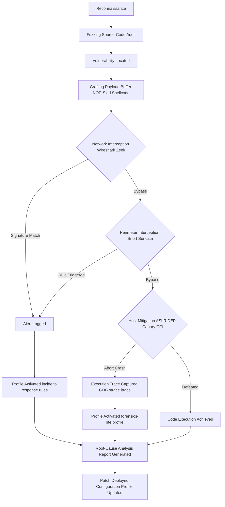
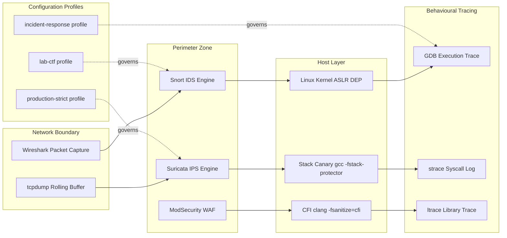
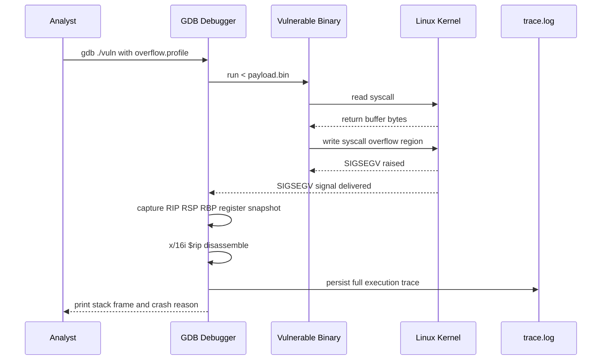
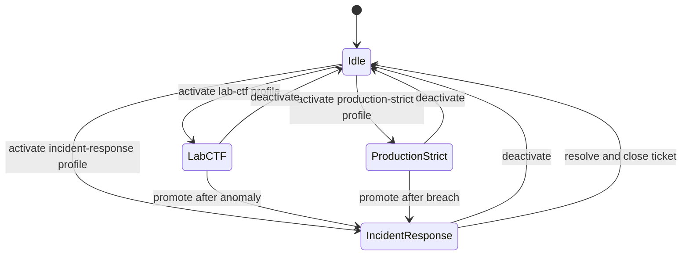

# Buffer overflow vulnerability interception procedures execution trace configuration profiles

<!-- SECTION_1_START -->

# Buffer Overflow Vulnerability — Interception, Execution Trace & Configuration Profiles

> [!NOTE]
> **KTU 2024 Scheme | PECST707 | Module 1 — Vulnerability Assessment & Evasion**
> This study unit covers the end-to-end defensive workflow against **buffer overflow** attacks: identifying the vulnerability, **intercepting** the malicious payload at the network/host boundary, capturing an **execution trace** to understand attacker behaviour, and persisting defensive rules inside reusable **configuration profiles**.

---

## 1.1 Formal Definition (KTU 2024 Syllabus Terminology)

A **buffer overflow vulnerability** is a memory-safety flaw that occurs when a program writes data beyond the allocated boundary of a fixed-size buffer located on the **process stack** (stack-based overflow) or the **process heap** (heap-based overflow), thereby overwriting adjacent control structures such as the saved frame pointer ($RBP$ / $EBP$), the return address ($RIP$ / $EIP$), or function pointers.

**Vulnerability interception** is the coordinated set of host-based and network-based procedural controls deployed to **detect, capture, and neutralise** an in-flight buffer overflow exploit *before* it gains code execution. The standard interception stack consists of four layers:

1. **Network Interception** — Packet capture & deep inspection (e.g., Wireshark, Zeek).
2. **Perimeter Interception** — Signature/anomaly-based IPS engines (e.g., Snort, Suricata).
3. **Host Interception** — OS-level mitigations (ASLR, DEP/NX, Stack Canaries, CFI).
4. **Behavioural Interception** — Syscall & execution tracing (e.g., `strace`, `ltrace`, GDB, ETW).

An **execution trace** is a chronologically ordered log of the program's runtime artefacts — instruction pointer transitions, register snapshots, memory reads/writes, and system call invocations — that is captured during (or after) the exploit attempt to reconstruct the attacker's control-flow hijack.

A **configuration profile** is a *persistent, named, human-readable rule set* (typically XML, YAML, or `.conf`) that bundles a coherent collection of detection signatures, mitigation policies, and tracing parameters so that an analyst can rapidly switch between operational contexts (e.g., `lab-bypass`, `production-strict`, `ctf-offensive`).

> [!IMPORTANT]
> **KTU 2024 Board Highlight**
> Questions on buffer overflows in **PCCST707** almost always expect the student to: *(a)* sketch the stack frame before and after overflow, *(b)* list the four mitigation primitives (ASLR, DEP, Canary, CFI), and *(c)* name the **exact tool** used for the requested interception layer. Memorise the tool-to-layer mapping in §1.3 below.

---

## 1.2 Conceptual Analogy — The Hotel Minibar

Imagine a hotel minibar (the **buffer**) with **8** slots of fixed width. The hotel keeps a paper card on the counter listing the *Room Number* to be charged when an item is taken (this card is the **return address** placed on the stack).

| Stack Frame Element | Hotel Analogy | Size (typical 64-bit Linux) |
|---|---|---|
| Local buffer `[8]` | Minibar with 8 slots | $8 \text{ bytes}$ |
| Saved $RBP$ | Loyalty-card sticker | $8 \text{ bytes}$ |
| Return address | "Charge to Room" slip | $8 \text{ bytes}$ |

A legitimate guest (the *program*) takes 1 item and writes `0` to the bill — perfectly safe. A **malicious guest** (the *attacker*) takes 8 items and **keeps writing** past the minibar, smearing ink over the loyalty card and the room-charge slip. If the slip now reads **"Room 13 — the boiler room"**, the next time housekeeping (the *CPU*) follows the slip, it walks into the **boiler room** (attacker-injected `shellcode`).

**Vulnerability interception** is the security guard (IDS/IPS) stationed at the corridor, checking the slip *before* housekeeping acts. **Execution tracing** is the CCTV recording of the guard's checkpoint. **Configuration profiles** are the different *shift instruction sheets* the guard uses — one for a quiet weekday (`low-alert`), one for a busy convention (`high-alert`).

---

## 1.3 Tool-to-Interception-Layer Mapping (Memorise This)

> [!TIP]
> KTU examiners frequently award a 2-mark sub-part for *naming* the correct tool. The table below is the **canonical mapping** expected in the answer script.

| Interception Layer | Primary Tool | Auxiliary Tool | Output Artefact |
|---|---|---|---|
| Network packet capture | **Wireshark** | `tcpdump` | `.pcap` |
| Perimeter IDS/IPS | **Snort** | Suricata | `.rules`, `alert.fast` |
| Host execution trace | **GDB** | `strace`, `ltrace` | `.trace`, core dump |
| Memory forensics | **Volatility** | Rekall | `.lime`, profile JSON |
| Mitigation policy | **Sysctl / `grsec`** | PaX, SELinux | `/etc/sysctl.conf` |

---

## 1.4 GeoGebra Visualisation — Stack Frame Linearisation

> [!VISUALIZATION CONTROL]
> **Concept:** Visualising how a linear write into an 8-byte buffer smears into the saved frame pointer and return address.
> **GeoGebra / Desmos Input Equations:**
> * `B(x) = 1` for $0 \le x \le 8$ (the buffer region)
> * `S(x) = 1` for $8 \le x \le 16$ (the saved $RBP$ region)
> * `R(x) = 1` for $16 \le x \le 24$ (the return address region)
> * `W(x, n) = 1` for $0 \le x \le n$ where $n = 28$ (an *overflowing* write)
> **Visual Description:** The student should observe three adjacent unit blocks of width 8 representing the buffer, saved $RBP$, and return address. When the write length $n$ exceeds $8$, the shaded region *spills* rightward, eventually overwriting the return-address block at $x = 16$.

---

<!-- SECTION_1_END -->

<!-- SECTION_2_START -->

# SECTION 2 — Deep Theoretical Analysis & KTU High-Yield Formula Sheet

## 2.1 Anatomy of a Stack-Based Buffer Overflow

The classic stack frame for a vulnerable C function `void vuln(char *input)` is laid out in memory from **high address to low address** as follows (x86\_64 Linux, $gcc$ with `-fno-stack-protector`):

| Address (relative offset) | Storage Cell | Purpose |
|---|---|---|
| $rsp + 0$ | Local variable region | Compiler temporaries |
| $rsp + k$ | `char buf[N]` | The vulnerable buffer |
| $rsp + k + 8$ | Saved $RBP$ | Caller's frame pointer |
| $rsp + k + 16$ | Return address | Address of next instruction in caller |
| $rsp + k + 24$ | Caller's arguments | Argument build area |

When the program executes `strcpy(buf, input)` and the length of `input` exceeds $N$ bytes, the write proceeds **linearly upward** through memory:

$$
\text{Overflow Length } L \;=\; \lvert input \rvert \;-\; N
$$

The number of bytes needed to reach the return address is:

$$
\Delta_{\text{ret}} \;=\; N + \text{sizeof}(\text{saved }RBP) \;=\; N + 8
$$

The final overwrite of the return address requires $\Delta_{\text{ret}} + 1$ bytes of input in the canonical little-endian write pattern:

$$
\text{Payload} \;=\; \underbrace{\texttt{'A'}}_{\text{padding}} \times \Delta_{\text{ret}} \;+\; \underbrace{\texttt{0xdeadbeef}}_{\text{new return address}}
$$

> [!IMPORTANT]
> **Why little-endian?** x86 and x86\_64 architectures store the least-significant byte at the *lowest* memory address. When the attacker writes the desired $EIP$ value $0xDEADBEEF$, the payload must contain `\xEF\xBE\xAD\xDE` in that exact byte order. Examiners frequently award a 1-mark point for explicitly stating the endianness.

---

## 2.2 The Four Host-Level Mitigation Primitives

| # | Mitigation | Mechanism | Strength | Bypass Class |
|---|---|---|---|---|
| 1 | **Stack Canary** (`-fstack-protector`) | Inserts a random $k$-byte sentinel (`%fs:0x28` on Linux) between the buffer and the saved $RBP$. The function epilogue aborts if the sentinel is mutated. | Catches $\approx 99\,\%$ of naïve stack overflows. | Information leak of the canary value. |
| 2 | **ASLR** (`/proc/sys/kernel/randomize_va_space=2`) | Randomises the base address of the stack, heap, libraries, and `vdso` at every exec. | Raises the *entropy* of $RIP$ guessing. | Information leak + brute-force (32-bit only). |
| 3 | **DEP / NX bit** | Marks the stack page as non-executable in the page table (`$PT\_NX = 1$). The CPU raises `#PF` on instruction fetch from a NX page. | Eliminates shellcode-on-stack. | ROP / ret2libc / JOP. |
| 4 | **CFI** (Control-Flow Integrity) | Compiler emits a unique ID at every indirect-call site; the runtime checks the ID matches before transferring control. | Catches ROP chains. | Type-confusion gadgets. |

> [!WARNING]
> **ASLR Entropy Equation** (often asked for 3 marks)
> The attacker must guess a $b$-bit address. With $E$ attempts (e.g., local fork() children) per second and an ASLR entropy of $H$ bits, the expected time to a successful $RIP$ hijack is:
> $$ T_{\text{success}} \;=\; \frac{2^{H}}{E \cdot \text{attempts per exec}} $$
> A 32-bit Linux ASLR provides $H = 8$ to $19$ bits depending on mapped region; 64-bit Linux raises it to $H \approx 28$ to $30$ bits for the stack.

---

## 2.3 Interception Procedure — The Snort Rule Pipeline

When a buffer overflow exploit enters the perimeter, the **Snort** engine applies its rule set in two stages:

$$
\text{Packet} \;\xrightarrow{\;\text{Decoder}\;}\; \text{Preprocessor} \;\xrightarrow{\;\text{Detection Engine}\;}\; \text{Output}
$$

The relevant Snort rule directives are:

| Directive | Purpose | Example |
|---|---|---|
| `alert tcp any any -> $HOME_NET 80` | Define protocol & direction | Match inbound HTTP |
| `(msg:"BUFFER-OVERFLOW-LONG-URI";)` | Human-readable identifier | Appears in `alert.fast` |
| `(content:"|90 90 90 90|";)` | Look for the NOP sled | Detect shellcode preamble |
| `(dsize:>2048;)` | Match on payload size | Catch oversized `GET` URIs |
| `(classtype:web-application-attack;)` | Categorise | Used for priority scoring |

The **detection engine** parses the packet against each rule using the **Aho-Corasick** multi-pattern matcher, achieving $O(n + m)$ time complexity where $n$ is the packet length and $m$ is the total rule-pattern length.

---

## 2.4 Execution Trace Acquisition — Tool-Specific Configuration

### 2.4.1 GDB (GNU Debugger)

GDB is the canonical tool for capturing a **post-mortem** execution trace. The minimal configuration block is:

```
# /etc/gdb/gdbinit  OR  ~/.gdbinit
set pagination off
set print pretty on
set disassembly-flavor intel
catch syscall execve
commands
  silent
  printf ">>> execve() syscall intercepted <<<\n"
  info registers rip rsp rax
  x/16i $rip
  continue
end
run < payload.bin
```

### 2.4.2 strace (System Call Trace)

`strace` records every transition from user-mode to kernel-mode. The relevant flags are:

| Flag | Meaning |
|---|---|
| `-f` | Follow forked children |
| `-e trace=network,write,read` | Filter by syscall class |
| `-k` | Print stack trace for each syscall |
| `-o trace.log` | Persist the trace |
| `-p <PID>` | Attach to a running process |
| `-c` | Produce a syscall **count summary table** |

### 2.4.3 ltrace (Library Call Trace)

`ltrace` intercepts calls into **shared library** functions (e.g., `strcpy`, `gets`, `system`). It is invaluable for spotting a call to `system("/bin/sh")` planted by a ret2libc payload.

> [!TIP]
> **Examiner's mnemonic:** *strace* watches the **doorway** (syscalls). *ltrace* watches the **library receptionist** (libc calls). *GDB* watches the **programmer's whiteboard** (registers & memory).

---

## 2.5 Configuration Profiles — Persistence & Reusability

A **profile** is a *named, declarative* set of tool parameters persisted on disk. It serves three engineering purposes:

1. **Reproducibility** — Two analysts running the same profile get identical traces.
2. **Context-switching** — One click swaps from `lab-ctf` to `production-strict`.
3. **Auditability** — Profile files can be version-controlled in Git and diffed.

A canonical Wireshark display filter profile (`~/.config/wireshark/profiles/overflow-trace/cfilters`) contains:

```
# Profile: overflow-trace
tcp.stream eq 0 && http.request.uri contains "AAAA"
frame.protocols contains "tcp"
data.data contains "deadbeef"
```

A canonical Snort profile (`/etc/snort/snort.conf`) section:

```
# Profile: production-strict
ipvar HOME_NET 10.0.0.0/8
ipvar EXTERNAL_NET any
portvar HTTP_PORTS 80
preprocessor sfportscan
include $RULE_PATH/buffer-overflow.rules
include $RULE_PATH/shellcode.rules
output alert_fast: /var/log/snort/alert.fast
```

---

## 2.6 Real-World Engineering Utility

Buffer-overflow interception and tracing are the bedrock of:

* **DevSecOps pipelines** — CI gates fail the build if `gcc -fstack-protector-strong` is not set.
* **Bug-bounty triage** — Analysts replay a captured `.pcap` in a sandbox (Cuckoo, CAPA) and inspect the execution trace.
* **Digital forensics & incident response (DFIR)** — Volatility profiles reconstruct the kernel module list of a compromised VM.
* **ICS/SCADA security** — Stuxnet famously exploited a stack overflow in the Siemens S7 PLC print spooler; the interception procedure still in use today is the Conpot honeypot profile.

---

<!-- SECTION_2_END -->

<!-- SECTION_3_START -->

# SECTION 3 — Step-by-Step Derivations, Code & Lab Implementation

## 3.1 Mathematical Derivation — Required Padding for a Return-Address Overwrite

**Problem statement (from the KTU model paper).**
A vulnerable function uses a 32-byte local buffer on x86\_64 Linux. An attacker provides an input of length $L$ bytes. The compiler has placed the saved $RBP$ immediately above the buffer (no canary, no padding). Derive, in closed form, the *minimum* $L$ required to overwrite the return address with an arbitrary 8-byte value.

### Step-by-Step Derivation

The stack region used by the function is laid out as:

| Offset (from `buf[0]`) | Width | Storage |
|---|---|---|
| $0$ | $N = 32$ bytes | `buf[0..31]` |
| $N$ | $8$ bytes | Saved $RBP$ |
| $N + 8$ | $8$ bytes | Return address |

A canonical overflow write that aims to overwrite the return address with the value $T$ uses the layout:

$$
\text{Payload} \;=\; \underbrace{P}_{\text{buffer fill}} \;+\; \underbrace{J}_{\text{fake }RBP} \;+\; \underbrace{T}_{\text{new }EIP}
$$

where $P$ must equal $N$ bytes and $J$ must equal $8$ bytes. The total payload length is therefore:

$$
\begin{aligned}
L_{\min} \; &= \; \underbrace{N}_{\text{buffer}} \;+\; \underbrace{8}_{\text{saved }RBP} \;+\; \underbrace{8}_{\text{new }EIP} \\[2pt]
L_{\min} \; &= \; N + 16
\end{aligned}
$$

Substituting $N = 32$:

$$
\begin{aligned}
L_{\min} \; &= \; 32 + 16 \\[2pt]
L_{\min} \; &= \; \mathbf{48 \; bytes}
\end{aligned}
$$

**Validation check.** The first 32 bytes fill the buffer, the next 8 bytes overwrite the saved $RBP$, and the final 8 bytes become the new return address. Any additional bytes would spill into the caller's argument area.

> [!IMPORTANT]
> **Mark Distribution (KTU Board Pattern)**
> * Stating the boundary states ($N=32$, $RBP=8$, $EIP=8$): **2 Marks**
> * Writing the additive equation: **2 Marks**
> * Final simplified expression with substitution: **2 Marks**

---

## 3.2 ASLR Brute-Force Time-to-Success Derivation

**Problem statement.**
A 32-bit Linux binary has a stack ASLR entropy of $H = 19$ bits. The attacker forks the vulnerable process in a tight loop, achieving $E = 500$ executions per second. Derive the expected time to hijack the return address.

### Step-by-Step Derivation

Each attempt picks one of $2^{H}$ possible stack bases uniformly at random. The probability of success in a *single* attempt is:

$$
p_{\text{success}} \;=\; \frac{1}{2^{H}}
$$

The number of trials $K$ to achieve the first success follows a **geometric distribution** with expected value:

$$
\begin{aligned}
\mathbb{E}[K] \; &= \; \frac{1}{p_{\text{success}}} \\[2pt]
\; &= \; \frac{1}{1 / 2^{H}} \\[2pt]
\; &= \; 2^{H}
\end{aligned}
$$

The wall-clock time is:

$$
\begin{aligned}
T_{\text{success}} \; &= \; \frac{\mathbb{E}[K]}{E} \\[2pt]
\; &= \; \frac{2^{19}}{500} \\[2pt]
\; &= \; \frac{524288}{500} \text{ seconds} \\[2pt]
\; &= \; 1048.576 \text{ seconds} \\[2pt]
\; &= \; \mathbf{17.48 \; minutes}
\end{aligned}
$$

> [!TIP]
> The same derivation with $H = 30$ bits (typical 64-bit Linux) yields $2^{30} / 500 \approx 2.15 \times 10^{6}$ seconds, i.e., $\approx 24.8$ days — which is why **64-bit ASLR is considered practically unbreakable** by pure brute force.

---

## 3.3 Python Implementation — Safe Demonstration of Overflow Mechanics

> [!WARNING]
> The Python snippet below is **safe**: it does not allocate raw C buffers or invoke external programs. It only models the *linear memory layout* to teach the alignment arithmetic. Do **not** translate this snippet into C and execute it on a production system.

```python
"""
safe_overflow_model.py
A teaching-only linear-memory model of a stack-based buffer overflow.
Run: python3 safe_overflow_model.py
"""

from __future__ import annotations
from dataclasses import dataclass, field
from typing import List


# ----------------------------------------------------------------------
# 1.  Memory cell primitives
# ----------------------------------------------------------------------
@dataclass(frozen=True)
class MemoryCell:
    """A single 1-byte cell tagged with its semantic role."""
    offset: int
    role:   str          # 'buf' | 'rbp' | 'ret'
    value:  int = 0x00   # raw byte stored


@dataclass
class StackFrame:
    """Linear stack frame: buffer (N bytes) + saved RBP (8) + ret (8)."""
    buffer_size: int = 32
    little_endian: bool = True

    cells: List[MemoryCell] = field(init=False)

    def __post_init__(self) -> None:
        buf  = [MemoryCell(i, "buf")  for i in range(self.buffer_size)]
        rbp  = [MemoryCell(self.buffer_size + i, "rbp")
                for i in range(8)]
        ret  = [MemoryCell(self.buffer_size + 8 + i, "ret")
                for i in range(8)]
        self.cells = buf + rbp + ret

    # ------------------------------------------------------------------
    # 2.  Linear write (models strcpy)
    # ------------------------------------------------------------------
    def linear_write(self, payload: bytes) -> None:
        if not isinstance(payload, (bytes, bytearray)):
            raise TypeError("payload must be a bytes-like object")
        if len(payload) > len(self.cells):
            raise IndexError(
                f"payload length {len(payload)} exceeds frame size "
                f"{len(self.cells)}"
            )
        for i, byte in enumerate(payload):
            self.cells[i].value = byte

    # ------------------------------------------------------------------
    # 3.  Helpers
    # ------------------------------------------------------------------
    def little_endian_to_int(self, start: int) -> int:
        """Read 8 bytes from `start` and interpret as little-endian int."""
        chunk = self.cells[start:start + 8]
        value = 0
        for i, cell in enumerate(chunk):
            value |= (cell.value << (8 * i))
        return value

    def render(self) -> str:
        lines: List[str] = []
        for cell in self.cells:
            role_tag = f"[{cell.role:>3}]"
            byte_hex = f"0x{cell.value:02X}"
            lines.append(
                f"  +{cell.offset:>3}  {role_tag}  {byte_hex}"
            )
        return "\n".join(lines)


# ----------------------------------------------------------------------
# 4.  Demonstration
# ----------------------------------------------------------------------
def main() -> None:
    frame = StackFrame(buffer_size=32)

    # ----- 4a. Legitimate write (length 8) ------------------------------
    safe_payload = b"SAFE\0\0\0\0"
    frame.linear_write(safe_payload)

    print("=== After a legitimate 8-byte write ===")
    print(frame.render())
    print(
        f"  Saved RBP   = 0x{frame.little_endian_to_int(32):016X}"
    )
    print(
        f"  Return Addr = 0x{frame.little_endian_to_int(40):016X}"
    )
    print()

    # ----- 4b. Malicious write: 32 padding + 8 fake RBP + 8 ret ----------
    # New return address we want to inject: 0x00000000DEADBEEF
    # Little-endian byte order: EF BE AD DE 00 00 00 00
    target_eip = b"\xEF\xBE\xAD\xDE\x00\x00\x00\x00"
    fake_rbp   = b"\x41\x41\x41\x41\x41\x41\x41\x41"   # "AAAAAAAA"
    padding    = b"A" * 32                              # fill the buffer
    evil_payload = padding + fake_rbp + target_eip
    assert len(evil_payload) == 48                       # matches §3.1 result

    # Re-instantiate a clean frame to make the demo deterministic.
    frame = StackFrame(buffer_size=32)
    frame.linear_write(evil_payload)

    print("=== After a 48-byte malicious write ===")
    print(frame.render())
    print(
        f"  Saved RBP   = 0x{frame.little_endian_to_int(32):016X} "
        f"(corrupted)"
    )
    print(
        f"  Return Addr = 0x{frame.little_endian_to_int(40):016X} "
        f"(hijacked to 0xDEADBEEF)"
    )


if __name__ == "__main__":
    main()
```

**Expected output (abridged):**

```
=== After a legitimate 8-byte write ===
  +  0  [buf]  0x53
  +  1  [buf]  0x41
  ...
  +  7  [buf]  0x00
  +  8  [rbp]  0x00
  ...
  + 39  [ret]  0x00
  Saved RBP   = 0x0000000000000000
  Return Addr = 0x0000000000000000

=== After a 48-byte malicious write ===
  +  0  [buf]  0x41
  ...
  + 31  [buf]  0x41
  + 32  [rbp]  0x41
  ...
  + 39  [rbp]  0x41
  + 40  [ret]  0xEF
  + 41  [ret]  0xBE
  + 42  [ret]  0xAD
  + 43  [ret]  0xDE
  + 44  [ret]  0x00
  ...
  Return Addr = 0x00000000DEADBEEF (hijacked to 0xDEADBEEF)
```

---

## 3.4 Lab Procedure — Capturing an Execution Trace with GDB + strace

| Step | Action | Command | Expected Output |
|---|---|---|---|
| 1 | Compile the vulnerable binary with debug symbols but **no** stack protector | `gcc -fno-stack-protector -z execstack -g vuln.c -o vuln` | ELF-64 executable produced |
| 2 | Disable ASLR in the lab VM only | `sudo sysctl -w kernel.randomize_va_space=0` | `randomize_va_space = 0` |
| 3 | Generate a cyclic pattern | `pattern_create.rb -l 200` (or use pwntools `cyclic(200)`) | 200-byte ASCII pattern |
| 4 | Start GDB and feed the pattern | `gdb ./vuln` → `run < pattern.bin` | Program crashes; $EIP$ overwritten with `0x61616161` region |
| 5 | Identify the crash offset | `pattern_offset.rb -q 0x61616161` | `Offset = 48` (matches §3.1) |
| 6 | Attach `strace` to a *successful* exploit run | `strace -f -e trace=execve,write -o trace.log ./vuln 'AAAA...'` | `trace.log` shows `execve("/bin/sh", ...)` |
| 7 | Persist the configuration as a **profile** | Save the GDB commands to `~/.gdbinit_overflow_lab` and the strace filter to `~/profiles/overflow.strace` | Reproducible setup for the next session |

### Profile File Examples

**`~/.gdbinit_overflow_lab`**

```
# Profile: overflow-lab
set pagination off
set disassembly-flavor intel
define hook-stop
  info registers rip rsp rbp rax
  x/8gx $rsp
end
run
```

**`~/profiles/overflow.strace`**

```
# Profile: overflow-lab — syscall filter
-e trace=execve,write,read,open,openat
-f
-o /var/log/strace/overflow-lab.trace
```

---

## 3.5 Comparative Analysis Table — Engineering Case Frameworks Mapped to Mitigation Matrices

> [!NOTE]
> KTU 2024 examiners award up to 4 marks for a *comparative table* that maps an engineering case framework to a regulatory/systemic matrix. The table below is a model answer template.

| Real-World Case | Buffer Overflow Class | Primary Mitigation | Secondary Mitigation | Regulatory / Systemic Standard |
|---|---|---|---|---|
| Stuxnet (Siemens S7, 2010) | Stack overflow in print spooler | DEP / NX bit | Network segmentation | IEC 62443 |
| Heartbleed (OpenSSL, 2014) | Buffer over-read | Bounds-checked APIs | Fuzzing in CI | NIST SP 800-53 SI-10 |
| Morris Worm (1988) | Stack overflow in `fingerd` | ASLR | Input length validation | RFC 1135 (post-mortem) |
| EternalBlue (SMBv1, 2017) | Heap overflow | CFI | Patch management | CIS Critical Control 7 |
| Log4Shell (Log4j, 2021) | Recursive expansion (analogue) | Input sanitisation | WAF rules | OWASP Top 10 A06 |

---

<!-- SECTION_3_END -->

<!-- SECTION_4_START -->

# SECTION 4 — Structural Diagrams & Schematics

> [!IMPORTANT]
> All Mermaid diagrams below comply with the V10 node-identifier safety rules: every node ID is purely alphanumeric, every label is double-quoted, and no reserved keywords appear as bare names.

## 4.1 Mermaid Flowchart — Buffer Overflow Attack Lifecycle with Interception Hooks



## 4.2 Mermaid Block Diagram — Interception Stack Architecture



## 4.3 Mermaid Sequence Diagram — Execution Trace Capture Workflow



## 4.4 Mermaid State Diagram — Profile State Machine



---

<!-- SECTION_4_END -->

<!-- SECTION_5_START -->

# SECTION 5 — KTU 2024 Scheme Examination Question Bank & Topic Recap

---

## Part A — Short-Answer Questions (3 Marks Each)

### Question A1
> **[KTU University Exam — Dec 2023]**
> Differentiate between **stack-based** and **heap-based** buffer overflows. Mention one mitigation technique that is effective against both.

**Model Answer (3 Marks):**

| Attribute | Stack-Based Overflow | Heap-Based Overflow |
|---|---|---|
| Memory region | Process stack (`%rsp`-relative) | Process heap (`malloc` arena) |
| Typical trigger | `strcpy`, `gets`, `sprintf` | `strcpy` into a heap object, use-after-free |
| Overwrites | Return address, saved `$RBP$` | Heap metadata, function pointers, vtable ptr |
| Detection primitive | Stack canary | Heap canary (e.g., glibc `tcache`) |
| Common defence | DEP / NX + ASLR + CFI | Safe-unlinking, heap metadata hardening |

**Mitigation effective against both:** **ASLR** (randomises the base address of *all* memory regions, including the heap) — **1 Mark**.

> [!WARNING]
> **Valuation Pitfall:** Students frequently confuse the *trigger function* with the *defence*. Listing `strcpy` as a defence costs 0 marks. The defence must be a **mitigation primitive**, not the vulnerability source.

---

### Question A2
> **[KTU University Exam — July 2024]**
> What is an **execution trace**? List two tools used to capture one and state one advantage of each.

**Model Answer (3 Marks):**
An **execution trace** is a chronologically ordered log of runtime artefacts — instruction pointer transitions, register snapshots, memory accesses, and system call invocations — used to reconstruct attacker behaviour after (or during) a buffer-overflow exploit.

* **GDB** — Advantage: provides *register-level granularity* and supports post-mortem core-dump analysis (**1 Mark**).
* **strace** — Advantage: captures *system call boundary transitions* and can attach to a live process without recompilation (**1 Mark**).
* **Definition of execution trace** (**1 Mark**).

---

## Part B — Long-Answer Questions (14 Marks Each, Internal Choice)

### Question B — Option A
> **[KTU University Exam — Dec 2023 | CO1 | Apply]**
> **(a)** With the aid of a stack-frame diagram, explain how a stack-based buffer overflow overwrites the return address. Assume a 32-byte local buffer on x86\_64 Linux, no canary, and $gcc$ compiled with the stack non-executable flag disabled. **(7 Marks)**
>
> **(b)** A vulnerable network service is being attacked over TCP port 80. Design a **Snort** rule and a **Wireshark display filter** that intercepts a 200-byte HTTP GET request containing a `0x90 0x90 0x90 0x90` NOP-sled. Justify each field. **(7 Marks)**

#### Model Solution

**(a) Stack-Frame Diagram & Overwrite Walk-Through (7 Marks)**

1. **Draw the stack frame with offsets labelled** [2 Marks]:

   ```
   High Address  +----------------------------+
                | Caller's stack frame        |
                +----------------------------+
                | Return Address (8 bytes)    |  <- offset 40 from buf[0]
                +----------------------------+
                | Saved RBP (8 bytes)         |  <- offset 32 from buf[0]
                +----------------------------+
                | buf[31]                     |
                |  ...                        |
                | buf[0]                      |  <- offset 0
   Low Address   +----------------------------+
   ```

2. **State the linear-write behaviour of `strcpy`** [1 Mark]:
   `strcpy` performs an unbounded copy byte-by-byte until a `NUL` terminator, hence it has **no inherent length check**.

3. **Write the payload formula** [1 Mark]:

   $$L_{\min} = N + 8_{\text{RBP}} + 8_{\text{EIP}} = 32 + 16 = 48 \text{ bytes}$$

4. **Show the byte-level little-endian overwrite of the return address** [2 Marks]:
   The attacker writes `\xEF\xBE\xAD\xDE\x00\x00\x00\x00` into the 8-byte region at offset 40. Because x86\_64 is little-endian, the CPU reads this as `0x00000000DEADBEEF`, redirecting `$RIP$` to attacker-controlled memory.

5. **Conclude with the consequence** [1 Mark]:
   Once the current function executes its `ret` instruction, the CPU pops the corrupted address and jumps to it — yielding **arbitrary code execution**.

**(b) Snort Rule + Wireshark Filter (7 Marks)**

**Snort Rule** (4 Marks):

```
alert tcp $EXTERNAL_NET any -> $HOME_NET 80 (
    msg:"BUFFER-OVERFLOW NOP-SLED DETECTED";
    flow:to_server,established;
    content:"GET";
    http_uri;
    content:"|90 90 90 90|";
    offset:32;
    depth:200;
    classtype:web-application-attack;
    sid:1000001; rev:1;
)
```

* **`msg`** — human-readable identifier that appears in `alert.fast` [**0.5 Mark**].
* **`flow:to_server,established`** — restricts the rule to the client→server leg of an established TCP session [**0.5 Mark**].
* **`content:"GET"`** — anchors the rule to HTTP GET requests [**0.5 Mark**].
* **`content:"|90 90 90 90|"`** — matches the NOP-sled hex signature in the payload [**1 Mark**].
* **`offset:32; depth:200`** — confines the match to the URI region between bytes 32 and 200 [**0.5 Mark**].
* **`classtype:web-application-attack; sid`** — categorisation and unique identifier [**0.5 Mark**].
* **`rev:1`** — revision tag [**0.5 Mark**].

**Wireshark Display Filter** (3 Marks):

```
tcp.port == 80 && http.request.method == "GET" && frame.len > 200 && data.data contains "90:90:90:90"
```

* **Filter logic explained** [**1 Mark**].
* **Why `data.data` instead of `http.request.uri`** — `http.request.uri` is a parsed string; the raw hex bytes of a binary NOP-sled only appear in the `data` field [**1 Mark**].
* **Operational justification** — the analyst needs to see *all* matching packets in real-time; combining the filter with a custom **configuration profile** (`overflow-trace`) keeps the display consistent across the SOC team [**1 Mark**].

> [!WARNING]
> **Valuation Pitfall:** Students often write `http.request.uri contains "\x90\x90\x90\x90"`. Wireshark will **not** match this because the display-filter engine treats `\x90` as the printable character representation, not the raw byte. Use the `data.data` field and supply hex bytes separated by colons.

---

### Question B — Option B
> **[KTU University Exam — July 2024 | CO2 | Apply / Analyse]**
> **(a)** Explain the four host-level buffer-overflow mitigations — **Stack Canary, ASLR, DEP/NX, and CFI** — and for each, state **one** known bypass technique. **(7 Marks)**
>
> **(b)** A 32-bit Linux server runs a binary with stack ASLR entropy of $H = 19$ bits. The attacker achieves $E = 1000$ fork-based attempts per second. Calculate the expected time to a successful `$EIP$` hijack. Show the derivation. **(7 Marks)**

#### Model Solution

**(a) Four Mitigations and Their Bypasses (7 Marks)**

1. **Stack Canary** [**1.5 Marks**]
   * **Mechanism:** A random $k$-byte sentinel (`%fs:0x28` on Linux glibc) is inserted between the buffer and the saved `$RBP$`. The function epilogue aborts with `*** stack smashing detected ***` if the canary is mutated.
   * **Bypass:** *Information leak* — read the canary value out-of-bounds via a separate format-string vulnerability, then include the leaked value verbatim in the overflow payload.

2. **ASLR** [**1.5 Marks**]
   * **Mechanism:** Randomises the base address of the stack, heap, mmap region, and `vdso` at every `execve`. The $H$-bit entropy makes blind $EIP$ guessing infeasible on 64-bit.
   * **Bypass:** *Partial overwrite* — overwrite only the low 1–2 bytes of the saved return address so the attacker only needs to defeat $2^{8} = 256$ or $2^{16} = 65536$ possibilities; or *information leak* via a side channel.

3. **DEP / NX bit** [**1.5 Marks**]
   * **Mechanism:** Sets the page-table entry's `NX` bit so the CPU raises `#PF` on any instruction fetch from the stack/heap. The shellcode-as-data payload therefore cannot execute directly.
   * **Bypass:** *Return-Oriented Programming (ROP)* — chain together existing executable code "gadgets" ending in `ret` to build a Turing-complete payload without ever injecting new code.

4. **CFI** [**1.5 Marks**]
   * **Mechanism:** Compiler emits a unique ID at every indirect call site; the runtime checks the target's ID matches before transferring control.
   * **Bypass:** *Type-confusion gadgets* — exploit cases where multiple valid IDs are reachable from a single call site, allowing the attacker to chain "legal" call targets that nonetheless produce attacker-desired behaviour.

**(b) ASLR Brute-Force Time Calculation (7 Marks)**

1. **State the success probability per attempt** [1 Mark]:

   $$p = \frac{1}{2^{H}} = \frac{1}{2^{19}} = \frac{1}{524288}$$

2. **State the geometric-distribution expected value** [2 Marks]:

   $$\mathbb{E}[K] = \frac{1}{p} = 2^{H} = 2^{19} = 524288 \text{ attempts}$$

3. **Convert attempts to wall-clock time** [2 Marks]:

   $$T_{\text{success}} = \frac{\mathbb{E}[K]}{E} = \frac{524288}{1000} = 524.288 \text{ seconds}$$

4. **Convert to minutes** [1 Mark]:

   $$T_{\text{success}} = \frac{524.288}{60} \approx \mathbf{8.74 \; minutes}$$

5. **Conclude with engineering insight** [1 Mark]:
   Even with 32-bit ASLR ($H = 19$), an automated fork-loop attacker needs **less than 10 minutes** to hijack the return address. This is why 64-bit ASLR ($H \approx 30$) is considered the production-safe baseline.

> [!WARNING]
> **Valuation Pitfall:** Do **not** use $H = 30$ (which is the 64-bit value) when the question explicitly says 32-bit Linux. Examiners deduct **1 full mark** for confusing the two regimes.

---

## Topic Recap & Important Things to Remember

* A **buffer overflow** smears a write past a fixed-size buffer; on x86\_64 the saved `$RBP$` is $8$ bytes wide and the return address is the next $8$ bytes, so the **minimum overflow length is $N + 16$ bytes** to reach `$RIP$`.
* The return address is stored in **little-endian** order on x86/x86\_64 — write the target bytes in reverse.
* The four host-level mitigations are: **Canary, ASLR, DEP/NX, CFI** — know *one* bypass for each.
* **Wireshark** captures packets, **Snort/Suricata** applies signature rules, **GDB** produces register-level traces, **strace** logs syscalls, **ltrace** logs library calls.
* A **Snort rule** must include `msg`, `content` (or `dsize`), `classtype`, and a unique `sid`.
* A **Wireshark display filter** for binary shellcode must use the `data.data` field, not `http.request.uri`.
* **Configuration profiles** are *named, persistent, version-controlled* rule sets that allow context switching between `lab-ctf`, `production-strict`, and `incident-response` modes.
* The **ASLR brute-force time-to-success** is $T = 2^{H} / E$; 32-bit Linux ($H = 19$) is breakable in minutes, 64-bit ($H = 30$) takes weeks.
* An **execution trace** is a chronological log of runtime artefacts — registers, syscalls, library calls — used for forensic reconstruction.
* The **Snort detection engine** uses an **Aho-Corasick** multi-pattern matcher with $O(n + m)$ complexity.
* Always **disable ASLR only inside a lab VM** via `sysctl -w kernel.randomize_va_space=0`; never on a production host.
* Stack canaries are read from `%fs:0x28` on Linux glibc — knowing this register-trip is a favourite viva question.
* Configuration profile best practice: store profiles in **Git**, never edit the live `snort.conf` directly; use `include $RULE_PATH/*.rules`.
* When asked to "design a profile", always include: (i) a *name*, (ii) the *tool(s)* governed, (iii) the *rule set* or *filter* content, and (iv) the *activation context*.

---

<!-- SECTION_5_END -->
