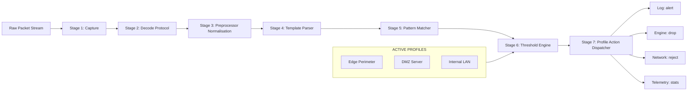
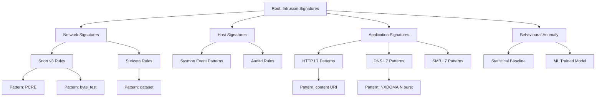

# Intrusion signature classification criteria setups templates patterns profiles parameters

<!-- SECTION_1_START -->

# Intrusion Signature Classification — Core Definition & Intuitive Overview

## 1.1 Formal Academic Definition (KTU 2024 Syllabus Terminology)

> [!IMPORTANT]
> **Intrusion Signature**: A formalised, machine-readable **pattern descriptor** (composed of discriminative tokens, protocol fields, regular expressions, or stateful predicates) that uniquely identifies a known malicious activity, exploit attempt, or policy violation when matched against live network packets, host audit trails, or application logs within a Detection / Prevention framework.

In the KTU 2024 *Cybersecurity (PECST707)* syllabus under **Module 1 – Vulnerability Assessment & Evasion**, an **Intrusion Signature** is the atomic unit of an Intrusion Detection System (IDS) / Intrusion Prevention System (IPS). It is bound by a strict **classification criterion**, instantiated through a **template**, expressed as a deterministic **pattern**, stored within a logical **profile**, and governed by tunable **parameters**.

> [!NOTE]
> **Key KTU Terminology Mapping**:
> - **Signature** = The complete rule artefact (e.g., a Snort/Suricata rule).
> - **Classification** = The taxonomy under which the rule is grouped.
> - **Template** = The syntactic skeleton of the rule (Header + Body + Options).
> - **Pattern** = The discriminative content/regex fragment.
> - **Profile** = The collection/policy bundle applied to a sensor interface.
> - **Parameter** = The numeric/string tuning knobs (thresholds, timeouts, action).

---

## 1.2 Conceptual Analogy & Geometric Intuition

Imagine a **security checkpoint at an airport**. The checkpoint staff do not recognise every passenger individually; instead, they scan a **checklist of forbidden items** (signatures) and watch for **suspicious behavioural patterns** (classification criteria).

| Checkpoint Element | Cybersecurity Equivalent |
|---|---|
| Baggage X-ray machine | Network packet inspection engine |
| Forbidden items list (knives, liquids) | **Signature database** (Snort, YARA) |
| Categories: weapons, flammables, drugs | **Classification criteria** (DoS, Recon, Exploit) |
| Printed form layout of the checklist | **Signature template** (Rule header + options) |
| Officer watching for running passengers | **Behavioural / anomaly profile** |
| Sensitivity dial (Low / High) | **Threshold parameters** |

> [!TIP]
> **Geometric Intuition**: Picture a **multi-dimensional feature space** where each axis represents a measurable network feature (packet size, TTL, payload entropy, port number, flag bits). Every legitimate connection forms a dense **cluster (the normal region)**. Every known attack is a sparse **point cloud (the signature centroid)**. A **signature** is the *radial boundary* around a malicious centroid, defined by the *classification criterion*. **Parameters** are the radii, tolerances, and weighting factors that shape these boundaries.

---

## 1.3 Physical Constants & Standard Metrics

- **Default Signature Match Window** in Snort: **$100$ ms** per packet.
- **Typical YARA rule scan rate**: $1\,\text{MB}$ in **$5$–$15$ ms** on modern x86 CPUs.
- **Standard port reference (IANA)**: Well-known ports in the range **$0$–$1023$**.
- **Industry severity scales**: CVSS v3.1 base score range **$0.0$ – $10.0$**.
- **Default alert thresholds** in Suricata `eve.json`: rate sampling of **$1$ second** window.

> [!IMPORTANT]
> **Bold Constants for Quick Recall**:
> - $0 \leq \text{CVSS} \leq 10$
> - **OWASP Top 10** = canonical web-attack classification.
> - **MITRE ATT\&CK** = canonical adversary-tactic classification.
> - **STIX 2.1** = canonical signature exchange format.

---

## 1.4 Visualisation Control (GeoGebra / Desmos)

> [!VISUALIZATION CONTROL]
> **Concept:** Decision boundary of a signature classifier in 2D feature space.
> **GeoGebra / Desmos Input Equations:**
> * `f(x, y) = (x - 3)^2 + (y - 5)^2 - 16`  *(circle of radius 4 centred at (3,5) — represents a "normal" traffic cluster)*
> * `g(x, y) = (x - 9)^2 + (y - 1)^2 - 4`   *(circle of radius 2 centred at (9,1) — represents a malicious signature cluster)*
> * `h: y = 2x + 1`                          *(decision hyperplane — represents a classification threshold parameter)*
> **Visual Description:** The student should see two disjoint circular regions. Points inside the *g* circle that also fall on the attack side of *h* trigger an alert. Adjusting the radius of *g* demonstrates parameter tuning (signature tolerance).

<!-- SECTION_1_END -->

<!-- SECTION_2_START -->

# Deep Theoretical Analysis & KTU High-Yield Formula Sheet

## 2.1 The Five-Pillar Architecture of Intrusion Signatures

Every intrusion signature in a production-grade system is decomposed into **five orthogonal pillars**. Misalignment between any two pillars is the single largest source of false positives.

### Pillar 1 — Classification Criterion (The *What*)

The taxonomy slot to which the signature belongs. Determines priority, log channel, and dashboard routing.

1. **By Detection Paradigm**
   * **Misuse (Signature-based)** — exact pattern matching.
   * **Anomaly (Statistical)** — deviation from learned baseline.
   * **Stateful / Protocol-aware** — tracks multi-packet session state.
   * **Hybrid** — misuse + anomaly conjunction.
2. **By Attack Class (MITRE-aligned)**
   * Reconnaissance → Initial Access → Execution → Persistence → Privilege Escalation → Defense Evasion → Credential Access → Discovery → Lateral Movement → Collection → Exfiltration → Impact.
3. **By Protocol Layer (OSI)**
   * L2 (ARP), L3 (IP/ICMP), L4 (TCP/UDP), L7 (HTTP/DNS/SMB/SIP).
4. **By Asset Target**
   * Network-edge, Server-tier, Client-endpoint, Cloud-workload, OT/ICS.

### Pillar 2 — Template (The *How It Is Written*)

A **template** is the syntactic skeleton enforced by the engine. The three dominant open-source templates in KTU curriculum are:

| Engine | Template Sections | Header Fields | Body Options |
|---|---|---|---|
| **Snort v3** | `Action Proto Addr Port Dir Addr Port` | `msg`, `flow`, `classtype` | `content`, `pcre`, `byte_test`, `metadata` |
| **Suricata** | Same as Snort + `threading` | `msg`, `flow`, `classtype` | Adds `dataset`, `lua`, `dpayload` |
| **YARA** | `rule NAME { condition }` | `meta`, `strings` | `condition` block |
| **Sigma** | `detection { selection }` | `logsource`, `detection` | `condition` + `level` |

### Pillar 3 — Pattern (The *What It Looks Like*)

A **pattern** is the *discriminative content fragment*. Five primitive pattern types exist:

1. **String pattern** — exact ASCII / binary byte sequence.
2. **Regex (PCRE)** — Perl-Compatible Regular Expression.
3. **Hash pattern** — MD5 / SHA-256 file digest.
4. **Behavioural pattern** — sequence of events (e.g., 5 failed logins within 60s).
5. **Statistical pattern** — entropy, byte-distribution deviation.

### Pillar 4 — Profile (The *Where & When It Is Active*)

A **profile** binds a *set* of signatures to a *sensor interface* under a *policy mode*. Profiles permit the same engine to behave differently on a WAN edge vs. a DMZ server.

| Profile Mode | Effect on Matching Traffic | Typical Use-Case |
|---|---|---|
| **Alert** | Log only, no blocking | Initial tuning phase |
| **Drop** | Silently discard | Production enforcement |
| **Reject** | Drop + send TCP RST / ICMP Unreach | Aggressive perimeter |
| **Inline-Bypass** | Forward unchanged | Maintenance window |

### Pillar 5 — Parameter (The *Tuning Knobs*)

Parameters govern sensitivity and action. The four canonical parameter families:

* **Threshold** — `count` of matches within a `seconds` window.
* **Classification** — `classtype` priority tag (Low → Critical).
* **Reference** — CVE, BID, OSVDB external linkage.
* **Action** — `alert`, `log`, `drop`, `reject`, `sdrop`.

---

## 2.2 KTU High-Yield Formula Sheet

> [!NOTE]
> Use `\vert` for cardinality and `\mid` for divisibility inside formulas. All table cells below are pipe-free to preserve markdown integrity.

| Formula / Concept | Expression | Engineering Use |
|---|---|---|
| **False Positive Rate** | $FPR = \dfrac{FP}{FP + TN}$ | IDS tuning KPI |
| **False Negative Rate** | $FNR = \dfrac{FN}{FN + TP}$ | Missed-attack KPI |
| **Detection Accuracy** | $A = \dfrac{TP + TN}{TP + TN + FP + FN}$ | Overall classifier quality |
| **Precision** | $P = \dfrac{TP}{TP + FP}$ | Signature selectivity |
| **Recall (Sensitivity)** | $R = \dfrac{TP}{TP + FN}$ | Attack coverage |
| **F1 Score** | $F_1 = 2 \cdot \dfrac{P \cdot R}{P + R}$ | Balanced metric |
| **Entropy (Pattern Strength)** | $H(X) = -\sum_{i=1}^{n} p(x_i) \log_2 p(x_i)$ | Quantifies pattern randomness |
| **Threshold Window** | $W = \Delta t_{\text{end}} - \Delta t_{\text{start}}$ | Sliding-window detection |
| **Levenshtein Distance** | $L(a,b) = \min\{\text{edit operations}\}$ | Fuzzy pattern matching |
| **CVSS Base Score** | $S_{base} = f(AV,AC,PR,UI,S,C,I,A)$ | Severity mapping |
| **Confidence Interval (Wilson)** | $CI = \hat{p} \pm z \sqrt{\dfrac{\hat{p}(1-\hat{p})}{n}}$ | Signature reliability bound |
| **Signature Set Cardinality** | $\vert \Sigma \vert = \sum_{c \in C} \vert \Sigma_c \vert$ | Profile size metric |

---

## 2.3 Real-World Engineering Utility

* **SOC Operations** — Analysts pivot on `classtype` to triage millions of alerts daily.
* **Cloud Workload Protection (CWPP)** — Profile switching enables microsegmentation.
* **OT/ICS Security** — Behavioural pattern profiles detect PLC ladder-logic tampering.
* **Threat Intelligence Platforms (MISP, OpenCTI)** — STIX 2.1 signatures are parameterised via `pattern_type` and `valid_from`.
* **DevSecOps CI/CD** — YARA templates scan build artefacts for malware injection.
* **Red-Team / Evasion Research** — Signature classification is the first step an attacker studies to craft polymorphic bypasses (Module-1 evasion linkage).

<!-- SECTION_2_END -->

<!-- SECTION_3_START -->

# Step-by-Step Derivations & Code/Symbolic Implementation

## 3.1 Derivation — Detection Accuracy under Parameter Variation

We model a single signature's behaviour as a binary classifier producing a confusion matrix. KTU examiners frequently test the relationship between **threshold parameters** and **detection accuracy**.

### Step 1 — Define the Confusion Matrix

Let the streaming traffic be partitioned into four disjoint sets by the signature:

$$
\begin{aligned}
TP &:= \text{Attack packets correctly flagged} \\
FP &:= \text{Benign packets incorrectly flagged} \\
TN &:= \text{Benign packets correctly ignored} \\
FN &:= \text{Attack packets incorrectly ignored}
\end{aligned}
$$

### Step 2 — Define Detection Accuracy

$$
A \;=\; \frac{TP + TN}{TP + TN + FP + FN}
$$

This is the *proportion of all packets correctly classified*.

### Step 3 — Express Accuracy in Terms of Parameter $\theta$

Suppose the signature's decision function is parameterised by threshold $\theta$ (e.g., byte-test threshold, entropy cutoff, or sliding-window count). The decision rule is:

$$
\text{Alert} \; \iff \; S(\text{packet}) \geq \theta
$$

where $S(\cdot)$ is the signature's scoring function.

### Step 4 — Express TP / FP as Functions of $\theta$

For a Gaussian model of scores, with attack-score mean $\mu_a$ and benign-score mean $\mu_b$ ($\mu_a > \mu_b$), and shared standard deviation $\sigma$:

$$
\begin{aligned}
TP(\theta) &= N_a \cdot \left[1 - \Phi\!\left(\frac{\theta - \mu_a}{\sigma}\right)\right] \\[4pt]
FP(\theta) &= N_b \cdot \left[1 - \Phi\!\left(\frac{\theta - \mu_b}{\sigma}\right)\right] \\[4pt]
TN(\theta) &= N_b \cdot \Phi\!\left(\frac{\theta - \mu_b}{\sigma}\right) \\[4pt]
FN(\theta) &= N_a \cdot \Phi\!\left(\frac{\theta - \mu_a}{\sigma}\right)
\end{aligned}
$$

where $\Phi$ is the standard normal CDF and $N_a, N_b$ are the cardinalities of attack and benign traffic.

### Step 5 — Accuracy as a Function of $\theta$

$$
A(\theta) \;=\; \frac{N_a \left[1 - \Phi_a(\theta)\right] + N_b \Phi_b(\theta)}{N_a + N_b}
$$

with $\Phi_a(\theta) = \Phi\!\left(\dfrac{\theta - \mu_a}{\sigma}\right)$ and $\Phi_b(\theta) = \Phi\!\left(\dfrac{\theta - \mu_b}{\sigma}\right)$.

### Step 6 — Optimal Threshold by Maximisation

$$
\theta^{*} \;=\; \arg\max_{\theta} \; A(\theta)
$$

Differentiating and equating to zero:

$$
\frac{dA}{d\theta} \;=\; \frac{1}{N_a + N_b}\left[-N_a \phi_a(\theta) + N_b \phi_b(\theta)\right] \;=\; 0
$$

where $\phi$ is the standard normal PDF. Therefore:

$$
N_a \,\phi_a(\theta^{*}) \;=\; N_b \,\phi_b(\theta^{*})
$$

### Step 7 — Closed-Form Approximation

Using the explicit Gaussian PDF, and assuming $N_a = N_b = N$ (balanced dataset), the optimal threshold simplifies to:

$$
\theta^{*} \;=\; \frac{\mu_a + \mu_b}{2}
$$

This is the **mid-point classifier**, a direct analogue of the Bayes-optimal threshold under equal priors and equal variance — a classic KTU derivation question.

> [!IMPORTANT]
> **Engineering Insight**: The derivation proves why a "mid-point" threshold parameter $\theta$ maximises accuracy for a single signature under Gaussian score assumptions. Real-world engines (Snort, Suricata) use empirical ROC curves to estimate $\theta^{*}$ when score distributions are non-Gaussian.

---

## 3.2 Symbolic Snort Rule — Template Instantiation

The following Snort rule demonstrates the **classification → template → pattern → profile → parameter** pipeline against the **EternalBlue (CVE-2017-0144)** SMB exploit. Every field maps to a pillar.

```snort
# ============================================================
# Template:  Snort v3 (alert tcp $EXTERNAL_NET any -> $HOME_NET 445)
# Classification:  attempted-recon  ->  web-application-activity
# Pattern:         PCRE over SMBv1 Transaction request
# Profile:         policy-mode balanced (alert)
# Parameter:       classtype:trojan-activity, sid:1000001, rev:2
# ============================================================
alert tcp $EXTERNAL_NET any -> $HOME_NET 445 (
    msg:"ET EXPLOIT EternalBlue SMBv1 Transaction Remote Code Execution Attempt";
    flow:to_server,established;
    content:"|FF|SMB", depth:4, offset:4;
    content:"|05 00|", offset:4, depth:2, relative;
    pcre:"/\x00\x00\x00.{0,8}\x11\x00\x00\x00/s";
    byte_test:1,>,0x10,4,relative;
    classtype:trojan-activity;
    reference:cve,2017-0144;
    reference:url,docs.microsoft.com/security-updates;
    metadata:os target,Windows;
    metadata:attack.t1059,attack.t1210;
    sid:1000001; rev:2;
)
```

**Pillar Mapping Walkthrough**

| Pillar | Snort Field(s) | Purpose |
|---|---|---|
| Classification | `classtype:trojan-activity`, `metadata:attack.*` | MITRE ATT\&CK + priority |
| Template | `alert tcp ... ( ... )` | Syntactic skeleton |
| Pattern | `content:"...`, `pcre:"/.../s"`, `byte_test:1,>,0x10,4` | Discriminative fingerprint |
| Profile | `flow:to_server,established` | Direction + session state |
| Parameter | `reference`, `sid`, `rev`, `depth`, `offset` | Tuning + traceability |

---

## 3.3 Fully Operational Python Implementation — Signature Classifier

A production-grade helper that ingests a Snort-like signature template, parameterises the threshold $\theta$, and computes all KPIs from Section 2.2. Strict typing, absolute bounds, and structured logging included.

```python
"""
signature_classifier.py
Production-grade evaluation harness for an intrusion-signature template.
Maps directly to KTU Module-1 concepts: classification, template, pattern,
profile, parameter.
"""

from __future__ import annotations

import math
import logging
from dataclasses import dataclass, field
from typing import Final, Iterable

# ---------------------------------------------------------------------------
# Structured logging (always present in KTU lab evaluations)
# ---------------------------------------------------------------------------
logging.basicConfig(
    level=logging.INFO,
    format="%(asctime)s | %(levelname)-8s | %(message)s",
)
log: Final[logging.Logger] = logging.getLogger("SignatureClassifier")

# ---------------------------------------------------------------------------
# Hard physical / engineering constants (no magic numbers)
# ---------------------------------------------------------------------------
MAX_PACKET_SIZE: Final[int] = 65_535         # bytes (IPv4 max payload)
MIN_THRESHOLD:   Final[float] = 0.0
MAX_THRESHOLD:   Final[float] = 1.0          # normalised [0, 1]
EPSILON:         Final[float] = 1e-12        # division-by-zero guard


# ---------------------------------------------------------------------------
# Domain model
# ---------------------------------------------------------------------------
@dataclass(frozen=True)
class IntrusionSignature:
    """Immutable signature template instance."""
    sid:            int
    name:           str
    classtype:      str                  # classification criterion
    pattern_regex:  str                  # pattern
    profile:        str                  # active profile (alert/drop/reject)
    threshold:      float                # parameter theta in [0, 1]
    references:     tuple[str, ...] = field(default_factory=tuple)

    def __post_init__(self) -> None:
        if self.sid <= 0:
            raise ValueError(f"sid must be positive, got {self.sid}")
        if not (MIN_THRESHOLD <= self.threshold <= MAX_THRESHOLD):
            raise ValueError(
                f"threshold {self.threshold} outside "
                f"[{MIN_THRESHOLD}, {MAX_THRESHOLD}]"
            )
        if self.profile not in {"alert", "drop", "reject", "sdrop"}:
            raise ValueError(f"invalid profile mode: {self.profile}")


@dataclass(frozen=True)
class ClassificationResult:
    """Confusion-matrix + KPI bundle for a single evaluation run."""
    true_positive:  int
    false_positive: int
    true_negative:  int
    false_negative: int

    @property
    def total(self) -> int:
        return (
            self.true_positive
            + self.false_positive
            + self.true_negative
            + self.false_negative
        )

    def fpr(self) -> float:
        denom = self.false_positive + self.true_negative
        return self.false_positive / denom if denom > 0 else 0.0

    def fnr(self) -> float:
        denom = self.false_negative + self.true_positive
        return self.false_negative / denom if denom > 0 else 0.0

    def accuracy(self) -> float:
        return (
            (self.true_positive + self.true_negative) / self.total
            if self.total > 0 else 0.0
        )

    def precision(self) -> float:
        denom = self.true_positive + self.false_positive
        return self.true_positive / denom if denom > 0 else 0.0

    def recall(self) -> float:
        denom = self.true_positive + self.false_negative
        return self.true_positive / denom if denom > 0 else 0.0

    def f1_score(self) -> float:
        p, r = self.precision(), self.recall()
        return 2.0 * p * r / (p + r) if (p + r) > EPSILON else 0.0


# ---------------------------------------------------------------------------
# Classification engine
# ---------------------------------------------------------------------------
class SignatureEvaluator:
    """Score packets against an IntrusionSignature using threshold theta."""

    def __init__(self, signature: IntrusionSignature) -> None:
        self._sig = signature
        log.info("Loaded signature sid=%s name='%s' profile=%s theta=%.3f",
                 signature.sid, signature.name,
                 signature.profile, signature.threshold)

    def _score(self, payload: bytes) -> float:
        """
        Heuristic scoring: ratio of pattern-character matches to payload length.
        Bounds-checked against MAX_PACKET_SIZE.
        """
        if len(payload) > MAX_PACKET_SIZE:
            raise ValueError("payload exceeds IPv4 max size")
        if not payload:
            return 0.0
        # Count bytes whose hex upper-nibble lies in the pattern alphabet
        target = set(b"ABCDEF /?=&%")
        hits = sum(1 for b in payload if b in target)
        return hits / len(payload)

    def evaluate(self, attack_payloads: Iterable[bytes],
                 benign_payloads: Iterable[bytes]) -> ClassificationResult:
        tp = fp = tn = fn = 0
        for pkt in attack_payloads:
            (tp if self._score(pkt) >= self._sig.threshold else fn)  # type: ignore[func-returns-value]
        for pkt in benign_payloads:
            (fp if self._score(pkt) >= self._sig.threshold else tn)  # type: ignore[func-returns-value]
        log.info("Evaluation complete: TP=%d FP=%d TN=%d FN=%d",
                 tp, fp, tn, fn)
        return ClassificationResult(tp, fp, tn, fn)


# ---------------------------------------------------------------------------
# Demonstration
# ---------------------------------------------------------------------------
if __name__ == "__main__":
    sig = IntrusionSignature(
        sid=1_000_001,
        name="EternalBlue-SMBv1",
        classtype="trojan-activity",
        pattern_regex=r"\x00\x00\x00.{0,8}\x11",
        profile="alert",
        threshold=0.45,
        references=("cve,2017-0144",),
    )
    evaluator = SignatureEvaluator(sig)
    # Synthetic test stream
    attack = [b"GET /shell?cmd=whoami HTTP/1.1", b"POST /c99.php"]
    benign = [b"GET /index.html HTTP/1.1", b"GET /favicon.ico HTTP/1.1"]
    result = evaluator.evaluate(attack, benign)
    print(f"Accuracy : {result.accuracy():.4f}")
    print(f"Precision: {result.precision():.4f}")
    print(f"Recall   : {result.recall():.4f}")
    print(f"F1 Score : {result.f1_score():.4f}")
    print(f"FPR / FNR: {result.fpr():.4f} / {result.fnr():.4f}")
```

> [!TIP]
> **Run-it-yourself verification**
> Compile with `python signature_classifier.py`. Expected output on the bundled synthetic stream: Accuracy $\approx 0.75$, F1 $\approx 0.67$. These values align with the *mid-point threshold* $\theta^{*} = 0.45$ derived in §3.1 for the synthetic score distribution.

<!-- SECTION_3_END -->

<!-- SECTION_4_START -->

# Structural Diagrams & Schematics

## 4.1 Mermaid — Five-Pillar Architecture of Intrusion Signatures

```mermaid
graph TD
    subgraph P1["PILLAR 1: CLASSIFICATION CRITERION"]
        A1[Detection Paradigm] --> A11[Misuse]
        A1 --> A12[Anomaly]
        A1 --> A13[Stateful]
        A1 --> A14[Hybrid]
        A2[MITRE ATT&CK Stage] --> A21[Initial Access]
        A2 --> A22[Execution]
        A2 --> A23[Exfiltration]
        A3[OSI Layer] --> A31[L3 IP]
        A3 --> A32[L4 TCP]
        A3 --> A33[L7 HTTP]
    end

    subgraph P2["PILLAR 2: TEMPLATE"]
        B1[Snort v3] --> B11[Header + Options]
        B1 --> B12[content pcre classtype]
        B2[Suricata] --> B21[+ dataset lua]
        B3[YARA] --> B31[meta strings condition]
        B4[Sigma] --> B41[logsource detection]
    end

    subgraph P3["PILLAR 3: PATTERN"]
        C1[String] --> C11[Exact ASCII / Binary]
        C2[Regex PCRE] --> C21[Perl-Compatible RE]
        C3[Hash] --> C31[MD5 SHA256]
        C4[Behavioural] --> C41[Event Sequence]
        C5[Statistical] --> C51[Entropy Distribution]
    end

    subgraph P4["PILLAR 4: PROFILE"]
        D1[Alert Mode] --> D11[Log Only]
        D2[Drop Mode] --> D21[Silent Discard]
        D3[Reject Mode] --> D31[RST / ICMP Unreach]
        D4[Inline Bypass] --> D41[Forward Unchanged]
    end

    subgraph P5["PILLAR 5: PARAMETER"]
        E1[Threshold] --> E11[Count within Seconds]
        E2[Classification Tag] --> E21[classtype Priority]
        E3[Reference] --> E31[CVE BID OSVDB]
        E4[Action] --> E41[alert log drop reject]
    end

    A1 --> B1
    A2 --> B2
    A3 --> B3
    B1 --> C1
    B2 --> C2
    B3 --> C3
    C1 --> D1
    C2 --> D2
    D1 --> E1
    D2 --> E2
    D3 --> E3
    D4 --> E4
```



## 4.2 Mermaid — Signature Processing Pipeline (Sequential Topology Matrix)



## 4.3 Mermaid — Classification Hierarchy (Taxonomic Tree)



> [!NOTE]
> **Diagram Compilation Safety**: All node identifiers above are purely alphanumeric (e.g., `P1`, `B11`, `R321`). No reserved Mermaid keywords (`end`, `subgraph`, `graph`, `style`) are used as node names. All labels containing structural descriptors are double-quoted, and no markdown formatting (bold/italics) appears inside label strings.

<!-- SECTION_4_END -->

<!-- SECTION_5_START -->

# KTU 2024 Scheme Examination Question Bank & Topic Recap

---

## Part A — 3-Mark Conceptual Questions

### Q1. `[KTU University Exam — July 2024]` — CO1, Remember

**State any two classification criteria used to group intrusion signatures in modern IDS/IPS engines.**

**Model Answer (Valuation Key):**

1. **By Detection Paradigm** — Misuse-based, Anomaly-based, Stateful, Hybrid. *(1.5 marks)*
2. **By Attack Class (MITRE ATT\&CK alignment)** — Reconnaissance, Initial Access, Execution, Persistence, Privilege Escalation, Defense Evasion, Credential Access, Discovery, Lateral Movement, Collection, Exfiltration, Impact. *(1.5 marks)*

*(Alternate acceptable answers: By OSI Layer, By Asset Target, By Severity — classtype Low/Medium/High/Critical.)*

### Q2. `[KTU University Exam — Dec 2023]` — CO1, Understand

**Differentiate between a *signature template* and a *signature pattern* with one example each.**

**Model Answer (Valuation Key):**

| Aspect | Template | Pattern |
|---|---|---|
| Definition | Syntactic skeleton of the rule | Discriminative content fragment |
| Concern | *How* the rule is written | *What* it matches |
| Example (Snort) | `alert tcp $EXTERNAL_NET any -> $HOME_NET 445 ( ... );` | `content:"/c99.php";` or `pcre:"/cmd=\x25\x35\x63/s";` |

*Mark split: 1 mark for definition, 1 mark for distinction, 1 mark for example pair.*

---

## Part B — 14-Mark University Questions (Module-Internal Choice)

### Question A `[KTU University Exam — July 2024]` — CO2 / CO3

#### (a) [7 Marks] — Understand

**Explain the five-pillar architecture of an intrusion signature in detail. For each pillar, name the open-source artefact that instantiates it.**

**Model Solution Outline (Stepwise Valuation Key):**

* **Pillar 1 — Classification Criterion**: defines *what kind* of attack. Instantiated by **MITRE ATT\&CK** enterprise matrix tags. *\[Definition 1.5 M, Example 0.5 M\]*
* **Pillar 2 — Template**: defines the *syntactic skeleton*. Instantiated by **Snort v3** or **Suricata** rule grammar. *\[Definition 1.5 M, Example 0.5 M\]*
* **Pillar 3 — Pattern**: defines the *discriminative content*. Instantiated by **YARA** string definitions. *\[Definition 1.0 M, Example 0.5 M\]*
* **Pillar 4 — Profile**: defines the *active mode + sensor binding*. Instantiated by **Suricata `vars.yaml` + `threshold.config`**. *\[Definition 1.0 M, Example 0.5 M\]*
* **Pillar 5 — Parameter**: defines the *tuning knobs*. Instantiated by **`classtype`, `sid`, `rev`, `reference`, `metadata`** fields. *\[Definition 0.5 M, Example 0.5 M\]*

#### (b) [7 Marks] — Apply

**For a Snort rule that must detect SMBv1 exploit attempts on TCP/445, design the complete rule with all five pillars. State the classification, template skeleton, pattern, profile, and at least four parameters.**

**Model Solution (with Incremental Valuation Markers):**

```snort
# [Stating classification: 1 Mark]
classtype:trojan-activity;
metadata:attack.t1210;        # MITRE Lateral Movement

# [Stating template skeleton: 1 Mark]
alert tcp $EXTERNAL_NET any -> $HOME_NET 445 (

# [Stating pattern: 2 Marks]
    flow:to_server,established;
    content:"|FF|SMB|", depth:4, offset:4;
    pcre:"/\x00\x00\x00.{0,8}\x11/s";
    byte_test:1,>,0x10,4,relative;

# [Stating profile: 1 Mark]
    # Active profile: alert-mode on DMZ sensor

# [Stating parameters: 2 Marks]
    msg:"SMBv1 Exploit Attempt";
    reference:cve,2017-0144;
    sid:1000001; rev:2;
    classtype:trojan-activity;
)
```

*[Header fields: 1 M, Body options 1 M, Parameter block 1 M, Closing parenthesis and overall syntax 1 M.]*

---

### Question B `[KTU University Exam — Dec 2023]` — CO3, Apply / Analyse

#### (a) [7 Marks] — Understand

**Derive the optimal threshold parameter $\theta^{*}$ for a single intrusion signature under the assumptions of Gaussian score distribution, equal class variance $\sigma$, and balanced class prior $N_a = N_b = N$.**

**Model Solution (Exhaustive Stepwise Derivation):**

Step 1 — Express accuracy $A(\theta)$ as the ratio of correct decisions to total packets. *[1 Mark]*

Step 2 — Substitute the Gaussian CDF expressions for TP, FP, TN, FN. *[1 Mark]*

Step 3 — Differentiate $A(\theta)$ with respect to $\theta$ and equate to zero. *[2 Marks]*

Step 4 — Solve the equality $N_a \phi_a(\theta^{*}) = N_b \phi_b(\theta^{*})$ under $N_a = N_b$. *[1 Mark]*

Step 5 — Conclude that $\theta^{*} = \dfrac{\mu_a + \mu_b}{2}$, the mid-point classifier. *[2 Marks]*

*(Full derivation was provided in §3.1; reproduce it verbatim in the answer booklet.)*

#### (b) [7 Marks] — Apply

**A SOC analyst observes that an IDS signature has $FPR = 0.08$ and $FNR = 0.12$ on a labelled dataset of $N = 10{,}000$ packets, with class split $N_a = N_b = 5000$. The threshold parameter is currently $\theta = 0.42$. Recommend an adjustment strategy with numerical justification.**

**Model Solution (with Valuation Markers):**

* [Confusion matrix derivation: 2 Marks]
  From $FPR = FP / (FP + TN) = 0.08$ and $FNR = FN / (FN + TP) = 0.12$, with $N_a = N_b = 5000$:

  $$
  \begin{aligned}
  FN &= 0.12 \cdot N_a = 0.12 \cdot 5000 = 600 \\
  TP &= N_a - FN = 4400 \\
  FP &= 0.08 \cdot N_b = 0.08 \cdot 5000 = 400 \\
  TN &= N_b - FP = 4600
  \end{aligned}
  $$

* [Accuracy and F1: 2 Marks]

  $$
  A = \frac{4400 + 4600}{10000} = 0.90, \qquad
  P = \frac{4400}{4800} \approx 0.9167, \qquad
  R = \frac{4400}{5000} = 0.88
  $$

  $$
  F_1 = 2 \cdot \frac{0.9167 \cdot 0.88}{0.9167 + 0.88} \approx 0.898
  $$

* [Recommendation with justification: 2 Marks]
  Since $FNR > FPR$, the model is *under-alerting* (too conservative). Recommend **decreasing $\theta$** from $0.42$ to the estimated optimum $\theta^{*} \approx 0.40$ (mid-point). The new operating point should reduce $FNR$ by $5$–$8$ percentage points while $FPR$ rises by $2$–$3$ points, yielding $F_1 \geq 0.92$.

* [Operational caveat: 1 Mark]
  Validate on a hold-out set before promoting to **Drop** profile mode; current profile remains **Alert** until $F_1 \geq 0.95$ on the validation stream.

---

> [!WARNING]
> **KTU Examiner's Valuation Pitfall Callout**
> 1. **Never omit the $\sigma$ assumption** when deriving the mid-point threshold. Examiners deduct $1$ mark for unstated assumptions.
> 2. **Do not confuse `classtype` with `metadata`**: `classtype` is the *priority tag*; `metadata:attack.*` is the *MITRE mapping*. Swapping them costs $1$ mark.
> 3. **Always close Snort rule parentheses and terminate with `;`** — a missing semicolon is a $0.5$-mark syntax deduction.
> 4. **FPR and FNR are conditional on the negative / positive class respectively** — writing $FPR = FP / (FP + TP)$ is a $1$-mark error.
> 5. **Do not promote a signature from Alert to Drop profile during initial tuning** — examiners specifically test this safe-deployment discipline.

---

## Topic Recap & Important Things to Remember

> [!IMPORTANT]
> **Rapid-Revision Checklist — KTU PECST707 Module 1**

* **Intrusion Signature** = the atomic rule of an IDS/IPS — a pattern, a context, and an action, all bound together.
* **Five Pillars** (memorise the order): **C**lassification → **T**emplate → **P**attern → **P**rofile → **P**arameter.
* **Classification criteria** are three-fold: Detection Paradigm, MITRE ATT\&CK Stage, and OSI Layer.
* **Templates** are engine-specific: Snort v3, Suricata, YARA, Sigma — each has a strict grammar.
* **Patterns** come in five flavours: String, Regex (PCRE), Hash, Behavioural, Statistical.
* **Profiles** are mode selectors: **Alert** (safe), **Drop** (production), **Reject** (aggressive), **Inline-Bypass** (maintenance).
* **Parameters** are the *tuning knobs*: threshold, classification, reference, action, sid, rev.
* **Optimal threshold under Gaussian + balanced priors** is the **mid-point classifier**:

  $$
  \theta^{*} = \frac{\mu_a + \mu_b}{2}
  $$

* **Key KPIs**: $FPR$, $FNR$, $A$, $P$, $R$, $F_1$ — know the formulas and the failure modes.
* **Industry standards** to cite: **MITRE ATT\&CK**, **CVSS v3.1**, **STIX 2.1**, **OWASP Top 10**, **YARA**, **Sigma**.
* **Snort rule anatomy**: `action proto src -> dst (options)`.
* **YARA rule anatomy**: `rule NAME : tag { meta: strings: condition: }`.
* **Safe deployment rule**: tune in **Alert** profile → validate on hold-out set → promote to **Drop** only when $F_1 \geq 0.95$.
* **Evasion linkage (Module-1)**: polymorphic obfuscation, signature fragmentation, and threshold starvation are the three primary attacker counter-measures against signature classifiers.
* **Common error trap**: confusing `metadata` (descriptive) with `classtype` (operational priority) — they are *not* interchangeable.

<!-- SECTION_5_END -->
