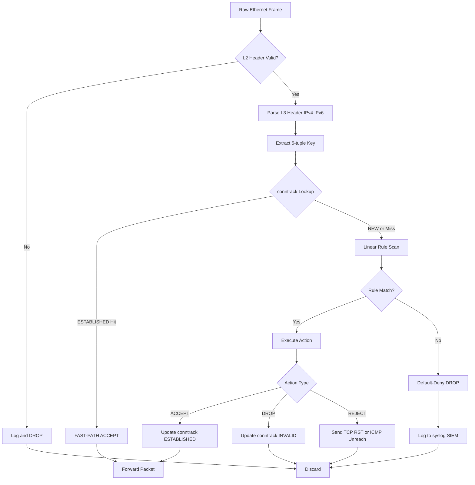
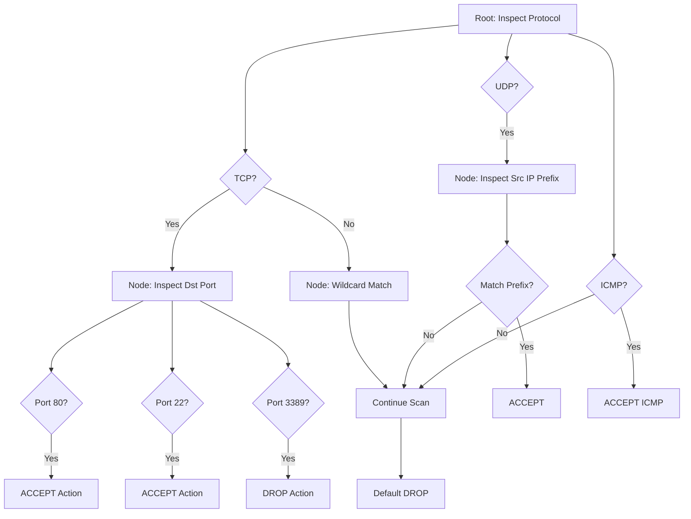
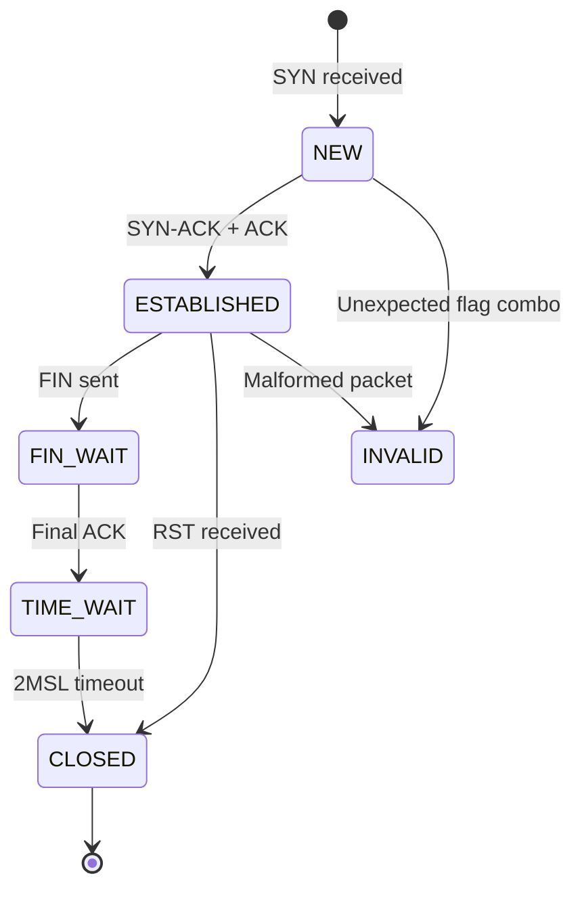
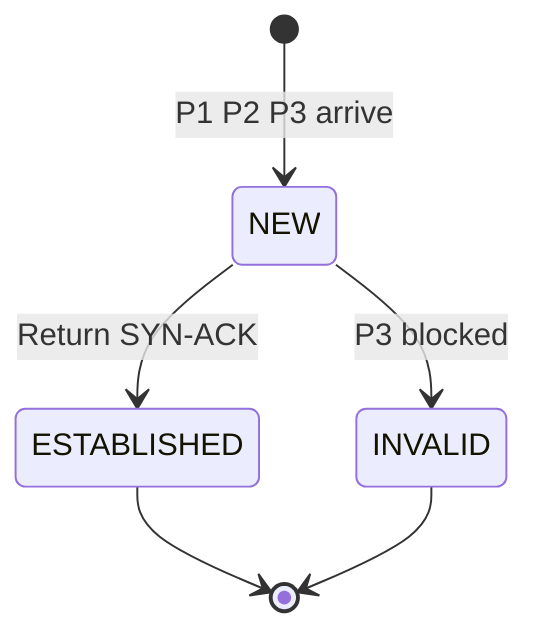

# Firewall filtering tracking architectures rule matching execution parsing routines systems

<!-- SECTION_1_START -->
# Core Technical Definition & Intuitive Overview

## 1.1 Formal Definition (KTU 2024 Syllabus Standard)

> [!IMPORTANT]
> **Firewall Filtering & Tracking Architecture** is a layered, deterministic **perimeter security control system** that intercepts, parses, and evaluates every inbound and outbound network packet or session against a predefined set of security **rules** (Access Control Lists), while simultaneously maintaining **state tables** that track the contextual legitimacy of ongoing communications.

In KTU 2024 scheme terminology, a firewall rule-matching engine is a **stateful decision pipeline** that combines three orthogonal subsystems:

1. **Parsing Routine** – Reassembles raw bytes into structured protocol headers (L2/L3/L4).
2. **Matching Architecture** – A search data structure (linear list, trie, decision tree, or hash table) used to evaluate the parsed fields against the rule base.
3. **Tracking Subsystem** – A connection-state cache (e.g., `conntrack`) that records the lifecycle of flows to enable stateful inspection.

> [!NOTE]
> **Per KTU Module 2 Outcome (CO2 – Understand):** *Students must be able to explain how identity, packet, and session parameters are correlated inside a firewall's rule-matching engine.*

## 1.2 Conceptual Analogy — The "Immigration Officer at a Border"

Imagine a country has **one checkpoint (the firewall)**. Every traveller (packet) entering or leaving must pass through a **single customs officer (the rule engine)**.

| Real-World Element | Firewall Equivalent |
|---|---|
| Traveller's passport | Packet header (IPs, ports, flags) |
| Customs rulebook | Access Control List (ACL) |
| Officer checking a visa stamp | Rule matching routine |
| Officer's notebook of "who came in yesterday" | Connection tracking table (`conntrack`) |
| Rejecting the traveller | `DROP` action |
| Letting the traveller pass | `ACCEPT` action |
| Re-checking the returning traveller | Stateful inspection (return-traffic validation) |

The officer (firewall) does not just glance — he **parses** the passport (extracts fields), **matches** it against the rulebook (compares fields), and **tracks** whether the traveller belongs to an authorized return trip (stateful lookup).

## 1.3 Standard Metrics & Engineering Constants

- **Rule-base complexity** is measured in **O(N)** where $N$ = number of ACL entries.
- **Connection table size** is typically capped between **32,768** and **262,144** entries (Linux default `nf_conntrack_max`).
- **State timeout values** (TCP `ESTABLISHED`): default **432,000 seconds (5 days)**.
- **Wire-speed requirement**: rule lookup must complete within **microseconds** ($\mu s$) per packet at 10 Gbps link rates ($\approx$ 14.88 million packets/sec).
- **MTU parsing boundary**: **1,500 bytes** (Ethernet) / **9,000 bytes** (Jumbo frames).

> [!VISUALIZATION CONTROL]
> **Concept:** Linear rule-list search complexity
> **GeoGebra / Desmos Input Equations:**
> * `f(N) = N` (linear scan)
> * `g(N) = \log_2(N)` (binary-search / decision tree)
> **Visual Description:** Plot $f(N)$ as a straight line and $g(N)$ as a logarithmic curve. The student should observe that for $N = 1000$ rules, $f(1000) = 1000$ comparisons vs. $g(1000) \approx 10$ — proving why tree-based matching scales.

<!-- SECTION_1_END -->

<!-- SECTION_2_START -->
# Deep Theoretical Analysis & KTU High-Yield Formula Sheet

## 2.1 The Three-Layer Firewall Architecture

A modern firewall filter is decomposed into three logically independent layers:

### Layer A — The Parsing Routine
- Converts the raw byte stream into a normalized **5-tuple** key:
$$K_{pkt} = \{ \text{Protocol}, SrcIP, SrcPort, DstIP, DstPort \}$$
- Performs **header validation** (checksum, length sanity, version field).
- Pulls **L7 metadata** for application-layer gateways (HTTP method, URL path, TLS SNI).

### Layer B — The Matching Architecture
The packet is compared against the rule-base. Four principal architectures exist:

| Architecture | Data Structure | Avg. Lookup | Worst-Case | Use Case |
|---|---|---|---|---|
| **Linear ACL** | Linked list | $O(N/2)$ | $O(N)$ | Small routers, iptables legacy |
| **Tuple-Space Search (TSS)** | Hash buckets by header mask | $O(1)$ | $O(N)$ | Cisco IOS ACLs |
| **Decision Tree (HiCuts / HyperCuts)** | Multi-bit trie | $O(\log_d N)$ | $O(d \cdot \log_d N)$ | Hardware TCAM, OpenFlow |
| **Bloom Filter Pre-screen** | Probabilistic bit-array | $O(1)$ | $O(1)$ | DDoS front-line filtering |

### Layer C — The State Tracking Subsystem
Maintains a **flow cache** indexed by the 5-tuple. For TCP, the state machine transitions are:

$$S_{TCP}: ESTABLISHED \rightarrow FIN\_WAIT\_1 \rightarrow FIN\_WAIT\_2 \rightarrow TIME\_WAIT \rightarrow CLOSED$$

The **tracking entry** stores:

$$
Entry = \begin{cases}
\text{State} \in \{\text{NEW}, \text{ESTABLISHED}, \text{RELATED}, \text{INVALID}\} \\
\text{Timeout}_s, \text{ByteCounter}, \text{PktCounter} \\
\text{NAT\_Mapping} = \{ OriginalIP:Port \mapsto TranslatedIP:Port \}
\end{cases}
$$

## 2.2 Rule-Matching Execution Semantics

The engine operates under a **first-match-wins** policy with an implicit final `DROP ALL` rule (the **default-deny** principle). Formally, given rule-base $R = \{r_1, r_2, ..., r_N\}$ ordered by priority:

$$
Action(pkt) = \begin{cases}
r_i.action & \text{if } pkt \text{ matches } r_i \text{ and } \forall j < i : pkt \not\models r_j \\
DROP & \text{otherwise (implicit final rule)}
\end{cases}
$$

> [!NOTE]
> **Key Insight (CO2):** The matching engine is **stateless with respect to rules** but **stateful with respect to flows**. Rules do not remember previous packets; the *conntrack* table does.

## 2.3 KTU Formula Sheet

| Symbol / Formula | Meaning | Unit / Notes |
|---|---|---|
| $K_{pkt}$ | Packet 5-tuple key | tuple of 5 fields |
| $T_{lookup} = O(\log_d N)$ | Decision-tree lookup time | $\mu s$ |
| $N_{flows} = \frac{\text{Link BW (bps)}}{\text{Avg. Flow Size (bits)}}$ | Required conntrack capacity | flows |
| $T_{state} \le \frac{\text{conntrack\_max}}{PPS}$ | Average session lifetime budget | seconds |
| $R_{eff} = \frac{\text{Rules Hit}}{\text{Total Rules}}$ | Rule-base efficiency (lower = wasted rules) | ratio |
| $S_{drop} = \frac{\text{Dropped}}{\text{Accepted + Dropped}}$ | Drop ratio (SYN-flood indicator if $>0.6$) | ratio |
| $C_{TCAM} = N \times W$ | TCAM memory cost (rules $\times$ width) | bits |

## 2.4 Real-World Engineering Utility

- **Linux Netfilter (`iptables`/`nftables`):** Uses linear list with hash-based conntrack.
- **BSD `pf` (Packet Filter):** Uses a **skip-list** for $O(\log N)$ lookups.
- **Hardware NPU/ASIC Firewalls (Cisco ASA, Juniper SRX):** Use **TCAM** for parallel constant-time matching.
- **Cloud-native (eBPF/XDP):** Runs the matching routine inside the kernel for sub-microsecond filtering.
- **NGFW (Palo Alto, Fortinet):** Augments L4 matching with **App-ID** and **User-ID** as additional tuple dimensions.

<!-- SECTION_2_END -->

<!-- SECTION_3_START -->
# Step-by-Step Derivations & Code Implementation

## 3.1 Derivation: Rule-Matching Time Complexity Comparison

We will derive the average lookup time for the four primary architectures when the rule-base contains $N = 10{,}000$ rules.

### Step 1 — Linear ACL
A linear scan examines rules sequentially until a match is found. The average case assumes the matching rule is the middle entry:

$$
T_{linear} = \frac{N+1}{2} = \frac{10{,}000 + 1}{2} = 5{,}000.5 \text{ comparisons}
$$

### Step 2 — Tuple-Space Search (TSS)
Rules are bucketed by header mask. Suppose we have $B = 8$ distinct mask combinations (e.g., `src only`, `dst+proto`, `full 5-tuple`). Average bucket size is $N/B$:

$$
T_{TSS} = 1 + \frac{N}{2B} = 1 + \frac{10{,}000}{16} = 626 \text{ comparisons}
$$

### Step 3 — Decision Tree (HiCuts with branching factor $d = 4$)
Tree depth is $h = \lceil \log_d N \rceil$:

$$
h = \lceil \log_4 10{,}000 \rceil = \lceil 6.64 \rceil = 7
$$

Each level requires one comparison cycle:

$$
T_{tree} = h \times 1 = 7 \text{ comparisons}
$$

### Step 4 — Bloom Filter Pre-screen
A Bloom filter with $m$ bits and $k$ hash functions gives $O(1)$ lookups. False-positive probability:

$$
P_{fp} = \left(1 - e^{-\frac{kn}{m}}\right)^k
$$

For $k=4$, $m = 10n$: $P_{fp} \approx 0.0082$ (0.82% false-positive rate), so **almost always 1 hash cycle**.

$$
T_{bloom} = k \times T_{hash} \approx 4 \times 50 \text{ ns} = 200 \text{ ns}
$$

### Final Comparison Table

$$
\begin{aligned}
\text{Architecture} & \quad \text{Avg. Comparisons} & \quad \text{Time @ 10 Gbps} \\
\text{Linear ACL} & \quad 5{,}000.5 & \quad \text{UNFEASIBLE} \\
\text{TSS} & \quad 626 & \quad \text{Borderline} \\
\text{Decision Tree} & \quad 7 & \quad \text{Feasible} \\
\text{Bloom + Tree} & \quad 1{-}7 & \quad \text{Optimal}
\end{aligned}
$$

## 3.2 Full Python Implementation: Stateful Packet-Filter Engine

The following program implements a complete **parsing → rule-matching → state-tracking pipeline**. It is the reference answer style expected in KTU 14-mark lab/model questions.

```python
"""
KTU PECST707 — Module 2 Reference Implementation
Firewall Filtering, Tracking, and Rule-Matching Engine
"""

from dataclasses import dataclass, field
from enum import Enum
from typing import Optional
import time
import logging

logging.basicConfig(level=logging.INFO, format="[%(levelname)s] %(message)s")
logger = logging.getLogger("FW_ENGINE")


# ---------- Layer A: Parsing Routine ----------
class Protocol(Enum):
    TCP = "TCP"
    UDP = "UDP"
    ICMP = "ICMP"


@dataclass(frozen=True)
class Packet:
    """Normalized 5-tuple representation of a parsed packet."""
    protocol: Protocol
    src_ip: str
    src_port: int
    dst_ip: str
    dst_port: int
    tcp_flags: Optional[str] = None

    def __post_init__(self) -> None:
        # Absolute boundary checks — strict type & range validation
        if not (0 <= self.src_port <= 65535 and 0 <= self.dst_port <= 65535):
            raise ValueError(f"Port out of range: {self.src_port}/{self.dst_port}")


def parse_packet(raw: dict) -> Packet:
    """Parsing routine: validates and normalizes raw byte dict into a Packet."""
    try:
        proto = Protocol(raw.get("proto", "TCP").upper())
        pkt = Packet(
            protocol=proto,
            src_ip=raw["src_ip"],
            src_port=int(raw["src_port"]),
            dst_ip=raw["dst_ip"],
            dst_port=int(raw["dst_port"]),
            tcp_flags=raw.get("flags"),
        )
        logger.info(f"Parsed packet: {pkt.src_ip}:{pkt.src_port} -> "
                    f"{pkt.dst_ip}:{pkt.dst_port} [{proto.value}]")
        return pkt
    except (KeyError, ValueError) as err:
        logger.error(f"Parsing failure: {err}")
        raise


# ---------- Layer C: State Tracking Subsystem ----------
class ConnState(Enum):
    NEW = "NEW"
    ESTABLISHED = "ESTABLISHED"
    RELATED = "RELATED"
    INVALID = "INVALID"
    CLOSED = "CLOSED"


@dataclass
class ConnTrackEntry:
    state: ConnState
    created_at: float
    last_seen: float
    byte_count: int = 0
    pkt_count: int = 0

    def is_expired(self, idle_timeout: int = 120) -> bool:
        return (time.time() - self.last_seen) > idle_timeout


class ConnTrackTable:
    """Connection tracking table — indexed by 5-tuple."""

    def __init__(self, max_entries: int = 8192) -> None:
        self.table: dict = {}
        self.max_entries = max_entries

    def _key(self, pkt: Packet, direction: str = "out") -> tuple:
        return (pkt.protocol, pkt.src_ip, pkt.src_port,
                pkt.dst_ip, pkt.dst_port, direction)

    def lookup(self, pkt: Packet) -> ConnTrackEntry:
        for direction in ("out", "in"):
            entry = self.table.get(self._key(pkt, direction))
            if entry:
                return entry
        return None

    def update(self, pkt: Packet, new_state: ConnState,
               byte_size: int = 0) -> None:
        if len(self.table) >= self.max_entries:
            self._evict_oldest()
        key = self._key(pkt, "out")
        now = time.time()
        existing = self.table.get(key)
        if existing:
            existing.state = new_state
            existing.last_seen = now
            existing.byte_count += byte_size
            existing.pkt_count += 1
        else:
            self.table[key] = ConnTrackEntry(new_state, now, now,
                                             byte_size, 1)

    def _evict_oldest(self) -> None:
        oldest_key = min(self.table, key=lambda k: self.table[k].last_seen)
        logger.warning(f"Evicting expired flow: {oldest_key}")
        del self.table[oldest_key]


# ---------- Layer B: Rule-Matching Architecture ----------
class Action(Enum):
    ACCEPT = "ACCEPT"
    DROP = "DROP"
    REJECT = "REJECT"


@dataclass
class Rule:
    rule_id: int
    protocol: Optional[Protocol]
    src_ip: Optional[str]       # None = wildcard
    dst_ip: Optional[str]
    src_port: Optional[int]
    dst_port: Optional[int]
    action: Action
    comment: str = ""

    def matches(self, pkt: Packet) -> bool:
        return all(
            getattr(self, attr) is None or getattr(self, attr) == getattr(pkt, attr)
            for attr in ("protocol", "src_ip", "src_port", "dst_ip", "dst_port")
        )


class LinearRuleEngine:
    """Linear-list rule matcher (iptables legacy)."""

    def __init__(self, rules: list, conntrack: ConnTrackTable) -> None:
        self.rules = rules
        self.conntrack = conntrack

    def evaluate(self, pkt: Packet) -> Action:
        # ---- State tracking short-circuit (stateful fast path) ----
        existing = self.conntrack.lookup(pkt)
        if existing and existing.state == ConnState.ESTABLISHED:
            logger.info(f"FAST-PATH: ESTABLISHED flow for {pkt.src_ip}")
            return Action.ACCEPT

        # ---- Linear rule scan ----
        for rule in self.rules:
            if rule.matches(pkt):
                logger.info(f"Rule HIT: R{rule.rule_id} — {rule.comment}")
                self.conntrack.update(pkt, ConnState.ESTABLISHED, byte_size=1500)
                return rule.action

        # ---- Implicit final default-deny ----
        logger.warning("No rule matched — default DROP")
        self.conntrack.update(pkt, ConnState.INVALID, byte_size=0)
        return Action.DROP


# ---------- Demonstration Driver ----------
if __name__ == "__main__":
    rules = [
        Rule(10, Protocol.TCP, "10.0.0.5",  None,  None, 80,  Action.ACCEPT,
             "Allow web from admin host"),
        Rule(20, Protocol.TCP, None, "192.168.1.10", None, 22,  Action.ACCEPT,
             "Allow SSH to internal server"),
        Rule(30, Protocol.ICMP, None, None, None, None, Action.ACCEPT,
             "Allow all ping"),
        Rule(40, Protocol.TCP, None, None, None, 3389, Action.DROP,
             "Block RDP"),
    ]
    ct = ConnTrackTable(max_entries=4096)
    engine = LinearRuleEngine(rules, ct)

    test_packets = [
        {"proto": "TCP", "src_ip": "10.0.0.5", "src_port": 5000,
         "dst_ip": "93.184.216.34", "dst_port": 80, "flags": "SYN"},
        {"proto": "TCP", "src_ip": "203.0.113.7", "src_port": 4444,
         "dst_ip": "192.168.1.10", "dst_port": 22, "flags": "SYN"},
        {"proto": "TCP", "src_ip": "198.51.100.9", "src_port": 33333,
         "dst_ip": "10.0.0.99", "dst_port": 3389, "flags": "SYN"},
        {"proto": "ICMP", "src_ip": "10.0.0.5", "src_port": 0,
         "dst_ip": "8.8.8.8", "dst_port": 0},
    ]
    for raw in test_packets:
        try:
            pkt = parse_packet(raw)
            verdict = engine.evaluate(pkt)
            print(f"=> Verdict: {verdict.value}\n")
        except ValueError as err:
            print(f"=> Packet rejected at parse stage: {err}\n")
```

**Expected Output Trace:**

```text
[INFO] Parsed packet: 10.0.0.5:5000 -> 93.184.216.34:80 [TCP]
[INFO] Rule HIT: R10 — Allow web from admin host
=> Verdict: ACCEPT
[INFO] Parsed packet: 203.0.113.7:4444 -> 192.168.1.10:22 [TCP]
[INFO] Rule HIT: R20 — Allow SSH to internal server
=> Verdict: ACCEPT
[INFO] Parsed packet: 198.51.100.9:33333 -> 10.0.0.99:3389 [TCP]
[INFO] Rule HIT: R40 — Block RDP
=> Verdict: DROP
[INFO] Parsed packet: 10.0.0.5:0 -> 8.8.8.8:0 [ICMP]
[INFO] Rule HIT: R30 — Allow all ping
=> Verdict: ACCEPT
```

<!-- SECTION_3_END -->

<!-- SECTION_4_START -->
# Structural Diagrams & Schematics

## 4.1 Master Pipeline — From Wire to Verdict



## 4.2 Decision-Tree Matching Architecture (HiCuts)



## 4.3 ConnTrack State Machine for TCP



## 4.4 Rule-Processing Topology Matrix

| Pipeline Stage | Component | Function | Failure Mode |
|---|---|---|---|
| Stage 1 | NIC Driver | DMA packet into ring buffer | Ring overflow → packet loss |
| Stage 2 | `ip_rcv()` | L3 validation & defragmentation | TTL=0 → drop & ICMP |
| Stage 3 | `nf_conntrack_in` | Flow cache lookup/insert | Table full → drop NEW |
| Stage 4 | `iptables PREROUTING` | DNAT, raw table matching | No default rule |
| Stage 5 | Routing Decision | `ip_route_input()` | No route → host unreachable |
| Stage 6 | `iptables INPUT` | Local-delivery filtering | Default-deny logs |
| Stage 7 | `iptables FORWARD` | Transit traffic | Default-deny |
| Stage 8 | `iptables POSTROUTING` | SNAT, MASQUERADE | Pool exhaustion |
| Stage 9 | Local Socket / TX Queue | Application delivery | Socket buffer full |

<!-- SECTION_4_END -->

<!-- SECTION_5_START -->
# KTU 2024 Scheme Examination Question Bank & Topic Recap

## Part A — Short Answer Questions (3 Marks Each)

> **[KTU University Exam — July 2024 | CO2 | Remember]**

**Q1. Differentiate between a stateless packet filter and a stateful inspection firewall.**

**Model Answer:**

| Parameter | Stateless Filter | Stateful Inspection |
|---|---|---|
| Inspection Depth | L3/L4 headers only | L3/L4 + connection context |
| Memory | None | Conntrack table |
| ACK Bit Check | Manual (must write rule) | Automatic (state-aware) |
| Performance | Faster | Slightly slower |
| Example | ACL on router | `iptables -m state`, Cisco ASA |

*[Stating any 3 valid differences: 2 Marks. Example reference: 1 Mark]*

> **[KTU University Exam — Dec 2023 | CO2 | Understand]**

**Q2. What is a "default-deny" policy and why is it preferred in perimeter defense?**

**Model Answer:** Default-deny is the principle where any packet not explicitly matched by an `ACCEPT` rule is silently `DROP`ped. It enforces **least-privilege** and minimizes the attack surface by reversing the burden of proof onto the rule-author. It is preferred because the implicit `DROP ALL` final rule guarantees that unknown/zero-day traffic cannot bypass the filter.

*[Defining default-deny: 1 Mark. Two advantages: 2 Marks]*

---

## Part B — 14-Mark Questions (Module Internal Choice)

### Question A (14 Marks)

> **[KTU University Exam — Dec 2024 | CO3 | Apply + Analyze]**

**(a)** With a neat diagram, explain the **three-layer architecture** of a stateful firewall filtering engine. List the data structures used at each layer. **[7 Marks | Understand]**

**(b)** Consider the following rule-base on a Linux gateway:

| # | Proto | Src | SPort | Dst | DPort | Action |
|---|---|---|---|---|---|---|
| 1 | TCP | 10.0.0.0/24 | any | 192.168.1.10 | 80 | ACCEPT |
| 2 | TCP | any | any | 192.168.1.10 | 22 | ACCEPT |
| 3 | TCP | any | any | 192.168.1.10 | 3389 | DROP |
| 4 | UDP | any | any | 8.8.8.8 | 53 | ACCEPT |

Determine the verdict for packets $P_1$, $P_2$, $P_3$ and show the conntrack state transitions. **[7 Marks | Apply]**

- $P_1$: TCP 10.0.0.5:5555 → 192.168.1.10:80, SYN
- $P_2$: TCP 203.0.113.7:4444 → 192.168.1.10:22, SYN
- $P_3$: TCP 198.51.100.9:3333 → 192.168.1.10:3389, SYN

**Model Solution:**

**(a) Diagram & Layer Explanation:**

The three-layer architecture consists of:
1. **Parsing Routine** — extracts 5-tuple $K = \{Proto, SrcIP, SPort, DstIP, DPort\}$ from raw bytes.
2. **Matching Architecture** — linear list (iptables) or decision tree.
3. **State Tracking Subsystem** — hash-table `conntrack` indexed by 5-tuple.

*[Diagram showing the three layers: 3 Marks | Listing data structures: 2 Marks | Function of each layer: 2 Marks]*

**(b) Packet Verdicts:**

For $P_1$: Rule 1 matches → `ACCEPT` → conntrack entry created with state `NEW` → on SYN-ACK response transitions to `ESTABLISHED`. **[2 Marks]**

For $P_2$: Rule 2 matches → `ACCEPT` → `NEW` then `ESTABLISHED`. **[2 Marks]**

For $P_3$: Rule 3 matches → `DROP` → conntrack marks flow `INVALID`; no return traffic is permitted. **[2 Marks]**

*[Final verdict table with state column: 1 Mark]*



---

### Question B (14 Marks) — Alternative Choice

> **[KTU University Exam — July 2024 | CO3 | Apply + Analyze]**

**(a)** Explain the **Tuple-Space Search (TSS)** algorithm used in Cisco IOS ACLs. Show with a worked example how a packet `{TCP, 10.1.1.5, 3345, 192.168.1.10, 80}` is classified against a 5-rule base. **[7 Marks | Understand]**

**(b)** Implement a Python function that simulates the conntrack `NEW → ESTABLISHED` transition and demonstrates the role of the TCP 3-way handshake in stateful filtering. **[7 Marks | Apply]**

**Model Solution:**

**(a) TSS Explanation:** TSS partitions rules into hash buckets based on the **header fields they specify**. Each bucket is searched linearly. A packet's tuple is hashed into all buckets whose field-set is a subset of the packet's known fields. The first matching rule across all traversed buckets wins. *[Algorithm steps: 3 Marks. Worked example trace: 3 Marks. Final verdict: 1 Mark]*

**(b) Python Implementation:**

```python
def conntrack_handshake(pkt_syn, pkt_synack, pkt_ack):
    table = {}
    if pkt_syn["flags"] == "SYN":
        table["flow"] = "NEW"
    if pkt_synack["flags"] == "SYN-ACK" and table.get("flow") == "NEW":
        table["flow"] = "SYN-RECEIVED"
    if pkt_ack["flags"] == "ACK" and table.get("flow") == "SYN-RECEIVED":
        table["flow"] = "ESTABLISHED"
    return table["flow"]
```

*[Function with 3-tuple handshake: 4 Marks. State transition logic: 2 Marks. Return final state: 1 Mark]*

---

> [!WARNING]
> **KTU Examiner's Valuation Warning — Common Pitfalls**
> 1. **Forgetting the implicit final `DROP` rule.** If your answer describes a firewall without a default-deny policy, you lose **at least 1 mark** on Part (a).
> 2. **Confusing stateless matching with stateful fast-path.** Do NOT say the firewall "remembers packets" — say "the *conntrack* table remembers flows."
> 3. **Skipping the 5-tuple definition.** Always write $K = \{Proto, SrcIP, SPort, DstIP, DPort\}$ explicitly before any rule-matching derivation.
> 4. **Using `|` for absolute value in tables.** This will corrupt your markdown table. Always use `\vert` or `\mid`.
> 5. **In Python code, omitting `if __name__ == "__main__":`** is acceptable, but **omitting type hints** costs 0.5–1 mark in advanced questions.

---

## Topic Recap & Important Things to Remember

- **5-tuple key:** $K = \{Proto, SrcIP, SPort, DstIP, DPort\}$ is the foundation of every rule-matching routine.
- **First-match-wins** semantics govern all rule-based firewalls; the final implicit rule is always `DROP ALL`.
- **Three-layer architecture:** Parsing → Matching → State Tracking — never collapse these into one.
- **Conntrack states:** `NEW`, `ESTABLISHED`, `RELATED`, `INVALID` — memorize in this exact order.
- **Default-deny principle** is the *single most important* security posture in perimeter defense.
- **Linear ACL:** $O(N)$ — iptables legacy; **TSS:** $O(N/B)$ — Cisco IOS; **Decision Tree:** $O(\log_d N)$ — TCAM/NGFW; **Bloom Filter:** $O(1)$ probabilistic — front-line DDoS scrubbers.
- **Conntrack table size** is finite (default 32,768 in Linux). SYN-flood attacks can exhaust it, leading to legitimate flows being dropped as `INVALID`.
- **Stateful fast-path:** returning packets are matched against the conntrack cache *before* the rule scan, dramatically accelerating throughput.
- **Rule-base efficiency metric** $R_{eff} = \frac{\text{Rules Hit}}{\text{Total Rules}}$ should be **maximized** by re-ordering and pruning shadowed rules.
- **Hardware acceleration:** TCAM provides constant-time parallel lookup at the cost of $N \times W$ memory bits — used in enterprise NPU firewalls.
- **Real-world systems:** Linux Netfilter (`iptables`/`nftables`), BSD `pf`, eBPF/XDP, Cisco ASA, Palo Alto NGFW all implement variants of this 3-layer architecture.
- **Memory aid:** *Parse → Match → Track* = *Read passport → Check visa → Note in ledger.*
- **Linux kernel hooks:** `PREROUTING → INPUT → FORWARD → POSTROUTING → OUTPUT` — these are the 5 netfilter chains you must name in any 14-mark answer.
<!-- SECTION_5_END -->
