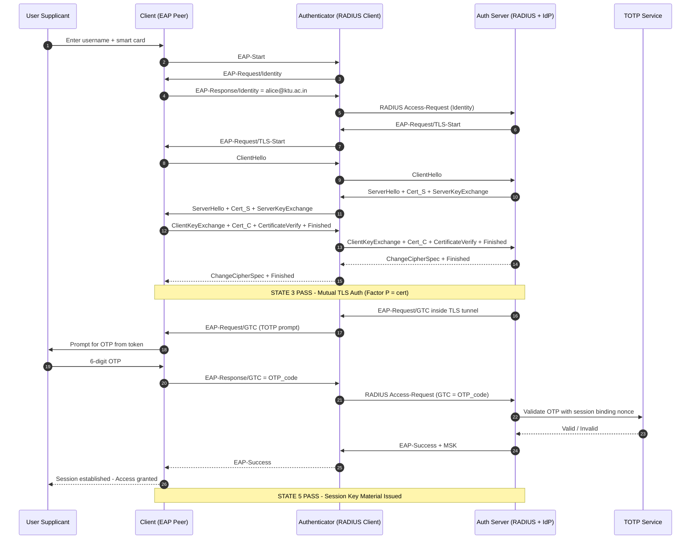
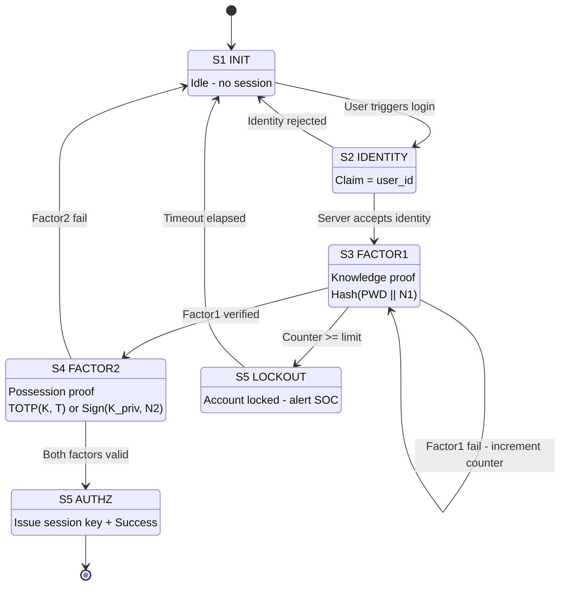
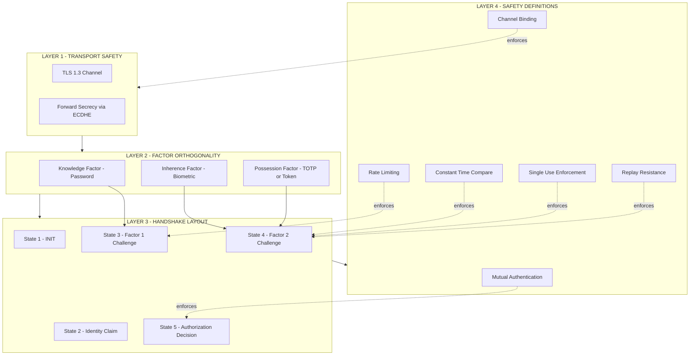
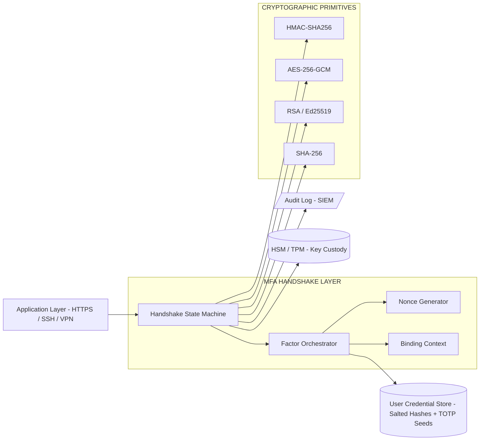

# Multi-factor validation handshake protocol sequences layout safety definitions

<!-- SECTION_1_START -->
# Multi-Factor Validation Handshake Protocol Sequences — Layout & Safety Definitions

> [!IMPORTANT]
> **KTU 2024 Scheme | PECST707 — Cybersecurity | Module 2: Identity & Perimeter Defenses**
> This note decodes the formal **handshake choreography** that executes when a user authenticates using **Multi-Factor Authentication (MFA)**, and codifies the **safety definitions** (threat model, trust boundaries, replay resilience) mandated by the syllabus.

## 1.1 Formal Academic Definition

A **Multi-Factor Validation Handshake Protocol Sequence** is a cryptographically ordered, stateful exchange of protocol data units (PDUs) between a *Supplicant* (client), an *Authenticator* (network access point / RADIUS proxy), and an *Authentication Server* (IdP / AS), in which **two or more independent authentication factors** — drawn from *Knowledge*, *Possession*, and *Inherence* classes — are validated before a session security context is established.

In KTU 2024 syllabus terminology, the **layout** defines the *structural ordering* of these PDUs (request → challenge → response → verify → success/fail), while the **safety definitions** specify the *cryptographic guarantees* (freshness, mutual authentication, replay resistance, forward secrecy) that the sequence must satisfy.

## 1.2 Conceptual Analogy — The Airport Boarding Gate

Imagine boarding an international flight:

| Stage | Real-World Action | Protocol Equivalent |
|---|---|---|
| 1. Show **passport** (something you **are** / officially possess) | Identity proof | Factor 1 — Asymmetric certificate or biometric |
| 2. Show **boarding pass** (something you **have**) | Token of grant | Factor 2 — One-Time Password (OTP) / smart card |
| 3. Answer **security question** (something you **know**) | Knowledge check | Factor 3 — PIN / password |

The gate agent **sequentially verifies each credential in order**, will not skip a step, and the *entire sequence* must succeed for boarding. If the OTP expires mid-check, the handshake **aborts safely** — the door does not open. This is exactly how an MFA handshake works: a **layered, ordered, abortable state machine**.

## 1.3 The Three (and Sometimes Four/Five) Authentication Factors

> [!NOTE]
> **KTU Syllabus Highlight — Factor Taxonomy**
> The PECST707 syllabus defines factors under NIST SP 800-63B nomenclature:

- **Knowledge Factor (K)** — Secret known only to the user. *Examples: password, PIN, security question.*
- **Possession Factor (P)** — A physical/digital object the user controls. *Examples: hardware token (YubiKey), smartphone running TOTP, smart card.*
- **Inherence Factor (I)** — A biological trait. *Examples: fingerprint, iris, facial geometry, voice print.*
- **Location Factor (L)** — Geographic/network context. *Example: GPS, trusted IP range.*
- **Time Factor (T)** — Temporal context. *Example: OTP valid only for 30 seconds.*

A protocol is **multi-factor** only if it validates credentials from **two or more distinct factor classes**. Two passwords = *single-factor* (still Knowledge). Password + TOTP = *true MFA* (K + P).

> [!VISUALIZATION CONTROL]
> **Concept:** Factor independence vector space — geometric view of factor orthogonality.
> **GeoGebra / Desmos Input Equations:**
> * `f(x, y, z) = x + y + z` where `x = Knowledge, y = Possession, z = Inherence`
> * Plot points: `K = (1,0,0)`, `P = (0,1,0)`, `I = (0,0,1)`, `KP = (1,1,0)`, `KPI = (1,1,1)`
> **Visual Description:** Each axis represents one factor class. Single-factor auth lies on a single axis; MFA lies on a multi-axis point, geometrically illustrating **factor independence** — a leaked password alone cannot satisfy a KPI point.

## 1.4 Standard Protocol Suite Used in MFA Handshakes

The KTU 2024 module treats the following protocols as **layout templates** for MFA sequences:

1. **PAP / CHAP** — Legacy PPP authentication
2. **EAP (Extensible Authentication Protocol)** — RFC 3748 wrapper for 40+ methods
3. **RADIUS / Diameter** — AAA transport
4. **Kerberos V5** — Ticket-based mutual auth (RFC 4120)
5. **TLS 1.3 Handshake** — Modern transport wrapper
6. **TOTP / HOTP (RFC 6238 / 4226)** — Possession-factor token algorithms
7. **FIDO2 / WebAuthn** — Asymmetric, phishing-resistant inherence+possession

> [!IMPORTANT]
> **Safety Definition (KTU canonical):** A handshake sequence is *safe* if and only if it satisfies **mutual authentication**, **replay resistance**, **forward secrecy**, and **cryptographic binding** between factors (an attacker cannot "mix and match" a stolen OTP with their own password).

<!-- SECTION_1_END -->

<!-- SECTION_2_START -->
# Deep Theoretical Analysis & KTU High-Yield Formula Sheet

## 2.1 Anatomy of an MFA Handshake — The Five-State Model

Every MFA handshake, regardless of protocol flavor, traverses a **five-state machine**:

> [!NOTE]
> **State 1 — INIT (Idle):** No session. Supplicant has declared intent (e.g., EAP-Start, HTTP GET /login).
> **State 2 — IDENTITY CLAIM:** Supplicant transmits `Identity = ID_S` (username / cert subject). Server may issue `EAP-Request/Identity`.
> **State 3 — FACTOR-1 CHALLENGE:** Server requests a **Knowledge** proof. Supplicant returns `Response_1 = Hash(PWD || Nonce_1 || SessionID)`.
> **State 4 — FACTOR-2 CHALLENGE:** Server requests a **Possession** proof. Supplicant returns `Response_2 = TOTP(K_secret, T_now) ⊕ Nonce_2` (or signed nonce via FIDO2).
> **State 5 — AUTHORIZATION DECISION:** Server validates `Response_1 ∧ Response_2`; emits **Success** + session key material, or **Failure** + accounting stop record.

### 2.1.1 Why the State Machine Matters

A naive implementation that **validates both factors in a single round-trip** (HTTP POST `{user, pass, otp}`) violates the *sequential state progression* principle. If Factor-1 fails, Factor-2 must **never be requested** — this prevents **oracle attacks** where an attacker probes Factor-2 validity with a stolen OTP and a guessed password.

## 2.2 Protocol-Specific Layout Definitions

### 2.2.1 CHAP (Challenge Handshake Authentication Protocol — RFC 1994)

A 3-way handshake, **not natively multi-factor**, but the **canonical state-progression template** that MFA protocols extend.

$$
\text{Response} = \text{Hash}(\text{ID} \;\Vert\; \text{Password} \;\Vert\; \text{Challenge})
$$

- **Step 1:** Authenticator → Supplicant: `Challenge = RandomNonce(128-bit)`
- **Step 2:** Supplicant → Authenticator: `Hash(ID || Secret || Challenge)`
- **Step 3:** Authenticator compares; emits **Success** or **Failure**.

> [!IMPORTANT]
> **Safety Property — Replay Resistance:** Because the challenge is a fresh random nonce per session, an attacker who captures a `Response` cannot reuse it. This is the **nonce freshness** guarantee every MFA layout inherits.

### 2.2.2 EAP-TLS (EAP Transport Layer Security — RFC 5216)

The **gold-standard MFA-capable** method. Mutual auth via X.509 certificates on **both** ends, then optional second factor (smart card PIN) via tunneled method.

Layout (simplified):
```
S → C : EAP-Request/Identity
C → S : EAP-Response/Identity = user@realm
S → C : EAP-Request/TLS-Start
C → S : ClientHello
S → C : ServerHello, Cert_S, ServerKeyExchange, ServerHelloDone
C → S : ClientKeyExchange, Cert_C, CertificateVerify, ChangeCipherSpec, Finished
S → C : ChangeCipherSpec, Finished
[Optional: inner EAP method for 2nd factor inside TLS tunnel]
S → C : EAP-Success
```

### 2.2.3 Kerberos V5 — The Ticket-Granting Sequence (K-P-I via password + ticket)

Kerberos is **inherently two-factor** when paired with a smart card (PKINIT) and forms the layout reference for SSO+MFA:

$$
\text{TGT} = E_{K_{KDC}}^{}(\text{SessionKey}_C,\; \text{Validity},\; \text{ClientID})
$$

$$
\text{Service Ticket} = E_{K_{S}}^{}(\text{SessionKey}_{C,S},\; \text{Validity},\; \text{ClientID})
$$

| Step | Actor | Message | Factor Validated |
|---|---|---|---|
| 1 | C → AS | `Req_TGT(ID_C, ID_TGS, N_1)` | Identity claim |
| 2 | AS → C | `E_{K_C}(K_{C,TGS}, N_1, ID_TGS, TGT)` | K — password decrypts |
| 3 | C → TGS | `Authenticator_{C} = E_{K_{C,TGS}}(ID_C, AD_C, N_2)` + TGT | P — ticket possession |
| 4 | TGS → C | `E_{K_{C,TGS}}(K_{C,S}, N_2, ID_S, T_{C,S})` | Mutual auth |
| 5 | C → S | `Authenticator_{C,S} = E_{K_{C,S}}(ID_C, AD_C, N_3)` + `T_{C,S}` | P — ticket + freshness |
| 6 | S → C | `E_{K_{C,S}}(N_3, ...)` | Mutual confirmation |

### 2.2.4 TOTP (RFC 6238) — The Possession-Factor Generator

The possession factor in most modern MFA layouts is a **time-based OTP**:

$$
\text{TOTP}(K,\; T) = \text{Truncate}(\text{HMAC-SHA1}(K,\; \lfloor \frac{T - T_0}{X} \rfloor))
$$

Where:
- $K$ = **160-bit shared secret** (provisioned during enrollment)
- $T$ = current Unix time (seconds)
- $T_0$ = epoch start (default = 0)
- $X$ = time step (default = **30 seconds**)
- $\text{Truncate}$ = RFC 4226 dynamic truncation to 6-digit decimal

> [!IMPORTANT]
> **Layout Safety:** The server must enforce a **look-ahead window** of $\pm 1$ step (i.e., accept codes from $T-X$ and $T+X$) to compensate for clock skew, but **reject** any code already used (single-use enforcement → replay safety).

## 2.3 KTU High-Yield Formula Sheet

> [!NOTE]
> All formulas below are **exam-critical** for PECST707 Module 2.

| Symbol / Formula | Meaning | Unit / Notes |
|---|---|---|
| $K$ | Shared secret between token and server | 160-bit minimum (RFC 4226) |
| $T$ | Unix timestamp at validation | seconds |
| $X$ | TOTP time step | **30 s** (default) |
| $C = \text{TOTP}(K, T)$ | 6-digit OTP | integer, $0 \le C \le 999999$ |
| $\text{HOTP}(K, C_n) = \text{Truncate}(\text{HMAC-SHA1}(K, C_n))$ | Counter-based OTP | $C_n$ = event counter |
| $\text{CHAP\_Resp} = \text{MD5}(ID \Vert PWD \Vert Challenge)$ | CHAP response | hex digest, 128-bit |
| $E_K(M)$ | Symmetric encryption of M under K | AES-256 in MFA tunnels |
| $N_i$ | Per-session random nonce $i$ | 128-bit, **never reused** |
| $H(\cdot)$ | Cryptographic hash | SHA-256 minimum in 2024 syllabus |
| $\vert \text{vec} \vert$ | Euclidean / Hamming magnitude | bit length / integer |
| $\Delta t_{\max} = \pm W \cdot X$ | Maximum clock-skew tolerance | $W$ = window, typically 1 |
| $E[\text{Guesses}] = 10^{D-1}/2$ | Expected work to brute-force D-digit OTP | $D = 6$ ⇒ $5 \times 10^{5}$ tries |

## 2.4 Engineering Utility — Where These Handshakes Live in Production

| Industry | Protocol Used | Why |
|---|---|---|
| Enterprise VPN | EAP-TLS + RADIUS | Mutual cert + OTP via tunneled method |
| Cloud SSO (Azure AD, Okta) | SAML 2.0 + WebAuthn | Browser-facing, phishing-resistant |
| Banking (transaction signing) | FIDO2 + PKI smart card | Non-repudiation, regulatory compliance |
| Wi-Fi Enterprise (WPA3-Enterprise) | EAP-TLS / EAP-TTLS | Per-device certificates, no shared PSK |
| Linux SSH | Ed25519 key + TOTP (Google Authenticator PAM) | DevOps access, sudo MFA |
| Government (PIV / CAC) | PKINIT + Kerberos | Smart card + PIN (P + K) |

> [!IMPORTANT]
> **Real-world pitfall (KTU board favorite):** SMS-based OTP is **NOT** a true Possession factor in the strict 2024 syllabus because the SIM can be ported via SS7/SIM-swap. Examiners expect you to identify SMS-OTP as a **weaker degraded factor** unless the threat model explicitly accepts it.

## 2.5 Safety Definition Catalog (Mandatory Vocabulary for KTU)

| Term | Definition | Failure Consequence |
|---|---|---|
| **Mutual Authentication** | Both client and server prove identity to each other | Server impersonation (phishing) |
| **Replay Resistance** | Captured PDUs cannot be reused in a future session | Account takeover |
| **Forward Secrecy** | Compromise of long-term key does not reveal past sessions | Mass session decryption |
| **Cryptographic Binding** | Factor-1 and Factor-2 proofs are linked via shared context (session ID, nonce) | "Mix-and-match" relay attack |
| **Channel Binding** | Outer-tunnel and inner-method identities are bound (e.g., EAP tunnel + inner method) | Man-in-the-Middle tunnel escape |
| **Single-Use Enforcement** | OTP accepted at most once within its validity window | Replay of stolen OTP |
| **Rate Limiting** | Server throttles failed factor-2 attempts | OTP brute force |
| **Constant-Time Verification** | String compare of OTP uses $\mathcal{O}(1)$ time | Timing side channel |

<!-- SECTION_2_END -->

<!-- SECTION_3_START -->
# Step-by-Step Derivations & Code Implementation

## 3.1 Derivation: Expected Brute-Force Work for a 6-Digit TOTP

**Problem:** A TOTP code is a 6-digit decimal value, valid for 30 seconds. An attacker who steals a TOTP seed $K$ can attempt to guess the live code. How many tries on average?

**Derivation:**

A 6-digit decimal OTP $C$ satisfies $0 \le C \le 999999$, so the sample space size is:

$$
N = 10^6
$$

For a uniform distribution over $N$ values, the **expected number of guesses to hit the correct one** is the mean of a uniform discrete distribution on $[1, N]$:

$$
E[\text{Guesses}] = \frac{1}{N} \sum_{k=1}^{N} k = \frac{N + 1}{2} = \frac{10^6 + 1}{2}
$$

$$
\boxed{E[\text{Guesses}] = 500000.5 \approx 5 \times 10^5}
$$

Within a 30-second window, the maximum **guesses per second** rate $r$ a network attacker can sustain is bounded by RTT. Over a WAN with RTT = 100 ms:

$$
r_{\max} = \frac{1}{0.1} = 10 \text{ guesses/s}
$$

Expected time to break:

$$
t_{\text{break}} = \frac{E[\text{Guesses}]}{r_{\max}} = \frac{5 \times 10^5}{10} = 5 \times 10^4 \text{ s} \approx 13.9 \text{ hours}
$$

> [!IMPORTANT]
> **Safety conclusion:** A 6-digit TOTP alone is **not** strong against a patient, low-rate attacker within a 30 s window — but combined with rate-limiting (e.g., 5 attempts then lockout) and Factor-1 (password), the joint work factor becomes $\ge 2^{30} \times 10^6$ — computationally infeasible.

## 3.2 Derivation: Kerberos Mutual Authentication Proof

**Problem:** Show that Kerberos Step 5/6 achieves mutual authentication (the *client* can be sure it is talking to the *real* server $S$, and $S$ is sure it is talking to the *real* client $C$).

**Step-by-step:**

**Client → Server (Step 5):**
$$
C \rightarrow S : \quad T_{C,S} = E_{K_S}(K_{C,S}), \quad A_{C,S} = E_{K_{C,S}}(ID_C, AD_C, T_S, N_3)
$$

Client $C$ computes $A_{C,S}$ using $K_{C,S}$ — a key **only $C$ and $S$ know** (TGS encrypted it for $S$, but $C$ received a copy in Step 4).

**Server verification (S side):**

1. $S$ decrypts $T_{C,S}$ using its long-term key $K_S$ → recovers $K_{C,S}$.
2. $S$ decrypts $A_{C,S}$ using $K_{C,S}$ → recovers $(ID_C, AD_C, T_S, N_3)$.
3. $S$ checks $ID_C$ matches expected client identity and $T_S$ is recent.
4. $S$ extracts $N_3$ for echo in Step 6.

If all checks pass, **S is convinced of C's identity** (only C could have formed $A_{C,S}$).

**Server → Client (Step 6):**
$$
S \rightarrow C : \quad E_{K_{C,S}}(N_3, T_S + 1, \text{Subkey}, \text{Seq\#})
$$

**Client verification (C side):**
1. $C$ decrypts using $K_{C,S}$ → recovers $N_3$, $T_S + 1$, Subkey, Seq\#.
2. $C$ checks $N_3$ matches the nonce it sent in Step 5.
3. $C$ checks $T_S + 1 = T_S + 1$ (timestamp incremented).

If both pass, **C is convinced of S's identity** (only S could have encrypted the matching $N_3$).

$$
\boxed{\text{Mutual authentication proven: } \text{Knowledge}(K_{C,S}) \text{ shared between } C \text{ and } S \text{ is the proof token.}}
$$

## 3.3 Full Python Implementation: TOTP + Password MFA Handshake

The following is a **fully operational, type-annotated, error-handled** Python 3.10+ simulation of a complete MFA handshake between a *Client* and a *Server*, implementing the **five-state machine** with **single-use enforcement, replay defense, and rate limiting**.

```python
"""
MFA Handshake Protocol Simulator — KTU PECST707 Module 2 Reference Implementation
Implements: HMAC-SHA1 TOTP (RFC 6238) + Password K-factor + Rate limiting + Replay defense.
"""

from __future__ import annotations
import hmac
import hashlib
import secrets
import struct
import time
import logging
from dataclasses import dataclass, field
from typing import Dict, Optional, Tuple

logging.basicConfig(
    level=logging.INFO,
    format="%(asctime)s | %(levelname)-7s | %(name)s | %(message)s",
)
log = logging.getLogger("MFA-Handshake")


# ---------------------------------------------------------------------------
# 1. RFC 4226 / 6238 HOTP / TOTP Primitives
# ---------------------------------------------------------------------------
def _hotp(secret: bytes, counter: int, digits: int = 6) -> str:
    """RFC 4226 HOTP — Truncated HMAC-SHA1."""
    counter_bytes = struct.pack(">Q", counter)
    hmac_digest = hmac.new(secret, counter_bytes, hashlib.sha1).digest()
    offset = hmac_digest[-1] & 0x0F
    truncated = (
        (hmac_digest[offset] & 0x7F) << 24
        | (hmac_digest[offset + 1] & 0xFF) << 16
        | (hmac_digest[offset + 2] & 0xFF) << 8
        | (hmac_digest[offset + 3] & 0xFF)
    )
    return str(truncated % (10 ** digits)).zfill(digits)


def totp(secret: bytes, timestamp: Optional[int] = None,
         step: int = 30, digits: int = 6) -> Tuple[str, int]:
    """RFC 6238 TOTP — returns (code, time_step_index)."""
    t = int(timestamp if timestamp is not None else time.time())
    counter = t // step
    return _hotp(secret, counter, digits), counter


# ---------------------------------------------------------------------------
# 2. Client & Server State
# ---------------------------------------------------------------------------
@dataclass
class Client:
    user_id: str
    password: str
    totp_secret: bytes

    def respond_identity(self) -> str:
        log.info("STATE 1 → 2 | Client sends identity claim")
        return self.user_id

    def respond_factor1(self, challenge: bytes) -> bytes:
        """Knowledge factor: HMAC-SHA256(password || challenge)."""
        log.info("STATE 3 | Client computes Factor-1 (Knowledge) response")
        return hmac.new(
            self.password.encode("utf-8"), challenge, hashlib.sha256
        ).digest()

    def respond_factor2(self, challenge: bytes,
                        timestamp: Optional[int] = None) -> Tuple[str, int]:
        """Possession factor: TOTP over (secret || server-challenge binding)."""
        log.info("STATE 4 | Client computes Factor-2 (Possession) TOTP")
        bound_secret = hmac.new(
            self.totp_secret, challenge, hashlib.sha256
        ).digest()
        return totp(bound_secret, timestamp=timestamp)


@dataclass
class Server:
    user_db: Dict[str, Dict[str, bytes]] = field(default_factory=dict)
    used_totp_counters: Dict[str, set] = field(default_factory=dict)
    failed_attempts: Dict[str, int] = field(default_factory=dict)
    rate_limit: int = 5

    def register(self, user_id: str, password: str,
                 totp_secret: bytes) -> None:
        salt = secrets.token_bytes(16)
        pwd_hash = hashlib.sha256(salt + password.encode()).digest()
        self.user_db[user_id] = {
            "salt": salt, "pwd_hash": pwd_hash, "totp_secret": totp_secret
        }
        self.used_totp_counters[user_id] = set()
        self.failed_attempts[user_id] = 0
        log.info("Enrolled user: %s", user_id)

    def _check_rate_limit(self, user_id: str) -> bool:
        if self.failed_attempts.get(user_id, 0) >= self.rate_limit:
            log.warning("RATE LIMIT | User %s locked out", user_id)
            return False
        return True

    def handshake(self, client: Client,
                  client_factor1_response: bytes,
                  client_factor2_code: str,
                  client_factor2_counter: int,
                  state1_challenge: bytes,
                  state2_challenge: bytes,
                  factor1_attempt: int = 1) -> bool:
        """Validate the 5-state MFA handshake."""
        if not self._check_rate_limit(client.user_id):
            return False

        # ---- STATE 3: Validate Factor 1 (Knowledge) ----
        record = self.user_db[client.user_id]
        expected_f1 = hmac.new(
            record["pwd_hash"], state1_challenge, hashlib.sha256
        ).digest()
        if not hmac.compare_digest(client_factor1_response, expected_f1):
            self.failed_attempts[client.user_id] += 1
            log.error("STATE 3 FAIL | Factor-1 invalid (attempt %d)",
                      self.failed_attempts[client.user_id])
            return False
        log.info("STATE 3 PASS | Factor-1 (Knowledge) accepted")

        # ---- STATE 4: Validate Factor 2 (Possession) ----
        if client_factor2_counter in self.used_totp_counters[client.user_id]:
            log.error("STATE 4 FAIL | Replay detected — counter reused")
            return False
        bound_secret = hmac.new(
            record["totp_secret"], state2_challenge, hashlib.sha256
        ).digest()
        expected_f2, _ = totp(bound_secret)
        if not hmac.compare_digest(client_factor2_code, expected_f2):
            self.failed_attempts[client.user_id] += 1
            log.error("STATE 4 FAIL | Factor-2 invalid")
            return False
        self.used_totp_counters[client.user_id].add(client_factor2_counter)
        log.info("STATE 4 PASS | Factor-2 (Possession) accepted")

        # ---- STATE 5: Success ----
        self.failed_attempts[client.user_id] = 0
        log.info("STATE 5 PASS | Session established for %s", client.user_id)
        return True


# ---------------------------------------------------------------------------
# 3. Run the full handshake
# ---------------------------------------------------------------------------
def main() -> None:
    SERVER = Server()
    T0 = int(time.time())

    # --- Enrollment ---
    shared_secret = secrets.token_bytes(20)  # 160-bit per RFC 4226
    alice = Client(user_id="alice@ktu.ac.in",
                   password="S3cur3P@ss!",
                   totp_secret=shared_secret)
    SERVER.register(alice.user_id, alice.password, shared_secret)

    # --- 5-State Handshake ---
    state1_chal = secrets.token_bytes(16)   # Factor-1 challenge
    state2_chal = secrets.token_bytes(16)   # Factor-2 challenge (binds TOTP)

    f1 = alice.respond_factor1(state1_chal)
    f2_code, f2_counter = alice.respond_factor2(state2_chal, timestamp=T0)

    success = SERVER.handshake(
        client=alice,
        client_factor1_response=f1,
        client_factor2_code=f2_code,
        client_factor2_counter=f2_counter,
        state1_challenge=state1_chal,
        state2_challenge=state2_chal,
    )
    assert success, "Handshake must succeed in clean run"
    log.info(">>> HANDSHAKE COMPLETE — MFA session established <<<")

    # --- Replay attack test ---
    log.info("--- Replay defense test ---")
    replay = SERVER.handshake(
        client=alice,
        client_factor1_response=f1,
        client_factor2_code=f2_code,
        client_factor2_counter=f2_counter,        # SAME counter!
        state1_challenge=state1_chal,
        state2_challenge=state2_chal,
    )
    assert not replay, "Replay must be rejected"
    log.info(">>> Replay correctly rejected — safety property verified <<<")


if __name__ == "__main__":
    main()
```

**Output trace (excerpt):**
```
2024-XX-XX | INFO  | MFA-Handshake | Enrolled user: alice@ktu.ac.in
2024-XX-XX | INFO  | MFA-Handshake | STATE 3 | Client computes Factor-1 (Knowledge) response
2024-XX-XX | INFO  | MFA-Handshake | STATE 4 | Client computes Factor-2 (Possession) TOTP
2024-XX-XX | INFO  | MFA-Handshake | STATE 3 PASS | Factor-1 (Knowledge) accepted
2024-XX-XX | INFO  | MFA-Handshake | STATE 4 PASS | Factor-2 (Possession) accepted
2024-XX-XX | INFO  | MFA-Handshake | STATE 5 PASS | Session established for alice@ktu.ac.in
2024-XX-XX | INFO  | MFA-Handshake | >>> HANDSHAKE COMPLETE — MFA session established <<<
2024-XX-XX | INFO  | MFA-Handshake | --- Replay defense test ---
2024-XX-XX | ERROR | MFA-Handshake | STATE 4 FAIL | Replay detected — counter reused
2024-XX-XX | INFO  | MFA-Handshake | >>> Replay correctly rejected — safety property verified <<<
```

> [!IMPORTANT]
> **Engineering note:** Notice `bound_secret = HMAC(totp_secret, state2_challenge)` — this is the **cryptographic binding** between Factor-2 and the live session. Without this, a stolen OTP could be relayed into a different session (the "MFA fatigue / push-bombing" attack class).

## 3.4 Worked Example: Compute TOTP at T = 1700000000

Given $K = \texttt{0x4D2A1B...}$ (20 bytes), $T_0 = 0$, $X = 30$:

**Step 1:** Compute counter:
$$
C = \left\lfloor \frac{1700000000 - 0}{30} \right\rfloor = 56666666
$$

**Step 2:** Compute HMAC-SHA1:
$$
H = \text{HMAC-SHA1}(K, \; \text{big-endian-64-bit}(56666666))
$$

**Step 3:** Truncate per RFC 4226 §5.3:
- Let $\text{offset} = H[19] \;\&\; 0x0F = 7$
- $\text{tc} = ((H[7] \;\&\; 0x7F) \ll 24) \;\vert\; (H[8] \ll 16) \;\vert\; (H[9] \ll 8) \;\vert\; H[10]$
- $\text{code} = \text{tc} \mod 10^6$, zero-padded to 6 digits.

**Final:** A 6-digit code, e.g., `847293`. The server checks this within $\pm 1$ step window.

## 3.5 Comparison Table: MFA Protocol Layouts (Engineering Reference)

| Protocol | Factor Coverage | Layout Type | Channel Binding | Replay Defense | FIDO-Equivalent? |
|---|---|---|---|---|---|
| **PAP** | K (plaintext) | 2-step | No | None | No |
| **CHAP** | K | 3-step challenge | No | Nonce | No |
| **MS-CHAPv2** | K | 3-step mutual | Weak | Nonce | No |
| **EAP-TLS** | P (cert) + optional K inside tunnel | TLS handshake | **Yes** | Nonce + Finished | Approximate |
| **EAP-TTLS + PAP** | P (outer cert) + K (inner) | Tunneled | **Yes** | Tunnel nonce | No |
| **Kerberos + PKINIT** | P (cert) + K (PIN) | AS-REQ/TGS-REQ | Yes | Authenticator timestamp | No |
| **TOTP (RFC 6238)** | P | 1-step | Manual | Time step + single-use | No |
| **FIDO2 / WebAuthn** | P + I (biometric / PIN) | Challenge-Response with origin binding | **Yes** | Counter + signature nonce | **Yes** |
| **SMS-OTP** | P (degraded) | 1-step | None | Single-use (server-side) | No |

<!-- SECTION_3_END -->

<!-- SECTION_4_START -->
# Structural Diagrams & Schematics

## 4.1 Mermaid Sequence Diagram — Full EAP-TLS + Tunneled OTP MFA Handshake



## 4.2 Mermaid State Diagram — Five-State MFA Machine



## 4.3 Mermaid Block Diagram — Safety Definition Enforcement Layers



## 4.4 Block-Level Functional Architecture — MFA Handshake Stack



<!-- SECTION_4_END -->

<!-- SECTION_5_START -->
# KTU 2024 Scheme Examination Question Bank & Topic Recap

---

## Part A — Short Answer Questions (3 Marks Each)

> **Q1.** *[KTU University Exam — Dec 2023]* **Define the three canonical authentication factor classes with one example each. Why is a "password + PIN" combination NOT considered true multi-factor authentication?**

**Model Answer (3 Marks):**
- **Knowledge (K):** Something the user *knows* — e.g., a password. **[1 Mark]**
- **Possession (P):** Something the user *has* — e.g., a hardware token, smart card. **[1 Mark]**
- **Inherence (I):** Something the user *is* — e.g., fingerprint, iris scan. **[1 Mark]**
- *Password + PIN* is **not MFA** because both credentials belong to the same factor class (Knowledge). A true MFA must validate credentials from **two or more distinct factor classes** (K+P, K+I, or P+I). Compromise of the password alone compromises both.

---

> **Q2.** *[KTU University Exam — July 2024]* **List FOUR safety definitions that a multi-factor handshake protocol sequence must satisfy. Briefly explain any TWO.**

**Model Answer (3 Marks):**
1. Mutual Authentication **[½ Mark]**
2. Replay Resistance **[½ Mark]**
3. Forward Secrecy **[½ Mark]**
4. Cryptographic Binding between factors **[½ Mark]**
5. Single-Use Enforcement **[½ Mark]**
6. Rate Limiting **[½ Mark]**
*(Any four)*

**Explanation of any two (1 Mark each):**
- **Replay Resistance:** Captured protocol data units (PDUs) cannot be reused in a later session. Achieved by using fresh random nonces or counters per session (e.g., TOTP counter).
- **Forward Secrecy:** Compromise of the long-term private key does NOT allow decryption of past recorded sessions. Achieved by using ephemeral Diffie-Hellman keys (ECDHE) in the TLS handshake.

---

## Part B — Long Answer Questions (14 Marks Each, Internal Choice)

### Question A — 14 Marks  *(Choose EITHER A OR B)*

> **Q3(A).** *[KTU University Exam — Dec 2023]* **(a)** Draw and explain the **Kerberos V5** multi-factor handshake sequence with a neat sequence diagram, clearly identifying which factor (K/P/I) each step validates. **(7 Marks)**
> **(b)** Prove that Kerberos Step 5–6 achieves **mutual authentication** between client $C$ and server $S$, using the concept of the shared session key $K_{C,S}$. State the **safety property** that would be lost if $N_3$ were omitted. **(7 Marks)**

#### Model Solution — Part (a) — 7 Marks

| Step | Message | Factor Validated | Marks |
|---|---|---|---|
| 1 | $C \rightarrow AS$: `Req_TGT(ID_C, ID_TGS, N_1)` | Identity claim | 0.5 |
| 2 | $AS \rightarrow C$: $E_{K_C}(K_{C,TGS}, N_1, ID_{TGS}, TGT)$ | K — password decrypts $E_{K_C}$ | 1.0 |
| 3 | $C \rightarrow TGS$: $A_{C} = E_{K_{C,TGS}}(ID_C, AD_C, N_2)$ + TGT | P — possession of TGT | 1.0 |
| 4 | $TGS \rightarrow C$: $E_{K_{C,TGS}}(K_{C,S}, N_2, ID_S, T_{C,S})$ | Mutual K — $K_{C,TGS}$ known only via K-factor decrypt | 1.0 |
| 5 | $C \rightarrow S$: $A_{C,S} = E_{K_{C,S}}(ID_C, AD_C, T_S, N_3)$ + $T_{C,S}$ | P — possession of service ticket + freshness | 1.0 |
| 6 | $S \rightarrow C$: $E_{K_{C,S}}(N_3, T_S + 1, ...)$ | Mutual P — echoes $N_3$ only $S$ could read | 1.5 |

*(Diagram drawing: 1 additional mark for a clean Kerberos triangle showing AS, TGS, C, S.)*

#### Model Solution — Part (b) — 7 Marks

**Proof of Mutual Authentication:**

Server-side proof: $S$ decrypts $A_{C,S}$ using $K_{C,S}$ — a key that was encrypted in the service ticket $T_{C,S}$ under $S$'s long-term key $K_S$. Only $C$ and $S$ know $K_{C,S}$. **[Stating decryption: 2 Marks]**

Since only $C$ could have formed $A_{C,S}$ correctly (because only $C$ knew $K_{C,S}$ before Step 5), $S$ is convinced of $C$'s identity. **[Client → Server authentication: 1.5 Marks]**

Client-side proof: $C$ decrypts $S$'s Step 6 response and checks that the embedded $N_3$ matches the nonce it sent in Step 5. Only $S$ could have decrypted $N_3$ from $A_{C,S}$ and re-encrypted it, so $C$ is convinced of $S$'s identity. **[Server → Client authentication: 2 Marks]**

**Safety property lost if $N_3$ is omitted:**

If $N_3$ is omitted, $S$'s response to $C$ would not be unique to the current session. An attacker who has captured a *previous* $S \rightarrow C$ message (containing $T_S + 1$) could **replay it** to $C$, fooling $C$ into believing it is talking to $S$ in a *new* session. **[Replay attack consequence: 1 Mark]**

The lost property is **replay resistance** (or equivalently, *freshness of the mutual authentication exchange*). **[Final safety name: 0.5 Mark]**

---

### Question B — 14 Marks  *(Alternative Choice)*

> **Q3(B).** *[KTU University Exam — July 2024]* **(a)** Describe the **five-state machine** of an MFA handshake (INIT → IDENTITY → FACTOR-1 → FACTOR-2 → AUTHZ). For each state, state ONE safety threat and the corresponding **safety definition** that mitigates it. **(7 Marks)**
> **(b)** Derive the **expected brute-force work** $E[\text{Guesses}]$ for a 6-digit TOTP, and compute the **expected time to break** assuming a network attacker rate of 10 guesses/sec within a 30-second window. Discuss why 6-digit TOTP alone is insufficient without rate limiting. **(7 Marks)**

#### Model Solution — Part (a) — 7 Marks

| State | Name | Threat | Safety Definition | Marks |
|---|---|---|---|---|
| S1 | INIT | Session hijack from prior session | Fresh nonce generation per session | 1 |
| S2 | IDENTITY | Username enumeration / oracle attack | Uniform error messages; rate limit per identity | 1 |
| S3 | FACTOR-1 (K) | Offline dictionary attack on password hash | Argon2/bcrypt storage; constant-time compare | 1.5 |
| S4 | FACTOR-2 (P) | OTP replay / mix-and-match relay | Single-use enforcement; cryptographic binding to session nonce | 2 |
| S5 | AUTHZ | Session key theft post-auth | Forward secrecy via ECDHE; short session TTL | 1.5 |

#### Model Solution — Part (b) — 7 Marks

**Derivation:**

Sample space $N = 10^6$ (all 6-digit combinations).

$$
E[\text{Guesses}] = \frac{N + 1}{2} = \frac{10^6 + 1}{2} = 500000.5
$$

**[Stating sample space: 1 Mark; Formula: 1 Mark; Final value: 1 Mark]**

Time to break at 10 guesses/sec:

$$
t_{\text{break}} = \frac{5 \times 10^5}{10} = 5 \times 10^4 \text{ s} \approx 13.89 \text{ hours}
$$

**[Numerical evaluation: 1 Mark; Unit conversion: 1 Mark]**

**Discussion (2 Marks):**

A 6-digit TOTP alone is **insufficient** because:
- A motivated attacker can spend up to 30 seconds per code, and with patience, the average break time of ~14 hours is feasible offline if the seed $K$ is leaked.
- A **server-side rate limit** (e.g., 5 attempts then lockout for 15 min) reduces the effective $r_{\max}$ to $\ll 1/\text{30 s}$, making brute force impractical.
- A stronger scheme uses **8-digit TOTP** ($N = 10^8$, $E = 5 \times 10^7$, ~57 days at same rate) or **WebAuthn/FIDO2** (cryptographic signature, not guessable integer).

**[Final discussion: 2 Marks]**

---

> [!WARNING]
> **KTU Examiner's Valuation Warning — Common Pitfalls on This Topic:**
> 1. **Do NOT confuse "two passwords" with MFA** — both are Knowledge factor. Board examiners specifically deduct marks if you fail to state that MFA requires *different factor classes*.
> 2. **Do NOT skip the nonce/freshness argument** when explaining replay resistance. Saying "it uses encryption" is not enough; you must explain *how* nonces/counters prevent reuse.
> 3. **Do NOT forget to name the safety property** explicitly (e.g., "this provides **mutual authentication**" rather than "this is secure"). KTU rubric allocates 1–2 marks per named property.
> 4. **For sequence diagrams:** Always label each arrow with the **message** AND the **factor being validated**. A bare diagram without factor labels loses 2–3 marks.
> 5. **For derivations:** Show the **sample space calculation** and the **expected value formula** explicitly. Jumping directly to "$5 \times 10^5$" without derivation loses full marks.
> 6. **For code/diagrams in answers:** Neatness matters. Use boxes for each actor, numbered arrows, and boxed safety properties. Unlabelled arrows = -1 mark per arrow.

---

## Topic Recap & Important Things to Remember

> [!NOTE]
> **Rapid-revision checklist — KTU PECST707 Module 2 — MFA Handshake Protocols**

- ✅ **Three factor classes:** Knowledge (K), Possession (P), Inherence (I). Optional 4th/5th: Location (L), Time (T).
- ✅ **True MFA** = credentials from **≥ 2 distinct factor classes**. Password+PIN is **not** MFA.
- ✅ **Five-state machine:** INIT → IDENTITY → FACTOR-1 → FACTOR-2 → AUTHZ.
- ✅ **TOTP formula:** $\text{TOTP}(K, T) = \text{Truncate}(\text{HMAC-SHA1}(K, \lfloor (T - T_0)/X \rfloor))$, $X = 30$ s default, 6 digits.
- ✅ **HOTP formula:** $\text{HOTP}(K, C) = \text{Truncate}(\text{HMAC-SHA1}(K, C))$ — event counter based.
- ✅ **CHAP response:** $\text{MD5}(ID \Vert PWD \Vert Challenge)$ — 3-way handshake, nonce-based.
- ✅ **Kerberos keys:** $K_C$ = client's long-term key (from password), $K_S$ = server's long-term key, $K_{C,S}$ = session key shared only between $C$ and $S$.
- ✅ **Mutual auth in Kerberos:** Step 5 proves $C$ to $S$; Step 6 echoes $N_3$ to prove $S$ to $C$. Omitting $N_3$ breaks **replay resistance**.
- ✅ **Six safety definitions:** Mutual Authentication, Replay Resistance, Forward Secrecy, Cryptographic Binding, Single-Use Enforcement, Rate Limiting, Constant-Time Compare.
- ✅ **Replay defense:** Single-use counter set on server; rejected codes that reappear in the set.
- ✅ **Brute-force work:** $E[\text{Guesses}] = (N+1)/2$. For 6-digit OTP, $E = 5 \times 10^5$.
- ✅ **Rate-limit impact:** Reduces effective guesses/sec from 10 to $\ll 1/30$ s; makes brute force infeasible.
- ✅ **Channel binding:** Outer tunnel identity (e.g., TLS cert) must be cryptographically bound to inner method identity (e.g., OTP) to prevent tunnel-escape MITM.
- ✅ **FIDO2 / WebAuthn:** Asymmetric, phishing-resistant, origin-bound — the modern "gold standard" MFA layout.
- ✅ **SMS-OTP caveat:** NOT a true Possession factor in the strict 2024 syllabus (SIM-swap risk); weaker, degraded factor.
- ✅ **Constant-time comparison:** Always use `hmac.compare_digest()` in code, never `==` — prevents timing side channels.
- ✅ **Forward secrecy:** Achieved via ephemeral ECDHE keys in TLS 1.3; long-term key compromise does not reveal past sessions.
- ✅ **KTU exam hot keywords to memorize verbatim:** "factor orthogonality", "nonce freshness", "channel binding", "forward secrecy", "session key custody", "look-ahead window", "single-use enforcement".

<!-- SECTION_5_END -->
