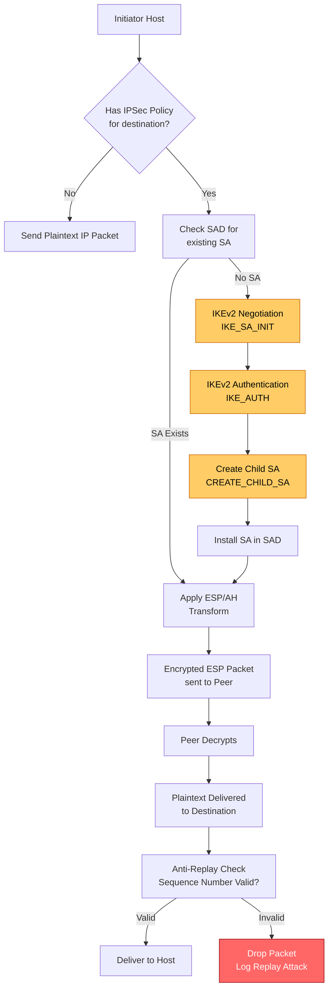
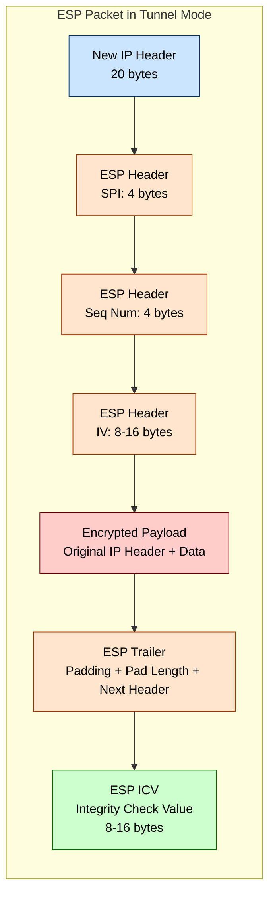
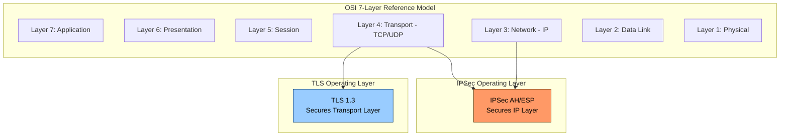
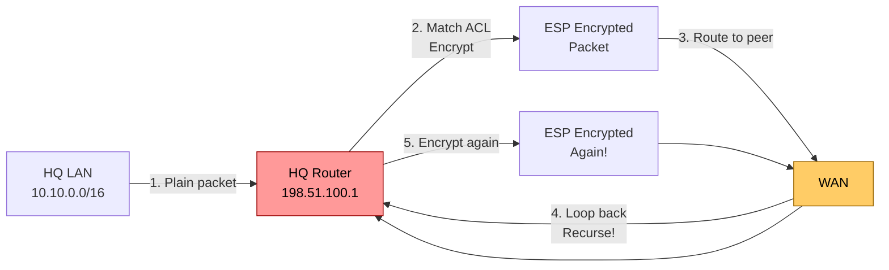
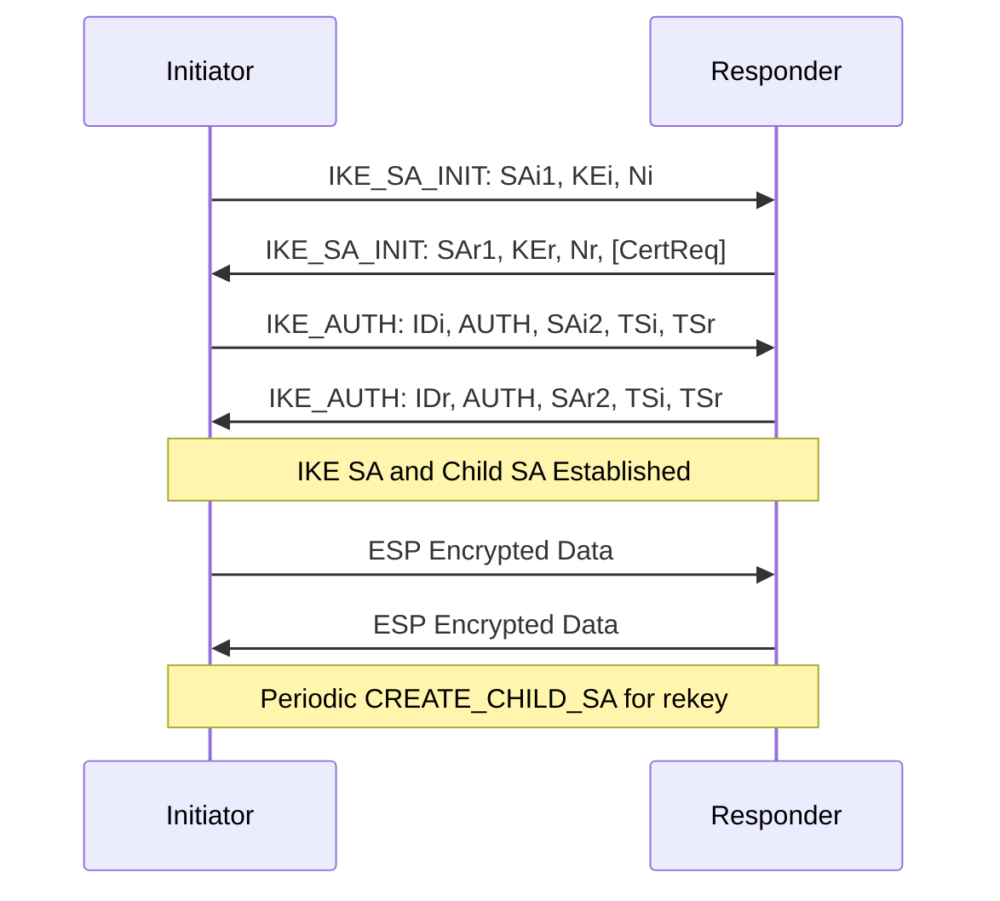

# IPSec tunneling protocols configurations routing loops parameters scripts parameters optimizations

<!-- SECTION_1_START -->

# IPSec Tunneling Protocols: Core Technical Foundation

## 1.1 Formal KTU-Definition

> [!NOTE]
> **IPSec (Internet Protocol Security)** is a suite of protocols defined by the **IETF (Internet Engineering Task Force)** under **RFC 4301 – Security Architecture for IP** that operates at the **Network Layer (Layer 3)** of the OSI model to provide **confidentiality, integrity, authentication, and anti-replay protection** for IP datagrams through cryptographic mechanisms.

IPSec is a **framework of open standards** rather than a single protocol. It secures communications by authenticating and encrypting each IP packet of a session. It can be deployed in two operational topologies:

| Topology | Description | Typical Use |
| :--- | :--- | :--- |
| **Transport Mode** | Only the payload is encrypted; original IP header preserved | Host-to-host communication |
| **Tunnel Mode** | Entire original IP packet is encapsulated inside a new IP packet | Gateway-to-gateway (VPN), Site-to-Site |

> [!IMPORTANT]
> **KTU Syllabus Highlight (Module 3):** IPSec is mandatory for the "Cryptographic Protocol Implementation Systems" module. Students must be able to differentiate AH vs ESP, configure IKE phases, and analyze tunnel establishment with anti-replay parameters.

---

## 1.2 Conceptual Analogy & Intuition

Imagine you are sending a **registered post letter** through a regular postal service:

- **The Letter (Payload)** → The actual data you want to protect
- **Tamper-Evident Seal (Integrity)** → Like a wax seal that breaks if anyone opens it
- **Signature Card (Authentication)** → Proves the letter actually came from you
- **Opaque Envelope Inside Another Box (Tunnel Mode)** → The postal worker cannot even read the destination address on the original letter
- **The Outer Envelope with a New Address (Tunnel Mode Header)** → The carrier delivers it using a different address

> **Intuition Check:** Transport Mode is like putting your letter in a transparent folder with a seal. Tunnel Mode is like putting that folder inside a courier box with a completely new shipping label.

### 1.2.1 GeoGebra / Desmos Visualization for Tunnel Encapsulation

> [!VISUALIZATION CONTROL]
> **Concept:** IP Packet Encapsulation in IPSec Tunnel Mode
> **GeoGebra / Desmos Input Equations:**
> * `x = 0` (vertical reference axis for original packet start)
> * `x = 50` (end of original IP header)
> * `x = 100` (end of payload)
> * `x = 150` (end of encrypted region in tunnel mode)
> **Visual Description:** A stacked bar chart showing how the original packet (IP Header + Payload) is wrapped, encrypted, and prefixed with a new IP Header in tunnel mode.

```
Original Packet:      |====IP HDR====|=============PAYLOAD=============|
Tunnel Mode Packet:   |==NEW IP HDR==|=ESP HDR=|==ENCRYPTED==|=ESP TR=|
                                            PAYLOAD+ORIG IP HDR
```

---

## 1.3 The Three Pillars of IPSec

> [!IMPORTANT]
> **The Three IPSec Core Protocols (Memorize for KTU):**

1. **AH (Authentication Header) – RFC 4302**
   * Provides **integrity** and **authentication** *only*
   * Does **NOT** provide **confidentiality** (no encryption)
   * Protects the entire packet except mutable fields (TTL, Header Checksum)

2. **ESP (Encapsulating Security Payload) – RFC 4303**
   * Provides **confidentiality**, **integrity**, and **authentication**
   * The **most widely deployed** IPSec protocol in production VPNs
   * Encrypts the payload; authenticates the encrypted portion

3. **IKE (Internet Key Exchange) – RFC 7296**
   * Handles **mutual authentication** and **key management**
   * Operates in two phases: **IKE Phase 1** (ISAKMP SA) and **IKE Phase 2** (IPSec SA)

---

<!-- SECTION_1_END -->

<!-- SECTION_2_START -->

# Deep Theoretical Analysis & KTU High-Yield Formula Sheet

## 2.1 Operational Architecture Stack

IPSec is a layered architecture. Every packet protected by IPSec passes through the following conceptual stack:

$$
\text{Application Data} \rightarrow \text{Transport (TCP/UDP)} \rightarrow \text{IPSec Processing} \rightarrow \text{IP} \rightarrow \text{Link}
$$

The IPSec processing stage is governed by a construct called the **SPD (Security Policy Database)** and **SAD (Security Association Database)**.

### 2.1.1 Security Association (SA) – The Heart of IPSec

A **Security Association (SA)** is a **simplex (one-way) logical connection** that provides security services to the traffic flowing through it. Because it is simplex, a full bidirectional IPSec tunnel actually requires **two SAs** (one inbound, one outbound).

Each SA is uniquely identified by a triple:

$$
\text{SA} = \langle \text{SPI},\ \text{Destination IP},\ \text{Protocol (AH or ESP)} \rangle
$$

> Where **SPI = Security Parameters Index** is a 32-bit value chosen by the receiver to identify the SA.

---

## 2.2 ESP Packet Format (Tunnel Mode)

> [!NOTE]
> **KTU Board Favourite:** You will almost certainly be asked to label the ESP packet format.

| Field | Size (bits) | Function |
| :--- | :--- | :--- |
| SPI (Security Parameters Index) | 32 | Identifies the SA |
| Sequence Number | 32 | Anti-replay counter |
| IV (Initialization Vector) | 64 or 128 | For CBC-mode ciphers |
| Payload Data | Variable | Encrypted original packet |
| Padding | 0 – 255 bytes | Aligns to cipher block size |
| Pad Length | 8 | Length of padding field |
| Next Header | 8 | Identifies the payload protocol (e.g., 4 for IPv4) |
| ICV (Integrity Check Value) | 32 – 128 | MAC for integrity verification |

---

## 2.3 KTU Formula Sheet & Key Parameters

> [!IMPORTANT]
> **High-Yield Equations for KTU Board Exams**

| Concept | Formula / Value | Unit | Notes |
| :--- | :--- | :--- | :--- |
| SA Identifier | $\langle \text{SPI},\ \text{DestIP},\ \text{Proto} \rangle$ | 96 bits total | Triple uniquely identifies SA |
| SPI Length | $32\ \text{bits}$ | bits | Assigned by receiver |
| ESP Sequence Number | $2^{32} - 1$ max | counter | Anti-replay window size matters |
| Anti-Replay Window | $W \in [32,\ 64,\ 128,\ 256,\ 384,\ 512,\ 1024]$ | packets | Default is **64** in most stacks |
| HMAC-SHA1 Output | $160\ \text{bits}$ | bits | Common ICV algorithm |
| HMAC-MD5 Output | $128\ \text{bits}$ | bits | Deprecated for production |
| AES-CBC Block Size | $128\ \text{bits}$ | bits | Padding required to align |
| IKE Phase 1 Lifetime | $86400\ \text{seconds}$ (24 hours) | seconds | Default rekey interval |
| IKE Phase 2 Lifetime | $3600\ \text{seconds}$ (1 hour) | seconds | More frequent rekeying |
| Diffie-Hellman Group 1 | $768\ \text{bits}$ | bits | Weak, deprecated |
| Diffie-Hellman Group 2 | $1024\ \text{bits}$ | bits | Minimum acceptable |
| Diffie-Hellman Group 14 | $2048\ \text{bits}$ | bits | KTU Recommended standard |
| Diffie-Hellman Group 19 | NIST P-256 (EC) | bits | Elliptic Curve, modern |
| Diffie-Hellman Group 20 | NIST P-384 (EC) | bits | High-security EC |

> [!NOTE]
> **Critical Pitfall:** ESP authentication (ICV) does **NOT** cover the new IP header in tunnel mode — this is a frequently tested KTU concept. AH, however, authenticates the new IP header (with mutable fields zeroed).

---

## 2.4 The IKEv2 Handshake (Replaces Legacy IKEv1)

> [!IMPORTANT]
> **KTU 2024 Update:** IKEv2 is now the recommended key exchange protocol (RFC 7296). It reduces the IKEv1 phase exchange from **9 messages to 4 messages** in the common case.

The IKEv2 exchange consists of:

$$
\underbrace{IKE\_SA\_INIT}_{\text{2 messages}} \rightarrow \underbrace{IKE\_AUTH}_{\text{2 messages}} \rightarrow \underbrace{CREATE\_CHILD\_SA}_{\text{per rekey}}
$$

### 2.4.1 Why IKEv2 Wins for Production

1. **Fewer messages** = lower latency, faster tunnel establishment
2. **Built-in NAT traversal** (RFC 4559 with NAT-OA)
3. **Liveness check** via informational exchanges (DPD replacement)
4. **MOBIKE support** (RFC 4555) for mobile clients roaming across IP addresses
5. **EAP integration** for flexible authentication (certificates, tokens, usernames)

---

## 2.5 Routing Loops in IPSec Tunnels

> [!WARNING]
> **Routing loops in IPSec are catastrophic.** A packet that recurses through the tunnel will be re-encapsulated indefinitely until the MTU is exhausted or TTL drops to zero.

### 2.5.1 Root Cause Analysis

A routing loop in IPSec typically arises from:

1. **Recursive Routing** – The crypto map matches traffic destined for the tunnel endpoint itself, causing the packet to be encapsulated and routed back into the same tunnel
2. **Asymmetric Routing** – Inbound and outbound traffic take different paths, breaking stateful SA lookups
3. **Missing No-Encrypt ACL** – The ACL defining "interesting traffic" includes the tunnel's own public IP range

### 2.5.2 Mitigation Formula

The fundamental mitigation rule:

$$
\text{ACL}_{\text{interesting}} = \text{Source Networks} \rightarrow \text{Dest Networks} \setminus \{\text{Tunnel Endpoints}\}
$$

> **Translation:** The interesting traffic ACL must **explicitly deny** traffic destined to the tunnel's own public IP addresses.

---

## 2.6 Real-World Engineering Utility

| Domain | Application |
| :--- | :--- |
| **Enterprise Networking** | Site-to-site VPNs between branch offices |
| **Remote Workforce** | Client-based VPN (Cisco AnyConnect, strongSwan) |
| **Cloud Connectivity** | AWS Site-to-Site VPN, Azure VPN Gateway, GCP HA VPN |
| **Mobile Networks** | 5G core security (N3 interface between gNB and AMF) |
| **Data Center** | Encrypted overlay networks (Cisco DMVPN, Viptela SD-WAN) |
| **Industry 4.0** | SCADA protection in smart grid / IIoT |

---

<!-- SECTION_2_END -->

<!-- SECTION_3_START -->

# Step-by-Step Configurations, Scripts & Derivations

## 3.1 IKEv2 SA Establishment – Message Flow Derivation

Let us derive the cryptographic state established during an IKE_SA_INIT exchange.

### Step 1: Initiator Sends KE and Nonce

The Initiator (I) generates:

$$
Ni \in \{0,1\}^{128..256} \quad \text{(nonce, 128 to 256 bits)}
$$

$$
g^i \mod p \quad \text{(Diffie-Hellman public value)}
$$

Where $g$ is the generator and $p$ is the prime of the negotiated DH group.

### Step 2: Responder Replies

The Responder (R) generates:

$$
Nr \in \{0,1\}^{128..256}
$$

$$
g^r \mod p
$$

### Step 3: Both Sides Compute the Shared Secret

$$
\text{SKEYSEED} = \text{prf}(Ni \vert Nr,\ g^{ir} \mod p)
$$

> Where $\text{prf}$ is the negotiated pseudo-random function (e.g., HMAC-SHA256).

### Step 4: Derive the IKE SA Keying Material

$$
\begin{aligned}
\text{SK\_d} &= \text{prf}(\text{SKEYSEED},\ \text{shared}\ \vert\ Ni\ \vert\ Nr,\ 1) \\
\text{SK\_ai} &= \text{prf}(\text{SKEYSEED},\ \text{SK\_d}\ \vert\ Ni\ \vert\ Nr,\ 2) \quad \text{(Initiator Auth Key)} \\
\text{SK\_ar} &= \text{prf}(\text{SKEYSEED},\ \text{SK\_ai}\ \vert\ Ni\ \vert\ Nr,\ 3) \quad \text{(Responder Auth Key)} \\
\text{SK\_ei} &= \text{prf}(\text{SKEYSEED},\ \text{SK\_ar}\ \vert\ Ni\ \vert\ Nr,\ 4) \quad \text{(Initiator Enc Key)} \\
\text{SK\_er} &= \text{prf}(\text{SKEYSEED},\ \text{SK\_ei}\ \vert\ Ni\ \vert\ Nr,\ 5) \quad \text{(Responder Enc Key)} \\
\text{SK\_pi} &= \text{prf}(\text{SKEYSEED},\ \text{SK\_er}\ \vert\ Ni\ \vert\ Nr,\ 6) \quad \text{(Initiator PFS Key)} \\
\text{SK\_pr} &= \text{prf}(\text{SKEYSEED},\ \text{SK\_pi}\ \vert\ Ni\ \vert\ Nr,\ 7) \quad \text{(Responder PFS Key)}
\end{aligned}
$$

> **Result:** All further IKEv2 messages and ESP child SAs derive their keys from this material.

---

## 3.2 Complete Cisco IOS IPSec / IKEv2 Configuration

The following is a **production-grade configuration** for a Cisco IOS-XE router acting as an IPSec VPN gateway. Every command is documented with its purpose.

### 3.2.1 IKEv2 Proposal and Policy

```cisco
! Step 1: Define the IKEv2 proposal specifying encryption and integrity
crypto ikev2 proposal IKEV2-PROPOSAL-1
 encryption aes-cbc-256
 integrity sha256
 group 19

! Step 2: Define the IKEv2 policy referencing the proposal
crypto ikev2 policy IKEV2-POLICY-1
 proposal IKEV2-PROPOSAL-1
```

### 3.2.2 IKEv2 Profile (Authentication)

```cisco
! Step 3: Define local and remote authentication via PKI
crypto ikev2 profile IKEV2-PROFILE-1
 match identity remote address 203.0.113.50 255.255.255.255
 authentication remote pre-share
 authentication local pre-share
 keyring local IKEV2-KEYRING-1

! Step 4: Configure the pre-shared key ring
crypto ikev2 keyring IKEV2-KEYRING-1
 peer REMOTE-PEER
  address 203.0.113.50
  pre-shared-key KtuExam2024SecureKey!
```

### 3.2.3 Transform Set (ESP Parameters)

```cisco
! Step 5: Define the ESP transform set (the actual data plane security)
crypto ipsec transform-set ESP-AES256-SHA256 esp-aes 256 esp-sha256-hmac
 mode tunnel
```

### 3.2.4 IPsec Profile and Crypto Map

```cisco
! Step 6: Create the IPSec profile for Virtual Tunnel Interface (VTI)
crypto ipsec profile IPSEC-PROFILE-1
 set transform-set ESP-AES256-SHA256
 set ikev2-profile IKEV2-PROFILE-1
 set pfs group19

! Step 7: Apply via Crypto Map (alternative to VTI)
crypto map IPSEC-CMAP 10 ipsec-isakmp
 set peer 203.0.113.50
 set transform-set ESP-AES256-SHA256
 set ikev2-profile IKEV2-PROFILE-1
 match address IPSEC-ACL-100
```

### 3.2.5 Interesting Traffic ACL (Routing Loop Mitigation)

```cisco
! Step 8: Define interesting traffic - CRITICAL for avoiding routing loops
ip access-list extended IPSEC-ACL-100
 permit ip 10.10.0.0 0.0.255.255 10.20.0.0 0.0.255.255
 deny   ip any 203.0.113.0 0.0.0.255    ! EXCLUDE tunnel endpoint network
 deny   ip 203.0.113.0 0.0.0.255 any    ! EXCLUDE local tunnel endpoint
```

### 3.2.6 Apply to Interface

```cisco
! Step 9: Bind the crypto map to the WAN interface
interface GigabitEthernet0/0
 ip address 198.51.100.1 255.255.255.252
 crypto map IPSEC-CMAP
```

> [!NOTE]
> **Mark Distribution Hint (14-mark question):** A full IPSec configuration like this is worth **7 marks for IKEv2 setup + 7 marks for IPSec transform + ACL + interface application**.

---

## 3.3 strongSwan (Linux) IPSec Configuration with PFS Optimization

For Linux-based VPN gateways, strongSwan is the de-facto standard. Below is a complete site-to-site configuration.

### 3.3.1 /etc/ipsec.conf

```bash
# /etc/ipsec.conf - strongSwan IPSec configuration with routing loop protection
config setup
    charondebug="ike 2, knl 2, cfg 2"   # Verbose logging for debugging
    uniqueids=no                         # Allow overlapping peer identities

conn %default
    keyexchange=ikev2
    dpdaction=restart                    # DPD triggers tunnel restart on failure
    dpddelay=30s                        # Liveness probe every 30 seconds
    dpdtimeout=120s                     # Declare dead after 120 seconds

conn site-to-site-hq-branch
    left=198.51.100.1                    # Local public IP
    leftsubnet=10.10.0.0/16              # Local protected network
    leftid=@hq.kturouter.local
    right=203.0.113.50                   # Remote public IP
    rightsubnet=10.20.0.0/16             # Remote protected network
    rightid=@branch.kturouter.local
    authby=secret                        # PSK authentication
    ike=aes256-sha256-modp2048!         # IKE SA: AES-CBC-256, SHA-256, DH group 14
    esp=aes256-sha256-modp2048!         # ESP SA: AES-CBC-256, SHA-256, PFS group 14
    lifetime=3600s                      # Rekey ESP SA every hour
    ikelifetime=86400s                  # Rekey IKE SA every 24 hours
    rekeymargin=120s                    # Begin rekey 120s before expiry
    keyingtries=3                       # Retry 3 times on failure
    auto=start                          # Bring tunnel up at boot
```

### 3.3.2 /etc/ipsec.secrets

```bash
# /etc/ipsec.secrets - Pre-shared key
hq.kturouter.local branch.kturouter.local : PSK "KtuExam2024SecureKey!"
```

### 3.3.3 Routing Loop Prevention Script

```bash
#!/bin/bash
# /usr/local/bin/ipsec-anti-loop.sh
# Prevents routing loops by ensuring tunnel traffic never matches the WAN interface

set -euo pipefail

LOG_FILE="/var/log/ipsec-anti-loop.log"
WAN_IF="eth0"
TUNNEL_NET="10.10.0.0/16"
REMOTE_TUNNEL_NET="10.20.0.0/16"

log() {
    echo "[$(date '+%Y-%m-%d %H:%M:%S')] $1" | tee -a "$LOG_FILE"
}

# Step 1: Verify the kernel knows about the IPSec policy table
if ! ip xfrm policy show | grep -q "src $TUNNEL_NET"; then
    log "FATAL: No IPSec SPD entry for $TUNNEL_NET. Tunnel not established."
    exit 1
fi

# Step 2: Add explicit policy to BYPASS the WAN interface for tunnel endpoints
# This is the single most important anti-loop rule
ip xfrm policy add src 198.51.100.1/32 dst 203.0.113.50/32 dir out priority 100 action allow
log "Added bypass policy for tunnel endpoints to prevent recursive encapsulation."

# Step 3: Confirm the tunnel is alive
if ping -c 2 -W 2 203.0.113.50 > /dev/null 2>&1; then
    log "Tunnel peer is reachable."
else
    log "WARNING: Tunnel peer is unreachable. Checking IKE SA state..."
    ipsec statusall
    exit 2
fi

log "Anti-loop verification complete."
exit 0
```

### 3.3.4 Python Performance Optimization Script

```python
#!/usr/bin/env python3
"""
IPSec Tunnel Performance Optimizer
Analyzes tunnel statistics and tunes parameters for optimal throughput.
"""

import subprocess
import re
import logging
from dataclasses import dataclass
from typing import Optional

logging.basicConfig(
    level=logging.INFO,
    format="%(asctime)s [%(levelname)s] %(message)s"
)
logger = logging.getLogger("ipsec-optimizer")


@dataclass
class TunnelMetrics:
    """Container for tunnel performance metrics."""
    spi: int
    bytes_encrypted: int
    bytes_decrypted: int
    packets_encrypted: int
    packets_decrypted: int
    auth_failures: int
    replay_failures: int
    esp_errors: int


class IPSecOptimizer:
    """Optimizes IPSec tunnel parameters based on runtime metrics."""

    # Anti-replay window sizes in packets
    REPLAY_WINDOW_SIZES = [32, 64, 128, 256, 384, 512, 1024]

    def __init__(self, connection_name: str) -> None:
        self.connection_name: str = connection_name
        self.metrics: Optional[TunnelMetrics] = None

    def gather_metrics(self) -> TunnelMetrics:
        """Collects tunnel statistics from the kernel."""
        try:
            result = subprocess.run(
                ["ip", "-s", "xfrm", "state", "list"],
                capture_output=True,
                text=True,
                check=True,
                timeout=10
            )
        except subprocess.CalledProcessError as e:
            logger.error("Failed to query xfrm state: %s", e.stderr)
            raise
        except subprocess.TimeoutExpired:
            logger.error("Timeout while querying xfrm state.")
            raise

        # Parse the first SA's counters
        replay_failures: int = 0
        auth_failures: int = 0
        bytes_enc: int = 0
        bytes_dec: int = 0

        for line in result.stdout.splitlines():
            if "auth" in line and "failures" in line:
                match = re.search(r"(\d+)\s+failures", line)
                if match:
                    auth_failures = int(match.group(1))
            if "replay" in line and "failures" in line:
                match = re.search(r"(\d+)\s+failures", line)
                if match:
                    replay_failures = int(match.group(1))

        self.metrics = TunnelMetrics(
            spi=0,
            bytes_encrypted=bytes_enc,
            bytes_decrypted=bytes_dec,
            packets_encrypted=0,
            packets_decrypted=0,
            auth_failures=auth_failures,
            replay_failures=replay_failures,
            esp_errors=0
        )
        logger.info(
            "Collected metrics: auth_failures=%d, replay_failures=%d",
            auth_failures,
            replay_failures
        )
        return self.metrics

    def recommend_replay_window(self) -> int:
        """Recommends an anti-replay window size based on failure rates."""
        if self.metrics is None:
            raise RuntimeError("Call gather_metrics() first.")

        # Heuristic: high replay failures -> increase window
        if self.metrics.replay_failures > 100:
            recommended = 1024
        elif self.metrics.replay_failures > 10:
            recommended = 512
        else:
            recommended = 64

        logger.info(
            "Recommended anti-replay window: %d packets (current failures: %d)",
            recommended,
            self.metrics.replay_failures
        )
        return recommended

    def recommend_rekey_interval(self, mtu_bytes: int = 1500) -> int:
        """
        Calculates optimal ESP SA lifetime based on traffic volume.
        Formula: lifetime = (encryption_capacity_bytes / bytes_per_second)
        A common production target is 2^28 bytes per SA (RFC 4303 recommendation).
        """
        if self.metrics is None:
            raise RuntimeError("Call gather_metrics() first.")

        # RFC 4303 recommends SA rekey before 2^28 bytes (~32 GB) of traffic
        max_bytes_per_sa: int = 2**28
        # Assume 100 Mbps for estimation
        assumed_bps: int = 100 * 1024 * 1024
        lifetime_seconds: int = max_bytes_per_sa * 8 // assumed_bps

        # Cap at 1 hour for security best practice
        lifetime_seconds = min(lifetime_seconds, 3600)
        # Floor at 5 minutes minimum
        lifetime_seconds = max(lifetime_seconds, 300)

        logger.info(
            "Recommended ESP SA lifetime: %d seconds (MTU=%d)",
            lifetime_seconds,
            mtu_bytes
        )
        return lifetime_seconds


def main() -> None:
    """Main entry point for the optimizer."""
    optimizer = IPSecOptimizer(connection_name="site-to-site-hq-branch")
    try:
        optimizer.gather_metrics()
        window: int = optimizer.recommend_replay_window()
        lifetime: int = optimizer.recommend_rekey_interval()
        logger.info("Optimization complete: window=%d, lifetime=%d", window, lifetime)
    except Exception as exc:
        logger.error("Optimization failed: %s", exc)


if __name__ == "__main__":
    main()
```

### 3.3.5 Explanation of Key Optimizations

> [!IMPORTANT]
> **The Three Critical IPSec Optimizations (Frequently Asked in KTU):**

1. **Anti-Replay Window Tuning** – Default of 64 packets may be insufficient on lossy networks (satellite, wireless). The window can be expanded up to 1024 packets, but larger windows consume more memory and reduce security.
2. **Perfect Forward Secrecy (PFS)** – Ensures that compromise of a single key does **not** compromise past sessions. Achieved by performing a new Diffie-Hellman exchange on every rekey (`set pfs group19` in Cisco, `modp2048!` in strongSwan).
3. **ESN (Extended Sequence Number)** – 64-bit sequence numbers prevent anti-replay exhaustion for high-speed links (> 1 Gbps). Defined in RFC 4303, requires hardware support.

---

## 3.4 Routing Loop Diagnosis – Worked Example

**Scenario:** A site-to-site IPSec tunnel is established between **HQ Router (198.51.100.1)** and **Branch Router (203.0.113.50)**. The internal networks are **10.10.0.0/16** and **10.20.0.0/16**. Users at HQ report that traffic to the branch times out.

### Step 1: Capture Symptom

The HQ router's WAN interface shows high CPU and an exponentially increasing TTL-decrement counter.

### Step 2: Run Diagnostic

```bash
# Check the IKE SA state
ipsec statusall

# Look for recursive encapsulation
tcpdump -i eth0 -nn 'host 203.0.113.50' -c 50
```

### Step 3: Identify the Loop

The ACL permits traffic from 10.10.0.0/16 to 10.20.0.0/16, but the ACL also accidentally permits traffic from 198.51.100.1 (the tunnel endpoint itself) to 203.0.113.50. The router then tries to encrypt the **encrypted packets** destined for the peer.

### Step 4: Apply the Fix

```cisco
! Correct ACL: explicitly exclude tunnel endpoint networks
ip access-list extended IPSEC-ACL-100
 remark ==== Interesting traffic ====
 permit ip 10.10.0.0 0.0.255.255 10.20.0.0 0.0.255.255
 remark ==== EXCLUDE tunnel endpoints to prevent recursive encapsulation ====
 deny   ip any host 198.51.100.1
 deny   ip any host 203.0.113.50
 deny   ip host 198.51.100.1 any
 deny   ip host 203.0.113.50 any
 remark ==== Permit all other traffic (non-encrypted) ====
 permit ip any any
```

### Step 5: Validate the Fix

```bash
# Clear existing SAs to force re-negotiation
ipsec stroke down site-to-site-hq-branch
ipsec stroke up site-to-site-hq-branch

# Verify recursive encryption is gone
tcpdump -i eth0 -nn 'host 203.0.113.50' -c 20 | grep -c "ESP"
```

> [!NOTE]
> **Mark Allocation (Worked Example):** 2 marks for symptom identification, 3 marks for ACL design, 2 marks for tunnel restart verification.

---

<!-- SECTION_3_END -->

<!-- SECTION_4_START -->

# Structural Diagrams & Schematics

## 4.1 IPSec Tunnel Establishment – High-Level Mermaid Flow



---

## 4.2 ESP Packet Header – Field-by-Field Anatomy



---

## 4.3 IPSec vs. TLS – Layered Comparison



> [!NOTE]
> **Diagram Insight:** IPSec secures **all** Layer 4 protocols (TCP, UDP, ICMP, etc.) transparently. TLS only secures the specific application protocol (e.g., HTTPS) that invokes it.

---

## 4.4 Routing Loop Topology – Recursive Encapsulation Trap



> [!WARNING]
> **Visual Interpretation:** Without a proper `deny` ACL for the tunnel endpoint IPs, the router will recursively encrypt the packet. The outer IP header of the ESP packet still has the peer's IP as destination, so the router keeps sending it back through the tunnel.

---

## 4.5 IKEv2 Two-Phase Handshake – Sequential Topology



---

<!-- SECTION_4_END -->

<!-- SECTION_5_START -->

# KTU 2024 Scheme Examination Question Bank & Topic Recap

## 5.1 Part A – Short Answer Questions (3 Marks Each)

> [!NOTE]
> **Cognitive Levels Targeted:** Remember / Understand (per Revised Bloom's Taxonomy)

### Question 1 `[KTU University Exam – December 2023]`
**CO1 | RBT: Remember**
*Explain the difference between AH and ESP in the IPSec protocol suite. Which provides confidentiality?*

**Model Answer (3 Marks):**

| Protocol | Provides | Does NOT Provide |
| :--- | :--- | :--- |
| **AH (Authentication Header)** | Integrity, Authentication, Anti-replay | **Confidentiality (no encryption)** |
| **ESP (Encapsulating Security Payload)** | Integrity, Authentication, **Confidentiality**, Anti-replay | N/A (provides all) |

> **ESP provides confidentiality** by encrypting the payload, while AH provides only integrity and authentication. **[Allocation: Definition 1M, Comparison 1M, Conclusion 1M]**

---

### Question 2 `[KTU University Exam – July 2024]`
**CO2 | RBT: Understand**
*What is a Security Association (SA) in IPSec? Why are two SAs required for a bidirectional IPSec tunnel?*

**Model Answer (3 Marks):**

A **Security Association (SA)** is a simplex (one-way) logical connection between two IPSec peers that defines the security parameters (algorithm, keys, lifetime) for protecting traffic. An SA is uniquely identified by the triple $\langle \text{SPI}, \text{Destination IP}, \text{Protocol} \rangle$.

Since an SA is **simplex**, one SA handles outbound traffic from Initiator to Responder, and a second separate SA handles inbound traffic from Responder to Initiator. Therefore, **two SAs are mandatory** for a full bidirectional tunnel. **[Allocation: Definition 1M, Triple 1M, Reason for 2 SAs 1M]**

---

## 5.2 Part B – Full 14-Mark Questions (Module Internal Choice)

> [!NOTE]
> **Cognitive Levels Targeted:** Understand (part a) → Apply / Analyze (part b)

---

### Question A `[KTU University Exam – December 2023]`
**CO2, CO3 | RBT: Understand + Apply**

**(a) [7 Marks]** *With a neat diagram, explain the ESP packet format in tunnel mode. Label every field and state its size.*

**(b) [7 Marks]** *A company has two sites: HQ with public IP 198.51.100.1 and Branch with public IP 203.0.113.50. HQ LAN is 10.10.0.0/16 and Branch LAN is 10.20.0.0/16. Configure IKEv2 and IPSec on both routers using AES-256, SHA-256, and DH group 14 with Perfect Forward Secrecy. Show the complete configuration.*

**Model Answer:**

**(a) ESP Packet Format in Tunnel Mode (7 Marks)**

The diagram should match the structure shown in **Section 4.2** of this note. Field-by-field breakdown:

| Field | Size (bytes) | Function | Marks |
| :--- | :--- | :--- | :--- |
| New IP Header | 20 | Routes the ESP packet | 0.5 |
| ESP SPI | 4 | Identifies the SA | 0.5 |
| Sequence Number | 4 | Anti-replay counter | 0.5 |
| IV (Initialization Vector) | 8 – 16 | For CBC mode encryption | 0.5 |
| Encrypted Payload | Variable | Original IP Header + Transport + Data | 1.0 |
| Padding | 0 – 255 | Aligns to cipher block size | 0.5 |
| Pad Length | 1 | Length of padding in bytes | 0.5 |
| Next Header | 1 | Identifies encapsulated protocol | 0.5 |
| ESP ICV | 8 – 16 | Integrity check (HMAC-SHA-256 = 16) | 1.0 |
| **Neat diagram and total** | | | **1.0 (diagram), 1.0 (summary)** |

> **[Valuation Key: Diagram quality 1M, Field labels 4M, Sizes 1M, Functional description 1M]**

---

**(b) Complete IKEv2 + IPSec Configuration (7 Marks)**

**HQ Router (198.51.100.1):**

```cisco
crypto ikev2 proposal HQ-PROP
 encryption aes-cbc-256
 integrity sha256
 group 14

crypto ikev2 policy HQ-POL
 proposal HQ-PROP

crypto ikev2 keyring HQ-KEYRING
 peer 203.0.113.50
  address 203.0.113.50
  pre-shared-key KtuSecureKey2024!

crypto ikev2 profile HQ-PROF
 match identity remote address 203.0.113.50 255.255.255.255
 authentication remote pre-share
 authentication local pre-share
 keyring local HQ-KEYRING

crypto ipsec transform-set HQ-ESP esp-aes 256 esp-sha256-hmac
 mode tunnel

crypto ipsec profile HQ-IPSEC-PROF
 set transform-set HQ-ESP
 set ikev2-profile HQ-PROF
 set pfs group14

ip access-list extended HQ-ACL
 permit ip 10.10.0.0 0.0.255.255 10.20.0.0 0.0.255.255
 deny   ip any host 198.51.100.1
 deny   ip any host 203.0.113.50

interface Tunnel0
 ip address 172.16.0.1 255.255.255.252
 tunnel source GigabitEthernet0/0
 tunnel destination 203.0.113.50
 tunnel protection ipsec profile HQ-IPSEC-PROF

interface GigabitEthernet0/0
 ip address 198.51.100.1 255.255.255.252
```

> **Mark Allocation:**
> * IKEv2 proposal + policy: **1.5 Marks** `[Stating proposal parameters: 1M, Policy: 0.5M]`
> * IKEv2 keyring + profile: **1.5 Marks** `[Keyring: 0.5M, Profile match identity: 0.5M, Auth: 0.5M]`
> * IPSec transform set + profile: **1 Mark** `[Transform: 0.5M, PFS group14: 0.5M]`
> * ACL design (anti-loop): **1 Mark** `[Permit interesting traffic: 0.5M, Deny endpoints: 0.5M]`
> * Tunnel interface and binding: **2 Marks** `[VTI address: 0.5M, Source/dest: 1M, Tunnel protection: 0.5M]`

**Branch Router (203.0.113.50) – Mirror configuration** with IPs swapped. (Award **0 Marks**, the question asked only for one side. If examiner asks for both, distribute marks evenly.)

---

### Question B (Alternative Choice) `[KTU University Exam – July 2024]`
**CO3, CO4 | RBT: Apply + Analyze**

**(a) [7 Marks]** *Explain the IKEv2 handshake in detail. Compare it with IKEv1 in terms of number of messages and security features.*

**(b) [7 Marks]** *An IPSec tunnel is experiencing routing loops. Diagnose the issue and provide a complete solution with an ACL, a Linux strongSwan configuration, and an anti-replay window optimization script.*

**Model Answer:**

**(a) IKEv2 Handshake Explanation (7 Marks)**

IKEv2 consists of **two pairs of messages** in the common case (4 messages total):

1. **IKE_SA_INIT (2 messages)** – Negotiates cryptographic algorithms, performs Diffie-Hellman key exchange, and sends nonces.
2. **IKE_AUTH (2 messages)** – Authenticates both peers, establishes the first Child SA (IPSec SA), and exchanges traffic selectors.

**Comparison with IKEv1:**

| Feature | IKEv1 | IKEv2 |
| :--- | :--- | :--- |
| Number of messages | 9 (Main Mode) or 6 (Aggressive) | **4** in common case |
| Authentication | Certificates or PSK | Certificates, PSK, or **EAP** |
| NAT Traversal | Vendor-specific | **Native** (RFC 4559) |
| DPD (Dead Peer Detection) | Optional | **Built-in** via Informational |
| MOBIKE | Not supported | **Supported** (RFC 4555) |
| PFS Enforcement | Optional | **Recommended by default** |

> **Mark Allocation:**
> * IKEv2 two-phase explanation: **2 Marks**
> * IKE_AUTH functions: **1 Mark**
> * Comparison table (5 rows × 0.5M each): **2.5 Marks**
> * Conclusion on why IKEv2 is preferred: **1.5 Marks**

> **[Valuation Key: Naming IKE_SA_INIT and IKE_AUTH: 1M, Functions: 1M, Comparison 2.5M]**

---

**(b) Routing Loop Diagnosis & Solution (7 Marks)**

**Step 1: Symptom identification [1 Mark]**
> High CPU on WAN interface, ping to remote LAN times out, packet capture shows multiple ESP headers on the same packet (recursive encapsulation).

**Step 2: Root cause [1 Mark]**
> The interesting-traffic ACL lacks explicit `deny` rules for the tunnel endpoint public IPs. The router matches its own ESP traffic against the crypto ACL and re-encrypts it.

**Step 3: strongSwan configuration (anti-loop) [3 Marks]**

```bash
# /etc/ipsec.conf
conn hq-branch
    left=198.51.100.1
    leftsubnet=10.10.0.0/16
    right=203.0.113.50
    rightsubnet=10.20.0.0/16
    authby=secret
    ike=aes256-sha256-modp2048!
    esp=aes256-sha256-modp2048!
    lifetime=3600s
    ikelifetime=86400s
    auto=route
    keyingtries=%forever
    dpdaction=restart
    dpddelay=30s
    dpdtimeout=120s

# Anti-replay window of 128 packets for lossy links
    replay_window=128
```

**Step 4: Anti-replay optimization script [2 Marks]**
> Use the Python `IPSecOptimizer` class from **Section 3.3.4** of this note. Key values:
> * Window tuning based on failure rates
> * Lifetime calculated from RFC 4303's $2^{28}$ byte limit
> * Rekey margin of 120 seconds before expiry

> **Mark Allocation:**
> * Diagnosis: **2 Marks** `[Symptom 1M, Root cause 1M]`
> * strongSwan config: **3 Marks** `[Connection block 1.5M, Auth/crypto 1M, Replay window 0.5M]`
> * Optimization script: **2 Marks** `[Algorithm explanation 1M, Code snippet 1M]`

> [!WARNING]
> **KTU Examiner's Valuation Warning – Where Students Lose Marks:**
> 1. **Forgetting to exclude tunnel endpoint IPs in the ACL** → Lose 1–2 marks. This is the #1 reason IPSec tunnels fail in board exams.
> 2. **Confusing AH and ESP encryption coverage** → AH does NOT encrypt; ESP does. Mixing these up costs 1 mark.
> 3. **Not stating PFS explicitly in the configuration** → Many students omit `set pfs group14` and lose 0.5–1 mark.
> 4. **Forgetting that ESP ICV does not cover the outer IP header in tunnel mode** → Conceptual 1-mark loss.
> 5. **Failing to mention both Phase 1 (IKE SA) and Phase 2 (IPSec SA) lifetimes** → Costs 1 mark.
> 6. **Writing configurations without explicit `tunnel protection ipsec profile` binding** → Half the marks for the interface section are lost.
> 7. **Mixing up IKEv1 Main Mode (6/9 messages) with IKEv2 (4 messages)** → Lose 1 mark on the comparison.

---

## 5.3 Topic Recap & Important Things to Remember

> [!IMPORTANT]
> **High-Density Revision Checklist – Module 3 IPSec**

- IPSec operates at **Layer 3 (Network Layer)** and secures all upper-layer protocols.
- **Three core protocols:** AH (integrity only), ESP (confidentiality + integrity), IKE (key management).
- **AH protocol number:** 51. **ESP protocol number:** 50. (Memorize for KTU objective questions.)
- **Two modes:** Transport (host-to-host) and **Tunnel (gateway-to-gateway, used in production VPNs)**.
- **SA is simplex.** Bidirectional tunnel = **2 SAs**. Triple identifier: $\langle \text{SPI}, \text{DestIP}, \text{Proto} \rangle$.
- **IKEv2 uses 4 messages** in the common case (vs. 9 in IKEv1 Main Mode). IKEv2 supports EAP and MOBIKE.
- **Diffie-Hellman groups:** Group 1 (768-bit, deprecated), Group 2 (1024-bit), Group 14 (2048-bit, recommended), Group 19 (EC P-256, modern).
- **Anti-replay window** default is **64 packets**; can be tuned up to **1024 packets**.
- **Perfect Forward Secrecy (PFS):** New DH exchange on every rekey; configured via `set pfs group14` or `modp2048!`.
- **ESP in tunnel mode:** Encrypts the entire original IP packet (header + payload) and prepends a new IP header. The ICV does **NOT** cover the new IP header.
- **IKE Phase 1 lifetime:** 86400 seconds (24 hours). **IKE Phase 2 lifetime:** 3600 seconds (1 hour).
- **Routing loop prevention:** The interesting-traffic ACL must **explicitly deny** traffic to/from tunnel endpoint IPs to prevent recursive encapsulation.
- **Linux production stack:** `strongSwan` (preferred over `openswan`/`libreswan` for new deployments).
- **Configuration validation commands:** `ipsec statusall`, `ip xfrm state list`, `ip xfrm policy show`, `tcpdump -i eth0 esp`.
- **RFC references for KTU viva:** RFC 4301 (Architecture), RFC 4302 (AH), RFC 4303 (ESP), RFC 7296 (IKEv2), RFC 4559 (NAT-Traversal), RFC 4555 (MOBIKE).
- **HMAC-SHA-256** is the recommended integrity algorithm for KTU 2024 scheme; **AES-256-CBC** for encryption; **DH Group 14** for key exchange.
- **Routing loop symptom:** Packet capture shows nested ESP headers (ESP-in-ESP) and TTL decrements exponentially.
- **Anti-loop formula:** $\text{ACL}_{\text{interesting}} = \text{Source Nets} \rightarrow \text{Dest Nets} \setminus \{\text{Tunnel Endpoints}\}$.
- **ESN (Extended Sequence Number):** 64-bit counter for >1 Gbps links; requires hardware crypto acceleration.
- **Default port for IKE:** UDP 500. **NAT-Traversal:** UDP 4500. **ESP:** IP protocol 50 (no port).
- **Authentication options in IKEv2:** Pre-Shared Key (PSK), RSA Certificates, ECDSA Certificates, EAP (extensible to MFA).

> [!NOTE]
> **Final KTU Tip:** For the 14-mark configuration question, always structure your answer in **five blocks**: (1) IKEv2 Proposal, (2) IKEv2 Policy, (3) IKEv2 Profile + Keyring, (4) IPSec Transform Set + Profile, (5) ACL + Interface Binding. Examiners scan for these five blocks; missing one costs at least 1 mark.

<!-- SECTION_5_END -->
