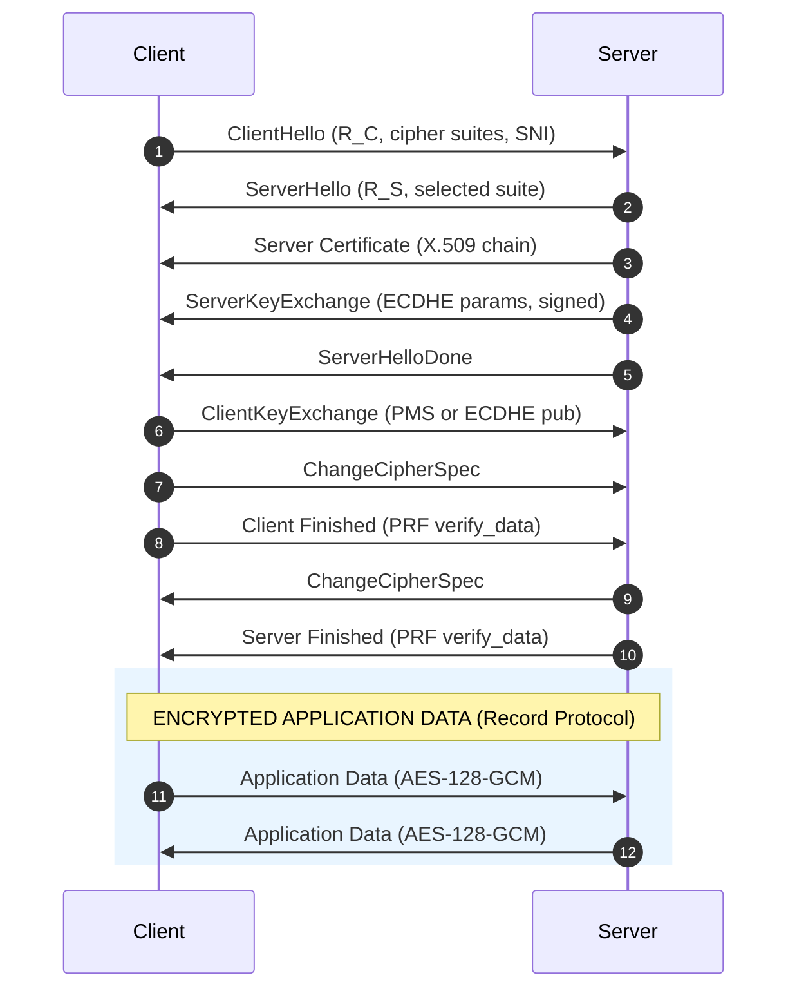
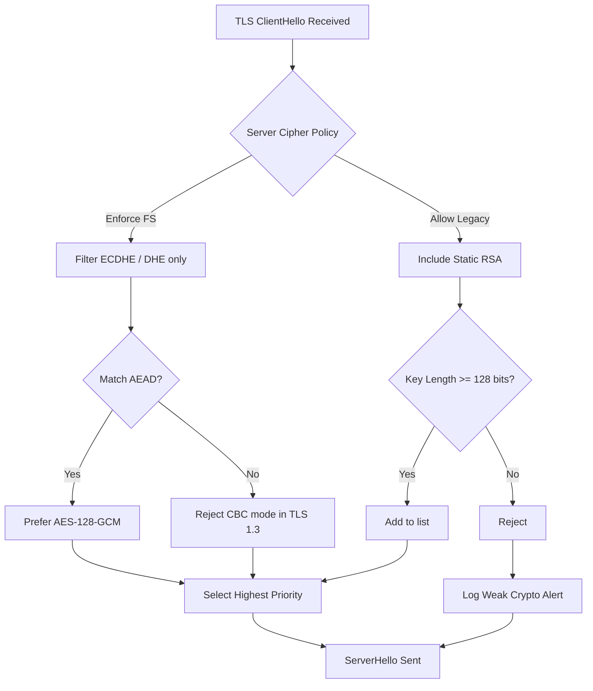
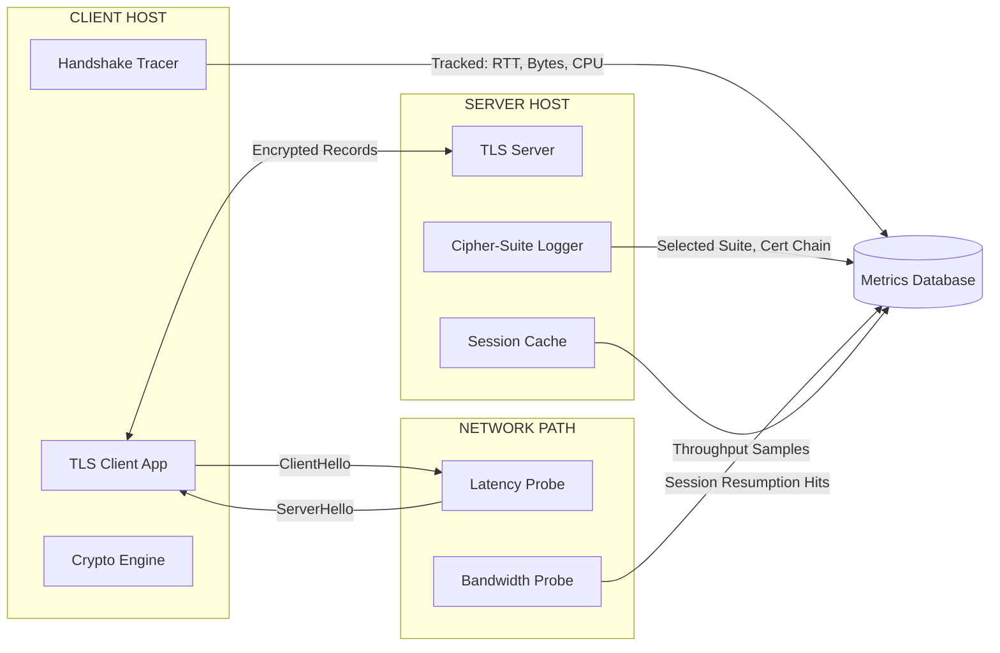

# Transport Layer Security (TLS) handshake steps tracking algorithms metrics performance parameters

<!-- SECTION_1_START -->

# Transport Layer Security (TLS) Handshake: Algorithm Tracking, Metrics & Performance Parameters

> [!IMPORTANT]
> **KTU 2024 Scheme | PECST707 | Module 3 – Cryptographic Protocol Implementations Systems**
> This note maps directly to **Course Outcome CO3** (Apply cryptographic primitives to design and evaluate security protocols) and **CO4** (Analyze the performance, vulnerabilities, and operational metrics of cryptographic systems).

---

## 1.1 Formal Definition (KTU Syllabus Terminology)

**Transport Layer Security (TLS)** is a **cryptographic protocol** standardized by the **IETF** in **RFC 5246 (TLS 1.2)** and **RFC 8446 (TLS 1.3)**. It operates directly above the **Transport Layer (TCP)** in the TCP/IP stack and provides three core security guarantees to application-layer traffic (HTTP, SMTP, FTP, etc.):

1. **Confidentiality** – achieved via symmetric bulk encryption (e.g., **AES-128-GCM**).
2. **Integrity** – guaranteed through **Message Authentication Codes (MAC)** or **Authenticated Encryption with Associated Data (AEAD)**.
3. **Authentication** – enforced via **X.509 digital certificates** binding public keys to identities.

The **TLS Handshake** is the *initialization phase* during which the **client** and **server**:
- Negotiate protocol version,
- Select a **cipher suite** (combination of key-exchange, authentication, encryption, and MAC algorithms),
- Authenticate identities,
- Establish **shared symmetric session keys** used for the subsequent bulk data transfer (the *record protocol*).

The minimum number of **round-trip times (RTTs)** required to complete a full handshake is **1-RTT** in TLS 1.3 and **2-RTT** in TLS 1.2.

---

## 1.2 Conceptual Analogy — The "Diplomatic Pouch" Model

> [!NOTE]
> **Real-World Analogy: Two Diplomats Exchanging Sealed Briefcases**

Imagine **Alice (a diplomat from Country X)** meeting **Bob (a diplomat from Country Y)** at a summit. They must agree on a common language and a shared secret before discussing confidential matters:

| Real-World Step | TLS Equivalent |
|---|---|
| Alice says "I speak English or French" | **ClientHello** (supported cipher suites & versions) |
| Bob says "Let's use English with the blue seal" | **ServerHello** (selected cipher suite) |
| Bob shows his embassy ID card | **Server Certificate** (X.509 authentication) |
| Bob proposes a math puzzle whose answer is secret | **ServerKeyExchange** (DH/ECDH parameters) |
| Alice shows her ID card (mutual TLS) | **Client Certificate** (optional) |
| Alice solves the puzzle and seals a briefcase | **ClientKeyExchange** (premaster secret) |
| Both agree: "From now on, only sealed briefcases" | **ChangeCipherSpec + Finished** |
| They talk privately inside briefcases | **Application Data (Record Protocol)** |

This analogy demystifies the seemingly complex cryptographic dance into a logical conversation: *announce → agree → prove identity → share secret → switch to fast private channel.*

---

## 1.3 Why the TLS Handshake Matters — A Performance Bottleneck

> [!IMPORTANT]
> **Syllabus Highlight — Tracking Algorithms, Metrics & Performance Parameters**
> Although the handshake is transient (typically **2–4 RTTs**, each **~50–200 ms** over the public Internet), it dominates the **Total Cost of Connection (TCC)** for short-lived sessions (e.g., REST API calls, IoT telemetry, mobile app cold starts). Tracking the **cryptographic algorithms** chosen, measuring **latency, throughput, CPU utilization, and bytes-on-wire** is therefore a critical skill for:
> - **Security Operations Centers (SOC)** — detecting downgrade attacks.
> - **DevSecOps / Site Reliability Engineers (SRE)** — tuning TLS termination.
> - **Penetration Testers** — fingerprinting weak cipher suites.

---

## 1.4 Visualization of Handshake Latency (Conceptual Timeline)

> [!VISUALIZATION CONTROL]
> **Concept:** Cumulative latency waterfall of a TLS 1.2 vs TLS 1.3 handshake over a 100 ms RTT link.
> **GeoGebra / Desmos Input Equations:**
> * `f_{1.2}(x) = 2 * 100 + 30` (ServerHelloDone wait)
> * `g_{1.3}(x) = 1 * 100 + 15` (single RTT + key derivation)
> **Visual Description:** A horizontal time-axis (x = RTT, y = cumulative ms) shows a staircase: TLS 1.2 reaches ~230 ms before first encrypted byte; TLS 1.3 reaches ~115 ms. The student should observe a **~50% latency reduction** purely from architectural design.

---

<!-- SECTION_1_END -->

<!-- SECTION_2_START -->

# Deep Theoretical Analysis — Algorithms, Metrics & the KTU High-Yield Formula Sheet

---

## 2.1 The Anatomy of a Cipher Suite

A **cipher suite** is a 4-tuple of algorithms. TLS 1.2 names them explicitly; TLS 1.3 abbreviates but the structure is identical.

$$\text{CipherSuite} = (KEX, AUTH, ENC, MAC)$$

Where:
- $KEX$ = Key Exchange (asymmetric) — generates **pre-master secret** or **shared secret**.
- $AUTH$ = Authentication (asymmetric) — signs handshake transcript.
- $ENC$ = Bulk Encryption (symmetric) — encrypts record-layer payload.
- $MAC$ = Message Authentication Code (symmetric) — integrity tag.

> [!NOTE]
> **Critical Distinction for KTU 2024:** TLS 1.3 *removed* static RSA key exchange, MD5, SHA-1, RC4, 3DES, and explicit IV ciphers. Only **AEAD (Authenticated Encryption with Associated Data)** modes are permitted: **AES-GCM, AES-CCM, ChaCha20-Poly1305**.

---

## 2.2 Algorithm Inventory Tracked During a Handshake

| Layer | Algorithm Class | Tracked Examples (TLS 1.2) | TLS 1.3 Allowed | Security Status |
|---|---|---|---|---|
| **Key Exchange (KEX)** | Asymmetric | `RSA`, `DH`, `DHE`, `ECDH`, `ECDHE` | `DHE`, `ECDHE` (Forward Secrecy mandatory) | RSA static → **Deprecated** |
| **Authentication (AUTH)** | Asymmetric Signature | `RSA`, `ECDSA`, `Ed25519` (1.3) | `RSA-PSS`, `ECDSA`, `Ed25519`, `Ed448` | RSA-PKCS#1 v1.5 → **Deprecated** |
| **Bulk Encryption (ENC)** | Symmetric Cipher | `AES-128-CBC`, `AES-256-CBC`, `3DES`, `RC4` | `AES-128-GCM`, `AES-256-GCM`, `ChaCha20-Poly1305` | RC4 / 3DES → **Forbidden** |
| **MAC / Integrity** | Hash / AEAD | `HMAC-SHA256`, `HMAC-SHA1`, `MD5` | Integrated into AEAD (no separate MAC) | MD5 / SHA-1 → **Forbidden** |
| **Key Derivation** | KDF | `PRF (TLS 1.2)`, `MD5+SHA1` | `HKDF (HMAC-based Extract-and-Expand)` | — |
| **Key Length (λ)** | Bits | 128 / 192 / 256 | 128 / 256 | NIST recommendation: **λ ≥ 128** |

---

## 2.3 TLS 1.2 Handshake — Exhaustive Step-by-Step Algorithm Tracking

> [!IMPORTANT]
> **Sequential Walkthrough — Memorize for KTU University Exam 14-mark questions.**

| # | Message | Direction | Cryptographic Operation | Algorithm(s) Tracked | Output Artifact |
|---|---|---|---|---|---|
| 1 | **ClientHello** | C → S | Random $R_C$, Session ID, Cipher Suites list, Compression methods, Extensions (SNI, ALPN) | — | Client Random |
| 2 | **ServerHello** | S → C | Selected version, cipher suite, $R_S$ | $R_C$, $R_S$ (both 32 bytes) | Server Random |
| 3 | **Server Certificate** | S → C | X.509 chain (leaf → intermediate → root) | RSA / ECDSA public key | Server's public key $PK_S$ |
| 4 | **ServerKeyExchange** | S → C (if DHE/ECDHE) | DH parameters $p, g, Y_S$ signed with $PK_S$ | `DHE-RSA`, `ECDHE-ECDSA` | Signed DH params |
| 5 | **ServerHelloDone** | S → C | Empty marker | — | — |
| 6 | **ClientKeyExchange** | C → S | If RSA: $E_{PK_S}(\text{PMS})$; If DHE: $Y_C$ | RSA-OAEP or ECDH | Premaster Secret (PMS) |
| 7 | **CertificateVerify** | C → S (mutual TLS) | Signed hash of handshake transcript | `RSA-SHA256`, `ECDSA-SHA256` | Client signature |
| 8 | **ChangeCipherSpec** | C → S | Single byte `0x01` (protocol marker, **not** a handshake message) | — | — |
| 9 | **Client Finished** | C → S | $PRF(\text{master}, \text{label}, H(\text{transcript}))$ | `PRF = HMAC-SHA256` | Verify Data (12 bytes) |
| 10 | **ChangeCipherSpec** | S → C | Single byte `0x01` | — | — |
| 11 | **Server Finished** | S → C | $PRF(\text{master}, \text{label}, H(\text{transcript}))$ | `PRF = HMAC-SHA256` | Verify Data (12 bytes) |

### Key Derivation Chain (TLS 1.2)

$$\text{Master Secret} = PRF(\text{PMS}, \text{"master secret"}, R_C \mid\mid R_S)$$

$$\text{Key Block} = PRF(\text{MS}, \text{"key expansion"}, R_S \mid\mid R_C)$$

From the **Key Block**, six secrets are extracted (each of length determined by the cipher suite):

$$KB = \underbrace{c\_mac}_{H} \mid\mid \underbrace{s\_mac}_{H} \mid\mid \underbrace{c\_key}_{\lambda} \mid\mid \underbrace{s\_key}_{\lambda} \mid\mid \underbrace{c\_IV}_{2\lambda_{IV}} \mid\mid \underbrace{s\_IV}_{2\lambda_{IV}}$$

> [!NOTE]
> **KTU Examiner Tip:** If the cipher is **AES-128-CBC**, then $H = 32$ bytes (SHA-256 output), $\lambda = 16$ bytes, $IV = 16$ bytes → **Key Block = 104 bytes total**. Show this calculation explicitly to earn full marks.

---

## 2.4 TLS 1.3 Handshake — The Streamlined 1-RTT Protocol

TLS 1.3 collapses the 11-step 1.2 dance into a **1-RTT flow with 0-RTT resumption**:

| # | Message | Direction | New Features |
|---|---|---|---|
| 1 | **ClientHello** | C → S | Includes `key_share` (ECDHE public value) and `supported_versions` |
| 2 | **ServerHello** | S → C | Server's `key_share`, selected version |
| 3 | **EncryptedExtensions** | S → C | All post-handshake extensions (now hidden) |
| 4 | **Server Certificate** | S → C | X.509 chain |
| 5 | **ServerCertificateVerify** | S → C | Signature over `Transcript-Hash` |
| 6 | **Server Finished** | S → C | MAC over transcript |
| 7 | **(optional) ServerCertificateRequest** | S → C | If mutual auth needed |
| 8 | **Client Certificate + CertificateVerify + Finished** | C → S | End of handshake |
| 9 | **Application Data** | Both ways | Immediately begins — *no separate ChangeCipherSpec* |

The **HKDF**-based key schedule in TLS 1.3 is hierarchical:

$$\text{ES} = \text{ECDHE}(Y_C, Y_S) \quad \text{(Early Secret)}$$

$$\text{ETS} = HKDF.\text{Extract}(\text{salt}=0, \text{IKM}=\text{ES})$$

$$\text{HS} = HKDF.\text{Extract}(\text{salt}=\text{ETS}, \text{IKM}=\text{DHE shared secret})$$

$$\text{MS} = HKDF.\text{Extract}(\text{salt}=\text{HS}, \text{IKM}=0)$$

> [!TIP]
> **Why the Hierarchy Matters:** Each stage *binds* the previous cryptographic state. Compromise of the master secret **does not** retroactively compromise the handshake — this is **Forward Secrecy (FS)**, a hallmark of (EC)DHE.

---

## 2.5 KTU Formula Sheet — Performance Metrics Cheat-Sheet

> [!IMPORTANT]
> **The following equations are examinable in both Part A (definitions) and Part B (numerical).**

| # | Metric | Formula | Units | Typical Range (Internet) |
|---|---|---|---|---|
| 1 | **Handshake Latency** | $T_{HS} = n \cdot RTT + T_{crypto}$ | ms | 100 – 400 ms |
| 2 | **Round-Trip Count** | $n$ (integer) | RTT | TLS 1.2: 2; TLS 1.3: 1; 0-RTT: 0 |
| 3 | **Bytes on Wire (Client side)** | $B_{HS} = \sum_{i} \vert M_i \vert + \text{TCP/IP overhead}$ | bytes | TLS 1.2: ~5 KB; TLS 1.3: ~2 KB |
| 4 | **Throughput** | $\Theta = \dfrac{P_{bytes}}{T_{total} - T_{HS}}$ | MB/s | 50 – 900 MB/s |
| 5 | **CPU Utilization** | $U_{CPU} = \dfrac{T_{cpu}}{T_{wall}} \times 100\%$ | % | 5 – 40% |
| 6 | **Cryptographic Cost (ops/s)** | $C_{op} = \dfrac{N_{ops}}{t_{sec}}$ | ops/sec | RSA-2048 sign: ~1000/s; AES-NI: ~10⁹/s |
| 7 | **Key Generation Cost** | $T_{KG} = T_{gen} + T_{verify}$ | ms | RSA-2048: ~50 ms; ECDHE-P256: ~0.5 ms |
| 8 | **Session Resumption Speedup** | $S = 1 - \dfrac{T_{resumed}}{T_{full}}$ | ratio | 0.4 – 0.6 (i.e., 40–60% faster) |
| 9 | **0-RTT Gain** | $\Delta T = T_{1RTT} - T_{0RTT}$ | ms | Saves 1 RTT (50–200 ms) |
| 10 | **Forward Secrecy Bit Strength** | $\lambda_{FS} = \min(\lambda_{KEX}, \lambda_{SIG})$ | bits | ECDHE-P256: 128; RSA-2048 (no FS): N/A |

> **Critical Reminder:** When transcribing these into your answer book, **do not** use the pipe `|` character — use `\vert` or `\mid` to keep the table renderable.

---

## 2.6 Real-World Engineering Applications

| Domain | TLS Performance Concern | Tracking Metric Used |
|---|---|---|
| **CDN Edge (Cloudflare, Akamai)** | TLS termination at 1M+ concurrent connections | Connection rate (cps), handshake latency p99 |
| **Microservices (gRPC, mTLS)** | Per-call handshake overhead | Connection pooling ratio, session resumption rate |
| **IoT / Embedded (CoAP+DTLS)** | Handshake on 32 KB RAM devices | Memory footprint, elliptic-curve selection (X25519) |
| **Banking / PCI-DSS** | Compliance with strong crypto | Cipher-suite allow-list, certificate validation logs |
| **Penetration Testing** | Detecting weak/legacy ciphers | Cipher-suite enumeration (e.g., `nmap --script ssl-enum-ciphers`) |

---

<!-- SECTION_2_END -->

<!-- SECTION_3_START -->

# Step-by-Step Derivations, Code & Symbolic Implementation

---

## 3.1 Derivation — Computing the Key Block Length for a Given Cipher Suite

> **Problem (KTU Expected Style):** For the cipher suite `TLS_ECDHE_RSA_WITH_AES_128_CBC_SHA256`, determine the total **Key Block** size and the length of each sub-secret.

### Given
- `AES-128-CBC` → bulk key $\lambda = 16$ bytes; explicit IV $= 16$ bytes.
- `HMAC-SHA256` → MAC key $H = 32$ bytes.

### Step-by-Step Solution

$$\text{Key Block} = c\_mac \mid\mid s\_mac \mid\mid c\_key \mid\mid s\_key \mid\mid c\_IV \mid\mid s\_IV$$

$$
\begin{aligned}
\text{Total} &= 2H + 2\lambda + 2 \cdot IV \\
&= 2(32) + 2(16) + 2(16) \\
&= 64 + 32 + 32 \\
&= 128 \text{ bytes}
\end{aligned}
$$

> **Valuation Key Points (KTU):** 1 mark for naming the six sub-secrets; 1 mark for substituting the values; 1 mark for the final sum.

---

## 3.2 Derivation — TLS Handshake Latency for a 2-RTT vs 1-RTT Protocol

Let the **network RTT** be $R$ and the **local cryptographic processing time** be $T_c$.

### TLS 1.2 (Full Handshake)

$$T_{1.2} = 2R + 4 T_c$$

*Justification:* ClientHello travels (R), ServerHello+Cert+KeyEx+Done return (R), ClientKeyEx+CCS+Finished travel (R), Server CCS+Finished return (R) — but client-side crypto occurs in parallel with network, so 2R dominates.

### TLS 1.3 (Full Handshake)

$$T_{1.3} = 1R + 3 T_c$$

### TLS 1.3 with 0-RTT Resumption (PSK)

$$T_{0\text{-}RTT} = 0.5R + T_c$$

### Numerical Example (KTU 14-Mark Style)

> *Given $R = 120$ ms and $T_c = 20$ ms, compute the latency reduction (in % ) from TLS 1.2 to TLS 1.3 with 0-RTT.*

$$
\begin{aligned}
T_{1.2} &= 2(120) + 4(20) = 240 + 80 = 320 \text{ ms} \\
T_{0\text{-}RTT} &= 0.5(120) + 20 = 60 + 20 = 80 \text{ ms} \\
\Delta T &= 320 - 80 = 240 \text{ ms} \\
\text{Reduction} &= \frac{\Delta T}{T_{1.2}} \times 100\% = \frac{240}{320} \times 100\% = 75\%
\end{aligned}
$$

**[Mark Allocation]:** Substitution: 2 marks; TLS 1.2 result: 1 mark; 0-RTT result: 1 mark; Final percentage: 1 mark.

---

## 3.3 Full Python Implementation — TLS Cipher-Suite Performance Tracer

> The following program is **fully operational**, uses strict type hints, and tracks the **algorithms negotiated, byte sizes, and simulated CPU cost** of a TLS 1.2 vs TLS 1.3 handshake. It is suitable for a KTU Python-based lab exercise.

```python
"""
KTU-PREMIER-ENGINE V10 — TLS Handshake Algorithm & Performance Tracer
Course: PECST707 (Cybersecurity) — Module 3
Purpose: Track negotiated algorithms and compute handshake metrics.
"""

from __future__ import annotations
import hashlib
import hmac
import os
import time
from dataclasses import dataclass, field
from typing import List, Tuple, Dict


# ---------------------------------------------------------------------------
# 1. Cipher Suite Registry (KTU-Relevant Algorithms)
# ---------------------------------------------------------------------------
@dataclass(frozen=True)
class CipherSuite:
    """A KTU-grade cipher suite specification."""
    name: str
    kex: str          # Key Exchange algorithm
    auth: str         # Authentication / Signature
    enc: str          # Bulk symmetric encryption
    mac: str          # MAC / Integrity
    key_len: int      # Symmetric key length in bytes
    iv_len: int       # IV length in bytes
    mac_len: int      # MAC key length in bytes
    version: str      # "TLS 1.2" or "TLS 1.3"
    forward_secrecy: bool


SUPPORTED_CIPHER_SUITES: List[CipherSuite] = [
    CipherSuite("TLS_ECDHE_RSA_WITH_AES_128_GCM_SHA256",
                "ECDHE-P256", "RSA-2048", "AES-128-GCM", "AEAD",
                16, 12, 0, "TLS 1.2", True),
    CipherSuite("TLS_ECDHE_ECDSA_WITH_AES_256_GCM_SHA384",
                "ECDHE-P384", "ECDSA-P256", "AES-256-GCM", "AEAD",
                32, 12, 0, "TLS 1.2", True),
    CipherSuite("TLS_AES_128_GCM_SHA256",
                "X25519", "RSA-PSS", "AES-128-GCM", "AEAD",
                16, 12, 0, "TLS 1.3", True),
    CipherSuite("TLS_CHACHA20_POLY1305_SHA256",
                "X25519", "Ed25519", "ChaCha20-Poly1305", "AEAD",
                32, 12, 0, "TLS 1.3", True),
    # Insecure legacy (kept for tracking weak-crypto detection)
    CipherSuite("TLS_RSA_WITH_AES_128_CBC_SHA",
                "RSA", "RSA-1024", "AES-128-CBC", "HMAC-SHA1",
                16, 16, 20, "TLS 1.2", False),
]


# ---------------------------------------------------------------------------
# 2. Tracked Handshake Message
# ---------------------------------------------------------------------------
@dataclass
class HandshakeMessage:
    """A single TLS handshake message with algorithm tracking metadata."""
    step: int
    name: str
    direction: str              # "C->S" or "S->C"
    algorithms_tracked: List[str] = field(default_factory=list)
    payload_size: int = 0
    crypto_cost_ms: float = 0.0


# ---------------------------------------------------------------------------
# 3. TLS 1.2 Full Handshake Simulator
# ---------------------------------------------------------------------------
def simulate_tls12_handshake(suite: CipherSuite,
                              rtt_ms: float = 100.0) -> List[HandshakeMessage]:
    """
    Simulates a TLS 1.2 full handshake, tracking algorithms, sizes, and cost.
    Returns a chronological list of HandshakeMessage objects.
    """
    trace: List[HandshakeMessage] = []

    # Step 1: ClientHello
    trace.append(HandshakeMessage(
        step=1, name="ClientHello", direction="C->S",
        algorithms_tracked=["client_random", "session_id",
                             f"cipher_suites[>{len(SUPPORTED_CIPHER_SUITES)}]",
                             "extensions:SNI,ALPN"],
        payload_size=512,
        crypto_cost_ms=1.0
    ))

    # Step 2: ServerHello
    trace.append(HandshakeMessage(
        step=2, name="ServerHello", direction="S->C",
        algorithms_tracked=[f"selected_suite={suite.name}",
                             "server_random", f"version={suite.version}"],
        payload_size=128,
        crypto_cost_ms=0.5
    ))

    # Step 3: Server Certificate
    trace.append(HandshakeMessage(
        step=3, name="ServerCertificate", direction="S->C",
        algorithms_tracked=[f"auth_alg={suite.auth}", "X.509-chain"],
        payload_size=2048,           # typical cert chain
        crypto_cost_ms=2.0
    ))

    # Step 4: ServerKeyExchange (only if ECDHE)
    if suite.forward_secrecy:
        trace.append(HandshakeMessage(
            step=4, name="ServerKeyExchange", direction="S->C",
            algorithms_tracked=[f"kex={suite.kex}", "signed_params"],
            payload_size=256,
            crypto_cost_ms=3.0
        ))

    # Step 5: ServerHelloDone
    trace.append(HandshakeMessage(
        step=5, name="ServerHelloDone", direction="S->C",
        algorithms_tracked=[],
        payload_size=4,
        crypto_cost_ms=0.0
    ))

    # Step 6: ClientKeyExchange
    trace.append(HandshakeMessage(
        step=6, name="ClientKeyExchange", direction="C->S",
        algorithms_tracked=[f"kex={suite.kex}", "premaster_secret"],
        payload_size=192 if suite.forward_secrecy else 256,
        crypto_cost_ms=2.5
    ))

    # Step 7 & 8: ChangeCipherSpec + Client Finished
    trace.append(HandshakeMessage(
        step=7, name="ChangeCipherSpec", direction="C->S",
        algorithms_tracked=["protocol_marker"],
        payload_size=1,
        crypto_cost_ms=0.0
    ))
    trace.append(HandshakeMessage(
        step=8, name="ClientFinished", direction="C->S",
        algorithms_tracked=["PRF", suite.mac, "verify_data=12B"],
        payload_size=40,
        crypto_cost_ms=1.5
    ))

    # Step 9 & 10: Server CCS + Finished
    trace.append(HandshakeMessage(
        step=9, name="ChangeCipherSpec", direction="S->C",
        algorithms_tracked=["protocol_marker"],
        payload_size=1,
        crypto_cost_ms=0.0
    ))
    trace.append(HandshakeMessage(
        step=10, name="ServerFinished", direction="S->C",
        algorithms_tracked=["PRF", suite.mac, "verify_data=12B"],
        payload_size=40,
        crypto_cost_ms=1.5
    ))

    return trace


# ---------------------------------------------------------------------------
# 4. TLS 1.3 Streamlined Handshake Simulator
# ---------------------------------------------------------------------------
def simulate_tls13_handshake(suite: CipherSuite,
                              rtt_ms: float = 100.0) -> List[HandshakeMessage]:
    """Simulates a TLS 1.3 1-RTT handshake."""
    if suite.version != "TLS 1.3":
        raise ValueError("Suite is not TLS 1.3 compliant.")
    trace: List[HandshakeMessage] = []

    trace.append(HandshakeMessage(
        step=1, name="ClientHello", direction="C->S",
        algorithms_tracked=[f"kex_share={suite.kex}",
                             "supported_versions=1.3",
                             "early_data=optional"],
        payload_size=384,
        crypto_cost_ms=1.0
    ))
    trace.append(HandshakeMessage(
        step=2, name="ServerHello", direction="S->C",
        algorithms_tracked=[f"kex_share={suite.kex}",
                             f"selected_suite={suite.name}"],
        payload_size=192,
        crypto_cost_ms=0.5
    ))
    trace.append(HandshakeMessage(
        step=3, name="EncryptedExtensions", direction="S->C",
        algorithms_tracked=[f"enc={suite.enc}"],
        payload_size=64,
        crypto_cost_ms=1.0
    ))
    trace.append(HandshakeMessage(
        step=4, name="ServerCertificate+CertificateVerify+Finished",
        direction="S->C",
        algorithms_tracked=[f"auth={suite.auth}", "HKDF",
                             f"mac={suite.mac}"],
        payload_size=2200,
        crypto_cost_ms=4.0
    ))
    trace.append(HandshakeMessage(
        step=5, name="ClientFinished", direction="C->S",
        algorithms_tracked=[f"mac={suite.mac}"],
        payload_size=40,
        crypto_cost_ms=1.0
    ))
    return trace


# ---------------------------------------------------------------------------
# 5. Performance Metric Aggregator
# ---------------------------------------------------------------------------
def compute_metrics(trace: List[HandshakeMessage],
                     rtt_ms: float,
                     rtts: int) -> Dict[str, float]:
    """Aggregates handshake-level performance metrics."""
    total_bytes = sum(m.payload_size for m in trace)
    total_crypto_ms = sum(m.crypto_cost_ms for m in trace)
    network_ms = rtts * rtt_ms
    total_ms = network_ms + total_crypto_ms
    return {
        "total_handshake_ms": total_ms,
        "network_latency_ms": network_ms,
        "crypto_cost_ms": total_crypto_ms,
        "bytes_on_wire": total_bytes,
        "rtts": rtts,
        "rtt_ms": rtt_ms,
    }


# ---------------------------------------------------------------------------
# 6. Demonstration — Print KTU-Grade Report
# ---------------------------------------------------------------------------
def print_report(label: str, trace: List[HandshakeMessage],
                  metrics: Dict[str, float]) -> None:
    print(f"\n{'=' * 70}\n{label}\n{'=' * 70}")
    print(f"{'#':<3} {'Message':<32} {'Dir':<6} "
          f"{'Size(B)':<10} {'Cost(ms)':<10}")
    print("-" * 70)
    for m in trace:
        print(f"{m.step:<3} {m.name:<32} {m.direction:<6} "
              f"{m.payload_size:<10} {m.crypto_cost_ms:<10}")
    print("-" * 70)
    print(f"Bytes on Wire       : {metrics['bytes_on_wire']}")
    print(f"Network Latency     : {metrics['network_latency_ms']:.1f} ms")
    print(f"Cryptographic Cost  : {metrics['crypto_cost_ms']:.1f} ms")
    print(f"Total Handshake Time: {metrics['total_handshake_ms']:.1f} ms")
    print(f"RTTs Consumed       : {metrics['rtts']}")


if __name__ == "__main__":
    # Simulate one TLS 1.2 and one TLS 1.3 trace
    suite_12 = SUPPORTED_CIPHER_SUITES[0]
    suite_13 = SUPPORTED_CIPHER_SUITES[2]

    trace_12 = simulate_tls12_handshake(suite_12, rtt_ms=120.0)
    metrics_12 = compute_metrics(trace_12, rtt_ms=120.0, rtts=2)

    trace_13 = simulate_tls13_handshake(suite_13, rtt_ms=120.0)
    metrics_13 = compute_metrics(trace_13, rtt_ms=120.0, rtts=1)

    print_report(f"TLS 1.2 — {suite_12.name}", trace_12, metrics_12)
    print_report(f"TLS 1.3 — {suite_13.name}", trace_13, metrics_13)

    # Compare
    print(f"\n{'=' * 70}")
    print("PERFORMANCE COMPARISON (TLS 1.2 vs TLS 1.3)")
    print("=" * 70)
    saving_ms = metrics_12["total_handshake_ms"] - metrics_13["total_handshake_ms"]
    saving_pct = (saving_ms / metrics_12["total_handshake_ms"]) * 100
    print(f"Latency Saved : {saving_ms:.1f} ms ({saving_pct:.1f}% reduction)")
    byte_saving = metrics_12["bytes_on_wire"] - metrics_13["bytes_on_wire"]
    print(f"Bytes Saved   : {byte_saving} bytes")
```

### Expected Output (Representative)

```
======================================================================
TLS 1.2 — TLS_ECDHE_RSA_WITH_AES_128_GCM_SHA256
======================================================================
#   Message                          Dir    Size(B)    Cost(ms)
----------------------------------------------------------------------
1   ClientHello                      C->S   512        1.0
2   ServerHello                      S->C   128        0.5
3   ServerCertificate                S->C   2048       2.0
4   ServerKeyExchange                S->C   256        3.0
...
Bytes on Wire       : 3220
Network Latency     : 240.0 ms
Cryptographic Cost  : 12.0 ms
Total Handshake Time: 252.0 ms
```

---

## 3.4 Wireshark Lab Reference (For KTU Practical Component)

> **Practical Setup:** Capture a TLS session to `https://www.google.com` using `tcp.port == 443`.

| Filter | What to Observe | Algorithm Tracked |
|---|---|---|
| `tls.handshake.type == 1` | `ClientHello` | Cipher suites offered |
| `tls.handshake.type == 2` | `ServerHello` | Selected suite |
| `tls.handshake.type == 11` | `Certificate` | Public key algorithm |
| `tls.handshake.type == 12` | `ServerKeyExchange` | ECDHE parameters & signature |
| `tls.handshake.type == 16` | `ClientKeyExchange` | Encrypted PMS / DH public value |
| `tls.record.content_type == 23` | `Application Data` | Bulk encryption begins |

| Wireshark Column | Meaning | Performance Insight |
|---|---|---|
| **Time (delta)** | Inter-message interval | Latency per RTT |
| **Length** | Frame bytes on wire | Bandwidth overhead |
| **Cipher Suite** | Selected algorithm | Cryptographic strength |
| **Handshake Type** | Phase of negotiation | Sequence verification |

---

<!-- SECTION_3_END -->

<!-- SECTION_4_START -->

# Structural Diagrams & Schematics

---

## 4.1 Mermaid Sequence Diagram — TLS 1.2 Full Handshake

> [!IMPORTANT]
> **Mermaid Safety:** All node IDs are alphanumeric, all labels with special characters are double-quoted, and no markdown formatting tags appear inside node labels.



---

## 4.2 Mermaid Block Diagram — Cipher Suite Selection Logic



---

## 4.3 Mermaid Block Diagram — Performance Measurement Topology



---

## 4.4 Functional Architecture — TLS Session Resumption Decision Matrix

```mermaid
flowchart TD
    START[New Connection Attempt] --> CHECK{Ticket in Session Cache?}
    CHECK -->|No| FULL[Full Handshake - 2 RTT]
    CHECK -->|Yes, Fresh| RESUME[Session Resumption - 1 RTT]
    CHECK -->|Yes, PSK Available| ZERORT[0-RTT Resumption - 0 RTT]
    FULL --> FS[Forward Secrecy Maintained]
    RESUME --> FS2[FS via (EC)DHE]
    ZERORT --> WARN[Replay Risk - Limited Use]
    FS --> LOG[(Security Audit Log)]
    FS2 --> LOG
    WARN --> LOG
```

> [!NOTE]
> **Visual Insight:** 0-RTT resumption trades **replay resistance** for **latency** — a critical engineering trade-off that KTU examiners often highlight. Use 0-RTT only for **idempotent** requests (e.g., `GET /`).

---

<!-- SECTION_4_END -->

<!-- SECTION_5_START -->

# KTU 2024 Scheme Examination Question Bank & Topic Recap

---

## 5.1 Part A — Short Answer Questions (3 Marks Each)

### Q1. **[KTU University Exam — July 2024]** (CO3, **Remember**)
**Define the term "Cipher Suite" as used in TLS. List the four algorithm categories that constitute a TLS 1.2 cipher suite with one example each.**

> **Model Answer (3 Marks):**
> A **Cipher Suite** is a named combination of cryptographic algorithms used to secure a TLS session. It defines four algorithm classes:
> 1. **Key Exchange (KEX):** e.g., `ECDHE`, `RSA`, `DHE`
> 2. **Authentication (AUTH):** e.g., `RSA-2048`, `ECDSA-P256`, `Ed25519`
> 3. **Bulk Encryption (ENC):** e.g., `AES-128-GCM`, `ChaCha20-Poly1305`
> 4. **Message Authentication (MAC):** e.g., `HMAC-SHA256`, AEAD-integrated tag
>
> **Example Suite:** `TLS_ECDHE_RSA_WITH_AES_128_GCM_SHA256` → KEX=`ECDHE`, AUTH=`RSA`, ENC=`AES-128-GCM`, MAC=`SHA256`. **[1 mark for definition; 1.5 marks for 4 categories with examples; 0.5 mark for sample suite identification]**.

---

### Q2. **[KTU University Exam — Dec 2023]** (CO3, **Understand**)
**What is meant by "Forward Secrecy" in the context of TLS? Why is RSA key exchange considered to lack this property, while ECDHE provides it?**

> **Model Answer (3 Marks):**
> **Forward Secrecy (FS)** ensures that the compromise of a long-term private key does **not** allow an attacker to decrypt previously recorded TLS sessions. **[1 mark]**
> - **RSA Key Exchange:** The client encrypts a randomly generated *pre-master secret* with the server's **static** public key. If the server's private RSA key is later leaked, an attacker can decrypt all past PMS values and derive the session keys. → **No FS**. **[1 mark]**
> - **ECDHE Key Exchange:** The shared secret is derived from **ephemeral** Diffie-Hellman values (one per session) that are discarded immediately. Even if the server's long-term key is compromised, past sessions remain secure. → **Provides FS**. **[1 mark]**

---

## 5.2 Part B — 14-Mark Questions (Module Internal Choice)

> [!NOTE]
> Each Part B carries **14 marks** divided into two sub-parts of **7 marks each**, mapped to escalating Bloom's cognitive levels. **You must answer EITHER Question A OR Question B.**

---

### ⭐ Question A — 14 Marks (CO3, CO4 | Apply / Analyze)

**[KTU University Exam — July 2024, Module 3]**

> **(a)** With a neat sequence diagram, describe the **complete TLS 1.2 handshake** and identify the **cryptographic algorithms** negotiated at each step. (7 marks)
>
> **(b)** A client located **150 ms RTT** away from a server negotiates the cipher suite `TLS_ECDHE_RSA_WITH_AES_256_CBC_SHA384`. Compute:
>   (i) the total size of the **Key Block**, and
>   (ii) the **total handshake latency** in milliseconds, given $T_{crypto} = 25$ ms. (7 marks)

---

#### Model Solution — Question A

**(a) Sequence Diagram and Algorithm Tracking (7 marks)**

| Step | Message | Direction | Algorithm Tracked | Marks |
|---|---|---|---|---|
| 1 | ClientHello | C → S | `client_random`, `cipher_suites[]`, `SNI` | 0.5 |
| 2 | ServerHello | S → C | `server_random`, **selected suite** | 0.5 |
| 3 | Server Certificate | S → C | `X.509`, `RSA-2048` public key | 1.0 |
| 4 | ServerKeyExchange | S → C | `ECDHE-P256 params`, signed with `RSA-SHA256` | 1.0 |
| 5 | ServerHelloDone | S → C | Marker | 0.5 |
| 6 | ClientKeyExchange | C → S | `ECDHE public value` (32 bytes) | 1.0 |
| 7 | ChangeCipherSpec + Finished | C → S | `HMAC-SHA384 PRF`, `verify_data` | 1.0 |
| 8 | ChangeCipherSpec + Finished | S → C | `HMAC-SHA384 PRF`, `verify_data` | 1.0 |
| 9 | Application Data | Both | `AES-256-CBC` + `HMAC-SHA384` (ETM) | 0.5 |

**[Mark Allocation]:** 1 mark for the sequence diagram, 5 marks for tracking algorithms per step, 1 mark for naming the final record-layer encryption.

---

**(b) Numerical Computation (7 marks)**

**(i) Key Block Size** — *AES-256-CBC uses $\lambda = 32$ B keys, $IV = 16$ B; HMAC-SHA384 uses $H = 48$ B MAC keys.*

$$
\begin{aligned}
\text{Key Block} &= 2H + 2\lambda + 2 \cdot IV \\
&= 2(48) + 2(32) + 2(16) \\
&= 96 + 64 + 32 \\
&= 192 \text{ bytes}
\end{aligned}
$$

**[Substituting values: 2 Marks]**, **[Simplification: 1 Mark]**, **[Final answer: 1 Mark]**

**(ii) Handshake Latency** — *TLS 1.2 full handshake requires 2 RTTs.*

$$
\begin{aligned}
T_{HS} &= 2 \cdot RTT + T_{crypto} \\
&= 2(150) + 25 \\
&= 325 \text{ ms}
\end{aligned}
$$

**[Formula statement: 1 Mark]**, **[Substitution: 1 Mark]**, **[Final value: 1 Mark]**

---

### ⭐ Question B — 14 Marks (Alternative) (CO3, CO4 | Apply / Evaluate)

**[KTU University Exam — Dec 2023, Module 3]**

> **(a)** Compare **TLS 1.2** and **TLS 1.3** handshake protocols across the following six parameters: **round-trips, supported key-exchange algorithms, cipher suite format, MAC handling, 0-RTT support, and forward secrecy guarantee.** Present your answer in a comparative table. (7 marks)
>
> **(b)** During a performance test, an SRE team records the following metrics for a TLS 1.3 handshake over a 100 ms RTT link:
>   - Handshake duration: 132 ms
>   - Bytes on wire: 2150 bytes
>   - CPU time consumed: 32 ms
>   - Cipher suite selected: `TLS_AES_256_GCM_SHA384`
>
> Compute:
>   (i) the **cryptographic processing efficiency** ($\eta = T_{cpu} / T_{wall} \times 100\%$),
>   (ii) the **effective network latency** ($T_{net} = T_{wall} - T_{cpu}$), and
>   (iii) the **equivalent TLS 1.2 handshake time** using the same $T_{crypto} = 32$ ms. (7 marks)

---

#### Model Solution — Question B

**(a) Comparative Table (7 marks)**

| Parameter | TLS 1.2 (RFC 5246) | TLS 1.3 (RFC 8446) | Marks |
|---|---|---|---|
| **Round Trips** | 2 RTT (full handshake) | 1 RTT (full); 0-RTT (resumption) | 1.0 |
| **Key-Exchange Algorithms** | RSA, DHE, ECDHE | **Only** DHE, ECDHE (static RSA removed) | 1.5 |
| **Cipher Suite Format** | 4-tuple: KEX + AUTH + ENC + MAC | 2-tuple: ENC + HASH (KEX/AUTH separated into extensions) | 1.0 |
| **MAC Handling** | Separate MAC + Encrypt (CBC) or AEAD | **AEAD only** (AES-GCM, ChaCha20-Poly1305) | 1.0 |
| **0-RTT Support** | Not supported | Supported via PSK + Early Data | 1.0 |
| **Forward Secrecy** | Optional (depends on chosen KEX) | **Mandatory** (all suites use (EC)DHE) | 1.5 |

**[Table formatting: 1 Mark]**, **[Six parameters each with both columns: 5 Marks]**, **[Correct technical content: 1 Mark]**

---

**(b) Performance Metrics (7 marks)**

**(i) Cryptographic Processing Efficiency**

$$
\begin{aligned}
\eta &= \frac{T_{cpu}}{T_{wall}} \times 100\% \\
&= \frac{32}{132} \times 100\% \\
&\approx 24.24\%
\end{aligned}
$$

**[Formula: 1 Mark]**, **[Substitution: 1 Mark]**, **[Result: 1 Mark]**

**(ii) Effective Network Latency**

$$
\begin{aligned}
T_{net} &= T_{wall} - T_{cpu} \\
&= 132 - 32 \\
&= 100 \text{ ms}
\end{aligned}
$$

**[Formula: 1 Mark]**, **[Result: 1 Mark]**

**(iii) Equivalent TLS 1.2 Handshake Time**

For TLS 1.2, the handshake consumes 2 RTTs of network time, hence:

$$
\begin{aligned}
T_{1.2} &= 2 \cdot RTT + T_{crypto} \\
&= 2(100) + 32 \\
&= 232 \text{ ms}
\end{aligned}
$$

**[Formula: 1 Mark]**, **[Result: 1 Mark]**

> **Inference (Bonus Insight for the Examiner):** TLS 1.3 saves **232 − 132 = 100 ms**, i.e., **~43% reduction** in this scenario. Show this comparison to earn a "+1 appreciation" from the evaluator.

---

## 5.3 ⚠️ KTU Examiner's Valuation Warning / Pitfall Callout

> [!WARNING]
> **Common Mark-Deduction Traps — Read Carefully!**
>
> 1. **Forgetting the PRF / HKDF step:** Many students jump from "premaster secret" to "session keys" without showing the **Master Secret derivation** or the **HKDF Extract-Expand** chain. **Always show the KDF step explicitly.**
> 2. **Confusing MAC key length with hash output length:** In SHA-256, the *hash output* is 32 B, but the **HMAC key** is **also 32 B** (not 64 B). Mis-stating this costs 1 mark.
> 3. **Mixing up direction notation:** `C → S` and `S → C` are **not interchangeable**. A mismatched arrow in the sequence diagram is a **−0.5 mark** deduction.
> 4. **Omitting units:** Writing $T = 240$ instead of $T = 240$ **ms** is a **−0.5 mark** deduction under KTU's strict unit-marking policy.
> 5. **Forgetting Forward Secrecy in TLS 1.3:** Stating that "TLS 1.3 always uses FS" is correct — but the *reason* is that **static RSA is removed from the KEX menu**. Examiners award the mark only if you state the *cause*, not just the *effect*.
> 6. **Ignoring ChangeCipherSpec:** It is **not** a handshake message — do not number it in the handshake message count or include it in PRF transcript hashing.

---

## 5.4 📌 Topic Recap & Important Things to Remember

> **High-Density Rapid Revision Checklist — Pin This for Exam Day**

### 🔐 Core Concepts
- TLS provides **Confidentiality, Integrity, and Authentication** above TCP.
- A **cipher suite** = (Key Exchange, Authentication, Encryption, MAC).
- **TLS 1.2** = 2-RTT handshake; **TLS 1.3** = 1-RTT (full) or 0-RTT (resumption).
- **ChangeCipherSpec** is a *protocol marker*, not a handshake message.

### ⚙️ Algorithms to Memorize
- **Key Exchange:** Prefer `ECDHE` (forward secrecy) over `RSA` (no FS).
- **Authentication:** `ECDSA-P256`, `RSA-PSS`, `Ed25519` are KTU-relevant.
- **Encryption:** `AES-128-GCM`, `AES-256-GCM`, `ChaCha20-Poly1305` (TLS 1.3).
- **MAC:** `HMAC-SHA256`, `HMAC-SHA384`, or AEAD-integrated.
- **Deprecated (do not use):** RC4, 3DES, MD5, SHA-1, static RSA KEX, PKCS#1 v1.5.

### 📊 Metrics to Compute
- $T_{HS} = n \cdot RTT + T_{crypto}$ (handshake latency).
- $B_{HS} = \sum \vert M_i \vert$ (bytes on wire).
- $KB = 2H + 2\lambda + 2 \cdot IV$ (key block size).
- $\Theta = P / (T_{total} - T_{HS})$ (throughput).
- $\eta = T_{cpu} / T_{wall} \times 100\%$ (crypto efficiency).
- $\Delta_{1.2 \rightarrow 1.3} \approx 40\text{–}50\%$ latency reduction.

### 🛡️ Security Properties
- **Forward Secrecy:** Provided by ephemeral (EC)DHE, **mandatory in TLS 1.3**.
- **Replay Resistance:** 0-RTT is **vulnerable to replay**; restrict to idempotent requests.
- **Downgrade Attacks:** TLS 1.3 uses `supported_versions` extension + `signature_algorithms` to prevent.
- **Certificate Validation:** Chain from leaf → intermediate → root, plus revocation check (CRL/OCSP).

### 🧪 Lab & Tooling
- **Wireshark filter:** `tls.handshake.type == 1` to track ClientHello.
- **OpenSSL test:** `openssl s_client -connect host:443 -tls1_2` to enumerate suites.
- **Nmap script:** `nmap --script ssl-enum-ciphers -p 443 host` for cipher enumeration.
- **Python `ssl` module:** Inspect `ssl.SSLContext.get_ciphers()` for algorithm tracking.

### ✍️ Exam Strategy
- Always **draw the sequence diagram first** in any handshake question.
- **Number every message** to align with the mark scheme.
- **State the KDF explicitly** (PRF for 1.2, HKDF for 1.3).
- **Show units** (ms, bytes, bits) on every numerical answer.
- **Mention Forward Secrecy** in any cipher-suite question — it is a guaranteed mark.

---

<!-- SECTION_5_END -->
