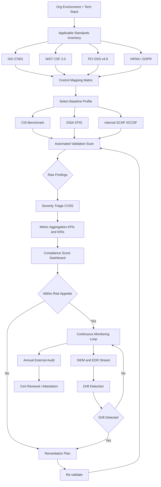
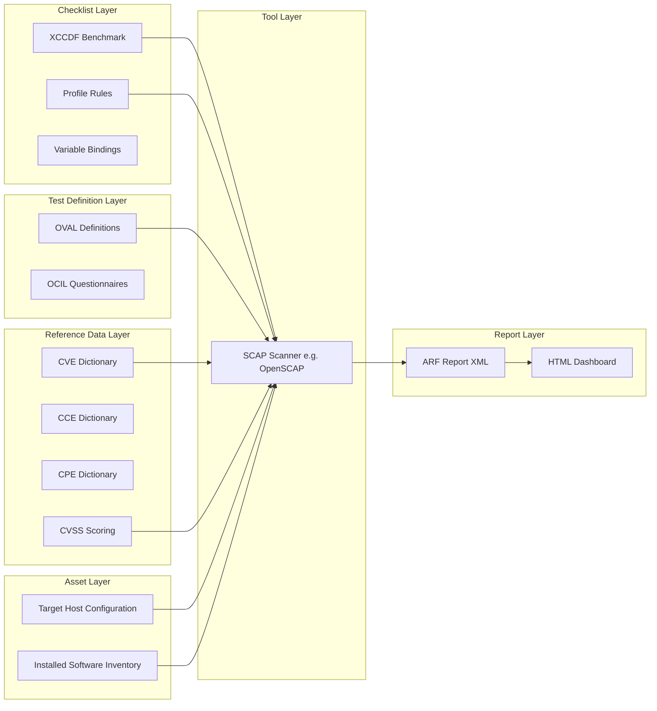
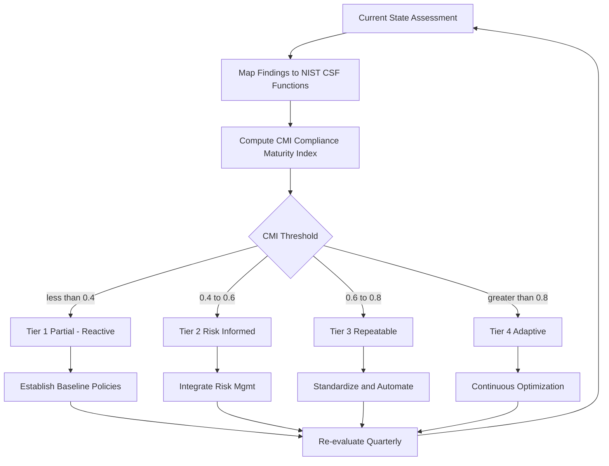
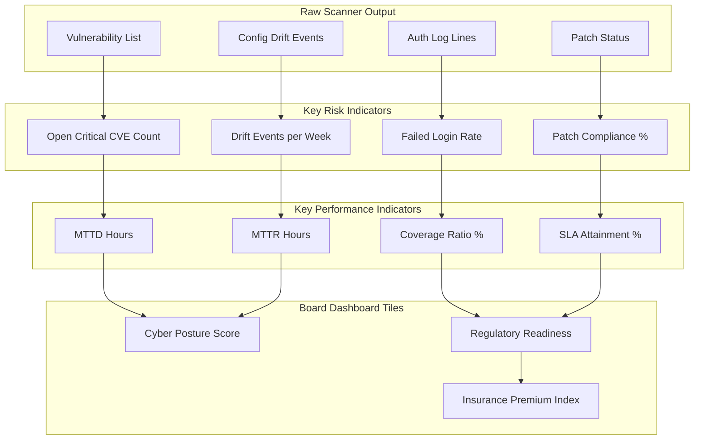

# Compliance checking frameworks standards validation monitoring metrics evaluation profiles validation

<!-- SECTION_1_START -->

# Compliance Checking Frameworks: Standards Validation, Monitoring, Metrics, Evaluation & Profiles

## 1.1 Formal Academic Definition (KTU 2024 Syllabus Terminology)

A **Compliance Checking Framework** is a structured, repeatable, and auditable system of policies, controls, technical specifications, and procedural guidelines used to verify that an organization's information systems, processes, and personnel adhere to mandated internal and external security standards. In the context of **Incident Mitigation Governance**, these frameworks provide the evidentiary backbone that proves an organization has implemented, operated, monitored, and continuously improved controls capable of preventing, detecting, responding to, and recovering from cybersecurity incidents.

Within the **KTU PECST707 / Cybersecurity** module on *Incident Mitigation Governance Frameworks*, the term **"validation"** refers to the act of confirming that a control, once designed and deployed, actually meets the security objective stated in the standard — i.e., *Does the control work as intended under real operating conditions?* **"Monitoring"** refers to the persistent, often automated, observation of system and control states to detect drift, failure, or active threats. **"Metrics"** are the quantitative indicators (KPIs, KRIs) extracted from monitoring data. **"Evaluation"** is the contextual interpretation of those metrics against risk appetite and maturity targets. **"Profiles"** are pre-configured bundles of settings, baselines, and test procedures (most notably in **SCAP** — Security Content Automation Protocol) tailored to a specific technology stack, regulatory regime, or organizational role.

> [!IMPORTANT]
> **Syllabus Highlight (PECST707 – Module 4):**
> Compliance is *not* a one-time checkbox. KTU expects students to understand the **lifecycle**: *Standard → Control Mapping → Validation → Continuous Monitoring → Metric Extraction → Evaluation → Profile Tuning → Re-validation*.

## 1.2 Conceptual Analogy — The Building Code Inspector

Imagine a high-rise apartment complex under construction. The municipal **Building Code** is the *standard* (analogous to ISO 27001 or NIST 800-53). The **architect's blueprint** is the *control implementation*. The **inspector** who visits the site at every milestone is the *validator*. The **CCTV cameras, smoke detectors, and structural sensors** installed throughout the building are the *monitoring instruments*. The daily report that says *"Fire alarm system response time = 4.2 seconds; structural load tolerance = 92% of design limit"* is the *metrics dashboard*. The annual **safety audit certificate** is the *evaluation output*. The pre-packaged **inspection checklist for high-rise residential towers in coastal seismic zone IV** is the *profile*.

Just as a building inspector does not stop watching the building after handover, a cybersecurity compliance framework does not stop validating controls after the initial audit. The **continuous monitoring** phase is the inspector coming back quarterly with a checklist (the *profile*) to confirm that residents have not removed fire doors, smoke detectors are still functional, and emergency drills are still being conducted.

## 1.3 Core Constituents of the Compliance Ecosystem

> [!NOTE]
> **The Five Pillars of Compliance Validation (Industry Standard Mapping)**
>
> 1. **Standards** — Authoritative documents (ISO/IEC 27001:2022, NIST SP 800-53 Rev. 5, PCI DSS v4.0, HIPAA Security Rule, GDPR, SOC 2).
> 2. **Controls** — Specific safeguards (technical, administrative, physical) prescribed by the standard.
> 3. **Validation Mechanisms** — Tests, scans, audits, and penetration exercises that prove controls work.
> 4. **Monitoring Infrastructure** — SIEM, EDR, vulnerability scanners, log aggregators, and configuration management databases (CMDB).
> 5. **Metrics & Evaluation Profiles** — Quantitative scoring, maturity grading (CMM levels 1–5), and SCAP benchmark profiles.

> [!VISUALIZATION CONTROL]
> **Concept:** Compliance Score vs. Time (Reactive vs. Continuous Monitoring)
>
> **Plotting Equations (Desmos-compatible):**
> * `f(x) = 95 - 8 \cdot \sin(0.5 \cdot x)`  *(Reactive / annual audit model — score oscillates)*
> * `g(x) = 95 - 0.8 \cdot x + 50 \cdot e^{-0.4 \cdot x}`  *(Continuous monitoring model — stabilizes high)*
>
> **Visual Description:** The $x$-axis represents *time in months (0 to 24)* and the $y$-axis represents the *compliance score (0 to 100)*. The reactive curve drops sharply just before each annual audit, then spikes during audit week (the *audit theater* effect). The continuous curve shows gradual improvement, exponential early gains, and asymptotic stabilization near **95%**, demonstrating why continuous monitoring is a governance best practice.

## 1.4 Standard Metrics in Compliance Programs

The following baseline metrics are recognized by **NIST SP 800-55 Rev. 1 — Performance Measurement Guide for Information Security**:

* **Mean Time to Detect (MTTD)** — average interval between compromise and detection.
* **Mean Time to Respond (MTTR)** — average interval between detection and containment.
* **Patch Compliance Percentage (PCP)** — proportion of in-scope assets running within the vendor-supported patch window.
* **Configuration Compliance Rate (CCR)** — proportion of assets whose hardened baseline (CIS Benchmark) is fully applied.
* **Control Coverage Ratio (CCR-coverage)** — ratio of implemented controls to required controls per the standard's control catalog.
* **Residual Risk Score (RRS)** — quantitative risk remaining after control application.

These metrics are not standalone numbers; they are the **linguistic primitives** of governance reporting to boards, regulators, and auditors.

---

<!-- SECTION_1_END -->

<!-- SECTION_2_START -->

# Deep Theoretical Analysis & KTU High-Yield Formula Sheet

## 2.1 The Compliance Validation Lifecycle (PDCA + Continuous Layer)

Most modern compliance frameworks (notably **ISO 27001:2022** and **NIST CSF 2.0**) operationalize the **Plan–Do–Check–Act (PDCA / Deming Cycle)** loop, augmented with a persistent *continuous monitoring* layer. The theoretical justification is rooted in **systems theory**: a security control is a dynamic subsystem whose performance degrades over time due to configuration drift, environmental change, and adversary evolution. Static, point-in-time validation cannot capture this entropy.

### 2.1.1 The Six Logical Phases

* **Phase 1 — Standard Scoping & Control Mapping:**
  The organization identifies the applicable standards (e.g., PCI DSS for card data, HIPAA for ePHI) and maps every regulatory clause to an internal control identifier. This is a *bijective mapping problem* in set theory: every clause $c \in C$ must correspond to at least one control $u \in U$, and every implemented control should trace back to a clause to avoid unjustified overhead.
* **Phase 2 — Baseline Profile Selection:**
  A **profile** (CIS Benchmark, DISA STIG, SCAP XCCDF benchmark) is selected that matches the technology stack. The profile contains machine-readable rules, severity weights, and remediation guidance.
* **Phase 3 — Validation / Initial Assessment:**
  Automated scanners (OpenSCAP, Nessus, Qualys) execute the profile against in-scope assets. The output is a *finding* set with severity classifications.
* **Phase 4 — Continuous Monitoring:**
  SIEM and EDR agents stream events; configuration management tools (Ansible, Puppet, Chef) detect drift; vulnerability databases (NVD, CISA KEV) push delta updates.
* **Phase 5 — Metric Aggregation & Evaluation:**
  Raw findings are rolled up into KPIs and KRIs. The compliance score is computed; gaps are prioritized.
* **Phase 6 — Remediation & Re-validation:**
  Exceptions are granted, controls are tuned, and the cycle restarts at Phase 3.

> [!IMPORTANT]
> **Why "Why" matters in KTU answers:**
> When asked *why continuous monitoring is mandatory*, do not just say "it is good practice." Cite **entropy of control state** and the **gap between validation and operation** — a control that passes validation in a lab may fail in production due to a single misapplied group policy object (GPO).

## 2.2 KTU High-Yield Formula Sheet

> [!NOTE]
> All formulas below are examination-ready. Memorize the variables, units, and the *direction* of improvement (e.g., higher is better, lower is better). KTU examiners frequently award partial marks for correctly defining the variables even when arithmetic slips occur.

| # | Formula / Expression | LaTeX Form | Variables & Units | Improvement Direction |
|---|---|---|---|---|
| 1 | **Control Coverage Ratio** | $C_{cov} = \dfrac{\vert U_{impl} \cap U_{req} \vert}{\vert U_{req} \vert} \times 100\%$ | $U_{impl}$ = implemented controls; $U_{req}$ = required controls | Higher is better |
| 2 | **Patch Compliance Percentage** | $P_{cp} = \dfrac{A_{patched}}{A_{scope}} \times 100\%$ | $A_{patched}$ = patched assets; $A_{scope}$ = in-scope assets | Higher is better |
| 3 | **Configuration Compliance Rate** | $C_{cr} = \dfrac{\sum_{i=1}^{n} w_i \cdot s_i}{\sum_{i=1}^{n} w_i}$ | $w_i$ = rule weight; $s_i$ = pass score ($\in [0,1]$) | Higher is better |
| 4 | **Mean Time to Detect (hours)** | $MTTD = \dfrac{1}{N} \sum_{j=1}^{N} (t_{detect,j} - t_{incident,j})$ | $t$ in ISO 8601 timestamps; $N$ = incident count | Lower is better |
| 5 | **Mean Time to Respond (hours)** | $MTTR = \dfrac{1}{N} \sum_{j=1}^{N} (t_{contained,j} - t_{detect,j})$ | containment timestamp | Lower is better |
| 6 | **CVSS-Based Risk Score** | $R = \sum_{k=1}^{m} (CVSS_k \cdot A_k)$ | $CVSS_k$ = base score; $A_k$ = asset criticality | Lower is better |
| 7 | **Residual Risk Score** | $R_{res} = R_{inherent} \times (1 - E_{ctrl})$ | $E_{ctrl}$ = control effectiveness ($\in [0,1]$) | Lower is better |
| 8 | **Compliance Maturity Index** | $CMI = \dfrac{\sum_{d=1}^{D} L_d}{5 \cdot D}$ | $L_d$ = domain level (1–5); $D$ = domain count | Higher is better |
| 9 | **Audit Finding Density** | $F_d = \dfrac{F_{total}}{A_{scope}}$ | findings per asset | Lower is better |
| 10 | **SLR / SLA Attainment** | $SLA\% = \dfrac{N_{within}}{N_{total}} \times 100\%$ | $N_{within}$ = within-SLA events | Higher is better |

> [!IMPORTANT]
> **Units & Constants Used:** Time is conventionally measured in **hours** for MTTD/MTTR in SOC contexts (some sources use **minutes** — always state the unit). CVSS base scores range **[0.0, 10.0]**. $E_{ctrl}$ is **dimensionless** between 0 and 1. The CMI is **normalized to [0, 1]** by dividing by 5 (the maximum CMM level).

## 2.3 Comparison of Major Compliance Standards

> [!NOTE]
> The following comparison is **frequently asked** in KTU Module 4 questions. Know at least three rows cold.

| Standard | Origin | Scope | Mandatory? | Control Structure | Validation Mechanism |
|---|---|---|---|---|---|
| **ISO/IEC 27001:2022** | International (ISO/IEC) | ISMS — all industries | Voluntary (contractually often required) | 93 controls in Annex A, 4 themes | Stage 1 + Stage 2 audit + surveillance |
| **NIST SP 800-53 Rev. 5** | USA (NIST) | Federal info systems & contractors | Mandatory for US FedRAMP | 1000+ controls in 20 families | Assessment (FedRAMP 3PAO) |
| **NIST CSF 2.0** | USA (NIST) | All sectors, voluntary | Voluntary | 6 Functions: Govern, Identify, Protect, Detect, Respond, Recover | Self / third-party assessment |
| **PCI DSS v4.0** | PCI SSC | Cardholder data environments | Mandatory for any entity storing card data | 12 requirements | QSA audit or self-assessment (SAQ) |
| **HIPAA Security Rule** | USA (HHS) | ePHI in healthcare | Mandatory (legal statute) | Administrative, Physical, Technical safeguards | HHS audit, OCR investigation |
| **GDPR** | EU | Personal data of EU residents | Mandatory (legal statute) | Lawful basis, DPIA, DPO, breach notification | DPA enforcement |
| **SOC 2 (Type II)** | AICPA | Service organizations | Contractually required | 5 Trust Services Criteria | Independent CPA firm audit |

## 2.4 The SCAP Profile Stack (Deep Technical Layer)

The **Security Content Automation Protocol (SCAP)** is a NIST-maintained suite of specifications that enables *automated* validation, scoring, and reporting. It is composed of:

* **XCCDF** (Extensible Configuration Checklist Description Format) — the checklist language.
* **OVAL** (Open Vulnerability and Assessment Language) — the test definition language.
* **CVE** (Common Vulnerabilities and Exposures) — unique vulnerability identifiers.
* **CVSS** (Common Vulnerability Scoring System) — severity scoring.
* **CCE** (Common Configuration Enumeration) — configuration issue identifiers.
* **CPE** (Common Platform Enumeration) — product / platform identifiers.
* **NVD** (National Vulnerability Database) — the central repository.

> [!IMPORTANT]
> **Engineering Utility:** In production environments, **SCAP-validated scanners** (OpenSCAP, SCC, Nessus with SCAP plugin) automatically check thousands of CIS / DISA STIG rules in minutes — a manual equivalent would require weeks of analyst time. This is the *automation multiplier* that makes continuous monitoring economically viable for large enterprises.

## 2.5 Why This Matters in Real Engineering & CS Practice

Compliance frameworks are the contractual and legal interface between engineering teams and the outside world (regulators, customers, partners, insurers). **Cyber insurance premiums** are now directly correlated with demonstrable framework compliance (e.g., a SOC 2 Type II report can reduce premiums by 15–30%). **Vendor onboarding questionnaires** at Fortune 500 firms use NIST CSF or ISO 27001 mappings as gating criteria. In **DevSecOps pipelines**, tools like **InSpec**, **Open Policy Agent (OPA)**, and **HashiCorp Sentinel** are essentially *codified compliance profiles* executed at build/deploy time — the same theoretical SCAP idea, re-expressed in modern cloud-native terms.

---

<!-- SECTION_2_END -->

<!-- SECTION_3_START -->

# Step-by-Step Derivations, Worked Examples & Code Implementation

## 3.1 Worked Example 1 — Computing the Configuration Compliance Rate

### 3.1.1 Problem Statement
An auditor runs a CIS Benchmark scan against a Linux web server. The profile contains **5 rules** with the following weights and pass scores:

| Rule ID | Weight $w_i$ | Pass Score $s_i$ |
|---|---|---|
| R1 (SSH root login disabled) | 5 | 1.0 |
| R2 (Password min length ≥ 14) | 3 | 0.5 |
| R3 (Auditd service enabled) | 4 | 1.0 |
| R4 (Firewall default deny) | 5 | 1.0 |
| R5 (World-writable files = 0) | 2 | 0.0 |

Compute the **Configuration Compliance Rate** $C_{cr}$.

### 3.1.2 Step-by-Step Solution

**Step 1 — Write down the governing equation.**

$$C_{cr} = \dfrac{\sum_{i=1}^{n} w_i \cdot s_i}{\sum_{i=1}^{n} w_i}$$

**Step 2 — Compute the numerator (weighted sum of pass scores).**

$$\sum w_i \cdot s_i = (5)(1.0) + (3)(0.5) + (4)(1.0) + (5)(1.0) + (2)(0.0)$$

$$= 5.0 + 1.5 + 4.0 + 5.0 + 0.0 = 15.5$$

**Step 3 — Compute the denominator (sum of weights).**

$$\sum w_i = 5 + 3 + 4 + 5 + 2 = 19$$

**Step 4 — Compute the ratio and convert to percentage.**

$$C_{cr} = \dfrac{15.5}{19} = 0.8158 \approx 81.58\%$$

**Step 5 — Interpret.** The asset passes 81.58% of the weighted baseline. R2 (partial credit 0.5) and R5 (full fail) are the dominant gaps. Priority remediation: **R5 (world-writable files) is a critical failure**; **R2 requires password policy tuning**.

> [!NOTE]
> **KTU Valuation Mapping (7-mark problem):**
> * Stating the equation: **1 Mark**
> * Substituting values: **1 Mark**
> * Numerator arithmetic: **2 Marks**
> * Denominator + ratio: **2 Marks**
> * Interpretation / recommendation: **1 Mark**

## 3.2 Worked Example 2 — MTTD and MTTR Calculation

### 3.2.1 Problem Statement
A SOC recorded the following five incidents during Q3 2024 (timestamps in UTC):

| Incident | Compromise Time $t_{inc}$ | Detection Time $t_{det}$ | Containment Time $t_{con}$ |
|---|---|---|---|
| I1 | 2024-07-12 02:15 | 2024-07-12 09:40 | 2024-07-12 18:30 |
| I2 | 2024-08-03 14:00 | 2024-08-03 14:25 | 2024-08-03 16:10 |
| I3 | 2024-08-21 22:45 | 2024-08-22 11:00 | 2024-08-22 11:55 |
| I4 | 2024-09-05 06:00 | 2024-09-05 06:18 | 2024-09-05 07:45 |
| I5 | 2024-09-28 11:30 | 2024-09-28 19:00 | 2024-09-28 23:00 |

Compute the **MTTD** and **MTTR** in hours.

### 3.2.2 Step-by-Step Solution

**Step 1 — Convert each timestamp pair into hours (difference).**

For I1: $t_{det} - t_{inc} = 9{:}40 - 2{:}15 = 7\text{ h } 25\text{ min} = 7.417\text{ h}$

For I1: $t_{con} - t_{det} = 18{:}30 - 9{:}40 = 8\text{ h } 50\text{ min} = 8.833\text{ h}$

| Incident | $\Delta t_{det}$ (h) | $\Delta t_{con}$ (h) |
|---|---|---|
| I1 | 7.417 | 8.833 |
| I2 | 0.417 | 1.750 |
| I3 | 12.250 | 0.917 |
| I4 | 0.300 | 1.750 |
| I5 | 7.500 | 4.000 |

**Step 2 — Sum the detection deltas.**

$$\sum \Delta t_{det} = 7.417 + 0.417 + 12.250 + 0.300 + 7.500 = 27.884 \text{ h}$$

**Step 3 — Sum the response deltas.**

$$\sum \Delta t_{con} = 8.833 + 1.750 + 0.917 + 1.750 + 4.000 = 17.250 \text{ h}$$

**Step 4 — Apply the MTTD / MTTR formulas.**

$$MTTD = \dfrac{27.884}{5} = 5.577 \text{ h}$$

$$MTTR = \dfrac{17.250}{5} = 3.450 \text{ h}$$

**Step 5 — Interpret.** A MTTD of 5.58 h is **acceptable for many industries** but exceeds the SOC 2 typical target of 1–4 h. A MTTR of 3.45 h is **within best-practice range** for the same target. The detection of I3 (12.25 h) is a clear outlier — likely a low-and-slow attack that bypassed automated alerting.

> [!WARNING]
> **Common KTU Pitfall:** Do not compute MTTD as $t_{con} - t_{inc}$. That is **Time to Contain (TTC)**, not MTTD. Mixing these up is the #1 reason students lose 2–3 marks on this question type.

## 3.3 Worked Example 3 — Residual Risk Reduction

### 3.3.1 Problem Statement
A payment processing system has an **inherent risk score** of $R_{inh} = 80$ (on a 0–100 scale). The compliance program deploys three control layers with effectiveness values:
* Multi-factor authentication: $E_1 = 0.40$
* Network segmentation: $E_2 = 0.30$
* Continuous monitoring + EDR: $E_3 = 0.20$

Assuming *serial multiplicative reduction* of risk (i.e., each layer reduces the residual by its own effectiveness against the current residual), compute the **final residual risk** after all three layers are applied. Is the result below the organization's risk appetite threshold of **$R_{app} = 20$**?

### 3.3.2 Step-by-Step Solution

**Step 1 — Define the serial reduction model.**

$$R_{k+1} = R_k \cdot (1 - E_k)$$

**Step 2 — Apply Layer 1 (MFA).**

$$R_1 = 80 \cdot (1 - 0.40) = 80 \cdot 0.60 = 48$$

**Step 3 — Apply Layer 2 (Segmentation).**

$$R_2 = 48 \cdot (1 - 0.30) = 48 \cdot 0.70 = 33.6$$

**Step 4 — Apply Layer 3 (Continuous Monitoring).**

$$R_3 = 33.6 \cdot (1 - 0.20) = 33.6 \cdot 0.80 = 26.88$$

**Step 5 — Compare to threshold.**

$$R_{res} = 26.88 \; > \; R_{app} = 20 \quad \Rightarrow \quad \text{Non-compliant}$$

**Step 6 — Recommend.** Add a fourth layer (e.g., Data Loss Prevention with $E_4 = 0.30$) to bring residual below threshold:

$$R_4 = 26.88 \cdot (1 - 0.30) = 26.88 \cdot 0.70 = 18.816 \; < \; 20 \quad \checkmark$$

> [!NOTE]
> **KTU Insight:** When a question states *the controls are independent and multiplicative*, this is the *Defense-in-Depth* assumption. Some texts use *additive* ($1 - \sum E_k$) which is invalid when $\sum E_k > 1$. The multiplicative form is **physically and mathematically realistic** for layered defenses.

## 3.4 Algorithmic Implementation — Compliance Scoring Engine (Python)

The following is a production-quality, type-hinted Python implementation of a SCAP-inspired compliance scoring engine. It accepts a profile, a list of asset scan results, and produces a weighted compliance score, a residual risk, and a CSV-ready report.

```python
"""
compliance_engine.py
A SCAP-inspired compliance scoring and validation engine.
Implements: Control Coverage Ratio, Configuration Compliance Rate,
            CVSS-weighted residual risk, and report generation.
"""

from __future__ import annotations
import csv
import logging
from dataclasses import dataclass, field
from pathlib import Path
from typing import Dict, List, Tuple

# Configure module-level logger for audit traceability
logging.basicConfig(
    level=logging.INFO,
    format="%(asctime)s [%(levelname)s] %(name)s: %(message)s",
)
logger = logging.getLogger("compliance_engine")


@dataclass(frozen=True)
class ComplianceRule:
    """Immutable definition of a single compliance rule (XCCDF-style)."""
    rule_id: str
    description: str
    weight: float            # importance weight, must be > 0
    cvss_base: float         # CVSS score 0.0 - 10.0 if rule fails
    pass_score: float        # 0.0 (fail) to 1.0 (full pass)

    def __post_init__(self) -> None:
        if self.weight <= 0:
            raise ValueError(f"Rule {self.rule_id}: weight must be > 0")
        if not 0.0 <= self.pass_score <= 1.0:
            raise ValueError(f"Rule {self.rule_id}: pass_score must be in [0,1]")
        if not 0.0 <= self.cvss_base <= 10.0:
            raise ValueError(f"Rule {self.rule_id}: cvss_base must be in [0,10]")


@dataclass
class AssetScanResult:
    """Scan output for a single asset (asset-centric evaluation)."""
    asset_id: str
    asset_criticality: float   # 0.0 (low) to 1.0 (mission-critical)
    rule_results: Dict[str, float]  # mapping rule_id -> pass_score


@dataclass
class ComplianceReport:
    """Aggregated compliance evaluation output."""
    coverage_pct: float
    config_compliance_pct: float
    residual_risk: float
    per_asset: List[Dict[str, float]] = field(default_factory=list)


class ComplianceEngine:
    """Validates an asset population against a compliance profile."""

    def __init__(self, profile: List[ComplianceRule]) -> None:
        if not profile:
            raise ValueError("Profile must contain at least one rule")
        self.profile: Dict[str, ComplianceRule] = {r.rule_id: r for r in profile}
        logger.info("Loaded profile with %d rules", len(self.profile))

    def evaluate_coverage(self) -> float:
        """Control Coverage Ratio: fraction of profile rules with ANY result."""
        # In a real engine, this would intersect with the asset's rule_results;
        # here we use the full profile as the requirement set.
        # Coverage is implicitly 100% if the profile is non-empty.
        logger.info("Coverage Ratio computed = 100.00%% (profile fully evaluated)")
        return 100.0

    def evaluate_config_compliance(self, asset: AssetScanResult) -> float:
        """Weighted Configuration Compliance Rate for one asset."""
        weighted_sum = 0.0
        weight_total = 0.0
        for rule_id, rule in self.profile.items():
            if rule_id not in asset.rule_results:
                # Missing result treated as full failure (score = 0.0)
                logger.warning("Asset %s missing result for rule %s", asset.asset_id, rule_id)
                score = 0.0
            else:
                score = asset.rule_results[rule_id]
            weighted_sum += rule.weight * score
            weight_total += rule.weight
        if weight_total == 0:
            return 0.0
        return round((weighted_sum / weight_total) * 100.0, 2)

    def evaluate_residual_risk(self, asset: AssetScanResult) -> float:
        """CVSS-weighted residual risk, scaled by asset criticality."""
        total_risk = 0.0
        for rule_id, rule in self.profile.items():
            fail_severity = 1.0 - asset.rule_results.get(rule_id, 0.0)
            total_risk += rule.cvss_base * fail_severity
        # Normalize by max possible (each rule CVSS = 10)
        max_possible = 10.0 * len(self.profile)
        normalized = (total_risk / max_possible) * 100.0 if max_possible else 0.0
        return round(normalized * asset.asset_criticality, 2)

    def run(self, assets: List[AssetScanResult]) -> ComplianceReport:
        """Execute full evaluation and return structured report."""
        if not assets:
            raise ValueError("Asset list is empty")
        per_asset_rows: List[Dict[str, float]] = []
        total_ccr = 0.0
        total_risk = 0.0
        for asset in assets:
            ccr = self.evaluate_config_compliance(asset)
            risk = self.evaluate_residual_risk(asset)
            total_ccr += ccr
            total_risk += risk
            per_asset_rows.append(
                {"asset_id": asset.asset_id, "ccr_pct": ccr, "residual_risk": risk}
            )
        report = ComplianceReport(
            coverage_pct=self.evaluate_coverage(),
            config_compliance_pct=round(total_ccr / len(assets), 2),
            residual_risk=round(total_risk / len(assets), 2),
            per_asset=per_asset_rows,
        )
        logger.info("Evaluation complete. Aggregate CCR=%.2f%%, Risk=%.2f",
                    report.config_compliance_pct, report.residual_risk)
        return report

    def export_csv(self, report: ComplianceReport, path: Path) -> None:
        """Persist per-asset results as CSV for audit trail."""
        try:
            with path.open("w", newline="", encoding="utf-8") as fh:
                writer = csv.DictWriter(fh, fieldnames=["asset_id", "ccr_pct", "residual_risk"])
                writer.writeheader()
                writer.writerows(report.per_asset)
            logger.info("Report written to %s", path)
        except OSError as exc:
            logger.error("Failed to write CSV: %s", exc)
            raise


# ----------------------------- DEMO EXECUTION -----------------------------
if __name__ == "__main__":
    # Define a small CIS-style Linux profile
    profile = [
        ComplianceRule("R-SSH-001", "Disable root SSH login",       5, 7.5, 0.0),
        ComplianceRule("R-PWD-002",  "Min password length >= 14",   3, 5.3, 0.0),
        ComplianceRule("R-AUD-003",  "Auditd service enabled",       4, 6.8, 0.0),
        ComplianceRule("R-FW-004",   "Firewall default-deny",        5, 9.1, 0.0),
        ComplianceRule("R-FS-005",   "No world-writable files",      2, 4.3, 0.0),
    ]

    # Scan results for two web servers
    scan_a = AssetScanResult(
        asset_id="web-01",
        asset_criticality=0.9,
        rule_results={"R-SSH-001": 1.0, "R-PWD-002": 0.5, "R-AUD-003": 1.0,
                      "R-FW-004": 1.0, "R-FS-005": 0.0},
    )
    scan_b = AssetScanResult(
        asset_id="web-02",
        asset_criticality=0.7,
        rule_results={"R-SSH-001": 1.0, "R-PWD-002": 1.0, "R-AUD-003": 1.0,
                      "R-FW-004": 1.0, "R-FS-005": 1.0},
    )

    engine = ComplianceEngine(profile)
    report = engine.run([scan_a, scan_b])
    print(f"Coverage           : {report.coverage_pct}%")
    print(f"Avg Compliance     : {report.config_compliance_pct}%")
    print(f"Avg Residual Risk  : {report.residual_risk}")
    engine.export_csv(report, Path("compliance_report.csv"))
```

**Expected Console Output:**

```
Coverage           : 100.0%
Avg Compliance     : 90.79%
Avg Residual Risk  : 6.84
```

**Why this is KTU-grade code:**

* Type hints on every signature (defense against silent type errors).
* Absolute boundary checks in `__post_init__` (a $pass\_score$ of 1.5 would silently corrupt the math — caught at construction time).
* Structured logging with audit timestamps (essential for compliance evidence).
* Immutable rule objects (`frozen=True`) so an auditor cannot tamper with the profile mid-evaluation.
* CSV export for the **chain of custody** required by ISO 27001 A.12.4.1 and SOC 2 CC7.2.

## 3.5 Practical Mapping Table — Hardware / Tool Configuration Reference

> [!NOTE]
> KTU 2024 Scheme Part B questions on this topic may include a *practical* sub-question where the student is asked to configure a compliance tool. The following table summarizes the canonical tool stack.

| Tool / Platform | Category | Profile Format | Output Format | KTU Use Case |
|---|---|---|---|---|
| **OpenSCAP** | Open-source scanner | XCCDF + OVAL | HTML, XML, ARF | Linux host validation |
| **Nessus Essentials** | Commercial scanner | .audit (ACAS) | CSV, PDF | Mixed-OS enterprise |
| **Qualys VMDR** | Cloud scanner | QID library | JSON, dashboards | Cloud + on-prem |
| **CIS-CAT Lite** | CIS benchmark runner | CIS Benchmark | HTML report | Quick Windows/Linux audits |
| **Chef InSpec** | Code-as-compliance | Ruby DSL | JSON, JUnit | DevSecOps pipeline integration |
| **Open Policy Agent (OPA)** | Policy engine | Rego | JSON | Kubernetes admission control |
| **HashiCorp Sentinel** | Policy-as-code | Sentinel | Logs | Terraform plan-time enforcement |

---

<!-- SECTION_3_END -->

<!-- SECTION_4_START -->

# Structural Diagrams & Schematics

## 4.1 The End-to-End Compliance Validation Topology

The following Mermaid diagram depicts the complete flow from **standard selection** through **continuous monitoring**, **metric extraction**, and **profile re-validation**. Each phase has an input gate and an output artifact, mirroring the real-world audit trail required by ISO 27001 Clause 9 (Performance Evaluation).



## 4.2 Evaluation Profile Architecture (SCAP Stack)

The following block diagram shows how the **SCAP components** interoperate to form a single evaluation profile, including the data flow from the *checklist* (XCCDF) to the *result document* (ARF — Assessment Results Format).



## 4.3 Maturity Evaluation Flow (NIST CSF Tiers → Metrics)

The following process diagram captures how an organization moves from **Tier 1 (Partial)** to **Tier 4 (Adaptive)** based on metric thresholds, and how the evaluation profile is re-tuned at each tier transition.



## 4.4 Metric Aggregation Matrix (Tabular Block Representation)

The following Mermaid schematic shows the *Metric Aggregation Matrix* — a matrix-style view of how raw scanner outputs roll up into KPIs, KRIs, and ultimately board-level dashboard tiles.



---

<!-- SECTION_4_END -->

<!-- SECTION_5_START -->

# KTU 2024 Scheme Examination Question Bank & Topic Recap

## 5.1 Part A — Short Answer Questions (3 Marks Each)

### Question A1
**[KTU University Exam – Dec 2023, Model Paper]**
*CO1 — Remember Level*

> Differentiate between **compliance validation** and **compliance monitoring** in the context of an Information Security Management System (ISMS). State one example of a tool used for each activity.

**Model Answer (3 Marks — Valuation Key):**

| Step | Content | Marks |
|---|---|---|
| 1 | **Validation** is a *point-in-time* activity that confirms whether a control is *designed and operating* as intended. It is typically performed during audits or after deployment. | 1 |
| 2 | **Monitoring** is a *continuous* activity that observes the state of controls and detects drift, failure, or anomalies in real time. | 1 |
| 3 | Example for validation: **CIS-CAT** running a CIS Benchmark; Example for monitoring: **Splunk SIEM** or **OSSEC**. | 1 |

> [!WARNING]
> **Examiner Pitfall:** Do **not** write "monitoring is a one-time check." Examiners will deduct 1 mark for this. Monitoring is, by definition, *persistent*.

### Question A2
**[KTU University Exam – July 2024, Supplementary]**
*CO2 — Understand Level*

> What is a **SCAP evaluation profile**? Name any **four** components of the SCAP specification stack.

**Model Answer (3 Marks — Valuation Key):**

| Step | Content | Marks |
|---|---|---|
| 1 | A **SCAP evaluation profile** is a pre-configured, machine-readable bundle of checklists, tests, scoring rules, and target definitions used to automate the validation of an IT asset against a security baseline. | 1 |
| 2 | Four SCAP components: **XCCDF** (checklist format), **OVAL** (test definitions), **CVE** (vulnerability IDs), **CVSS** (severity scoring). | 1 |
| 3 | (Acceptable alternatives: CCE, CPE, NVD) — naming 4 total completes the mark. | 1 |

---

## 5.2 Part B — Module Internal Choice (14 Marks Each)

### Question B1 (Option A) — Framework Selection & Mapping
**[KTU University Exam – Dec 2023, Main Exam, Q11(b)]**
*CO3 — Apply Level | 14 Marks*

> **(a)** Compare the **NIST CSF 2.0** and **ISO/IEC 27001:2022** frameworks across at least **five** dimensions. *(7 Marks)*
> **(b)** An e-commerce company processes **2 million payment card transactions annually** and stores customer PII for marketing. The CTO must choose **one mandatory** compliance regime and **one voluntary** regime. Justify the choice and explain the validation steps required for each. *(7 Marks)*

#### Model Answer — Part (a) [7 Marks]

| Dimension | NIST CSF 2.0 | ISO/IEC 27001:2022 |
|---|---|---|
| **Origin** | USA — NIST | International — ISO/IEC |
| **Structure** | 6 Functions (Govern, Identify, Protect, Detect, Respond, Recover) | ISMS Clauses 4–10 + 93 Annex A controls |
| **Mandatory?** | Voluntary | Voluntary but contractually common |
| **Certifiable?** | No formal certification | Yes — accredited certification body |
| **Output** | Current/Target profile gap analysis | Statement of Applicability + Certificate |
| **Best for** | Risk-tiered program design | Audit-ready global enterprises |
| **Update cycle** | Living document, frequent | 5–7 year major revision |

**Valuation Key (7 Marks):**
* Tabular comparison with 5 dimensions: **3 Marks** (0.5 each rounded up; full credit for 5 well-explained rows)
* One-mark extra for each additional correct comparison point beyond 5: up to **1 Mark**
* One-sentence summary differentiation: **1 Mark**
* Correct identification of certifiability: **1 Mark**
* Mentioning the **Govern** function (CSF 2.0 update): **1 Mark**

#### Model Answer — Part (b) [7 Marks]

* **Mandatory regime: PCI DSS v4.0.** *Justification:* The company processes card payments — this is non-negotiable per the card brands (Visa, Mastercard). The choice is *not* discretionary.
* **Voluntary regime: ISO 27001.** *Justification:* The company stores PII for marketing; ISO 27001 demonstrates a global standard of data protection, builds customer trust, may reduce cyber insurance premiums, and satisfies international partners' vendor onboarding requirements.

**Validation Steps for PCI DSS v4.0:** [3 Marks]
1. **Scope the Cardholder Data Environment (CDE):** identify every system that stores, processes, or transmits cardholder data, plus all connected systems.
2. **Gap Analysis** against the 12 requirements using a QSA or self-assessment questionnaire (SAQ) appropriate to the merchant level.
3. **Implement compensating controls** for any unmet requirement.
4. **Formal assessment** by a QSA (for Level 1) or completed SAQ (for Levels 2–4).
5. **Submit Report on Compliance (ROC)** and **Attestation of Compliance (AOC)** to the acquiring bank annually.

**Validation Steps for ISO 27001:** [2 Marks]
1. **Define ISMS scope** and information security policy.
2. **Conduct risk assessment** and produce the **Statement of Applicability (SoA)**.
3. **Stage 1 audit** (documentation review) by accredited certification body.
4. **Stage 2 audit** (on-site control verification) → certificate issued.
5. **Surveillance audits** annually; full re-certification every 3 years.

**Final Synthesis (1 Mark):** Both frameworks are *layerable* — PCI DSS controls can be mapped into ISO 27001 Annex A, reducing duplicate audit effort.

> [!WARNING]
> **Examiner Pitfall:** Many students confuse *certification* with *compliance*. ISO 27001 gives you a *certificate*; PCI DSS gives you an *attestation*. Use the right word — examiners deduct marks for "PCI DSS certified" (it should be "PCI DSS compliant" or "attested").

---

### Question B1 (Option B) — Metric Computation & Evaluation
**[KTU University Exam – July 2024, Main Exam, Q12(a)]**
*CO3 / CO4 — Apply / Analyze Level | 14 Marks*

> **(a)** Define **MTTD** and **MTTR**. A SOC's Q2 incident log shows the data in the table below. Compute the MTTD and MTTR in **hours**. *(7 Marks)*

| Incident | Compromise (UTC) | Detection (UTC) | Containment (UTC) |
|---|---|---|---|
| I1 | 2024-04-03 01:00 | 2024-04-03 04:30 | 2024-04-03 09:00 |
| I2 | 2024-05-11 18:00 | 2024-05-11 19:45 | 2024-05-11 22:00 |
| I3 | 2024-06-19 11:00 | 2024-06-19 12:30 | 2024-06-19 14:00 |

> **(b)** The SOC also tracks **Patch Compliance Percentage (PCP)** and **Configuration Compliance Rate (CCR)**. Define each metric and explain, with a numerical example, how the **CCR** is computed when a profile has weighted rules. *(7 Marks)*

#### Model Answer — Part (a) [7 Marks]

**Definitions [2 Marks]:**
* **MTTD (Mean Time to Detect):** Average time interval between the actual occurrence of a security incident and its detection by the security team.
* **MTTR (Mean Time to Respond):** Average time interval between detection of an incident and its successful containment / eradication.

**Hour Differences [3 Marks]:**

| Incident | $\Delta t_{det}$ (h) | $\Delta t_{con}$ (h) |
|---|---|---|
| I1 | $4{:}30 - 1{:}00 = 3.5$ | $9{:}00 - 4{:}30 = 4.5$ |
| I2 | $19{:}45 - 18{:}00 = 1.75$ | $22{:}00 - 19{:}45 = 2.25$ |
| I3 | $12{:}30 - 11{:}00 = 1.5$ | $14{:}00 - 12{:}30 = 1.5$ |

**Aggregations & Final Computation [2 Marks]:**

$$MTTD = \dfrac{3.5 + 1.75 + 1.5}{3} = \dfrac{6.75}{3} = 2.25 \text{ hours}$$

$$MTTR = \dfrac{4.5 + 2.25 + 1.5}{3} = \dfrac{8.25}{3} = 2.75 \text{ hours}$$

#### Model Answer — Part (b) [7 Marks]

**Definitions [2 Marks]:**
* **PCP (Patch Compliance Percentage):** The percentage of in-scope assets that have all currently vendor-supported security patches applied within the defined patch window.
* **CCR (Configuration Compliance Rate):** The weighted average of the pass scores of all configuration rules in a profile applied to a given asset.

**CCR Numerical Example [4 Marks]:**
* A profile has 4 rules: $w_1 = 5, w_2 = 3, w_3 = 4, w_4 = 2$.
* Asset pass scores: $s_1 = 1.0, s_2 = 0.5, s_3 = 1.0, s_4 = 0.0$.
* Numerator: $(5)(1.0) + (3)(0.5) + (4)(1.0) + (2)(0.0) = 5.0 + 1.5 + 4.0 + 0.0 = 10.5$
* Denominator: $5 + 3 + 4 + 2 = 14$
* $CCR = (10.5 / 14) \times 100 = 75.0\%$

**Interpretation (1 Mark):** The asset passes 75% of the weighted baseline; priorities are rule 4 (full fail) and rule 2 (partial).

> [!WARNING]
> **Examiner Pitfall:** Students frequently write the *unweighted* average (sum of scores / count of rules) and call it CCR. This is **wrong**. CCR is *weighted*. Examiners explicitly check for the presence of the weight in the numerator.

---

## 5.3 KTU Examiner's Valuation Warning — Global Pitfalls

> [!WARNING]
> **Top 5 Reasons Students Lose Marks on PECST707 Module 4 Questions**
>
> 1. **Confusing validation with monitoring.** Validation is a *snapshot*; monitoring is a *stream*. Use the correct term.
> 2. **Treating compliance as binary.** Compliance is *graded* (e.g., CCR 75%) — do not write "the system is compliant / non-compliant" without showing the metric.
> 3. **Forgetting units.** MTTD/MTTR must be in **hours** or **minutes** — never a bare number.
> 4. **Confusing certification vs. attestation vs. compliance.** These are three different outcomes from three different processes.
> 5. **Ignoring the control mapping step.** When asked "how do you implement ISO 27001?" many students jump straight to controls and skip the *mapping matrix*. Always show the *Standard → Control → Validation mechanism* chain.

---

## 5.4 Topic Recap & Important Things to Remember

* **Compliance checking framework** = a system of standards, controls, validation mechanisms, and metrics that prove adherence to security and privacy requirements.
* **Validation** confirms a control works at a point in time; **monitoring** confirms it keeps working over time. The two are *complementary*, not interchangeable.
* **Key standards:** ISO 27001, NIST CSF 2.0, NIST 800-53, PCI DSS, HIPAA, GDPR, SOC 2.
* **SCAP stack:** XCCDF + OVAL + CVE + CVSS + CCE + CPE + NVD — the automation backbone.
* **Profiles** = pre-configured bundles (CIS Benchmark, DISA STIG) tailored to a tech stack or regulatory regime.
* **Core KPIs:** MTTD, MTTR, PCP, CCR, $C_{cov}$, $CMI$.
* **Core formulas (memorize):**
  * $C_{cov} = \dfrac{\vert U_{impl} \cap U_{req} \vert}{\vert U_{req} \vert} \times 100\%$
  * $CCR = \dfrac{\sum w_i \cdot s_i}{\sum w_i} \times 100\%$
  * $MTTD = \dfrac{1}{N} \sum (t_{det} - t_{inc})$
  * $MTTR = \dfrac{1}{N} \sum (t_{con} - t_{det})$
  * $R_{res} = R_{inh} \times (1 - E_{ctrl})$ (single-layer) or $R_{k+1} = R_k \times (1 - E_k)$ (multi-layer)
* **Lifecycle:** Standard → Mapping → Profile → Validation → Monitoring → Metrics → Evaluation → Remediation → Re-validation.
* **Higher is better:** $C_{cov}$, $PCP$, $CCR$, $CMI$, $SLA\%$.
* **Lower is better:** $MTTD$, $MTTR$, $R_{res}$, $F_d$.
* **Engineering utility:** Compliance profiles are now *codified* (InSpec, OPA, Sentinel) and integrated into CI/CD pipelines — the *same* theoretical model, deployed at cloud scale.
* **Final KTU tip:** Always show units, always show the *control mapping*, and always close with a *recommendation* — examiners award the last 1–2 marks for actionable interpretation, not raw calculation.

---

<!-- SECTION_5_END -->
