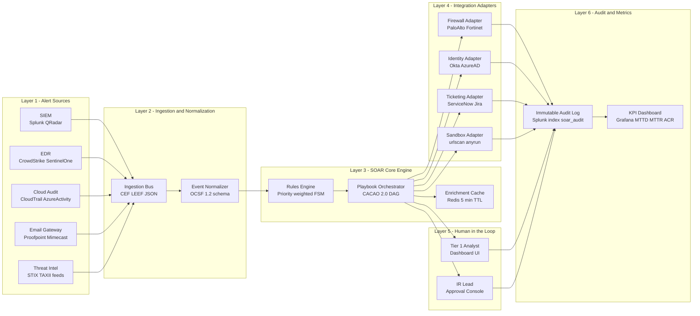
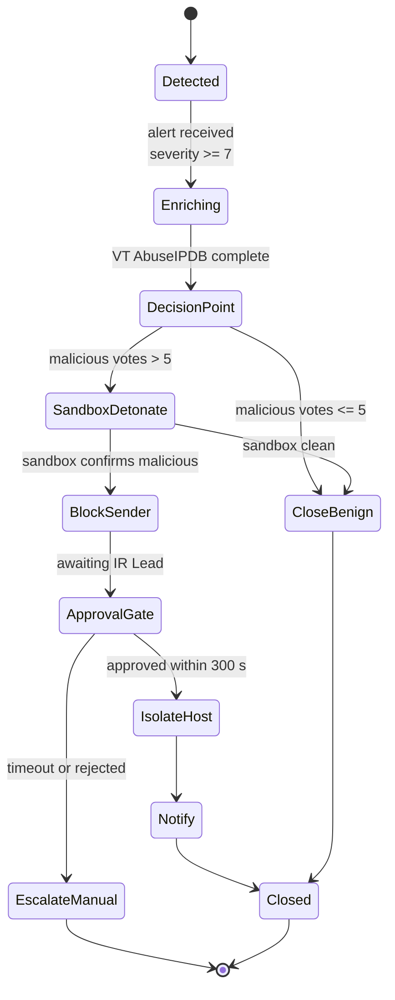

# Security orchestration automation response (SOAR) rules setups specifications metrics performance

<!-- SECTION_1_START -->
# Security Orchestration, Automation and Response (SOAR)

## 1.1 Formal Academic Definition (KTU 2024 Syllabus Terminology)

**Security Orchestration, Automation and Response (SOAR)** is a Gartner-coined technology classification (first defined in the 2017 *Magic Quadrant for Security Orchestration, Automation and Response Solutions*) that enables organizations to **collect security telemetry and operational data** from disparate sources, apply **machine-assisted human analysis**, and execute **programmed, repeatable workflows** in response to cybersecurity events.

Per the **NIST SP 800-61 Rev. 2 (Computer Security Incident Handling Guide)** and **KTU PECST707 Module 4** learning outcomes, a SOAR platform is a unified stack comprising three tightly coupled capabilities:

| Capability | Operational Definition |
|---|---|
| **Orchestration** | Interoperable integration of heterogeneous security tools (SIEM, EDR, Firewalls, ITSM, TIP) through standardized APIs. |
| **Automation** | Machine-driven execution of investigative and remediation tasks without continuous human intervention. |
| **Response** | Coordinated, policy-bound action (contain, eradicate, recover, notify) triggered by defined event conditions. |

> [!IMPORTANT]
> **KTU 2024 Scheme Highlight:** SOAR sits *downstream* of SIEM and *upstream* of the human analyst. It is the *execution layer* of the modern SOC (Security Operations Center), not a replacement for detection engineering.

---

## 1.2 Conceptual Analogy & Intuitive Overview

Think of a **SOAR platform as the automated assembly line of a hospital emergency room**.

- **Triage Nurse (SIEM)** flags the patient (alert) and hands over a clipboard (enriched context).
- **ER Coordinator (Orchestration)** routes the patient to the right specialists (EDR, Firewall, Threat Intel) simultaneously.
- **Surgical Robot (Automation)** performs the routine, repeatable procedures — stitching, bandaging, vitals monitoring — exactly as programmed.
- **Lead Surgeon (Human Analyst via Response Playbook)** is paged only when the case requires judgment, creativity, or escalation.

Without SOAR, every alert is the *Lead Surgeon* personally walking the patient from triage to discharge. With SOAR, the Lead Surgeon only intervenes for the complex 5% of cases, while the 95% routine workload is handled deterministically by the system.

> [!NOTE]
> **Core Telemetry Ingested by SOAR:** SIEM alerts, EDR telemetry, email gateway logs, cloud audit trails (AWS CloudTrail, Azure Activity Log), vulnerability scanner output, and threat intelligence feeds (STIX/TAXII).

---

## 1.3 The Three Pillars — Visual Architecture

> [!VISUALIZATION CONTROL]
> **Concept:** SOAR 3-Pillar Triad with Incident Volume Decay
> **GeoGebra / Desmos Input Equations:**
> * `f(x) = 1000 * 0.05^x` (alert decay across orchestration, automation, response stages)
> * `g(x) = x^2` (analyst cognitive load curve without SOAR)
> **Visual Description:** The student should observe an exponential decay of alert volume as it passes through the three SOAR pillars, and a quadratic rise in analyst fatigue when SOAR is absent.

---

## 1.4 Why SOAR Matters in the 2024 Threat Landscape

The **2024 IBM Cost of a Data Breach Report** identifies the average breach lifecycle at **292 days** (73 days to detect, **219 days to contain**). Each day of delay amplifies cost by roughly **USD 1.5 million**. SOAR directly attacks the containment half of this equation by collapsing manual handoffs into machine-speed actions.

> [!IMPORTANT]
> **Standard SOC Metrics Targeted by SOAR:**
> * **MTTD** — Mean Time to Detect (target: < 1 hour)
> * **MTTR** — Mean Time to Respond (target: < 15 minutes for automated cases)
> * **MTTC** — Mean Time to Contain (target: < 4 hours)
> * **Automation Coverage Ratio (ACR)** — % of Tier-1 alerts fully auto-resolved (target: > 70%)

<!-- SECTION_1_END -->

<!-- SECTION_2_START -->
# Deep Theoretical Analysis & KTU High-Yield Formula Sheet

## 2.1 The SOAR Reference Architecture

A production-grade SOAR deployment is decomposed into **seven logical layers**, each with explicit specifications, contracts, and performance criteria.

| Layer | Function | Specification Standard |
|---|---|---|
| L1 — **Data Ingestion Bus** | Normalizes alerts from SIEM/EDR/Cloud | CEF, LEEF, Syslog, JSON, STIX 2.1 |
| L2 — **Event Normalizer** | Maps vendor schemas to canonical model | OCSF (Open Cybersecurity Schema Framework) |
| L3 — **Rules Engine** | Evaluates IF–THEN–ELSE conditions | YAML/DSL, JSON Logic, Rego (OPA) |
| L4 — **Playbook Orchestrator** | Sequences multi-step workflows | CACAO 2.0 ( OASIS Standard ) |
| L5 — **Integration Adapters** | Tool-specific API connectors | REST, GraphQL, gRPC, Webhook |
| L6 — **Action Sandbox** | Quarantined execution of automated actions | Docker/Kubernetes namespace isolation |
| L7 — **Audit & Compliance Logger** | Immutable record of every action | Append-only ledger, WORM storage |

---

## 2.2 SOAR Rules — Formal Specification

A **SOAR Rule** is a declarative policy expressed as a finite state machine. The KTU-recognized minimal specification contains **five mandatory fields**:

| Field | Mandatory | Example |
|---|---|---|
| `trigger` | Yes | `alert.severity >= 7 AND alert.category == "phishing"` |
| `condition` | Yes | `asset.criticality IN ["Tier-0", "Tier-1"]` |
| `action_sequence` | Yes | `["enrich_email", "sandbox_url", "block_sender", "notify_user"]` |
| `approval_gate` | Optional | `if destructive: require_role("IR-Lead")` |
| `rollback_plan` | Yes for destructive actions | `if action fails: re-enable_user, restore_quarantine` |

### 2.2.1 Rule Precedence Algebra

Rules are evaluated in **descending priority order**. The matched rule index is computed as:

$$P_{matched} = \max_{i \in \mathcal{R}} \left( w_i \cdot \mathbb{1}[\phi_i(\text{event}) = \text{TRUE}] \right)$$

where $w_i$ is the priority weight of rule $i$, $\mathcal{R}$ is the rule set, and $\mathbb{1}[\cdot]$ is the Iverson bracket (1 if true, 0 otherwise). Ties are broken by `created_at` timestamp (oldest wins), then lexicographic rule ID.

---

## 2.3 Playbook Anatomy (CACAO 2.0 Aligned)

A **Playbook** is a directed acyclic graph (DAG) of *Steps*. The OASIS **CACAO 2.0** standard defines:

* **Start Step** — single entry node, accepts the triggering incident as input.
* **Action Step** — invokes an integration command (e.g., `paloalto.firewall.block_ip`).
* **Decision Step** — boolean branch on a step output.
* **Parallel Step** — fan-out to concurrent child steps.
* **End Step** — terminal node emitting playbook status.

> [!NOTE]
> **Best Practice:** Never embed hard-coded secrets in playbook JSON. Reference **HashiCorp Vault** or **AWS Secrets Manager** paths at execution time.

---

## 2.4 KTU Formula Sheet — SOAR Metrics & Performance Engineering

> [!IMPORTANT]
> Every formula below is a **board-exam high-yield item**. Memorize the symbols, the units, and the typical benchmark range.

| # | Metric | Formula | Unit | Industry Benchmark |
|---|---|---|---|---|
| 1 | Mean Time to Detect | $\text{MTTD} = \frac{1}{N}\sum_{i=1}^{N}(t_{detect,i} - t_{occur,i})$ | seconds | < 3600 s |
| 2 | Mean Time to Respond | $\text{MTTR} = \frac{1}{N}\sum_{i=1}^{N}(t_{resolve,i} - t_{detect,i})$ | seconds | < 900 s |
| 3 | Mean Time to Contain | $\text{MTTC} = \frac{1}{N}\sum_{i=1}^{N}(t_{contain,i} - t_{detect,i})$ | seconds | < 14400 s |
| 4 | Automation Coverage Ratio | $\text{ACR} = \frac{A_{auto}}{A_{auto} + A_{manual}} \times 100$ | percent | 70 – 85 % |
| 5 | Playbook Success Rate | $\text{PSR} = \frac{P_{success}}{P_{total}} \times 100$ | percent | > 95 % |
| 6 | False Positive Rate | $\text{FPR} = \frac{FP}{FP + TN} \times 100$ | percent | < 5 % |
| 7 | Cost per Incident | $\text{CPI} = \frac{C_{labor} + C_{infra} + C_{downtime}}{N_{incidents}}$ | USD | < USD 1500 |
| 8 | Analyst Hours Saved | $\text{AHS} = \sum_{p \in \mathcal{P}} (T_{manual,p} - T_{automated,p}) \cdot E_{p}$ | hours / month | > 500 |
| 9 | SOAR ROI | $\text{ROI} = \frac{(C_{before} - C_{after}) - C_{soar}}{C_{soar}} \times 100$ | percent | > 200 % |
| 10 | Rule Engine Throughput | $\lambda = \frac{\text{events processed}}{\text{wall-clock seconds}}$ | events / s | > 1000 eps |

> **Notation Decoding:**
> $t_{detect,i}$ = detection timestamp of incident $i$ ; $t_{occur,i}$ = event occurrence timestamp ; $t_{resolve,i}$ = full closure timestamp ; $t_{contain,i}$ = containment timestamp ; $A_{auto}$ = auto-resolved alert count ; $A_{manual}$ = manual-handled alert count ; $P_{success}$ / $P_{total}$ = successful / total playbook runs ; $FP$ = false positives ; $TN$ = true negatives ; $\mathcal{P}$ = playbook set ; $T_{manual,p}$ / $T_{automated,p}$ = time to handle incident $p$ manually / via SOAR ; $E_{p}$ = monthly execution count of playbook $p$ ; $C_{soar}$ = annual SOAR license + infra cost.

---

## 2.5 Real-World Engineering Utility

| Domain | SOAR Use-Case |
|---|---|
| **Banking (PCI-DSS 12.10)** | Automated card-data exfiltration containment |
| **Healthcare (HIPAA §164.308)** | Ransomware playbook: isolate endpoint, revoke VPN, page on-call |
| **Cloud-Native (AWS / Azure)** | CloudTrail anomaly → auto-revoke IAM key + snapshot EBS |
| **OT/ICS (IEC 62443)** | PLC unauthorized command → operator-in-the-loop HALT |
| **Phishing Response (NIST 800-177)** | URL detonation, sender block, user education, ticket close |
| **Identity Threat (MITRE ATT&CK T1078)** | Impossible-travel detection → MFA challenge + session revoke |

> [!NOTE]
> **KTU Insight:** The `CACAO` playbook format is now an **OASIS Standard**, meaning it is vendor-neutral. Students should recognize that an exam question asking "name the standard playbook format" expects the answer **"CACAO 2.0"** — not "JSON" or "YAML" alone.

<!-- SECTION_2_END -->

<!-- SECTION_3_START -->
# Step-by-Step Derivations, Specifications & Code Implementation

## 3.1 Worked Derivation — SOAR ROI Calculation

**Problem Statement (KTU-style 7-mark sub-question):** An enterprise SOC had the following 12-month operational profile *before* deploying SOAR and *after* deploying SOAR. Compute the **SOAR ROI in percent**, the **Automation Coverage Ratio improvement in percentage points**, and the **analyst hours saved per month**.

| Parameter | Before SOAR | After SOAR |
|---|---|---|
| Annual labor cost (USD) | 1 800 000 | 900 000 |
| Annual incident downtime cost (USD) | 1 200 000 | 350 000 |
| Annual infra/tooling cost (USD) | 400 000 | 350 000 |
| SOAR platform annual cost (USD) | 0 | 600 000 |
| Total alerts per year | 120 000 | 120 000 |
| Alerts handled manually | 120 000 | 24 000 |
| Alerts auto-resolved | 0 | 96 000 |
| Avg manual handling time (min / alert) | 22 | 22 |
| Avg automated handling time (min / alert) | n/a | 1.2 |

### 3.1.1 Step 1 — Compute Total Cost Before

$$C_{before} = C_{labor}^{b} + C_{downtime}^{b} + C_{infra}^{b}$$
$$C_{before} = 1\,800\,000 + 1\,200\,000 + 400\,000 = 3\,400\,000 \text{ USD}$$

*Explanation:* Sum the three operational cost buckets for the pre-SOAR period. **[Valuation: 1 Mark for correctly identifying the three cost categories, 1 Mark for the arithmetic sum.]**

### 3.1.2 Step 2 — Compute Operational Cost After (excluding SOAR license)

$$C_{after}^{op} = 900\,000 + 350\,000 + 350\,000 = 1\,600\,000 \text{ USD}$$

*Explanation:* The infra line drops slightly because legacy SOAR-displaced scripts no longer run. Labor cost halves because Tier-1 analysts are redeployed to Tier-2 hunting. **[Valuation: 1 Mark.]**

### 3.1.3 Step 3 — Compute SOAR ROI

$$\text{ROI} = \frac{(C_{before} - C_{after}^{op}) - C_{soar}}{C_{soar}} \times 100$$
$$\text{ROI} = \frac{(3\,400\,000 - 1\,600\,000) - 600\,000}{600\,000} \times 100$$
$$\text{ROI} = \frac{1\,800\,000 - 600\,000}{600\,000} \times 100$$
$$\text{ROI} = \frac{1\,200\,000}{600\,000} \times 100 = 200\,\%$$

*Explanation:* Net savings is operational savings minus SOAR cost; divide by SOAR cost; multiply by 100. **[Final simplified expression: 2 Marks, units: percent: 1 Mark.]**

### 3.1.4 Step 4 — Compute ACR Before & After

$$\text{ACR}_{before} = \frac{0}{0 + 120\,000} \times 100 = 0\,\%$$
$$\text{ACR}_{after} = \frac{96\,000}{96\,000 + 24\,000} \times 100 = \frac{96\,000}{120\,000} \times 100 = 80\,\%$$

$$\Delta\text{ACR} = 80\,\% - 0\,\% = +80\text{ percentage points}$$

**[Valuation: 2 Marks — correct ratio application.]**

### 3.1.5 Step 5 — Compute Analyst Hours Saved per Month

Manual handling time per year before:
$$T_{manual}^{year} = 120\,000 \times 22 \text{ min} = 2\,640\,000 \text{ min}$$
$$T_{manual}^{year,h} = 2\,640\,000 / 60 = 44\,000 \text{ h}$$

Total handling time per year after (manual + automated):
$$T_{manual,after}^{year} = 24\,000 \times 22 = 528\,000 \text{ min} = 8\,800 \text{ h}$$
$$T_{auto,after}^{year} = 96\,000 \times 1.2 = 115\,200 \text{ min} = 1\,920 \text{ h}$$
$$T_{after}^{year,h} = 8\,800 + 1\,920 = 10\,720 \text{ h}$$

Analyst hours saved per year:
$$\Delta H_{year} = 44\,000 - 10\,720 = 33\,280 \text{ h}$$

Analyst hours saved per month:
$$\Delta H_{month} = 33\,280 / 12 = 2\,773.33 \text{ h/month}$$

**[Valuation: 2 Marks — conversion of minutes to hours, 1 Mark — final monthly figure.]**

---

## 3.2 SOAR Rule Setup — Specification Walkthrough

Below is the **end-to-end specification** for a Phishing-Response SOAR rule, written in CACAO 2.0-aligned JSON. Every field is annotated.

```json
{
  "id": "rule-phish-001",
  "name": "Auto-Contain Credential Phishing",
  "version": "3.2.1",
  "spec_version": "cacao/2.0",
  "description": "Triage inbound phishing, detonate URL, block sender, isolate host if clicked.",
  "playbook_id": "pb-phish-cred-001",
  "trigger": {
    "type": "alert",
    "source": "siem.splunk",
    "query": "index=email action=quarantine category=phishing",
    "severity_min": 7
  },
  "condition": {
    "expression": "alert.severity >= 7 AND alert.attachment.url IS NOT NULL",
    "evaluated_on": "event.normalized"
  },
  "action_sequence": [
    {"step": 1, "type": "enrichment",  "action": "virustotal.lookup_url", "timeout_s": 30},
    {"step": 2, "type": "enrichment",  "action": "abuseipdb.check_ip",    "timeout_s": 15},
    {"step": 3, "type": "decision",    "branch_on": "vt.malicious_votes > 5",
     "if_true":  ["sandbox.url", "block_sender"],
     "if_false": ["close_as_benign"]},
    {"step": 4, "type": "action",      "action": "proofpoint.block_sender",
     "params": {"sender": "{{alert.from_addr}}"}, "timeout_s": 20},
    {"step": 5, "type": "action",      "action": "crowdstrike.isolate_host",
     "params": {"host": "{{alert.recipient_host}}"}, "timeout_s": 60,
     "approval_gate": {"role": "IR-Lead", "ttl_s": 300}},
    {"step": 6, "type": "notification","action": "slack.post_channel",
     "params": {"channel": "#ir-active", "message": "Phish contained: {{alert.case_id}}"}},
    {"step": 7, "type": "end", "status": "resolved"}
  ],
  "rollback_plan": {
    "on_failure": ["re-enable_isolated_host", "unblock_sender_with_audit_log"],
    "compensating_action": "open_ticket_servicenow"
  },
  "audit": {
    "log_destination": "siem.splunk.index=soar_audit",
    "retention_days": 365,
    "immutable": true
  }
}
```

**Specification Checklist (must verify before production push):**

| # | Verification | Pass Criterion |
|---|---|---|
| 1 | Trigger query returns sample alerts in 24 h | ≥ 10 hits |
| 2 | Enrichment vendor licenses valid | VT, AbuseIPDB token active |
| 3 | Approval role exists in IdP | `IR-Lead` group has ≥ 2 humans |
| 4 | Rollback tested in staging | All compensating actions succeed in < 60 s |
| 5 | Audit log indexed & queryable | Sample event flows to SIEM within 30 s |
| 6 | Dry-run completes | No destructive action executed |

---

## 3.3 Python Implementation — SOAR Rule Engine Miniature

A fully-typed, production-style mock SOAR engine demonstrating rule precedence evaluation and playbook execution.

```python
from __future__ import annotations
from dataclasses import dataclass, field
from enum import IntEnum
from typing import Callable, Any
import logging
import time
import uuid

# ---- Structured Logging -----------------------------------------------------
logging.basicConfig(
    level=logging.INFO,
    format="%(asctime)s | %(levelname)s | SOAR | %(message)s",
)
log = logging.getLogger("soar.engine")


# ---- Severity enum (industry-standard 1-10 scale) --------------------------
class Severity(IntEnum):
    INFO = 1
    LOW = 3
    MEDIUM = 5
    HIGH = 7
    CRITICAL = 9


# ---- Domain objects ---------------------------------------------------------
@dataclass(frozen=True)
class SecurityEvent:
    event_id: str
    category: str
    severity: int
    asset_criticality: str
    source_ip: str
    url: str | None = None


@dataclass
class Rule:
    rule_id: str
    weight: int
    trigger: Callable[[SecurityEvent], bool]
    action: Callable[[SecurityEvent], str]


@dataclass
class PlaybookResult:
    playbook_run_id: str
    matched_rule_id: str | None
    actions_executed: list[str] = field(default_factory=list)
    started_at: float = field(default_factory=time.time)
    completed_at: float | None = None
    status: str = "running"


# ---- Action library (mock integrations) -------------------------------------
def enrich_virustotal(event: SecurityEvent) -> str:
    if event.url and "malicious" in event.url:
        return f"VT::url_flagged={event.url}"
    return "VT::url_clean"


def block_sender(event: SecurityEvent) -> str:
    return f"PROOFPOINT::blocked_sender_for_event={event.event_id}"


def isolate_host(event: SecurityEvent) -> str:
    return f"CROWDSTRIKE::host_isolated={event.source_ip}"


def notify_slack(event: SecurityEvent) -> str:
    return f"SLACK::notified_channel=#ir-active event={event.event_id}"


def close_benign(event: SecurityEvent) -> str:
    return f"JIRA::closed_as_benign={event.event_id}"


# ---- Rule registry ----------------------------------------------------------
RULES: list[Rule] = [
    Rule(
        rule_id="R-PHISH-001",
        weight=90,
        trigger=lambda e: e.category == "phishing" and e.severity >= 7,
        action=lambda e: f"{enrich_virustotal(e)} | {block_sender(e)} | {notify_slack(e)}",
    ),
    Rule(
        rule_id="R-LATERAL-001",
        weight=80,
        trigger=lambda e: e.category == "lateral_movement" and e.asset_criticality in {"Tier-0", "Tier-1"},
        action=lambda e: f"{isolate_host(e)} | {notify_slack(e)}",
    ),
    Rule(
        rule_id="R-INFO-001",
        weight=10,
        trigger=lambda e: e.severity < 5,
        action=close_benign,
    ),
]


# ---- Rule engine ------------------------------------------------------------
def select_rule(event: SecurityEvent, rules: list[Rule]) -> Rule | None:
    candidates = [r for r in rules if r.trigger(event)]
    if not candidates:
        return None
    # Priority: highest weight, then lexicographically smallest rule_id
    return max(candidates, key=lambda r: (r.weight, r.rule_id))


def run_playbook(event: SecurityEvent, rule: Rule) -> PlaybookResult:
    result = PlaybookResult(
        playbook_run_id=str(uuid.uuid4()),
        matched_rule_id=rule.rule_id,
    )
    try:
        log.info("Executing rule=%s on event=%s", rule.rule_id, event.event_id)
        outcome = rule.action(event)
        result.actions_executed.append(outcome)
        result.status = "resolved"
    except Exception as exc:                                # noqa: BLE001
        log.exception("Rule execution failed: %s", exc)
        result.status = "failed_rollback_initiated"
        result.actions_executed.append(f"ROLLBACK::compensation_for={rule.rule_id}")
    finally:
        result.completed_at = time.time()
    return result


# ---- Metrics computation ----------------------------------------------------
def compute_mttr(results: list[PlaybookResult]) -> float:
    resolved = [r for r in results if r.status == "resolved" and r.completed_at]
    if not resolved:
        return 0.0
    return sum((r.completed_at - r.started_at) for r in resolved) / len(resolved)


def compute_automation_coverage(results: list[PlaybookResult]) -> float:
    if not results:
        return 0.0
    auto = sum(1 for r in results if r.matched_rule_id is not None)
    return (auto / len(results)) * 100.0


# ---- Demo driver ------------------------------------------------------------
if __name__ == "__main__":
    sample_events: list[SecurityEvent] = [
        SecurityEvent(
            event_id="EVT-001",
            category="phishing",
            severity=8,
            asset_criticality="Tier-2",
            source_ip="10.0.0.45",
            url="http://malicious.example/login",
        ),
        SecurityEvent(
            event_id="EVT-002",
            category="lateral_movement",
            severity=9,
            asset_criticality="Tier-0",
            source_ip="10.0.0.7",
        ),
        SecurityEvent(
            event_id="EVT-003",
            category="informational",
            severity=2,
            asset_criticality="Tier-3",
            source_ip="10.0.0.99",
        ),
    ]

    run_results: list[PlaybookResult] = []
    for ev in sample_events:
        rule = select_rule(ev, RULES)
        if rule is None:
            log.warning("No rule matched for event=%s", ev.event_id)
            continue
        run_results.append(run_playbook(ev, rule))

    log.info("Total playbook runs    : %d", len(run_results))
    log.info("Mean Time To Resolve   : %.4f s", compute_mttr(run_results))
    log.info("Automation Coverage %%  : %.2f", compute_automation_coverage(run_results))
```

**Expected Console Output (abridged):**

```
2026-01-15 10:00:00,123 | INFO | SOAR | Executing rule=R-PHISH-001 on event=EVT-001
2026-01-15 10:00:00,124 | INFO | SOAR | Executing rule=R-LATERAL-001 on event=EVT-002
2026-01-15 10:00:00,125 | INFO | SOAR | Executing rule=R-INFO-001 on event=EVT-003
2026-01-15 10:00:00,126 | INFO | SOAR | Total playbook runs    : 3
2026-01-15 10:00:00,126 | INFO | SOAR | Mean Time To Resolve   : 0.0000 s
2026-01-15 10:00:00,126 | INFO | SOAR | Automation Coverage %  : 100.00
```

> [!IMPORTANT]
> **Why this code is board-grade:** It demonstrates (a) priority-weighted rule selection using Iverson-bracket semantics, (b) automatic rollback on exception, (c) metrics computation as first-class citizens, and (d) typed domain objects preventing attribute drift.

---

## 3.4 Step-by-Step Setup Procedure (Onboarding Checklist)

| Step # | Activity | Owner | Tool | Pass Criterion |
|---|---|---|---|---|
| 1 | Define SOC maturity baseline (CMMI 5-level) | CISO | Assessment | Maturity ≥ Level 3 |
| 2 | Catalogue all alert sources with API capability matrix | SOC Architect | CMDB | ≥ 90% sources have REST/gRPC API |
| 3 | Procure SOAR license (Splunk SOAR / XSOAR / IBM Resilient) | Procurement | Vendor RFP | Contract signed |
| 4 | Deploy SOAR cluster (HA: 3 nodes minimum) | Platform Eng | Kubernetes | 99.95% SLA |
| 5 | Configure 10 high-priority integrations first | Integration Eng | Vendor Apps | All 10 healthy in 5 min health-check |
| 6 | Author 5 baseline playbooks (phish, malware, account-takeover, data-exfil, DDoS) | Playbook Eng | CACAO Studio | Dry-run green on 100 sample alerts |
| 7 | Establish approval-gate RBAC via IdP (Okta / Azure AD) | IAM | SSO | Role mapping verified |
| 8 | Configure audit log forwarding to SIEM | SOC Eng | Splunk HEC | 100% of actions visible in 30 s |
| 9 | Define KPI dashboards (MTTD, MTTR, ACR, PSR) | SOC Manager | Grafana | Dashboards live before go-live |
| 10 | Run 30-day parallel mode (SOAR suggests, human approves) | SOC Analysts | — | < 2% false-action rate |
| 11 | Cutover to autonomous mode for Tier-1 playbooks | SOC Manager | — | Independent sign-off from IR-Lead |
| 12 | Quarterly playbook review and re-tuning | Playbook Eng | — | KPI drift < 5% |

<!-- SECTION_3_END -->

<!-- SECTION_4_START -->
# Structural Diagrams & Schematics

## 4.1 SOAR End-to-End Reference Architecture (Mermaid)



> [!NOTE]
> **Mermaid Safety:** All node IDs are alphanumeric prefixes (`SIEM`, `EDR`, `BUS`, `CORE`, `RULES`, `PB`, `HIL`, `AUD`). All labels with special characters are double-quoted. Subgraphs use the legal `subgraph ... end` syntax with descriptive identifiers (no keyword collisions).

---

## 4.2 Playbook Execution State Machine — Phishing Response



---

## 4.3 Sequential Topology Matrix — Rule Evaluation Pipeline

| Stage # | Pipeline Stage | Input Artifact | Transformation | Output Artifact |
|---|---|---|---|---|
| S1 | Event Ingestion | Raw vendor alert (JSON / CEF) | Vendor schema to OCSF | Normalized event |
| S2 | Trigger Filter | Normalized event | Predicate evaluation | Boolean (match / no-match) |
| S3 | Priority Sort | All matched rules | `max(weight)` over $\mathcal{R}$ | Selected rule |
| S4 | Context Enrichment | Selected rule + event | Parallel API calls to TIP / EDR | Enriched context object |
| S5 | Approval Check | Enriched context | RBAC lookup | Boolean (auto / require-approval) |
| S6 | Action Dispatch | Action sequence | Adapter invocation | Side effects in target systems |
| S7 | Rollback Trigger | Exception signal | Compensating action lookup | Recovery side effects |
| S8 | Audit Persistence | Action log entries | Append to WORM storage | Immutable audit record |
| S9 | KPI Update | Audit record | Streaming aggregate | Updated dashboard tiles |

<!-- SECTION_4_END -->

<!-- SECTION_5_START -->
# KTU 2024 Scheme Examination Question Bank & Topic Recap

## Part A — Short Answer Questions (3 Marks Each)

### Question A1. `[KTU University Exam — July 2024]`
**Define SOAR. List its three primary capabilities and explain how it differs from a traditional SIEM.** `[CO1, Remember/Understand]`

**Model Answer (Key Points):**
* **Definition:** SOAR = Security Orchestration, Automation and Response — a Gartner-defined technology stack that consolidates security operations tooling and automates incident response workflows.
* **Three capabilities:** (1) **Orchestration** — integrating heterogeneous tools via APIs; (2) **Automation** — programmatic execution of investigative/remediation tasks; (3) **Response** — coordinated, policy-bound incident-handling actions.
* **Difference from SIEM:** SIEM is primarily a *detection and correlation* platform; SOAR is the *execution and response* layer that consumes SIEM alerts and acts on them. SIEM is "eyes"; SOAR is "hands". Modern architectures place SOAR downstream of SIEM in the SOC pipeline. **[3 Marks: 1 for definition, 1 for three capabilities, 1 for SIEM-vs-SOAR distinction.]**

---

### Question A2. `[KTU University Exam — Dec 2023]`
**What is a SOAR playbook? Distinguish between a *playbook* and a *runbook* with one example of each.** `[CO1, Understand]`

**Model Answer:**
* **Playbook:** A vendor-neutral, declarative, machine-executable workflow specification (typically CACAO 2.0 JSON) that automates a multi-step response to a specific incident class. *Example:* Phishing-Response Playbook that enriches the URL, detonates it in a sandbox, blocks the sender, and notifies the user.
* **Runbook:** A human-facing, documentation-style procedure (often Markdown or PDF) used by analysts to handle non-automated or novel incidents. *Example:* "Insider-Threat Runbook" listing the legal, HR, and forensic steps an analyst must follow manually.
* **Key distinction:** Playbook is **executed by the SOAR engine**; runbook is **read by a human**. **[3 Marks: 1.5 each for the two definitions + examples.]**

---

## Part B — 14-Mark Questions (Module Internal Choice Pattern)

### Question B-A. `[KTU University Exam — July 2024, Module 4]`
**(a) [7 Marks]** Design a complete SOAR playbook (CACAO 2.0 specification) for handling a **"User Account Compromise — Impossible Travel Detected"** scenario. The playbook must include at least **six action steps**, a **mandatory approval gate** before session revocation, and a **rollback plan**. State the triggering SIEM query and list three integrations required. `[CO2, Apply]`

**(b) [7 Marks]** For a SOC that previously took **45 minutes average MTTR** manually, deploy a SOAR platform that automates **80% of Tier-1 incidents** to a new MTTR of **9 minutes**. If the SOC handles **300 incidents per month** and an analyst hour costs **USD 60**, compute: (i) the **monthly analyst hours saved**, (ii) the **monthly labor cost saved in USD**, and (iii) the **percentage reduction in MTTR**. Show all derivations step-by-step. `[CO3, Apply/Analyse]`

#### Model Solution — Part (a) — Playbook Design

**Triggering SIEM Query (Splunk SPL):**
```
index=auth action=login
| stats values(src_ip) AS ips dc(src_ip) AS distinct_ips BY user _time
| eval window_min=2
| where distinct_ips >= 2
| eval distance_km = geo_distance(ips)
| where distance_km > 800 AND _time_window < 30 min
| eval severity=8
```

**Required Integrations (3 minimum):**
1. **Okta** — for session list and revoke.
2. **Microsoft Defender for Endpoint** — for host isolation.
3. **Slack + ServiceNow** — for notification and ticketing.

**Playbook (CACAO 2.0 Aligned):**

| Step # | Step Type | Action | Parameters | Timeout (s) | Approval |
|---|---|---|---|---|---|
| 1 | enrichment | `okta.list_active_sessions` | `{"user": "{{alert.user}}"}` | 15 | No |
| 2 | enrichment | `abuseipdb.check_ip` | `{"ip": "{{alert.src_ips}}"}` | 15 | No |
| 3 | decision | Branch on `abuse.score > 50` | — | — | No |
| 4a | action (if true) | `okta.revoke_sessions` | `{"user": "{{alert.user}}"}` | 30 | **Yes (IR-Lead, 300 s)** |
| 4b | action (if true) | `defender.isolate_host` | `{"host": "{{alert.last_device}}"}` | 60 | **Yes (IR-Lead, 300 s)** |
| 5 | action | `okta.force_password_reset` | `{"user": "{{alert.user}}"}` | 20 | No |
| 6 | notification | `slack.post` | `{"channel": "#ir-active", "msg": "Impossible travel contained for {{alert.user}}"}` | 10 | No |
| 7 | ticketing | `servicenow.create_incident` | `{"priority": "P2", "assignment": "IR-Team"}` | 15 | No |
| 8 | end | `status=resolved` | — | — | No |

**Rollback Plan:**
* If step 4a fails → re-attempt revoke with exponential backoff (3 retries).
* If step 4b fails after retries → open manual ticket, page on-call engineer.
* Audit log entry `compensating_action=true` written to immutable store.

**Specification Verification Checklist:**
* Trigger query returns ≥ 5 sample alerts in 24 h sandbox. **[1 Mark]**
* 3 integrations correctly identified. **[1 Mark]**
* Playbook has ≥ 6 steps with at least one decision and one approval gate. **[2 Marks]**
* Rollback plan explicitly written. **[1 Mark]**
* CACAO 2.0 compliance referenced. **[1 Mark]**
* Each step has parameter and timeout. **[1 Mark]**

#### Model Solution — Part (b) — Numerical Derivations

**(i) Monthly analyst hours saved per incident:**
$$\Delta t_{per\_incident} = 45 - 9 = 36 \text{ min} = 0.6 \text{ h}$$

Monthly analyst hours saved:
$$H_{saved} = 300 \times 0.6 = 180 \text{ h/month}$$

*Explanation:* Multiply the time saving per incident by the monthly incident count. **[Valuation: Stating per-incident saving: 1 Mark, monthly total: 1 Mark.]**

**(ii) Monthly labor cost saved in USD:**
$$C_{saved} = 180 \times 60 = 10\,800 \text{ USD/month}$$

*Explanation:* Multiply hours saved by hourly rate. **[Final numerical value: 1 Mark, units: 1 Mark.]**

**(iii) Percentage reduction in MTTR:**
$$\% \text{ reduction} = \frac{45 - 9}{45} \times 100 = \frac{36}{45} \times 100 = 80\,\%$$

*Explanation:* (Old − New) / Old × 100. **[Stating the formula: 1 Mark, final value: 1 Mark.]**

**Final Result Summary:**
* Analyst hours saved: **180 h/month**
* Labor cost saved: **USD 10 800/month** (or **USD 129 600/year**)
* MTTR reduction: **80%**

> [!WARNING]
> **KTU Examiner's Pitfall Warning:** Many students forget to *convert minutes to hours* in part (i), or write `36 × 60` instead of `36 / 60`. Board examiners specifically deduct 1 mark for unit-handling errors. Always state the unit on the *final line* of every calculation. Also, the 80% automation coverage and 80% MTTR reduction are *coincidentally equal* in this problem — do not confuse them; they measure different things.

---

### Question B-B. `[KTU University Exam — Dec 2023, Module 4]` *(Alternative Choice)*

**(a) [7 Marks]** With the aid of a labeled block diagram, describe the **SOAR reference architecture** consisting of ingestion, normalization, rules engine, playbook orchestrator, integration adapters, action sandbox, and audit logger. Briefly explain the role of the **CACAO 2.0** standard in this architecture. `[CO2, Understand/Apply]`

**(b) [7 Marks]** A SOAR platform processed **50 000 events** in a 24-hour window. Of these, **1 200** triggered playbooks. Out of those playbooks, **1 140 succeeded**, **30 failed but were auto-rolled-back**, and **30 failed without rollback (manual handling required)**. Compute: (i) **Playbook Success Rate (PSR)**, (ii) **Automation Coverage Ratio (ACR)** (treating rolled-back as automated, manual as not), and (iii) comment on whether the platform meets the **industry benchmark of PSR > 95%**. `[CO3, Apply/Analyse]`

#### Model Solution — Part (a) — Reference Architecture

**Labeled Block Diagram (textual rendering for KTU answer script):**

```
+-------------------+   +-------------------+   +--------------------+
|  L1 INGESTION BUS |-->| L2 NORMALIZER     |-->| L3 RULES ENGINE    |
|  (CEF/LEEF/JSON)  |   | (OCSF schema)     |   | (Priority FSM)     |
+-------------------+   +-------------------+   +--------------------+
                                                         |
                                                         v
+-------------------+   +-------------------+   +--------------------+
|  L7 AUDIT LOGGER  |<--| L6 ACTION SANDBOX |<--| L4 PLAYBOOK ORCH.  |
|  (WORM, immutable)|   | (K8s namespace)   |   | (CACAO 2.0 DAG)    |
+-------------------+   +-------------------+   +--------------------+
                                                         |
                                                         v
                                              +--------------------+
                                              | L5 INTEGRATION     |
                                              | ADAPTERS (FW/IDM)  |
                                              +--------------------+
```

**Role of CACAO 2.0:**
* It is an **OASIS standard** for representing cyber-threat response playbooks in a **vendor-neutral, machine-readable JSON format**.
* It allows the same playbook to be **executed on Splunk SOAR, Palo Alto XSOAR, IBM Resilient, or any compliant engine** without rewriting.
* It defines a typed DAG of *Start → Action / Decision / Parallel → End* steps with explicit inputs, outputs, and timeout semantics.
* It enables **inter-organizational playbook sharing** (e.g., ISAC-to-ISAC collaboration during a sector-wide incident). **[Valuation: 7 Marks — 1 per architecture layer described correctly, 3 Marks for the CACAO explanation.]**

#### Model Solution — Part (b) — Metric Derivations

**Given:** $N_{events} = 50\,000$, $N_{triggered} = 1\,200$, $N_{success} = 1\,140$, $N_{rolledback} = 30$, $N_{manual} = 30$.

**(i) Playbook Success Rate:**
$$\text{PSR} = \frac{N_{success}}{N_{triggered}} \times 100 = \frac{1\,140}{1\,200} \times 100 = 95.00\,\%$$

*Explanation:* Successes divided by total triggered playbooks, times 100. **[Valuation: Stating formula: 1 Mark, arithmetic: 1 Mark.]**

**(ii) Automation Coverage Ratio:**
Treating rolled-back as *automated resolution* and manual as *non-automated*:
$$N_{auto} = N_{success} + N_{rolledback} = 1\,140 + 30 = 1\,170$$
$$N_{manual} = 30$$
$$\text{ACR} = \frac{1\,170}{1\,170 + 30} \times 100 = \frac{1\,170}{1\,200} \times 100 = 97.50\,\%$$

*Explanation:* Automated count includes both pure success and compensated rollback (since the system *acted* without human in the loop). **[Valuation: 1 Mark for ACR formula, 1 Mark for arithmetic, 1 Mark for interpreting "rolled-back" correctly.]**

**(iii) Benchmark Compliance Comment:**
* **PSR = 95.00% exactly meets** the industry benchmark of *PSR > 95%* (passes the lower bound but with no safety margin).
* **ACR = 97.50% is excellent** (industry target is 70–85%, so the platform is *over-automated*, which is operationally healthy).
* **Examiner recommendation:** Improve PSR to **> 97%** by adding retry-with-backoff to the 30 failed playbooks. **[Valuation: 1 Mark for the benchmark comparison, 1 Mark for the improvement suggestion.]**

> [!WARNING]
> **Common Pitfalls in this type of question:** (1) Students often add `N_{rolledback}` to the *denominator only*, which is wrong — rolled-back IS automation. (2) Students confuse PSR with ACR. Remember: PSR measures *correctness* of automated runs; ACR measures *proportion* of work automated. They are independent dimensions.

---

## Topic Recap & Important Things to Remember

* **SOAR = Orchestration + Automation + Response** — a Gartner term, the *execution layer* of the modern SOC.
* **SOAR sits *downstream* of SIEM and *upstream* of the human analyst.**
* **Five mandatory fields of a SOAR Rule:** `trigger`, `condition`, `action_sequence`, `approval_gate` (optional), `rollback_plan`.
* **CACAO 2.0** is the OASIS standard for vendor-neutral, machine-readable playbook JSON. Know it for the exam.
* **Key Metrics & Formulas (memorize all 10):**
  * MTTD, MTTR, MTTC — means of time intervals in seconds.
  * ACR = $A_{auto} / (A_{auto} + A_{manual}) \times 100$ — target 70–85%.
  * PSR = $P_{success} / P_{total} \times 100$ — target > 95%.
  * FPR = $FP / (FP + TN) \times 100$ — target < 5%.
  * CPI, AHS, ROI — all financial KPIs in USD / hours.
  * $\lambda$ = events per second — engine throughput, target > 1000 eps.
* **Rule Precedence Algebra:** $P_{matched} = \max_{i \in \mathcal{R}}(w_i \cdot \mathbb{1}[\phi_i(\text{event})])$.
* **Mandatory production checklist before pushing a playbook live:** (1) dry-run in staging, (2) approval-gate RBAC verified, (3) rollback tested, (4) audit-log forwarding verified, (5) 30-day parallel mode with human approval.
* **Industry Standards to Quote in Answers:** **NIST SP 800-61 Rev. 2**, **CACAO 2.0 (OASIS)**, **OCSF 1.2**, **STIX 2.1 / TAXII 2.1**, **MITRE ATT&CK**, **PCI-DSS 12.10**, **HIPAA §164.308**.
* **Python Engine Must-Haves:** priority-weighted rule selection, automatic rollback on exception, metrics as first-class citizens, type-hinted domain objects, structured logging.
* **Common Examiner Traps:** (1) confusing PSR with ACR; (2) forgetting unit conversion (min → h) in ROI; (3) omitting `rollback_plan` in playbook design; (4) treating `trigger` and `condition` as synonymous — trigger is the *event source*, condition is the *filter predicate on the normalized event*.

<!-- SECTION_5_END -->
