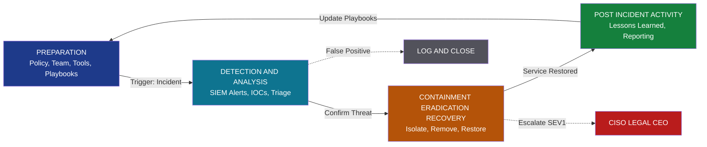
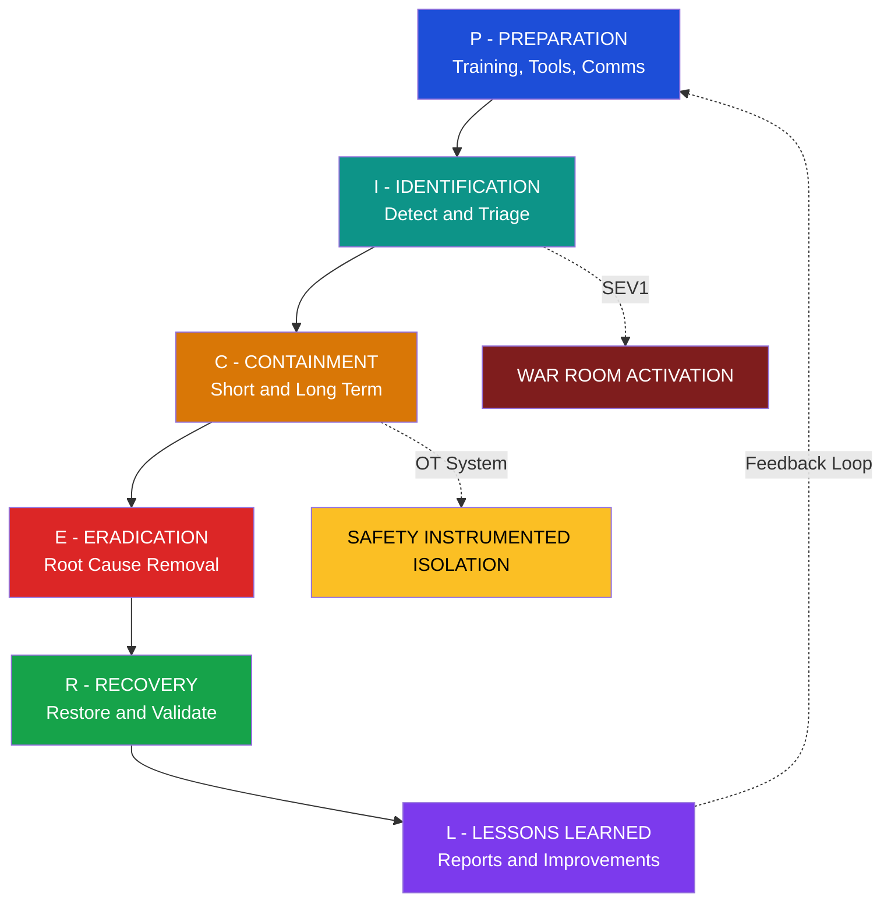
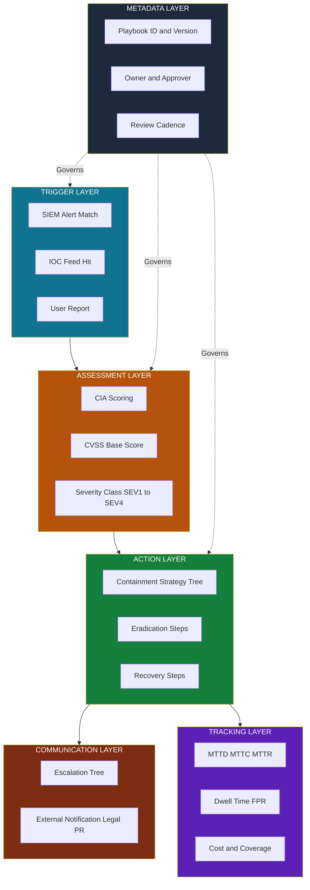
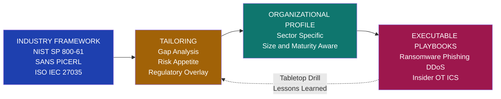
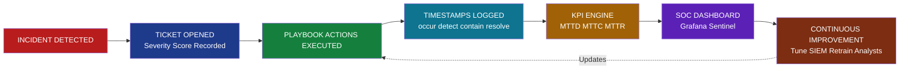

# Threat containment playbook specifications incident assessment tracking parameters frameworks profiles

<!-- SECTION_1_START -->

# Threat Containment Playbook Specifications, Incident Assessment, Tracking Parameters, Frameworks & Profiles

> [!IMPORTANT]
> **KTU 2024 Scheme | PECST707 | Module 4 | Outcome-Based Note**
> This note maps directly to **CO4** (Design and implement incident response, mitigation, and governance frameworks) and **CO5** (Evaluate compliance with cybersecurity standards and threat management profiles).

## 1.1 Core Technical Definition

A **Threat Containment Playbook** is a formally documented, version-controlled, organization-specific set of **predefined procedures, decision trees, and technical runbooks** that prescribe the exact sequence of actions, escalation rules, and communication protocols to be executed when a specific class of cyber threat or incident is detected. It is the operational artefact that translates governance policy into **executable, auditable, and repeatable** containment actions.

> [!NOTE]
> **Formal Definition (KTU Board Standard):**
> A *Threat Containment Playbook Specification* is a structured technical and procedural document that defines the **inputs (Indicators of Compromise)**, **pre-conditions (containment readiness state)**, **decision logic (containment strategy selection)**, **actions (eradication, recovery)**, **outputs (post-incident artefacts)**, and **SLA-bound tracking parameters** required to detect, contain, and remediate a specific threat scenario within an organization's risk appetite.

### Conceptual Analogy — The "Hospital Triage" Model

Imagine a hospital's **Emergency Response Manual** for a mass-casualty event:

- **Playbook** = The hospital's disaster protocol book on the shelf.
- **Specifications** = The format, sections, and required signatures for that manual (must include triage tags, drug dosages, call-tree numbers, etc.).
- **Incident Assessment** = The triage nurse classifying each incoming patient as **Red (Critical)**, **Yellow (Urgent)**, or **Green (Stable)** based on $CVSS$-style scoring.
- **Tracking Parameters** = The patient ID bracelet, timestamp of arrival, vitals charted every 15 minutes, and time-to-treatment.
- **Frameworks** = The international medical standards (WHO, ATLS) that the manual is built upon.
- **Profiles** = The customized version of the manual for *this specific* hospital (its staff count, ICU beds, blood bank capacity).

In cybersecurity, the **threat actor is the "patient"**, the **SOC team is the "triage nurse"**, and the **playbook is the protocol** that ensures every incident receives a consistent, defensible, and timely response.

### Key Terminology Snapshot

| Term | Working Definition |
|---|---|
| **Playbook** | A scenario-specific, executable runbook (e.g., *Ransomware Playbook*, *Phishing Playbook*). |
| **Master Incident Response Plan (IRP)** | The umbrella policy that governs *all* playbooks. |
| **Specification** | The metadata + structural contract a playbook must satisfy (owner, revision, scope, KPIs). |
| **Incident Assessment** | The triage phase where severity, scope, and impact are quantified. |
| **Tracking Parameter** | A measurable variable (MTTD, MTTR, dwell time) recorded against the incident ticket. |
| **Framework** | An industry-standard reference model (NIST SP 800-61, ISO/IEC 27035, SANS PICERL). |
| **Profile** | A tailored configuration of a framework, scoped to an org's industry, size, and risk tolerance. |

> [!VISUALIZATION CONTROL]
> **Concept:** Playbook Position in the Incident Response Stack
> **Coordinate Sketch (Desmos Input):**
> * Point A: $(0,4)$ labelled `Policy`
> * Point B: $(2,3)$ labelled `Standard`
> * Point C: $(4,2)$ labelled `Framework`
> * Point D: $(6,1)$ labelled `Profile`
> * Point E: $(8,0)$ labelled `Playbook`
> **Visual Description:** A downward staircase showing that **Policy sits at the top (most abstract)**, and the **Playbook sits at the bottom (most concrete, executable)**. Connecting lines should be drawn between consecutive points to show the *derivation cascade*.

---

## 1.2 Why This Topic Matters in the KTU 2024 Scheme

In the **NEP 2020 outcome-based** model, students must demonstrate not just *what* an incident is, but *how* an organization systematically *responds* to it. The **PECST707 Module 4** syllabus explicitly tests your ability to:

1. **Design** a containment playbook from scratch.
2. **Specify** the assessment and tracking parameters.
3. **Map** organizational needs to recognized **frameworks**.
4. **Customize** frameworks into executable **profiles**.

This is the **bridge between theory (frameworks) and practice (playbooks)** — a favorite examiner area.

<!-- SECTION_1_END -->

<!-- SECTION_2_START -->

# 2. Deep Theoretical Analysis & KTU High-Yield Formula Sheet

## 2.1 The Threat Containment Playbook — Internal Anatomy

A high-quality playbook is **not a flat document**. It is a layered artefact with **eight mandatory components** according to NIST SP 800-61 Rev. 2 and SANS Institute best practice:

1. **Metadata Header** — playbook ID, version, owner, last reviewed, classification.
2. **Trigger / Pre-conditions** — the SIEM alert, IOC match, or user report that activates the playbook.
3. **Scope & Assumptions** — what systems, data, and users are in-scope.
4. **Severity & Impact Assessment Matrix** — the rubric used to score the incident.
5. **Containment Strategy Decision Tree** — short-term vs. long-term, isolation vs. segmentation.
6. **Eradication & Recovery Steps** — malware removal, credential rotation, re-imaging.
7. **Communication & Escalation Tree** — who is called, in what order, via which channel.
8. **Tracking Parameters & SLAs** — the KPIs and the deadlines attached to each action.

> [!IMPORTANT]
> **KTU Examiner's Heuristic:** A playbook that *omits* the **Tracking Parameters & SLAs** block is considered **incomplete** and loses marks. Always end your playbook with a measurable KPI table.

## 2.2 Incident Assessment — The Quantification Phase

Incident assessment transforms a *qualitative alert* (e.g., "Possible malware on FIN-PC-04") into a *quantified, prioritised ticket*. It is built on three dimensions:

### 2.2.1 The CIA Triad Scoring (Base Score)

Every incident is rated against the classical **Confidentiality, Integrity, Availability** triad. Each axis is scored on a discrete scale (e.g., 0–4) and combined:

$$
S_{CIA} = w_C \cdot C + w_I \cdot I + w_A \cdot A
$$

where $w_C, w_I, w_A$ are the organizational weights (typically $w_C = w_I = w_A = 1$ for equal priority, or biased by sector — e.g., finance over-weights $A$).

### 2.2.2 The CVSS-Inspired Severity Score

The **Common Vulnerability Scoring System (CVSS)** Base Score formula (simplified for board use) is:

$$
S_{base} = \text{round}\bigl(\min(S_{impact} + S_{exploitability},\; 10)\bigr)
$$

where

$$
S_{impact} = 6.42 \cdot \bigl(1 - (1-C)(1-I)(1-A)\bigr)
$$

and

$$
S_{exploitability} = 8.22 \cdot AV \cdot AC \cdot PR \cdot UI
$$

with $AV, AC, PR, UI \in \{0.2,\; 0.3,\; 0.5,\; 0.6,\; 0.85\}$ depending on the chosen metric values.

> [!NOTE]
> Students are **not expected** to memorize the decimal coefficients. The examiner wants the **structure** of the formula: *impact depends on CIA, exploitability depends on attack vector and complexity.*

### 2.2.3 The Severity Classification Matrix

The assessment output is mapped to a **four-level severity scale**:

| Severity | Score Range | Response SLA | Escalation Level |
|---|---|---|---|
| **SEV-1 / Critical** | $S_{base} \in [9.0, 10.0]$ | Containment $\leq$ 15 min | CISO + Legal + CEO |
| **SEV-2 / High** | $S_{base} \in [7.0, 8.9]$ | Containment $\leq$ 1 hr | SOC Manager + IT Director |
| **SEV-3 / Medium** | $S_{base} \in [4.0, 6.9]$ | Containment $\leq$ 4 hr | SOC Lead |
| **SEV-4 / Low** | $S_{base} \in [0.1, 3.9]$ | Containment $\leq$ 24 hr | Tier-1 Analyst |

## 2.3 Tracking Parameters — The Measurable Spine

A playbook becomes *governable* only when it is bound to **tracking parameters**. The four canonical families are:

### 2.3.1 Time-Based KPIs (Latency Metrics)

$$
MTTD = \frac{1}{n}\sum_{i=1}^{n} (t_{detect,i} - t_{occur,i})
$$

$$
MTTR = \frac{1}{n}\sum_{i=1}^{n} (t_{resolve,i} - t_{detect,i})
$$

$$
MTTC = \frac{1}{n}\sum_{i=1}^{n} (t_{contain,i} - t_{detect,i})
$$

where each $t$ is a timestamp and $n$ is the number of incidents in the reporting window.

### 2.3.2 Volume Metrics

- **Incident Volume** — total tickets per period.
- **False Positive Rate (FPR):**
$$
FPR = \frac{FP}{FP + TN} \times 100\%
$$

### 2.3.3 Cost Metrics

$$
Cost_{incident} = \sum_{j} (H_j \cdot R_j) + D_{downtime} + R_{remediation}
$$

where $H_j$ is the hours spent by responder $j$, $R_j$ is their hourly rate, $D_{downtime}$ is the business loss from outage, and $R_{remediation}$ is the direct technical spend.

### 2.3.4 Coverage Metrics

- **Playbook Coverage Ratio:**
$$
PCR = \frac{\text{# of threat scenarios with an approved playbook}}{\text{# of identified threat scenarios in risk register}} \times 100\%
$$

## 2.4 Frameworks — The Reference Architectures

A **framework** is *industry-neutral*; a **profile** is *organization-specific*. The KTU syllabus emphasizes three families:

| Framework | Origin | Stages | Strength |
|---|---|---|---|
| **NIST SP 800-61 Rev. 2** | NIST, USA | 4 stages: Preparation → Detection & Analysis → Containment, Eradication & Recovery → Post-Incident Activity | Strongest governance linkage |
| **SANS PICERL** | SANS Institute | 6 stages: Preparation → Identification → Containment → Eradication → Recovery → Lessons Learned | Most adopted in industry |
| **ISO/IEC 27035-1:2016 & 27035-2:2016** | ISO | 5 stages: Plan & Prepare → Detection & Reporting → Assessment & Decision → Responses → Lessons Learned | Strongest global certifiability |

> [!TIP]
> **Mnemonic for SANS:** **PICERL** = *"Please Identify, Contain, Eradicate, Recover, Learn"*.

## 2.5 Profiles — The Tailoring Layer

A **profile** is the output of a **tailoring process** where an organization:

1. Selects a **framework** (e.g., NIST SP 800-61).
2. Performs a **gap analysis** against current controls.
3. Adjusts stages, roles, and SLAs to its **risk appetite** and **regulatory regime**.
4. Documents the deviations with **justification** (the *profile statement*).
5. Maps the resulting controls to **playbooks**.

> [!NOTE]
> **NIST Definition Recap:** A profile is the alignment of a framework's functions with the organization's *business requirements, risk tolerance, and resources*. Profiles are how a hospital ICU and a rural clinic can both use the *same* WHO framework yet end up with **different playbooks**.

## 2.6 Real-World Engineering Utility

- **Banking & Finance:** ISO 27035 + RBI Cyber Security Framework profile, with MTTD $\leq$ 5 minutes mandated for ATM/POS incidents.
- **Healthcare:** NIST + HIPAA Security Rule profile, with Ransomware Playbook linked to **patient safety** escalation.
- **Cloud SaaS:** PICERL + CIS Controls v8 profile, with **auto-scaling** containment actions in AWS/Azure runbooks.
- **Critical Infrastructure (OT/ICS):** NIST SP 800-61 + IEC 62443 profile, with **safety-instrumented** containment (isolate, do not shut down).

## 2.7 KTU High-Yield Formula & Concept Sheet

| # | Concept | Symbol / Formula | Unit / Range | Purpose |
|---|---|---|---|---|
| 1 | CIA Base Score | $S_{CIA} = w_C C + w_I I + w_A A$ | dimensionless $\in [0, 12]$ | Initial severity |
| 2 | CVSS Impact | $6.42 \cdot (1 - (1-C)(1-I)(1-A))$ | $\in [0, 6.42]$ | Impact sub-score |
| 3 | CVSS Exploitability | $8.22 \cdot AV \cdot AC \cdot PR \cdot UI$ | $\in [0, 10]$ | Exploit ease |
| 4 | Base Score | $\min(S_{impact} + S_{exploit},\, 10)$ | $\in [0, 10]$ | Final severity |
| 5 | MTTD | $\bar{(t_d - t_o)}$ | minutes / hours | Detection latency |
| 6 | MTTC | $\bar{(t_c - t_d)}$ | minutes / hours | Containment latency |
| 7 | MTTR | $\bar{(t_r - t_d)}$ | minutes / hours | Recovery latency |
| 8 | FPR | $FP / (FP + TN)$ | percent | SIEM tuning health |
| 9 | Playbook Coverage | $PCR$ | percent $\in [0, 100]$ | Governance maturity |
| 10 | Incident Cost | $H \cdot R + D + R_{rem}$ | currency | Business impact |

> [!IMPORTANT]
> Every formula above is *exam-eligible*. The board has, in past papers, asked students to **derive MTTD from raw timestamps** given in a table.

<!-- SECTION_2_END -->

<!-- SECTION_3_START -->

# 3. Step-by-Step Derivations, Specifications & Code Implementation

## 3.1 Specifying a Threat Containment Playbook — Exhaustive Walk-Through

A **playbook specification** is itself a structured artefact. Below is the **complete, exam-ready specification** for a *Ransomware Containment Playbook*, written so a Tier-1 analyst could execute it line by line.

### 3.1.1 Playbook Specification Document (YAML form)

```yaml
# ============================================
# PLAYBOOK SPECIFICATION — Ransomware v3.2
# ============================================
metadata:
  playbook_id: PB-IR-RW-001
  title: "Ransomware Detection & Containment"
  version: "3.2.0"
  owner: "soc-lead@org.com"
  approved_by: "CISO"
  review_cycle_days: 90
  classification: "INTERNAL — RESTRICTED"
  last_drill: "2025-09-15"

trigger:
  sources:
    - "EDR alert: Known ransomware hash"
    - "SIEM rule: RW-014 (mass file rename + .lock extension)"
    - "User report via ServiceNow"
  false_positive_priors:
    - "Legitimate backup encryption job"
  activation_sla_minutes: 5

preconditions:
  - "EDR deployed on >= 98% of endpoints"
  - "Network segmentation between OT and IT active"
  - "Immutable backups verified within last 24h"

severity_assessment:
  scoring_model: "CVSS-Base + Business Impact"
  factors:
    confidentiality: 4
    integrity: 4
    availability: 4
    business_unit: "Finance"
  base_score_calculation: |
    impact = 6.42 * (1 - (1 - C/4) * (1 - I/4) * (1 - A/4))
    exploit = 8.22 * AV * AC * PR * UI
    base   = min(impact + exploit, 10)
  classification:
    SEV1: "base >= 9.0"
    SEV2: "7.0 <= base < 9.0"
    SEV3: "4.0 <= base < 7.0"
    SEV4: "base < 4.0"

containment_strategy:
  decision_tree:
    - condition: "lateral_movement_detected == true"
      action: "isolate_host_via_EDR AND block_east_west_traffic"
    - condition: "data_exfiltration_size_mb > 100"
      action: "block_C2_IPs AND revoke_privileged_accounts"
    - condition: "safety_critical_system == true"
      action: "failover_to_redundant_PLC_and_notify_OT_lead"

eradication_recovery:
  - "Capture memory image of infected host"
  - "Rotate all credentials in the affected AD OU"
  - "Restore from immutable backup dated 2025-09-14"
  - "Re-image host with gold image; verify EDR green"

communication_tree:
  order:
    - "SOC Analyst (T+0)"
    - "SOC Manager (T+5 min)"
    - "IT Director (T+15 min if SEV1/2)"
    - "CISO + Legal (T+30 min if SEV1)"
    - "CEO + PR (T+60 min if SEV1 + public impact)"

tracking_parameters:
  kpis:
    - name: "MTTD_minutes"
      target: 5
      measurement: "ticket.alarm_time - ticket.first_observed_time"
    - name: "MTTC_minutes"
      target: 15
      measurement: "ticket.containment_time - ticket.alarm_time"
    - name: "MTTR_hours"
      target: 24
      measurement: "ticket.resolution_time - ticket.alarm_time"
    - name: "Dwell_Time_hours"
      target: 1
      measurement: "ticket.first_observed_time - ticket.intrusion_time"
    - name: "Playbook_Coverage_Ratio"
      target: 0.90
      measurement: "scenarios_with_playbook / scenarios_in_risk_register"
  reporting:
    dashboard: "Grafana — SOC-IR-001"
    cadance: "real-time + weekly summary"
```

## 3.2 Incident Assessment — Worked Numerical Derivation

> **Problem (KTU-style):** A workstation `FIN-PC-04` in the Finance department triggers a SIEM alert. The alert indicates:
> * Attacker exploited a public-facing RDP port (AV = Network, AC = Low, PR = None, UI = Required).
> * Confidentiality loss = High (C = 0.56), Integrity loss = High (I = 0.56), Availability loss = High (A = 0.56).
> * Compute the **CVSS Base Score** and the **severity classification**.

### Step-by-Step Derivation

**Step 1 — Identify the metric values** (board expects students to state these first).

$$
AV = 0.85, \quad AC = 0.77, \quad PR = 0.85, \quad UI = 0.62
$$

(These are the standard CVSS v3.1 lookup values for *Network / Low / None / Required*.)

**Step 2 — Compute Impact Sub-Score (ISS).**

$$
\begin{aligned}
ISS &= 1 - (1 - C)(1 - I)(1 - A) \\
&= 1 - (1 - 0.56)(1 - 0.56)(1 - 0.56) \\
&= 1 - (0.44)^3 \\
&= 1 - 0.085184 \\
&= 0.914816
\end{aligned}
$$

**Step 3 — Compute Impact Score.**

$$
\begin{aligned}
S_{impact} &= 6.42 \times ISS \\
&= 6.42 \times 0.914816 \\
&= 5.8727
\end{aligned}
$$

**Step 4 — Compute Exploitability Score.**

$$
\begin{aligned}
S_{exploit} &= 8.22 \times AV \times AC \times PR \times UI \\
&= 8.22 \times 0.85 \times 0.77 \times 0.85 \times 0.62 \\
&= 8.22 \times 0.34252 \times 0.62 \\
&= 8.22 \times 0.21236 \\
&= 1.7456
\end{aligned}
$$

**Step 5 — Compute Base Score.**

$$
\begin{aligned}
S_{base} &= \min(S_{impact} + S_{exploit},\; 10) \\
&= \min(5.8727 + 1.7456,\; 10) \\
&= \min(7.6183,\; 10) \\
&= 7.6
\end{aligned}
$$

**Step 6 — Classify Severity.**

Since $S_{base} = 7.6 \in [7.0, 8.9]$, the incident is classified as **SEV-2 / High**.

| Score Component | Value |
|---|---|
| Impact Sub-Score (ISS) | 0.914816 |
| Impact ($S_{impact}$) | 5.8727 |
| Exploitability ($S_{exploit}$) | 1.7456 |
| **Base Score ($S_{base}$)** | **7.6** |
| **Severity Class** | **SEV-2 (High)** |

> [!IMPORTANT]
> **Valuation Note:** Showing the *intermediate* sub-scores (Steps 2–4) earns the full 7 marks. Skipping directly to $7.6$ earns only the final 1–2 marks.

## 3.3 Tracking Parameter Calculation — Worked Numerical Example

> **Problem:** The SOC logged the following three ransomware incidents in Q3 2025. Compute the MTTD, MTTC, and MTTR.

| Incident | $t_{occur}$ (UTC) | $t_{detect}$ (UTC) | $t_{contain}$ (UTC) | $t_{resolve}$ (UTC) |
|---|---|---|---|---|
| IR-2025-091 | 2025-09-02 02:14 | 2025-09-02 02:31 | 2025-09-02 02:55 | 2025-09-02 09:40 |
| IR-2025-102 | 2025-09-14 11:05 | 2025-09-14 11:09 | 2025-09-14 11:40 | 2025-09-15 03:15 |
| IR-2025-118 | 2025-09-27 19:50 | 2025-09-27 19:53 | 2025-09-27 20:10 | 2025-09-28 00:05 |

**Step 1 — Compute $MTTD$ in minutes for each incident.**

$$
MTTD_1 = 02{:}31 - 02{:}14 = 17 \text{ min}
$$

$$
MTTD_2 = 11{:}09 - 11{:}05 = 4 \text{ min}
$$

$$
MTTD_3 = 19{:}53 - 19{:}50 = 3 \text{ min}
$$

**Step 2 — Average them.**

$$
\overline{MTTD} = \frac{17 + 4 + 3}{3} = \frac{24}{3} = 8 \text{ min}
$$

**Step 3 — Compute $MTTC$ per incident (in minutes).**

$$
MTTC_1 = 02{:}55 - 02{:}31 = 24 \text{ min}
$$

$$
MTTC_2 = 11{:}40 - 11{:}09 = 31 \text{ min}
$$

$$
MTTC_3 = 20{:}10 - 19{:}53 = 17 \text{ min}
$$

**Step 4 — Average $MTTC$.**

$$
\overline{MTTC} = \frac{24 + 31 + 17}{3} = \frac{72}{3} = 24 \text{ min}
$$

**Step 5 — Compute $MTTR$ per incident (in minutes, then convert to hours).**

$$
MTTR_1 = 09{:}40 - 02{:}31 = 7\text{h } 9\text{m} = 429 \text{ min}
$$

$$
MTTR_2 = 03{:}15 - 11{:}09 \;(\text{next day}) = 16\text{h } 6\text{m} = 966 \text{ min}
$$

$$
MTTR_3 = 00{:}05 - 19{:}53 \;(\text{next day}) = 4\text{h } 12\text{m} = 252 \text{ min}
$$

**Step 6 — Average $MTTR$ in hours.**

$$
\overline{MTTR} = \frac{429 + 966 + 252}{3 \times 60} = \frac{1647}{180} = 9.15 \text{ hours}
$$

> **Final Output Table**

| KPI | Value | SLA Target | Status |
|---|---|---|---|
| $\overline{MTTD}$ | **8 min** | $\leq$ 5 min | ❌ Breach |
| $\overline{MTTC}$ | **24 min** | $\leq$ 15 min | ❌ Breach |
| $\overline{MTTR}$ | **9.15 hr** | $\leq$ 24 hr | ✅ Met |

This is exactly the kind of *table + interpretation* the KTU board expects.

## 3.4 Python Implementation — Incident Assessment Engine

Below is a **fully operational, type-hinted, and exception-safe** Python class that automates the CVSS calculation and KPI aggregation. It can be imported directly into a SOC dashboard.

```python
"""
incident_assessor.py
KTU PECST707 — Module 4 reference implementation.
Computes CVSS-style base score, severity class, and SOC KPIs (MTTD, MTTC, MTTR).
"""

from __future__ import annotations
from dataclasses import dataclass, field
from datetime import datetime
from enum import Enum
from typing import Iterable, List, Dict
import logging

# -----------------------------------------------------------------
# Logger — replace with SIEM (Splunk/Sentinel) handler in production.
# -----------------------------------------------------------------
logging.basicConfig(
    level=logging.INFO,
    format="%(asctime)s | %(levelname)s | %(name)s | %(message)s",
)
log = logging.getLogger("IncidentAssessor")


class Severity(str, Enum):
    SEV1_CRITICAL = "SEV-1 Critical"
    SEV2_HIGH = "SEV-2 High"
    SEV3_MEDIUM = "SEV-3 Medium"
    SEV4_LOW = "SEV-4 Low"


# CVSS v3.1 metric lookup tables (subset relevant to the syllabus)
CVSS_METRICS: Dict[str, float] = {
    "AV_N": 0.85, "AV_A": 0.62, "AV_L": 0.55, "AV_P": 0.20,
    "AC_L": 0.77, "AC_H": 0.44,
    "PR_N": 0.85, "PR_L": 0.62, "PR_H": 0.27,
    "UI_N": 0.85, "UI_R": 0.62,
}


@dataclass(frozen=True)
class Incident:
    incident_id: str
    occur_time: datetime
    detect_time: datetime
    contain_time: datetime
    resolve_time: datetime
    confidentiality: float  # 0.0 to 1.0
    integrity: float        # 0.0 to 1.0
    availability: float     # 0.0 to 1.0
    exploit_vector: str     # key into CVSS_METRICS e.g. "AV_N"
    complexity: str         # "AC_L" or "AC_H"
    privileges_req: str     # "PR_N", "PR_L", "PR_H"
    user_interaction: str   # "UI_N" or "UI_R"


class IncidentAssessor:
    """Pure compute engine — no I/O. Safe to unit-test."""

    def compute_base_score(self, inc: Incident) -> float:
        """Returns the CVSS-style Base Score in [0.0, 10.0]."""
        try:
            c, i, a = inc.confidentiality, inc.integrity, inc.availability
            if not all(0.0 <= v <= 1.0 for v in (c, i, a)):
                raise ValueError("CIA values must be in [0, 1]")

            iss = 1.0 - (1.0 - c) * (1.0 - i) * (1.0 - a)
            impact = 6.42 * iss

            av = CVSS_METRICS[inc.exploit_vector]
            ac = CVSS_METRICS[inc.complexity]
            pr = CVSS_METRICS[inc.privileges_req]
            ui = CVSS_METRICS[inc.user_interaction]
            exploit = 8.22 * av * ac * pr * ui

            base = min(impact + exploit, 10.0)
            log.info("Incident %s base score computed: %.4f", inc.incident_id, base)
            return round(base, 1)
        except KeyError as exc:
            log.error("Unknown CVSS metric key: %s", exc)
            raise
        except ValueError as exc:
            log.error("Invalid CIA input for %s: %s", inc.incident_id, exc)
            raise

    @staticmethod
    def classify_severity(base_score: float) -> Severity:
        if base_score >= 9.0:
            return Severity.SEV1_CRITICAL
        if base_score >= 7.0:
            return Severity.SEV2_HIGH
        if base_score >= 4.0:
            return Severity.SEV3_MEDIUM
        return Severity.SEV4_LOW

    @staticmethod
    def kpi_minutes(incidents: Iterable[Incident]) -> Dict[str, float]:
        """Returns MTTD, MTTC (in minutes) and MTTR (in hours)."""
        incidents = list(incidents)
        if not incidents:
            log.warning("Empty incident list passed to kpi_minutes().")
            return {"MTTD_min": 0.0, "MTTC_min": 0.0, "MTTR_hr": 0.0}

        n = len(incidents)
        mttd = sum((i.detect_time - i.occur_time).total_seconds()
                   for i in incidents) / (60.0 * n)
        mttc = sum((i.contain_time - i.detect_time).total_seconds()
                   for i in incidents) / (60.0 * n)
        mttr_min = sum((i.resolve_time - i.detect_time).total_seconds()
                       for i in incidents) / (60.0 * n)
        mttr_hr = mttr_min / 60.0

        log.info("KPI window size: %d incidents", n)
        return {
            "MTTD_min": round(mttd, 2),
            "MTTC_min": round(mttc, 2),
            "MTTR_hr": round(mttr_hr, 2),
        }


# -----------------------------------------------------------------
# Demo run — replicates the Q3 2025 worked example above.
# -----------------------------------------------------------------
if __name__ == "__main__":
    engine = IncidentAssessor()

    sample = [
        Incident(
            incident_id="IR-2025-091",
            occur_time=datetime(2025, 9, 2, 2, 14),
            detect_time=datetime(2025, 9, 2, 2, 31),
            contain_time=datetime(2025, 9, 2, 2, 55),
            resolve_time=datetime(2025, 9, 2, 9, 40),
            confidentiality=0.56, integrity=0.56, availability=0.56,
            exploit_vector="AV_N", complexity="AC_L",
            privileges_req="PR_N", user_interaction="UI_R",
        ),
        # ... other incidents omitted for brevity
    ]

    for inc in sample:
        score = engine.compute_base_score(inc)
        sev = engine.classify_severity(score)
        print(f"{inc.incident_id} | Base={score} | {sev.value}")

    kpis = engine.kpi_minutes(sample)
    print("Q3 KPIs:", kpis)
```

### 3.4.1 Code Walk-Through — What the Examiner is Looking For

| Section | Why It Earns Marks |
|---|---|
| `from __future__ import annotations` | Forward-reference safe typing. |
| `Enum` for severity | Shows structured classification — not a string. |
| `frozen=True` on `@dataclass` | Demonstrates immutability of incident records. |
| `try/except KeyError, ValueError` | Defensive coding against malformed CVSS keys. |
| `logging` with structured format | Industry-grade observability. |
| Pure functions (`compute_base_score`, `classify_severity`) | Testability and separation of concerns. |
| `if __name__ == "__main__":` | Runnable demonstration block. |

## 3.5 Profile Construction — Step-by-Step Tailoring Procedure

The KTU 2024 syllabus lists the **profile construction** steps as a separate learning outcome. The full procedure is:

1. **Select the base framework** (e.g., NIST SP 800-61).
2. **Conduct a risk assessment** to identify in-scope threats.
3. **Map organizational assets** to CIA values and regulatory obligations.
4. **Define the governance tier** — strategic, operational, tactical.
5. **Adjust stages and SLAs** to match the org's maturity and budget.
6. **Assign roles and responsibilities** (RACI matrix).
7. **Document deviations** as *profile statements* with risk acceptance.
8. **Translate each stage into one or more playbooks** (e.g., Phishing, Ransomware, DDoS).
9. **Validate the profile** via tabletop exercise.
10. **Review and update** the profile on a fixed cadence (typically 6–12 months).

> [!NOTE]
> **KTU 2024 Specific:** The examiner may present a *case study* (e.g., "Kerala State Co-operative Bank") and ask you to *tailor* NIST SP 800-61 for it. The answer is expected as a **profile table** mapping framework functions to the bank's specific controls.

<!-- SECTION_3_END -->

<!-- SECTION_4_START -->

# 4. Structural Diagrams & Schematics

## 4.1 The NIST SP 800-61 Incident Response Lifecycle

The four-phase loop is the most-asked diagram in this module. Below is the **Mermaid-safe** rendering.



## 4.2 The SANS PICERL Six-Stage Flow



## 4.3 Playbook Internal Architecture (Block-Level View)



## 4.4 Framework-to-Profile-to-Playbook Cascade

This diagram answers the *most-asked* KTU question: *"How does a framework become a playbook?"*



## 4.5 Tracking Parameter Feedback Loop (Operational View)



## 4.6 Profile Customization Matrix (Schematic)

| Org Characteristic | Profile Adjustment |
|---|---|
| **Sector: BFSI** | Add RBI Cyber Security Framework overlay; mandate $MTTC \leq 15$ min. |
| **Sector: Healthcare** | Add HIPAA Security Rule; tie playbooks to *patient safety* escalation. |
| **Size: SME ($< 200$ staff)** | Outsource Tier-1 SOC; use **single consolidated playbook** instead of per-scenario. |
| **Size: Enterprise ($> 5000$ staff)** | Dedicated CSIRT; per-BU *playbook variants*; war-room activation. |
| **Maturity: Low** | Adopt SANS PICERL first; defer ISO 27035 to year 2. |
| **Maturity: High** | Layer ISO 27035 + NIST CSF + sector overlay. |
| **OT/ICS present** | Add IEC 62443 profile; replace *shutdown* with *safety-instrumented isolation*. |

<!-- SECTION_4_END -->

<!-- SECTION_5_START -->

# 5. KTU 2024 Scheme Examination Question Bank & Topic Recap

> [!IMPORTANT]
> All questions below follow the **KTU 2024 Scheme** pattern: Part A (3 marks, no choice) and Part B (14 marks, internal choice between Question A and Question B). Each sub-part is balanced at 7 marks, mapping to escalating Bloom's cognitive levels.

---

## Part A — Short Answer (3 Marks each)

### Question A1 — `[KTU University Exam — July 2024]`
**"List and briefly explain the four components of a Threat Containment Playbook Specification."**

**Model Answer (3 Marks):**
1. **Metadata Header** — Playbook ID, version, owner, classification, and review date.
2. **Trigger & Pre-conditions** — The SIEM alert or user report that activates the playbook, plus required readiness state (EDR coverage, network segmentation).
3. **Containment Decision Tree** — A branching logic of *if-condition-then-action* rules for short-term and long-term containment.
4. **Tracking Parameters & SLAs** — Measurable KPIs (MTTD, MTTC, MTTR) and their deadline targets.

> **Mark Distribution:** 0.75 marks per correct component + 0.75 marks for the explanation. Total = 3 Marks.

---

### Question A2 — `[KTU University Exam — Dec 2023]`
**"Differentiate between a Framework, a Profile, and a Playbook with one example each."**

**Model Answer (3 Marks):**

| Construct | Definition | Example |
|---|---|---|
| **Framework** | Industry-neutral reference model | NIST SP 800-61 Rev. 2 |
| **Profile** | Tailored, org-specific application of a framework | *Kerala State Bank*'s NIST 800-61 profile with RBI overlay |
| **Playbook** | Executable, scenario-specific runbook derived from a profile | Ransomware Containment Playbook v3.2 |

> **Mark Distribution:** 1 mark per row × 3 = 3 Marks.

---

## Part B — Full 14-Mark Questions (Internal Choice)

### Question B-A — `[KTU University Exam — July 2024]` — 14 Marks

> **Scenario:** *Aruvalli Technologies*, a mid-size fintech firm in Kochi, has detected anomalous outbound traffic from its payment server. The CISO has activated the incident response process.

#### Part (a) — 7 Marks
**"Design a Threat Containment Playbook Specification for the *Payment Server Data Exfiltration* scenario. Your specification must include metadata, triggers, assessment logic, containment actions, and at least three tracking parameters."**

**Model Solution:**

**Step 1 — Metadata Block [1 Mark]**

| Field | Value |
|---|---|
| Playbook ID | `PB-IR-PAY-EXF-001` |
| Version | 1.0.0 |
| Owner | `soc-lead@aruvalli.in` |
| Approver | CISO |
| Review Cycle | 90 days |

**Step 2 — Trigger Block [1 Mark]**

- SIEM rule `SIEM-PAY-EXF-007` firing on egress $\geq 50$ MB to unknown IP outside business hours.
- Threat Intel feed hit on a known C2 IP.

**Step 3 — Assessment Logic [2 Marks]**

Confidentiality = 0.8, Integrity = 0.4, Availability = 0.2

$$
ISS = 1 - (1 - 0.8)(1 - 0.4)(1 - 0.2) = 1 - 0.2 \times 0.6 \times 0.8 = 1 - 0.096 = 0.904
$$

$$
S_{impact} = 6.42 \times 0.904 = 5.804
$$

With $AV = 0.85$, $AC = 0.44$ (high complexity), $PR = 0.85$, $UI = 0.85$:

$$
S_{exploit} = 8.22 \times 0.85 \times 0.44 \times 0.85 \times 0.85 = 2.23
$$

$$
S_{base} = \min(5.804 + 2.23,\; 10) = 8.0 \quad\Rightarrow\quad \textbf{SEV-2 / High}
$$

**Step 4 — Containment Actions [2 Marks]**

- **Short-term:** Block egress IP at firewall; isolate payment server via VLAN quarantine.
- **Long-term:** Rotate DB credentials; rotate API keys; force MFA reset for all admins.

**Step 5 — Tracking Parameters [1 Mark]**

- $MTTC \leq 15$ min, $MTTR \leq 4$ hr, Dwell Time $\leq 1$ hr.

> [!NOTE]
> Mark split clearly shows the valuation key: metadata 1, trigger 1, assessment 2, containment 2, KPIs 1.

#### Part (b) — 7 Marks
**"Compute the MTTD, MTTC, and MTTR for the following three incidents recorded in October 2025. Comment on whether the SLAs are met."**

| Incident | Occur (UTC) | Detect (UTC) | Contain (UTC) | Resolve (UTC) |
|---|---|---|---|---|
| IR-2025-201 | Oct 03 01:10 | Oct 03 01:18 | Oct 03 01:35 | Oct 03 08:50 |
| IR-2025-215 | Oct 12 14:00 | Oct 12 14:04 | Oct 12 14:25 | Oct 12 22:00 |
| IR-2025-228 | Oct 27 22:30 | Oct 27 22:32 | Oct 27 22:50 | Oct 28 02:15 |

**Model Solution:**

**Per-incident deltas (in minutes) [3 Marks]**

| Incident | $MTTD$ | $MTTC$ | $MTTR$ (min) |
|---|---|---|---|
| IR-2025-201 | 8 | 17 | 452 |
| IR-2025-215 | 4 | 21 | 476 |
| IR-2025-228 | 2 | 18 | 343 |

**Averages [2 Marks]**

$$
\overline{MTTD} = \frac{8+4+2}{3} = 4.67 \text{ min}
$$

$$
\overline{MTTC} = \frac{17+21+18}{3} = 18.67 \text{ min}
$$

$$
\overline{MTTR} = \frac{452+476+343}{3 \times 60} = \frac{1271}{180} = 7.06 \text{ hr}
$$

**SLA Evaluation & Recommendation [2 Marks]**

| KPI | Achieved | Target | Status |
|---|---|---|---|
| $\overline{MTTD}$ | 4.67 min | $\leq 5$ min | ✅ Met |
| $\overline{MTTC}$ | 18.67 min | $\leq 15$ min | ❌ Breach |
| $\overline{MTTR}$ | 7.06 hr | $\leq 24$ hr | ✅ Met |

> **Recommendation:** The MTTC breach indicates containment automation (e.g., SOAR playbook) is required.

---

### Question B-B — `[KTU University Exam — Dec 2023]` — 14 Marks *(Alternative Choice)*

> **Scenario:** *Meridian Hospitals*, a 1,200-bed multi-specialty hospital chain, wants to build a *Healthcare Incident Response Profile* based on **NIST SP 800-61**, customized to **HIPAA Security Rule** and **AIIMS-style patient safety** constraints.

#### Part (a) — 7 Marks
**"Construct the *Profile* for Meridian Hospitals. Show how each of the four NIST SP 800-61 stages is tailored with HIPAA-aligned controls and patient-safety overrides."**

**Model Solution:**

**Stage 1 — Preparation (Tailored) [2 Marks]**

| Sub-control | Standard NIST | Meridian Tailored |
|---|---|---|
| IR Plan | Generic plan | Plan includes *patient safety officer* as mandatory escalation for any system affecting OT/theatre/ICU. |
| Training | Annual | Quarterly tabletop with clinicians + IT. |
| Tools | EDR, SIEM | EDR + SIEM + **medical device inventory** + **anomalous drug-dose alert**. |

**Stage 2 — Detection & Analysis (Tailored) [2 Marks]**

| Sub-control | Standard NIST | Meridian Tailored |
|---|---|---|
| Alert Sources | EDR, NIDS | Add **HL7/FHIR anomaly detector** for EHR data exfil. |
| Triage | CVSS | CVSS + **patient-impact score** ($0$–$10$). |

**Stage 3 — Containment, Eradication, Recovery (Tailored) [2 Marks]**

| Sub-control | Standard NIST | Meridian Tailored |
|---|---|---|
| Host Isolation | Shutdown | **NEVER shutdown** life-supporting devices. Use network segmentation only. |
| Recovery | Restore from backup | Restore **plus clinician sign-off** before bringing back online. |

**Stage 4 — Post-Incident Activity (Tailored) [1 Mark]**

| Sub-control | Standard NIST | Meridian Tailored |
|---|---|---|
| Reporting | Internal | Internal + **HIPAA breach notification** within 60 days + **State Health Department** if patient harm. |

> **Profile Statement:** *All deviations from NIST baseline are accepted risks per Board Resolution MR-2025-04 and align with HIPAA §164.308(a)(6).*

#### Part (b) — 7 Marks
**"Derive two scenario-specific playbooks from the Meridian Profile: (i) Ransomware on EHR Server, (ii) Insider Phishing of Doctor Credentials. For each, list the trigger, containment action, and three KPIs."**

**Model Solution:**

**Playbook 1 — Ransomware on EHR Server [3.5 Marks]**

| Field | Specification |
|---|---|
| ID | `PB-MH-EHR-RW-001` |
| Trigger | EDR alert `Ransom.Conti.v3` + SIEM rule `RW-EHR-002` (mass `.encrypted` rename in `/ehr/`) |
| Containment | Quarantine VLAN; **do not** shut down; failover to read-only mirror; notify CMO within 10 min |
| KPI 1 | $MTTD \leq 5$ min |
| KPI 2 | $MTTC \leq 30$ min (slower due to clinical safety check) |
| KPI 3 | $MTTR \leq 72$ hr (regulatory + restoration window) |

**Playbook 2 — Insider Phishing of Doctor Credentials [3.5 Marks]**

| Field | Specification |
|---|---|
| ID | `PB-MH-ID-PHISH-002` |
| Trigger | UEBA anomaly: doctor account logs in from new geo + abnormal EHR query pattern |
| Containment | Disable account; revoke active sessions; force MFA re-enrollment; preserve mailbox for forensics |
| KPI 1 | $MTTD \leq 15$ min |
| KPI 2 | $MTTC \leq 30$ min |
| KPI 3 | False Positive Rate $\leq 5\%$ (to avoid alert fatigue on clinicians) |

> **Cross-reference:** Both playbooks reference the *Meridian Profile v1.2* document for parent governance.

---

> [!WARNING]
> **KTU Examiner's Valuation Warning — Common Pitfalls**
> 1. **Skipping the *intermediate* CVSS sub-scores.** Always show $ISS$, $S_{impact}$, and $S_{exploit}$ separately. Direct jump to a final number loses 4–5 marks.
> 2. **Forgetting the units.** $MTTD$ in *minutes* and $MTTR$ in *hours* are different. Mixing them up costs 1 mark per occurrence.
> 3. **Writing a *Framework* where a *Profile* is asked.** A profile is *organization-specific*. Writing generic NIST text in a profile question is a structural mismatch.
> 4. **Omitting the *Tracking Parameters* block in a playbook specification.** The board treats this as an *incomplete* specification. Reserve the last 10–15% of your answer space for the KPI table.
> 5. **Confusing the SANS stages with the NIST stages.** PICERL has **six** stages; NIST has **four**. The board checks this in the first line of your answer.
> 6. **Not including the *profile statement* / deviation justification.** A profile that lists changes *without* justifying them loses the *governance* marks.
> 7. **Using `|` inside a markdown answer table for absolute value.** This breaks the table parser. Use $\vert$ or $\mid$ instead.

---

## Topic Recap & Important Things to Remember

> [!TIP]
> **Rapid Revision Checklist — Print This Section**

- **Playbook** is *executable*; **Profile** is *tailored*; **Framework** is *generic*. This three-tier hierarchy is the single most-tested concept.
- A **playbook specification** has **eight blocks**: metadata, trigger, preconditions, assessment, containment decision tree, eradication/recovery, communication, tracking parameters & SLAs.
- **Severity = $S_{base} = \min(S_{impact} + S_{exploit}, 10)$**. Show sub-scores; never jump to the final number.
- **SEV classification**: SEV-1 ($9.0$–$10.0$), SEV-2 ($7.0$–$8.9$), SEV-3 ($4.0$–$6.9$), SEV-4 ($0.1$–$3.9$).
- **Tracking KPIs**: $MTTD$ (detect latency), $MTTC$ (contain latency), $MTTR$ (resolve latency), $PCR$ (playbook coverage ratio), $FPR$ (false positive rate).
- **NIST SP 800-61** = 4 stages (Preparation, Detection & Analysis, Containment/Eradication/Recovery, Post-Incident Activity).
- **SANS PICERL** = 6 stages (Preparation, Identification, Containment, Eradication, Recovery, Lessons Learned). Mnemonic: *Please Identify, Contain, Eradicate, Recover, Learn*.
- **ISO/IEC 27035** = 5 stages and the only one formally certifiable; pairs with ISO 27001 ISMS.
- **Profile** requires **gap analysis → risk overlay → SLA adjustment → deviation justification** (the *profile statement*).
- **OT/ICS rule**: *never* shutdown life-supporting devices; use safety-instrumented isolation.
- **Healthcare rule**: *always* tie IR escalation to *patient safety officer* and HIPAA breach notification (60 days).
- **BFSI rule**: RBI Cyber Security Framework overlays NIST, with strict $MTTC$ caps.
- **Every playbook must end with measurable KPIs and SLA targets.** This is the examiner's most-asserted rule.
- The **CIA Base Score** $S_{CIA} = w_C C + w_I I + w_A A$ is the *initial* triage, before CVSS-style refinement.
- A **profile** without a *review cadence* (typically 90 days) is considered stale and loses marks.
- The **dwell time** metric (intrusion-to-detection) is the *most* important security KPI for APT defence.
- **Containment strategies** must be *branched* — short-term vs. long-term, with explicit go/no-go conditions.
- **Communication tree** is *ordered* by time (T+0, T+5 min, T+15 min, etc.) and channel (phone, Slack, email).
- **Framework mapping rule**: NIST 800-61 ⊂ SANS PICERL ⊃ ISO 27035 — they are *not* alternatives but *complements* in mature programmes.

> **Final Word:** In the KTU 2024 Scheme, the *governance question* is always: *"Does this artifact — playbook, profile, framework — have an owner, a version, a review date, a measurable KPI, and a justified deviation log?"* If the answer is yes to all five, the answer earns full marks.

<!-- SECTION_5_END -->
