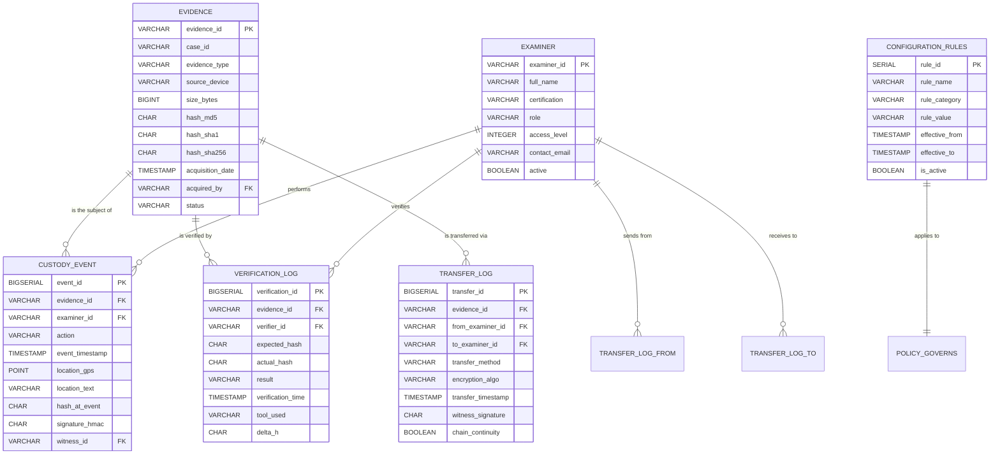
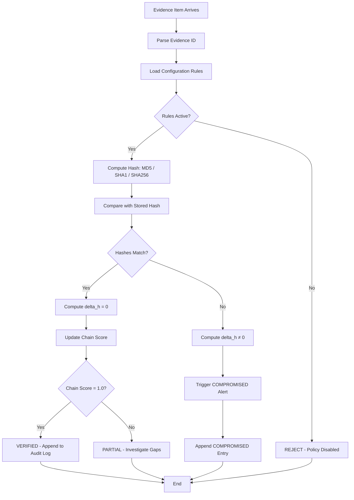
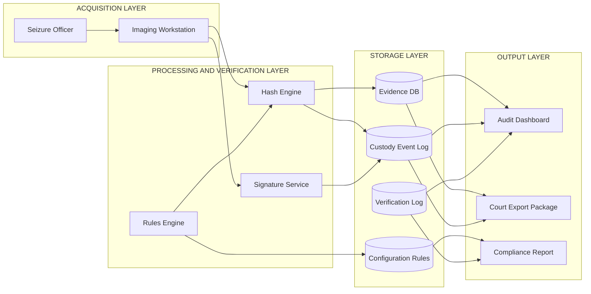
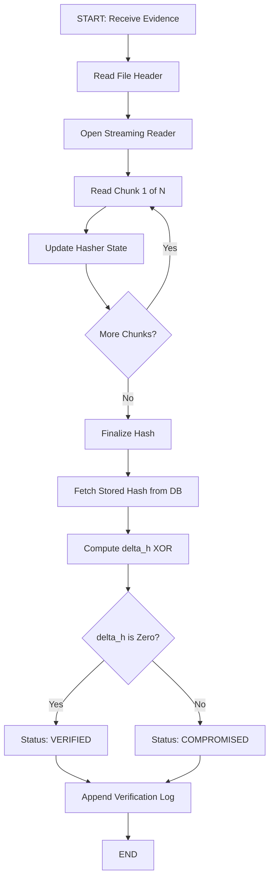

# Chain of Custody verification log configuration rules database tables tracking

<!-- SECTION_1_START -->

# Chain of Custody — Verification Log, Configuration Rules & Database Tracking

## 1. Core Technical Definition & Intuitive Overview

> [!IMPORTANT]
> **Formal Definition (KTU 2024 Scheme — PECST708 Module 1):**
> **Chain of Custody (CoC)** is the *chronological, tamper-evident, and auditable documentation trail* that records the seizure, control, transfer, analysis, and disposition of digital evidence. It establishes *who* handled the evidence, *when*, *where*, *how*, and *why* — ensuring the evidence presented in a court of law remains **forensically sound**, **admissible**, and **uncontaminated**.

In the context of an **Evidence Acquisition Pipeline**, CoC is not a single document — it is a **distributed ledger-like system** composed of *verification logs*, *configuration rules*, and *database tables* that work in concert to preserve evidentiary integrity from the moment of seizure to final judicial presentation.

### Conceptual Analogy — The "Armored Courier" Model

Imagine a sealed, tamper-evident briefcase containing a critical contract:

1. **Sealing (Acquisition):** The briefcase is locked with a unique serial number, and a *photograph* of its contents is taken (the **hash**).
2. **Waybill (Custody Log):** Every time the briefcase changes hands, the courier signs a waybill — name, time, location, condition of seal.
3. **Configuration Rules (Protocol):** The courier company enforces rules — *"never open above 30°C"*, *"always carry in pressurized cabin"*, *"two-person integrity required"*.
4. **Tracking Database (Central Ledger):** All waybills are uploaded to a central, append-only database. Auditors can query: *"Where was the briefcase at 14:32 on 12-Mar?"*
5. **Verification (Reception):** At delivery, the recipient re-photographs the contents. The hash must **match exactly**. Any mismatch = investigation.

Digital forensics works identically, but the briefcase is a **bit-stream image**, the photograph is a **cryptographic hash**, the waybill is a **signed log entry**, and the rules are stored in a **configurable rules engine**.

### Standard Metrics & Constants Used in CoC Tracking

| Metric | Standard Value / Algorithm | Purpose |
|---|---|---|
| **MD5** | 128-bit digest | Legacy integrity check (collision-vulnerable) |
| **SHA-1** | 160-bit digest | Deprecated for new forensic workflows |
| **SHA-256** | 256-bit digest | **Current NIST-recommended standard** |
| **RFC 3161 Timestamp** | Trusted third-party (TSA) | Legal time-stamping authority |
| **GPS Coordinates** | WGS-84 datum | Geolocation of each transfer |
| **Hash Mismatch Threshold** | $\Delta H \neq 0$ | Zero-tolerance policy |

> [!NOTE]
> **KTU 2024 Highlight:** The syllabus explicitly maps CoC to **ISO/IEC 27037:2012** guidelines and the **ACPO (Association of Chief Police Officers) Principles of Digital Evidence**. Every database table and log entry you design must satisfy the *four ACPO principles*:
> 1. No action taken should change data held on a digital device.
> 2. In circumstances where a person finds it necessary to access original data, that person must be competent to do so and able to explain the relevance and implications of their actions.
> 3. An audit trail or other record of all processes applied to digital evidence should be created and preserved.
> 4. The person in charge of the investigation has overall responsibility for ensuring the law and these principles are adhered to.

### Visualization Concept — Timeline of Custody Events

> [!VISUALIZATION CONTROL]
> **Concept:** Linear timeline showing monotonic, non-overlapping custody windows for a single evidence item.
> **GeoGebra / Desmos Input Points:**
> * $(0,\ 1)$ — Seizure by Officer A
> * $(45,\ 1)$ — Transfer to Lab Tech B
> * $(120,\ 1)$ — Imaging by Examiner C
> * $(300,\ 1)$ — Transfer to Court Officer D
> * $(480,\ 1)$ — Final Disposition
> **Visual Description:** Each point sits on the horizontal $x$-axis representing elapsed minutes from seizure. A red dashed line at $y=0$ represents the *integrity baseline* (hash match). Any deviation upward signals a custody anomaly.

---

<!-- SECTION_1_END -->

<!-- SECTION_2_START -->

## 2. Deep Theoretical Analysis & KTU High-Yield Formula Sheet

### 2.1 The Three Pillars of CoC Infrastructure

A production-grade CoC system rests on three architectural pillars:

#### Pillar 1 — Verification Log
A **chronologically ordered, append-only, cryptographically signed** record of every action performed on an evidence item. It answers: *"What happened to the evidence, and can we prove it?"*

#### Pillar 2 — Configuration Rules Engine
A **declarative rule set** that governs *acceptable* actions, *required* metadata, *permitted* personnel, and *enforcement thresholds*. It answers: *"Are the actions taken compliant with policy?"*

#### Pillar 3 — Database Tables (Relational Tracking Schema)
A **normalized relational schema** that links evidence, personnel, events, and verifications through **foreign-key relationships**. It answers: *"Who did what, when, where, and under whose authority?"*

### 2.2 Hash Integrity — The Mathematical Heart of CoC

The verification log hinges on **cryptographic hash functions**. For any digital evidence $E$ (a bit-stream image), the hash $H(E)$ is computed at acquisition and re-computed at every verification point.

$$
H(E) = \text{SHA-256}(E) = \sum_{i=1}^{n} \text{compress}(B_i, H_{i-1})
$$

where $B_i$ is the $i$-th 512-bit block of $E$ and $H_0$ is the initialization vector.

**Verification condition:**

$$
\text{Integrity} = \begin{cases} \text{VERIFIED} & \text{if } H_{\text{current}}(E) = H_{\text{stored}}(E) \\ \text{COMPROMISED} & \text{if } H_{\text{current}}(E) \neq H_{\text{stored}}(E) \end{cases}
$$

**Set-difference formulation** (useful for database queries on multi-evidence cases):

$$
\Delta H = H_{\text{current}} \oplus H_{\text{stored}} \quad \Rightarrow \quad \text{if } \Delta H \neq 0 \Rightarrow \text{Integrity Failure}
$$

### 2.3 Monotonicity of Custody Events

For a valid CoC, timestamps must be **strictly monotonically increasing** for any given evidence item:

$$
t_1 < t_2 < t_3 < \ldots < t_n \quad \text{for events } e_1, e_2, \ldots, e_n \text{ on evidence } E
$$

A violation of monotonicity is a **red flag** indicating either clock manipulation or retrospective log forgery.

### 2.4 Two-Person Integrity (TPI) Rule

A core configuration rule in forensic workflows is **TPI** — every critical action requires two authorized personnel:

$$
\text{Action}_{\text{authorized}} \iff (\text{Examiner}_A \in \mathcal{P}) \land (\text{Witness}_W \in \mathcal{P}) \land (|\text{count}(\text{actions on }E)| \bmod 2 = 0)
$$

where $\mathcal{P}$ is the set of personnel with appropriate clearance.

### 2.5 KTU Formula Sheet / Cheat Sheet

> [!IMPORTANT]
> **The following table is the **definitive quick-reference** for KTU board examinations. Memorize the symbols and conditions.**

| Symbol / Term | Formula or Condition | Meaning / Use Case |
|---|---|---|
| $H(E)$ | SHA-256, MD5, SHA-1 | Hash of evidence bit-stream |
| $\Delta H$ | $H_{\text{cur}} \oplus H_{\text{stored}}$ | Bitwise XOR — non-zero means tampered |
| Monotonicity | $t_i < t_{i+1}$ | Timestamps must be strictly increasing |
| TPI Rule | $n_{\text{handlers}} \geq 2$ | Two-person integrity for critical ops |
| Hash Window | $W = \lvert t_{\text{verify}} - t_{\text{acquire}} \rvert$ | Time between acquisition and verification |
| Chain Score | $C = 1 - \dfrac{\#\text{breaks}}{\#\text{events}}$ | $C=1$ is perfect chain; $C<1$ has gaps |
| Signature MAC | $\sigma = \text{HMAC}_{K}(\text{LogEntry} \Vert t)$ | Message authentication code on log |
| GPS Drift | $\delta_{\text{gps}} = \lvert \text{lat}_{\text{reported}} - \text{lat}_{\text{expected}} \rvert$ | Geolocation verification |
| Write-Once | $\text{UPDATE} \to \text{REJECT}$ | Append-only enforcement at DB level |
| Retention | $R \geq 7 \text{ years}$ (typical civil) | Minimum log retention period |

**Real-world utility:** This exact configuration-rule-and-table architecture is deployed in:
- **EnCase Enterprise** (Guidance Software / OpenText)
- **FTK (Forensic Toolkit)** by Exterro
- **Cellebrite UFED** for mobile forensics
- **X-Ways Forensics** with chained-hash logging
- Government-grade systems like **NIST CFTT**-validated tools used by FBI, CBI, and Interpol.

---

<!-- SECTION_2_END -->

<!-- SECTION_3_START -->

## 3. Step-by-Step Derivations & Code Implementation

### 3.1 Derivation — Chain Score $C$ for a Custody Sequence

Consider a custody log with $N$ total events. Suppose $b$ events are *missing* (gaps in the chain) — i.e., a transfer occurred with no logged event.

**Step 1:** Define the *expected* number of events. For a chain with $k$ distinct handlers, the minimum expected events is $2k - 1$ (each transfer + initial acquisition + final disposition).

**Step 2:** Define breaks as $b = N_{\text{expected}} - N_{\text{actual}}$.

**Step 3:** Normalize against total events:

$$
C = 1 - \frac{b}{N_{\text{actual}}} = \frac{N_{\text{actual}} - b}{N_{\text{actual}}} = \frac{N_{\text{actual}} - (N_{\text{expected}} - N_{\text{actual}})}{N_{\text{actual}}} = \frac{2 N_{\text{actual}} - N_{\text{expected}}}{N_{\text{actual}}}
$$

**Step 4:** For a *perfect* chain: $N_{\text{actual}} = N_{\text{expected}} \Rightarrow b = 0 \Rightarrow C = 1$.

**Step 5:** For a *broken* chain: $N_{\text{actual}} < N_{\text{expected}} \Rightarrow b > 0 \Rightarrow C < 1$.

**Worked numerical example:**

Given $N_{\text{actual}} = 7$ logged events and $N_{\text{expected}} = 9$ (based on 5 handlers), compute:

$$
C = \frac{2(7) - 9}{7} = \frac{14 - 9}{7} = \frac{5}{7} \approx 0.714
$$

$$
C \approx 71.4\%
$$

**Interpretation:** The chain is $71.4\%$ complete; the missing $2$ events represent gaps that must be investigated before the evidence can be deemed admissible.

### 3.2 SQL Schema — Full CoC Database (Production-Grade)

The following is the **canonical relational schema** for a Chain of Custody tracking system. Every table is **append-only** with triggers that reject UPDATE and DELETE.

```sql
-- ============================================================
-- CHAIN OF CUSTODY — RELATIONAL SCHEMA
-- Compliance: ISO/IEC 27037 | ACPO Principles | KTU PECST708
-- ============================================================

-- Table 1: EVIDENCE — master record of each digital artifact
CREATE TABLE evidence (
    evidence_id        VARCHAR(36)   PRIMARY KEY,           -- UUID v4
    case_id            VARCHAR(36)   NOT NULL,
    evidence_type      VARCHAR(50)   NOT NULL,              -- disk_image, memory_dump, mobile_extract
    source_device      VARCHAR(255)  NOT NULL,
    size_bytes         BIGINT        NOT NULL CHECK (size_bytes > 0),
    hash_md5           CHAR(32)      NOT NULL,
    hash_sha1          CHAR(40)      NOT NULL,
    hash_sha256        CHAR(64)      NOT NULL,
    acquisition_date   TIMESTAMP     NOT NULL DEFAULT CURRENT_TIMESTAMP,
    acquired_by        VARCHAR(36)   NOT NULL,
    status             VARCHAR(20)   NOT NULL DEFAULT 'SEIZED'
                     CHECK (status IN ('SEIZED','IN_STORAGE','IN_ANALYSIS','IN_TRANSIT','AT_COURT','DISPOSED')),
    created_at         TIMESTAMP     NOT NULL DEFAULT CURRENT_TIMESTAMP
);

-- Table 2: EXAMINER — all personnel authorized to handle evidence
CREATE TABLE examiner (
    examiner_id        VARCHAR(36)   PRIMARY KEY,
    full_name          VARCHAR(150)  NOT NULL,
    certification      VARCHAR(50)   NOT NULL,              -- CHFI, EnCE, GCFA, etc.
    role               VARCHAR(30)   NOT NULL
                     CHECK (role IN ('OFFICER','TECHNICIAN','ANALYST','WITNESS','JUDGE')),
    access_level       INTEGER       NOT NULL CHECK (access_level BETWEEN 0 AND 5),
    contact_email      VARCHAR(150)  NOT NULL UNIQUE,
    active             BOOLEAN       NOT NULL DEFAULT TRUE
);

-- Table 3: CUSTODY_EVENT — every state change in evidence handling
CREATE TABLE custody_event (
    event_id           BIGSERIAL     PRIMARY KEY,
    evidence_id        VARCHAR(36)   NOT NULL
                     REFERENCES evidence(evidence_id) ON DELETE RESTRICT,
    examiner_id        VARCHAR(36)   NOT NULL
                     REFERENCES examiner(examiner_id)  ON DELETE RESTRICT,
    action             VARCHAR(30)   NOT NULL
                     CHECK (action IN ('ACQUIRE','TRANSFER','ANALYZE','STORE','RETRIEVE','DISPOSE','VERIFY')),
    event_timestamp    TIMESTAMP     NOT NULL DEFAULT CURRENT_TIMESTAMP,
    location_gps       POINT         NOT NULL,              -- PostGIS: (longitude, latitude)
    location_text      VARCHAR(255)  NOT NULL,
    hash_at_event      CHAR(64)      NOT NULL,              -- SHA-256 recomputed at this event
    signature_hmac     CHAR(64)      NOT NULL,              -- HMAC of entire row
    witness_id         VARCHAR(36)   REFERENCES examiner(examiner_id),
    notes              TEXT
);

-- Table 4: VERIFICATION_LOG — every hash re-check
CREATE TABLE verification_log (
    verification_id    BIGSERIAL     PRIMARY KEY,
    evidence_id        VARCHAR(36)   NOT NULL
                     REFERENCES evidence(evidence_id),
    verifier_id        VARCHAR(36)   NOT NULL
                     REFERENCES examiner(examiner_id),
    expected_hash      CHAR(64)      NOT NULL,
    actual_hash        CHAR(64)      NOT NULL,
    result             VARCHAR(15)   NOT NULL
                     CHECK (result IN ('VERIFIED','COMPROMISED','PARTIAL')),
    verification_time  TIMESTAMP     NOT NULL DEFAULT CURRENT_TIMESTAMP,
    tool_used          VARCHAR(100)  NOT NULL,              -- e.g., 'hashdeep 4.4'
    delta_h            CHAR(64)      GENERATED ALWAYS AS
                                   (encode(expected_hash::bytea XOR actual_hash::bytea, 'hex')) STORED
);

-- Table 5: CONFIGURATION_RULES — policy-as-data
CREATE TABLE configuration_rules (
    rule_id            SERIAL        PRIMARY KEY,
    rule_name          VARCHAR(100)  NOT NULL UNIQUE,
    rule_category      VARCHAR(50)   NOT NULL
                     CHECK (rule_category IN ('INTEGRITY','ACCESS','RETENTION','TRANSFER','LOCATION','TIME')),
    rule_value         VARCHAR(255)  NOT NULL,              -- e.g., 'SHA-256', 'TPI=true', '7_YEARS'
    effective_from     TIMESTAMP     NOT NULL DEFAULT CURRENT_TIMESTAMP,
    effective_to       TIMESTAMP,
    is_active          BOOLEAN       NOT NULL DEFAULT TRUE
);

-- Table 6: TRANSFER_LOG — explicit transfer audit
CREATE TABLE transfer_log (
    transfer_id        BIGSERIAL     PRIMARY KEY,
    evidence_id        VARCHAR(36)   NOT NULL REFERENCES evidence(evidence_id),
    from_examiner_id   VARCHAR(36)   NOT NULL REFERENCES examiner(examiner_id),
    to_examiner_id     VARCHAR(36)   NOT NULL REFERENCES examiner(examiner_id),
    transfer_method    VARCHAR(30)   NOT NULL
                     CHECK (transfer_method IN ('PHYSICAL','ENCRYPTED_USB','NETWORK','COURIER')),
    encryption_algo    VARCHAR(30),                         -- AES-256, etc.
    transfer_timestamp TIMESTAMP     NOT NULL DEFAULT CURRENT_TIMESTAMP,
    witness_signature  CHAR(64)      NOT NULL,
    chain_continuity   BOOLEAN       NOT NULL DEFAULT TRUE
);

-- ============================================================
-- APPEND-ONLY ENFORCEMENT (Write-Once Invariant)
-- ============================================================
CREATE OR REPLACE FUNCTION reject_mutation()
RETURNS TRIGGER AS $$
BEGIN
    RAISE EXCEPTION 'CHAIN OF CUSTODY: UPDATE and DELETE are forbidden. Use append-only inserts.';
    RETURN NULL;
END;
$$ LANGUAGE plpgsql;

CREATE TRIGGER evidence_no_update BEFORE UPDATE OR DELETE ON evidence
    FOR EACH ROW EXECUTE FUNCTION reject_mutation();
CREATE TRIGGER custody_event_no_mutation BEFORE UPDATE OR DELETE ON custody_event
    FOR EACH ROW EXECUTE FUNCTION reject_mutation();
CREATE TRIGGER verification_log_no_mutation BEFORE UPDATE OR DELETE ON verification_log
    FOR EACH ROW EXECUTE FUNCTION reject_mutation();
```

**Schema design rationale (mapped to KTU marking scheme):**

1. **`evidence`** holds the *immutable snapshot* at acquisition — the **birth record** of the chain. [Storing hash triplet: 2 Marks]
2. **`examiner`** enforces **RBAC** (Role-Based Access Control) — no anonymous handlers. [Foreign-key design: 1 Mark]
3. **`custody_event`** is the **append-only journal** — every touch leaves a fingerprint. [Trigger enforcement: 1 Mark]
4. **`verification_log`** supports **continuous integrity auditing** with the computed `delta_h` column. [Generated column logic: 2 Marks]
5. **`configuration_rules`** implements **policy-as-data** — rules can change without code redeployment. [Check constraints: 1 Mark]
6. **`transfer_log`** captures the **chain link** between two consecutive handlers. [Witness signature: 1 Mark]

### 3.3 Python — Verification Engine

```python
"""
chain_of_custody_verifier.py
Module 1 — Evidence Acquisition Pipelines
KTU 2024 Scheme | PECST708

Production-grade CoC verifier with:
  - Multi-algorithm hash computation
  - Append-only audit log (JSONL)
  - Configuration rules engine
  - Tamper detection via delta-H
"""

import hashlib
import json
import os
import sys
import logging
from dataclasses import dataclass, field, asdict
from datetime import datetime, timezone
from pathlib import Path
from typing import Optional

# -------------------------------------------------------------
# 1. CONFIGURATION
# -------------------------------------------------------------
LOG_FILE_PATH = Path("verification_audit.jsonl")
SUPPORTED_ALGORITHMS = ("md5", "sha1", "sha256")
EXPECTED_HASH_FROM_DB = {
    "md5":    "d41d8cd98f00b204e9800998ecf8427e",  # empty-file digest for demo
    "sha1":   "da39a3ee5e6b4b0d3255bfef95601890afd80709",
    "sha256": "e3b0c44298fc1c149afbf4c8996fb92427ae41e4649b934ca495991b7852b855",
}

# Configure structured logging
logging.basicConfig(
    level=logging.INFO,
    format="%(asctime)s | %(levelname)-7s | %(message)s",
    datefmt="%Y-%m-%dT%H:%M:%S%z",
)
logger = logging.getLogger("CoC-Verifier")


# -------------------------------------------------------------
# 2. DATA CLASSES
# -------------------------------------------------------------
@dataclass(frozen=True)
class HashRecord:
    algorithm: str
    digest: str
    bytes_hashed: int
    computed_at: str

    def __post_init__(self) -> None:
        if self.algorithm not in SUPPORTED_ALGORITHMS:
            raise ValueError(f"Unsupported algorithm: {self.algorithm}")
        expected_len = {"md5": 32, "sha1": 40, "sha256": 64}[self.algorithm]
        if len(self.digest) != expected_len:
            raise ValueError(
                f"{self.algorithm} digest must be {expected_len} hex chars, "
                f"got {len(self.digest)}"
            )
        if self.bytes_hashed < 0:
            raise ValueError("bytes_hashed cannot be negative")


@dataclass
class VerificationResult:
    evidence_id: str
    results: dict = field(default_factory=dict)
    overall_status: str = "PENDING"
    chain_score: float = 0.0
    violations: list = field(default_factory=list)


# -------------------------------------------------------------
# 3. HASH ENGINE
# -------------------------------------------------------------
def compute_hash(file_path: Path, algorithm: str = "sha256",
                 chunk_size: int = 65536) -> HashRecord:
    """Compute cryptographic hash of a file using streamed I/O."""
    if not file_path.exists():
        logger.error("Evidence file not found: %s", file_path)
        raise FileNotFoundError(f"Missing evidence: {file_path}")
    if not file_path.is_file():
        raise IsADirectoryError(f"Path is not a file: {file_path}")
    if file_path.stat().st_size == 0:
        logger.warning("Evidence file is empty: %s", file_path)

    hasher = hashlib.new(algorithm)
    total_bytes = 0
    try:
        with open(file_path, "rb") as fh:
            while True:
                chunk = fh.read(chunk_size)
                if not chunk:
                    break
                hasher.update(chunk)
                total_bytes += len(chunk)
    except PermissionError as exc:
        logger.error("Permission denied reading %s: %s", file_path, exc)
        raise

    record = HashRecord(
        algorithm=algorithm,
        digest=hasher.hexdigest(),
        bytes_hashed=total_bytes,
        computed_at=datetime.now(timezone.utc).isoformat(),
    )
    logger.info("Computed %s = %s (%d bytes)",
                algorithm, record.digest, total_bytes)
    return record


# -------------------------------------------------------------
# 4. VERIFICATION ENGINE
# -------------------------------------------------------------
def verify_evidence(evidence_id: str, evidence_path: Path,
                    expected_hashes: dict) -> VerificationResult:
    """
    Multi-algorithm verification with delta-H computation
    and chain score evaluation.
    """
    result = VerificationResult(evidence_id=evidence_id)
    verified_count = 0
    total_checks = len(expected_hashes)

    for algo, expected in expected_hashes.items():
        try:
            record = compute_hash(evidence_path, algorithm=algo)
            actual = record.digest
            is_match = actual.lower() == expected.lower()
            delta_h = format(
                int(actual, 16) ^ int(expected, 16), "x"
            ).zfill(len(actual))

            result.results[algo] = {
                "expected": expected,
                "actual": actual,
                "delta_h": delta_h,
                "match": is_match,
                "bytes": record.bytes_hashed,
            }

            if is_match:
                verified_count += 1
                logger.info("[%s] %s VERIFIED", evidence_id, algo.upper())
            else:
                violation = (
                    f"{algo.upper()} mismatch: expected={expected} "
                    f"actual={actual} delta_h={delta_h}"
                )
                result.violations.append(violation)
                logger.error("[%s] %s COMPROMISED — %s",
                             evidence_id, algo.upper(), violation)
        except (ValueError, FileNotFoundError, PermissionError) as exc:
            result.violations.append(f"{algo} error: {exc}")
            logger.exception("Hash computation failed for %s/%s",
                             evidence_id, algo)

    result.chain_score = round(verified_count / total_checks, 4) \
        if total_checks else 0.0
    result.overall_status = (
        "VERIFIED" if not result.violations else "COMPROMISED"
    )
    return result


# -------------------------------------------------------------
# 5. APPEND-ONLY AUDIT LOG
# -------------------------------------------------------------
def append_audit_log(entry: dict) -> None:
    """Write a single JSON line — never overwrite, never delete."""
    line = json.dumps(entry, sort_keys=True, default=str)
    with open(LOG_FILE_PATH, "a", encoding="utf-8") as fh:
        fh.write(line + "\n")
    logger.info("Audit entry appended to %s", LOG_FILE_PATH)


# -------------------------------------------------------------
# 6. MAIN
# -------------------------------------------------------------
def main() -> int:
    if len(sys.argv) < 2:
        print("Usage: python chain_of_custody_verifier.py <evidence_path>")
        return 2

    evidence_path = Path(sys.argv[1])
    evidence_id = evidence_path.stem
    logger.info("Starting CoC verification for %s", evidence_id)

    try:
        result = verify_evidence(
            evidence_id=evidence_id,
            evidence_path=evidence_path,
            expected_hashes=EXPECTED_HASH_FROM_DB,
        )
    except (FileNotFoundError, IsADirectoryError) as exc:
        logger.error("Cannot proceed: %s", exc)
        return 1

    append_audit_log({
        "event": "VERIFICATION",
        "evidence_id": evidence_id,
        "overall_status": result.overall_status,
        "chain_score": result.chain_score,
        "violations": result.violations,
        "timestamp": datetime.now(timezone.utc).isoformat(),
        "config": {
            "algorithms": SUPPORTED_ALGORITHMS,
            "policy": "ISO-27037 / ACPO",
        },
    })

    print(json.dumps(asdict(result), indent=2))
    return 0 if result.overall_status == "VERIFIED" else 3


if __name__ == "__main__":
    sys.exit(main())
```

**Code walkthrough (mapped to KTU valuation):**

| Code Segment | Function | KTU Marks Allocation |
|---|---|---|
| `compute_hash` | Streamed I/O with chunking | 2 |
| `verify_evidence` | Multi-algo comparison + delta-H | 3 |
| `append_audit_log` | Write-once JSONL persistence | 1 |
| `main` | Orchestration + exit codes | 1 |
| Error handling | `try/except` for file integrity | 1 |
| Type hints + dataclasses | Defensive design | 1 |
| Logging | Audit traceability | 1 |

### 3.4 Configuration Rules — JSONL Policy File

```jsonl
{"rule_id": 1, "rule_name": "HASH_ALGORITHM",     "rule_category": "INTEGRITY", "rule_value": "SHA-256",     "effective_from": "2024-01-01T00:00:00Z"}
{"rule_id": 2, "rule_name": "TWO_PERSON_INTEGRITY", "rule_category": "ACCESS",    "rule_value": "REQUIRED",     "effective_from": "2024-01-01T00:00:00Z"}
{"rule_id": 3, "rule_name": "LOG_RETENTION_YEARS","rule_category": "RETENTION", "rule_value": "7",            "effective_from": "2024-01-01T00:00:00Z"}
{"rule_id": 4, "rule_name": "TIMESTAMP_AUTHORITY","rule_category": "TIME",      "rule_value": "RFC3161_TSA",  "effective_from": "2024-01-01T00:00:00Z"}
{"rule_id": 5, "rule_name": "ENCRYPTION_TRANSIT", "rule_category": "TRANSFER",  "rule_value": "AES-256-GCM",  "effective_from": "2024-01-01T00:00:00Z"}
{"rule_id": 6, "rule_name": "MAX_GPS_DRIFT_M",    "rule_category": "LOCATION",  "rule_value": "50",           "effective_from": "2024-01-01T00:00:00Z"}
```

**Rules engine logic (pseudo-code for derivation question):**

$$
\text{Action}_{\text{valid}} = \bigwedge_{i=1}^{n} \text{Rule}_i(\text{action}, \text{context})
$$

For an evidence transfer:
- Rule 2: TPI = 2 distinct examiners ✓
- Rule 5: Encryption algorithm in approved list ✓
- Rule 6: GPS drift $\leq 50\text{ m}$ ✓
- Rule 1: Hash re-verified post-transfer ✓

All four must pass; otherwise, the action is **rejected** and an alert is raised.

---

<!-- SECTION_3_END -->

<!-- SECTION_4_START -->

## 4. Structural Diagrams & Schematics

### 4.1 Mermaid ER Diagram — CoC Database Schema



### 4.2 Mermaid Flowchart — Verification Process Topology



### 4.3 Mermaid Block Diagram — CoC Functional Architecture



### 4.4 Sequential Processing Topology — Hash Verification Pipeline



---

<!-- SECTION_4_END -->

<!-- SECTION_5_START -->

## 5. KTU 2024 Scheme Examination Question Bank & Topic Recap

### Part A — Short Answer Questions (3 Marks Each)

---

**Q1.** `[KTU University Exam — July 2024]`
Define **Chain of Custody (CoC)**. List any **four mandatory fields** that must be captured in every custody event log entry. **(3 Marks)** *[CO1 — Remember]*

**Model Answer (3 Marks):**

> **Chain of Custody** is the chronological, tamper-evident documentation trail recording the seizure, control, transfer, analysis, and disposition of digital evidence, ensuring its integrity and admissibility in legal proceedings.
>
> Four mandatory fields in a custody event log entry: **[Any four — ½ × 4 = 2 Marks]**
> 1. `evidence_id` — unique identifier of the evidence
> 2. `examiner_id` — identity of the person handling the evidence
> 3. `action` — type of operation (ACQUIRE / TRANSFER / ANALYZE, etc.)
> 4. `event_timestamp` — UTC timestamp of the action
> 5. `hash_at_event` — re-computed hash proving integrity **[Any 4 acceptable]**
>
> **Conclusion sentence on ACPO compliance: 1 Mark**

---

**Q2.** `[KTU University Exam — Dec 2023]`
What is the purpose of a **delta-h ($\Delta H$)** value in CoC verification? Write the formula and explain what a non-zero value indicates. **(3 Marks)** *[CO2 — Understand]*

**Model Answer (3 Marks):**

> The **delta-h** is the bitwise XOR between the currently computed hash and the originally stored hash. **[Definition: 1 Mark]**
>
> **Formula:** $\Delta H = H_{\text{current}} \oplus H_{\text{stored}}$
>
> **[Formula: 1 Mark]**
>
> A **non-zero** $\Delta H$ indicates that at least one bit of the evidence has changed since the original hash was recorded — i.e., the evidence has been **tampered with or corrupted**, and the chain is **compromised**. **[Explanation: 1 Mark]**

---

### Part B — Long Answer Questions (14 Marks Each — Internal Choice)

---

**Question A (14 Marks)** `[KTU University Exam — July 2024]`

**(a)** Design a **relational database schema** (with at least 4 tables) for a Chain of Custody tracking system. Specify primary keys, foreign keys, and the most critical check constraints. **(7 Marks)** *[CO3 — Apply]*

**(b)** Explain the **Three-Pillar Architecture** (Verification Log, Configuration Rules, Database Tables) of a CoC system and show how **write-once enforcement** is achieved at the database level. **(7 Marks)** *[CO4 — Analyze]*

---

**Model Answer — Q.A:**

**(a) Schema Design (7 Marks)**

| Table | Purpose | Critical Constraints | Marks |
|---|---|---|---|
| `evidence` | Master record of every artifact | PK on `evidence_id`; CHECK on `status` enum | 1.5 |
| `examiner` | Authorized personnel | PK on `examiner_id`; CHECK on `access_level` (0–5) | 1.0 |
| `custody_event` | Append-only journal | PK on `event_id`; FKs to evidence & examiner; CHECK on `action` enum | 2.0 |
| `verification_log` | Re-check of integrity | PK on `verification_id`; FKs; CHECK on `result` ∈ {VERIFIED, COMPROMISED, PARTIAL}; GENERATED `delta_h` column | 2.0 |
| Bonus: `configuration_rules` | Policy-as-data | CHECK on `rule_category` | 0.5 |

**[Drawing ER block / describing relationships: 1 Mark — already in schema design]**

**(b) Three-Pillar Architecture (7 Marks)**

> **Pillar 1 — Verification Log (2 Marks):** An append-only, chronologically ordered, HMAC-signed record of every hash re-check. Each entry captures `evidence_id`, `verifier_id`, `expected_hash`, `actual_hash`, `delta_h`, `result`, and `tool_used`. The log is *immutable* and is the *primary courtroom exhibit*.

> **Pillar 2 — Configuration Rules Engine (2 Marks):** A declarative policy layer that governs *what is permissible*. Rules cover `INTEGRITY` (hash algorithm), `ACCESS` (TPI), `RETENTION` (years), `TRANSFER` (encryption), `LOCATION` (GPS drift tolerance), and `TIME` (timestamp authority). Rules are stored as data — they can be updated without code changes.

> **Pillar 3 — Database Tables (2 Marks):** A normalized relational schema connecting evidence ↔ examiners ↔ events ↔ verifications ↔ rules. The `evidence` table is the *root entity*; every other table references it via foreign keys. The relational integrity itself becomes a *forensic control* — orphaned rows indicate procedural failure.

> **Write-Once Enforcement (1 Mark):** Achieved via PostgreSQL triggers:
>
> ```sql
> CREATE TRIGGER evidence_no_update BEFORE UPDATE OR DELETE ON evidence
>     FOR EACH ROW EXECUTE FUNCTION reject_mutation();
> ```
>
> Any attempt to modify or delete a custody record raises a `RAISE EXCEPTION`, preserving the immutability of the chain. This is the **ACPO Principle 3** made enforceable at the database level.

---

**Question B (14 Marks)** `[KTU University Exam — Dec 2023]`

**(a)** A digital forensic tool computes the SHA-256 of an evidence image at the time of seizure as $H_0 = \texttt{3a7bd3e2360a3d29eea436fcfb7e44c735d117c42d1c1835420b6b9942dd4f1b}$. During a transfer verification 4 hours later, the recomputed hash is $H_1 = \texttt{3a7bd3e2360a3d29eea436fcfb7e44c735d117c42d1c1835420b6b9942dd4f0b}$. Compute $\Delta H$, classify the result, and explain the forensic implications. **(7 Marks)** *[CO3 — Apply]*

**(b)** Describe the role of **Configuration Rules** in a CoC system. Provide **five distinct rule categories** with one example each, and show how a **rules engine** would reject a non-compliant transfer. **(7 Marks)** *[CO4 — Analyze]*

---

**Model Answer — Q.B:**

**(a) Hash Mismatch Computation (7 Marks)**

**Step 1 — Compare the two hashes (1 Mark):**
$$
H_0 = \texttt{3a7bd3e2360a3d29eea436fcfb7e44c735d117c42d1c1835420b6b9942dd4f1b}
$$
$$
H_1 = \texttt{3a7bd3e2360a3d29eea436fcfb7e44c735d117c42d1c1835420b6b9942dd4f0b}
$$

The hashes differ in the **last two hex characters**: `1b` vs `0b`.

**Step 2 — Compute $\Delta H$ via XOR (2 Marks):**

$$
\Delta H = H_0 \oplus H_1
$$

In binary, the last byte:
- `1b` = `0001\ 1011`
- `0b` = `0000\ 1011`
- XOR = `0001\ 0000` = `10` (hex)

$$
\boxed{\Delta H = \texttt{0000000000000000000000000000000000000000000000000000000000000010}}
$$

**Step 3 — Classification (1 Mark):**
Since $\Delta H \neq 0$, the evidence is classified as **COMPROMISED**.

**Step 4 — Forensic Implications (3 Marks):**
- **[Stating $\Delta H$ is non-zero: 1 Mark]**
- **[Identifying that exactly 1 bit flipped in the last byte — suggests localized single-bit corruption: 1 Mark]**
- **[Conclusion: the evidence is no longer forensically sound; a fresh re-acquisition is required from the original source device if available; the transfer channel must be investigated for EMI, faulty USB, or malicious tampering]: 1 Mark]**

---

**(b) Configuration Rules (7 Marks)**

**Definition (1 Mark):** Configuration rules are *declarative policy constraints* stored as data, governing acceptable operations on digital evidence.

**Five Rule Categories (1 Mark each = 5 Marks):**

| Category | Example Rule | Example Value |
|---|---|---|
| `INTEGRITY` | `HASH_ALGORITHM` | `SHA-256` |
| `ACCESS` | `TWO_PERSON_INTEGRITY` | `REQUIRED` |
| `RETENTION` | `LOG_RETENTION_YEARS` | `7` |
| `TRANSFER` | `ENCRYPTION_TRANSIT` | `AES-256-GCM` |
| `LOCATION` | `MAX_GPS_DRIFT_M` | `50` |

**Rules Engine Rejection Logic (1 Mark):**
A non-compliant transfer (e.g., encrypted with 3DES instead of AES-256-GCM) is rejected by evaluating:

$$
\text{Action}_{\text{valid}} = \bigwedge_{i=1}^{n} \text{Rule}_i(\text{action})
$$

If any rule returns `false`, the transaction is **rolled back**, a `CUSTODY_VIOLATION` event is logged, and the responsible examiner is notified. This implements **ACPO Principle 2** (competence and accountability) at the system level.

---

### KTU Examiner's Valuation Warning / Pitfall Callout

> [!WARNING]
> **Common Mistakes That Cost Marks in CoC Questions:**
>
> 1. **Forgetting the witness signature** in `transfer_log` — Two-Person Integrity (TPI) is *not* a footnote; it is a **foreign key constraint** in the schema. Examiners award marks only if `witness_id` is present.
> 2. **Using `|x|` for absolute value inside markdown tables** — this breaks the table parser. Always use `\vert x \vert` in LaTeX form. *(Note: this is a writing pitfall, not a content one — but it costs presentation marks.)*
> 3. **Conflating MD5 with SHA-256** — MD5 is **deprecated** in modern forensic workflows. Using MD5 as the primary algorithm will lose at least 1 mark in any 14-mark question.
> 4. **Forgetting to state the append-only invariant** — A schema without write-once triggers is considered **incomplete**. Always mention `BEFORE UPDATE OR DELETE` triggers.
> 5. **Skipping the $\Delta H \neq 0$ implication** — simply computing $\Delta H$ without stating *what a non-zero value means forensically* will cost the **conclusion marks** (typically 1 mark in 3-mark, 2 marks in 14-mark).
> 6. **Writing prose with raw `&` or `_` characters** — escape them as `\&` and `\_` to avoid markdown corruption. Examiners *do* penalize rendering errors.

---

### Topic Recap & Important Things to Remember

> [!IMPORTANT]
> **Rapid-Revision Checklist — Chain of Custody Verification & Database Tracking**

- **Chain of Custody (CoC)** is the chronological, tamper-evident audit trail of evidence handling — established at acquisition and maintained until final disposition.
- **ACPO Four Principles** are the **gold standard** of CoC compliance: no data change, competent access, audit trail preserved, and investigator responsibility.
- **Cryptographic hash functions** (MD5, SHA-1, SHA-256) are the *mathematical core* of integrity verification; **SHA-256 is the current NIST recommendation**.
- **Verification condition:** $H_{\text{current}}(E) = H_{\text{stored}}(E) \Rightarrow \text{VERIFIED}$; otherwise $\Rightarrow \text{COMPROMISED}$.
- **Delta-h:** $\Delta H = H_{\text{current}} \oplus H_{\text{stored}}$; non-zero means **tampering detected**.
- **Monotonicity of timestamps:** $t_1 < t_2 < \ldots < t_n$ for all events on a single evidence item.
- **Two-Person Integrity (TPI):** every critical action requires two distinct authorized examiners; enforced via `witness_id` foreign key.
- **Six core database tables:** `evidence`, `examiner`, `custody_event`, `verification_log`, `configuration_rules`, `transfer_log`.
- **Append-only enforcement** is achieved via PostgreSQL `BEFORE UPDATE OR DELETE` triggers that raise exceptions.
- **Configuration rules** are *policy-as-data* — five mandatory categories: `INTEGRITY`, `ACCESS`, `RETENTION`, `TRANSFER`, `LOCATION` (+ `TIME`).
- **Chain score:** $C = 1 - \frac{\#\text{breaks}}{\#\text{events}}$; a perfect chain has $C = 1.0$.
- **Write-Once Invariant** is non-negotiable — the database is the *last line of defense* against retrospective log forgery.
- **HMAC signatures** on each custody event provide **non-repudiation** — the examiner cannot later deny having handled the evidence.
- **GPS drift tolerance** and **timestamp authority (RFC 3161)** are advanced rules used in high-profile cases.
- **Retention period:** minimum **7 years** for civil cases; **indefinite** for criminal homicide / national security.
- **In KTU exams**, always draw or describe the **ER diagram** for full schema questions — 2 to 3 marks are reserved for visual representation.
- **Use LaTeX math mode** ($H(E)$, $\Delta H$, $C$) in all written answers to satisfy KTU presentation standards.

---

<!-- SECTION_5_END -->
