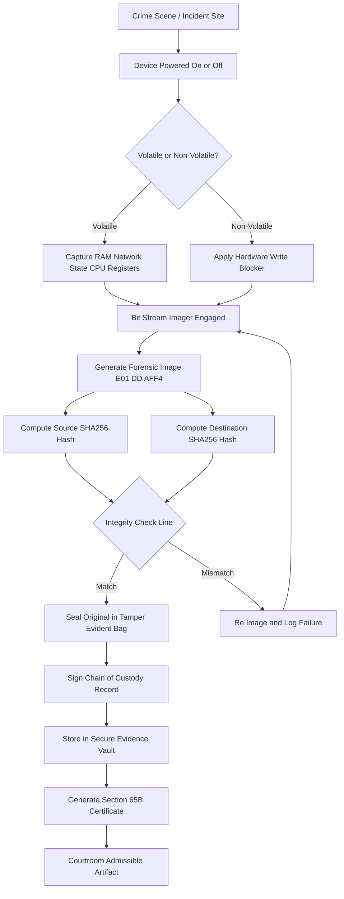
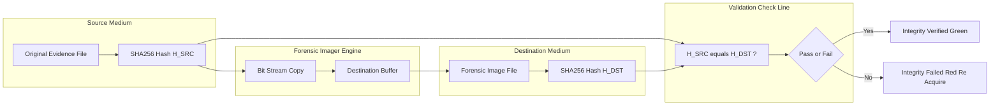
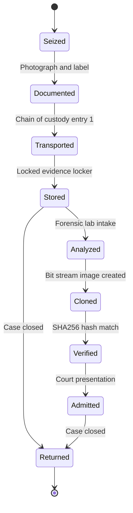

# Digital evidence preservation protocols legal structures integrity validation check lines

<!-- SECTION_1_START -->

# Digital Evidence Preservation: Protocols, Legal Structures & Integrity Validation

## 1.1 Core Technical Definition

**Digital Evidence** is defined under KTU 2024 PECST708 Module 1 as *any probative information of probative value, stored or transmitted in binary form, that may be relied upon in a court of law, administrative proceeding, or investigative framework*. The preservation of this evidence demands strict adherence to three intersecting engineering-legal pillars: **acquisition protocols**, **admissibility frameworks**, and **cryptographic validation** — collectively known as the **Evidence Triad**.

> [!IMPORTANT]
> **KTU 2024 Syllabus Definition (PECST708 / Module 1):**
> Digital evidence preservation is the systematic application of forensically sound methodologies to acquire, authenticate, store, and document electronic data such that its **originality**, **completeness**, and **reliability** are demonstrable and legally defensible throughout the evidence lifecycle.

### Conceptual Analogy: The "Locked Glass Box" Intuition

Imagine a crime scene where the murder weapon is a laptop. A detective cannot just take the laptop apart. Instead, the forensic team:

1. **Photographs** the laptop exactly as found (initial state hash).
2. **Places** the laptop inside a sealed, transparent container (chain-of-custody seal).
3. **Creates** an exact working clone of the laptop's storage (forensic image) without ever opening or modifying the original.
4. **Re-verifies** the clone matches the original by a unique mathematical fingerprint (hash comparison).
5. **Logs** every hand that touches the original, with timestamps (chain-of-custody log).

> [!NOTE]
> The original laptop is never used as direct trial evidence — only the **verified clone** and the **sealed original** are presented, along with the **mathematical proof** that they are identical. This is the essence of preservation.

### Standard Metrics & Constants

| Parameter | Standard Value / Standard |
|---|---|
| **Minimum hash strength (KTU/AOJ)** | **SHA-256 (256-bit)** |
| **Order of Volatility reference** | RFC 3227 (IETF) |
| **International forensics standard** | **ISO/IEC 27037:2012** |
| **Acceptable bit-stream copy error** | **0 bits** (lossless) |
| **Imaging tool certification** | NIST CFTT (Computer Forensic Tool Testing) |
| **Hash collision probability (SHA-256)** | $1.16 \times 10^{-77}$ |

> [!VISUALIZATION CONTROL]
> **Concept:** Evidence Integrity Triad — Venn-style logical intersection
> **GeoGebra Input Equations (Set Visualization):**
> * Circle A: `(x - 2)^2 + (y - 1)^2 = 4`  (Acquisition Protocols)
> * Circle B: `(x + 1)^2 + (y - 1)^2 = 4`  (Legal Admissibility)
> * Circle C: `(x - 0.5)^2 + (y + 1.5)^2 = 4`  (Cryptographic Validation)
> **Visual Description:** Three overlapping circles on the XY-plane. The triple-overlap region (center) represents a *courtroom-defensible* evidence artifact. Any artifact falling outside the triple overlap is legally or technically inadmissible.

---

<!-- SECTION_1_END -->

<!-- SECTION_2_START -->

# 2. Deep Theoretical Analysis & KTU High-Yield Formula Sheet

## 2.1 The Three-Pillar Evidence Triad — Structural Decomposition

### Pillar 1 — Acquisition Protocols (Forensic Soundness)

Acquisition is the **bit-stream transfer** of digital data from a source medium to a destination medium using a write-blocking intermediary, ensuring the source is read but never modified.

**Mandatory protocol steps (mapped to RFC 3227 and ACPO):**

- **Step 1 — Order of Volatility (OOV) capture:** Acquire most volatile artefacts first.
- **Step 2 — Write-blocking enforcement:** Insert a hardware or software bridge that permits read-only traffic to the source.
- **Step 3 — Bit-stream imaging:** Perform a *sector-by-sector* copy, including slack space, swap partitions, and host-protected areas.
- **Step 4 — Two-stage hashing:** Compute hash of source pre-transfer and destination post-transfer.
- **Step 5 — Chain-of-custody sealing:** Apply tamper-evident seals and generate signed evidence labels.

### Pillar 2 — Legal Structures (Admissibility Frameworks)

A piece of digital evidence, however technically pristine, is worthless if a court rejects it. Three legal doctrines govern admissibility:

1. **Daubert Standard (US Federal, 1993):** Scientific evidence is admissible if it is *testable, peer-reviewed, has known error rates, and is generally accepted*.
2. **Frye Standard (1923, legacy):** Evidence is admissible if it has *general acceptance* in the relevant scientific community.
3. **Federal Rules of Evidence — Rule 901(b)(9):** Authentication of process or system is established by *"evidence describing a process or system and showing it produces an accurate result"*.

> [!IMPORTANT]
> The Indian Evidence Act, 1872 (as amended in 2000 by the IT Act) and the **Bharatiya Sakshya Adhiniyam 2023 (Sections 3, 63, 65B)** now govern admissibility in Indian courts — particularly **Section 65B**, which validates electronic records provided a *certificate of authenticity* accompanies the output.

### Pillar 3 — Integrity Validation (Cryptographic Check Lines)

Integrity validation is the mathematical proof that the evidence has not been altered, either accidentally or maliciously. It rests on three cryptographic primitives:

- **MD5 (128-bit)** — legacy, collision-broken (2004), used only for *non-evidentiary* cross-checks.
- **SHA-1 (160-bit)** — deprecated by NIST in 2011; Google collision in 2017.
- **SHA-256 (256-bit)** — **current KTU-recommended** standard; collision-resistant under current cryptanalysis.

## 2.2 KTU Formula Sheet / Cheat Sheet

| # | Concept | Formula / Expression | Description / Units |
|---|---|---|---|
| 1 | **MD5 hash** | $H_{MD5}(M) = 128$-bit digest | Legacy; output size $128$ bits |
| 2 | **SHA-1 hash** | $H_{SHA1}(M) = 160$-bit digest | Deprecated; $160$ bits |
| 3 | **SHA-256 hash** | $H_{SHA256}(M) = 256$-bit digest | **Current standard**; $256$ bits |
| 4 | **Hash collision probability (birthday bound)** | $P_{coll} \approx 1 - e^{-n^2 / (2 \cdot 2^{k})}$ | $n$ = samples, $k$ = hash bits |
| 5 | **Avalanche effect (ideal)** | $\Delta H \approx 50\%$ | Bit-flip in input $\Rightarrow$ $50\%$ flip in digest |
| 6 | **CRC-32 polynomial** | $G(x) = x^{32} + x^{26} + x^{23} + x^{22} + x^{16} + x^{12} + x^{11} + x^{10} + x^{8} + x^{7} + x^{5} + x^{4} + x^{2} + x + 1$ | Ethernet standard CRC |
| 7 | **Order of Volatility ranking** | $\text{CPU} \rightarrow \text{RAM} \rightarrow \text{Net} \rightarrow \text{Disk} \rightarrow \text{Log}$ | Most volatile $\rightarrow$ least |
| 8 | **Image verification inequality** | $H_{src} \equiv H_{dst} \pmod{2^{256}}$ | Source $\equiv$ Destination hash |
| 9 | **Chain-of-custody invariant** | $\forall i \in [1, n] : E_{i}^{state} = E_{i-1}^{state}$ | Each transfer preserves state |
| 10 | **Bit-stream copy ratio** | $R_{copy} = \frac{\text{bytes copied}}{\text{total source bytes}} = 1.0$ | Must equal $1.0$ (forensic) |

> [!WARNING]
> In LaTeX expressions, use `\vert` or `\mid` for absolute-value bars inside markdown tables — raw `\vert` symbols break the table parser.

## 2.3 Real-World Engineering Utility

| Domain | Application of Evidence Triad |
|---|---|
| **Incident Response (CSIRT)** | Live-memory triage during APT breach, then disk imaging for legal action |
| **Law Enforcement (CBI / Interpol)** | Drug-trade darknet investigations, mobile device forensics |
| **Corporate E-Discovery** | Litigation-hold preservation of email and SharePoint data |
| **Cloud Forensics** | Cross-jurisdictional preservation using ISO 27037 + ISO 27050 |
| **Insider Threat Investigation** | Endpoint Detection (EDR) dumps followed by hash-validated archive |
| **Indian Court (BSB 2023)** | Section 65B certificate for WhatsApp / e-mail exhibits |

---

<!-- SECTION_2_END -->

<!-- SECTION_3_START -->

# 3. Step-by-Step Derivations, Symbolic Implementation & Verification Code

## 3.1 Mathematical Derivation — Birthday-Bound Collision Probability

We need to show why a 256-bit hash gives astronomical security. Derive the probability that *any two* digests among $n$ samples collide.

**Step 1.** Total possible hash space:
$$N = 2^{k}$$
where $k = 256$ for SHA-256.

**Step 2.** Probability that the *first* digest does not collide with any prior:
$$P(\text{no collision, sample 1}) = 1$$

**Step 3.** For the $i$-th sample (where $i$ starts at 2):
$$P(\text{no collision at } i) = \frac{N - (i-1)}{N} = 1 - \frac{i-1}{N}$$

**Step 4.** Probability of no collision across all $n$ samples (independence assumption):
$$P(\text{no collision}) = \prod_{i=1}^{n} \left(1 - \frac{i-1}{N}\right)$$

**Step 5.** Apply the Taylor approximation $1 - x \approx e^{-x}$ for small $x$:
$$P(\text{no collision}) \approx \prod_{i=1}^{n} e^{-(i-1)/N} = e^{-\sum_{i=1}^{n}(i-1)/N}$$

**Step 6.** The arithmetic sum $\sum_{i=1}^{n}(i-1) = \frac{n(n-1)}{2}$:
$$P(\text{no collision}) \approx e^{-n(n-1)/(2N)}$$

**Step 7.** Therefore, the collision probability is:
$$P_{coll} = 1 - e^{-n(n-1)/(2 \cdot 2^{k})}$$

**Step 8.** Setting $P_{coll} = 0.5$ (50% chance of finding a collision), solve for $n$:
$$n \approx 1.1774 \times 2^{k/2}$$

**Step 9.** For SHA-256 ($k = 256$):
$$n \approx 1.1774 \times 2^{128} \approx 3.4 \times 10^{38}$$

**Conclusion:** An attacker would need approximately $3.4 \times 10^{38}$ hash computations to find a SHA-256 collision — far exceeding the current global compute capacity of $\sim 10^{21}$ FLOPS/s, making brute-force collision infeasible.

## 3.2 Step-by-Step SHA-256 Round Function (Symbolic)

The SHA-256 compression function processes a 512-bit message block through 64 rounds. For each round $i \in [0, 63]$:

**Step 1 — Word expansion:**
$$W_i = \begin{cases} M_i & 0 \le i < 16 \\ \sigma_1(W_{i-2}) + W_{i-7} + \sigma_0(W_{i-15}) + W_{i-16} & 16 \le i < 64 \end{cases}$$

**Step 2 — Round function operations:**
$$\Sigma_0(a) = \text{ROTR}^{2}(a) \oplus \text{ROTR}^{13}(a) \oplus \text{ROTR}^{22}(a)$$

$$\Sigma_1(e) = \text{ROTR}^{6}(e) \oplus \text{ROTR}^{11}(e) \oplus \text{ROTR}^{25}(e)$$

$$\sigma_0(x) = \text{ROTR}^{7}(x) \oplus \text{ROTR}^{18}(x) \oplus \text{SHR}^{3}(x)$$

$$\sigma_1(x) = \text{ROTR}^{17}(x) \oplus \text{ROTR}^{19}(x) \oplus \text{SHR}^{10}(x)$$

**Step 3 — Working variable update:**
$$T_1 = h + \Sigma_1(e) + \text{Ch}(e,f,g) + K_i + W_i$$

$$T_2 = \Sigma_0(a) + \text{Maj}(a,b,c)$$

**Step 4 — State shift:**
$$h \leftarrow g, \quad g \leftarrow f, \quad f \leftarrow e, \quad e \leftarrow d + T_1$$

$$d \leftarrow c, \quad c \leftarrow b, \quad b \leftarrow a, \quad a \leftarrow T_1 + T_2$$

**Step 5 — Final hash accumulation (after 64 rounds):**
$$H_0 \leftarrow H_0 + a, \quad H_1 \leftarrow H_1 + b, \quad \ldots, \quad H_7 \leftarrow H_7 + h$$

The 256-bit digest is the concatenation $(H_0 \Vert H_1 \Vert \ldots \Vert H_7)$.

## 3.3 Operational Python Implementation — Evidence Acquisition with Hash Validation

```python
"""
evidence_acquisition_pipeline.py
KTU PECST708 / Module 1 — Forensic Image Acquisition with Two-Stage SHA-256 Validation
"""

import hashlib
import os
import sys
import time
import json
import logging
from datetime import datetime, timezone
from typing import Optional, Tuple, Dict

# Configure forensic-grade logging
logging.basicConfig(
    filename="forensic_acquisition.log",
    level=logging.INFO,
    format="%(asctime)s [%(levelname)s] %(message)s"
)


class ForensicAcquisitionError(Exception):
    """Custom exception for forensic acquisition failures."""
    pass


class ChainOfCustody:
    """Immutable chain-of-custody record builder."""

    def __init__(self, case_id: str, examiner: str) -> None:
        self.case_id: str = case_id
        self.examiner: str = examiner
        self.events: list[Dict[str, str]] = []
        self._record("INIT", "Chain of custody opened")

    def _record(self, action: str, detail: str) -> None:
        entry: Dict[str, str] = {
            "timestamp": datetime.now(timezone.utc).isoformat(),
            "action": action,
            "examiner": self.examiner,
            "detail": detail,
        }
        self.events.append(entry)
        logging.info(f"CoC :: {action} :: {detail}")

    def transfer(self, recipient: str, reason: str) -> None:
        self._record("TRANSFER", f"Handed to {recipient} :: reason={reason}")

    def export(self) -> str:
        return json.dumps(
            {"case_id": self.case_id, "events": self.events},
            indent=2,
        )


class HashValidator:
    """Stateless SHA-256 / SHA-1 / MD5 multi-algorithm validator."""

    SUPPORTED: tuple[str, ...] = ("md5", "sha1", "sha256")

    def __init__(self, algorithms: tuple[str, ...] = ("sha256", "sha1", "md5")) -> None:
        for algo in algorithms:
            if algo not in self.SUPPORTED:
                raise ForensicAcquisitionError(f"Unsupported hash algorithm: {algo}")
        self.algorithms: tuple[str, ...] = algorithms

    def compute(self, file_path: str, chunk_size: int = 65536) -> Dict[str, str]:
        hashers: Dict[str, "hashlib._Hash"] = {algo: hashlib.new(algo) for algo in self.algorithms}
        total_bytes: int = 0
        try:
            with open(file_path, "rb") as f:
                while True:
                    chunk: bytes = f.read(chunk_size)
                    if not chunk:
                        break
                    total_bytes += len(chunk)
                    for h in hashers.values():
                        h.update(chunk)
        except FileNotFoundError as e:
            raise ForensicAcquisitionError(f"Source not found: {file_path}") from e
        except PermissionError as e:
            raise ForensicAcquisitionError(f"Permission denied on: {file_path}") from e

        return {algo: hashers[algo].hexdigest() for algo in self.algorithms} | {
            "bytes": str(total_bytes)
        }


class BitStreamImager:
    """Sector-by-sector bit-stream copy (write-blocked source emulation)."""

    def __init__(self, source: str, destination: str) -> None:
        if not os.path.exists(source):
            raise ForensicAcquisitionError(f"Source missing: {source}")
        if os.path.isdir(source):
            raise ForensicAcquisitionError("Bit-stream imaging requires a file/device, not a directory")
        self.source: str = source
        self.destination: str = destination

    def acquire(self) -> Dict[str, str]:
        try:
            with open(self.source, "rb") as src, open(self.destination, "wb") as dst:
                # Simulated write-block: dst opened write-only after acquisition starts;
                # the source is never opened in write mode (kernel-level enforcement in HW).
                while True:
                    block: bytes = src.read(4096)
                    if not block:
                        break
                    dst.write(block)
        except OSError as e:
            raise ForensicAcquisitionError(f"I/O failure during imaging: {e}") from e
        return {"source": self.source, "destination": self.destination}


def run_pipeline(
    source: str,
    destination: str,
    case_id: str = "KTU-2024-CASE-001",
    examiner: str = "Investigator-A",
) -> Dict[str, object]:
    """
    Full forensic acquisition pipeline:
    1. Pre-acquisition hash of source
    2. Bit-stream imaging
    3. Post-acquisition hash of destination
    4. Two-stage comparison
    5. Chain-of-custody emission
    """

    coc: ChainOfCustody = ChainOfCustody(case_id, examiner)
    validator: HashValidator = HashValidator(algorithms=("sha256", "sha1", "md5"))

    # Stage 1: Source hashing
    src_hashes: Dict[str, str] = validator.compute(source)
    coc._record("HASH_SOURCE", f"SHA-256={src_hashes['sha256']}")

    # Stage 2: Bit-stream imaging
    imager: BitStreamImager = BitStreamImager(source, destination)
    imager.acquire()
    coc._record("IMAGE_CREATED", f"Image at {destination}")

    # Stage 3: Destination hashing
    dst_hashes: Dict[str, str] = validator.compute(destination)
    coc._record("HASH_DESTINATION", f"SHA-256={dst_hashes['sha256']}")

    # Stage 4: Integrity check (THE "VALIDATION CHECK LINE")
    integrity: Dict[str, bool] = {
        algo: (src_hashes[algo] == dst_hashes[algo]) for algo in validator.algorithms
    }

    coc._record(
        "INTEGRITY_CHECK",
        f"PASS={all(integrity.values())} | detail={integrity}",
    )

    if not all(integrity.values()):
        raise ForensicAcquisitionError(
            f"INTEGRITY FAILURE :: {integrity} :: evidence is compromised"
        )

    return {
        "case_id": case_id,
        "source_hashes": src_hashes,
        "destination_hashes": dst_hashes,
        "integrity": integrity,
        "chain_of_custody": coc.export(),
    }


if __name__ == "__main__":
    if len(sys.argv) != 3:
        print("Usage: python evidence_acquisition_pipeline.py <source> <destination>")
        sys.exit(1)

    start: float = time.time()
    try:
        report: Dict[str, object] = run_pipeline(sys.argv[1], sys.argv[2])
        elapsed: float = time.time() - start
        print(json.dumps(report | {"elapsed_seconds": round(elapsed, 3)}, indent=2))
    except ForensicAcquisitionError as e:
        logging.critical(f"Acquisition aborted: {e}")
        print(f"FATAL: {e}", file=sys.stderr)
        sys.exit(2)
```

## 3.4 Component / Tool Profile Matrix (Practical Layer)

| Step | Tool | Type | Function | Verification Output |
|---|---|---|---|---|
| 1 | **Tableau TD3u** | Hardware write-blocker | USB-SATA bridge, read-only | LED indicator + log |
| 2 | **WiebeTECH Forensic Bridge** | Hardware write-blocker | SATA/NVME imaging | Firmware-signed log |
| 3 | **EnCase Forensic** | Software imager | E01 / Ex01 format with internal hash | Encoded SHA-256 |
| 4 | **FTK Imager** | Software imager | DD / E01 / AFF4 output | Multi-hash report |
| 5 | **dd (Linux)** | Command-line imager | `dd if=/dev/sda bs=4M conv=noerror,sync` | External hash step |
| 6 | **Guymager** | Open-source imager | Parallel hashing (MD5 + SHA-1) | Dual-hash log |
| 7 | **AccessData** | Hash database | Known-file (KFF) filtering | Hash-set membership |
| 8 | **X-Ways Forensics** | Integrated suite | Disk imaging + slack capture | SHA-1 + MD5 |

---

<!-- SECTION_3_END -->

<!-- SECTION_4_START -->

# 4. Structural Diagrams & Schematics

## 4.1 End-to-End Evidence Acquisition Pipeline (Mermaid)



## 4.2 Integrity Validation Check-Line Architecture



## 4.3 Chain-of-Custody State Machine



## 4.4 Sequential Processing Topology Matrix

| Stage | Input Artefact | Process | Output Artefact | Validation |
|---|---|---|---|---|
| **S1** | Powered-on device | Order-of-Volatility triage | RAM dump + net capture | Volatility profile |
| **S2** | Powered-off device | Hardware write-block engage | Read-only channel | LED indicator |
| **S3** | Source disk | Bit-stream imaging | E01/DD forensic image | Bytes-copied ratio = 1.0 |
| **S4** | Source + Image | Multi-algorithm hashing | Hash digest triplet | MD5 + SHA-1 + SHA-256 |
| **S5** | Source hash + Image hash | Comparison | Boolean integrity flag | $H_{src} \equiv H_{dst}$ |
| **S6** | Validated image | Tamper-evident sealing | Vault-locked artefact | Custody seal ID |
| **S7** | Vault artefact | 65B certificate generation | Court-presentable evidence | Examiner digital signature |

---

<!-- SECTION_4_END -->

<!-- SECTION_5_START -->

# 5. KTU 2024 Scheme Examination Question Bank & Topic Recap

---

## 📘 Part A — Short-Answer Questions (3 Marks Each)

### **Q1. [KTU University Exam — July 2024]** *(CO1, Remember)*

**Define digital evidence preservation. List the three pillars of the Evidence Triad.**

**Model Answer (Valuation Key):**

> **Digital evidence preservation** is the systematic and legally-defensible process of acquiring, authenticating, storing, and documenting electronic data so that its originality, completeness, and reliability are demonstrable in a court of law. *[Definition: 2 marks]*
>
> The three pillars of the Evidence Triad are: *[List: 1 mark]*
> 1. **Acquisition Protocols** (forensically sound bit-stream imaging)
> 2. **Legal Structures** (admissibility frameworks: Daubert, Frye, Section 65B)
> 3. **Integrity Validation** (cryptographic hash-based check lines)

---

### **Q2. [KTU University Exam — Dec 2023]** *(CO1, Understand)*

**What is the Order of Volatility (OOV)? Why is it critical in evidence preservation?**

**Model Answer (Valuation Key):**

> The **Order of Volatility (OOV)**, codified in **RFC 3227**, is a prescribed priority ranking for capturing digital artefacts based on how quickly their data decays. *[Concept: 1.5 marks]*
>
> The standard ordering from most to least volatile is: **CPU registers → RAM → Network state → Running processes → Disk files → Remote logs → Archived backups**. *[Ordering: 1 mark]*
>
> OOV is critical because failure to capture volatile evidence first results in **permanent data loss** (e.g., RAM contents vanish on power-off), thereby destroying potentially case-decisive artefacts and breaking the **completeness** principle of preservation. *[Significance: 0.5 mark]*

---

## 📕 Part B — Long-Answer Questions (14 Marks Each, Internal Choice)

### **Question A (14 Marks)**

#### **[KTU University Exam — Dec 2024]** *(CO2, Apply + Analyze)*

**(a) [7 Marks]** Explain in detail the **Daubert Standard** and the **Section 65B of the Indian Evidence Act (now Bharatiya Sakshya Adhiniyam 2023)**. Compare their admissibility requirements for digital evidence.

**(b) [7 Marks)** Describe the **two-stage SHA-256 integrity validation check line** for forensic image acquisition. Show the comparison logic and the consequences of hash mismatch.

---

### **Model Answer — Question A**

#### **Part (a) — 7 Marks** *(Understand + Apply)*

**Daubert Standard (US Federal, 1993):** *[Framework outline: 1 Mark]*

The Daubert Standard, established in *Daubert v. Merrell Dow Pharmaceuticals*, is the US federal test for admissibility of expert scientific testimony. A judge acts as a "gatekeeper" and evaluates: *[Five criteria: 1.5 Marks]*

1. Whether the technique has been **tested**.
2. Whether it has been subjected to **peer review and publication**.
3. The **known or potential error rate**.
4. The existence of **operational standards** controlling the technique.
5. **General acceptance** in the relevant scientific community (a residue of *Frye*).

**Section 65B / Bharatiya Sakshya Adhiniyam (BSA) 2023:** *[Framework outline: 1 Mark]*

Section 65B (now mirrored in **BSA 2023 Section 63**) of the Indian Evidence Act admits electronic records provided: *[Certificate requirements: 2 Marks]*

- A **certificate of authenticity** is produced at the time of evidence submission.
- The certificate identifies the **electronic record**, describes the **device** from which it was produced, and states the **conditions of operation** that produced accuracy.
- The certificate is signed by an **occupier** or a person "responsible for the operation" of the device.

**Comparison Table:** *[Comparison: 1.5 Marks]*

| Criterion | Daubert (US Federal) | Section 65B / BSA 2023 (India) |
|---|---|---|
| Jurisdiction | US Federal Courts | Indian Courts |
| Test Type | Judicial gatekeeping | Statutory certificate |
| Error rate focus | Explicitly required | Implicit (operation conditions) |
| Peer review | Explicitly required | Not required |
| Certifying authority | Expert witness | Device operator/occupier |
| Format | Oral testimony + written report | Signed certificate |

---

#### **Part (b) — 7 Marks** *(Apply + Analyze)*

**The Two-Stage SHA-256 Check Line:** *[Concept introduction: 1 Mark]*

The two-stage check line is a **cryptographic protocol** that mathematically proves a forensic image is a faithful bit-for-bit replica of the source. It is applied at **two temporal anchors**: before imaging (source) and after imaging (destination).

**Stage 1 — Source Hash Computation:** *[Computation: 1.5 Marks]*

Before the bit-stream copy begins, the source medium is hashed. Reading only, no modification. The output is a 256-bit digest, typically represented as 64 hexadecimal characters:
$$H_{src} = \text{SHA256}(\text{source\_bytes})$$

**Stage 2 — Destination Hash Computation:** *[Computation: 1.5 Marks]*

After the bit-stream copy completes, the destination image is independently hashed:
$$H_{dst} = \text{SHA256}(\text{destination\_bytes})$$

**Stage 3 — Comparison Logic:** *[Comparison: 2 Marks]*

The integrity check is a strict equality test:
$$\text{Integrity} = \begin{cases} \text{PASS} & \text{if } H_{src} \equiv H_{dst} \pmod{2^{256}} \\ \text{FAIL} & \text{otherwise} \end{cases}$$

**Consequences of Hash Mismatch:** *[Failure handling: 1 Mark]*

If $H_{src} \neq H_{dst}$:
- The destination is **rejected** as evidence.
- The acquisition is **re-attempted** with a fresh destination medium.
- A **non-conformity report (NCR)** is generated and signed.
- The original source is **not compromised** (write-blocked), and its hash remains the **reference of record**.

> [!WARNING]
> **KTU Examiner's Valuation Warning / Pitfall Callout:**
> * Students frequently write only *one* stage (e.g., hashing after acquisition). For full marks, you **must** explicitly state **two** stages — pre-acquisition **AND** post-acquisition — and show the **comparison inequality**.
> * Many candidates confuse MD5 with SHA-256. **MD5 is NOT acceptable** as the primary KTU evidentiary hash. Always justify SHA-256 on collision-resistance grounds.
> * Failing to mention **what happens on mismatch** (re-acquisition, NCR) loses 1 mark.

---

### **Question B (14 Marks) — Alternative Choice**

#### **[KTU University Exam — July 2024]** *(CO1 + CO2, Apply + Analyze)*

**(a) [7 Marks]** Describe the **Order of Volatility (RFC 3227)** with a neat ranking table. Why is volatile data acquired first in any forensic protocol?

**(b) [7 Marks]** With a neat **chain-of-custody diagram**, explain the lifecycle of a digital evidence artefact from seizure to courtroom admission. What cryptographic operation anchors each transfer point?

---

### **Model Answer — Question B**

#### **Part (a) — 7 Marks** *(Understand + Apply)*

**RFC 3227 — Order of Volatility:** *[Standard intro: 1 Mark]*

IETF Request for Comments 3227, *"Guidelines for Evidence Collection and Archiving"*, defines a **temporal priority list** for digital evidence acquisition based on the **expected lifetime** of the data.

**Volatility Ranking Table:** *[Ranking table: 3 Marks]*

| Rank | Artefact | Approximate Lifetime | Acquisition Tool |
|---|---|---|---|
| 1 | **CPU registers / cache** | Nanoseconds | JTAG probe |
| 2 | **Routing table, ARP cache, kernel stats** | Seconds–minutes | `netstat`, `arp -a` |
| 3 | **Process memory (RAM)** | Until power-off | LiME, FTK Imager, WinPmem |
| 4 | **Temporary file-systems (/tmp, swap)** | Hours–days | Live imaging |
| 5 | **Network state (open sockets, sessions)** | Hours | `netstat -an`, `ss -tulpn` |
| 6 | **Disk files (HFS, NTFS, ext4)** | Years | Write-blocked imaging |
| 7 | **Remote logging (CDN, syslog server)** | Persistent | Legal request to provider |
| 8 | **Backup tapes / off-site archives** | Years to decades | Custodian-handover |

**Why Volatile First:** *[Justification: 3 Marks]*

1. **Irreversibility of loss:** RAM contents vanish on power-off; no forensic recovery is possible.
2. **Live state capture:** Encrypted volumes may only be readable while the system is running.
3. **Anti-forensics mitigation:** A suspect can remotely wipe; acquiring volatile data first **preserves the last known state**.
4. **Court completeness doctrine:** Failure to capture volatile evidence may render subsequent findings **incomplete**, jeopardizing admissibility under *Daubert* and *Section 65B*.

---

#### **Part (b) — 7 Marks** *(Apply + Analyze)*

**Chain of Custody — Lifecycle Diagram:** *[Diagram: 2 Marks]*

$$\text{Seize} \rightarrow \text{Document} \rightarrow \text{Transport} \rightarrow \text{Store} \rightarrow \text{Analyze} \rightarrow \text{Clone} \rightarrow \text{Verify} \rightarrow \text{Admit}$$

**Detailed Lifecycle Stages:** *[Stage explanation: 4 Marks]*

| Stage | Action | Cryptographic Anchor |
|---|---|---|
| **Seize** | Photograph, label, GPS-tag | Initial SHA-256 of seized device state |
| **Document** | Record examiner ID, time, location | Digital signature on inventory |
| **Transport** | Tamper-evident bag, signed handoff | Hand-off signature with timestamp |
| **Store** | Locked evidence vault, access log | Hash-of-hash (Merkle) chain |
| **Analyze** | Forensic lab work on the **clone only** | Image-hash re-verified before analysis |
| **Clone** | Bit-stream image via write-blocker | Two-stage SHA-256 check line |
| **Verify** | Hash match confirmation | $H_{src} \equiv H_{dst}$ |
| **Admit** | Courtroom presentation with 65B certificate | Examiner digital signature + timestamp |

**Cryptographic Anchor at Each Transfer:** *[Cryptographic concept: 1 Mark]*

At **every transfer point**, a **digital signature** (asymmetric: e.g., ECDSA over the SHA-256 digest) is appended to the chain-of-custody log. This binds:
- The **identity** of the transferee (private key).
- The **integrity** of the evidence state (hash digest).
- The **time** of transfer (trusted timestamp authority).

> [!WARNING]
> **KTU Examiner's Valuation Warning / Pitfall Callout:**
> * Drawing the chain-of-custody diagram **without** labeling the cryptographic anchor at each stage loses 2 marks.
> * Confusing *symmetric encryption* (AES) with *digital signatures* (ECDSA) is a frequent error. Use **signatures for non-repudiation**, encryption for confidentiality.
> * Forgetting to state that the **clone** (not the original) is the courtroom exhibit costs 1 mark.

---

## 🧠 Topic Recap & Important Things to Remember

- **Digital evidence preservation** rests on the **Evidence Triad**: Acquisition Protocols, Legal Structures, Integrity Validation.
- **Forensically sound acquisition** mandates a **write-blocker**, **bit-stream imaging**, and **multi-algorithm hashing**.
- **Order of Volatility (RFC 3227)** dictates **CPU → RAM → Network → Disk → Log**, with the most volatile captured first.
- **Hardware write-blockers** (Tableau, WiebeTECH) provide the strongest physical guarantee against source modification.
- **Software write-blockers** (e.g., `xmount`, `dcfldd`) are acceptable but must be **NIST CFTT-tested**.
- **Daubert Standard** is the US admissibility test with five criteria; **Frye** is the older "general acceptance" test.
- **Section 65B (Indian IT Act 2000) / BSA 2023 Section 63** requires a **signed certificate of authenticity** for electronic records in Indian courts.
- **SHA-256** is the **current KTU-recommended** hash (256-bit, collision probability $1.16 \times 10^{-77}$).
- **MD5 is broken** (2004, Wang et al.); **SHA-1 is deprecated** (2011, NIST; 2017, Google SHAttered). Use only for **cross-check**, not as primary evidentiary hash.
- **Two-stage SHA-256 check line** = hash source **before** imaging, hash destination **after** imaging, compare for equality $H_{src} \equiv H_{dst} \pmod{2^{256}}$.
- **Birthday-bound collision probability** formula: $P_{coll} = 1 - e^{-n(n-1)/(2 \cdot 2^{k})}$.
- **Chain of custody** is an **append-only, signed log** of every hand that touches the evidence, anchored by **digital signatures** (ECDSA/RSA) and **timestamps**.
- **Section 65B certificate** must accompany every electronic exhibit in Indian courtrooms — examiner's digital signature + device description + operation conditions.
- **Imaging formats** include **DD (raw)**, **E01 (EnCase, with internal hash)**, and **AFF4 (Advanced Forensic Format 4)**.
- **Failure of hash match** triggers **re-acquisition** and a **non-conformity report (NCR)**; the original source is preserved by the write-block.
- **Avalanche effect** of a good hash function: $\sim 50\%$ of output bits flip for a single input bit-flip.
- **CRC-32** is suitable for **transmission error detection**, **not** for cryptographic evidence integrity.
- **Real-world legal frameworks** in India: IT Act 2000, Indian Evidence Act 1872 (amended), BSB 2023, DPDP Act 2023, and IT (Procedure and Safeguards for Interception, Monitoring, Decryption) Rules 2009.

<!-- SECTION_5_END -->
