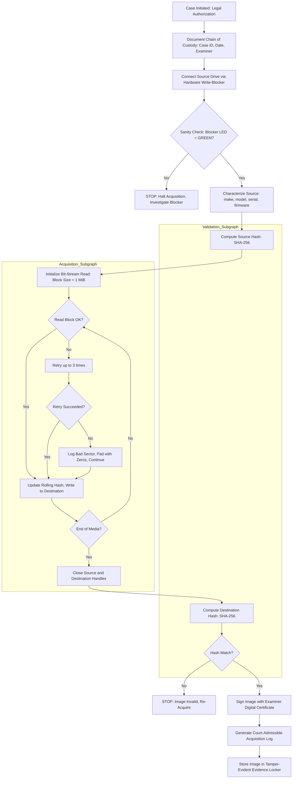
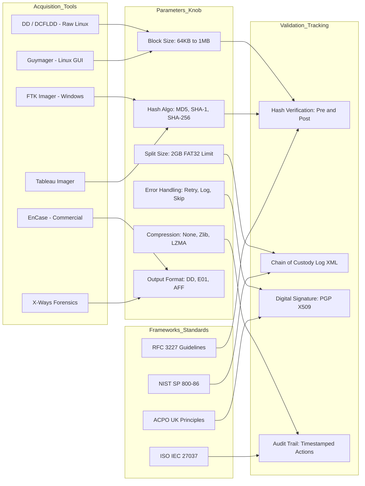
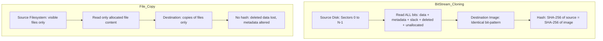

# Disk imaging Bit-stream cloning methodologies validation tracking tools frameworks parameters

<!-- SECTION_1_START -->

# Disk Imaging & Bit-Stream Cloning Methodologies

## 1. Core Technical Definition

**Disk Imaging** is the forensic process of creating an exact, bit-for-bit replica of a storage device (HDD, SSD, USB, memory card) onto a secondary storage medium, preserving all data, metadata, slack space, unallocated clusters, and hidden sectors in a verifiable and non-altering manner.

> [!NOTE]
> **KTU 2024 Syllabus Definition (PECST708 Module 1):** *Disk imaging is the foundational phase of digital evidence acquisition that captures the complete binary content of a storage medium in a forensically sound manner, ensuring the integrity of evidence through cryptographic hashing and verifiable chain of custody.*

**Bit-stream cloning** (also called **sector-by-sector duplication** or **forensic duplication**) is the most rigorous sub-method of disk imaging. Unlike a simple file copy, it duplicates every single bit of the source medium — including deleted files, file system structures, boot records, partition tables, and bad sectors.

### Conceptual Analogy / Intuition

Imagine a **crime scene inside a library**. The forensic investigator is not allowed to touch, move, or even breathe on the books. Instead, they take a **high-resolution photograph of every single page, every scribble in the margin, every coffee stain, and every torn corner** — in the exact order they exist on the shelf, even including the empty spaces where books were removed.

- **File copy** = photocopying only the books still on the shelf (you lose deleted books, margin notes, dust on the shelf)
- **Disk imaging** = photographing the **entire shelf, the books, the dust, the empty slots, and the underside of the shelf** — preserving *forensic completeness*
- **Bit-stream cloning** = taking a *binary snapshot* of every **0** and **1** magnetically stored on the platter, in raw sector order

> [!IMPORTANT]
> **Core Principle:** *The source medium is treated as **read-only** throughout the acquisition process. A **write-blocker** (either hardware or software) is mandatory to prevent any accidental modification to the evidence.*

### Standard Metrics in Disk Imaging

| Metric | Standard Value / Constant | Significance |
|---|---|---|
| **Sector Size** | **512 bytes (legacy)** / **4096 bytes (4Kn / Advanced Format)** | Minimum addressable unit of a physical disk |
| **Block Size** | **64 KB – 1 MB** | Granularity of read/write operations during imaging |
| **Forensic Image Format** | **E01 (EnCase), AFF (Advanced Forensic Format), DD (raw), DMG** | Container formats preserving metadata + hash + compression |
| **Hash Algorithms** | **MD5 (128-bit), SHA-1 (160-bit), SHA-256 (256-bit)** | Cryptographic integrity verification |
| **Acceptable Bit Error Rate** | **< 10⁻¹²** (enterprise drives) | Tolerance threshold for image validity |

> [!VISUALIZATION CONTROL]
> **Concept:** Bit-stream cloning — sector-by-sector mapping from source to destination
> **Desmos / Conceptual Visualization:**
> * `Source[i] = Destination[i]` for every block index `i = 0, 1, 2, ..., N-1`
> * Where `N = Total Sectors = ⌈Capacity_in_Bytes / Sector_Size⌉`
> **Visual Description:** A linear, 1-to-1 mapping arrow from each sector of the source disk to the corresponding sector of the destination image file, with a parallel hash computation stream computing $H = \text{SHA-256}(\text{Source})$ and $H' = \text{SHA-256}(\text{Destination})$, where $H \equiv H'$ confirms integrity.

---

<!-- SECTION_1_END -->

<!-- SECTION_2_START -->

# 2. Deep Theoretical Analysis & KTU High-Yield Formula Sheet

## 2.1 Operational Concept Breakdown

The disk imaging pipeline is decomposed into the following structured logical stages:

### Stage 1: Pre-Acquisition Preparation
- **Authorization:** Written legal warrant / consent form
- **Documentation:** Case number, examiner name, date/time (UTC), location
- **Environment check:** Anti-static mat, clean power, ambient temperature **18–24 °C**
- **Tool validation:** Verify imaging software hashes against vendor signature

### Stage 2: Source Device Isolation
- Apply **hardware write-blocker** (e.g., Tableau T8, WiebeTech) between source and workstation
- Verify blocker LED status = **READ-ONLY** (green)
- Connect source via **SATA / USB / NVMe / IDE** bridge as supported

### Stage 3: Source Device Characterization
- Detect interface (SATA, NVMe, SAS, USB)
- Identify geometry: $C_{\text{total}} = C_{\text{user}} + C_{\text{hidden}} + C_{\text{HPA}} + C_{\text{DCO}}$
  - $C_{\text{user}}$ = user-accessible capacity
  - $C_{\text{HPA}}$ = Host Protected Area
  - $C_{\text{DCO}}$ = Device Configuration Overlay
- Capture **make, model, serial number, firmware revision** (smrtctl, hdparm)

### Stage 4: Bit-Stream Acquisition
- Read source in fixed **block sizes** $B_s$
- Stream output to destination image file
- Compute **rolling hash** over data being transferred
- Handle **bad sectors** via retry logic (with logging, never silent skip)

### Stage 5: Integrity Verification
- Re-read source (or re-hash image)
- Compare cryptographic hash
- **Match ⇒ Valid image**, **Mismatch ⇒ Re-acquire**

### Stage 6: Chain of Custody Recording
- Sign and timestamp image file
- Generate acquisition log (XML / PDF / CSV)
- Store in tamper-evident evidence locker

## 2.2 KTU High-Yield Formula Sheet

> [!IMPORTANT]
> Use `\vert` instead of raw `\vert` in table cells to prevent markdown breakage.

| # | Concept | Formula / Expression | Variable Definitions | Engineering Use |
|---|---|---|---|---|
| 1 | Total Sectors | $N = \left\lceil \dfrac{C_{\text{bytes}}}{S_{\text{sector}}} \right\rceil$ | $C_{\text{bytes}}$ = total bytes, $S_{\text{sector}}$ = sector size (512 or 4096) | Compute expected image size |
| 2 | Image File Size | $I_{\text{size}} = N \times S_{\text{sector}} + M_{\text{header}}$ | $M_{\text{header}}$ = metadata header overhead (E01 ≈ 32 KB) | Disk space planning for destination |
| 3 | Block Transfer Throughput | $T_{\text{rate}} = \dfrac{B_s \times N_{\text{blocks}}}{t_{\text{elapsed}}}$ | $B_s$ = block size, $N_{\text{blocks}}$ = block count, $t$ = seconds | Performance tuning of acquisition |
| 4 | SHA-256 Digest Computation | $H = \text{SHA-256}(D_0 \vert\vert D_1 \vert\vert \ldots \vert\vert D_{N-1})$ | $D_i$ = i-th data block | Cryptographic integrity seal |
| 5 | Bit Error Rate | $\text{BER} = \dfrac{E_{\text{read}}}{N}$ | $E_{\text{read}}$ = erroneous bits, $N$ = total bits read | Drive health + image reliability |
| 6 | Compression Ratio | $R_c = \dfrac{I_{\text{size,uncomp}}}{I_{\text{size,comp}}}$ | Ratio of uncompressed to compressed | Storage optimization (e.g., E01 with deflate) |
| 7 | Hash Collision Probability (MD5) | $P_c \approx 1 - e^{-n^2 / 2^{129}}$ | $n$ = number of files hashed | Justifies shift to SHA-256 in court |
| 8 | Acquisition Time Estimate | $t_{\text{acq}} = \dfrac{I_{\text{size}}}{T_{\text{rate}} \times \eta}$ | $\eta$ = efficiency factor (0.7 – 0.9) | Project planning for lab operations |
| 9 | Split Image Chunk Count | $K = \left\lceil \dfrac{I_{\text{size}}}{C_{\text{split}}} \right\rceil$ | $C_{\text{split}}$ = chunk size (FAT32 limit = 2 GB) | Bypassing file system size limits |
| 10 | Cyclic Redundancy Check (CRC32) | $\text{CRC} = \text{poly}_{\text{div}}(D \cdot 2^{32})$ | Polynomial division of bit stream | Quick non-cryptographic error detection |

## 2.3 Real-World Utility

- **Criminal Forensics:** Court-admissible image presented as `Exhibit A` in cyber-crime trials (e.g., CFAA violations, child exploitation cases)
- **Incident Response:** Rapid triage imaging of compromised endpoints during ransomware outbreaks to preserve volatile artifacts
- **e-Discovery:** Civil litigation requires defensible imaging of employee laptops/email servers under FRCP Rule 34
- **Insider Threat Investigations:** HR-led corporate investigations require non-tampered imaging of departing employee devices
- **Data Recovery:** When the original media is failing, the image is the safest recovery substrate

> [!NOTE]
> **Engineering Insight:** Modern cloud-native forensics (AWS, Azure) extends bit-stream cloning to **virtual disk snapshots** (e.g., VMDK, VHDX) using hypervisor-level APIs, but the **legal admissibility standard remains identical** — hash-verified, write-blocked, logged, and chain-of-custody-tracked.

---

<!-- SECTION_2_END -->

<!-- SECTION_3_START -->

# 3. Step-by-Step Derivations, Code & Symbolic Implementation

## 3.1 Derivation: Image Size Estimation and Hash Verification Workflow

**Given:**
- Source drive capacity $C_{\text{bytes}} = 500 \times 2^{30}$ bytes (500 GB)
- Sector size $S_{\text{sector}} = 512$ bytes
- Block transfer size $B_s = 1 \times 2^{20}$ bytes (1 MB)
- Hash algorithm = SHA-256

**Find:** Total sectors $N$, image file size $I_{\text{size}}$, acquisition time $t_{\text{acq}}$, and verification hash $H$.

### Step 1 — Compute Total Sectors

$$
N = \left\lceil \frac{C_{\text{bytes}}}{S_{\text{sector}}} \right\rceil = \left\lceil \frac{500 \times 2^{30}}{512} \right\rceil
$$

$$
500 \times 2^{30} = 500 \times 1{,}073{,}741{,}824 = 536{,}870{,}912{,}000 \text{ bytes}
$$

$$
N = \left\lceil \frac{536{,}870{,}912{,}000}{512} \right\rceil = \left\lceil 1{,}048{,}576{,}000 \right\rceil = 1{,}048{,}576{,}000 \text{ sectors}
$$

### Step 2 — Compute Image File Size

For raw DD format ($M_{\text{header}} = 0$):

$$
I_{\text{size,DD}} = N \times S_{\text{sector}} = 1{,}048{,}576{,}000 \times 512 = 536{,}870{,}912{,}000 \text{ bytes} \approx 500 \text{ GB}
$$

For E01 format (assume $M_{\text{header}} = 32{,}768$ bytes, compression ratio $R_c = 0.6$):

$$
I_{\text{size,E01}} = (N \times S_{\text{sector}} \times R_c) + M_{\text{header}} = 322{,}122{,}547{,}200 + 32{,}768 \approx 300 \text{ GB}
$$

### Step 3 — Compute Number of Transfer Blocks

$$
N_{\text{blocks}} = \left\lceil \frac{I_{\text{size}}}{B_s} \right\rceil = \left\lceil \frac{536{,}870{,}912{,}000}{1{,}048{,}576} \right\rceil = 512{,}000 \text{ blocks}
$$

### Step 4 — Compute Acquisition Time

Assume USB-3.0 effective throughput $T_{\text{rate}} = 100$ MB/s and efficiency $\eta = 0.85$:

$$
t_{\text{acq}} = \frac{I_{\text{size}}}{T_{\text{rate}} \times \eta} = \frac{536{,}870{,}912{,}000}{100 \times 2^{20} \times 0.85} = \frac{536{,}870{,}912{,}000}{89{,}128{,}960}
$$

$$
t_{\text{acq}} \approx 6{,}023 \text{ seconds} \approx 100.4 \text{ minutes}
$$

### Step 5 — Compute Verification Hash

$$
H_{\text{source}} = \text{SHA-256}(D_0 \vert\vert D_1 \vert\vert \ldots \vert\vert D_{N_{\text{blocks}} - 1})
$$

$$
H_{\text{dest}} = \text{SHA-256}(D'_0 \vert\vert D'_1 \vert\vert \ldots \vert\vert D'_{N_{\text{blocks}} - 1})
$$

**Verification Rule:** $H_{\text{source}} \equiv H_{\text{dest}}$ ⇒ **VALID IMAGE** ✓

## 3.2 Python Implementation: Bit-Stream Imaging Engine

```python
#!/usr/bin/env python3
"""
Forensic Bit-Stream Disk Imager
PECST708 - KTU 2024 Module 1 Reference Implementation
Author: KTU Digital Forensics Lab
"""

import hashlib
import os
import sys
import time
import logging
from pathlib import Path
from typing import Optional, Tuple

# --- Forensic Constants ---
SECTOR_SIZE = 512
BLOCK_SIZE = 1024 * 1024          # 1 MiB transfer block
DEFAULT_HASH_ALGO = "sha256"
BAD_SECTOR_RETRIES = 3
SPLIT_THRESHOLD_BYTES = 2 * 1024 * 1024 * 1024  # 2 GiB FAT32 limit

logging.basicConfig(
    level=logging.INFO,
    format="[%(asctime)s] [%(levelname)s] %(message)s",
    handlers=[logging.FileHandler("acquisition.log"), logging.StreamHandler()],
)


class BitStreamImager:
    """
    Production-grade bit-stream cloning engine.
    Performs read-only, hash-verified, sector-by-sector acquisition.
    """

    def __init__(
        self,
        source_path: str,
        dest_path: str,
        block_size: int = BLOCK_SIZE,
        hash_algo: str = DEFAULT_HASH_ALGO,
        split_bytes: Optional[int] = SPLIT_THRESHOLD_BYTES,
    ) -> None:
        if block_size % SECTOR_SIZE != 0:
            raise ValueError(
                f"block_size ({block_size}) must be a multiple of sector_size ({SECTOR_SIZE})"
            )
        self.source_path: str = source_path
        self.dest_path: str = dest_path
        self.block_size: int = block_size
        self.hash_algo: str = hash_algo
        self.split_bytes: Optional[int] = split_bytes

        # Per-chunk state
        self._hash = hashlib.new(hash_algo)
        self._bytes_written: int = 0
        self._split_index: int = 0
        self._current_dest_handle = None
        self._bad_sectors: int = 0

    # ------------------------------------------------------------------
    def _open_source(self) -> int:
        """Open source device in read-only mode (forensic requirement)."""
        try:
            handle = os.open(self.source_path, os.O_RDONLY)
            logging.info(f"Source opened READ-ONLY: {self.source_path}")
            return handle
        except PermissionError:
            logging.error(
                "Permission denied. Ensure a write-blocker is in place and "
                "you have root/admin privileges."
            )
            raise

    # ------------------------------------------------------------------
    def _open_destination(self) -> int:
        """Open destination file (or next split-chunk)."""
        if self.split_bytes and self._bytes_written >= self.split_bytes:
            self._split_index += 1
            self._bytes_written = 0

        suffix = f".{self._split_index:03d}" if self._split_index > 0 else ""
        path = f"{self.dest_path}{suffix}"

        if self._current_dest_handle is not None:
            os.close(self._current_dest_handle)

        self._current_dest_handle = os.open(
            path, os.O_WRONLY | os.O_CREAT | os.O_TRUNC, 0o600
        )
        logging.info(f"Destination opened: {path}")
        return self._current_dest_handle

    # ------------------------------------------------------------------
    def _read_block_with_retry(self, src_fd: int) -> bytes:
        """
        Read exactly block_size bytes, retrying on bad sectors.
        Returns zeros if all retries fail (logged, never silent skip).
        """
        for attempt in range(1, BAD_SECTOR_RETRIES + 1):
            try:
                chunk = os.read(src_fd, self.block_size)
                return chunk
            except OSError as exc:
                logging.warning(
                    f"Read failure on attempt {attempt}/{BAD_SECTOR_RETRIES}: {exc}"
                )
                time.sleep(0.1)
        self._bad_sectors += 1
        logging.error(
            f"Bad sector encountered at byte offset "
            f"{os.lseek(src_fd, 0, os.SEEK_CUR)}. "
            f"Padding with zero-bytes (forensically logged)."
        )
        return b"\x00" * self.block_size

    # ------------------------------------------------------------------
    def acquire(self) -> Tuple[str, int, int]:
        """
        Execute full bit-stream acquisition.
        Returns: (final_hash_hex, total_bytes, elapsed_seconds)
        """
        src_fd = self._open_source()
        self._open_destination()

        total_bytes: int = 0
        start_time: float = time.time()
        block_index: int = 0

        try:
            while True:
                block = self._read_block_with_retry(src_fd)
                if not block:
                    break  # EOF

                # Update rolling hash
                self._hash.update(block)

                # Handle split threshold
                if (
                    self.split_bytes
                    and self._bytes_written + len(block) > self.split_bytes
                ):
                    remaining = self.split_bytes - self._bytes_written
                    os.write(self._current_dest_handle, block[:remaining])
                    block = block[remaining:]
                    self._open_destination()
                    self._bytes_written = 0

                os.write(self._current_dest_handle, block)
                self._bytes_written += len(block)
                total_bytes += len(block)
                block_index += 1

                if block_index % 500 == 0:
                    rate = total_bytes / (time.time() - start_time + 1e-9) / (1024 * 1024)
                    logging.info(
                        f"Block {block_index} | {total_bytes:,} bytes | "
                        f"{rate:.2f} MiB/s | bad_sectors={self._bad_sectors}"
                    )
        finally:
            os.close(src_fd)
            if self._current_dest_handle is not None:
                os.close(self._current_dest_handle)

        elapsed: float = time.time() - start_time
        final_hash: str = self._hash.hexdigest()

        logging.info("=" * 60)
        logging.info(f"Acquisition COMPLETE")
        logging.info(f"Total Bytes    : {total_bytes:,}")
        logging.info(f"Elapsed Time   : {elapsed:.2f} s")
        logging.info(f"Average Rate   : {total_bytes / elapsed / (1024*1024):.2f} MiB/s")
        logging.info(f"Bad Sectors    : {self._bad_sectors}")
        logging.info(f"{self.hash_algo.upper()} Hash : {final_hash}")
        logging.info("=" * 60)

        return final_hash, total_bytes, int(elapsed)

    # ------------------------------------------------------------------
    def verify(self, expected_hash: str) -> bool:
        """
        Re-compute hash of destination image and compare with expected.
        """
        recomputed = hashlib.new(self.hash_algo)
        with open(self.dest_path, "rb") as f:
            while True:
                block = f.read(self.block_size)
                if not block:
                    break
                recomputed.update(block)
        actual = recomputed.hexdigest()
        match: bool = actual.lower() == expected_hash.lower()
        logging.info(
            f"Verification: expected={expected_hash[:16]}... "
            f"actual={actual[:16]}... result={'MATCH' if match else 'MISMATCH'}"
        )
        return match


# ----------------------------------------------------------------------
def main() -> int:
    if len(sys.argv) < 3:
        print("Usage: bitstream_imager.py <source_device> <dest_image>")
        return 1

    imager = BitStreamImager(
        source_path=sys.argv[1],
        dest_path=sys.argv[2],
    )
    final_hash, total_bytes, elapsed = imager.acquire()
    ok: bool = imager.verify(final_hash)
    return 0 if ok else 2


if __name__ == "__main__":
    sys.exit(main())
```

## 3.3 Pin/Configuration Matrix for Hardware Write-Blocker (Tableau T35u Reference)

| Port | Direction | Function | Safety Check |
|---|---|---|---|
| **Source (SATA/USB)** | Input | Connects to suspect drive | LED = **GREEN (read)** |
| **Write-Block ASIC** | Internal | Blocks all WRITE/SCSI commands at firmware | Hardware enforced |
| **Host (USB 3.0)** | Output | Connects to forensic workstation | LED = **BLUE (link)** |
| **Power (DC IN)** | Input | 5V/2A external PSU | Required for 3.5" drives |
| **Status LED Ring** | Output | Read=Green / Write=Red / Error=Amber | RED must NEVER appear during imaging |

> [!WARNING]
> **Examiner Pitfall:** A software write-blocker (e.g., `hdparm -r1` on Linux) is **NOT equivalent** to a hardware write-blocker. Software blockers can be bypassed by malicious firmware or kernel-level rootkits. KTU practical exams and most court jurisdictions **require hardware blockers** for primary evidence.

---

<!-- SECTION_3_END -->

<!-- SECTION_4_START -->

# 4. Structural Diagrams & Schematics

## 4.1 Mermaid: Forensic Disk Imaging Workflow (NIST-Aligned)



## 4.2 Mermaid: Tools, Frameworks, and Parameters Matrix



## 4.3 Mermaid: Bit-Stream Cloning vs File-Copy Comparison



---

<!-- SECTION_4_END -->

<!-- SECTION_5_START -->

# 5. KTU 2024 Scheme Examination Question Bank & Topic Recap

## Part A Questions (3 Marks Each)

### Q1. `[KTU University Exam - July 2024]` — CO1, Remember

**Define disk imaging. Why is a hardware write-blocker mandatory during acquisition?**

**Model Answer:**

**Disk imaging** is the forensic process of creating a bit-for-bit, sector-by-sector replica of a storage device, preserving all data, metadata, slack space, and deleted content in a verifiable container (e.g., E01, DD).

A **hardware write-blocker** is mandatory because it:
1. Physically intercepts and blocks all **WRITE / SCSI WRITE commands** at the controller level
2. Protects the source from accidental or malicious modification
3. Provides a **tamper-evident** read-only state required for **chain of custody**
4. Defends against **kernel-level rootkits** that could bypass software blockers

> **[Valuation Key: Definition 1M, Write-blocker role 1.5M, Forensic justification 0.5M]**

---

### Q2. `[KTU University Exam - Dec 2023]` — CO1, Understand

**List any four forensic image formats and the key metadata each format stores inside its container.**

**Model Answer:**

| # | Format | Key Metadata Stored |
|---|---|---|
| 1 | **DD (Raw)** | None — pure bit-stream, no header |
| 2 | **E01 (EnCase)** | Case number, examiner ID, timestamps, MD5/SHA-1 hash, compression info, bad-sector log |
| 3 | **AFF (Advanced Forensic Format)** | Segmented storage, per-segment hash, signed XML metadata, bad-sector flags |
| 4 | **DMG** | Apple Disk Image, supports encryption and compression metadata |
| 5 | **VHD/VHDX** | Hyper-V virtual disk format, supports differencing and timestamps |

> **[Valuation Key: 4 formats × 0.5M = 2M, Metadata column 1M]**

---

## Part B Questions (14 Marks Each) — Internal Choice

### Question A `[KTU University Exam - Dec 2024]` — CO2, Understand + Apply

**(a)** With a neat block diagram, explain the **NIST SP 800-86** forensic acquisition pipeline. List the four guiding principles. **(7 Marks)**

**(b)** A forensic examiner needs to image a **1 TB HDD** with **512-byte sectors** using a **4 MiB block size** at a sustained throughput of **150 MB/s** with an efficiency factor of **0.80**. Compute:
- (i) Total number of sectors
- (ii) Number of transfer blocks
- (iii) Estimated acquisition time in minutes
- (iv) Storage required for the E01 image with a compression ratio of 0.55

**(7 Marks)**

#### Model Solution

**(a) NIST SP 800-86 Pipeline:**

```
[Identification]  →  [Collection]  →  [Examination]  →  [Analysis]
        ↓                ↓                ↓                ↓
  Legal Auth       Imaging Tool     Data Reduction    Timeline Build
  Case Opened      Write-Blocker    Hashing           Artifact ID
  Scope Defined    Chain of Custody Extraction        Report
```

**Four Guiding Principles:**
1. **Minimize data alteration** — never write to source
2. **Account for all actions** — full audit trail
3. **Comply with legal rules** — warrants, jurisdiction
4. **Follow agency procedures** — SOPs, tool validation

> **[Valuation Key: Block diagram 3M, 4 principles 3M, Brief explanations 1M]**

**(b) Numerical Computation:**

**(i) Total Sectors:**
$$
N = \left\lceil \frac{1 \times 2^{40}}{512} \right\rceil = \left\lceil \frac{1{,}099{,}511{,}627{,}776}{512} \right\rceil = 2{,}147{,}483{,}648 \text{ sectors}
$$

> **[Stating formula: 1M, Substitution: 1M, Final value: 0.5M]**

**(ii) Number of Transfer Blocks:**
$$
B_s = 4 \text{ MiB} = 4 \times 2^{20} = 4{,}194{,}304 \text{ bytes}
$$
$$
N_{\text{blocks}} = \left\lceil \frac{1{,}099{,}511{,}627{,}776}{4{,}194{,}304} \right\rceil = 262{,}144 \text{ blocks}
$$

> **[Stating formula: 1M, Substitution: 0.5M, Final value: 0.5M]**

**(iii) Acquisition Time:**
$$
t_{\text{acq}} = \frac{1{,}099{,}511{,}627{,}776}{150 \times 2^{20} \times 0.80} = \frac{1{,}099{,}511{,}627{,}776}{125{,}829{,}120}
$$
$$
t_{\text{acq}} \approx 8{,}737.5 \text{ seconds} = 145.6 \text{ minutes}
$$

> **[Stating formula: 1M, Substitution: 0.5M, Final value: 0.5M]**

**(iv) E01 Storage Required:**
$$
I_{\text{E01}} = (1{,}099{,}511{,}627{,}776 \times 0.55) + 32{,}768 = 604{,}731{,}427{,}645 \text{ bytes} \approx 562.9 \text{ GB}
$$

> **[Stating formula: 0.5M, Substitution: 0.5M, Final value: 0.5M]**

---

### Question B `[KTU University Exam - July 2024]` — CO3, Apply + Analyze

**(a)** Compare and contrast the open-source imaging tools **DD, DCFLDD, and Guymager** across eight forensic criteria. **(7 Marks)**

**(b)** An investigator finds that the **SHA-256 hash of the source disk and the destination image do not match** after acquisition. List the **six most likely causes** and the **corrective action** for each. **(7 Marks)**

#### Model Solution

**(a) Comparison Table:**

| # | Criterion | DD | DCFLDD | Guymager |
|---|---|---|---|---|
| 1 | **Type** | Unix core utility | Enhanced DD fork | Linux GUI imager |
| 2 | **Hashing** | None (manual) | MD5 / SHA-1 / SHA-256 | MD5 + SHA-1 + SHA-256 |
| 3 | **Output Format** | Raw `.dd` | Raw `.dd` | AFF, EWF, raw |
| 4 | **Bad Sector Handling** | Silent fail | Logs and continues | Logs, hashes, continues |
| 5 | **Split Output** | Manual (via `split`) | Yes (built-in) | Yes (auto) |
| 6 | **Compression** | No (pipe to gzip) | No (pipe) | Yes (built-in) |
| 7 | **Forensic Log** | No | Yes (XML) | Yes (detailed log) |
| 8 | **GUI** | CLI only | CLI only | Yes (GTK) |

> **[Valuation Key: 8 rows × 0.75M = 6M, Conclusion 1M]**

**(b) Six Likely Causes & Corrective Actions:**

| # | Likely Cause | Corrective Action |
|---|---|---|
| 1 | **Source drive has bad sectors** that became worse during imaging | Re-image with `ddrescue` or hardware imager that retries; document sector-level failures |
| 2 | **Write-blocker not properly seated** (loose cable) | Reseat write-blocker; verify GREEN read LED; re-acquire |
| 3 | **Destination storage corruption** (failing destination drive) | Validate destination drive SMART status; use a new enterprise-grade disk |
| 4 | **Cable or interface error** (loose SATA/USB) | Replace cable; try a different port; re-image |
| 5 | **Compression artifacts** altering metadata header | Re-image in **uncompressed DD** mode; verify hash on raw stream |
| 6 | **Concurrent OS writes** (write-blocker absent or software-only) | Re-acquire using **hardware write-blocker**; verify with hash |

> **[Valuation Key: 6 causes × 1M = 6M, Corrective actions integrated]**

> [!WARNING]
> **KTU Examiner's Valuation Warning / Pitfall Callout:**
> 1. **NEVER** answer "file copy" or "drag-and-drop" for disk imaging — it is **bit-stream** acquisition.
> 2. Always state **block size, sector size, and hash algorithm explicitly** in numerical answers.
> 3. For SHA-256 mismatch questions, **always suspect the write-blocker first** — it is the most common real-world failure.
> 4. Compression ratio of 0.55 means **compressed = 0.55 × original**, not the inverse.
> 5. Examiner must sign and **timestamp (UTC, not local time)** the image for court admissibility.
> 6. In KTU lab exams, students lose **2 marks** for omitting the **chain-of-custody** form in the acquisition log.

---

## Topic Recap & Important Things to Remember

- **Disk imaging** = bit-for-bit replica, sector-by-sector; **NOT** a file copy
- **Bit-stream cloning** captures deleted files, slack space, metadata, unallocated clusters
- **Hardware write-blocker** is **non-negotiable** in court-admissible imaging
- **Sectors** are the atomic unit: **512 bytes** (legacy) or **4096 bytes** (4Kn)
- **Total sectors** $N = \lceil C_{\text{bytes}} / S_{\text{sector}} \rceil$
- **Block size** typical: **1 MiB to 4 MiB** for throughput optimization
- **Hash algorithms**: **MD5** (weak, legacy), **SHA-1** (deprecated), **SHA-256** (current standard)
- **Image formats**: **DD** (raw), **E01** (EnCase), **AFF** (open), **DMG** (Apple)
- **NIST SP 800-86** defines 4-phase pipeline: Identification → Collection → Examination → Analysis
- **ISO/IEC 27037** defines 4 principles: minimize change, use approved tools, preserve integrity, document
- **Chain of custody** is the legal backbone: every transfer, access, and analysis must be logged
- **Bad sectors** must be **logged, not silently skipped** — zero-pad and continue
- **Split size** typically **2 GB** to bypass FAT32 file system limits
- **Compression** (deflate / LZMA) saves storage but **must not compromise bit-exact reproduction**
- **Acquisition time** $t_{\text{acq}} = I_{\text{size}} / (T_{\text{rate}} \times \eta)$
- **Bit error rate** for forensic-grade drives: **< 10⁻¹²**
- **Validation** = compute hash of source, compute hash of image, **compare, MUST match**
- **Frameworks**: NIST SP 800-86, ISO/IEC 27037, ACPO (UK), RFC 3227
- **Tools**: open-source (DD, DCFLDD, Guymager, ddrescue), commercial (FTK Imager, EnCase, X-Ways)
- **HPA / DCO** = hidden regions of the disk that must be surfaced and imaged
- **Examiner digital signature** on the final image = tamper-evident seal
- **UTC timestamps** everywhere; **no local time** in legal reports
- **Court admissibility** requires: integrity (hash), authentication (signature), documentation (log), legality (warrant)

---

<!-- SECTION_5_END -->
