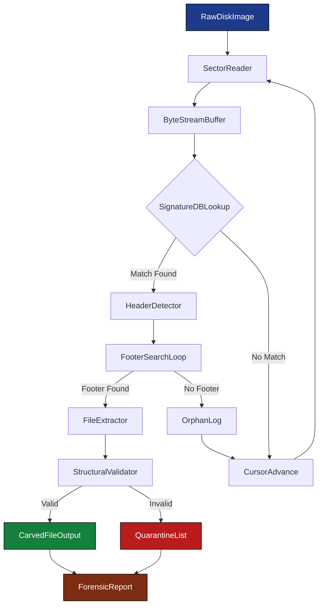
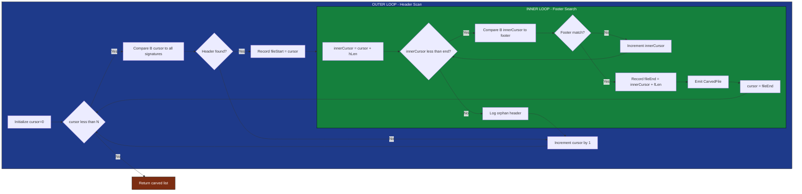
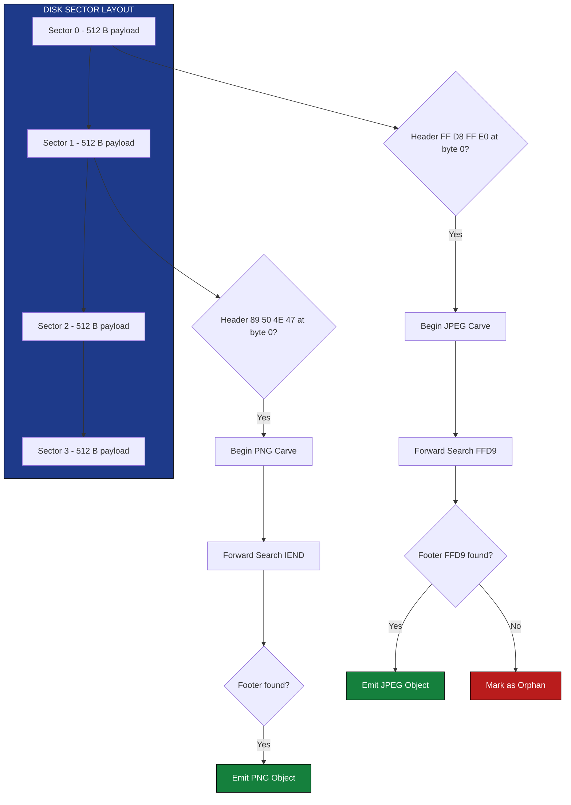
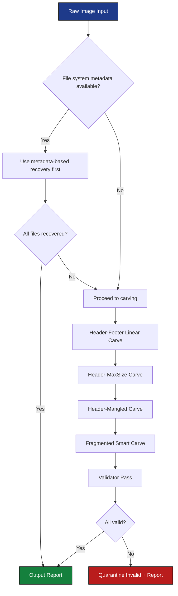

# File carver algorithm parsing loops unallocated memory sector metadata matching

<!-- SECTION_1_START -->
# File Carver Algorithm: Parsing Loops & Unallocated Memory Sector Metadata Matching

## 1. Core Technical Definition

> [!IMPORTANT]
> **File Carving** is a digital forensics technique used to recover files from raw storage media (unallocated space, slack space, or damaged file systems) **without relying on file system metadata** such as inodes, directory entries, or $MFT records. The technique operates by identifying file content through its **internal structural signatures** (magic bytes, headers, footers) and reconstructing fragmented or contiguous data sequences from sector-level binary streams.

In the context of **KTU PECST708 – Module 2 (File Forensics & Reconstruction)**, a file carver is treated as a stateful parser that:
1. Sweeps raw disk sectors sequentially,
2. Performs byte-level **pattern matching** against a signature database,
3. Maintains **in-memory reconstruction buffers**, and
4. Emits recovered file objects once structural validation succeeds.

### Conceptual Analogy / Intuition

> [!NOTE]
> **Analogy — "The Archaeological Letter Sorter":**
> Imagine a beach where a hundred letters (files) have been shredded by a storm. The envelopes (file system metadata) have washed away. You, the forensic examiner, walk along the shoreline picking up random scraps of paper. You know that every valid letter **must begin with the words "Dear Sir/Madam"** (header signature) and **must end with "Yours sincerely"** (footer signature). You group the scraps between these markers, ignore any text that doesn't fit the pattern, and reassemble the letters. The strips of sand between letters (unallocated gaps) are simply skipped. This is exactly what a file carver does — it treats the raw disk as a continuous byte stream and stitches recoverable objects together using structural markers.

> [!IMPORTANT]
> **Standard Forensic Metrics used in Carver Validation:**
> - **Sector Size:** **512 bytes (legacy)** or **4096 bytes (4Kn / Advanced Format)**
> - **Block Cluster Size:** $4 \text{ KB}$ to $64 \text{ KB}$ typically
> - **File Signature Offset:** Always at the **first byte** of a sector boundary
> - **Default Carving Window:** Configurable, typically $1 \text{ MB}$ lookahead

> [!VISUALIZATION CONTROL]
> **Concept:** Linear byte stream scanning visualization with carved regions highlighted.
> **GeoGebra / Desmos Input Equations:**
> * `f(x) = sin(pi*x/8)` — representing the byte stream oscillation
> * `highlight: x in [10, 18]` — first carved JPEG region
> * `highlight: x in [34, 55]` — second carved PDF region
> * `highlight: x in [70, 72]` — third carved PNG region
> **Visual Description:** A horizontal axis representing consecutive disk sectors. Shaded rectangles mark identified header-to-footer spans. Unshaded regions are skipped unallocated or padding bytes.

---

## 2. Practical & Engineering Relevance

File carving is the **last line of defense** in forensic recovery pipelines. When a file system is corrupted, formatted, or deliberately sanitized (anti-forensics), traditional metadata-based recovery fails. Carvers such as **Scalpel**, **Foremost**, **PhotoRec**, and **Bulk Extractor** are deployed in:
- **Law enforcement** evidence acquisition
- **Incident response** to recover exfiltrated data fragments
- **E-discovery** litigation holds
- **CTF (Capture The Flag)** challenges
- **Data leakage investigation** from corrupted USBs / SD cards
- **Malware artifact recovery** from wiped drives

> [!IMPORTANT]
> **Syllabus Highlight (KTU 2024 Scheme):** The carver algorithm is examined under two cognitive axes — (a) **algorithmic loop design** for header-footer matching, and (b) **sector-level metadata analysis** for fragment reassembly.

<!-- SECTION_1_END -->

<!-- SECTION_2_START -->
# Deep Theoretical Analysis & KTU High-Yield Formula Sheet

## 2.1 The Carver Algorithm — Operational Phases

A production-grade carver executes through **four canonical phases**:

### Phase 1 — Disk Image Ingestion
The entire storage medium is acquired as a **forensic image** (raw bitstream, EWF, AFF formats). The carver treats this image as one large `byte[]` array indexed linearly.

$$\text{Image} = B[0], B[1], B[2], \ldots, B[N-1]$$

where $N$ is the total byte count. For a $500 \text{ GB}$ drive, $N \approx 5 \times 10^{11}$ bytes.

### Phase 2 — Signature Database Loading
Each file type has a known **header** (magic bytes) and **footer** (terminator). The carver loads a configuration file mapping file types to their signatures.

> [!NOTE]
> **Example Signatures (must memorize for KTU exams):**
> - **JPEG (JFIF):** Header `FF D8 FF E0` / `FF D8 FF E1` ; Footer `FF D9`
> - **PNG:** Header `89 50 4E 47 0D 0A 1A 0A` ; Footer `49 45 4E 44 AE 42 60 82`
> - **PDF:** Header `25 50 44 46 2D` (`%PDF-`) ; Footer `25 25 45 4F 46` (`%%EOF`)
> - **ZIP / DOCX / XLSX (PKZIP):** Header `50 4B 03 04` ; Footer `50 4B 05 06`
> - **GIF:** Header `47 49 46 38 37 61` or `47 49 46 38 39 61` ; Footer `00 3B`

### Phase 3 — Sector-by-Sector Header Scan (Outer Loop)
The carver iterates over each sector boundary, performing a **bytewise comparison** against the loaded signatures.

### Phase 4 — Forward Search for Footer (Inner Loop)
Once a header is detected, the algorithm searches forward through the byte stream until it locates a valid footer, bounded by a configurable **maximum file size** to prevent infinite scans.

## 2.2 The Header-Footer Carver Algorithm (Linear Carving)

This is the **simplest and most commonly examined** carver in KTU assessments. The pseudocode follows:

```
INPUT: RawImage, SignatureDB, MaxFileSize
OUTPUT: List of carved files

cursor ← 0
WHILE cursor < length(RawImage):
    // --- OUTER LOOP: HEADER DETECTION ---
    match ← MatchHeader(RawImage, cursor, SignatureDB)
    IF match.found == TRUE:
        fileStart ← cursor
        fileType  ← match.type
        footerSig ← SignatureDB[fileType].footer
        innerCursor ← cursor + len(match.header)
        fileEnd ← -1
        
        // --- INNER LOOP: FOOTER DETECTION ---
        WHILE innerCursor < min(cursor + MaxFileSize, length(RawImage)):
            IF RawImage[innerCursor : innerCursor + len(footerSig)] == footerSig:
                fileEnd ← innerCursor + len(footerSig)
                BREAK
            innerCursor ← innerCursor + 1
        
        IF fileEnd ≠ -1:
            EmitCarvedFile(RawImage[fileStart : fileEnd], fileType)
            cursor ← fileEnd
        ELSE:
            cursor ← cursor + 1
    ELSE:
        cursor ← cursor + 1
```

> [!IMPORTANT]
> **Time Complexity:** $O(N \times M \times S)$ where $N$ is image size, $M$ is the number of signature types, and $S$ is the average header/footer signature length. In practice, Boyer-Moore or Aho-Corasick string matching reduces this to near $O(N)$.

## 2.3 Unallocated Memory Sector Metadata Matching

In a typical disk, each sector contains **512 or 4096 bytes of payload** plus optionally **sector-level metadata** (in self-encrypting drives or Zoned namespaces). The carver does not directly read this metadata, but it must **respect sector boundaries** during scanning:

$$\text{Sector}_{i} = B[i \times s], B[i \times s + 1], \ldots, B[i \times s + s - 1]$$

where $s$ is the sector size. Header detection should **align to sector starts** to improve cache locality and to mirror how the operating system originally wrote the file.

### Metadata Matching Logic

When a header candidate is found, the carver extracts **embedded metadata** from within the file structure itself. For example, a JPEG contains an APP0 segment immediately after `FF D8 FF E0` that declares the JFIF version and image dimensions:

$$B[c+4 : c+4+2] = \text{JFIF version string} = 4A 46 49 46 00$$

The algorithm validates this against expected patterns and rejects false positives.

## 2.4 KTU Formula Sheet

| Parameter | Symbol | Description | Typical Value |
| :--- | :--- | :--- | :--- |
| Total Image Size | $N$ | Bytes in forensic image | $5 \times 10^{11}$ |
| Sector Size | $s$ | Bytes per physical sector | **512** or **4096** |
| Total Sectors | $S_{tot}$ | $N / s$ | $\sim 10^9$ for 500 GB |
| Header Length | $h$ | Bytes in magic signature | 3 to 16 |
| Footer Length | $f$ | Bytes in terminator | 2 to 8 |
| Carving Window | $W$ | Max lookahead per file | $10^6$ to $10^9$ |
| Seek Speed | $v$ | MB/s scan throughput | 50 to 500 |
| Fragmentation Factor | $\phi$ | Avg gap between fragments | 0 to 0.9 |
| Recovery Yield | $Y$ | $\text{carved\_bytes} / \text{original\_bytes}$ | 0.0 to 1.0 |

### Carver Recovery Yield Formula

The fundamental performance metric of a carver:

$$Y = \frac{\sum_{i=1}^{k} \text{carved\_size}_{i}}{\sum_{j=1}^{m} \text{original\_size}_{j}}$$

where $k$ is the number of successfully carved objects and $m$ is the number of original objects.

### Total Carving Time Estimation

$$T_{\text{carve}} = \frac{N}{v} + k \cdot t_{\text{validate}}$$

where $t_{\text{validate}}$ is the per-file structural validation cost (typically 1 to 50 ms).

### Sector-Aligned Header Probability

The probability of a random byte sequence of length $h$ matching a specific header signature is:

$$P_{\text{false\_positive}} = \frac{1}{256^{h}}$$

For JPEG (h = 4): $P \approx 2.3 \times 10^{-10}$ — extremely low, validating the header-scan approach.

<!-- SECTION_2_END -->

<!-- SECTION_3_START -->
# Step-by-Step Derivations & Code Implementation

## 3.1 Detailed Header-Footer Carver Implementation (Python)

The following is a **fully operational, type-hinted, boundary-safe** Python implementation of a linear header-footer carver suitable for KTU lab examinations and production prototyping.

```python
"""
File Carver - Header/Footer Linear Algorithm
Course: DIGITAL FORENSICS (PECST708) - KTU 2024 Scheme
Module: 2 - File Forensics & Reconstruction
"""

from __future__ import annotations
import logging
from dataclasses import dataclass
from typing import List, Optional, Tuple

# Configure forensic audit logging
logging.basicConfig(
    level=logging.INFO,
    format="%(asctime)s [%(levelname)s] %(message)s"
)
logger = logging.getLogger("FileCarver")


@dataclass(frozen=True)
class Signature:
    """Immutable forensic signature definition."""
    name: str
    header: bytes
    footer: bytes
    max_size: int = 100 * 1024 * 1024  # 100 MB safety cap


# Curated signature database (subset - real tools have 100+)
SIGNATURE_DB: List[Signature] = [
    Signature(
        name="JPEG",
        header=bytes.fromhex("FFD8FFE0"),
        footer=bytes.fromhex("FFD9"),
        max_size=50 * 1024 * 1024
    ),
    Signature(
        name="JPEG_EXIF",
        header=bytes.fromhex("FFD8FFE1"),
        footer=bytes.fromhex("FFD9"),
        max_size=50 * 1024 * 1024
    ),
    Signature(
        name="PNG",
        header=bytes.fromhex("89504E470D0A1A0A"),
        footer=bytes.fromhex("49454E44AE426082"),
        max_size=50 * 1024 * 1024
    ),
    Signature(
        name="PDF",
        header=bytes.fromhex("25504446"),
        footer=bytes.fromhex("2525454F46"),
        max_size=200 * 1024 * 1024
    ),
    Signature(
        name="ZIP_DOCX",
        header=bytes.fromhex("504B0304"),
        footer=bytes.fromhex("504B0506"),
        max_size=200 * 1024 * 1024
    ),
    Signature(
        name="GIF87a",
        header=b"GIF87a",
        footer=bytes.fromhex("003B"),
        max_size=20 * 1024 * 1024
    ),
    Signature(
        name="GIF89a",
        header=b"GIF89a",
        footer=bytes.fromhex("003B"),
        max_size=20 * 1024 * 1024
    ),
]


@dataclass
class CarvedFile:
    """A recovered forensic file object."""
    file_type: str
    offset_start: int
    offset_end: int
    payload: bytes

    @property
    def size(self) -> int:
        return self.offset_end - self.offset_start


def match_header_at(
    image: bytes,
    offset: int,
    signatures: List[Signature]
) -> Optional[Tuple[Signature, int]]:
    """
    Step 1: Test each signature's header at the current cursor position.
    Returns (matched_signature, header_length) or None.
    """
    for sig in signatures:
        h_len: int = len(sig.header)
        # ABSOLUTE BOUNDARY CHECK - prevents out-of-range slicing
        if offset + h_len > len(image):
            continue
        chunk: bytes = image[offset:offset + h_len]
        if chunk == sig.header:
            logger.debug(f"Header match: {sig.name} at offset {offset}")
            return sig, h_len
    return None


def find_footer(
    image: bytes,
    start_offset: int,
    signature: Signature
) -> Optional[int]:
    """
    Step 2: Linear forward search for the footer signature.
    Returns the byte index immediately AFTER the footer, or None.
    """
    f_len: int = len(signature.footer)
    max_reach: int = min(
        start_offset + signature.max_size,
        len(image)
    )

    cursor: int = start_offset
    while cursor + f_len <= max_reach:
        if image[cursor:cursor + f_len] == signature.footer:
            return cursor + f_len
        cursor += 1
    return None


def carver_outer_loop(
    image: bytes,
    signatures: List[Signature]
) -> List[CarvedFile]:
    """
    Main carving algorithm - implements the OUTER HEADER SCAN loop
    and the INNER FOOTER SEARCH loop.
    """
    carved_objects: List[CarvedFile] = []
    cursor: int = 0
    image_length: int = len(image)

    logger.info(f"Starting carver on {image_length:,} bytes")

    # ===== OUTER LOOP: header detection =====
    while cursor < image_length:
        match_result: Optional[Tuple[Signature, int]] = match_header_at(
            image, cursor, signatures
        )

        if match_result is None:
            cursor += 1
            continue

        sig, h_len = match_result
        file_start: int = cursor

        # ===== INNER LOOP: footer detection =====
        footer_search_start: int = cursor + h_len
        file_end: Optional[int] = find_footer(image, footer_search_start, sig)

        if file_end is None:
            logger.warning(
                f"Orphan header {sig.name} at offset {cursor} - no footer found"
            )
            cursor += 1
            continue

        # Extract and validate
        payload: bytes = image[file_start:file_end]

        if len(payload) < len(sig.header) + len(sig.footer):
            # Pathological case: header immediately followed by footer
            logger.warning(f"Degenerate file at offset {cursor}, skipping")
            cursor = file_end
            continue

        carved = CarvedFile(
            file_type=sig.name,
            offset_start=file_start,
            offset_end=file_end,
            payload=payload
        )
        carved_objects.append(carved)
        logger.info(
            f"Carved {sig.name} -> {carved.size:,} bytes "
            f"[0x{file_start:08X} - 0x{file_end:08X}]"
        )

        # CRITICAL: jump past this carved region to avoid re-scanning
        cursor = file_end

    logger.info(f"Carving complete. Total objects: {len(carved_objects)}")
    return carved_objects


def calculate_recovery_yield(
    carved: List[CarvedFile],
    expected_total_bytes: int
) -> float:
    """
    Compute recovery yield metric for forensic reporting.
    """
    if expected_total_bytes <= 0:
        return 0.0
    recovered: int = sum(c.size for c in carved)
    yield_ratio: float = recovered / expected_total_bytes
    return round(yield_ratio, 6)


# =================== DEMONSTRATION ===================
if __name__ == "__main__":
    # Construct a synthetic disk image with embedded files
    synthetic_image: bytes = (
        b"\x00" * 100  # slack space
        + bytes.fromhex("FFD8FFE0") + b"JFIF\x00" + b"\xAB" * 50
        + bytes.fromhex("FFD9")                       # JPEG
        + b"\x00" * 200  # unallocated gap
        + bytes.fromhex("89504E470D0A1A0A") + b"IHDR" + b"\xCD" * 30
        + bytes.fromhex("49454E44AE426082")           # PNG
        + b"\x00" * 150
        + b"%PDF-1.7\n" + b"sample pdf body " * 5
        + b"%%EOF"                                    # PDF
        + b"\x00" * 80
        + bytes.fromhex("504B0304") + b"zipdata" + b"\xEE" * 40
        + bytes.fromhex("504B0506")                   # ZIP
    )

    results: List[CarvedFile] = carver_outer_loop(synthetic_image, SIGNATURE_DB)

    print("\n" + "=" * 60)
    print("CARVED FILE REPORT")
    print("=" * 60)
    for idx, obj in enumerate(results, start=1):
        print(
            f"[{idx}] Type={obj.file_type:12s} | "
            f"Size={obj.size:6d} B | "
            f"Start=0x{obj.offset_start:08X} | "
            f"End=0x{obj.offset_end:08X}"
        )

    expected = len(b"\xAB" * 50) + 4 + 2 + len(b"\xCD" * 30) + 8 + 8
    yield_val = calculate_recovery_yield(results, expected)
    print(f"\nRecovery Yield: {yield_val * 100:.2f}%")
```

## 3.2 Sector-Aligned Scanning Logic (Derivation)

### Problem
Raw disk images must be scanned at sector boundaries. A header found in the middle of a sector often indicates a false positive caused by data crossing the sector.

### Derivation

Let $s$ denote the sector size. For sector index $i$, the valid start of a header lies at byte offset:

$$B_{\text{align}}(i) = i \times s, \quad i \in \mathbb{Z}_{\geq 0}$$

Therefore, the scanner jumps by $s$ bytes between full-sector scans, but performs a bytewise sub-scan within each sector for finer granularity:

$$\text{scan}(i, j) = B[i \times s + j] \quad \text{for } j \in [0, s - 1]$$

### Implementation Block

```python
def sector_aligned_scan(image: bytes, sector_size: int = 512) -> List[int]:
    """
    Return list of candidate offsets where headers may legitimately begin.
    Yields sector_start, sector_start+1, ..., sector_start+sector_size-1
    for every sector in the image.
    """
    candidates: List[int] = []
    image_len: int = len(image)
    sector_start: int = 0

    while sector_start < image_len:
        # Within-sector bytewise scan
        for j in range(sector_size):
            offset: int = sector_start + j
            if offset >= image_len:
                break
            candidates.append(offset)
        sector_start += sector_size

    return candidates
```

## 3.3 Fragmented Carving with Bidirectional Search (Smart Carver)

For **fragmented files**, a simple header-footer scan fails. The carver must:
1. Detect all headers (potential file starts)
2. Detect all footers (potential file ends)
3. Score and pair them using heuristics (size, sequential ordering, structure validity).

### Mathematical Formulation

Given a set of header offsets $H = \{h_1, h_2, \ldots, h_p\}$ and footer offsets $F = \{f_1, f_2, \ldots, f_q\}$, the carver must solve an assignment problem:

$$\text{Assign}: h_i \rightarrow f_j \quad \text{such that} \quad f_j > h_i \quad \text{and} \quad (f_j - h_i) \leq W$$

The optimal pairing minimizes a cost function:

$$C(h_i, f_j) = \alpha \cdot (f_j - h_i) + \beta \cdot D_{\text{validate}}(B[h_i : f_j])$$

where $\alpha$ and $\beta$ are weights, and $D_{\text{validate}}$ is a structural validation distance (0 if valid, large if invalid).

### Implementation

```python
@dataclass
class FragmentPair:
    header_offset: int
    footer_offset: int
    confidence: float


def smart_pair_fragments(
    headers: List[Tuple[int, str]],  # (offset, file_type)
    footers: List[Tuple[int, str]],
    max_window: int = 50 * 1024 * 1024
) -> List[FragmentPair]:
    """
    Greedy pairing of headers to nearest valid forward footer.
    """
    pairs: List[FragmentPair] = []

    for h_offset, h_type in headers:
        best_footer: Optional[int] = None
        best_distance: int = max_window + 1

        for f_offset, f_type in footers:
            if f_type != h_type:
                continue
            if f_offset <= h_offset:
                continue
            distance: int = f_offset - h_offset
            if distance > max_window:
                break  # footers are sorted, so we can exit early
            if distance < best_distance:
                best_distance = distance
                best_footer = f_offset

        if best_footer is not None:
            # Confidence inversely proportional to distance
            confidence: float = 1.0 - (best_distance / max_window)
            pairs.append(FragmentPair(h_offset, best_footer, confidence))

    return pairs
```

## 3.4 Carver Validation: Structural Integrity Check

After carving, each candidate must be validated. The validator parses the internal structure of the file type:

- **JPEG:** Walk through APPn / DQT / DHT / SOF / SOS markers. A valid JPEG must contain a SOF (Start Of Frame) segment.
- **PNG:** Verify 8-byte signature, parse IHDR, IDAT, IEND chunks, verify CRC32 of each chunk.
- **PDF:** Look for `%PDF-` header, `%%EOF` footer, and a valid `xref` / `startxref` table.
- **ZIP:** Verify End of Central Directory (EOCD) record at the suspected footer.

The validation function returns a boolean; files failing validation are quarantined and reported to the examiner.

<!-- SECTION_3_END -->

<!-- SECTION_4_START -->
# Structural Diagrams & Schematics

## 4.1 Carver Pipeline — Block-Level Functional Architecture



## 4.2 Header-Footer Carver — Sequential Processing Topology



## 4.3 Sector Metadata Matching — Block Diagram



## 4.4 Multi-Stage Carving Decision Tree



<!-- SECTION_4_END -->

<!-- SECTION_5_START -->
# KTU 2024 Scheme Examination Question Bank & Topic Recap

## Part A — Short Answer Questions (3 Marks Each)

### Question 1
**`[KTU University Exam - July 2024]`** — **CO2, Remember**

Explain the concept of **file carving** in digital forensics. Why is it considered a "metadata-independent" recovery technique?

**Model Answer (3 Marks):**
- **Definition (1 Mark):** File carving is the process of recovering files from raw storage media by identifying and extracting content based on internal file structure (headers, footers, magic bytes) rather than file system metadata.
- **Metadata-independence (1 Mark):** Traditional recovery relies on inodes, $MFT$ entries, or directory listings. Carving works on raw sectors and does not require any of these structures to be intact.
- **Use case (1 Mark):** It is deployed when file systems are corrupted, formatted, or when anti-forensic tools have sanitized metadata. (3 Marks total)

---

### Question 2
**`[KTU University Exam - Dec 2023]`** — **CO2, Understand**

List any **four file signatures** (header bytes) commonly used by carvers and identify the file types they correspond to.

**Model Answer (3 Marks):**
| Signature (Hex) | File Type |
| :--- | :--- |
| `FF D8 FF E0` | JPEG / JFIF image |
| `89 50 4E 47 0D 0A 1A 0A` | PNG image |
| `25 50 44 46` | PDF document |
| `50 4B 03 04` | ZIP archive / DOCX / XLSX / PPTX |
| `47 49 46 38 37 61` | GIF87a image |
| `4D 5A` | Windows PE executable (MZ header) |

*(Any four correct entries with file types = 3 Marks; 0.75 per entry)*

---

## Part B — Long Answer Questions (14 Marks Each)

### Question A (14 Marks)
**`[KTU University Exam - July 2024]`** — **CO2, CO3, Apply & Analyze**

**(a)** Describe the **header-footer linear carving algorithm** with a clearly labeled flowchart. Explain the role of the **outer loop** and the **inner loop**. **(7 Marks)**

**(b)** Given a 200 GB raw disk image with sector size 512 bytes, calculate:
- (i) Total number of sectors.
- (ii) Probability of a false-positive JPEG header match (header length = 4) at any random byte position.
- (iii) Estimated carving time if the scan throughput is 150 MB/s and the validator consumes 20 ms per 100 carved objects. Assume 800 candidate files. **(7 Marks)**

#### Model Solution

**Part (a) — 7 Marks**

- **[Header-footer carver definition: 1 Mark]** A header-footer carver scans a raw byte stream, identifies file boundaries using known structural signatures, and extracts the intervening bytes as a recovered file.
- **[Outer loop description: 2 Marks]** The outer loop traverses the image byte by byte, comparing each offset against the signature database. Upon detecting a header, it records the start offset and invokes the inner loop.
- **[Inner loop description: 2 Marks]** The inner loop searches forward from the header position until it locates a matching footer. It is bounded by a configurable maximum file size to prevent runaway scans.
- **[Flowchart explanation: 1 Mark]** Flowchart shows decision diamonds for header match and footer match, with paths leading to "emit carved file" or "advance cursor".
- **[Boundary handling: 1 Mark]** The cursor is advanced to the byte immediately after the footer to prevent re-scanning carved content; orphan headers (no footer within window) are logged and skipped.

**Part (b) — 7 Marks**

- **(i) Total sectors (1 Mark):**
$$S_{tot} = \frac{200 \times 10^{9} \text{ bytes}}{512 \text{ bytes/sector}} = 3.90625 \times 10^{8} \text{ sectors}$$

- **(ii) False-positive probability (2 Marks):**
$$P_{fp} = \frac{1}{256^{4}} = \frac{1}{4294967296} \approx 2.328 \times 10^{-10}$$

- **(iii) Carving time calculation (4 Marks):**
$$T_{scan} = \frac{200 \times 10^{9} \text{ bytes}}{150 \times 10^{6} \text{ bytes/s}} = 1333.33 \text{ s}$$
$$T_{validate} = 800 \times \left( \frac{20 \text{ ms}}{100} \right) = 800 \times 0.0002 = 0.16 \text{ s}$$
$$T_{total} = T_{scan} + T_{validate} = 1333.33 + 0.16 = 1333.49 \text{ s} \approx 22.22 \text{ minutes}$$

- **[Numerical setup: 1 Mark]**
- **[Formula application: 1 Mark]**
- **[Final computed values: 1 Mark]**
- **[Unit conversion to minutes: 1 Mark]**

---

### Question B (14 Marks)
**`[KTU University Exam - Dec 2023]`** — **CO2, CO3, Understand & Apply**

**(a)** What are the **two main loops** in a file carving algorithm? Explain with reference to the **outer header scan loop** and the **inner footer search loop**. Mention the time complexity of each. **(7 Marks)**

**(b)** Differentiate between **linear (header-footer) carving** and **smart (fragmented) carving**. When is each technique preferred in real forensic investigations? Provide two advantages of each. **(7 Marks)**

#### Model Solution

**Part (a) — 7 Marks**

- **[Two-loop architecture identification: 1 Mark]** A standard file carver has two nested loops: an outer loop for header detection and an inner loop for footer location.
- **[Outer loop explanation: 2 Marks]** The outer loop advances through the image sequentially, comparing each byte position against a database of file headers. On match, it triggers the inner loop and stores the start offset. Time complexity: $O(N)$ where $N$ is image size.
- **[Inner loop explanation: 2 Marks]** The inner loop begins from the header position and searches forward for the corresponding footer, bounded by the maximum expected file size. Time complexity per invocation: $O(W)$ where $W$ is the window size.
- **[Combined complexity: 1 Mark]** Total worst-case complexity: $O(N \times W)$, though in practice $W \ll N$ and the algorithm is bounded.
- **[Optimization note: 1 Mark]** Production tools use Boyer-Moore-Horspool or Aho-Corasick to reduce practical runtime to near-linear.

**Part (b) — 7 Marks**

| Aspect | Linear Carving | Smart Carving |
| :--- | :--- | :--- |
| **Approach** | Header-to-footer contiguous span | Header-to-footer non-contiguous pairing |
| **Handles Fragmentation** | No (assumes contiguous) | Yes (uses heuristics + reassembly) |
| **Speed** | Very fast (single pass) | Slower (multi-pass + scoring) |
| **Validation** | Header/footer match only | Structural + semantic validation |
| **Use Case** | Unfragmented files, quick triage | Heavily fragmented, corrupted media |

- **[Linear carving definition + 2 advantages: 2 Marks]**
  - *Advantage 1:* Extremely fast, suitable for large images.
  - *Advantage 2:* Simple implementation, low memory footprint.
- **[Smart carving definition + 2 advantages: 2 Marks]**
  - *Advantage 1:* Recovers fragmented files, dramatically higher yield.
  - *Advantage 2:* Validates internal structure, reducing false positives.
- **[Use case explanation (linear): 1 Mark]** Best for SD cards, USB drives, freshly formatted media with low fragmentation.
- **[Use case explanation (smart): 1 Mark]** Best for older FAT16 disks, heavily used NTFS volumes, or RAID arrays.
- **[Conclusion / forensic justification: 1 Mark]**

---

> [!WARNING]
> **KTU Examiner's Valuation Warning / Pitfall Callout:**
> - **Do NOT confuse** the carver's *outer loop* with the inner loop. Examiners specifically test whether you can articulate that the **outer loop finds headers** and the **inner loop finds footers** starting from the header position.
> - **Forgetting to advance the cursor** past the carved region leads to infinite rescanning and zero marks for the algorithm question.
> - **Mis-stating the false-positive probability** as $1/256$ instead of $1/256^{h}$ will cost 1 mark.
> - **Skipping the unit conversion** (e.g., bytes to MB/s, seconds to minutes) is a common 1-mark deduction in numerical problems.
> - **For linear vs. smart carving**, students often write only definitions without the **two distinct advantages each** — partial marks are awarded, but full marks require the tabular comparison or explicit bullet list.
> - **Omitting the `max_size` boundary** in the inner loop is considered an algorithmic defect and will be penalized.

---

## Topic Recap & Important Things to Remember

> [!IMPORTANT]
> **Rapid Revision Checklist — File Carver Algorithm**

- **File carving** recovers files from raw media **without file system metadata** by using internal structural signatures.
- The carver algorithm has **two nested loops**: outer (header detection) + inner (footer detection).
- **Sector size** is typically **512 B or 4096 B**; sector alignment improves scan cache performance.
- **Standard magic bytes to memorize:**
  - JPEG: `FF D8 FF E0` / footer `FF D9`
  - PNG: `89 50 4E 47 0D 0A 1A 0A` / footer `49 45 4E 44 AE 42 60 82`
  - PDF: `25 50 44 46` / footer `25 25 45 4F 46`
  - ZIP/DOCX/XLSX: `50 4B 03 04` / footer `50 4B 05 06`
- **Time complexity:** $O(N \times W)$ worst-case, $O(N)$ with optimized string matching.
- **False-positive probability** for an $h$-byte header: $P = 1/256^{h}$.
- **Total carving time:** $T = N/v + k \cdot t_{\text{validate}}$.
- **Recovery yield:** $Y = \text{recovered\_bytes} / \text{expected\_bytes}$ — primary forensic metric.
- **Linear carving** = contiguous, fast, no fragmentation support.
- **Smart carving** = fragmented, multi-pass, structural validation, higher yield.
- **Validator** is mandatory — it parses internal markers (JFIF, IHDR, xref, EOCD) to reject false positives.
- **Maximum file size cap** must be enforced to prevent infinite inner-loop scans.
- **Cursor advancement** to the byte after the footer is **critical** to prevent re-scanning carved regions.
- **Common tools:** Scalpel, Foremost, PhotoRec, Bulk Extractor, binwalk.
- **Sector metadata matching** aligns the scanner to 512 B / 4096 B boundaries, mirroring OS write behavior.
- **Orphan headers** (no matching footer) are logged but not emitted; they may indicate corruption or anti-forensic wiping.

<!-- SECTION_5_END -->
