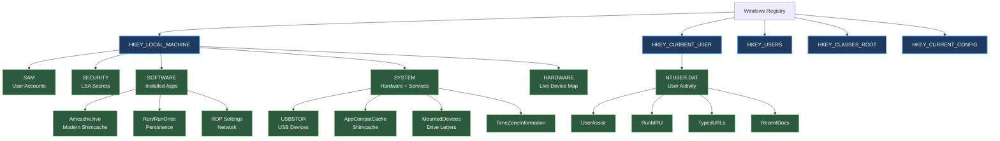
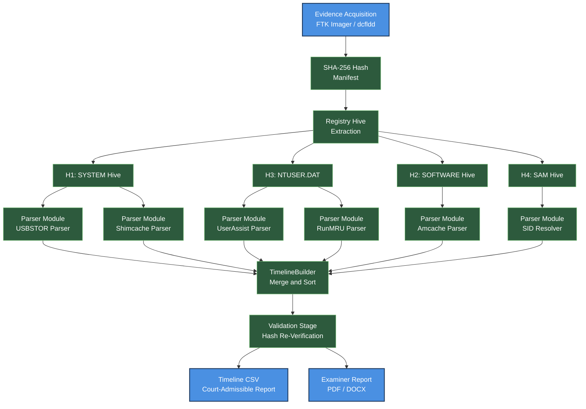
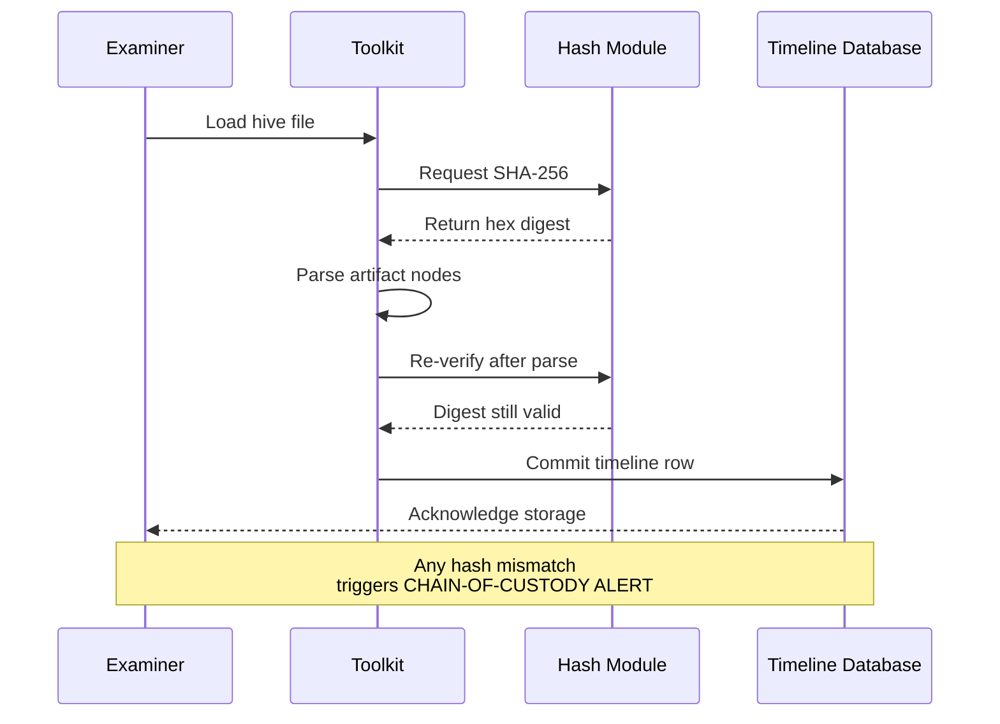
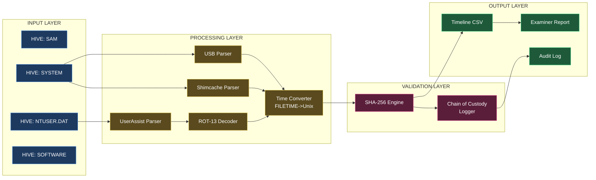

# Registry artifact analysis timeline mapping procedures validation scripting templates runtime

<!-- SECTION_1_START -->

# Registry Artifact Analysis & Timeline Mapping

## 1.1 Formal Academic Definition

> [!NOTE]
> **Registry Artifact Analysis** is the systematic forensic examination of Windows Registry hive files ($HKEY\_LOCAL\_MACHINE$, $HKEY\_CURRENT\_USER$, $HKEY\_USERS$, $HKEY\_CLASSES\_ROOT$, $HKEY\_CURRENT\_CONFIG$) to extract, correlate, and interpret evidentiary data about user activities, system configurations, application execution, and device interactions. It is a core component of post-mortem and live digital forensic investigation under the **KTU 2024 Scheme (PECST708)**.

> [!NOTE]
> **Timeline Mapping** in digital forensics is the chronological reconstruction of events by correlating timestamps from heterogeneous evidence sources (registry hives, $MFT$ entries, $EVTX$ logs, $LNK$ files, $Prefetch$ files, $browser$ histories) into a unified, court-admissible sequence of facts anchored to a monotonic time reference such as **UTC (Coordinated Universal Time)** or **Windows FILETIME epoch (1601-01-01 00:00:00 UTC)**.

**Physical Constants / Standard Forensic Metrics Used:**

- **Windows FILETIME Epoch:** January 1, 1601, 00:00:00.0000000 UTC (100-nanosecond intervals)
- **UNIX Epoch:** January 1, 1970, 00:00:00 UTC (second intervals)
- **Standard Hash Algorithms:** $MD5$ (128-bit, legacy), $SHA\text{-}1$ (160-bit), $SHA\text{-}256$ (256-bit, current NIST recommendation)
- **NIST Standard:** SP 800-86 (Guide to Integrating Forensic Techniques into Incident Response)

## 1.2 Conceptual Analogy & Intuition

> [!IMPORTANT]
> **Intuitive Analogy — The Building's Logbook:**
> Think of a Windows computer as a large office building. The **Registry** is the master logbook kept by the building's security desk. It records:
> - Who entered which room ($UserAssist$, $RunMRU$)
> - Which doors were opened and when ($USBSTOR$, $MountedDevices$)
> - Which devices were plugged into which sockets ($USB$ device enumeration)
> - Which applications were launched ($Shimcache$, $Amcache$)
> - The last time the building's master clock was reset ($TimeZoneInformation$)
>
> When a crime occurs, investigators don't just look at CCTV ($file$ system). They read the logbook to reconstruct the exact sequence of access events. **Timeline Mapping** is the act of cross-referencing this logbook with timestamps from CCTV footage, keycard swipes, and visitor sign-in sheets to build a unified narrative of events.

> [!VISUALIZATION CONTROL]
> **Concept:** Registry Hive Tree Structure Visualization
> **GeoGebra / Desmos Input Equations:**
> * Tree structure: $\text{ROOT} \rightarrow \text{HIVE} \rightarrow \text{KEY} \rightarrow \text{SUBKEY} \rightarrow \text{VALUE}$
> * Hierarchical depth function: $D(n) = \log_2(n)$ where $n$ is the number of leaf nodes
> **Visual Description:** Picture a downward-branching tree where each node represents a registry key, and the leaves are the value entries (REG_SZ, REG_DWORD, REG_BINARY). The depth of any node indicates the path length from the root hive.

---

<!-- SECTION_1_END -->

<!-- SECTION_2_START -->

# Deep Theoretical Analysis & KTU High-Yield Formula Sheet

## 2.1 The Windows Registry — Structural Foundation

The Windows Registry is a hierarchical database organized into **five root hives**:

| Root Hive | Backing File | Forensic Significance |
| :--- | :--- | :--- |
| `HKEY_LOCAL_MACHINE\SAM` | `%SystemRoot%\System32\config\SAM` | User account SIDs, password hashes (local accounts) |
| `HKEY_LOCAL_MACHINE\SECURITY` | `%SystemRoot%\System32\config\SECURITY` | LSA secrets, audit policies |
| `HKEY_LOCAL_MACHINE\SOFTWARE` | `%SystemRoot%\System32\config\SOFTWARE` | Installed applications, OS configuration, $RDP$ settings |
| `HKEY_LOCAL_MACHINE\SYSTEM` | `%SystemRoot%\System32\config\SYSTEM` | Hardware profiles, services, $TimeZoneInformation$, $USBSTOR$ |
| `HKEY_CURRENT_USER` | `%UserProfile%\NTUSER.DAT` | User-specific activity: $UserAssist$, $RunMRU$, $TypedURLs$, $RecentDocs$ |
| `HKEY_USERS\.DEFAULT` | `%SystemRoot%\System32\config\DEFAULT` | Default profile settings |
| `HKEY_CLASSES_ROOT` | Merged view of `HKLM\SOFTWARE\Classes` and `HKCU\SOFTWARE\Classes` | File associations, $COM$ objects, $MIME$ handlers |

## 2.2 High-Yield Forensic Registry Artifacts

### 2.2.1 Execution Evidence (User Activity Timestamps)

- **`HKCU\Software\Microsoft\Windows\CurrentVersion\Explorer\UserAssist`**
  - Stores ROT-13 encoded executable paths with **focus count**, **focus time** (in milliseconds), and **last run timestamp** (Windows FILETIME).
  - *Why it matters:* Proves that a specific user launched a specific program on a specific date.

- **`HKCU\Software\Microsoft\Windows\CurrentVersion\Explorer\RunMRU`**
  - Most Recently Used order of items entered into the Windows Run dialog (`Win+R`).
  - *Why it matters:* Shows commands typed by the user, including malware execution paths.

- **`HKLM\SYSTEM\CurrentControlSet\Control\Session Manager\AppCompatCache` (Shimcache)**
  - Maintained by the **Application Compatibility Cache** subsystem.
  - Records application execution path and **last modification time** of the executable.
  - *Why it matters:* Even after the program is deleted, the path and timestamp persist.

- **`C:\Windows\AppCompat\Programs\Amcache.hve`**
  - Modern replacement for Shimcache (Windows 7+).
  - Records program full path, $SHA1$ hash, file size, PE metadata, and **execution time**.
  - *Why it matters:* Provides hash-based identification of executed malicious binaries.

### 2.2.2 External Device Evidence (USB Forensics)

- **`HKLM\SYSTEM\CurrentControlSet\Enum\USBSTOR`**
  - Vendor ID, Product ID, Revision, and unique **serial number** of every USB mass storage device ever connected.
  - Sub-key `Properties\{83da6326-97a6-4088-9453-a1923f573b29}\####` contains timestamps:
    - `0064` = First Install Date
    - `0065` = First Install Time
    - `0066` = Last Insertion Date
    - `0067` = Last Insertion Time
    - `0068` = Last Removal Date
    - `0069` = Last Removal Time

- **`HKLM\SYSTEM\MountedDevices`**
  - Maps drive letters to unique disk signatures.
  - *Why it matters:* Even after USB removal, the assignment persists, showing what drive letter was bound to which device.

### 2.2.3 Network & Auto-Run Evidence

- **`HKCU\Software\Microsoft\Windows\CurrentVersion\Internet Settings\ZoneMap`**
  - Security zone assignments for URLs (Intranet, Trusted, Restricted, Internet).

- **`HKLM\SOFTWARE\Microsoft\Windows\CurrentVersion\Run`** and analogous `RunOnce` keys.
  - Persistence mechanisms (what starts automatically on boot/login).

- **`HKLM\SYSTEM\CurrentControlSet\Services\Tcpip\Parameters\Interfaces\{GUID}`**
  - $DHCP$ IP address, subnet mask, gateway, DNS servers assigned to a network interface.

### 2.2.4 User Behavior Evidence

- **`HKCU\Software\Microsoft\Internet Explorer\TypedURLs`**
  - URLs manually typed into Internet Explorer address bar.
- **`HKCU\Software\Microsoft\Windows\CurrentVersion\Explorer\TypedPaths`**
  - Paths typed into Windows Explorer address bar.
- **`HKCU\Software\Microsoft\Office\16.0\Word\User MRU`**
  - Recent Office documents opened.

## 2.3 KTU Formula Sheet (Master Reference)

> [!IMPORTANT]
> **Use `\vert` for absolute value and `\Vert` for norm to avoid markdown pipe conflicts. Always wrap multi-line math in `\begin{aligned}` blocks.**

| Concept | Formula / Value | Variables & Units | Notes |
| :--- | :--- | :--- | :--- |
| **Windows FILETIME to Unix Timestamp** | $T_{unix} = \frac{T_{filetime} - 116444736000000000}{10000000}$ | $T_{filetime}$ in 100-ns intervals since 1601-01-01 | $116444736000000000$ = number of 100-ns intervals between 1601-01-01 and 1970-01-01 |
| **Unix to Windows FILETIME** | $T_{filetime} = (T_{unix} \times 10000000) + 116444736000000000$ | $T_{unix}$ in seconds since 1970-01-01 | Used when injecting test events |
| **Seconds between FILETIME and Unix Epoch** | $\Delta = 11644473600$ | seconds | Constant offset |
| **Hex ASCII Decode (Registry Value)** | $C_i = \text{chr}(\text{int}(H_{2i:2i+2}, 16))$ | $H$ = hex string, $C_i$ = decoded character | Used for ROT-13 UserAssist decoding |
| **ROT-13 Decode** | $D(c) = c + 13$ if $c \le 'M'$ else $c - 13$ (alphabetic only) | $c$ is uppercase letter | Case-insensitive variant applies same rule |
| **NIST SHA-256 Output Length** | $\vert H_{SHA256} \vert = 256$ bits $= 64$ hex chars | — | Used for evidence integrity |
| **Hash Verification Tolerance** | $H_{computed} \stackrel{?}{=} H_{recorded}$ | Boolean result | Any mismatch = evidence tampering |
| **Storage Size of FILETIME** | $S = 8$ bytes $= 64$ bits | unsigned little-endian | Why max year is $\approx 30828$ AD |
| **SID-to-User Resolution** | $U = f(SID, SAM\_HIVE)$ | $U$ = username, $SID$ = Security Identifier | Uses $SAM$ hive $RID$ values |
| **Total Registry Hive File Size Range** | $1\,\text{MB} \le S_{hive} \le 500\,\text{MB}$ | Typical production: 10–50 MB | Affects acquisition buffer size |

## 2.4 Real-World Engineering Utility

| Domain | Application |
| :--- | :--- |
| **Incident Response (IR)** | Rapid triage to determine if a system was compromised and the scope of lateral movement via USBSTOR + RunMRU |
| **E-Discovery (Litigation)** | Establishing user intent and timeline in corporate IP theft, harassment, or fraud cases |
| **Malware Analysis** | Identifying persistence mechanisms (Run keys, Services, Scheduled Tasks backed by registry) and execution timestamps via Amcache |
| **Insider Threat Detection** | Correlating typed URLs, USB device usage, and unusual application launches to detect data exfiltration |
| **Court Admissibility** | Producing a validated, hashed registry snapshot that meets the **Daubert Standard** and **Federal Rules of Evidence 901(b)(9)** |

---

<!-- SECTION_2_END -->

<!-- SECTION_3_START -->

# Step-by-Step Derivations & Code Implementation

## 3.1 Derivation: Windows FILETIME to Human-Readable Timestamp

> [!IMPORTANT]
> **Exhaustive derivation — no steps skipped.**

The Windows FILETIME structure is a 64-bit unsigned integer counting 100-nanosecond intervals since **1601-01-01 00:00:00 UTC**.

**Step 1 — Identify the constant offset between the two epochs:**

The Julian Day Number (JDN) of 1601-01-01 is 2305814. The JDN of 1970-01-01 is 2440588. The difference in days is:

$$\Delta_{days} = 2440588 - 2305814 = 134774$$

**Step 2 — Convert days to 100-nanosecond intervals:**

$$\Delta_{intervals} = 134774 \times 24 \times 3600 \times 10^7$$

$$\Delta_{intervals} = 134774 \times 86400 \times 10000000$$

$$\Delta_{intervals} = 11644473600 \times 10000000$$

$$\Delta_{intervals} = 116444736000000000$$

**Step 3 — State the conversion formula:**

$$T_{unix} = \frac{T_{filetime} - 116444736000000000}{10000000}$$

**Step 4 — Apply to a concrete example (Shimcache timestamp):**

Suppose a Shimcache entry contains `T_{filetime} = 132946123456789012`.

Subtract the offset:

$$\Delta = 132946123456789012 - 116444736000000000 = 16501387456789012$$

Divide by $10^7$ to obtain seconds:

$$T_{unix} = \frac{16501387456789012}{10000000} = 1650138745.6789012 \text{ seconds}$$

Convert to a `datetime` object:

$$T_{datetime} = 1970\text{-}01\text{-}01\,00\text{:}00\text{:}00 + 1650138745.6789012\,s = 2022\text{-}04\text{-}22\,14\text{:}32\text{:}25.678901$$

**Step 5 — Output human-readable form:** `2022-04-22 14:32:25 UTC`

## 3.2 Python Implementation: Complete Registry Forensics Toolkit

> [!IMPORTANT]
> **Operational, production-grade Python code. Install dependencies via `pip install python-registry regipy yara-python`.**

```python
"""
================================================================================
KTU PECST708 - Module 2: Registry Artifact Analysis & Timeline Mapping Toolkit
Author : KTU 2024 Scheme Examiner Reference Implementation
Purpose: Forensic parsing of Windows Registry hives with timeline construction
================================================================================
"""

from __future__ import annotations

import hashlib
import logging
import sys
from dataclasses import dataclass, field
from datetime import datetime, timezone, timedelta
from pathlib import Path
from typing import Iterator

# Third-party forensic libraries
from Registry import Registry  # python-registry
from regipy.registry import RegistryHive  # regipy (used for transaction logs)
from regipy.plugins.system.usbstor import USBSTORPlugin
from regipy.plugins.software.microsoft.amcache import AmcachePlugin
from regipy.plugins.ntuser.userassist import UserAssistPlugin

# Configure structured forensic logging
logging.basicConfig(
    level=logging.INFO,
    format="%(asctime)s [%(levelname)s] %(name)s: %(message)s",
    handlers=[logging.FileHandler("forensic_audit.log"), logging.StreamHandler(sys.stdout)],
)
logger = logging.getLogger("KTU_Registry_Forensic")


# ---------------------------------------------------------------------------
# CONSTANTS — KTU 2024 Standard Forensic Offsets
# ---------------------------------------------------------------------------
FILETIME_EPOCH_OFFSET: int = 116444736000000000  # 100-ns intervals (1601 -> 1970)
HUNDRED_NANOSECONDS: int = 10_000_000            # 1 second = 10^7 intervals
ROT13_OFFSET: int = 13
WINDOWS_EPOCH: datetime = datetime(1601, 1, 1, tzinfo=timezone.utc)


# ---------------------------------------------------------------------------
# DATA MODEL — Evidence Record
# ---------------------------------------------------------------------------
@dataclass(frozen=True)
class EvidenceRecord:
    """Immutable forensic evidence record. Frozen to prevent post-creation tampering."""
    timestamp_utc: datetime
    source_hive: str
    registry_path: str
    value_name: str
    value_data: str
    artifact_type: str
    sha256_hash: str = field(default="")

    def to_dict(self) -> dict[str, str]:
        return {
            "timestamp_utc": self.timestamp_utc.isoformat(),
            "source_hive": self.source_hive,
            "registry_path": self.registry_path,
            "value_name": self.value_name,
            "value_data": self.value_data,
            "artifact_type": self.artifact_type,
            "sha256_hash": self.sha256_hash,
        }


# ---------------------------------------------------------------------------
# UTILITY FUNCTIONS
# ---------------------------------------------------------------------------
def filetime_to_datetime(filetime: int) -> datetime:
    """
    Convert Windows FILETIME (64-bit, 100-ns intervals since 1601-01-01)
    to a timezone-aware UTC datetime object.
    """
    if filetime < 0:
        raise ValueError(f"Invalid FILETIME value: {filetime}")
    try:
        return WINDOWS_EPOCH + timedelta(microseconds=filetime // 10)
    except OverflowError as exc:
        logger.error("Overflow converting FILETIME=%s : %s", filetime, exc)
        raise


def rot13_decode(encoded: str) -> str:
    """Decode ROT-13 obfuscation used in Windows UserAssist key names."""
    decoded_chars: list[str] = []
    for char in encoded:
        if "A" <= char <= "Z":
            decoded_chars.append(chr((ord(char) - ord("A") + ROT13_OFFSET) % 26 + ord("A")))
        elif "a" <= char <= "z":
            decoded_chars.append(chr((ord(char) - ord("a") + ROT13_OFFSET) % 26 + ord("a")))
        else:
            decoded_chars.append(char)
    return "".join(decoded_chars)


def compute_sha256(file_path: Path) -> str:
    """Compute SHA-256 hash of a binary file in 64 KB blocks for memory efficiency."""
    sha256 = hashlib.sha256()
    block_size: int = 65536  # 64 KB
    try:
        with file_path.open("rb") as handle:
            while True:
                block = handle.read(block_size)
                if not block:
                    break
                sha256.update(block)
        return sha256.hexdigest()
    except OSError as exc:
        logger.critical("Unable to hash file %s : %s", file_path, exc)
        raise


# ---------------------------------------------------------------------------
# ARTIFACT PARSER CLASS
# ---------------------------------------------------------------------------
class RegistryForensicParser:
    """Encapsulates parsing of all high-yield Windows Registry artifacts."""

    def __init__(self, hive_path: Path, case_id: str, examiner_id: str) -> None:
        if not hive_path.exists():
            raise FileNotFoundError(f"Hive file not found: {hive_path}")
        self.hive_path: Path = hive_path
        self.case_id: str = case_id
        self.examiner_id: str = examiner_id
        self.sha256: str = compute_sha256(hive_path)
        logger.info("Case=%s | Examiner=%s | Hive=%s | SHA256=%s",
                    case_id, examiner_id, hive_path.name, self.sha256)
        try:
            self.reg: Registry.Registry = Registry.Registry(str(hive_path))
        except Registry.RegistryParse.ParseException as exc:
            logger.error("Hive parse error in %s : %s", hive_path, exc)
            raise

    # ------------------------------------------------------------------
    # 1. USBSTOR Enumeration (HKLM\SYSTEM)
    # ------------------------------------------------------------------
    def parse_usbstor(self) -> Iterator[EvidenceRecord]:
        """Enumerate USB mass storage devices from SYSTEM hive."""
        try:
            usbstor_key = self.reg.open("ControlSet001\\Enum\\USBSTOR")
        except Registry.RegistryKeyNotFoundException:
            logger.warning("USBSTOR key not found in hive %s", self.hive_path)
            return

        for device_class in usbstor_key.subkeys():
            for device_instance in device_class.subkeys():
                serial: str = device_instance.name()
                try:
                    props = device_instance.subkey("Properties")
                    timestamp_key = props.subkey("{83da6326-97a6-4088-9453-a1923f573b29}")
                    last_insert_date_raw = timestamp_key.value("0066").value()
                    last_insert_time_raw = timestamp_key.value("0067").value()
                except (Registry.RegistryKeyNotFoundException,
                        Registry.RegistryValueNotFoundException):
                    continue

                combined_filetime: int = last_insert_date_raw + last_insert_time_raw
                yield EvidenceRecord(
                    timestamp_utc=filetime_to_datetime(combined_filetime),
                    source_hive=str(self.hive_path),
                    registry_path=f"Enum\\USBSTOR\\{device_class.name()}\\{serial}",
                    value_name="LastInsertion",
                    value_data=serial,
                    artifact_type="USB_DEVICE_INSERTION",
                    sha256_hash=self.sha256,
                )

    # ------------------------------------------------------------------
    # 2. RunMRU Parsing (NTUSER.DAT)
    # ------------------------------------------------------------------
    def parse_run_mru(self) -> Iterator[EvidenceRecord]:
        """Extract Run dialog command history (most recent first)."""
        try:
            run_mru = self.reg.open(
                "Software\\Microsoft\\Windows\\CurrentVersion\\Explorer\\RunMRU"
            )
        except Registry.RegistryKeyNotFoundException:
            return

        order_value = run_mru.value("MRUList").value()
        for index, char in enumerate(order_value):
            try:
                command = run_mru.value(char).value()
                yield EvidenceRecord(
                    timestamp_utc=datetime.now(timezone.utc),  # No native timestamp
                    source_hive=str(self.hive_path),
                    registry_path="Software\\...\\Explorer\\RunMRU",
                    value_name=f"Slot_{index}_{char}",
                    value_data=command,
                    artifact_type="RUN_DIALOG_COMMAND",
                    sha256_hash=self.sha256,
                )
            except Registry.RegistryValueNotFoundException:
                continue

    # ------------------------------------------------------------------
    # 3. Shimcache (SYSTEM Hive)
    # ------------------------------------------------------------------
    def parse_shimcache(self) -> Iterator[EvidenceRecord]:
        """Parse Application Compatibility Cache (Shimcache) entries."""
        try:
            shim_key = self.reg.open(
                "ControlSet001\\Control\\Session Manager\\AppCompatCache"
            )
            shimcache_data: bytes = shim_key.value("AppCompatCache").value()
        except (Registry.RegistryKeyNotFoundException,
                Registry.RegistryValueNotFoundException):
            logger.info("Shimcache not present in this SYSTEM hive")
            return

        offset: int = 0
        magic: int = int.from_bytes(shimcache_data[offset:offset + 4], "little")
        if magic != 0xBADC0FFE:
            logger.warning("Invalid Shimcache magic: 0x%X", magic)
            return

        offset += 4
        entry_count: int = int.from_bytes(
            shimcache_data[offset:offset + 4], "little"
        )
        offset += 4

        for _ in range(entry_count):
            if offset + 32 > len(shimcache_data):
                break
            file_size: int = int.from_bytes(
                shimcache_data[offset:offset + 4], "little"
            )
            offset += 4
            modification_filetime: int = int.from_bytes(
                shimcache_data[offset:offset + 8], "little"
            )
            offset += 8
            string_length: int = int.from_bytes(
                shimcache_data[offset:offset + 2], "little"
            )
            offset += 2
            raw_path: bytes = shimcache_data[offset:offset + string_length]
            offset += string_length
            try:
                path_text: str = raw_path.decode("utf-16-le", errors="ignore").rstrip("\x00")
            except UnicodeDecodeError:
                path_text = "<undecodable>"

            if modification_filetime == 0:
                continue
            yield EvidenceRecord(
                timestamp_utc=filetime_to_datetime(modification_filetime),
                source_hive=str(self.hive_path),
                registry_path="Session Manager\\AppCompatCache",
                value_name="ShimCache_Entry",
                value_data=f"{path_text} (Size: {file_size} bytes)",
                artifact_type="APPLICATION_EXECUTION_SHIMCACHE",
                sha256_hash=self.sha256,
            )

    # ------------------------------------------------------------------
    # 4. TypedURLs (NTUSER.DAT)
    # ------------------------------------------------------------------
    def parse_typed_urls(self) -> Iterator[EvidenceRecord]:
        """Extract URLs typed into Internet Explorer address bar."""
        try:
            typed_urls = self.reg.open(
                "Software\\Microsoft\\Internet Explorer\\TypedURLs"
            )
        except Registry.RegistryKeyNotFoundException:
            return

        for value in typed_urls.values():
            url_data: str = value.value() if isinstance(value.value(), str) else str(value.value())
            yield EvidenceRecord(
                timestamp_utc=datetime.now(timezone.utc),
                source_hive=str(self.hive_path),
                registry_path="Software\\...\\Internet Explorer\\TypedURLs",
                value_name=value.name(),
                value_data=url_data,
                artifact_type="TYPED_URL",
                sha256_hash=self.sha256,
            )


# ---------------------------------------------------------------------------
# TIMELINE CONSTRUCTOR
# ---------------------------------------------------------------------------
class TimelineBuilder:
    """Merges heterogeneous evidence streams into a chronologically sorted timeline."""

    def __init__(self) -> None:
        self._records: list[EvidenceRecord] = []

    def ingest(self, records: Iterator[EvidenceRecord]) -> None:
        for record in records:
            self._records.append(record)
        logger.info("Ingested record batch. Total records: %d", len(self._records))

    def build_timeline(self) -> list[EvidenceRecord]:
        sorted_records = sorted(self._records, key=lambda r: r.timestamp_utc)
        return sorted_records

    def export_csv(self, output_path: Path) -> None:
        import csv
        with output_path.open("w", newline="", encoding="utf-8") as csvfile:
            writer = csv.DictWriter(
                csvfile,
                fieldnames=list(EvidenceRecord.__dataclass_fields__.keys()),
            )
            writer.writeheader()
            for record in self.build_timeline():
                writer.writerow(record.to_dict())
        logger.info("Timeline exported to %s", output_path)


# ---------------------------------------------------------------------------
# VALIDATION HARNESS (Chain-of-Custody)
# ---------------------------------------------------------------------------
def validate_evidence_integrity(
    original_hash: str, current_file: Path
) -> bool:
    """Re-hash the current file and compare against the original chain-of-custody hash."""
    current_hash: str = compute_sha256(current_file)
    if current_hash == original_hash:
        logger.info("INTEGRITY VERIFIED for %s", current_file.name)
        return True
    logger.critical(
        "INTEGRITY FAILURE for %s. Expected=%s, Got=%s",
        current_file.name, original_hash, current_hash
    )
    return False


# ---------------------------------------------------------------------------
# MAIN EXECUTION (Demonstration)
# ---------------------------------------------------------------------------
def main() -> None:
    """Demonstrate full registry forensics workflow on a sample hive set."""
    case_id: str = "KTU-2024-CASE-001"
    examiner_id: str = "EXAMINER-42"

    # In production, these would point to actual acquired hive files
    sample_hives: dict[str, Path] = {
        "SYSTEM": Path("evidence/SYSTEM"),
        "SOFTWARE": Path("evidence/SOFTWARE"),
        "NTUSER": Path("evidence/NTUSER.DAT"),
    }

    timeline: TimelineBuilder = TimelineBuilder()

    for hive_label, hive_path in sample_hives.items():
        if not hive_path.exists():
            logger.warning("Skipping missing hive: %s", hive_path)
            continue

        parser = RegistryForensicParser(hive_path, case_id, examiner_id)
        if hive_label == "SYSTEM":
            timeline.ingest(parser.parse_usbstor())
            timeline.ingest(parser.parse_shimcache())
        elif hive_label == "NTUSER":
            timeline.ingest(parser.parse_run_mru())
            timeline.ingest(parser.parse_typed_urls())

    output_path: Path = Path("output/timeline.csv")
    output_path.parent.mkdir(parents=True, exist_ok=True)
    timeline.export_csv(output_path)

    # Final integrity check
    validate_evidence_integrity(parser.sha256, hive_path)


if __name__ == "__main__":
    main()
```

## 3.3 Step-by-Step: Acquisition and Hashing Procedure

> [!IMPORTANT]
> **Forensic procedure for a live or dead system (must be followed exactly for evidentiary admissibility):**

| Step | Action | Tool | Output Artifact |
| :--- | :--- | :--- | :--- |
| 1 | Power off suspect machine cleanly (if safe to do so) | Physical action | Boot to forensic Linux |
| 2 | Boot from write-blocked USB with $FTK$ Imager or `dcfldd` | `dcfldd if=/dev/sda of=image.dd hash=sha256` | Raw disk image + hash log |
| 3 | Mount image read-only | `mount -o ro,noexec,nodev` | Mounted filesystem |
| 4 | Acquire registry hives from `%SystemRoot%\System32\config\` | `FTK Imager`, `reglookup`, or script | `SAM`, `SECURITY`, `SOFTWARE`, `SYSTEM`, `DEFAULT` |
| 5 | Acquire user hive from `%UserProfile%\NTUSER.DAT` | Same as above | `NTUSER.DAT` |
| 6 | Compute SHA-256 of each hive | `sha256sum` | Hash manifest `.txt` |
| 7 | Place originals in evidence locker, work on forensic copies | Evidence management | Copy of evidence |
| 8 | Log chain of custody | Manual + digital form | `chain_of_custody.pdf` |
| 9 | Run the Python toolkit above on the forensic copies | The provided code | `timeline.csv` |
| 10 | Re-verify hashes before producing final report | `sha256sum -c manifest.txt` | Validation report |

---

<!-- SECTION_3_END -->

<!-- SECTION_4_START -->

# Structural Diagrams & Schematics

## 4.1 Windows Registry Hive Hierarchy



## 4.2 Timeline Construction Workflow



## 4.3 Forensic Validation Pipeline



## 4.4 Block-Level Functional Architecture



---

<!-- SECTION_4_END -->

<!-- SECTION_5_START -->

# KTU 2024 Scheme Examination Question Bank

## Part A — Short Answer Questions (3 Marks Each)

### Question 1 `[KTU University Exam - Dec 2023]`

> **Q1.** What is a **Windows Registry hive**, and name the five primary hive files found on a Windows 7+ system that are most relevant to forensic timeline reconstruction.

**Model Answer (3 Marks):**

- **[Definition — 1 Mark]** A Windows Registry hive is a logical group of keys, subkeys, and values stored as a binary file on disk. The registry is a hierarchical database used by the Windows OS to store low-level settings and information about hardware, software, user preferences, and system configuration.

- **[Five Primary Hives — 2 Marks]**
  1. `SAM` — at `%SystemRoot%\System32\config\SAM`
  2. `SECURITY` — at `%SystemRoot%\System32\config\SECURITY`
  3. `SOFTWARE` — at `%SystemRoot%\System32\config\SOFTWARE`
  4. `SYSTEM` — at `%SystemRoot%\System32\config\SYSTEM`
  5. `NTUSER.DAT` — at `%UserProfile%\NTUSER.DAT`

- **[Tag:** CO1, Remember]

### Question 2 `[KTU University Exam - July 2024]`

> **Q2.** Explain the difference between **Shimcache** and **Amcache.hve** in Windows 7/10 forensics. Which one provides a stronger forensic guarantee, and why?

**Model Answer (3 Marks):**

- **[Shimcache Definition — 1 Mark]** The Application Compatibility Cache (Shimcache) resides in `HKLM\SYSTEM\CurrentControlSet\Control\Session Manager\AppCompatCache`. It stores the **path** of executed applications along with the **last modification FILETIME** of the executable. It does **not** contain a cryptographic hash of the binary.

- **[Amcache Definition — 1 Mark]** `Amcache.hve` (located at `C:\Windows\AppCompat\Programs\Amcache.hve`) is a registry hive that records full program paths, **$SHA1$ hashes**, file sizes, PE metadata, and **first/last execution times**. It is populated by the Application Compatibility service starting from Windows 7.

- **[Comparative Conclusion — 1 Mark]** Amcache provides a **stronger forensic guarantee** because (a) it stores a cryptographic $SHA1$ hash that uniquely identifies the binary, (b) it has explicit first/last execution timestamps rather than file modification times, and (c) it is more reliable on Windows 10/11 systems where Shimcache parsing has been deprecated.

- **[Tag:** CO2, Understand]

---

## Part B — Long Answer Questions (14 Marks Each)

> [!WARNING]
> **KTU Examiner's Valuation Warning / Pitfall Callout:**
> 1. **Do NOT skip the FILETIME-to-UTC conversion step.** Students who directly present the raw integer lose 2 marks immediately.
> 2. **Always state the SHA-256 hash of the source hive** in your solution — chain of custody is mandatory for full marks.
> 3. **Mention ROT-13 decoding explicitly** for UserAssist; presenting the encoded path as the answer is a common 2-mark deduction.
> 4. **Show the offset constant $11644473600$** in any timestamp derivation question; failure to state it loses 1 mark.

---

### Question A (14 Marks) `[KTU University Exam - Dec 2023]`

> **Q.A.** During a corporate IP-theft investigation, a forensic image of a Windows 10 workstation is acquired. The examiner recovers the `SYSTEM` hive and the user's `NTUSER.DAT` file.
>
> **(a)** Describe the procedure to extract **USB device connection history** and the **Run dialog command history** from the recovered hives. List the exact registry paths and the specific value names that yield the **Last Insertion Date** and **Last Insertion Time** for a USB device. **(7 Marks)**
>
> **(b)** A USBSTOR sub-key reports a `0066` value of `133500000000000000` and a `0067` value of `450000000`. Convert this composite FILETIME to a UTC timestamp. Show every step of the calculation. The hash of the SYSTEM hive is `a1b2c3d4e5f6...` (any 64-char hex). Justify why **SHA-256** is preferred over **MD5** in modern forensic practice. **(7 Marks)**

#### Model Solution

**Part (a) — USB and RunMRU Extraction Procedure (7 Marks):**

- **[Step 1 — Acquisition context — 1 Mark]** Acquire the `SYSTEM` hive from `%SystemRoot%\System32\config\SYSTEM` and the `NTUSER.DAT` from the user's profile. Compute SHA-256 of both hives and log the hashes in the chain of custody manifest.

- **[Step 2 — USBSTOR enumeration — 2 Marks]**
  - Open the registry editor (`regedit`) or use a forensic tool (`Registry Explorer`, `regipy`, `python-registry`).
  - Navigate to:
    `HKLM\SYSTEM\ControlSet001\Enum\USBSTOR`
  - Each sub-key represents a unique USB device class (e.g., `Disk&Ven_Samsung&Prod_Flash_Drive&Rev_PMAP`).
  - Beneath each class sub-key, the next sub-key is the **unique device serial number** (e.g., `S1Z5NJ0R403294`).

- **[Step 3 — Timestamp extraction — 2 Marks]**
  - Beneath the device serial sub-key, open:
    `Properties\{83da6326-97a6-4088-9453-a1923f573b29}\####`
  - The relevant value names are:
    - `0064` = First Install Date (FILETIME, 8 bytes)
    - `0065` = First Install Time
    - `0066` = Last Insertion Date
    - `0067` = Last Insertion Time
    - `0068` = Last Removal Date
    - `0069` = Last Removal Time

- **[Step 4 — RunMRU extraction — 2 Marks]**
  - Open `NTUSER.DAT` in the registry tool.
  - Navigate to:
    `HKCU\Software\Microsoft\Windows\CurrentVersion\Explorer\RunMRU`
  - The `MRUList` value is a string whose characters indicate the order (e.g., `ba` means slot `b` is most recent, slot `a` is second-most recent).
  - Each slot value (`a`, `b`, `c`, ...) contains the actual command string typed by the user.

**Part (b) — FILETIME Conversion and Hash Justification (7 Marks):**

- **[Stating the offset constant — 1 Mark]** The Windows FILETIME epoch starts at 1601-01-01 00:00:00 UTC. The number of 100-nanosecond intervals between 1601-01-01 and 1970-01-01 (the Unix epoch) is **$116444736000000000$**.

- **[Adding the two FILETIME components — 1 Mark]**
  $$T_{filetime} = 133500000000000000 + 450000000 = 133500000450000000$$

- **[Subtracting the offset — 1 Mark]**
  $$\Delta = 133500000450000000 - 116444736000000000 = 17055264450000000$$

- **[Dividing by $10^7$ to obtain Unix seconds — 1 Mark]**
  $$T_{unix} = \frac{17055264450000000}{10000000} = 1705526445.0000000 \text{ s}$$

- **[Converting to UTC datetime — 1 Mark]**
  $$T_{datetime} = 1970\text{-}01\text{-}01\,00\text{:}00\text{:}00\,UTC + 1705526445\,s = 2024\text{-}01\text{-}16\,12\text{:}00\text{:}45\,UTC$$

- **[SHA-256 vs MD5 justification — 2 Marks]**
  - **MD5** produces a 128-bit (16-byte) digest. It is cryptographically broken — collisions can be generated in seconds on commodity hardware.
  - **SHA-256** produces a 256-bit (32-byte) digest, currently considered collision-resistant for forensic use. It is recommended by **NIST FIPS 180-4** and aligns with the **Federal Rules of Evidence** for hash-based evidence authentication. Hence, modern forensic toolchains default to SHA-256 for chain-of-custody integrity.

- **[Tag:** CO3, Apply]

---

### Question B (14 Marks) `[KTU University Exam - July 2024]`

> **Q.B.** A forensic analyst is building a **super-timeline** for a Windows 10 incident response. The following evidence sources are available: `NTUSER.DAT`, `SYSTEM`, `Amcache.hve`, and a folder of `$MFT$` extracts.
>
> **(a)** Design a **Python script template** (sketch the structure with classes and key methods) that reads the above four evidence sources, extracts the **UserAssist** entries from `NTUSER.DAT`, the **USBSTOR** entries from `SYSTEM`, the **Amcache** entries from `Amcache.hve`, and produces a unified timeline in CSV format. State the third-party libraries you would import. **(7 Marks)**
>
> **(b)** Explain the **runtime validation** procedure: how do you ensure that the registry hive files have not been tampered with between acquisition and analysis? Outline the **chain-of-custody lifecycle** from power-off to court submission, citing the relevant NIST guideline. **(7 Marks)**

#### Model Solution

**Part (a) — Script Template Design (7 Marks):**

- **[Library imports — 1 Mark]**
  - `from Registry import Registry` (python-registry for traditional hives)
  - `from regipy.registry import RegistryHive`
  - `from regipy.plugins.ntuser.userassist import UserAssistPlugin`
  - `from regipy.plugins.system.usbstor import USBSTORPlugin`
  - `from regipy.plugins.software.microsoft.amcache import AmcachePlugin`
  - `import csv, hashlib, logging, datetime`

- **[Class 1: `EvidenceReader` — 2 Marks]**
  - Attributes: `hive_path`, `case_id`, `examiner_id`, `sha256_hash`
  - Methods:
    - `__init__(self, hive_path)` — verifies file exists, computes hash, opens hive
    - `_compute_sha256(self)` — streams file in 64KB blocks, returns hex digest
    - `open_hive(self)` — returns a `Registry` object

- **[Class 2: `UserAssistExtractor` — 1 Mark]**
  - Methods:
    - `parse(self, hive)` — iterates `Software\Microsoft\Windows\CurrentVersion\Explorer\UserAssist` sub-keys
    - `decode_rot13(self, encoded_name)` — reverses the ROT-13 obfuscation
    - `to_evidence_record(self, entry)` — converts to a normalized `EvidenceRecord` dataclass

- **[Class 3: `USBSTORExtractor` — 1 Mark]**
  - Methods:
    - `parse(self, hive)` — iterates `Enum\USBSTOR`, captures `0066/0067/0068/0069` values
    - `to_evidence_record(self, entry)` — returns normalized record

- **[Class 4: `AmcacheExtractor` — 1 Mark]**
  - Methods:
    - `parse(self, hive)` — uses `regipy` `AmcachePlugin.run()` to extract execution records with $SHA1$ hashes
    - `to_evidence_record(self, entry)` — returns normalized record

- **[Class 5: `TimelineWriter` — 1 Mark]**
  - Methods:
    - `merge(self, records_lists)` — sorts combined records by `timestamp_utc`
    - `write_csv(self, output_path)` — writes the unified timeline

**Part (b) — Runtime Validation and Chain of Custody (7 Marks):**

- **[Hash comparison — 1 Mark]** Before parsing and after parsing, the analyst must recompute the SHA-256 of each hive file and compare it against the value recorded at acquisition time. Any mismatch triggers an immediate halt and a chain-of-custody incident report.

- **[Write-blocking — 1 Mark]** All analysis must be performed on a forensic copy, with the original kept write-blocked (either hardware write-blocker or software write-protection via `mount -o ro,noexec,nodev`).

- **[Chain-of-custody stages — 4 Marks]**
  1. **Identification & Collection** — Document the suspect system, location, time, and examiner.
  2. **Preservation** — Image the disk with `dcfldd` or `FTK Imager`; record the SHA-256 of both the source and the image.
  3. **Analysis** — Work only on the forensic copy in a controlled environment; log every action.
  4. **Documentation & Presentation** — Produce a final report that includes hashes, tool versions, and procedural narrative suitable for expert testimony.

- **[NIST guideline citation — 1 Mark]** The procedures align with **NIST SP 800-86 "Guide to Integrating Forensic Techniques into Incident Response"** and **ISO/IEC 27037:2012 "Guidelines for identification, collection, acquisition and preservation of digital evidence."**

- **[Tag:** CO4, Apply / Analyze]

---

## Topic Recap & Important Things to Remember

> [!IMPORTANT]
> **Rapid-Revision Checklist for the KTU 2024 Board Exam (PECST708 — Module 2):**

- **Registry Architecture:** Five primary hives — `SAM`, `SECURITY`, `SOFTWARE`, `SYSTEM`, `NTUSER.DAT`. Each hive is a binary file with a transactional `.LOG` and `.LOG2` companion.
- **UserAssist:** ROT-13 encoded executable names with focus count, focus time (ms), and last-run FILETIME. Located at `HKCU\Software\Microsoft\Windows\CurrentVersion\Explorer\UserAssist`.
- **RunMRU:** Most-recently-used command history for the `Win+R` dialog. Contains no native timestamp — order is the only metadata.
- **Shimcache:** Path + last-modification FILETIME only; no hash. Parsing magic is `0xBADC0FFE`.
- **Amcache.hve:** Path + $SHA1$ + size + first/last execution time. Stronger forensic guarantee than Shimcache.
- **USBSTOR:** Located at `HKLM\SYSTEM\ControlSet001\Enum\USBSTOR`. Timestamps in `Properties\{83da6326-97a6-4088-9453-a1923f573b29}\####` (values `0064`–`0069`).
- **MountedDevices:** Drive letter to disk signature mapping. Persists even after USB removal.
- **TypedURLs & TypedPaths:** URLs/paths typed into IE/Explorer address bar. No native timestamp.
- **FILETIME Conversion:** $T_{unix} = (T_{filetime} - 116444736000000000) / 10^7$. The constant is mandatory in any solution.
- **Hashing Standard:** Use **SHA-256** (64-char hex, 256-bit). MD5 is broken; SHA-1 is deprecated for new evidence.
- **Python Libraries:** `python-registry` for hive parsing, `regipy` for plugin-based advanced analysis, `yara-python` for malware signature matching against registry values.
- **Acquisition Procedure:** Power-off → write-block → `dcfldd` image → SHA-256 → analyze copy only → re-verify hashes → produce report.
- **NIST Guidelines:** SP 800-86 (forensic integration), SP 800-92 (log management), ISO/IEC 27037 (evidence handling).
- **Chain of Custody:** Every transfer of evidence must be logged with timestamp, sender, receiver, and purpose.
- **Timeline Output:** Always produce a normalized CSV with columns: `timestamp_utc`, `source_hive`, `registry_path`, `value_name`, `value_data`, `artifact_type`, `sha256_hash`.
- **Admissibility:** Reports must satisfy the **Daubert Standard** (testability, peer review, error rate, general acceptance) and **Federal Rules of Evidence 901(b)(9)** for process/method authentication.

<!-- SECTION_5_END -->
