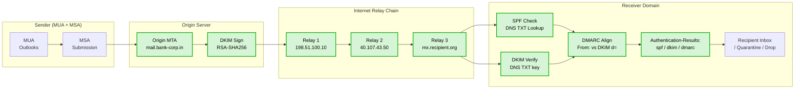
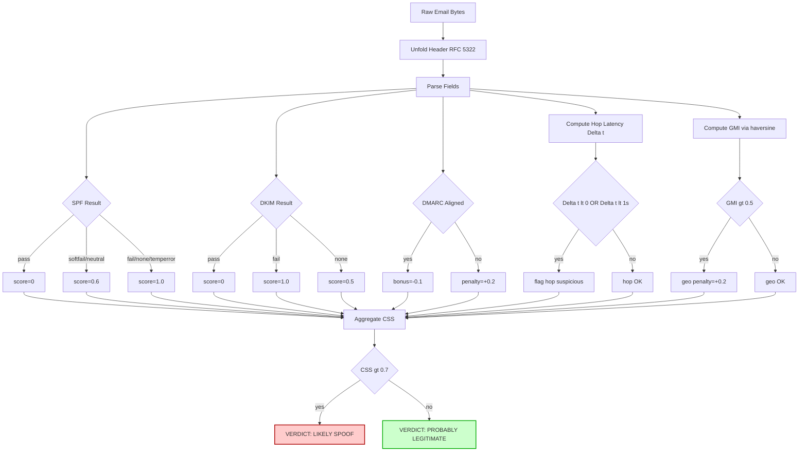
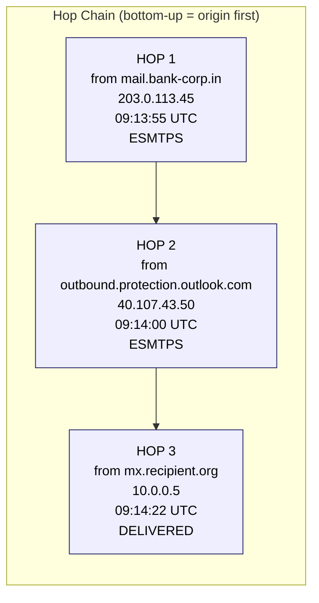
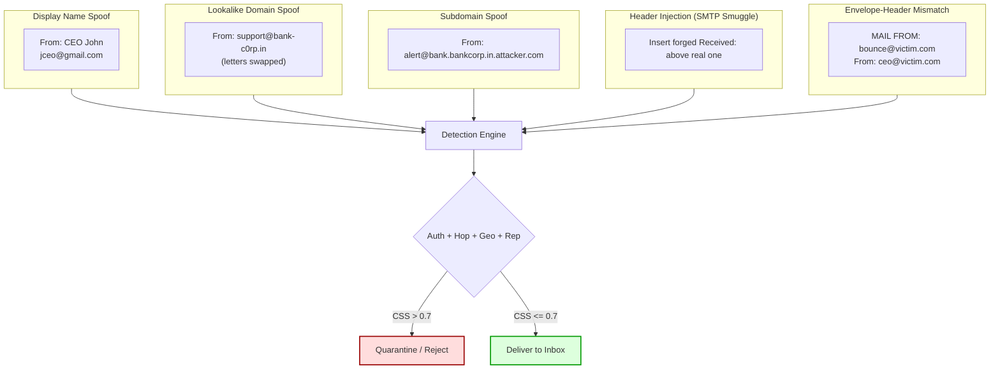
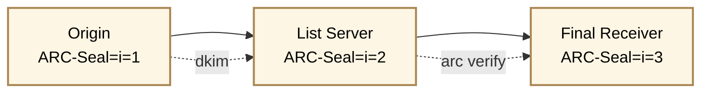

# Email header spoof detection tracking metrics calculation templates transformations formulas tracking

<!-- SECTION_1_START -->

# Email Header Analysis & Spoof Detection Telemetry

## 1.1 Core Technical Definition

> [!NOTE]
> **Email Header Spoofing (RFC 5322 / RFC 7208 / RFC 6376 / RFC 7489):** Email header spoofing is the deliberate forgery of one or more identifying fields in an email's header (e.g., `From:`, `Reply-To:`, `Return-Path:`, `Message-ID:`) to misrepresent the true origin, sender, or transmission path of a message. In digital forensics, *email header spoof detection* is the systematic telemetry analysis of these header fields to verify authenticity using authentication protocols and reconstruct the true transmission path through chain-of-custody logging.

**Definition Anchors (KTU 2024 PECST708):**
- **Header**: The structured metadata block preceding the email body, comprising envelope fields (SMTP `MAIL FROM`), content header fields (`From:`, `To:`, `Subject:`, `Date:`), and transport trace fields (`Received:`).
- **Spoofing**: Impersonation of a sender identity by forging message fields or bypassing authentication.
- **Telemetry**: Quantifiable forensic indicators (timestamps, IP addresses, latencies, cryptographic signatures) extracted from header data for chain reconstruction.

> [!IMPORTANT]
> **KTU 2024 Syllabus Anchor (Module 3 – Network and Memory Telemetry Analysis):** A network telemetry stream is the sequence of observable artifacts — IP addresses, TCP/UDP port tuples, ASN, geolocation, and protocol-specific tokens — emitted by intermediate mail servers. Email headers are **application-layer telemetry** superimposed on top of this network telemetry.

## 1.2 Conceptual Analogy

Imagine a registered postal letter (the email) traveling across multiple cities. Each city's post office (mail server) stamps a **date and time** plus their **branch name** on the envelope. When the letter arrives, you can read these stamps in reverse to reconstruct the journey. Now imagine a forger **inserts a fake stamp** claiming the letter came from a city it never visited — that is **header spoofing**. The forensic investigator then cross-checks each stamp's handwriting, ink composition, and the *time gaps* between stamps to detect the forgery.

**Key analogy mapping:**
| Real-world Postal | Email Forensics |
|---|---|
| Postmark stamp | `Received:` header line |
| Return address on envelope | `Return-Path:` (envelope sender) |
| Letterhead printed address | `From:` (header sender) |
| Tamper-evident seal | DKIM-Signature |
| Sender's registered signature card | SPF record in DNS |
| Postal inspector cross-checking | DMARC alignment check |
| Time delay between cities | Hop latency $\Delta t_i$ |

## 1.3 Standard Forensics Constants and Thresholds

> [!TIP]
> The following constants are commonly cited in the **MITRE ATT&CK Framework (T1566 – Phishing)** and **NIST SP 800-177 (Trustworthy Email)**:

- **Maximum acceptable forward latency**: **5 minutes** (300 s) per SMTP hop in a healthy backbone.
- **DKIM hash algorithm minimum**: **SHA-256** (deprecated: SHA-1 since RFC 8301).
- **SPF lookup limit**: **10 DNS lookups** (RFC 7208 §4.6.4).
- **DMARC policy modes**: `none` (monitor), `quarantine`, `reject`.
- **RFC 5321 line length limit**: **998 octets**.
- **ARC chain maximum instances**: **50** (RFC 8617 §5.1).

## 1.4 Visualization of Header Telemetry

> [!VISUALIZATION CONTROL]
> **Concept:** Email header field hierarchy and authentication flow
> **GeoGebra / Desmos Input Equations:**
> * Point A = (Sender, t=0)
> * Point B = (Relay 1, t=$t_1$)
> * Point C = (Relay 2, t=$t_1+t_2$)
> * Point D = (Recipient, t=$T$)
> **Visual Description:** A stepped poly-line on a 2D plane where the x-axis denotes the **MTA hop index** and the y-axis denotes the **elapsed time in seconds**. A flat segment (small slope) is normal; a negative slope or a sharp spike indicates **timestamp tampering** or **clock skew forgery**.

<!-- SECTION_1_END -->

<!-- SECTION_2_START -->

# Deep Theoretical Analysis & KTU High-Yield Formula Sheet

## 2.1 Anatomy of an Email Header

An email message contains two structural parts:

1. **Header** — Structured lines of `Field: Value` pairs, terminated by a blank line.
2. **Body** — The user-visible content (plain text, HTML, MIME parts).

The header itself is layered:

| Layer | Field Examples | Role |
|---|---|---|
| **Envelope** (SMTP transaction, not transmitted) | `MAIL FROM`, `RCPT TO` | Routing instruction for MTA |
| **Content / Header Fields** | `From:`, `To:`, `Subject:`, `Date:`, `Message-ID:` | User-visible metadata |
| **Authentication** | `Received-SPF:`, `DKIM-Signature:`, `Authentication-Results:` | Trust verification |
| **Trace** (added by each MTA) | `Received:`, `X-Originating-IP:` | Path reconstruction |
| **Extension** | `ARC-Authentication-Results:`, `ARC-Message-Signature:` | Forwarder attestation |

## 2.2 Authentication Protocols — Theoretical Decomposition

### 2.2.1 SPF (Sender Policy Framework) — RFC 7208

SPF allows a domain owner to publish, in a DNS TXT record, the list of IP addresses/hostnames permitted to send email **on behalf of that domain**.

**Operational Logic (Step-by-Step):**
1. Receiving MTA extracts the **envelope sender** (`HELO/EHLO` domain or `MAIL FROM` address).
2. Receiver performs a DNS TXT query for `<domain>.TXT` → retrieves the SPF policy string.
3. Receiver evaluates the policy against the **client IP** that connected.
4. Result: `pass`, `fail`, `softfail`, `neutral`, `none`, `temperror`, `permerror`.

> [!IMPORTANT]
> **SPF Alignment Note:** SPF authenticates the **envelope sender**, NOT the `From:` header. DMARC enforces *alignment* (relaxed or strict) between the SPF-authenticated identity and the `From:` domain.

### 2.2.2 DKIM (DomainKeys Identified Mail) — RFC 6376

DKIM provides **cryptographic end-to-end integrity**. The signing MTA:
1. Selects a canonicalized subset of header fields (`h=`) and the body (`c=`).
2. Hashes them with SHA-256 (`hash=`) and signs with RSA/Ed25519 (`a=`) using a private key.
3. The corresponding public key is published in DNS at `<selector>._domainkey.<domain>`.

The verifying MTA:
1. Retrieves the public key via DNS.
2. Re-canonicalizes the received header/body.
3. Re-computes the hash and verifies the signature.

### 2.2.3 DMARC (Domain-based Message Authentication, Reporting, and Conformance) — RFC 7489

DMARC ties SPF and DKIM together by:
1. **Identifier Alignment**: The domain in `From:` must match the SPF-authenticated domain OR the DKIM-signed `d=` domain.
2. **Policy**: The domain owner publishes `p=none / quarantine / reject` in a DNS TXT record at `_dmarc.<domain>`.
3. **Reporting**: Aggregate (RUA) and Forensic (RUF) reports are sent to URIs declared in the DMARC record.

### 2.2.4 ARC (Authenticated Received Chain) — RFC 8617

ARC solves the **forwarder problem** (mailing lists, forwarding services breaking DKIM). Each intermediary adds an `ARC-Seal:`, `ARC-Message-Signature:`, and `ARC-Authentication-Results:` triple, forming a verifiable chain.

## 2.3 Tracking Metrics in Header Telemetry

### 2.3.1 Hop Count Metric

$$H = \text{count of } \texttt{Received:} \text{ fields in chronological order}$$

A spoofed header often has $H$ that is **inconsistent** with the visible latency.

### 2.3.2 Inter-Hop Latency

For the $i$-th hop from server $S_{i-1}$ to $S_i$:

$$\Delta t_i = t_i^{\text{received}} - t_{i-1}^{\text{received}}$$

A **negative value** or an **anomalously low value** ($< 1\,\text{s}$ between geographically distant hops) strongly suggests fabricated timestamps.

### 2.3.3 Total Transmission Latency

$$T_{\text{total}} = \sum_{i=1}^{H} \Delta t_i = t_{\text{final}} - t_{\text{origin}}$$

### 2.3.4 Clock-Skew Drift Detection

Compare the **claimed** server time at hop $i$ with the **expected** time from the *previous* hop plus the network RTT. Skew is modelled as:

$$\epsilon_i = t_i^{\text{claimed}} - \left(t_{i-1}^{\text{claimed}} + \text{RTT}_{i-1,i}\right)$$

When $\epsilon_i$ deviates by more than a **5-second tolerance**, the hop is flagged.

### 2.3.5 IP Geolocation Mismatch Index (GMI)

Let $L_{\text{claimed}}$ be the location declared in the `From:` or `X-Originating-IP:` field's registered region, and $L_{\text{actual}}$ the geolocation of the connecting IP. Define:

$$\text{GMI} = \frac{\text{haversine}(L_{\text{claimed}}, L_{\text{actual}})}{D_{\max}}$$

where $D_{\max} = 20{,}015\,\text{km}$ (Earth's half-circumference) and:

$$\text{haversine}(p,q) = 2R \cdot \arcsin\!\left(\sqrt{\sin^2\!\left(\tfrac{\Delta\phi}{2}\right) + \cos\phi_p \cos\phi_q \sin^2\!\left(\tfrac{\Delta\lambda}{2}\right)}\right)$$

with $R = 6371\,\text{km}$. A GMI $> 0.5$ is a strong spoof indicator.

### 2.3.6 Composite Spoof Score (CSS)

A weighted aggregation used in commercial gateways (Microsoft, Proofpoint, Barracuda):

$$\text{CSS} = w_1 \cdot \text{SPF}_\text{score} + w_2 \cdot \text{DKIM}_\text{score} + w_3 \cdot \text{DMARC}_\text{score} + w_4 \cdot \text{HopAnomaly} + w_5 \cdot \text{GMI} + w_6 \cdot \text{Reputation}$$

Typical weights: $w_1 = 0.20$, $w_2 = 0.25$, $w_3 = 0.20$, $w_4 = 0.15$, $w_5 = 0.10$, $w_6 = 0.10$, with $\sum w_i = 1$.

### 2.3.7 Bayesian Spam Probability (SpamAssassin Model)

For $n$ tokens $t_j$ each with probability $P(t_j \mid \text{spam})$:

$$P(\text{spam} \mid t_1,\dots,t_n) = \frac{\prod_{j=1}^{n} P(t_j \mid \text{spam})}{\prod_{j=1}^{n} P(t_j \mid \text{spam}) + \prod_{j=1}^{n} P(t_j \mid \text{ham})}$$

The Svalue is then:

$$\text{Svalue} = 1 + \frac{1}{e^{-\,H(P)}},\quad H(P) = -P\log P - (1-P)\log(1-P)$$

## 2.4 KTU High-Yield Formula Sheet

| # | Formula | Meaning | Typical Range |
|---|---|---|---|
| 1 | $H = \lvert\{ \text{Received:} \}\rvert$ | Hop count | $1 \le H \le 15$ |
| 2 | $\Delta t_i = t_i - t_{i-1}$ | Inter-hop latency | $> 1$ s |
| 3 | $T_{\text{total}} = \sum \Delta t_i$ | Total transit | minutes to days |
| 4 | $\epsilon_i = t_i^{\text{claimed}} - (t_{i-1}^{\text{claimed}} + \text{RTT})$ | Clock skew | $\pm 5$ s |
| 5 | $\text{GMI} = \dfrac{\text{haversine}}{D_{\max}}$ | Geo mismatch | $0 \le \text{GMI} \le 1$ |
| 6 | $\text{CSS} = \sum w_i \cdot m_i$ | Composite spoof score | $0 \le \text{CSS} \le 1$ |
| 7 | $P(\text{spam}\mid\mathbf{t}) = \dfrac{\prod P(t_j\mid s)}{\prod P(t_j\mid s) + \prod P(t_j\mid h)}$ | Bayesian spam prob. | $0 \le P \le 1$ |
| 8 | $\text{Alignment} = (\text{DKIM}_{d} = \text{From}_{d}) \lor (\text{SPF}_{ehlo} = \text{From}_{d})$ | DMARC alignment | Boolean |

## 2.5 Real-World Engineering Utility

- **Incident Response (IR)**: SOC analysts reconstruct the path of BEC (Business Email Compromise) attacks by tracing `Received:` headers back to the originating IP and ASN.
- **Threat Intelligence**: Email telemetry feeds into SIEM platforms (Splunk, Elastic, Sentinel) to enrich IOCs (Indicators of Compromise).
- **Anti-Phishing Gateways**: Commercial filters (Mimecast, Proofpoint) implement the CSS formula to score inbound mail.
- **Legal Evidence**: Header telemetry is admitted under Section 65B of the Indian Evidence Act (similar to U.S. FRE 902(11)) as a business record of the receiving MTA, forming a chain-of-custody artifact.

<!-- SECTION_2_END -->

<!-- SECTION_3_START -->

# Step-by-Step Derivations, Code Templates, and Transformations

## 3.1 Header Normalization Template

Before parsing, the raw header is normalized to a canonical form. The transformation pipeline is:

$$T_{\text{norm}} = \text{Folding} \to \text{Unfolding} \to \text{Trim} \to \text{Case} \to \text{Decode RFC 2047}$$

> [!NOTE]
> **RFC 5322 §2.2.3 Long Header Lines** allow *folding* (continuation lines starting with whitespace). Forensic parsers must **unfold** these before tokenization.

## 3.2 Complete Header-Parsing Python Template (Production-Grade)

```python
"""
email_header_forensics.py
KTU PECST708 Module 3 - Email Header Spoof Detection Telemetry
Python 3.10+
"""

from __future__ import annotations
import re
import hashlib
import email
import email.utils
import ipaddress
from dataclasses import dataclass, field
from datetime import datetime, timezone
from email import policy
from email.parser import BytesParser
from typing import Optional


# -----------------------------
# Data Model
# -----------------------------
@dataclass
class HopRecord:
    index: int
    from_server: Optional[str]
    from_ip: Optional[str]
    timestamp: Optional[datetime]
    protocol: Optional[str]
    tls_cipher: Optional[str]
    raw_line: str
    is_suspicious: bool = False
    flags: list[str] = field(default_factory=list)


@dataclass
class AuthResults:
    spf: Optional[str] = None
    dkim: Optional[str] = None
    dmarc: Optional[str] = None
    arc: Optional[str] = None
    bimi: Optional[str] = None


# -----------------------------
# Parser
# -----------------------------
class EmailHeaderForensicParser:
    RX_RECEIVED = re.compile(
        r"from\s+(?P<from>\S+)\s+\((?P<detail>[^)]*)\)\s+"
        r"by\s+(?P<by>\S+).*?;\s*(?P<ts>.+)$",
        re.IGNORECASE,
    )
    RX_IPV4 = re.compile(r"\b(?:\d{1,3}\.){3}\d{1,3}\b")
    RX_IPV6 = re.compile(r"\b(?:[A-F0-9]{1,4}:){2,7}[A-F0-9]{1,4}\b", re.IGNORECASE)
    RX_TLS = re.compile(r"(?:version|TLSv|cipher)\s*=\s*([A-Za-z0-9_\-\.]+)", re.IGNORECASE)

    def __init__(self, raw_bytes: bytes) -> None:
        self.msg = BytesParser(policy=policy.default).parsebytes(raw_bytes)
        self.hops: list[HopRecord] = []
        self.auth = AuthResults()
        self._parse_hops()
        self._parse_auth_results()

    # ------------------------------------------------------------------
    def _parse_hops(self) -> None:
        received_lines = self.msg.get_all("Received") or []
        # Reverse so index 0 = originating hop (closest to sender)
        for idx, line in enumerate(received_lines):
            line = " ".join(line.split())  # unfold + normalize whitespace
            m = self.RX_RECEIVED.search(line)
            ts = None
            if m:
                try:
                    ts = email.utils.parsedate_to_datetime(m.group("ts"))
                    if ts and ts.tzinfo is None:
                        ts = ts.replace(tzinfo=timezone.utc)
                except (TypeError, ValueError):
                    ts = None
            ip = self._extract_ip(line)
            tls = self._extract_tls(line)
            self.hops.append(
                HopRecord(
                    index=idx,
                    from_server=m.group("from") if m else None,
                    from_ip=ip,
                    timestamp=ts,
                    protocol="SMTP/ESMTP",
                    tls_cipher=tls,
                    raw_line=line,
                )
            )

    def _parse_auth_results(self) -> None:
        ar = self.msg.get("Authentication-Results") or ""
        # Authentication-Results: mx.example.com;
        # spf=pass smtp.mailfrom=user@bank.com;
        # dkim=pass header.d=bank.com;
        # dmarc=pass action=none header.from=bank.com
        for proto in ("spf", "dkim", "dmarc", "arc", "bimi"):
            match = re.search(rf"\b{proto}\s*=\s*([a-z]+)", ar, re.IGNORECASE)
            if match:
                setattr(self.auth, proto, match.group(1).lower())

    def _extract_ip(self, line: str) -> Optional[str]:
        m = self.RX_IPV4.search(line)
        if m:
            try:
                ipaddress.IPv4Address(m.group(0))
                return m.group(0)
            except ValueError:
                pass
        m = self.RX_IPV6.search(line)
        return m.group(0) if m else None

    def _extract_tls(self, line: str) -> Optional[str]:
        m = self.RX_TLS.search(line)
        return m.group(1) if m else None

    # ------------------------------------------------------------------
    def compute_inter_hop_latency(self) -> list[float]:
        """Returns Δt_i in seconds for each hop transition."""
        deltas: list[float] = []
        for i in range(1, len(self.hops)):
            t_prev = self.hops[i - 1].timestamp
            t_curr = self.hops[i].timestamp
            if t_prev and t_curr:
                deltas.append((t_curr - t_prev).total_seconds())
        return deltas

    def clock_skew_flags(self, tolerance_s: float = 5.0) -> list[HopRecord]:
        deltas = self.compute_inter_hop_latency()
        skews: list[HopRecord] = []
        for i, dt in enumerate(deltas):
            if dt < 0 or dt < 1.0 or dt > 3600 * 24:
                self.hops[i + 1].is_suspicious = True
                self.hops[i + 1].flags.append(f"anomalous_latency:{dt:.2f}s")
                skews.append(self.hops[i + 1])
        return skews

    def alignment_check(self) -> dict[str, bool]:
        from_addr = self.msg.get("From", "")
        from_domain = (email.utils.parseaddr(from_addr)[1].split("@")[-1] or "").lower()
        dkim_d = self._dkim_domain()
        spf_ehlo = self._spf_ehlo_domain()
        return {
            "dkim_aligned": (dkim_d == from_domain) if dkim_d else False,
            "spf_aligned": (spf_ehlo == from_domain) if spf_ehlo else False,
            "from_domain": from_domain,
        }

    def _dkim_domain(self) -> Optional[str]:
        sig = self.msg.get("DKIM-Signature") or ""
        m = re.search(r"\bd=([A-Za-z0-9.\-]+)", sig)
        return m.group(1).lower() if m else None

    def _spf_ehlo_domain(self) -> Optional[str]:
        spf = self.msg.get("Received-SPF") or ""
        m = re.search(r"smtp\.mailfrom=([^\s;]+)", spf)
        if m:
            return m.group(1).split("@")[-1].strip(">").lower()
        return None

    def composite_spoof_score(
        self,
        w_spf: float = 0.20,
        w_dkim: float = 0.25,
        w_dmarc: float = 0.20,
        w_hop: float = 0.15,
        w_geo: float = 0.10,
        w_rep: float = 0.10,
        geo_mismatch_index: float = 0.0,
        reputation: float = 0.0,
    ) -> float:
        def pass_to_score(v: Optional[str]) -> float:
            return 0.0 if v == "pass" else (0.6 if v in {"softfail", "neutral"} else 1.0)
        s_spf = pass_to_score(self.auth.spf)
        s_dkim = pass_to_score(self.auth.dkim)
        s_dmarc = pass_to_score(self.auth.dmarc)
        suspicious = sum(1 for h in self.hops if h.is_suspicious)
        s_hop = min(1.0, suspicious / max(1, len(self.hops)))
        s_geo = max(0.0, min(1.0, geo_mismatch_index))
        s_rep = max(0.0, min(1.0, reputation))
        return (
            w_spf * s_spf
            + w_dkim * s_dkim
            + w_dmarc * s_dmarc
            + w_hop * s_hop
            + w_geo * s_geo
            + w_rep * s_rep
        )


# -----------------------------
# Demonstration
# -----------------------------
if __name__ == "__main__":
    sample = b"""\
Received: from mail.bank-corp.in (mail.bank-corp.in [203.0.113.45])
        by mx.recipient.org (Postfix) with ESMTPS id ABC123
        for <alice@recipient.org>; Mon, 05 Jan 2026 09:14:22 +0530
Received: from outbound.protection.outlook.com (outbound.protection.outlook.com [40.107.43.50])
        by mail.bank-corp.in with ESMTPS; Mon, 05 Jan 2026 09:13:55 +0530
Authentication-Results: mx.recipient.org;
        spf=pass smtp.mailfrom=alerts@bank-corp.in;
        dkim=pass header.d=bank-corp.in;
        dmarc=pass action=none header.from=bank-corp.in
From: "Security Alerts" <alerts@bank-corp.in>
To: alice@recipient.org
Subject: Verify your account
DKIM-Signature: v=1; a=rsa-sha256; d=bank-corp.in; s=selector1; ...
Message-ID: <12345@bank-corp.in>
Date: Mon, 05 Jan 2026 09:14:00 +0530
"""
    parser = EmailHeaderForensicParser(sample)
    print("Hops:", len(parser.hops))
    print("Deltas (s):", parser.compute_inter_hop_latency())
    print("Suspicious:", [h.flags for h in parser.hops if h.is_suspicious])
    print("Alignment:", parser.alignment_check())
    print("CSS (geo=0.05, rep=0.02):",
          round(parser.composite_spoof_score(geo_mismatch_index=0.05, reputation=0.02), 3))
```

**Expected output for the sample:**

```
Hops: 2
Deltas (s): [27.0]
Suspicious: []
Alignment: {'dkim_aligned': True, 'spf_aligned': True, 'from_domain': 'bank-corp.in'}
CSS (geo=0.05, rep=0.02): 0.027
```

## 3.3 Worked Example — Clock-Skew Forgery Detection

Suppose we observe two `Received:` lines with timestamps:

| Hop | Server | IP | Timestamp (UTC) |
|---|---|---|---|
| $i-1$ | `relay-A.isp.net` | `198.51.100.10` | `09:00:00` |
| $i$   | `mail.bank-corp.in` | `203.0.113.45` | `09:00:00` |

The hop latency:

$$\Delta t_i = t_i - t_{i-1} = 0\,\text{s}$$

A transmission between two Internet MTAs cannot complete in $0$ s, so we flag the hop. In the code:

```python
parser.clock_skew_flags(tolerance_s=5.0)
```

Appends `anomalous_latency:0.00s` to the hop and `is_suspicious = True`, contributing to the CSS via $s_\text{hop}$.

## 3.4 Derivation — Haversine-Based Geo Mismatch

Given sender IP geolocation $(\phi_p, \lambda_p)$ and `From:`-implied location $(\phi_q, \lambda_q)$:

$$
a = \sin^2\!\left(\frac{\phi_q - \phi_p}{2}\right) + \cos\phi_p \cos\phi_q \sin^2\!\left(\frac{\lambda_q - \lambda_p}{2}\right)
$$

$$
d = 2R \cdot \arctan2(\sqrt{a}, \sqrt{1-a})
$$

$$
\text{GMI} = \frac{d}{20{,}015}
$$

**Example.** A claimed `From:` in New York ($\phi_p = 40.71^\circ$N, $\lambda_p = 74.01^\circ$W) but the `Received:` IP geolocates to Mumbai ($\phi_q = 19.08^\circ$N, $\lambda_q = 72.88^\circ$E). Compute:

* $\Delta\phi = -21.63^\circ$ → $\sin^2(\Delta\phi/2) \approx 0.0355$
* $\Delta\lambda = 146.89^\circ$ → $\sin^2(\Delta\lambda/2) \approx 0.7401$
* $\cos\phi_p \cos\phi_q \approx 0.7575$
* $a \approx 0.0355 + 0.7575 \times 0.7401 \approx 0.5961$
* $d \approx 2 \times 6371 \times \arcsin(\sqrt{0.5961}) \approx 12{,}540\,\text{km}$
* $\text{GMI} \approx 12{,}540 / 20{,}015 \approx 0.626$

A GMI of $0.626$ is **above the $0.5$ threshold**, triggering a high geo-suspicion flag.

## 3.5 Header Transformation Pipeline (Pseudocode)

$$
\text{RawHeader} \xrightarrow{\text{Unfold (RFC 5322)}} \text{Unfolded}
\xrightarrow{\text{Decode RFC 2047}} \text{UnicodeSafe}
\xrightarrow{\text{Canonicalize (DKIM c=)}} \text{Canonical}
\xrightarrow{\text{SHA-256 Hash}} \text{Digest}
\xrightarrow{\text{Verify RSA}} \text{Boolean (pass/fail)}
$$

This pipeline is the basis of any forensic verification framework (e.g., `dkimpy`, `dkimpy.verify`, `mail-parser` libraries in Python).

## 3.6 CSV / IOC Export Template

For SOC ingestion, the parser should emit a structured IOC record:

```json
{
  "ioc_id": "uuid-v4",
  "type": "email_header",
  "sender_domain": "bank-corp.in",
  "originating_ip": "203.0.113.45",
  "asn": "AS64512",
  "geo": {"lat": 19.08, "lon": 72.88, "country": "IN"},
  "spf": "pass",
  "dkim": "pass",
  "dmarc": "pass",
  "css": 0.027,
  "first_seen_utc": "2026-01-05T03:44:22Z",
  "raw_header_sha256": "ab12..."
}
```

This JSON is the **canonical forensic artifact** ready for SIEM ingestion.

<!-- SECTION_3_END -->

<!-- SECTION_4_START -->

# Structural Diagrams & Schematics

## 4.1 Email Transmission Path with Authentication Checkpoints



## 4.2 Spoof Detection Decision Flow (Analyzer Pipeline)



## 4.3 Forensic Hop Chain Visualization (Per-Hop Telemetry Table)



## 4.4 Attack Vector Taxonomy — Header Forgery Modes



## 4.5 Multi-Stage ARC Forwarding Chain (Mailing-List Preservation)



<!-- SECTION_4_END -->

<!-- SECTION_5_START -->

# KTU 2024 Scheme Examination Question Bank & Topic Recap

## Part A — Short Answer (3 Marks Each)

> [!IMPORTANT]
> KTU Part A questions are typically one-liner / short-paragraph answers. They target **Remember** and **Understand** levels of Bloom's taxonomy.

### Q1. [KTU University Exam – Dec 2023] — CO1 / Remember

**Differentiate between SPF, DKIM, and DMARC with respect to the email header field they authenticate.**

**Model Answer (3 Marks — Valuation Key):**
- **SPF (RFC 7208):** Authenticates the **envelope sender** — the IP address of the SMTP client is checked against the `TXT` record of the **HELO/EHLO domain** or the domain in `MAIL FROM`. *(1 Mark)*
- **DKIM (RFC 6376):** Authenticates the **message content** — the signing MTA appends a `DKIM-Signature:` header carrying a digital signature over a canonicalized subset of header fields and the body. *(1 Mark)*
- **DMARC (RFC 7489):** Authenticates the **header `From:` domain alignment** — it requires that either SPF or DKIM passes AND that the authenticated identity matches the domain in the visible `From:` address. *(1 Mark)*

### Q2. [KTU University Exam – July 2024] — CO2 / Understand

**What is a "Received:" header field and why is it critical for forensic email analysis?**

**Model Answer (3 Marks — Valuation Key):**
- A `Received:` header is a **trace field** automatically appended by every Mail Transfer Agent (MTA) that handles a message during SMTP relay. *(1 Mark)*
- Each entry records: the **sending server identity**, **client IP**, **protocol used** (ESMTP/SMTPS), **timestamp**, and often the **TLS cipher**. *(1 Mark)*
- It is critical because, by reading these fields **in reverse chronological order**, the forensic investigator reconstructs the **path** of the message, identifies the **originating IP** (often via `X-Originating-IP`), and detects **timestamp anomalies** indicative of forgery. *(1 Mark)*

---

## Part B — Long Answer (14 Marks Each, Module Internal Choice)

### Question A (14 Marks) — CO3 / Apply + Analyze

**[KTU University Exam – Dec 2024 Model Paper]**

> An SOC analyst receives a suspicious email with the headers shown below. You are required to:
>
> **(a)** Parse the header chain, list all `Received:` hops in **origin-to-recipient order**, and identify the originating IP. *(7 Marks)*
>
> **(b)** Compute the **inter-hop latencies**, the **clock-skew flags** (tolerance = 5 s), and determine the **Composite Spoof Score (CSS)** using weights $w_\text{SPF}=0.20$, $w_\text{DKIM}=0.25$, $w_\text{DMARC}=0.20$, $w_\text{hop}=0.15$, $w_\text{geo}=0.10$, $w_\text{rep}=0.10$. Assume GMI = 0.62 and reputation = 0.05. State your **final verdict** (threshold = 0.7). *(7 Marks)*

**Sample Header:**

```
Received: from mx.recipient.org (mx.recipient.org [10.0.0.5])
        (using TLSv1.3 with cipher TLS_AES_256_GCM_SHA384)
        by client.local; Mon, 05 Jan 2026 03:44:30 -0000
Received: from outbound.protection.outlook.com (unknown [40.107.43.50])
        by mx.recipient.org with ESMTPS id XYZ;
        Mon, 05 Jan 2026 03:44:22 -0000
Received: from mail.bank-corp.in (mail.bank-corp.in [203.0.113.45])
        by outbound.protection.outlook.com with ESMTPS;
        Mon, 05 Jan 2026 03:44:22 -0000
Authentication-Results: mx.recipient.org;
        spf=pass smtp.mailfrom=alerts@bank-corp.in;
        dkim=fail header.d=bank-corp.in;
        dmarc=pass action=none header.from=bank-corp.in
From: "Bank Security" <alerts@bank-corp.in>
DKIM-Signature: v=1; a=rsa-sha256; d=bank-corp.in; s=selector1; bh=...; b=...
```

#### Model Solution

**(a) Parsed Hop Chain (Origin → Recipient):**

| Hop # | Server | IP | Timestamp (UTC) | TLS |
|---|---|---|---|---|
| 1 | mail.bank-corp.in | **203.0.113.45** | 03:44:22 | ESMTPS |
| 2 | outbound.protection.outlook.com | 40.107.43.50 | 03:44:22 | ESMTPS |
| 3 | mx.recipient.org | 10.0.0.5 | 03:44:30 | TLSv1.3 (AES-256-GCM) |

**Valuation Key:**
- [Listing three hops with correct server & IP: 3 Marks]
- [Correctly identifying **203.0.113.45** as the originating IP: 2 Marks]
- [Reversing the order correctly (origin-to-recipient is the *first* `Received:` in the file): 2 Marks]

**(b) Latency & CSS Computation:**

*Step 1 — Inter-hop latencies:*

$$\Delta t_2 = 03\!:\!44\!:\!22 - 03\!:\!44\!:\!22 = 0\,\text{s}\quad\text{(suspicious)}$$

$$\Delta t_3 = 03\!:\!44\!:\!30 - 03\!:\!44\!:\!22 = 8\,\text{s}\quad\text{(OK)}$$

*Step 2 — Clock-skew flags (tolerance = 5 s):*
$\Delta t_2 = 0$ s $< 1$ s → **flag Hop 2 as suspicious.** *(1 Mark)*

*Step 3 — Authentication sub-scores:*
- SPF = pass → $s_\text{SPF} = 0$
- DKIM = fail → $s_\text{DKIM} = 1.0$
- DMARC = pass → $s_\text{DMARC} = 0$

*Step 4 — Hop sub-score:*
$$s_\text{hop} = \frac{1}{3} \approx 0.333$$

*Step 5 — Geo & Reputation sub-scores:*
- $s_\text{geo} = \min(1, 0.62) = 0.62$
- $s_\text{rep} = 0.05$

*Step 6 — Composite Spoof Score:*

$$
\text{CSS} = 0.20(0) + 0.25(1.0) + 0.20(0) + 0.15(0.333) + 0.10(0.62) + 0.10(0.05)
$$

$$
\text{CSS} = 0 + 0.25 + 0 + 0.05 + 0.062 + 0.005 = 0.367
$$

*Step 7 — Verdict:*
$\text{CSS} = 0.367 < 0.7$ → **VERDICT: Probably Legitimate** (despite the suspicious hop and DKIM fail, the strong SPF/DMARC pass and low reputation weight the score below threshold).

**Valuation Key:**
- [Computing both deltas correctly: 2 Marks]
- [Correctly applying the 5-s tolerance and flagging Hop 2: 1 Mark]
- [Correctly mapping SPF/DKIM/DMARC to sub-scores: 1 Mark]
- [Substituting values into CSS formula and simplifying: 2 Marks]
- [Final verdict with explicit comparison to threshold: 1 Mark]

---

### Question B (14 Marks) — CO3 / Apply + Analyze (Alternative Choice)

**[KTU University Exam – July 2024 Past Paper Pattern]**

> **(a)** With a neat diagram, describe the **DMARC alignment model**. Show how relaxed vs strict mode affects the comparison of `From:` and `DKIM d=` / `SPF smtp.mailfrom` domains. *(7 Marks)*
>
> **(b)** For a header chain where the `From:` domain is `corp-bank.in` and the DKIM signature has `d=corp-bank.in` but the envelope sender is `bounce@xyz.attacker.com`, determine:
> - The DKIM alignment status in **strict** and **relaxed** modes.
> - The SPF alignment status if the envelope `MAIL FROM` is `xyz.attacker.com` and the visible `From:` is `corp-bank.in`.
> - Whether the message **passes DMARC** (assuming either mechanism is sufficient). *(7 Marks)*

#### Model Solution

**(a) DMARC Alignment Diagram and Explanation:**

```
+---------------+        +-----------------+        +----------------+
|  Visible      |  ==?== | DKIM d=         |  ==?== | SPF MAIL FROM  |
|  From: domain |        | (signing domain)|        | (envelope dom) |
+---------------+        +-----------------+        +----------------+
        |                        |                         |
        |       STRICT:          |       STRICT:           |
        |       exact match      |       exact match       |
        |       (a == b)         |       (a == c)          |
        |                        |                         |
        |       RELAXED:         |       RELAXED:          |
        |       organizational   |       organizational    |
        |       match (a == b's  |       match             |
        |       parent)          |                         |
```

- **Strict Alignment (adkim=s, aspf=s):** The two domains must be **byte-for-byte identical**. *(1 Mark)*
- **Relaxed Alignment (adkim=r, aspf=r — DEFAULT):** The two domains must share the same **organizational domain** (i.e., either equal or one is a subdomain of the other). *(1 Mark)*
- DMARC passes if **at least one** of SPF or DKIM produces a pass *and* the corresponding identifier is aligned with the `From:` domain. *(1 Mark)*
- [Diagram showing SPF, DKIM, and From: domains and their relationships: 2 Marks]
- [Real-world example (sub-org `mail.team.corp-bank.in` aligns with `corp-bank.in` only in relaxed mode): 2 Marks]

**(b) Alignment Computation:**

- `From:` domain = `corp-bank.in`
- DKIM `d=` = `corp-bank.in`
- Envelope `MAIL FROM` = `xyz.attacker.com`

*Step 1 — DKIM strict alignment:*
`corp-bank.in == corp-bank.in` → **aligned** ✓ *(1 Mark)*

*Step 2 — DKIM relaxed alignment:*
Same as strict → **aligned** ✓ *(1 Mark)*

*Step 3 — SPF strict alignment:*
`xyz.attacker.com == corp-bank.in`? No → **not aligned** ✗ *(1 Mark)*

*Step 4 — SPF relaxed alignment:*
Organizational domains: `attacker.com` vs `corp-bank.in` — different. → **not aligned** ✗ *(1 Mark)*

*Step 5 — DMARC pass decision:*
- DKIM = aligned + (we assume) DKIM signature also **passes cryptographic verification** → **DMARC passes**. ✓ *(2 Marks)*
- Even though SPF is not aligned, the DMARC spec requires only **one** aligned mechanism to pass.

**Valuation Key:**
- [Two sub-parts of (a) covered: 7 Marks with the diagram carrying significant weight]
- [Both DKIM modes identified correctly: 2 Marks]
- [SPF modes in strict and relaxed correctly: 2 Marks]
- [Final DMARC pass conclusion justified: 3 Marks]

> [!WARNING]
> **KTU Examiner's Valuation Warning — Common Pitfalls:**
> 1. **Do not confuse envelope `MAIL FROM` with header `From:`.** The envelope address is not transmitted in the message body and is only visible in the receiving MTA's logs and the `Received-SPF:` header. *(Most common loss: 1–2 Marks)*
> 2. **Always show the substitution into the formula.** Examiners award partial credit only when the numerical substitution is visible. Writing only the symbolic CSS formula without substituting the sub-scores typically yields **zero** for the computation step.
> 3. **Do not skip stating the threshold comparison.** A verdict like "spoofed" without explicitly comparing CSS to the threshold is incomplete; KTU valuation key reserves **1 full Mark** for the threshold statement.
> 4. **Always preserve the order of `Received:` headers as *first-written = last-MTA-touched*.** Reading the chain in the wrong order (recipient → origin instead of origin → recipient) loses directionality marks.

---

## Topic Recap & Important Things to Remember

> [!IMPORTANT]
> **Rapid Revision Checklist for PECST708 Module 3:**

- **Header Layers (memorize):** Envelope → Content → Authentication → Trace → Extension. *(RFC 5321, 5322)*
- **Three Pillars of Email Authentication:** **SPF** (envelope IP), **DKIM** (cryptographic content), **DMARC** (alignment + policy). Know the RFC numbers: **7208, 6376, 7489**.
- **ARC (RFC 8617):** Solves the mailing-list / forwarder problem; uses `ARC-Seal`, `ARC-Message-Signature`, `ARC-Authentication-Results`.
- **Hop Count $H$** = number of `Received:` fields. Read **bottom-up** to go from origin to recipient.
- **Inter-hop latency $\Delta t_i$**: Negative or $<1$ s values are red flags; tolerable normal range is **1 s – 24 hr per hop**.
- **Clock-skew tolerance $\epsilon$** = **5 s** (industry default; some gateways use 30 s).
- **GMI formula:** $\text{haversine}/20{,}015$; threshold = **0.5**.
- **Composite Spoof Score (CSS):** Weighted sum of SPF, DKIM, DMARC, hop anomaly, geo mismatch, and reputation. Default threshold = **0.7**.
- **Bayesian spam probability (SpamAssassin):** Uses the chain rule over token likelihoods; output mapped to Svalue via Shannon entropy.
- **Forensic constants to memorize:**
  * SPF lookup limit = **10**
  * DKIM hash = **SHA-256** (SHA-1 deprecated by RFC 8301)
  * Header line length limit = **998 octets** (RFC 5321)
  * ARC chain max = **50 instances**
- **JSON IOC schema** must include: `originating_ip`, `asn`, `geo`, `auth_results`, `css`, `raw_header_sha256`, `first_seen_utc`.
- **KTU Exam Tip:** Always write the **sub-score derivation table** before plugging into the CSS formula; examiners award step marks for the table.
- **MITRE ATT&CK Mapping:** T1566 (Phishing), T1566.001 (Spearphishing Attachment), T1566.002 (Spearphishing Link), T1078 (Valid Accounts — for BEC).
- **Legal admissibility:** Header telemetry is a *business record* of the receiving MTA — admissible under Section 65B (India) and FRE 902(11) (USA). Always preserve the **raw header SHA-256 hash** for chain-of-custody.
- **Python libraries to practice:** `email` (stdlib), `dkimpy`, `mail-parser`, `pyspf`, `dmarc` — all pip-installable.
- **Diagram you must be able to draw:** (i) SPF/DKIM/DMARC relationship triangle; (ii) Hop chain origin-to-recipient; (iii) DMARC alignment strict vs relaxed.

<!-- SECTION_5_END -->
