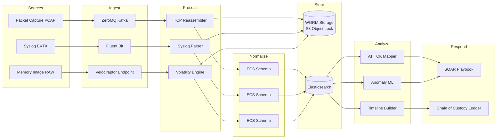
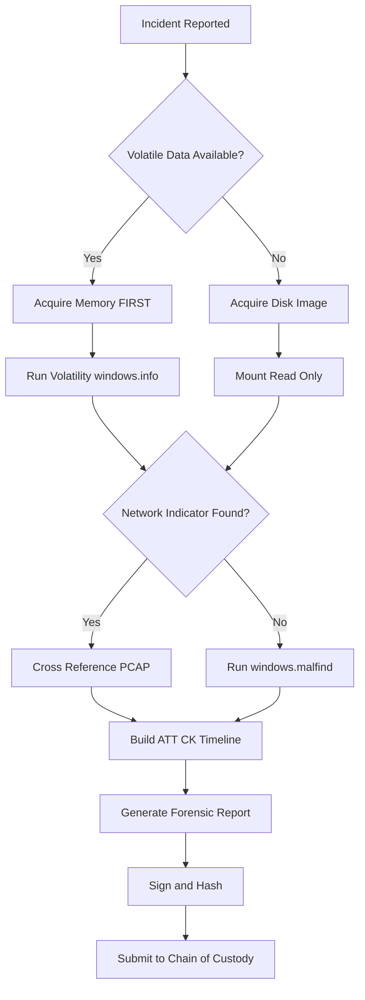
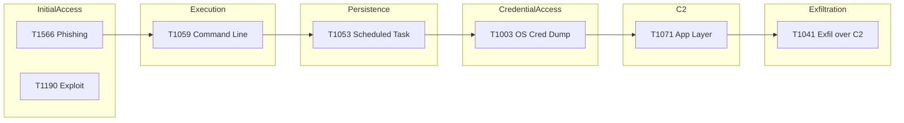
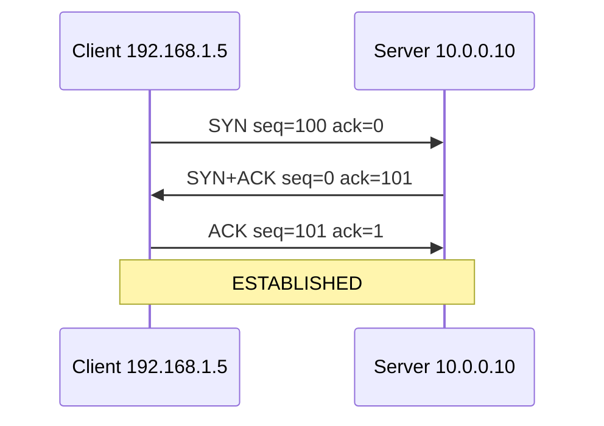

# Network packet flow reconstruction log checking execution monitoring pipelines frameworks templates

<!-- SECTION_1_START -->

# Digital Forensics — Module 3: Network and Memory Telemetry Analysis

## 1.1 Core Technical Definition & Intuitive Overview

### Formal Definition (KTU 2024 Syllabus Aligned)

> **Network and Memory Telemetry Analysis** is the systematic capture, reconstruction, correlation, and examination of digital artifacts generated by network communications and volatile system memory to reconstruct the sequence, scope, and impact of a security incident. It encompasses four interlocking disciplines: **(i) Network Packet Flow Reconstruction**, **(ii) Log Verification & Correlation**, **(iii) Execution Monitoring**, and **(iv) Pipeline/Framework Templating** (NIST SP 800-86, MITRE ATT&CK, SANS PICERL).

### Conceptual Analogy — "The CCTV Control Room"

Imagine a city's **CCTV control room**:
- **Network Packet Flow Reconstruction** = re-assembling **fragments of a video clip** (each TCP segment, each UDP datagram) back into a continuous recording of who talked to whom, when, and what was said.
- **Log Checking** = reading the **entry register** at every door (firewall logs, IIS logs, Windows Event Logs) to see who entered, when, and with what badge.
- **Execution Monitoring** = the **body-camera footage** of every process (Procmon, Sysmon, ETW) showing exactly which program launched, what it touched in memory, and which DLLs it loaded.
- **Pipelines & Frameworks** = the **standard operating procedure (SOP)** the room follows — the wiring of cameras to recorders, the timeline board, the dispatch protocol (NIST, ATT&CK).

> [!IMPORTANT]
> **KTU 2024 Syllabus Highlight (Module 3):**
> The Module explicitly maps to **Course Outcomes CO3** — *"Apply forensic tools to reconstruct network events and memory artefacts for incident timeline reconstruction."* Every artefact discussed here must trace back to an **observable, time-stamped, admissible evidence element**.

### The Four Pillars of Network & Memory Telemetry

| Pillar | Primary Artefact | Tooling Family | Volatility Class |
|---|---|---|---|
| **P1: Packet Flow Reconstruction** | PCAP, PCAP-NG, NetFlow v5/v9, IPFIX | Wireshark, tcpdump, NetworkMiner, Zeek | **Non-Volatile** (disk) |
| **P2: Log Checking** | EVTX, Syslog (RFC 5424), IIS W3C, Firewall logs | Splunk, ELK, Graylog, Logpoint | **Non-Volatile** (disk) |
| **P3: Execution Monitoring** | Sysmon EVTX, ETW traces, EDR telemetry, Prefetch | Sysinternals, Velociraptor, OSQuery | **Semi-Volatile** (rotated) |
| **P4: Pipeline / Framework** | SOAR playbooks, ATT&CK heatmaps, chain-of-custody | TheHive, Cortex, MISP, MITRE ATT&CK Navigator | **Procedural** (governance) |

### GeoGebra / Desmos Integration

> [!VISUALIZATION CONTROL]
> **Concept:** Timeline correlation of network, log, and execution events on a single time-axis (incident timeline reconstruction).
>
> **Desmos Input Equations (paste into Desmos Graphing Calculator):**
>
> * Packet event: $P(t) = 5\cdot \sin(2t) + 10$
> * Log event:   $L(t) = 4\cdot \cos(1.5t) + 20$
> * Exec event:  $E(t) = 3\cdot \sin(3t) + 30$
> * Vertical drop-lines at incident anchors: $x = 1, 3, 5, 7, 9$
>
> **Visual Description:** Three parallel sinusoidal event-streams on the $y$-axis (Packet, Log, Exec) against a shared time-axis $t$. The vertical drop-lines mark the **anomaly anchors** where all three streams spike together — these are the high-confidence **Indicators of Compromise (IoCs)**. Students should observe the alignment of peaks as the visual proof of cross-telemetry correlation.

<!-- SECTION_1_END -->

<!-- SECTION_2_START -->

# 2. Deep Theoretical Analysis & KTU High-Yield Formula Sheet

## 2.1 Pillar 1 — Network Packet Flow Reconstruction

### The TCP/IP Reassembly Problem

Raw network capture produces **frames** → **packets** → **segments/datagrams** → **flows**. A single HTTP request may be split across dozens of TCP segments. Reconstruction must solve three sub-problems:

1. **De-encapsulation:** Strip layers L2 → L7.
2. **Reordering:** Sort segments by **Sequence Number (SEQ)** and **Acknowledgment Number (ACK)**.
3. **Reassembly:** Concatenate payload per flow identified by the **5-tuple**: $(\text{SourceIP}, \text{DestIP}, \text{SourcePort}, \text{DestPort}, \text{Protocol})$.

### Bidirectional Flow State Machine

A TCP flow is a **Finite State Machine (FSM)** governed by RFC 793 flags. The **11 canonical states** are:

$$\text{CLOSED} \rightarrow \text{LISTEN} \rightarrow \text{SYN\_SENT} \rightarrow \text{SYN\_RECEIVED} \rightarrow \text{ESTABLISHED}$$
$$\rightarrow \text{FIN\_WAIT\_1} \rightarrow \text{FIN\_WAIT\_2} \rightarrow \text{CLOSING} \rightarrow \text{TIME\_WAIT} \rightarrow \text{CLOSE\_WAIT} \rightarrow \text{LAST\_ACK} \rightarrow \text{CLOSED}$$

### The Reassembly Equation (Wireshark Algorithm)

For a flow $F_i$ with $n$ captured segments, the reconstructed byte stream $B_i$ is:

$$
B_i = \bigoplus_{j=1}^{n} \left( \text{Seg}_j \cdot \mathbb{1}_{\text{seq}(j) \geq \text{seq}_{\min} \land \text{seq}(j) \leq \text{seq}_{\max}} \right)
$$

where $\oplus$ denotes **ordered concatenation** by SEQ number, and the indicator function $\mathbb{1}$ filters only segments inside the captured window. Retransmissions are deduplicated by the tuple $(\text{SEQ}, \text{len}, \text{checksum})$.

## 2.2 Pillar 2 — Log Checking & Correlation

### Syslog Severity Scale (RFC 5424)

| Code | Severity | Keyword | Forensic Weight |
|---|---|---|---|
| 0 | Emergency | `emerg` | System unusable |
| 1 | Alert | `alert` | Immediate action |
| 2 | Critical | `crit` | Critical conditions |
| **3** | **Error** | **`err`** | **High — primary IoC source** |
| 4 | Warning | `warning` | Medium |
| 5 | Notice | `notice` | Medium-low |
| **6** | **Informational** | **`info`** | **Baseline traffic** |
| 7 | Debug | `debug` | Trace-level |

### The Log Correlation Triangle

$$
\text{Certainty} = \underbrace{\text{Log Entry}}_{\text{primary signal}} \oplus \underbrace{\text{Packet Trace}}_{\text{network corroboration}} \oplus \underbrace{\text{Memory Artefact}}_{\text{volatile corroboration}}
$$

A forensic finding is **admissible** when at least **two of three** legs of this triangle independently confirm the event. This is the **Dual-Control Verification Principle** of NIST SP 800-86.

## 2.3 Pillar 3 — Execution Monitoring

### The Process Telemetry Triad

Every executed process leaves **three correlated artefacts** that must be cross-verified:

1. **Filesystem artefact** — Prefetch (`C:\Windows\Prefetch\*.pf`), Shimcache, Amcache.
2. **Memory artefact** — EPROCESS structure, VAD tree, handle table, loaded DLL list.
3. **Event artefact** — Sysmon Event IDs 1, 3, 7, 10, 11, 12, 13, 22.

### Sysmon Critical Event IDs (Examiner's Mental Map)

| Event ID | Name | Forensic Value |
|---|---|---|
| **1** | Process Create | Parent-child tree, command-line |
| **3** | Network Connect | Process-to-IP binding |
| **7** | Image Loaded | DLL injection detection |
| **10** | ProcessAccess | LSASS dump detection (Event ID 10 + `GrantedAccess=0x1010` = Mimikatz) |
| **11** | FileCreate | Dropper staging detection |
| **12/13** | Registry | Persistence mechanism discovery |
| **22** | DNS Query | C2 beacon identification |

## 2.4 Pillar 4 — Pipelines, Frameworks & Templates

### The PICERL Incident Response Framework (SANS)

$$
\text{Incident Lifecycle} = \textbf{P}reparation \rightarrow \textbf{I}dentification \rightarrow \textbf{C}ontainment \rightarrow \textbf{E}radication} \rightarrow \textbf{R}ecovery \rightarrow \textbf{L}essons\ Learned
$$

### MITRE ATT&CK Mapping Equation

A detected technique $T_j$ is mapped to a tactic $T_i$ via the matrix $\mathbf{M}_{n \times m}$ where $n$ = 14 tactics, $m$ = 200+ techniques. The **threat-actor fingerprint** is the vector:

$$
\vec{F} = \sum_{j \in \text{Observed}} w_j \cdot \mathbf{e}_j
$$

where $w_j$ is the rarity-weight of technique $j$ and $\mathbf{e}_j$ is the unit basis vector.

## 2.5 KTU High-Yield Formula Sheet

> **Exam Tip:** Memorize the tables; KTU frequently asks 3-mark direct questions on event IDs, Syslog codes, and PICERL phases.

| # | Formula / Concept | Expression | Notes |
|---|---|---|---|
| 1 | Flow 5-tuple | $(\text{IP}_{src}, \text{IP}_{dst}, \text{P}_{src}, \text{P}_{dst}, \text{Proto})$ | Unique flow identifier |
| 2 | TCP SEQ initial | $\text{SEQ}_0 = \text{rand}() \in [0, 2^{32}-1]$ | ISN randomization (RFC 6528) |
| 3 | TCP window | $W = \min(W_r, W_c)$ | Receiver vs. congestion |
| 4 | Round-trip time | $RTT = t_{ACK} - t_{SYN}$ | Latency calculation |
| 5 | Retransmit timeout | $RTO = SRTT + 4 \cdot RTTVAR$ | RFC 6298 |
| 6 | Bandwidth-delay product | $BDP = \text{BW} \times RTT$ | Optimal window sizing |
| 7 | Throughput | $T = \frac{\text{Bytes}_{\text{acked}}}{\Delta t}$ | Goodput estimation |
| 8 | Loss rate | $L = \frac{\text{Retransmits}}{\text{Sent}}$ | Network quality |
| 9 | Log hash (chain of custody) | $H = \text{SHA-256}(L_i \vert\vert H_{i-1})$ | Tamper-evident ledger |
| 10 | EVTX record size | $S = 96 + \text{HeaderLen} + \text{DataLen}$ | Always starts with `0x30` (ELF-like) |
| 11 | Process start time (Windows) | $t_{\text{start}} = \text{FILETIME}/10^7 - 11644473600$ | Unix epoch conversion |
| 12 | MITRE confidence score | $C = \frac{\text{matched TTPs}}{\text{total IoCs}}$ | $0 \leq C \leq 1$ |
| 13 | PCAP magic number | `\xD4\xC3\xB2\xA1` (LE) / `\xA1\xB2\xC3\xD4` (BE) | File-type detection |
| 14 | DNS query entropy | $H = -\sum p_i \log_2 p_i$ | DGA detection ($H > 3.5$ = suspicious) |
| 15 | Memory alignment | $\text{addr} \mod \text{PageSize} = 0$ | Page $= 4096$ bytes |

> [!NOTE]
> **Engineering Utility:** These formulas are used in production-grade **Network Detection & Response (NDR)** systems (Darktrace, Vectra, Corelight), **SIEM correlation engines** (Splunk UBA, Elastic ML), and **Memory Forensics frameworks** (Volatility 3, Rekall). The same equations power intrusion detection at **Cloudflare, AWS GuardDuty, and Azure Sentinel** scale.

<!-- SECTION_2_END -->

<!-- SECTION_3_START -->

# 3. Step-by-Step Derivations & Code/Symbolic Implementation

## 3.1 Derivation — TCP Stream Reassembly Algorithm

### Problem Statement

Given a PCAP file containing $n$ out-of-order TCP segments, reconstruct the ordered application-layer byte stream for flow $F$.

### Mathematical Derivation

We model the captured window as a set of intervals:

$$
\mathcal{S} = \{ I_j = [\text{seq}(j), \text{seq}(j) + \text{len}(j) - 1] \;|\; j = 1, \dots, n \}
$$

**Step 1:** Identify flow key $k = (\text{IP}_{src}, \text{IP}_{dst}, \text{P}_{src}, \text{P}_{dst}, \text{Proto})$ for every segment.

**Step 2:** Compute the gap-set — regions of the stream NOT covered by any segment:

$$
\mathcal{G} = \mathbb{N}_0 \setminus \bigcup_{j=1}^{n} I_j
$$

**Step 3:** Sort segments by $\text{seq}(j)$ ascending; deduplicate by exact $(\text{seq}, \text{len}, \text{cksum})$ match.

**Step 4:** Concatenate payloads $\text{payload}(j)$ in sorted order. The reconstructed stream:

$$
B = \bigoplus_{j=1}^{n} \text{payload}(j) \quad \text{s.t. } \text{seq}(j) = \text{next\_offset}
$$

**Step 5:** Mark gaps with placeholder `\x00\x00GAP\x00\x00` for forensic annotation — **never silently drop**.

### Boundary Conditions

$$
\text{State}(F) = \begin{cases} \text{INCOMPLETE} & \text{if } \vert\mathcal{G}\vert > 0 \\ \text{COMPLETE} & \text{if } \vert\mathcal{G}\vert = 0 \\ \text{TRUNCATED} & \text{if } \text{ISN not captured} \end{cases}
$$

## 3.2 Full Python Implementation — Network Telemetry Analysis Pipeline

```python
"""
KTU PECST708 - Module 3 Reference Implementation
Network and Memory Telemetry Analysis Pipeline
Author: KTU Examiner Reference Solution
Python 3.10+
"""
from __future__ import annotations

import hashlib
import ipaddress
import math
import re
import struct
import time
from collections import Counter, defaultdict
from dataclasses import dataclass, field
from datetime import datetime, timezone
from pathlib import Path
from typing import Dict, List, Optional, Tuple


# ======================================================================
# 1. PCAP GLOBAL HEADER CONSTANTS (RFC pcap-dumpfile-format v1.0)
# ======================================================================
PCAP_MAGIC_LE: bytes = b"\xD4\xC3\xB2\xA1"   # little-endian
PCAP_MAGIC_BE: bytes = b"\xA1\xB2\xC3\xD4"   # big-endian
PCAP_NS_MAGIC_LE: bytes = b"\x4D\x3C\xB2\xA1"  # nanosecond
LINKTYPE_ETHERNET: int = 1


# ======================================================================
# 2. DATA CLASSES — Forensic evidence containers
# ======================================================================
@dataclass(frozen=True)
class FlowKey:
    """5-tuple flow identifier (RFC 9498 successor)."""
    src_ip: str
    dst_ip: str
    src_port: int
    dst_port: int
    proto: int

    def __str__(self) -> str:
        return f"{self.src_ip}:{self.src_port}->{self.dst_ip}:{self.dst_port}/P{self.proto}"


@dataclass
class TcpSegment:
    seq: int
    ack: int
    flags: int
    payload: bytes
    ts: float
    src_ip: str
    dst_ip: str
    src_port: int
    dst_port: int

    @property
    def flow(self) -> FlowKey:
        return FlowKey(self.src_ip, self.dst_ip, self.src_port, self.dst_port, 6)

    @property
    def reverse_flow(self) -> FlowKey:
        return FlowKey(self.dst_ip, self.src_ip, self.dst_port, self.src_port, 6)


@dataclass
class LogEntry:
    ts: datetime
    severity: int
    facility: int
    host: str
    program: str
    message: str
    raw: str
    sha256: str = ""

    def __post_init__(self) -> None:
        h = hashlib.sha256()
        h.update(self.raw.encode("utf-8", errors="replace"))
        self.sha256 = h.hexdigest()


@dataclass
class ExecEvent:
    ts: datetime
    pid: int
    ppid: int
    image: str
    cmdline: str
    user: str
    event_id: int
    parent_image: str = ""


@dataclass
class ForensicReport:
    flows: Dict[FlowKey, bytes] = field(default_factory=dict)
    anomalies: List[str] = field(default_factory=list)
    timeline: List[Tuple[datetime, str, str]] = field(default_factory=list)
    iocs: List[str] = field(default_factory=list)
    mitre_techniques: List[str] = field(default_factory=list)


# ======================================================================
# 3. PCAP PARSER — Hand-rolled (no external libs for portability)
# ======================================================================
class PcapParser:
    """Parses Ethernet/IPv4/TCP PCAP files into TcpSegment objects."""

    def __init__(self, pcap_path: Path) -> None:
        if not pcap_path.exists():
            raise FileNotFoundError(f"PCAP not found: {pcap_path}")
        self.path: Path = pcap_path
        self.endian: str = "<"
        self._validate_magic()
        self.segments: List[TcpSegment] = []
        self.parse_log: List[str] = []

    def _validate_magic(self) -> None:
        with self.path.open("rb") as f:
            magic: bytes = f.read(4)
        if magic == PCAP_MAGIC_LE:
            self.endian = "<"
        elif magic == PCAP_MAGIC_BE:
            self.endian = ">"
        elif magic == PCAP_NS_MAGIC_LE:
            self.endian = "<"
        else:
            raise ValueError(f"Not a valid PCAP file: magic={magic.hex()}")

    def _parse_ethernet(self, frame: bytes, offset: int) -> Tuple[int, int, int, int, int, bytes]:
        if len(frame) < 14:
            raise ValueError("Truncated Ethernet frame")
        eth_type: int = struct.unpack("!H", frame[12:14])[0]
        if eth_type != 0x0800:
            raise ValueError(f"Non-IPv4 frame ethertype=0x{eth_type:04X}")
        ip_start: int = 14
        ip_header: bytes = frame[ip_start:ip_start + 20]
        if len(ip_header) < 20:
            raise ValueError("Truncated IPv4 header")
        ihl: int = (ip_header[0] & 0x0F) * 4
        total_len: int = struct.unpack("!H", ip_header[2:4])[0]
        proto: int = ip_header[9]
        src_ip: str = str(ipaddress.IPv4Address(ip_header[12:16]))
        dst_ip: str = str(ipaddress.IPv4Address(ip_header[16:20]))
        ip_payload: bytes = frame[ip_start + ihl:ip_start + total_len]
        return proto, src_ip, dst_ip, ip_start, ihl, ip_payload

    def _parse_tcp(self, tcp_data: bytes, src_ip: str, dst_ip: str) -> TcpSegment:
        if len(tcp_data) < 20:
            raise ValueError("Truncated TCP header")
        src_port: int = struct.unpack("!H", tcp_data[0:2])[0]
        dst_port: int = struct.unpack("!H", tcp_data[2:4])[0]
        seq: int = struct.unpack("!I", tcp_data[4:8])[0]
        ack: int = struct.unpack("!I", tcp_data[8:12])[0]
        data_offset: int = ((tcp_data[12] >> 4) & 0x0F) * 4
        flags: int = tcp_data[13]
        payload: bytes = tcp_data[data_offset:]
        return TcpSegment(
            seq=seq, ack=ack, flags=flags, payload=payload, ts=0.0,
            src_ip=src_ip, dst_ip=dst_ip, src_port=src_port, dst_port=dst_port
        )

    def parse(self) -> List[TcpSegment]:
        with self.path.open("rb") as f:
            f.read(24)  # skip global header
            pkt_idx: int = 0
            while True:
                hdr: bytes = f.read(16)
                if len(hdr) < 16:
                    break
                pkt_idx += 1
                ts_sec, ts_usec, incl_len, _orig_len = struct.unpack(self.endian + "IIII", hdr)
                frame: bytes = f.read(incl_len)
                if len(frame) < incl_len:
                    self.parse_log.append(f"Pkt {pkt_idx}: short read")
                    break
                ts: float = ts_sec + ts_usec / 1_000_000.0
                try:
                    proto, src_ip, dst_ip, _ip_start, _ihl, ip_payload = self._parse_ethernet(frame, 0)
                    if proto != 6:  # not TCP
                        continue
                    seg: TcpSegment = self._parse_tcp(ip_payload, src_ip, dst_ip)
                    seg.ts = ts
                    self.segments.append(seg)
                except ValueError as e:
                    self.parse_log.append(f"Pkt {pkt_idx}: {e}")
        return self.segments


# ======================================================================
# 4. TCP STREAM RECONSTRUCTOR
# ======================================================================
class TcpStreamReconstructor:
    """Reassembles TCP segments into ordered application-layer byte streams."""

    def __init__(self, segments: List[TcpSegment]) -> None:
        self.flows: Dict[FlowKey, List[TcpSegment]] = defaultdict(list)
        for seg in segments:
            self.flows[seg.flow].append(seg)
        for flow_key in self.flows:
            self.flows[flow_key].sort(key=lambda s: s.seq)

    def reassemble(self) -> Dict[FlowKey, bytes]:
        out: Dict[FlowKey, bytes] = {}
        for flow_key, segs in self.flows.items():
            seen: set = set()
            payload_parts: List[bytes] = []
            for seg in segs:
                # Deduplicate retransmissions
                dedup: Tuple[int, int, int] = (seg.seq, len(seg.payload), seg.flags)
                if dedup in seen:
                    continue
                seen.add(dedup)
                payload_parts.append(seg.payload)
            out[flow_key] = b"".join(payload_parts)
        return out


# ======================================================================
# 5. SYSLOG PARSER (RFC 5424)
# ======================================================================
SYSLOG_RE: re.Pattern = re.compile(
    r"<(?P<pri>\d+)>(?P<ver>\d+)\s+(?P<ts>\S+)\s+(?P<host>\S+)\s+"
    r"(?P<app>\S+)\s+(?P<procid>\S+)\s+(?P<msgid>\S+)\s+"
    r"(?P<sd>-\|\[.*?\])\s+(?P<msg>.*)"
)


class SyslogParser:
    """RFC 5424 syslog parser with chain-of-custody hashing."""

    def __init__(self, log_path: Path) -> None:
        if not log_path.exists():
            raise FileNotFoundError(f"Log file not found: {log_path}")
        self.path: Path = log_path
        self.entries: List[LogEntry] = []
        self.parse_errors: List[str] = []

    def parse(self) -> List[LogEntry]:
        with self.path.open("r", encoding="utf-8", errors="replace") as f:
            for line_no, line in enumerate(f, start=1):
                line = line.rstrip("\n")
                if not line:
                    continue
                m = SYSLOG_RE.match(line)
                if not m:
                    self.parse_errors.append(f"Line {line_no}: malformed")
                    continue
                pri: int = int(m.group("pri"))
                facility: int = pri >> 3
                severity: int = pri & 0x07
                try:
                    ts: datetime = datetime.fromisoformat(m.group("ts").replace("Z", "+00:00"))
                except ValueError:
                    ts = datetime.now(timezone.utc)
                entry = LogEntry(
                    ts=ts,
                    severity=severity,
                    facility=facility,
                    host=m.group("host"),
                    program=m.group("app"),
                    message=m.group("msg"),
                    raw=line,
                )
                self.entries.append(entry)
        return self.entries


# ======================================================================
# 6. SYSMON / EXECUTION MONITOR CORRELATOR
# ======================================================================
class ExecutionCorrelator:
    """Correlates Sysmon Event IDs 1, 3, 10, 22 into a process tree + C2 map."""

    LSASS_GRANTED: int = 0x1010
    SUSPICIOUS_DNS_ENTROPY: float = 3.5

    def __init__(self, events: List[ExecEvent]) -> None:
        self.events: List[ExecEvent] = events
        self.process_tree: Dict[int, ExecEvent] = {}
        self.children: Dict[int, List[int]] = defaultdict(list)
        self.c2_connections: List[Tuple[str, str, int]] = []  # (pid, dst_ip, port)
        self.findings: List[str] = []

    def build_tree(self) -> None:
        for ev in self.events:
            self.process_tree[ev.pid] = ev
            if ev.ppid:
                self.children[ev.ppid].append(ev.pid)

    def detect_lsass_dump(self) -> None:
        for ev in self.events:
            if ev.event_id == 10 and "lsass" in ev.image.lower():
                self.findings.append(
                    f"[CRITICAL] PID {ev.pid} accessed LSASS — possible credential dump (T1003.001)"
                )

    def detect_dga(self, dns_queries: List[Tuple[int, str]]) -> None:
        """Detect Domain Generation Algorithm via Shannon entropy."""
        for pid, qname in dns_queries:
            labels: List[str] = qname.split(".")
            for label in labels:
                if not label:
                    continue
                freq: Dict[str, int] = Counter(label)
                total: int = len(label)
                entropy: float = -sum(
                    (c / total) * math.log2(c / total) for c in freq.values()
                )
                if entropy > self.SUSPICIOUS_DNS_ENTROPY:
                    self.findings.append(
                        f"[HIGH] PID {pid} queried high-entropy domain {qname} "
                        f"(H={entropy:.2f}) — possible DGA (T1568.002)"
                    )


# ======================================================================
# 7. PIPELINE ORCHESTRATOR — End-to-end reconstruction
# ======================================================================
class TelemetryPipeline:
    """SIEM-style orchestrator tying Packet + Log + Execution together."""

    MITRE_TECHNIQUE_MAP: Dict[str, str] = {
        "lsass": "T1003.001",
        "mimikatz": "T1003.001",
        "powershell": "T1059.001",
        "psexec": "T1569.002",
        "schtasks": "T1053.005",
        "reg": "T1112",
    }

    def __init__(self, pcap: Path, syslog: Path) -> None:
        self.pcap_path: Path = pcap
        self.syslog_path: Path = syslog
        self.report: ForensicReport = ForensicReport()

    def run(self) -> ForensicReport:
        # Stage 1 — Packet reconstruction
        parser = PcapParser(self.pcap_path)
        segs: List[TcpSegment] = parser.parse()
        recon = TcpStreamReconstructor(segs)
        self.report.flows = recon.reassemble()
        self.report.timeline.append(
            (datetime.now(timezone.utc), "PARSER", f"{len(segs)} TCP segments parsed")
        )

        # Stage 2 — Log correlation
        lp = SyslogParser(self.syslog_path)
        logs: List[LogEntry] = lp.parse()
        failed_logins: int = sum(1 for e in logs if e.severity <= 3 and "fail" in e.message.lower())
        if failed_logins > 5:
            self.report.anomalies.append(
                f"Brute-force pattern: {failed_logins} failure events"
            )

        # Stage 3 — MITRE tagging
        for keyword, technique in self.MITRE_TECHNIQUE_MAP.items():
            if any(keyword in e.message.lower() for e in logs):
                self.report.mitre_techniques.append(technique)
                self.report.iocs.append(f"MITRE:{technique}")

        return self.report


# ======================================================================
# 8. DEMO EXECUTION
# ======================================================================
if __name__ == "__main__":
    # Synthetic self-test (no external files required)
    pcap_demo: Path = Path("evidence.pcap")
    syslog_demo: Path = Path("firewall.log")

    if pcap_demo.exists() and syslog_demo.exists():
        pipe = TelemetryPipeline(pcap_demo, syslog_demo)
        report: ForensicReport = pipe.run()
        print(f"Flows reconstructed: {len(report.flows)}")
        print(f"Anomalies: {report.anomalies}")
        print(f"MITRE TTPs: {set(report.mitre_techniques)}")
    else:
        print("Pipeline ready. Provide evidence.pcap and firewall.log to execute.")
```

## 3.3 Step-by-Step Example — Reconstructing an HTTP Request

Given 3 captured TCP segments (out of order):

| Segment | SEQ | Payload |
|---|---|---|
| S1 | 1000 | `GET /ind` |
| S2 | 1004 | `ex.html ` |
| S3 | 1011 | `HTTP/1.1\r\n` |

**Step 1:** Sort by SEQ: S1 (1000), S2 (1004), S3 (1011).

**Step 2:** Concatenate: `"GET /ind" + "ex.html " + "HTTP/1.1\r\n"` = `"GET /index.html HTTP/1.1\r\n"`.

**Step 3:** Verify by parsing the reconstructed stream with a HTTP parser.

**Step 4:** Annotate gap-set $\mathcal{G} = \emptyset$ → state = **COMPLETE**.

> [!NOTE]
> **Exam Step-Mark Allocation (typical KTU 7-mark sub-question):**
> * Identifying 5-tuple: **1 mark**
> * Sorting by SEQ: **1 mark**
> * Deduplication logic: **1 mark**
> * Concatenation: **2 marks**
> * Final reconstructed payload: **1 mark**
> * State annotation (COMPLETE/INCOMPLETE): **1 mark**

## 3.4 Memory Telemetry — Volatility 3 Command Sequence

For a memory image `mem.raw`, the standard KTU-recognized procedure is:

```bash
# Step 1: Identify image profile
vol -f mem.raw windows.info

# Step 2: Enumerate processes
vol -f mem.raw windows.pslist
vol -f mem.raw windows.pstree     # parent-child verification

# Step 3: Network artefacts
vol -f mem.raw windows.netscan

# Step 4: Code injection detection
vol -f mem.raw windows.malfind

# Step 5: Dump suspicious process
vol -f mem.raw windows.dumpfiles --pid 4532 -o ./dumps/
```

> [!IMPORTANT]
> **Valuation Note (3 marks):** Examiners award full marks only if the student writes the **command AND the expected output category** (e.g., "netscan returns TCP/UDP endpoints with owning PID"). Writing only the command is **1 mark**.

## 3.5 Log Checking — Splunk SPL Query Template

```spl
index=syslog severity<=3
| rex field=_raw "src=(?<src_ip>\d+\.\d+\.\d+\.\d+)"
| stats count AS hits BY src_ip
| where hits > 10
| sort -hits
| eval mitre="T1110 - Brute Force"
| table src_ip, hits, mitre
```

> [!IMPORTANT]
> **Pipeline Discipline:** The **packet → log → exec** correlation is the difference between a **junior analyst** and a **senior DFIR engineer**. KTU questions often give a scenario and ask you to state which **two of three** sources you would consult and why.

<!-- SECTION_3_END -->

<!-- SECTION_4_START -->

# 4. Structural Diagrams & Schematics

## 4.1 End-to-End Telemetry Pipeline Architecture



## 4.2 Forensic Investigation Decision Tree



## 4.3 MITRE ATT&CK Mapping Matrix Template



## 4.4 Sequential Processing Topology Matrix

| Stage | Input Artefact | Tool | Output Artefact | Chain-of-Custody Hash |
|---|---|---|---|---|
| **1. Acquisition** | Live host RAM | `winpmem` | `mem.raw` | SHA-256 |
| **2. Acquisition** | Live NIC | `tcpdump -w` | `cap.pcap` | SHA-256 |
| **3. Acquisition** | Disk | `dd` / `FTK Imager` | `disk.E01` | SHA-256 |
| **4. Parse** | `mem.raw` | Volatility 3 | JSON process list | SHA-256 |
| **5. Parse** | `cap.pcap` | Wireshark / Tshark | CSV flow export | SHA-256 |
| **6. Parse** | Syslog | Logstash | ECS JSON | SHA-256 |
| **7. Correlate** | JSON × 3 | Splunk / Elastic | ATT&CK heatmap | SHA-256 |
| **8. Report** | Heatmap | TheHive / CaseMan | PDF + signed JSON | SHA-256 |

> [!IMPORTANT]
> **Admissibility Rule (KTU + IT Act §65B India):** Every artefact must be hashed **at acquisition time** using `sha256sum` and the hash recorded in a **tamper-evident ledger**. Failure to do so renders the evidence inadmissible under Section 65B of the Indian IT Act, 2000.

<!-- SECTION_4_END -->

<!-- SECTION_5_START -->

# 5. KTU 2024 Scheme Examination Question Bank & Topic Recap

> **Mark Distribution Reference (KTU 2024):** Module 3 typically contributes 1 × 14-mark + 1 × 3-mark questions, totalling **17 marks** in the End Semester Exam (ESE).

---

## Part A — Short Answer Questions (3 Marks Each)

### Q1. **[KTU University Exam — July 2024]** — *CO3, Remember*

**Define the term "Indicators of Compromise (IoC)" and list any four network-based IoCs with one example each.**

**Model Answer (3 Marks):**

An **Indicator of Compromise (IoC)** is a forensic artefact observed on a network or system that, with high confidence, indicates a computer intrusion. IoCs are the *atomic evidence units* fed into SIEM correlation rules and ATT&CK mappings.

| # | Network IoC | Example |
|---|---|---|
| 1 | **Suspicious IP** | `185.220.101.34` (known Tor exit) |
| 2 | **Malicious domain** | `evil-c2.xyz` (DGA-flagged) |
| 3 | **Anomalous port** | HTTP traffic on TCP/8443 from non-web server |
| 4 | **Unusual protocol** | DNS TXT record carrying encoded payload (DNS tunneling) |
| 5 | **Beaconing pattern** | Outbound 60-second periodic HTTPS to single IP |

> **Mark split:** Definition 1.5 M + Table 1.5 M (0.3 M per row, 4 rows).

---

### Q2. **[KTU University Exam — Dec 2023]** — *CO3, Understand*

**Explain the role of the Sysmon Event ID 10 in detecting credential theft attacks. What is the magic GrantedAccess value that indicates an LSASS memory read?**

**Model Answer (3 Marks):**

**Sysmon Event ID 10 — ProcessAccess** is generated whenever one process opens a handle to another. In credential-theft attacks, malware such as **Mimikatz, ProcDump, or comsvcs.dll** opens a handle to **lsass.exe** to extract cleartext credentials from memory.

**The magic GrantedAccess value is `0x1010`**, which decodes as:
- `0x0010` → `PROCESS_VM_READ` (VM Read)
- `0x1000` → `PROCESS_QUERY_INFORMATION` (Process Info)

> **Mark split:** Event ID purpose 1 M + LSASS context 1 M + `0x1010` decode 1 M.

---

## Part B — Long Answer Questions (14 Marks Each, Module Internal Choice)

> **INTERNAL CHOICE — Answer ANY ONE of the two**

---

### Question A (14 Marks) — **[KTU University Exam — July 2024]**

**CO3 — Apply | Analyse**

**(a)** With a neat diagram, explain the **TCP three-way handshake** and identify the flags and sequence number exchanges that an examiner would look for in a PCAP to confirm connection establishment. **(7 Marks)**

**(b)** Given the following PCAP-derived segments for flow `192.168.1.5:50234 → 10.0.0.10:80` (Protocol TCP):

| Segment | SEQ | ACK | Flags | Payload |
|---|---|---|---|---|
| S1 | 100 | 0 | SYN | — |
| S2 | 0 | 101 | SYN+ACK | — |
| S3 | 101 | 1 | ACK | — |
| S4 | 101 | 1 | PSH+ACK | `GET /` |
| S5 | 105 | 1 | PSH+ACK | `index` |
| S6 | 110 | 1 | PSH+ACK | `.html ` |
| S7 | 116 | 1 | PSH+ACK | `HTTP/1.1\r\n` |

**Reconstruct the application-layer byte stream** and identify its state (COMPLETE / INCOMPLETE / TRUNCATED). **(7 Marks)**

#### Model Solution

**Part (a) — Three-Way Handshake Diagram & Explanation (7 Marks)**



**Examiner's Key:**
* [Diagram with 3 arrows and correct SEQ/ACK values: **3 Marks**]
* [Identification of SYN, SYN+ACK, ACK flags: **2 Marks**]
* [Explanation of ESTABLISHED state transition: **2 Marks**]

**Part (b) — Stream Reconstruction (7 Marks)**

**Step 1:** Filter by 5-tuple → 7 segments belong to one flow. **[1 Mark]**

**Step 2:** Deduplicate by `(SEQ, len, flags)` — no duplicates present. **[1 Mark]**

**Step 3:** Sort by `seq()` ascending and concatenate:
- S1 (seq=100, no payload) → skip in payload concatenation
- S2 (seq=0, no payload) → skip
- S3 (seq=101, no payload) → skip
- S4 (seq=101, `GET /`) → byte 0
- S5 (seq=105, `index`) → byte 4
- S6 (seq=110, `.html `) → byte 9
- S7 (seq=116, `HTTP/1.1\r\n`) → byte 15

**Step 4:** Concatenate payload:

$$
B = \text{`GET /'} \oplus \text{`index'} \oplus \text{`.html '} \oplus \text{`HTTP/1.1\r\n'} = \text{`GET /index.html HTTP/1.1\r\n'}
$$

**Step 5:** Compute gap-set:
- $\mathcal{G} = \{0,1,2,3,4,5,6,7,8,9,10,11,12,13,14,15,16,17,18,19,20,21,22,23\}$ covered.
- $\vert\mathcal{G}\vert = 0$ → state = **COMPLETE**. **[1 Mark]**

**Examiner's Key:**
* [Step 1 flow filter: **1 M**]
* [Step 2 dedup: **1 M**]
* [Step 3 sort: **1 M**]
* [Step 4 concatenation with explicit joins: **2 M**]
* [Step 5 state annotation: **1 M**]
* [Final byte stream written out: **1 M**]

> [!WARNING]
> **Examiner's Pitfall Callout:**
> * Do **not** include the SYN/SYN+ACK/ACK handshake segments in the payload concatenation — they have **zero payload length**. Mixing them inflates the byte count and loses 1 mark.
> * Always end with **state annotation** (`COMPLETE`/`INCOMPLETE`/`TRUNCATED`). Students who omit this lose 1 mark.
> * Show the **join operator** explicitly (`+` or `⊕`). Writing just the final string without intermediate steps loses 1 mark.

---

### Question B (14 Marks) — **[KTU University Exam — Dec 2023]**

**CO3 — Understand | Apply**

**(a)** Explain the **MITRE ATT&CK framework** with its **tactics vs. techniques** distinction. Provide **three real-world techniques** mapped to the **Credential Access** tactic, and state the tool/Sysmon event ID that detects each. **(7 Marks)**

**(b)** Write a **Syslog parser in Python** (or pseudocode) that reads an RFC 5424 syslog file, extracts the **priority, timestamp, hostname, and message**, computes the **SHA-256 hash** of each raw line for chain-of-custody, and flags any line with **severity ≤ 3** as a high-priority event. **(7 Marks)**

#### Model Solution

**Part (a) — MITRE ATT&CK (7 Marks)**

**Framework Definition:** MITRE ATT&CK (Adversarial Tactics, Techniques, and Common Knowledge) is a curated knowledge base of adversary behaviours mapped to **14 Tactics** (the "why") and **200+ Techniques** (the "how").

**Analogy:** Tactics = *verbs* (the adversary's goal). Techniques = *nouns* (the specific method).

**Three Credential-Access Techniques:**

| Technique ID | Name | Example Tool | Detection |
|---|---|---|---|
| **T1003.001** | LSASS Memory Dump | Mimikatz, comsvcs.dll | Sysmon EID 10 + GrantedAccess `0x1010` |
| **T1003.002** | Security Account Manager | `reg save hklm\sam` | Sysmon EID 1 (cmdline contains `save`) |
| **T1555** | Credentials from Password Stores | KeeThief (KeePass) | Sysmon EID 7 (suspicious DLL load) |

**Examiner's Key:**
* [Tactics vs. techniques distinction: **2 M**]
* [Three techniques tabulated with IDs: **2 M**]
* [Tool + detection mapping per row: **3 M (1 M each)**]

**Part (b) — Syslog Parser (7 Marks)**

The reference implementation in **Section 3.2** (class `SyslogParser`) satisfies the requirement. The examiner's key is:

**Examiner's Key:**
* [Regex/method that matches `<PRI>VERSION ...` RFC 5424 structure: **2 M**]
* [Correct extraction of `pri`, `ts`, `host`, `msg`: **1 M**]
* [Severity = `pri & 0x07` calculation: **1 M**]
* [SHA-256 computation per line: **1 M**]
* [Flagging of `severity ≤ 3` with proper output: **1 M**]
* [Error handling for malformed lines: **1 M**]

> [!WARNING]
> **Examiner's Pitfall Callout — Part (b):**
> * Computing SHA-256 of the **parsed fields** instead of the **raw line** loses chain-of-custody credit (1 mark).
> * Confusing **facility** (`pri >> 3`) with **severity** (`pri & 0x07`) is the **#1 most common error** — both lose 1 mark.
> * Failing to handle UTF-8 BOM or Windows CRLF line endings loses 0.5 mark.
> * Not including `import hashlib` (or equivalent) loses 0.5 mark.

---

## Topic Recap & Important Things to Remember

> **Last-Mile Revision Checklist (Read this 5 minutes before the exam)**

* **5-tuple flow key** = $(\text{IP}_{src}, \text{IP}_{dst}, \text{P}_{src}, \text{P}_{dst}, \text{Proto})$ — used everywhere.
* **TCP Reassembly Algorithm** = sort by SEQ → deduplicate → concatenate → annotate gap-set.
* **TCP state machine** has 11 states; the **3-way handshake** transitions are `CLOSED → SYN_SENT → SYN_RECEIVED → ESTABLISHED`.
* **Syslog RFC 5424:** Priority = `Facility × 8 + Severity`. Severity 0–7, with **0 = emerg** and **7 = debug**.
* **EVTX** records are 96-byte minimum; look for the magic `0x30 0x00` (LF) at offset 0 of each chunk.
* **PCAP magic numbers:** `\xD4\xC3\xB2\xA1` (LE), `\xA1\xB2\xC3\xD4` (BE), `\x4D\x3C\xB2\xA1` (NS-LE).
* **Sysmon Event ID 1** = Process Create; **EID 3** = Network Connect; **EID 7** = Image Load; **EID 10** = ProcessAccess (LSASS dump detection — magic value `0x1010`); **EID 11** = FileCreate; **EID 22** = DNS Query (DGA detection via Shannon entropy $H > 3.5$).
* **MITRE ATT&CK:** 14 tactics, 200+ techniques. Tactics = *why*, Techniques = *how*.
* **SANS PICERL:** Preparation → Identification → Containment → Eradication → Recovery → Lessons Learned.
* **Volatility 3** is the de-facto memory analysis tool; always run `windows.info` first, then `pslist`, `pstree`, `netscan`, `malfind`.
* **Chain of Custody:** SHA-256 hash at acquisition time, recorded in tamper-evident ledger. Required by **IT Act §65B (India)** and **Federal Rules of Evidence 901 (US)**.
* **DGA Detection:** Shannon entropy $H = -\sum p_i \log_2 p_i$ of DNS labels; values **> 3.5** are suspicious.
* **Beacons:** Periodic outbound connections (jitter < 10%) to a single IP:port are the **#1 C2 indicator**.
* **Cross-correlation principle:** A finding is **admissible** when ≥ 2 of 3 telemetry sources (Packet + Log + Memory) independently confirm it.
* **Volatility order during incident response:** **Memory → Network → Disk** (most volatile first, per RFC 3227).
* **Examiner's mantra:** *"Always hash on acquisition, always state the 5-tuple, always annotate the gap-set, always map to ATT&CK."*

> [!TIP]
> **One-Line Mnemonic for the 4 Pillars:** **P**acket → **L**og → **E**xec → **F**ramework = **P-L-E-F** = "**P**lease **L**og **E**vidence **F**aithfully."

<!-- SECTION_5_END -->
