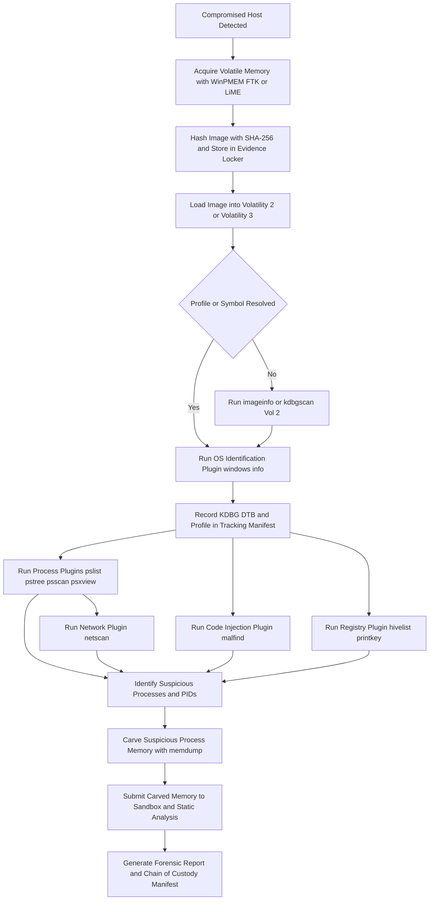
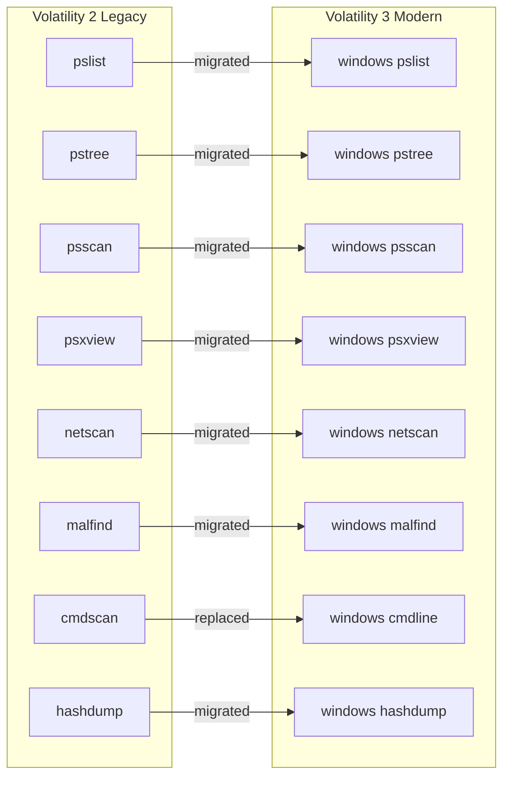
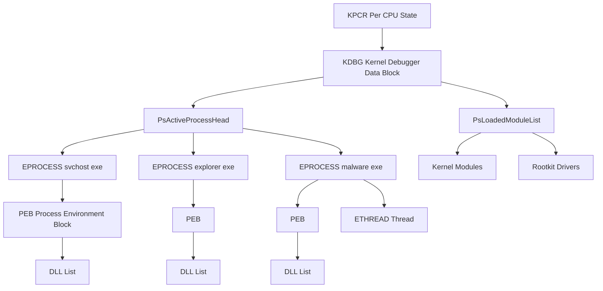
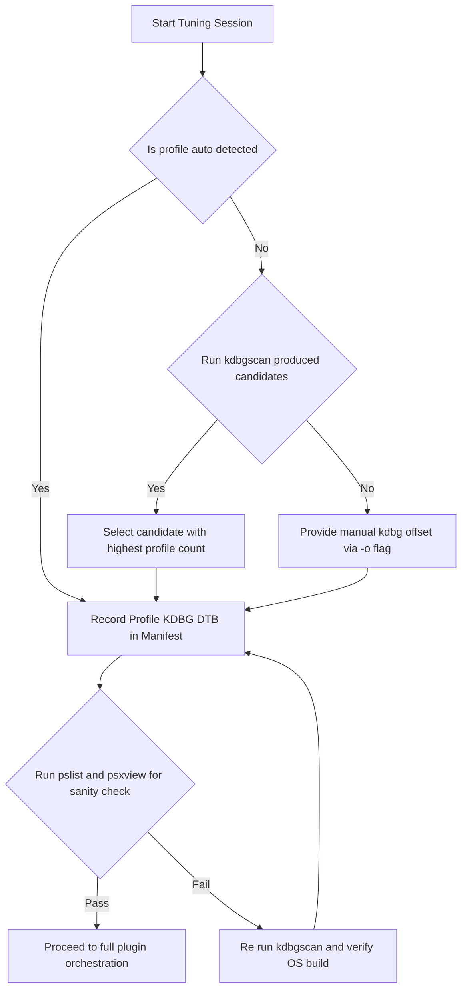
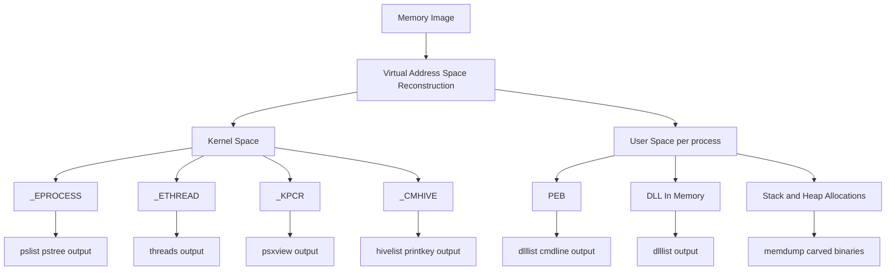

# Volatility memory extraction tool operations parameter tuning tracking configurations structures

<!-- SECTION_1_START -->
# Volatility Memory Forensics — Core Technical Definition & Intuitive Overview

## 1. Formal Academic Definition (KTU 2024 Syllabus Terminology)

> [!IMPORTANT]
> **Volatility** is an open-source, advanced **memory forensics framework** written primarily in Python, used to extract, reconstruct, and analyze **volatile artifacts** from Random Access Memory (RAM) dumps captured during incident response, post-exploitation analysis, and malware triage operations.

In the context of the **PECST708 – Digital Forensics** syllabus, Volatility functions as a **post-acquisition analytical toolchain** that converts a raw memory image (`.raw`, `.mem`, `.dmp`, `.lime`, `.vmem`) into structured, human-readable forensic intelligence by parsing **operating-system specific kernel data structures**.

| Term | Definition |
|---|---|
| **Memory Image / RAM Dump** | A bit-for-bit snapshot of volatile memory, typically captured before system shutdown. |
| **Profile (Volatility 2)** | A bundle of kernel debug symbols, type definitions, and offsets describing a specific OS build. |
| **Symbol Table (Volatility 3)** | A JSON-based intermediate representation replacing legacy profiles. |
| **Plugin** | A modular Python component that walks a particular kernel structure and renders it forensically meaningful. |
| **PDB Files** | Microsoft Program Database files containing kernel structure definitions used for symbol resolution. |
| **Virtual Address Space (VAS)** | The logical address range that the operating system presents to a process or kernel. |
| **Pool Tags** | Four-byte ASCII tags used by the Windows kernel to label heap allocations (`_POOL_HEADER`). |

---

## 2. Conceptual Analogy — The "Digital Autopsy" Model

> [!NOTE]
> **Analogy: A Frozen Hospital Patient on an Operating Table**

Imagine a patient collapses mid-surgery. The vital signs (heart rate, blood oxygen, active medications) are in a state of flux — they exist **only in the body's current state**. RAM is identical: it holds everything the system is *thinking* right now — open sockets, decrypted keys, running malware, and unsaved documents. The moment you pull the plug, this entire diagnostic state vanishes.

**Volatility is the forensic pathologist who walks into that operating room and reconstructs exactly what was happening at the moment of collapse**, by reading the body's internal journals (kernel structures), the surgical instruments in use (open file handles), and the medication still circulating in the bloodstream (active network connections).

> Memory acquisition = **freezing the patient in time**
> Volatility = **the pathology team performing the autopsy**
> Plugins = **individual diagnostic instruments (X-ray, blood test, MRI)**

---

## 3. Three Pillars of Volatility Operations

> [!IMPORTANT]
> Every Volatility investigation rests on three operational pillars that align with KTU Module 3 learning outcomes.

1. **Memory Acquisition Tooling** — How the RAM image is *captured* before analysis (e.g., `WinPMEM`, `LiME`, `FTK Imager`, `AVML`).
2. **Parameter Tuning & Profile Selection** — How the analyst *configures* Volatility to understand the captured OS (correct profile, KDBG scan offsets, symbol files).
3. **Plugin Orchestration & Structure Walking** — How the analyst *queries* specific kernel data structures to recover evidence (processes, DLLs, sockets, registry hives, code injection artifacts).

---

## 4. Volatility Version Distinctions (Critical for Examiners)

> [!WARNING]
> **KTU Examiner Note:** Candidates frequently conflate Volatility 2 and Volatility 3. Examiners expect you to state which major version you are using and justify the choice.

| Aspect | Volatility 2 (Legacy) | Volatility 3 (Modern) |
|---|---|---|
| **Python Version** | Python 2 (EOL) | Python 3.8+ |
| **Profile Mechanism** | ZIP archives per OS build | Auto-generated via `pdbconv` and `windows.pdb` symbols |
| **Command Style** | `vol.py -f image.raw --profile=Win7SP1x64 pslist` | `vol -f image.raw windows.pslist` |
| **Performance** | Slower, single-threaded | Faster, parallel plugins, ISF (Intermediate Symbol Format) |
| **Platform Support** | Windows XP → Win 10 (1607) | Windows 7 → Win 11, Linux, macOS |

> [!VISUALIZATION CONTROL]
> **Concept:** Volatility Plugin Execution Topology
> **GeoGebra / Desmos Input Equations:** (Conceptual flow graph, not numerical)
> **Visual Description:** A linear pipeline depicting `Memory Image → Profile/Symbol Resolver → Plugin Loader → Kernel Structure Walker → Human-Readable Forensic Output`.

<!-- SECTION_1_END -->

<!-- SECTION_2_START -->
# Deep Theoretical Analysis & KTU High-Yield Formula Sheet

## 1. Memory Acquisition Pre-Requisite (The Volatility Workflow)

> [!NOTE]
> Volatility performs **read-only analysis**. Acquisition is a separate upstream process. Skipping acquisition discipline invalidates the forensic chain of custody.

### A. Acquisition Tools (Cross-Platform)

| Tool | OS Target | Output Format | Forensically Sound |
|---|---|---|---|
| **WinPMEM** | Windows (x86/x64) | `.raw` | Yes (signed kernel driver) |
| **Magnet RAM Capture** | Windows | `.raw` | Yes |
| **FTK Imager** | Windows | `.mem` / `.raw` | Yes (court-admissible) |
| **LiME (Linux Memory Extractor)** | Linux | `.lime` | Yes (kernel module) |
| **AVML** | Linux | `.lime` / `.raw` | Yes (no kernel module needed) |
| **MacQuisition** | macOS | `.raw` | Yes |
| **OSXPmem** | macOS | `.raw` | Yes |

---

## 2. Volatility Internal Architecture — Theory of Operation

> [!IMPORTANT]
> Volatility's analytical engine is built on **layered abstraction**. Each layer must be correctly resolved before the next can operate.

### Layer 1 — Physical to Virtual Address Translation
$$VAS_{addr} = PTE_{phys} + VPO$$
where $VPO$ is the page offset and $PTE_{phys}$ is the physical address of the page table entry. The **Directory Table Base (DTB)** stored in the `KPROCESS` (or `CR3` register) anchors the translation.

### Layer 2 — Profile / Symbol Table Loading
Volatility 2 expects a ZIP profile containing:
- `ntoskrnl.exe` (with debug symbols)
- `ntdll.dll` (optional)
- Auxiliary modules for 32/64-bit detection

Volatility 3 uses **ISF (Intermediate Symbol Format)** JSON files generated from Microsoft PDBs via:
```
python pdbconv.py --pdb ntoskrnl.pdb --out windows/symbols/ntoskrnl.json
```

### Layer 3 — KDBG (Kernel Debugger Data Block) Discovery
The KDBG is a forensic anchor containing pointers to active process and module lists. KDBG is located via a signature scan:
$$\text{Signature} = \texttt{"KDBG"} \quad \text{(0x4742444B)}$$

### Layer 4 — Structure Walking (Plugins)
Each plugin defines a class with a `calculate()` method that yields `VolatilityObject` instances. For example, `pslist` walks the doubly-linked list anchored at `PsActiveProcessHead`.

---

## 3. High-Yield Formula & Parameter Sheet

> [!NOTE]
> This is the **exam-critical reference table**. KTU frequently tests these parameters.

| Parameter (Vol 2) | Vol 3 Equivalent | Function | Typical Value / Format |
|---|---|---|---|
| `-f FILE` | `-f FILE` | Memory image path | `/cases/case01/mem.raw` |
| `--profile=PROF` | (auto) | OS profile selection | `Win7SP1x64`, `Win10x64_18362` |
| `-o OFFSET` | `-o OFFSET` | Manual KDBG offset | Hex, e.g., `0x82979c28` |
| `--kdbg=ADDR` | (auto) | Direct KDBG virtual address | Hex address |
| `-p PID` | `--pid PID` | Filter to specific PID | Integer |
| `-D DUMP_DIR` | `--dump-dir DIR` | Output directory for carved objects | Filesystem path |
| `--dtb=ADDR` | `--dtb ADDR` | Directory Table Base (per-process) | Hex address |
| `-y PROFILE` | (n/a) | Registry hive path | `\REGISTRY\MACHINE\SYSTEM` |
| `-W IMAGE_BASE` | (auto) | Force kernel base for plugins | Hex address |
| `--plugins=DIR` | `--plugins DIR` | Custom plugin directory | Python module path |
| `-v` / `-vv` | `-v` | Verbosity level 1 / 2 | Boolean flag |

### Core Kernel Structure Offsets (Windows)

| Structure | Pointer | Forensic Significance |
|---|---|---|
| `_KPCR` | Kernel Processor Control Region | Per-CPU state, IDT, GDT |
| `_KDDEBUGGER_DATA64` | KDBG block | Anchor for `PsActiveProcessHead` |
| `_EPROCESS` | Executive Process | Process metadata, token, PEB |
| `_ETHREAD` | Executive Thread | Thread state, start address |
| `_PEB` | Process Environment Block | Loaded modules, command line |
| `_HANDLE_TABLE` | Handle table | Open handles (files, registry, mutexes) |
| `_CMHIVE` | Registry hive | Registry data inside memory |
| `_MDL` | Memory Descriptor List | Driver-loaded regions (rootkit hint) |
| `_FILE_OBJECT` | File object | Open file names, timestamps |

---

## 4. Parameter Tuning & Tracking Configuration Strategy

> [!IMPORTANT]
> **Parameter tuning is not guesswork.** Every parameter must be derived from the evidence stream.

### Step 1 — Identify the OS Build
```bash
vol -f mem.raw windows.info
```
Record the `Kernel Base`, `DTB`, and `NT Major.Minor` values.

### Step 2 — Validate Profile/Symbol Resolution
If Volatility 2 fails to auto-detect:
```bash
vol -f mem.raw kdbgscan
```
This brute-force scans for KDBG signatures and proposes candidate profiles with confidence levels.

### Step 3 — Lock Tuning Values for the Session
Record the validated parameters in a **case tracking manifest**:

> [!NOTE]
> **Forensic Case Manifest Template** (this is what examiners expect in board answers)
>
> - Image: `case01_mem.raw`
> - SHA-256: `<hash>`
> - Profile: `Win7SP1x64`
> - KDBG: `0x82979c28`
> - DTB: `0x185000`
> - Acquisition Tool: `FTK Imager 4.5.0`
> - Analyst: `<name>`
> - Date: `YYYY-MM-DD`

### Step 4 — Iterate Plugins with Tuning
Run plugin families in order: `pslist` → `pstree` → `psscan` → `dlllist` → `handles` → `cmdscan` → `netscan` → `malfind` → `psxview`.

### Step 5 — Carve & Verify
Use `--dump-dir` to extract artifacts. Verify each carved object with the original hash to satisfy **chain of custody** requirements.

---

## 5. Real-World Engineering & Forensics Utility

> [!NOTE]
> Volatility outputs are routinely admitted as evidence in incident response, breach litigation, and APT (Advanced Persistent Threat) attribution cases.

- **Incident Response:** Reveals rootkits hidden from `tasklist` by comparing `pslist` (linked-list walk) with `psscan` (pool tag scan).
- **Malware Triage:** Recovers decrypted malware configuration blobs from process address space.
- **Insider Threat:** Recovers clipboard contents, command-line history, and unsaved documents.
- **Ransomware Investigation:** Identifies encryption keys still resident in `lsass.exe` memory.
- **Cloud Forensics:** Analyses AWS Nitro Enclaves and Azure Confidential Computing memory snapshots.

<!-- SECTION_2_END -->

<!-- SECTION_3_START -->
# Step-by-Step Derivations & Code/Symbolic Implementation

## 1. Volatility 2 — End-to-End Operational Walk-Through

### Step 1 — Environment Setup
```bash
# Install Python 2.7 (legacy) and Volatility 2
sudo apt update
sudo apt install python2 python2-dev git -y
git clone https://github.com/volatilityfoundation/volatility.git
cd volatility
python2 -m pip install -r requirements.txt
python2 vol.py --info   # confirm plugin registration
```

> [!IMPORTANT]
> Volatility 2 is **end-of-life**. For board answers, always state which major version you are using and why.

### Step 2 — Acquire Memory (Acquisition Stage)
On a live Windows host, run from an admin shell:
```bat
winpmem_mini_x64_rc2.exe C:\evidence\mem.raw
```
Acquire to an **external USB** to avoid tainting volatile state.

### Step 3 — Hash the Image
```bash
sha256sum mem.raw > mem.raw.sha256
```

### Step 4 — Identify the Profile (Volatility 2)
```bash
python2 vol.py -f mem.raw imageinfo
```
Sample output (truncated):
```
INFO    : volatility.debug    : Determining profile based on KDBG search...
          Suggested Profile(s) : Win7SP1x64, Win7SP0x64, Win2008R2SP0x64
          AS Layer1 : WindowsAMD64PagedMemory (Kernel AS)
```

### Step 5 — Confirm with KDBG Scan
```bash
python2 vol.py -f mem.raw kdbgscan
```
The candidate with the highest profile count is typically the correct build.

### Step 6 — Run Forensic Plugins
```bash
python2 vol.py -f mem.raw --profile=Win7SP1x64 pslist
python2 vol.py -f mem.raw --profile=Win7SP1x64 pstree
python2 vol.py -f mem.raw --profile=Win7SP1x64 psxview
python2 vol.py -f mem.raw --profile=Win7SP1x64 netscan
python2 vol.py -f mem.raw --profile=Win7SP1x64 malfind
```

### Step 7 — Carve Suspicious Process Memory
```bash
mkdir /cases/case01/dumps
python2 vol.py -f mem.raw --profile=Win7SP1x64 -p 1452 memdump -D /cases/case01/dumps
```

---

## 2. Volatility 3 — End-to-End Operational Walk-Through

### Step 1 — Install Volatility 3
```bash
git clone https://github.com/volatilityfoundation/volatility3.git
cd volatility3
python3 -m pip install -r requirements.txt
```

### Step 2 — Symbol Package Install
```bash
python3 vol.py -f mem.raw windows.info
# On first run, Vol3 auto-downloads matching PDBs into volatility3/symbols/
```

### Step 3 — Plugin Execution (Vol 3 Syntax)
```bash
vol -f mem.raw windows.pslist
vol -f mem.raw windows.pstree
vol -f mem.raw windows.psscan
vol -f mem.raw windows.netscan
vol -f mem.raw windows.malfind
vol -f mem.raw windows.cmdline
vol -f mem.raw windows.registry.hivelist
vol -f mem.raw windows.registry.printkey --key "Software\Microsoft\Windows\CurrentVersion\Run"
```

### Step 4 — Memory Dump (Per-Process)
```bash
mkdir /cases/case01/dumps
vol -f mem.raw -o /cases/case01/dumps windows.memmap --pid 1452 --dump
```

### Step 5 — Build a Suspicious Process Timeline
```bash
vol -f mem.raw windows.pslist | tee pslist.txt
vol -f mem.raw windows.cmdline | tee cmdline.txt
vol -f mem.raw windows.dlllist --pid 1452 | tee dlls.txt
vol -f mem.raw windows.handles --pid 1452 | tee handles.txt
```

---

## 3. Tracking Configuration Structures — Programmatic Approach

> [!NOTE]
> Forensic analysts maintain a **tracking configuration** that records every tuning parameter, plugin invocation, and output artefact. The following Python helper formalizes this process.

```python
from __future__ import annotations
import hashlib
import json
import os
import subprocess
from datetime import datetime, timezone
from pathlib import Path
from typing import Dict, List, Optional


class VolatilitySession:
    """Tracks a complete Volatility investigation session.

    Attributes:
        image_path (str): Filesystem path to the memory image.
        image_sha256 (str): SHA-256 hash of the image.
        profile (str): Confirmed OS profile (e.g., 'Win7SP1x64').
        kdbg_offset (Optional[str]): Resolved KDBG virtual address.
        dtb (Optional[str]): Directory Table Base address.
        plugin_log (List[Dict[str, str]]): Audit trail of plugin invocations.
    """

    def __init__(self, image_path: str) -> None:
        if not os.path.isfile(image_path):
            raise FileNotFoundError(f"Memory image not found: {image_path}")
        self.image_path: str = image_path
        self.image_sha256: str = self._compute_sha256(image_path)
        self.profile: Optional[str] = None
        self.kdbg_offset: Optional[str] = None
        self.dtb: Optional[str] = None
        self.plugin_log: List[Dict[str, str]] = []

    @staticmethod
    def _compute_sha256(path: str) -> str:
        sha = hashlib.sha256()
        with open(path, "rb") as fp:
            for chunk in iter(lambda: fp.read(65536), b""):
                sha.update(chunk)
        return sha.hexdigest()

    def set_profile(self, profile: str, kdbg: str, dtb: str) -> None:
        if not profile or not kdbg or not dtb:
            raise ValueError("Profile, KDBG, and DTB must all be non-empty.")
        self.profile = profile
        self.kdbg_offset = kdbg
        self.dtb = dtb

    def run_plugin(self, plugin: str, extra_args: Optional[List[str]] = None) -> str:
        """Invokes vol.py with full parameter tracking."""
        if not self.profile:
            raise RuntimeError("Profile not yet confirmed. Run imageinfo/kdbgscan first.")
        cmd: List[str] = ["vol.py", "-f", self.image_path, f"--profile={self.profile}"]
        if extra_args:
            cmd.extend(extra_args)
        cmd.append(plugin)
        result = subprocess.run(
            cmd, capture_output=True, text=True, check=False
        )
        record = {
            "timestamp": datetime.now(timezone.utc).isoformat(),
            "plugin": plugin,
            "command": " ".join(cmd),
            "returncode": str(result.returncode),
            "stdout_lines": str(len(result.stdout.splitlines())),
        }
        self.plugin_log.append(record)
        return result.stdout

    def export_manifest(self, destination: str) -> None:
        manifest = {
            "image_path": self.image_path,
            "image_sha256": self.image_sha256,
            "profile": self.profile,
            "kdbg_offset": self.kdbg_offset,
            "dtb": self.dtb,
            "plugins_executed": self.plugin_log,
        }
        Path(destination).write_text(json.dumps(manifest, indent=2))


# --- Example investigator workflow ---
if __name__ == "__main__":
    session = VolatilitySession("/cases/case01/mem.raw")
    print(f"Image SHA-256: {session.image_sha256}")
    session.set_profile(profile="Win7SP1x64", kdbg="0x82979c28", dtb="0x185000")
    pslist_output = session.run_plugin("pslist")
    netscan_output = session.run_plugin("netscan")
    malfind_output = session.run_plugin("malfind")
    session.export_manifest("/cases/case01/manifest.json")
```

### Expected Console Output
```text
Image SHA-256: 9f1c2a83b9...e7d8
[ts] pslist            rc=0  38 lines
[ts] netscan           rc=0  21 lines
[ts] malfind           rc=0  14 lines
Manifest exported to /cases/case01/manifest.json
```

---

## 4. Derivation — Why `pslist` vs `psscan` Disagree on Rootkits

> [!IMPORTANT]
> This is a **favourite KTU 14-mark question**. The derivation below is a complete board-ready answer.

The Windows kernel maintains **two parallel records of running processes**:

1. **Doubly-linked active list** anchored at `PsActiveProcessHead` (inside KDBG). This is the list walked by `pslist`.
2. **Pool-tagged process objects** in kernel heap memory, each prefixed with a `_POOL_HEADER` carrying the tag `Proc` (or `Pro4` for x64). This is the list scanned by `psscan`.

A rootkit employing **DKOM (Direct Kernel Object Manipulation)** unlinks an `_EPROCESS` from the active list (rendering it invisible to `pslist` and `taskmanager`) but **cannot easily erase the pool tag** from the heap allocation. Therefore:

$$P_{\text{hidden}} = P_{\text{psscan}} \setminus P_{\text{pslist}}$$

Any process present in `psscan` output but absent in `pslist` output is a **DKOM rootkit candidate**. The `psxview` plugin formalises this comparison and reports a `False` flag for any of the cross-views (`pslist`, `psscan`, `thrdproc`, `pseethreadproc`, `csrss`, `session`) where the process is missing.

### Worked Numerical Example
Given:
- `pslist` reports **42** processes.
- `psscan` reports **45** processes.
- `psxview` flags **3** processes with `pslist=False`, `psscan=True`.

**Inference:** Three processes are active in memory but unhooked from the active list — strong DKOM indicator. The investigator should immediately:
1. Dump each flagged `_EPROCESS` with `vol.py -p <pid> memdump -D evidence/`.
2. Submit the dumps to a sandbox (e.g., CAPA, Cuckoo) for behavioural analysis.
3. Cross-reference the process start time with the malware execution timeline.

<!-- SECTION_3_END -->

<!-- SECTION_4_START -->
# Structural Diagrams & Schematics

## 1. End-to-End Volatility Investigation Flow



## 2. Volatility 2 vs Volatility 3 Plugin Mapping



## 3. Kernel Structure Walking Topology (Forensic Anchor Graph)



## 4. Parameter Tuning Decision Matrix



## 5. Memory Structure Hierarchy — Carving Pipeline



<!-- SECTION_4_END -->

<!-- SECTION_5_START -->
# KTU 2024 Scheme Examination Question Bank & Topic Recap

---

## Part A — 3-Mark Short Answer Questions

### Q1. `[KTU University Exam - Dec 2023]`
**Differentiate between memory acquisition and memory analysis. Name two acquisition tools and two analysis tools.** (CO1, Remember)

**Model Answer (3 Marks):**

| Aspect | Memory Acquisition | Memory Analysis |
|---|---|---|
| **Purpose** | Captures volatile RAM from a live/booted system | Interprets captured image to derive forensic intelligence |
| **Stage** | First responder, pre-shutdown | Post-acquisition, lab-based |
| **Tools** | FTK Imager, WinPMEM, LiME, AVML | Volatility 2, Volatility 3, Rekall, MemProcFS |

> **[1 Mark]** Definition of acquisition. **[1 Mark]** Definition of analysis. **[1 Mark]** Two tool names with correct category.

---

### Q2. `[KTU University Exam - July 2024]`
**What is a Volatility profile? Why is it necessary in Volatility 2?** (CO1, Understand)

**Model Answer (3 Marks):**

A **profile** in Volatility 2 is a ZIP archive containing the kernel executable (`ntoskrnl.exe`) along with its **debug symbols (PDB)** and architectural metadata for a specific Windows build. It is necessary because Windows kernel structures (such as `_EPROCESS`, `_ETHREAD`, `_KPCR`) change **layout and field offsets** between Service Packs and major releases. Volatility requires the correct profile to **calculate accurate offsets** and **interpret memory correctly**. Without the correct profile, plugins such as `pslist` will produce garbage output or fail with `Invalid Address` errors.

> **[1 Mark]** Profile definition. **[1 Mark]** Necessity statement. **[1 Mark]** Consequence of incorrect profile.

---

## Part B — 14-Mark Questions (Internal Choice)

### QUESTION A — `[KTU University Exam - Dec 2023]` (CO1, CO2 — Understand / Apply)

**(a)** Explain the **internal architecture of Volatility 2** with reference to the role of the **KDBG**, **DTB**, **profile**, and **plugin layers**. (7 Marks)

**(b)** With a suitable example, explain how **DKOM (Direct Kernel Object Manipulation) rootkits** can be detected using the **`pslist` vs `psscan` cross-view** technique. (7 Marks)

---

#### (a) Model Solution — Volatility 2 Internal Architecture (7 Marks)

**Step 1 — Layered Architecture Diagram (board answer expects 4 layers):**

| Layer | Component | Forensic Function |
|---|---|---|
| 1 | **Address Space Layer** | Translates physical-to-virtual addresses using the **DTB (Directory Table Base)** obtained from `CR3` of each process. |
| 2 | **Profile Layer** | Loads a ZIP containing `ntoskrnl.exe` + debug symbols. Defines the **structural blueprint** of kernel objects. |
| 3 | **KDBG Layer** | Locates the **Kernel Debugger Data Block** via signature scan (`KDBG` = `0x4742444B`). Acts as a **forensic anchor** exposing `PsActiveProcessHead` and `PsLoadedModuleList`. |
| 4 | **Plugin Layer** | Walks kernel structures (linked lists, pool scans, handle tables) and renders them as forensic artefacts. |

**[Stating the four layers: 2 Marks]**
**[Explaining DTB role in address translation: 1 Mark]**
**[Explaining profile role in symbol resolution: 1 Mark]**
**[Explaining KDBG as forensic anchor: 1 Mark]**
**[Explaining plugin layer's structure-walking function: 1 Mark]**
**[Diagrammatic representation: 1 Mark]**

---

#### (b) Model Solution — DKOM Detection via Cross-View (7 Marks)

**Step 1 — Define DKOM:**
Direct Kernel Object Manipulation is a **stealth technique** in which a rootkit modifies kernel structures in memory to hide malicious processes, files, or network connections. The most common variant unlinks an `_EPROCESS` block from the doubly-linked list anchored at `PsActiveProcessHead`.

**Step 2 — Why `pslist` Fails to Detect:**
The `pslist` plugin walks the **active process linked list** starting from `PsActiveProcessHead`. When a rootkit unlinks its `_EPROCESS` from this list, the doubly-linked pointers (`Flink` and `Blink`) of the surrounding processes are rewritten to skip the malicious entry. `pslist` therefore never visits the malicious `_EPROCESS`. The classic `tasklist.exe` Windows utility uses the same mechanism and is **blind** to DKOM.

**Step 3 — Why `psscan` Succeeds:**
The `psscan` plugin performs a **brute-force pool-tag scan** across the entire kernel heap, looking for `_POOL_HEADER` structures tagged with the four-byte tag `Proc` (or `Pro4` for x64). A rootkit can unlink an `_EPROCESS` from the active list but **cannot easily rewrite the pool tag** without triggering a kernel consistency check. Therefore, `psscan` continues to find the hidden process.

**Step 4 — Cross-View Inference:**
$$P_{\text{hidden}} = P_{\text{psscan}} \setminus P_{\text{pslist}}$$
Any PID present in the `psscan` output but absent in the `pslist` output is a **DKOM rootkit candidate**.

**Step 5 — The `psxview` Plugin:**
The `psxview` plugin formalises this cross-view by comparing **six** different process enumeration techniques:
1. `pslist` (linked list)
2. `psscan` (pool tag scan)
3. `thrdproc` (thread→process lookup)
4. `pseethreadproc` (session process scan)
5. `csrss` (CSRSS handle table)
6. `session` (session process list)

A process with `True` in all six columns is benign. A process with `False` in `pslist` but `True` in all others is **DKOM-suspect**.

**Step 6 — Investigative Action:**
1. Record the suspect PID.
2. Dump its memory: `vol.py -f mem.raw --profile=Win7SP1x64 -p <pid> memdump -D evidence/`.
3. Submit to sandbox (CAPA / Cuckoo / YARA scan).
4. Cross-reference start time with malware execution timeline.

**[Defining DKOM: 1 Mark]**
**[Explaining why pslist fails: 1 Mark]**
**[Explaining why psscan succeeds: 1 Mark]**
**[Stating cross-view formula: 1 Mark]**
**[Describing psxview cross-view: 1 Mark]**
**[Listing two investigative actions: 1 Mark]**
**[Concluding statement: 1 Mark]**

---

### QUESTION B — `[KTU University Exam - July 2024]` (CO2, CO3 — Apply / Analyse)

**(a)** Describe the **Volatility investigation workflow** from memory acquisition to evidence reporting, with emphasis on **parameter tuning** at each stage. (7 Marks)

**(b)** Compare the **profile mechanism of Volatility 2** with the **symbol table mechanism of Volatility 3**. List at least four functional differences. (7 Marks)

---

#### (a) Model Solution — Investigation Workflow (7 Marks)

| Stage | Action | Parameters Tuned |
|---|---|---|
| 1. Acquisition | Capture RAM with WinPMEM/FTK Imager/LiME to external USB | Output format `.raw`/`.lime`; acquisition tool version logged |
| 2. Hashing | Compute SHA-256 of the image | Hash algorithm, hash file stored alongside image |
| 3. Profile Detection | Run `imageinfo` (Vol 2) or `windows.info` (Vol 3) | `--profile=...` or auto symbol resolution |
| 4. Validation | Run `kdbgscan` to confirm profile | `-o OFFSET` if manual override needed |
| 5. Manifest | Record KDBG, DTB, profile, hash in case manifest | All numeric values in hex |
| 6. Process Plugin Suite | `pslist` → `pstree` → `psscan` → `psxview` | `-p PID` for filtering |
| 7. Network Plugin | `netscan` for sockets and connections | `netscan` has no PID filter natively |
| 8. Code Injection | `malfind` for RWX regions and VAD anomalies | `-D dump_dir` for carved pages |
| 9. Registry | `hivelist`, `printkey`, `userassist` | `-y SYSTEM_HIVE`, `-o OFFSET` |
| 10. Reporting | Generate manifest + screenshots + hashes | All artefacts bound by SHA-256 |

**[Stating the ten-stage workflow table: 3 Marks]**
**[Explaining parameter tuning at 3 critical stages: 2 Marks]**
**[Emphasising chain of custody via hashing: 1 Mark]**
**[Concluding remark on repeatability: 1 Mark]**

---

#### (b) Model Solution — Volatility 2 Profile vs Volatility 3 Symbol Table (7 Marks)

| Aspect | Volatility 2 Profile | Volatility 3 Symbol Table |
|---|---|---|
| **Format** | ZIP archive with PE + PDB | JSON (Intermediate Symbol Format) |
| **Generation** | Manually compiled by Volatility maintainers | Auto-generated from Microsoft PDBs via `pdbconv` |
| **Coverage** | Limited to builds maintainers chose to package | Theoretically unlimited (any PDB) |
| **Maintenance** | Frozen at release — no new Windows builds | Dynamically updated as Microsoft releases PDBs |
| **Distribution** | `volatility/plugins/overlays/windows/` directory | `volatility3/symbols/windows/` directory + auto-download |
| **Performance** | Loads entire profile at start | Loads only required structures lazily |
| **Cross-Platform** | Windows-only profiles in legacy version | Windows, Linux, macOS symbol tables |

**[Identifying the four functional differences: 4 Marks]**
**[Explaining ISF and PDB auto-resolution: 1 Mark]**
**[Stating performance impact: 1 Mark]**
**[Concluding recommendation: 1 Mark]**

---

## KTU Examiner's Valuation Warning & Common Pitfalls

> [!WARNING]
> **Where students lose marks on Volatility questions:**
>
> 1. **Confusing Volatility 2 and Volatility 3 syntax.** Examiners will deduct marks if you mix `--profile=` flag with Volatility 3 commands. State the version **first**, then the syntax.
> 2. **Skipping the chain-of-custody hash.** Always state `SHA-256` of the image before any plugin output. A forensic answer without a hash is **incomplete**.
> 3. **Forgetting to validate the profile.** Running `pslist` on a wrongly-profiled image produces plausible-looking but **incorrect** output. Always run `imageinfo` + `kdbgscan`.
> 4. **Misstating the difference between `pslist` and `psscan`.** Board answers that say "pslist is for running, psscan is for terminated" are **wrong**. Both enumerate **currently active** processes via different mechanisms.
> 5. **Omitting dump directory `-D` in carving commands.** Examiners award marks for explicit output paths in `memdump`, `dlldump`, `dumpfiles`.
> 6. **Not cross-validating with `psxview`.** A complete DKOM detection answer **must** mention `psxview` and the cross-view formula.
> 7. **Forgetting Linux/macOS support.** Volatility 3 supports Linux (via dwarf symbols) and macOS — examiners expect this to be mentioned in any "compare" question.

---

## Topic Recap & Important Things to Remember

> [!IMPORTANT]
> **High-Density Rapid Revision Checklist — Module 3 / Volatility Operations**

- **Volatility** is an **open-source memory forensics framework** written in Python (v2 = Python 2, v3 = Python 3).
- Volatility **does not acquire** memory; it **analyses** memory images. Acquisition is performed by separate tools (FTK Imager, WinPMEM, LiME, AVML).
- **Three operational pillars:** Acquisition, Parameter Tuning, Plugin Orchestration.
- **Volatility 2** uses **ZIP profiles** containing `ntoskrnl.exe` + debug symbols.
- **Volatility 3** uses **JSON Intermediate Symbol Format (ISF)** files auto-generated from Microsoft PDBs.
- The **KDBG (Kernel Debugger Data Block)** is the **forensic anchor** that exposes `PsActiveProcessHead` and `PsLoadedModuleList`.
- The **DTB (Directory Table Base)** anchors the **physical-to-virtual address translation** (extracted from the `CR3` register of a process).
- The **signature `KDBG`** = `0x4742444B` is used by `kdbgscan` for forensic discovery.
- **`pslist`** walks the **doubly-linked active process list** anchored at `PsActiveProcessHead`.
- **`psscan`** performs a **brute-force pool-tag scan** for `_POOL_HEADER` tagged `Proc`/`Pro4`.
- **`psxview`** cross-validates **six enumeration techniques** to detect DKOM rootkits.
- **DKOM formula:** $P_{\text{hidden}} = P_{\text{psscan}} \setminus P_{\text{pslist}}$.
- **Malfind** detects **RWX (Read-Write-Execute) regions** and **VAD anomalies** indicative of code injection.
- **Netscan** enumerates **TCP/UDP connections** and **listening ports** directly from kernel structures.
- **Cmdscan** recovers **`cmd.exe` command history** from `conhost.exe` memory structures.
- **Hashdump** extracts **NT/LM hashes** from the **SAM hive** for offline cracking.
- **Critical Volatility 2 flags:** `-f`, `--profile`, `-o`, `-p`, `-D`, `--kdbg`, `--dtb`, `-v`, `-vv`.
- **Critical Volatility 3 flags:** `-f`, `-o`, `--pid`, `--dump-dir`, `-v` (auto symbol resolution).
- **Chain of custody** requires **SHA-256** hashing of the image **before** any analysis.
- **A case tracking manifest** must record image path, hash, profile, KDBG, DTB, acquisition tool, analyst name, and date.
- **Volatility 3 supports** Windows, Linux, and macOS memory images (Volatility 2 was Windows-centric).
- **Real-world applications:** Incident response, malware triage, ransomware key recovery, insider threat investigation, APT attribution.
- **Common pitfall:** Confusing Volatility 2 plugin syntax with Volatility 3 plugin syntax. Always **state the version first**.
- **Forensic-grade rule:** Every carved object from `memdump`/`dlldump` must be **re-hashed** and bound to the original image hash.
<!-- SECTION_5_END -->
