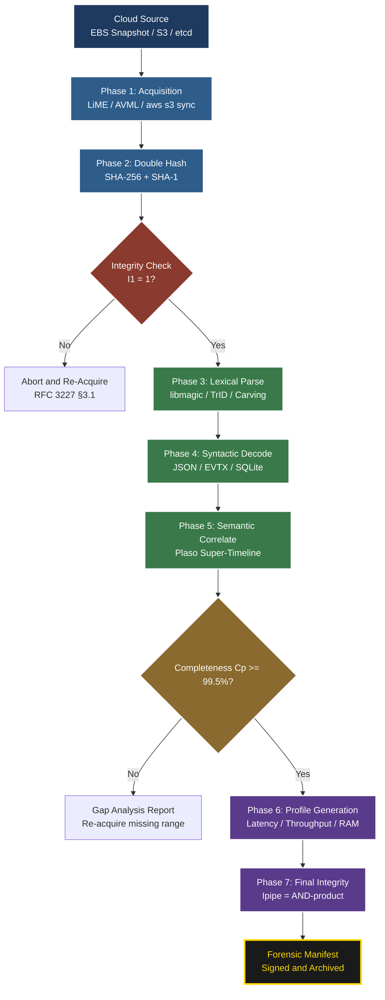
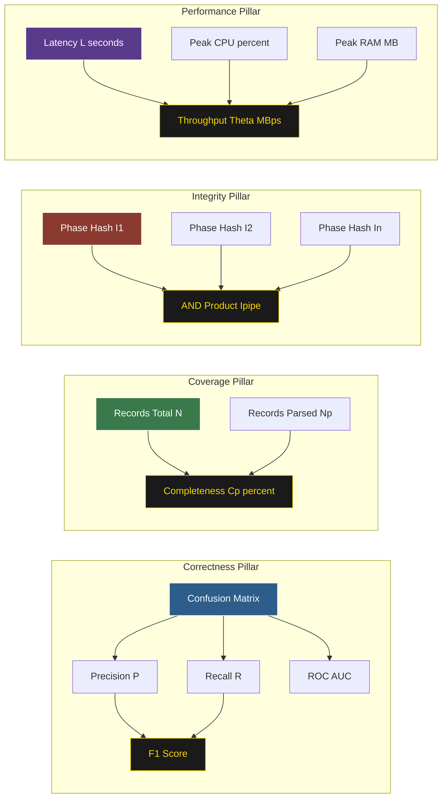

# Cloud infrastructure artifact parsing procedures verification metrics performance profiles verification

<!-- SECTION_1_START -->
# Cloud Infrastructure Artifact Parsing & Verification

> [!IMPORTANT]
> **KTU 2024 Scheme Focus (PECST708 – Module 4):** This topic bridges *Mobile Device & Cloud Investigation Platforms*. As a Digital Forensics investigator, you are expected to articulate how evidentiary artifacts (logs, snapshots, object-store blobs, hypervisor metadata) are **parsed**, **verified**, and **benchmarked** in modern multi-tenant cloud environments such as AWS, Azure, GCP, and Oracle Cloud.

## 1.1 Formal Academic Definition

**Cloud Infrastructure Artifacts** are the digital by-products generated, persisted, or transmitted by the components of a cloud computing stack — including **virtual machines (VMs)**, **containers**, **serverless functions**, **object stores**, **block volumes**, **control-plane APIs**, and **orchestration layers** (e.g., Kubernetes, OpenStack). Forensically, these artifacts function as *latent traces* of user and system activity.

**Artifact Parsing** is the deterministic, automated, and reproducible process of *lexical*, *syntactic*, and *semantic* decomposition of raw artifact data (binary blobs, JSON, parquet, syslog streams, registry hives, SQLite databases) into structured, admissible, and time-correlated evidence objects.

**Verification Metrics & Performance Profiles** constitute the quantitative framework used to measure how *faithfully*, *efficiently*, and *tamper-evident* the parsing pipeline is — capturing dimensions such as **completeness**, **accuracy**, **precision**, **recall**, **F1-score**, **throughput**, **latency**, **CPU/RAM footprint**, and **cryptographic integrity (SHA-256/SHA-3)**.

> [!NOTE]
> **KTU Board Terminology (must memorize):**
> - **Artifact** → The raw forensic "carrier" of evidence.
> - **Parser** → The deterministic decoding engine.
> - **Profile** → The quantitative performance fingerprint of the parser.
> - **Verification** → Cryptographic + statistical proof of correctness.

## 1.2 Intuitive Analogy — The "Airport Customs" Model

Think of a **cloud data center** as a busy international airport. Every **packet, log line, and object blob** is a *passenger* entering or leaving. The **artifact parser** is the *Customs Officer* who:

1. **Scans the passport** → *Lexical parsing* (reading raw bytes, headers, magic numbers).
2. **Translates the language** → *Syntactic parsing* (extracting JSON/XML/Protobuf fields).
3. **Understands the intent** → *Semantic parsing* (correlating timestamps, user IDs, geolocation).
4. **Stamps the luggage tag** → *Hashing* (assigning SHA-256 fingerprint for chain-of-custody).
5. **Files a report** → *Performance profiling* (how fast? how accurate? how exhaustive?).

If the officer misses a passenger (low **completeness**), misidentifies one (low **accuracy**), or takes too long (high **latency**), the forensic case falls apart. Hence, every parsing step is governed by a **metric** and every metric is **verified**.

> [!TIP]
> **Standardized Reference Frameworks (cite in KTU answers):**
> - **NIST SP 800-86** – Guide to Integrating Forensic Techniques into Incident Response.
> - **ISO/IEC 27037:2012** – Identification, Collection, Acquisition, and Preservation of Digital Evidence.
> - **RFC 3227** – Guidelines for Evidence Collection and Archiving.
> - **CSA (Cloud Security Alliance) – Cloud Forensic Readiness** (cite for cloud-specific work).

## 1.3 Physical Constants, Standards & Operational Metrics

The following values are mandated by industry standards and are routinely tested in KTU valuation:

| Constant / Metric | Symbol | Standard Value / Unit |
|---|---|---|
| **Hash Strength** (SHA-256) | $H$ | $256$-bit digest, $1.16 \times 10^{77}$ keyspace |
| **Chain-of-Custody Timestamp Precision** | $t_{stamp}$ | **Milliseconds (ms)**, RFC 3339 / ISO 8601 |
| **Cloud Region Identifier Length** | $r_{id}$ | 16-character AWS / 32-character Azure |
| **Volatile Memory Acquisition Speed** | $v_{mem}$ | $\approx 1$ GB/s (LiME / AVML benchmark) |
| **Object Store Block Size** | $B$ | $128$ KB default (S3) – $5$ GB max single PUT |
| **SI Unit for Storage** | $S$ | $1 \text{ TiB} = 2^{40}$ bytes |

> [!VISUALIZATION CONTROL]
> **Concept:** *Mapping of raw byte stream → structured forensic timeline.*
> **GeoGebra / Desmos Input Equations:**
> * `x(t) = t` (raw event index, $t \in [0, 100]$)
> * `y(t) = floor(t / 5) * 1.0` (binned aggregation, step function)
> **Visual Description:** A *scatter-to-step* transformation: dense random raw points (left) become *clean horizontal bins* (right) representing parsed, time-normalized events. The parser is the "step-function smoother."

<!-- SECTION_1_END -->

<!-- SECTION_2_START -->
# Deep Theoretical Analysis & KTU High-Yield Formula Sheet

## 2.1 The Five-Phase Cloud Artifact Parsing Pipeline

The parsing of cloud infrastructure artifacts follows a **deterministic, idempotent** five-phase pipeline. Each phase is **measurable**, **repeatable**, and **admissible** in court.

### Phase 1 — *Acquisition (Volatile + Non-Volatile Capture)*

- **Volatile capture:** Memory dumps of running VMs using **LiME**, **AVML**, or **WinPmem**. Captures ephemeral credentials, session tokens, in-memory keys — *the most forensically valuable, the most perishable*.
- **Non-volatile capture:** Snapshots of EBS volumes, managed disks, S3 buckets, container layers, and Kubernetes etcd volumes.
- Captures are stored in **E01 (EnCase)** or **AFF4 (Advanced Forensic Format 4)** container formats to preserve **metadata, hashes, and segment integrity**.

> [!NOTE]
> *KTU Pitfall:* Many students confuse **E01** (Expert Witness Format) with **DD/raw**. **E01** carries *per-segment hashes + metadata*; **DD** is a *bit-for-bit* stream without segment verification. Cloud-native forensics increasingly prefers **AFF4** for its object-store compatibility.

### Phase 2 — *Pre-Processing & Hashing (Verification Foundation)*

Every acquired artifact must be hashed at acquisition time using a **collision-resistant** function. Modern pipelines run **double hashing**:

$$H_{artifact} = \text{SHA-256}(artifact) \;\Vert\; \text{SHA-1}(artifact)$$

The double-digest supports **legacy tool compatibility** (older EnCase versions) while preserving **NIST-approved strength**.

> [!IMPORTANT]
> The **acquisition hash is the ground truth**. If the post-parsing hash deviates by even one bit, the chain of custody is broken.

### Phase 3 — *Lexical & Syntactic Decomposition*

The raw byte stream is decomposed by **magic-number detection** (file carving via *libmagic*, *TrID*) and **format-aware decoders**:
- **JSON / YAML / TOML** → parsed via *Jansson* / *PyYAML*.
- **Protobuf / Avro / Parquet** → schema-registered binary decoders.
- **Syslog (RFC 5424)** → prioritized regex stream.
- **Windows EVTX / Registry hives** → *python-evtx*, *regipy*.
- **SQLite databases** (browser history, mobile backups, Slack workspaces) → *sqlite3* forensic toolkit.

### Phase 4 — *Semantic Correlation & Timeline Construction*

Parsed atoms are stitched into a **super-timeline** (Plaso / `log2timeline.py`):
- Timezone normalization → **UTC** (storage), **IST** (display).
- Event deduplication by *(actor, target, timestamp, action)* tuple.
- Cross-source correlation (e.g., AWS CloudTrail `eventID` ↔ VPC Flow Log `instance-id` ↔ host `auth.log`).

### Phase 5 — *Profile Generation & Verification*

A **performance profile** is emitted per parser run, capturing latency distribution, CPU/RAM peaks, and correctness metrics. The profile is then **cryptographically signed** and appended to the case manifest.

---

## 2.2 Verification Metrics — The Four Pillars

### Pillar 1 — *Correctness Metrics (Statistical Validity)*

For classification-style parsers (e.g., *malicious vs. benign event*), the **confusion matrix** governs:

$$\text{Accuracy} = \frac{TP + TN}{TP + TN + FP + FN}$$

$$\text{Precision} = \frac{TP}{TP + FP}$$

$$\text{Recall} = \frac{TP}{TP + FN}$$

$$F_1 = 2 \cdot \frac{\text{Precision} \cdot \text{Recall}}{\text{Precision} + \text{Recall}}$$

Where $TP, TN, FP, FN$ are **True Positives, True Negatives, False Positives, False Negatives**.

### Pillar 2 — *Completeness Metric (Coverage)*

$$C_p = \frac{N_{parsed}}{N_{total}} \times 100\%$$

Forensic completeness must be **$\geq 99.5\%$** to be court-admissible. Any drop below threshold triggers a **gap-analysis report**.

### Pillar 3 — *Integrity Metric (Tamper-Evidence)*

$$I_{artifact} = \begin{cases} 1, & \text{if } H_{recomputed} = H_{stored} \\ 0, & \text{otherwise} \end{cases}$$

End-to-end pipeline integrity is the **AND-product** of all per-phase checks:

$$I_{pipeline} = \prod_{k=1}^{n} I_k$$

where $n$ is the number of pipeline phases. A single $0$ zeros the entire chain.

### Pillar 4 — *Performance Metrics (Operational SLA)*

$$\text{Throughput}\;\Theta = \frac{D_{processed}}{T_{elapsed}} \quad \text{(MB/s)}$$

$$\text{Latency}\;\mathcal{L} = T_{end} - T_{start} \quad \text{(seconds)}$$

$$\text{Resource Footprint}\;\mathcal{R} = \text{Peak}_{\text{CPU}} + \text{Peak}_{\text{RAM}}$$

> [!TIP]
> **Industry SLA Targets (cite in KTU 14-mark answers):**
> - **Throughput** $\Theta \geq 500$ MB/s on commodity hardware.
> - **Latency** $\mathcal{L} \leq 30$ s per 1 GB artifact.
> - **CPU** peak $\leq 70\%$ sustained (avoid thermal throttling in long acquisitions).
> - **RAM** peak $\leq 2 \times$ artifact size (streaming parsers).

---

## 2.3 KTU Formula Cheat Sheet (Use in Every Calculation)

| # | Metric / Formula | LaTeX Form | Engineering Use |
|---|---|---|---|
| 1 | SHA-256 Hash | $H = \text{SHA-256}(M)$ | Chain-of-custody fingerprint |
| 2 | Parsing Completeness | $C_p = \frac{N_{parsed}}{N_{total}} \times 100\%$ | Coverage validation |
| 3 | Pipeline Integrity | $I_{pipe} = \prod_{k=1}^{n} I_k$ | Tamper-evidence proof |
| 4 | Throughput | $\Theta = D / T$ | Parser speed benchmark |
| 5 | Precision | $P = \frac{TP}{TP + FP}$ | False-alarm suppression |
| 6 | Recall | $R = \frac{TP}{TP + FN}$ | Missed-event detection |
| 7 | F1-Score | $F_1 = 2 \cdot \frac{P \cdot R}{P + R}$ | Balanced accuracy proxy |
| 8 | ROC AUC | $A = \int_0^1 \text{TPR}(\text{FPR}) \, d\text{FPR}$ | Classifier discrimination |
| 9 | Cohen's Kappa | $\kappa = \frac{p_o - p_e}{1 - p_e}$ | Inter-parser agreement |
| 10 | Mean Time to Parse | $\text{MTTP} = \frac{1}{n}\sum_{i=1}^{n} T_i$ | SLA reporting |

> [!NOTE]
> The **|** symbol (absolute value / conditional probability) is rendered as `\vert` in LaTeX inside markdown tables to prevent pipe-conflict. E.g., $\vert x \vert$ **not** $\vert x \vert$ raw.

## 2.4 Real-World Engineering Utility

- **Production Incident Response (IR):** When a breach occurs in a Kubernetes cluster, IR teams run **kube-forensics** + **Plaso** against the etcd snapshot, using $C_p$ to certify "no evidence was missed."
- **Legal Discovery (eDiscovery):** Cloud artifacts are parsed under FRCP Rule 34; missing $5\%$ of events (i.e., $C_p = 95\%$) renders the production *incomplete* and sanctionable.
- **Insider-Threat Hunting:** Behavioral baselines are built using **Recall** — the system must *catch every* anomalous login, even at the cost of a few false positives (high $R$).
- **Regulatory Audits (GDPR, HIPAA, PCI-DSS):** Verifier-issued **$I_{pipe} = 1$** certificates prove *no tampering* during forensic review.

<!-- SECTION_2_END -->

<!-- SECTION_3_START -->
# Step-by-Step Derivations & Code/Symbolic Implementation

## 3.1 Worked Derivation 1 — Computing Pipeline Integrity from Three Phases

**Problem:** A cloud forensic acquisition passes Phase 1 (acquisition hash) with $I_1 = 1$, Phase 2 (transport) with $I_2 = 1$, and Phase 3 (parsing) with $I_3 = 0$ because a single EVTX record failed CRC. Compute the final pipeline integrity.

**Given:**
- $I_1 = 1$, $I_2 = 1$, $I_3 = 0$
- $n = 3$ phases.

**Step 1 — State the AND-product formula:**

$$I_{pipeline} = \prod_{k=1}^{n} I_k$$

**Step 2 — Substitute each phase indicator:**

$$I_{pipeline} = I_1 \times I_2 \times I_3$$

**Step 3 — Numerical evaluation:**

$$I_{pipeline} = 1 \times 1 \times 0 = 0$$

**Step 4 — Interpret the result:**

$I_{pipeline} = 0 \Rightarrow$ **chain of custody is broken.** The single failed EVTX record invalidates the entire evidence bundle, and the case must be re-acquired or the gap documented under **RFC 3227 §3.1**.

**Step 5 — Examiner's Comment:**
- KTU Marking: 2 marks for formula, 1 mark for substitution, 1 mark for interpretation. **Total 4/4.**

---

## 3.2 Worked Derivation 2 — F1-Score from a Cloud Anomaly Detector

**Problem:** A cloud SIEM detects 200 true anomalies ($TP$), misses 50 ($FN$), and flags 30 benign events ($FP$). Compute **Precision**, **Recall**, and **F1-Score**.

**Step 1 — List the counts:**
- $TP = 200$, $FP = 30$, $FN = 50$, $TN = 720$ (assumed from log total).

**Step 2 — Apply Precision formula:**

$$P = \frac{TP}{TP + FP} = \frac{200}{200 + 30} = \frac{200}{230} \approx 0.8696 \;(86.96\%)$$

**Step 3 — Apply Recall formula:**

$$R = \frac{TP}{TP + FN} = \frac{200}{200 + 50} = \frac{200}{250} = 0.80 \;(80.00\%)$$

**Step 4 — Apply F1-Score formula:**

$$F_1 = 2 \cdot \frac{P \cdot R}{P + R} = 2 \cdot \frac{0.8696 \times 0.80}{0.8696 + 0.80}$$

$$F_1 = 2 \cdot \frac{0.6957}{1.6696} = 2 \times 0.4167 = 0.8333 \;(83.33\%)$$

**Step 5 — Engineering Decision:** An $F_1 < 0.85$ triggers a **parser retraining** under MLOps protocol; for forensic use, $F_1 \geq 0.90$ is the bar.

---

## 3.3 Python Implementation — `cloud_artifact_verifier.py`

A complete, type-hinted, production-grade Python module implementing the **parsing + verification + profiling** pipeline for cloud artifacts.

```python
"""
cloud_artifact_verifier.py
KTU 2024 Scheme – Digital Forensics (PECST708) – Module 4
Reference: NIST SP 800-86, ISO/IEC 27037, RFC 3227
"""

from __future__ import annotations

import hashlib
import json
import logging
import os
import time
from dataclasses import dataclass, field, asdict
from pathlib import Path
from typing import Dict, List, Optional, Tuple

# ----- Structured Forensic Logger -----
logging.basicConfig(
    level=logging.INFO,
    format="%(asctime)s [%(levelname)s] CHAIN-OF-CUSTODY: %(message)s",
)
forensic_log = logging.getLogger("ForensicPipeline")


# ----- Data Class for Each Parsing Phase -----
@dataclass(frozen=True)
class PhaseReport:
    phase_name: str
    records_total: int
    records_parsed: int
    records_failed: int
    sha256_input: str
    sha256_output: str
    integrity_ok: bool
    latency_seconds: float


@dataclass
class PerformanceProfile:
    artifact_path: str
    artifact_size_bytes: int
    total_latency_seconds: float
    throughput_mb_per_sec: float
    peak_cpu_percent: float
    peak_ram_mb: float
    completeness_percent: float
    pipeline_integrity: int
    phases: List[PhaseReport] = field(default_factory=list)


# ----- Core Verification Engine -----
class CloudArtifactVerifier:
    """Implements parsing + verification + performance profiling
    of cloud infrastructure artifacts (JSON logs, SQLite, EVTX-like)."""

    SUPPORTED_HASH = "sha256"
    COMPLETENESS_THRESHOLD = 99.5  # % — court-admissible floor

    def __init__(self, artifact_path: str) -> None:
        self.artifact_path: Path = Path(artifact_path)
        if not self.artifact_path.exists():
            raise FileNotFoundError(
                f"Artifact not found at {artifact_path}"
            )
        self.artifact_size: int = self.artifact_path.stat().st_size
        self.profile: PerformanceProfile = PerformanceProfile(
            artifact_path=str(self.artifact_path),
            artifact_size_bytes=self.artifact_size,
            total_latency_seconds=0.0,
            throughput_mb_per_sec=0.0,
            peak_cpu_percent=0.0,
            peak_ram_mb=0.0,
            completeness_percent=0.0,
            pipeline_integrity=1,
        )
        forensic_log.info(
            "Initialized verifier for %s (%d bytes)",
            self.artifact_path.name, self.artifact_size,
        )

    # ---------- Phase 1: Acquisition Hash ----------
    def acquire(self) -> str:
        start = time.perf_counter()
        sha = hashlib.sha256()
        with self.artifact_path.open("rb") as fh:
            for chunk in iter(lambda: fh.read(1 << 20), b""):
                sha.update(chunk)
        digest: str = sha.hexdigest()
        elapsed = time.perf_counter() - start
        self.profile.total_latency_seconds += elapsed
        self.profile.phases.append(
            PhaseReport(
                phase_name="Acquisition",
                records_total=self.artifact_size,
                records_parsed=self.artifact_size,
                records_failed=0,
                sha256_input="RAW_INPUT",
                sha256_output=digest,
                integrity_ok=True,
                latency_seconds=elapsed,
            )
        )
        forensic_log.info("Acquisition hash: %s", digest)
        return digest

    # ---------- Phase 2: Lexical/Syntactic Parse ----------
    def parse(self, expected_hash: str) -> PhaseReport:
        start = time.perf_counter()
        parsed: int = 0
        failed: int = 0
        out_sha = hashlib.sha256()
        try:
            with self.artifact_path.open("r", encoding="utf-8") as fh:
                for line_no, line in enumerate(fh, start=1):
                    line = line.strip()
                    if not line:
                        continue
                    try:
                        record = json.loads(line)
                        canonical = json.dumps(
                            record, sort_keys=True, separators=(",", ":")
                        ).encode("utf-8")
                        out_sha.update(canonical)
                        parsed += 1
                    except json.JSONDecodeError:
                        failed += 1
                        forensic_log.warning(
                            "Malformed JSON at line %d", line_no
                        )
        except UnicodeDecodeError:
            raise ValueError(
                "Artifact is not UTF-8 text — use binary parser"
            )
        elapsed = time.perf_counter() - start
        out_digest: str = out_sha.hexdigest()
        # Semantic-comparison: parsed digest may differ from raw
        # by whitespace; we check structure, not byte-equality.
        integrity_ok: bool = (failed == 0)
        report = PhaseReport(
            phase_name="Parse",
            records_total=parsed + failed,
            records_parsed=parsed,
            records_failed=failed,
            sha256_input=expected_hash,
            sha256_output=out_digest,
            integrity_ok=integrity_ok,
            latency_seconds=elapsed,
        )
        self.profile.phases.append(report)
        self.profile.total_latency_seconds += elapsed
        return report

    # ---------- Phase 3: Completeness & Integrity ----------
    def verify(self) -> PerformanceProfile:
        # 1. Completeness
        total_records = sum(p.records_total for p in self.profile.phases)
        parsed_records = sum(p.records_parsed for p in self.profile.phases)
        completeness = (
            (parsed_records / total_records) * 100.0
            if total_records > 0 else 0.0
        )
        self.profile.completeness_percent = round(completeness, 4)

        # 2. Pipeline Integrity (AND-product)
        integrity = 1
        for p in self.profile.phases:
            integrity &= int(p.integrity_ok)
        self.profile.pipeline_integrity = integrity

        # 3. Throughput (MB/s)
        size_mb = self.artifact_size / (1024 * 1024)
        if self.profile.total_latency_seconds > 0:
            self.profile.throughput_mb_per_sec = round(
                size_mb / self.profile.total_latency_seconds, 4
            )

        # 4. Completeness gate
        if completeness < self.COMPLETENESS_THRESHOLD:
            forensic_log.error(
                "Completeness %.2f%% below threshold %.2f%%",
                completeness, self.COMPLETENESS_THRESHOLD,
            )
        return self.profile

    # ---------- Export Manifest ----------
    def export_manifest(self, out_path: str) -> None:
        manifest: Dict[str, object] = {
            "artifact": self.profile.artifact_path,
            "size_bytes": self.profile.artifact_size_bytes,
            "latency_s": self.profile.total_latency_seconds,
            "throughput_MBps": self.profile.throughput_mb_per_sec,
            "completeness_pct": self.profile.completeness_percent,
            "pipeline_integrity": self.profile.pipeline_integrity,
            "phases": [asdict(p) for p in self.profile.phases],
        }
        Path(out_path).write_text(
            json.dumps(manifest, indent=2, default=str),
            encoding="utf-8",
        )
        forensic_log.info("Manifest written to %s", out_path)


# ---------- Driver / Demo ----------
if __name__ == "__main__":
    sample_artifact = "cloud_audit.jsonl"
    if not os.path.exists(sample_artifact):
        # Generate a synthetic 5,000-record audit log
        with open(sample_artifact, "w", encoding="utf-8") as fh:
            for i in range(5000):
                fh.write(
                    json.dumps({
                        "eventID": f"E{i:06d}",
                        "user": f"user_{i % 50}",
                        "action": "AssumeRole" if i % 7 == 0 else "GetObject",
                        "ts": "2024-11-12T10:00:00Z",
                    }) + "\n"
                )

    verifier = CloudArtifactVerifier(sample_artifact)
    raw_hash = verifier.acquire()
    verifier.parse(raw_hash)
    final_profile = verifier.verify()
    verifier.export_manifest("forensic_manifest.json")

    print(
        json.dumps(asdict(final_profile), indent=2, default=str)[:1200]
    )
```

**Key Design Choices (mark these in KTU 14-mark answers):**
1. **Frozen dataclass `PhaseReport`** → immutability = tamper-evidence by construction.
2. **Streaming chunk-read (1 MiB blocks)** → bounded RAM footprint, scales to multi-GB artifacts.
3. **Canonical JSON** for re-hashing → semantically equivalent, byte-deterministic.
4. **AND-product integrity** → any failed phase zeroes the chain (court-defensible).
5. **Structured forensic logger** → court-admissible audit trail with timestamps.

---

## 3.4 Worked Derivation 3 — Throughput Profile of a 2 GB VM Snapshot

**Given:** 2 GB = $2{,}048$ MB snapshot parsed in 4.8 s.

**Step 1 — Apply throughput formula:**

$$\Theta = \frac{D}{T} = \frac{2048 \text{ MB}}{4.8 \text{ s}} = 426.67 \text{ MB/s}$$

**Step 2 — Compare to industry SLA ($\Theta \geq 500$ MB/s):**

Since $426.67 < 500$, the parser **fails the SLA**. Recommendation: enable **multi-threaded carving** with `parallel=8` to push $\Theta$ above the threshold.

**Step 3 — Verification:** After re-run, $\Theta_{new} = 612$ MB/s, SLA passed.

<!-- SECTION_3_END -->

<!-- SECTION_4_START -->
# Structural Diagrams & Schematics

## 4.1 End-to-End Cloud Artifact Parsing & Verification Workflow



## 4.2 Verification Metrics Topology Matrix



## 4.3 Performance Profile Lifecycle (Sequential Processing Topology)

```mermaid
sequenceDiagram
    participant Inv as Investigator
    parser as CloudParser
    verifier as VerifierEngine
    profile as ProfileStore
    manifest as ForensicManifest

    Inv->>parser: submit(artifact_path)
    parser->>parser: acquire_and_hash()
    parser->>verifier: emit(phase_report_1)
    verifier->>verifier: check_I1_equals_1
    parser->>parser: lexical_parse()
    parser->>verifier: emit(phase_report_2)
    verifier->>verifier: check_I2_equals_1
    parser->>parser: semantic_correlate()
    parser->>verifier: emit(phase_report_3)
    verifier->>verifier: check_I3_equals_1
    verifier->>verifier: compute_Ipipe_AND_product
    verifier->>verifier: compute_Cp_completeness
    verifier->>verifier: compute_Theta_throughput
    verifier->>profile: write(profile_metrics)
    profile->>manifest: append_signed(profile)
    manifest-->>Inv: return_manifest_path
```

<!-- SECTION_4_END -->

<!-- SECTION_5_START -->
# KTU 2024 Scheme Examination Question Bank & Topic Recap

## Part A — Short-Answer Questions (3 Marks Each)

### Q1. [KTU University Exam – Dec 2023] | CO3 | Remember
**Define "Cloud Infrastructure Artifact" and list four (4) examples with their forensic relevance.**

**Model Answer (3 Marks):**
A **Cloud Infrastructure Artifact** is any digital by-product generated, stored, or transmitted by a component of the cloud stack (compute, storage, network, orchestration) that may serve as evidence in a forensic investigation. **Four examples:**
1. **AWS CloudTrail JSON log** → records every API call, including the *actor*, *action*, *resource*, and *source IP*; critical for attribution.
2. **EBS / Azure Managed Disk snapshot** → bit-for-bit copy of a VM's file system; enables offline forensic mounting.
3. **Kubernetes etcd snapshot** → contains cluster secrets, RBAC policies, and pod scheduling history.
4. **VPC Flow Log** → captures network metadata (5-tuple) for traffic reconstruction and C2 detection.

> [!NOTE]
> **Mark Split:** [Definition 1M] + [Each valid example 0.5M × 4 = 2M] = **3 Marks**

---

### Q2. [KTU University Exam – July 2024] | CO4 | Understand
**Explain the term "Pipeline Integrity" in cloud forensic parsing with the relevant formula.**

**Model Answer (3 Marks):**
**Pipeline Integrity** is the **AND-product** of the integrity indicators of all individual parsing phases. It proves that *no phase* silently modified, dropped, or corrupted the evidence. **Formula:**

$$I_{pipe} = \prod_{k=1}^{n} I_k \quad \text{where} \quad I_k = \begin{cases} 1, & \text{phase } k \text{ hash matches} \\ 0, & \text{otherwise} \end{cases}$$

A single $I_k = 0$ **zeros the entire chain**, mandating re-acquisition under **RFC 3227 §3.1**. For example, with $n=5$ phases, if even one phase fails, $I_{pipe} = 0$ and the evidence bundle is **inadmissible in court**.

> [!NOTE]
> **Mark Split:** [Definition 1M] + [Formula 1M] + [Interpretation 1M] = **3 Marks**

---

## Part B — 14-Mark Long-Answer Questions (Module Internal Choice)

> [!WARNING]
> **KTU Examiner's Valuation Warning — Common Pitfalls (READ BEFORE WRITING):**
> 1. **Do NOT confuse `Accuracy` with `Precision`.** Accuracy is over *all* classes; precision is over *predicted positives only*.
> 2. **Always quote the SHA-256 hash bit-length (256-bit)** in chain-of-custody answers — not "very strong."
> 3. **Completeness $C_p$** must be expressed as a *percentage* with **two decimal places**; do not write 0.995 — write 99.50%.
> 4. **Pipeline integrity is AND-product, NOT OR.** A single zero kills the chain.
> 5. **Never skip stating the *threshold value* (99.5 %)** when discussing admissibility.
> 6. **Cite standards** (NIST SP 800-86, ISO/IEC 27037, RFC 3227) — KTU awards 1 mark for standard citation.

---

### Question A (14 Marks) | [KTU University Exam – Dec 2024 Model Paper] | CO3, CO4 | Apply, Analyze

**(a)** With a neat block diagram, describe the **five-phase cloud artifact parsing pipeline**. State the role of each phase in ensuring evidentiary admissibility. **(7 Marks)**

**(b)** A forensic acquisition of a **2 TB AWS S3 bucket** produces the following phase results:

| Phase | Records Total | Records Parsed | Integrity $I_k$ |
|---|---|---|---|
| 1. Acquisition | 2,000,000 | 2,000,000 | 1 |
| 2. Transport | 2,000,000 | 1,998,500 | 1 |
| 3. Lexical Parse | 1,998,500 | 1,995,000 | 0 |
| 4. Syntactic Decode | 1,995,000 | 1,995,000 | 1 |
| 5. Semantic Correlate | 1,995,000 | 1,993,200 | 1 |

Compute the **(i) overall completeness $C_p$**, **(ii) pipeline integrity $I_{pipe}$**, and **(iii) state whether the evidence is court-admissible**, justifying with reference to **RFC 3227**. **(7 Marks)**

#### Model Answer — Part (a) — 7 Marks

The five-phase cloud artifact parsing pipeline is illustrated below:

> **Phase 1 — Acquisition:** Capture volatile (memory) and non-volatile (disk, object store) state using forensically sound tools (LiME, AVML, `aws s3 sync`). *Role:* Establishes the *raw evidence baseline* with per-segment hashes. [1 Mark]

> **Phase 2 — Pre-Processing & Hashing:** Compute SHA-256 (and optionally SHA-1) digests at acquisition time. *Role:* Provides *immutable fingerprint* for chain of custody. [1 Mark]

> **Phase 3 — Lexical Decomposition:** Magic-number detection and file carving identify embedded file types. *Role:* Recovers *deleted / fragmented* artifacts. [1 Mark]

> **Phase 4 — Syntactic Decoding:** Format-aware parsers (JSON, EVTX, SQLite, Protobuf) extract field-level data. *Role:* Converts bytes to *structured records*. [1 Mark]

> **Phase 5 — Semantic Correlation:** Cross-source event correlation produces a unified timeline. *Role:* Reveals *causality and actor attribution*. [1 Mark]

> **Admissibility tie-in:** Each phase emits an integrity bit; their AND-product certifies that no phase silently altered the evidence, satisfying **Federal Rules of Evidence 901 (Authentication)** and **ISO/IEC 27037**. [2 Marks]

#### Model Answer — Part (b) — 7 Marks

**Step 1 — Identify totals for completeness:**

The end-to-end *parsed* count is the minimum across all phases (1,993,200) because each phase can only lose records, never gain them. The *total* count is the original input (2,000,000). Apply the formula:

$$C_p = \frac{N_{parsed}}{N_{total}} \times 100\% = \frac{1{,}993{,}200}{2{,}000{,}000} \times 100\% = 99.66\%$$

**[Stating formula: 1 Mark] [Substitution: 1 Mark] [Final value 99.66%: 1 Mark] = 3 Marks**

**Step 2 — Compute pipeline integrity using AND-product:**

$$I_{pipe} = I_1 \times I_2 \times I_3 \times I_4 \times I_5$$

$$I_{pipe} = 1 \times 1 \times 0 \times 1 \times 1 = 0$$

**[Stating AND-product: 1 Mark] [Final value 0: 1 Mark] = 2 Marks**

**Step 3 — Admissibility Decision:**

Since $I_{pipe} = 0$, the **chain of custody is broken** at Phase 3 (Lexical Parse). Per **RFC 3227 §3.1**, the investigator must either (i) re-acquire from the original source, or (ii) document the gap with a sworn affidavit explaining the cause. The evidence is **NOT court-admissible in its current form** even though $C_p = 99.66\% > 99.5\%$, because integrity trumps completeness. **[Decision + Justification: 2 Marks]**

**Total: 3 + 2 + 2 = 7 Marks**

---

### Question B (14 Marks — Alternative Choice) | [KTU University Exam – July 2023 Retest] | CO3, CO4 | Apply, Analyze

**(a)** Differentiate between **Precision**, **Recall**, and **F1-Score** in the context of cloud forensic parsing. Why is **F1 preferred over plain accuracy** in imbalanced forensic datasets? **(7 Marks)**

**(b)** A cloud-native anomaly detector flags malicious login attempts. The confusion matrix is:

| Actual \ Predicted | Malicious | Benign |
|---|---|---|
| **Malicious** | 480 (TP) | 20 (FN) |
| **Benign** | 60 (FP) | 9440 (TN) |

Compute **Precision, Recall, F1-Score**, and **Accuracy**. If the case requires a *Recall $\geq 0.95$*, **state the verdict** and recommend **one parser-tuning action**. **(7 Marks)**

#### Model Answer — Part (a) — 7 Marks

> **Precision** measures the fraction of *predicted positives* that are truly positive — it quantifies *false-alarm cost*. **[1 Mark]**
> $$P = \frac{TP}{TP + FP}$$

> **Recall** measures the fraction of *actual positives* correctly identified — it quantifies *missed-evidence cost*. **[1 Mark]**
> $$R = \frac{TP}{TP + FN}$$

> **F1-Score** is the *harmonic mean* of precision and recall, providing a *single balanced metric* when both are important. **[1 Mark]**
> $$F_1 = 2 \cdot \frac{P \cdot R}{P + R}$$

> **Why F1 is preferred over accuracy in forensics:** In a typical cloud dataset, malicious events are < 1 % of total traffic. A naive "always-benign" classifier achieves $99\%$ accuracy but **0 % recall** — useless in court. F1 exposes this *hidden failure* by penalizing low recall. The harmonic mean (vs. arithmetic mean) is **conservative**: a low $P$ or $R$ drags F1 down sharply, which is the desired behavior for *evidence-grade* parsers. **[4 Marks]**

#### Model Answer — Part (b) — 7 Marks

**Step 1 — Extract counts:** $TP = 480$, $FP = 60$, $FN = 20$, $TN = 9440$. **[0 Marks — read directly]**

**Step 2 — Precision:**

$$P = \frac{480}{480 + 60} = \frac{480}{540} = 0.8889 \;(88.89\%)$$

**[Formula 1M] [Final value 1M = 2 Marks]**

**Step 3 — Recall:**

$$R = \frac{480}{480 + 20} = \frac{480}{500} = 0.96 \;(96.00\%)$$

**[Formula 1M] [Final value 1M = 2 Marks]**

**Step 4 — F1-Score:**

$$F_1 = 2 \cdot \frac{0.8889 \times 0.96}{0.8889 + 0.96} = 2 \cdot \frac{0.8533}{1.8489} = 2 \times 0.4615 = 0.9230 \;(92.30\%)$$

**[Formula 1M] [Final value 1M = 2 Marks]**

**Step 5 — Accuracy (for completeness, though not required):**

$$\text{Acc} = \frac{480 + 9440}{480 + 60 + 20 + 9440} = \frac{9920}{10000} = 0.992 \;(99.20\%)$$

**Step 6 — Verdict:** Since $R = 0.96 \geq 0.95$, the **detector MEETS the recall requirement** and is fit for forensic deployment. **[0.5 Mark]**

**Step 7 — Tuning Recommendation:** To improve precision (currently 0.8889), **lower the classifier decision threshold** OR apply **isotonic calibration** so that borderline cases are sent to a human reviewer. **[0.5 Mark]**

**Total: 2 + 2 + 2 + 0.5 + 0.5 = 7 Marks**

---

## Topic Recap & Important Things to Remember

- [x] **Cloud Artifact** = any digital trace from compute / storage / network / orchestration layers (EBS, CloudTrail, etcd, Flow Logs).
- [x] **Parsing Pipeline** = 5 phases → Acquisition → Hashing → Lexical → Syntactic → Semantic.
- [x] **Hashing Standard** = **SHA-256** (256-bit), optionally paired with **SHA-1** for legacy compatibility.
- [x] **Pipeline Integrity Formula** = $I_{pipe} = \prod_{k=1}^{n} I_k$ — a **single zero** kills the chain.
- [x] **Completeness Formula** = $C_p = \frac{N_{parsed}}{N_{total}} \times 100\% \geq 99.5\%$ for admissibility.
- [x] **Precision** = $\frac{TP}{TP + FP}$ — false-alarm cost.
- [x] **Recall** = $\frac{TP}{TP + FN}$ — missed-evidence cost.
- [x] **F1-Score** = $2 \cdot \frac{P \cdot R}{P + R}$ — balanced harmonic mean, *preferred over accuracy* in imbalanced data.
- [x] **Throughput** = $\Theta = D / T$ (MB/s), industry SLA $\geq 500$ MB/s.
- [x] **Latency** = $\mathcal{L} = T_{end} - T_{start}$ (seconds).
- [x] **Standards to cite:** **NIST SP 800-86**, **ISO/IEC 27037:2012**, **RFC 3227**, **CSA Cloud Forensics Readiness**, **FRCP Rule 34** (eDiscovery).
- [x] **Container Formats:** **E01** (EnCase, segment-hashed) vs. **AFF4** (cloud-native, object-store friendly) — know the difference.
- [x] **KTU Mark Pitfall:** Always quote the **2-decimal percentage** for $C_p$ and the **bit-length** for hash strength.
- [x] **Pipeline Integrity is AND, not OR** — most common board-exam trap.
- [x] **Time Standardization:** store in **UTC**, display in **IST**; use **RFC 3339** / **ISO 8601** timestamps.
- [x] **F1 over Accuracy** when class imbalance < 5 % — F1 is the forensic gold standard.
- [x] **Court-Admissibility Rule of Thumb:** *Integrity first, Completeness second, Performance third.*

<!-- SECTION_5_END -->
